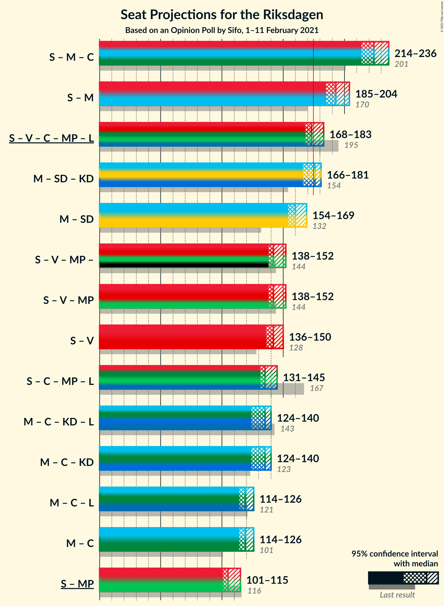
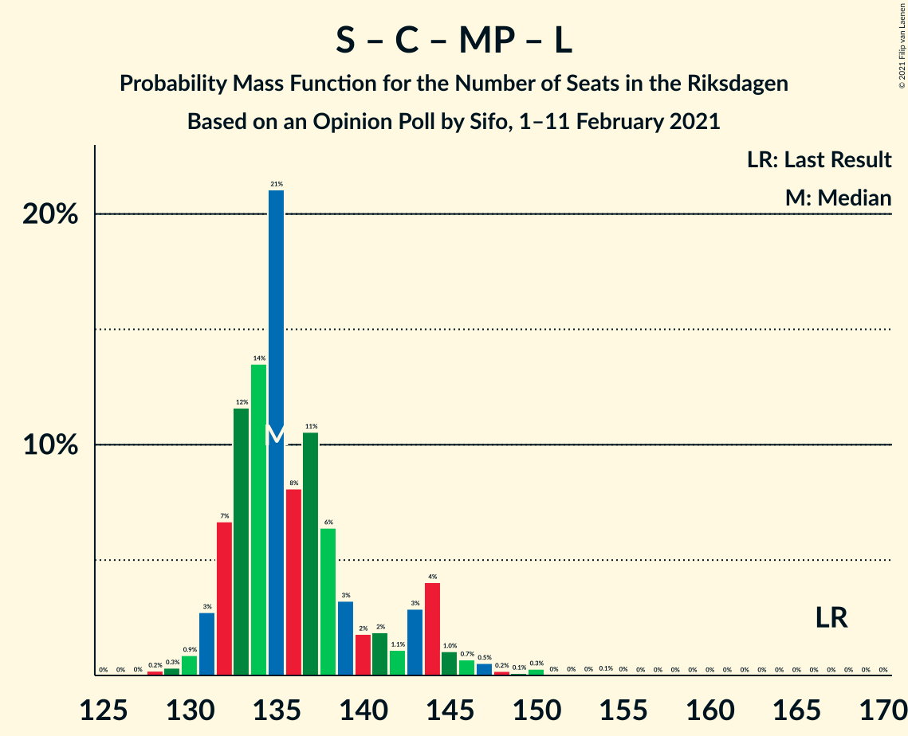

# Opinion Poll by Sifo, 1–11 February 2021

<a href="#voting-intentions">Voting Intentions</a> | <a href="#seats">Seats</a> | <a href="#coalitions">Coalitions</a> | <a href="#technical-information">Technical Information</a>

## Voting Intentions

### Confidence Intervals

| Party | Last Result | Poll Result | 80% Confidence Interval | 90% Confidence Interval | 95% Confidence Interval | 99% Confidence Interval |
|:-----:|:-----------:|:-----------:|:-----------------------:|:-----------------------:|:-----------------------:|:-----------------------:|
| Sveriges socialdemokratiska arbetareparti | 28.3% | 27.6% | 26.9–28.3% |26.7–28.5% |26.5–28.7% |26.2–29.0% |
| Moderata samlingspartiet | 19.8% | 23.5% | 22.8–24.2% |22.6–24.4% |22.5–24.5% |22.2–24.9% |
| Sverigedemokraterna | 17.5% | 18.8% | 18.2–19.4% |18.0–19.6% |17.9–19.8% |17.6–20.1% |
| Vänsterpartiet | 8.0% | 10.0% | 9.5–10.5% |9.4–10.6% |9.3–10.7% |9.1–11.0% |
| Centerpartiet | 8.6% | 8.1% | 7.7–8.6% |7.6–8.7% |7.5–8.8% |7.3–9.0% |
| Kristdemokraterna | 6.3% | 4.3% | 4.0–4.6% |3.9–4.7% |3.8–4.8% |3.7–5.0% |
| Miljöpartiet de gröna | 4.4% | 3.6% | 3.3–3.9% |3.2–4.0% |3.2–4.1% |3.0–4.2% |
| Liberalerna | 5.5% | 2.8% | 2.6–3.1% |2.5–3.2% |2.4–3.2% |2.3–3.4% |

*Note:* The poll result column reflects the actual value used in the calculations. Published results may vary slightly, and in addition be rounded to fewer digits.

## Seats

### Confidence Intervals

| Party | Last Result | Median | 80% Confidence Interval | 90% Confidence Interval | 95% Confidence Interval | 99% Confidence Interval |
|:-----:|:-----------:|:------:|:-----------------------:|:-----------------------:|:-----------------------:|:-----------------------:|
| <a href="#sveriges-socialdemokratiska-arbetareparti">Sveriges socialdemokratiska arbetareparti</a> | 100 | 105 | 102–108 |100–111 |100–112 |98–113 |
| <a href="#moderata-samlingspartiet">Moderata samlingspartiet</a> | 70 | 89 | 86–92 |85–93 |85–94 |82–96 |
| <a href="#sverigedemokraterna">Sverigedemokraterna</a> | 62 | 72 | 68–75 |68–75 |67–76 |66–77 |
| <a href="#vänsterpartiet">Vänsterpartiet</a> | 28 | 38 | 36–40 |36–40 |35–41 |34–43 |
| <a href="#centerpartiet">Centerpartiet</a> | 31 | 31 | 29–33 |28–33 |28–33 |27–34 |
| <a href="#kristdemokraterna">Kristdemokraterna</a> | 22 | 16 | 0–17 |0–18 |0–18 |0–19 |
| <a href="#miljöpartiet-de-gröna">Miljöpartiet de gröna</a> | 16 | 0 | 0 |0 |0–15 |0–15 |
| <a href="#liberalerna">Liberalerna</a> | 20 | 0 | 0 |0 |0 |0 |

### Sveriges socialdemokratiska arbetareparti

*For a full overview of the results for this party, see the [Sveriges socialdemokratiska arbetareparti](party-sverigessocialdemokratiskaarbetareparti.html) page.*

| Number of Seats | Probability | Accumulated | Special Marks |
|:---------------:|:-----------:|:-----------:|:-------------:|
| 96 | 0.1% | 100% |  |
| 97 | 0.3% | 99.9% |  |
| 98 | 0.8% | 99.6% |  |
| 99 | 1.0% | 98.7% |  |
| 100 | 3% | 98% | Last Result |
| 101 | 5% | 95% |  |
| 102 | 11% | 90% |  |
| 103 | 12% | 79% |  |
| 104 | 16% | 67% |  |
| 105 | 18% | 51% | Median |
| 106 | 10% | 33% |  |
| 107 | 8% | 23% |  |
| 108 | 5% | 14% |  |
| 109 | 2% | 10% |  |
| 110 | 2% | 8% |  |
| 111 | 3% | 5% |  |
| 112 | 2% | 3% |  |
| 113 | 0.3% | 0.6% |  |
| 114 | 0.3% | 0.3% |  |
| 115 | 0% | 0.1% |  |
| 116 | 0% | 0% |  |

### Moderata samlingspartiet

*For a full overview of the results for this party, see the [Moderata samlingspartiet](party-moderatasamlingspartiet.html) page.*

| Number of Seats | Probability | Accumulated | Special Marks |
|:---------------:|:-----------:|:-----------:|:-------------:|
| 70 | 0% | 100% | Last Result |
| 71 | 0% | 100% |  |
| 72 | 0% | 100% |  |
| 73 | 0% | 100% |  |
| 74 | 0% | 100% |  |
| 75 | 0% | 100% |  |
| 76 | 0% | 100% |  |
| 77 | 0% | 100% |  |
| 78 | 0% | 100% |  |
| 79 | 0% | 100% |  |
| 80 | 0% | 100% |  |
| 81 | 0.2% | 100% |  |
| 82 | 0.6% | 99.8% |  |
| 83 | 0.4% | 99.2% |  |
| 84 | 1.3% | 98.8% |  |
| 85 | 4% | 98% |  |
| 86 | 9% | 93% |  |
| 87 | 17% | 84% |  |
| 88 | 15% | 67% |  |
| 89 | 16% | 52% | Median |
| 90 | 12% | 36% |  |
| 91 | 7% | 24% |  |
| 92 | 8% | 17% |  |
| 93 | 5% | 9% |  |
| 94 | 2% | 4% |  |
| 95 | 0.7% | 2% |  |
| 96 | 0.4% | 0.8% |  |
| 97 | 0.2% | 0.4% |  |
| 98 | 0.2% | 0.3% |  |
| 99 | 0% | 0% |  |

### Sverigedemokraterna

*For a full overview of the results for this party, see the [Sverigedemokraterna](party-sverigedemokraterna.html) page.*

| Number of Seats | Probability | Accumulated | Special Marks |
|:---------------:|:-----------:|:-----------:|:-------------:|
| 62 | 0% | 100% | Last Result |
| 63 | 0% | 100% |  |
| 64 | 0.1% | 100% |  |
| 65 | 0.3% | 99.9% |  |
| 66 | 0.7% | 99.6% |  |
| 67 | 3% | 98.9% |  |
| 68 | 8% | 96% |  |
| 69 | 7% | 88% |  |
| 70 | 7% | 82% |  |
| 71 | 16% | 75% |  |
| 72 | 25% | 58% | Median |
| 73 | 14% | 34% |  |
| 74 | 9% | 19% |  |
| 75 | 7% | 10% |  |
| 76 | 3% | 4% |  |
| 77 | 0.8% | 1.0% |  |
| 78 | 0.1% | 0.2% |  |
| 79 | 0% | 0.1% |  |
| 80 | 0% | 0% |  |

### Vänsterpartiet

*For a full overview of the results for this party, see the [Vänsterpartiet](party-vänsterpartiet.html) page.*

| Number of Seats | Probability | Accumulated | Special Marks |
|:---------------:|:-----------:|:-----------:|:-------------:|
| 28 | 0% | 100% | Last Result |
| 29 | 0% | 100% |  |
| 30 | 0% | 100% |  |
| 31 | 0% | 100% |  |
| 32 | 0% | 100% |  |
| 33 | 0.1% | 100% |  |
| 34 | 0.8% | 99.9% |  |
| 35 | 3% | 99.0% |  |
| 36 | 11% | 96% |  |
| 37 | 24% | 85% |  |
| 38 | 29% | 60% | Median |
| 39 | 19% | 32% |  |
| 40 | 8% | 13% |  |
| 41 | 3% | 5% |  |
| 42 | 1.1% | 2% |  |
| 43 | 0.6% | 0.6% |  |
| 44 | 0% | 0% |  |

### Centerpartiet

*For a full overview of the results for this party, see the [Centerpartiet](party-centerpartiet.html) page.*

| Number of Seats | Probability | Accumulated | Special Marks |
|:---------------:|:-----------:|:-----------:|:-------------:|
| 26 | 0.1% | 100% |  |
| 27 | 0.8% | 99.9% |  |
| 28 | 4% | 99.1% |  |
| 29 | 16% | 95% |  |
| 30 | 25% | 79% |  |
| 31 | 28% | 54% | Last Result, Median |
| 32 | 15% | 26% |  |
| 33 | 9% | 11% |  |
| 34 | 2% | 2% |  |
| 35 | 0.4% | 0.4% |  |
| 36 | 0% | 0.1% |  |
| 37 | 0% | 0% |  |

### Kristdemokraterna

*For a full overview of the results for this party, see the [Kristdemokraterna](party-kristdemokraterna.html) page.*

| Number of Seats | Probability | Accumulated | Special Marks |
|:---------------:|:-----------:|:-----------:|:-------------:|
| 0 | 11% | 100% |  |
| 1 | 0% | 89% |  |
| 2 | 0% | 89% |  |
| 3 | 0% | 89% |  |
| 4 | 0% | 89% |  |
| 5 | 0% | 89% |  |
| 6 | 0% | 89% |  |
| 7 | 0% | 89% |  |
| 8 | 0% | 89% |  |
| 9 | 0% | 89% |  |
| 10 | 0% | 89% |  |
| 11 | 0% | 89% |  |
| 12 | 0% | 89% |  |
| 13 | 0% | 89% |  |
| 14 | 0% | 89% |  |
| 15 | 11% | 89% |  |
| 16 | 45% | 78% | Median |
| 17 | 24% | 33% |  |
| 18 | 7% | 8% |  |
| 19 | 0.9% | 1.0% |  |
| 20 | 0% | 0% |  |
| 21 | 0% | 0% |  |
| 22 | 0% | 0% | Last Result |

### Miljöpartiet de gröna

*For a full overview of the results for this party, see the [Miljöpartiet de gröna](party-miljöpartietdegröna.html) page.*

| Number of Seats | Probability | Accumulated | Special Marks |
|:---------------:|:-----------:|:-----------:|:-------------:|
| 0 | 95% | 100% | Median |
| 1 | 0% | 5% |  |
| 2 | 0% | 5% |  |
| 3 | 0% | 5% |  |
| 4 | 0% | 5% |  |
| 5 | 0% | 5% |  |
| 6 | 0% | 5% |  |
| 7 | 0% | 5% |  |
| 8 | 0% | 5% |  |
| 9 | 0% | 5% |  |
| 10 | 0% | 5% |  |
| 11 | 0% | 5% |  |
| 12 | 0% | 5% |  |
| 13 | 0% | 5% |  |
| 14 | 0% | 5% |  |
| 15 | 4% | 4% |  |
| 16 | 0.4% | 0.4% | Last Result |
| 17 | 0% | 0% |  |

### Liberalerna

*For a full overview of the results for this party, see the [Liberalerna](party-liberalerna.html) page.*

| Number of Seats | Probability | Accumulated | Special Marks |
|:---------------:|:-----------:|:-----------:|:-------------:|
| 0 | 100% | 100% | Median |
| 1 | 0% | 0% |  |
| 2 | 0% | 0% |  |
| 3 | 0% | 0% |  |
| 4 | 0% | 0% |  |
| 5 | 0% | 0% |  |
| 6 | 0% | 0% |  |
| 7 | 0% | 0% |  |
| 8 | 0% | 0% |  |
| 9 | 0% | 0% |  |
| 10 | 0% | 0% |  |
| 11 | 0% | 0% |  |
| 12 | 0% | 0% |  |
| 13 | 0% | 0% |  |
| 14 | 0% | 0% |  |
| 15 | 0% | 0% |  |
| 16 | 0% | 0% |  |
| 17 | 0% | 0% |  |
| 18 | 0% | 0% |  |
| 19 | 0% | 0% |  |
| 20 | 0% | 0% | Last Result |

## Coalitions

### Confidence Intervals

| Coalition | Last Result | Median | Majority? | 80% Confidence Interval | 90% Confidence Interval | 95% Confidence Interval | 99% Confidence Interval |
|:---------:|:-----------:|:------:|:---------:|:-----------------------:|:-----------------------:|:-----------------------:|:-----------------------:|
| Sveriges socialdemokratiska arbetareparti – Moderata samlingspartiet – Centerpartiet | 201 | 224 | 100% | 220–232 | 219–235 | 214–236 | 212–239 |
| Sveriges socialdemokratiska arbetareparti – Moderata samlingspartiet | 170 | 193 | 100% | 190–200 | 188–202 | 185–204 | 182–206 |
| Sveriges socialdemokratiska arbetareparti – Vänsterpartiet – Centerpartiet – Miljöpartiet de gröna – Liberalerna | 195 | 173 | 33% | 170–180 | 169–182 | 168–183 | 167–187 |
| Moderata samlingspartiet – Sverigedemokraterna – Kristdemokraterna | 154 | 176 | 67% | 169–179 | 167–180 | 166–181 | 162–182 |
| Moderata samlingspartiet – Sverigedemokraterna | 132 | 160 | 0% | 157–165 | 155–168 | 154–169 | 150–171 |
| Sveriges socialdemokratiska arbetareparti – Vänsterpartiet – Miljöpartiet de gröna | 144 | 142 | 0% | 139–149 | 138–150 | 138–152 | 137–157 |
| Sveriges socialdemokratiska arbetareparti – Vänsterpartiet | 128 | 142 | 0% | 139–147 | 138–150 | 136–150 | 134–153 |
| Sveriges socialdemokratiska arbetareparti – Centerpartiet – Miljöpartiet de gröna – Liberalerna | 167 | 135 | 0% | 132–142 | 132–144 | 131–145 | 129–149 |
| Moderata samlingspartiet – Centerpartiet – Kristdemokraterna – Liberalerna | 143 | 135 | 0% | 127–139 | 124–140 | 124–140 | 120–141 |
| Moderata samlingspartiet – Centerpartiet – Kristdemokraterna | 123 | 135 | 0% | 127–139 | 124–140 | 124–140 | 120–141 |
| Moderata samlingspartiet – Centerpartiet – Liberalerna | 121 | 119 | 0% | 116–124 | 115–125 | 114–126 | 112–130 |
| Moderata samlingspartiet – Centerpartiet | 101 | 119 | 0% | 116–124 | 115–125 | 114–126 | 112–130 |
| Sveriges socialdemokratiska arbetareparti – Miljöpartiet de gröna | 116 | 105 | 0% | 102–110 | 101–112 | 101–115 | 99–119 |

### Sveriges socialdemokratiska arbetareparti – Moderata samlingspartiet – Centerpartiet

| Number of Seats | Probability | Accumulated | Special Marks |
|:---------------:|:-----------:|:-----------:|:-------------:|
| 201 | 0% | 100% | Last Result |
| 202 | 0% | 100% |  |
| 203 | 0% | 100% |  |
| 204 | 0% | 100% |  |
| 205 | 0% | 100% |  |
| 206 | 0% | 100% |  |
| 207 | 0% | 100% |  |
| 208 | 0% | 100% |  |
| 209 | 0% | 100% |  |
| 210 | 0% | 100% |  |
| 211 | 0.3% | 99.9% |  |
| 212 | 1.0% | 99.6% |  |
| 213 | 0.4% | 98.6% |  |
| 214 | 1.3% | 98% |  |
| 215 | 0.3% | 97% |  |
| 216 | 0.3% | 97% |  |
| 217 | 0.1% | 96% |  |
| 218 | 0.5% | 96% |  |
| 219 | 2% | 96% |  |
| 220 | 5% | 94% |  |
| 221 | 11% | 89% |  |
| 222 | 15% | 79% |  |
| 223 | 14% | 64% |  |
| 224 | 17% | 50% |  |
| 225 | 7% | 33% | Median |
| 226 | 6% | 26% |  |
| 227 | 4% | 20% |  |
| 228 | 3% | 15% |  |
| 229 | 1.4% | 12% |  |
| 230 | 0.2% | 11% |  |
| 231 | 0.2% | 11% |  |
| 232 | 0.9% | 11% |  |
| 233 | 1.4% | 10% |  |
| 234 | 1.0% | 8% |  |
| 235 | 4% | 7% |  |
| 236 | 2% | 4% |  |
| 237 | 0.3% | 1.1% |  |
| 238 | 0.3% | 0.8% |  |
| 239 | 0.3% | 0.5% |  |
| 240 | 0.2% | 0.3% |  |
| 241 | 0% | 0% |  |

### Sveriges socialdemokratiska arbetareparti – Moderata samlingspartiet

| Number of Seats | Probability | Accumulated | Special Marks |
|:---------------:|:-----------:|:-----------:|:-------------:|
| 170 | 0% | 100% | Last Result |
| 171 | 0% | 100% |  |
| 172 | 0% | 100% |  |
| 173 | 0% | 100% |  |
| 174 | 0% | 100% |  |
| 175 | 0% | 100% | Majority |
| 176 | 0% | 100% |  |
| 177 | 0% | 100% |  |
| 178 | 0% | 100% |  |
| 179 | 0% | 100% |  |
| 180 | 0.1% | 100% |  |
| 181 | 0.3% | 99.9% |  |
| 182 | 0.3% | 99.6% |  |
| 183 | 0.3% | 99.3% |  |
| 184 | 0.8% | 99.0% |  |
| 185 | 1.2% | 98% |  |
| 186 | 0.4% | 97% |  |
| 187 | 2% | 97% |  |
| 188 | 1.0% | 95% |  |
| 189 | 3% | 94% |  |
| 190 | 10% | 91% |  |
| 191 | 7% | 80% |  |
| 192 | 17% | 73% |  |
| 193 | 9% | 56% |  |
| 194 | 18% | 47% | Median |
| 195 | 7% | 29% |  |
| 196 | 5% | 22% |  |
| 197 | 4% | 17% |  |
| 198 | 1.1% | 13% |  |
| 199 | 1.2% | 12% |  |
| 200 | 1.0% | 10% |  |
| 201 | 0.7% | 9% |  |
| 202 | 4% | 9% |  |
| 203 | 0.8% | 5% |  |
| 204 | 2% | 4% |  |
| 205 | 1.4% | 2% |  |
| 206 | 0.4% | 0.7% |  |
| 207 | 0.3% | 0.4% |  |
| 208 | 0% | 0.1% |  |
| 209 | 0% | 0.1% |  |
| 210 | 0% | 0% |  |

### Sveriges socialdemokratiska arbetareparti – Vänsterpartiet – Centerpartiet – Miljöpartiet de gröna – Liberalerna

| Number of Seats | Probability | Accumulated | Special Marks |
|:---------------:|:-----------:|:-----------:|:-------------:|
| 165 | 0.1% | 100% |  |
| 166 | 0.1% | 99.9% |  |
| 167 | 0.7% | 99.8% |  |
| 168 | 2% | 99.1% |  |
| 169 | 4% | 97% |  |
| 170 | 6% | 93% |  |
| 171 | 14% | 88% |  |
| 172 | 16% | 74% |  |
| 173 | 11% | 57% |  |
| 174 | 13% | 46% | Median |
| 175 | 8% | 33% | Majority |
| 176 | 6% | 25% |  |
| 177 | 4% | 19% |  |
| 178 | 0.6% | 15% |  |
| 179 | 2% | 14% |  |
| 180 | 2% | 12% |  |
| 181 | 3% | 10% |  |
| 182 | 2% | 7% |  |
| 183 | 3% | 5% |  |
| 184 | 0.7% | 2% |  |
| 185 | 0.6% | 1.4% |  |
| 186 | 0.2% | 0.8% |  |
| 187 | 0.1% | 0.6% |  |
| 188 | 0.1% | 0.5% |  |
| 189 | 0.1% | 0.4% |  |
| 190 | 0% | 0.3% |  |
| 191 | 0.2% | 0.3% |  |
| 192 | 0% | 0.1% |  |
| 193 | 0% | 0% |  |
| 194 | 0% | 0% |  |
| 195 | 0% | 0% | Last Result |

### Moderata samlingspartiet – Sverigedemokraterna – Kristdemokraterna

| Number of Seats | Probability | Accumulated | Special Marks |
|:---------------:|:-----------:|:-----------:|:-------------:|
| 154 | 0% | 100% | Last Result |
| 155 | 0% | 100% |  |
| 156 | 0% | 100% |  |
| 157 | 0% | 100% |  |
| 158 | 0.2% | 99.9% |  |
| 159 | 0% | 99.7% |  |
| 160 | 0.1% | 99.7% |  |
| 161 | 0.1% | 99.6% |  |
| 162 | 0.1% | 99.5% |  |
| 163 | 0.2% | 99.4% |  |
| 164 | 0.6% | 99.2% |  |
| 165 | 0.7% | 98.6% |  |
| 166 | 3% | 98% |  |
| 167 | 2% | 95% |  |
| 168 | 3% | 93% |  |
| 169 | 2% | 90% |  |
| 170 | 2% | 88% |  |
| 171 | 0.6% | 86% |  |
| 172 | 4% | 85% |  |
| 173 | 6% | 81% |  |
| 174 | 8% | 75% |  |
| 175 | 13% | 67% | Majority |
| 176 | 11% | 54% |  |
| 177 | 16% | 43% | Median |
| 178 | 14% | 26% |  |
| 179 | 6% | 12% |  |
| 180 | 4% | 7% |  |
| 181 | 2% | 3% |  |
| 182 | 0.7% | 0.9% |  |
| 183 | 0.1% | 0.2% |  |
| 184 | 0.1% | 0.1% |  |
| 185 | 0% | 0% |  |

### Moderata samlingspartiet – Sverigedemokraterna

| Number of Seats | Probability | Accumulated | Special Marks |
|:---------------:|:-----------:|:-----------:|:-------------:|
| 132 | 0% | 100% | Last Result |
| 133 | 0% | 100% |  |
| 134 | 0% | 100% |  |
| 135 | 0% | 100% |  |
| 136 | 0% | 100% |  |
| 137 | 0% | 100% |  |
| 138 | 0% | 100% |  |
| 139 | 0% | 100% |  |
| 140 | 0% | 100% |  |
| 141 | 0% | 100% |  |
| 142 | 0% | 100% |  |
| 143 | 0% | 100% |  |
| 144 | 0% | 100% |  |
| 145 | 0% | 100% |  |
| 146 | 0% | 100% |  |
| 147 | 0% | 100% |  |
| 148 | 0.1% | 100% |  |
| 149 | 0.3% | 99.9% |  |
| 150 | 0.4% | 99.6% |  |
| 151 | 0.3% | 99.3% |  |
| 152 | 0.4% | 99.0% |  |
| 153 | 0.7% | 98.6% |  |
| 154 | 2% | 98% |  |
| 155 | 2% | 96% |  |
| 156 | 4% | 94% |  |
| 157 | 5% | 90% |  |
| 158 | 13% | 86% |  |
| 159 | 14% | 72% |  |
| 160 | 10% | 58% |  |
| 161 | 15% | 48% | Median |
| 162 | 11% | 33% |  |
| 163 | 6% | 21% |  |
| 164 | 3% | 15% |  |
| 165 | 2% | 12% |  |
| 166 | 3% | 10% |  |
| 167 | 2% | 7% |  |
| 168 | 3% | 6% |  |
| 169 | 0.7% | 3% |  |
| 170 | 2% | 2% |  |
| 171 | 0.1% | 0.6% |  |
| 172 | 0.3% | 0.5% |  |
| 173 | 0.1% | 0.2% |  |
| 174 | 0% | 0% |  |

### Sveriges socialdemokratiska arbetareparti – Vänsterpartiet – Miljöpartiet de gröna

| Number of Seats | Probability | Accumulated | Special Marks |
|:---------------:|:-----------:|:-----------:|:-------------:|
| 135 | 0.1% | 100% |  |
| 136 | 0.3% | 99.9% |  |
| 137 | 1.1% | 99.6% |  |
| 138 | 3% | 98% |  |
| 139 | 5% | 95% |  |
| 140 | 8% | 90% |  |
| 141 | 14% | 82% |  |
| 142 | 19% | 68% |  |
| 143 | 11% | 49% | Median |
| 144 | 9% | 38% | Last Result |
| 145 | 9% | 29% |  |
| 146 | 4% | 20% |  |
| 147 | 2% | 16% |  |
| 148 | 3% | 14% |  |
| 149 | 1.4% | 11% |  |
| 150 | 5% | 10% |  |
| 151 | 2% | 5% |  |
| 152 | 0.9% | 3% |  |
| 153 | 0.9% | 2% |  |
| 154 | 0.4% | 1.3% |  |
| 155 | 0.3% | 0.9% |  |
| 156 | 0.1% | 0.6% |  |
| 157 | 0.1% | 0.5% |  |
| 158 | 0.1% | 0.4% |  |
| 159 | 0.1% | 0.3% |  |
| 160 | 0.2% | 0.3% |  |
| 161 | 0% | 0% |  |

### Sveriges socialdemokratiska arbetareparti – Vänsterpartiet

| Number of Seats | Probability | Accumulated | Special Marks |
|:---------------:|:-----------:|:-----------:|:-------------:|
| 128 | 0% | 100% | Last Result |
| 129 | 0% | 100% |  |
| 130 | 0% | 100% |  |
| 131 | 0% | 100% |  |
| 132 | 0.2% | 100% |  |
| 133 | 0.2% | 99.8% |  |
| 134 | 0.7% | 99.6% |  |
| 135 | 0.5% | 98.9% |  |
| 136 | 1.4% | 98% |  |
| 137 | 2% | 97% |  |
| 138 | 4% | 95% |  |
| 139 | 5% | 92% |  |
| 140 | 9% | 86% |  |
| 141 | 14% | 78% |  |
| 142 | 19% | 64% |  |
| 143 | 11% | 45% | Median |
| 144 | 9% | 34% |  |
| 145 | 9% | 24% |  |
| 146 | 4% | 15% |  |
| 147 | 2% | 12% |  |
| 148 | 3% | 10% |  |
| 149 | 0.7% | 7% |  |
| 150 | 4% | 6% |  |
| 151 | 0.7% | 2% |  |
| 152 | 0.5% | 1.2% |  |
| 153 | 0.5% | 0.7% |  |
| 154 | 0.1% | 0.2% |  |
| 155 | 0% | 0.1% |  |
| 156 | 0% | 0% |  |

### Sveriges socialdemokratiska arbetareparti – Centerpartiet – Miljöpartiet de gröna – Liberalerna

| Number of Seats | Probability | Accumulated | Special Marks |
|:---------------:|:-----------:|:-----------:|:-------------:|
| 128 | 0.2% | 100% |  |
| 129 | 0.3% | 99.8% |  |
| 130 | 0.9% | 99.4% |  |
| 131 | 3% | 98.6% |  |
| 132 | 7% | 96% |  |
| 133 | 12% | 89% |  |
| 134 | 14% | 78% |  |
| 135 | 21% | 64% |  |
| 136 | 8% | 43% | Median |
| 137 | 11% | 35% |  |
| 138 | 6% | 24% |  |
| 139 | 3% | 18% |  |
| 140 | 2% | 15% |  |
| 141 | 2% | 13% |  |
| 142 | 1.1% | 11% |  |
| 143 | 3% | 10% |  |
| 144 | 4% | 7% |  |
| 145 | 1.0% | 3% |  |
| 146 | 0.7% | 2% |  |
| 147 | 0.5% | 1.3% |  |
| 148 | 0.2% | 0.8% |  |
| 149 | 0.1% | 0.6% |  |
| 150 | 0.3% | 0.5% |  |
| 151 | 0% | 0.2% |  |
| 152 | 0% | 0.2% |  |
| 153 | 0% | 0.1% |  |
| 154 | 0.1% | 0.1% |  |
| 155 | 0% | 0% |  |
| 156 | 0% | 0% |  |
| 157 | 0% | 0% |  |
| 158 | 0% | 0% |  |
| 159 | 0% | 0% |  |
| 160 | 0% | 0% |  |
| 161 | 0% | 0% |  |
| 162 | 0% | 0% |  |
| 163 | 0% | 0% |  |
| 164 | 0% | 0% |  |
| 165 | 0% | 0% |  |
| 166 | 0% | 0% |  |
| 167 | 0% | 0% | Last Result |

### Moderata samlingspartiet – Centerpartiet – Kristdemokraterna – Liberalerna

| Number of Seats | Probability | Accumulated | Special Marks |
|:---------------:|:-----------:|:-----------:|:-------------:|
| 118 | 0.1% | 100% |  |
| 119 | 0.4% | 99.9% |  |
| 120 | 0.1% | 99.5% |  |
| 121 | 0.1% | 99.4% |  |
| 122 | 0.3% | 99.3% |  |
| 123 | 0.9% | 99.1% |  |
| 124 | 5% | 98% |  |
| 125 | 2% | 94% |  |
| 126 | 1.0% | 91% |  |
| 127 | 1.1% | 90% |  |
| 128 | 0.9% | 89% |  |
| 129 | 1.3% | 88% |  |
| 130 | 1.3% | 87% |  |
| 131 | 1.2% | 86% |  |
| 132 | 2% | 84% |  |
| 133 | 13% | 82% |  |
| 134 | 17% | 69% |  |
| 135 | 20% | 52% |  |
| 136 | 10% | 32% | Median |
| 137 | 4% | 21% |  |
| 138 | 4% | 17% |  |
| 139 | 5% | 13% |  |
| 140 | 5% | 8% |  |
| 141 | 2% | 2% |  |
| 142 | 0.4% | 0.5% |  |
| 143 | 0.1% | 0.1% | Last Result |
| 144 | 0% | 0% |  |

### Moderata samlingspartiet – Centerpartiet – Kristdemokraterna

| Number of Seats | Probability | Accumulated | Special Marks |
|:---------------:|:-----------:|:-----------:|:-------------:|
| 118 | 0.1% | 100% |  |
| 119 | 0.4% | 99.9% |  |
| 120 | 0.1% | 99.5% |  |
| 121 | 0.1% | 99.4% |  |
| 122 | 0.3% | 99.3% |  |
| 123 | 0.9% | 99.1% | Last Result |
| 124 | 5% | 98% |  |
| 125 | 2% | 94% |  |
| 126 | 1.0% | 91% |  |
| 127 | 1.1% | 90% |  |
| 128 | 0.9% | 89% |  |
| 129 | 1.3% | 88% |  |
| 130 | 1.3% | 87% |  |
| 131 | 1.2% | 86% |  |
| 132 | 2% | 84% |  |
| 133 | 13% | 82% |  |
| 134 | 17% | 69% |  |
| 135 | 20% | 52% |  |
| 136 | 10% | 32% | Median |
| 137 | 4% | 21% |  |
| 138 | 4% | 17% |  |
| 139 | 5% | 13% |  |
| 140 | 5% | 8% |  |
| 141 | 2% | 2% |  |
| 142 | 0.4% | 0.5% |  |
| 143 | 0.1% | 0.1% |  |
| 144 | 0% | 0% |  |

### Moderata samlingspartiet – Centerpartiet – Liberalerna

| Number of Seats | Probability | Accumulated | Special Marks |
|:---------------:|:-----------:|:-----------:|:-------------:|
| 110 | 0.1% | 100% |  |
| 111 | 0.4% | 99.9% |  |
| 112 | 0.6% | 99.5% |  |
| 113 | 0.5% | 98.9% |  |
| 114 | 2% | 98% |  |
| 115 | 2% | 97% |  |
| 116 | 6% | 94% |  |
| 117 | 15% | 89% |  |
| 118 | 15% | 74% |  |
| 119 | 20% | 59% |  |
| 120 | 9% | 39% | Median |
| 121 | 5% | 30% | Last Result |
| 122 | 5% | 25% |  |
| 123 | 5% | 20% |  |
| 124 | 9% | 14% |  |
| 125 | 3% | 6% |  |
| 126 | 1.3% | 3% |  |
| 127 | 0.7% | 2% |  |
| 128 | 0.2% | 0.9% |  |
| 129 | 0.1% | 0.7% |  |
| 130 | 0.3% | 0.5% |  |
| 131 | 0.2% | 0.2% |  |
| 132 | 0% | 0% |  |

### Moderata samlingspartiet – Centerpartiet

| Number of Seats | Probability | Accumulated | Special Marks |
|:---------------:|:-----------:|:-----------:|:-------------:|
| 101 | 0% | 100% | Last Result |
| 102 | 0% | 100% |  |
| 103 | 0% | 100% |  |
| 104 | 0% | 100% |  |
| 105 | 0% | 100% |  |
| 106 | 0% | 100% |  |
| 107 | 0% | 100% |  |
| 108 | 0% | 100% |  |
| 109 | 0% | 100% |  |
| 110 | 0.1% | 100% |  |
| 111 | 0.4% | 99.9% |  |
| 112 | 0.6% | 99.5% |  |
| 113 | 0.5% | 98.9% |  |
| 114 | 2% | 98% |  |
| 115 | 2% | 97% |  |
| 116 | 6% | 94% |  |
| 117 | 15% | 89% |  |
| 118 | 15% | 74% |  |
| 119 | 20% | 59% |  |
| 120 | 9% | 39% | Median |
| 121 | 5% | 30% |  |
| 122 | 5% | 25% |  |
| 123 | 5% | 20% |  |
| 124 | 9% | 14% |  |
| 125 | 3% | 6% |  |
| 126 | 1.3% | 3% |  |
| 127 | 0.7% | 2% |  |
| 128 | 0.2% | 0.9% |  |
| 129 | 0.1% | 0.7% |  |
| 130 | 0.3% | 0.5% |  |
| 131 | 0.2% | 0.2% |  |
| 132 | 0% | 0% |  |

### Sveriges socialdemokratiska arbetareparti – Miljöpartiet de gröna

| Number of Seats | Probability | Accumulated | Special Marks |
|:---------------:|:-----------:|:-----------:|:-------------:|
| 98 | 0.1% | 100% |  |
| 99 | 0.6% | 99.8% |  |
| 100 | 1.4% | 99.3% |  |
| 101 | 4% | 98% |  |
| 102 | 11% | 93% |  |
| 103 | 12% | 82% |  |
| 104 | 16% | 71% |  |
| 105 | 18% | 55% | Median |
| 106 | 10% | 37% |  |
| 107 | 8% | 27% |  |
| 108 | 5% | 19% |  |
| 109 | 2% | 14% |  |
| 110 | 2% | 12% |  |
| 111 | 3% | 10% |  |
| 112 | 2% | 7% |  |
| 113 | 1.0% | 5% |  |
| 114 | 0.7% | 4% |  |
| 115 | 1.4% | 3% |  |
| 116 | 0.5% | 2% | Last Result |
| 117 | 0.3% | 1.3% |  |
| 118 | 0.4% | 1.0% |  |
| 119 | 0.3% | 0.6% |  |
| 120 | 0.1% | 0.3% |  |
| 121 | 0% | 0.2% |  |
| 122 | 0.1% | 0.2% |  |
| 123 | 0% | 0.1% |  |
| 124 | 0% | 0% |  |

## Technical Information

### Opinion Poll

+ **Polling firm:** Sifo
+ **Commissioner(s):** —
+ **Fieldwork period:** 1–11 February 2021

### Calculations

+ **Sample size:** 6704
+ **Simulations done:** 1,048,576
+ **Error estimate:** 0.34%

