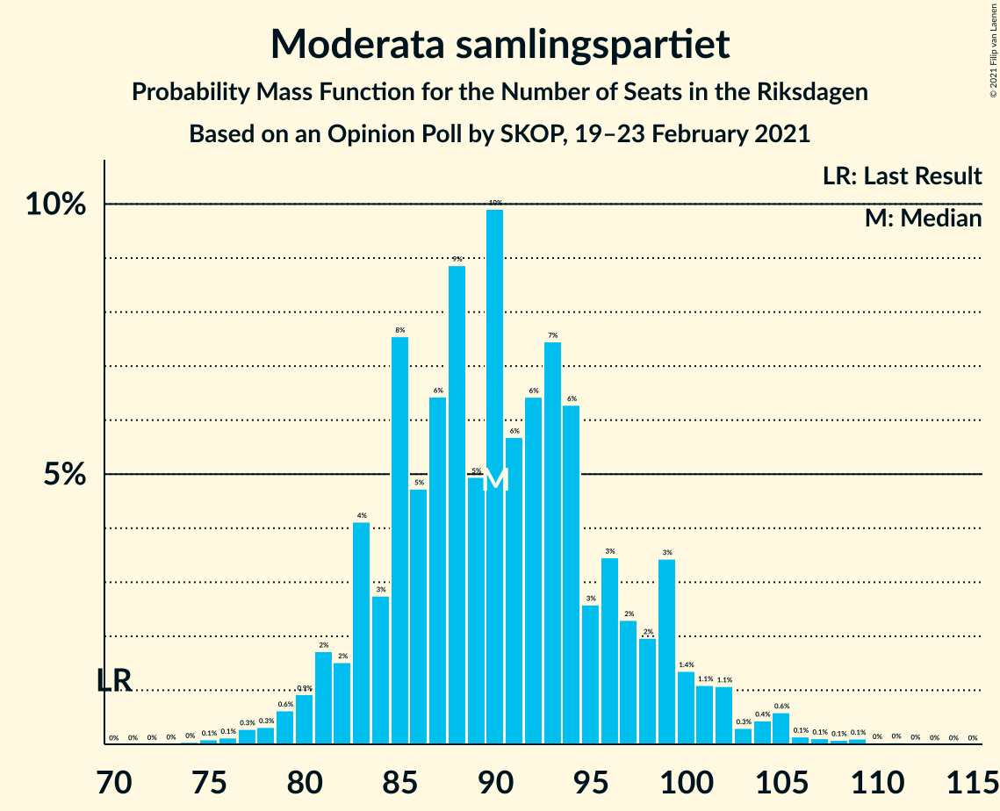
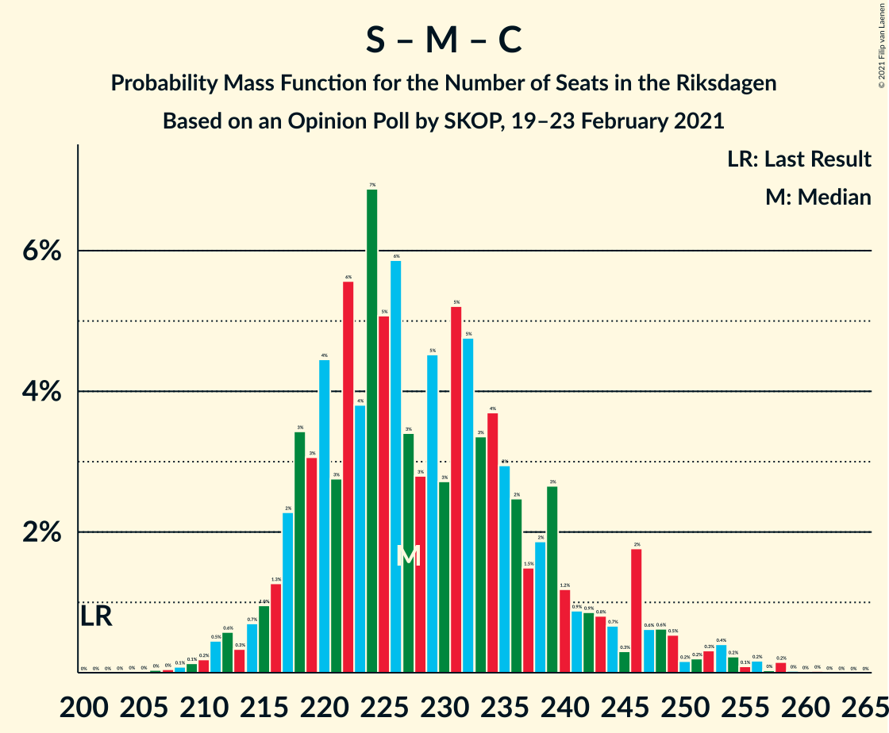

# Opinion Poll by SKOP, 19–23 February 2021

<a href="#voting-intentions">Voting Intentions</a> | <a href="#seats">Seats</a> | <a href="#coalitions">Coalitions</a> | <a href="#technical-information">Technical Information</a>

## Voting Intentions

### Confidence Intervals

| Party | Last Result | Poll Result | 80% Confidence Interval | 90% Confidence Interval | 95% Confidence Interval | 99% Confidence Interval |
|:-----:|:-----------:|:-----------:|:-----------------------:|:-----------------------:|:-----------------------:|:-----------------------:|
| Sveriges socialdemokratiska arbetareparti | 28.3% | 27.4% | 25.6–29.3% |25.1–29.8% |24.7–30.3% |23.9–31.2% |
| Moderata samlingspartiet | 19.8% | 24.5% | 22.8–26.3% |22.3–26.8% |21.9–27.3% |21.1–28.2% |
| Sverigedemokraterna | 17.5% | 15.5% | 14.1–17.1% |13.7–17.5% |13.4–17.9% |12.7–18.7% |
| Vänsterpartiet | 8.0% | 10.2% | 9.1–11.5% |8.7–11.9% |8.5–12.2% |8.0–12.9% |
| Centerpartiet | 8.6% | 10.0% | 8.9–11.3% |8.6–11.7% |8.3–12.0% |7.8–12.7% |
| Kristdemokraterna | 6.3% | 4.6% | 3.9–5.6% |3.6–5.9% |3.5–6.1% |3.1–6.6% |
| Miljöpartiet de gröna | 4.4% | 4.0% | 3.3–4.9% |3.1–5.2% |2.9–5.4% |2.7–5.9% |
| Liberalerna | 5.5% | 2.4% | 1.9–3.2% |1.7–3.4% |1.6–3.6% |1.4–3.9% |

*Note:* The poll result column reflects the actual value used in the calculations. Published results may vary slightly, and in addition be rounded to fewer digits.

## Seats

### Confidence Intervals

| Party | Last Result | Median | 80% Confidence Interval | 90% Confidence Interval | 95% Confidence Interval | 99% Confidence Interval |
|:-----:|:-----------:|:------:|:-----------------------:|:-----------------------:|:-----------------------:|:-----------------------:|
| <a href="#sveriges-socialdemokratiska-arbetareparti">Sveriges socialdemokratiska arbetareparti</a> | 100 | 100 | 94–109 |92–112 |91–114 |87–118 |
| <a href="#moderata-samlingspartiet">Moderata samlingspartiet</a> | 70 | 90 | 84–98 |82–100 |81–102 |77–106 |
| <a href="#sverigedemokraterna">Sverigedemokraterna</a> | 62 | 57 | 52–63 |50–64 |48–67 |46–70 |
| <a href="#vänsterpartiet">Vänsterpartiet</a> | 28 | 38 | 33–43 |32–44 |31–46 |29–48 |
| <a href="#centerpartiet">Centerpartiet</a> | 31 | 37 | 33–42 |31–44 |31–45 |29–47 |
| <a href="#kristdemokraterna">Kristdemokraterna</a> | 22 | 17 | 0–20 |0–21 |0–22 |0–24 |
| <a href="#miljöpartiet-de-gröna">Miljöpartiet de gröna</a> | 16 | 15 | 0–18 |0–19 |0–20 |0–22 |
| <a href="#liberalerna">Liberalerna</a> | 20 | 0 | 0 |0 |0 |0 |

### Sveriges socialdemokratiska arbetareparti

*For a full overview of the results for this party, see the [Sveriges socialdemokratiska arbetareparti](party-sverigessocialdemokratiskaarbetareparti.html) page.*

| Number of Seats | Probability | Accumulated | Special Marks |
|:---------------:|:-----------:|:-----------:|:-------------:|
| 84 | 0% | 100% |  |
| 85 | 0.1% | 99.9% |  |
| 86 | 0.2% | 99.8% |  |
| 87 | 0.3% | 99.7% |  |
| 88 | 0.3% | 99.4% |  |
| 89 | 0.8% | 99.1% |  |
| 90 | 0.8% | 98% |  |
| 91 | 1.4% | 98% |  |
| 92 | 1.2% | 96% |  |
| 93 | 3% | 95% |  |
| 94 | 3% | 92% |  |
| 95 | 4% | 89% |  |
| 96 | 7% | 85% |  |
| 97 | 6% | 78% |  |
| 98 | 12% | 72% |  |
| 99 | 5% | 61% |  |
| 100 | 10% | 56% | Last Result, Median |
| 101 | 6% | 47% |  |
| 102 | 6% | 41% |  |
| 103 | 7% | 35% |  |
| 104 | 2% | 27% |  |
| 105 | 5% | 25% |  |
| 106 | 4% | 21% |  |
| 107 | 2% | 17% |  |
| 108 | 2% | 15% |  |
| 109 | 4% | 13% |  |
| 110 | 1.5% | 9% |  |
| 111 | 2% | 8% |  |
| 112 | 1.3% | 6% |  |
| 113 | 1.3% | 4% |  |
| 114 | 0.7% | 3% |  |
| 115 | 0.7% | 2% |  |
| 116 | 0.3% | 2% |  |
| 117 | 0.6% | 1.3% |  |
| 118 | 0.2% | 0.7% |  |
| 119 | 0.1% | 0.5% |  |
| 120 | 0% | 0.3% |  |
| 121 | 0.2% | 0.3% |  |
| 122 | 0% | 0.1% |  |
| 123 | 0% | 0% |  |

### Moderata samlingspartiet

*For a full overview of the results for this party, see the [Moderata samlingspartiet](party-moderatasamlingspartiet.html) page.*

| Number of Seats | Probability | Accumulated | Special Marks |
|:---------------:|:-----------:|:-----------:|:-------------:|
| 70 | 0% | 100% | Last Result |
| 71 | 0% | 100% |  |
| 72 | 0% | 100% |  |
| 73 | 0% | 100% |  |
| 74 | 0% | 100% |  |
| 75 | 0.1% | 99.9% |  |
| 76 | 0.1% | 99.8% |  |
| 77 | 0.3% | 99.7% |  |
| 78 | 0.3% | 99.4% |  |
| 79 | 0.6% | 99.1% |  |
| 80 | 0.9% | 98% |  |
| 81 | 2% | 98% |  |
| 82 | 2% | 96% |  |
| 83 | 4% | 94% |  |
| 84 | 3% | 90% |  |
| 85 | 8% | 87% |  |
| 86 | 5% | 80% |  |
| 87 | 6% | 75% |  |
| 88 | 9% | 69% |  |
| 89 | 5% | 60% |  |
| 90 | 10% | 55% | Median |
| 91 | 6% | 45% |  |
| 92 | 6% | 39% |  |
| 93 | 7% | 33% |  |
| 94 | 6% | 25% |  |
| 95 | 3% | 19% |  |
| 96 | 3% | 17% |  |
| 97 | 2% | 13% |  |
| 98 | 2% | 11% |  |
| 99 | 3% | 9% |  |
| 100 | 1.4% | 5% |  |
| 101 | 1.1% | 4% |  |
| 102 | 1.1% | 3% |  |
| 103 | 0.3% | 2% |  |
| 104 | 0.4% | 2% |  |
| 105 | 0.6% | 1.1% |  |
| 106 | 0.1% | 0.5% |  |
| 107 | 0.1% | 0.4% |  |
| 108 | 0.1% | 0.3% |  |
| 109 | 0.1% | 0.2% |  |
| 110 | 0% | 0.1% |  |
| 111 | 0% | 0.1% |  |
| 112 | 0% | 0% |  |

### Sverigedemokraterna

*For a full overview of the results for this party, see the [Sverigedemokraterna](party-sverigedemokraterna.html) page.*

| Number of Seats | Probability | Accumulated | Special Marks |
|:---------------:|:-----------:|:-----------:|:-------------:|
| 44 | 0.1% | 100% |  |
| 45 | 0.1% | 99.9% |  |
| 46 | 0.5% | 99.7% |  |
| 47 | 0.4% | 99.2% |  |
| 48 | 1.4% | 98.9% |  |
| 49 | 0.8% | 97% |  |
| 50 | 2% | 97% |  |
| 51 | 2% | 95% |  |
| 52 | 4% | 93% |  |
| 53 | 2% | 89% |  |
| 54 | 8% | 87% |  |
| 55 | 6% | 79% |  |
| 56 | 11% | 74% |  |
| 57 | 14% | 62% | Median |
| 58 | 8% | 48% |  |
| 59 | 12% | 39% |  |
| 60 | 6% | 28% |  |
| 61 | 6% | 21% |  |
| 62 | 3% | 15% | Last Result |
| 63 | 4% | 12% |  |
| 64 | 3% | 8% |  |
| 65 | 1.4% | 5% |  |
| 66 | 0.9% | 4% |  |
| 67 | 0.8% | 3% |  |
| 68 | 0.6% | 2% |  |
| 69 | 0.5% | 1.2% |  |
| 70 | 0.2% | 0.7% |  |
| 71 | 0.2% | 0.5% |  |
| 72 | 0.2% | 0.3% |  |
| 73 | 0.1% | 0.1% |  |
| 74 | 0% | 0.1% |  |
| 75 | 0% | 0% |  |

### Vänsterpartiet

*For a full overview of the results for this party, see the [Vänsterpartiet](party-vänsterpartiet.html) page.*

| Number of Seats | Probability | Accumulated | Special Marks |
|:---------------:|:-----------:|:-----------:|:-------------:|
| 27 | 0.1% | 100% |  |
| 28 | 0.1% | 99.9% | Last Result |
| 29 | 0.4% | 99.8% |  |
| 30 | 1.3% | 99.3% |  |
| 31 | 1.4% | 98% |  |
| 32 | 3% | 97% |  |
| 33 | 4% | 94% |  |
| 34 | 6% | 90% |  |
| 35 | 13% | 84% |  |
| 36 | 9% | 71% |  |
| 37 | 9% | 62% |  |
| 38 | 15% | 53% | Median |
| 39 | 9% | 38% |  |
| 40 | 6% | 29% |  |
| 41 | 5% | 23% |  |
| 42 | 7% | 18% |  |
| 43 | 4% | 11% |  |
| 44 | 3% | 7% |  |
| 45 | 2% | 4% |  |
| 46 | 0.9% | 3% |  |
| 47 | 1.0% | 2% |  |
| 48 | 0.3% | 0.7% |  |
| 49 | 0.2% | 0.4% |  |
| 50 | 0.1% | 0.2% |  |
| 51 | 0.1% | 0.1% |  |
| 52 | 0% | 0% |  |

### Centerpartiet

*For a full overview of the results for this party, see the [Centerpartiet](party-centerpartiet.html) page.*

| Number of Seats | Probability | Accumulated | Special Marks |
|:---------------:|:-----------:|:-----------:|:-------------:|
| 26 | 0.1% | 100% |  |
| 27 | 0.1% | 99.9% |  |
| 28 | 0.3% | 99.8% |  |
| 29 | 0.7% | 99.6% |  |
| 30 | 1.0% | 98.9% |  |
| 31 | 3% | 98% | Last Result |
| 32 | 3% | 95% |  |
| 33 | 8% | 92% |  |
| 34 | 6% | 85% |  |
| 35 | 15% | 79% |  |
| 36 | 10% | 64% |  |
| 37 | 11% | 54% | Median |
| 38 | 12% | 43% |  |
| 39 | 6% | 30% |  |
| 40 | 5% | 24% |  |
| 41 | 5% | 19% |  |
| 42 | 4% | 14% |  |
| 43 | 3% | 9% |  |
| 44 | 4% | 7% |  |
| 45 | 0.7% | 3% |  |
| 46 | 1.2% | 2% |  |
| 47 | 0.4% | 0.8% |  |
| 48 | 0.2% | 0.4% |  |
| 49 | 0.1% | 0.2% |  |
| 50 | 0.1% | 0.1% |  |
| 51 | 0% | 0.1% |  |
| 52 | 0% | 0% |  |

### Kristdemokraterna

*For a full overview of the results for this party, see the [Kristdemokraterna](party-kristdemokraterna.html) page.*

| Number of Seats | Probability | Accumulated | Special Marks |
|:---------------:|:-----------:|:-----------:|:-------------:|
| 0 | 14% | 100% |  |
| 1 | 0% | 86% |  |
| 2 | 0% | 86% |  |
| 3 | 0% | 86% |  |
| 4 | 0% | 86% |  |
| 5 | 0% | 86% |  |
| 6 | 0% | 86% |  |
| 7 | 0% | 86% |  |
| 8 | 0% | 86% |  |
| 9 | 0% | 86% |  |
| 10 | 0% | 86% |  |
| 11 | 0% | 86% |  |
| 12 | 0% | 86% |  |
| 13 | 0% | 86% |  |
| 14 | 0.1% | 86% |  |
| 15 | 11% | 86% |  |
| 16 | 16% | 75% |  |
| 17 | 13% | 58% | Median |
| 18 | 17% | 45% |  |
| 19 | 10% | 28% |  |
| 20 | 10% | 18% |  |
| 21 | 4% | 8% |  |
| 22 | 2% | 4% | Last Result |
| 23 | 1.1% | 2% |  |
| 24 | 0.6% | 1.1% |  |
| 25 | 0.3% | 0.5% |  |
| 26 | 0.1% | 0.2% |  |
| 27 | 0% | 0.1% |  |
| 28 | 0% | 0% |  |

### Miljöpartiet de gröna

*For a full overview of the results for this party, see the [Miljöpartiet de gröna](party-miljöpartietdegröna.html) page.*

| Number of Seats | Probability | Accumulated | Special Marks |
|:---------------:|:-----------:|:-----------:|:-------------:|
| 0 | 40% | 100% |  |
| 1 | 0% | 60% |  |
| 2 | 0% | 60% |  |
| 3 | 0% | 60% |  |
| 4 | 0% | 60% |  |
| 5 | 0% | 60% |  |
| 6 | 0% | 60% |  |
| 7 | 0% | 60% |  |
| 8 | 0% | 60% |  |
| 9 | 0% | 60% |  |
| 10 | 0% | 60% |  |
| 11 | 0% | 60% |  |
| 12 | 0% | 60% |  |
| 13 | 0% | 60% |  |
| 14 | 0.1% | 60% |  |
| 15 | 21% | 60% | Median |
| 16 | 20% | 39% | Last Result |
| 17 | 9% | 20% |  |
| 18 | 5% | 10% |  |
| 19 | 2% | 5% |  |
| 20 | 2% | 3% |  |
| 21 | 0.7% | 1.2% |  |
| 22 | 0.3% | 0.5% |  |
| 23 | 0.1% | 0.2% |  |
| 24 | 0% | 0.1% |  |
| 25 | 0% | 0% |  |

### Liberalerna

*For a full overview of the results for this party, see the [Liberalerna](party-liberalerna.html) page.*

| Number of Seats | Probability | Accumulated | Special Marks |
|:---------------:|:-----------:|:-----------:|:-------------:|
| 0 | 99.7% | 100% | Median |
| 1 | 0% | 0.3% |  |
| 2 | 0% | 0.3% |  |
| 3 | 0% | 0.3% |  |
| 4 | 0% | 0.3% |  |
| 5 | 0% | 0.3% |  |
| 6 | 0% | 0.3% |  |
| 7 | 0% | 0.3% |  |
| 8 | 0% | 0.3% |  |
| 9 | 0% | 0.3% |  |
| 10 | 0% | 0.3% |  |
| 11 | 0% | 0.3% |  |
| 12 | 0% | 0.3% |  |
| 13 | 0% | 0.3% |  |
| 14 | 0% | 0.3% |  |
| 15 | 0.2% | 0.3% |  |
| 16 | 0.1% | 0.1% |  |
| 17 | 0% | 0% |  |
| 18 | 0% | 0% |  |
| 19 | 0% | 0% |  |
| 20 | 0% | 0% | Last Result |

## Coalitions

### Confidence Intervals

| Coalition | Last Result | Median | Majority? | 80% Confidence Interval | 90% Confidence Interval | 95% Confidence Interval | 99% Confidence Interval |
|:---------:|:-----------:|:------:|:---------:|:-----------------------:|:-----------------------:|:-----------------------:|:-----------------------:|
| Sveriges socialdemokratiska arbetareparti – Moderata samlingspartiet – Centerpartiet | 201 | 227 | 100% | 218–240 | 217–246 | 214–248 | 210–255 |
| Sveriges socialdemokratiska arbetareparti – Moderata samlingspartiet | 170 | 190 | 98.8% | 183–202 | 181–206 | 178–209 | 174–218 |
| Sveriges socialdemokratiska arbetareparti – Vänsterpartiet – Centerpartiet – Miljöpartiet de gröna – Liberalerna | 195 | 186 | 93% | 176–195 | 174–199 | 170–201 | 167–207 |
| Moderata samlingspartiet – Sverigedemokraterna – Kristdemokraterna | 154 | 163 | 7% | 154–173 | 150–175 | 148–179 | 142–182 |
| Sveriges socialdemokratiska arbetareparti – Centerpartiet – Miljöpartiet de gröna – Liberalerna | 167 | 148 | 0% | 138–157 | 135–161 | 132–164 | 129–168 |
| Moderata samlingspartiet – Sverigedemokraterna | 132 | 147 | 0% | 139–157 | 137–161 | 135–162 | 132–167 |
| Sveriges socialdemokratiska arbetareparti – Vänsterpartiet – Miljöpartiet de gröna | 144 | 149 | 0.1% | 138–157 | 135–159 | 134–162 | 129–168 |
| Moderata samlingspartiet – Centerpartiet – Kristdemokraterna – Liberalerna | 143 | 143 | 0% | 135–153 | 132–154 | 129–157 | 123–161 |
| Moderata samlingspartiet – Centerpartiet – Kristdemokraterna | 123 | 143 | 0% | 135–153 | 132–154 | 129–157 | 123–161 |
| Sveriges socialdemokratiska arbetareparti – Vänsterpartiet | 128 | 138 | 0% | 131–149 | 129–152 | 127–154 | 123–159 |
| Moderata samlingspartiet – Centerpartiet – Liberalerna | 121 | 127 | 0% | 120–136 | 118–139 | 116–141 | 113–146 |
| Moderata samlingspartiet – Centerpartiet | 101 | 127 | 0% | 120–136 | 118–139 | 116–141 | 113–146 |
| Sveriges socialdemokratiska arbetareparti – Miljöpartiet de gröna | 116 | 112 | 0% | 99–120 | 97–122 | 95–124 | 91–129 |

### Sveriges socialdemokratiska arbetareparti – Moderata samlingspartiet – Centerpartiet

| Number of Seats | Probability | Accumulated | Special Marks |
|:---------------:|:-----------:|:-----------:|:-------------:|
| 201 | 0% | 100% | Last Result |
| 202 | 0% | 100% |  |
| 203 | 0% | 100% |  |
| 204 | 0% | 100% |  |
| 205 | 0% | 100% |  |
| 206 | 0% | 100% |  |
| 207 | 0% | 99.9% |  |
| 208 | 0.1% | 99.9% |  |
| 209 | 0.1% | 99.8% |  |
| 210 | 0.2% | 99.7% |  |
| 211 | 0.5% | 99.5% |  |
| 212 | 0.6% | 99.0% |  |
| 213 | 0.3% | 98% |  |
| 214 | 0.7% | 98% |  |
| 215 | 1.0% | 97% |  |
| 216 | 1.3% | 96% |  |
| 217 | 2% | 95% |  |
| 218 | 3% | 93% |  |
| 219 | 3% | 89% |  |
| 220 | 4% | 86% |  |
| 221 | 3% | 82% |  |
| 222 | 6% | 79% |  |
| 223 | 4% | 74% |  |
| 224 | 7% | 70% |  |
| 225 | 5% | 63% |  |
| 226 | 6% | 58% |  |
| 227 | 3% | 52% | Median |
| 228 | 3% | 49% |  |
| 229 | 5% | 46% |  |
| 230 | 3% | 41% |  |
| 231 | 5% | 39% |  |
| 232 | 5% | 33% |  |
| 233 | 3% | 29% |  |
| 234 | 4% | 25% |  |
| 235 | 3% | 22% |  |
| 236 | 2% | 19% |  |
| 237 | 1.5% | 16% |  |
| 238 | 2% | 15% |  |
| 239 | 3% | 13% |  |
| 240 | 1.2% | 10% |  |
| 241 | 0.9% | 9% |  |
| 242 | 0.9% | 8% |  |
| 243 | 0.8% | 7% |  |
| 244 | 0.7% | 6% |  |
| 245 | 0.3% | 6% |  |
| 246 | 2% | 5% |  |
| 247 | 0.6% | 4% |  |
| 248 | 0.6% | 3% |  |
| 249 | 0.5% | 2% |  |
| 250 | 0.2% | 2% |  |
| 251 | 0.2% | 2% |  |
| 252 | 0.3% | 1.5% |  |
| 253 | 0.4% | 1.2% |  |
| 254 | 0.2% | 0.8% |  |
| 255 | 0.1% | 0.5% |  |
| 256 | 0.2% | 0.4% |  |
| 257 | 0% | 0.3% |  |
| 258 | 0.2% | 0.2% |  |
| 259 | 0% | 0.1% |  |
| 260 | 0% | 0.1% |  |
| 261 | 0% | 0% |  |

### Sveriges socialdemokratiska arbetareparti – Moderata samlingspartiet

| Number of Seats | Probability | Accumulated | Special Marks |
|:---------------:|:-----------:|:-----------:|:-------------:|
| 169 | 0% | 100% |  |
| 170 | 0% | 99.9% | Last Result |
| 171 | 0% | 99.9% |  |
| 172 | 0.2% | 99.9% |  |
| 173 | 0.2% | 99.7% |  |
| 174 | 0.7% | 99.5% |  |
| 175 | 0.2% | 98.8% | Majority |
| 176 | 0.3% | 98.6% |  |
| 177 | 0.4% | 98% |  |
| 178 | 0.7% | 98% |  |
| 179 | 0.8% | 97% |  |
| 180 | 1.2% | 96% |  |
| 181 | 1.2% | 95% |  |
| 182 | 2% | 94% |  |
| 183 | 2% | 92% |  |
| 184 | 5% | 89% |  |
| 185 | 9% | 85% |  |
| 186 | 7% | 75% |  |
| 187 | 3% | 69% |  |
| 188 | 8% | 66% |  |
| 189 | 7% | 57% |  |
| 190 | 5% | 51% | Median |
| 191 | 4% | 46% |  |
| 192 | 3% | 42% |  |
| 193 | 3% | 39% |  |
| 194 | 4% | 35% |  |
| 195 | 3% | 32% |  |
| 196 | 6% | 28% |  |
| 197 | 4% | 22% |  |
| 198 | 2% | 18% |  |
| 199 | 2% | 16% |  |
| 200 | 2% | 14% |  |
| 201 | 2% | 12% |  |
| 202 | 0.7% | 10% |  |
| 203 | 1.4% | 9% |  |
| 204 | 0.8% | 8% |  |
| 205 | 1.4% | 7% |  |
| 206 | 0.9% | 6% |  |
| 207 | 1.4% | 5% |  |
| 208 | 0.6% | 3% |  |
| 209 | 0.5% | 3% |  |
| 210 | 0.4% | 2% |  |
| 211 | 0.4% | 2% |  |
| 212 | 0.4% | 2% |  |
| 213 | 0.1% | 1.2% |  |
| 214 | 0.1% | 1.1% |  |
| 215 | 0% | 1.0% |  |
| 216 | 0.1% | 0.9% |  |
| 217 | 0.2% | 0.9% |  |
| 218 | 0.5% | 0.7% |  |
| 219 | 0.1% | 0.2% |  |
| 220 | 0.1% | 0.1% |  |
| 221 | 0% | 0% |  |

### Sveriges socialdemokratiska arbetareparti – Vänsterpartiet – Centerpartiet – Miljöpartiet de gröna – Liberalerna

| Number of Seats | Probability | Accumulated | Special Marks |
|:---------------:|:-----------:|:-----------:|:-------------:|
| 163 | 0.1% | 100% |  |
| 164 | 0.1% | 99.9% |  |
| 165 | 0.1% | 99.8% |  |
| 166 | 0.1% | 99.7% |  |
| 167 | 0.2% | 99.7% |  |
| 168 | 0.6% | 99.5% |  |
| 169 | 0.9% | 98.9% |  |
| 170 | 0.6% | 98% |  |
| 171 | 0.4% | 97% |  |
| 172 | 0.6% | 97% |  |
| 173 | 0.9% | 96% |  |
| 174 | 3% | 95% |  |
| 175 | 1.3% | 93% | Majority |
| 176 | 2% | 91% |  |
| 177 | 2% | 89% |  |
| 178 | 2% | 88% |  |
| 179 | 2% | 85% |  |
| 180 | 3% | 83% |  |
| 181 | 8% | 80% |  |
| 182 | 3% | 71% |  |
| 183 | 6% | 68% |  |
| 184 | 4% | 62% |  |
| 185 | 4% | 58% |  |
| 186 | 5% | 55% |  |
| 187 | 10% | 50% |  |
| 188 | 9% | 40% |  |
| 189 | 4% | 31% |  |
| 190 | 4% | 28% | Median |
| 191 | 2% | 24% |  |
| 192 | 3% | 22% |  |
| 193 | 4% | 18% |  |
| 194 | 3% | 14% |  |
| 195 | 3% | 11% | Last Result |
| 196 | 1.4% | 8% |  |
| 197 | 0.7% | 7% |  |
| 198 | 0.9% | 6% |  |
| 199 | 1.2% | 5% |  |
| 200 | 2% | 4% |  |
| 201 | 0.4% | 3% |  |
| 202 | 0.3% | 2% |  |
| 203 | 0.7% | 2% |  |
| 204 | 0.2% | 1.1% |  |
| 205 | 0.2% | 0.9% |  |
| 206 | 0.1% | 0.7% |  |
| 207 | 0.3% | 0.6% |  |
| 208 | 0.1% | 0.3% |  |
| 209 | 0.1% | 0.2% |  |
| 210 | 0.1% | 0.1% |  |
| 211 | 0% | 0.1% |  |
| 212 | 0% | 0.1% |  |
| 213 | 0% | 0% |  |

### Moderata samlingspartiet – Sverigedemokraterna – Kristdemokraterna

| Number of Seats | Probability | Accumulated | Special Marks |
|:---------------:|:-----------:|:-----------:|:-------------:|
| 137 | 0% | 100% |  |
| 138 | 0% | 99.9% |  |
| 139 | 0.1% | 99.9% |  |
| 140 | 0.1% | 99.9% |  |
| 141 | 0.1% | 99.8% |  |
| 142 | 0.3% | 99.7% |  |
| 143 | 0.1% | 99.4% |  |
| 144 | 0.2% | 99.3% |  |
| 145 | 0.2% | 99.1% |  |
| 146 | 0.7% | 98.9% |  |
| 147 | 0.3% | 98% |  |
| 148 | 0.4% | 98% |  |
| 149 | 2% | 97% |  |
| 150 | 1.2% | 96% |  |
| 151 | 0.9% | 95% |  |
| 152 | 0.7% | 94% |  |
| 153 | 1.4% | 93% |  |
| 154 | 3% | 92% | Last Result |
| 155 | 3% | 89% |  |
| 156 | 4% | 86% |  |
| 157 | 3% | 82% |  |
| 158 | 2% | 78% |  |
| 159 | 4% | 76% |  |
| 160 | 4% | 72% |  |
| 161 | 9% | 69% |  |
| 162 | 10% | 60% |  |
| 163 | 5% | 50% |  |
| 164 | 4% | 45% | Median |
| 165 | 4% | 42% |  |
| 166 | 6% | 38% |  |
| 167 | 3% | 32% |  |
| 168 | 8% | 29% |  |
| 169 | 3% | 20% |  |
| 170 | 2% | 17% |  |
| 171 | 2% | 15% |  |
| 172 | 2% | 12% |  |
| 173 | 2% | 11% |  |
| 174 | 1.3% | 9% |  |
| 175 | 3% | 7% | Majority |
| 176 | 0.9% | 5% |  |
| 177 | 0.6% | 4% |  |
| 178 | 0.4% | 3% |  |
| 179 | 0.6% | 3% |  |
| 180 | 0.9% | 2% |  |
| 181 | 0.6% | 1.1% |  |
| 182 | 0.2% | 0.5% |  |
| 183 | 0.1% | 0.3% |  |
| 184 | 0.1% | 0.3% |  |
| 185 | 0.1% | 0.2% |  |
| 186 | 0.1% | 0.1% |  |
| 187 | 0% | 0% |  |

### Sveriges socialdemokratiska arbetareparti – Centerpartiet – Miljöpartiet de gröna – Liberalerna

| Number of Seats | Probability | Accumulated | Special Marks |
|:---------------:|:-----------:|:-----------:|:-------------:|
| 124 | 0% | 100% |  |
| 125 | 0.1% | 99.9% |  |
| 126 | 0.1% | 99.9% |  |
| 127 | 0.1% | 99.8% |  |
| 128 | 0.1% | 99.7% |  |
| 129 | 0.3% | 99.6% |  |
| 130 | 0.2% | 99.2% |  |
| 131 | 0.4% | 99.0% |  |
| 132 | 1.3% | 98.6% |  |
| 133 | 0.4% | 97% |  |
| 134 | 1.3% | 97% |  |
| 135 | 1.1% | 96% |  |
| 136 | 2% | 95% |  |
| 137 | 3% | 93% |  |
| 138 | 3% | 90% |  |
| 139 | 2% | 87% |  |
| 140 | 3% | 86% |  |
| 141 | 3% | 82% |  |
| 142 | 2% | 79% |  |
| 143 | 6% | 78% |  |
| 144 | 3% | 72% |  |
| 145 | 4% | 68% |  |
| 146 | 6% | 64% |  |
| 147 | 4% | 58% |  |
| 148 | 4% | 54% |  |
| 149 | 3% | 50% |  |
| 150 | 9% | 46% |  |
| 151 | 2% | 37% |  |
| 152 | 9% | 34% | Median |
| 153 | 3% | 25% |  |
| 154 | 2% | 22% |  |
| 155 | 2% | 20% |  |
| 156 | 5% | 17% |  |
| 157 | 2% | 12% |  |
| 158 | 1.3% | 10% |  |
| 159 | 2% | 9% |  |
| 160 | 1.1% | 6% |  |
| 161 | 0.8% | 5% |  |
| 162 | 0.6% | 5% |  |
| 163 | 0.8% | 4% |  |
| 164 | 2% | 3% |  |
| 165 | 0.3% | 1.4% |  |
| 166 | 0.3% | 1.1% |  |
| 167 | 0.1% | 0.8% | Last Result |
| 168 | 0.2% | 0.7% |  |
| 169 | 0.1% | 0.5% |  |
| 170 | 0.1% | 0.3% |  |
| 171 | 0.1% | 0.2% |  |
| 172 | 0% | 0.1% |  |
| 173 | 0% | 0.1% |  |
| 174 | 0% | 0% |  |

### Moderata samlingspartiet – Sverigedemokraterna

| Number of Seats | Probability | Accumulated | Special Marks |
|:---------------:|:-----------:|:-----------:|:-------------:|
| 128 | 0% | 100% |  |
| 129 | 0.1% | 99.9% |  |
| 130 | 0.2% | 99.8% |  |
| 131 | 0.1% | 99.7% |  |
| 132 | 0.2% | 99.5% | Last Result |
| 133 | 0.7% | 99.3% |  |
| 134 | 0.8% | 98.6% |  |
| 135 | 0.6% | 98% |  |
| 136 | 0.5% | 97% |  |
| 137 | 4% | 97% |  |
| 138 | 2% | 93% |  |
| 139 | 1.4% | 91% |  |
| 140 | 4% | 90% |  |
| 141 | 6% | 85% |  |
| 142 | 3% | 79% |  |
| 143 | 2% | 76% |  |
| 144 | 7% | 74% |  |
| 145 | 8% | 67% |  |
| 146 | 4% | 60% |  |
| 147 | 6% | 56% | Median |
| 148 | 5% | 50% |  |
| 149 | 6% | 45% |  |
| 150 | 4% | 38% |  |
| 151 | 3% | 34% |  |
| 152 | 8% | 31% |  |
| 153 | 3% | 24% |  |
| 154 | 3% | 20% |  |
| 155 | 3% | 17% |  |
| 156 | 2% | 14% |  |
| 157 | 2% | 12% |  |
| 158 | 0.8% | 10% |  |
| 159 | 2% | 9% |  |
| 160 | 1.2% | 7% |  |
| 161 | 2% | 6% |  |
| 162 | 2% | 4% |  |
| 163 | 0.4% | 2% |  |
| 164 | 0.3% | 2% |  |
| 165 | 0.4% | 1.4% |  |
| 166 | 0.4% | 1.0% |  |
| 167 | 0.1% | 0.6% |  |
| 168 | 0.2% | 0.5% |  |
| 169 | 0.1% | 0.3% |  |
| 170 | 0.1% | 0.2% |  |
| 171 | 0% | 0.1% |  |
| 172 | 0% | 0.1% |  |
| 173 | 0% | 0.1% |  |
| 174 | 0% | 0% |  |

### Sveriges socialdemokratiska arbetareparti – Vänsterpartiet – Miljöpartiet de gröna

| Number of Seats | Probability | Accumulated | Special Marks |
|:---------------:|:-----------:|:-----------:|:-------------:|
| 125 | 0% | 100% |  |
| 126 | 0% | 99.9% |  |
| 127 | 0.1% | 99.9% |  |
| 128 | 0.2% | 99.8% |  |
| 129 | 0.2% | 99.6% |  |
| 130 | 0.3% | 99.5% |  |
| 131 | 0.8% | 99.2% |  |
| 132 | 0.3% | 98% |  |
| 133 | 0.5% | 98% |  |
| 134 | 3% | 98% |  |
| 135 | 2% | 95% |  |
| 136 | 0.6% | 93% |  |
| 137 | 3% | 93% |  |
| 138 | 2% | 90% |  |
| 139 | 2% | 88% |  |
| 140 | 2% | 86% |  |
| 141 | 1.2% | 85% |  |
| 142 | 2% | 83% |  |
| 143 | 3% | 81% |  |
| 144 | 4% | 79% | Last Result |
| 145 | 3% | 75% |  |
| 146 | 6% | 72% |  |
| 147 | 3% | 66% |  |
| 148 | 4% | 63% |  |
| 149 | 11% | 59% |  |
| 150 | 5% | 47% |  |
| 151 | 6% | 43% |  |
| 152 | 7% | 37% |  |
| 153 | 6% | 30% | Median |
| 154 | 4% | 24% |  |
| 155 | 6% | 21% |  |
| 156 | 4% | 14% |  |
| 157 | 1.5% | 11% |  |
| 158 | 3% | 9% |  |
| 159 | 2% | 7% |  |
| 160 | 0.9% | 4% |  |
| 161 | 0.7% | 3% |  |
| 162 | 0.5% | 3% |  |
| 163 | 0.3% | 2% |  |
| 164 | 0.3% | 2% |  |
| 165 | 0.5% | 2% |  |
| 166 | 0.5% | 1.2% |  |
| 167 | 0.1% | 0.7% |  |
| 168 | 0.1% | 0.6% |  |
| 169 | 0.1% | 0.5% |  |
| 170 | 0.1% | 0.4% |  |
| 171 | 0.1% | 0.3% |  |
| 172 | 0.1% | 0.2% |  |
| 173 | 0% | 0.1% |  |
| 174 | 0% | 0.1% |  |
| 175 | 0% | 0.1% | Majority |
| 176 | 0% | 0% |  |

### Moderata samlingspartiet – Centerpartiet – Kristdemokraterna – Liberalerna

| Number of Seats | Probability | Accumulated | Special Marks |
|:---------------:|:-----------:|:-----------:|:-------------:|
| 117 | 0.1% | 100% |  |
| 118 | 0.1% | 99.9% |  |
| 119 | 0% | 99.9% |  |
| 120 | 0.1% | 99.8% |  |
| 121 | 0.1% | 99.7% |  |
| 122 | 0.1% | 99.7% |  |
| 123 | 0.2% | 99.6% |  |
| 124 | 0.3% | 99.4% |  |
| 125 | 0.3% | 99.0% |  |
| 126 | 0.3% | 98.8% |  |
| 127 | 0.5% | 98% |  |
| 128 | 0.4% | 98% |  |
| 129 | 1.0% | 98% |  |
| 130 | 0.7% | 97% |  |
| 131 | 0.5% | 96% |  |
| 132 | 1.2% | 95% |  |
| 133 | 1.3% | 94% |  |
| 134 | 3% | 93% |  |
| 135 | 3% | 90% |  |
| 136 | 4% | 88% |  |
| 137 | 3% | 84% |  |
| 138 | 4% | 81% |  |
| 139 | 3% | 77% |  |
| 140 | 10% | 74% |  |
| 141 | 9% | 64% |  |
| 142 | 4% | 55% |  |
| 143 | 10% | 51% | Last Result |
| 144 | 7% | 41% | Median |
| 145 | 5% | 34% |  |
| 146 | 4% | 29% |  |
| 147 | 2% | 25% |  |
| 148 | 4% | 22% |  |
| 149 | 2% | 19% |  |
| 150 | 3% | 17% |  |
| 151 | 1.5% | 14% |  |
| 152 | 2% | 13% |  |
| 153 | 1.3% | 10% |  |
| 154 | 4% | 9% |  |
| 155 | 1.3% | 5% |  |
| 156 | 0.8% | 4% |  |
| 157 | 0.8% | 3% |  |
| 158 | 0.7% | 2% |  |
| 159 | 0.2% | 1.3% |  |
| 160 | 0.3% | 1.1% |  |
| 161 | 0.4% | 0.8% |  |
| 162 | 0.2% | 0.4% |  |
| 163 | 0.1% | 0.3% |  |
| 164 | 0% | 0.2% |  |
| 165 | 0.1% | 0.2% |  |
| 166 | 0% | 0.1% |  |
| 167 | 0% | 0% |  |

### Moderata samlingspartiet – Centerpartiet – Kristdemokraterna

| Number of Seats | Probability | Accumulated | Special Marks |
|:---------------:|:-----------:|:-----------:|:-------------:|
| 117 | 0.1% | 100% |  |
| 118 | 0.1% | 99.9% |  |
| 119 | 0% | 99.8% |  |
| 120 | 0.1% | 99.8% |  |
| 121 | 0.1% | 99.7% |  |
| 122 | 0.1% | 99.7% |  |
| 123 | 0.2% | 99.5% | Last Result |
| 124 | 0.3% | 99.4% |  |
| 125 | 0.3% | 99.0% |  |
| 126 | 0.3% | 98.8% |  |
| 127 | 0.5% | 98% |  |
| 128 | 0.4% | 98% |  |
| 129 | 1.0% | 98% |  |
| 130 | 0.7% | 97% |  |
| 131 | 0.5% | 96% |  |
| 132 | 1.2% | 95% |  |
| 133 | 1.3% | 94% |  |
| 134 | 3% | 93% |  |
| 135 | 3% | 90% |  |
| 136 | 4% | 88% |  |
| 137 | 3% | 84% |  |
| 138 | 4% | 80% |  |
| 139 | 3% | 77% |  |
| 140 | 10% | 74% |  |
| 141 | 9% | 64% |  |
| 142 | 4% | 55% |  |
| 143 | 10% | 51% |  |
| 144 | 7% | 41% | Median |
| 145 | 5% | 34% |  |
| 146 | 4% | 29% |  |
| 147 | 2% | 25% |  |
| 148 | 4% | 22% |  |
| 149 | 2% | 18% |  |
| 150 | 3% | 17% |  |
| 151 | 1.5% | 14% |  |
| 152 | 2% | 12% |  |
| 153 | 1.3% | 10% |  |
| 154 | 4% | 9% |  |
| 155 | 1.3% | 5% |  |
| 156 | 0.7% | 3% |  |
| 157 | 0.8% | 3% |  |
| 158 | 0.6% | 2% |  |
| 159 | 0.2% | 1.2% |  |
| 160 | 0.3% | 1.0% |  |
| 161 | 0.4% | 0.8% |  |
| 162 | 0.2% | 0.4% |  |
| 163 | 0.1% | 0.2% |  |
| 164 | 0% | 0.2% |  |
| 165 | 0.1% | 0.1% |  |
| 166 | 0% | 0% |  |

### Sveriges socialdemokratiska arbetareparti – Vänsterpartiet

| Number of Seats | Probability | Accumulated | Special Marks |
|:---------------:|:-----------:|:-----------:|:-------------:|
| 119 | 0% | 100% |  |
| 120 | 0.1% | 99.9% |  |
| 121 | 0% | 99.9% |  |
| 122 | 0.2% | 99.8% |  |
| 123 | 0.1% | 99.6% |  |
| 124 | 0.3% | 99.5% |  |
| 125 | 0.4% | 99.1% |  |
| 126 | 0.6% | 98.7% |  |
| 127 | 0.7% | 98% |  |
| 128 | 1.1% | 97% | Last Result |
| 129 | 2% | 96% |  |
| 130 | 1.4% | 95% |  |
| 131 | 6% | 93% |  |
| 132 | 2% | 87% |  |
| 133 | 7% | 85% |  |
| 134 | 8% | 79% |  |
| 135 | 6% | 70% |  |
| 136 | 8% | 65% |  |
| 137 | 5% | 57% |  |
| 138 | 7% | 52% | Median |
| 139 | 8% | 44% |  |
| 140 | 3% | 37% |  |
| 141 | 4% | 33% |  |
| 142 | 4% | 30% |  |
| 143 | 3% | 26% |  |
| 144 | 3% | 23% |  |
| 145 | 2% | 20% |  |
| 146 | 2% | 17% |  |
| 147 | 2% | 16% |  |
| 148 | 2% | 13% |  |
| 149 | 1.5% | 11% |  |
| 150 | 1.4% | 10% |  |
| 151 | 3% | 8% |  |
| 152 | 1.0% | 6% |  |
| 153 | 0.5% | 5% |  |
| 154 | 2% | 4% |  |
| 155 | 0.6% | 2% |  |
| 156 | 0.5% | 1.5% |  |
| 157 | 0.3% | 1.0% |  |
| 158 | 0.2% | 0.7% |  |
| 159 | 0.2% | 0.5% |  |
| 160 | 0.2% | 0.4% |  |
| 161 | 0.1% | 0.2% |  |
| 162 | 0% | 0.1% |  |
| 163 | 0% | 0.1% |  |
| 164 | 0% | 0% |  |

### Moderata samlingspartiet – Centerpartiet – Liberalerna

| Number of Seats | Probability | Accumulated | Special Marks |
|:---------------:|:-----------:|:-----------:|:-------------:|
| 109 | 0.1% | 100% |  |
| 110 | 0.1% | 99.9% |  |
| 111 | 0.1% | 99.8% |  |
| 112 | 0.1% | 99.7% |  |
| 113 | 0.3% | 99.6% |  |
| 114 | 0.5% | 99.4% |  |
| 115 | 0.5% | 98.9% |  |
| 116 | 1.2% | 98% |  |
| 117 | 1.3% | 97% |  |
| 118 | 3% | 96% |  |
| 119 | 2% | 93% |  |
| 120 | 6% | 92% |  |
| 121 | 5% | 86% | Last Result |
| 122 | 5% | 81% |  |
| 123 | 5% | 75% |  |
| 124 | 5% | 70% |  |
| 125 | 6% | 65% |  |
| 126 | 4% | 58% |  |
| 127 | 5% | 54% | Median |
| 128 | 10% | 49% |  |
| 129 | 5% | 39% |  |
| 130 | 5% | 34% |  |
| 131 | 3% | 29% |  |
| 132 | 4% | 26% |  |
| 133 | 2% | 23% |  |
| 134 | 4% | 20% |  |
| 135 | 4% | 16% |  |
| 136 | 3% | 13% |  |
| 137 | 2% | 10% |  |
| 138 | 2% | 7% |  |
| 139 | 1.3% | 6% |  |
| 140 | 1.3% | 4% |  |
| 141 | 0.9% | 3% |  |
| 142 | 0.5% | 2% |  |
| 143 | 0.3% | 2% |  |
| 144 | 0.3% | 1.4% |  |
| 145 | 0.2% | 1.0% |  |
| 146 | 0.4% | 0.9% |  |
| 147 | 0.1% | 0.5% |  |
| 148 | 0.1% | 0.4% |  |
| 149 | 0.1% | 0.3% |  |
| 150 | 0.1% | 0.2% |  |
| 151 | 0.1% | 0.1% |  |
| 152 | 0% | 0.1% |  |
| 153 | 0% | 0% |  |

### Moderata samlingspartiet – Centerpartiet

| Number of Seats | Probability | Accumulated | Special Marks |
|:---------------:|:-----------:|:-----------:|:-------------:|
| 101 | 0% | 100% | Last Result |
| 102 | 0% | 100% |  |
| 103 | 0% | 100% |  |
| 104 | 0% | 100% |  |
| 105 | 0% | 100% |  |
| 106 | 0% | 100% |  |
| 107 | 0% | 100% |  |
| 108 | 0% | 100% |  |
| 109 | 0.1% | 100% |  |
| 110 | 0.1% | 99.9% |  |
| 111 | 0.1% | 99.8% |  |
| 112 | 0.1% | 99.7% |  |
| 113 | 0.3% | 99.6% |  |
| 114 | 0.5% | 99.3% |  |
| 115 | 0.5% | 98.8% |  |
| 116 | 1.2% | 98% |  |
| 117 | 1.3% | 97% |  |
| 118 | 3% | 96% |  |
| 119 | 2% | 93% |  |
| 120 | 6% | 92% |  |
| 121 | 5% | 86% |  |
| 122 | 5% | 81% |  |
| 123 | 5% | 75% |  |
| 124 | 5% | 70% |  |
| 125 | 6% | 64% |  |
| 126 | 4% | 58% |  |
| 127 | 5% | 54% | Median |
| 128 | 10% | 49% |  |
| 129 | 5% | 39% |  |
| 130 | 5% | 34% |  |
| 131 | 3% | 29% |  |
| 132 | 4% | 26% |  |
| 133 | 2% | 22% |  |
| 134 | 4% | 20% |  |
| 135 | 4% | 16% |  |
| 136 | 3% | 12% |  |
| 137 | 2% | 9% |  |
| 138 | 2% | 7% |  |
| 139 | 1.3% | 5% |  |
| 140 | 1.3% | 4% |  |
| 141 | 0.9% | 3% |  |
| 142 | 0.5% | 2% |  |
| 143 | 0.3% | 2% |  |
| 144 | 0.3% | 1.3% |  |
| 145 | 0.1% | 1.0% |  |
| 146 | 0.4% | 0.8% |  |
| 147 | 0.1% | 0.5% |  |
| 148 | 0.1% | 0.4% |  |
| 149 | 0.1% | 0.2% |  |
| 150 | 0.1% | 0.2% |  |
| 151 | 0.1% | 0.1% |  |
| 152 | 0% | 0.1% |  |
| 153 | 0% | 0% |  |

### Sveriges socialdemokratiska arbetareparti – Miljöpartiet de gröna

| Number of Seats | Probability | Accumulated | Special Marks |
|:---------------:|:-----------:|:-----------:|:-------------:|
| 88 | 0% | 100% |  |
| 89 | 0.1% | 99.9% |  |
| 90 | 0.2% | 99.9% |  |
| 91 | 0.3% | 99.7% |  |
| 92 | 0.2% | 99.4% |  |
| 93 | 0.8% | 99.2% |  |
| 94 | 0.7% | 98% |  |
| 95 | 0.8% | 98% |  |
| 96 | 2% | 97% |  |
| 97 | 2% | 95% |  |
| 98 | 2% | 94% |  |
| 99 | 3% | 92% |  |
| 100 | 2% | 89% |  |
| 101 | 2% | 88% |  |
| 102 | 2% | 85% |  |
| 103 | 4% | 83% |  |
| 104 | 0.9% | 79% |  |
| 105 | 3% | 79% |  |
| 106 | 3% | 75% |  |
| 107 | 2% | 72% |  |
| 108 | 3% | 70% |  |
| 109 | 5% | 68% |  |
| 110 | 4% | 63% |  |
| 111 | 6% | 59% |  |
| 112 | 4% | 52% |  |
| 113 | 6% | 48% |  |
| 114 | 9% | 42% |  |
| 115 | 8% | 33% | Median |
| 116 | 3% | 25% | Last Result |
| 117 | 4% | 23% |  |
| 118 | 5% | 19% |  |
| 119 | 3% | 14% |  |
| 120 | 2% | 11% |  |
| 121 | 1.4% | 8% |  |
| 122 | 2% | 7% |  |
| 123 | 1.2% | 5% |  |
| 124 | 1.0% | 3% |  |
| 125 | 0.7% | 2% |  |
| 126 | 0.4% | 2% |  |
| 127 | 0.4% | 1.3% |  |
| 128 | 0.3% | 0.9% |  |
| 129 | 0.2% | 0.6% |  |
| 130 | 0.1% | 0.4% |  |
| 131 | 0.1% | 0.3% |  |
| 132 | 0.1% | 0.2% |  |
| 133 | 0.1% | 0.1% |  |
| 134 | 0% | 0.1% |  |
| 135 | 0% | 0% |  |

## Technical Information

### Opinion Poll

+ **Polling firm:** SKOP
+ **Commissioner(s):** —
+ **Fieldwork period:** 19–23 February 2021

### Calculations

+ **Sample size:** 1000
+ **Simulations done:** 1,048,576
+ **Error estimate:** 1.59%

