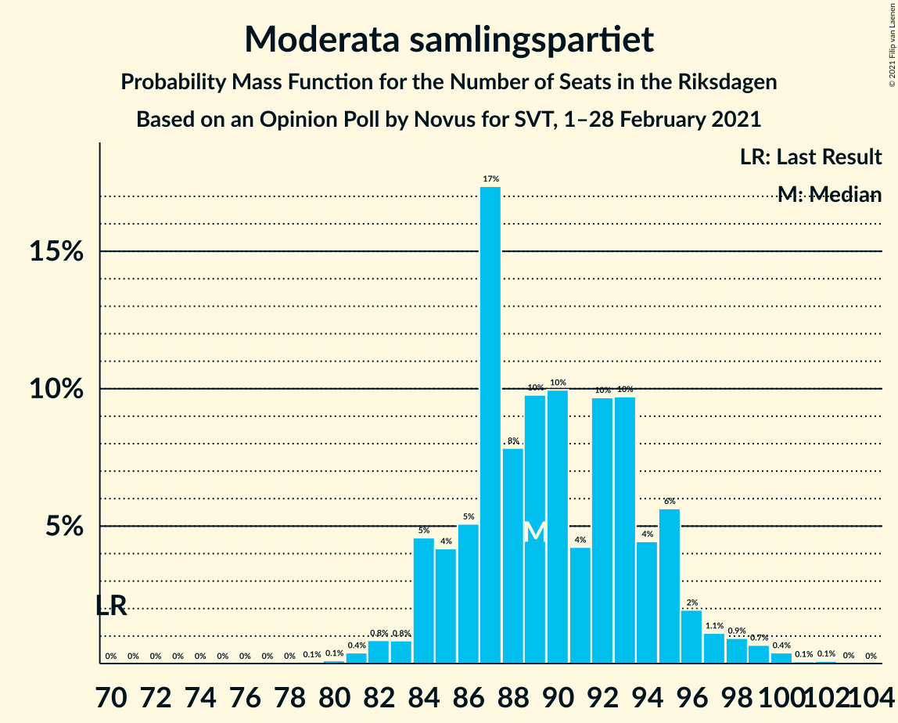
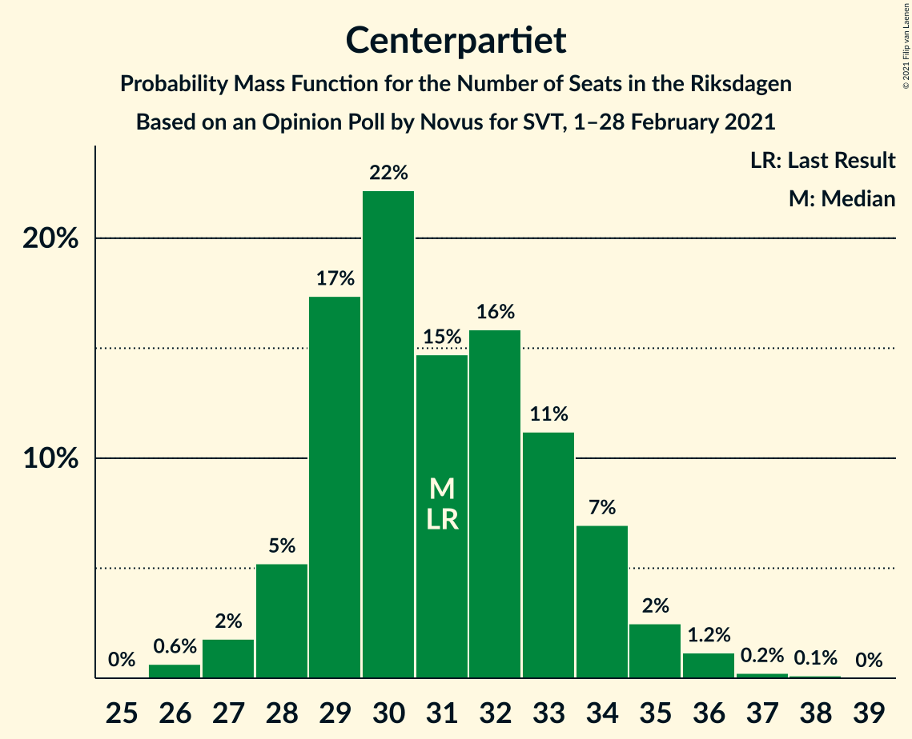
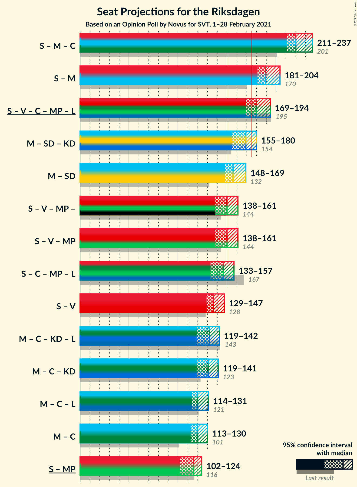
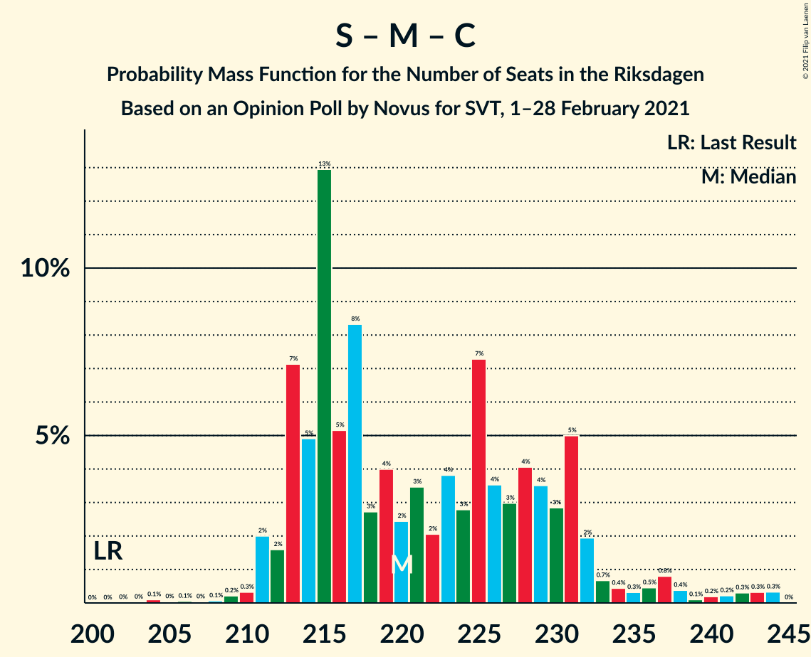
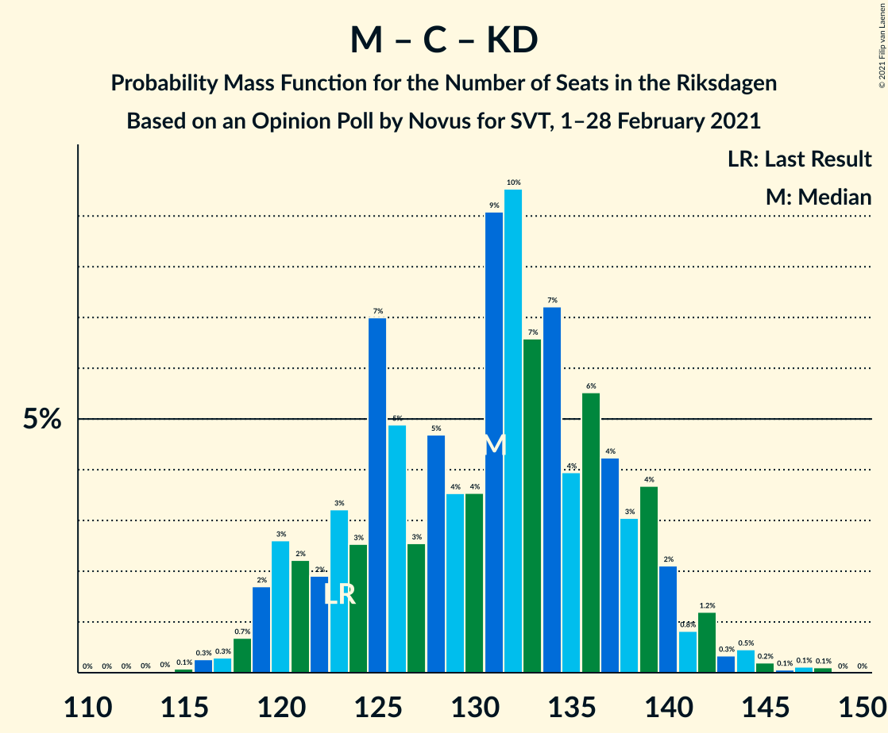

# Opinion Poll by Novus for SVT, 1–28 February 2021

<a href="#voting-intentions">Voting Intentions</a> | <a href="#seats">Seats</a> | <a href="#coalitions">Coalitions</a> | <a href="#technical-information">Technical Information</a>

## Voting Intentions

### Confidence Intervals

| Party | Last Result | Poll Result | 80% Confidence Interval | 90% Confidence Interval | 95% Confidence Interval | 99% Confidence Interval |
|:-----:|:-----------:|:-----------:|:-----------------------:|:-----------------------:|:-----------------------:|:-----------------------:|
| Sveriges socialdemokratiska arbetareparti | 28.3% | 27.0% | 26.1–27.9% |25.8–28.2% |25.6–28.4% |25.1–28.9% |
| Moderata samlingspartiet | 19.8% | 24.0% | 23.1–24.9% |22.9–25.2% |22.7–25.4% |22.3–25.8% |
| Sverigedemokraterna | 17.5% | 17.9% | 17.1–18.7% |16.9–19.0% |16.7–19.2% |16.3–19.6% |
| Vänsterpartiet | 8.0% | 9.5% | 8.9–10.1% |8.7–10.3% |8.6–10.5% |8.3–10.8% |
| Centerpartiet | 8.6% | 8.3% | 7.7–8.9% |7.6–9.1% |7.5–9.2% |7.2–9.5% |
| Miljöpartiet de gröna | 4.4% | 4.4% | 4.0–4.8% |3.9–5.0% |3.8–5.1% |3.6–5.3% |
| Kristdemokraterna | 6.3% | 4.1% | 3.7–4.5% |3.6–4.7% |3.5–4.8% |3.3–5.0% |
| Liberalerna | 5.5% | 3.3% | 2.9–3.7% |2.9–3.8% |2.8–3.9% |2.6–4.1% |

*Note:* The poll result column reflects the actual value used in the calculations. Published results may vary slightly, and in addition be rounded to fewer digits.

## Seats

### Confidence Intervals

| Party | Last Result | Median | 80% Confidence Interval | 90% Confidence Interval | 95% Confidence Interval | 99% Confidence Interval |
|:-----:|:-----------:|:------:|:-----------------------:|:-----------------------:|:-----------------------:|:-----------------------:|
| <a href="#sveriges-socialdemokratiska-arbetareparti">Sveriges socialdemokratiska arbetareparti</a> | 100 | 100 | 96–106 |95–107 |94–109 |92–111 |
| <a href="#moderata-samlingspartiet">Moderata samlingspartiet</a> | 70 | 89 | 85–95 |84–96 |84–97 |81–100 |
| <a href="#sverigedemokraterna">Sverigedemokraterna</a> | 62 | 67 | 63–71 |62–72 |61–73 |60–75 |
| <a href="#vänsterpartiet">Vänsterpartiet</a> | 28 | 35 | 33–38 |33–39 |32–40 |31–41 |
| <a href="#centerpartiet">Centerpartiet</a> | 31 | 31 | 29–34 |28–34 |28–35 |26–36 |
| <a href="#miljöpartiet-de-gröna">Miljöpartiet de gröna</a> | 16 | 16 | 0–18 |0–19 |0–19 |0–20 |
| <a href="#kristdemokraterna">Kristdemokraterna</a> | 22 | 15 | 0–17 |0–17 |0–18 |0–18 |
| <a href="#liberalerna">Liberalerna</a> | 20 | 0 | 0 |0 |0 |0–15 |

### Sveriges socialdemokratiska arbetareparti

*For a full overview of the results for this party, see the [Sveriges socialdemokratiska arbetareparti](party-sverigessocialdemokratiskaarbetareparti.html) page.*

| Number of Seats | Probability | Accumulated | Special Marks |
|:---------------:|:-----------:|:-----------:|:-------------:|
| 90 | 0.1% | 100% |  |
| 91 | 0.2% | 99.9% |  |
| 92 | 0.4% | 99.7% |  |
| 93 | 0.9% | 99.3% |  |
| 94 | 3% | 98% |  |
| 95 | 4% | 96% |  |
| 96 | 8% | 92% |  |
| 97 | 7% | 85% |  |
| 98 | 9% | 78% |  |
| 99 | 11% | 69% |  |
| 100 | 12% | 57% | Last Result, Median |
| 101 | 8% | 45% |  |
| 102 | 8% | 37% |  |
| 103 | 8% | 29% |  |
| 104 | 5% | 21% |  |
| 105 | 5% | 16% |  |
| 106 | 3% | 11% |  |
| 107 | 3% | 8% |  |
| 108 | 2% | 5% |  |
| 109 | 0.9% | 3% |  |
| 110 | 1.0% | 2% |  |
| 111 | 0.6% | 1.1% |  |
| 112 | 0.2% | 0.5% |  |
| 113 | 0.1% | 0.2% |  |
| 114 | 0.1% | 0.1% |  |
| 115 | 0% | 0% |  |

### Moderata samlingspartiet

*For a full overview of the results for this party, see the [Moderata samlingspartiet](party-moderatasamlingspartiet.html) page.*

| Number of Seats | Probability | Accumulated | Special Marks |
|:---------------:|:-----------:|:-----------:|:-------------:|
| 70 | 0% | 100% | Last Result |
| 71 | 0% | 100% |  |
| 72 | 0% | 100% |  |
| 73 | 0% | 100% |  |
| 74 | 0% | 100% |  |
| 75 | 0% | 100% |  |
| 76 | 0% | 100% |  |
| 77 | 0% | 100% |  |
| 78 | 0% | 100% |  |
| 79 | 0.1% | 100% |  |
| 80 | 0.1% | 99.9% |  |
| 81 | 0.4% | 99.8% |  |
| 82 | 0.8% | 99.4% |  |
| 83 | 0.8% | 98.6% |  |
| 84 | 5% | 98% |  |
| 85 | 4% | 93% |  |
| 86 | 5% | 89% |  |
| 87 | 17% | 84% |  |
| 88 | 8% | 67% |  |
| 89 | 10% | 59% | Median |
| 90 | 10% | 49% |  |
| 91 | 4% | 39% |  |
| 92 | 10% | 35% |  |
| 93 | 10% | 25% |  |
| 94 | 4% | 15% |  |
| 95 | 6% | 11% |  |
| 96 | 2% | 5% |  |
| 97 | 1.1% | 3% |  |
| 98 | 0.9% | 2% |  |
| 99 | 0.7% | 1.3% |  |
| 100 | 0.4% | 0.6% |  |
| 101 | 0.1% | 0.2% |  |
| 102 | 0.1% | 0.1% |  |
| 103 | 0% | 0% |  |

### Sverigedemokraterna

*For a full overview of the results for this party, see the [Sverigedemokraterna](party-sverigedemokraterna.html) page.*

| Number of Seats | Probability | Accumulated | Special Marks |
|:---------------:|:-----------:|:-----------:|:-------------:|
| 58 | 0.1% | 100% |  |
| 59 | 0.3% | 99.9% |  |
| 60 | 0.6% | 99.6% |  |
| 61 | 2% | 99.0% |  |
| 62 | 3% | 97% | Last Result |
| 63 | 5% | 94% |  |
| 64 | 7% | 89% |  |
| 65 | 9% | 82% |  |
| 66 | 10% | 73% |  |
| 67 | 16% | 63% | Median |
| 68 | 19% | 48% |  |
| 69 | 8% | 28% |  |
| 70 | 9% | 21% |  |
| 71 | 5% | 12% |  |
| 72 | 3% | 7% |  |
| 73 | 2% | 4% |  |
| 74 | 1.1% | 2% |  |
| 75 | 0.9% | 1.1% |  |
| 76 | 0.1% | 0.2% |  |
| 77 | 0% | 0.1% |  |
| 78 | 0% | 0.1% |  |
| 79 | 0% | 0% |  |

### Vänsterpartiet

*For a full overview of the results for this party, see the [Vänsterpartiet](party-vänsterpartiet.html) page.*

| Number of Seats | Probability | Accumulated | Special Marks |
|:---------------:|:-----------:|:-----------:|:-------------:|
| 28 | 0% | 100% | Last Result |
| 29 | 0% | 100% |  |
| 30 | 0.3% | 99.9% |  |
| 31 | 2% | 99.6% |  |
| 32 | 3% | 98% |  |
| 33 | 10% | 95% |  |
| 34 | 18% | 85% |  |
| 35 | 19% | 67% | Median |
| 36 | 17% | 48% |  |
| 37 | 15% | 31% |  |
| 38 | 9% | 16% |  |
| 39 | 4% | 7% |  |
| 40 | 2% | 3% |  |
| 41 | 0.8% | 1.2% |  |
| 42 | 0.2% | 0.3% |  |
| 43 | 0.1% | 0.1% |  |
| 44 | 0% | 0% |  |

### Centerpartiet

*For a full overview of the results for this party, see the [Centerpartiet](party-centerpartiet.html) page.*

| Number of Seats | Probability | Accumulated | Special Marks |
|:---------------:|:-----------:|:-----------:|:-------------:|
| 26 | 0.6% | 100% |  |
| 27 | 2% | 99.3% |  |
| 28 | 5% | 98% |  |
| 29 | 17% | 92% |  |
| 30 | 22% | 75% |  |
| 31 | 15% | 53% | Last Result, Median |
| 32 | 16% | 38% |  |
| 33 | 11% | 22% |  |
| 34 | 7% | 11% |  |
| 35 | 2% | 4% |  |
| 36 | 1.2% | 2% |  |
| 37 | 0.2% | 0.4% |  |
| 38 | 0.1% | 0.1% |  |
| 39 | 0% | 0% |  |

### Miljöpartiet de gröna

*For a full overview of the results for this party, see the [Miljöpartiet de gröna](party-miljöpartietdegröna.html) page.*

| Number of Seats | Probability | Accumulated | Special Marks |
|:---------------:|:-----------:|:-----------:|:-------------:|
| 0 | 10% | 100% |  |
| 1 | 0% | 90% |  |
| 2 | 0% | 90% |  |
| 3 | 0% | 90% |  |
| 4 | 0% | 90% |  |
| 5 | 0% | 90% |  |
| 6 | 0% | 90% |  |
| 7 | 0% | 90% |  |
| 8 | 0% | 90% |  |
| 9 | 0% | 90% |  |
| 10 | 0% | 90% |  |
| 11 | 0% | 90% |  |
| 12 | 0% | 90% |  |
| 13 | 0% | 90% |  |
| 14 | 0.1% | 90% |  |
| 15 | 16% | 89% |  |
| 16 | 26% | 74% | Last Result, Median |
| 17 | 30% | 48% |  |
| 18 | 12% | 18% |  |
| 19 | 5% | 6% |  |
| 20 | 0.8% | 1.0% |  |
| 21 | 0.1% | 0.2% |  |
| 22 | 0% | 0% |  |

### Kristdemokraterna

*For a full overview of the results for this party, see the [Kristdemokraterna](party-kristdemokraterna.html) page.*

| Number of Seats | Probability | Accumulated | Special Marks |
|:---------------:|:-----------:|:-----------:|:-------------:|
| 0 | 37% | 100% |  |
| 1 | 0% | 63% |  |
| 2 | 0% | 63% |  |
| 3 | 0% | 63% |  |
| 4 | 0% | 63% |  |
| 5 | 0% | 63% |  |
| 6 | 0% | 63% |  |
| 7 | 0% | 63% |  |
| 8 | 0% | 63% |  |
| 9 | 0% | 63% |  |
| 10 | 0% | 63% |  |
| 11 | 0% | 63% |  |
| 12 | 0% | 63% |  |
| 13 | 0% | 63% |  |
| 14 | 0.2% | 63% |  |
| 15 | 25% | 63% | Median |
| 16 | 25% | 38% |  |
| 17 | 9% | 13% |  |
| 18 | 3% | 4% |  |
| 19 | 0.3% | 0.4% |  |
| 20 | 0.1% | 0.1% |  |
| 21 | 0% | 0% |  |
| 22 | 0% | 0% | Last Result |

### Liberalerna

*For a full overview of the results for this party, see the [Liberalerna](party-liberalerna.html) page.*

| Number of Seats | Probability | Accumulated | Special Marks |
|:---------------:|:-----------:|:-----------:|:-------------:|
| 0 | 98.7% | 100% | Median |
| 1 | 0% | 1.3% |  |
| 2 | 0% | 1.3% |  |
| 3 | 0% | 1.3% |  |
| 4 | 0% | 1.3% |  |
| 5 | 0% | 1.3% |  |
| 6 | 0% | 1.3% |  |
| 7 | 0% | 1.3% |  |
| 8 | 0% | 1.3% |  |
| 9 | 0% | 1.3% |  |
| 10 | 0% | 1.3% |  |
| 11 | 0% | 1.3% |  |
| 12 | 0% | 1.3% |  |
| 13 | 0% | 1.3% |  |
| 14 | 0.1% | 1.3% |  |
| 15 | 0.9% | 1.1% |  |
| 16 | 0.2% | 0.2% |  |
| 17 | 0% | 0% |  |
| 18 | 0% | 0% |  |
| 19 | 0% | 0% |  |
| 20 | 0% | 0% | Last Result |

## Coalitions

### Confidence Intervals

| Coalition | Last Result | Median | Majority? | 80% Confidence Interval | 90% Confidence Interval | 95% Confidence Interval | 99% Confidence Interval |
|:---------:|:-----------:|:------:|:---------:|:-----------------------:|:-----------------------:|:-----------------------:|:-----------------------:|
| Sveriges socialdemokratiska arbetareparti – Moderata samlingspartiet – Centerpartiet | 201 | 220 | 100% | 213–231 | 213–232 | 211–237 | 209–243 |
| Sveriges socialdemokratiska arbetareparti – Moderata samlingspartiet | 170 | 189 | 100% | 183–198 | 182–200 | 181–204 | 179–209 |
| Sveriges socialdemokratiska arbetareparti – Vänsterpartiet – Centerpartiet – Miljöpartiet de gröna – Liberalerna | 195 | 180 | 94% | 176–189 | 173–191 | 169–194 | 168–196 |
| Moderata samlingspartiet – Sverigedemokraterna – Kristdemokraterna | 154 | 169 | 6% | 160–173 | 158–176 | 155–180 | 153–181 |
| Moderata samlingspartiet – Sverigedemokraterna | 132 | 156 | 0.1% | 150–163 | 149–164 | 148–169 | 146–171 |
| Sveriges socialdemokratiska arbetareparti – Vänsterpartiet – Miljöpartiet de gröna | 144 | 150 | 0% | 145–158 | 141–159 | 138–161 | 136–164 |
| Sveriges socialdemokratiska arbetareparti – Centerpartiet – Miljöpartiet de gröna – Liberalerna | 167 | 146 | 0% | 140–154 | 136–155 | 133–157 | 131–160 |
| Sveriges socialdemokratiska arbetareparti – Vänsterpartiet | 128 | 136 | 0% | 130–142 | 129–145 | 129–147 | 127–150 |
| Moderata samlingspartiet – Centerpartiet – Kristdemokraterna – Liberalerna | 143 | 132 | 0% | 123–138 | 120–140 | 119–142 | 118–146 |
| Moderata samlingspartiet – Centerpartiet – Kristdemokraterna | 123 | 131 | 0% | 123–138 | 120–140 | 119–141 | 117–144 |
| Moderata samlingspartiet – Centerpartiet – Liberalerna | 121 | 120 | 0% | 115–127 | 114–129 | 114–131 | 111–135 |
| Moderata samlingspartiet – Centerpartiet | 101 | 120 | 0% | 115–127 | 114–128 | 113–130 | 111–134 |
| Sveriges socialdemokratiska arbetareparti – Miljöpartiet de gröna | 116 | 116 | 0% | 109–122 | 105–123 | 102–124 | 99–126 |

### Sveriges socialdemokratiska arbetareparti – Moderata samlingspartiet – Centerpartiet

| Number of Seats | Probability | Accumulated | Special Marks |
|:---------------:|:-----------:|:-----------:|:-------------:|
| 201 | 0% | 100% | Last Result |
| 202 | 0% | 100% |  |
| 203 | 0% | 100% |  |
| 204 | 0.1% | 99.9% |  |
| 205 | 0% | 99.8% |  |
| 206 | 0.1% | 99.8% |  |
| 207 | 0% | 99.7% |  |
| 208 | 0.1% | 99.7% |  |
| 209 | 0.2% | 99.6% |  |
| 210 | 0.3% | 99.4% |  |
| 211 | 2% | 99.1% |  |
| 212 | 2% | 97% |  |
| 213 | 7% | 96% |  |
| 214 | 5% | 88% |  |
| 215 | 13% | 83% |  |
| 216 | 5% | 71% |  |
| 217 | 8% | 65% |  |
| 218 | 3% | 57% |  |
| 219 | 4% | 54% |  |
| 220 | 2% | 50% | Median |
| 221 | 3% | 48% |  |
| 222 | 2% | 44% |  |
| 223 | 4% | 42% |  |
| 224 | 3% | 39% |  |
| 225 | 7% | 36% |  |
| 226 | 4% | 28% |  |
| 227 | 3% | 25% |  |
| 228 | 4% | 22% |  |
| 229 | 4% | 18% |  |
| 230 | 3% | 14% |  |
| 231 | 5% | 12% |  |
| 232 | 2% | 7% |  |
| 233 | 0.7% | 5% |  |
| 234 | 0.4% | 4% |  |
| 235 | 0.3% | 3% |  |
| 236 | 0.5% | 3% |  |
| 237 | 0.8% | 3% |  |
| 238 | 0.4% | 2% |  |
| 239 | 0.1% | 2% |  |
| 240 | 0.2% | 1.4% |  |
| 241 | 0.2% | 1.2% |  |
| 242 | 0.3% | 1.0% |  |
| 243 | 0.3% | 0.7% |  |
| 244 | 0.3% | 0.4% |  |
| 245 | 0% | 0% |  |

### Sveriges socialdemokratiska arbetareparti – Moderata samlingspartiet

| Number of Seats | Probability | Accumulated | Special Marks |
|:---------------:|:-----------:|:-----------:|:-------------:|
| 170 | 0% | 100% | Last Result |
| 171 | 0% | 100% |  |
| 172 | 0% | 100% |  |
| 173 | 0% | 100% |  |
| 174 | 0% | 100% |  |
| 175 | 0% | 100% | Majority |
| 176 | 0.2% | 99.9% |  |
| 177 | 0.1% | 99.8% |  |
| 178 | 0.2% | 99.7% |  |
| 179 | 0.3% | 99.5% |  |
| 180 | 1.0% | 99.2% |  |
| 181 | 2% | 98% |  |
| 182 | 2% | 96% |  |
| 183 | 5% | 94% |  |
| 184 | 5% | 88% |  |
| 185 | 11% | 84% |  |
| 186 | 8% | 73% |  |
| 187 | 10% | 65% |  |
| 188 | 4% | 56% |  |
| 189 | 5% | 52% | Median |
| 190 | 2% | 47% |  |
| 191 | 3% | 44% |  |
| 192 | 3% | 41% |  |
| 193 | 7% | 38% |  |
| 194 | 4% | 31% |  |
| 195 | 5% | 27% |  |
| 196 | 4% | 23% |  |
| 197 | 7% | 19% |  |
| 198 | 2% | 12% |  |
| 199 | 2% | 9% |  |
| 200 | 3% | 7% |  |
| 201 | 0.8% | 5% |  |
| 202 | 0.6% | 4% |  |
| 203 | 0.5% | 3% |  |
| 204 | 0.4% | 3% |  |
| 205 | 0.7% | 2% |  |
| 206 | 0.3% | 2% |  |
| 207 | 0.6% | 1.3% |  |
| 208 | 0.1% | 0.8% |  |
| 209 | 0.3% | 0.7% |  |
| 210 | 0.1% | 0.4% |  |
| 211 | 0.2% | 0.3% |  |
| 212 | 0% | 0% |  |

### Sveriges socialdemokratiska arbetareparti – Vänsterpartiet – Centerpartiet – Miljöpartiet de gröna – Liberalerna

| Number of Seats | Probability | Accumulated | Special Marks |
|:---------------:|:-----------:|:-----------:|:-------------:|
| 164 | 0% | 100% |  |
| 165 | 0.1% | 99.9% |  |
| 166 | 0% | 99.9% |  |
| 167 | 0.1% | 99.8% |  |
| 168 | 0.8% | 99.7% |  |
| 169 | 2% | 98.9% |  |
| 170 | 0.7% | 97% |  |
| 171 | 1.0% | 97% |  |
| 172 | 0.6% | 96% |  |
| 173 | 0.7% | 95% |  |
| 174 | 0.7% | 94% |  |
| 175 | 2% | 94% | Majority |
| 176 | 3% | 92% |  |
| 177 | 6% | 89% |  |
| 178 | 10% | 82% |  |
| 179 | 16% | 72% |  |
| 180 | 6% | 56% |  |
| 181 | 3% | 49% |  |
| 182 | 2% | 47% | Median |
| 183 | 4% | 44% |  |
| 184 | 4% | 40% |  |
| 185 | 4% | 37% |  |
| 186 | 5% | 33% |  |
| 187 | 6% | 28% |  |
| 188 | 7% | 21% |  |
| 189 | 5% | 14% |  |
| 190 | 3% | 9% |  |
| 191 | 0.9% | 6% |  |
| 192 | 1.3% | 5% |  |
| 193 | 0.8% | 4% |  |
| 194 | 1.2% | 3% |  |
| 195 | 0.8% | 2% | Last Result |
| 196 | 0.8% | 0.9% |  |
| 197 | 0.1% | 0.2% |  |
| 198 | 0% | 0.1% |  |
| 199 | 0% | 0% |  |

### Moderata samlingspartiet – Sverigedemokraterna – Kristdemokraterna

| Number of Seats | Probability | Accumulated | Special Marks |
|:---------------:|:-----------:|:-----------:|:-------------:|
| 151 | 0% | 100% |  |
| 152 | 0.1% | 99.9% |  |
| 153 | 0.8% | 99.8% |  |
| 154 | 0.8% | 99.1% | Last Result |
| 155 | 1.2% | 98% |  |
| 156 | 0.8% | 97% |  |
| 157 | 1.3% | 96% |  |
| 158 | 0.9% | 95% |  |
| 159 | 3% | 94% |  |
| 160 | 5% | 91% |  |
| 161 | 7% | 86% |  |
| 162 | 6% | 79% |  |
| 163 | 5% | 72% |  |
| 164 | 4% | 67% |  |
| 165 | 4% | 63% |  |
| 166 | 4% | 60% |  |
| 167 | 2% | 56% |  |
| 168 | 3% | 53% |  |
| 169 | 6% | 51% |  |
| 170 | 16% | 44% |  |
| 171 | 10% | 28% | Median |
| 172 | 6% | 18% |  |
| 173 | 3% | 11% |  |
| 174 | 2% | 8% |  |
| 175 | 0.7% | 6% | Majority |
| 176 | 0.7% | 6% |  |
| 177 | 0.6% | 5% |  |
| 178 | 1.0% | 4% |  |
| 179 | 0.7% | 3% |  |
| 180 | 2% | 3% |  |
| 181 | 0.8% | 1.1% |  |
| 182 | 0.1% | 0.3% |  |
| 183 | 0% | 0.2% |  |
| 184 | 0.1% | 0.1% |  |
| 185 | 0% | 0.1% |  |
| 186 | 0% | 0% |  |

### Moderata samlingspartiet – Sverigedemokraterna

| Number of Seats | Probability | Accumulated | Special Marks |
|:---------------:|:-----------:|:-----------:|:-------------:|
| 132 | 0% | 100% | Last Result |
| 133 | 0% | 100% |  |
| 134 | 0% | 100% |  |
| 135 | 0% | 100% |  |
| 136 | 0% | 100% |  |
| 137 | 0% | 100% |  |
| 138 | 0% | 100% |  |
| 139 | 0% | 100% |  |
| 140 | 0% | 100% |  |
| 141 | 0% | 100% |  |
| 142 | 0% | 100% |  |
| 143 | 0% | 100% |  |
| 144 | 0% | 99.9% |  |
| 145 | 0.1% | 99.9% |  |
| 146 | 0.5% | 99.8% |  |
| 147 | 0.8% | 99.3% |  |
| 148 | 2% | 98% |  |
| 149 | 3% | 96% |  |
| 150 | 5% | 93% |  |
| 151 | 2% | 88% |  |
| 152 | 1.0% | 86% |  |
| 153 | 4% | 85% |  |
| 154 | 10% | 81% |  |
| 155 | 20% | 71% |  |
| 156 | 8% | 51% | Median |
| 157 | 5% | 43% |  |
| 158 | 2% | 38% |  |
| 159 | 3% | 37% |  |
| 160 | 6% | 34% |  |
| 161 | 8% | 28% |  |
| 162 | 7% | 20% |  |
| 163 | 6% | 13% |  |
| 164 | 2% | 7% |  |
| 165 | 0.7% | 5% |  |
| 166 | 0.3% | 4% |  |
| 167 | 0.4% | 4% |  |
| 168 | 0.5% | 4% |  |
| 169 | 1.2% | 3% |  |
| 170 | 0.8% | 2% |  |
| 171 | 0.6% | 1.0% |  |
| 172 | 0.3% | 0.5% |  |
| 173 | 0% | 0.2% |  |
| 174 | 0% | 0.1% |  |
| 175 | 0% | 0.1% | Majority |
| 176 | 0% | 0.1% |  |
| 177 | 0% | 0% |  |

### Sveriges socialdemokratiska arbetareparti – Vänsterpartiet – Miljöpartiet de gröna

| Number of Seats | Probability | Accumulated | Special Marks |
|:---------------:|:-----------:|:-----------:|:-------------:|
| 132 | 0.1% | 100% |  |
| 133 | 0% | 99.9% |  |
| 134 | 0.1% | 99.9% |  |
| 135 | 0.2% | 99.7% |  |
| 136 | 0.5% | 99.5% |  |
| 137 | 0.8% | 99.0% |  |
| 138 | 0.8% | 98% |  |
| 139 | 1.1% | 97% |  |
| 140 | 0.8% | 96% |  |
| 141 | 0.9% | 96% |  |
| 142 | 0.7% | 95% |  |
| 143 | 1.2% | 94% |  |
| 144 | 2% | 93% | Last Result |
| 145 | 3% | 91% |  |
| 146 | 5% | 88% |  |
| 147 | 7% | 83% |  |
| 148 | 7% | 76% |  |
| 149 | 10% | 69% |  |
| 150 | 10% | 59% |  |
| 151 | 4% | 49% | Median |
| 152 | 5% | 45% |  |
| 153 | 4% | 39% |  |
| 154 | 9% | 35% |  |
| 155 | 5% | 26% |  |
| 156 | 6% | 21% |  |
| 157 | 5% | 15% |  |
| 158 | 4% | 10% |  |
| 159 | 2% | 7% |  |
| 160 | 1.2% | 5% |  |
| 161 | 0.9% | 3% |  |
| 162 | 1.2% | 2% |  |
| 163 | 0.7% | 1.2% |  |
| 164 | 0.4% | 0.6% |  |
| 165 | 0.1% | 0.2% |  |
| 166 | 0% | 0% |  |

### Sveriges socialdemokratiska arbetareparti – Centerpartiet – Miljöpartiet de gröna – Liberalerna

| Number of Seats | Probability | Accumulated | Special Marks |
|:---------------:|:-----------:|:-----------:|:-------------:|
| 129 | 0.1% | 100% |  |
| 130 | 0.2% | 99.9% |  |
| 131 | 0.9% | 99.7% |  |
| 132 | 0.9% | 98.8% |  |
| 133 | 0.5% | 98% |  |
| 134 | 1.0% | 97% |  |
| 135 | 0.7% | 96% |  |
| 136 | 0.9% | 96% |  |
| 137 | 1.0% | 95% |  |
| 138 | 0.7% | 94% |  |
| 139 | 2% | 93% |  |
| 140 | 2% | 92% |  |
| 141 | 2% | 90% |  |
| 142 | 6% | 88% |  |
| 143 | 6% | 82% |  |
| 144 | 18% | 76% |  |
| 145 | 5% | 58% |  |
| 146 | 8% | 53% |  |
| 147 | 4% | 46% | Median |
| 148 | 6% | 41% |  |
| 149 | 6% | 36% |  |
| 150 | 5% | 30% |  |
| 151 | 5% | 25% |  |
| 152 | 4% | 21% |  |
| 153 | 3% | 17% |  |
| 154 | 7% | 14% |  |
| 155 | 2% | 7% |  |
| 156 | 2% | 5% |  |
| 157 | 1.1% | 3% |  |
| 158 | 0.5% | 2% |  |
| 159 | 0.6% | 1.2% |  |
| 160 | 0.3% | 0.6% |  |
| 161 | 0.2% | 0.3% |  |
| 162 | 0.1% | 0.2% |  |
| 163 | 0% | 0.1% |  |
| 164 | 0% | 0.1% |  |
| 165 | 0% | 0% |  |
| 166 | 0% | 0% |  |
| 167 | 0% | 0% | Last Result |

### Sveriges socialdemokratiska arbetareparti – Vänsterpartiet

| Number of Seats | Probability | Accumulated | Special Marks |
|:---------------:|:-----------:|:-----------:|:-------------:|
| 124 | 0.1% | 100% |  |
| 125 | 0.2% | 99.9% |  |
| 126 | 0.2% | 99.7% |  |
| 127 | 0.7% | 99.5% |  |
| 128 | 1.3% | 98.8% | Last Result |
| 129 | 3% | 98% |  |
| 130 | 5% | 95% |  |
| 131 | 8% | 89% |  |
| 132 | 8% | 81% |  |
| 133 | 5% | 74% |  |
| 134 | 12% | 68% |  |
| 135 | 5% | 56% | Median |
| 136 | 5% | 51% |  |
| 137 | 10% | 46% |  |
| 138 | 9% | 37% |  |
| 139 | 5% | 28% |  |
| 140 | 7% | 23% |  |
| 141 | 3% | 16% |  |
| 142 | 4% | 13% |  |
| 143 | 1.5% | 9% |  |
| 144 | 2% | 7% |  |
| 145 | 2% | 6% |  |
| 146 | 1.0% | 4% |  |
| 147 | 2% | 3% |  |
| 148 | 0.4% | 1.1% |  |
| 149 | 0.1% | 0.7% |  |
| 150 | 0.3% | 0.6% |  |
| 151 | 0.1% | 0.3% |  |
| 152 | 0.1% | 0.2% |  |
| 153 | 0.1% | 0.1% |  |
| 154 | 0% | 0.1% |  |
| 155 | 0% | 0% |  |

### Moderata samlingspartiet – Centerpartiet – Kristdemokraterna – Liberalerna

| Number of Seats | Probability | Accumulated | Special Marks |
|:---------------:|:-----------:|:-----------:|:-------------:|
| 116 | 0.2% | 100% |  |
| 117 | 0.2% | 99.8% |  |
| 118 | 0.7% | 99.6% |  |
| 119 | 2% | 98.9% |  |
| 120 | 3% | 97% |  |
| 121 | 2% | 95% |  |
| 122 | 2% | 93% |  |
| 123 | 3% | 91% |  |
| 124 | 3% | 88% |  |
| 125 | 7% | 85% |  |
| 126 | 5% | 78% |  |
| 127 | 2% | 73% |  |
| 128 | 5% | 71% |  |
| 129 | 3% | 66% |  |
| 130 | 4% | 63% |  |
| 131 | 9% | 59% |  |
| 132 | 10% | 50% |  |
| 133 | 7% | 40% |  |
| 134 | 7% | 34% |  |
| 135 | 4% | 27% | Median |
| 136 | 6% | 23% |  |
| 137 | 4% | 17% |  |
| 138 | 3% | 13% |  |
| 139 | 4% | 10% |  |
| 140 | 2% | 6% |  |
| 141 | 1.0% | 4% |  |
| 142 | 1.3% | 3% |  |
| 143 | 0.4% | 2% | Last Result |
| 144 | 0.5% | 1.3% |  |
| 145 | 0.2% | 0.8% |  |
| 146 | 0.2% | 0.6% |  |
| 147 | 0.2% | 0.4% |  |
| 148 | 0.2% | 0.3% |  |
| 149 | 0.1% | 0.1% |  |
| 150 | 0% | 0% |  |

### Moderata samlingspartiet – Centerpartiet – Kristdemokraterna

| Number of Seats | Probability | Accumulated | Special Marks |
|:---------------:|:-----------:|:-----------:|:-------------:|
| 115 | 0.1% | 100% |  |
| 116 | 0.3% | 99.9% |  |
| 117 | 0.3% | 99.6% |  |
| 118 | 0.7% | 99.3% |  |
| 119 | 2% | 98.6% |  |
| 120 | 3% | 97% |  |
| 121 | 2% | 94% |  |
| 122 | 2% | 92% |  |
| 123 | 3% | 90% | Last Result |
| 124 | 3% | 87% |  |
| 125 | 7% | 84% |  |
| 126 | 5% | 77% |  |
| 127 | 3% | 73% |  |
| 128 | 5% | 70% |  |
| 129 | 4% | 65% |  |
| 130 | 4% | 62% |  |
| 131 | 9% | 58% |  |
| 132 | 10% | 49% |  |
| 133 | 7% | 40% |  |
| 134 | 7% | 33% |  |
| 135 | 4% | 26% | Median |
| 136 | 6% | 22% |  |
| 137 | 4% | 16% |  |
| 138 | 3% | 12% |  |
| 139 | 4% | 9% |  |
| 140 | 2% | 5% |  |
| 141 | 0.8% | 3% |  |
| 142 | 1.2% | 2% |  |
| 143 | 0.3% | 1.3% |  |
| 144 | 0.5% | 0.9% |  |
| 145 | 0.2% | 0.5% |  |
| 146 | 0.1% | 0.3% |  |
| 147 | 0.1% | 0.2% |  |
| 148 | 0.1% | 0.1% |  |
| 149 | 0% | 0% |  |

### Moderata samlingspartiet – Centerpartiet – Liberalerna

| Number of Seats | Probability | Accumulated | Special Marks |
|:---------------:|:-----------:|:-----------:|:-------------:|
| 110 | 0% | 100% |  |
| 111 | 0.4% | 99.9% |  |
| 112 | 0.5% | 99.5% |  |
| 113 | 1.4% | 98.9% |  |
| 114 | 4% | 98% |  |
| 115 | 4% | 94% |  |
| 116 | 12% | 90% |  |
| 117 | 9% | 78% |  |
| 118 | 4% | 69% |  |
| 119 | 10% | 65% |  |
| 120 | 7% | 55% | Median |
| 121 | 6% | 49% | Last Result |
| 122 | 5% | 42% |  |
| 123 | 8% | 37% |  |
| 124 | 4% | 30% |  |
| 125 | 8% | 25% |  |
| 126 | 5% | 17% |  |
| 127 | 2% | 12% |  |
| 128 | 4% | 9% |  |
| 129 | 1.1% | 5% |  |
| 130 | 1.0% | 4% |  |
| 131 | 1.1% | 3% |  |
| 132 | 0.5% | 2% |  |
| 133 | 0.6% | 2% |  |
| 134 | 0.4% | 1.0% |  |
| 135 | 0.1% | 0.6% |  |
| 136 | 0.3% | 0.5% |  |
| 137 | 0.1% | 0.2% |  |
| 138 | 0.1% | 0.1% |  |
| 139 | 0% | 0.1% |  |
| 140 | 0% | 0% |  |

### Moderata samlingspartiet – Centerpartiet

| Number of Seats | Probability | Accumulated | Special Marks |
|:---------------:|:-----------:|:-----------:|:-------------:|
| 101 | 0% | 100% | Last Result |
| 102 | 0% | 100% |  |
| 103 | 0% | 100% |  |
| 104 | 0% | 100% |  |
| 105 | 0% | 100% |  |
| 106 | 0% | 100% |  |
| 107 | 0% | 100% |  |
| 108 | 0% | 100% |  |
| 109 | 0% | 100% |  |
| 110 | 0.1% | 99.9% |  |
| 111 | 0.6% | 99.9% |  |
| 112 | 0.6% | 99.3% |  |
| 113 | 2% | 98.7% |  |
| 114 | 4% | 97% |  |
| 115 | 4% | 93% |  |
| 116 | 12% | 89% |  |
| 117 | 9% | 77% |  |
| 118 | 4% | 68% |  |
| 119 | 10% | 64% |  |
| 120 | 7% | 54% | Median |
| 121 | 6% | 48% |  |
| 122 | 5% | 41% |  |
| 123 | 8% | 36% |  |
| 124 | 4% | 28% |  |
| 125 | 8% | 24% |  |
| 126 | 5% | 16% |  |
| 127 | 2% | 11% |  |
| 128 | 4% | 8% |  |
| 129 | 1.1% | 4% |  |
| 130 | 0.9% | 3% |  |
| 131 | 0.9% | 2% |  |
| 132 | 0.3% | 1.4% |  |
| 133 | 0.4% | 1.0% |  |
| 134 | 0.4% | 0.6% |  |
| 135 | 0% | 0.2% |  |
| 136 | 0.1% | 0.2% |  |
| 137 | 0% | 0% |  |

### Sveriges socialdemokratiska arbetareparti – Miljöpartiet de gröna

| Number of Seats | Probability | Accumulated | Special Marks |
|:---------------:|:-----------:|:-----------:|:-------------:|
| 96 | 0.1% | 100% |  |
| 97 | 0.1% | 99.9% |  |
| 98 | 0.1% | 99.8% |  |
| 99 | 0.3% | 99.7% |  |
| 100 | 1.0% | 99.4% |  |
| 101 | 0.4% | 98% |  |
| 102 | 2% | 98% |  |
| 103 | 0.8% | 97% |  |
| 104 | 0.5% | 96% |  |
| 105 | 1.4% | 95% |  |
| 106 | 1.0% | 94% |  |
| 107 | 0.5% | 93% |  |
| 108 | 1.3% | 92% |  |
| 109 | 1.4% | 91% |  |
| 110 | 2% | 90% |  |
| 111 | 4% | 88% |  |
| 112 | 4% | 84% |  |
| 113 | 9% | 80% |  |
| 114 | 7% | 70% |  |
| 115 | 13% | 63% |  |
| 116 | 8% | 50% | Last Result, Median |
| 117 | 10% | 42% |  |
| 118 | 6% | 32% |  |
| 119 | 5% | 27% |  |
| 120 | 7% | 22% |  |
| 121 | 4% | 15% |  |
| 122 | 3% | 10% |  |
| 123 | 3% | 7% |  |
| 124 | 2% | 4% |  |
| 125 | 0.7% | 2% |  |
| 126 | 0.8% | 1.2% |  |
| 127 | 0.2% | 0.4% |  |
| 128 | 0.2% | 0.2% |  |
| 129 | 0% | 0.1% |  |
| 130 | 0% | 0% |  |

## Technical Information

### Opinion Poll

+ **Polling firm:** Novus
+ **Commissioner(s):** SVT
+ **Fieldwork period:** 1–28 February 2021

### Calculations

+ **Sample size:** 3761
+ **Simulations done:** 1,048,576
+ **Error estimate:** 1.04%

