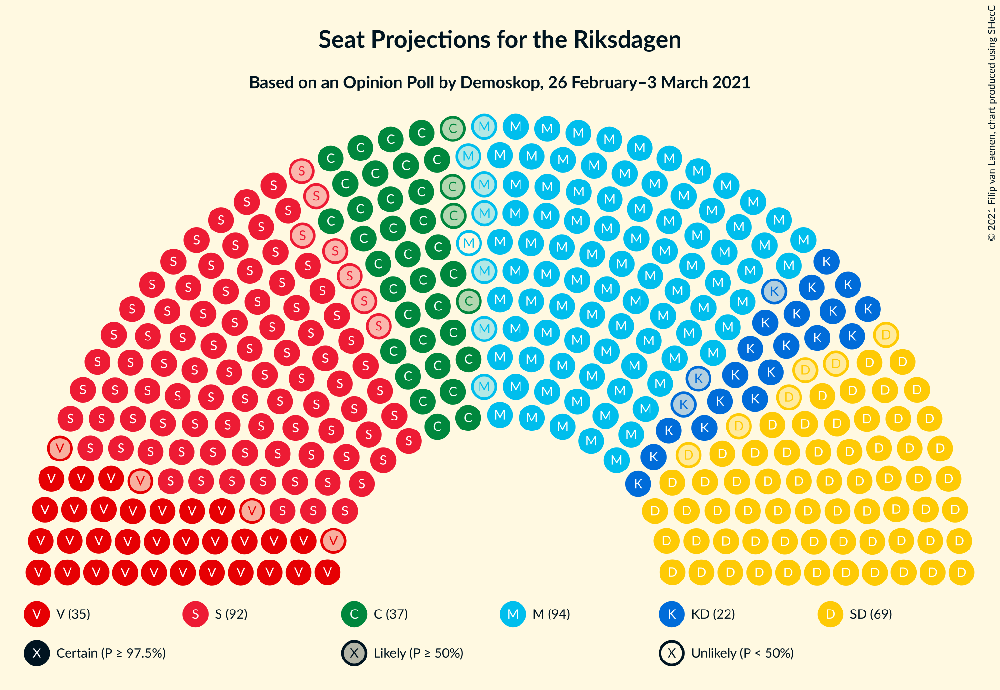
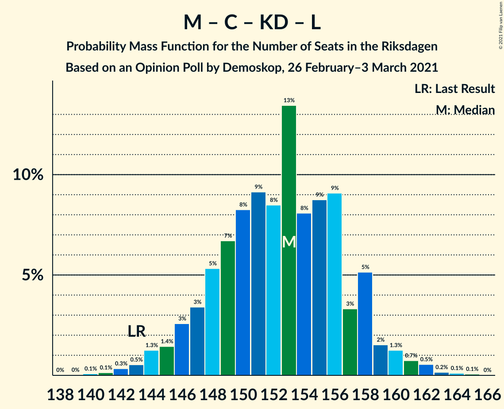
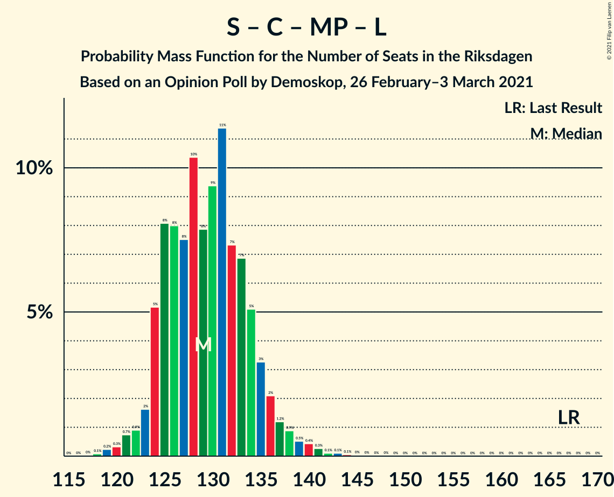

# Opinion Poll by Demoskop, 26 February–3 March 2021

<a href="#voting-intentions">Voting Intentions</a> | <a href="#seats">Seats</a> | <a href="#coalitions">Coalitions</a> | <a href="#technical-information">Technical Information</a>

## Voting Intentions

### Confidence Intervals

| Party | Last Result | Poll Result | 80% Confidence Interval | 90% Confidence Interval | 95% Confidence Interval | 99% Confidence Interval |
|:-----:|:-----------:|:-----------:|:-----------------------:|:-----------------------:|:-----------------------:|:-----------------------:|
| Moderata samlingspartiet | 19.8% | 24.5% | 23.4–25.7% |23.1–26.0% |22.8–26.3% |22.3–26.9% |
| Sveriges socialdemokratiska arbetareparti | 28.3% | 24.2% | 23.1–25.4% |22.8–25.8% |22.5–26.0% |22.0–26.6% |
| Sverigedemokraterna | 17.5% | 18.2% | 17.2–19.3% |16.9–19.6% |16.7–19.9% |16.2–20.4% |
| Centerpartiet | 8.6% | 9.9% | 9.1–10.7% |8.9–11.0% |8.7–11.2% |8.4–11.6% |
| Vänsterpartiet | 8.0% | 9.3% | 8.6–10.1% |8.4–10.3% |8.2–10.5% |7.8–11.0% |
| Kristdemokraterna | 6.3% | 5.8% | 5.2–6.5% |5.0–6.7% |4.9–6.8% |4.6–7.2% |
| Miljöpartiet de gröna | 4.4% | 3.1% | 2.7–3.6% |2.6–3.8% |2.5–3.9% |2.3–4.2% |
| Liberalerna | 5.5% | 2.7% | 2.3–3.2% |2.2–3.4% |2.1–3.5% |2.0–3.7% |

*Note:* The poll result column reflects the actual value used in the calculations. Published results may vary slightly, and in addition be rounded to fewer digits.

## Seats

### Confidence Intervals

| Party | Last Result | Median | 80% Confidence Interval | 90% Confidence Interval | 95% Confidence Interval | 99% Confidence Interval |
|:-----:|:-----------:|:------:|:-----------------------:|:-----------------------:|:-----------------------:|:-----------------------:|
| <a href="#moderata-samlingspartiet">Moderata samlingspartiet</a> | 70 | 93 | 88–97 |87–98 |86–100 |84–101 |
| <a href="#sveriges-socialdemokratiska-arbetareparti">Sveriges socialdemokratiska arbetareparti</a> | 100 | 92 | 87–96 |86–97 |85–98 |83–101 |
| <a href="#sverigedemokraterna">Sverigedemokraterna</a> | 62 | 69 | 66–73 |64–74 |63–75 |62–77 |
| <a href="#centerpartiet">Centerpartiet</a> | 31 | 37 | 35–41 |34–41 |33–42 |32–44 |
| <a href="#vänsterpartiet">Vänsterpartiet</a> | 28 | 35 | 32–38 |32–39 |31–40 |30–42 |
| <a href="#kristdemokraterna">Kristdemokraterna</a> | 22 | 22 | 20–24 |19–25 |19–26 |18–27 |
| <a href="#miljöpartiet-de-gröna">Miljöpartiet de gröna</a> | 16 | 0 | 0 |0 |0 |0–15 |
| <a href="#liberalerna">Liberalerna</a> | 20 | 0 | 0 |0 |0 |0 |

### Moderata samlingspartiet

*For a full overview of the results for this party, see the [Moderata samlingspartiet](party-moderatasamlingspartiet.html) page.*

| Number of Seats | Probability | Accumulated | Special Marks |
|:---------------:|:-----------:|:-----------:|:-------------:|
| 70 | 0% | 100% | Last Result |
| 71 | 0% | 100% |  |
| 72 | 0% | 100% |  |
| 73 | 0% | 100% |  |
| 74 | 0% | 100% |  |
| 75 | 0% | 100% |  |
| 76 | 0% | 100% |  |
| 77 | 0% | 100% |  |
| 78 | 0% | 100% |  |
| 79 | 0% | 100% |  |
| 80 | 0% | 100% |  |
| 81 | 0% | 100% |  |
| 82 | 0.1% | 100% |  |
| 83 | 0.2% | 99.9% |  |
| 84 | 0.4% | 99.7% |  |
| 85 | 0.7% | 99.4% |  |
| 86 | 2% | 98.7% |  |
| 87 | 3% | 97% |  |
| 88 | 5% | 95% |  |
| 89 | 6% | 90% |  |
| 90 | 7% | 84% |  |
| 91 | 11% | 78% |  |
| 92 | 9% | 66% |  |
| 93 | 12% | 57% | Median |
| 94 | 13% | 45% |  |
| 95 | 10% | 32% |  |
| 96 | 7% | 22% |  |
| 97 | 6% | 15% |  |
| 98 | 4% | 9% |  |
| 99 | 2% | 5% |  |
| 100 | 1.3% | 3% |  |
| 101 | 0.9% | 1.3% |  |
| 102 | 0.2% | 0.4% |  |
| 103 | 0.1% | 0.2% |  |
| 104 | 0.1% | 0.1% |  |
| 105 | 0% | 0% |  |

### Sveriges socialdemokratiska arbetareparti

*For a full overview of the results for this party, see the [Sveriges socialdemokratiska arbetareparti](party-sverigessocialdemokratiskaarbetareparti.html) page.*

| Number of Seats | Probability | Accumulated | Special Marks |
|:---------------:|:-----------:|:-----------:|:-------------:|
| 81 | 0.1% | 100% |  |
| 82 | 0.2% | 99.9% |  |
| 83 | 0.3% | 99.7% |  |
| 84 | 0.8% | 99.4% |  |
| 85 | 1.4% | 98.6% |  |
| 86 | 3% | 97% |  |
| 87 | 6% | 94% |  |
| 88 | 7% | 88% |  |
| 89 | 8% | 81% |  |
| 90 | 10% | 73% |  |
| 91 | 9% | 63% |  |
| 92 | 14% | 54% | Median |
| 93 | 11% | 40% |  |
| 94 | 10% | 29% |  |
| 95 | 6% | 20% |  |
| 96 | 6% | 13% |  |
| 97 | 3% | 7% |  |
| 98 | 2% | 4% |  |
| 99 | 1.0% | 2% |  |
| 100 | 0.5% | 1.2% | Last Result |
| 101 | 0.5% | 0.7% |  |
| 102 | 0.1% | 0.2% |  |
| 103 | 0.1% | 0.1% |  |
| 104 | 0% | 0% |  |

### Sverigedemokraterna

*For a full overview of the results for this party, see the [Sverigedemokraterna](party-sverigedemokraterna.html) page.*

| Number of Seats | Probability | Accumulated | Special Marks |
|:---------------:|:-----------:|:-----------:|:-------------:|
| 59 | 0% | 100% |  |
| 60 | 0.1% | 99.9% |  |
| 61 | 0.3% | 99.8% |  |
| 62 | 0.9% | 99.5% | Last Result |
| 63 | 2% | 98.7% |  |
| 64 | 2% | 97% |  |
| 65 | 5% | 95% |  |
| 66 | 5% | 90% |  |
| 67 | 12% | 85% |  |
| 68 | 10% | 73% |  |
| 69 | 16% | 63% | Median |
| 70 | 13% | 47% |  |
| 71 | 10% | 34% |  |
| 72 | 11% | 24% |  |
| 73 | 5% | 13% |  |
| 74 | 4% | 8% |  |
| 75 | 2% | 4% |  |
| 76 | 0.7% | 2% |  |
| 77 | 0.6% | 0.9% |  |
| 78 | 0.2% | 0.4% |  |
| 79 | 0.1% | 0.2% |  |
| 80 | 0% | 0% |  |

### Centerpartiet

*For a full overview of the results for this party, see the [Centerpartiet](party-centerpartiet.html) page.*

| Number of Seats | Probability | Accumulated | Special Marks |
|:---------------:|:-----------:|:-----------:|:-------------:|
| 30 | 0.1% | 100% |  |
| 31 | 0.3% | 99.9% | Last Result |
| 32 | 0.7% | 99.6% |  |
| 33 | 2% | 98.9% |  |
| 34 | 7% | 97% |  |
| 35 | 12% | 90% |  |
| 36 | 14% | 78% |  |
| 37 | 16% | 64% | Median |
| 38 | 13% | 49% |  |
| 39 | 15% | 36% |  |
| 40 | 11% | 21% |  |
| 41 | 6% | 10% |  |
| 42 | 2% | 4% |  |
| 43 | 1.2% | 2% |  |
| 44 | 0.7% | 0.9% |  |
| 45 | 0.2% | 0.2% |  |
| 46 | 0.1% | 0.1% |  |
| 47 | 0% | 0% |  |

### Vänsterpartiet

*For a full overview of the results for this party, see the [Vänsterpartiet](party-vänsterpartiet.html) page.*

| Number of Seats | Probability | Accumulated | Special Marks |
|:---------------:|:-----------:|:-----------:|:-------------:|
| 28 | 0.1% | 100% | Last Result |
| 29 | 0.3% | 99.9% |  |
| 30 | 0.9% | 99.6% |  |
| 31 | 3% | 98.7% |  |
| 32 | 6% | 96% |  |
| 33 | 13% | 90% |  |
| 34 | 15% | 77% |  |
| 35 | 16% | 62% | Median |
| 36 | 16% | 46% |  |
| 37 | 12% | 30% |  |
| 38 | 9% | 18% |  |
| 39 | 6% | 9% |  |
| 40 | 2% | 3% |  |
| 41 | 0.7% | 1.3% |  |
| 42 | 0.4% | 0.6% |  |
| 43 | 0.1% | 0.1% |  |
| 44 | 0% | 0% |  |

### Kristdemokraterna

*For a full overview of the results for this party, see the [Kristdemokraterna](party-kristdemokraterna.html) page.*

| Number of Seats | Probability | Accumulated | Special Marks |
|:---------------:|:-----------:|:-----------:|:-------------:|
| 17 | 0.3% | 100% |  |
| 18 | 2% | 99.6% |  |
| 19 | 4% | 98% |  |
| 20 | 13% | 93% |  |
| 21 | 22% | 80% |  |
| 22 | 22% | 58% | Last Result, Median |
| 23 | 17% | 36% |  |
| 24 | 9% | 18% |  |
| 25 | 6% | 9% |  |
| 26 | 2% | 3% |  |
| 27 | 0.7% | 1.0% |  |
| 28 | 0.3% | 0.3% |  |
| 29 | 0% | 0.1% |  |
| 30 | 0% | 0% |  |

### Miljöpartiet de gröna

*For a full overview of the results for this party, see the [Miljöpartiet de gröna](party-miljöpartietdegröna.html) page.*

| Number of Seats | Probability | Accumulated | Special Marks |
|:---------------:|:-----------:|:-----------:|:-------------:|
| 0 | 98.6% | 100% | Median |
| 1 | 0% | 1.4% |  |
| 2 | 0% | 1.4% |  |
| 3 | 0% | 1.4% |  |
| 4 | 0% | 1.4% |  |
| 5 | 0% | 1.4% |  |
| 6 | 0% | 1.4% |  |
| 7 | 0% | 1.4% |  |
| 8 | 0% | 1.4% |  |
| 9 | 0% | 1.4% |  |
| 10 | 0% | 1.4% |  |
| 11 | 0% | 1.4% |  |
| 12 | 0% | 1.4% |  |
| 13 | 0% | 1.4% |  |
| 14 | 0% | 1.4% |  |
| 15 | 1.1% | 1.4% |  |
| 16 | 0.3% | 0.3% | Last Result |
| 17 | 0% | 0% |  |

### Liberalerna

*For a full overview of the results for this party, see the [Liberalerna](party-liberalerna.html) page.*

| Number of Seats | Probability | Accumulated | Special Marks |
|:---------------:|:-----------:|:-----------:|:-------------:|
| 0 | 99.9% | 100% | Median |
| 1 | 0% | 0.1% |  |
| 2 | 0% | 0.1% |  |
| 3 | 0% | 0.1% |  |
| 4 | 0% | 0.1% |  |
| 5 | 0% | 0.1% |  |
| 6 | 0% | 0.1% |  |
| 7 | 0% | 0.1% |  |
| 8 | 0% | 0.1% |  |
| 9 | 0% | 0.1% |  |
| 10 | 0% | 0.1% |  |
| 11 | 0% | 0.1% |  |
| 12 | 0% | 0.1% |  |
| 13 | 0% | 0.1% |  |
| 14 | 0% | 0.1% |  |
| 15 | 0% | 0.1% |  |
| 16 | 0% | 0% |  |
| 17 | 0% | 0% |  |
| 18 | 0% | 0% |  |
| 19 | 0% | 0% |  |
| 20 | 0% | 0% | Last Result |

## Coalitions

### Confidence Intervals

| Coalition | Last Result | Median | Majority? | 80% Confidence Interval | 90% Confidence Interval | 95% Confidence Interval | 99% Confidence Interval |
|:---------:|:-----------:|:------:|:---------:|:-----------------------:|:-----------------------:|:-----------------------:|:-----------------------:|
| Moderata samlingspartiet – Sveriges socialdemokratiska arbetareparti – Centerpartiet | 201 | 222 | 100% | 217–227 | 216–228 | 214–229 | 210–232 |
| Moderata samlingspartiet – Sveriges socialdemokratiska arbetareparti | 170 | 185 | 99.3% | 180–189 | 178–191 | 177–192 | 174–194 |
| Moderata samlingspartiet – Sverigedemokraterna – Kristdemokraterna | 154 | 184 | 99.1% | 179–190 | 178–190 | 176–191 | 173–194 |
| Sveriges socialdemokratiska arbetareparti – Centerpartiet – Vänsterpartiet – Miljöpartiet de gröna – Liberalerna | 195 | 165 | 0.9% | 159–170 | 159–171 | 158–173 | 155–176 |
| Moderata samlingspartiet – Sverigedemokraterna | 132 | 163 | 0% | 157–167 | 156–168 | 154–170 | 151–172 |
| Moderata samlingspartiet – Centerpartiet – Kristdemokraterna – Liberalerna | 143 | 153 | 0% | 148–157 | 146–158 | 145–160 | 142–162 |
| Moderata samlingspartiet – Centerpartiet – Kristdemokraterna | 123 | 153 | 0% | 148–157 | 146–158 | 145–160 | 142–162 |
| Moderata samlingspartiet – Centerpartiet – Liberalerna | 121 | 130 | 0% | 126–135 | 124–137 | 123–138 | 121–140 |
| Moderata samlingspartiet – Centerpartiet | 101 | 130 | 0% | 126–135 | 124–137 | 123–138 | 121–140 |
| Sveriges socialdemokratiska arbetareparti – Centerpartiet – Miljöpartiet de gröna – Liberalerna | 167 | 129 | 0% | 125–134 | 124–136 | 123–137 | 120–141 |
| Sveriges socialdemokratiska arbetareparti – Vänsterpartiet – Miljöpartiet de gröna | 144 | 127 | 0% | 122–132 | 121–133 | 120–135 | 118–139 |
| Sveriges socialdemokratiska arbetareparti – Vänsterpartiet | 128 | 127 | 0% | 122–132 | 121–133 | 120–134 | 117–137 |
| Sveriges socialdemokratiska arbetareparti – Miljöpartiet de gröna | 116 | 92 | 0% | 87–96 | 86–98 | 86–99 | 84–104 |

### Moderata samlingspartiet – Sveriges socialdemokratiska arbetareparti – Centerpartiet

| Number of Seats | Probability | Accumulated | Special Marks |
|:---------------:|:-----------:|:-----------:|:-------------:|
| 201 | 0% | 100% | Last Result |
| 202 | 0% | 100% |  |
| 203 | 0% | 100% |  |
| 204 | 0% | 100% |  |
| 205 | 0% | 100% |  |
| 206 | 0% | 100% |  |
| 207 | 0% | 100% |  |
| 208 | 0% | 99.9% |  |
| 209 | 0.2% | 99.9% |  |
| 210 | 0.3% | 99.7% |  |
| 211 | 0.3% | 99.4% |  |
| 212 | 0.6% | 99.2% |  |
| 213 | 0.3% | 98.6% |  |
| 214 | 0.8% | 98% |  |
| 215 | 1.4% | 97% |  |
| 216 | 4% | 96% |  |
| 217 | 3% | 92% |  |
| 218 | 6% | 90% |  |
| 219 | 8% | 83% |  |
| 220 | 5% | 75% |  |
| 221 | 9% | 70% |  |
| 222 | 16% | 61% | Median |
| 223 | 11% | 45% |  |
| 224 | 6% | 34% |  |
| 225 | 8% | 28% |  |
| 226 | 10% | 20% |  |
| 227 | 4% | 11% |  |
| 228 | 3% | 7% |  |
| 229 | 2% | 4% |  |
| 230 | 1.2% | 2% |  |
| 231 | 0.4% | 0.9% |  |
| 232 | 0.2% | 0.5% |  |
| 233 | 0.2% | 0.3% |  |
| 234 | 0% | 0.1% |  |
| 235 | 0% | 0% |  |

### Moderata samlingspartiet – Sveriges socialdemokratiska arbetareparti

| Number of Seats | Probability | Accumulated | Special Marks |
|:---------------:|:-----------:|:-----------:|:-------------:|
| 170 | 0% | 100% | Last Result |
| 171 | 0% | 99.9% |  |
| 172 | 0.2% | 99.9% |  |
| 173 | 0.2% | 99.7% |  |
| 174 | 0.2% | 99.5% |  |
| 175 | 0.8% | 99.3% | Majority |
| 176 | 0.6% | 98.5% |  |
| 177 | 1.5% | 98% |  |
| 178 | 2% | 96% |  |
| 179 | 4% | 95% |  |
| 180 | 4% | 91% |  |
| 181 | 7% | 87% |  |
| 182 | 11% | 80% |  |
| 183 | 8% | 69% |  |
| 184 | 8% | 61% |  |
| 185 | 10% | 53% | Median |
| 186 | 13% | 43% |  |
| 187 | 6% | 31% |  |
| 188 | 8% | 25% |  |
| 189 | 6% | 16% |  |
| 190 | 3% | 10% |  |
| 191 | 3% | 7% |  |
| 192 | 2% | 3% |  |
| 193 | 0.7% | 2% |  |
| 194 | 0.5% | 0.9% |  |
| 195 | 0.2% | 0.5% |  |
| 196 | 0.1% | 0.2% |  |
| 197 | 0.1% | 0.1% |  |
| 198 | 0% | 0% |  |

### Moderata samlingspartiet – Sverigedemokraterna – Kristdemokraterna

| Number of Seats | Probability | Accumulated | Special Marks |
|:---------------:|:-----------:|:-----------:|:-------------:|
| 154 | 0% | 100% | Last Result |
| 155 | 0% | 100% |  |
| 156 | 0% | 100% |  |
| 157 | 0% | 100% |  |
| 158 | 0% | 100% |  |
| 159 | 0% | 100% |  |
| 160 | 0% | 100% |  |
| 161 | 0% | 100% |  |
| 162 | 0% | 100% |  |
| 163 | 0% | 100% |  |
| 164 | 0% | 100% |  |
| 165 | 0% | 100% |  |
| 166 | 0% | 100% |  |
| 167 | 0% | 100% |  |
| 168 | 0% | 100% |  |
| 169 | 0% | 100% |  |
| 170 | 0.1% | 99.9% |  |
| 171 | 0.1% | 99.9% |  |
| 172 | 0.1% | 99.8% |  |
| 173 | 0.3% | 99.7% |  |
| 174 | 0.3% | 99.4% |  |
| 175 | 0.7% | 99.1% | Majority |
| 176 | 0.9% | 98% |  |
| 177 | 2% | 97% |  |
| 178 | 4% | 95% |  |
| 179 | 3% | 92% |  |
| 180 | 5% | 89% |  |
| 181 | 7% | 84% |  |
| 182 | 8% | 77% |  |
| 183 | 9% | 69% |  |
| 184 | 10% | 60% | Median |
| 185 | 12% | 49% |  |
| 186 | 10% | 37% |  |
| 187 | 5% | 27% |  |
| 188 | 7% | 21% |  |
| 189 | 4% | 15% |  |
| 190 | 7% | 11% |  |
| 191 | 1.2% | 3% |  |
| 192 | 1.1% | 2% |  |
| 193 | 0.6% | 1.2% |  |
| 194 | 0.3% | 0.6% |  |
| 195 | 0.1% | 0.3% |  |
| 196 | 0.1% | 0.2% |  |
| 197 | 0% | 0.1% |  |
| 198 | 0% | 0% |  |

### Sveriges socialdemokratiska arbetareparti – Centerpartiet – Vänsterpartiet – Miljöpartiet de gröna – Liberalerna

| Number of Seats | Probability | Accumulated | Special Marks |
|:---------------:|:-----------:|:-----------:|:-------------:|
| 152 | 0% | 100% |  |
| 153 | 0.1% | 99.9% |  |
| 154 | 0.1% | 99.8% |  |
| 155 | 0.3% | 99.7% |  |
| 156 | 0.6% | 99.4% |  |
| 157 | 1.1% | 98.8% |  |
| 158 | 1.2% | 98% |  |
| 159 | 7% | 97% |  |
| 160 | 4% | 89% |  |
| 161 | 7% | 85% |  |
| 162 | 5% | 79% |  |
| 163 | 10% | 73% |  |
| 164 | 12% | 63% | Median |
| 165 | 10% | 51% |  |
| 166 | 9% | 40% |  |
| 167 | 8% | 31% |  |
| 168 | 7% | 23% |  |
| 169 | 5% | 16% |  |
| 170 | 3% | 11% |  |
| 171 | 4% | 8% |  |
| 172 | 2% | 5% |  |
| 173 | 0.9% | 3% |  |
| 174 | 0.7% | 2% |  |
| 175 | 0.3% | 0.9% | Majority |
| 176 | 0.3% | 0.6% |  |
| 177 | 0.1% | 0.3% |  |
| 178 | 0.1% | 0.2% |  |
| 179 | 0.1% | 0.1% |  |
| 180 | 0% | 0.1% |  |
| 181 | 0% | 0% |  |
| 182 | 0% | 0% |  |
| 183 | 0% | 0% |  |
| 184 | 0% | 0% |  |
| 185 | 0% | 0% |  |
| 186 | 0% | 0% |  |
| 187 | 0% | 0% |  |
| 188 | 0% | 0% |  |
| 189 | 0% | 0% |  |
| 190 | 0% | 0% |  |
| 191 | 0% | 0% |  |
| 192 | 0% | 0% |  |
| 193 | 0% | 0% |  |
| 194 | 0% | 0% |  |
| 195 | 0% | 0% | Last Result |

### Moderata samlingspartiet – Sverigedemokraterna

| Number of Seats | Probability | Accumulated | Special Marks |
|:---------------:|:-----------:|:-----------:|:-------------:|
| 132 | 0% | 100% | Last Result |
| 133 | 0% | 100% |  |
| 134 | 0% | 100% |  |
| 135 | 0% | 100% |  |
| 136 | 0% | 100% |  |
| 137 | 0% | 100% |  |
| 138 | 0% | 100% |  |
| 139 | 0% | 100% |  |
| 140 | 0% | 100% |  |
| 141 | 0% | 100% |  |
| 142 | 0% | 100% |  |
| 143 | 0% | 100% |  |
| 144 | 0% | 100% |  |
| 145 | 0% | 100% |  |
| 146 | 0% | 100% |  |
| 147 | 0% | 100% |  |
| 148 | 0% | 100% |  |
| 149 | 0.1% | 99.9% |  |
| 150 | 0.2% | 99.9% |  |
| 151 | 0.2% | 99.7% |  |
| 152 | 0.4% | 99.5% |  |
| 153 | 0.7% | 99.0% |  |
| 154 | 1.0% | 98% |  |
| 155 | 2% | 97% |  |
| 156 | 4% | 96% |  |
| 157 | 2% | 92% |  |
| 158 | 5% | 89% |  |
| 159 | 5% | 84% |  |
| 160 | 10% | 79% |  |
| 161 | 11% | 69% |  |
| 162 | 8% | 58% | Median |
| 163 | 11% | 51% |  |
| 164 | 13% | 40% |  |
| 165 | 6% | 27% |  |
| 166 | 7% | 20% |  |
| 167 | 5% | 13% |  |
| 168 | 4% | 9% |  |
| 169 | 1.4% | 4% |  |
| 170 | 2% | 3% |  |
| 171 | 0.4% | 1.1% |  |
| 172 | 0.3% | 0.6% |  |
| 173 | 0.2% | 0.3% |  |
| 174 | 0.1% | 0.2% |  |
| 175 | 0% | 0% | Majority |

### Moderata samlingspartiet – Centerpartiet – Kristdemokraterna – Liberalerna

| Number of Seats | Probability | Accumulated | Special Marks |
|:---------------:|:-----------:|:-----------:|:-------------:|
| 139 | 0% | 100% |  |
| 140 | 0.1% | 99.9% |  |
| 141 | 0.1% | 99.9% |  |
| 142 | 0.3% | 99.7% |  |
| 143 | 0.5% | 99.4% | Last Result |
| 144 | 1.3% | 98.9% |  |
| 145 | 1.4% | 98% |  |
| 146 | 3% | 96% |  |
| 147 | 3% | 94% |  |
| 148 | 5% | 90% |  |
| 149 | 7% | 85% |  |
| 150 | 8% | 78% |  |
| 151 | 9% | 70% |  |
| 152 | 8% | 61% | Median |
| 153 | 13% | 52% |  |
| 154 | 8% | 39% |  |
| 155 | 9% | 31% |  |
| 156 | 9% | 22% |  |
| 157 | 3% | 13% |  |
| 158 | 5% | 10% |  |
| 159 | 2% | 4% |  |
| 160 | 1.3% | 3% |  |
| 161 | 0.7% | 2% |  |
| 162 | 0.5% | 0.9% |  |
| 163 | 0.2% | 0.4% |  |
| 164 | 0.1% | 0.2% |  |
| 165 | 0.1% | 0.1% |  |
| 166 | 0% | 0% |  |

### Moderata samlingspartiet – Centerpartiet – Kristdemokraterna

| Number of Seats | Probability | Accumulated | Special Marks |
|:---------------:|:-----------:|:-----------:|:-------------:|
| 123 | 0% | 100% | Last Result |
| 124 | 0% | 100% |  |
| 125 | 0% | 100% |  |
| 126 | 0% | 100% |  |
| 127 | 0% | 100% |  |
| 128 | 0% | 100% |  |
| 129 | 0% | 100% |  |
| 130 | 0% | 100% |  |
| 131 | 0% | 100% |  |
| 132 | 0% | 100% |  |
| 133 | 0% | 100% |  |
| 134 | 0% | 100% |  |
| 135 | 0% | 100% |  |
| 136 | 0% | 100% |  |
| 137 | 0% | 100% |  |
| 138 | 0% | 100% |  |
| 139 | 0% | 100% |  |
| 140 | 0.1% | 99.9% |  |
| 141 | 0.1% | 99.9% |  |
| 142 | 0.3% | 99.7% |  |
| 143 | 0.5% | 99.4% |  |
| 144 | 1.3% | 98.8% |  |
| 145 | 1.4% | 98% |  |
| 146 | 3% | 96% |  |
| 147 | 3% | 94% |  |
| 148 | 5% | 90% |  |
| 149 | 7% | 85% |  |
| 150 | 8% | 78% |  |
| 151 | 9% | 70% |  |
| 152 | 8% | 61% | Median |
| 153 | 13% | 52% |  |
| 154 | 8% | 39% |  |
| 155 | 9% | 31% |  |
| 156 | 9% | 22% |  |
| 157 | 3% | 13% |  |
| 158 | 5% | 10% |  |
| 159 | 2% | 4% |  |
| 160 | 1.3% | 3% |  |
| 161 | 0.7% | 2% |  |
| 162 | 0.5% | 0.9% |  |
| 163 | 0.2% | 0.3% |  |
| 164 | 0.1% | 0.2% |  |
| 165 | 0.1% | 0.1% |  |
| 166 | 0% | 0% |  |

### Moderata samlingspartiet – Centerpartiet – Liberalerna

| Number of Seats | Probability | Accumulated | Special Marks |
|:---------------:|:-----------:|:-----------:|:-------------:|
| 118 | 0.1% | 100% |  |
| 119 | 0.1% | 99.9% |  |
| 120 | 0.2% | 99.8% |  |
| 121 | 0.5% | 99.6% | Last Result |
| 122 | 1.1% | 99.1% |  |
| 123 | 1.0% | 98% |  |
| 124 | 3% | 97% |  |
| 125 | 3% | 94% |  |
| 126 | 4% | 90% |  |
| 127 | 7% | 86% |  |
| 128 | 9% | 79% |  |
| 129 | 8% | 71% |  |
| 130 | 13% | 63% | Median |
| 131 | 9% | 50% |  |
| 132 | 12% | 41% |  |
| 133 | 9% | 29% |  |
| 134 | 5% | 20% |  |
| 135 | 6% | 14% |  |
| 136 | 3% | 8% |  |
| 137 | 2% | 5% |  |
| 138 | 1.3% | 3% |  |
| 139 | 0.9% | 2% |  |
| 140 | 0.3% | 0.6% |  |
| 141 | 0.2% | 0.4% |  |
| 142 | 0.1% | 0.2% |  |
| 143 | 0% | 0.1% |  |
| 144 | 0% | 0% |  |

### Moderata samlingspartiet – Centerpartiet

| Number of Seats | Probability | Accumulated | Special Marks |
|:---------------:|:-----------:|:-----------:|:-------------:|
| 101 | 0% | 100% | Last Result |
| 102 | 0% | 100% |  |
| 103 | 0% | 100% |  |
| 104 | 0% | 100% |  |
| 105 | 0% | 100% |  |
| 106 | 0% | 100% |  |
| 107 | 0% | 100% |  |
| 108 | 0% | 100% |  |
| 109 | 0% | 100% |  |
| 110 | 0% | 100% |  |
| 111 | 0% | 100% |  |
| 112 | 0% | 100% |  |
| 113 | 0% | 100% |  |
| 114 | 0% | 100% |  |
| 115 | 0% | 100% |  |
| 116 | 0% | 100% |  |
| 117 | 0% | 100% |  |
| 118 | 0.1% | 100% |  |
| 119 | 0.1% | 99.9% |  |
| 120 | 0.2% | 99.8% |  |
| 121 | 0.5% | 99.6% |  |
| 122 | 1.1% | 99.1% |  |
| 123 | 1.0% | 98% |  |
| 124 | 3% | 97% |  |
| 125 | 3% | 94% |  |
| 126 | 4% | 90% |  |
| 127 | 7% | 86% |  |
| 128 | 9% | 79% |  |
| 129 | 8% | 71% |  |
| 130 | 13% | 63% | Median |
| 131 | 9% | 50% |  |
| 132 | 12% | 41% |  |
| 133 | 9% | 29% |  |
| 134 | 5% | 20% |  |
| 135 | 6% | 14% |  |
| 136 | 3% | 8% |  |
| 137 | 2% | 5% |  |
| 138 | 1.3% | 3% |  |
| 139 | 0.9% | 1.5% |  |
| 140 | 0.3% | 0.6% |  |
| 141 | 0.2% | 0.3% |  |
| 142 | 0.1% | 0.1% |  |
| 143 | 0% | 0.1% |  |
| 144 | 0% | 0% |  |

### Sveriges socialdemokratiska arbetareparti – Centerpartiet – Miljöpartiet de gröna – Liberalerna

| Number of Seats | Probability | Accumulated | Special Marks |
|:---------------:|:-----------:|:-----------:|:-------------:|
| 118 | 0.1% | 100% |  |
| 119 | 0.2% | 99.9% |  |
| 120 | 0.3% | 99.6% |  |
| 121 | 0.7% | 99.3% |  |
| 122 | 0.9% | 98.6% |  |
| 123 | 2% | 98% |  |
| 124 | 5% | 96% |  |
| 125 | 8% | 91% |  |
| 126 | 8% | 83% |  |
| 127 | 8% | 75% |  |
| 128 | 10% | 67% |  |
| 129 | 8% | 57% | Median |
| 130 | 9% | 49% |  |
| 131 | 11% | 40% |  |
| 132 | 7% | 28% |  |
| 133 | 7% | 21% |  |
| 134 | 5% | 14% |  |
| 135 | 3% | 9% |  |
| 136 | 2% | 6% |  |
| 137 | 1.2% | 4% |  |
| 138 | 0.9% | 2% |  |
| 139 | 0.5% | 2% |  |
| 140 | 0.4% | 1.0% |  |
| 141 | 0.3% | 0.6% |  |
| 142 | 0.1% | 0.3% |  |
| 143 | 0.1% | 0.2% |  |
| 144 | 0.1% | 0.1% |  |
| 145 | 0% | 0.1% |  |
| 146 | 0% | 0% |  |
| 147 | 0% | 0% |  |
| 148 | 0% | 0% |  |
| 149 | 0% | 0% |  |
| 150 | 0% | 0% |  |
| 151 | 0% | 0% |  |
| 152 | 0% | 0% |  |
| 153 | 0% | 0% |  |
| 154 | 0% | 0% |  |
| 155 | 0% | 0% |  |
| 156 | 0% | 0% |  |
| 157 | 0% | 0% |  |
| 158 | 0% | 0% |  |
| 159 | 0% | 0% |  |
| 160 | 0% | 0% |  |
| 161 | 0% | 0% |  |
| 162 | 0% | 0% |  |
| 163 | 0% | 0% |  |
| 164 | 0% | 0% |  |
| 165 | 0% | 0% |  |
| 166 | 0% | 0% |  |
| 167 | 0% | 0% | Last Result |

### Sveriges socialdemokratiska arbetareparti – Vänsterpartiet – Miljöpartiet de gröna

| Number of Seats | Probability | Accumulated | Special Marks |
|:---------------:|:-----------:|:-----------:|:-------------:|
| 115 | 0% | 100% |  |
| 116 | 0.1% | 99.9% |  |
| 117 | 0.2% | 99.9% |  |
| 118 | 0.3% | 99.6% |  |
| 119 | 0.9% | 99.3% |  |
| 120 | 1.2% | 98% |  |
| 121 | 4% | 97% |  |
| 122 | 3% | 93% |  |
| 123 | 6% | 89% |  |
| 124 | 9% | 83% |  |
| 125 | 6% | 74% |  |
| 126 | 12% | 68% |  |
| 127 | 9% | 56% | Median |
| 128 | 11% | 47% |  |
| 129 | 9% | 36% |  |
| 130 | 8% | 27% |  |
| 131 | 6% | 19% |  |
| 132 | 5% | 13% |  |
| 133 | 3% | 8% |  |
| 134 | 2% | 5% |  |
| 135 | 1.0% | 3% |  |
| 136 | 0.7% | 2% |  |
| 137 | 0.5% | 1.3% |  |
| 138 | 0.2% | 0.8% |  |
| 139 | 0.2% | 0.6% |  |
| 140 | 0.2% | 0.4% |  |
| 141 | 0.1% | 0.2% |  |
| 142 | 0.1% | 0.2% |  |
| 143 | 0% | 0.1% |  |
| 144 | 0% | 0.1% | Last Result |
| 145 | 0% | 0% |  |

### Sveriges socialdemokratiska arbetareparti – Vänsterpartiet

| Number of Seats | Probability | Accumulated | Special Marks |
|:---------------:|:-----------:|:-----------:|:-------------:|
| 114 | 0% | 100% |  |
| 115 | 0.1% | 99.9% |  |
| 116 | 0.1% | 99.9% |  |
| 117 | 0.3% | 99.8% |  |
| 118 | 0.5% | 99.5% |  |
| 119 | 1.1% | 99.0% |  |
| 120 | 1.3% | 98% |  |
| 121 | 4% | 97% |  |
| 122 | 4% | 92% |  |
| 123 | 6% | 89% |  |
| 124 | 9% | 82% |  |
| 125 | 6% | 73% |  |
| 126 | 12% | 67% |  |
| 127 | 9% | 55% | Median |
| 128 | 11% | 46% | Last Result |
| 129 | 9% | 35% |  |
| 130 | 8% | 25% |  |
| 131 | 6% | 17% |  |
| 132 | 5% | 11% |  |
| 133 | 3% | 6% |  |
| 134 | 2% | 4% |  |
| 135 | 0.8% | 2% |  |
| 136 | 0.6% | 1.1% |  |
| 137 | 0.3% | 0.5% |  |
| 138 | 0.1% | 0.2% |  |
| 139 | 0.1% | 0.1% |  |
| 140 | 0% | 0% |  |

### Sveriges socialdemokratiska arbetareparti – Miljöpartiet de gröna

| Number of Seats | Probability | Accumulated | Special Marks |
|:---------------:|:-----------:|:-----------:|:-------------:|
| 81 | 0.1% | 100% |  |
| 82 | 0.1% | 99.9% |  |
| 83 | 0.3% | 99.8% |  |
| 84 | 0.6% | 99.5% |  |
| 85 | 1.4% | 98.9% |  |
| 86 | 3% | 98% |  |
| 87 | 5% | 94% |  |
| 88 | 7% | 89% |  |
| 89 | 7% | 82% |  |
| 90 | 10% | 74% |  |
| 91 | 9% | 64% |  |
| 92 | 14% | 56% | Median |
| 93 | 11% | 41% |  |
| 94 | 10% | 31% |  |
| 95 | 6% | 21% |  |
| 96 | 6% | 15% |  |
| 97 | 4% | 9% |  |
| 98 | 2% | 5% |  |
| 99 | 1.2% | 4% |  |
| 100 | 0.6% | 2% |  |
| 101 | 0.6% | 2% |  |
| 102 | 0.3% | 1.2% |  |
| 103 | 0.3% | 0.9% |  |
| 104 | 0.1% | 0.6% |  |
| 105 | 0.2% | 0.4% |  |
| 106 | 0.1% | 0.3% |  |
| 107 | 0.1% | 0.2% |  |
| 108 | 0.1% | 0.1% |  |
| 109 | 0% | 0.1% |  |
| 110 | 0% | 0% |  |
| 111 | 0% | 0% |  |
| 112 | 0% | 0% |  |
| 113 | 0% | 0% |  |
| 114 | 0% | 0% |  |
| 115 | 0% | 0% |  |
| 116 | 0% | 0% | Last Result |

## Technical Information

### Opinion Poll

+ **Polling firm:** Demoskop
+ **Commissioner(s):** —
+ **Fieldwork period:** 26 February–3 March 2021

### Calculations

+ **Sample size:** 2314
+ **Simulations done:** 1,048,576
+ **Error estimate:** 0.88%

