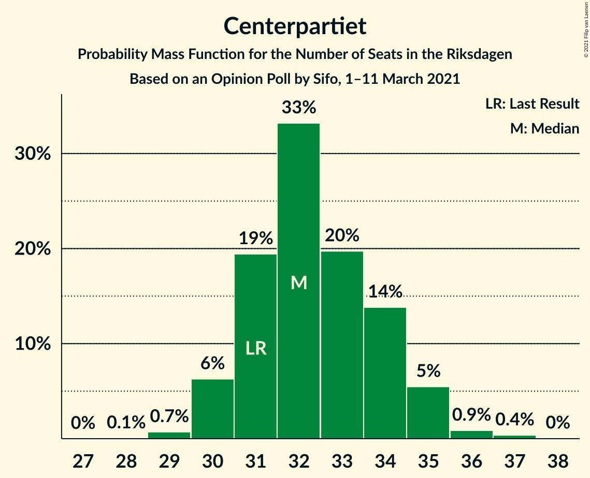

# Opinion Poll by Sifo, 1–11 March 2021

<a href="#voting-intentions">Voting Intentions</a> | <a href="#seats">Seats</a> | <a href="#coalitions">Coalitions</a> | <a href="#technical-information">Technical Information</a>

## Voting Intentions

### Confidence Intervals

| Party | Last Result | Poll Result | 80% Confidence Interval | 90% Confidence Interval | 95% Confidence Interval | 99% Confidence Interval |
|:-----:|:-----------:|:-----------:|:-----------------------:|:-----------------------:|:-----------------------:|:-----------------------:|
| Sveriges socialdemokratiska arbetareparti | 28.3% | 27.2% | 26.6–27.9% |26.4–28.0% |26.2–28.2% |25.9–28.5% |
| Moderata samlingspartiet | 19.8% | 22.9% | 22.3–23.5% |22.1–23.7% |22.0–23.9% |21.7–24.2% |
| Sverigedemokraterna | 17.5% | 18.4% | 17.8–19.0% |17.7–19.1% |17.5–19.3% |17.3–19.6% |
| Vänsterpartiet | 8.0% | 9.7% | 9.3–10.2% |9.2–10.3% |9.1–10.4% |8.9–10.6% |
| Centerpartiet | 8.6% | 8.8% | 8.4–9.2% |8.3–9.4% |8.2–9.5% |8.0–9.7% |
| Kristdemokraterna | 6.3% | 4.4% | 4.1–4.7% |4.0–4.8% |3.9–4.9% |3.8–5.0% |
| Miljöpartiet de gröna | 4.4% | 4.2% | 3.9–4.5% |3.8–4.6% |3.8–4.7% |3.6–4.8% |
| Liberalerna | 5.5% | 2.9% | 2.7–3.2% |2.6–3.2% |2.5–3.3% |2.4–3.4% |

*Note:* The poll result column reflects the actual value used in the calculations. Published results may vary slightly, and in addition be rounded to fewer digits.

## Seats

### Confidence Intervals

| Party | Last Result | Median | 80% Confidence Interval | 90% Confidence Interval | 95% Confidence Interval | 99% Confidence Interval |
|:-----:|:-----------:|:------:|:-----------------------:|:-----------------------:|:-----------------------:|:-----------------------:|
| <a href="#sveriges-socialdemokratiska-arbetareparti">Sveriges socialdemokratiska arbetareparti</a> | 100 | 100 | 97–104 |96–105 |96–107 |95–108 |
| <a href="#moderata-samlingspartiet">Moderata samlingspartiet</a> | 70 | 84 | 82–87 |81–88 |80–89 |79–91 |
| <a href="#sverigedemokraterna">Sverigedemokraterna</a> | 62 | 67 | 65–70 |65–72 |64–72 |63–74 |
| <a href="#vänsterpartiet">Vänsterpartiet</a> | 28 | 35 | 34–37 |34–38 |33–39 |33–40 |
| <a href="#centerpartiet">Centerpartiet</a> | 31 | 32 | 31–34 |30–35 |30–35 |29–36 |
| <a href="#kristdemokraterna">Kristdemokraterna</a> | 22 | 16 | 15–17 |15–17 |15–18 |0–19 |
| <a href="#miljöpartiet-de-gröna">Miljöpartiet de gröna</a> | 16 | 15 | 0–16 |0–17 |0–17 |0–18 |
| <a href="#liberalerna">Liberalerna</a> | 20 | 0 | 0 |0 |0 |0 |

### Sveriges socialdemokratiska arbetareparti

*For a full overview of the results for this party, see the [Sveriges socialdemokratiska arbetareparti](party-sverigessocialdemokratiskaarbetareparti.html) page.*

| Number of Seats | Probability | Accumulated | Special Marks |
|:---------------:|:-----------:|:-----------:|:-------------:|
| 93 | 0.1% | 100% |  |
| 94 | 0.2% | 99.9% |  |
| 95 | 1.2% | 99.7% |  |
| 96 | 7% | 98.5% |  |
| 97 | 6% | 91% |  |
| 98 | 13% | 85% |  |
| 99 | 14% | 72% |  |
| 100 | 23% | 59% | Last Result, Median |
| 101 | 13% | 36% |  |
| 102 | 6% | 23% |  |
| 103 | 6% | 18% |  |
| 104 | 6% | 12% |  |
| 105 | 2% | 6% |  |
| 106 | 1.1% | 4% |  |
| 107 | 2% | 3% |  |
| 108 | 0.2% | 0.6% |  |
| 109 | 0.2% | 0.4% |  |
| 110 | 0% | 0.2% |  |
| 111 | 0% | 0.2% |  |
| 112 | 0% | 0.1% |  |
| 113 | 0.1% | 0.1% |  |
| 114 | 0% | 0% |  |

### Moderata samlingspartiet

*For a full overview of the results for this party, see the [Moderata samlingspartiet](party-moderatasamlingspartiet.html) page.*

| Number of Seats | Probability | Accumulated | Special Marks |
|:---------------:|:-----------:|:-----------:|:-------------:|
| 70 | 0% | 100% | Last Result |
| 71 | 0% | 100% |  |
| 72 | 0% | 100% |  |
| 73 | 0% | 100% |  |
| 74 | 0% | 100% |  |
| 75 | 0% | 100% |  |
| 76 | 0% | 100% |  |
| 77 | 0% | 100% |  |
| 78 | 0.1% | 100% |  |
| 79 | 0.7% | 99.8% |  |
| 80 | 2% | 99.2% |  |
| 81 | 6% | 97% |  |
| 82 | 12% | 91% |  |
| 83 | 10% | 79% |  |
| 84 | 28% | 69% | Median |
| 85 | 14% | 42% |  |
| 86 | 9% | 28% |  |
| 87 | 10% | 18% |  |
| 88 | 5% | 8% |  |
| 89 | 2% | 4% |  |
| 90 | 0.9% | 2% |  |
| 91 | 0.4% | 0.8% |  |
| 92 | 0.3% | 0.4% |  |
| 93 | 0% | 0.1% |  |
| 94 | 0% | 0% |  |

### Sverigedemokraterna

*For a full overview of the results for this party, see the [Sverigedemokraterna](party-sverigedemokraterna.html) page.*

| Number of Seats | Probability | Accumulated | Special Marks |
|:---------------:|:-----------:|:-----------:|:-------------:|
| 62 | 0.1% | 100% | Last Result |
| 63 | 0.6% | 99.9% |  |
| 64 | 3% | 99.3% |  |
| 65 | 9% | 96% |  |
| 66 | 15% | 87% |  |
| 67 | 22% | 72% | Median |
| 68 | 14% | 50% |  |
| 69 | 17% | 36% |  |
| 70 | 11% | 19% |  |
| 71 | 3% | 8% |  |
| 72 | 4% | 6% |  |
| 73 | 1.3% | 2% |  |
| 74 | 0.5% | 0.6% |  |
| 75 | 0.1% | 0.2% |  |
| 76 | 0% | 0% |  |

### Vänsterpartiet

*For a full overview of the results for this party, see the [Vänsterpartiet](party-vänsterpartiet.html) page.*

| Number of Seats | Probability | Accumulated | Special Marks |
|:---------------:|:-----------:|:-----------:|:-------------:|
| 28 | 0% | 100% | Last Result |
| 29 | 0% | 100% |  |
| 30 | 0% | 100% |  |
| 31 | 0% | 100% |  |
| 32 | 0.5% | 100% |  |
| 33 | 3% | 99.5% |  |
| 34 | 12% | 96% |  |
| 35 | 35% | 84% | Median |
| 36 | 24% | 49% |  |
| 37 | 16% | 25% |  |
| 38 | 5% | 9% |  |
| 39 | 3% | 4% |  |
| 40 | 0.5% | 0.8% |  |
| 41 | 0.2% | 0.2% |  |
| 42 | 0% | 0% |  |

### Centerpartiet

*For a full overview of the results for this party, see the [Centerpartiet](party-centerpartiet.html) page.*

| Number of Seats | Probability | Accumulated | Special Marks |
|:---------------:|:-----------:|:-----------:|:-------------:|
| 28 | 0.1% | 100% |  |
| 29 | 0.7% | 99.9% |  |
| 30 | 6% | 99.2% |  |
| 31 | 19% | 93% | Last Result |
| 32 | 33% | 74% | Median |
| 33 | 20% | 40% |  |
| 34 | 14% | 21% |  |
| 35 | 5% | 7% |  |
| 36 | 0.9% | 1.3% |  |
| 37 | 0.4% | 0.4% |  |
| 38 | 0% | 0% |  |

### Kristdemokraterna

*For a full overview of the results for this party, see the [Kristdemokraterna](party-kristdemokraterna.html) page.*

| Number of Seats | Probability | Accumulated | Special Marks |
|:---------------:|:-----------:|:-----------:|:-------------:|
| 0 | 2% | 100% |  |
| 1 | 0% | 98% |  |
| 2 | 0% | 98% |  |
| 3 | 0% | 98% |  |
| 4 | 0% | 98% |  |
| 5 | 0% | 98% |  |
| 6 | 0% | 98% |  |
| 7 | 0% | 98% |  |
| 8 | 0% | 98% |  |
| 9 | 0% | 98% |  |
| 10 | 0% | 98% |  |
| 11 | 0% | 98% |  |
| 12 | 0% | 98% |  |
| 13 | 0% | 98% |  |
| 14 | 0% | 98% |  |
| 15 | 13% | 98% |  |
| 16 | 59% | 85% | Median |
| 17 | 22% | 26% |  |
| 18 | 3% | 4% |  |
| 19 | 1.0% | 1.0% |  |
| 20 | 0% | 0% |  |
| 21 | 0% | 0% |  |
| 22 | 0% | 0% | Last Result |

### Miljöpartiet de gröna

*For a full overview of the results for this party, see the [Miljöpartiet de gröna](party-miljöpartietdegröna.html) page.*

| Number of Seats | Probability | Accumulated | Special Marks |
|:---------------:|:-----------:|:-----------:|:-------------:|
| 0 | 17% | 100% |  |
| 1 | 0% | 83% |  |
| 2 | 0% | 83% |  |
| 3 | 0% | 83% |  |
| 4 | 0% | 83% |  |
| 5 | 0% | 83% |  |
| 6 | 0% | 83% |  |
| 7 | 0% | 83% |  |
| 8 | 0% | 83% |  |
| 9 | 0% | 83% |  |
| 10 | 0% | 83% |  |
| 11 | 0% | 83% |  |
| 12 | 0% | 83% |  |
| 13 | 0% | 83% |  |
| 14 | 0% | 83% |  |
| 15 | 42% | 83% | Median |
| 16 | 34% | 41% | Last Result |
| 17 | 6% | 7% |  |
| 18 | 0.8% | 0.8% |  |
| 19 | 0% | 0% |  |

### Liberalerna

*For a full overview of the results for this party, see the [Liberalerna](party-liberalerna.html) page.*

| Number of Seats | Probability | Accumulated | Special Marks |
|:---------------:|:-----------:|:-----------:|:-------------:|
| 0 | 100% | 100% | Median |
| 1 | 0% | 0% |  |
| 2 | 0% | 0% |  |
| 3 | 0% | 0% |  |
| 4 | 0% | 0% |  |
| 5 | 0% | 0% |  |
| 6 | 0% | 0% |  |
| 7 | 0% | 0% |  |
| 8 | 0% | 0% |  |
| 9 | 0% | 0% |  |
| 10 | 0% | 0% |  |
| 11 | 0% | 0% |  |
| 12 | 0% | 0% |  |
| 13 | 0% | 0% |  |
| 14 | 0% | 0% |  |
| 15 | 0% | 0% |  |
| 16 | 0% | 0% |  |
| 17 | 0% | 0% |  |
| 18 | 0% | 0% |  |
| 19 | 0% | 0% |  |
| 20 | 0% | 0% | Last Result |

## Coalitions

### Confidence Intervals

| Coalition | Last Result | Median | Majority? | 80% Confidence Interval | 90% Confidence Interval | 95% Confidence Interval | 99% Confidence Interval |
|:---------:|:-----------:|:------:|:---------:|:-----------------------:|:-----------------------:|:-----------------------:|:-----------------------:|
| Sveriges socialdemokratiska arbetareparti – Moderata samlingspartiet – Centerpartiet | 201 | 216 | 100% | 212–225 | 212–226 | 211–227 | 210–230 |
| Sveriges socialdemokratiska arbetareparti – Moderata samlingspartiet | 170 | 184 | 100% | 181–191 | 180–192 | 179–194 | 178–196 |
| Sveriges socialdemokratiska arbetareparti – Vänsterpartiet – Centerpartiet – Miljöpartiet de gröna – Liberalerna | 195 | 182 | 94% | 175–185 | 174–186 | 173–187 | 171–193 |
| Moderata samlingspartiet – Sverigedemokraterna – Kristdemokraterna | 154 | 167 | 6% | 164–174 | 163–175 | 162–176 | 156–178 |
| Moderata samlingspartiet – Sverigedemokraterna | 132 | 151 | 0% | 149–157 | 148–159 | 146–160 | 146–163 |
| Sveriges socialdemokratiska arbetareparti – Vänsterpartiet – Miljöpartiet de gröna | 144 | 150 | 0% | 141–152 | 140–153 | 139–155 | 137–160 |
| Sveriges socialdemokratiska arbetareparti – Centerpartiet – Miljöpartiet de gröna – Liberalerna | 167 | 146 | 0% | 138–149 | 137–151 | 136–152 | 134–155 |
| Sveriges socialdemokratiska arbetareparti – Vänsterpartiet | 128 | 135 | 0% | 133–141 | 132–142 | 131–143 | 130–146 |
| Moderata samlingspartiet – Centerpartiet – Kristdemokraterna – Liberalerna | 143 | 132 | 0% | 129–138 | 128–138 | 127–139 | 119–142 |
| Moderata samlingspartiet – Centerpartiet – Kristdemokraterna | 123 | 132 | 0% | 129–138 | 128–138 | 127–139 | 119–142 |
| Moderata samlingspartiet – Centerpartiet – Liberalerna | 121 | 116 | 0% | 113–121 | 113–122 | 112–123 | 111–126 |
| Moderata samlingspartiet – Centerpartiet | 101 | 116 | 0% | 113–121 | 113–122 | 112–123 | 111–126 |
| Sveriges socialdemokratiska arbetareparti – Miljöpartiet de gröna | 116 | 115 | 0% | 104–117 | 103–118 | 102–119 | 100–122 |

### Sveriges socialdemokratiska arbetareparti – Moderata samlingspartiet – Centerpartiet

| Number of Seats | Probability | Accumulated | Special Marks |
|:---------------:|:-----------:|:-----------:|:-------------:|
| 201 | 0% | 100% | Last Result |
| 202 | 0% | 100% |  |
| 203 | 0% | 100% |  |
| 204 | 0% | 100% |  |
| 205 | 0% | 100% |  |
| 206 | 0% | 100% |  |
| 207 | 0% | 100% |  |
| 208 | 0.1% | 100% |  |
| 209 | 0.2% | 99.9% |  |
| 210 | 0.6% | 99.7% |  |
| 211 | 3% | 99.2% |  |
| 212 | 8% | 97% |  |
| 213 | 11% | 89% |  |
| 214 | 9% | 78% |  |
| 215 | 15% | 69% |  |
| 216 | 18% | 54% | Median |
| 217 | 12% | 36% |  |
| 218 | 3% | 24% |  |
| 219 | 2% | 21% |  |
| 220 | 0.4% | 19% |  |
| 221 | 0.6% | 19% |  |
| 222 | 2% | 18% |  |
| 223 | 2% | 16% |  |
| 224 | 2% | 14% |  |
| 225 | 6% | 12% |  |
| 226 | 3% | 6% |  |
| 227 | 1.2% | 3% |  |
| 228 | 0.5% | 2% |  |
| 229 | 0.5% | 1.1% |  |
| 230 | 0.2% | 0.6% |  |
| 231 | 0% | 0.5% |  |
| 232 | 0% | 0.4% |  |
| 233 | 0% | 0.4% |  |
| 234 | 0.1% | 0.4% |  |
| 235 | 0.1% | 0.3% |  |
| 236 | 0.1% | 0.2% |  |
| 237 | 0.1% | 0.2% |  |
| 238 | 0% | 0.1% |  |
| 239 | 0% | 0% |  |

### Sveriges socialdemokratiska arbetareparti – Moderata samlingspartiet

| Number of Seats | Probability | Accumulated | Special Marks |
|:---------------:|:-----------:|:-----------:|:-------------:|
| 170 | 0% | 100% | Last Result |
| 171 | 0% | 100% |  |
| 172 | 0% | 100% |  |
| 173 | 0% | 100% |  |
| 174 | 0% | 100% |  |
| 175 | 0% | 100% | Majority |
| 176 | 0.1% | 100% |  |
| 177 | 0.2% | 99.9% |  |
| 178 | 1.4% | 99.7% |  |
| 179 | 3% | 98% |  |
| 180 | 4% | 95% |  |
| 181 | 10% | 91% |  |
| 182 | 17% | 81% |  |
| 183 | 10% | 64% |  |
| 184 | 19% | 54% | Median |
| 185 | 8% | 35% |  |
| 186 | 7% | 27% |  |
| 187 | 3% | 21% |  |
| 188 | 1.5% | 18% |  |
| 189 | 2% | 17% |  |
| 190 | 2% | 15% |  |
| 191 | 7% | 13% |  |
| 192 | 2% | 6% |  |
| 193 | 0.9% | 4% |  |
| 194 | 2% | 3% |  |
| 195 | 0.7% | 1.4% |  |
| 196 | 0.2% | 0.7% |  |
| 197 | 0% | 0.5% |  |
| 198 | 0% | 0.4% |  |
| 199 | 0.1% | 0.4% |  |
| 200 | 0% | 0.3% |  |
| 201 | 0.1% | 0.3% |  |
| 202 | 0% | 0.1% |  |
| 203 | 0.1% | 0.1% |  |
| 204 | 0% | 0.1% |  |
| 205 | 0% | 0% |  |

### Sveriges socialdemokratiska arbetareparti – Vänsterpartiet – Centerpartiet – Miljöpartiet de gröna – Liberalerna

| Number of Seats | Probability | Accumulated | Special Marks |
|:---------------:|:-----------:|:-----------:|:-------------:|
| 169 | 0.1% | 100% |  |
| 170 | 0.1% | 99.9% |  |
| 171 | 0.7% | 99.8% |  |
| 172 | 0.9% | 99.1% |  |
| 173 | 2% | 98% |  |
| 174 | 2% | 96% |  |
| 175 | 7% | 94% | Majority |
| 176 | 2% | 87% |  |
| 177 | 1.3% | 85% |  |
| 178 | 2% | 84% |  |
| 179 | 2% | 82% |  |
| 180 | 13% | 80% |  |
| 181 | 11% | 66% |  |
| 182 | 29% | 56% | Median |
| 183 | 5% | 27% |  |
| 184 | 11% | 22% |  |
| 185 | 4% | 10% |  |
| 186 | 4% | 7% |  |
| 187 | 0.8% | 3% |  |
| 188 | 0.3% | 2% |  |
| 189 | 0.1% | 2% |  |
| 190 | 0.2% | 2% |  |
| 191 | 0.2% | 2% |  |
| 192 | 1.0% | 2% |  |
| 193 | 0.2% | 0.6% |  |
| 194 | 0.2% | 0.4% |  |
| 195 | 0.1% | 0.2% | Last Result |
| 196 | 0.1% | 0.1% |  |
| 197 | 0% | 0% |  |

### Moderata samlingspartiet – Sverigedemokraterna – Kristdemokraterna

| Number of Seats | Probability | Accumulated | Special Marks |
|:---------------:|:-----------:|:-----------:|:-------------:|
| 153 | 0.1% | 100% |  |
| 154 | 0.1% | 99.9% | Last Result |
| 155 | 0.2% | 99.8% |  |
| 156 | 0.2% | 99.6% |  |
| 157 | 1.0% | 99.4% |  |
| 158 | 0.2% | 98% |  |
| 159 | 0.2% | 98% |  |
| 160 | 0.1% | 98% |  |
| 161 | 0.3% | 98% |  |
| 162 | 0.8% | 98% |  |
| 163 | 4% | 97% |  |
| 164 | 4% | 93% |  |
| 165 | 11% | 90% |  |
| 166 | 5% | 78% |  |
| 167 | 29% | 73% | Median |
| 168 | 11% | 44% |  |
| 169 | 13% | 34% |  |
| 170 | 2% | 20% |  |
| 171 | 2% | 18% |  |
| 172 | 1.3% | 16% |  |
| 173 | 2% | 15% |  |
| 174 | 7% | 13% |  |
| 175 | 2% | 6% | Majority |
| 176 | 2% | 4% |  |
| 177 | 0.9% | 2% |  |
| 178 | 0.7% | 0.9% |  |
| 179 | 0.1% | 0.2% |  |
| 180 | 0.1% | 0.1% |  |
| 181 | 0% | 0% |  |

### Moderata samlingspartiet – Sverigedemokraterna

| Number of Seats | Probability | Accumulated | Special Marks |
|:---------------:|:-----------:|:-----------:|:-------------:|
| 132 | 0% | 100% | Last Result |
| 133 | 0% | 100% |  |
| 134 | 0% | 100% |  |
| 135 | 0% | 100% |  |
| 136 | 0% | 100% |  |
| 137 | 0% | 100% |  |
| 138 | 0% | 100% |  |
| 139 | 0% | 100% |  |
| 140 | 0% | 100% |  |
| 141 | 0% | 100% |  |
| 142 | 0% | 100% |  |
| 143 | 0% | 100% |  |
| 144 | 0.1% | 100% |  |
| 145 | 0.1% | 99.9% |  |
| 146 | 2% | 99.7% |  |
| 147 | 2% | 97% |  |
| 148 | 5% | 95% |  |
| 149 | 11% | 90% |  |
| 150 | 6% | 79% |  |
| 151 | 26% | 73% | Median |
| 152 | 10% | 47% |  |
| 153 | 11% | 37% |  |
| 154 | 7% | 26% |  |
| 155 | 2% | 19% |  |
| 156 | 3% | 17% |  |
| 157 | 8% | 15% |  |
| 158 | 1.2% | 6% |  |
| 159 | 2% | 5% |  |
| 160 | 2% | 3% |  |
| 161 | 0.5% | 1.3% |  |
| 162 | 0.3% | 0.8% |  |
| 163 | 0.2% | 0.5% |  |
| 164 | 0.2% | 0.3% |  |
| 165 | 0% | 0.1% |  |
| 166 | 0.1% | 0.1% |  |
| 167 | 0% | 0% |  |

### Sveriges socialdemokratiska arbetareparti – Vänsterpartiet – Miljöpartiet de gröna

| Number of Seats | Probability | Accumulated | Special Marks |
|:---------------:|:-----------:|:-----------:|:-------------:|
| 136 | 0.2% | 100% |  |
| 137 | 0.4% | 99.8% |  |
| 138 | 0.6% | 99.3% |  |
| 139 | 2% | 98.8% |  |
| 140 | 2% | 96% |  |
| 141 | 6% | 94% |  |
| 142 | 2% | 89% |  |
| 143 | 1.5% | 86% |  |
| 144 | 0.8% | 85% | Last Result |
| 145 | 0.8% | 84% |  |
| 146 | 1.3% | 83% |  |
| 147 | 4% | 82% |  |
| 148 | 10% | 78% |  |
| 149 | 13% | 68% |  |
| 150 | 22% | 55% | Median |
| 151 | 14% | 32% |  |
| 152 | 10% | 18% |  |
| 153 | 3% | 8% |  |
| 154 | 2% | 5% |  |
| 155 | 0.6% | 3% |  |
| 156 | 0.2% | 2% |  |
| 157 | 0.4% | 2% |  |
| 158 | 0.4% | 1.4% |  |
| 159 | 0.5% | 1.1% |  |
| 160 | 0.3% | 0.6% |  |
| 161 | 0.2% | 0.3% |  |
| 162 | 0.1% | 0.1% |  |
| 163 | 0% | 0% |  |

### Sveriges socialdemokratiska arbetareparti – Centerpartiet – Miljöpartiet de gröna – Liberalerna

| Number of Seats | Probability | Accumulated | Special Marks |
|:---------------:|:-----------:|:-----------:|:-------------:|
| 132 | 0.1% | 100% |  |
| 133 | 0.1% | 99.9% |  |
| 134 | 0.6% | 99.8% |  |
| 135 | 1.1% | 99.2% |  |
| 136 | 2% | 98% |  |
| 137 | 3% | 96% |  |
| 138 | 5% | 93% |  |
| 139 | 3% | 88% |  |
| 140 | 0.9% | 85% |  |
| 141 | 0.8% | 84% |  |
| 142 | 0.8% | 84% |  |
| 143 | 4% | 83% |  |
| 144 | 5% | 79% |  |
| 145 | 12% | 74% |  |
| 146 | 17% | 63% |  |
| 147 | 18% | 45% | Median |
| 148 | 9% | 27% |  |
| 149 | 8% | 18% |  |
| 150 | 4% | 10% |  |
| 151 | 2% | 5% |  |
| 152 | 1.2% | 3% |  |
| 153 | 0.8% | 2% |  |
| 154 | 0.4% | 1.1% |  |
| 155 | 0.2% | 0.6% |  |
| 156 | 0.2% | 0.4% |  |
| 157 | 0.1% | 0.2% |  |
| 158 | 0.1% | 0.1% |  |
| 159 | 0% | 0% |  |
| 160 | 0% | 0% |  |
| 161 | 0% | 0% |  |
| 162 | 0% | 0% |  |
| 163 | 0% | 0% |  |
| 164 | 0% | 0% |  |
| 165 | 0% | 0% |  |
| 166 | 0% | 0% |  |
| 167 | 0% | 0% | Last Result |

### Sveriges socialdemokratiska arbetareparti – Vänsterpartiet

| Number of Seats | Probability | Accumulated | Special Marks |
|:---------------:|:-----------:|:-----------:|:-------------:|
| 128 | 0% | 100% | Last Result |
| 129 | 0.2% | 99.9% |  |
| 130 | 1.1% | 99.7% |  |
| 131 | 2% | 98.7% |  |
| 132 | 6% | 96% |  |
| 133 | 14% | 90% |  |
| 134 | 12% | 76% |  |
| 135 | 24% | 63% | Median |
| 136 | 12% | 39% |  |
| 137 | 6% | 27% |  |
| 138 | 3% | 22% |  |
| 139 | 3% | 19% |  |
| 140 | 3% | 16% |  |
| 141 | 6% | 13% |  |
| 142 | 3% | 7% |  |
| 143 | 2% | 4% |  |
| 144 | 1.0% | 2% |  |
| 145 | 0.5% | 1.0% |  |
| 146 | 0.1% | 0.6% |  |
| 147 | 0.1% | 0.5% |  |
| 148 | 0.1% | 0.4% |  |
| 149 | 0.1% | 0.4% |  |
| 150 | 0.1% | 0.3% |  |
| 151 | 0.1% | 0.2% |  |
| 152 | 0.1% | 0.1% |  |
| 153 | 0% | 0% |  |

### Moderata samlingspartiet – Centerpartiet – Kristdemokraterna – Liberalerna

| Number of Seats | Probability | Accumulated | Special Marks |
|:---------------:|:-----------:|:-----------:|:-------------:|
| 117 | 0.1% | 100% |  |
| 118 | 0.1% | 99.9% |  |
| 119 | 0.3% | 99.7% |  |
| 120 | 0.5% | 99.4% |  |
| 121 | 0.2% | 98.9% |  |
| 122 | 0.1% | 98.6% |  |
| 123 | 0.4% | 98.5% |  |
| 124 | 0.1% | 98% |  |
| 125 | 0.2% | 98% |  |
| 126 | 0.3% | 98% |  |
| 127 | 0.7% | 98% |  |
| 128 | 2% | 97% |  |
| 129 | 8% | 94% |  |
| 130 | 10% | 87% |  |
| 131 | 12% | 77% |  |
| 132 | 22% | 65% | Median |
| 133 | 12% | 43% |  |
| 134 | 10% | 32% |  |
| 135 | 5% | 22% |  |
| 136 | 3% | 17% |  |
| 137 | 2% | 13% |  |
| 138 | 8% | 11% |  |
| 139 | 1.3% | 4% |  |
| 140 | 1.4% | 2% |  |
| 141 | 0.4% | 1.0% |  |
| 142 | 0.5% | 0.7% |  |
| 143 | 0.1% | 0.1% | Last Result |
| 144 | 0% | 0% |  |

### Moderata samlingspartiet – Centerpartiet – Kristdemokraterna

| Number of Seats | Probability | Accumulated | Special Marks |
|:---------------:|:-----------:|:-----------:|:-------------:|
| 117 | 0.1% | 100% |  |
| 118 | 0.1% | 99.9% |  |
| 119 | 0.3% | 99.7% |  |
| 120 | 0.5% | 99.4% |  |
| 121 | 0.2% | 98.9% |  |
| 122 | 0.1% | 98.6% |  |
| 123 | 0.4% | 98.5% | Last Result |
| 124 | 0.1% | 98% |  |
| 125 | 0.2% | 98% |  |
| 126 | 0.3% | 98% |  |
| 127 | 0.7% | 98% |  |
| 128 | 2% | 97% |  |
| 129 | 8% | 94% |  |
| 130 | 10% | 87% |  |
| 131 | 12% | 77% |  |
| 132 | 22% | 65% | Median |
| 133 | 12% | 43% |  |
| 134 | 10% | 32% |  |
| 135 | 5% | 22% |  |
| 136 | 3% | 17% |  |
| 137 | 2% | 13% |  |
| 138 | 8% | 11% |  |
| 139 | 1.3% | 4% |  |
| 140 | 1.4% | 2% |  |
| 141 | 0.4% | 1.0% |  |
| 142 | 0.5% | 0.7% |  |
| 143 | 0.1% | 0.1% |  |
| 144 | 0% | 0% |  |

### Moderata samlingspartiet – Centerpartiet – Liberalerna

| Number of Seats | Probability | Accumulated | Special Marks |
|:---------------:|:-----------:|:-----------:|:-------------:|
| 110 | 0.2% | 100% |  |
| 111 | 0.7% | 99.7% |  |
| 112 | 3% | 99.0% |  |
| 113 | 9% | 96% |  |
| 114 | 7% | 87% |  |
| 115 | 10% | 79% |  |
| 116 | 24% | 69% | Median |
| 117 | 13% | 45% |  |
| 118 | 9% | 33% |  |
| 119 | 8% | 24% |  |
| 120 | 3% | 16% |  |
| 121 | 7% | 13% | Last Result |
| 122 | 2% | 6% |  |
| 123 | 2% | 4% |  |
| 124 | 0.6% | 2% |  |
| 125 | 0.5% | 1.1% |  |
| 126 | 0.3% | 0.5% |  |
| 127 | 0.1% | 0.2% |  |
| 128 | 0.1% | 0.1% |  |
| 129 | 0% | 0% |  |

### Moderata samlingspartiet – Centerpartiet

| Number of Seats | Probability | Accumulated | Special Marks |
|:---------------:|:-----------:|:-----------:|:-------------:|
| 101 | 0% | 100% | Last Result |
| 102 | 0% | 100% |  |
| 103 | 0% | 100% |  |
| 104 | 0% | 100% |  |
| 105 | 0% | 100% |  |
| 106 | 0% | 100% |  |
| 107 | 0% | 100% |  |
| 108 | 0% | 100% |  |
| 109 | 0% | 100% |  |
| 110 | 0.2% | 100% |  |
| 111 | 0.7% | 99.7% |  |
| 112 | 3% | 99.0% |  |
| 113 | 9% | 96% |  |
| 114 | 7% | 87% |  |
| 115 | 10% | 79% |  |
| 116 | 24% | 69% | Median |
| 117 | 13% | 45% |  |
| 118 | 9% | 33% |  |
| 119 | 8% | 24% |  |
| 120 | 3% | 16% |  |
| 121 | 7% | 13% |  |
| 122 | 2% | 6% |  |
| 123 | 2% | 4% |  |
| 124 | 0.6% | 2% |  |
| 125 | 0.5% | 1.1% |  |
| 126 | 0.3% | 0.5% |  |
| 127 | 0.1% | 0.2% |  |
| 128 | 0.1% | 0.1% |  |
| 129 | 0% | 0% |  |

### Sveriges socialdemokratiska arbetareparti – Miljöpartiet de gröna

| Number of Seats | Probability | Accumulated | Special Marks |
|:---------------:|:-----------:|:-----------:|:-------------:|
| 99 | 0.2% | 100% |  |
| 100 | 0.3% | 99.7% |  |
| 101 | 0.6% | 99.5% |  |
| 102 | 2% | 98.9% |  |
| 103 | 4% | 97% |  |
| 104 | 5% | 93% |  |
| 105 | 1.4% | 88% |  |
| 106 | 0.8% | 86% |  |
| 107 | 2% | 86% |  |
| 108 | 0.2% | 84% |  |
| 109 | 0.3% | 83% |  |
| 110 | 0.7% | 83% |  |
| 111 | 3% | 82% |  |
| 112 | 6% | 79% |  |
| 113 | 11% | 73% |  |
| 114 | 12% | 63% |  |
| 115 | 25% | 51% | Median |
| 116 | 9% | 26% | Last Result |
| 117 | 11% | 17% |  |
| 118 | 3% | 6% |  |
| 119 | 2% | 3% |  |
| 120 | 0.8% | 2% |  |
| 121 | 0.4% | 0.9% |  |
| 122 | 0.2% | 0.5% |  |
| 123 | 0.2% | 0.3% |  |
| 124 | 0% | 0.1% |  |
| 125 | 0% | 0% |  |

## Technical Information

### Opinion Poll

+ **Polling firm:** Sifo
+ **Commissioner(s):** —
+ **Fieldwork period:** 1–11 March 2021

### Calculations

+ **Sample size:** 7711
+ **Simulations done:** 1,048,576
+ **Error estimate:** 0.23%

