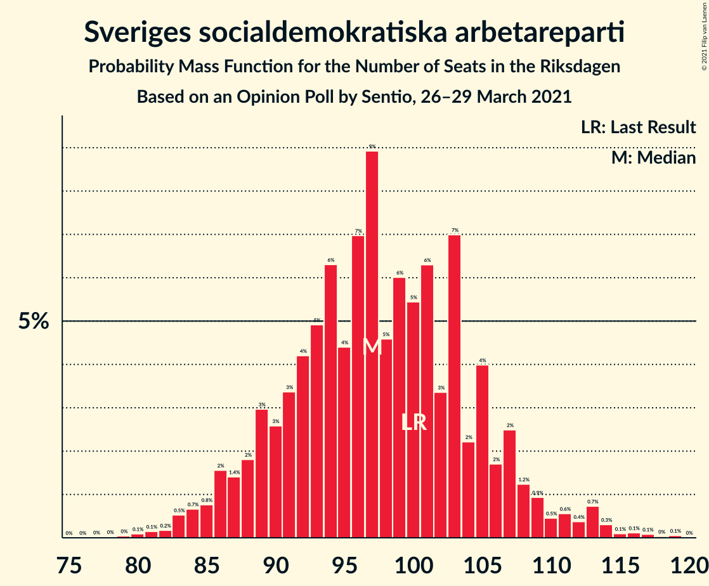
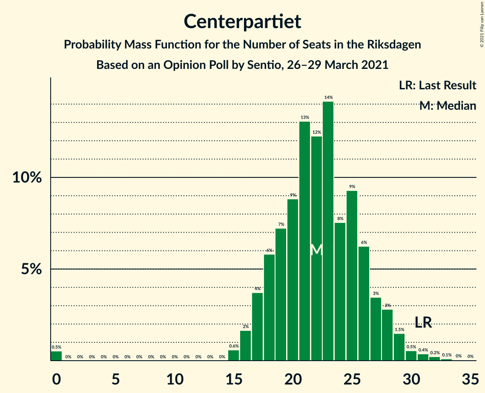
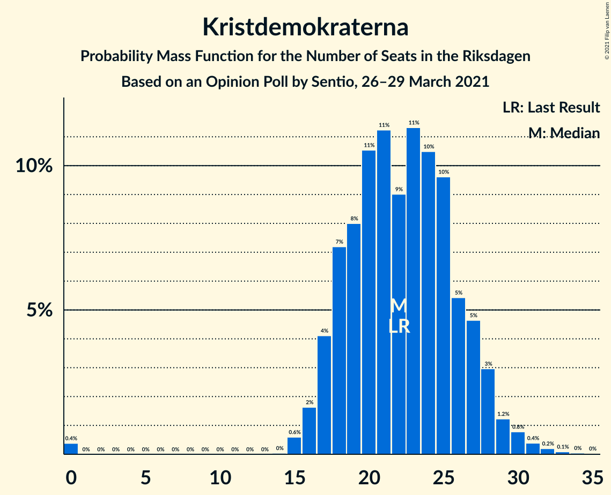

# Opinion Poll by Sentio, 26–29 March 2021

<a href="#voting-intentions">Voting Intentions</a> | <a href="#seats">Seats</a> | <a href="#coalitions">Coalitions</a> | <a href="#technical-information">Technical Information</a>

## Voting Intentions

### Confidence Intervals

| Party | Last Result | Poll Result | 80% Confidence Interval | 90% Confidence Interval | 95% Confidence Interval | 99% Confidence Interval |
|:-----:|:-----------:|:-----------:|:-----------------------:|:-----------------------:|:-----------------------:|:-----------------------:|
| Sveriges socialdemokratiska arbetareparti | 28.3% | 26.5% | 24.5–28.6% |24.0–29.2% |23.5–29.7% |22.6–30.7% |
| Sverigedemokraterna | 17.5% | 22.2% | 20.4–24.2% |19.9–24.7% |19.4–25.2% |18.6–26.2% |
| Moderata samlingspartiet | 19.8% | 20.2% | 18.4–22.1% |17.9–22.6% |17.5–23.1% |16.7–24.1% |
| Vänsterpartiet | 8.0% | 8.9% | 7.7–10.3% |7.4–10.7% |7.1–11.1% |6.6–11.8% |
| Centerpartiet | 8.6% | 6.0% | 5.0–7.2% |4.7–7.5% |4.5–7.8% |4.1–8.5% |
| Kristdemokraterna | 6.3% | 6.0% | 5.0–7.2% |4.7–7.5% |4.5–7.8% |4.1–8.5% |
| Miljöpartiet de gröna | 4.4% | 4.9% | 4.1–6.1% |3.8–6.4% |3.6–6.7% |3.3–7.3% |
| Liberalerna | 5.5% | 3.0% | 2.4–4.0% |2.2–4.3% |2.1–4.5% |1.8–5.0% |

*Note:* The poll result column reflects the actual value used in the calculations. Published results may vary slightly, and in addition be rounded to fewer digits.

## Seats

### Confidence Intervals

| Party | Last Result | Median | 80% Confidence Interval | 90% Confidence Interval | 95% Confidence Interval | 99% Confidence Interval |
|:-----:|:-----------:|:------:|:-----------------------:|:-----------------------:|:-----------------------:|:-----------------------:|
| <a href="#sveriges-socialdemokratiska-arbetareparti">Sveriges socialdemokratiska arbetareparti</a> | 100 | 99 | 87–107 |85–109 |84–113 |82–116 |
| <a href="#sverigedemokraterna">Sverigedemokraterna</a> | 62 | 80 | 72–90 |71–92 |70–93 |68–96 |
| <a href="#moderata-samlingspartiet">Moderata samlingspartiet</a> | 70 | 74 | 66–82 |64–84 |62–85 |61–90 |
| <a href="#vänsterpartiet">Vänsterpartiet</a> | 28 | 33 | 28–38 |26–40 |26–43 |23–44 |
| <a href="#centerpartiet">Centerpartiet</a> | 31 | 22 | 18–27 |17–28 |15–29 |0–32 |
| <a href="#kristdemokraterna">Kristdemokraterna</a> | 22 | 21 | 18–26 |17–28 |16–28 |15–32 |
| <a href="#miljöpartiet-de-gröna">Miljöpartiet de gröna</a> | 16 | 19 | 0–22 |0–24 |0–25 |0–27 |
| <a href="#liberalerna">Liberalerna</a> | 20 | 0 | 0–15 |0–15 |0–17 |0–18 |

### Sveriges socialdemokratiska arbetareparti

*For a full overview of the results for this party, see the [Sveriges socialdemokratiska arbetareparti](party-sverigessocialdemokratiskaarbetareparti.html) page.*

| Number of Seats | Probability | Accumulated | Special Marks |
|:---------------:|:-----------:|:-----------:|:-------------:|
| 79 | 0% | 100% |  |
| 80 | 0.2% | 99.9% |  |
| 81 | 0.2% | 99.7% |  |
| 82 | 0.3% | 99.5% |  |
| 83 | 1.5% | 99.2% |  |
| 84 | 2% | 98% |  |
| 85 | 1.4% | 95% |  |
| 86 | 3% | 94% |  |
| 87 | 4% | 91% |  |
| 88 | 2% | 87% |  |
| 89 | 2% | 85% |  |
| 90 | 2% | 83% |  |
| 91 | 2% | 81% |  |
| 92 | 6% | 78% |  |
| 93 | 2% | 72% |  |
| 94 | 2% | 70% |  |
| 95 | 3% | 68% |  |
| 96 | 5% | 65% |  |
| 97 | 3% | 60% |  |
| 98 | 3% | 57% |  |
| 99 | 7% | 54% | Median |
| 100 | 4% | 47% | Last Result |
| 101 | 4% | 43% |  |
| 102 | 4% | 39% |  |
| 103 | 6% | 36% |  |
| 104 | 4% | 30% |  |
| 105 | 4% | 25% |  |
| 106 | 3% | 21% |  |
| 107 | 9% | 18% |  |
| 108 | 4% | 9% |  |
| 109 | 0.9% | 5% |  |
| 110 | 0.4% | 4% |  |
| 111 | 0.6% | 4% |  |
| 112 | 0.4% | 3% |  |
| 113 | 1.2% | 3% |  |
| 114 | 0.9% | 2% |  |
| 115 | 0.1% | 0.9% |  |
| 116 | 0.5% | 0.8% |  |
| 117 | 0.2% | 0.3% |  |
| 118 | 0% | 0.1% |  |
| 119 | 0% | 0.1% |  |
| 120 | 0% | 0% |  |

### Sverigedemokraterna

*For a full overview of the results for this party, see the [Sverigedemokraterna](party-sverigedemokraterna.html) page.*

| Number of Seats | Probability | Accumulated | Special Marks |
|:---------------:|:-----------:|:-----------:|:-------------:|
| 62 | 0% | 100% | Last Result |
| 63 | 0% | 100% |  |
| 64 | 0% | 100% |  |
| 65 | 0.1% | 99.9% |  |
| 66 | 0.1% | 99.9% |  |
| 67 | 0.2% | 99.8% |  |
| 68 | 0.5% | 99.6% |  |
| 69 | 0.6% | 99.1% |  |
| 70 | 3% | 98.6% |  |
| 71 | 2% | 95% |  |
| 72 | 3% | 93% |  |
| 73 | 2% | 89% |  |
| 74 | 2% | 88% |  |
| 75 | 2% | 86% |  |
| 76 | 13% | 84% |  |
| 77 | 4% | 71% |  |
| 78 | 5% | 67% |  |
| 79 | 3% | 61% |  |
| 80 | 9% | 58% | Median |
| 81 | 4% | 49% |  |
| 82 | 5% | 45% |  |
| 83 | 5% | 40% |  |
| 84 | 5% | 35% |  |
| 85 | 4% | 30% |  |
| 86 | 7% | 26% |  |
| 87 | 3% | 19% |  |
| 88 | 3% | 16% |  |
| 89 | 2% | 13% |  |
| 90 | 5% | 11% |  |
| 91 | 0.9% | 7% |  |
| 92 | 2% | 6% |  |
| 93 | 2% | 4% |  |
| 94 | 0.4% | 2% |  |
| 95 | 0.8% | 2% |  |
| 96 | 0.5% | 0.9% |  |
| 97 | 0.2% | 0.4% |  |
| 98 | 0% | 0.2% |  |
| 99 | 0% | 0.1% |  |
| 100 | 0% | 0.1% |  |
| 101 | 0% | 0.1% |  |
| 102 | 0% | 0% |  |

### Moderata samlingspartiet

*For a full overview of the results for this party, see the [Moderata samlingspartiet](party-moderatasamlingspartiet.html) page.*

| Number of Seats | Probability | Accumulated | Special Marks |
|:---------------:|:-----------:|:-----------:|:-------------:|
| 56 | 0% | 100% |  |
| 57 | 0.1% | 99.9% |  |
| 58 | 0.1% | 99.9% |  |
| 59 | 0.1% | 99.8% |  |
| 60 | 0.1% | 99.7% |  |
| 61 | 0.8% | 99.6% |  |
| 62 | 1.5% | 98.8% |  |
| 63 | 1.2% | 97% |  |
| 64 | 2% | 96% |  |
| 65 | 0.4% | 94% |  |
| 66 | 4% | 94% |  |
| 67 | 3% | 89% |  |
| 68 | 4% | 86% |  |
| 69 | 6% | 82% |  |
| 70 | 5% | 76% | Last Result |
| 71 | 2% | 72% |  |
| 72 | 13% | 69% |  |
| 73 | 5% | 56% |  |
| 74 | 7% | 51% | Median |
| 75 | 2% | 44% |  |
| 76 | 3% | 42% |  |
| 77 | 4% | 39% |  |
| 78 | 11% | 35% |  |
| 79 | 6% | 24% |  |
| 80 | 4% | 18% |  |
| 81 | 1.0% | 14% |  |
| 82 | 5% | 13% |  |
| 83 | 0.5% | 8% |  |
| 84 | 5% | 8% |  |
| 85 | 0.3% | 3% |  |
| 86 | 0.7% | 2% |  |
| 87 | 0.3% | 2% |  |
| 88 | 0.4% | 1.4% |  |
| 89 | 0% | 1.0% |  |
| 90 | 0.6% | 0.9% |  |
| 91 | 0.1% | 0.4% |  |
| 92 | 0.1% | 0.2% |  |
| 93 | 0% | 0.1% |  |
| 94 | 0.1% | 0.1% |  |
| 95 | 0% | 0% |  |

### Vänsterpartiet

*For a full overview of the results for this party, see the [Vänsterpartiet](party-vänsterpartiet.html) page.*

| Number of Seats | Probability | Accumulated | Special Marks |
|:---------------:|:-----------:|:-----------:|:-------------:|
| 21 | 0% | 100% |  |
| 22 | 0.1% | 99.9% |  |
| 23 | 0.4% | 99.9% |  |
| 24 | 0.3% | 99.4% |  |
| 25 | 1.4% | 99.1% |  |
| 26 | 3% | 98% |  |
| 27 | 4% | 94% |  |
| 28 | 7% | 91% | Last Result |
| 29 | 6% | 84% |  |
| 30 | 14% | 78% |  |
| 31 | 8% | 64% |  |
| 32 | 6% | 56% |  |
| 33 | 7% | 50% | Median |
| 34 | 7% | 44% |  |
| 35 | 11% | 37% |  |
| 36 | 6% | 26% |  |
| 37 | 5% | 20% |  |
| 38 | 6% | 15% |  |
| 39 | 2% | 10% |  |
| 40 | 3% | 8% |  |
| 41 | 1.2% | 4% |  |
| 42 | 0.4% | 3% |  |
| 43 | 0.8% | 3% |  |
| 44 | 2% | 2% |  |
| 45 | 0.1% | 0.4% |  |
| 46 | 0.2% | 0.3% |  |
| 47 | 0% | 0.1% |  |
| 48 | 0% | 0% |  |

### Centerpartiet

*For a full overview of the results for this party, see the [Centerpartiet](party-centerpartiet.html) page.*

| Number of Seats | Probability | Accumulated | Special Marks |
|:---------------:|:-----------:|:-----------:|:-------------:|
| 0 | 1.1% | 100% |  |
| 1 | 0% | 98.9% |  |
| 2 | 0% | 98.9% |  |
| 3 | 0% | 98.9% |  |
| 4 | 0% | 98.9% |  |
| 5 | 0% | 98.9% |  |
| 6 | 0% | 98.9% |  |
| 7 | 0% | 98.9% |  |
| 8 | 0% | 98.9% |  |
| 9 | 0% | 98.9% |  |
| 10 | 0% | 98.9% |  |
| 11 | 0% | 98.9% |  |
| 12 | 0% | 98.9% |  |
| 13 | 0% | 98.9% |  |
| 14 | 0% | 98.9% |  |
| 15 | 2% | 98.9% |  |
| 16 | 1.1% | 97% |  |
| 17 | 3% | 96% |  |
| 18 | 6% | 93% |  |
| 19 | 10% | 87% |  |
| 20 | 8% | 77% |  |
| 21 | 10% | 69% |  |
| 22 | 12% | 59% | Median |
| 23 | 15% | 47% |  |
| 24 | 9% | 32% |  |
| 25 | 5% | 23% |  |
| 26 | 6% | 18% |  |
| 27 | 4% | 12% |  |
| 28 | 5% | 8% |  |
| 29 | 2% | 3% |  |
| 30 | 0.5% | 1.3% |  |
| 31 | 0.3% | 0.8% | Last Result |
| 32 | 0.2% | 0.5% |  |
| 33 | 0.1% | 0.3% |  |
| 34 | 0.2% | 0.3% |  |
| 35 | 0.1% | 0.1% |  |
| 36 | 0% | 0% |  |

### Kristdemokraterna

*For a full overview of the results for this party, see the [Kristdemokraterna](party-kristdemokraterna.html) page.*

| Number of Seats | Probability | Accumulated | Special Marks |
|:---------------:|:-----------:|:-----------:|:-------------:|
| 0 | 0.3% | 100% |  |
| 1 | 0% | 99.7% |  |
| 2 | 0% | 99.7% |  |
| 3 | 0% | 99.7% |  |
| 4 | 0% | 99.7% |  |
| 5 | 0% | 99.7% |  |
| 6 | 0% | 99.7% |  |
| 7 | 0% | 99.7% |  |
| 8 | 0% | 99.7% |  |
| 9 | 0% | 99.7% |  |
| 10 | 0% | 99.7% |  |
| 11 | 0% | 99.7% |  |
| 12 | 0% | 99.7% |  |
| 13 | 0% | 99.7% |  |
| 14 | 0% | 99.7% |  |
| 15 | 0.4% | 99.7% |  |
| 16 | 4% | 99.4% |  |
| 17 | 3% | 96% |  |
| 18 | 7% | 92% |  |
| 19 | 5% | 86% |  |
| 20 | 10% | 81% |  |
| 21 | 24% | 71% | Median |
| 22 | 2% | 47% | Last Result |
| 23 | 12% | 45% |  |
| 24 | 15% | 33% |  |
| 25 | 8% | 18% |  |
| 26 | 2% | 11% |  |
| 27 | 3% | 8% |  |
| 28 | 3% | 5% |  |
| 29 | 0.6% | 2% |  |
| 30 | 0.3% | 2% |  |
| 31 | 0.7% | 1.4% |  |
| 32 | 0.5% | 0.7% |  |
| 33 | 0.1% | 0.2% |  |
| 34 | 0% | 0.1% |  |
| 35 | 0% | 0% |  |

### Miljöpartiet de gröna

*For a full overview of the results for this party, see the [Miljöpartiet de gröna](party-miljöpartietdegröna.html) page.*

| Number of Seats | Probability | Accumulated | Special Marks |
|:---------------:|:-----------:|:-----------:|:-------------:|
| 0 | 12% | 100% |  |
| 1 | 0% | 88% |  |
| 2 | 0% | 88% |  |
| 3 | 0% | 88% |  |
| 4 | 0% | 88% |  |
| 5 | 0% | 88% |  |
| 6 | 0% | 88% |  |
| 7 | 0% | 88% |  |
| 8 | 0% | 88% |  |
| 9 | 0% | 88% |  |
| 10 | 0% | 88% |  |
| 11 | 0% | 88% |  |
| 12 | 0% | 88% |  |
| 13 | 0% | 88% |  |
| 14 | 0.1% | 88% |  |
| 15 | 4% | 88% |  |
| 16 | 9% | 84% | Last Result |
| 17 | 15% | 74% |  |
| 18 | 9% | 59% |  |
| 19 | 8% | 50% | Median |
| 20 | 19% | 42% |  |
| 21 | 11% | 23% |  |
| 22 | 3% | 12% |  |
| 23 | 3% | 10% |  |
| 24 | 3% | 6% |  |
| 25 | 2% | 3% |  |
| 26 | 1.0% | 2% |  |
| 27 | 0.4% | 0.7% |  |
| 28 | 0.2% | 0.4% |  |
| 29 | 0.1% | 0.2% |  |
| 30 | 0% | 0.1% |  |
| 31 | 0.1% | 0.1% |  |
| 32 | 0% | 0% |  |

### Liberalerna

*For a full overview of the results for this party, see the [Liberalerna](party-liberalerna.html) page.*

| Number of Seats | Probability | Accumulated | Special Marks |
|:---------------:|:-----------:|:-----------:|:-------------:|
| 0 | 89% | 100% | Median |
| 1 | 0% | 11% |  |
| 2 | 0% | 11% |  |
| 3 | 0% | 11% |  |
| 4 | 0% | 11% |  |
| 5 | 0% | 11% |  |
| 6 | 0% | 11% |  |
| 7 | 0% | 11% |  |
| 8 | 0% | 11% |  |
| 9 | 0% | 11% |  |
| 10 | 0% | 11% |  |
| 11 | 0% | 11% |  |
| 12 | 0% | 11% |  |
| 13 | 0% | 11% |  |
| 14 | 0.7% | 11% |  |
| 15 | 6% | 10% |  |
| 16 | 2% | 4% |  |
| 17 | 2% | 3% |  |
| 18 | 0.5% | 0.8% |  |
| 19 | 0.2% | 0.3% |  |
| 20 | 0.1% | 0.1% | Last Result |
| 21 | 0% | 0% |  |

## Coalitions

### Confidence Intervals

| Coalition | Last Result | Median | Majority? | 80% Confidence Interval | 90% Confidence Interval | 95% Confidence Interval | 99% Confidence Interval |
|:---------:|:-----------:|:------:|:---------:|:-----------------------:|:-----------------------:|:-----------------------:|:-----------------------:|
| Sveriges socialdemokratiska arbetareparti – Moderata samlingspartiet – Centerpartiet | 201 | 195 | 99.5% | 183–205 | 181–208 | 178–213 | 175–214 |
| Sverigedemokraterna – Moderata samlingspartiet – Kristdemokraterna | 154 | 176 | 59% | 167–188 | 165–191 | 163–193 | 158–199 |
| Sveriges socialdemokratiska arbetareparti – Moderata samlingspartiet | 170 | 172 | 42% | 161–183 | 158–186 | 157–187 | 152–192 |
| Sveriges socialdemokratiska arbetareparti – Vänsterpartiet – Centerpartiet – Miljöpartiet de gröna – Liberalerna | 195 | 173 | 40% | 161–182 | 157–183 | 156–186 | 149–190 |
| Sverigedemokraterna – Moderata samlingspartiet | 132 | 154 | 0.7% | 145–166 | 143–170 | 141–171 | 137–177 |
| Sveriges socialdemokratiska arbetareparti – Vänsterpartiet – Miljöpartiet de gröna | 144 | 149 | 0% | 135–160 | 131–161 | 130–163 | 125–166 |
| Sveriges socialdemokratiska arbetareparti – Centerpartiet – Miljöpartiet de gröna – Liberalerna | 167 | 140 | 0% | 125–150 | 124–153 | 120–156 | 114–158 |
| Sveriges socialdemokratiska arbetareparti – Vänsterpartiet | 128 | 131 | 0% | 121–140 | 117–143 | 114–146 | 112–150 |
| Moderata samlingspartiet – Centerpartiet – Kristdemokraterna – Liberalerna | 143 | 119 | 0% | 109–132 | 106–135 | 103–138 | 98–140 |
| Moderata samlingspartiet – Centerpartiet – Kristdemokraterna | 123 | 118 | 0% | 108–129 | 105–132 | 103–133 | 98–137 |
| Sveriges socialdemokratiska arbetareparti – Miljöpartiet de gröna | 116 | 118 | 0% | 101–127 | 98–127 | 96–128 | 92–130 |
| Moderata samlingspartiet – Centerpartiet – Liberalerna | 121 | 97 | 0% | 87–110 | 85–114 | 84–115 | 77–117 |
| Moderata samlingspartiet – Centerpartiet | 101 | 96 | 0% | 87–107 | 85–110 | 84–111 | 77–113 |

### Sveriges socialdemokratiska arbetareparti – Moderata samlingspartiet – Centerpartiet

| Number of Seats | Probability | Accumulated | Special Marks |
|:---------------:|:-----------:|:-----------:|:-------------:|
| 168 | 0% | 100% |  |
| 169 | 0% | 99.9% |  |
| 170 | 0.1% | 99.9% |  |
| 171 | 0% | 99.8% |  |
| 172 | 0.1% | 99.7% |  |
| 173 | 0.1% | 99.7% |  |
| 174 | 0.1% | 99.6% |  |
| 175 | 0.2% | 99.5% | Majority |
| 176 | 0.5% | 99.3% |  |
| 177 | 0.2% | 98.8% |  |
| 178 | 1.1% | 98.5% |  |
| 179 | 0.7% | 97% |  |
| 180 | 0.8% | 97% |  |
| 181 | 0.9% | 96% |  |
| 182 | 2% | 95% |  |
| 183 | 3% | 93% |  |
| 184 | 5% | 90% |  |
| 185 | 1.4% | 85% |  |
| 186 | 3% | 84% |  |
| 187 | 5% | 80% |  |
| 188 | 5% | 75% |  |
| 189 | 2% | 70% |  |
| 190 | 3% | 68% |  |
| 191 | 5% | 65% |  |
| 192 | 4% | 60% |  |
| 193 | 3% | 56% |  |
| 194 | 2% | 53% |  |
| 195 | 3% | 51% | Median |
| 196 | 5% | 48% |  |
| 197 | 2% | 43% |  |
| 198 | 4% | 41% |  |
| 199 | 2% | 37% |  |
| 200 | 6% | 35% |  |
| 201 | 2% | 30% | Last Result |
| 202 | 11% | 28% |  |
| 203 | 4% | 17% |  |
| 204 | 1.3% | 12% |  |
| 205 | 2% | 11% |  |
| 206 | 0.5% | 9% |  |
| 207 | 2% | 9% |  |
| 208 | 3% | 7% |  |
| 209 | 1.0% | 4% |  |
| 210 | 0.4% | 3% |  |
| 211 | 0.1% | 3% |  |
| 212 | 0.1% | 3% |  |
| 213 | 0.9% | 3% |  |
| 214 | 2% | 2% |  |
| 215 | 0% | 0.3% |  |
| 216 | 0.1% | 0.2% |  |
| 217 | 0% | 0.2% |  |
| 218 | 0% | 0.1% |  |
| 219 | 0.1% | 0.1% |  |
| 220 | 0% | 0.1% |  |
| 221 | 0% | 0% |  |

### Sverigedemokraterna – Moderata samlingspartiet – Kristdemokraterna

| Number of Seats | Probability | Accumulated | Special Marks |
|:---------------:|:-----------:|:-----------:|:-------------:|
| 153 | 0% | 100% |  |
| 154 | 0% | 99.9% | Last Result |
| 155 | 0.1% | 99.9% |  |
| 156 | 0% | 99.8% |  |
| 157 | 0.2% | 99.8% |  |
| 158 | 0.2% | 99.6% |  |
| 159 | 0.2% | 99.4% |  |
| 160 | 0.2% | 99.2% |  |
| 161 | 0.4% | 99.0% |  |
| 162 | 0.4% | 98.7% |  |
| 163 | 1.4% | 98% |  |
| 164 | 0.9% | 97% |  |
| 165 | 1.0% | 96% |  |
| 166 | 3% | 95% |  |
| 167 | 4% | 92% |  |
| 168 | 0.9% | 87% |  |
| 169 | 11% | 86% |  |
| 170 | 4% | 76% |  |
| 171 | 1.4% | 72% |  |
| 172 | 5% | 70% |  |
| 173 | 1.2% | 65% |  |
| 174 | 5% | 64% |  |
| 175 | 6% | 59% | Median, Majority |
| 176 | 6% | 54% |  |
| 177 | 1.1% | 48% |  |
| 178 | 4% | 47% |  |
| 179 | 2% | 43% |  |
| 180 | 6% | 41% |  |
| 181 | 2% | 34% |  |
| 182 | 3% | 32% |  |
| 183 | 7% | 29% |  |
| 184 | 3% | 22% |  |
| 185 | 1.1% | 19% |  |
| 186 | 4% | 18% |  |
| 187 | 4% | 15% |  |
| 188 | 2% | 11% |  |
| 189 | 0.8% | 9% |  |
| 190 | 3% | 8% |  |
| 191 | 0.4% | 5% |  |
| 192 | 2% | 5% |  |
| 193 | 0.6% | 3% |  |
| 194 | 0.3% | 2% |  |
| 195 | 0.3% | 2% |  |
| 196 | 0.6% | 2% |  |
| 197 | 0.3% | 0.9% |  |
| 198 | 0.1% | 0.6% |  |
| 199 | 0.1% | 0.6% |  |
| 200 | 0.2% | 0.5% |  |
| 201 | 0.1% | 0.3% |  |
| 202 | 0% | 0.2% |  |
| 203 | 0.1% | 0.2% |  |
| 204 | 0% | 0.1% |  |
| 205 | 0% | 0.1% |  |
| 206 | 0% | 0.1% |  |
| 207 | 0.1% | 0.1% |  |
| 208 | 0% | 0% |  |

### Sveriges socialdemokratiska arbetareparti – Moderata samlingspartiet

| Number of Seats | Probability | Accumulated | Special Marks |
|:---------------:|:-----------:|:-----------:|:-------------:|
| 147 | 0% | 100% |  |
| 148 | 0% | 99.9% |  |
| 149 | 0.1% | 99.9% |  |
| 150 | 0.1% | 99.8% |  |
| 151 | 0.1% | 99.7% |  |
| 152 | 0.1% | 99.6% |  |
| 153 | 0.1% | 99.5% |  |
| 154 | 0.7% | 99.4% |  |
| 155 | 0.5% | 98.7% |  |
| 156 | 0.6% | 98% |  |
| 157 | 0.9% | 98% |  |
| 158 | 2% | 97% |  |
| 159 | 1.5% | 94% |  |
| 160 | 1.1% | 93% |  |
| 161 | 2% | 92% |  |
| 162 | 3% | 89% |  |
| 163 | 3% | 87% |  |
| 164 | 2% | 84% |  |
| 165 | 3% | 82% |  |
| 166 | 4% | 80% |  |
| 167 | 1.2% | 76% |  |
| 168 | 10% | 74% |  |
| 169 | 4% | 64% |  |
| 170 | 3% | 61% | Last Result |
| 171 | 5% | 58% |  |
| 172 | 4% | 53% |  |
| 173 | 2% | 50% | Median |
| 174 | 5% | 47% |  |
| 175 | 5% | 42% | Majority |
| 176 | 0.8% | 37% |  |
| 177 | 5% | 37% |  |
| 178 | 2% | 31% |  |
| 179 | 11% | 29% |  |
| 180 | 3% | 18% |  |
| 181 | 2% | 15% |  |
| 182 | 2% | 13% |  |
| 183 | 3% | 12% |  |
| 184 | 1.0% | 9% |  |
| 185 | 2% | 8% |  |
| 186 | 2% | 6% |  |
| 187 | 1.3% | 4% |  |
| 188 | 0% | 2% |  |
| 189 | 0.5% | 2% |  |
| 190 | 0.1% | 2% |  |
| 191 | 0.5% | 2% |  |
| 192 | 1.0% | 1.3% |  |
| 193 | 0.1% | 0.3% |  |
| 194 | 0% | 0.2% |  |
| 195 | 0% | 0.2% |  |
| 196 | 0.1% | 0.2% |  |
| 197 | 0.1% | 0.1% |  |
| 198 | 0% | 0% |  |

### Sveriges socialdemokratiska arbetareparti – Vänsterpartiet – Centerpartiet – Miljöpartiet de gröna – Liberalerna

| Number of Seats | Probability | Accumulated | Special Marks |
|:---------------:|:-----------:|:-----------:|:-------------:|
| 142 | 0.1% | 100% |  |
| 143 | 0% | 99.9% |  |
| 144 | 0% | 99.9% |  |
| 145 | 0% | 99.8% |  |
| 146 | 0.1% | 99.8% |  |
| 147 | 0% | 99.8% |  |
| 148 | 0.1% | 99.8% |  |
| 149 | 0.2% | 99.7% |  |
| 150 | 0.1% | 99.5% |  |
| 151 | 0.1% | 99.4% |  |
| 152 | 0.3% | 99.3% |  |
| 153 | 0.6% | 99.0% |  |
| 154 | 0.3% | 98% |  |
| 155 | 0.3% | 98% |  |
| 156 | 0.6% | 98% |  |
| 157 | 2% | 97% |  |
| 158 | 0.4% | 95% |  |
| 159 | 3% | 94% |  |
| 160 | 1.0% | 92% |  |
| 161 | 2% | 91% |  |
| 162 | 4% | 89% |  |
| 163 | 4% | 85% |  |
| 164 | 1.1% | 81% |  |
| 165 | 3% | 80% |  |
| 166 | 7% | 77% |  |
| 167 | 3% | 70% |  |
| 168 | 2% | 67% |  |
| 169 | 6% | 65% |  |
| 170 | 2% | 59% |  |
| 171 | 4% | 57% |  |
| 172 | 1.0% | 53% |  |
| 173 | 6% | 52% | Median |
| 174 | 6% | 46% |  |
| 175 | 5% | 40% | Majority |
| 176 | 1.2% | 36% |  |
| 177 | 5% | 34% |  |
| 178 | 1.4% | 29% |  |
| 179 | 4% | 28% |  |
| 180 | 11% | 24% |  |
| 181 | 0.8% | 13% |  |
| 182 | 4% | 12% |  |
| 183 | 3% | 8% |  |
| 184 | 1.0% | 5% |  |
| 185 | 0.9% | 4% |  |
| 186 | 1.3% | 3% |  |
| 187 | 0.4% | 2% |  |
| 188 | 0.4% | 1.1% |  |
| 189 | 0.2% | 0.8% |  |
| 190 | 0.2% | 0.6% |  |
| 191 | 0% | 0.4% |  |
| 192 | 0.2% | 0.4% |  |
| 193 | 0% | 0.2% |  |
| 194 | 0.1% | 0.1% |  |
| 195 | 0% | 0.1% | Last Result |
| 196 | 0% | 0.1% |  |
| 197 | 0% | 0% |  |

### Sverigedemokraterna – Moderata samlingspartiet

| Number of Seats | Probability | Accumulated | Special Marks |
|:---------------:|:-----------:|:-----------:|:-------------:|
| 132 | 0% | 100% | Last Result |
| 133 | 0% | 99.9% |  |
| 134 | 0% | 99.9% |  |
| 135 | 0.1% | 99.9% |  |
| 136 | 0.1% | 99.8% |  |
| 137 | 0.3% | 99.7% |  |
| 138 | 0.2% | 99.5% |  |
| 139 | 0.4% | 99.2% |  |
| 140 | 1.3% | 98.8% |  |
| 141 | 0.5% | 98% |  |
| 142 | 1.2% | 97% |  |
| 143 | 3% | 96% |  |
| 144 | 1.2% | 93% |  |
| 145 | 2% | 92% |  |
| 146 | 2% | 89% |  |
| 147 | 3% | 87% |  |
| 148 | 10% | 84% |  |
| 149 | 1.5% | 74% |  |
| 150 | 3% | 72% |  |
| 151 | 6% | 70% |  |
| 152 | 5% | 64% |  |
| 153 | 2% | 59% |  |
| 154 | 7% | 57% | Median |
| 155 | 3% | 50% |  |
| 156 | 3% | 46% |  |
| 157 | 4% | 43% |  |
| 158 | 4% | 39% |  |
| 159 | 7% | 35% |  |
| 160 | 3% | 28% |  |
| 161 | 2% | 24% |  |
| 162 | 6% | 22% |  |
| 163 | 3% | 17% |  |
| 164 | 1.1% | 14% |  |
| 165 | 2% | 13% |  |
| 166 | 1.0% | 11% |  |
| 167 | 2% | 10% |  |
| 168 | 1.2% | 8% |  |
| 169 | 1.1% | 7% |  |
| 170 | 2% | 6% |  |
| 171 | 2% | 3% |  |
| 172 | 0.7% | 2% |  |
| 173 | 0.1% | 1.0% |  |
| 174 | 0.2% | 1.0% |  |
| 175 | 0.1% | 0.7% | Majority |
| 176 | 0.1% | 0.6% |  |
| 177 | 0.2% | 0.5% |  |
| 178 | 0% | 0.3% |  |
| 179 | 0% | 0.2% |  |
| 180 | 0.1% | 0.2% |  |
| 181 | 0% | 0.1% |  |
| 182 | 0.1% | 0.1% |  |
| 183 | 0% | 0% |  |

### Sveriges socialdemokratiska arbetareparti – Vänsterpartiet – Miljöpartiet de gröna

| Number of Seats | Probability | Accumulated | Special Marks |
|:---------------:|:-----------:|:-----------:|:-------------:|
| 120 | 0.2% | 100% |  |
| 121 | 0.1% | 99.8% |  |
| 122 | 0% | 99.7% |  |
| 123 | 0.1% | 99.7% |  |
| 124 | 0.1% | 99.6% |  |
| 125 | 0.2% | 99.5% |  |
| 126 | 0.1% | 99.3% |  |
| 127 | 0.1% | 99.2% |  |
| 128 | 0.4% | 99.1% |  |
| 129 | 0.5% | 98.6% |  |
| 130 | 3% | 98% |  |
| 131 | 0.6% | 95% |  |
| 132 | 2% | 95% |  |
| 133 | 0.5% | 93% |  |
| 134 | 2% | 92% |  |
| 135 | 0.9% | 91% |  |
| 136 | 1.3% | 90% |  |
| 137 | 0.9% | 88% |  |
| 138 | 4% | 87% |  |
| 139 | 1.3% | 84% |  |
| 140 | 5% | 82% |  |
| 141 | 3% | 77% |  |
| 142 | 1.2% | 74% |  |
| 143 | 3% | 73% |  |
| 144 | 2% | 70% | Last Result |
| 145 | 4% | 68% |  |
| 146 | 8% | 65% |  |
| 147 | 2% | 57% |  |
| 148 | 3% | 54% |  |
| 149 | 5% | 51% |  |
| 150 | 4% | 47% |  |
| 151 | 3% | 43% | Median |
| 152 | 5% | 39% |  |
| 153 | 1.0% | 34% |  |
| 154 | 5% | 33% |  |
| 155 | 3% | 29% |  |
| 156 | 4% | 26% |  |
| 157 | 9% | 22% |  |
| 158 | 1.0% | 13% |  |
| 159 | 2% | 12% |  |
| 160 | 5% | 10% |  |
| 161 | 2% | 6% |  |
| 162 | 0.8% | 4% |  |
| 163 | 0.6% | 3% |  |
| 164 | 2% | 2% |  |
| 165 | 0.1% | 0.8% |  |
| 166 | 0.4% | 0.7% |  |
| 167 | 0.2% | 0.3% |  |
| 168 | 0% | 0.1% |  |
| 169 | 0% | 0.1% |  |
| 170 | 0% | 0.1% |  |
| 171 | 0% | 0.1% |  |
| 172 | 0% | 0% |  |

### Sveriges socialdemokratiska arbetareparti – Centerpartiet – Miljöpartiet de gröna – Liberalerna

| Number of Seats | Probability | Accumulated | Special Marks |
|:---------------:|:-----------:|:-----------:|:-------------:|
| 109 | 0% | 100% |  |
| 110 | 0% | 99.9% |  |
| 111 | 0.2% | 99.9% |  |
| 112 | 0.2% | 99.8% |  |
| 113 | 0% | 99.6% |  |
| 114 | 0.4% | 99.6% |  |
| 115 | 0.3% | 99.3% |  |
| 116 | 0.1% | 99.0% |  |
| 117 | 0% | 98.8% |  |
| 118 | 0.2% | 98.8% |  |
| 119 | 0.8% | 98.6% |  |
| 120 | 0.5% | 98% |  |
| 121 | 0.6% | 97% |  |
| 122 | 0.2% | 97% |  |
| 123 | 1.1% | 97% |  |
| 124 | 5% | 95% |  |
| 125 | 0.8% | 90% |  |
| 126 | 1.1% | 89% |  |
| 127 | 2% | 88% |  |
| 128 | 1.2% | 86% |  |
| 129 | 2% | 85% |  |
| 130 | 2% | 83% |  |
| 131 | 2% | 81% |  |
| 132 | 2% | 80% |  |
| 133 | 4% | 78% |  |
| 134 | 2% | 73% |  |
| 135 | 6% | 71% |  |
| 136 | 3% | 65% |  |
| 137 | 2% | 62% |  |
| 138 | 6% | 60% |  |
| 139 | 3% | 54% |  |
| 140 | 6% | 51% | Median |
| 141 | 2% | 45% |  |
| 142 | 7% | 42% |  |
| 143 | 3% | 36% |  |
| 144 | 1.5% | 33% |  |
| 145 | 2% | 31% |  |
| 146 | 5% | 30% |  |
| 147 | 4% | 25% |  |
| 148 | 4% | 21% |  |
| 149 | 0.7% | 17% |  |
| 150 | 9% | 16% |  |
| 151 | 0.8% | 7% |  |
| 152 | 0.7% | 6% |  |
| 153 | 1.4% | 5% |  |
| 154 | 0.7% | 4% |  |
| 155 | 0.2% | 3% |  |
| 156 | 2% | 3% |  |
| 157 | 0.2% | 0.8% |  |
| 158 | 0.3% | 0.6% |  |
| 159 | 0% | 0.3% |  |
| 160 | 0% | 0.3% |  |
| 161 | 0.1% | 0.2% |  |
| 162 | 0% | 0.2% |  |
| 163 | 0.1% | 0.1% |  |
| 164 | 0% | 0% |  |
| 165 | 0% | 0% |  |
| 166 | 0% | 0% |  |
| 167 | 0% | 0% | Last Result |

### Sveriges socialdemokratiska arbetareparti – Vänsterpartiet

| Number of Seats | Probability | Accumulated | Special Marks |
|:---------------:|:-----------:|:-----------:|:-------------:|
| 108 | 0% | 100% |  |
| 109 | 0.1% | 99.9% |  |
| 110 | 0.1% | 99.9% |  |
| 111 | 0.1% | 99.8% |  |
| 112 | 0.4% | 99.6% |  |
| 113 | 1.4% | 99.2% |  |
| 114 | 0.8% | 98% |  |
| 115 | 0.3% | 97% |  |
| 116 | 1.1% | 97% |  |
| 117 | 1.2% | 96% |  |
| 118 | 2% | 94% |  |
| 119 | 0.5% | 93% |  |
| 120 | 1.3% | 92% |  |
| 121 | 2% | 91% |  |
| 122 | 3% | 89% |  |
| 123 | 4% | 85% |  |
| 124 | 2% | 82% |  |
| 125 | 2% | 79% |  |
| 126 | 5% | 77% |  |
| 127 | 6% | 73% |  |
| 128 | 3% | 67% | Last Result |
| 129 | 7% | 63% |  |
| 130 | 5% | 57% |  |
| 131 | 3% | 52% |  |
| 132 | 3% | 49% | Median |
| 133 | 0.8% | 46% |  |
| 134 | 4% | 45% |  |
| 135 | 4% | 41% |  |
| 136 | 4% | 37% |  |
| 137 | 11% | 33% |  |
| 138 | 6% | 22% |  |
| 139 | 6% | 16% |  |
| 140 | 3% | 11% |  |
| 141 | 2% | 8% |  |
| 142 | 0.5% | 6% |  |
| 143 | 0.5% | 5% |  |
| 144 | 1.2% | 5% |  |
| 145 | 0.6% | 3% |  |
| 146 | 0.7% | 3% |  |
| 147 | 0.1% | 2% |  |
| 148 | 0.3% | 2% |  |
| 149 | 0.9% | 2% |  |
| 150 | 0.5% | 0.8% |  |
| 151 | 0.1% | 0.3% |  |
| 152 | 0% | 0.2% |  |
| 153 | 0.1% | 0.2% |  |
| 154 | 0% | 0.1% |  |
| 155 | 0% | 0.1% |  |
| 156 | 0% | 0.1% |  |
| 157 | 0.1% | 0.1% |  |
| 158 | 0% | 0% |  |

### Moderata samlingspartiet – Centerpartiet – Kristdemokraterna – Liberalerna

| Number of Seats | Probability | Accumulated | Special Marks |
|:---------------:|:-----------:|:-----------:|:-------------:|
| 95 | 0% | 100% |  |
| 96 | 0% | 99.9% |  |
| 97 | 0.1% | 99.9% |  |
| 98 | 0.3% | 99.8% |  |
| 99 | 0.1% | 99.5% |  |
| 100 | 0.1% | 99.4% |  |
| 101 | 0.1% | 99.3% |  |
| 102 | 0.3% | 99.2% |  |
| 103 | 3% | 98.9% |  |
| 104 | 0.4% | 96% |  |
| 105 | 0.5% | 96% |  |
| 106 | 0.7% | 95% |  |
| 107 | 3% | 95% |  |
| 108 | 1.5% | 92% |  |
| 109 | 2% | 90% |  |
| 110 | 4% | 88% |  |
| 111 | 1.4% | 84% |  |
| 112 | 1.0% | 83% |  |
| 113 | 6% | 82% |  |
| 114 | 2% | 76% |  |
| 115 | 1.2% | 74% |  |
| 116 | 13% | 73% |  |
| 117 | 2% | 60% | Median |
| 118 | 3% | 58% |  |
| 119 | 7% | 55% |  |
| 120 | 5% | 48% |  |
| 121 | 3% | 42% |  |
| 122 | 4% | 40% |  |
| 123 | 4% | 36% |  |
| 124 | 2% | 32% |  |
| 125 | 5% | 31% |  |
| 126 | 2% | 26% |  |
| 127 | 0.9% | 24% |  |
| 128 | 3% | 23% |  |
| 129 | 3% | 19% |  |
| 130 | 3% | 16% |  |
| 131 | 0.7% | 13% |  |
| 132 | 4% | 12% |  |
| 133 | 3% | 9% |  |
| 134 | 0.5% | 6% |  |
| 135 | 1.2% | 5% |  |
| 136 | 0.7% | 4% |  |
| 137 | 0.3% | 3% |  |
| 138 | 2% | 3% |  |
| 139 | 0.1% | 0.9% |  |
| 140 | 0.4% | 0.8% |  |
| 141 | 0.1% | 0.4% |  |
| 142 | 0% | 0.2% |  |
| 143 | 0% | 0.2% | Last Result |
| 144 | 0% | 0.2% |  |
| 145 | 0% | 0.1% |  |
| 146 | 0% | 0.1% |  |
| 147 | 0% | 0.1% |  |
| 148 | 0% | 0% |  |

### Moderata samlingspartiet – Centerpartiet – Kristdemokraterna

| Number of Seats | Probability | Accumulated | Special Marks |
|:---------------:|:-----------:|:-----------:|:-------------:|
| 93 | 0% | 100% |  |
| 94 | 0% | 99.9% |  |
| 95 | 0% | 99.9% |  |
| 96 | 0% | 99.9% |  |
| 97 | 0.1% | 99.9% |  |
| 98 | 0.3% | 99.7% |  |
| 99 | 0.1% | 99.4% |  |
| 100 | 0.1% | 99.3% |  |
| 101 | 0.1% | 99.2% |  |
| 102 | 0.3% | 99.1% |  |
| 103 | 3% | 98.8% |  |
| 104 | 0.5% | 96% |  |
| 105 | 0.6% | 95% |  |
| 106 | 0.7% | 95% |  |
| 107 | 3% | 94% |  |
| 108 | 3% | 91% |  |
| 109 | 2% | 88% |  |
| 110 | 4% | 85% |  |
| 111 | 1.4% | 81% |  |
| 112 | 1.3% | 80% |  |
| 113 | 6% | 79% |  |
| 114 | 3% | 72% |  |
| 115 | 1.2% | 70% |  |
| 116 | 15% | 68% |  |
| 117 | 2% | 53% | Median |
| 118 | 4% | 51% |  |
| 119 | 7% | 48% |  |
| 120 | 5% | 40% |  |
| 121 | 3% | 35% |  |
| 122 | 4% | 32% |  |
| 123 | 4% | 28% | Last Result |
| 124 | 2% | 25% |  |
| 125 | 5% | 23% |  |
| 126 | 2% | 18% |  |
| 127 | 0.5% | 16% |  |
| 128 | 3% | 15% |  |
| 129 | 3% | 12% |  |
| 130 | 2% | 9% |  |
| 131 | 0.2% | 7% |  |
| 132 | 3% | 7% |  |
| 133 | 1.3% | 3% |  |
| 134 | 0.4% | 2% |  |
| 135 | 0.4% | 2% |  |
| 136 | 0.6% | 1.1% |  |
| 137 | 0.1% | 0.5% |  |
| 138 | 0.3% | 0.4% |  |
| 139 | 0.1% | 0.1% |  |
| 140 | 0% | 0.1% |  |
| 141 | 0% | 0.1% |  |
| 142 | 0% | 0% |  |

### Sveriges socialdemokratiska arbetareparti – Miljöpartiet de gröna

| Number of Seats | Probability | Accumulated | Special Marks |
|:---------------:|:-----------:|:-----------:|:-------------:|
| 89 | 0.1% | 100% |  |
| 90 | 0% | 99.9% |  |
| 91 | 0.2% | 99.9% |  |
| 92 | 0.4% | 99.7% |  |
| 93 | 0.4% | 99.3% |  |
| 94 | 0.3% | 98.9% |  |
| 95 | 0.5% | 98.6% |  |
| 96 | 1.2% | 98% |  |
| 97 | 1.4% | 97% |  |
| 98 | 0.6% | 95% |  |
| 99 | 0.3% | 95% |  |
| 100 | 3% | 95% |  |
| 101 | 2% | 92% |  |
| 102 | 1.4% | 90% |  |
| 103 | 2% | 88% |  |
| 104 | 2% | 86% |  |
| 105 | 5% | 84% |  |
| 106 | 1.4% | 79% |  |
| 107 | 3% | 78% |  |
| 108 | 3% | 75% |  |
| 109 | 4% | 72% |  |
| 110 | 2% | 68% |  |
| 111 | 3% | 66% |  |
| 112 | 4% | 63% |  |
| 113 | 2% | 59% |  |
| 114 | 2% | 57% |  |
| 115 | 0.5% | 55% |  |
| 116 | 2% | 55% | Last Result |
| 117 | 1.2% | 53% |  |
| 118 | 6% | 52% | Median |
| 119 | 2% | 46% |  |
| 120 | 5% | 44% |  |
| 121 | 6% | 39% |  |
| 122 | 3% | 33% |  |
| 123 | 4% | 30% |  |
| 124 | 5% | 26% |  |
| 125 | 6% | 21% |  |
| 126 | 3% | 15% |  |
| 127 | 10% | 13% |  |
| 128 | 0.8% | 3% |  |
| 129 | 1.2% | 2% |  |
| 130 | 0.6% | 0.9% |  |
| 131 | 0.2% | 0.3% |  |
| 132 | 0.1% | 0.1% |  |
| 133 | 0% | 0.1% |  |
| 134 | 0% | 0.1% |  |
| 135 | 0% | 0% |  |

### Moderata samlingspartiet – Centerpartiet – Liberalerna

| Number of Seats | Probability | Accumulated | Special Marks |
|:---------------:|:-----------:|:-----------:|:-------------:|
| 75 | 0.1% | 100% |  |
| 76 | 0.1% | 99.8% |  |
| 77 | 0.4% | 99.8% |  |
| 78 | 0% | 99.4% |  |
| 79 | 0.4% | 99.3% |  |
| 80 | 0.1% | 99.0% |  |
| 81 | 0.2% | 98.9% |  |
| 82 | 0.1% | 98.8% |  |
| 83 | 0.6% | 98.7% |  |
| 84 | 1.2% | 98% |  |
| 85 | 3% | 97% |  |
| 86 | 1.1% | 94% |  |
| 87 | 3% | 93% |  |
| 88 | 2% | 90% |  |
| 89 | 7% | 88% |  |
| 90 | 3% | 81% |  |
| 91 | 2% | 78% |  |
| 92 | 3% | 76% |  |
| 93 | 2% | 72% |  |
| 94 | 2% | 70% |  |
| 95 | 12% | 68% |  |
| 96 | 3% | 56% | Median |
| 97 | 4% | 53% |  |
| 98 | 4% | 49% |  |
| 99 | 4% | 45% |  |
| 100 | 5% | 41% |  |
| 101 | 3% | 36% |  |
| 102 | 4% | 33% |  |
| 103 | 7% | 30% |  |
| 104 | 3% | 22% |  |
| 105 | 0.8% | 19% |  |
| 106 | 0.9% | 18% |  |
| 107 | 2% | 18% |  |
| 108 | 4% | 16% |  |
| 109 | 0.4% | 11% |  |
| 110 | 2% | 11% |  |
| 111 | 2% | 9% |  |
| 112 | 1.1% | 7% |  |
| 113 | 1.0% | 6% |  |
| 114 | 1.2% | 5% |  |
| 115 | 2% | 4% |  |
| 116 | 0.4% | 2% |  |
| 117 | 0.8% | 1.3% |  |
| 118 | 0.1% | 0.5% |  |
| 119 | 0.1% | 0.4% |  |
| 120 | 0.1% | 0.3% |  |
| 121 | 0.1% | 0.2% | Last Result |
| 122 | 0% | 0.1% |  |
| 123 | 0% | 0.1% |  |
| 124 | 0% | 0% |  |

### Moderata samlingspartiet – Centerpartiet

| Number of Seats | Probability | Accumulated | Special Marks |
|:---------------:|:-----------:|:-----------:|:-------------:|
| 75 | 0.1% | 100% |  |
| 76 | 0.1% | 99.8% |  |
| 77 | 0.4% | 99.7% |  |
| 78 | 0.1% | 99.4% |  |
| 79 | 0.4% | 99.3% |  |
| 80 | 0.2% | 98.9% |  |
| 81 | 0.2% | 98.7% |  |
| 82 | 0.1% | 98% |  |
| 83 | 0.7% | 98% |  |
| 84 | 1.3% | 98% |  |
| 85 | 3% | 96% |  |
| 86 | 1.2% | 93% |  |
| 87 | 3% | 92% |  |
| 88 | 4% | 89% |  |
| 89 | 8% | 85% |  |
| 90 | 3% | 77% |  |
| 91 | 3% | 74% |  |
| 92 | 4% | 71% |  |
| 93 | 3% | 67% |  |
| 94 | 2% | 65% |  |
| 95 | 12% | 63% |  |
| 96 | 3% | 50% | Median |
| 97 | 5% | 47% |  |
| 98 | 4% | 42% |  |
| 99 | 4% | 38% |  |
| 100 | 6% | 34% |  |
| 101 | 3% | 28% | Last Result |
| 102 | 4% | 24% |  |
| 103 | 5% | 20% |  |
| 104 | 3% | 15% |  |
| 105 | 0.7% | 12% |  |
| 106 | 0.5% | 11% |  |
| 107 | 1.4% | 11% |  |
| 108 | 3% | 9% |  |
| 109 | 0.2% | 6% |  |
| 110 | 2% | 6% |  |
| 111 | 2% | 4% |  |
| 112 | 1.0% | 2% |  |
| 113 | 0.7% | 1.1% |  |
| 114 | 0.2% | 0.4% |  |
| 115 | 0% | 0.2% |  |
| 116 | 0% | 0.1% |  |
| 117 | 0% | 0.1% |  |
| 118 | 0% | 0.1% |  |
| 119 | 0% | 0% |  |

## Technical Information

### Opinion Poll

+ **Polling firm:** Sentio
+ **Commissioner(s):** —
+ **Fieldwork period:** 26–29 March 2021

### Calculations

+ **Sample size:** 789
+ **Simulations done:** 131,072
+ **Error estimate:** 1.62%

