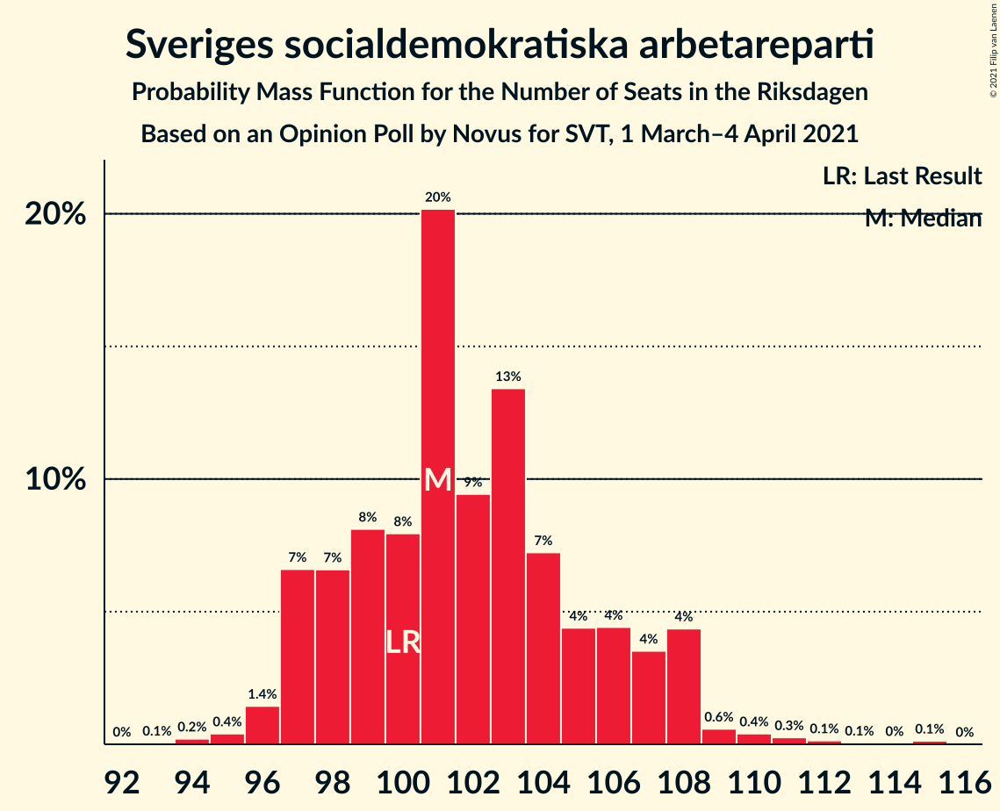
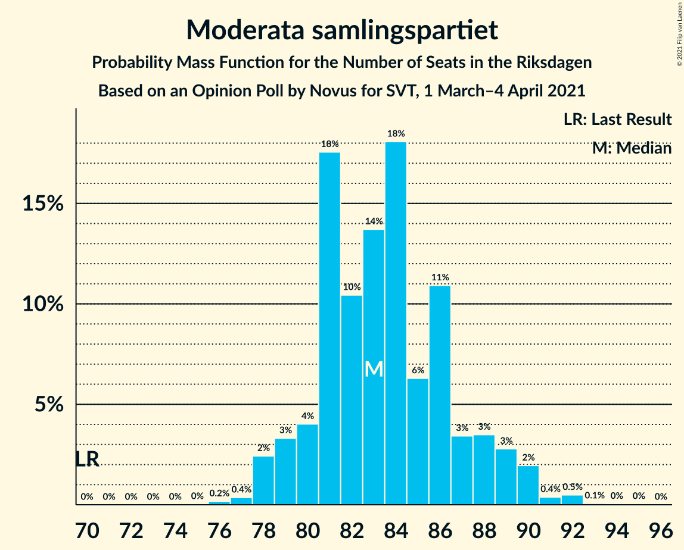
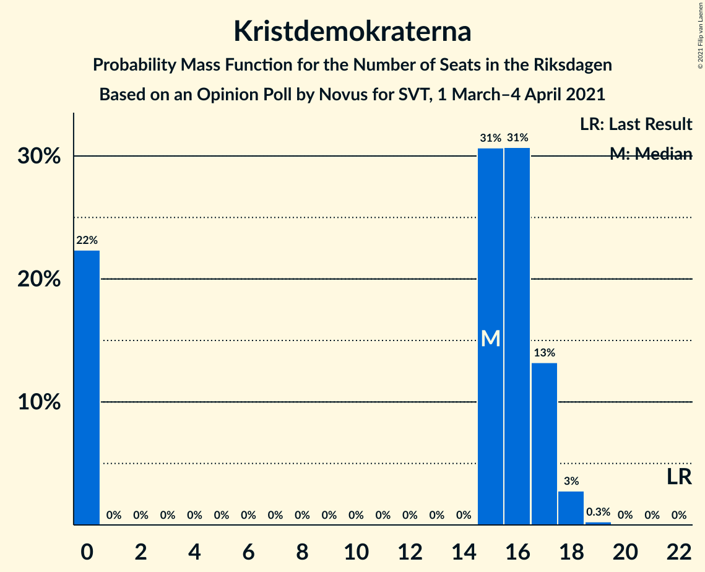
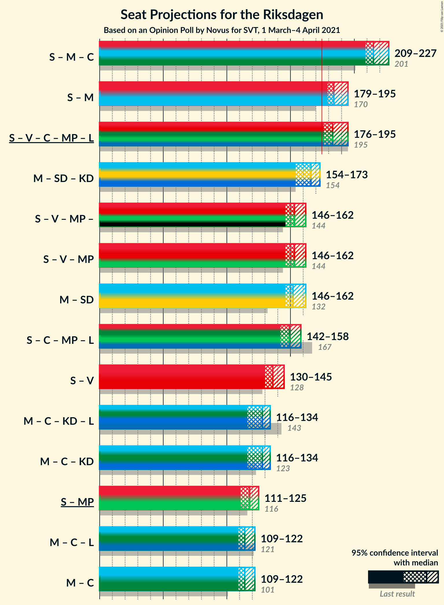
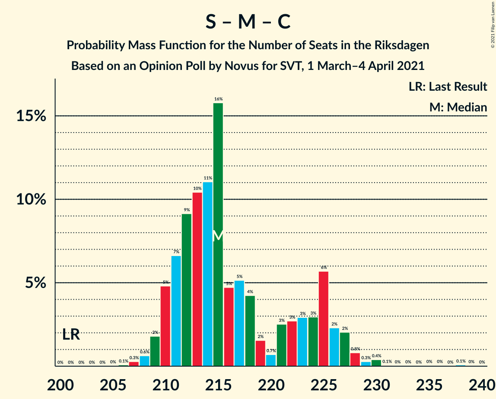
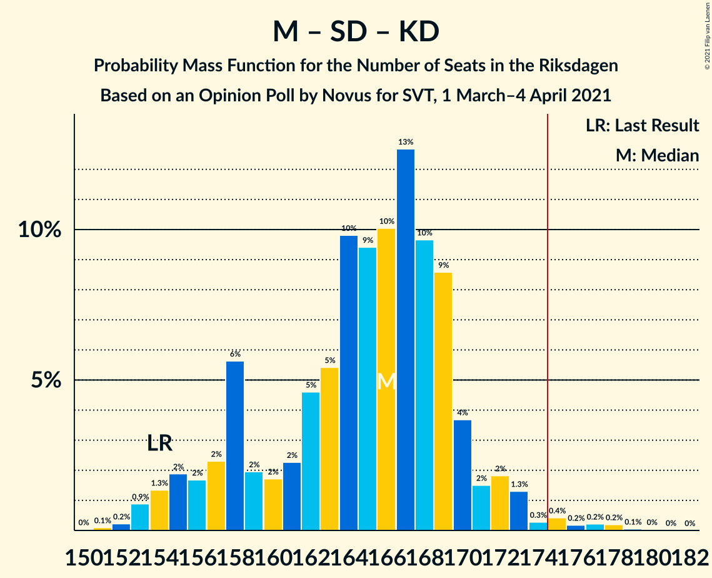
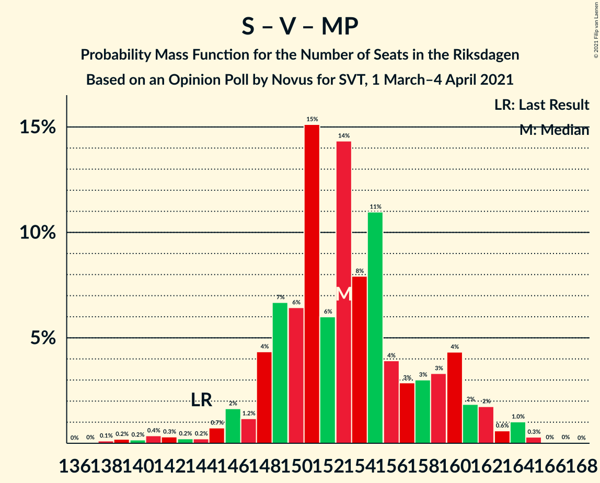
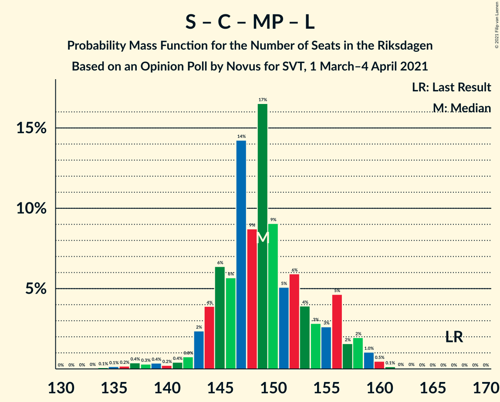
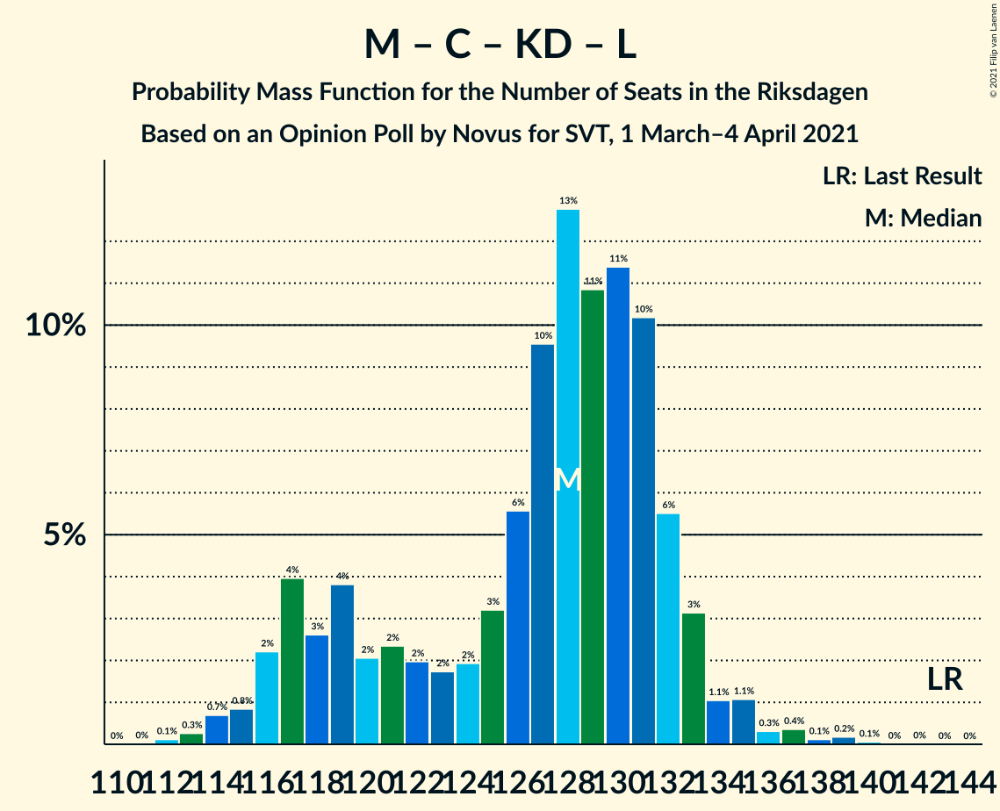

# Opinion Poll by Novus for SVT, 1 March–4 April 2021

<a href="#voting-intentions">Voting Intentions</a> | <a href="#seats">Seats</a> | <a href="#coalitions">Coalitions</a> | <a href="#technical-information">Technical Information</a>

## Voting Intentions

### Confidence Intervals

| Party | Last Result | Poll Result | 80% Confidence Interval | 90% Confidence Interval | 95% Confidence Interval | 99% Confidence Interval |
|:-----:|:-----------:|:-----------:|:-----------------------:|:-----------------------:|:-----------------------:|:-----------------------:|
| Sveriges socialdemokratiska arbetareparti | 28.3% | 27.6% | 26.8–28.4% |26.6–28.7% |26.4–28.9% |26.0–29.3% |
| Moderata samlingspartiet | 19.8% | 22.6% | 21.9–23.4% |21.6–23.6% |21.5–23.8% |21.1–24.2% |
| Sverigedemokraterna | 17.5% | 18.7% | 18.0–19.4% |17.8–19.6% |17.6–19.8% |17.3–20.2% |
| Vänsterpartiet | 8.0% | 9.5% | 9.0–10.1% |8.8–10.2% |8.7–10.3% |8.5–10.6% |
| Centerpartiet | 8.6% | 8.4% | 7.9–8.9% |7.8–9.1% |7.7–9.2% |7.4–9.5% |
| Miljöpartiet de gröna | 4.4% | 4.5% | 4.1–4.9% |4.1–5.0% |4.0–5.1% |3.8–5.3% |
| Kristdemokraterna | 6.3% | 4.2% | 3.9–4.6% |3.8–4.7% |3.7–4.8% |3.5–5.0% |
| Liberalerna | 5.5% | 2.9% | 2.6–3.2% |2.5–3.3% |2.5–3.4% |2.3–3.6% |

*Note:* The poll result column reflects the actual value used in the calculations. Published results may vary slightly, and in addition be rounded to fewer digits.

## Seats

### Confidence Intervals

| Party | Last Result | Median | 80% Confidence Interval | 90% Confidence Interval | 95% Confidence Interval | 99% Confidence Interval |
|:-----:|:-----------:|:------:|:-----------------------:|:-----------------------:|:-----------------------:|:-----------------------:|
| <a href="#sveriges-socialdemokratiska-arbetareparti">Sveriges socialdemokratiska arbetareparti</a> | 100 | 101 | 98–106 |97–108 |97–108 |95–111 |
| <a href="#moderata-samlingspartiet">Moderata samlingspartiet</a> | 70 | 83 | 80–87 |79–89 |78–90 |77–92 |
| <a href="#sverigedemokraterna">Sverigedemokraterna</a> | 62 | 69 | 66–72 |65–73 |65–74 |63–76 |
| <a href="#vänsterpartiet">Vänsterpartiet</a> | 28 | 35 | 33–37 |32–38 |32–39 |31–40 |
| <a href="#centerpartiet">Centerpartiet</a> | 31 | 31 | 29–33 |28–34 |28–34 |27–35 |
| <a href="#miljöpartiet-de-gröna">Miljöpartiet de gröna</a> | 16 | 17 | 15–18 |15–19 |15–19 |0–20 |
| <a href="#kristdemokraterna">Kristdemokraterna</a> | 22 | 15 | 0–17 |0–17 |0–18 |0–18 |
| <a href="#liberalerna">Liberalerna</a> | 20 | 0 | 0 |0 |0 |0 |

### Sveriges socialdemokratiska arbetareparti

*For a full overview of the results for this party, see the [Sveriges socialdemokratiska arbetareparti](party-sverigessocialdemokratiskaarbetareparti.html) page.*

| Number of Seats | Probability | Accumulated | Special Marks |
|:---------------:|:-----------:|:-----------:|:-------------:|
| 93 | 0.1% | 100% |  |
| 94 | 0.2% | 99.9% |  |
| 95 | 0.4% | 99.7% |  |
| 96 | 1.4% | 99.3% |  |
| 97 | 7% | 98% |  |
| 98 | 7% | 91% |  |
| 99 | 8% | 85% |  |
| 100 | 8% | 77% | Last Result |
| 101 | 20% | 69% | Median |
| 102 | 9% | 48% |  |
| 103 | 13% | 39% |  |
| 104 | 7% | 26% |  |
| 105 | 4% | 18% |  |
| 106 | 4% | 14% |  |
| 107 | 4% | 10% |  |
| 108 | 4% | 6% |  |
| 109 | 0.6% | 2% |  |
| 110 | 0.4% | 1.0% |  |
| 111 | 0.3% | 0.6% |  |
| 112 | 0.1% | 0.4% |  |
| 113 | 0.1% | 0.2% |  |
| 114 | 0% | 0.2% |  |
| 115 | 0.1% | 0.1% |  |
| 116 | 0% | 0% |  |

### Moderata samlingspartiet

*For a full overview of the results for this party, see the [Moderata samlingspartiet](party-moderatasamlingspartiet.html) page.*

| Number of Seats | Probability | Accumulated | Special Marks |
|:---------------:|:-----------:|:-----------:|:-------------:|
| 70 | 0% | 100% | Last Result |
| 71 | 0% | 100% |  |
| 72 | 0% | 100% |  |
| 73 | 0% | 100% |  |
| 74 | 0% | 100% |  |
| 75 | 0% | 100% |  |
| 76 | 0.2% | 100% |  |
| 77 | 0.4% | 99.8% |  |
| 78 | 2% | 99.4% |  |
| 79 | 3% | 97% |  |
| 80 | 4% | 94% |  |
| 81 | 18% | 90% |  |
| 82 | 10% | 72% |  |
| 83 | 14% | 62% | Median |
| 84 | 18% | 48% |  |
| 85 | 6% | 30% |  |
| 86 | 11% | 24% |  |
| 87 | 3% | 13% |  |
| 88 | 3% | 9% |  |
| 89 | 3% | 6% |  |
| 90 | 2% | 3% |  |
| 91 | 0.4% | 1.0% |  |
| 92 | 0.5% | 0.6% |  |
| 93 | 0.1% | 0.2% |  |
| 94 | 0% | 0.1% |  |
| 95 | 0% | 0% |  |

### Sverigedemokraterna

*For a full overview of the results for this party, see the [Sverigedemokraterna](party-sverigedemokraterna.html) page.*

| Number of Seats | Probability | Accumulated | Special Marks |
|:---------------:|:-----------:|:-----------:|:-------------:|
| 62 | 0.1% | 100% | Last Result |
| 63 | 0.4% | 99.9% |  |
| 64 | 2% | 99.5% |  |
| 65 | 4% | 98% |  |
| 66 | 12% | 94% |  |
| 67 | 12% | 83% |  |
| 68 | 16% | 71% |  |
| 69 | 16% | 55% | Median |
| 70 | 13% | 39% |  |
| 71 | 8% | 26% |  |
| 72 | 11% | 19% |  |
| 73 | 3% | 8% |  |
| 74 | 2% | 5% |  |
| 75 | 2% | 2% |  |
| 76 | 0.4% | 0.6% |  |
| 77 | 0.1% | 0.2% |  |
| 78 | 0.1% | 0.1% |  |
| 79 | 0% | 0% |  |

### Vänsterpartiet

*For a full overview of the results for this party, see the [Vänsterpartiet](party-vänsterpartiet.html) page.*

| Number of Seats | Probability | Accumulated | Special Marks |
|:---------------:|:-----------:|:-----------:|:-------------:|
| 28 | 0% | 100% | Last Result |
| 29 | 0% | 100% |  |
| 30 | 0.1% | 100% |  |
| 31 | 1.0% | 99.9% |  |
| 32 | 7% | 98.9% |  |
| 33 | 12% | 92% |  |
| 34 | 18% | 80% |  |
| 35 | 24% | 62% | Median |
| 36 | 20% | 37% |  |
| 37 | 10% | 18% |  |
| 38 | 5% | 8% |  |
| 39 | 2% | 3% |  |
| 40 | 0.7% | 0.8% |  |
| 41 | 0.1% | 0.1% |  |
| 42 | 0% | 0% |  |

### Centerpartiet

*For a full overview of the results for this party, see the [Centerpartiet](party-centerpartiet.html) page.*

| Number of Seats | Probability | Accumulated | Special Marks |
|:---------------:|:-----------:|:-----------:|:-------------:|
| 26 | 0.1% | 100% |  |
| 27 | 0.6% | 99.9% |  |
| 28 | 5% | 99.3% |  |
| 29 | 10% | 94% |  |
| 30 | 24% | 84% |  |
| 31 | 24% | 60% | Last Result, Median |
| 32 | 20% | 36% |  |
| 33 | 10% | 16% |  |
| 34 | 4% | 6% |  |
| 35 | 2% | 2% |  |
| 36 | 0.3% | 0.4% |  |
| 37 | 0.1% | 0.1% |  |
| 38 | 0% | 0% |  |

### Miljöpartiet de gröna

*For a full overview of the results for this party, see the [Miljöpartiet de gröna](party-miljöpartietdegröna.html) page.*

| Number of Seats | Probability | Accumulated | Special Marks |
|:---------------:|:-----------:|:-----------:|:-------------:|
| 0 | 2% | 100% |  |
| 1 | 0% | 98% |  |
| 2 | 0% | 98% |  |
| 3 | 0% | 98% |  |
| 4 | 0% | 98% |  |
| 5 | 0% | 98% |  |
| 6 | 0% | 98% |  |
| 7 | 0% | 98% |  |
| 8 | 0% | 98% |  |
| 9 | 0% | 98% |  |
| 10 | 0% | 98% |  |
| 11 | 0% | 98% |  |
| 12 | 0% | 98% |  |
| 13 | 0% | 98% |  |
| 14 | 0% | 98% |  |
| 15 | 14% | 98% |  |
| 16 | 28% | 84% | Last Result |
| 17 | 29% | 56% | Median |
| 18 | 20% | 27% |  |
| 19 | 6% | 7% |  |
| 20 | 0.7% | 0.7% |  |
| 21 | 0.1% | 0.1% |  |
| 22 | 0% | 0% |  |

### Kristdemokraterna

*For a full overview of the results for this party, see the [Kristdemokraterna](party-kristdemokraterna.html) page.*

| Number of Seats | Probability | Accumulated | Special Marks |
|:---------------:|:-----------:|:-----------:|:-------------:|
| 0 | 22% | 100% |  |
| 1 | 0% | 78% |  |
| 2 | 0% | 78% |  |
| 3 | 0% | 78% |  |
| 4 | 0% | 78% |  |
| 5 | 0% | 78% |  |
| 6 | 0% | 78% |  |
| 7 | 0% | 78% |  |
| 8 | 0% | 78% |  |
| 9 | 0% | 78% |  |
| 10 | 0% | 78% |  |
| 11 | 0% | 78% |  |
| 12 | 0% | 78% |  |
| 13 | 0% | 78% |  |
| 14 | 0% | 78% |  |
| 15 | 31% | 78% | Median |
| 16 | 31% | 47% |  |
| 17 | 13% | 16% |  |
| 18 | 3% | 3% |  |
| 19 | 0.3% | 0.3% |  |
| 20 | 0% | 0% |  |
| 21 | 0% | 0% |  |
| 22 | 0% | 0% | Last Result |

### Liberalerna

*For a full overview of the results for this party, see the [Liberalerna](party-liberalerna.html) page.*

| Number of Seats | Probability | Accumulated | Special Marks |
|:---------------:|:-----------:|:-----------:|:-------------:|
| 0 | 100% | 100% | Median |
| 1 | 0% | 0% |  |
| 2 | 0% | 0% |  |
| 3 | 0% | 0% |  |
| 4 | 0% | 0% |  |
| 5 | 0% | 0% |  |
| 6 | 0% | 0% |  |
| 7 | 0% | 0% |  |
| 8 | 0% | 0% |  |
| 9 | 0% | 0% |  |
| 10 | 0% | 0% |  |
| 11 | 0% | 0% |  |
| 12 | 0% | 0% |  |
| 13 | 0% | 0% |  |
| 14 | 0% | 0% |  |
| 15 | 0% | 0% |  |
| 16 | 0% | 0% |  |
| 17 | 0% | 0% |  |
| 18 | 0% | 0% |  |
| 19 | 0% | 0% |  |
| 20 | 0% | 0% | Last Result |

## Coalitions

### Confidence Intervals

| Coalition | Last Result | Median | Majority? | 80% Confidence Interval | 90% Confidence Interval | 95% Confidence Interval | 99% Confidence Interval |
|:---------:|:-----------:|:------:|:---------:|:-----------------------:|:-----------------------:|:-----------------------:|:-----------------------:|
| Sveriges socialdemokratiska arbetareparti – Moderata samlingspartiet – Centerpartiet | 201 | 215 | 100% | 211–225 | 210–226 | 209–227 | 208–230 |
| Sveriges socialdemokratiska arbetareparti – Moderata samlingspartiet | 170 | 184 | 100% | 180–193 | 179–194 | 179–195 | 177–198 |
| Sveriges socialdemokratiska arbetareparti – Vänsterpartiet – Centerpartiet – Miljöpartiet de gröna – Liberalerna | 195 | 183 | 98.9% | 180–191 | 178–193 | 176–195 | 172–196 |
| Moderata samlingspartiet – Sverigedemokraterna – Kristdemokraterna | 154 | 166 | 1.1% | 158–169 | 156–171 | 154–173 | 153–177 |
| Sveriges socialdemokratiska arbetareparti – Vänsterpartiet – Miljöpartiet de gröna | 144 | 153 | 0% | 149–159 | 147–161 | 146–162 | 140–164 |
| Moderata samlingspartiet – Sverigedemokraterna | 132 | 152 | 0% | 148–158 | 147–161 | 146–162 | 144–163 |
| Sveriges socialdemokratiska arbetareparti – Centerpartiet – Miljöpartiet de gröna – Liberalerna | 167 | 149 | 0% | 145–155 | 143–157 | 142–158 | 137–160 |
| Sveriges socialdemokratiska arbetareparti – Vänsterpartiet | 128 | 136 | 0% | 132–143 | 132–144 | 130–145 | 129–148 |
| Moderata samlingspartiet – Centerpartiet – Kristdemokraterna – Liberalerna | 143 | 128 | 0% | 118–132 | 117–133 | 116–134 | 114–137 |
| Moderata samlingspartiet – Centerpartiet – Kristdemokraterna | 123 | 128 | 0% | 118–132 | 117–133 | 116–134 | 114–137 |
| Sveriges socialdemokratiska arbetareparti – Miljöpartiet de gröna | 116 | 118 | 0% | 114–123 | 113–125 | 111–125 | 104–127 |
| Moderata samlingspartiet – Centerpartiet – Liberalerna | 121 | 114 | 0% | 110–119 | 110–121 | 109–122 | 107–124 |
| Moderata samlingspartiet – Centerpartiet | 101 | 114 | 0% | 110–119 | 110–121 | 109–122 | 107–124 |

### Sveriges socialdemokratiska arbetareparti – Moderata samlingspartiet – Centerpartiet

| Number of Seats | Probability | Accumulated | Special Marks |
|:---------------:|:-----------:|:-----------:|:-------------:|
| 201 | 0% | 100% | Last Result |
| 202 | 0% | 100% |  |
| 203 | 0% | 100% |  |
| 204 | 0% | 100% |  |
| 205 | 0% | 100% |  |
| 206 | 0.1% | 100% |  |
| 207 | 0.3% | 99.9% |  |
| 208 | 0.6% | 99.6% |  |
| 209 | 2% | 99.0% |  |
| 210 | 5% | 97% |  |
| 211 | 7% | 92% |  |
| 212 | 9% | 86% |  |
| 213 | 10% | 77% |  |
| 214 | 11% | 66% |  |
| 215 | 16% | 55% | Median |
| 216 | 5% | 39% |  |
| 217 | 5% | 35% |  |
| 218 | 4% | 29% |  |
| 219 | 2% | 25% |  |
| 220 | 0.7% | 24% |  |
| 221 | 3% | 23% |  |
| 222 | 3% | 20% |  |
| 223 | 3% | 18% |  |
| 224 | 3% | 15% |  |
| 225 | 6% | 12% |  |
| 226 | 2% | 6% |  |
| 227 | 2% | 4% |  |
| 228 | 0.8% | 2% |  |
| 229 | 0.3% | 1.1% |  |
| 230 | 0.4% | 0.8% |  |
| 231 | 0.1% | 0.4% |  |
| 232 | 0% | 0.3% |  |
| 233 | 0% | 0.3% |  |
| 234 | 0% | 0.3% |  |
| 235 | 0% | 0.3% |  |
| 236 | 0% | 0.2% |  |
| 237 | 0% | 0.2% |  |
| 238 | 0.1% | 0.2% |  |
| 239 | 0% | 0.1% |  |
| 240 | 0% | 0% |  |

### Sveriges socialdemokratiska arbetareparti – Moderata samlingspartiet

| Number of Seats | Probability | Accumulated | Special Marks |
|:---------------:|:-----------:|:-----------:|:-------------:|
| 170 | 0% | 100% | Last Result |
| 171 | 0% | 100% |  |
| 172 | 0% | 100% |  |
| 173 | 0% | 100% |  |
| 174 | 0% | 100% |  |
| 175 | 0.1% | 100% | Majority |
| 176 | 0.2% | 99.9% |  |
| 177 | 0.9% | 99.6% |  |
| 178 | 1.2% | 98.8% |  |
| 179 | 4% | 98% |  |
| 180 | 6% | 94% |  |
| 181 | 8% | 88% |  |
| 182 | 11% | 80% |  |
| 183 | 5% | 69% |  |
| 184 | 17% | 63% | Median |
| 185 | 11% | 47% |  |
| 186 | 5% | 35% |  |
| 187 | 4% | 30% |  |
| 188 | 3% | 26% |  |
| 189 | 2% | 23% |  |
| 190 | 3% | 21% |  |
| 191 | 2% | 17% |  |
| 192 | 3% | 15% |  |
| 193 | 4% | 11% |  |
| 194 | 4% | 7% |  |
| 195 | 2% | 3% |  |
| 196 | 0.7% | 2% |  |
| 197 | 0.5% | 1.1% |  |
| 198 | 0.2% | 0.5% |  |
| 199 | 0.1% | 0.4% |  |
| 200 | 0% | 0.3% |  |
| 201 | 0% | 0.3% |  |
| 202 | 0% | 0.2% |  |
| 203 | 0% | 0.2% |  |
| 204 | 0.1% | 0.2% |  |
| 205 | 0% | 0.1% |  |
| 206 | 0% | 0% |  |

### Sveriges socialdemokratiska arbetareparti – Vänsterpartiet – Centerpartiet – Miljöpartiet de gröna – Liberalerna

| Number of Seats | Probability | Accumulated | Special Marks |
|:---------------:|:-----------:|:-----------:|:-------------:|
| 169 | 0% | 100% |  |
| 170 | 0.1% | 99.9% |  |
| 171 | 0.2% | 99.9% |  |
| 172 | 0.2% | 99.7% |  |
| 173 | 0.2% | 99.5% |  |
| 174 | 0.4% | 99.3% |  |
| 175 | 0.3% | 98.9% | Majority |
| 176 | 1.3% | 98.6% |  |
| 177 | 2% | 97% |  |
| 178 | 2% | 95% |  |
| 179 | 4% | 94% |  |
| 180 | 9% | 90% |  |
| 181 | 10% | 82% |  |
| 182 | 13% | 72% |  |
| 183 | 10% | 59% |  |
| 184 | 9% | 49% | Median |
| 185 | 10% | 40% |  |
| 186 | 5% | 30% |  |
| 187 | 5% | 25% |  |
| 188 | 2% | 20% |  |
| 189 | 2% | 18% |  |
| 190 | 2% | 16% |  |
| 191 | 6% | 14% |  |
| 192 | 2% | 8% |  |
| 193 | 2% | 6% |  |
| 194 | 2% | 4% |  |
| 195 | 1.3% | 3% | Last Result |
| 196 | 0.9% | 1.3% |  |
| 197 | 0.2% | 0.4% |  |
| 198 | 0.1% | 0.1% |  |
| 199 | 0% | 0% |  |

### Moderata samlingspartiet – Sverigedemokraterna – Kristdemokraterna

| Number of Seats | Probability | Accumulated | Special Marks |
|:---------------:|:-----------:|:-----------:|:-------------:|
| 151 | 0.1% | 100% |  |
| 152 | 0.2% | 99.9% |  |
| 153 | 0.9% | 99.6% |  |
| 154 | 1.3% | 98.7% | Last Result |
| 155 | 2% | 97% |  |
| 156 | 2% | 96% |  |
| 157 | 2% | 94% |  |
| 158 | 6% | 92% |  |
| 159 | 2% | 86% |  |
| 160 | 2% | 84% |  |
| 161 | 2% | 82% |  |
| 162 | 5% | 80% |  |
| 163 | 5% | 75% |  |
| 164 | 10% | 70% |  |
| 165 | 9% | 60% |  |
| 166 | 10% | 51% |  |
| 167 | 13% | 41% | Median |
| 168 | 10% | 28% |  |
| 169 | 9% | 18% |  |
| 170 | 4% | 10% |  |
| 171 | 2% | 6% |  |
| 172 | 2% | 5% |  |
| 173 | 1.3% | 3% |  |
| 174 | 0.3% | 1.4% |  |
| 175 | 0.4% | 1.1% | Majority |
| 176 | 0.2% | 0.7% |  |
| 177 | 0.2% | 0.5% |  |
| 178 | 0.2% | 0.3% |  |
| 179 | 0.1% | 0.1% |  |
| 180 | 0% | 0.1% |  |
| 181 | 0% | 0% |  |

### Sveriges socialdemokratiska arbetareparti – Vänsterpartiet – Miljöpartiet de gröna

| Number of Seats | Probability | Accumulated | Special Marks |
|:---------------:|:-----------:|:-----------:|:-------------:|
| 137 | 0% | 100% |  |
| 138 | 0.1% | 99.9% |  |
| 139 | 0.2% | 99.8% |  |
| 140 | 0.2% | 99.6% |  |
| 141 | 0.4% | 99.5% |  |
| 142 | 0.3% | 99.1% |  |
| 143 | 0.2% | 98.8% |  |
| 144 | 0.2% | 98.6% | Last Result |
| 145 | 0.7% | 98% |  |
| 146 | 2% | 98% |  |
| 147 | 1.2% | 96% |  |
| 148 | 4% | 95% |  |
| 149 | 7% | 90% |  |
| 150 | 6% | 84% |  |
| 151 | 15% | 77% |  |
| 152 | 6% | 62% |  |
| 153 | 14% | 56% | Median |
| 154 | 8% | 42% |  |
| 155 | 11% | 34% |  |
| 156 | 4% | 23% |  |
| 157 | 3% | 19% |  |
| 158 | 3% | 16% |  |
| 159 | 3% | 13% |  |
| 160 | 4% | 10% |  |
| 161 | 2% | 6% |  |
| 162 | 2% | 4% |  |
| 163 | 0.6% | 2% |  |
| 164 | 1.0% | 1.4% |  |
| 165 | 0.3% | 0.4% |  |
| 166 | 0% | 0.1% |  |
| 167 | 0% | 0.1% |  |
| 168 | 0% | 0% |  |

### Moderata samlingspartiet – Sverigedemokraterna

| Number of Seats | Probability | Accumulated | Special Marks |
|:---------------:|:-----------:|:-----------:|:-------------:|
| 132 | 0% | 100% | Last Result |
| 133 | 0% | 100% |  |
| 134 | 0% | 100% |  |
| 135 | 0% | 100% |  |
| 136 | 0% | 100% |  |
| 137 | 0% | 100% |  |
| 138 | 0% | 100% |  |
| 139 | 0% | 100% |  |
| 140 | 0% | 100% |  |
| 141 | 0% | 100% |  |
| 142 | 0% | 100% |  |
| 143 | 0.1% | 100% |  |
| 144 | 0.4% | 99.8% |  |
| 145 | 0.7% | 99.5% |  |
| 146 | 3% | 98.8% |  |
| 147 | 3% | 96% |  |
| 148 | 6% | 93% |  |
| 149 | 15% | 87% |  |
| 150 | 10% | 72% |  |
| 151 | 9% | 62% |  |
| 152 | 9% | 53% | Median |
| 153 | 12% | 44% |  |
| 154 | 6% | 31% |  |
| 155 | 3% | 25% |  |
| 156 | 2% | 22% |  |
| 157 | 4% | 19% |  |
| 158 | 6% | 15% |  |
| 159 | 2% | 9% |  |
| 160 | 1.3% | 7% |  |
| 161 | 2% | 6% |  |
| 162 | 2% | 4% |  |
| 163 | 1.3% | 2% |  |
| 164 | 0.2% | 0.5% |  |
| 165 | 0.1% | 0.3% |  |
| 166 | 0.1% | 0.2% |  |
| 167 | 0% | 0.1% |  |
| 168 | 0% | 0.1% |  |
| 169 | 0% | 0.1% |  |
| 170 | 0% | 0.1% |  |
| 171 | 0% | 0% |  |

### Sveriges socialdemokratiska arbetareparti – Centerpartiet – Miljöpartiet de gröna – Liberalerna

| Number of Seats | Probability | Accumulated | Special Marks |
|:---------------:|:-----------:|:-----------:|:-------------:|
| 133 | 0% | 100% |  |
| 134 | 0.1% | 99.9% |  |
| 135 | 0.1% | 99.9% |  |
| 136 | 0.2% | 99.7% |  |
| 137 | 0.4% | 99.5% |  |
| 138 | 0.3% | 99.2% |  |
| 139 | 0.4% | 98.9% |  |
| 140 | 0.2% | 98% |  |
| 141 | 0.4% | 98% |  |
| 142 | 0.8% | 98% |  |
| 143 | 2% | 97% |  |
| 144 | 4% | 95% |  |
| 145 | 6% | 91% |  |
| 146 | 6% | 84% |  |
| 147 | 14% | 79% |  |
| 148 | 9% | 65% |  |
| 149 | 17% | 56% | Median |
| 150 | 9% | 39% |  |
| 151 | 5% | 30% |  |
| 152 | 6% | 25% |  |
| 153 | 4% | 19% |  |
| 154 | 3% | 15% |  |
| 155 | 3% | 13% |  |
| 156 | 5% | 10% |  |
| 157 | 2% | 5% |  |
| 158 | 2% | 4% |  |
| 159 | 1.0% | 2% |  |
| 160 | 0.5% | 0.7% |  |
| 161 | 0.1% | 0.2% |  |
| 162 | 0% | 0.1% |  |
| 163 | 0% | 0% |  |
| 164 | 0% | 0% |  |
| 165 | 0% | 0% |  |
| 166 | 0% | 0% |  |
| 167 | 0% | 0% | Last Result |

### Sveriges socialdemokratiska arbetareparti – Vänsterpartiet

| Number of Seats | Probability | Accumulated | Special Marks |
|:---------------:|:-----------:|:-----------:|:-------------:|
| 127 | 0% | 100% |  |
| 128 | 0.2% | 99.9% | Last Result |
| 129 | 0.4% | 99.8% |  |
| 130 | 2% | 99.4% |  |
| 131 | 2% | 97% |  |
| 132 | 5% | 95% |  |
| 133 | 8% | 90% |  |
| 134 | 12% | 81% |  |
| 135 | 12% | 69% |  |
| 136 | 8% | 57% | Median |
| 137 | 9% | 49% |  |
| 138 | 11% | 39% |  |
| 139 | 6% | 28% |  |
| 140 | 4% | 22% |  |
| 141 | 3% | 17% |  |
| 142 | 4% | 14% |  |
| 143 | 4% | 10% |  |
| 144 | 2% | 6% |  |
| 145 | 1.4% | 4% |  |
| 146 | 1.0% | 2% |  |
| 147 | 0.8% | 1.4% |  |
| 148 | 0.3% | 0.6% |  |
| 149 | 0.1% | 0.3% |  |
| 150 | 0.1% | 0.3% |  |
| 151 | 0% | 0.2% |  |
| 152 | 0.1% | 0.1% |  |
| 153 | 0.1% | 0.1% |  |
| 154 | 0% | 0% |  |

### Moderata samlingspartiet – Centerpartiet – Kristdemokraterna – Liberalerna

| Number of Seats | Probability | Accumulated | Special Marks |
|:---------------:|:-----------:|:-----------:|:-------------:|
| 112 | 0.1% | 100% |  |
| 113 | 0.3% | 99.9% |  |
| 114 | 0.7% | 99.6% |  |
| 115 | 0.8% | 98.9% |  |
| 116 | 2% | 98% |  |
| 117 | 4% | 96% |  |
| 118 | 3% | 92% |  |
| 119 | 4% | 89% |  |
| 120 | 2% | 85% |  |
| 121 | 2% | 83% |  |
| 122 | 2% | 81% |  |
| 123 | 2% | 79% |  |
| 124 | 2% | 77% |  |
| 125 | 3% | 75% |  |
| 126 | 6% | 72% |  |
| 127 | 10% | 67% |  |
| 128 | 13% | 57% |  |
| 129 | 11% | 44% | Median |
| 130 | 11% | 33% |  |
| 131 | 10% | 22% |  |
| 132 | 6% | 12% |  |
| 133 | 3% | 6% |  |
| 134 | 1.1% | 3% |  |
| 135 | 1.1% | 2% |  |
| 136 | 0.3% | 1.1% |  |
| 137 | 0.4% | 0.8% |  |
| 138 | 0.1% | 0.4% |  |
| 139 | 0.2% | 0.3% |  |
| 140 | 0.1% | 0.1% |  |
| 141 | 0% | 0% |  |
| 142 | 0% | 0% |  |
| 143 | 0% | 0% | Last Result |

### Moderata samlingspartiet – Centerpartiet – Kristdemokraterna

| Number of Seats | Probability | Accumulated | Special Marks |
|:---------------:|:-----------:|:-----------:|:-------------:|
| 112 | 0.1% | 100% |  |
| 113 | 0.3% | 99.9% |  |
| 114 | 0.7% | 99.6% |  |
| 115 | 0.8% | 98.9% |  |
| 116 | 2% | 98% |  |
| 117 | 4% | 96% |  |
| 118 | 3% | 92% |  |
| 119 | 4% | 89% |  |
| 120 | 2% | 85% |  |
| 121 | 2% | 83% |  |
| 122 | 2% | 81% |  |
| 123 | 2% | 79% | Last Result |
| 124 | 2% | 77% |  |
| 125 | 3% | 75% |  |
| 126 | 6% | 72% |  |
| 127 | 10% | 67% |  |
| 128 | 13% | 57% |  |
| 129 | 11% | 44% | Median |
| 130 | 11% | 33% |  |
| 131 | 10% | 22% |  |
| 132 | 6% | 12% |  |
| 133 | 3% | 6% |  |
| 134 | 1.1% | 3% |  |
| 135 | 1.1% | 2% |  |
| 136 | 0.3% | 1.1% |  |
| 137 | 0.4% | 0.7% |  |
| 138 | 0.1% | 0.4% |  |
| 139 | 0.2% | 0.3% |  |
| 140 | 0.1% | 0.1% |  |
| 141 | 0% | 0% |  |

### Sveriges socialdemokratiska arbetareparti – Miljöpartiet de gröna

| Number of Seats | Probability | Accumulated | Special Marks |
|:---------------:|:-----------:|:-----------:|:-------------:|
| 101 | 0% | 100% |  |
| 102 | 0% | 99.9% |  |
| 103 | 0.2% | 99.9% |  |
| 104 | 0.4% | 99.7% |  |
| 105 | 0.4% | 99.3% |  |
| 106 | 0.3% | 99.0% |  |
| 107 | 0.3% | 98.7% |  |
| 108 | 0.1% | 98% |  |
| 109 | 0.1% | 98% |  |
| 110 | 0.1% | 98% |  |
| 111 | 0.7% | 98% |  |
| 112 | 1.4% | 97% |  |
| 113 | 5% | 96% |  |
| 114 | 4% | 91% |  |
| 115 | 6% | 87% |  |
| 116 | 9% | 80% | Last Result |
| 117 | 10% | 71% |  |
| 118 | 15% | 62% | Median |
| 119 | 15% | 46% |  |
| 120 | 9% | 32% |  |
| 121 | 6% | 23% |  |
| 122 | 4% | 17% |  |
| 123 | 4% | 13% |  |
| 124 | 2% | 9% |  |
| 125 | 5% | 7% |  |
| 126 | 0.6% | 2% |  |
| 127 | 0.5% | 0.9% |  |
| 128 | 0.2% | 0.4% |  |
| 129 | 0.2% | 0.3% |  |
| 130 | 0.1% | 0.1% |  |
| 131 | 0% | 0% |  |

### Moderata samlingspartiet – Centerpartiet – Liberalerna

| Number of Seats | Probability | Accumulated | Special Marks |
|:---------------:|:-----------:|:-----------:|:-------------:|
| 106 | 0.1% | 100% |  |
| 107 | 0.5% | 99.8% |  |
| 108 | 1.5% | 99.3% |  |
| 109 | 3% | 98% |  |
| 110 | 6% | 95% |  |
| 111 | 7% | 89% |  |
| 112 | 13% | 82% |  |
| 113 | 13% | 69% |  |
| 114 | 12% | 56% | Median |
| 115 | 9% | 44% |  |
| 116 | 10% | 35% |  |
| 117 | 7% | 25% |  |
| 118 | 5% | 18% |  |
| 119 | 5% | 13% |  |
| 120 | 2% | 9% |  |
| 121 | 3% | 6% | Last Result |
| 122 | 2% | 4% |  |
| 123 | 1.1% | 2% |  |
| 124 | 0.3% | 0.7% |  |
| 125 | 0.2% | 0.3% |  |
| 126 | 0.1% | 0.2% |  |
| 127 | 0% | 0.1% |  |
| 128 | 0% | 0.1% |  |
| 129 | 0% | 0% |  |

### Moderata samlingspartiet – Centerpartiet

| Number of Seats | Probability | Accumulated | Special Marks |
|:---------------:|:-----------:|:-----------:|:-------------:|
| 101 | 0% | 100% | Last Result |
| 102 | 0% | 100% |  |
| 103 | 0% | 100% |  |
| 104 | 0% | 100% |  |
| 105 | 0% | 100% |  |
| 106 | 0.1% | 100% |  |
| 107 | 0.5% | 99.8% |  |
| 108 | 1.5% | 99.3% |  |
| 109 | 3% | 98% |  |
| 110 | 6% | 95% |  |
| 111 | 7% | 89% |  |
| 112 | 13% | 82% |  |
| 113 | 13% | 69% |  |
| 114 | 12% | 56% | Median |
| 115 | 9% | 44% |  |
| 116 | 10% | 35% |  |
| 117 | 7% | 25% |  |
| 118 | 5% | 18% |  |
| 119 | 5% | 13% |  |
| 120 | 2% | 9% |  |
| 121 | 3% | 6% |  |
| 122 | 2% | 4% |  |
| 123 | 1.1% | 2% |  |
| 124 | 0.3% | 0.7% |  |
| 125 | 0.2% | 0.3% |  |
| 126 | 0.1% | 0.2% |  |
| 127 | 0% | 0.1% |  |
| 128 | 0% | 0.1% |  |
| 129 | 0% | 0% |  |

## Technical Information

### Opinion Poll

+ **Polling firm:** Novus
+ **Commissioner(s):** SVT
+ **Fieldwork period:** 1 March–4 April 2021

### Calculations

+ **Sample size:** 4989
+ **Simulations done:** 1,048,576
+ **Error estimate:** 0.59%

