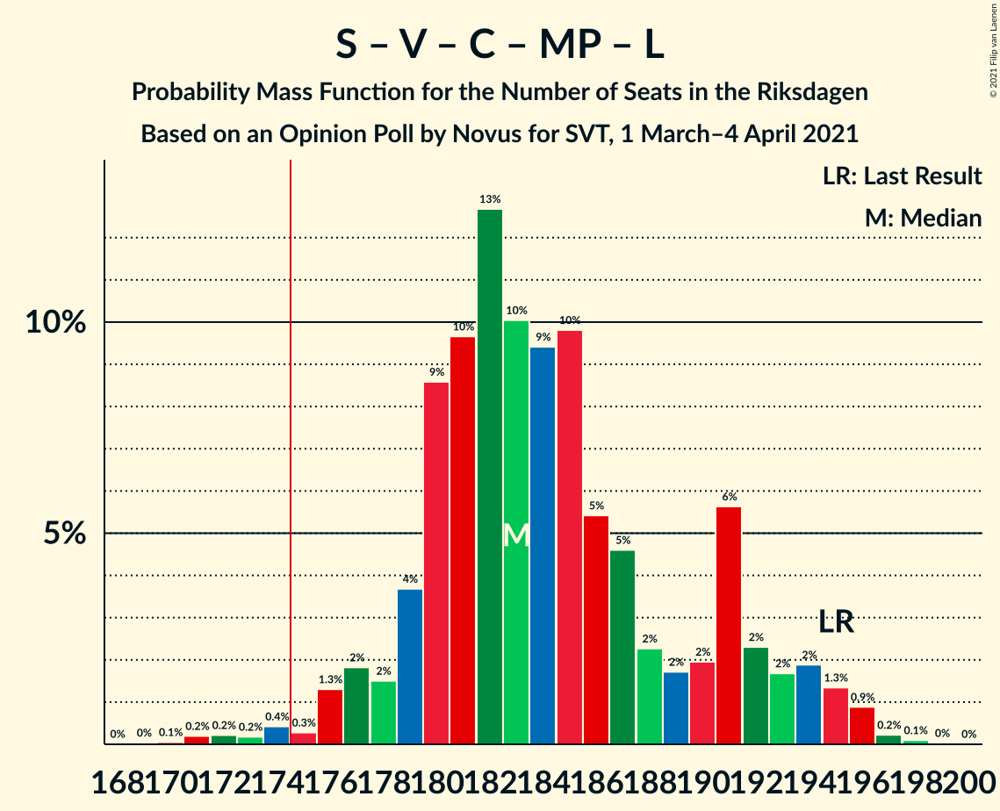
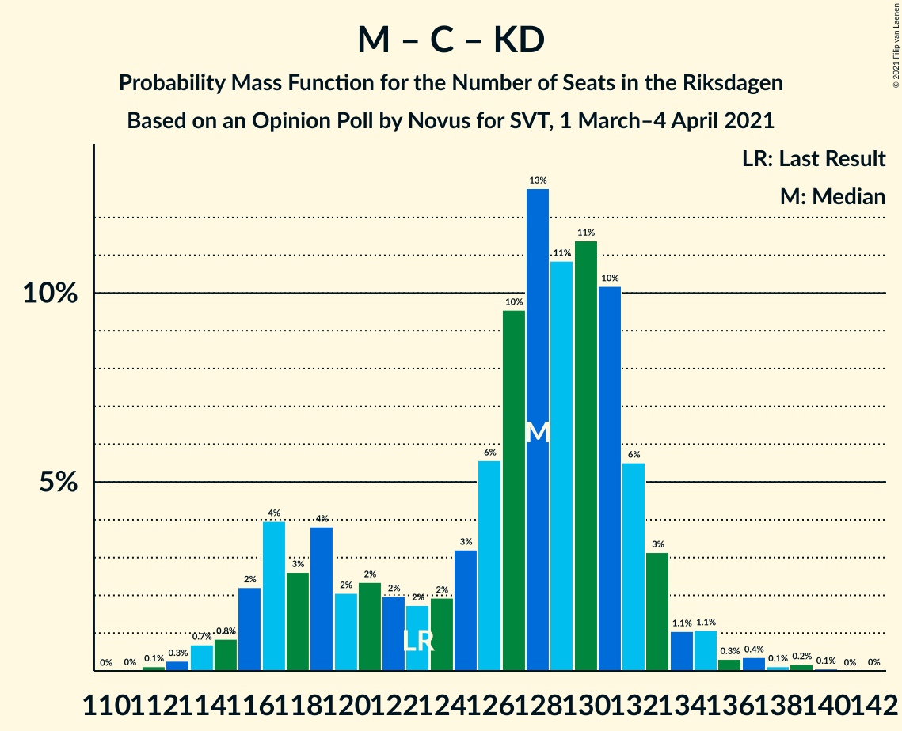

# Opinion Poll by Novus for SVT, 1 March–4 April 2021

<a href="#voting-intentions">Voting Intentions</a> | <a href="#seats">Seats</a> | <a href="#coalitions">Coalitions</a> | <a href="#technical-information">Technical Information</a>

## Voting Intentions

### Confidence Intervals

| Party | Last Result | Poll Result | 80% Confidence Interval | 90% Confidence Interval | 95% Confidence Interval | 99% Confidence Interval |
|:-----:|:-----------:|:-----------:|:-----------------------:|:-----------------------:|:-----------------------:|:-----------------------:|
| Sveriges socialdemokratiska arbetareparti | 28.3% | 27.6% | 26.8–28.4% |26.6–28.7% |26.4–28.9% |26.0–29.3% |
| Moderata samlingspartiet | 19.8% | 22.6% | 21.9–23.4% |21.6–23.6% |21.5–23.8% |21.1–24.2% |
| Sverigedemokraterna | 17.5% | 18.7% | 18.0–19.4% |17.8–19.6% |17.6–19.8% |17.3–20.2% |
| Vänsterpartiet | 8.0% | 9.5% | 9.0–10.1% |8.8–10.2% |8.7–10.3% |8.5–10.6% |
| Centerpartiet | 8.6% | 8.4% | 7.9–8.9% |7.8–9.1% |7.7–9.2% |7.4–9.5% |
| Miljöpartiet de gröna | 4.4% | 4.5% | 4.1–4.9% |4.1–5.0% |4.0–5.1% |3.8–5.3% |
| Kristdemokraterna | 6.3% | 4.2% | 3.9–4.6% |3.8–4.7% |3.7–4.8% |3.5–5.0% |
| Liberalerna | 5.5% | 2.9% | 2.6–3.2% |2.5–3.3% |2.5–3.4% |2.3–3.6% |

*Note:* The poll result column reflects the actual value used in the calculations. Published results may vary slightly, and in addition be rounded to fewer digits.

## Seats

### Confidence Intervals

| Party | Last Result | Median | 80% Confidence Interval | 90% Confidence Interval | 95% Confidence Interval | 99% Confidence Interval |
|:-----:|:-----------:|:------:|:-----------------------:|:-----------------------:|:-----------------------:|:-----------------------:|
| <a href="#sveriges-socialdemokratiska-arbetareparti">Sveriges socialdemokratiska arbetareparti</a> | 100 | 102 | 98–106 |97–108 |96–108 |95–112 |
| <a href="#moderata-samlingspartiet">Moderata samlingspartiet</a> | 70 | 84 | 80–90 |80–90 |78–90 |77–92 |
| <a href="#sverigedemokraterna">Sverigedemokraterna</a> | 62 | 70 | 67–72 |65–73 |65–74 |64–76 |
| <a href="#vänsterpartiet">Vänsterpartiet</a> | 28 | 35 | 32–38 |32–39 |31–39 |31–40 |
| <a href="#centerpartiet">Centerpartiet</a> | 31 | 32 | 29–33 |29–34 |28–34 |27–35 |
| <a href="#miljöpartiet-de-gröna">Miljöpartiet de gröna</a> | 16 | 17 | 16–18 |15–19 |15–19 |0–20 |
| <a href="#kristdemokraterna">Kristdemokraterna</a> | 22 | 15 | 0–17 |0–17 |0–18 |0–18 |
| <a href="#liberalerna">Liberalerna</a> | 20 | 0 | 0 |0 |0 |0 |

### Sveriges socialdemokratiska arbetareparti

*For a full overview of the results for this party, see the [Sveriges socialdemokratiska arbetareparti](party-sverigessocialdemokratiskaarbetareparti.html) page.*

| Number of Seats | Probability | Accumulated | Special Marks |
|:---------------:|:-----------:|:-----------:|:-------------:|
| 93 | 0.1% | 100% |  |
| 94 | 0.1% | 99.9% |  |
| 95 | 0.5% | 99.8% |  |
| 96 | 3% | 99.3% |  |
| 97 | 5% | 96% |  |
| 98 | 6% | 92% |  |
| 99 | 5% | 86% |  |
| 100 | 25% | 80% | Last Result |
| 101 | 5% | 55% |  |
| 102 | 5% | 50% | Median |
| 103 | 18% | 46% |  |
| 104 | 5% | 28% |  |
| 105 | 2% | 23% |  |
| 106 | 11% | 20% |  |
| 107 | 3% | 10% |  |
| 108 | 5% | 7% |  |
| 109 | 0.3% | 2% |  |
| 110 | 1.2% | 2% |  |
| 111 | 0.2% | 0.8% |  |
| 112 | 0.1% | 0.6% |  |
| 113 | 0.1% | 0.4% |  |
| 114 | 0.1% | 0.3% |  |
| 115 | 0.2% | 0.2% |  |
| 116 | 0% | 0% |  |

### Moderata samlingspartiet

*For a full overview of the results for this party, see the [Moderata samlingspartiet](party-moderatasamlingspartiet.html) page.*

| Number of Seats | Probability | Accumulated | Special Marks |
|:---------------:|:-----------:|:-----------:|:-------------:|
| 70 | 0% | 100% | Last Result |
| 71 | 0% | 100% |  |
| 72 | 0% | 100% |  |
| 73 | 0% | 100% |  |
| 74 | 0% | 100% |  |
| 75 | 0% | 100% |  |
| 76 | 0.3% | 99.9% |  |
| 77 | 0.2% | 99.6% |  |
| 78 | 3% | 99.4% |  |
| 79 | 2% | 97% |  |
| 80 | 5% | 95% |  |
| 81 | 5% | 90% |  |
| 82 | 10% | 85% |  |
| 83 | 10% | 75% |  |
| 84 | 18% | 65% | Median |
| 85 | 11% | 47% |  |
| 86 | 11% | 36% |  |
| 87 | 7% | 24% |  |
| 88 | 0.9% | 17% |  |
| 89 | 1.0% | 16% |  |
| 90 | 14% | 15% |  |
| 91 | 0.4% | 1.1% |  |
| 92 | 0.6% | 0.7% |  |
| 93 | 0.1% | 0.1% |  |
| 94 | 0.1% | 0.1% |  |
| 95 | 0% | 0% |  |

### Sverigedemokraterna

*For a full overview of the results for this party, see the [Sverigedemokraterna](party-sverigedemokraterna.html) page.*

| Number of Seats | Probability | Accumulated | Special Marks |
|:---------------:|:-----------:|:-----------:|:-------------:|
| 62 | 0.1% | 100% | Last Result |
| 63 | 0.3% | 99.9% |  |
| 64 | 1.1% | 99.6% |  |
| 65 | 5% | 98% |  |
| 66 | 3% | 94% |  |
| 67 | 6% | 91% |  |
| 68 | 21% | 85% |  |
| 69 | 8% | 63% |  |
| 70 | 14% | 56% | Median |
| 71 | 9% | 42% |  |
| 72 | 27% | 33% |  |
| 73 | 3% | 6% |  |
| 74 | 2% | 4% |  |
| 75 | 0.8% | 1.3% |  |
| 76 | 0.4% | 0.6% |  |
| 77 | 0.1% | 0.2% |  |
| 78 | 0.1% | 0.1% |  |
| 79 | 0% | 0% |  |

### Vänsterpartiet

*For a full overview of the results for this party, see the [Vänsterpartiet](party-vänsterpartiet.html) page.*

| Number of Seats | Probability | Accumulated | Special Marks |
|:---------------:|:-----------:|:-----------:|:-------------:|
| 28 | 0% | 100% | Last Result |
| 29 | 0% | 100% |  |
| 30 | 0.1% | 100% |  |
| 31 | 3% | 99.9% |  |
| 32 | 17% | 97% |  |
| 33 | 19% | 80% |  |
| 34 | 8% | 61% |  |
| 35 | 19% | 53% | Median |
| 36 | 9% | 34% |  |
| 37 | 6% | 26% |  |
| 38 | 12% | 20% |  |
| 39 | 6% | 8% |  |
| 40 | 1.4% | 2% |  |
| 41 | 0.1% | 0.3% |  |
| 42 | 0.2% | 0.2% |  |
| 43 | 0% | 0% |  |

### Centerpartiet

*For a full overview of the results for this party, see the [Centerpartiet](party-centerpartiet.html) page.*

| Number of Seats | Probability | Accumulated | Special Marks |
|:---------------:|:-----------:|:-----------:|:-------------:|
| 26 | 0.1% | 100% |  |
| 27 | 0.9% | 99.9% |  |
| 28 | 3% | 99.0% |  |
| 29 | 11% | 96% |  |
| 30 | 10% | 85% |  |
| 31 | 22% | 75% | Last Result |
| 32 | 43% | 53% | Median |
| 33 | 4% | 10% |  |
| 34 | 5% | 6% |  |
| 35 | 0.5% | 1.0% |  |
| 36 | 0.4% | 0.5% |  |
| 37 | 0% | 0% |  |

### Miljöpartiet de gröna

*For a full overview of the results for this party, see the [Miljöpartiet de gröna](party-miljöpartietdegröna.html) page.*

| Number of Seats | Probability | Accumulated | Special Marks |
|:---------------:|:-----------:|:-----------:|:-------------:|
| 0 | 2% | 100% |  |
| 1 | 0% | 98% |  |
| 2 | 0% | 98% |  |
| 3 | 0% | 98% |  |
| 4 | 0% | 98% |  |
| 5 | 0% | 98% |  |
| 6 | 0% | 98% |  |
| 7 | 0% | 98% |  |
| 8 | 0% | 98% |  |
| 9 | 0% | 98% |  |
| 10 | 0% | 98% |  |
| 11 | 0% | 98% |  |
| 12 | 0% | 98% |  |
| 13 | 0% | 98% |  |
| 14 | 0% | 98% |  |
| 15 | 7% | 98% |  |
| 16 | 25% | 91% | Last Result |
| 17 | 48% | 66% | Median |
| 18 | 11% | 18% |  |
| 19 | 7% | 8% |  |
| 20 | 1.0% | 1.0% |  |
| 21 | 0.1% | 0.1% |  |
| 22 | 0% | 0% |  |

### Kristdemokraterna

*For a full overview of the results for this party, see the [Kristdemokraterna](party-kristdemokraterna.html) page.*

| Number of Seats | Probability | Accumulated | Special Marks |
|:---------------:|:-----------:|:-----------:|:-------------:|
| 0 | 37% | 100% |  |
| 1 | 0% | 63% |  |
| 2 | 0% | 63% |  |
| 3 | 0% | 63% |  |
| 4 | 0% | 63% |  |
| 5 | 0% | 63% |  |
| 6 | 0% | 63% |  |
| 7 | 0% | 63% |  |
| 8 | 0% | 63% |  |
| 9 | 0% | 63% |  |
| 10 | 0% | 63% |  |
| 11 | 0% | 63% |  |
| 12 | 0% | 63% |  |
| 13 | 0% | 63% |  |
| 14 | 0% | 63% |  |
| 15 | 27% | 63% | Median |
| 16 | 20% | 36% |  |
| 17 | 13% | 16% |  |
| 18 | 3% | 3% |  |
| 19 | 0.2% | 0.2% |  |
| 20 | 0% | 0% |  |
| 21 | 0% | 0% |  |
| 22 | 0% | 0% | Last Result |

### Liberalerna

*For a full overview of the results for this party, see the [Liberalerna](party-liberalerna.html) page.*

| Number of Seats | Probability | Accumulated | Special Marks |
|:---------------:|:-----------:|:-----------:|:-------------:|
| 0 | 100% | 100% | Median |
| 1 | 0% | 0% |  |
| 2 | 0% | 0% |  |
| 3 | 0% | 0% |  |
| 4 | 0% | 0% |  |
| 5 | 0% | 0% |  |
| 6 | 0% | 0% |  |
| 7 | 0% | 0% |  |
| 8 | 0% | 0% |  |
| 9 | 0% | 0% |  |
| 10 | 0% | 0% |  |
| 11 | 0% | 0% |  |
| 12 | 0% | 0% |  |
| 13 | 0% | 0% |  |
| 14 | 0% | 0% |  |
| 15 | 0% | 0% |  |
| 16 | 0% | 0% |  |
| 17 | 0% | 0% |  |
| 18 | 0% | 0% |  |
| 19 | 0% | 0% |  |
| 20 | 0% | 0% | Last Result |

## Coalitions

### Confidence Intervals

| Coalition | Last Result | Median | Majority? | 80% Confidence Interval | 90% Confidence Interval | 95% Confidence Interval | 99% Confidence Interval |
|:---------:|:-----------:|:------:|:---------:|:-----------------------:|:-----------------------:|:-----------------------:|:-----------------------:|
| Sveriges socialdemokratiska arbetareparti – Moderata samlingspartiet – Centerpartiet | 201 | 216 | 100% | 211–225 | 210–225 | 209–226 | 207–231 |
| Sveriges socialdemokratiska arbetareparti – Vänsterpartiet – Centerpartiet – Miljöpartiet de gröna – Liberalerna | 195 | 184 | 99.7% | 178–191 | 177–196 | 176–196 | 175–197 |
| Sveriges socialdemokratiska arbetareparti – Moderata samlingspartiet | 170 | 185 | 99.9% | 181–193 | 179–193 | 178–194 | 176–198 |
| Moderata samlingspartiet – Sverigedemokraterna – Kristdemokraterna | 154 | 165 | 0.3% | 158–171 | 153–172 | 153–173 | 152–174 |
| Sveriges socialdemokratiska arbetareparti – Vänsterpartiet – Miljöpartiet de gröna | 144 | 152 | 0% | 148–160 | 146–164 | 146–164 | 143–165 |
| Moderata samlingspartiet – Sverigedemokraterna | 132 | 153 | 0% | 148–162 | 147–162 | 146–162 | 144–164 |
| Sveriges socialdemokratiska arbetareparti – Centerpartiet – Miljöpartiet de gröna – Liberalerna | 167 | 149 | 0% | 145–154 | 144–157 | 143–157 | 138–160 |
| Sveriges socialdemokratiska arbetareparti – Vänsterpartiet | 128 | 135 | 0% | 131–144 | 130–147 | 130–147 | 130–150 |
| Moderata samlingspartiet – Centerpartiet – Kristdemokraterna – Liberalerna | 143 | 128 | 0% | 117–133 | 115–133 | 115–133 | 114–137 |
| Moderata samlingspartiet – Centerpartiet – Kristdemokraterna | 123 | 128 | 0% | 117–133 | 115–133 | 115–133 | 114–137 |
| Sveriges socialdemokratiska arbetareparti – Miljöpartiet de gröna | 116 | 118 | 0% | 115–123 | 114–125 | 111–125 | 105–127 |
| Moderata samlingspartiet – Centerpartiet – Liberalerna | 121 | 116 | 0% | 111–122 | 109–122 | 108–122 | 107–125 |
| Moderata samlingspartiet – Centerpartiet | 101 | 116 | 0% | 111–122 | 109–122 | 108–122 | 107–125 |

### Sveriges socialdemokratiska arbetareparti – Moderata samlingspartiet – Centerpartiet

| Number of Seats | Probability | Accumulated | Special Marks |
|:---------------:|:-----------:|:-----------:|:-------------:|
| 201 | 0% | 100% | Last Result |
| 202 | 0% | 100% |  |
| 203 | 0% | 100% |  |
| 204 | 0% | 100% |  |
| 205 | 0.1% | 100% |  |
| 206 | 0.1% | 99.9% |  |
| 207 | 0.8% | 99.8% |  |
| 208 | 0.5% | 99.0% |  |
| 209 | 1.2% | 98.6% |  |
| 210 | 3% | 97% |  |
| 211 | 7% | 94% |  |
| 212 | 7% | 87% |  |
| 213 | 7% | 79% |  |
| 214 | 2% | 73% |  |
| 215 | 3% | 71% |  |
| 216 | 21% | 68% |  |
| 217 | 8% | 47% |  |
| 218 | 0.8% | 39% | Median |
| 219 | 0.8% | 39% |  |
| 220 | 0.3% | 38% |  |
| 221 | 0.6% | 37% |  |
| 222 | 2% | 37% |  |
| 223 | 15% | 35% |  |
| 224 | 2% | 20% |  |
| 225 | 15% | 18% |  |
| 226 | 1.3% | 3% |  |
| 227 | 0.4% | 2% |  |
| 228 | 0.5% | 1.5% |  |
| 229 | 0.1% | 0.9% |  |
| 230 | 0.2% | 0.9% |  |
| 231 | 0.2% | 0.6% |  |
| 232 | 0% | 0.4% |  |
| 233 | 0% | 0.4% |  |
| 234 | 0% | 0.4% |  |
| 235 | 0% | 0.4% |  |
| 236 | 0% | 0.4% |  |
| 237 | 0% | 0.3% |  |
| 238 | 0.1% | 0.3% |  |
| 239 | 0.2% | 0.2% |  |
| 240 | 0% | 0% |  |

### Sveriges socialdemokratiska arbetareparti – Vänsterpartiet – Centerpartiet – Miljöpartiet de gröna – Liberalerna

| Number of Seats | Probability | Accumulated | Special Marks |
|:---------------:|:-----------:|:-----------:|:-------------:|
| 172 | 0% | 100% |  |
| 173 | 0.1% | 99.9% |  |
| 174 | 0.2% | 99.8% |  |
| 175 | 0.5% | 99.7% | Majority |
| 176 | 3% | 99.2% |  |
| 177 | 5% | 96% |  |
| 178 | 2% | 91% |  |
| 179 | 6% | 88% |  |
| 180 | 7% | 82% |  |
| 181 | 4% | 75% |  |
| 182 | 17% | 72% |  |
| 183 | 4% | 55% |  |
| 184 | 5% | 51% |  |
| 185 | 5% | 46% |  |
| 186 | 0.9% | 42% | Median |
| 187 | 17% | 41% |  |
| 188 | 2% | 24% |  |
| 189 | 2% | 22% |  |
| 190 | 1.0% | 20% |  |
| 191 | 9% | 19% |  |
| 192 | 0.4% | 10% |  |
| 193 | 2% | 9% |  |
| 194 | 2% | 8% |  |
| 195 | 0.2% | 6% | Last Result |
| 196 | 5% | 6% |  |
| 197 | 0.5% | 0.8% |  |
| 198 | 0.1% | 0.3% |  |
| 199 | 0.2% | 0.2% |  |
| 200 | 0% | 0% |  |

### Sveriges socialdemokratiska arbetareparti – Moderata samlingspartiet

| Number of Seats | Probability | Accumulated | Special Marks |
|:---------------:|:-----------:|:-----------:|:-------------:|
| 170 | 0% | 100% | Last Result |
| 171 | 0% | 100% |  |
| 172 | 0% | 100% |  |
| 173 | 0% | 100% |  |
| 174 | 0% | 100% |  |
| 175 | 0.3% | 99.9% | Majority |
| 176 | 0.3% | 99.7% |  |
| 177 | 1.2% | 99.4% |  |
| 178 | 2% | 98% |  |
| 179 | 4% | 96% |  |
| 180 | 2% | 92% |  |
| 181 | 3% | 90% |  |
| 182 | 11% | 88% |  |
| 183 | 2% | 77% |  |
| 184 | 21% | 75% |  |
| 185 | 8% | 54% |  |
| 186 | 3% | 46% | Median |
| 187 | 3% | 42% |  |
| 188 | 2% | 39% |  |
| 189 | 2% | 38% |  |
| 190 | 0.5% | 35% |  |
| 191 | 7% | 35% |  |
| 192 | 10% | 28% |  |
| 193 | 15% | 18% |  |
| 194 | 0.9% | 3% |  |
| 195 | 1.3% | 2% |  |
| 196 | 0.3% | 1.1% |  |
| 197 | 0.3% | 0.8% |  |
| 198 | 0% | 0.5% |  |
| 199 | 0.1% | 0.5% |  |
| 200 | 0% | 0.4% |  |
| 201 | 0% | 0.4% |  |
| 202 | 0% | 0.4% |  |
| 203 | 0% | 0.4% |  |
| 204 | 0% | 0.4% |  |
| 205 | 0.2% | 0.3% |  |
| 206 | 0.1% | 0.2% |  |
| 207 | 0% | 0% |  |

### Moderata samlingspartiet – Sverigedemokraterna – Kristdemokraterna

| Number of Seats | Probability | Accumulated | Special Marks |
|:---------------:|:-----------:|:-----------:|:-------------:|
| 150 | 0.2% | 100% |  |
| 151 | 0.1% | 99.8% |  |
| 152 | 0.5% | 99.7% |  |
| 153 | 5% | 99.2% |  |
| 154 | 0.2% | 94% | Last Result |
| 155 | 2% | 94% |  |
| 156 | 2% | 92% |  |
| 157 | 0.4% | 91% |  |
| 158 | 9% | 90% |  |
| 159 | 1.0% | 81% |  |
| 160 | 2% | 80% |  |
| 161 | 2% | 78% |  |
| 162 | 17% | 76% |  |
| 163 | 0.9% | 59% |  |
| 164 | 5% | 58% |  |
| 165 | 5% | 54% |  |
| 166 | 4% | 49% |  |
| 167 | 17% | 45% |  |
| 168 | 4% | 28% |  |
| 169 | 7% | 25% | Median |
| 170 | 6% | 18% |  |
| 171 | 2% | 12% |  |
| 172 | 5% | 9% |  |
| 173 | 3% | 4% |  |
| 174 | 0.5% | 0.8% |  |
| 175 | 0.2% | 0.3% | Majority |
| 176 | 0.1% | 0.2% |  |
| 177 | 0% | 0.1% |  |
| 178 | 0% | 0% |  |

### Sveriges socialdemokratiska arbetareparti – Vänsterpartiet – Miljöpartiet de gröna

| Number of Seats | Probability | Accumulated | Special Marks |
|:---------------:|:-----------:|:-----------:|:-------------:|
| 141 | 0.1% | 100% |  |
| 142 | 0.3% | 99.9% |  |
| 143 | 0.4% | 99.7% |  |
| 144 | 0.4% | 99.3% | Last Result |
| 145 | 1.3% | 98.9% |  |
| 146 | 4% | 98% |  |
| 147 | 3% | 93% |  |
| 148 | 5% | 90% |  |
| 149 | 8% | 86% |  |
| 150 | 18% | 77% |  |
| 151 | 4% | 59% |  |
| 152 | 6% | 56% |  |
| 153 | 4% | 50% |  |
| 154 | 4% | 45% | Median |
| 155 | 15% | 42% |  |
| 156 | 4% | 27% |  |
| 157 | 2% | 23% |  |
| 158 | 2% | 22% |  |
| 159 | 0.5% | 20% |  |
| 160 | 10% | 19% |  |
| 161 | 0.7% | 9% |  |
| 162 | 2% | 8% |  |
| 163 | 0.6% | 6% |  |
| 164 | 4% | 5% |  |
| 165 | 1.2% | 1.4% |  |
| 166 | 0% | 0.3% |  |
| 167 | 0.1% | 0.3% |  |
| 168 | 0% | 0.1% |  |
| 169 | 0.1% | 0.1% |  |
| 170 | 0% | 0% |  |

### Moderata samlingspartiet – Sverigedemokraterna

| Number of Seats | Probability | Accumulated | Special Marks |
|:---------------:|:-----------:|:-----------:|:-------------:|
| 132 | 0% | 100% | Last Result |
| 133 | 0% | 100% |  |
| 134 | 0% | 100% |  |
| 135 | 0% | 100% |  |
| 136 | 0% | 100% |  |
| 137 | 0% | 100% |  |
| 138 | 0% | 100% |  |
| 139 | 0% | 100% |  |
| 140 | 0% | 100% |  |
| 141 | 0% | 100% |  |
| 142 | 0% | 100% |  |
| 143 | 0.2% | 100% |  |
| 144 | 0.7% | 99.8% |  |
| 145 | 1.3% | 99.1% |  |
| 146 | 3% | 98% |  |
| 147 | 1.2% | 95% |  |
| 148 | 4% | 94% |  |
| 149 | 4% | 90% |  |
| 150 | 6% | 86% |  |
| 151 | 2% | 80% |  |
| 152 | 18% | 78% |  |
| 153 | 16% | 60% |  |
| 154 | 2% | 44% | Median |
| 155 | 4% | 42% |  |
| 156 | 3% | 37% |  |
| 157 | 7% | 34% |  |
| 158 | 10% | 28% |  |
| 159 | 0.8% | 18% |  |
| 160 | 0.5% | 17% |  |
| 161 | 2% | 17% |  |
| 162 | 14% | 15% |  |
| 163 | 0.1% | 1.1% |  |
| 164 | 0.6% | 1.1% |  |
| 165 | 0.1% | 0.5% |  |
| 166 | 0.2% | 0.4% |  |
| 167 | 0.1% | 0.2% |  |
| 168 | 0% | 0.1% |  |
| 169 | 0.1% | 0.1% |  |
| 170 | 0% | 0% |  |

### Sveriges socialdemokratiska arbetareparti – Centerpartiet – Miljöpartiet de gröna – Liberalerna

| Number of Seats | Probability | Accumulated | Special Marks |
|:---------------:|:-----------:|:-----------:|:-------------:|
| 134 | 0% | 100% |  |
| 135 | 0.1% | 99.9% |  |
| 136 | 0.1% | 99.8% |  |
| 137 | 0.1% | 99.7% |  |
| 138 | 0.5% | 99.6% |  |
| 139 | 0.1% | 99.1% |  |
| 140 | 0.2% | 99.0% |  |
| 141 | 0.6% | 98.8% |  |
| 142 | 0.4% | 98% |  |
| 143 | 3% | 98% |  |
| 144 | 4% | 95% |  |
| 145 | 6% | 91% |  |
| 146 | 3% | 85% |  |
| 147 | 9% | 82% |  |
| 148 | 7% | 73% |  |
| 149 | 18% | 65% |  |
| 150 | 4% | 47% |  |
| 151 | 4% | 43% | Median |
| 152 | 15% | 40% |  |
| 153 | 13% | 25% |  |
| 154 | 3% | 12% |  |
| 155 | 0.4% | 9% |  |
| 156 | 2% | 9% |  |
| 157 | 5% | 7% |  |
| 158 | 0.6% | 2% |  |
| 159 | 0.5% | 1.2% |  |
| 160 | 0.4% | 0.7% |  |
| 161 | 0.2% | 0.2% |  |
| 162 | 0% | 0.1% |  |
| 163 | 0% | 0% |  |
| 164 | 0% | 0% |  |
| 165 | 0% | 0% |  |
| 166 | 0% | 0% |  |
| 167 | 0% | 0% | Last Result |

### Sveriges socialdemokratiska arbetareparti – Vänsterpartiet

| Number of Seats | Probability | Accumulated | Special Marks |
|:---------------:|:-----------:|:-----------:|:-------------:|
| 128 | 0.1% | 100% | Last Result |
| 129 | 0.3% | 99.9% |  |
| 130 | 5% | 99.6% |  |
| 131 | 6% | 95% |  |
| 132 | 11% | 89% |  |
| 133 | 21% | 78% |  |
| 134 | 3% | 57% |  |
| 135 | 6% | 53% |  |
| 136 | 1.1% | 47% |  |
| 137 | 0.8% | 46% | Median |
| 138 | 18% | 46% |  |
| 139 | 2% | 28% |  |
| 140 | 1.1% | 26% |  |
| 141 | 2% | 25% |  |
| 142 | 2% | 22% |  |
| 143 | 2% | 21% |  |
| 144 | 10% | 19% |  |
| 145 | 0.4% | 9% |  |
| 146 | 3% | 9% |  |
| 147 | 4% | 6% |  |
| 148 | 1.1% | 2% |  |
| 149 | 0.2% | 0.8% |  |
| 150 | 0.3% | 0.6% |  |
| 151 | 0.3% | 0.4% |  |
| 152 | 0% | 0.1% |  |
| 153 | 0% | 0% |  |

### Moderata samlingspartiet – Centerpartiet – Kristdemokraterna – Liberalerna

| Number of Seats | Probability | Accumulated | Special Marks |
|:---------------:|:-----------:|:-----------:|:-------------:|
| 112 | 0.1% | 100% |  |
| 113 | 0.2% | 99.9% |  |
| 114 | 1.4% | 99.7% |  |
| 115 | 4% | 98% |  |
| 116 | 2% | 94% |  |
| 117 | 9% | 92% |  |
| 118 | 0.2% | 83% |  |
| 119 | 3% | 83% |  |
| 120 | 1.3% | 80% |  |
| 121 | 0.2% | 79% |  |
| 122 | 14% | 79% |  |
| 123 | 2% | 64% |  |
| 124 | 2% | 62% |  |
| 125 | 1.3% | 59% |  |
| 126 | 1.3% | 58% |  |
| 127 | 2% | 57% |  |
| 128 | 5% | 55% |  |
| 129 | 8% | 49% |  |
| 130 | 10% | 41% |  |
| 131 | 20% | 32% | Median |
| 132 | 1.3% | 12% |  |
| 133 | 8% | 10% |  |
| 134 | 1.0% | 2% |  |
| 135 | 0.3% | 1.4% |  |
| 136 | 0.3% | 1.0% |  |
| 137 | 0.6% | 0.8% |  |
| 138 | 0.1% | 0.2% |  |
| 139 | 0% | 0.1% |  |
| 140 | 0% | 0% |  |
| 141 | 0% | 0% |  |
| 142 | 0% | 0% |  |
| 143 | 0% | 0% | Last Result |

### Moderata samlingspartiet – Centerpartiet – Kristdemokraterna

| Number of Seats | Probability | Accumulated | Special Marks |
|:---------------:|:-----------:|:-----------:|:-------------:|
| 112 | 0.1% | 100% |  |
| 113 | 0.2% | 99.9% |  |
| 114 | 1.4% | 99.7% |  |
| 115 | 4% | 98% |  |
| 116 | 2% | 94% |  |
| 117 | 9% | 92% |  |
| 118 | 0.2% | 83% |  |
| 119 | 3% | 83% |  |
| 120 | 1.3% | 80% |  |
| 121 | 0.2% | 79% |  |
| 122 | 14% | 79% |  |
| 123 | 2% | 64% | Last Result |
| 124 | 2% | 62% |  |
| 125 | 1.3% | 59% |  |
| 126 | 1.3% | 58% |  |
| 127 | 2% | 57% |  |
| 128 | 5% | 55% |  |
| 129 | 8% | 49% |  |
| 130 | 10% | 41% |  |
| 131 | 20% | 32% | Median |
| 132 | 1.3% | 11% |  |
| 133 | 8% | 10% |  |
| 134 | 1.0% | 2% |  |
| 135 | 0.3% | 1.4% |  |
| 136 | 0.3% | 1.0% |  |
| 137 | 0.6% | 0.7% |  |
| 138 | 0.1% | 0.2% |  |
| 139 | 0% | 0.1% |  |
| 140 | 0% | 0% |  |

### Sveriges socialdemokratiska arbetareparti – Miljöpartiet de gröna

| Number of Seats | Probability | Accumulated | Special Marks |
|:---------------:|:-----------:|:-----------:|:-------------:|
| 103 | 0% | 100% |  |
| 104 | 0.2% | 99.9% |  |
| 105 | 0.3% | 99.7% |  |
| 106 | 0.4% | 99.4% |  |
| 107 | 0.3% | 99.1% |  |
| 108 | 0.2% | 98.7% |  |
| 109 | 0.1% | 98.5% |  |
| 110 | 0.2% | 98% |  |
| 111 | 1.4% | 98% |  |
| 112 | 0.4% | 97% |  |
| 113 | 1.1% | 96% |  |
| 114 | 5% | 95% |  |
| 115 | 7% | 90% |  |
| 116 | 8% | 83% | Last Result |
| 117 | 23% | 75% |  |
| 118 | 4% | 52% |  |
| 119 | 5% | 48% | Median |
| 120 | 17% | 43% |  |
| 121 | 3% | 26% |  |
| 122 | 13% | 24% |  |
| 123 | 2% | 10% |  |
| 124 | 2% | 8% |  |
| 125 | 5% | 7% |  |
| 126 | 0.3% | 2% |  |
| 127 | 1.2% | 2% |  |
| 128 | 0.2% | 0.5% |  |
| 129 | 0.1% | 0.3% |  |
| 130 | 0.1% | 0.2% |  |
| 131 | 0% | 0% |  |

### Moderata samlingspartiet – Centerpartiet – Liberalerna

| Number of Seats | Probability | Accumulated | Special Marks |
|:---------------:|:-----------:|:-----------:|:-------------:|
| 105 | 0.1% | 100% |  |
| 106 | 0.4% | 99.9% |  |
| 107 | 2% | 99.6% |  |
| 108 | 0.4% | 98% |  |
| 109 | 2% | 97% |  |
| 110 | 2% | 95% |  |
| 111 | 4% | 93% |  |
| 112 | 7% | 89% |  |
| 113 | 5% | 82% |  |
| 114 | 12% | 77% |  |
| 115 | 9% | 65% |  |
| 116 | 17% | 56% | Median |
| 117 | 13% | 39% |  |
| 118 | 5% | 26% |  |
| 119 | 4% | 21% |  |
| 120 | 2% | 18% |  |
| 121 | 0.2% | 16% | Last Result |
| 122 | 14% | 16% |  |
| 123 | 0.5% | 2% |  |
| 124 | 0.5% | 1.2% |  |
| 125 | 0.3% | 0.7% |  |
| 126 | 0.3% | 0.4% |  |
| 127 | 0% | 0.1% |  |
| 128 | 0% | 0% |  |

### Moderata samlingspartiet – Centerpartiet

| Number of Seats | Probability | Accumulated | Special Marks |
|:---------------:|:-----------:|:-----------:|:-------------:|
| 101 | 0% | 100% | Last Result |
| 102 | 0% | 100% |  |
| 103 | 0% | 100% |  |
| 104 | 0% | 100% |  |
| 105 | 0.1% | 100% |  |
| 106 | 0.4% | 99.9% |  |
| 107 | 2% | 99.6% |  |
| 108 | 0.4% | 98% |  |
| 109 | 2% | 97% |  |
| 110 | 2% | 95% |  |
| 111 | 4% | 93% |  |
| 112 | 7% | 89% |  |
| 113 | 5% | 82% |  |
| 114 | 12% | 77% |  |
| 115 | 9% | 65% |  |
| 116 | 17% | 56% | Median |
| 117 | 13% | 39% |  |
| 118 | 5% | 26% |  |
| 119 | 4% | 21% |  |
| 120 | 2% | 18% |  |
| 121 | 0.2% | 16% |  |
| 122 | 14% | 16% |  |
| 123 | 0.5% | 2% |  |
| 124 | 0.5% | 1.2% |  |
| 125 | 0.3% | 0.7% |  |
| 126 | 0.3% | 0.4% |  |
| 127 | 0% | 0.1% |  |
| 128 | 0% | 0% |  |

## Technical Information

### Opinion Poll

+ **Polling firm:** Novus
+ **Commissioner(s):** SVT
+ **Fieldwork period:** 1 March–4 April 2021

### Calculations

+ **Sample size:** 4989
+ **Simulations done:** 131,072
+ **Error estimate:** 1.07%

