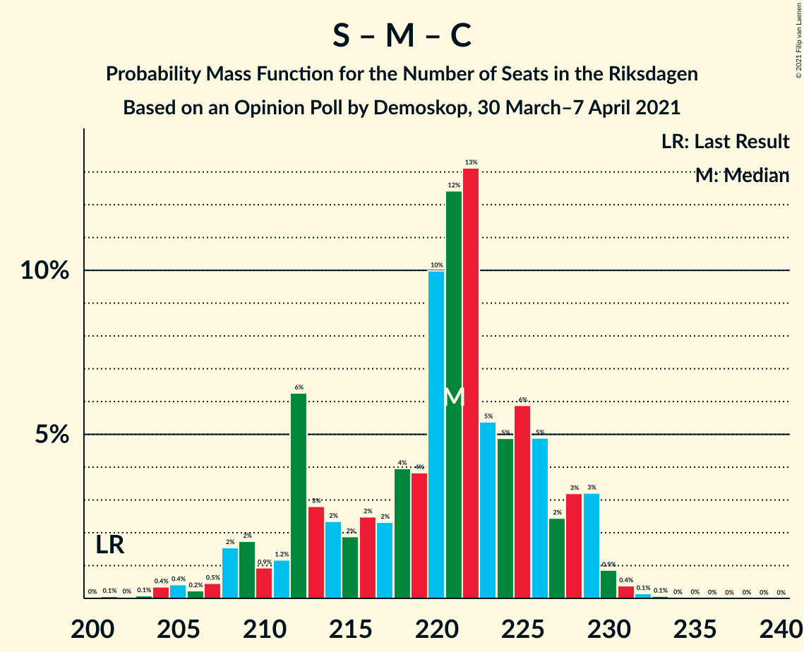
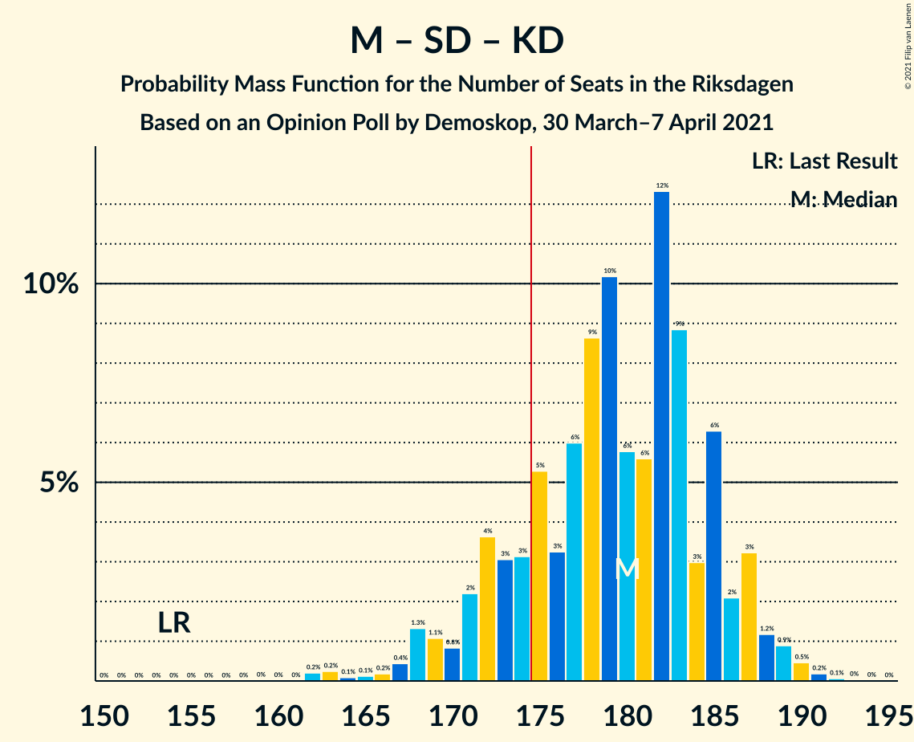

# Opinion Poll by Demoskop, 30 March–7 April 2021

<a href="#voting-intentions">Voting Intentions</a> | <a href="#seats">Seats</a> | <a href="#coalitions">Coalitions</a> | <a href="#technical-information">Technical Information</a>

## Voting Intentions

### Confidence Intervals

| Party | Last Result | Poll Result | 80% Confidence Interval | 90% Confidence Interval | 95% Confidence Interval | 99% Confidence Interval |
|:-----:|:-----------:|:-----------:|:-----------------------:|:-----------------------:|:-----------------------:|:-----------------------:|
| Sveriges socialdemokratiska arbetareparti | 28.3% | 25.4% | 24.3–26.5% |24.0–26.8% |23.8–27.1% |23.3–27.6% |
| Moderata samlingspartiet | 19.8% | 22.8% | 21.8–23.9% |21.5–24.2% |21.2–24.4% |20.7–25.0% |
| Sverigedemokraterna | 17.5% | 19.2% | 18.2–20.2% |18.0–20.5% |17.7–20.8% |17.3–21.2% |
| Centerpartiet | 8.6% | 9.8% | 9.1–10.6% |8.9–10.8% |8.7–11.0% |8.4–11.4% |
| Vänsterpartiet | 8.0% | 8.4% | 7.8–9.1% |7.6–9.4% |7.4–9.5% |7.1–9.9% |
| Kristdemokraterna | 6.3% | 5.2% | 4.7–5.8% |4.5–6.0% |4.4–6.1% |4.2–6.4% |
| Liberalerna | 5.5% | 3.7% | 3.3–4.2% |3.1–4.4% |3.0–4.5% |2.8–4.8% |
| Miljöpartiet de gröna | 4.4% | 3.3% | 2.9–3.8% |2.8–3.9% |2.7–4.0% |2.5–4.3% |

*Note:* The poll result column reflects the actual value used in the calculations. Published results may vary slightly, and in addition be rounded to fewer digits.

## Seats

### Confidence Intervals

| Party | Last Result | Median | 80% Confidence Interval | 90% Confidence Interval | 95% Confidence Interval | 99% Confidence Interval |
|:-----:|:-----------:|:------:|:-----------------------:|:-----------------------:|:-----------------------:|:-----------------------:|
| <a href="#sveriges-socialdemokratiska-arbetareparti">Sveriges socialdemokratiska arbetareparti</a> | 100 | 97 | 92–101 |90–102 |89–103 |87–105 |
| <a href="#moderata-samlingspartiet">Moderata samlingspartiet</a> | 70 | 86 | 82–91 |81–92 |80–93 |77–95 |
| <a href="#sverigedemokraterna">Sverigedemokraterna</a> | 62 | 73 | 69–77 |68–78 |67–79 |65–81 |
| <a href="#centerpartiet">Centerpartiet</a> | 31 | 37 | 34–40 |33–41 |33–42 |32–43 |
| <a href="#vänsterpartiet">Vänsterpartiet</a> | 28 | 32 | 29–35 |29–36 |28–36 |27–37 |
| <a href="#kristdemokraterna">Kristdemokraterna</a> | 22 | 20 | 18–22 |17–23 |17–24 |16–24 |
| <a href="#liberalerna">Liberalerna</a> | 20 | 0 | 0–15 |0–16 |0–16 |0–17 |
| <a href="#miljöpartiet-de-gröna">Miljöpartiet de gröna</a> | 16 | 0 | 0 |0 |0–15 |0–16 |

### Sveriges socialdemokratiska arbetareparti

*For a full overview of the results for this party, see the [Sveriges socialdemokratiska arbetareparti](party-sverigessocialdemokratiskaarbetareparti.html) page.*

| Number of Seats | Probability | Accumulated | Special Marks |
|:---------------:|:-----------:|:-----------:|:-------------:|
| 84 | 0.1% | 100% |  |
| 85 | 0.1% | 99.9% |  |
| 86 | 0.2% | 99.8% |  |
| 87 | 0.4% | 99.6% |  |
| 88 | 0.8% | 99.2% |  |
| 89 | 2% | 98% |  |
| 90 | 3% | 96% |  |
| 91 | 3% | 93% |  |
| 92 | 4% | 91% |  |
| 93 | 7% | 86% |  |
| 94 | 8% | 80% |  |
| 95 | 7% | 72% |  |
| 96 | 14% | 65% |  |
| 97 | 10% | 51% | Median |
| 98 | 7% | 40% |  |
| 99 | 15% | 33% |  |
| 100 | 8% | 18% | Last Result |
| 101 | 3% | 11% |  |
| 102 | 3% | 7% |  |
| 103 | 2% | 4% |  |
| 104 | 1.2% | 2% |  |
| 105 | 0.3% | 0.8% |  |
| 106 | 0.3% | 0.5% |  |
| 107 | 0.1% | 0.2% |  |
| 108 | 0.1% | 0.1% |  |
| 109 | 0% | 0% |  |

### Moderata samlingspartiet

*For a full overview of the results for this party, see the [Moderata samlingspartiet](party-moderatasamlingspartiet.html) page.*

| Number of Seats | Probability | Accumulated | Special Marks |
|:---------------:|:-----------:|:-----------:|:-------------:|
| 70 | 0% | 100% | Last Result |
| 71 | 0% | 100% |  |
| 72 | 0% | 100% |  |
| 73 | 0% | 100% |  |
| 74 | 0% | 100% |  |
| 75 | 0.1% | 100% |  |
| 76 | 0.1% | 99.9% |  |
| 77 | 0.6% | 99.8% |  |
| 78 | 0.7% | 99.1% |  |
| 79 | 0.6% | 98% |  |
| 80 | 1.3% | 98% |  |
| 81 | 5% | 96% |  |
| 82 | 4% | 92% |  |
| 83 | 7% | 88% |  |
| 84 | 11% | 81% |  |
| 85 | 9% | 70% |  |
| 86 | 10% | 60% | Median |
| 87 | 16% | 50% |  |
| 88 | 6% | 34% |  |
| 89 | 9% | 28% |  |
| 90 | 6% | 19% |  |
| 91 | 6% | 13% |  |
| 92 | 4% | 8% |  |
| 93 | 2% | 4% |  |
| 94 | 1.3% | 2% |  |
| 95 | 0.9% | 1.2% |  |
| 96 | 0.1% | 0.3% |  |
| 97 | 0.1% | 0.1% |  |
| 98 | 0% | 0.1% |  |
| 99 | 0% | 0% |  |

### Sverigedemokraterna

*For a full overview of the results for this party, see the [Sverigedemokraterna](party-sverigedemokraterna.html) page.*

| Number of Seats | Probability | Accumulated | Special Marks |
|:---------------:|:-----------:|:-----------:|:-------------:|
| 62 | 0% | 100% | Last Result |
| 63 | 0.1% | 99.9% |  |
| 64 | 0.3% | 99.8% |  |
| 65 | 0.4% | 99.5% |  |
| 66 | 1.2% | 99.1% |  |
| 67 | 2% | 98% |  |
| 68 | 4% | 96% |  |
| 69 | 5% | 92% |  |
| 70 | 10% | 88% |  |
| 71 | 11% | 77% |  |
| 72 | 9% | 67% |  |
| 73 | 11% | 58% | Median |
| 74 | 10% | 47% |  |
| 75 | 19% | 37% |  |
| 76 | 7% | 18% |  |
| 77 | 6% | 11% |  |
| 78 | 3% | 5% |  |
| 79 | 0.9% | 3% |  |
| 80 | 0.9% | 2% |  |
| 81 | 0.5% | 0.9% |  |
| 82 | 0.3% | 0.4% |  |
| 83 | 0.1% | 0.1% |  |
| 84 | 0% | 0% |  |

### Centerpartiet

*For a full overview of the results for this party, see the [Centerpartiet](party-centerpartiet.html) page.*

| Number of Seats | Probability | Accumulated | Special Marks |
|:---------------:|:-----------:|:-----------:|:-------------:|
| 30 | 0.1% | 100% |  |
| 31 | 0.3% | 99.9% | Last Result |
| 32 | 0.9% | 99.6% |  |
| 33 | 4% | 98.6% |  |
| 34 | 5% | 95% |  |
| 35 | 9% | 90% |  |
| 36 | 21% | 81% |  |
| 37 | 15% | 60% | Median |
| 38 | 17% | 45% |  |
| 39 | 11% | 29% |  |
| 40 | 10% | 17% |  |
| 41 | 4% | 7% |  |
| 42 | 2% | 3% |  |
| 43 | 0.8% | 1.1% |  |
| 44 | 0.2% | 0.3% |  |
| 45 | 0.1% | 0.1% |  |
| 46 | 0% | 0% |  |

### Vänsterpartiet

*For a full overview of the results for this party, see the [Vänsterpartiet](party-vänsterpartiet.html) page.*

| Number of Seats | Probability | Accumulated | Special Marks |
|:---------------:|:-----------:|:-----------:|:-------------:|
| 25 | 0.1% | 100% |  |
| 26 | 0.3% | 99.9% |  |
| 27 | 0.9% | 99.6% |  |
| 28 | 3% | 98.8% | Last Result |
| 29 | 8% | 95% |  |
| 30 | 12% | 88% |  |
| 31 | 13% | 75% |  |
| 32 | 17% | 62% | Median |
| 33 | 16% | 45% |  |
| 34 | 16% | 29% |  |
| 35 | 6% | 12% |  |
| 36 | 5% | 6% |  |
| 37 | 1.3% | 2% |  |
| 38 | 0.3% | 0.5% |  |
| 39 | 0.1% | 0.2% |  |
| 40 | 0% | 0.1% |  |
| 41 | 0% | 0% |  |

### Kristdemokraterna

*For a full overview of the results for this party, see the [Kristdemokraterna](party-kristdemokraterna.html) page.*

| Number of Seats | Probability | Accumulated | Special Marks |
|:---------------:|:-----------:|:-----------:|:-------------:|
| 0 | 0.1% | 100% |  |
| 1 | 0% | 99.9% |  |
| 2 | 0% | 99.9% |  |
| 3 | 0% | 99.9% |  |
| 4 | 0% | 99.9% |  |
| 5 | 0% | 99.9% |  |
| 6 | 0% | 99.9% |  |
| 7 | 0% | 99.9% |  |
| 8 | 0% | 99.9% |  |
| 9 | 0% | 99.9% |  |
| 10 | 0% | 99.9% |  |
| 11 | 0% | 99.9% |  |
| 12 | 0% | 99.9% |  |
| 13 | 0% | 99.9% |  |
| 14 | 0% | 99.9% |  |
| 15 | 0.1% | 99.9% |  |
| 16 | 2% | 99.7% |  |
| 17 | 5% | 98% |  |
| 18 | 13% | 93% |  |
| 19 | 21% | 80% |  |
| 20 | 23% | 59% | Median |
| 21 | 19% | 36% |  |
| 22 | 12% | 17% | Last Result |
| 23 | 2% | 5% |  |
| 24 | 2% | 3% |  |
| 25 | 0.3% | 0.4% |  |
| 26 | 0.1% | 0.1% |  |
| 27 | 0% | 0% |  |

### Liberalerna

*For a full overview of the results for this party, see the [Liberalerna](party-liberalerna.html) page.*

| Number of Seats | Probability | Accumulated | Special Marks |
|:---------------:|:-----------:|:-----------:|:-------------:|
| 0 | 78% | 100% | Median |
| 1 | 0% | 22% |  |
| 2 | 0% | 22% |  |
| 3 | 0% | 22% |  |
| 4 | 0% | 22% |  |
| 5 | 0% | 22% |  |
| 6 | 0% | 22% |  |
| 7 | 0% | 22% |  |
| 8 | 0% | 22% |  |
| 9 | 0% | 22% |  |
| 10 | 0% | 22% |  |
| 11 | 0% | 22% |  |
| 12 | 0% | 22% |  |
| 13 | 0% | 22% |  |
| 14 | 0.3% | 22% |  |
| 15 | 11% | 21% |  |
| 16 | 7% | 10% |  |
| 17 | 2% | 2% |  |
| 18 | 0.3% | 0.4% |  |
| 19 | 0.1% | 0.1% |  |
| 20 | 0% | 0% | Last Result |

### Miljöpartiet de gröna

*For a full overview of the results for this party, see the [Miljöpartiet de gröna](party-miljöpartietdegröna.html) page.*

| Number of Seats | Probability | Accumulated | Special Marks |
|:---------------:|:-----------:|:-----------:|:-------------:|
| 0 | 97% | 100% | Median |
| 1 | 0% | 3% |  |
| 2 | 0% | 3% |  |
| 3 | 0% | 3% |  |
| 4 | 0% | 3% |  |
| 5 | 0% | 3% |  |
| 6 | 0% | 3% |  |
| 7 | 0% | 3% |  |
| 8 | 0% | 3% |  |
| 9 | 0% | 3% |  |
| 10 | 0% | 3% |  |
| 11 | 0% | 3% |  |
| 12 | 0% | 3% |  |
| 13 | 0% | 3% |  |
| 14 | 0.1% | 3% |  |
| 15 | 2% | 3% |  |
| 16 | 0.5% | 0.6% | Last Result |
| 17 | 0.1% | 0.1% |  |
| 18 | 0% | 0% |  |

## Coalitions

### Confidence Intervals

| Coalition | Last Result | Median | Majority? | 80% Confidence Interval | 90% Confidence Interval | 95% Confidence Interval | 99% Confidence Interval |
|:---------:|:-----------:|:------:|:---------:|:-----------------------:|:-----------------------:|:-----------------------:|:-----------------------:|
| Sveriges socialdemokratiska arbetareparti – Moderata samlingspartiet – Centerpartiet | 201 | 221 | 100% | 212–227 | 209–228 | 208–229 | 204–231 |
| Sveriges socialdemokratiska arbetareparti – Moderata samlingspartiet | 170 | 183 | 93% | 176–189 | 174–190 | 172–191 | 169–194 |
| Moderata samlingspartiet – Sverigedemokraterna – Kristdemokraterna | 154 | 180 | 83% | 172–185 | 171–187 | 168–188 | 163–190 |
| Sveriges socialdemokratiska arbetareparti – Centerpartiet – Vänsterpartiet – Liberalerna – Miljöpartiet de gröna | 195 | 169 | 17% | 164–177 | 162–178 | 161–181 | 159–186 |
| Moderata samlingspartiet – Sverigedemokraterna | 132 | 160 | 0% | 153–165 | 151–167 | 150–168 | 146–170 |
| Moderata samlingspartiet – Centerpartiet – Kristdemokraterna – Liberalerna | 143 | 146 | 0% | 141–155 | 140–156 | 138–158 | 135–161 |
| Moderata samlingspartiet – Centerpartiet – Kristdemokraterna | 123 | 144 | 0% | 137–149 | 136–150 | 135–152 | 131–154 |
| Sveriges socialdemokratiska arbetareparti – Centerpartiet – Liberalerna – Miljöpartiet de gröna | 167 | 136 | 0% | 132–145 | 130–148 | 129–149 | 127–154 |
| Moderata samlingspartiet – Centerpartiet – Liberalerna | 121 | 126 | 0% | 121–135 | 120–137 | 118–140 | 116–142 |
| Sveriges socialdemokratiska arbetareparti – Vänsterpartiet – Miljöpartiet de gröna | 144 | 129 | 0% | 123–134 | 122–136 | 120–138 | 118–142 |
| Sveriges socialdemokratiska arbetareparti – Vänsterpartiet | 128 | 129 | 0% | 123–134 | 121–135 | 120–136 | 117–138 |
| Moderata samlingspartiet – Centerpartiet | 101 | 123 | 0% | 119–130 | 117–130 | 116–131 | 112–133 |
| Sveriges socialdemokratiska arbetareparti – Miljöpartiet de gröna | 116 | 97 | 0% | 92–102 | 90–103 | 89–106 | 87–111 |

### Sveriges socialdemokratiska arbetareparti – Moderata samlingspartiet – Centerpartiet

| Number of Seats | Probability | Accumulated | Special Marks |
|:---------------:|:-----------:|:-----------:|:-------------:|
| 200 | 0% | 100% |  |
| 201 | 0.1% | 99.9% | Last Result |
| 202 | 0% | 99.9% |  |
| 203 | 0.1% | 99.8% |  |
| 204 | 0.4% | 99.8% |  |
| 205 | 0.4% | 99.4% |  |
| 206 | 0.2% | 99.0% |  |
| 207 | 0.5% | 98.7% |  |
| 208 | 2% | 98% |  |
| 209 | 2% | 97% |  |
| 210 | 0.9% | 95% |  |
| 211 | 1.2% | 94% |  |
| 212 | 6% | 93% |  |
| 213 | 3% | 87% |  |
| 214 | 2% | 84% |  |
| 215 | 2% | 81% |  |
| 216 | 2% | 80% |  |
| 217 | 2% | 77% |  |
| 218 | 4% | 75% |  |
| 219 | 4% | 71% |  |
| 220 | 10% | 67% | Median |
| 221 | 12% | 57% |  |
| 222 | 13% | 45% |  |
| 223 | 5% | 31% |  |
| 224 | 5% | 26% |  |
| 225 | 6% | 21% |  |
| 226 | 5% | 15% |  |
| 227 | 2% | 10% |  |
| 228 | 3% | 8% |  |
| 229 | 3% | 5% |  |
| 230 | 0.9% | 2% |  |
| 231 | 0.4% | 0.7% |  |
| 232 | 0.1% | 0.3% |  |
| 233 | 0.1% | 0.2% |  |
| 234 | 0% | 0.1% |  |
| 235 | 0% | 0.1% |  |
| 236 | 0% | 0% |  |

### Sveriges socialdemokratiska arbetareparti – Moderata samlingspartiet

| Number of Seats | Probability | Accumulated | Special Marks |
|:---------------:|:-----------:|:-----------:|:-------------:|
| 165 | 0% | 100% |  |
| 166 | 0% | 99.9% |  |
| 167 | 0.1% | 99.9% |  |
| 168 | 0.1% | 99.8% |  |
| 169 | 0.2% | 99.7% |  |
| 170 | 0.6% | 99.4% | Last Result |
| 171 | 1.1% | 98.8% |  |
| 172 | 1.1% | 98% |  |
| 173 | 1.2% | 97% |  |
| 174 | 3% | 95% |  |
| 175 | 2% | 93% | Majority |
| 176 | 4% | 90% |  |
| 177 | 4% | 87% |  |
| 178 | 3% | 83% |  |
| 179 | 4% | 80% |  |
| 180 | 3% | 76% |  |
| 181 | 4% | 73% |  |
| 182 | 9% | 70% |  |
| 183 | 11% | 61% | Median |
| 184 | 7% | 50% |  |
| 185 | 11% | 43% |  |
| 186 | 11% | 32% |  |
| 187 | 6% | 21% |  |
| 188 | 5% | 16% |  |
| 189 | 4% | 11% |  |
| 190 | 3% | 7% |  |
| 191 | 2% | 4% |  |
| 192 | 1.2% | 2% |  |
| 193 | 0.4% | 0.9% |  |
| 194 | 0.3% | 0.5% |  |
| 195 | 0.1% | 0.3% |  |
| 196 | 0.1% | 0.2% |  |
| 197 | 0% | 0.1% |  |
| 198 | 0% | 0% |  |

### Moderata samlingspartiet – Sverigedemokraterna – Kristdemokraterna

| Number of Seats | Probability | Accumulated | Special Marks |
|:---------------:|:-----------:|:-----------:|:-------------:|
| 154 | 0% | 100% | Last Result |
| 155 | 0% | 100% |  |
| 156 | 0% | 100% |  |
| 157 | 0% | 100% |  |
| 158 | 0% | 100% |  |
| 159 | 0% | 100% |  |
| 160 | 0% | 100% |  |
| 161 | 0% | 100% |  |
| 162 | 0.2% | 99.9% |  |
| 163 | 0.2% | 99.7% |  |
| 164 | 0.1% | 99.5% |  |
| 165 | 0.1% | 99.4% |  |
| 166 | 0.2% | 99.3% |  |
| 167 | 0.4% | 99.1% |  |
| 168 | 1.3% | 98.7% |  |
| 169 | 1.1% | 97% |  |
| 170 | 0.8% | 96% |  |
| 171 | 2% | 95% |  |
| 172 | 4% | 93% |  |
| 173 | 3% | 90% |  |
| 174 | 3% | 87% |  |
| 175 | 5% | 83% | Majority |
| 176 | 3% | 78% |  |
| 177 | 6% | 75% |  |
| 178 | 9% | 69% |  |
| 179 | 10% | 60% | Median |
| 180 | 6% | 50% |  |
| 181 | 6% | 44% |  |
| 182 | 12% | 39% |  |
| 183 | 9% | 26% |  |
| 184 | 3% | 17% |  |
| 185 | 6% | 14% |  |
| 186 | 2% | 8% |  |
| 187 | 3% | 6% |  |
| 188 | 1.2% | 3% |  |
| 189 | 0.9% | 2% |  |
| 190 | 0.5% | 0.8% |  |
| 191 | 0.2% | 0.3% |  |
| 192 | 0.1% | 0.1% |  |
| 193 | 0% | 0.1% |  |
| 194 | 0% | 0% |  |

### Sveriges socialdemokratiska arbetareparti – Centerpartiet – Vänsterpartiet – Liberalerna – Miljöpartiet de gröna

| Number of Seats | Probability | Accumulated | Special Marks |
|:---------------:|:-----------:|:-----------:|:-------------:|
| 156 | 0% | 100% |  |
| 157 | 0.1% | 99.9% |  |
| 158 | 0.2% | 99.9% |  |
| 159 | 0.5% | 99.7% |  |
| 160 | 0.9% | 99.2% |  |
| 161 | 1.2% | 98% |  |
| 162 | 3% | 97% |  |
| 163 | 2% | 94% |  |
| 164 | 6% | 92% |  |
| 165 | 3% | 86% |  |
| 166 | 9% | 83% | Median |
| 167 | 12% | 74% |  |
| 168 | 6% | 61% |  |
| 169 | 6% | 56% |  |
| 170 | 10% | 50% |  |
| 171 | 9% | 40% |  |
| 172 | 6% | 31% |  |
| 173 | 3% | 25% |  |
| 174 | 5% | 22% |  |
| 175 | 3% | 17% | Majority |
| 176 | 3% | 13% |  |
| 177 | 4% | 10% |  |
| 178 | 2% | 7% |  |
| 179 | 0.8% | 5% |  |
| 180 | 1.1% | 4% |  |
| 181 | 1.3% | 3% |  |
| 182 | 0.4% | 1.3% |  |
| 183 | 0.2% | 0.9% |  |
| 184 | 0.1% | 0.7% |  |
| 185 | 0.1% | 0.6% |  |
| 186 | 0.2% | 0.5% |  |
| 187 | 0.2% | 0.3% |  |
| 188 | 0% | 0.1% |  |
| 189 | 0% | 0% |  |
| 190 | 0% | 0% |  |
| 191 | 0% | 0% |  |
| 192 | 0% | 0% |  |
| 193 | 0% | 0% |  |
| 194 | 0% | 0% |  |
| 195 | 0% | 0% | Last Result |

### Moderata samlingspartiet – Sverigedemokraterna

| Number of Seats | Probability | Accumulated | Special Marks |
|:---------------:|:-----------:|:-----------:|:-------------:|
| 132 | 0% | 100% | Last Result |
| 133 | 0% | 100% |  |
| 134 | 0% | 100% |  |
| 135 | 0% | 100% |  |
| 136 | 0% | 100% |  |
| 137 | 0% | 100% |  |
| 138 | 0% | 100% |  |
| 139 | 0% | 100% |  |
| 140 | 0% | 100% |  |
| 141 | 0% | 100% |  |
| 142 | 0% | 100% |  |
| 143 | 0.1% | 100% |  |
| 144 | 0.2% | 99.9% |  |
| 145 | 0.2% | 99.7% |  |
| 146 | 0.2% | 99.5% |  |
| 147 | 0.3% | 99.3% |  |
| 148 | 0.5% | 99.0% |  |
| 149 | 0.9% | 98% |  |
| 150 | 1.0% | 98% |  |
| 151 | 2% | 97% |  |
| 152 | 2% | 94% |  |
| 153 | 4% | 93% |  |
| 154 | 4% | 89% |  |
| 155 | 4% | 84% |  |
| 156 | 6% | 81% |  |
| 157 | 6% | 75% |  |
| 158 | 6% | 69% |  |
| 159 | 10% | 63% | Median |
| 160 | 12% | 53% |  |
| 161 | 3% | 41% |  |
| 162 | 15% | 38% |  |
| 163 | 4% | 23% |  |
| 164 | 8% | 19% |  |
| 165 | 4% | 11% |  |
| 166 | 2% | 7% |  |
| 167 | 2% | 5% |  |
| 168 | 1.1% | 3% |  |
| 169 | 0.7% | 1.5% |  |
| 170 | 0.3% | 0.8% |  |
| 171 | 0.3% | 0.5% |  |
| 172 | 0.1% | 0.1% |  |
| 173 | 0% | 0.1% |  |
| 174 | 0% | 0% |  |

### Moderata samlingspartiet – Centerpartiet – Kristdemokraterna – Liberalerna

| Number of Seats | Probability | Accumulated | Special Marks |
|:---------------:|:-----------:|:-----------:|:-------------:|
| 131 | 0% | 100% |  |
| 132 | 0% | 99.9% |  |
| 133 | 0.1% | 99.9% |  |
| 134 | 0.2% | 99.8% |  |
| 135 | 0.2% | 99.6% |  |
| 136 | 0.3% | 99.4% |  |
| 137 | 0.6% | 99.1% |  |
| 138 | 1.5% | 98% |  |
| 139 | 1.0% | 97% |  |
| 140 | 3% | 96% |  |
| 141 | 10% | 93% |  |
| 142 | 2% | 83% |  |
| 143 | 10% | 80% | Last Result, Median |
| 144 | 8% | 71% |  |
| 145 | 6% | 63% |  |
| 146 | 8% | 57% |  |
| 147 | 9% | 49% |  |
| 148 | 6% | 40% |  |
| 149 | 5% | 34% |  |
| 150 | 6% | 30% |  |
| 151 | 2% | 23% |  |
| 152 | 5% | 21% |  |
| 153 | 3% | 16% |  |
| 154 | 3% | 13% |  |
| 155 | 3% | 10% |  |
| 156 | 3% | 8% |  |
| 157 | 0.8% | 5% |  |
| 158 | 2% | 4% |  |
| 159 | 0.7% | 2% |  |
| 160 | 0.6% | 1.4% |  |
| 161 | 0.3% | 0.8% |  |
| 162 | 0.1% | 0.4% |  |
| 163 | 0.2% | 0.3% |  |
| 164 | 0.1% | 0.1% |  |
| 165 | 0% | 0% |  |

### Moderata samlingspartiet – Centerpartiet – Kristdemokraterna

| Number of Seats | Probability | Accumulated | Special Marks |
|:---------------:|:-----------:|:-----------:|:-------------:|
| 123 | 0% | 100% | Last Result |
| 124 | 0% | 100% |  |
| 125 | 0% | 100% |  |
| 126 | 0% | 100% |  |
| 127 | 0% | 100% |  |
| 128 | 0.1% | 100% |  |
| 129 | 0.2% | 99.9% |  |
| 130 | 0.1% | 99.6% |  |
| 131 | 0.2% | 99.5% |  |
| 132 | 0.4% | 99.4% |  |
| 133 | 0.8% | 98.9% |  |
| 134 | 0.6% | 98% |  |
| 135 | 0.9% | 98% |  |
| 136 | 3% | 97% |  |
| 137 | 5% | 94% |  |
| 138 | 3% | 89% |  |
| 139 | 3% | 87% |  |
| 140 | 7% | 83% |  |
| 141 | 11% | 76% |  |
| 142 | 3% | 65% |  |
| 143 | 11% | 62% | Median |
| 144 | 8% | 51% |  |
| 145 | 7% | 43% |  |
| 146 | 8% | 36% |  |
| 147 | 9% | 28% |  |
| 148 | 6% | 20% |  |
| 149 | 4% | 14% |  |
| 150 | 6% | 10% |  |
| 151 | 0.9% | 4% |  |
| 152 | 2% | 3% |  |
| 153 | 0.8% | 2% |  |
| 154 | 0.5% | 0.8% |  |
| 155 | 0.2% | 0.3% |  |
| 156 | 0.1% | 0.1% |  |
| 157 | 0% | 0.1% |  |
| 158 | 0% | 0% |  |

### Sveriges socialdemokratiska arbetareparti – Centerpartiet – Liberalerna – Miljöpartiet de gröna

| Number of Seats | Probability | Accumulated | Special Marks |
|:---------------:|:-----------:|:-----------:|:-------------:|
| 124 | 0% | 100% |  |
| 125 | 0.1% | 99.9% |  |
| 126 | 0.2% | 99.9% |  |
| 127 | 0.6% | 99.7% |  |
| 128 | 0.7% | 99.2% |  |
| 129 | 2% | 98% |  |
| 130 | 3% | 97% |  |
| 131 | 3% | 93% |  |
| 132 | 5% | 90% |  |
| 133 | 7% | 86% |  |
| 134 | 10% | 79% | Median |
| 135 | 10% | 69% |  |
| 136 | 9% | 59% |  |
| 137 | 10% | 49% |  |
| 138 | 4% | 39% |  |
| 139 | 3% | 35% |  |
| 140 | 5% | 32% |  |
| 141 | 4% | 27% |  |
| 142 | 3% | 22% |  |
| 143 | 3% | 19% |  |
| 144 | 4% | 16% |  |
| 145 | 3% | 13% |  |
| 146 | 2% | 10% |  |
| 147 | 2% | 8% |  |
| 148 | 2% | 5% |  |
| 149 | 0.7% | 3% |  |
| 150 | 0.6% | 2% |  |
| 151 | 0.5% | 2% |  |
| 152 | 0.2% | 1.0% |  |
| 153 | 0.2% | 0.8% |  |
| 154 | 0.1% | 0.6% |  |
| 155 | 0.1% | 0.5% |  |
| 156 | 0.2% | 0.3% |  |
| 157 | 0% | 0.1% |  |
| 158 | 0% | 0.1% |  |
| 159 | 0% | 0.1% |  |
| 160 | 0% | 0% |  |
| 161 | 0% | 0% |  |
| 162 | 0% | 0% |  |
| 163 | 0% | 0% |  |
| 164 | 0% | 0% |  |
| 165 | 0% | 0% |  |
| 166 | 0% | 0% |  |
| 167 | 0% | 0% | Last Result |

### Moderata samlingspartiet – Centerpartiet – Liberalerna

| Number of Seats | Probability | Accumulated | Special Marks |
|:---------------:|:-----------:|:-----------:|:-------------:|
| 113 | 0% | 100% |  |
| 114 | 0.1% | 99.9% |  |
| 115 | 0.2% | 99.8% |  |
| 116 | 0.5% | 99.7% |  |
| 117 | 0.7% | 99.2% |  |
| 118 | 1.1% | 98.5% |  |
| 119 | 2% | 97% |  |
| 120 | 2% | 96% |  |
| 121 | 7% | 94% | Last Result |
| 122 | 8% | 87% |  |
| 123 | 11% | 79% | Median |
| 124 | 8% | 69% |  |
| 125 | 8% | 61% |  |
| 126 | 8% | 52% |  |
| 127 | 4% | 45% |  |
| 128 | 6% | 41% |  |
| 129 | 4% | 35% |  |
| 130 | 7% | 31% |  |
| 131 | 3% | 24% |  |
| 132 | 2% | 21% |  |
| 133 | 2% | 19% |  |
| 134 | 5% | 17% |  |
| 135 | 4% | 12% |  |
| 136 | 2% | 8% |  |
| 137 | 2% | 6% |  |
| 138 | 0.5% | 4% |  |
| 139 | 0.9% | 4% |  |
| 140 | 1.2% | 3% |  |
| 141 | 0.8% | 2% |  |
| 142 | 0.3% | 0.8% |  |
| 143 | 0.3% | 0.5% |  |
| 144 | 0.1% | 0.1% |  |
| 145 | 0% | 0.1% |  |
| 146 | 0% | 0% |  |

### Sveriges socialdemokratiska arbetareparti – Vänsterpartiet – Miljöpartiet de gröna

| Number of Seats | Probability | Accumulated | Special Marks |
|:---------------:|:-----------:|:-----------:|:-------------:|
| 115 | 0% | 100% |  |
| 116 | 0.1% | 99.9% |  |
| 117 | 0.3% | 99.8% |  |
| 118 | 0.7% | 99.5% |  |
| 119 | 0.8% | 98.8% |  |
| 120 | 1.4% | 98% |  |
| 121 | 1.2% | 97% |  |
| 122 | 3% | 95% |  |
| 123 | 4% | 92% |  |
| 124 | 5% | 88% |  |
| 125 | 5% | 83% |  |
| 126 | 4% | 78% |  |
| 127 | 6% | 74% |  |
| 128 | 11% | 67% |  |
| 129 | 9% | 57% | Median |
| 130 | 6% | 48% |  |
| 131 | 12% | 41% |  |
| 132 | 7% | 29% |  |
| 133 | 9% | 22% |  |
| 134 | 5% | 13% |  |
| 135 | 3% | 8% |  |
| 136 | 1.2% | 5% |  |
| 137 | 1.1% | 4% |  |
| 138 | 0.7% | 3% |  |
| 139 | 0.7% | 2% |  |
| 140 | 0.3% | 2% |  |
| 141 | 0.7% | 1.3% |  |
| 142 | 0.1% | 0.6% |  |
| 143 | 0.1% | 0.4% |  |
| 144 | 0.2% | 0.3% | Last Result |
| 145 | 0% | 0.1% |  |
| 146 | 0% | 0.1% |  |
| 147 | 0% | 0% |  |

### Sveriges socialdemokratiska arbetareparti – Vänsterpartiet

| Number of Seats | Probability | Accumulated | Special Marks |
|:---------------:|:-----------:|:-----------:|:-------------:|
| 114 | 0% | 100% |  |
| 115 | 0.1% | 99.9% |  |
| 116 | 0.1% | 99.8% |  |
| 117 | 0.4% | 99.7% |  |
| 118 | 0.8% | 99.3% |  |
| 119 | 1.0% | 98% |  |
| 120 | 2% | 98% |  |
| 121 | 1.4% | 96% |  |
| 122 | 4% | 95% |  |
| 123 | 4% | 91% |  |
| 124 | 5% | 87% |  |
| 125 | 5% | 81% |  |
| 126 | 5% | 76% |  |
| 127 | 6% | 71% |  |
| 128 | 11% | 65% | Last Result |
| 129 | 9% | 54% | Median |
| 130 | 6% | 45% |  |
| 131 | 12% | 38% |  |
| 132 | 7% | 26% |  |
| 133 | 9% | 19% |  |
| 134 | 4% | 10% |  |
| 135 | 3% | 6% |  |
| 136 | 0.9% | 3% |  |
| 137 | 1.0% | 2% |  |
| 138 | 0.5% | 0.9% |  |
| 139 | 0.2% | 0.4% |  |
| 140 | 0.1% | 0.2% |  |
| 141 | 0% | 0.1% |  |
| 142 | 0% | 0.1% |  |
| 143 | 0% | 0% |  |

### Moderata samlingspartiet – Centerpartiet

| Number of Seats | Probability | Accumulated | Special Marks |
|:---------------:|:-----------:|:-----------:|:-------------:|
| 101 | 0% | 100% | Last Result |
| 102 | 0% | 100% |  |
| 103 | 0% | 100% |  |
| 104 | 0% | 100% |  |
| 105 | 0% | 100% |  |
| 106 | 0% | 100% |  |
| 107 | 0% | 100% |  |
| 108 | 0% | 100% |  |
| 109 | 0% | 100% |  |
| 110 | 0% | 100% |  |
| 111 | 0.3% | 99.9% |  |
| 112 | 0.3% | 99.6% |  |
| 113 | 0.4% | 99.3% |  |
| 114 | 0.5% | 98.9% |  |
| 115 | 0.8% | 98% |  |
| 116 | 1.3% | 98% |  |
| 117 | 2% | 96% |  |
| 118 | 3% | 94% |  |
| 119 | 8% | 91% |  |
| 120 | 4% | 83% |  |
| 121 | 8% | 79% |  |
| 122 | 9% | 71% |  |
| 123 | 12% | 62% | Median |
| 124 | 9% | 50% |  |
| 125 | 9% | 41% |  |
| 126 | 8% | 32% |  |
| 127 | 4% | 24% |  |
| 128 | 6% | 20% |  |
| 129 | 4% | 14% |  |
| 130 | 7% | 11% |  |
| 131 | 2% | 4% |  |
| 132 | 1.2% | 2% |  |
| 133 | 0.5% | 1.0% |  |
| 134 | 0.2% | 0.5% |  |
| 135 | 0.1% | 0.3% |  |
| 136 | 0.1% | 0.1% |  |
| 137 | 0% | 0.1% |  |
| 138 | 0% | 0% |  |

### Sveriges socialdemokratiska arbetareparti – Miljöpartiet de gröna

| Number of Seats | Probability | Accumulated | Special Marks |
|:---------------:|:-----------:|:-----------:|:-------------:|
| 85 | 0.1% | 100% |  |
| 86 | 0.2% | 99.9% |  |
| 87 | 0.3% | 99.7% |  |
| 88 | 0.8% | 99.4% |  |
| 89 | 2% | 98.7% |  |
| 90 | 3% | 97% |  |
| 91 | 2% | 94% |  |
| 92 | 4% | 92% |  |
| 93 | 7% | 88% |  |
| 94 | 7% | 81% |  |
| 95 | 7% | 74% |  |
| 96 | 14% | 67% |  |
| 97 | 10% | 53% | Median |
| 98 | 7% | 43% |  |
| 99 | 15% | 36% |  |
| 100 | 8% | 21% |  |
| 101 | 3% | 13% |  |
| 102 | 3% | 10% |  |
| 103 | 2% | 7% |  |
| 104 | 1.4% | 5% |  |
| 105 | 0.6% | 3% |  |
| 106 | 0.6% | 3% |  |
| 107 | 0.4% | 2% |  |
| 108 | 0.4% | 2% |  |
| 109 | 0.6% | 1.4% |  |
| 110 | 0.2% | 0.9% |  |
| 111 | 0.2% | 0.6% |  |
| 112 | 0.2% | 0.4% |  |
| 113 | 0.1% | 0.2% |  |
| 114 | 0% | 0.1% |  |
| 115 | 0% | 0.1% |  |
| 116 | 0% | 0% | Last Result |

## Technical Information

### Opinion Poll

+ **Polling firm:** Demoskop
+ **Commissioner(s):** —
+ **Fieldwork period:** 30 March–7 April 2021

### Calculations

+ **Sample size:** 2651
+ **Simulations done:** 1,048,576
+ **Error estimate:** 0.75%

