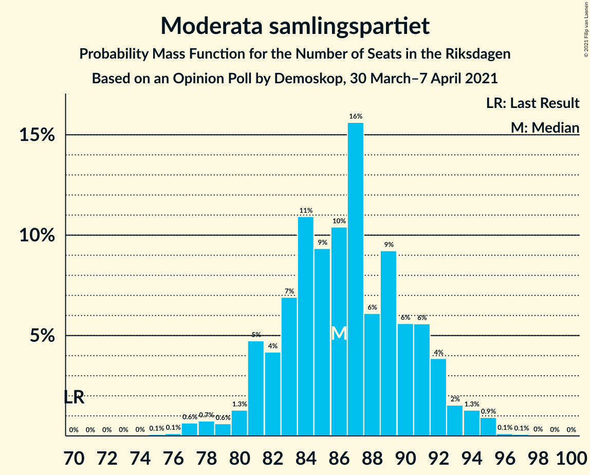
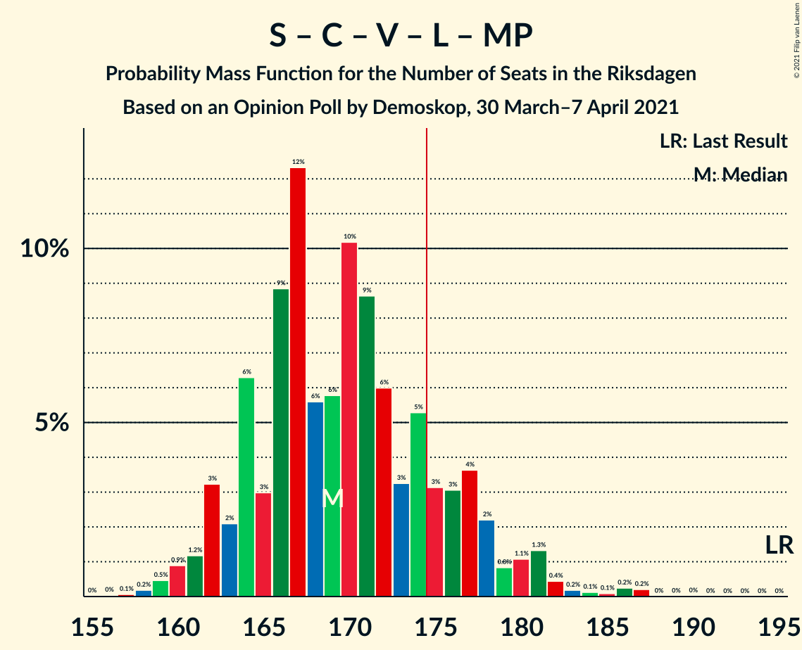

# Opinion Poll by Demoskop, 30 March–7 April 2021

<a href="#voting-intentions">Voting Intentions</a> | <a href="#seats">Seats</a> | <a href="#coalitions">Coalitions</a> | <a href="#technical-information">Technical Information</a>

## Voting Intentions

### Confidence Intervals

| Party | Last Result | Poll Result | 80% Confidence Interval | 90% Confidence Interval | 95% Confidence Interval | 99% Confidence Interval |
|:-----:|:-----------:|:-----------:|:-----------------------:|:-----------------------:|:-----------------------:|:-----------------------:|
| Sveriges socialdemokratiska arbetareparti | 28.3% | 25.4% | 24.3–26.5% |24.0–26.8% |23.8–27.1% |23.3–27.6% |
| Moderata samlingspartiet | 19.8% | 22.8% | 21.8–23.9% |21.5–24.2% |21.2–24.4% |20.7–25.0% |
| Sverigedemokraterna | 17.5% | 19.2% | 18.2–20.2% |18.0–20.5% |17.7–20.8% |17.3–21.2% |
| Centerpartiet | 8.6% | 9.8% | 9.1–10.6% |8.9–10.8% |8.7–11.0% |8.4–11.4% |
| Vänsterpartiet | 8.0% | 8.4% | 7.8–9.1% |7.6–9.4% |7.4–9.5% |7.1–9.9% |
| Kristdemokraterna | 6.3% | 5.2% | 4.7–5.8% |4.5–6.0% |4.4–6.1% |4.2–6.4% |
| Liberalerna | 5.5% | 3.7% | 3.3–4.2% |3.1–4.4% |3.0–4.5% |2.8–4.8% |
| Miljöpartiet de gröna | 4.4% | 3.3% | 2.9–3.8% |2.8–3.9% |2.7–4.0% |2.5–4.3% |

*Note:* The poll result column reflects the actual value used in the calculations. Published results may vary slightly, and in addition be rounded to fewer digits.

## Seats

### Confidence Intervals

| Party | Last Result | Median | 80% Confidence Interval | 90% Confidence Interval | 95% Confidence Interval | 99% Confidence Interval |
|:-----:|:-----------:|:------:|:-----------------------:|:-----------------------:|:-----------------------:|:-----------------------:|
| <a href="#sveriges-socialdemokratiska-arbetareparti">Sveriges socialdemokratiska arbetareparti</a> | 100 | 97 | 92–100 |90–101 |89–103 |87–106 |
| <a href="#moderata-samlingspartiet">Moderata samlingspartiet</a> | 70 | 87 | 83–91 |81–92 |80–93 |77–95 |
| <a href="#sverigedemokraterna">Sverigedemokraterna</a> | 62 | 73 | 69–77 |68–77 |67–78 |65–81 |
| <a href="#centerpartiet">Centerpartiet</a> | 31 | 37 | 35–40 |33–41 |33–42 |32–43 |
| <a href="#vänsterpartiet">Vänsterpartiet</a> | 28 | 33 | 30–34 |29–35 |28–37 |27–37 |
| <a href="#kristdemokraterna">Kristdemokraterna</a> | 22 | 20 | 18–22 |17–22 |17–23 |16–24 |
| <a href="#liberalerna">Liberalerna</a> | 20 | 0 | 0–15 |0–16 |0–16 |0–17 |
| <a href="#miljöpartiet-de-gröna">Miljöpartiet de gröna</a> | 16 | 0 | 0 |0 |0 |0–16 |

### Sveriges socialdemokratiska arbetareparti

*For a full overview of the results for this party, see the [Sveriges socialdemokratiska arbetareparti](party-sverigessocialdemokratiskaarbetareparti.html) page.*

| Number of Seats | Probability | Accumulated | Special Marks |
|:---------------:|:-----------:|:-----------:|:-------------:|
| 84 | 0% | 100% |  |
| 85 | 0.1% | 99.9% |  |
| 86 | 0.2% | 99.9% |  |
| 87 | 0.3% | 99.6% |  |
| 88 | 0.8% | 99.3% |  |
| 89 | 2% | 98% |  |
| 90 | 4% | 96% |  |
| 91 | 2% | 92% |  |
| 92 | 4% | 90% |  |
| 93 | 4% | 86% |  |
| 94 | 6% | 82% |  |
| 95 | 9% | 76% |  |
| 96 | 9% | 67% |  |
| 97 | 10% | 58% | Median |
| 98 | 10% | 48% |  |
| 99 | 23% | 39% |  |
| 100 | 9% | 15% | Last Result |
| 101 | 3% | 7% |  |
| 102 | 1.0% | 4% |  |
| 103 | 1.2% | 3% |  |
| 104 | 0.7% | 2% |  |
| 105 | 0.4% | 1.0% |  |
| 106 | 0.4% | 0.6% |  |
| 107 | 0.1% | 0.2% |  |
| 108 | 0.1% | 0.1% |  |
| 109 | 0% | 0% |  |

### Moderata samlingspartiet

*For a full overview of the results for this party, see the [Moderata samlingspartiet](party-moderatasamlingspartiet.html) page.*

| Number of Seats | Probability | Accumulated | Special Marks |
|:---------------:|:-----------:|:-----------:|:-------------:|
| 70 | 0% | 100% | Last Result |
| 71 | 0% | 100% |  |
| 72 | 0% | 100% |  |
| 73 | 0% | 100% |  |
| 74 | 0% | 100% |  |
| 75 | 0% | 100% |  |
| 76 | 0.2% | 99.9% |  |
| 77 | 0.6% | 99.8% |  |
| 78 | 0.8% | 99.2% |  |
| 79 | 0.6% | 98% |  |
| 80 | 0.8% | 98% |  |
| 81 | 2% | 97% |  |
| 82 | 4% | 95% |  |
| 83 | 3% | 90% |  |
| 84 | 16% | 88% |  |
| 85 | 8% | 71% |  |
| 86 | 6% | 64% |  |
| 87 | 24% | 58% | Median |
| 88 | 4% | 34% |  |
| 89 | 6% | 30% |  |
| 90 | 8% | 24% |  |
| 91 | 6% | 16% |  |
| 92 | 6% | 10% |  |
| 93 | 2% | 4% |  |
| 94 | 0.6% | 2% |  |
| 95 | 1.0% | 1.3% |  |
| 96 | 0.1% | 0.3% |  |
| 97 | 0.1% | 0.1% |  |
| 98 | 0% | 0% |  |

### Sverigedemokraterna

*For a full overview of the results for this party, see the [Sverigedemokraterna](party-sverigedemokraterna.html) page.*

| Number of Seats | Probability | Accumulated | Special Marks |
|:---------------:|:-----------:|:-----------:|:-------------:|
| 62 | 0% | 100% | Last Result |
| 63 | 0.2% | 100% |  |
| 64 | 0.2% | 99.8% |  |
| 65 | 0.4% | 99.5% |  |
| 66 | 1.3% | 99.1% |  |
| 67 | 2% | 98% |  |
| 68 | 4% | 96% |  |
| 69 | 4% | 92% |  |
| 70 | 11% | 87% |  |
| 71 | 8% | 77% |  |
| 72 | 9% | 68% |  |
| 73 | 12% | 60% | Median |
| 74 | 8% | 48% |  |
| 75 | 25% | 40% |  |
| 76 | 4% | 15% |  |
| 77 | 6% | 11% |  |
| 78 | 2% | 5% |  |
| 79 | 0.7% | 2% |  |
| 80 | 0.5% | 1.3% |  |
| 81 | 0.5% | 0.8% |  |
| 82 | 0.2% | 0.2% |  |
| 83 | 0.1% | 0.1% |  |
| 84 | 0% | 0% |  |

### Centerpartiet

*For a full overview of the results for this party, see the [Centerpartiet](party-centerpartiet.html) page.*

| Number of Seats | Probability | Accumulated | Special Marks |
|:---------------:|:-----------:|:-----------:|:-------------:|
| 30 | 0.1% | 100% |  |
| 31 | 0.4% | 99.9% | Last Result |
| 32 | 0.9% | 99.6% |  |
| 33 | 4% | 98.7% |  |
| 34 | 5% | 95% |  |
| 35 | 9% | 90% |  |
| 36 | 22% | 81% |  |
| 37 | 18% | 59% | Median |
| 38 | 19% | 41% |  |
| 39 | 8% | 22% |  |
| 40 | 9% | 14% |  |
| 41 | 3% | 6% |  |
| 42 | 2% | 3% |  |
| 43 | 0.5% | 0.8% |  |
| 44 | 0.1% | 0.3% |  |
| 45 | 0.1% | 0.1% |  |
| 46 | 0% | 0% |  |

### Vänsterpartiet

*For a full overview of the results for this party, see the [Vänsterpartiet](party-vänsterpartiet.html) page.*

| Number of Seats | Probability | Accumulated | Special Marks |
|:---------------:|:-----------:|:-----------:|:-------------:|
| 26 | 0.4% | 100% |  |
| 27 | 0.6% | 99.6% |  |
| 28 | 4% | 98.9% | Last Result |
| 29 | 5% | 95% |  |
| 30 | 6% | 90% |  |
| 31 | 12% | 84% |  |
| 32 | 19% | 73% |  |
| 33 | 19% | 53% | Median |
| 34 | 24% | 34% |  |
| 35 | 5% | 10% |  |
| 36 | 2% | 5% |  |
| 37 | 2% | 3% |  |
| 38 | 0.3% | 0.5% |  |
| 39 | 0.1% | 0.2% |  |
| 40 | 0.1% | 0.1% |  |
| 41 | 0% | 0% |  |

### Kristdemokraterna

*For a full overview of the results for this party, see the [Kristdemokraterna](party-kristdemokraterna.html) page.*

| Number of Seats | Probability | Accumulated | Special Marks |
|:---------------:|:-----------:|:-----------:|:-------------:|
| 0 | 0.1% | 100% |  |
| 1 | 0% | 99.9% |  |
| 2 | 0% | 99.9% |  |
| 3 | 0% | 99.9% |  |
| 4 | 0% | 99.9% |  |
| 5 | 0% | 99.9% |  |
| 6 | 0% | 99.9% |  |
| 7 | 0% | 99.9% |  |
| 8 | 0% | 99.9% |  |
| 9 | 0% | 99.9% |  |
| 10 | 0% | 99.9% |  |
| 11 | 0% | 99.9% |  |
| 12 | 0% | 99.9% |  |
| 13 | 0% | 99.9% |  |
| 14 | 0% | 99.9% |  |
| 15 | 0.1% | 99.9% |  |
| 16 | 2% | 99.8% |  |
| 17 | 4% | 98% |  |
| 18 | 12% | 94% |  |
| 19 | 25% | 82% |  |
| 20 | 26% | 58% | Median |
| 21 | 11% | 32% |  |
| 22 | 17% | 21% | Last Result |
| 23 | 2% | 4% |  |
| 24 | 2% | 2% |  |
| 25 | 0.4% | 0.5% |  |
| 26 | 0% | 0.1% |  |
| 27 | 0% | 0% |  |

### Liberalerna

*For a full overview of the results for this party, see the [Liberalerna](party-liberalerna.html) page.*

| Number of Seats | Probability | Accumulated | Special Marks |
|:---------------:|:-----------:|:-----------:|:-------------:|
| 0 | 82% | 100% | Median |
| 1 | 0% | 18% |  |
| 2 | 0% | 18% |  |
| 3 | 0% | 18% |  |
| 4 | 0% | 18% |  |
| 5 | 0% | 18% |  |
| 6 | 0% | 18% |  |
| 7 | 0% | 18% |  |
| 8 | 0% | 18% |  |
| 9 | 0% | 18% |  |
| 10 | 0% | 18% |  |
| 11 | 0% | 18% |  |
| 12 | 0% | 18% |  |
| 13 | 0% | 18% |  |
| 14 | 0.4% | 18% |  |
| 15 | 9% | 17% |  |
| 16 | 6% | 8% |  |
| 17 | 2% | 2% |  |
| 18 | 0.3% | 0.4% |  |
| 19 | 0% | 0% |  |
| 20 | 0% | 0% | Last Result |

### Miljöpartiet de gröna

*For a full overview of the results for this party, see the [Miljöpartiet de gröna](party-miljöpartietdegröna.html) page.*

| Number of Seats | Probability | Accumulated | Special Marks |
|:---------------:|:-----------:|:-----------:|:-------------:|
| 0 | 98% | 100% | Median |
| 1 | 0% | 2% |  |
| 2 | 0% | 2% |  |
| 3 | 0% | 2% |  |
| 4 | 0% | 2% |  |
| 5 | 0% | 2% |  |
| 6 | 0% | 2% |  |
| 7 | 0% | 2% |  |
| 8 | 0% | 2% |  |
| 9 | 0% | 2% |  |
| 10 | 0% | 2% |  |
| 11 | 0% | 2% |  |
| 12 | 0% | 2% |  |
| 13 | 0% | 2% |  |
| 14 | 0.1% | 2% |  |
| 15 | 2% | 2% |  |
| 16 | 0.5% | 0.5% | Last Result |
| 17 | 0.1% | 0.1% |  |
| 18 | 0% | 0% |  |

## Coalitions

### Confidence Intervals

| Coalition | Last Result | Median | Majority? | 80% Confidence Interval | 90% Confidence Interval | 95% Confidence Interval | 99% Confidence Interval |
|:---------:|:-----------:|:------:|:---------:|:-----------------------:|:-----------------------:|:-----------------------:|:-----------------------:|
| Sveriges socialdemokratiska arbetareparti – Moderata samlingspartiet – Centerpartiet | 201 | 221 | 100% | 213–226 | 209–228 | 208–229 | 204–231 |
| Sveriges socialdemokratiska arbetareparti – Moderata samlingspartiet | 170 | 184 | 93% | 177–189 | 173–190 | 171–191 | 170–193 |
| Moderata samlingspartiet – Sverigedemokraterna – Kristdemokraterna | 154 | 180 | 87% | 173–185 | 171–187 | 169–188 | 163–190 |
| Sveriges socialdemokratiska arbetareparti – Centerpartiet – Vänsterpartiet – Liberalerna – Miljöpartiet de gröna | 195 | 169 | 13% | 164–176 | 162–178 | 161–180 | 159–186 |
| Moderata samlingspartiet – Sverigedemokraterna | 132 | 160 | 0% | 153–165 | 151–166 | 150–168 | 145–171 |
| Moderata samlingspartiet – Centerpartiet – Kristdemokraterna – Liberalerna | 143 | 146 | 0% | 141–155 | 140–157 | 139–158 | 135–161 |
| Moderata samlingspartiet – Centerpartiet – Kristdemokraterna | 123 | 143 | 0% | 139–150 | 137–150 | 135–152 | 130–154 |
| Sveriges socialdemokratiska arbetareparti – Centerpartiet – Liberalerna – Miljöpartiet de gröna | 167 | 136 | 0% | 132–144 | 130–147 | 129–149 | 127–155 |
| Moderata samlingspartiet – Centerpartiet – Liberalerna | 121 | 125 | 0% | 121–135 | 121–138 | 120–140 | 116–141 |
| Sveriges socialdemokratiska arbetareparti – Vänsterpartiet – Miljöpartiet de gröna | 144 | 130 | 0% | 123–134 | 122–135 | 120–137 | 118–142 |
| Sveriges socialdemokratiska arbetareparti – Vänsterpartiet | 128 | 130 | 0% | 123–133 | 121–134 | 120–135 | 117–139 |
| Moderata samlingspartiet – Centerpartiet | 101 | 123 | 0% | 119–130 | 117–130 | 116–131 | 112–133 |
| Sveriges socialdemokratiska arbetareparti – Miljöpartiet de gröna | 116 | 98 | 0% | 92–100 | 90–102 | 89–105 | 87–110 |

### Sveriges socialdemokratiska arbetareparti – Moderata samlingspartiet – Centerpartiet

| Number of Seats | Probability | Accumulated | Special Marks |
|:---------------:|:-----------:|:-----------:|:-------------:|
| 201 | 0% | 100% | Last Result |
| 202 | 0% | 99.9% |  |
| 203 | 0.1% | 99.9% |  |
| 204 | 0.4% | 99.8% |  |
| 205 | 0.2% | 99.4% |  |
| 206 | 0.2% | 99.2% |  |
| 207 | 0.5% | 99.0% |  |
| 208 | 2% | 98% |  |
| 209 | 3% | 96% |  |
| 210 | 0.8% | 93% |  |
| 211 | 1.4% | 93% |  |
| 212 | 1.0% | 91% |  |
| 213 | 1.1% | 90% |  |
| 214 | 1.2% | 89% |  |
| 215 | 2% | 88% |  |
| 216 | 3% | 86% |  |
| 217 | 3% | 83% |  |
| 218 | 5% | 80% |  |
| 219 | 3% | 76% |  |
| 220 | 13% | 72% |  |
| 221 | 16% | 59% | Median |
| 222 | 13% | 43% |  |
| 223 | 3% | 30% |  |
| 224 | 5% | 27% |  |
| 225 | 5% | 22% |  |
| 226 | 7% | 17% |  |
| 227 | 3% | 10% |  |
| 228 | 4% | 7% |  |
| 229 | 1.4% | 3% |  |
| 230 | 0.8% | 1.4% |  |
| 231 | 0.3% | 0.6% |  |
| 232 | 0.1% | 0.3% |  |
| 233 | 0.1% | 0.2% |  |
| 234 | 0% | 0.1% |  |
| 235 | 0% | 0.1% |  |
| 236 | 0% | 0% |  |

### Sveriges socialdemokratiska arbetareparti – Moderata samlingspartiet

| Number of Seats | Probability | Accumulated | Special Marks |
|:---------------:|:-----------:|:-----------:|:-------------:|
| 165 | 0% | 100% |  |
| 166 | 0% | 99.9% |  |
| 167 | 0% | 99.9% |  |
| 168 | 0.1% | 99.9% |  |
| 169 | 0.2% | 99.8% |  |
| 170 | 0.7% | 99.6% | Last Result |
| 171 | 1.4% | 98.9% |  |
| 172 | 1.4% | 97% |  |
| 173 | 2% | 96% |  |
| 174 | 2% | 95% |  |
| 175 | 1.2% | 93% | Majority |
| 176 | 1.3% | 92% |  |
| 177 | 2% | 90% |  |
| 178 | 3% | 88% |  |
| 179 | 3% | 86% |  |
| 180 | 3% | 83% |  |
| 181 | 3% | 80% |  |
| 182 | 8% | 76% |  |
| 183 | 14% | 69% |  |
| 184 | 7% | 55% | Median |
| 185 | 12% | 48% |  |
| 186 | 15% | 36% |  |
| 187 | 6% | 21% |  |
| 188 | 4% | 15% |  |
| 189 | 3% | 11% |  |
| 190 | 3% | 8% |  |
| 191 | 2% | 5% |  |
| 192 | 1.1% | 2% |  |
| 193 | 0.5% | 1.0% |  |
| 194 | 0.2% | 0.5% |  |
| 195 | 0.1% | 0.3% |  |
| 196 | 0.1% | 0.2% |  |
| 197 | 0% | 0.1% |  |
| 198 | 0% | 0% |  |

### Moderata samlingspartiet – Sverigedemokraterna – Kristdemokraterna

| Number of Seats | Probability | Accumulated | Special Marks |
|:---------------:|:-----------:|:-----------:|:-------------:|
| 154 | 0% | 100% | Last Result |
| 155 | 0% | 100% |  |
| 156 | 0% | 100% |  |
| 157 | 0% | 100% |  |
| 158 | 0% | 100% |  |
| 159 | 0% | 100% |  |
| 160 | 0% | 100% |  |
| 161 | 0% | 100% |  |
| 162 | 0.3% | 100% |  |
| 163 | 0.3% | 99.6% |  |
| 164 | 0.1% | 99.4% |  |
| 165 | 0.1% | 99.3% |  |
| 166 | 0.1% | 99.2% |  |
| 167 | 0.4% | 99.1% |  |
| 168 | 1.0% | 98.7% |  |
| 169 | 0.6% | 98% |  |
| 170 | 0.8% | 97% |  |
| 171 | 3% | 96% |  |
| 172 | 3% | 94% |  |
| 173 | 2% | 91% |  |
| 174 | 3% | 90% |  |
| 175 | 4% | 87% | Majority |
| 176 | 3% | 83% |  |
| 177 | 4% | 80% |  |
| 178 | 10% | 75% |  |
| 179 | 12% | 66% |  |
| 180 | 7% | 54% | Median |
| 181 | 5% | 46% |  |
| 182 | 17% | 41% |  |
| 183 | 10% | 24% |  |
| 184 | 2% | 14% |  |
| 185 | 3% | 12% |  |
| 186 | 2% | 9% |  |
| 187 | 3% | 7% |  |
| 188 | 1.4% | 3% |  |
| 189 | 1.1% | 2% |  |
| 190 | 0.6% | 0.9% |  |
| 191 | 0.1% | 0.2% |  |
| 192 | 0.1% | 0.1% |  |
| 193 | 0% | 0.1% |  |
| 194 | 0% | 0% |  |

### Sveriges socialdemokratiska arbetareparti – Centerpartiet – Vänsterpartiet – Liberalerna – Miljöpartiet de gröna

| Number of Seats | Probability | Accumulated | Special Marks |
|:---------------:|:-----------:|:-----------:|:-------------:|
| 156 | 0% | 100% |  |
| 157 | 0.1% | 99.9% |  |
| 158 | 0.1% | 99.9% |  |
| 159 | 0.6% | 99.8% |  |
| 160 | 1.1% | 99.1% |  |
| 161 | 1.4% | 98% |  |
| 162 | 3% | 97% |  |
| 163 | 2% | 93% |  |
| 164 | 3% | 91% |  |
| 165 | 2% | 88% |  |
| 166 | 10% | 86% |  |
| 167 | 17% | 76% | Median |
| 168 | 5% | 59% |  |
| 169 | 7% | 54% |  |
| 170 | 12% | 46% |  |
| 171 | 10% | 34% |  |
| 172 | 4% | 25% |  |
| 173 | 3% | 20% |  |
| 174 | 4% | 17% |  |
| 175 | 3% | 13% | Majority |
| 176 | 2% | 10% |  |
| 177 | 3% | 9% |  |
| 178 | 3% | 6% |  |
| 179 | 0.8% | 4% |  |
| 180 | 0.6% | 3% |  |
| 181 | 1.0% | 2% |  |
| 182 | 0.4% | 1.3% |  |
| 183 | 0.1% | 0.9% |  |
| 184 | 0.1% | 0.8% |  |
| 185 | 0.1% | 0.7% |  |
| 186 | 0.3% | 0.6% |  |
| 187 | 0.3% | 0.4% |  |
| 188 | 0% | 0% |  |
| 189 | 0% | 0% |  |
| 190 | 0% | 0% |  |
| 191 | 0% | 0% |  |
| 192 | 0% | 0% |  |
| 193 | 0% | 0% |  |
| 194 | 0% | 0% |  |
| 195 | 0% | 0% | Last Result |

### Moderata samlingspartiet – Sverigedemokraterna

| Number of Seats | Probability | Accumulated | Special Marks |
|:---------------:|:-----------:|:-----------:|:-------------:|
| 132 | 0% | 100% | Last Result |
| 133 | 0% | 100% |  |
| 134 | 0% | 100% |  |
| 135 | 0% | 100% |  |
| 136 | 0% | 100% |  |
| 137 | 0% | 100% |  |
| 138 | 0% | 100% |  |
| 139 | 0% | 100% |  |
| 140 | 0% | 100% |  |
| 141 | 0% | 100% |  |
| 142 | 0% | 100% |  |
| 143 | 0% | 100% |  |
| 144 | 0.4% | 99.9% |  |
| 145 | 0.1% | 99.6% |  |
| 146 | 0.2% | 99.4% |  |
| 147 | 0.2% | 99.2% |  |
| 148 | 0.5% | 99.0% |  |
| 149 | 0.9% | 98% |  |
| 150 | 0.6% | 98% |  |
| 151 | 2% | 97% |  |
| 152 | 0.8% | 95% |  |
| 153 | 4% | 94% |  |
| 154 | 1.4% | 90% |  |
| 155 | 4% | 88% |  |
| 156 | 3% | 84% |  |
| 157 | 7% | 81% |  |
| 158 | 4% | 74% |  |
| 159 | 14% | 70% |  |
| 160 | 11% | 56% | Median |
| 161 | 4% | 44% |  |
| 162 | 19% | 40% |  |
| 163 | 3% | 21% |  |
| 164 | 7% | 19% |  |
| 165 | 4% | 11% |  |
| 166 | 3% | 7% |  |
| 167 | 2% | 5% |  |
| 168 | 1.2% | 3% |  |
| 169 | 0.8% | 2% |  |
| 170 | 0.2% | 0.8% |  |
| 171 | 0.5% | 0.6% |  |
| 172 | 0% | 0.1% |  |
| 173 | 0% | 0.1% |  |
| 174 | 0% | 0% |  |

### Moderata samlingspartiet – Centerpartiet – Kristdemokraterna – Liberalerna

| Number of Seats | Probability | Accumulated | Special Marks |
|:---------------:|:-----------:|:-----------:|:-------------:|
| 132 | 0% | 100% |  |
| 133 | 0% | 99.9% |  |
| 134 | 0.3% | 99.9% |  |
| 135 | 0.2% | 99.6% |  |
| 136 | 0.2% | 99.4% |  |
| 137 | 0.4% | 99.2% |  |
| 138 | 0.8% | 98.8% |  |
| 139 | 0.8% | 98% |  |
| 140 | 3% | 97% |  |
| 141 | 15% | 95% |  |
| 142 | 1.4% | 80% |  |
| 143 | 15% | 79% | Last Result |
| 144 | 7% | 63% | Median |
| 145 | 6% | 57% |  |
| 146 | 6% | 50% |  |
| 147 | 7% | 44% |  |
| 148 | 4% | 38% |  |
| 149 | 5% | 34% |  |
| 150 | 9% | 28% |  |
| 151 | 0.8% | 19% |  |
| 152 | 4% | 19% |  |
| 153 | 2% | 15% |  |
| 154 | 3% | 13% |  |
| 155 | 2% | 10% |  |
| 156 | 2% | 8% |  |
| 157 | 1.0% | 6% |  |
| 158 | 3% | 5% |  |
| 159 | 0.8% | 2% |  |
| 160 | 0.7% | 1.2% |  |
| 161 | 0.3% | 0.5% |  |
| 162 | 0.1% | 0.2% |  |
| 163 | 0.1% | 0.2% |  |
| 164 | 0% | 0.1% |  |
| 165 | 0% | 0% |  |

### Moderata samlingspartiet – Centerpartiet – Kristdemokraterna

| Number of Seats | Probability | Accumulated | Special Marks |
|:---------------:|:-----------:|:-----------:|:-------------:|
| 123 | 0% | 100% | Last Result |
| 124 | 0% | 100% |  |
| 125 | 0% | 100% |  |
| 126 | 0% | 100% |  |
| 127 | 0% | 100% |  |
| 128 | 0.1% | 100% |  |
| 129 | 0.4% | 99.9% |  |
| 130 | 0.1% | 99.5% |  |
| 131 | 0.1% | 99.4% |  |
| 132 | 0.4% | 99.3% |  |
| 133 | 0.7% | 98.9% |  |
| 134 | 0.6% | 98% |  |
| 135 | 0.7% | 98% |  |
| 136 | 1.4% | 97% |  |
| 137 | 3% | 95% |  |
| 138 | 2% | 93% |  |
| 139 | 3% | 91% |  |
| 140 | 4% | 88% |  |
| 141 | 16% | 83% |  |
| 142 | 3% | 67% |  |
| 143 | 17% | 64% |  |
| 144 | 7% | 47% | Median |
| 145 | 7% | 40% |  |
| 146 | 6% | 33% |  |
| 147 | 6% | 27% |  |
| 148 | 3% | 21% |  |
| 149 | 5% | 17% |  |
| 150 | 9% | 12% |  |
| 151 | 0.4% | 4% |  |
| 152 | 2% | 3% |  |
| 153 | 0.9% | 2% |  |
| 154 | 0.4% | 0.7% |  |
| 155 | 0.2% | 0.3% |  |
| 156 | 0.1% | 0.1% |  |
| 157 | 0% | 0% |  |

### Sveriges socialdemokratiska arbetareparti – Centerpartiet – Liberalerna – Miljöpartiet de gröna

| Number of Seats | Probability | Accumulated | Special Marks |
|:---------------:|:-----------:|:-----------:|:-------------:|
| 124 | 0% | 100% |  |
| 125 | 0% | 99.9% |  |
| 126 | 0.2% | 99.9% |  |
| 127 | 0.6% | 99.7% |  |
| 128 | 0.2% | 99.1% |  |
| 129 | 3% | 98.9% |  |
| 130 | 4% | 96% |  |
| 131 | 1.2% | 92% |  |
| 132 | 2% | 91% |  |
| 133 | 11% | 89% |  |
| 134 | 10% | 78% | Median |
| 135 | 12% | 68% |  |
| 136 | 17% | 56% |  |
| 137 | 10% | 39% |  |
| 138 | 1.4% | 29% |  |
| 139 | 3% | 27% |  |
| 140 | 5% | 24% |  |
| 141 | 1.5% | 19% |  |
| 142 | 2% | 18% |  |
| 143 | 4% | 15% |  |
| 144 | 3% | 11% |  |
| 145 | 1.0% | 8% |  |
| 146 | 2% | 7% |  |
| 147 | 0.9% | 6% |  |
| 148 | 2% | 5% |  |
| 149 | 0.8% | 3% |  |
| 150 | 0.5% | 2% |  |
| 151 | 0.6% | 2% |  |
| 152 | 0.2% | 1.1% |  |
| 153 | 0.1% | 0.9% |  |
| 154 | 0.1% | 0.7% |  |
| 155 | 0.2% | 0.6% |  |
| 156 | 0.3% | 0.4% |  |
| 157 | 0% | 0% |  |
| 158 | 0% | 0% |  |
| 159 | 0% | 0% |  |
| 160 | 0% | 0% |  |
| 161 | 0% | 0% |  |
| 162 | 0% | 0% |  |
| 163 | 0% | 0% |  |
| 164 | 0% | 0% |  |
| 165 | 0% | 0% |  |
| 166 | 0% | 0% |  |
| 167 | 0% | 0% | Last Result |

### Moderata samlingspartiet – Centerpartiet – Liberalerna

| Number of Seats | Probability | Accumulated | Special Marks |
|:---------------:|:-----------:|:-----------:|:-------------:|
| 114 | 0.1% | 100% |  |
| 115 | 0.2% | 99.9% |  |
| 116 | 0.4% | 99.7% |  |
| 117 | 0.4% | 99.3% |  |
| 118 | 0.5% | 98.9% |  |
| 119 | 0.7% | 98% |  |
| 120 | 2% | 98% |  |
| 121 | 10% | 96% | Last Result |
| 122 | 11% | 86% |  |
| 123 | 16% | 75% |  |
| 124 | 6% | 59% | Median |
| 125 | 5% | 53% |  |
| 126 | 4% | 47% |  |
| 127 | 3% | 44% |  |
| 128 | 8% | 41% |  |
| 129 | 3% | 34% |  |
| 130 | 10% | 30% |  |
| 131 | 3% | 20% |  |
| 132 | 2% | 17% |  |
| 133 | 1.4% | 15% |  |
| 134 | 3% | 14% |  |
| 135 | 1.4% | 11% |  |
| 136 | 2% | 9% |  |
| 137 | 2% | 7% |  |
| 138 | 0.5% | 5% |  |
| 139 | 1.2% | 5% |  |
| 140 | 2% | 4% |  |
| 141 | 1.4% | 2% |  |
| 142 | 0.1% | 0.3% |  |
| 143 | 0.1% | 0.2% |  |
| 144 | 0% | 0.1% |  |
| 145 | 0% | 0.1% |  |
| 146 | 0% | 0% |  |

### Sveriges socialdemokratiska arbetareparti – Vänsterpartiet – Miljöpartiet de gröna

| Number of Seats | Probability | Accumulated | Special Marks |
|:---------------:|:-----------:|:-----------:|:-------------:|
| 115 | 0% | 100% |  |
| 116 | 0.1% | 99.9% |  |
| 117 | 0.3% | 99.9% |  |
| 118 | 0.9% | 99.5% |  |
| 119 | 0.5% | 98.6% |  |
| 120 | 2% | 98% |  |
| 121 | 1.4% | 96% |  |
| 122 | 2% | 95% |  |
| 123 | 3% | 93% |  |
| 124 | 3% | 90% |  |
| 125 | 5% | 87% |  |
| 126 | 4% | 81% |  |
| 127 | 4% | 78% |  |
| 128 | 7% | 73% |  |
| 129 | 11% | 66% |  |
| 130 | 6% | 55% | Median |
| 131 | 19% | 49% |  |
| 132 | 6% | 30% |  |
| 133 | 14% | 24% |  |
| 134 | 4% | 10% |  |
| 135 | 3% | 7% |  |
| 136 | 1.0% | 4% |  |
| 137 | 0.4% | 3% |  |
| 138 | 0.7% | 2% |  |
| 139 | 0.7% | 2% |  |
| 140 | 0.2% | 1.1% |  |
| 141 | 0.2% | 0.9% |  |
| 142 | 0.2% | 0.6% |  |
| 143 | 0.1% | 0.5% |  |
| 144 | 0.3% | 0.4% | Last Result |
| 145 | 0% | 0.1% |  |
| 146 | 0% | 0.1% |  |
| 147 | 0% | 0% |  |

### Sveriges socialdemokratiska arbetareparti – Vänsterpartiet

| Number of Seats | Probability | Accumulated | Special Marks |
|:---------------:|:-----------:|:-----------:|:-------------:|
| 114 | 0% | 100% |  |
| 115 | 0.1% | 99.9% |  |
| 116 | 0.1% | 99.9% |  |
| 117 | 0.4% | 99.7% |  |
| 118 | 1.0% | 99.3% |  |
| 119 | 0.7% | 98% |  |
| 120 | 2% | 98% |  |
| 121 | 2% | 96% |  |
| 122 | 2% | 94% |  |
| 123 | 3% | 92% |  |
| 124 | 3% | 89% |  |
| 125 | 5% | 85% |  |
| 126 | 4% | 80% |  |
| 127 | 4% | 76% |  |
| 128 | 7% | 71% | Last Result |
| 129 | 11% | 64% |  |
| 130 | 6% | 53% | Median |
| 131 | 19% | 47% |  |
| 132 | 6% | 28% |  |
| 133 | 14% | 22% |  |
| 134 | 4% | 9% |  |
| 135 | 3% | 5% |  |
| 136 | 0.8% | 2% |  |
| 137 | 0.4% | 1.4% |  |
| 138 | 0.5% | 1.0% |  |
| 139 | 0.3% | 0.5% |  |
| 140 | 0.1% | 0.2% |  |
| 141 | 0% | 0.1% |  |
| 142 | 0% | 0.1% |  |
| 143 | 0% | 0% |  |

### Moderata samlingspartiet – Centerpartiet

| Number of Seats | Probability | Accumulated | Special Marks |
|:---------------:|:-----------:|:-----------:|:-------------:|
| 101 | 0% | 100% | Last Result |
| 102 | 0% | 100% |  |
| 103 | 0% | 100% |  |
| 104 | 0% | 100% |  |
| 105 | 0% | 100% |  |
| 106 | 0% | 100% |  |
| 107 | 0% | 100% |  |
| 108 | 0% | 100% |  |
| 109 | 0% | 100% |  |
| 110 | 0% | 100% |  |
| 111 | 0.4% | 99.9% |  |
| 112 | 0.2% | 99.5% |  |
| 113 | 0.2% | 99.3% |  |
| 114 | 0.4% | 99.1% |  |
| 115 | 0.8% | 98.7% |  |
| 116 | 1.5% | 98% |  |
| 117 | 2% | 96% |  |
| 118 | 2% | 94% |  |
| 119 | 4% | 93% |  |
| 120 | 3% | 89% |  |
| 121 | 12% | 86% |  |
| 122 | 12% | 74% |  |
| 123 | 17% | 62% |  |
| 124 | 7% | 44% | Median |
| 125 | 6% | 37% |  |
| 126 | 4% | 31% |  |
| 127 | 3% | 27% |  |
| 128 | 8% | 24% |  |
| 129 | 3% | 17% |  |
| 130 | 10% | 13% |  |
| 131 | 2% | 4% |  |
| 132 | 1.2% | 2% |  |
| 133 | 0.2% | 0.6% |  |
| 134 | 0.2% | 0.4% |  |
| 135 | 0.1% | 0.2% |  |
| 136 | 0.1% | 0.1% |  |
| 137 | 0% | 0.1% |  |
| 138 | 0% | 0% |  |

### Sveriges socialdemokratiska arbetareparti – Miljöpartiet de gröna

| Number of Seats | Probability | Accumulated | Special Marks |
|:---------------:|:-----------:|:-----------:|:-------------:|
| 85 | 0.1% | 100% |  |
| 86 | 0.2% | 99.9% |  |
| 87 | 0.2% | 99.7% |  |
| 88 | 0.7% | 99.5% |  |
| 89 | 2% | 98.8% |  |
| 90 | 4% | 97% |  |
| 91 | 2% | 93% |  |
| 92 | 4% | 91% |  |
| 93 | 3% | 87% |  |
| 94 | 6% | 84% |  |
| 95 | 9% | 78% |  |
| 96 | 9% | 69% |  |
| 97 | 10% | 60% | Median |
| 98 | 10% | 50% |  |
| 99 | 23% | 41% |  |
| 100 | 9% | 18% |  |
| 101 | 3% | 9% |  |
| 102 | 1.1% | 6% |  |
| 103 | 1.3% | 5% |  |
| 104 | 1.0% | 4% |  |
| 105 | 0.6% | 3% |  |
| 106 | 0.4% | 2% |  |
| 107 | 0.4% | 2% |  |
| 108 | 0.5% | 1.2% |  |
| 109 | 0.1% | 0.8% |  |
| 110 | 0.3% | 0.7% |  |
| 111 | 0.1% | 0.3% |  |
| 112 | 0.1% | 0.3% |  |
| 113 | 0.1% | 0.1% |  |
| 114 | 0% | 0.1% |  |
| 115 | 0% | 0% |  |
| 116 | 0% | 0% | Last Result |

## Technical Information

### Opinion Poll

+ **Polling firm:** Demoskop
+ **Commissioner(s):** —
+ **Fieldwork period:** 30 March–7 April 2021

### Calculations

+ **Sample size:** 2651
+ **Simulations done:** 524,288
+ **Error estimate:** 0.56%

