# Opinion Poll by Sifo, 5–15 April 2021

<a href="#voting-intentions">Voting Intentions</a> | <a href="#seats">Seats</a> | <a href="#coalitions">Coalitions</a> | <a href="#technical-information">Technical Information</a>

## Voting Intentions

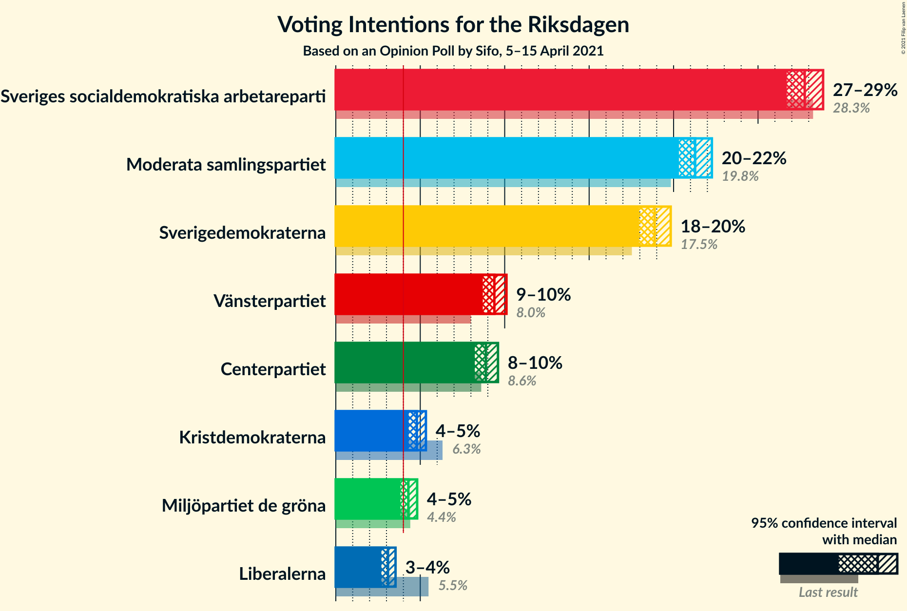

### Confidence Intervals

| Party | Last Result | Poll Result | 80% Confidence Interval | 90% Confidence Interval | 95% Confidence Interval | 99% Confidence Interval |
|:-----:|:-----------:|:-----------:|:-----------------------:|:-----------------------:|:-----------------------:|:-----------------------:|
| Sveriges socialdemokratiska arbetareparti | 28.3% | 27.8% | 27.1–28.5% |26.9–28.7% |26.7–28.9% |26.4–29.2% |
| Moderata samlingspartiet | 19.8% | 21.3% | 20.6–21.9% |20.5–22.1% |20.3–22.3% |20.0–22.6% |
| Sverigedemokraterna | 17.5% | 18.9% | 18.3–19.5% |18.1–19.7% |18.0–19.8% |17.7–20.1% |
| Vänsterpartiet | 8.0% | 9.4% | 8.9–9.9% |8.8–10.0% |8.7–10.1% |8.5–10.3% |
| Centerpartiet | 8.6% | 8.9% | 8.5–9.4% |8.3–9.5% |8.2–9.6% |8.0–9.8% |
| Kristdemokraterna | 6.3% | 4.8% | 4.5–5.2% |4.4–5.3% |4.3–5.3% |4.2–5.5% |
| Miljöpartiet de gröna | 4.4% | 4.3% | 4.0–4.6% |3.9–4.7% |3.8–4.8% |3.7–5.0% |
| Liberalerna | 5.5% | 3.1% | 2.8–3.4% |2.8–3.5% |2.7–3.5% |2.6–3.7% |

*Note:* The poll result column reflects the actual value used in the calculations. Published results may vary slightly, and in addition be rounded to fewer digits.

## Seats

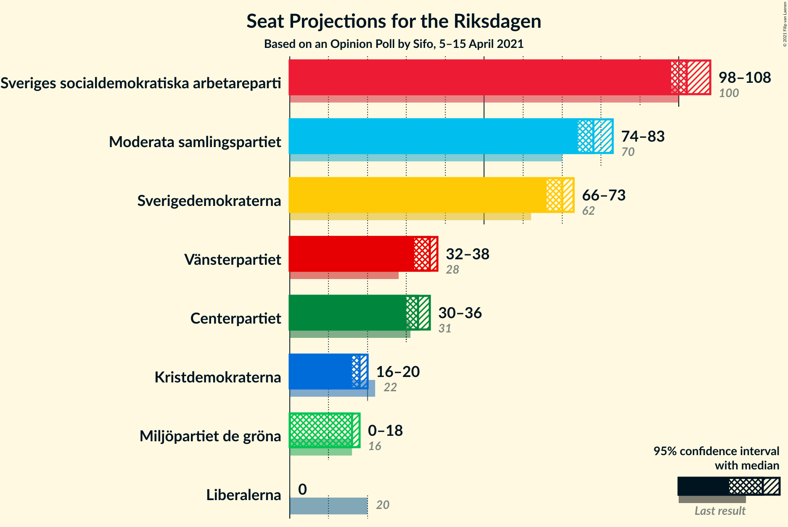

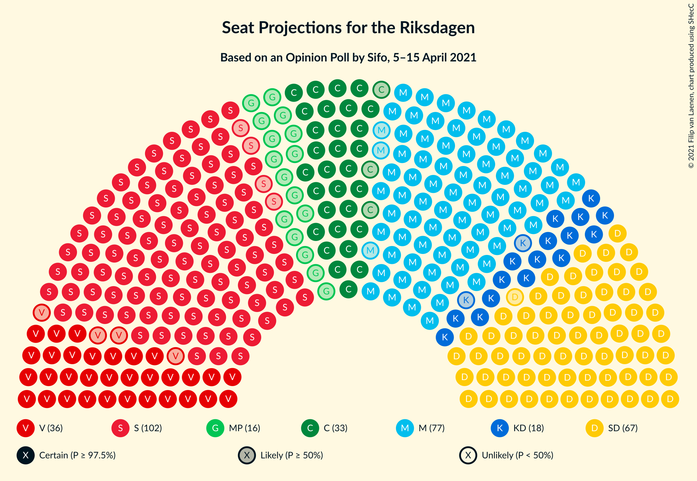

### Confidence Intervals

| Party | Last Result | Median | 80% Confidence Interval | 90% Confidence Interval | 95% Confidence Interval | 99% Confidence Interval |
|:-----:|:-----------:|:------:|:-----------------------:|:-----------------------:|:-----------------------:|:-----------------------:|
| <a href="#sveriges-socialdemokratiska-arbetareparti">Sveriges socialdemokratiska arbetareparti</a> | 100 | 102 | 99–108 |98–108 |98–108 |97–109 |
| <a href="#moderata-samlingspartiet">Moderata samlingspartiet</a> | 70 | 78 | 76–81 |75–82 |74–83 |73–84 |
| <a href="#sverigedemokraterna">Sverigedemokraterna</a> | 62 | 70 | 66–73 |66–73 |66–73 |64–75 |
| <a href="#vänsterpartiet">Vänsterpartiet</a> | 28 | 36 | 32–37 |32–38 |32–38 |31–38 |
| <a href="#centerpartiet">Centerpartiet</a> | 31 | 33 | 31–35 |31–35 |30–36 |30–36 |
| <a href="#kristdemokraterna">Kristdemokraterna</a> | 22 | 18 | 16–19 |16–19 |16–20 |15–21 |
| <a href="#miljöpartiet-de-gröna">Miljöpartiet de gröna</a> | 16 | 16 | 0–17 |0–18 |0–18 |0–18 |
| <a href="#liberalerna">Liberalerna</a> | 20 | 0 | 0 |0 |0 |0 |

### Sveriges socialdemokratiska arbetareparti

*For a full overview of the results for this party, see the [Sveriges socialdemokratiska arbetareparti](party-sverigessocialdemokratiskaarbetareparti.html) page.*

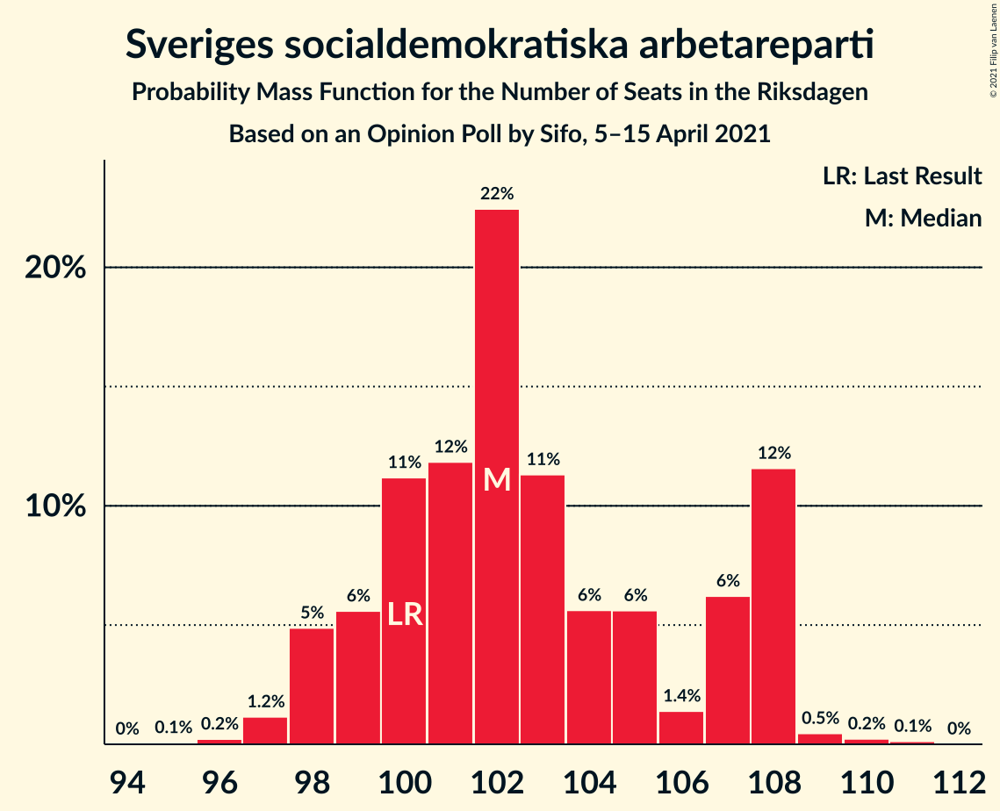

| Number of Seats | Probability | Accumulated | Special Marks |
|:---------------:|:-----------:|:-----------:|:-------------:|
| 95 | 0.1% | 100% |  |
| 96 | 0.2% | 99.9% |  |
| 97 | 1.2% | 99.7% |  |
| 98 | 5% | 98.5% |  |
| 99 | 6% | 94% |  |
| 100 | 11% | 88% | Last Result |
| 101 | 12% | 77% |  |
| 102 | 22% | 65% | Median |
| 103 | 11% | 43% |  |
| 104 | 6% | 31% |  |
| 105 | 6% | 26% |  |
| 106 | 1.4% | 20% |  |
| 107 | 6% | 19% |  |
| 108 | 12% | 12% |  |
| 109 | 0.5% | 0.9% |  |
| 110 | 0.2% | 0.4% |  |
| 111 | 0.1% | 0.2% |  |
| 112 | 0% | 0% |  |

### Moderata samlingspartiet

*For a full overview of the results for this party, see the [Moderata samlingspartiet](party-moderatasamlingspartiet.html) page.*

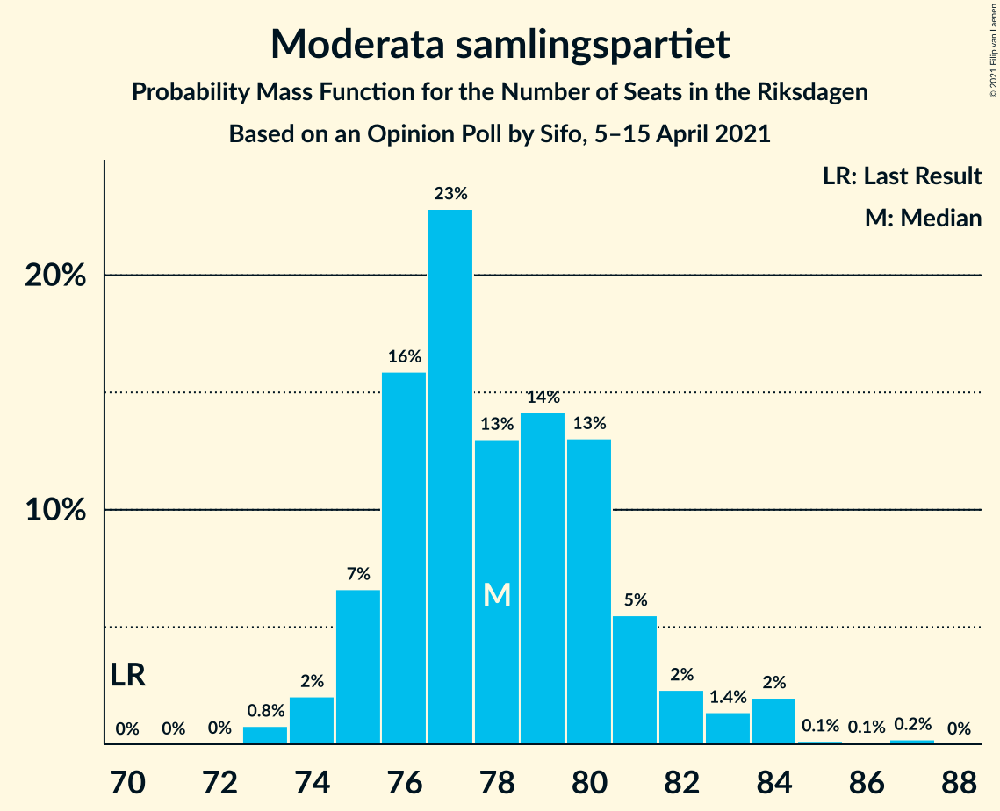

| Number of Seats | Probability | Accumulated | Special Marks |
|:---------------:|:-----------:|:-----------:|:-------------:|
| 70 | 0% | 100% | Last Result |
| 71 | 0% | 100% |  |
| 72 | 0% | 100% |  |
| 73 | 0.8% | 99.9% |  |
| 74 | 2% | 99.2% |  |
| 75 | 7% | 97% |  |
| 76 | 16% | 91% |  |
| 77 | 23% | 75% |  |
| 78 | 13% | 52% | Median |
| 79 | 14% | 39% |  |
| 80 | 13% | 25% |  |
| 81 | 5% | 12% |  |
| 82 | 2% | 6% |  |
| 83 | 1.4% | 4% |  |
| 84 | 2% | 2% |  |
| 85 | 0.1% | 0.4% |  |
| 86 | 0.1% | 0.3% |  |
| 87 | 0.2% | 0.2% |  |
| 88 | 0% | 0% |  |

### Sverigedemokraterna

*For a full overview of the results for this party, see the [Sverigedemokraterna](party-sverigedemokraterna.html) page.*

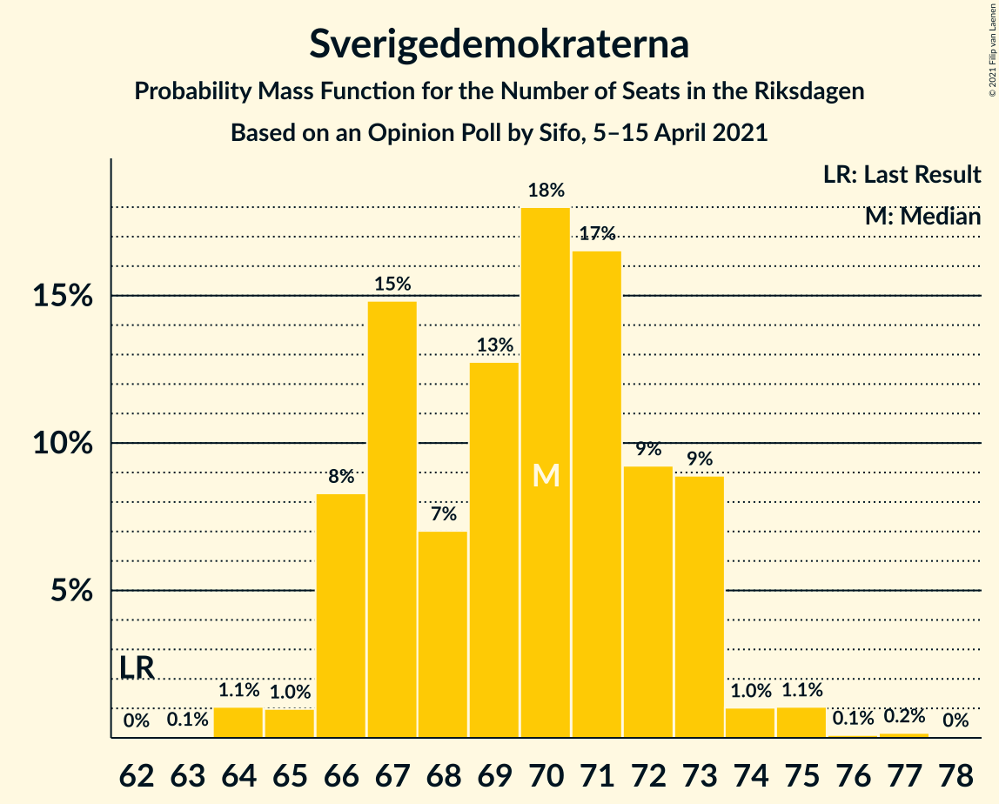

| Number of Seats | Probability | Accumulated | Special Marks |
|:---------------:|:-----------:|:-----------:|:-------------:|
| 62 | 0% | 100% | Last Result |
| 63 | 0.1% | 100% |  |
| 64 | 1.1% | 99.9% |  |
| 65 | 1.0% | 98.9% |  |
| 66 | 8% | 98% |  |
| 67 | 15% | 90% |  |
| 68 | 7% | 75% |  |
| 69 | 13% | 68% |  |
| 70 | 18% | 55% | Median |
| 71 | 17% | 37% |  |
| 72 | 9% | 20% |  |
| 73 | 9% | 11% |  |
| 74 | 1.0% | 2% |  |
| 75 | 1.1% | 1.3% |  |
| 76 | 0.1% | 0.3% |  |
| 77 | 0.2% | 0.2% |  |
| 78 | 0% | 0% |  |

### Vänsterpartiet

*For a full overview of the results for this party, see the [Vänsterpartiet](party-vänsterpartiet.html) page.*

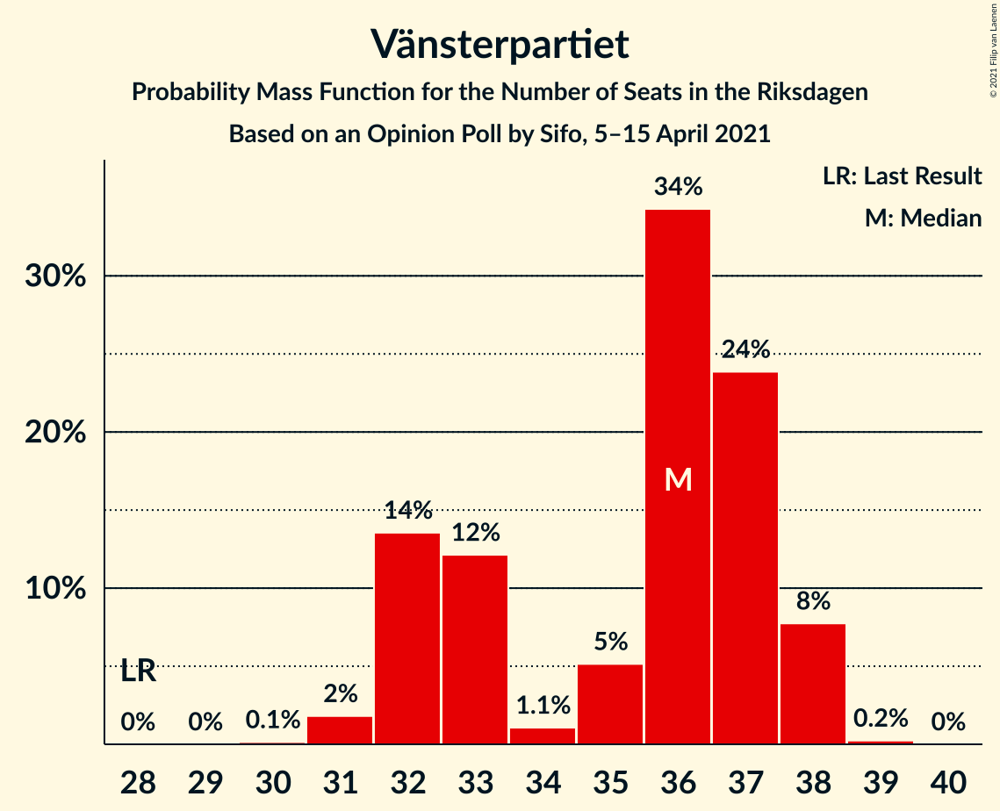

| Number of Seats | Probability | Accumulated | Special Marks |
|:---------------:|:-----------:|:-----------:|:-------------:|
| 28 | 0% | 100% | Last Result |
| 29 | 0% | 100% |  |
| 30 | 0.1% | 100% |  |
| 31 | 2% | 99.9% |  |
| 32 | 14% | 98% |  |
| 33 | 12% | 84% |  |
| 34 | 1.1% | 72% |  |
| 35 | 5% | 71% |  |
| 36 | 34% | 66% | Median |
| 37 | 24% | 32% |  |
| 38 | 8% | 8% |  |
| 39 | 0.2% | 0.2% |  |
| 40 | 0% | 0% |  |

### Centerpartiet

*For a full overview of the results for this party, see the [Centerpartiet](party-centerpartiet.html) page.*

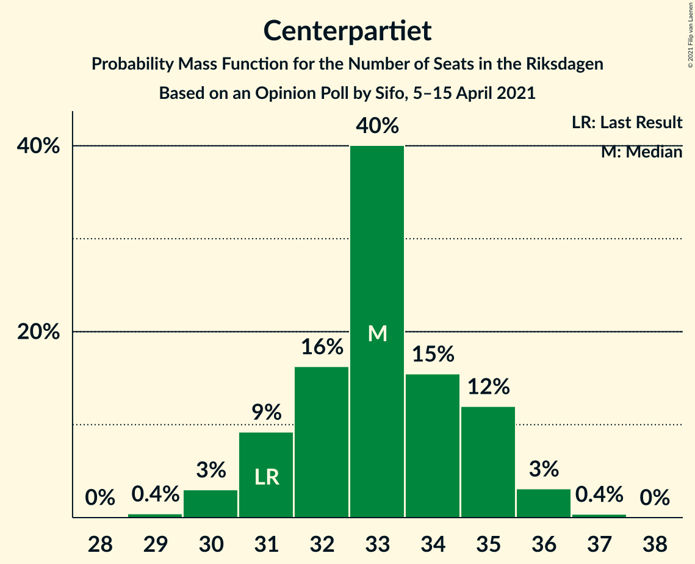

| Number of Seats | Probability | Accumulated | Special Marks |
|:---------------:|:-----------:|:-----------:|:-------------:|
| 29 | 0.4% | 100% |  |
| 30 | 3% | 99.5% |  |
| 31 | 9% | 97% | Last Result |
| 32 | 16% | 87% |  |
| 33 | 40% | 71% | Median |
| 34 | 15% | 31% |  |
| 35 | 12% | 16% |  |
| 36 | 3% | 4% |  |
| 37 | 0.4% | 0.4% |  |
| 38 | 0% | 0% |  |

### Kristdemokraterna

*For a full overview of the results for this party, see the [Kristdemokraterna](party-kristdemokraterna.html) page.*

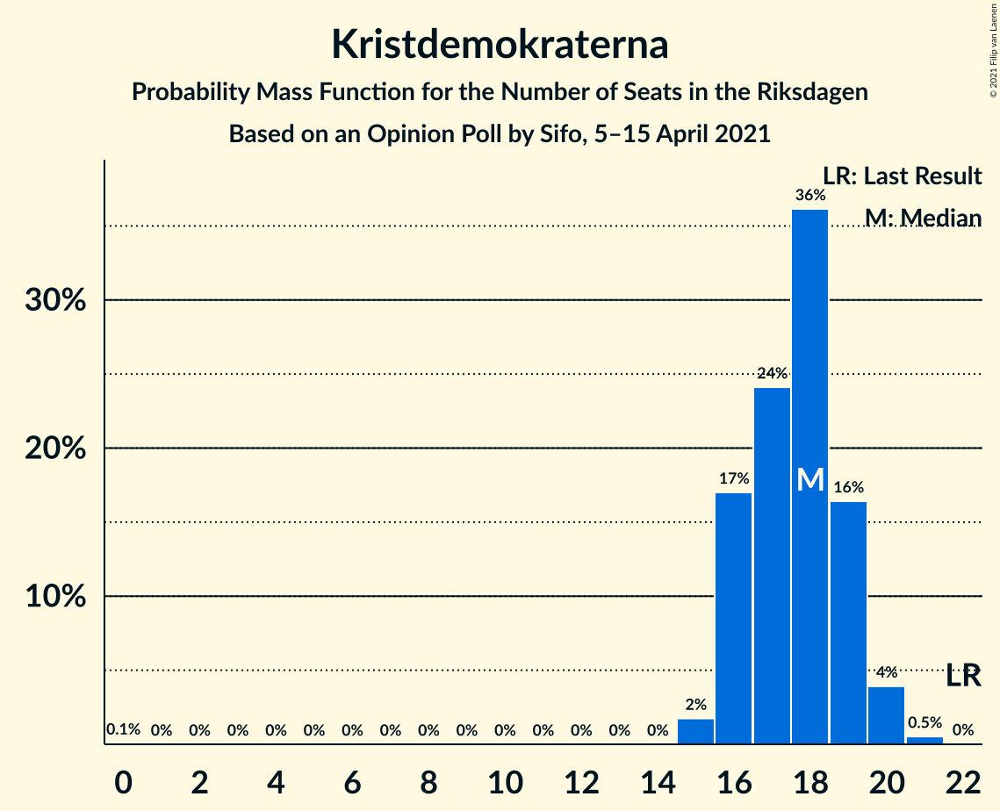

| Number of Seats | Probability | Accumulated | Special Marks |
|:---------------:|:-----------:|:-----------:|:-------------:|
| 0 | 0.1% | 100% |  |
| 1 | 0% | 99.9% |  |
| 2 | 0% | 99.9% |  |
| 3 | 0% | 99.9% |  |
| 4 | 0% | 99.9% |  |
| 5 | 0% | 99.9% |  |
| 6 | 0% | 99.9% |  |
| 7 | 0% | 99.9% |  |
| 8 | 0% | 99.9% |  |
| 9 | 0% | 99.9% |  |
| 10 | 0% | 99.9% |  |
| 11 | 0% | 99.9% |  |
| 12 | 0% | 99.9% |  |
| 13 | 0% | 99.9% |  |
| 14 | 0% | 99.9% |  |
| 15 | 2% | 99.9% |  |
| 16 | 17% | 98% |  |
| 17 | 24% | 81% |  |
| 18 | 36% | 57% | Median |
| 19 | 16% | 21% |  |
| 20 | 4% | 4% |  |
| 21 | 0.5% | 0.6% |  |
| 22 | 0% | 0% | Last Result |

### Miljöpartiet de gröna

*For a full overview of the results for this party, see the [Miljöpartiet de gröna](party-miljöpartietdegröna.html) page.*

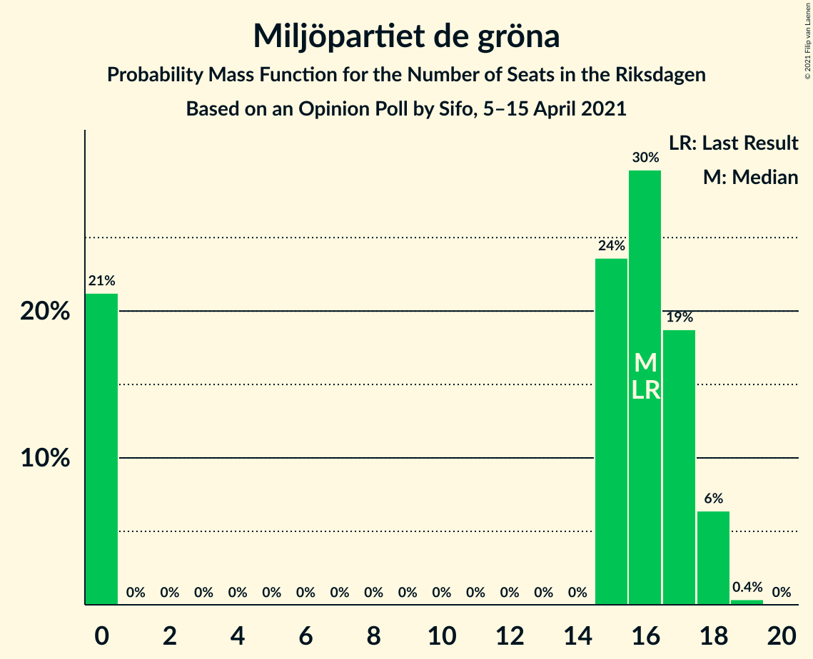

| Number of Seats | Probability | Accumulated | Special Marks |
|:---------------:|:-----------:|:-----------:|:-------------:|
| 0 | 21% | 100% |  |
| 1 | 0% | 79% |  |
| 2 | 0% | 79% |  |
| 3 | 0% | 79% |  |
| 4 | 0% | 79% |  |
| 5 | 0% | 79% |  |
| 6 | 0% | 79% |  |
| 7 | 0% | 79% |  |
| 8 | 0% | 79% |  |
| 9 | 0% | 79% |  |
| 10 | 0% | 79% |  |
| 11 | 0% | 79% |  |
| 12 | 0% | 79% |  |
| 13 | 0% | 79% |  |
| 14 | 0% | 79% |  |
| 15 | 24% | 79% |  |
| 16 | 30% | 55% | Last Result, Median |
| 17 | 19% | 26% |  |
| 18 | 6% | 7% |  |
| 19 | 0.4% | 0.4% |  |
| 20 | 0% | 0% |  |

### Liberalerna

*For a full overview of the results for this party, see the [Liberalerna](party-liberalerna.html) page.*

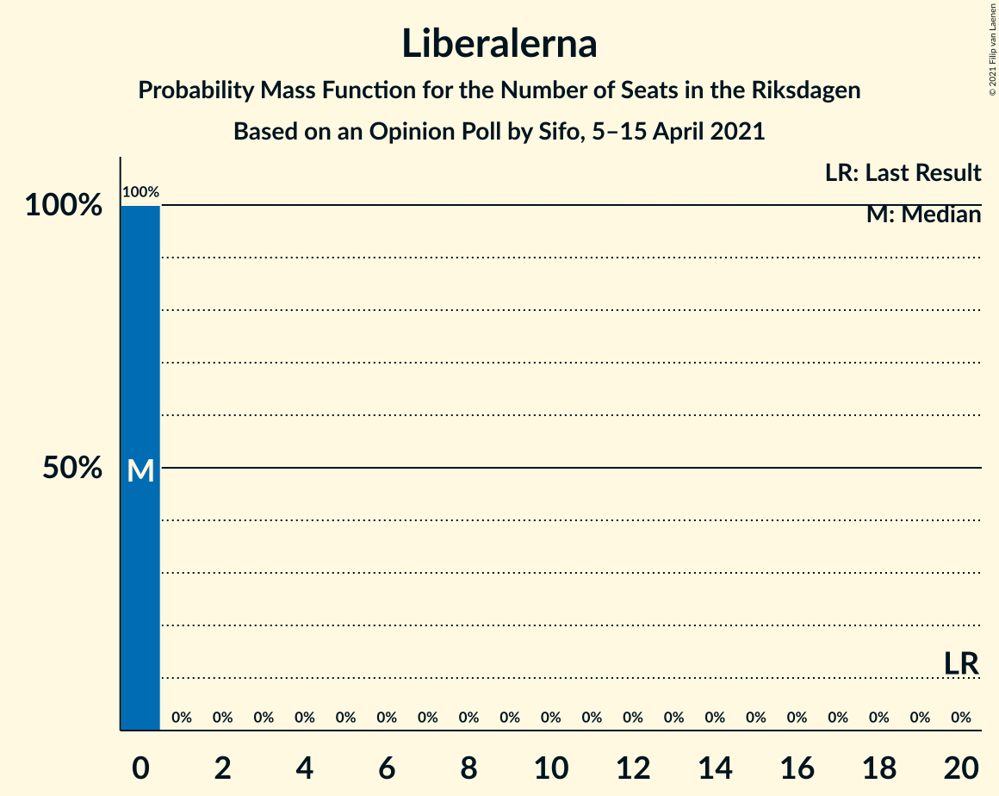

| Number of Seats | Probability | Accumulated | Special Marks |
|:---------------:|:-----------:|:-----------:|:-------------:|
| 0 | 100% | 100% | Median |
| 1 | 0% | 0% |  |
| 2 | 0% | 0% |  |
| 3 | 0% | 0% |  |
| 4 | 0% | 0% |  |
| 5 | 0% | 0% |  |
| 6 | 0% | 0% |  |
| 7 | 0% | 0% |  |
| 8 | 0% | 0% |  |
| 9 | 0% | 0% |  |
| 10 | 0% | 0% |  |
| 11 | 0% | 0% |  |
| 12 | 0% | 0% |  |
| 13 | 0% | 0% |  |
| 14 | 0% | 0% |  |
| 15 | 0% | 0% |  |
| 16 | 0% | 0% |  |
| 17 | 0% | 0% |  |
| 18 | 0% | 0% |  |
| 19 | 0% | 0% |  |
| 20 | 0% | 0% | Last Result |

## Coalitions

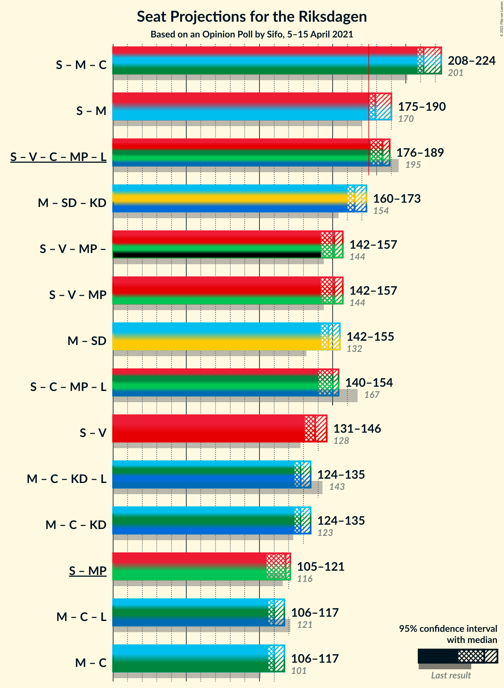

### Confidence Intervals

| Coalition | Last Result | Median | Majority? | 80% Confidence Interval | 90% Confidence Interval | 95% Confidence Interval | 99% Confidence Interval |
|:---------:|:-----------:|:------:|:---------:|:-----------------------:|:-----------------------:|:-----------------------:|:-----------------------:|
| Sveriges socialdemokratiska arbetareparti – Moderata samlingspartiet – Centerpartiet | 201 | 212 | 100% | 209–222 | 208–222 | 208–224 | 206–225 |
| Sveriges socialdemokratiska arbetareparti – Moderata samlingspartiet | 170 | 179 | 99.2% | 177–188 | 176–188 | 175–190 | 174–192 |
| Sveriges socialdemokratiska arbetareparti – Vänsterpartiet – Centerpartiet – Miljöpartiet de gröna – Liberalerna | 195 | 184 | 98.7% | 179–188 | 178–189 | 176–189 | 172–191 |
| Moderata samlingspartiet – Sverigedemokraterna – Kristdemokraterna | 154 | 165 | 1.3% | 161–170 | 160–171 | 160–173 | 158–177 |
| Sveriges socialdemokratiska arbetareparti – Vänsterpartiet – Miljöpartiet de gröna | 144 | 151 | 0% | 145–156 | 144–157 | 142–157 | 138–158 |
| Moderata samlingspartiet – Sverigedemokraterna | 132 | 147 | 0% | 144–152 | 143–153 | 142–155 | 141–159 |
| Sveriges socialdemokratiska arbetareparti – Centerpartiet – Miljöpartiet de gröna – Liberalerna | 167 | 150 | 0% | 141–153 | 141–153 | 140–154 | 136–156 |
| Sveriges socialdemokratiska arbetareparti – Vänsterpartiet | 128 | 138 | 0% | 133–145 | 132–146 | 131–146 | 131–146 |
| Moderata samlingspartiet – Centerpartiet – Kristdemokraterna – Liberalerna | 143 | 128 | 0% | 125–133 | 124–134 | 124–135 | 122–137 |
| Moderata samlingspartiet – Centerpartiet – Kristdemokraterna | 123 | 128 | 0% | 125–133 | 124–134 | 124–135 | 122–137 |
| Sveriges socialdemokratiska arbetareparti – Miljöpartiet de gröna | 116 | 118 | 0% | 108–120 | 107–120 | 105–121 | 103–123 |
| Moderata samlingspartiet – Centerpartiet – Liberalerna | 121 | 110 | 0% | 108–115 | 107–116 | 106–117 | 105–119 |
| Moderata samlingspartiet – Centerpartiet | 101 | 110 | 0% | 108–115 | 107–116 | 106–117 | 105–119 |

### Sveriges socialdemokratiska arbetareparti – Moderata samlingspartiet – Centerpartiet

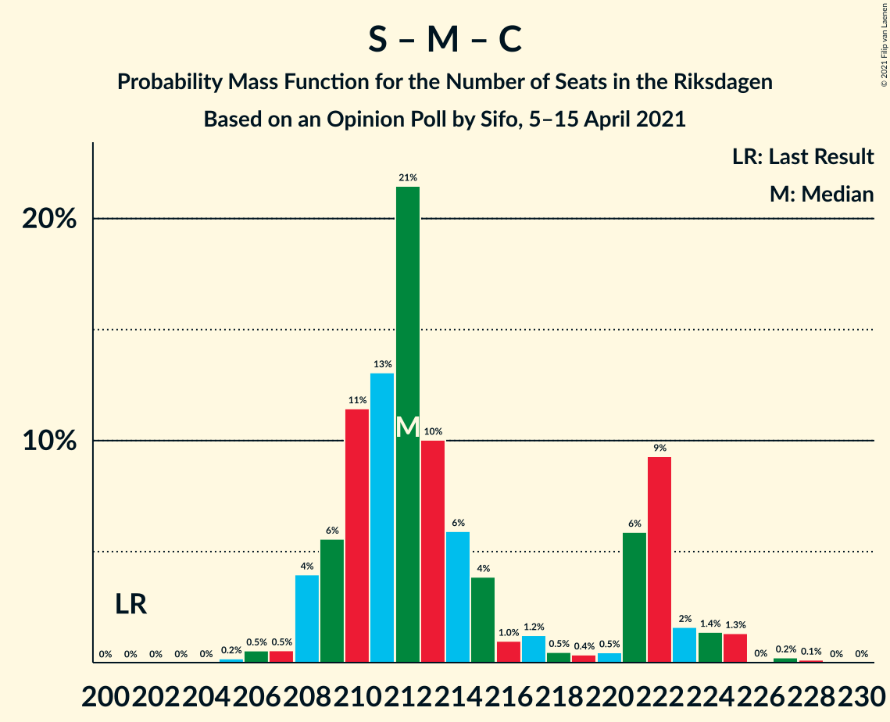

| Number of Seats | Probability | Accumulated | Special Marks |
|:---------------:|:-----------:|:-----------:|:-------------:|
| 201 | 0% | 100% | Last Result |
| 202 | 0% | 100% |  |
| 203 | 0% | 100% |  |
| 204 | 0% | 100% |  |
| 205 | 0.2% | 100% |  |
| 206 | 0.5% | 99.8% |  |
| 207 | 0.5% | 99.3% |  |
| 208 | 4% | 98.7% |  |
| 209 | 6% | 95% |  |
| 210 | 11% | 89% |  |
| 211 | 13% | 78% |  |
| 212 | 21% | 65% |  |
| 213 | 10% | 43% | Median |
| 214 | 6% | 33% |  |
| 215 | 4% | 27% |  |
| 216 | 1.0% | 23% |  |
| 217 | 1.2% | 22% |  |
| 218 | 0.5% | 21% |  |
| 219 | 0.4% | 21% |  |
| 220 | 0.5% | 20% |  |
| 221 | 6% | 20% |  |
| 222 | 9% | 14% |  |
| 223 | 2% | 5% |  |
| 224 | 1.4% | 3% |  |
| 225 | 1.3% | 2% |  |
| 226 | 0% | 0.4% |  |
| 227 | 0.2% | 0.4% |  |
| 228 | 0.1% | 0.2% |  |
| 229 | 0% | 0% |  |

### Sveriges socialdemokratiska arbetareparti – Moderata samlingspartiet

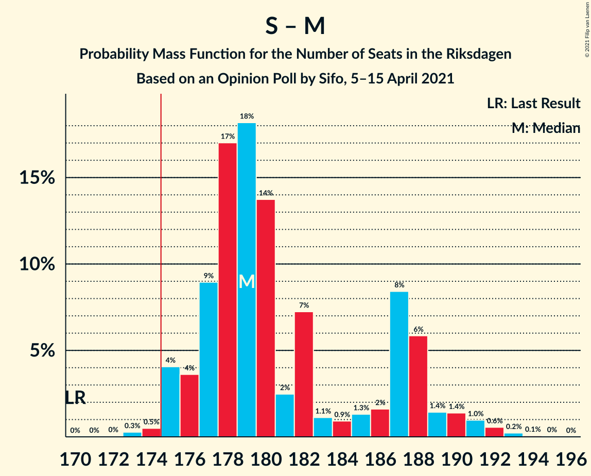

| Number of Seats | Probability | Accumulated | Special Marks |
|:---------------:|:-----------:|:-----------:|:-------------:|
| 170 | 0% | 100% | Last Result |
| 171 | 0% | 100% |  |
| 172 | 0% | 100% |  |
| 173 | 0.3% | 99.9% |  |
| 174 | 0.5% | 99.7% |  |
| 175 | 4% | 99.2% | Majority |
| 176 | 4% | 95% |  |
| 177 | 9% | 92% |  |
| 178 | 17% | 83% |  |
| 179 | 18% | 66% |  |
| 180 | 14% | 47% | Median |
| 181 | 2% | 34% |  |
| 182 | 7% | 31% |  |
| 183 | 1.1% | 24% |  |
| 184 | 0.9% | 23% |  |
| 185 | 1.3% | 22% |  |
| 186 | 2% | 21% |  |
| 187 | 8% | 19% |  |
| 188 | 6% | 11% |  |
| 189 | 1.4% | 5% |  |
| 190 | 1.4% | 3% |  |
| 191 | 1.0% | 2% |  |
| 192 | 0.6% | 0.9% |  |
| 193 | 0.2% | 0.3% |  |
| 194 | 0.1% | 0.1% |  |
| 195 | 0% | 0.1% |  |
| 196 | 0% | 0% |  |

### Sveriges socialdemokratiska arbetareparti – Vänsterpartiet – Centerpartiet – Miljöpartiet de gröna – Liberalerna

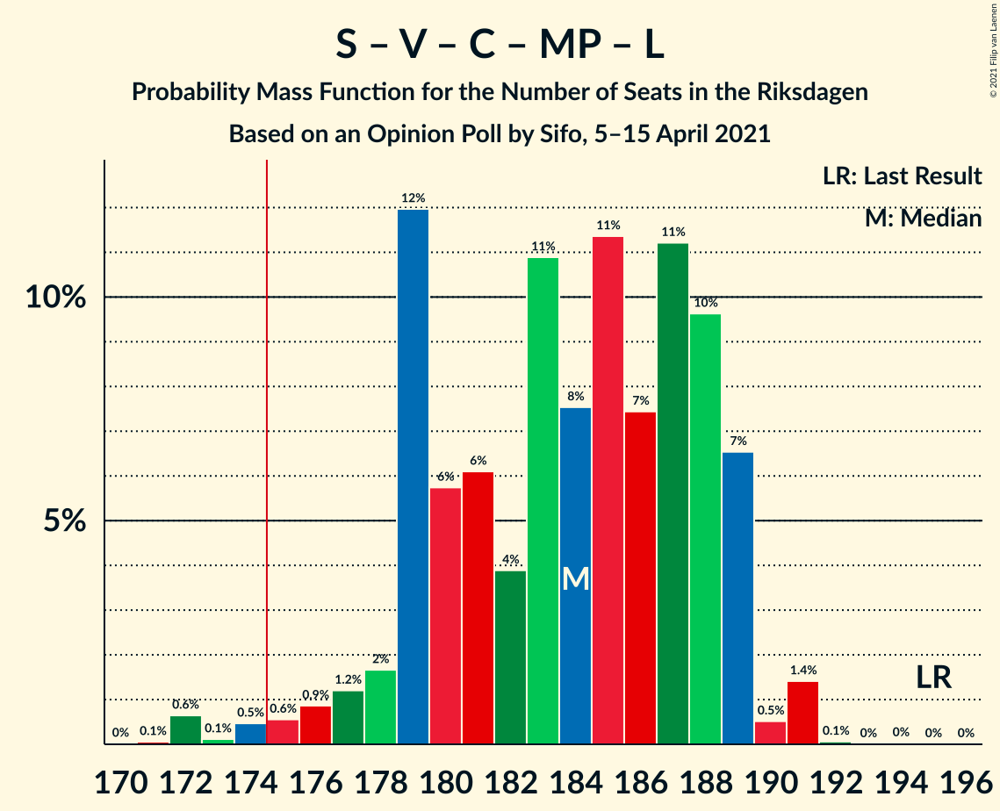

| Number of Seats | Probability | Accumulated | Special Marks |
|:---------------:|:-----------:|:-----------:|:-------------:|
| 171 | 0.1% | 100% |  |
| 172 | 0.6% | 99.9% |  |
| 173 | 0.1% | 99.3% |  |
| 174 | 0.5% | 99.2% |  |
| 175 | 0.6% | 98.7% | Majority |
| 176 | 0.9% | 98% |  |
| 177 | 1.2% | 97% |  |
| 178 | 2% | 96% |  |
| 179 | 12% | 94% |  |
| 180 | 6% | 82% |  |
| 181 | 6% | 77% |  |
| 182 | 4% | 71% |  |
| 183 | 11% | 67% |  |
| 184 | 8% | 56% |  |
| 185 | 11% | 48% |  |
| 186 | 7% | 37% |  |
| 187 | 11% | 29% | Median |
| 188 | 10% | 18% |  |
| 189 | 7% | 9% |  |
| 190 | 0.5% | 2% |  |
| 191 | 1.4% | 2% |  |
| 192 | 0.1% | 0.1% |  |
| 193 | 0% | 0.1% |  |
| 194 | 0% | 0.1% |  |
| 195 | 0% | 0% | Last Result |

### Moderata samlingspartiet – Sverigedemokraterna – Kristdemokraterna

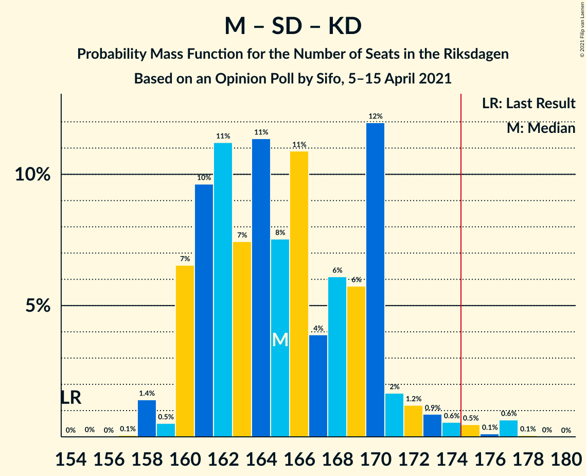

| Number of Seats | Probability | Accumulated | Special Marks |
|:---------------:|:-----------:|:-----------:|:-------------:|
| 154 | 0% | 100% | Last Result |
| 155 | 0% | 100% |  |
| 156 | 0% | 99.9% |  |
| 157 | 0.1% | 99.9% |  |
| 158 | 1.4% | 99.9% |  |
| 159 | 0.5% | 98% |  |
| 160 | 7% | 98% |  |
| 161 | 10% | 91% |  |
| 162 | 11% | 82% |  |
| 163 | 7% | 71% |  |
| 164 | 11% | 63% |  |
| 165 | 8% | 52% |  |
| 166 | 11% | 44% | Median |
| 167 | 4% | 33% |  |
| 168 | 6% | 29% |  |
| 169 | 6% | 23% |  |
| 170 | 12% | 18% |  |
| 171 | 2% | 6% |  |
| 172 | 1.2% | 4% |  |
| 173 | 0.9% | 3% |  |
| 174 | 0.6% | 2% |  |
| 175 | 0.5% | 1.3% | Majority |
| 176 | 0.1% | 0.8% |  |
| 177 | 0.6% | 0.7% |  |
| 178 | 0.1% | 0.1% |  |
| 179 | 0% | 0% |  |

### Sveriges socialdemokratiska arbetareparti – Vänsterpartiet – Miljöpartiet de gröna

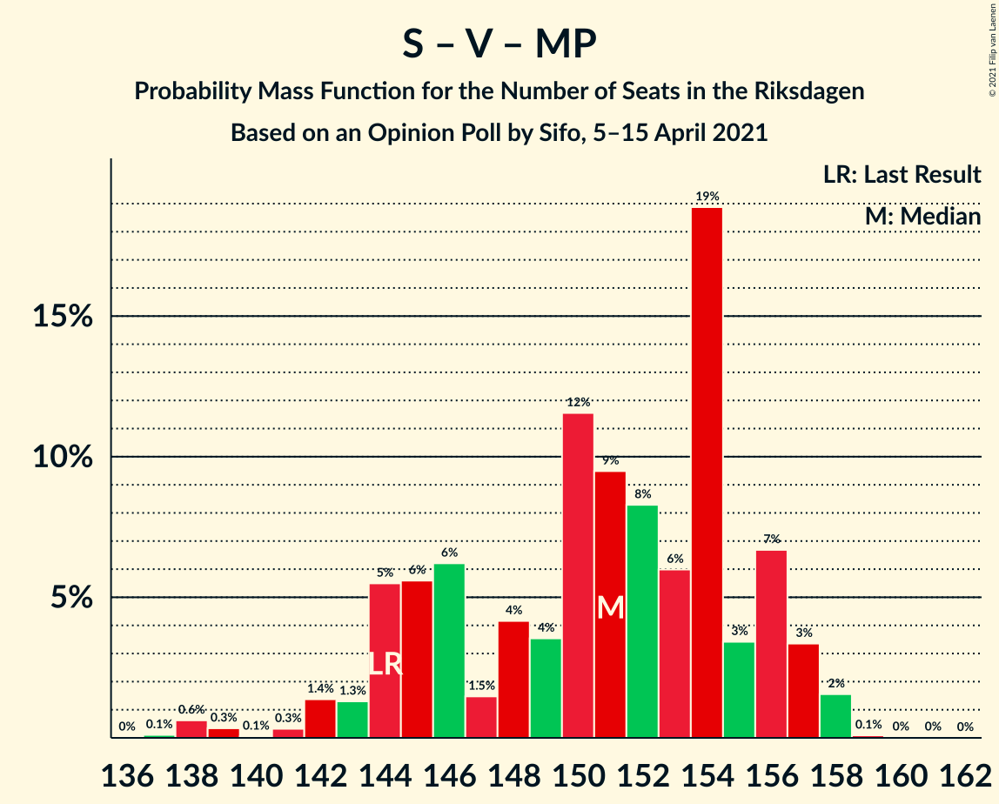

| Number of Seats | Probability | Accumulated | Special Marks |
|:---------------:|:-----------:|:-----------:|:-------------:|
| 137 | 0.1% | 100% |  |
| 138 | 0.6% | 99.9% |  |
| 139 | 0.3% | 99.2% |  |
| 140 | 0.1% | 98.9% |  |
| 141 | 0.3% | 98.8% |  |
| 142 | 1.4% | 98.5% |  |
| 143 | 1.3% | 97% |  |
| 144 | 5% | 96% | Last Result |
| 145 | 6% | 90% |  |
| 146 | 6% | 85% |  |
| 147 | 1.5% | 79% |  |
| 148 | 4% | 77% |  |
| 149 | 4% | 73% |  |
| 150 | 12% | 69% |  |
| 151 | 9% | 58% |  |
| 152 | 8% | 48% |  |
| 153 | 6% | 40% |  |
| 154 | 19% | 34% | Median |
| 155 | 3% | 15% |  |
| 156 | 7% | 12% |  |
| 157 | 3% | 5% |  |
| 158 | 2% | 2% |  |
| 159 | 0.1% | 0.2% |  |
| 160 | 0% | 0.1% |  |
| 161 | 0% | 0% |  |

### Moderata samlingspartiet – Sverigedemokraterna

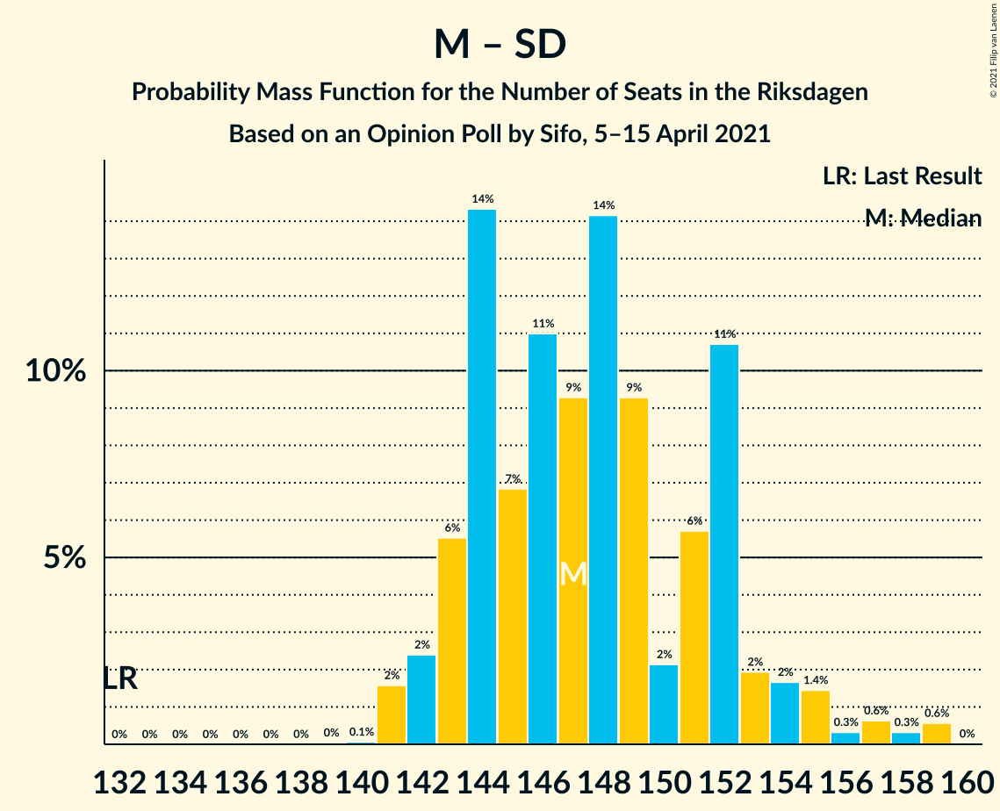

| Number of Seats | Probability | Accumulated | Special Marks |
|:---------------:|:-----------:|:-----------:|:-------------:|
| 132 | 0% | 100% | Last Result |
| 133 | 0% | 100% |  |
| 134 | 0% | 100% |  |
| 135 | 0% | 100% |  |
| 136 | 0% | 100% |  |
| 137 | 0% | 100% |  |
| 138 | 0% | 100% |  |
| 139 | 0% | 100% |  |
| 140 | 0.1% | 100% |  |
| 141 | 2% | 99.9% |  |
| 142 | 2% | 98% |  |
| 143 | 6% | 96% |  |
| 144 | 14% | 90% |  |
| 145 | 7% | 76% |  |
| 146 | 11% | 69% |  |
| 147 | 9% | 58% |  |
| 148 | 14% | 49% | Median |
| 149 | 9% | 35% |  |
| 150 | 2% | 25% |  |
| 151 | 6% | 23% |  |
| 152 | 11% | 18% |  |
| 153 | 2% | 7% |  |
| 154 | 2% | 5% |  |
| 155 | 1.4% | 3% |  |
| 156 | 0.3% | 2% |  |
| 157 | 0.6% | 2% |  |
| 158 | 0.3% | 0.9% |  |
| 159 | 0.6% | 0.6% |  |
| 160 | 0% | 0% |  |

### Sveriges socialdemokratiska arbetareparti – Centerpartiet – Miljöpartiet de gröna – Liberalerna

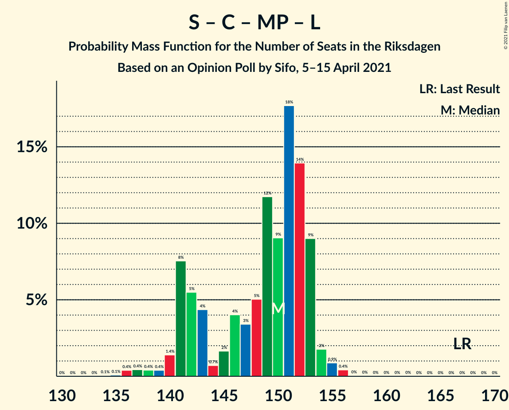

| Number of Seats | Probability | Accumulated | Special Marks |
|:---------------:|:-----------:|:-----------:|:-------------:|
| 134 | 0.1% | 100% |  |
| 135 | 0.1% | 99.9% |  |
| 136 | 0.4% | 99.9% |  |
| 137 | 0.4% | 99.5% |  |
| 138 | 0.4% | 99.0% |  |
| 139 | 0.4% | 98.6% |  |
| 140 | 1.4% | 98% |  |
| 141 | 8% | 97% |  |
| 142 | 5% | 89% |  |
| 143 | 4% | 84% |  |
| 144 | 0.7% | 79% |  |
| 145 | 2% | 79% |  |
| 146 | 4% | 77% |  |
| 147 | 3% | 73% |  |
| 148 | 5% | 70% |  |
| 149 | 12% | 65% |  |
| 150 | 9% | 53% |  |
| 151 | 18% | 44% | Median |
| 152 | 14% | 26% |  |
| 153 | 9% | 12% |  |
| 154 | 2% | 3% |  |
| 155 | 0.9% | 1.4% |  |
| 156 | 0.4% | 0.5% |  |
| 157 | 0% | 0.1% |  |
| 158 | 0% | 0.1% |  |
| 159 | 0% | 0% |  |
| 160 | 0% | 0% |  |
| 161 | 0% | 0% |  |
| 162 | 0% | 0% |  |
| 163 | 0% | 0% |  |
| 164 | 0% | 0% |  |
| 165 | 0% | 0% |  |
| 166 | 0% | 0% |  |
| 167 | 0% | 0% | Last Result |

### Sveriges socialdemokratiska arbetareparti – Vänsterpartiet

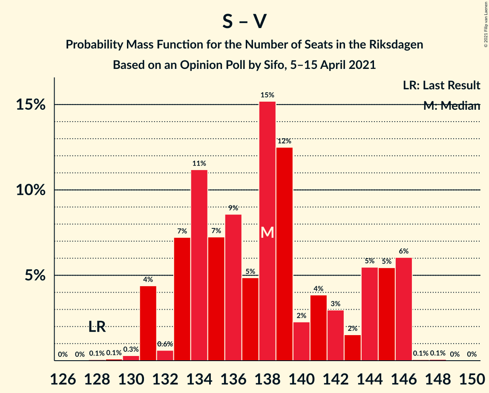

| Number of Seats | Probability | Accumulated | Special Marks |
|:---------------:|:-----------:|:-----------:|:-------------:|
| 128 | 0.1% | 100% | Last Result |
| 129 | 0.1% | 99.9% |  |
| 130 | 0.3% | 99.8% |  |
| 131 | 4% | 99.5% |  |
| 132 | 0.6% | 95% |  |
| 133 | 7% | 95% |  |
| 134 | 11% | 87% |  |
| 135 | 7% | 76% |  |
| 136 | 9% | 69% |  |
| 137 | 5% | 60% |  |
| 138 | 15% | 55% | Median |
| 139 | 12% | 40% |  |
| 140 | 2% | 28% |  |
| 141 | 4% | 25% |  |
| 142 | 3% | 22% |  |
| 143 | 2% | 19% |  |
| 144 | 5% | 17% |  |
| 145 | 5% | 12% |  |
| 146 | 6% | 6% |  |
| 147 | 0.1% | 0.2% |  |
| 148 | 0.1% | 0.1% |  |
| 149 | 0% | 0% |  |

### Moderata samlingspartiet – Centerpartiet – Kristdemokraterna – Liberalerna

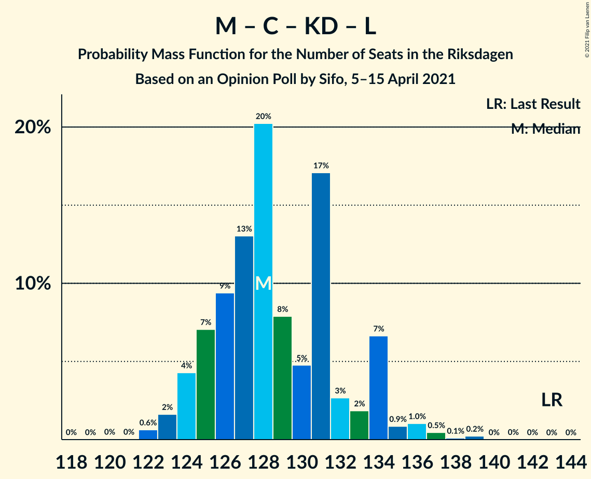

| Number of Seats | Probability | Accumulated | Special Marks |
|:---------------:|:-----------:|:-----------:|:-------------:|
| 118 | 0% | 100% |  |
| 119 | 0% | 99.9% |  |
| 120 | 0% | 99.9% |  |
| 121 | 0% | 99.9% |  |
| 122 | 0.6% | 99.9% |  |
| 123 | 2% | 99.2% |  |
| 124 | 4% | 98% |  |
| 125 | 7% | 93% |  |
| 126 | 9% | 86% |  |
| 127 | 13% | 77% |  |
| 128 | 20% | 64% |  |
| 129 | 8% | 44% | Median |
| 130 | 5% | 36% |  |
| 131 | 17% | 31% |  |
| 132 | 3% | 14% |  |
| 133 | 2% | 11% |  |
| 134 | 7% | 9% |  |
| 135 | 0.9% | 3% |  |
| 136 | 1.0% | 2% |  |
| 137 | 0.5% | 0.8% |  |
| 138 | 0.1% | 0.4% |  |
| 139 | 0.2% | 0.3% |  |
| 140 | 0% | 0% |  |
| 141 | 0% | 0% |  |
| 142 | 0% | 0% |  |
| 143 | 0% | 0% | Last Result |

### Moderata samlingspartiet – Centerpartiet – Kristdemokraterna

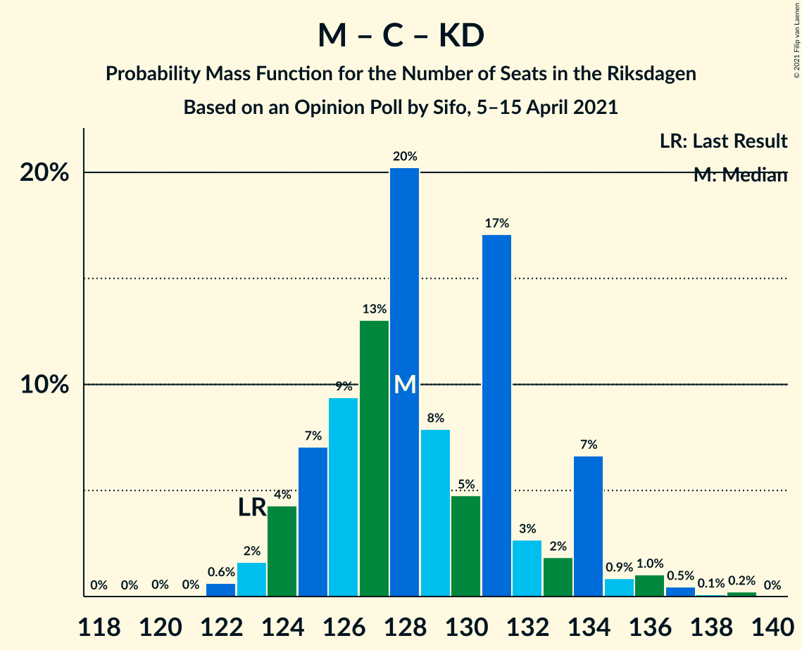

| Number of Seats | Probability | Accumulated | Special Marks |
|:---------------:|:-----------:|:-----------:|:-------------:|
| 118 | 0% | 100% |  |
| 119 | 0% | 99.9% |  |
| 120 | 0% | 99.9% |  |
| 121 | 0% | 99.9% |  |
| 122 | 0.6% | 99.9% |  |
| 123 | 2% | 99.2% | Last Result |
| 124 | 4% | 98% |  |
| 125 | 7% | 93% |  |
| 126 | 9% | 86% |  |
| 127 | 13% | 77% |  |
| 128 | 20% | 64% |  |
| 129 | 8% | 44% | Median |
| 130 | 5% | 36% |  |
| 131 | 17% | 31% |  |
| 132 | 3% | 14% |  |
| 133 | 2% | 11% |  |
| 134 | 7% | 9% |  |
| 135 | 0.9% | 3% |  |
| 136 | 1.0% | 2% |  |
| 137 | 0.5% | 0.8% |  |
| 138 | 0.1% | 0.4% |  |
| 139 | 0.2% | 0.3% |  |
| 140 | 0% | 0% |  |

### Sveriges socialdemokratiska arbetareparti – Miljöpartiet de gröna

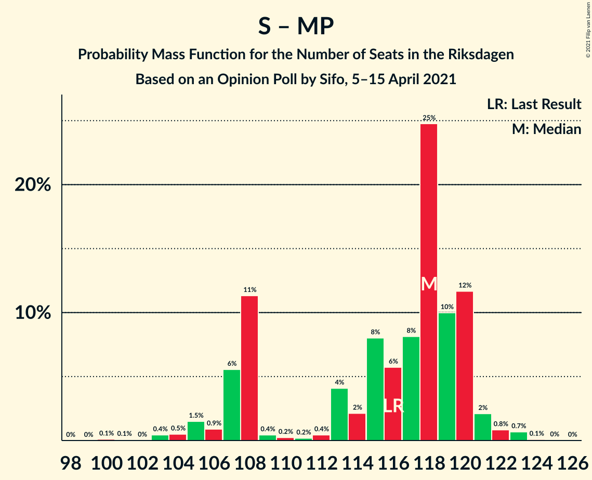

| Number of Seats | Probability | Accumulated | Special Marks |
|:---------------:|:-----------:|:-----------:|:-------------:|
| 100 | 0.1% | 100% |  |
| 101 | 0.1% | 99.9% |  |
| 102 | 0% | 99.8% |  |
| 103 | 0.4% | 99.8% |  |
| 104 | 0.5% | 99.4% |  |
| 105 | 1.5% | 98.9% |  |
| 106 | 0.9% | 97% |  |
| 107 | 6% | 96% |  |
| 108 | 11% | 91% |  |
| 109 | 0.4% | 80% |  |
| 110 | 0.2% | 79% |  |
| 111 | 0.2% | 79% |  |
| 112 | 0.4% | 79% |  |
| 113 | 4% | 78% |  |
| 114 | 2% | 74% |  |
| 115 | 8% | 72% |  |
| 116 | 6% | 64% | Last Result |
| 117 | 8% | 58% |  |
| 118 | 25% | 50% | Median |
| 119 | 10% | 25% |  |
| 120 | 12% | 15% |  |
| 121 | 2% | 4% |  |
| 122 | 0.8% | 2% |  |
| 123 | 0.7% | 0.8% |  |
| 124 | 0.1% | 0.2% |  |
| 125 | 0% | 0.1% |  |
| 126 | 0% | 0% |  |

### Moderata samlingspartiet – Centerpartiet – Liberalerna

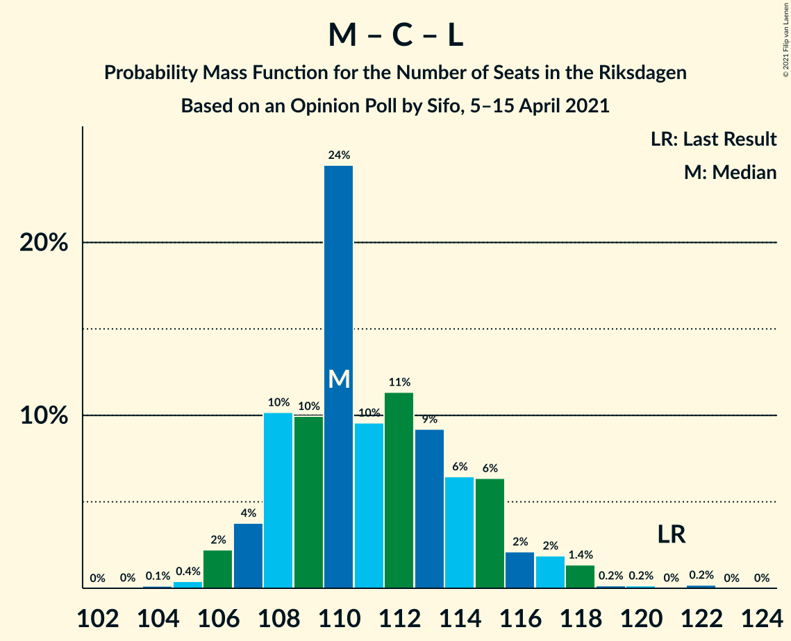

| Number of Seats | Probability | Accumulated | Special Marks |
|:---------------:|:-----------:|:-----------:|:-------------:|
| 104 | 0.1% | 100% |  |
| 105 | 0.4% | 99.8% |  |
| 106 | 2% | 99.4% |  |
| 107 | 4% | 97% |  |
| 108 | 10% | 93% |  |
| 109 | 10% | 83% |  |
| 110 | 24% | 73% |  |
| 111 | 10% | 49% | Median |
| 112 | 11% | 39% |  |
| 113 | 9% | 28% |  |
| 114 | 6% | 19% |  |
| 115 | 6% | 12% |  |
| 116 | 2% | 6% |  |
| 117 | 2% | 4% |  |
| 118 | 1.4% | 2% |  |
| 119 | 0.2% | 0.5% |  |
| 120 | 0.2% | 0.4% |  |
| 121 | 0% | 0.2% | Last Result |
| 122 | 0.2% | 0.2% |  |
| 123 | 0% | 0% |  |

### Moderata samlingspartiet – Centerpartiet

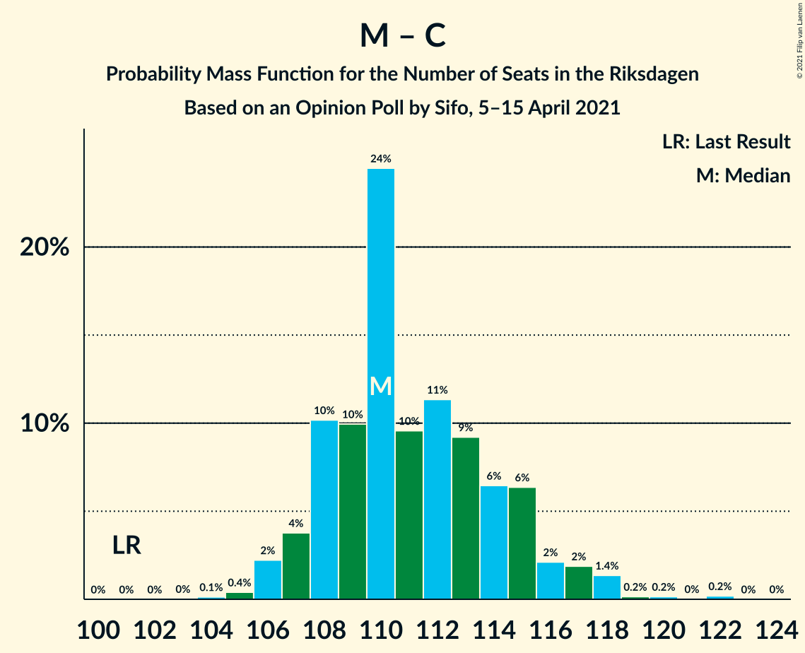

| Number of Seats | Probability | Accumulated | Special Marks |
|:---------------:|:-----------:|:-----------:|:-------------:|
| 101 | 0% | 100% | Last Result |
| 102 | 0% | 100% |  |
| 103 | 0% | 100% |  |
| 104 | 0.1% | 100% |  |
| 105 | 0.4% | 99.8% |  |
| 106 | 2% | 99.4% |  |
| 107 | 4% | 97% |  |
| 108 | 10% | 93% |  |
| 109 | 10% | 83% |  |
| 110 | 24% | 73% |  |
| 111 | 10% | 49% | Median |
| 112 | 11% | 39% |  |
| 113 | 9% | 28% |  |
| 114 | 6% | 19% |  |
| 115 | 6% | 12% |  |
| 116 | 2% | 6% |  |
| 117 | 2% | 4% |  |
| 118 | 1.4% | 2% |  |
| 119 | 0.2% | 0.5% |  |
| 120 | 0.2% | 0.4% |  |
| 121 | 0% | 0.2% |  |
| 122 | 0.2% | 0.2% |  |
| 123 | 0% | 0% |  |

## Technical Information

### Opinion Poll

+ **Polling firm:** Sifo
+ **Commissioner(s):** —
+ **Fieldwork period:** 5–15 April 2021

### Calculations

+ **Sample size:** 6796
+ **Simulations done:** 131,072
+ **Error estimate:** 0.56%

