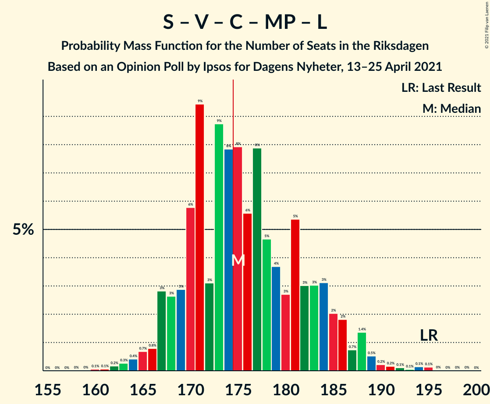
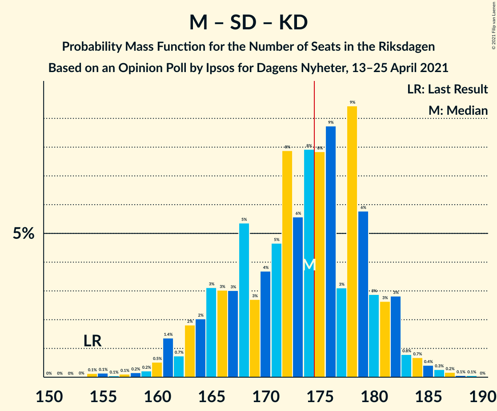
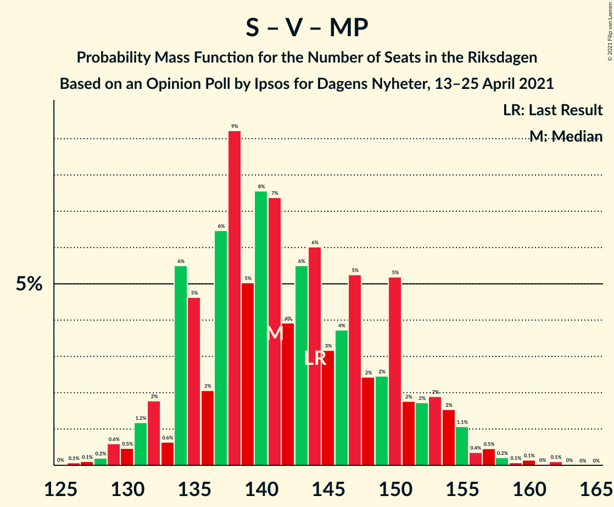

# Opinion Poll by Ipsos for Dagens Nyheter, 13–25 April 2021

<a href="#voting-intentions">Voting Intentions</a> | <a href="#seats">Seats</a> | <a href="#coalitions">Coalitions</a> | <a href="#technical-information">Technical Information</a>

## Voting Intentions

### Confidence Intervals

| Party | Last Result | Poll Result | 80% Confidence Interval | 90% Confidence Interval | 95% Confidence Interval | 99% Confidence Interval |
|:-----:|:-----------:|:-----------:|:-----------------------:|:-----------------------:|:-----------------------:|:-----------------------:|
| Sveriges socialdemokratiska arbetareparti | 28.3% | 26.0% | 24.8–27.3% |24.4–27.6% |24.1–27.9% |23.5–28.5% |
| Moderata samlingspartiet | 19.8% | 22.0% | 20.9–23.2% |20.5–23.5% |20.3–23.9% |19.7–24.4% |
| Sverigedemokraterna | 17.5% | 19.0% | 17.9–20.1% |17.6–20.5% |17.3–20.7% |16.8–21.3% |
| Vänsterpartiet | 8.0% | 10.0% | 9.2–10.9% |9.0–11.2% |8.8–11.4% |8.4–11.9% |
| Centerpartiet | 8.6% | 9.0% | 8.2–9.9% |8.0–10.1% |7.8–10.3% |7.5–10.7% |
| Kristdemokraterna | 6.3% | 5.0% | 4.4–5.7% |4.3–5.9% |4.1–6.1% |3.9–6.4% |
| Miljöpartiet de gröna | 4.4% | 4.0% | 3.5–4.6% |3.3–4.8% |3.2–4.9% |3.0–5.2% |
| Liberalerna | 5.5% | 3.0% | 2.6–3.6% |2.5–3.7% |2.4–3.9% |2.2–4.1% |

*Note:* The poll result column reflects the actual value used in the calculations. Published results may vary slightly, and in addition be rounded to fewer digits.

## Seats

### Confidence Intervals

| Party | Last Result | Median | 80% Confidence Interval | 90% Confidence Interval | 95% Confidence Interval | 99% Confidence Interval |
|:-----:|:-----------:|:------:|:-----------------------:|:-----------------------:|:-----------------------:|:-----------------------:|
| <a href="#sveriges-socialdemokratiska-arbetareparti">Sveriges socialdemokratiska arbetareparti</a> | 100 | 98 | 92–104 |91–105 |89–106 |87–108 |
| <a href="#moderata-samlingspartiet">Moderata samlingspartiet</a> | 70 | 83 | 78–88 |76–89 |75–90 |73–92 |
| <a href="#sverigedemokraterna">Sverigedemokraterna</a> | 62 | 71 | 67–76 |65–78 |64–79 |62–81 |
| <a href="#vänsterpartiet">Vänsterpartiet</a> | 28 | 38 | 35–41 |34–42 |33–43 |31–45 |
| <a href="#centerpartiet">Centerpartiet</a> | 31 | 33 | 31–37 |30–37 |29–38 |27–40 |
| <a href="#kristdemokraterna">Kristdemokraterna</a> | 22 | 19 | 17–21 |16–22 |15–23 |0–24 |
| <a href="#miljöpartiet-de-gröna">Miljöpartiet de gröna</a> | 16 | 0 | 0–16 |0–17 |0–18 |0–19 |
| <a href="#liberalerna">Liberalerna</a> | 20 | 0 | 0 |0 |0 |0–15 |

### Sveriges socialdemokratiska arbetareparti

*For a full overview of the results for this party, see the [Sveriges socialdemokratiska arbetareparti](party-sverigessocialdemokratiskaarbetareparti.html) page.*

| Number of Seats | Probability | Accumulated | Special Marks |
|:---------------:|:-----------:|:-----------:|:-------------:|
| 85 | 0.1% | 100% |  |
| 86 | 0.2% | 99.9% |  |
| 87 | 0.3% | 99.7% |  |
| 88 | 0.6% | 99.3% |  |
| 89 | 1.3% | 98.7% |  |
| 90 | 2% | 97% |  |
| 91 | 2% | 96% |  |
| 92 | 4% | 93% |  |
| 93 | 6% | 90% |  |
| 94 | 6% | 84% |  |
| 95 | 6% | 78% |  |
| 96 | 7% | 72% |  |
| 97 | 6% | 65% |  |
| 98 | 10% | 58% | Median |
| 99 | 8% | 48% |  |
| 100 | 9% | 40% | Last Result |
| 101 | 9% | 31% |  |
| 102 | 6% | 21% |  |
| 103 | 4% | 15% |  |
| 104 | 4% | 11% |  |
| 105 | 2% | 7% |  |
| 106 | 3% | 5% |  |
| 107 | 0.9% | 2% |  |
| 108 | 0.5% | 1.0% |  |
| 109 | 0.3% | 0.5% |  |
| 110 | 0.1% | 0.2% |  |
| 111 | 0.1% | 0.1% |  |
| 112 | 0% | 0.1% |  |
| 113 | 0% | 0% |  |

### Moderata samlingspartiet

*For a full overview of the results for this party, see the [Moderata samlingspartiet](party-moderatasamlingspartiet.html) page.*

| Number of Seats | Probability | Accumulated | Special Marks |
|:---------------:|:-----------:|:-----------:|:-------------:|
| 70 | 0% | 100% | Last Result |
| 71 | 0.1% | 99.9% |  |
| 72 | 0.2% | 99.8% |  |
| 73 | 0.6% | 99.6% |  |
| 74 | 0.7% | 99.0% |  |
| 75 | 1.1% | 98% |  |
| 76 | 2% | 97% |  |
| 77 | 2% | 95% |  |
| 78 | 4% | 93% |  |
| 79 | 6% | 89% |  |
| 80 | 6% | 83% |  |
| 81 | 7% | 77% |  |
| 82 | 13% | 70% |  |
| 83 | 13% | 58% | Median |
| 84 | 8% | 45% |  |
| 85 | 9% | 38% |  |
| 86 | 14% | 29% |  |
| 87 | 5% | 15% |  |
| 88 | 5% | 11% |  |
| 89 | 2% | 5% |  |
| 90 | 2% | 3% |  |
| 91 | 0.7% | 2% |  |
| 92 | 0.5% | 0.9% |  |
| 93 | 0.1% | 0.3% |  |
| 94 | 0.1% | 0.2% |  |
| 95 | 0.1% | 0.1% |  |
| 96 | 0.1% | 0.1% |  |
| 97 | 0% | 0% |  |

### Sverigedemokraterna

*For a full overview of the results for this party, see the [Sverigedemokraterna](party-sverigedemokraterna.html) page.*

| Number of Seats | Probability | Accumulated | Special Marks |
|:---------------:|:-----------:|:-----------:|:-------------:|
| 60 | 0.1% | 100% |  |
| 61 | 0.1% | 99.9% |  |
| 62 | 0.5% | 99.8% | Last Result |
| 63 | 0.8% | 99.3% |  |
| 64 | 1.3% | 98% |  |
| 65 | 3% | 97% |  |
| 66 | 3% | 94% |  |
| 67 | 6% | 91% |  |
| 68 | 6% | 86% |  |
| 69 | 11% | 79% |  |
| 70 | 8% | 69% |  |
| 71 | 13% | 61% | Median |
| 72 | 9% | 48% |  |
| 73 | 8% | 39% |  |
| 74 | 9% | 31% |  |
| 75 | 8% | 21% |  |
| 76 | 5% | 13% |  |
| 77 | 3% | 8% |  |
| 78 | 2% | 5% |  |
| 79 | 2% | 4% |  |
| 80 | 0.6% | 1.1% |  |
| 81 | 0.3% | 0.6% |  |
| 82 | 0.1% | 0.3% |  |
| 83 | 0.1% | 0.1% |  |
| 84 | 0% | 0.1% |  |
| 85 | 0% | 0% |  |

### Vänsterpartiet

*For a full overview of the results for this party, see the [Vänsterpartiet](party-vänsterpartiet.html) page.*

| Number of Seats | Probability | Accumulated | Special Marks |
|:---------------:|:-----------:|:-----------:|:-------------:|
| 28 | 0% | 100% | Last Result |
| 29 | 0% | 100% |  |
| 30 | 0.1% | 100% |  |
| 31 | 0.5% | 99.8% |  |
| 32 | 1.0% | 99.4% |  |
| 33 | 3% | 98% |  |
| 34 | 5% | 95% |  |
| 35 | 8% | 90% |  |
| 36 | 13% | 82% |  |
| 37 | 14% | 69% |  |
| 38 | 14% | 55% | Median |
| 39 | 19% | 41% |  |
| 40 | 7% | 22% |  |
| 41 | 6% | 15% |  |
| 42 | 5% | 9% |  |
| 43 | 2% | 4% |  |
| 44 | 2% | 2% |  |
| 45 | 0.5% | 0.7% |  |
| 46 | 0.1% | 0.2% |  |
| 47 | 0% | 0.1% |  |
| 48 | 0% | 0% |  |

### Centerpartiet

*For a full overview of the results for this party, see the [Centerpartiet](party-centerpartiet.html) page.*

| Number of Seats | Probability | Accumulated | Special Marks |
|:---------------:|:-----------:|:-----------:|:-------------:|
| 26 | 0.1% | 100% |  |
| 27 | 0.6% | 99.9% |  |
| 28 | 0.7% | 99.3% |  |
| 29 | 1.4% | 98.7% |  |
| 30 | 6% | 97% |  |
| 31 | 13% | 91% | Last Result |
| 32 | 12% | 79% |  |
| 33 | 22% | 67% | Median |
| 34 | 10% | 45% |  |
| 35 | 9% | 35% |  |
| 36 | 12% | 26% |  |
| 37 | 9% | 14% |  |
| 38 | 3% | 5% |  |
| 39 | 0.7% | 1.3% |  |
| 40 | 0.3% | 0.6% |  |
| 41 | 0.2% | 0.3% |  |
| 42 | 0.1% | 0.1% |  |
| 43 | 0% | 0.1% |  |
| 44 | 0% | 0% |  |

### Kristdemokraterna

*For a full overview of the results for this party, see the [Kristdemokraterna](party-kristdemokraterna.html) page.*

| Number of Seats | Probability | Accumulated | Special Marks |
|:---------------:|:-----------:|:-----------:|:-------------:|
| 0 | 1.4% | 100% |  |
| 1 | 0% | 98.6% |  |
| 2 | 0% | 98.6% |  |
| 3 | 0% | 98.6% |  |
| 4 | 0% | 98.6% |  |
| 5 | 0% | 98.6% |  |
| 6 | 0% | 98.6% |  |
| 7 | 0% | 98.6% |  |
| 8 | 0% | 98.6% |  |
| 9 | 0% | 98.6% |  |
| 10 | 0% | 98.6% |  |
| 11 | 0% | 98.6% |  |
| 12 | 0% | 98.6% |  |
| 13 | 0% | 98.6% |  |
| 14 | 0% | 98.6% |  |
| 15 | 1.5% | 98.6% |  |
| 16 | 6% | 97% |  |
| 17 | 15% | 91% |  |
| 18 | 21% | 76% |  |
| 19 | 18% | 55% | Median |
| 20 | 14% | 37% |  |
| 21 | 14% | 23% |  |
| 22 | 6% | 9% | Last Result |
| 23 | 2% | 3% |  |
| 24 | 0.7% | 0.9% |  |
| 25 | 0.2% | 0.2% |  |
| 26 | 0% | 0% |  |

### Miljöpartiet de gröna

*For a full overview of the results for this party, see the [Miljöpartiet de gröna](party-miljöpartietdegröna.html) page.*

| Number of Seats | Probability | Accumulated | Special Marks |
|:---------------:|:-----------:|:-----------:|:-------------:|
| 0 | 62% | 100% | Median |
| 1 | 0% | 38% |  |
| 2 | 0% | 38% |  |
| 3 | 0% | 38% |  |
| 4 | 0% | 38% |  |
| 5 | 0% | 38% |  |
| 6 | 0% | 38% |  |
| 7 | 0% | 38% |  |
| 8 | 0% | 38% |  |
| 9 | 0% | 38% |  |
| 10 | 0% | 38% |  |
| 11 | 0% | 38% |  |
| 12 | 0% | 38% |  |
| 13 | 0% | 38% |  |
| 14 | 0.2% | 38% |  |
| 15 | 18% | 38% |  |
| 16 | 11% | 20% | Last Result |
| 17 | 5% | 9% |  |
| 18 | 3% | 4% |  |
| 19 | 1.4% | 2% |  |
| 20 | 0.3% | 0.4% |  |
| 21 | 0.1% | 0.1% |  |
| 22 | 0% | 0% |  |

### Liberalerna

*For a full overview of the results for this party, see the [Liberalerna](party-liberalerna.html) page.*

| Number of Seats | Probability | Accumulated | Special Marks |
|:---------------:|:-----------:|:-----------:|:-------------:|
| 0 | 98.9% | 100% | Median |
| 1 | 0% | 1.1% |  |
| 2 | 0% | 1.1% |  |
| 3 | 0% | 1.1% |  |
| 4 | 0% | 1.1% |  |
| 5 | 0% | 1.1% |  |
| 6 | 0% | 1.1% |  |
| 7 | 0% | 1.1% |  |
| 8 | 0% | 1.1% |  |
| 9 | 0% | 1.1% |  |
| 10 | 0% | 1.1% |  |
| 11 | 0% | 1.1% |  |
| 12 | 0% | 1.1% |  |
| 13 | 0% | 1.1% |  |
| 14 | 0.2% | 1.1% |  |
| 15 | 0.7% | 0.9% |  |
| 16 | 0.2% | 0.2% |  |
| 17 | 0% | 0% |  |
| 18 | 0% | 0% |  |
| 19 | 0% | 0% |  |
| 20 | 0% | 0% | Last Result |

## Coalitions

### Confidence Intervals

| Coalition | Last Result | Median | Majority? | 80% Confidence Interval | 90% Confidence Interval | 95% Confidence Interval | 99% Confidence Interval |
|:---------:|:-----------:|:------:|:---------:|:-----------------------:|:-----------------------:|:-----------------------:|:-----------------------:|
| Sveriges socialdemokratiska arbetareparti – Moderata samlingspartiet – Centerpartiet | 201 | 215 | 100% | 206–222 | 204–224 | 203–226 | 199–230 |
| Sveriges socialdemokratiska arbetareparti – Moderata samlingspartiet | 170 | 182 | 87% | 173–188 | 171–189 | 169–190 | 166–194 |
| Sveriges socialdemokratiska arbetareparti – Vänsterpartiet – Centerpartiet – Miljöpartiet de gröna – Liberalerna | 195 | 175 | 54% | 169–184 | 167–186 | 167–188 | 163–191 |
| Moderata samlingspartiet – Sverigedemokraterna – Kristdemokraterna | 154 | 174 | 46% | 165–180 | 163–182 | 161–182 | 158–186 |
| Moderata samlingspartiet – Sverigedemokraterna | 132 | 155 | 0% | 147–161 | 145–162 | 143–164 | 140–166 |
| Sveriges socialdemokratiska arbetareparti – Vänsterpartiet – Miljöpartiet de gröna | 144 | 141 | 0% | 134–150 | 133–153 | 131–154 | 129–158 |
| Sveriges socialdemokratiska arbetareparti – Centerpartiet – Miljöpartiet de gröna – Liberalerna | 167 | 137 | 0% | 131–146 | 129–149 | 128–151 | 125–154 |
| Moderata samlingspartiet – Centerpartiet – Kristdemokraterna – Liberalerna | 143 | 135 | 0% | 129–141 | 127–143 | 125–146 | 120–148 |
| Sveriges socialdemokratiska arbetareparti – Vänsterpartiet | 128 | 137 | 0% | 129–142 | 127–144 | 126–145 | 123–148 |
| Moderata samlingspartiet – Centerpartiet – Kristdemokraterna | 123 | 135 | 0% | 129–141 | 127–143 | 125–145 | 120–148 |
| Moderata samlingspartiet – Centerpartiet – Liberalerna | 121 | 117 | 0% | 111–123 | 109–125 | 108–126 | 106–129 |
| Moderata samlingspartiet – Centerpartiet | 101 | 117 | 0% | 111–123 | 109–124 | 108–126 | 105–128 |
| Sveriges socialdemokratiska arbetareparti – Miljöpartiet de gröna | 116 | 103 | 0% | 96–114 | 95–115 | 93–117 | 91–120 |

### Sveriges socialdemokratiska arbetareparti – Moderata samlingspartiet – Centerpartiet

| Number of Seats | Probability | Accumulated | Special Marks |
|:---------------:|:-----------:|:-----------:|:-------------:|
| 195 | 0% | 100% |  |
| 196 | 0% | 99.9% |  |
| 197 | 0.1% | 99.9% |  |
| 198 | 0.2% | 99.8% |  |
| 199 | 0.3% | 99.7% |  |
| 200 | 0.4% | 99.4% |  |
| 201 | 0.4% | 99.0% | Last Result |
| 202 | 0.9% | 98.6% |  |
| 203 | 1.2% | 98% |  |
| 204 | 2% | 97% |  |
| 205 | 2% | 95% |  |
| 206 | 4% | 92% |  |
| 207 | 3% | 88% |  |
| 208 | 4% | 85% |  |
| 209 | 5% | 81% |  |
| 210 | 2% | 76% |  |
| 211 | 7% | 74% |  |
| 212 | 5% | 67% |  |
| 213 | 4% | 63% |  |
| 214 | 5% | 59% | Median |
| 215 | 4% | 54% |  |
| 216 | 4% | 50% |  |
| 217 | 6% | 46% |  |
| 218 | 8% | 40% |  |
| 219 | 8% | 32% |  |
| 220 | 6% | 24% |  |
| 221 | 3% | 18% |  |
| 222 | 5% | 14% |  |
| 223 | 2% | 10% |  |
| 224 | 3% | 7% |  |
| 225 | 2% | 5% |  |
| 226 | 1.1% | 3% |  |
| 227 | 0.1% | 1.5% |  |
| 228 | 0.4% | 1.4% |  |
| 229 | 0.3% | 1.0% |  |
| 230 | 0.2% | 0.6% |  |
| 231 | 0.1% | 0.4% |  |
| 232 | 0.1% | 0.4% |  |
| 233 | 0% | 0.3% |  |
| 234 | 0.2% | 0.3% |  |
| 235 | 0% | 0.1% |  |
| 236 | 0% | 0.1% |  |
| 237 | 0.1% | 0.1% |  |
| 238 | 0% | 0% |  |

### Sveriges socialdemokratiska arbetareparti – Moderata samlingspartiet

| Number of Seats | Probability | Accumulated | Special Marks |
|:---------------:|:-----------:|:-----------:|:-------------:|
| 163 | 0.1% | 100% |  |
| 164 | 0.2% | 99.9% |  |
| 165 | 0.1% | 99.7% |  |
| 166 | 0.3% | 99.6% |  |
| 167 | 0.5% | 99.3% |  |
| 168 | 0.6% | 98.8% |  |
| 169 | 1.4% | 98% |  |
| 170 | 1.3% | 97% | Last Result |
| 171 | 2% | 96% |  |
| 172 | 2% | 94% |  |
| 173 | 3% | 92% |  |
| 174 | 2% | 89% |  |
| 175 | 4% | 87% | Majority |
| 176 | 3% | 83% |  |
| 177 | 5% | 80% |  |
| 178 | 5% | 76% |  |
| 179 | 5% | 70% |  |
| 180 | 7% | 66% |  |
| 181 | 8% | 59% | Median |
| 182 | 5% | 50% |  |
| 183 | 6% | 46% |  |
| 184 | 10% | 40% |  |
| 185 | 7% | 30% |  |
| 186 | 8% | 23% |  |
| 187 | 3% | 16% |  |
| 188 | 3% | 12% |  |
| 189 | 5% | 9% |  |
| 190 | 2% | 4% |  |
| 191 | 0.9% | 2% |  |
| 192 | 0.6% | 2% |  |
| 193 | 0.2% | 0.9% |  |
| 194 | 0.3% | 0.7% |  |
| 195 | 0.1% | 0.4% |  |
| 196 | 0.2% | 0.4% |  |
| 197 | 0.1% | 0.2% |  |
| 198 | 0% | 0.1% |  |
| 199 | 0% | 0.1% |  |
| 200 | 0% | 0.1% |  |
| 201 | 0% | 0% |  |

### Sveriges socialdemokratiska arbetareparti – Vänsterpartiet – Centerpartiet – Miljöpartiet de gröna – Liberalerna

| Number of Seats | Probability | Accumulated | Special Marks |
|:---------------:|:-----------:|:-----------:|:-------------:|
| 160 | 0.1% | 100% |  |
| 161 | 0.1% | 99.9% |  |
| 162 | 0.2% | 99.9% |  |
| 163 | 0.3% | 99.7% |  |
| 164 | 0.4% | 99.4% |  |
| 165 | 0.7% | 99.0% |  |
| 166 | 0.8% | 98% |  |
| 167 | 3% | 98% |  |
| 168 | 3% | 95% |  |
| 169 | 3% | 92% | Median |
| 170 | 6% | 89% |  |
| 171 | 9% | 83% |  |
| 172 | 3% | 74% |  |
| 173 | 9% | 71% |  |
| 174 | 8% | 62% |  |
| 175 | 8% | 54% | Majority |
| 176 | 6% | 46% |  |
| 177 | 8% | 41% |  |
| 178 | 5% | 33% |  |
| 179 | 4% | 28% |  |
| 180 | 3% | 25% |  |
| 181 | 5% | 22% |  |
| 182 | 3% | 16% |  |
| 183 | 3% | 13% |  |
| 184 | 3% | 10% |  |
| 185 | 2% | 7% |  |
| 186 | 2% | 5% |  |
| 187 | 0.7% | 3% |  |
| 188 | 1.4% | 3% |  |
| 189 | 0.5% | 1.4% |  |
| 190 | 0.2% | 0.9% |  |
| 191 | 0.2% | 0.6% |  |
| 192 | 0.1% | 0.5% |  |
| 193 | 0.1% | 0.4% |  |
| 194 | 0.1% | 0.3% |  |
| 195 | 0.1% | 0.2% | Last Result |
| 196 | 0% | 0.1% |  |
| 197 | 0% | 0% |  |

### Moderata samlingspartiet – Sverigedemokraterna – Kristdemokraterna

| Number of Seats | Probability | Accumulated | Special Marks |
|:---------------:|:-----------:|:-----------:|:-------------:|
| 153 | 0% | 100% |  |
| 154 | 0.1% | 99.9% | Last Result |
| 155 | 0.1% | 99.8% |  |
| 156 | 0.1% | 99.7% |  |
| 157 | 0.1% | 99.6% |  |
| 158 | 0.2% | 99.5% |  |
| 159 | 0.2% | 99.4% |  |
| 160 | 0.5% | 99.1% |  |
| 161 | 1.4% | 98.6% |  |
| 162 | 0.7% | 97% |  |
| 163 | 2% | 97% |  |
| 164 | 2% | 95% |  |
| 165 | 3% | 93% |  |
| 166 | 3% | 90% |  |
| 167 | 3% | 87% |  |
| 168 | 5% | 84% |  |
| 169 | 3% | 78% |  |
| 170 | 4% | 75% |  |
| 171 | 5% | 72% |  |
| 172 | 8% | 67% |  |
| 173 | 6% | 59% | Median |
| 174 | 8% | 54% |  |
| 175 | 8% | 46% | Majority |
| 176 | 9% | 38% |  |
| 177 | 3% | 29% |  |
| 178 | 9% | 26% |  |
| 179 | 6% | 17% |  |
| 180 | 3% | 11% |  |
| 181 | 3% | 8% |  |
| 182 | 3% | 5% |  |
| 183 | 0.8% | 2% |  |
| 184 | 0.7% | 2% |  |
| 185 | 0.4% | 1.0% |  |
| 186 | 0.3% | 0.6% |  |
| 187 | 0.2% | 0.3% |  |
| 188 | 0.1% | 0.1% |  |
| 189 | 0.1% | 0.1% |  |
| 190 | 0% | 0% |  |

### Moderata samlingspartiet – Sverigedemokraterna

| Number of Seats | Probability | Accumulated | Special Marks |
|:---------------:|:-----------:|:-----------:|:-------------:|
| 132 | 0% | 100% | Last Result |
| 133 | 0% | 100% |  |
| 134 | 0% | 100% |  |
| 135 | 0% | 100% |  |
| 136 | 0% | 100% |  |
| 137 | 0% | 100% |  |
| 138 | 0% | 99.9% |  |
| 139 | 0.1% | 99.9% |  |
| 140 | 0.4% | 99.8% |  |
| 141 | 0.2% | 99.4% |  |
| 142 | 0.4% | 99.2% |  |
| 143 | 2% | 98.8% |  |
| 144 | 1.2% | 97% |  |
| 145 | 1.1% | 96% |  |
| 146 | 2% | 95% |  |
| 147 | 4% | 93% |  |
| 148 | 4% | 89% |  |
| 149 | 2% | 85% |  |
| 150 | 4% | 84% |  |
| 151 | 7% | 79% |  |
| 152 | 5% | 73% |  |
| 153 | 6% | 68% |  |
| 154 | 7% | 62% | Median |
| 155 | 8% | 55% |  |
| 156 | 7% | 47% |  |
| 157 | 13% | 40% |  |
| 158 | 8% | 27% |  |
| 159 | 2% | 19% |  |
| 160 | 4% | 17% |  |
| 161 | 5% | 13% |  |
| 162 | 4% | 8% |  |
| 163 | 0.8% | 4% |  |
| 164 | 1.0% | 3% |  |
| 165 | 1.0% | 2% |  |
| 166 | 0.4% | 0.9% |  |
| 167 | 0.1% | 0.5% |  |
| 168 | 0.1% | 0.4% |  |
| 169 | 0.1% | 0.2% |  |
| 170 | 0.1% | 0.1% |  |
| 171 | 0% | 0.1% |  |
| 172 | 0% | 0% |  |

### Sveriges socialdemokratiska arbetareparti – Vänsterpartiet – Miljöpartiet de gröna

| Number of Seats | Probability | Accumulated | Special Marks |
|:---------------:|:-----------:|:-----------:|:-------------:|
| 125 | 0% | 100% |  |
| 126 | 0.1% | 99.9% |  |
| 127 | 0.1% | 99.9% |  |
| 128 | 0.2% | 99.8% |  |
| 129 | 0.6% | 99.6% |  |
| 130 | 0.5% | 99.0% |  |
| 131 | 1.2% | 98.5% |  |
| 132 | 2% | 97% |  |
| 133 | 0.6% | 96% |  |
| 134 | 6% | 95% |  |
| 135 | 5% | 89% |  |
| 136 | 2% | 85% | Median |
| 137 | 6% | 83% |  |
| 138 | 9% | 76% |  |
| 139 | 5% | 67% |  |
| 140 | 8% | 62% |  |
| 141 | 7% | 54% |  |
| 142 | 4% | 47% |  |
| 143 | 6% | 43% |  |
| 144 | 6% | 38% | Last Result |
| 145 | 3% | 32% |  |
| 146 | 4% | 28% |  |
| 147 | 5% | 25% |  |
| 148 | 2% | 19% |  |
| 149 | 2% | 17% |  |
| 150 | 5% | 15% |  |
| 151 | 2% | 9% |  |
| 152 | 2% | 8% |  |
| 153 | 2% | 6% |  |
| 154 | 2% | 4% |  |
| 155 | 1.1% | 2% |  |
| 156 | 0.4% | 1.4% |  |
| 157 | 0.5% | 1.0% |  |
| 158 | 0.2% | 0.6% |  |
| 159 | 0.1% | 0.4% |  |
| 160 | 0.1% | 0.3% |  |
| 161 | 0% | 0.1% |  |
| 162 | 0.1% | 0.1% |  |
| 163 | 0% | 0% |  |

### Sveriges socialdemokratiska arbetareparti – Centerpartiet – Miljöpartiet de gröna – Liberalerna

| Number of Seats | Probability | Accumulated | Special Marks |
|:---------------:|:-----------:|:-----------:|:-------------:|
| 123 | 0.1% | 100% |  |
| 124 | 0.2% | 99.9% |  |
| 125 | 0.3% | 99.7% |  |
| 126 | 0.4% | 99.4% |  |
| 127 | 1.2% | 99.0% |  |
| 128 | 3% | 98% |  |
| 129 | 3% | 95% |  |
| 130 | 2% | 93% |  |
| 131 | 3% | 90% | Median |
| 132 | 5% | 88% |  |
| 133 | 10% | 83% |  |
| 134 | 7% | 72% |  |
| 135 | 5% | 65% |  |
| 136 | 5% | 60% |  |
| 137 | 6% | 55% |  |
| 138 | 5% | 48% |  |
| 139 | 8% | 44% |  |
| 140 | 5% | 36% |  |
| 141 | 3% | 31% |  |
| 142 | 4% | 28% |  |
| 143 | 4% | 24% |  |
| 144 | 4% | 20% |  |
| 145 | 4% | 17% |  |
| 146 | 3% | 12% |  |
| 147 | 2% | 9% |  |
| 148 | 2% | 7% |  |
| 149 | 1.4% | 5% |  |
| 150 | 1.1% | 4% |  |
| 151 | 1.1% | 3% |  |
| 152 | 0.4% | 1.5% |  |
| 153 | 0.5% | 1.0% |  |
| 154 | 0.2% | 0.6% |  |
| 155 | 0.1% | 0.4% |  |
| 156 | 0.2% | 0.3% |  |
| 157 | 0% | 0.1% |  |
| 158 | 0% | 0.1% |  |
| 159 | 0% | 0% |  |
| 160 | 0% | 0% |  |
| 161 | 0% | 0% |  |
| 162 | 0% | 0% |  |
| 163 | 0% | 0% |  |
| 164 | 0% | 0% |  |
| 165 | 0% | 0% |  |
| 166 | 0% | 0% |  |
| 167 | 0% | 0% | Last Result |

### Moderata samlingspartiet – Centerpartiet – Kristdemokraterna – Liberalerna

| Number of Seats | Probability | Accumulated | Special Marks |
|:---------------:|:-----------:|:-----------:|:-------------:|
| 116 | 0% | 100% |  |
| 117 | 0.2% | 99.9% |  |
| 118 | 0.1% | 99.7% |  |
| 119 | 0.1% | 99.7% |  |
| 120 | 0.2% | 99.6% |  |
| 121 | 0.1% | 99.5% |  |
| 122 | 0.1% | 99.3% |  |
| 123 | 0.3% | 99.2% |  |
| 124 | 0.5% | 98.9% |  |
| 125 | 1.4% | 98% |  |
| 126 | 1.2% | 97% |  |
| 127 | 3% | 96% |  |
| 128 | 2% | 92% |  |
| 129 | 3% | 91% |  |
| 130 | 2% | 87% |  |
| 131 | 4% | 85% |  |
| 132 | 6% | 81% |  |
| 133 | 6% | 75% |  |
| 134 | 11% | 69% |  |
| 135 | 8% | 57% | Median |
| 136 | 8% | 50% |  |
| 137 | 7% | 42% |  |
| 138 | 3% | 36% |  |
| 139 | 8% | 32% |  |
| 140 | 8% | 24% |  |
| 141 | 7% | 16% |  |
| 142 | 3% | 10% |  |
| 143 | 2% | 7% | Last Result |
| 144 | 1.1% | 5% |  |
| 145 | 1.1% | 4% |  |
| 146 | 0.9% | 3% |  |
| 147 | 0.8% | 2% |  |
| 148 | 0.3% | 0.8% |  |
| 149 | 0.2% | 0.5% |  |
| 150 | 0.1% | 0.3% |  |
| 151 | 0% | 0.2% |  |
| 152 | 0% | 0.1% |  |
| 153 | 0% | 0.1% |  |
| 154 | 0% | 0.1% |  |
| 155 | 0% | 0% |  |

### Sveriges socialdemokratiska arbetareparti – Vänsterpartiet

| Number of Seats | Probability | Accumulated | Special Marks |
|:---------------:|:-----------:|:-----------:|:-------------:|
| 120 | 0% | 100% |  |
| 121 | 0.1% | 99.9% |  |
| 122 | 0.3% | 99.8% |  |
| 123 | 0.4% | 99.6% |  |
| 124 | 0.5% | 99.1% |  |
| 125 | 0.7% | 98.6% |  |
| 126 | 2% | 98% |  |
| 127 | 2% | 96% |  |
| 128 | 2% | 94% | Last Result |
| 129 | 6% | 92% |  |
| 130 | 1.4% | 86% |  |
| 131 | 6% | 85% |  |
| 132 | 6% | 79% |  |
| 133 | 2% | 73% |  |
| 134 | 7% | 71% |  |
| 135 | 10% | 64% |  |
| 136 | 3% | 53% | Median |
| 137 | 7% | 50% |  |
| 138 | 11% | 43% |  |
| 139 | 5% | 32% |  |
| 140 | 8% | 27% |  |
| 141 | 6% | 19% |  |
| 142 | 3% | 13% |  |
| 143 | 4% | 10% |  |
| 144 | 3% | 6% |  |
| 145 | 1.2% | 3% |  |
| 146 | 0.4% | 2% |  |
| 147 | 0.6% | 1.3% |  |
| 148 | 0.4% | 0.8% |  |
| 149 | 0.1% | 0.4% |  |
| 150 | 0.1% | 0.2% |  |
| 151 | 0% | 0.1% |  |
| 152 | 0% | 0.1% |  |
| 153 | 0% | 0% |  |

### Moderata samlingspartiet – Centerpartiet – Kristdemokraterna

| Number of Seats | Probability | Accumulated | Special Marks |
|:---------------:|:-----------:|:-----------:|:-------------:|
| 115 | 0% | 100% |  |
| 116 | 0% | 99.9% |  |
| 117 | 0.2% | 99.9% |  |
| 118 | 0.1% | 99.7% |  |
| 119 | 0.1% | 99.7% |  |
| 120 | 0.2% | 99.6% |  |
| 121 | 0.2% | 99.4% |  |
| 122 | 0.1% | 99.3% |  |
| 123 | 0.3% | 99.2% | Last Result |
| 124 | 0.6% | 98.9% |  |
| 125 | 1.4% | 98% |  |
| 126 | 1.4% | 97% |  |
| 127 | 3% | 95% |  |
| 128 | 2% | 92% |  |
| 129 | 3% | 90% |  |
| 130 | 2% | 87% |  |
| 131 | 4% | 85% |  |
| 132 | 6% | 80% |  |
| 133 | 6% | 74% |  |
| 134 | 11% | 68% |  |
| 135 | 8% | 56% | Median |
| 136 | 8% | 49% |  |
| 137 | 7% | 41% |  |
| 138 | 3% | 35% |  |
| 139 | 8% | 31% |  |
| 140 | 8% | 24% |  |
| 141 | 7% | 15% |  |
| 142 | 3% | 9% |  |
| 143 | 2% | 6% |  |
| 144 | 1.1% | 4% |  |
| 145 | 1.1% | 3% |  |
| 146 | 0.7% | 2% |  |
| 147 | 0.7% | 1.2% |  |
| 148 | 0.3% | 0.6% |  |
| 149 | 0.2% | 0.3% |  |
| 150 | 0.1% | 0.1% |  |
| 151 | 0% | 0.1% |  |
| 152 | 0% | 0% |  |

### Moderata samlingspartiet – Centerpartiet – Liberalerna

| Number of Seats | Probability | Accumulated | Special Marks |
|:---------------:|:-----------:|:-----------:|:-------------:|
| 103 | 0.1% | 100% |  |
| 104 | 0.1% | 99.9% |  |
| 105 | 0.2% | 99.7% |  |
| 106 | 0.4% | 99.5% |  |
| 107 | 1.0% | 99.1% |  |
| 108 | 2% | 98% |  |
| 109 | 2% | 96% |  |
| 110 | 3% | 94% |  |
| 111 | 3% | 91% |  |
| 112 | 4% | 87% |  |
| 113 | 9% | 84% |  |
| 114 | 4% | 75% |  |
| 115 | 6% | 71% |  |
| 116 | 12% | 65% | Median |
| 117 | 8% | 53% |  |
| 118 | 8% | 45% |  |
| 119 | 12% | 36% |  |
| 120 | 7% | 25% |  |
| 121 | 3% | 17% | Last Result |
| 122 | 3% | 14% |  |
| 123 | 3% | 11% |  |
| 124 | 3% | 8% |  |
| 125 | 2% | 5% |  |
| 126 | 1.2% | 4% |  |
| 127 | 0.8% | 2% |  |
| 128 | 0.8% | 2% |  |
| 129 | 0.3% | 0.8% |  |
| 130 | 0.1% | 0.5% |  |
| 131 | 0.1% | 0.4% |  |
| 132 | 0.1% | 0.3% |  |
| 133 | 0.1% | 0.2% |  |
| 134 | 0% | 0.1% |  |
| 135 | 0% | 0.1% |  |
| 136 | 0% | 0.1% |  |
| 137 | 0% | 0% |  |

### Moderata samlingspartiet – Centerpartiet

| Number of Seats | Probability | Accumulated | Special Marks |
|:---------------:|:-----------:|:-----------:|:-------------:|
| 101 | 0% | 100% | Last Result |
| 102 | 0% | 100% |  |
| 103 | 0.1% | 99.9% |  |
| 104 | 0.2% | 99.8% |  |
| 105 | 0.2% | 99.7% |  |
| 106 | 0.5% | 99.5% |  |
| 107 | 1.0% | 98.9% |  |
| 108 | 2% | 98% |  |
| 109 | 2% | 96% |  |
| 110 | 4% | 94% |  |
| 111 | 3% | 90% |  |
| 112 | 4% | 87% |  |
| 113 | 9% | 83% |  |
| 114 | 4% | 74% |  |
| 115 | 6% | 70% |  |
| 116 | 12% | 64% | Median |
| 117 | 8% | 52% |  |
| 118 | 9% | 44% |  |
| 119 | 12% | 35% |  |
| 120 | 7% | 24% |  |
| 121 | 3% | 16% |  |
| 122 | 3% | 13% |  |
| 123 | 3% | 10% |  |
| 124 | 3% | 7% |  |
| 125 | 2% | 5% |  |
| 126 | 1.1% | 3% |  |
| 127 | 0.5% | 2% |  |
| 128 | 0.7% | 1.2% |  |
| 129 | 0.2% | 0.5% |  |
| 130 | 0.1% | 0.2% |  |
| 131 | 0% | 0.2% |  |
| 132 | 0% | 0.1% |  |
| 133 | 0.1% | 0.1% |  |
| 134 | 0% | 0% |  |

### Sveriges socialdemokratiska arbetareparti – Miljöpartiet de gröna

| Number of Seats | Probability | Accumulated | Special Marks |
|:---------------:|:-----------:|:-----------:|:-------------:|
| 88 | 0.1% | 100% |  |
| 89 | 0.1% | 99.9% |  |
| 90 | 0.1% | 99.8% |  |
| 91 | 0.4% | 99.7% |  |
| 92 | 0.8% | 99.3% |  |
| 93 | 1.3% | 98% |  |
| 94 | 2% | 97% |  |
| 95 | 3% | 95% |  |
| 96 | 4% | 92% |  |
| 97 | 3% | 89% |  |
| 98 | 7% | 85% | Median |
| 99 | 4% | 78% |  |
| 100 | 8% | 74% |  |
| 101 | 8% | 65% |  |
| 102 | 6% | 57% |  |
| 103 | 4% | 51% |  |
| 104 | 5% | 48% |  |
| 105 | 3% | 43% |  |
| 106 | 5% | 40% |  |
| 107 | 3% | 35% |  |
| 108 | 4% | 32% |  |
| 109 | 4% | 28% |  |
| 110 | 3% | 24% |  |
| 111 | 3% | 21% |  |
| 112 | 4% | 18% |  |
| 113 | 4% | 14% |  |
| 114 | 4% | 11% |  |
| 115 | 2% | 7% |  |
| 116 | 1.4% | 4% | Last Result |
| 117 | 1.1% | 3% |  |
| 118 | 0.8% | 2% |  |
| 119 | 0.5% | 1.1% |  |
| 120 | 0.3% | 0.7% |  |
| 121 | 0.3% | 0.4% |  |
| 122 | 0.1% | 0.1% |  |
| 123 | 0% | 0.1% |  |
| 124 | 0% | 0% |  |

## Technical Information

### Opinion Poll

+ **Polling firm:** Ipsos
+ **Commissioner(s):** Dagens Nyheter
+ **Fieldwork period:** 13–25 April 2021

### Calculations

+ **Sample size:** 2055
+ **Simulations done:** 1,048,576
+ **Error estimate:** 1.19%

