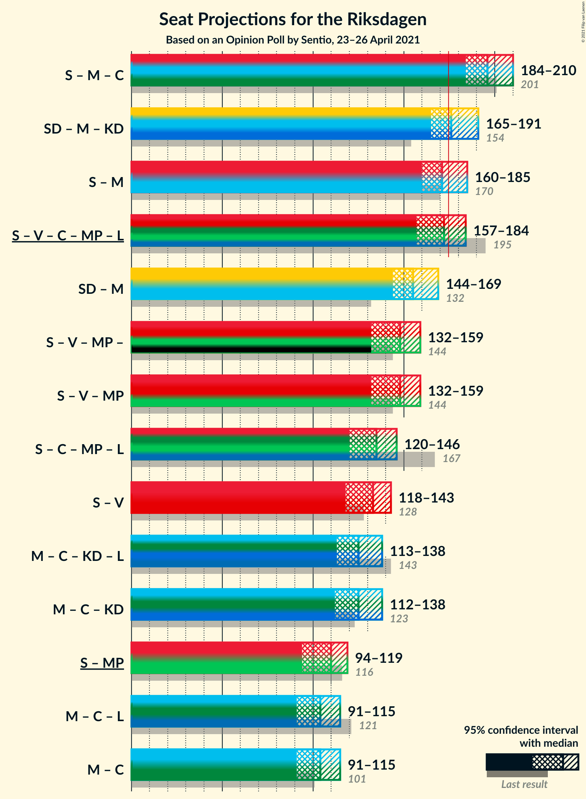

# Opinion Poll by Sentio, 23–26 April 2021

<a href="#voting-intentions">Voting Intentions</a> | <a href="#seats">Seats</a> | <a href="#coalitions">Coalitions</a> | <a href="#technical-information">Technical Information</a>

## Voting Intentions

### Confidence Intervals

| Party | Last Result | Poll Result | 80% Confidence Interval | 90% Confidence Interval | 95% Confidence Interval | 99% Confidence Interval |
|:-----:|:-----------:|:-----------:|:-----------------------:|:-----------------------:|:-----------------------:|:-----------------------:|
| Sveriges socialdemokratiska arbetareparti | 28.3% | 25.3% | 23.4–27.4% |22.9–28.0% |22.4–28.5% |21.5–29.5% |
| Sverigedemokraterna | 17.5% | 21.4% | 19.6–23.4% |19.1–23.9% |18.7–24.4% |17.9–25.4% |
| Moderata samlingspartiet | 19.8% | 21.2% | 19.4–23.1% |18.9–23.7% |18.5–24.2% |17.6–25.1% |
| Vänsterpartiet | 8.0% | 10.1% | 8.9–11.6% |8.5–12.1% |8.2–12.5% |7.7–13.2% |
| Centerpartiet | 8.6% | 6.7% | 5.7–8.0% |5.4–8.4% |5.2–8.7% |4.7–9.3% |
| Kristdemokraterna | 6.3% | 5.6% | 4.6–6.8% |4.4–7.1% |4.2–7.4% |3.8–8.0% |
| Miljöpartiet de gröna | 4.4% | 4.6% | 3.7–5.7% |3.5–6.0% |3.3–6.3% |3.0–6.8% |
| Liberalerna | 5.5% | 2.5% | 2.0–3.4% |1.8–3.7% |1.6–3.9% |1.4–4.4% |

*Note:* The poll result column reflects the actual value used in the calculations. Published results may vary slightly, and in addition be rounded to fewer digits.

## Seats

### Confidence Intervals

| Party | Last Result | Median | 80% Confidence Interval | 90% Confidence Interval | 95% Confidence Interval | 99% Confidence Interval |
|:-----:|:-----------:|:------:|:-----------------------:|:-----------------------:|:-----------------------:|:-----------------------:|
| <a href="#sveriges-socialdemokratiska-arbetareparti">Sveriges socialdemokratiska arbetareparti</a> | 100 | 95 | 86–100 |85–101 |83–105 |80–108 |
| <a href="#sverigedemokraterna">Sverigedemokraterna</a> | 62 | 78 | 74–85 |71–88 |69–89 |66–92 |
| <a href="#moderata-samlingspartiet">Moderata samlingspartiet</a> | 70 | 79 | 71–86 |69–87 |68–89 |65–93 |
| <a href="#vänsterpartiet">Vänsterpartiet</a> | 28 | 38 | 34–41 |32–44 |32–45 |29–49 |
| <a href="#centerpartiet">Centerpartiet</a> | 31 | 25 | 21–30 |20–31 |20–32 |18–34 |
| <a href="#kristdemokraterna">Kristdemokraterna</a> | 22 | 20 | 17–25 |17–26 |16–27 |0–29 |
| <a href="#miljöpartiet-de-gröna">Miljöpartiet de gröna</a> | 16 | 16 | 0–20 |0–21 |0–23 |0–25 |
| <a href="#liberalerna">Liberalerna</a> | 20 | 0 | 0 |0 |0 |0–16 |

### Sveriges socialdemokratiska arbetareparti

*For a full overview of the results for this party, see the [Sveriges socialdemokratiska arbetareparti](party-sverigessocialdemokratiskaarbetareparti.html) page.*

| Number of Seats | Probability | Accumulated | Special Marks |
|:---------------:|:-----------:|:-----------:|:-------------:|
| 75 | 0% | 100% |  |
| 76 | 0% | 99.9% |  |
| 77 | 0.2% | 99.9% |  |
| 78 | 0.1% | 99.7% |  |
| 79 | 0.1% | 99.6% |  |
| 80 | 0.4% | 99.6% |  |
| 81 | 0.9% | 99.2% |  |
| 82 | 0.3% | 98% |  |
| 83 | 0.7% | 98% |  |
| 84 | 1.1% | 97% |  |
| 85 | 3% | 96% |  |
| 86 | 3% | 93% |  |
| 87 | 1.3% | 90% |  |
| 88 | 1.2% | 88% |  |
| 89 | 7% | 87% |  |
| 90 | 5% | 80% |  |
| 91 | 4% | 75% |  |
| 92 | 2% | 71% |  |
| 93 | 2% | 69% |  |
| 94 | 7% | 68% |  |
| 95 | 35% | 61% | Median |
| 96 | 4% | 26% |  |
| 97 | 1.3% | 22% |  |
| 98 | 2% | 21% |  |
| 99 | 6% | 19% |  |
| 100 | 7% | 13% | Last Result |
| 101 | 1.0% | 6% |  |
| 102 | 0.8% | 5% |  |
| 103 | 0.5% | 4% |  |
| 104 | 1.1% | 4% |  |
| 105 | 2% | 3% |  |
| 106 | 0.1% | 0.8% |  |
| 107 | 0.2% | 0.8% |  |
| 108 | 0.2% | 0.6% |  |
| 109 | 0.2% | 0.4% |  |
| 110 | 0.1% | 0.2% |  |
| 111 | 0% | 0.2% |  |
| 112 | 0.1% | 0.1% |  |
| 113 | 0% | 0.1% |  |
| 114 | 0% | 0.1% |  |
| 115 | 0% | 0% |  |

### Sverigedemokraterna

*For a full overview of the results for this party, see the [Sverigedemokraterna](party-sverigedemokraterna.html) page.*

| Number of Seats | Probability | Accumulated | Special Marks |
|:---------------:|:-----------:|:-----------:|:-------------:|
| 62 | 0% | 100% | Last Result |
| 63 | 0.1% | 100% |  |
| 64 | 0.2% | 99.8% |  |
| 65 | 0.1% | 99.6% |  |
| 66 | 0.1% | 99.5% |  |
| 67 | 0.5% | 99.5% |  |
| 68 | 0.9% | 98.9% |  |
| 69 | 0.6% | 98% |  |
| 70 | 0.9% | 97% |  |
| 71 | 2% | 97% |  |
| 72 | 2% | 95% |  |
| 73 | 1.0% | 93% |  |
| 74 | 21% | 92% |  |
| 75 | 11% | 71% |  |
| 76 | 3% | 60% |  |
| 77 | 3% | 57% |  |
| 78 | 8% | 54% | Median |
| 79 | 6% | 47% |  |
| 80 | 4% | 41% |  |
| 81 | 5% | 37% |  |
| 82 | 4% | 32% |  |
| 83 | 15% | 28% |  |
| 84 | 2% | 13% |  |
| 85 | 3% | 11% |  |
| 86 | 3% | 8% |  |
| 87 | 0.3% | 5% |  |
| 88 | 2% | 5% |  |
| 89 | 2% | 3% |  |
| 90 | 0.9% | 2% |  |
| 91 | 0.1% | 0.9% |  |
| 92 | 0.2% | 0.7% |  |
| 93 | 0.1% | 0.5% |  |
| 94 | 0% | 0.4% |  |
| 95 | 0.1% | 0.3% |  |
| 96 | 0% | 0.2% |  |
| 97 | 0.1% | 0.2% |  |
| 98 | 0% | 0.1% |  |
| 99 | 0.1% | 0.1% |  |
| 100 | 0% | 0% |  |

### Moderata samlingspartiet

*For a full overview of the results for this party, see the [Moderata samlingspartiet](party-moderatasamlingspartiet.html) page.*

| Number of Seats | Probability | Accumulated | Special Marks |
|:---------------:|:-----------:|:-----------:|:-------------:|
| 61 | 0% | 100% |  |
| 62 | 0% | 99.9% |  |
| 63 | 0.1% | 99.9% |  |
| 64 | 0.2% | 99.8% |  |
| 65 | 0.8% | 99.6% |  |
| 66 | 0.6% | 98.8% |  |
| 67 | 0.6% | 98% |  |
| 68 | 1.0% | 98% |  |
| 69 | 2% | 97% |  |
| 70 | 1.2% | 95% | Last Result |
| 71 | 4% | 94% |  |
| 72 | 1.5% | 89% |  |
| 73 | 3% | 88% |  |
| 74 | 0.6% | 85% |  |
| 75 | 10% | 84% |  |
| 76 | 21% | 75% |  |
| 77 | 2% | 53% |  |
| 78 | 1.2% | 52% |  |
| 79 | 21% | 50% | Median |
| 80 | 4% | 30% |  |
| 81 | 3% | 26% |  |
| 82 | 4% | 22% |  |
| 83 | 4% | 18% |  |
| 84 | 2% | 15% |  |
| 85 | 3% | 13% |  |
| 86 | 3% | 10% |  |
| 87 | 3% | 7% |  |
| 88 | 0.9% | 4% |  |
| 89 | 2% | 3% |  |
| 90 | 0.4% | 1.3% |  |
| 91 | 0.1% | 0.9% |  |
| 92 | 0.1% | 0.7% |  |
| 93 | 0.2% | 0.6% |  |
| 94 | 0.1% | 0.4% |  |
| 95 | 0% | 0.3% |  |
| 96 | 0.1% | 0.3% |  |
| 97 | 0.1% | 0.2% |  |
| 98 | 0.1% | 0.1% |  |
| 99 | 0% | 0% |  |

### Vänsterpartiet

*For a full overview of the results for this party, see the [Vänsterpartiet](party-vänsterpartiet.html) page.*

| Number of Seats | Probability | Accumulated | Special Marks |
|:---------------:|:-----------:|:-----------:|:-------------:|
| 26 | 0% | 100% |  |
| 27 | 0.2% | 99.9% |  |
| 28 | 0.1% | 99.7% | Last Result |
| 29 | 0.7% | 99.6% |  |
| 30 | 0.5% | 98.9% |  |
| 31 | 0.6% | 98% |  |
| 32 | 4% | 98% |  |
| 33 | 3% | 93% |  |
| 34 | 3% | 90% |  |
| 35 | 5% | 87% |  |
| 36 | 12% | 82% |  |
| 37 | 4% | 70% |  |
| 38 | 21% | 66% | Median |
| 39 | 27% | 45% |  |
| 40 | 2% | 18% |  |
| 41 | 8% | 16% |  |
| 42 | 1.5% | 8% |  |
| 43 | 0.6% | 6% |  |
| 44 | 1.3% | 6% |  |
| 45 | 3% | 4% |  |
| 46 | 0.5% | 2% |  |
| 47 | 0.5% | 1.3% |  |
| 48 | 0.1% | 0.8% |  |
| 49 | 0.4% | 0.6% |  |
| 50 | 0% | 0.2% |  |
| 51 | 0.1% | 0.2% |  |
| 52 | 0% | 0.1% |  |
| 53 | 0% | 0.1% |  |
| 54 | 0% | 0% |  |

### Centerpartiet

*For a full overview of the results for this party, see the [Centerpartiet](party-centerpartiet.html) page.*

| Number of Seats | Probability | Accumulated | Special Marks |
|:---------------:|:-----------:|:-----------:|:-------------:|
| 16 | 0.1% | 100% |  |
| 17 | 0.3% | 99.9% |  |
| 18 | 1.2% | 99.5% |  |
| 19 | 0.7% | 98% |  |
| 20 | 8% | 98% |  |
| 21 | 5% | 90% |  |
| 22 | 9% | 85% |  |
| 23 | 4% | 77% |  |
| 24 | 22% | 72% |  |
| 25 | 3% | 50% | Median |
| 26 | 26% | 47% |  |
| 27 | 4% | 21% |  |
| 28 | 3% | 17% |  |
| 29 | 4% | 15% |  |
| 30 | 6% | 11% |  |
| 31 | 1.0% | 5% | Last Result |
| 32 | 3% | 4% |  |
| 33 | 0.4% | 1.2% |  |
| 34 | 0.3% | 0.8% |  |
| 35 | 0.1% | 0.4% |  |
| 36 | 0.3% | 0.4% |  |
| 37 | 0% | 0.1% |  |
| 38 | 0% | 0% |  |

### Kristdemokraterna

*For a full overview of the results for this party, see the [Kristdemokraterna](party-kristdemokraterna.html) page.*

| Number of Seats | Probability | Accumulated | Special Marks |
|:---------------:|:-----------:|:-----------:|:-------------:|
| 0 | 1.2% | 100% |  |
| 1 | 0% | 98.8% |  |
| 2 | 0% | 98.8% |  |
| 3 | 0% | 98.8% |  |
| 4 | 0% | 98.8% |  |
| 5 | 0% | 98.8% |  |
| 6 | 0% | 98.8% |  |
| 7 | 0% | 98.8% |  |
| 8 | 0% | 98.8% |  |
| 9 | 0% | 98.8% |  |
| 10 | 0% | 98.8% |  |
| 11 | 0% | 98.8% |  |
| 12 | 0% | 98.8% |  |
| 13 | 0% | 98.8% |  |
| 14 | 0.1% | 98.8% |  |
| 15 | 0.7% | 98.8% |  |
| 16 | 2% | 98% |  |
| 17 | 8% | 96% |  |
| 18 | 18% | 88% |  |
| 19 | 7% | 70% |  |
| 20 | 21% | 62% | Median |
| 21 | 8% | 42% |  |
| 22 | 14% | 34% | Last Result |
| 23 | 2% | 20% |  |
| 24 | 5% | 19% |  |
| 25 | 7% | 13% |  |
| 26 | 2% | 6% |  |
| 27 | 2% | 5% |  |
| 28 | 2% | 2% |  |
| 29 | 0.3% | 0.7% |  |
| 30 | 0.2% | 0.4% |  |
| 31 | 0.1% | 0.2% |  |
| 32 | 0.1% | 0.1% |  |
| 33 | 0% | 0% |  |

### Miljöpartiet de gröna

*For a full overview of the results for this party, see the [Miljöpartiet de gröna](party-miljöpartietdegröna.html) page.*

| Number of Seats | Probability | Accumulated | Special Marks |
|:---------------:|:-----------:|:-----------:|:-------------:|
| 0 | 14% | 100% |  |
| 1 | 0% | 86% |  |
| 2 | 0% | 86% |  |
| 3 | 0% | 86% |  |
| 4 | 0% | 86% |  |
| 5 | 0% | 86% |  |
| 6 | 0% | 86% |  |
| 7 | 0% | 86% |  |
| 8 | 0% | 86% |  |
| 9 | 0% | 86% |  |
| 10 | 0% | 86% |  |
| 11 | 0% | 86% |  |
| 12 | 0% | 86% |  |
| 13 | 0% | 86% |  |
| 14 | 0% | 86% |  |
| 15 | 23% | 86% |  |
| 16 | 24% | 63% | Last Result, Median |
| 17 | 3% | 39% |  |
| 18 | 8% | 35% |  |
| 19 | 10% | 27% |  |
| 20 | 11% | 18% |  |
| 21 | 3% | 6% |  |
| 22 | 0.9% | 4% |  |
| 23 | 1.2% | 3% |  |
| 24 | 1.1% | 2% |  |
| 25 | 0.4% | 0.5% |  |
| 26 | 0.1% | 0.2% |  |
| 27 | 0.1% | 0.1% |  |
| 28 | 0% | 0% |  |

### Liberalerna

*For a full overview of the results for this party, see the [Liberalerna](party-liberalerna.html) page.*

| Number of Seats | Probability | Accumulated | Special Marks |
|:---------------:|:-----------:|:-----------:|:-------------:|
| 0 | 98% | 100% | Median |
| 1 | 0% | 2% |  |
| 2 | 0% | 2% |  |
| 3 | 0% | 2% |  |
| 4 | 0% | 2% |  |
| 5 | 0% | 2% |  |
| 6 | 0% | 2% |  |
| 7 | 0% | 2% |  |
| 8 | 0% | 2% |  |
| 9 | 0% | 2% |  |
| 10 | 0% | 2% |  |
| 11 | 0% | 2% |  |
| 12 | 0% | 2% |  |
| 13 | 0% | 2% |  |
| 14 | 0.6% | 2% |  |
| 15 | 0.3% | 0.9% |  |
| 16 | 0.4% | 0.6% |  |
| 17 | 0.1% | 0.2% |  |
| 18 | 0.1% | 0.1% |  |
| 19 | 0% | 0% |  |
| 20 | 0% | 0% | Last Result |

## Coalitions

### Confidence Intervals

| Coalition | Last Result | Median | Majority? | 80% Confidence Interval | 90% Confidence Interval | 95% Confidence Interval | 99% Confidence Interval |
|:---------:|:-----------:|:------:|:---------:|:-----------------------:|:-----------------------:|:-----------------------:|:-----------------------:|
| Sveriges socialdemokratiska arbetareparti – Moderata samlingspartiet – Centerpartiet | 201 | 196 | 99.9% | 190–206 | 188–209 | 184–210 | 179–215 |
| Sverigedemokraterna – Moderata samlingspartiet – Kristdemokraterna | 154 | 176 | 57% | 170–187 | 169–189 | 165–191 | 159–197 |
| Sveriges socialdemokratiska arbetareparti – Moderata samlingspartiet | 170 | 171 | 23% | 165–180 | 162–182 | 160–185 | 153–189 |
| Sveriges socialdemokratiska arbetareparti – Vänsterpartiet – Centerpartiet – Miljöpartiet de gröna – Liberalerna | 195 | 172 | 42% | 162–179 | 160–180 | 157–184 | 150–190 |
| Sverigedemokraterna – Moderata samlingspartiet | 132 | 155 | 0.8% | 150–166 | 147–168 | 144–169 | 139–175 |
| Sveriges socialdemokratiska arbetareparti – Vänsterpartiet – Miljöpartiet de gröna | 144 | 148 | 0% | 136–155 | 136–157 | 132–159 | 124–164 |
| Sveriges socialdemokratiska arbetareparti – Centerpartiet – Miljöpartiet de gröna – Liberalerna | 167 | 135 | 0% | 125–141 | 121–144 | 120–146 | 111–150 |
| Sveriges socialdemokratiska arbetareparti – Vänsterpartiet | 128 | 133 | 0% | 123–138 | 120–141 | 118–143 | 115–147 |
| Moderata samlingspartiet – Centerpartiet – Kristdemokraterna – Liberalerna | 143 | 125 | 0% | 116–132 | 113–135 | 113–138 | 106–142 |
| Moderata samlingspartiet – Centerpartiet – Kristdemokraterna | 123 | 125 | 0% | 116–132 | 113–135 | 112–138 | 106–141 |
| Sveriges socialdemokratiska arbetareparti – Miljöpartiet de gröna | 116 | 110 | 0% | 100–115 | 95–118 | 94–119 | 85–125 |
| Moderata samlingspartiet – Centerpartiet – Liberalerna | 121 | 104 | 0% | 98–112 | 91–113 | 91–115 | 89–121 |
| Moderata samlingspartiet – Centerpartiet | 101 | 104 | 0% | 97–112 | 91–113 | 91–115 | 88–119 |

### Sveriges socialdemokratiska arbetareparti – Moderata samlingspartiet – Centerpartiet

| Number of Seats | Probability | Accumulated | Special Marks |
|:---------------:|:-----------:|:-----------:|:-------------:|
| 173 | 0% | 100% |  |
| 174 | 0% | 99.9% |  |
| 175 | 0.1% | 99.9% | Majority |
| 176 | 0% | 99.8% |  |
| 177 | 0.1% | 99.8% |  |
| 178 | 0.2% | 99.7% |  |
| 179 | 0.2% | 99.5% |  |
| 180 | 0.4% | 99.3% |  |
| 181 | 0.5% | 98.9% |  |
| 182 | 0.2% | 98% |  |
| 183 | 0.4% | 98% |  |
| 184 | 0.6% | 98% |  |
| 185 | 0.7% | 97% |  |
| 186 | 0.7% | 97% |  |
| 187 | 0.7% | 96% |  |
| 188 | 0.4% | 95% |  |
| 189 | 2% | 95% |  |
| 190 | 7% | 92% |  |
| 191 | 2% | 85% |  |
| 192 | 2% | 83% |  |
| 193 | 7% | 82% |  |
| 194 | 4% | 75% |  |
| 195 | 20% | 71% |  |
| 196 | 3% | 51% |  |
| 197 | 2% | 48% |  |
| 198 | 7% | 46% |  |
| 199 | 2% | 39% | Median |
| 200 | 19% | 37% |  |
| 201 | 4% | 18% | Last Result |
| 202 | 0.2% | 14% |  |
| 203 | 0.3% | 14% |  |
| 204 | 2% | 13% |  |
| 205 | 0.8% | 11% |  |
| 206 | 0.6% | 10% |  |
| 207 | 0.9% | 10% |  |
| 208 | 4% | 9% |  |
| 209 | 1.0% | 5% |  |
| 210 | 2% | 4% |  |
| 211 | 0.6% | 2% |  |
| 212 | 0.6% | 2% |  |
| 213 | 0.2% | 1.2% |  |
| 214 | 0.5% | 1.1% |  |
| 215 | 0.3% | 0.5% |  |
| 216 | 0% | 0.3% |  |
| 217 | 0% | 0.2% |  |
| 218 | 0% | 0.2% |  |
| 219 | 0% | 0.2% |  |
| 220 | 0% | 0.2% |  |
| 221 | 0% | 0.1% |  |
| 222 | 0% | 0.1% |  |
| 223 | 0% | 0% |  |

### Sverigedemokraterna – Moderata samlingspartiet – Kristdemokraterna

| Number of Seats | Probability | Accumulated | Special Marks |
|:---------------:|:-----------:|:-----------:|:-------------:|
| 153 | 0% | 100% |  |
| 154 | 0% | 99.9% | Last Result |
| 155 | 0% | 99.9% |  |
| 156 | 0.1% | 99.9% |  |
| 157 | 0.2% | 99.8% |  |
| 158 | 0.1% | 99.6% |  |
| 159 | 0.2% | 99.6% |  |
| 160 | 0.1% | 99.3% |  |
| 161 | 0.2% | 99.3% |  |
| 162 | 0.6% | 99.1% |  |
| 163 | 0.6% | 98% |  |
| 164 | 0.2% | 98% |  |
| 165 | 1.1% | 98% |  |
| 166 | 0.3% | 97% |  |
| 167 | 0.8% | 96% |  |
| 168 | 0.1% | 96% |  |
| 169 | 4% | 95% |  |
| 170 | 6% | 92% |  |
| 171 | 0.7% | 86% |  |
| 172 | 5% | 85% |  |
| 173 | 20% | 80% |  |
| 174 | 3% | 60% |  |
| 175 | 2% | 57% | Majority |
| 176 | 5% | 55% |  |
| 177 | 18% | 50% | Median |
| 178 | 1.2% | 32% |  |
| 179 | 0.9% | 31% |  |
| 180 | 1.3% | 30% |  |
| 181 | 5% | 28% |  |
| 182 | 0.8% | 23% |  |
| 183 | 4% | 22% |  |
| 184 | 3% | 19% |  |
| 185 | 3% | 16% |  |
| 186 | 1.3% | 13% |  |
| 187 | 4% | 12% |  |
| 188 | 2% | 8% |  |
| 189 | 2% | 6% |  |
| 190 | 1.5% | 4% |  |
| 191 | 0.5% | 3% |  |
| 192 | 0.6% | 2% |  |
| 193 | 0.5% | 2% |  |
| 194 | 0.2% | 1.2% |  |
| 195 | 0.1% | 1.0% |  |
| 196 | 0.3% | 0.9% |  |
| 197 | 0.1% | 0.5% |  |
| 198 | 0.1% | 0.4% |  |
| 199 | 0.1% | 0.4% |  |
| 200 | 0.1% | 0.2% |  |
| 201 | 0.1% | 0.2% |  |
| 202 | 0% | 0.1% |  |
| 203 | 0% | 0.1% |  |
| 204 | 0% | 0.1% |  |
| 205 | 0% | 0% |  |

### Sveriges socialdemokratiska arbetareparti – Moderata samlingspartiet

| Number of Seats | Probability | Accumulated | Special Marks |
|:---------------:|:-----------:|:-----------:|:-------------:|
| 148 | 0% | 100% |  |
| 149 | 0% | 99.9% |  |
| 150 | 0% | 99.9% |  |
| 151 | 0.1% | 99.9% |  |
| 152 | 0.1% | 99.8% |  |
| 153 | 0.2% | 99.7% |  |
| 154 | 0.2% | 99.5% |  |
| 155 | 0.3% | 99.3% |  |
| 156 | 0.1% | 99.0% |  |
| 157 | 0.4% | 98.8% |  |
| 158 | 0.2% | 98% |  |
| 159 | 0.6% | 98% |  |
| 160 | 1.0% | 98% |  |
| 161 | 1.0% | 97% |  |
| 162 | 1.1% | 96% |  |
| 163 | 1.3% | 95% |  |
| 164 | 0.9% | 93% |  |
| 165 | 3% | 92% |  |
| 166 | 4% | 89% |  |
| 167 | 2% | 85% |  |
| 168 | 4% | 83% |  |
| 169 | 11% | 79% |  |
| 170 | 5% | 68% | Last Result |
| 171 | 16% | 63% |  |
| 172 | 0.7% | 47% |  |
| 173 | 0.9% | 46% |  |
| 174 | 23% | 45% | Median |
| 175 | 0.3% | 23% | Majority |
| 176 | 7% | 23% |  |
| 177 | 2% | 16% |  |
| 178 | 1.1% | 14% |  |
| 179 | 1.4% | 13% |  |
| 180 | 3% | 12% |  |
| 181 | 2% | 9% |  |
| 182 | 2% | 7% |  |
| 183 | 2% | 5% |  |
| 184 | 0.4% | 3% |  |
| 185 | 0.8% | 3% |  |
| 186 | 0.5% | 2% |  |
| 187 | 0.8% | 2% |  |
| 188 | 0.4% | 0.9% |  |
| 189 | 0.2% | 0.5% |  |
| 190 | 0% | 0.3% |  |
| 191 | 0% | 0.3% |  |
| 192 | 0% | 0.2% |  |
| 193 | 0% | 0.2% |  |
| 194 | 0.1% | 0.2% |  |
| 195 | 0% | 0.1% |  |
| 196 | 0% | 0.1% |  |
| 197 | 0% | 0% |  |

### Sveriges socialdemokratiska arbetareparti – Vänsterpartiet – Centerpartiet – Miljöpartiet de gröna – Liberalerna

| Number of Seats | Probability | Accumulated | Special Marks |
|:---------------:|:-----------:|:-----------:|:-------------:|
| 145 | 0% | 100% |  |
| 146 | 0% | 99.9% |  |
| 147 | 0% | 99.9% |  |
| 148 | 0.1% | 99.9% |  |
| 149 | 0.1% | 99.8% |  |
| 150 | 0.3% | 99.7% |  |
| 151 | 0.1% | 99.4% |  |
| 152 | 0.1% | 99.3% |  |
| 153 | 0.3% | 99.2% |  |
| 154 | 0.2% | 98.9% |  |
| 155 | 0.2% | 98.8% |  |
| 156 | 0.5% | 98.5% |  |
| 157 | 0.6% | 98% |  |
| 158 | 0.5% | 97% |  |
| 159 | 2% | 97% |  |
| 160 | 2% | 95% |  |
| 161 | 2% | 94% |  |
| 162 | 4% | 91% |  |
| 163 | 1.4% | 88% |  |
| 164 | 3% | 86% |  |
| 165 | 3% | 83% |  |
| 166 | 4% | 81% |  |
| 167 | 0.8% | 77% |  |
| 168 | 5% | 76% |  |
| 169 | 1.3% | 71% |  |
| 170 | 0.9% | 70% |  |
| 171 | 1.2% | 69% |  |
| 172 | 18% | 68% |  |
| 173 | 5% | 49% |  |
| 174 | 2% | 44% | Median |
| 175 | 3% | 42% | Majority |
| 176 | 20% | 40% |  |
| 177 | 5% | 20% |  |
| 178 | 0.7% | 15% |  |
| 179 | 6% | 14% |  |
| 180 | 4% | 8% |  |
| 181 | 0.1% | 4% |  |
| 182 | 0.7% | 4% |  |
| 183 | 0.3% | 3% |  |
| 184 | 1.1% | 3% |  |
| 185 | 0.1% | 2% |  |
| 186 | 0.5% | 2% |  |
| 187 | 0.6% | 1.3% |  |
| 188 | 0.1% | 0.7% |  |
| 189 | 0.1% | 0.6% |  |
| 190 | 0.2% | 0.5% |  |
| 191 | 0.1% | 0.3% |  |
| 192 | 0.2% | 0.3% |  |
| 193 | 0% | 0.1% |  |
| 194 | 0% | 0.1% |  |
| 195 | 0% | 0.1% | Last Result |
| 196 | 0% | 0% |  |

### Sverigedemokraterna – Moderata samlingspartiet

| Number of Seats | Probability | Accumulated | Special Marks |
|:---------------:|:-----------:|:-----------:|:-------------:|
| 132 | 0% | 100% | Last Result |
| 133 | 0% | 100% |  |
| 134 | 0% | 100% |  |
| 135 | 0.1% | 100% |  |
| 136 | 0.1% | 99.9% |  |
| 137 | 0.1% | 99.8% |  |
| 138 | 0.1% | 99.7% |  |
| 139 | 0.1% | 99.6% |  |
| 140 | 0.3% | 99.5% |  |
| 141 | 0.2% | 99.2% |  |
| 142 | 0.3% | 99.0% |  |
| 143 | 0.5% | 98.7% |  |
| 144 | 1.0% | 98% |  |
| 145 | 0.5% | 97% |  |
| 146 | 0.8% | 97% |  |
| 147 | 1.2% | 96% |  |
| 148 | 0.4% | 95% |  |
| 149 | 0.7% | 94% |  |
| 150 | 7% | 93% |  |
| 151 | 6% | 87% |  |
| 152 | 1.4% | 80% |  |
| 153 | 25% | 79% |  |
| 154 | 1.3% | 54% |  |
| 155 | 5% | 52% |  |
| 156 | 3% | 47% |  |
| 157 | 1.2% | 44% | Median |
| 158 | 0.9% | 43% |  |
| 159 | 16% | 42% |  |
| 160 | 3% | 26% |  |
| 161 | 1.4% | 23% |  |
| 162 | 4% | 22% |  |
| 163 | 2% | 18% |  |
| 164 | 3% | 17% |  |
| 165 | 2% | 14% |  |
| 166 | 3% | 11% |  |
| 167 | 0.3% | 8% |  |
| 168 | 3% | 8% |  |
| 169 | 3% | 5% |  |
| 170 | 0.5% | 2% |  |
| 171 | 0.1% | 1.5% |  |
| 172 | 0.2% | 1.4% |  |
| 173 | 0.1% | 1.1% |  |
| 174 | 0.2% | 1.0% |  |
| 175 | 0.3% | 0.8% | Majority |
| 176 | 0% | 0.5% |  |
| 177 | 0.2% | 0.5% |  |
| 178 | 0% | 0.2% |  |
| 179 | 0% | 0.2% |  |
| 180 | 0.1% | 0.2% |  |
| 181 | 0.1% | 0.1% |  |
| 182 | 0% | 0.1% |  |
| 183 | 0% | 0% |  |

### Sveriges socialdemokratiska arbetareparti – Vänsterpartiet – Miljöpartiet de gröna

| Number of Seats | Probability | Accumulated | Special Marks |
|:---------------:|:-----------:|:-----------:|:-------------:|
| 119 | 0% | 100% |  |
| 120 | 0.2% | 99.9% |  |
| 121 | 0% | 99.7% |  |
| 122 | 0% | 99.7% |  |
| 123 | 0.1% | 99.7% |  |
| 124 | 0.1% | 99.6% |  |
| 125 | 0.1% | 99.5% |  |
| 126 | 0% | 99.4% |  |
| 127 | 0.3% | 99.3% |  |
| 128 | 0.2% | 99.0% |  |
| 129 | 0.3% | 98.8% |  |
| 130 | 0.4% | 98.5% |  |
| 131 | 0.3% | 98% |  |
| 132 | 0.7% | 98% |  |
| 133 | 0.6% | 97% |  |
| 134 | 0.7% | 97% |  |
| 135 | 0.6% | 96% |  |
| 136 | 5% | 95% |  |
| 137 | 0.7% | 90% |  |
| 138 | 4% | 89% |  |
| 139 | 2% | 86% |  |
| 140 | 3% | 83% |  |
| 141 | 4% | 81% |  |
| 142 | 3% | 77% |  |
| 143 | 2% | 74% |  |
| 144 | 1.4% | 72% | Last Result |
| 145 | 2% | 71% |  |
| 146 | 8% | 68% |  |
| 147 | 2% | 60% |  |
| 148 | 16% | 58% |  |
| 149 | 0.5% | 43% | Median |
| 150 | 20% | 42% |  |
| 151 | 6% | 22% |  |
| 152 | 1.1% | 16% |  |
| 153 | 0.7% | 15% |  |
| 154 | 0.6% | 14% |  |
| 155 | 6% | 13% |  |
| 156 | 0.6% | 7% |  |
| 157 | 4% | 7% |  |
| 158 | 0.2% | 3% |  |
| 159 | 1.4% | 3% |  |
| 160 | 0.3% | 1.2% |  |
| 161 | 0% | 0.9% |  |
| 162 | 0.2% | 0.9% |  |
| 163 | 0.1% | 0.7% |  |
| 164 | 0.2% | 0.6% |  |
| 165 | 0.1% | 0.4% |  |
| 166 | 0.1% | 0.2% |  |
| 167 | 0% | 0.1% |  |
| 168 | 0.1% | 0.1% |  |
| 169 | 0% | 0% |  |

### Sveriges socialdemokratiska arbetareparti – Centerpartiet – Miljöpartiet de gröna – Liberalerna

| Number of Seats | Probability | Accumulated | Special Marks |
|:---------------:|:-----------:|:-----------:|:-------------:|
| 105 | 0% | 100% |  |
| 106 | 0% | 99.9% |  |
| 107 | 0% | 99.9% |  |
| 108 | 0% | 99.9% |  |
| 109 | 0% | 99.9% |  |
| 110 | 0% | 99.9% |  |
| 111 | 0.6% | 99.9% |  |
| 112 | 0.1% | 99.3% |  |
| 113 | 0% | 99.2% |  |
| 114 | 0.2% | 99.2% |  |
| 115 | 0.2% | 99.0% |  |
| 116 | 0.3% | 98.8% |  |
| 117 | 0.3% | 98.5% |  |
| 118 | 0.2% | 98% |  |
| 119 | 0.4% | 98% |  |
| 120 | 0.7% | 98% |  |
| 121 | 4% | 97% |  |
| 122 | 0.6% | 93% |  |
| 123 | 1.4% | 93% |  |
| 124 | 0.3% | 91% |  |
| 125 | 4% | 91% |  |
| 126 | 3% | 88% |  |
| 127 | 1.5% | 85% |  |
| 128 | 4% | 83% |  |
| 129 | 3% | 79% |  |
| 130 | 1.3% | 76% |  |
| 131 | 1.0% | 74% |  |
| 132 | 2% | 73% |  |
| 133 | 4% | 71% |  |
| 134 | 16% | 67% |  |
| 135 | 2% | 51% |  |
| 136 | 1.1% | 49% | Median |
| 137 | 24% | 48% |  |
| 138 | 10% | 24% |  |
| 139 | 0.2% | 14% |  |
| 140 | 4% | 14% |  |
| 141 | 1.4% | 10% |  |
| 142 | 0.9% | 9% |  |
| 143 | 2% | 8% |  |
| 144 | 2% | 5% |  |
| 145 | 0.7% | 4% |  |
| 146 | 0.8% | 3% |  |
| 147 | 0.7% | 2% |  |
| 148 | 0.1% | 2% |  |
| 149 | 0.1% | 1.4% |  |
| 150 | 0.9% | 1.3% |  |
| 151 | 0.1% | 0.4% |  |
| 152 | 0% | 0.3% |  |
| 153 | 0.1% | 0.3% |  |
| 154 | 0% | 0.2% |  |
| 155 | 0% | 0.2% |  |
| 156 | 0.1% | 0.2% |  |
| 157 | 0% | 0.1% |  |
| 158 | 0% | 0.1% |  |
| 159 | 0% | 0% |  |
| 160 | 0% | 0% |  |
| 161 | 0% | 0% |  |
| 162 | 0% | 0% |  |
| 163 | 0% | 0% |  |
| 164 | 0% | 0% |  |
| 165 | 0% | 0% |  |
| 166 | 0% | 0% |  |
| 167 | 0% | 0% | Last Result |

### Sveriges socialdemokratiska arbetareparti – Vänsterpartiet

| Number of Seats | Probability | Accumulated | Special Marks |
|:---------------:|:-----------:|:-----------:|:-------------:|
| 111 | 0% | 100% |  |
| 112 | 0% | 99.9% |  |
| 113 | 0.1% | 99.9% |  |
| 114 | 0.1% | 99.8% |  |
| 115 | 0.4% | 99.7% |  |
| 116 | 0.6% | 99.3% |  |
| 117 | 0.6% | 98.6% |  |
| 118 | 2% | 98% |  |
| 119 | 0.3% | 96% |  |
| 120 | 0.6% | 95% |  |
| 121 | 2% | 95% |  |
| 122 | 1.4% | 93% |  |
| 123 | 2% | 92% |  |
| 124 | 3% | 89% |  |
| 125 | 2% | 87% |  |
| 126 | 4% | 85% |  |
| 127 | 5% | 80% |  |
| 128 | 4% | 75% | Last Result |
| 129 | 0.9% | 71% |  |
| 130 | 3% | 70% |  |
| 131 | 1.2% | 67% |  |
| 132 | 2% | 66% |  |
| 133 | 14% | 64% | Median |
| 134 | 19% | 50% |  |
| 135 | 7% | 30% |  |
| 136 | 9% | 24% |  |
| 137 | 1.2% | 14% |  |
| 138 | 5% | 13% |  |
| 139 | 1.5% | 8% |  |
| 140 | 0.6% | 6% |  |
| 141 | 1.1% | 5% |  |
| 142 | 0.7% | 4% |  |
| 143 | 1.2% | 4% |  |
| 144 | 0.4% | 2% |  |
| 145 | 0.3% | 2% |  |
| 146 | 1.1% | 2% |  |
| 147 | 0.3% | 0.7% |  |
| 148 | 0.1% | 0.4% |  |
| 149 | 0% | 0.3% |  |
| 150 | 0% | 0.3% |  |
| 151 | 0.1% | 0.3% |  |
| 152 | 0% | 0.2% |  |
| 153 | 0% | 0.1% |  |
| 154 | 0% | 0.1% |  |
| 155 | 0% | 0.1% |  |
| 156 | 0% | 0.1% |  |
| 157 | 0% | 0% |  |

### Moderata samlingspartiet – Centerpartiet – Kristdemokraterna – Liberalerna

| Number of Seats | Probability | Accumulated | Special Marks |
|:---------------:|:-----------:|:-----------:|:-------------:|
| 101 | 0.2% | 100% |  |
| 102 | 0% | 99.8% |  |
| 103 | 0% | 99.8% |  |
| 104 | 0.1% | 99.7% |  |
| 105 | 0% | 99.7% |  |
| 106 | 0.2% | 99.7% |  |
| 107 | 0.1% | 99.4% |  |
| 108 | 0.3% | 99.4% |  |
| 109 | 0.2% | 99.1% |  |
| 110 | 0.5% | 98.9% |  |
| 111 | 0.5% | 98% |  |
| 112 | 0.2% | 98% |  |
| 113 | 4% | 98% |  |
| 114 | 0.4% | 94% |  |
| 115 | 0.5% | 93% |  |
| 116 | 6% | 93% |  |
| 117 | 0.5% | 86% |  |
| 118 | 17% | 86% |  |
| 119 | 0.9% | 69% |  |
| 120 | 2% | 68% |  |
| 121 | 2% | 66% |  |
| 122 | 2% | 64% |  |
| 123 | 8% | 62% |  |
| 124 | 1.1% | 54% | Median |
| 125 | 22% | 53% |  |
| 126 | 2% | 31% |  |
| 127 | 3% | 29% |  |
| 128 | 7% | 25% |  |
| 129 | 1.4% | 19% |  |
| 130 | 2% | 17% |  |
| 131 | 4% | 16% |  |
| 132 | 3% | 11% |  |
| 133 | 1.2% | 9% |  |
| 134 | 2% | 7% |  |
| 135 | 1.4% | 6% |  |
| 136 | 0.6% | 4% |  |
| 137 | 0.6% | 4% |  |
| 138 | 0.5% | 3% |  |
| 139 | 1.5% | 2% |  |
| 140 | 0.2% | 1.0% |  |
| 141 | 0.2% | 0.8% |  |
| 142 | 0.2% | 0.6% |  |
| 143 | 0.1% | 0.4% | Last Result |
| 144 | 0.1% | 0.3% |  |
| 145 | 0.1% | 0.2% |  |
| 146 | 0% | 0.1% |  |
| 147 | 0% | 0.1% |  |
| 148 | 0% | 0.1% |  |
| 149 | 0% | 0.1% |  |
| 150 | 0% | 0% |  |

### Moderata samlingspartiet – Centerpartiet – Kristdemokraterna

| Number of Seats | Probability | Accumulated | Special Marks |
|:---------------:|:-----------:|:-----------:|:-------------:|
| 101 | 0.2% | 100% |  |
| 102 | 0% | 99.8% |  |
| 103 | 0% | 99.8% |  |
| 104 | 0.1% | 99.7% |  |
| 105 | 0% | 99.7% |  |
| 106 | 0.2% | 99.6% |  |
| 107 | 0.1% | 99.4% |  |
| 108 | 0.5% | 99.3% |  |
| 109 | 0.2% | 98.8% |  |
| 110 | 0.5% | 98.5% |  |
| 111 | 0.5% | 98% |  |
| 112 | 0.2% | 98% |  |
| 113 | 5% | 97% |  |
| 114 | 0.4% | 93% |  |
| 115 | 0.6% | 92% |  |
| 116 | 6% | 92% |  |
| 117 | 0.7% | 86% |  |
| 118 | 17% | 85% |  |
| 119 | 0.9% | 68% |  |
| 120 | 2% | 67% |  |
| 121 | 2% | 65% |  |
| 122 | 2% | 63% |  |
| 123 | 8% | 61% | Last Result |
| 124 | 0.9% | 53% | Median |
| 125 | 22% | 52% |  |
| 126 | 2% | 30% |  |
| 127 | 3% | 28% |  |
| 128 | 7% | 25% |  |
| 129 | 1.3% | 18% |  |
| 130 | 2% | 17% |  |
| 131 | 4% | 15% |  |
| 132 | 3% | 11% |  |
| 133 | 1.2% | 8% |  |
| 134 | 2% | 7% |  |
| 135 | 1.4% | 5% |  |
| 136 | 0.6% | 4% |  |
| 137 | 0.5% | 3% |  |
| 138 | 0.5% | 3% |  |
| 139 | 1.5% | 2% |  |
| 140 | 0.1% | 0.8% |  |
| 141 | 0.2% | 0.7% |  |
| 142 | 0.1% | 0.5% |  |
| 143 | 0.1% | 0.3% |  |
| 144 | 0.1% | 0.2% |  |
| 145 | 0.1% | 0.2% |  |
| 146 | 0% | 0.1% |  |
| 147 | 0% | 0.1% |  |
| 148 | 0% | 0.1% |  |
| 149 | 0% | 0.1% |  |
| 150 | 0% | 0% |  |

### Sveriges socialdemokratiska arbetareparti – Miljöpartiet de gröna

| Number of Seats | Probability | Accumulated | Special Marks |
|:---------------:|:-----------:|:-----------:|:-------------:|
| 81 | 0% | 100% |  |
| 82 | 0% | 99.9% |  |
| 83 | 0% | 99.9% |  |
| 84 | 0.1% | 99.9% |  |
| 85 | 0.4% | 99.8% |  |
| 86 | 0% | 99.4% |  |
| 87 | 0.3% | 99.3% |  |
| 88 | 0.1% | 99.0% |  |
| 89 | 0.6% | 99.0% |  |
| 90 | 0.3% | 98% |  |
| 91 | 0.1% | 98% |  |
| 92 | 0.2% | 98% |  |
| 93 | 0.1% | 98% |  |
| 94 | 0.8% | 98% |  |
| 95 | 2% | 97% |  |
| 96 | 0.5% | 95% |  |
| 97 | 0.6% | 94% |  |
| 98 | 2% | 94% |  |
| 99 | 2% | 92% |  |
| 100 | 2% | 90% |  |
| 101 | 2% | 88% |  |
| 102 | 1.5% | 86% |  |
| 103 | 2% | 84% |  |
| 104 | 1.2% | 82% |  |
| 105 | 5% | 81% |  |
| 106 | 4% | 76% |  |
| 107 | 2% | 73% |  |
| 108 | 4% | 71% |  |
| 109 | 4% | 67% |  |
| 110 | 14% | 62% |  |
| 111 | 24% | 48% | Median |
| 112 | 0.3% | 24% |  |
| 113 | 1.1% | 23% |  |
| 114 | 8% | 22% |  |
| 115 | 6% | 14% |  |
| 116 | 0.5% | 8% | Last Result |
| 117 | 0.2% | 7% |  |
| 118 | 4% | 7% |  |
| 119 | 1.1% | 3% |  |
| 120 | 0.3% | 2% |  |
| 121 | 0.1% | 1.3% |  |
| 122 | 0.3% | 1.2% |  |
| 123 | 0.3% | 1.0% |  |
| 124 | 0% | 0.6% |  |
| 125 | 0.3% | 0.6% |  |
| 126 | 0.1% | 0.3% |  |
| 127 | 0% | 0.3% |  |
| 128 | 0.1% | 0.2% |  |
| 129 | 0% | 0.1% |  |
| 130 | 0% | 0.1% |  |
| 131 | 0% | 0.1% |  |
| 132 | 0% | 0% |  |

### Moderata samlingspartiet – Centerpartiet – Liberalerna

| Number of Seats | Probability | Accumulated | Special Marks |
|:---------------:|:-----------:|:-----------:|:-------------:|
| 85 | 0.1% | 100% |  |
| 86 | 0.2% | 99.9% |  |
| 87 | 0.1% | 99.7% |  |
| 88 | 0.1% | 99.6% |  |
| 89 | 0.2% | 99.6% |  |
| 90 | 0.4% | 99.4% |  |
| 91 | 4% | 99.0% |  |
| 92 | 0.9% | 95% |  |
| 93 | 0.5% | 94% |  |
| 94 | 0.8% | 94% |  |
| 95 | 0.4% | 93% |  |
| 96 | 1.4% | 92% |  |
| 97 | 0.7% | 91% |  |
| 98 | 6% | 90% |  |
| 99 | 11% | 85% |  |
| 100 | 16% | 74% |  |
| 101 | 1.0% | 58% |  |
| 102 | 1.1% | 57% |  |
| 103 | 0.6% | 56% |  |
| 104 | 7% | 56% | Median |
| 105 | 23% | 49% |  |
| 106 | 6% | 26% |  |
| 107 | 3% | 20% |  |
| 108 | 0.4% | 17% |  |
| 109 | 2% | 16% |  |
| 110 | 2% | 15% |  |
| 111 | 1.1% | 12% |  |
| 112 | 2% | 11% |  |
| 113 | 5% | 9% |  |
| 114 | 0.8% | 4% |  |
| 115 | 1.3% | 3% |  |
| 116 | 0.3% | 2% |  |
| 117 | 0.2% | 2% |  |
| 118 | 0.6% | 2% |  |
| 119 | 0.4% | 1.1% |  |
| 120 | 0.1% | 0.7% |  |
| 121 | 0% | 0.5% | Last Result |
| 122 | 0.1% | 0.5% |  |
| 123 | 0% | 0.4% |  |
| 124 | 0.3% | 0.4% |  |
| 125 | 0% | 0.1% |  |
| 126 | 0.1% | 0.1% |  |
| 127 | 0% | 0.1% |  |
| 128 | 0% | 0% |  |

### Moderata samlingspartiet – Centerpartiet

| Number of Seats | Probability | Accumulated | Special Marks |
|:---------------:|:-----------:|:-----------:|:-------------:|
| 84 | 0% | 100% |  |
| 85 | 0.1% | 99.9% |  |
| 86 | 0.2% | 99.9% |  |
| 87 | 0.1% | 99.7% |  |
| 88 | 0.1% | 99.6% |  |
| 89 | 0.2% | 99.5% |  |
| 90 | 0.4% | 99.3% |  |
| 91 | 4% | 98.9% |  |
| 92 | 0.9% | 95% |  |
| 93 | 1.0% | 94% |  |
| 94 | 0.8% | 93% |  |
| 95 | 0.4% | 92% |  |
| 96 | 1.4% | 92% |  |
| 97 | 0.7% | 90% |  |
| 98 | 6% | 89% |  |
| 99 | 11% | 84% |  |
| 100 | 16% | 73% |  |
| 101 | 1.1% | 57% | Last Result |
| 102 | 1.1% | 56% |  |
| 103 | 0.6% | 55% |  |
| 104 | 7% | 55% | Median |
| 105 | 23% | 48% |  |
| 106 | 6% | 25% |  |
| 107 | 3% | 19% |  |
| 108 | 0.5% | 16% |  |
| 109 | 2% | 15% |  |
| 110 | 2% | 14% |  |
| 111 | 1.1% | 12% |  |
| 112 | 2% | 11% |  |
| 113 | 5% | 9% |  |
| 114 | 0.8% | 4% |  |
| 115 | 1.0% | 3% |  |
| 116 | 0.3% | 2% |  |
| 117 | 0.2% | 1.5% |  |
| 118 | 0.6% | 1.3% |  |
| 119 | 0.3% | 0.7% |  |
| 120 | 0.1% | 0.4% |  |
| 121 | 0% | 0.3% |  |
| 122 | 0% | 0.2% |  |
| 123 | 0% | 0.2% |  |
| 124 | 0.1% | 0.2% |  |
| 125 | 0% | 0.1% |  |
| 126 | 0.1% | 0.1% |  |
| 127 | 0% | 0% |  |

## Technical Information

### Opinion Poll

+ **Polling firm:** Sentio
+ **Commissioner(s):** —
+ **Fieldwork period:** 23–26 April 2021

### Calculations

+ **Sample size:** 789
+ **Simulations done:** 131,072
+ **Error estimate:** 2.48%

