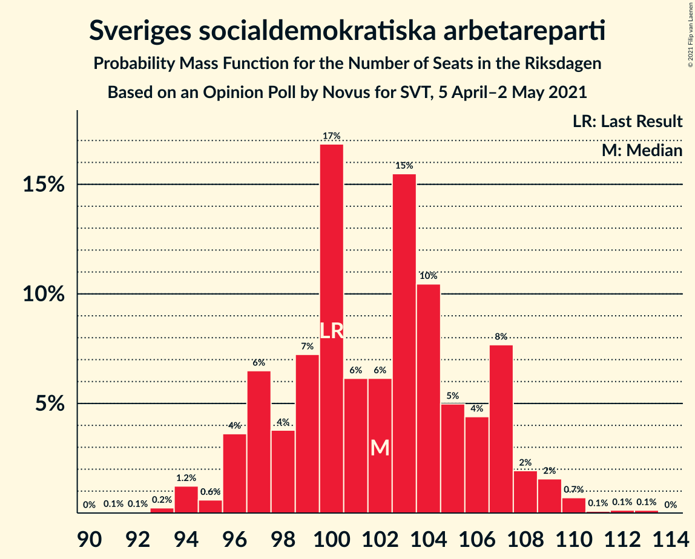
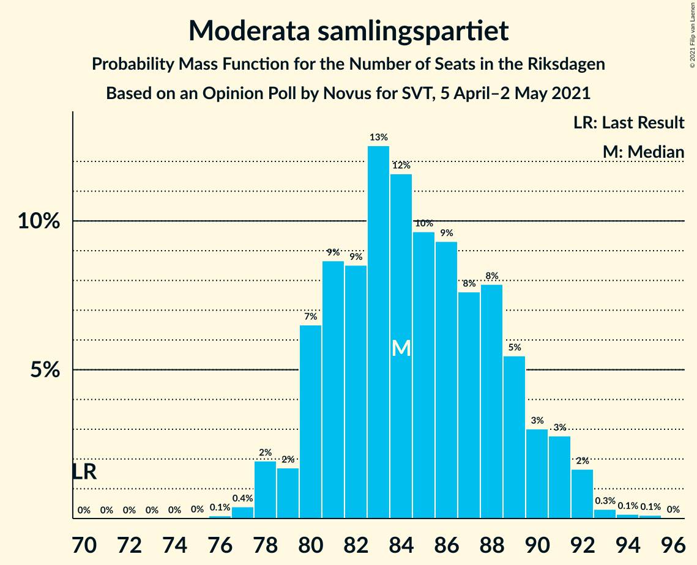
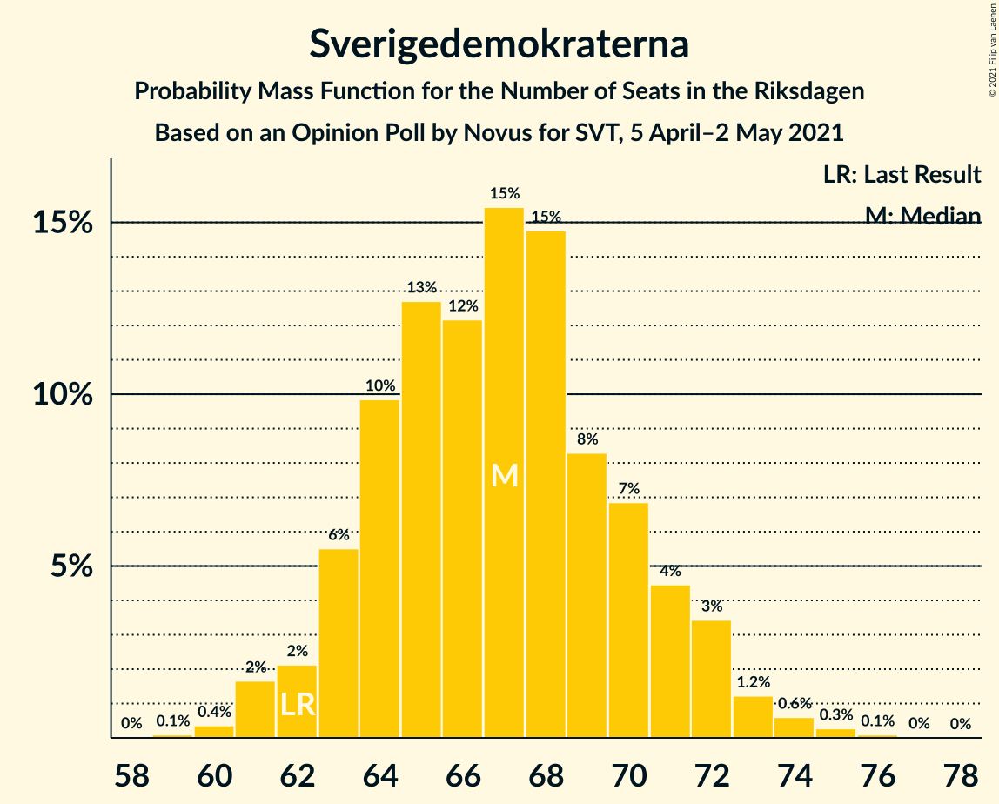
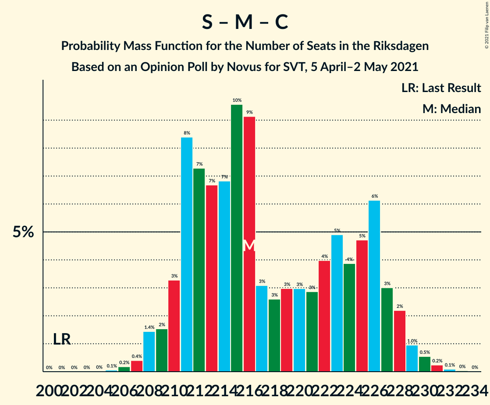

# Opinion Poll by Novus for SVT, 5 April–2 May 2021

<a href="#voting-intentions">Voting Intentions</a> | <a href="#seats">Seats</a> | <a href="#coalitions">Coalitions</a> | <a href="#technical-information">Technical Information</a>

## Voting Intentions

### Confidence Intervals

| Party | Last Result | Poll Result | 80% Confidence Interval | 90% Confidence Interval | 95% Confidence Interval | 99% Confidence Interval |
|:-----:|:-----------:|:-----------:|:-----------------------:|:-----------------------:|:-----------------------:|:-----------------------:|
| Sveriges socialdemokratiska arbetareparti | 28.3% | 27.6% | 26.6–28.6% |26.4–28.8% |26.2–29.1% |25.7–29.5% |
| Moderata samlingspartiet | 19.8% | 23.0% | 22.1–23.9% |21.8–24.1% |21.6–24.4% |21.2–24.8% |
| Sverigedemokraterna | 17.5% | 18.1% | 17.3–19.0% |17.1–19.2% |16.9–19.4% |16.6–19.8% |
| Vänsterpartiet | 8.0% | 9.5% | 8.9–10.2% |8.7–10.4% |8.6–10.5% |8.3–10.9% |
| Centerpartiet | 8.6% | 8.4% | 7.9–9.1% |7.7–9.2% |7.6–9.4% |7.3–9.7% |
| Kristdemokraterna | 6.3% | 5.3% | 4.9–5.8% |4.7–6.0% |4.6–6.1% |4.4–6.3% |
| Miljöpartiet de gröna | 4.4% | 4.0% | 3.6–4.5% |3.5–4.6% |3.4–4.7% |3.2–4.9% |
| Liberalerna | 5.5% | 2.9% | 2.6–3.3% |2.5–3.4% |2.4–3.5% |2.3–3.7% |

*Note:* The poll result column reflects the actual value used in the calculations. Published results may vary slightly, and in addition be rounded to fewer digits.

## Seats

### Confidence Intervals

| Party | Last Result | Median | 80% Confidence Interval | 90% Confidence Interval | 95% Confidence Interval | 99% Confidence Interval |
|:-----:|:-----------:|:------:|:-----------------------:|:-----------------------:|:-----------------------:|:-----------------------:|
| <a href="#sveriges-socialdemokratiska-arbetareparti">Sveriges socialdemokratiska arbetareparti</a> | 100 | 100 | 99–104 |97–105 |96–106 |95–111 |
| <a href="#moderata-samlingspartiet">Moderata samlingspartiet</a> | 70 | 84 | 80–90 |80–90 |80–91 |77–92 |
| <a href="#sverigedemokraterna">Sverigedemokraterna</a> | 62 | 66 | 64–71 |63–72 |62–72 |61–75 |
| <a href="#vänsterpartiet">Vänsterpartiet</a> | 28 | 36 | 33–38 |32–38 |31–39 |30–40 |
| <a href="#centerpartiet">Centerpartiet</a> | 31 | 31 | 28–34 |28–34 |28–34 |27–36 |
| <a href="#kristdemokraterna">Kristdemokraterna</a> | 22 | 19 | 18–22 |17–22 |17–22 |16–23 |
| <a href="#miljöpartiet-de-gröna">Miljöpartiet de gröna</a> | 16 | 15 | 0–16 |0–17 |0–17 |0–18 |
| <a href="#liberalerna">Liberalerna</a> | 20 | 0 | 0 |0 |0 |0 |

### Sveriges socialdemokratiska arbetareparti

*For a full overview of the results for this party, see the [Sveriges socialdemokratiska arbetareparti](party-sverigessocialdemokratiskaarbetareparti.html) page.*

| Number of Seats | Probability | Accumulated | Special Marks |
|:---------------:|:-----------:|:-----------:|:-------------:|
| 91 | 0.3% | 100% |  |
| 92 | 0.1% | 99.7% |  |
| 93 | 0% | 99.6% |  |
| 94 | 0.1% | 99.6% |  |
| 95 | 0.1% | 99.5% |  |
| 96 | 4% | 99.4% |  |
| 97 | 1.1% | 95% |  |
| 98 | 0.7% | 94% |  |
| 99 | 3% | 93% |  |
| 100 | 48% | 90% | Last Result, Median |
| 101 | 10% | 42% |  |
| 102 | 0.4% | 32% |  |
| 103 | 10% | 32% |  |
| 104 | 16% | 21% |  |
| 105 | 3% | 5% |  |
| 106 | 0.2% | 3% |  |
| 107 | 0.1% | 2% |  |
| 108 | 0.2% | 2% |  |
| 109 | 1.2% | 2% |  |
| 110 | 0.4% | 0.9% |  |
| 111 | 0.1% | 0.5% |  |
| 112 | 0.1% | 0.4% |  |
| 113 | 0.4% | 0.4% |  |
| 114 | 0% | 0% |  |

### Moderata samlingspartiet

*For a full overview of the results for this party, see the [Moderata samlingspartiet](party-moderatasamlingspartiet.html) page.*

| Number of Seats | Probability | Accumulated | Special Marks |
|:---------------:|:-----------:|:-----------:|:-------------:|
| 70 | 0% | 100% | Last Result |
| 71 | 0% | 100% |  |
| 72 | 0% | 100% |  |
| 73 | 0% | 100% |  |
| 74 | 0% | 100% |  |
| 75 | 0% | 100% |  |
| 76 | 0% | 100% |  |
| 77 | 0.5% | 99.9% |  |
| 78 | 0.2% | 99.5% |  |
| 79 | 0.9% | 99.3% |  |
| 80 | 9% | 98% |  |
| 81 | 2% | 90% |  |
| 82 | 4% | 88% |  |
| 83 | 25% | 84% |  |
| 84 | 13% | 59% | Median |
| 85 | 11% | 46% |  |
| 86 | 9% | 35% |  |
| 87 | 5% | 26% |  |
| 88 | 6% | 22% |  |
| 89 | 4% | 15% |  |
| 90 | 7% | 11% |  |
| 91 | 2% | 4% |  |
| 92 | 2% | 2% |  |
| 93 | 0.1% | 0.2% |  |
| 94 | 0.1% | 0.1% |  |
| 95 | 0% | 0.1% |  |
| 96 | 0% | 0% |  |

### Sverigedemokraterna

*For a full overview of the results for this party, see the [Sverigedemokraterna](party-sverigedemokraterna.html) page.*

| Number of Seats | Probability | Accumulated | Special Marks |
|:---------------:|:-----------:|:-----------:|:-------------:|
| 59 | 0.1% | 100% |  |
| 60 | 0.2% | 99.9% |  |
| 61 | 0.5% | 99.7% |  |
| 62 | 4% | 99.3% | Last Result |
| 63 | 2% | 96% |  |
| 64 | 12% | 94% |  |
| 65 | 22% | 82% |  |
| 66 | 13% | 60% | Median |
| 67 | 4% | 47% |  |
| 68 | 11% | 43% |  |
| 69 | 12% | 32% |  |
| 70 | 8% | 20% |  |
| 71 | 6% | 12% |  |
| 72 | 4% | 6% |  |
| 73 | 0.9% | 2% |  |
| 74 | 0.8% | 1.4% |  |
| 75 | 0.5% | 0.6% |  |
| 76 | 0.1% | 0.1% |  |
| 77 | 0% | 0% |  |

### Vänsterpartiet

*For a full overview of the results for this party, see the [Vänsterpartiet](party-vänsterpartiet.html) page.*

| Number of Seats | Probability | Accumulated | Special Marks |
|:---------------:|:-----------:|:-----------:|:-------------:|
| 28 | 0% | 100% | Last Result |
| 29 | 0.2% | 100% |  |
| 30 | 0.4% | 99.8% |  |
| 31 | 2% | 99.4% |  |
| 32 | 7% | 97% |  |
| 33 | 2% | 91% |  |
| 34 | 3% | 89% |  |
| 35 | 15% | 86% |  |
| 36 | 32% | 72% | Median |
| 37 | 26% | 40% |  |
| 38 | 10% | 14% |  |
| 39 | 3% | 4% |  |
| 40 | 0.5% | 0.6% |  |
| 41 | 0.1% | 0.1% |  |
| 42 | 0% | 0% |  |

### Centerpartiet

*For a full overview of the results for this party, see the [Centerpartiet](party-centerpartiet.html) page.*

| Number of Seats | Probability | Accumulated | Special Marks |
|:---------------:|:-----------:|:-----------:|:-------------:|
| 26 | 0.5% | 100% |  |
| 27 | 0.4% | 99.5% |  |
| 28 | 10% | 99.1% |  |
| 29 | 10% | 89% |  |
| 30 | 22% | 79% |  |
| 31 | 14% | 57% | Last Result, Median |
| 32 | 28% | 43% |  |
| 33 | 4% | 15% |  |
| 34 | 8% | 10% |  |
| 35 | 2% | 2% |  |
| 36 | 0.3% | 0.6% |  |
| 37 | 0.2% | 0.2% |  |
| 38 | 0% | 0% |  |

### Kristdemokraterna

*For a full overview of the results for this party, see the [Kristdemokraterna](party-kristdemokraterna.html) page.*

| Number of Seats | Probability | Accumulated | Special Marks |
|:---------------:|:-----------:|:-----------:|:-------------:|
| 15 | 0.1% | 100% |  |
| 16 | 0.5% | 99.9% |  |
| 17 | 5% | 99.5% |  |
| 18 | 39% | 95% |  |
| 19 | 8% | 56% | Median |
| 20 | 21% | 48% |  |
| 21 | 14% | 27% |  |
| 22 | 11% | 13% | Last Result |
| 23 | 2% | 2% |  |
| 24 | 0.1% | 0.2% |  |
| 25 | 0% | 0.1% |  |
| 26 | 0% | 0% |  |

### Miljöpartiet de gröna

*For a full overview of the results for this party, see the [Miljöpartiet de gröna](party-miljöpartietdegröna.html) page.*

| Number of Seats | Probability | Accumulated | Special Marks |
|:---------------:|:-----------:|:-----------:|:-------------:|
| 0 | 37% | 100% |  |
| 1 | 0% | 63% |  |
| 2 | 0% | 63% |  |
| 3 | 0% | 63% |  |
| 4 | 0% | 63% |  |
| 5 | 0% | 63% |  |
| 6 | 0% | 63% |  |
| 7 | 0% | 63% |  |
| 8 | 0% | 63% |  |
| 9 | 0% | 63% |  |
| 10 | 0% | 63% |  |
| 11 | 0% | 63% |  |
| 12 | 0% | 63% |  |
| 13 | 0% | 63% |  |
| 14 | 0.1% | 63% |  |
| 15 | 44% | 63% | Median |
| 16 | 14% | 19% | Last Result |
| 17 | 5% | 6% |  |
| 18 | 0.4% | 0.5% |  |
| 19 | 0.1% | 0.1% |  |
| 20 | 0% | 0% |  |

### Liberalerna

*For a full overview of the results for this party, see the [Liberalerna](party-liberalerna.html) page.*

| Number of Seats | Probability | Accumulated | Special Marks |
|:---------------:|:-----------:|:-----------:|:-------------:|
| 0 | 100% | 100% | Median |
| 1 | 0% | 0% |  |
| 2 | 0% | 0% |  |
| 3 | 0% | 0% |  |
| 4 | 0% | 0% |  |
| 5 | 0% | 0% |  |
| 6 | 0% | 0% |  |
| 7 | 0% | 0% |  |
| 8 | 0% | 0% |  |
| 9 | 0% | 0% |  |
| 10 | 0% | 0% |  |
| 11 | 0% | 0% |  |
| 12 | 0% | 0% |  |
| 13 | 0% | 0% |  |
| 14 | 0% | 0% |  |
| 15 | 0% | 0% |  |
| 16 | 0% | 0% |  |
| 17 | 0% | 0% |  |
| 18 | 0% | 0% |  |
| 19 | 0% | 0% |  |
| 20 | 0% | 0% | Last Result |

## Coalitions

### Confidence Intervals

| Coalition | Last Result | Median | Majority? | 80% Confidence Interval | 90% Confidence Interval | 95% Confidence Interval | 99% Confidence Interval |
|:---------:|:-----------:|:------:|:---------:|:-----------------------:|:-----------------------:|:-----------------------:|:-----------------------:|
| Sveriges socialdemokratiska arbetareparti – Moderata samlingspartiet – Centerpartiet | 201 | 215 | 100% | 211–224 | 208–226 | 208–226 | 207–229 |
| Sveriges socialdemokratiska arbetareparti – Moderata samlingspartiet | 170 | 185 | 100% | 180–193 | 179–194 | 178–195 | 177–198 |
| Sveriges socialdemokratiska arbetareparti – Vänsterpartiet – Centerpartiet – Miljöpartiet de gröna – Liberalerna | 195 | 179 | 75% | 170–183 | 169–183 | 169–184 | 168–186 |
| Moderata samlingspartiet – Sverigedemokraterna – Kristdemokraterna | 154 | 170 | 25% | 166–179 | 166–180 | 165–180 | 163–181 |
| Moderata samlingspartiet – Sverigedemokraterna | 132 | 152 | 0% | 148–159 | 146–159 | 145–159 | 143–162 |
| Sveriges socialdemokratiska arbetareparti – Vänsterpartiet – Miljöpartiet de gröna | 144 | 149 | 0% | 140–152 | 138–152 | 137–153 | 136–156 |
| Sveriges socialdemokratiska arbetareparti – Centerpartiet – Miljöpartiet de gröna – Liberalerna | 167 | 144 | 0% | 133–147 | 133–148 | 132–149 | 130–153 |
| Sveriges socialdemokratiska arbetareparti – Vänsterpartiet | 128 | 136 | 0% | 133–141 | 132–142 | 132–142 | 129–148 |
| Moderata samlingspartiet – Centerpartiet – Kristdemokraterna – Liberalerna | 143 | 133 | 0% | 130–141 | 130–142 | 129–142 | 127–145 |
| Moderata samlingspartiet – Centerpartiet – Kristdemokraterna | 123 | 133 | 0% | 130–141 | 130–142 | 129–142 | 127–145 |
| Moderata samlingspartiet – Centerpartiet – Liberalerna | 121 | 115 | 0% | 112–120 | 111–123 | 111–123 | 108–123 |
| Moderata samlingspartiet – Centerpartiet | 101 | 115 | 0% | 112–120 | 111–123 | 111–123 | 108–123 |
| Sveriges socialdemokratiska arbetareparti – Miljöpartiet de gröna | 116 | 115 | 0% | 103–116 | 101–117 | 101–117 | 100–123 |

### Sveriges socialdemokratiska arbetareparti – Moderata samlingspartiet – Centerpartiet

| Number of Seats | Probability | Accumulated | Special Marks |
|:---------------:|:-----------:|:-----------:|:-------------:|
| 201 | 0% | 100% | Last Result |
| 202 | 0% | 100% |  |
| 203 | 0% | 100% |  |
| 204 | 0% | 100% |  |
| 205 | 0.1% | 100% |  |
| 206 | 0.3% | 99.9% |  |
| 207 | 0.4% | 99.6% |  |
| 208 | 4% | 99.2% |  |
| 209 | 1.2% | 95% |  |
| 210 | 0.6% | 94% |  |
| 211 | 7% | 93% |  |
| 212 | 11% | 86% |  |
| 213 | 0.6% | 75% |  |
| 214 | 3% | 75% |  |
| 215 | 25% | 72% | Median |
| 216 | 7% | 47% |  |
| 217 | 0.8% | 40% |  |
| 218 | 3% | 39% |  |
| 219 | 0.8% | 36% |  |
| 220 | 7% | 35% |  |
| 221 | 4% | 29% |  |
| 222 | 3% | 25% |  |
| 223 | 9% | 22% |  |
| 224 | 5% | 13% |  |
| 225 | 1.1% | 8% |  |
| 226 | 5% | 7% |  |
| 227 | 0.9% | 2% |  |
| 228 | 0.2% | 0.9% |  |
| 229 | 0.3% | 0.7% |  |
| 230 | 0.3% | 0.5% |  |
| 231 | 0.1% | 0.2% |  |
| 232 | 0.1% | 0.1% |  |
| 233 | 0% | 0% |  |

### Sveriges socialdemokratiska arbetareparti – Moderata samlingspartiet

| Number of Seats | Probability | Accumulated | Special Marks |
|:---------------:|:-----------:|:-----------:|:-------------:|
| 170 | 0% | 100% | Last Result |
| 171 | 0% | 100% |  |
| 172 | 0% | 100% |  |
| 173 | 0% | 100% |  |
| 174 | 0% | 100% |  |
| 175 | 0.1% | 100% | Majority |
| 176 | 0.1% | 99.9% |  |
| 177 | 1.2% | 99.7% |  |
| 178 | 1.1% | 98.5% |  |
| 179 | 4% | 97% |  |
| 180 | 9% | 94% |  |
| 181 | 0.1% | 85% |  |
| 182 | 2% | 85% |  |
| 183 | 20% | 83% |  |
| 184 | 12% | 64% | Median |
| 185 | 9% | 51% |  |
| 186 | 6% | 42% |  |
| 187 | 2% | 36% |  |
| 188 | 4% | 34% |  |
| 189 | 0.8% | 30% |  |
| 190 | 7% | 29% |  |
| 191 | 2% | 23% |  |
| 192 | 8% | 21% |  |
| 193 | 7% | 12% |  |
| 194 | 2% | 5% |  |
| 195 | 0.8% | 3% |  |
| 196 | 1.5% | 2% |  |
| 197 | 0.1% | 0.7% |  |
| 198 | 0.3% | 0.5% |  |
| 199 | 0.1% | 0.2% |  |
| 200 | 0.1% | 0.1% |  |
| 201 | 0% | 0% |  |

### Sveriges socialdemokratiska arbetareparti – Vänsterpartiet – Centerpartiet – Miljöpartiet de gröna – Liberalerna

| Number of Seats | Probability | Accumulated | Special Marks |
|:---------------:|:-----------:|:-----------:|:-------------:|
| 164 | 0.1% | 100% |  |
| 165 | 0.1% | 99.9% |  |
| 166 | 0% | 99.8% |  |
| 167 | 0% | 99.8% |  |
| 168 | 0.8% | 99.7% |  |
| 169 | 5% | 98.9% |  |
| 170 | 13% | 94% |  |
| 171 | 2% | 81% |  |
| 172 | 0.1% | 79% |  |
| 173 | 0.4% | 79% |  |
| 174 | 4% | 79% |  |
| 175 | 11% | 75% | Majority |
| 176 | 0.5% | 65% |  |
| 177 | 4% | 64% |  |
| 178 | 7% | 60% |  |
| 179 | 12% | 53% |  |
| 180 | 0.4% | 41% |  |
| 181 | 0.4% | 40% |  |
| 182 | 13% | 40% | Median |
| 183 | 23% | 27% |  |
| 184 | 3% | 4% |  |
| 185 | 0.4% | 1.3% |  |
| 186 | 0.5% | 0.9% |  |
| 187 | 0.2% | 0.4% |  |
| 188 | 0.1% | 0.2% |  |
| 189 | 0.1% | 0.1% |  |
| 190 | 0% | 0% |  |
| 191 | 0% | 0% |  |
| 192 | 0% | 0% |  |
| 193 | 0% | 0% |  |
| 194 | 0% | 0% |  |
| 195 | 0% | 0% | Last Result |

### Moderata samlingspartiet – Sverigedemokraterna – Kristdemokraterna

| Number of Seats | Probability | Accumulated | Special Marks |
|:---------------:|:-----------:|:-----------:|:-------------:|
| 154 | 0% | 100% | Last Result |
| 155 | 0% | 100% |  |
| 156 | 0% | 100% |  |
| 157 | 0% | 100% |  |
| 158 | 0% | 100% |  |
| 159 | 0% | 100% |  |
| 160 | 0.1% | 100% |  |
| 161 | 0.1% | 99.9% |  |
| 162 | 0.2% | 99.8% |  |
| 163 | 0.5% | 99.6% |  |
| 164 | 0.4% | 99.1% |  |
| 165 | 3% | 98.7% |  |
| 166 | 23% | 96% |  |
| 167 | 13% | 73% |  |
| 168 | 0.4% | 60% |  |
| 169 | 0.4% | 60% | Median |
| 170 | 12% | 59% |  |
| 171 | 7% | 47% |  |
| 172 | 4% | 40% |  |
| 173 | 0.5% | 36% |  |
| 174 | 11% | 35% |  |
| 175 | 4% | 25% | Majority |
| 176 | 0.4% | 21% |  |
| 177 | 0.1% | 21% |  |
| 178 | 2% | 21% |  |
| 179 | 13% | 19% |  |
| 180 | 5% | 6% |  |
| 181 | 0.8% | 1.1% |  |
| 182 | 0% | 0.3% |  |
| 183 | 0% | 0.2% |  |
| 184 | 0.1% | 0.2% |  |
| 185 | 0.1% | 0.1% |  |
| 186 | 0% | 0% |  |

### Moderata samlingspartiet – Sverigedemokraterna

| Number of Seats | Probability | Accumulated | Special Marks |
|:---------------:|:-----------:|:-----------:|:-------------:|
| 132 | 0% | 100% | Last Result |
| 133 | 0% | 100% |  |
| 134 | 0% | 100% |  |
| 135 | 0% | 100% |  |
| 136 | 0% | 100% |  |
| 137 | 0% | 100% |  |
| 138 | 0% | 100% |  |
| 139 | 0% | 100% |  |
| 140 | 0% | 100% |  |
| 141 | 0.1% | 100% |  |
| 142 | 0.2% | 99.9% |  |
| 143 | 0.3% | 99.7% |  |
| 144 | 0.7% | 99.4% |  |
| 145 | 1.3% | 98.7% |  |
| 146 | 6% | 97% |  |
| 147 | 0.3% | 91% |  |
| 148 | 23% | 91% |  |
| 149 | 15% | 67% |  |
| 150 | 0.7% | 52% | Median |
| 151 | 0.4% | 51% |  |
| 152 | 19% | 51% |  |
| 153 | 2% | 32% |  |
| 154 | 1.0% | 30% |  |
| 155 | 6% | 29% |  |
| 156 | 2% | 22% |  |
| 157 | 0.1% | 20% |  |
| 158 | 0.2% | 20% |  |
| 159 | 18% | 20% |  |
| 160 | 0.6% | 2% |  |
| 161 | 0.1% | 2% |  |
| 162 | 1.5% | 2% |  |
| 163 | 0% | 0.2% |  |
| 164 | 0% | 0.2% |  |
| 165 | 0% | 0.1% |  |
| 166 | 0.1% | 0.1% |  |
| 167 | 0% | 0% |  |

### Sveriges socialdemokratiska arbetareparti – Vänsterpartiet – Miljöpartiet de gröna

| Number of Seats | Probability | Accumulated | Special Marks |
|:---------------:|:-----------:|:-----------:|:-------------:|
| 132 | 0% | 100% |  |
| 133 | 0% | 99.9% |  |
| 134 | 0.1% | 99.9% |  |
| 135 | 0.1% | 99.9% |  |
| 136 | 1.5% | 99.8% |  |
| 137 | 3% | 98% |  |
| 138 | 2% | 96% |  |
| 139 | 2% | 94% |  |
| 140 | 11% | 92% |  |
| 141 | 10% | 81% |  |
| 142 | 6% | 71% |  |
| 143 | 0.4% | 65% |  |
| 144 | 0.5% | 65% | Last Result |
| 145 | 0.2% | 64% |  |
| 146 | 0.9% | 64% |  |
| 147 | 3% | 63% |  |
| 148 | 7% | 60% |  |
| 149 | 3% | 53% |  |
| 150 | 2% | 49% |  |
| 151 | 34% | 47% | Median |
| 152 | 9% | 13% |  |
| 153 | 2% | 4% |  |
| 154 | 1.4% | 2% |  |
| 155 | 0.3% | 1.1% |  |
| 156 | 0.5% | 0.7% |  |
| 157 | 0.2% | 0.3% |  |
| 158 | 0.1% | 0.1% |  |
| 159 | 0% | 0.1% |  |
| 160 | 0% | 0% |  |

### Sveriges socialdemokratiska arbetareparti – Centerpartiet – Miljöpartiet de gröna – Liberalerna

| Number of Seats | Probability | Accumulated | Special Marks |
|:---------------:|:-----------:|:-----------:|:-------------:|
| 129 | 0.1% | 100% |  |
| 130 | 0.7% | 99.9% |  |
| 131 | 0.5% | 99.2% |  |
| 132 | 2% | 98.7% |  |
| 133 | 12% | 97% |  |
| 134 | 1.2% | 84% |  |
| 135 | 4% | 83% |  |
| 136 | 2% | 79% |  |
| 137 | 6% | 77% |  |
| 138 | 5% | 72% |  |
| 139 | 1.1% | 66% |  |
| 140 | 5% | 65% |  |
| 141 | 0.8% | 61% |  |
| 142 | 1.5% | 60% |  |
| 143 | 1.0% | 58% |  |
| 144 | 9% | 57% |  |
| 145 | 9% | 48% |  |
| 146 | 10% | 39% | Median |
| 147 | 22% | 29% |  |
| 148 | 4% | 7% |  |
| 149 | 0.7% | 3% |  |
| 150 | 0.3% | 2% |  |
| 151 | 0.7% | 2% |  |
| 152 | 0.3% | 1.0% |  |
| 153 | 0.4% | 0.7% |  |
| 154 | 0.3% | 0.4% |  |
| 155 | 0.1% | 0.1% |  |
| 156 | 0% | 0% |  |
| 157 | 0% | 0% |  |
| 158 | 0% | 0% |  |
| 159 | 0% | 0% |  |
| 160 | 0% | 0% |  |
| 161 | 0% | 0% |  |
| 162 | 0% | 0% |  |
| 163 | 0% | 0% |  |
| 164 | 0% | 0% |  |
| 165 | 0% | 0% |  |
| 166 | 0% | 0% |  |
| 167 | 0% | 0% | Last Result |

### Sveriges socialdemokratiska arbetareparti – Vänsterpartiet

| Number of Seats | Probability | Accumulated | Special Marks |
|:---------------:|:-----------:|:-----------:|:-------------:|
| 125 | 0% | 100% |  |
| 126 | 0.1% | 99.9% |  |
| 127 | 0.2% | 99.8% |  |
| 128 | 0% | 99.6% | Last Result |
| 129 | 0.2% | 99.6% |  |
| 130 | 0.2% | 99.4% |  |
| 131 | 0.8% | 99.2% |  |
| 132 | 6% | 98% |  |
| 133 | 7% | 93% |  |
| 134 | 1.2% | 85% |  |
| 135 | 10% | 84% |  |
| 136 | 27% | 74% | Median |
| 137 | 13% | 47% |  |
| 138 | 3% | 34% |  |
| 139 | 2% | 31% |  |
| 140 | 11% | 29% |  |
| 141 | 10% | 18% |  |
| 142 | 6% | 8% |  |
| 143 | 0.3% | 2% |  |
| 144 | 0.4% | 2% |  |
| 145 | 0.1% | 1.4% |  |
| 146 | 0.2% | 1.3% |  |
| 147 | 0.4% | 1.1% |  |
| 148 | 0.4% | 0.8% |  |
| 149 | 0.3% | 0.3% |  |
| 150 | 0% | 0% |  |

### Moderata samlingspartiet – Centerpartiet – Kristdemokraterna – Liberalerna

| Number of Seats | Probability | Accumulated | Special Marks |
|:---------------:|:-----------:|:-----------:|:-------------:|
| 122 | 0.1% | 100% |  |
| 123 | 0% | 99.9% |  |
| 124 | 0% | 99.9% |  |
| 125 | 0% | 99.9% |  |
| 126 | 0.1% | 99.9% |  |
| 127 | 0.4% | 99.8% |  |
| 128 | 1.5% | 99.5% |  |
| 129 | 2% | 98% |  |
| 130 | 9% | 96% |  |
| 131 | 3% | 87% |  |
| 132 | 9% | 83% |  |
| 133 | 26% | 74% |  |
| 134 | 1.1% | 48% | Median |
| 135 | 4% | 47% |  |
| 136 | 2% | 43% |  |
| 137 | 10% | 41% |  |
| 138 | 6% | 31% |  |
| 139 | 3% | 26% |  |
| 140 | 11% | 22% |  |
| 141 | 5% | 11% |  |
| 142 | 4% | 7% |  |
| 143 | 2% | 2% | Last Result |
| 144 | 0.2% | 0.8% |  |
| 145 | 0.1% | 0.6% |  |
| 146 | 0.4% | 0.5% |  |
| 147 | 0% | 0.1% |  |
| 148 | 0% | 0.1% |  |
| 149 | 0% | 0% |  |

### Moderata samlingspartiet – Centerpartiet – Kristdemokraterna

| Number of Seats | Probability | Accumulated | Special Marks |
|:---------------:|:-----------:|:-----------:|:-------------:|
| 122 | 0.1% | 100% |  |
| 123 | 0% | 99.9% | Last Result |
| 124 | 0% | 99.9% |  |
| 125 | 0% | 99.9% |  |
| 126 | 0.1% | 99.9% |  |
| 127 | 0.4% | 99.8% |  |
| 128 | 1.5% | 99.4% |  |
| 129 | 2% | 98% |  |
| 130 | 9% | 96% |  |
| 131 | 3% | 87% |  |
| 132 | 9% | 83% |  |
| 133 | 26% | 74% |  |
| 134 | 1.1% | 48% | Median |
| 135 | 4% | 47% |  |
| 136 | 2% | 43% |  |
| 137 | 10% | 41% |  |
| 138 | 6% | 31% |  |
| 139 | 3% | 26% |  |
| 140 | 11% | 22% |  |
| 141 | 5% | 11% |  |
| 142 | 4% | 7% |  |
| 143 | 2% | 2% |  |
| 144 | 0.2% | 0.7% |  |
| 145 | 0.1% | 0.6% |  |
| 146 | 0.4% | 0.5% |  |
| 147 | 0% | 0.1% |  |
| 148 | 0% | 0.1% |  |
| 149 | 0% | 0% |  |

### Moderata samlingspartiet – Centerpartiet – Liberalerna

| Number of Seats | Probability | Accumulated | Special Marks |
|:---------------:|:-----------:|:-----------:|:-------------:|
| 105 | 0.1% | 100% |  |
| 106 | 0% | 99.9% |  |
| 107 | 0% | 99.9% |  |
| 108 | 0.3% | 99.8% |  |
| 109 | 2% | 99.5% |  |
| 110 | 0.3% | 98% |  |
| 111 | 7% | 98% |  |
| 112 | 15% | 90% |  |
| 113 | 0.8% | 76% |  |
| 114 | 4% | 75% |  |
| 115 | 30% | 71% | Median |
| 116 | 4% | 40% |  |
| 117 | 8% | 37% |  |
| 118 | 3% | 29% |  |
| 119 | 6% | 25% |  |
| 120 | 11% | 19% |  |
| 121 | 0.7% | 8% | Last Result |
| 122 | 2% | 8% |  |
| 123 | 5% | 6% |  |
| 124 | 0% | 0.4% |  |
| 125 | 0.1% | 0.4% |  |
| 126 | 0.2% | 0.3% |  |
| 127 | 0% | 0% |  |

### Moderata samlingspartiet – Centerpartiet

| Number of Seats | Probability | Accumulated | Special Marks |
|:---------------:|:-----------:|:-----------:|:-------------:|
| 101 | 0% | 100% | Last Result |
| 102 | 0% | 100% |  |
| 103 | 0% | 100% |  |
| 104 | 0% | 100% |  |
| 105 | 0.1% | 100% |  |
| 106 | 0% | 99.9% |  |
| 107 | 0% | 99.9% |  |
| 108 | 0.3% | 99.8% |  |
| 109 | 2% | 99.5% |  |
| 110 | 0.3% | 98% |  |
| 111 | 7% | 98% |  |
| 112 | 15% | 90% |  |
| 113 | 0.8% | 76% |  |
| 114 | 4% | 75% |  |
| 115 | 30% | 71% | Median |
| 116 | 4% | 40% |  |
| 117 | 8% | 37% |  |
| 118 | 3% | 29% |  |
| 119 | 6% | 25% |  |
| 120 | 11% | 19% |  |
| 121 | 0.7% | 8% |  |
| 122 | 2% | 7% |  |
| 123 | 5% | 6% |  |
| 124 | 0% | 0.4% |  |
| 125 | 0.1% | 0.4% |  |
| 126 | 0.2% | 0.3% |  |
| 127 | 0% | 0% |  |

### Sveriges socialdemokratiska arbetareparti – Miljöpartiet de gröna

| Number of Seats | Probability | Accumulated | Special Marks |
|:---------------:|:-----------:|:-----------:|:-------------:|
| 96 | 0% | 100% |  |
| 97 | 0% | 99.9% |  |
| 98 | 0% | 99.9% |  |
| 99 | 0.2% | 99.9% |  |
| 100 | 2% | 99.8% |  |
| 101 | 4% | 98% |  |
| 102 | 0.2% | 94% |  |
| 103 | 10% | 94% |  |
| 104 | 16% | 84% |  |
| 105 | 2% | 68% |  |
| 106 | 0.1% | 65% |  |
| 107 | 0.3% | 65% |  |
| 108 | 0.3% | 65% |  |
| 109 | 0.8% | 65% |  |
| 110 | 0.5% | 64% |  |
| 111 | 3% | 64% |  |
| 112 | 2% | 61% |  |
| 113 | 1.2% | 59% |  |
| 114 | 3% | 57% |  |
| 115 | 32% | 54% | Median |
| 116 | 15% | 22% | Last Result |
| 117 | 5% | 7% |  |
| 118 | 1.0% | 2% |  |
| 119 | 0.2% | 1.4% |  |
| 120 | 0.4% | 1.2% |  |
| 121 | 0.2% | 0.8% |  |
| 122 | 0.1% | 0.6% |  |
| 123 | 0% | 0.5% |  |
| 124 | 0.4% | 0.5% |  |
| 125 | 0% | 0% |  |

## Technical Information

### Opinion Poll

+ **Polling firm:** Novus
+ **Commissioner(s):** SVT
+ **Fieldwork period:** 5 April–2 May 2021

### Calculations

+ **Sample size:** 3654
+ **Simulations done:** 131,072
+ **Error estimate:** 0.52%

