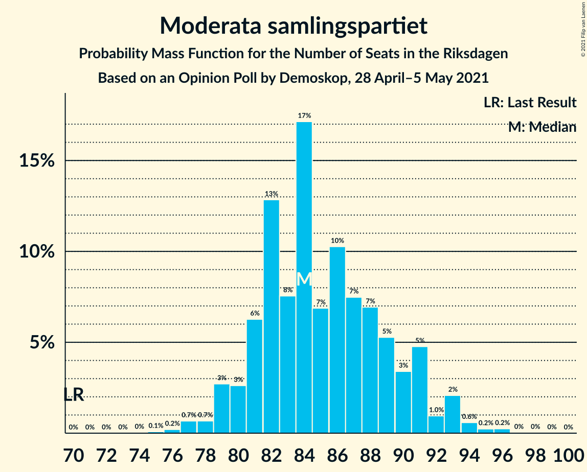
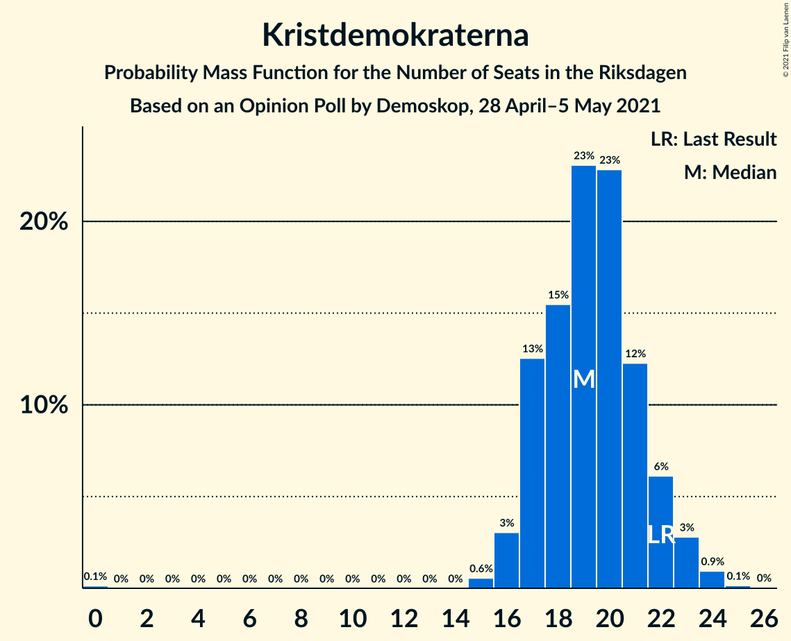
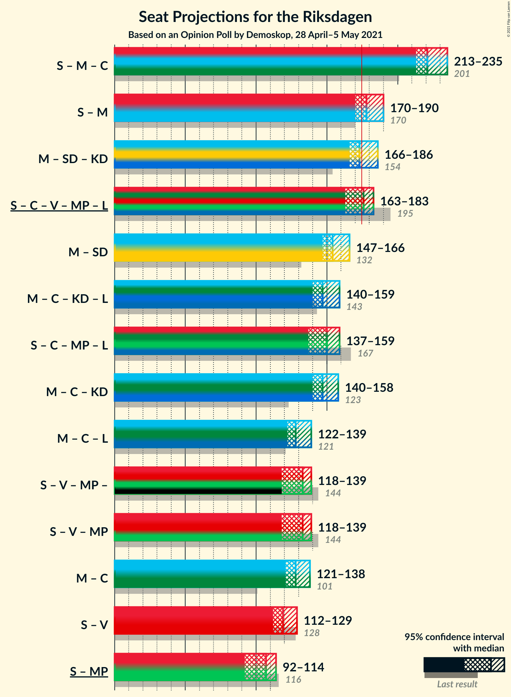
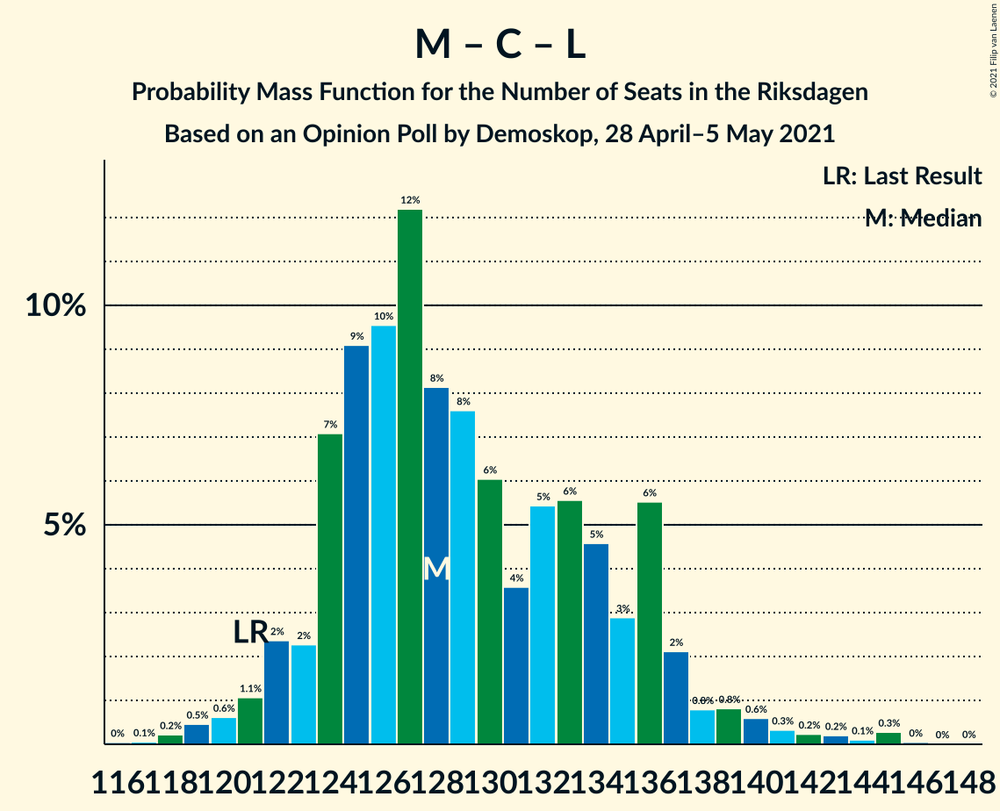

# Opinion Poll by Demoskop, 28 April–5 May 2021

<a href="#voting-intentions">Voting Intentions</a> | <a href="#seats">Seats</a> | <a href="#coalitions">Coalitions</a> | <a href="#technical-information">Technical Information</a>

## Voting Intentions

### Confidence Intervals

| Party | Last Result | Poll Result | 80% Confidence Interval | 90% Confidence Interval | 95% Confidence Interval | 99% Confidence Interval |
|:-----:|:-----------:|:-----------:|:-----------------------:|:-----------------------:|:-----------------------:|:-----------------------:|
| Sveriges socialdemokratiska arbetareparti | 28.3% | 25.4% | 24.3–26.5% |24.0–26.8% |23.8–27.1% |23.3–27.6% |
| Moderata samlingspartiet | 19.8% | 23.1% | 22.1–24.2% |21.8–24.5% |21.5–24.7% |21.0–25.3% |
| Sverigedemokraterna | 17.5% | 19.0% | 18.1–20.0% |17.8–20.3% |17.6–20.6% |17.1–21.0% |
| Centerpartiet | 8.6% | 11.8% | 11.0–12.7% |10.8–12.9% |10.6–13.1% |10.3–13.5% |
| Vänsterpartiet | 8.0% | 6.9% | 6.3–7.6% |6.1–7.8% |6.0–7.9% |5.7–8.3% |
| Kristdemokraterna | 6.3% | 5.2% | 4.7–5.8% |4.5–6.0% |4.4–6.1% |4.2–6.4% |
| Miljöpartiet de gröna | 4.4% | 4.1% | 3.7–4.7% |3.5–4.8% |3.4–4.9% |3.2–5.2% |
| Liberalerna | 5.5% | 3.2% | 2.8–3.7% |2.7–3.8% |2.6–4.0% |2.4–4.2% |

*Note:* The poll result column reflects the actual value used in the calculations. Published results may vary slightly, and in addition be rounded to fewer digits.

## Seats

### Confidence Intervals

| Party | Last Result | Median | 80% Confidence Interval | 90% Confidence Interval | 95% Confidence Interval | 99% Confidence Interval |
|:-----:|:-----------:|:------:|:-----------------------:|:-----------------------:|:-----------------------:|:-----------------------:|
| <a href="#sveriges-socialdemokratiska-arbetareparti">Sveriges socialdemokratiska arbetareparti</a> | 100 | 94 | 89–99 |88–101 |87–102 |85–104 |
| <a href="#moderata-samlingspartiet">Moderata samlingspartiet</a> | 70 | 84 | 81–90 |80–91 |79–93 |77–95 |
| <a href="#sverigedemokraterna">Sverigedemokraterna</a> | 62 | 70 | 67–74 |65–76 |64–77 |63–79 |
| <a href="#centerpartiet">Centerpartiet</a> | 31 | 44 | 41–47 |40–48 |39–49 |38–51 |
| <a href="#vänsterpartiet">Vänsterpartiet</a> | 28 | 26 | 23–28 |22–29 |22–29 |21–31 |
| <a href="#kristdemokraterna">Kristdemokraterna</a> | 22 | 19 | 17–22 |17–22 |16–23 |15–24 |
| <a href="#miljöpartiet-de-gröna">Miljöpartiet de gröna</a> | 16 | 15 | 0–17 |0–18 |0–18 |0–19 |
| <a href="#liberalerna">Liberalerna</a> | 20 | 0 | 0 |0 |0 |0–15 |

### Sveriges socialdemokratiska arbetareparti

*For a full overview of the results for this party, see the [Sveriges socialdemokratiska arbetareparti](party-sverigessocialdemokratiskaarbetareparti.html) page.*

| Number of Seats | Probability | Accumulated | Special Marks |
|:---------------:|:-----------:|:-----------:|:-------------:|
| 82 | 0% | 100% |  |
| 83 | 0% | 99.9% |  |
| 84 | 0.2% | 99.9% |  |
| 85 | 0.4% | 99.7% |  |
| 86 | 1.2% | 99.2% |  |
| 87 | 2% | 98% |  |
| 88 | 2% | 96% |  |
| 89 | 4% | 94% |  |
| 90 | 4% | 89% |  |
| 91 | 9% | 85% |  |
| 92 | 11% | 76% |  |
| 93 | 12% | 65% |  |
| 94 | 14% | 53% | Median |
| 95 | 5% | 39% |  |
| 96 | 9% | 34% |  |
| 97 | 8% | 25% |  |
| 98 | 6% | 17% |  |
| 99 | 4% | 11% |  |
| 100 | 2% | 7% | Last Result |
| 101 | 2% | 5% |  |
| 102 | 0.9% | 3% |  |
| 103 | 1.1% | 2% |  |
| 104 | 0.3% | 0.7% |  |
| 105 | 0.2% | 0.4% |  |
| 106 | 0.1% | 0.2% |  |
| 107 | 0% | 0.1% |  |
| 108 | 0% | 0% |  |

### Moderata samlingspartiet

*For a full overview of the results for this party, see the [Moderata samlingspartiet](party-moderatasamlingspartiet.html) page.*

| Number of Seats | Probability | Accumulated | Special Marks |
|:---------------:|:-----------:|:-----------:|:-------------:|
| 70 | 0% | 100% | Last Result |
| 71 | 0% | 100% |  |
| 72 | 0% | 100% |  |
| 73 | 0% | 100% |  |
| 74 | 0% | 100% |  |
| 75 | 0.1% | 100% |  |
| 76 | 0.2% | 99.9% |  |
| 77 | 0.7% | 99.7% |  |
| 78 | 0.7% | 99.0% |  |
| 79 | 3% | 98% |  |
| 80 | 3% | 96% |  |
| 81 | 6% | 93% |  |
| 82 | 13% | 87% |  |
| 83 | 8% | 74% |  |
| 84 | 17% | 66% | Median |
| 85 | 7% | 49% |  |
| 86 | 10% | 42% |  |
| 87 | 7% | 32% |  |
| 88 | 7% | 25% |  |
| 89 | 5% | 18% |  |
| 90 | 3% | 12% |  |
| 91 | 5% | 9% |  |
| 92 | 1.0% | 4% |  |
| 93 | 2% | 3% |  |
| 94 | 0.6% | 1.1% |  |
| 95 | 0.2% | 0.6% |  |
| 96 | 0.2% | 0.3% |  |
| 97 | 0% | 0.1% |  |
| 98 | 0% | 0.1% |  |
| 99 | 0% | 0% |  |

### Sverigedemokraterna

*For a full overview of the results for this party, see the [Sverigedemokraterna](party-sverigedemokraterna.html) page.*

| Number of Seats | Probability | Accumulated | Special Marks |
|:---------------:|:-----------:|:-----------:|:-------------:|
| 60 | 0% | 100% |  |
| 61 | 0.1% | 99.9% |  |
| 62 | 0.3% | 99.8% | Last Result |
| 63 | 0.6% | 99.6% |  |
| 64 | 2% | 99.0% |  |
| 65 | 4% | 97% |  |
| 66 | 3% | 93% |  |
| 67 | 9% | 90% |  |
| 68 | 6% | 81% |  |
| 69 | 5% | 74% |  |
| 70 | 23% | 69% | Median |
| 71 | 13% | 46% |  |
| 72 | 8% | 33% |  |
| 73 | 10% | 24% |  |
| 74 | 7% | 15% |  |
| 75 | 3% | 8% |  |
| 76 | 3% | 5% |  |
| 77 | 0.5% | 3% |  |
| 78 | 1.1% | 2% |  |
| 79 | 1.0% | 1.3% |  |
| 80 | 0.2% | 0.3% |  |
| 81 | 0.1% | 0.1% |  |
| 82 | 0% | 0% |  |

### Centerpartiet

*For a full overview of the results for this party, see the [Centerpartiet](party-centerpartiet.html) page.*

| Number of Seats | Probability | Accumulated | Special Marks |
|:---------------:|:-----------:|:-----------:|:-------------:|
| 31 | 0% | 100% | Last Result |
| 32 | 0% | 100% |  |
| 33 | 0% | 100% |  |
| 34 | 0% | 100% |  |
| 35 | 0% | 100% |  |
| 36 | 0.1% | 100% |  |
| 37 | 0.3% | 99.9% |  |
| 38 | 0.9% | 99.6% |  |
| 39 | 3% | 98.7% |  |
| 40 | 4% | 96% |  |
| 41 | 9% | 91% |  |
| 42 | 15% | 82% |  |
| 43 | 16% | 67% |  |
| 44 | 16% | 51% | Median |
| 45 | 17% | 35% |  |
| 46 | 7% | 19% |  |
| 47 | 6% | 12% |  |
| 48 | 3% | 6% |  |
| 49 | 3% | 4% |  |
| 50 | 0.5% | 1.3% |  |
| 51 | 0.6% | 0.8% |  |
| 52 | 0.1% | 0.2% |  |
| 53 | 0.1% | 0.1% |  |
| 54 | 0% | 0% |  |

### Vänsterpartiet

*For a full overview of the results for this party, see the [Vänsterpartiet](party-vänsterpartiet.html) page.*

| Number of Seats | Probability | Accumulated | Special Marks |
|:---------------:|:-----------:|:-----------:|:-------------:|
| 20 | 0.2% | 100% |  |
| 21 | 0.9% | 99.8% |  |
| 22 | 5% | 98.9% |  |
| 23 | 10% | 94% |  |
| 24 | 18% | 84% |  |
| 25 | 16% | 67% |  |
| 26 | 22% | 50% | Median |
| 27 | 13% | 28% |  |
| 28 | 9% | 15% | Last Result |
| 29 | 4% | 7% |  |
| 30 | 1.4% | 2% |  |
| 31 | 0.7% | 0.9% |  |
| 32 | 0.1% | 0.2% |  |
| 33 | 0.1% | 0.1% |  |
| 34 | 0% | 0% |  |

### Kristdemokraterna

*For a full overview of the results for this party, see the [Kristdemokraterna](party-kristdemokraterna.html) page.*

| Number of Seats | Probability | Accumulated | Special Marks |
|:---------------:|:-----------:|:-----------:|:-------------:|
| 0 | 0.1% | 100% |  |
| 1 | 0% | 99.9% |  |
| 2 | 0% | 99.9% |  |
| 3 | 0% | 99.9% |  |
| 4 | 0% | 99.9% |  |
| 5 | 0% | 99.9% |  |
| 6 | 0% | 99.9% |  |
| 7 | 0% | 99.9% |  |
| 8 | 0% | 99.9% |  |
| 9 | 0% | 99.9% |  |
| 10 | 0% | 99.9% |  |
| 11 | 0% | 99.9% |  |
| 12 | 0% | 99.9% |  |
| 13 | 0% | 99.9% |  |
| 14 | 0% | 99.9% |  |
| 15 | 0.6% | 99.9% |  |
| 16 | 3% | 99.3% |  |
| 17 | 13% | 96% |  |
| 18 | 15% | 84% |  |
| 19 | 23% | 68% | Median |
| 20 | 23% | 45% |  |
| 21 | 12% | 22% |  |
| 22 | 6% | 10% | Last Result |
| 23 | 3% | 4% |  |
| 24 | 0.9% | 1.1% |  |
| 25 | 0.1% | 0.2% |  |
| 26 | 0% | 0% |  |

### Miljöpartiet de gröna

*For a full overview of the results for this party, see the [Miljöpartiet de gröna](party-miljöpartietdegröna.html) page.*

| Number of Seats | Probability | Accumulated | Special Marks |
|:---------------:|:-----------:|:-----------:|:-------------:|
| 0 | 32% | 100% |  |
| 1 | 0% | 68% |  |
| 2 | 0% | 68% |  |
| 3 | 0% | 68% |  |
| 4 | 0% | 68% |  |
| 5 | 0% | 68% |  |
| 6 | 0% | 68% |  |
| 7 | 0% | 68% |  |
| 8 | 0% | 68% |  |
| 9 | 0% | 68% |  |
| 10 | 0% | 68% |  |
| 11 | 0% | 68% |  |
| 12 | 0% | 68% |  |
| 13 | 0% | 68% |  |
| 14 | 0.2% | 68% |  |
| 15 | 31% | 68% | Median |
| 16 | 23% | 37% | Last Result |
| 17 | 9% | 15% |  |
| 18 | 5% | 5% |  |
| 19 | 0.7% | 0.9% |  |
| 20 | 0.2% | 0.2% |  |
| 21 | 0% | 0% |  |

### Liberalerna

*For a full overview of the results for this party, see the [Liberalerna](party-liberalerna.html) page.*

| Number of Seats | Probability | Accumulated | Special Marks |
|:---------------:|:-----------:|:-----------:|:-------------:|
| 0 | 98% | 100% | Median |
| 1 | 0% | 2% |  |
| 2 | 0% | 2% |  |
| 3 | 0% | 2% |  |
| 4 | 0% | 2% |  |
| 5 | 0% | 2% |  |
| 6 | 0% | 2% |  |
| 7 | 0% | 2% |  |
| 8 | 0% | 2% |  |
| 9 | 0% | 2% |  |
| 10 | 0% | 2% |  |
| 11 | 0% | 2% |  |
| 12 | 0% | 2% |  |
| 13 | 0% | 2% |  |
| 14 | 0.7% | 2% |  |
| 15 | 1.0% | 1.3% |  |
| 16 | 0.2% | 0.3% |  |
| 17 | 0% | 0% |  |
| 18 | 0% | 0% |  |
| 19 | 0% | 0% |  |
| 20 | 0% | 0% | Last Result |

## Coalitions

### Confidence Intervals

| Coalition | Last Result | Median | Majority? | 80% Confidence Interval | 90% Confidence Interval | 95% Confidence Interval | 99% Confidence Interval |
|:---------:|:-----------:|:------:|:---------:|:-----------------------:|:-----------------------:|:-----------------------:|:-----------------------:|
| Sveriges socialdemokratiska arbetareparti – Moderata samlingspartiet – Centerpartiet | 201 | 221 | 100% | 216–232 | 215–234 | 213–235 | 210–238 |
| Sveriges socialdemokratiska arbetareparti – Moderata samlingspartiet | 170 | 178 | 81% | 173–187 | 171–189 | 170–190 | 167–192 |
| Moderata samlingspartiet – Sverigedemokraterna – Kristdemokraterna | 154 | 173 | 43% | 169–182 | 167–184 | 166–186 | 163–189 |
| Sveriges socialdemokratiska arbetareparti – Centerpartiet – Vänsterpartiet – Miljöpartiet de gröna – Liberalerna | 195 | 176 | 57% | 167–180 | 165–182 | 163–183 | 160–186 |
| Moderata samlingspartiet – Sverigedemokraterna | 132 | 154 | 0% | 150–163 | 149–164 | 147–166 | 144–169 |
| Moderata samlingspartiet – Centerpartiet – Kristdemokraterna – Liberalerna | 143 | 147 | 0% | 143–155 | 142–157 | 140–159 | 137–162 |
| Sveriges socialdemokratiska arbetareparti – Centerpartiet – Miljöpartiet de gröna – Liberalerna | 167 | 150 | 0% | 140–155 | 139–157 | 137–159 | 134–162 |
| Moderata samlingspartiet – Centerpartiet – Kristdemokraterna | 123 | 147 | 0% | 142–155 | 141–157 | 140–158 | 137–161 |
| Moderata samlingspartiet – Centerpartiet – Liberalerna | 121 | 128 | 0% | 124–136 | 123–137 | 122–139 | 119–143 |
| Sveriges socialdemokratiska arbetareparti – Vänsterpartiet – Miljöpartiet de gröna | 144 | 133 | 0% | 122–137 | 120–138 | 118–139 | 116–141 |
| Moderata samlingspartiet – Centerpartiet | 101 | 128 | 0% | 124–135 | 122–136 | 121–138 | 118–141 |
| Sveriges socialdemokratiska arbetareparti – Vänsterpartiet | 128 | 119 | 0% | 114–124 | 112–127 | 112–129 | 110–130 |
| Sveriges socialdemokratiska arbetareparti – Miljöpartiet de gröna | 116 | 107 | 0% | 96–111 | 94–113 | 92–114 | 90–116 |

### Sveriges socialdemokratiska arbetareparti – Moderata samlingspartiet – Centerpartiet

| Number of Seats | Probability | Accumulated | Special Marks |
|:---------------:|:-----------:|:-----------:|:-------------:|
| 201 | 0% | 100% | Last Result |
| 202 | 0% | 100% |  |
| 203 | 0% | 100% |  |
| 204 | 0% | 100% |  |
| 205 | 0% | 100% |  |
| 206 | 0% | 99.9% |  |
| 207 | 0.1% | 99.9% |  |
| 208 | 0.1% | 99.8% |  |
| 209 | 0.2% | 99.7% |  |
| 210 | 0.2% | 99.6% |  |
| 211 | 0.4% | 99.4% |  |
| 212 | 0.4% | 99.0% |  |
| 213 | 2% | 98.5% |  |
| 214 | 1.3% | 97% |  |
| 215 | 3% | 96% |  |
| 216 | 4% | 93% |  |
| 217 | 11% | 89% |  |
| 218 | 5% | 78% |  |
| 219 | 7% | 73% |  |
| 220 | 7% | 66% |  |
| 221 | 14% | 59% |  |
| 222 | 3% | 45% | Median |
| 223 | 5% | 41% |  |
| 224 | 2% | 36% |  |
| 225 | 4% | 34% |  |
| 226 | 2% | 30% |  |
| 227 | 2% | 27% |  |
| 228 | 5% | 25% |  |
| 229 | 2% | 21% |  |
| 230 | 3% | 18% |  |
| 231 | 4% | 16% |  |
| 232 | 4% | 12% |  |
| 233 | 2% | 8% |  |
| 234 | 4% | 6% |  |
| 235 | 0.7% | 3% |  |
| 236 | 1.0% | 2% |  |
| 237 | 0.4% | 0.9% |  |
| 238 | 0.3% | 0.6% |  |
| 239 | 0.1% | 0.3% |  |
| 240 | 0.1% | 0.2% |  |
| 241 | 0% | 0% |  |

### Sveriges socialdemokratiska arbetareparti – Moderata samlingspartiet

| Number of Seats | Probability | Accumulated | Special Marks |
|:---------------:|:-----------:|:-----------:|:-------------:|
| 163 | 0% | 100% |  |
| 164 | 0% | 99.9% |  |
| 165 | 0.1% | 99.9% |  |
| 166 | 0.2% | 99.8% |  |
| 167 | 0.3% | 99.7% |  |
| 168 | 0.4% | 99.4% |  |
| 169 | 0.8% | 99.0% |  |
| 170 | 1.0% | 98% | Last Result |
| 171 | 2% | 97% |  |
| 172 | 3% | 95% |  |
| 173 | 4% | 92% |  |
| 174 | 7% | 88% |  |
| 175 | 8% | 81% | Majority |
| 176 | 12% | 73% |  |
| 177 | 7% | 61% |  |
| 178 | 10% | 55% | Median |
| 179 | 3% | 45% |  |
| 180 | 6% | 41% |  |
| 181 | 4% | 35% |  |
| 182 | 4% | 31% |  |
| 183 | 4% | 28% |  |
| 184 | 4% | 23% |  |
| 185 | 4% | 19% |  |
| 186 | 4% | 16% |  |
| 187 | 4% | 11% |  |
| 188 | 1.5% | 7% |  |
| 189 | 3% | 6% |  |
| 190 | 0.9% | 3% |  |
| 191 | 0.7% | 2% |  |
| 192 | 0.7% | 1.2% |  |
| 193 | 0.2% | 0.5% |  |
| 194 | 0.1% | 0.3% |  |
| 195 | 0.1% | 0.1% |  |
| 196 | 0% | 0.1% |  |
| 197 | 0% | 0.1% |  |
| 198 | 0% | 0% |  |

### Moderata samlingspartiet – Sverigedemokraterna – Kristdemokraterna

| Number of Seats | Probability | Accumulated | Special Marks |
|:---------------:|:-----------:|:-----------:|:-------------:|
| 154 | 0% | 100% | Last Result |
| 155 | 0% | 100% |  |
| 156 | 0% | 100% |  |
| 157 | 0% | 100% |  |
| 158 | 0% | 100% |  |
| 159 | 0% | 99.9% |  |
| 160 | 0% | 99.9% |  |
| 161 | 0.1% | 99.9% |  |
| 162 | 0.2% | 99.8% |  |
| 163 | 0.5% | 99.6% |  |
| 164 | 0.8% | 99.1% |  |
| 165 | 0.8% | 98% |  |
| 166 | 2% | 98% |  |
| 167 | 1.2% | 96% |  |
| 168 | 3% | 95% |  |
| 169 | 4% | 92% |  |
| 170 | 3% | 88% |  |
| 171 | 12% | 85% |  |
| 172 | 10% | 73% |  |
| 173 | 14% | 63% | Median |
| 174 | 6% | 49% |  |
| 175 | 6% | 43% | Majority |
| 176 | 5% | 37% |  |
| 177 | 4% | 32% |  |
| 178 | 4% | 29% |  |
| 179 | 3% | 25% |  |
| 180 | 4% | 22% |  |
| 181 | 4% | 18% |  |
| 182 | 6% | 14% |  |
| 183 | 3% | 8% |  |
| 184 | 2% | 5% |  |
| 185 | 0.9% | 3% |  |
| 186 | 0.5% | 3% |  |
| 187 | 0.7% | 2% |  |
| 188 | 0.7% | 1.4% |  |
| 189 | 0.4% | 0.7% |  |
| 190 | 0.2% | 0.3% |  |
| 191 | 0.1% | 0.1% |  |
| 192 | 0% | 0% |  |

### Sveriges socialdemokratiska arbetareparti – Centerpartiet – Vänsterpartiet – Miljöpartiet de gröna – Liberalerna

| Number of Seats | Probability | Accumulated | Special Marks |
|:---------------:|:-----------:|:-----------:|:-------------:|
| 158 | 0.1% | 100% |  |
| 159 | 0.2% | 99.9% |  |
| 160 | 0.4% | 99.7% |  |
| 161 | 0.7% | 99.3% |  |
| 162 | 0.7% | 98.6% |  |
| 163 | 0.5% | 98% |  |
| 164 | 0.9% | 97% |  |
| 165 | 2% | 97% |  |
| 166 | 3% | 95% |  |
| 167 | 6% | 92% |  |
| 168 | 4% | 86% |  |
| 169 | 4% | 82% |  |
| 170 | 3% | 78% |  |
| 171 | 4% | 75% |  |
| 172 | 4% | 71% |  |
| 173 | 5% | 68% |  |
| 174 | 6% | 63% |  |
| 175 | 6% | 57% | Majority |
| 176 | 14% | 51% |  |
| 177 | 10% | 37% |  |
| 178 | 12% | 27% |  |
| 179 | 3% | 15% | Median |
| 180 | 4% | 12% |  |
| 181 | 3% | 8% |  |
| 182 | 1.2% | 5% |  |
| 183 | 2% | 4% |  |
| 184 | 0.8% | 2% |  |
| 185 | 0.8% | 2% |  |
| 186 | 0.5% | 0.9% |  |
| 187 | 0.2% | 0.4% |  |
| 188 | 0.1% | 0.2% |  |
| 189 | 0% | 0.1% |  |
| 190 | 0% | 0.1% |  |
| 191 | 0% | 0.1% |  |
| 192 | 0% | 0% |  |
| 193 | 0% | 0% |  |
| 194 | 0% | 0% |  |
| 195 | 0% | 0% | Last Result |

### Moderata samlingspartiet – Sverigedemokraterna

| Number of Seats | Probability | Accumulated | Special Marks |
|:---------------:|:-----------:|:-----------:|:-------------:|
| 132 | 0% | 100% | Last Result |
| 133 | 0% | 100% |  |
| 134 | 0% | 100% |  |
| 135 | 0% | 100% |  |
| 136 | 0% | 100% |  |
| 137 | 0% | 100% |  |
| 138 | 0% | 100% |  |
| 139 | 0% | 100% |  |
| 140 | 0% | 100% |  |
| 141 | 0% | 100% |  |
| 142 | 0.1% | 99.9% |  |
| 143 | 0.1% | 99.9% |  |
| 144 | 0.2% | 99.7% |  |
| 145 | 1.0% | 99.5% |  |
| 146 | 0.6% | 98.5% |  |
| 147 | 1.3% | 98% |  |
| 148 | 1.0% | 97% |  |
| 149 | 4% | 96% |  |
| 150 | 4% | 91% |  |
| 151 | 4% | 88% |  |
| 152 | 9% | 84% |  |
| 153 | 10% | 74% |  |
| 154 | 20% | 65% | Median |
| 155 | 5% | 45% |  |
| 156 | 5% | 40% |  |
| 157 | 5% | 35% |  |
| 158 | 4% | 30% |  |
| 159 | 6% | 26% |  |
| 160 | 2% | 20% |  |
| 161 | 2% | 18% |  |
| 162 | 5% | 16% |  |
| 163 | 2% | 10% |  |
| 164 | 5% | 8% |  |
| 165 | 0.6% | 4% |  |
| 166 | 0.9% | 3% |  |
| 167 | 0.8% | 2% |  |
| 168 | 0.4% | 1.5% |  |
| 169 | 0.9% | 1.1% |  |
| 170 | 0.1% | 0.2% |  |
| 171 | 0.1% | 0.1% |  |
| 172 | 0% | 0% |  |

### Moderata samlingspartiet – Centerpartiet – Kristdemokraterna – Liberalerna

| Number of Seats | Probability | Accumulated | Special Marks |
|:---------------:|:-----------:|:-----------:|:-------------:|
| 133 | 0% | 100% |  |
| 134 | 0% | 99.9% |  |
| 135 | 0.1% | 99.9% |  |
| 136 | 0.1% | 99.9% |  |
| 137 | 0.4% | 99.8% |  |
| 138 | 0.5% | 99.4% |  |
| 139 | 0.3% | 98.9% |  |
| 140 | 2% | 98.6% |  |
| 141 | 0.9% | 97% |  |
| 142 | 5% | 96% |  |
| 143 | 3% | 91% | Last Result |
| 144 | 11% | 87% |  |
| 145 | 7% | 77% |  |
| 146 | 17% | 70% |  |
| 147 | 5% | 53% | Median |
| 148 | 5% | 48% |  |
| 149 | 7% | 42% |  |
| 150 | 3% | 35% |  |
| 151 | 4% | 32% |  |
| 152 | 6% | 28% |  |
| 153 | 5% | 22% |  |
| 154 | 7% | 18% |  |
| 155 | 3% | 11% |  |
| 156 | 2% | 9% |  |
| 157 | 2% | 6% |  |
| 158 | 1.2% | 4% |  |
| 159 | 1.1% | 3% |  |
| 160 | 0.4% | 2% |  |
| 161 | 0.6% | 1.4% |  |
| 162 | 0.4% | 0.8% |  |
| 163 | 0.2% | 0.4% |  |
| 164 | 0.1% | 0.2% |  |
| 165 | 0.1% | 0.1% |  |
| 166 | 0% | 0.1% |  |
| 167 | 0% | 0% |  |

### Sveriges socialdemokratiska arbetareparti – Centerpartiet – Miljöpartiet de gröna – Liberalerna

| Number of Seats | Probability | Accumulated | Special Marks |
|:---------------:|:-----------:|:-----------:|:-------------:|
| 131 | 0% | 100% |  |
| 132 | 0.1% | 99.9% |  |
| 133 | 0.1% | 99.8% |  |
| 134 | 0.3% | 99.8% |  |
| 135 | 1.2% | 99.5% |  |
| 136 | 0.5% | 98% |  |
| 137 | 0.9% | 98% |  |
| 138 | 2% | 97% |  |
| 139 | 2% | 95% |  |
| 140 | 4% | 93% |  |
| 141 | 2% | 89% |  |
| 142 | 5% | 88% |  |
| 143 | 5% | 83% |  |
| 144 | 2% | 78% |  |
| 145 | 3% | 76% |  |
| 146 | 4% | 73% |  |
| 147 | 3% | 69% |  |
| 148 | 6% | 66% |  |
| 149 | 7% | 60% |  |
| 150 | 12% | 53% |  |
| 151 | 4% | 42% |  |
| 152 | 6% | 37% |  |
| 153 | 16% | 31% | Median |
| 154 | 4% | 15% |  |
| 155 | 4% | 11% |  |
| 156 | 2% | 7% |  |
| 157 | 3% | 6% |  |
| 158 | 0.5% | 3% |  |
| 159 | 0.9% | 3% |  |
| 160 | 0.6% | 2% |  |
| 161 | 0.3% | 1.1% |  |
| 162 | 0.4% | 0.8% |  |
| 163 | 0.3% | 0.4% |  |
| 164 | 0% | 0.1% |  |
| 165 | 0% | 0.1% |  |
| 166 | 0% | 0.1% |  |
| 167 | 0% | 0% | Last Result |

### Moderata samlingspartiet – Centerpartiet – Kristdemokraterna

| Number of Seats | Probability | Accumulated | Special Marks |
|:---------------:|:-----------:|:-----------:|:-------------:|
| 123 | 0% | 100% | Last Result |
| 124 | 0% | 100% |  |
| 125 | 0% | 100% |  |
| 126 | 0% | 100% |  |
| 127 | 0% | 100% |  |
| 128 | 0% | 100% |  |
| 129 | 0% | 100% |  |
| 130 | 0% | 100% |  |
| 131 | 0% | 100% |  |
| 132 | 0% | 100% |  |
| 133 | 0% | 100% |  |
| 134 | 0% | 99.9% |  |
| 135 | 0.1% | 99.9% |  |
| 136 | 0.2% | 99.8% |  |
| 137 | 0.4% | 99.6% |  |
| 138 | 0.6% | 99.1% |  |
| 139 | 0.4% | 98.5% |  |
| 140 | 3% | 98% |  |
| 141 | 1.0% | 96% |  |
| 142 | 5% | 95% |  |
| 143 | 3% | 90% |  |
| 144 | 11% | 86% |  |
| 145 | 7% | 75% |  |
| 146 | 17% | 69% |  |
| 147 | 6% | 52% | Median |
| 148 | 5% | 46% |  |
| 149 | 7% | 40% |  |
| 150 | 3% | 34% |  |
| 151 | 3% | 30% |  |
| 152 | 6% | 27% |  |
| 153 | 4% | 21% |  |
| 154 | 6% | 16% |  |
| 155 | 3% | 10% |  |
| 156 | 2% | 8% |  |
| 157 | 2% | 5% |  |
| 158 | 1.1% | 3% |  |
| 159 | 1.0% | 2% |  |
| 160 | 0.2% | 1.0% |  |
| 161 | 0.5% | 0.8% |  |
| 162 | 0.1% | 0.3% |  |
| 163 | 0.1% | 0.2% |  |
| 164 | 0% | 0.1% |  |
| 165 | 0% | 0% |  |

### Moderata samlingspartiet – Centerpartiet – Liberalerna

| Number of Seats | Probability | Accumulated | Special Marks |
|:---------------:|:-----------:|:-----------:|:-------------:|
| 116 | 0% | 100% |  |
| 117 | 0.1% | 99.9% |  |
| 118 | 0.2% | 99.9% |  |
| 119 | 0.5% | 99.7% |  |
| 120 | 0.6% | 99.2% |  |
| 121 | 1.1% | 98.6% | Last Result |
| 122 | 2% | 98% |  |
| 123 | 2% | 95% |  |
| 124 | 7% | 93% |  |
| 125 | 9% | 86% |  |
| 126 | 10% | 77% |  |
| 127 | 12% | 67% |  |
| 128 | 8% | 55% | Median |
| 129 | 8% | 47% |  |
| 130 | 6% | 39% |  |
| 131 | 4% | 33% |  |
| 132 | 5% | 30% |  |
| 133 | 6% | 24% |  |
| 134 | 5% | 19% |  |
| 135 | 3% | 14% |  |
| 136 | 6% | 11% |  |
| 137 | 2% | 6% |  |
| 138 | 0.8% | 3% |  |
| 139 | 0.8% | 3% |  |
| 140 | 0.6% | 2% |  |
| 141 | 0.3% | 1.3% |  |
| 142 | 0.2% | 0.9% |  |
| 143 | 0.2% | 0.7% |  |
| 144 | 0.1% | 0.5% |  |
| 145 | 0.3% | 0.4% |  |
| 146 | 0% | 0.1% |  |
| 147 | 0% | 0.1% |  |
| 148 | 0% | 0% |  |

### Sveriges socialdemokratiska arbetareparti – Vänsterpartiet – Miljöpartiet de gröna

| Number of Seats | Probability | Accumulated | Special Marks |
|:---------------:|:-----------:|:-----------:|:-------------:|
| 112 | 0.1% | 100% |  |
| 113 | 0.1% | 99.9% |  |
| 114 | 0.1% | 99.8% |  |
| 115 | 0.2% | 99.7% |  |
| 116 | 0.3% | 99.5% |  |
| 117 | 0.5% | 99.3% |  |
| 118 | 2% | 98.8% |  |
| 119 | 2% | 97% |  |
| 120 | 0.8% | 95% |  |
| 121 | 0.9% | 94% |  |
| 122 | 5% | 94% |  |
| 123 | 9% | 88% |  |
| 124 | 3% | 80% |  |
| 125 | 2% | 76% |  |
| 126 | 1.2% | 74% |  |
| 127 | 3% | 73% |  |
| 128 | 4% | 71% |  |
| 129 | 6% | 66% |  |
| 130 | 3% | 60% |  |
| 131 | 2% | 57% |  |
| 132 | 6% | 56% |  |
| 133 | 17% | 50% |  |
| 134 | 13% | 33% |  |
| 135 | 5% | 21% | Median |
| 136 | 3% | 16% |  |
| 137 | 5% | 13% |  |
| 138 | 4% | 9% |  |
| 139 | 3% | 5% |  |
| 140 | 0.9% | 2% |  |
| 141 | 0.2% | 0.7% |  |
| 142 | 0.2% | 0.5% |  |
| 143 | 0.2% | 0.3% |  |
| 144 | 0.1% | 0.1% | Last Result |
| 145 | 0% | 0.1% |  |
| 146 | 0% | 0% |  |

### Moderata samlingspartiet – Centerpartiet

| Number of Seats | Probability | Accumulated | Special Marks |
|:---------------:|:-----------:|:-----------:|:-------------:|
| 101 | 0% | 100% | Last Result |
| 102 | 0% | 100% |  |
| 103 | 0% | 100% |  |
| 104 | 0% | 100% |  |
| 105 | 0% | 100% |  |
| 106 | 0% | 100% |  |
| 107 | 0% | 100% |  |
| 108 | 0% | 100% |  |
| 109 | 0% | 100% |  |
| 110 | 0% | 100% |  |
| 111 | 0% | 100% |  |
| 112 | 0% | 100% |  |
| 113 | 0% | 100% |  |
| 114 | 0% | 100% |  |
| 115 | 0% | 100% |  |
| 116 | 0.1% | 100% |  |
| 117 | 0.1% | 99.9% |  |
| 118 | 0.3% | 99.8% |  |
| 119 | 0.6% | 99.5% |  |
| 120 | 0.7% | 98.9% |  |
| 121 | 1.2% | 98% |  |
| 122 | 3% | 97% |  |
| 123 | 2% | 94% |  |
| 124 | 7% | 92% |  |
| 125 | 9% | 85% |  |
| 126 | 10% | 75% |  |
| 127 | 12% | 66% |  |
| 128 | 8% | 53% | Median |
| 129 | 8% | 45% |  |
| 130 | 6% | 38% |  |
| 131 | 4% | 31% |  |
| 132 | 5% | 28% |  |
| 133 | 5% | 22% |  |
| 134 | 4% | 17% |  |
| 135 | 3% | 12% |  |
| 136 | 5% | 10% |  |
| 137 | 2% | 5% |  |
| 138 | 0.8% | 3% |  |
| 139 | 0.8% | 2% |  |
| 140 | 0.4% | 1.0% |  |
| 141 | 0.2% | 0.6% |  |
| 142 | 0.1% | 0.3% |  |
| 143 | 0.1% | 0.2% |  |
| 144 | 0.1% | 0.1% |  |
| 145 | 0% | 0% |  |

### Sveriges socialdemokratiska arbetareparti – Vänsterpartiet

| Number of Seats | Probability | Accumulated | Special Marks |
|:---------------:|:-----------:|:-----------:|:-------------:|
| 107 | 0.1% | 100% |  |
| 108 | 0.1% | 99.9% |  |
| 109 | 0.2% | 99.8% |  |
| 110 | 0.4% | 99.6% |  |
| 111 | 1.2% | 99.2% |  |
| 112 | 3% | 98% |  |
| 113 | 4% | 95% |  |
| 114 | 3% | 91% |  |
| 115 | 2% | 89% |  |
| 116 | 4% | 87% |  |
| 117 | 16% | 82% |  |
| 118 | 15% | 67% |  |
| 119 | 10% | 52% |  |
| 120 | 3% | 42% | Median |
| 121 | 3% | 39% |  |
| 122 | 11% | 36% |  |
| 123 | 13% | 26% |  |
| 124 | 4% | 13% |  |
| 125 | 2% | 9% |  |
| 126 | 0.9% | 7% |  |
| 127 | 2% | 6% |  |
| 128 | 2% | 5% | Last Result |
| 129 | 2% | 3% |  |
| 130 | 0.5% | 1.0% |  |
| 131 | 0.1% | 0.5% |  |
| 132 | 0.1% | 0.4% |  |
| 133 | 0.1% | 0.2% |  |
| 134 | 0.1% | 0.1% |  |
| 135 | 0% | 0% |  |

### Sveriges socialdemokratiska arbetareparti – Miljöpartiet de gröna

| Number of Seats | Probability | Accumulated | Special Marks |
|:---------------:|:-----------:|:-----------:|:-------------:|
| 87 | 0% | 100% |  |
| 88 | 0.1% | 99.9% |  |
| 89 | 0.3% | 99.8% |  |
| 90 | 0.3% | 99.5% |  |
| 91 | 0.8% | 99.2% |  |
| 92 | 1.4% | 98% |  |
| 93 | 2% | 97% |  |
| 94 | 3% | 95% |  |
| 95 | 2% | 93% |  |
| 96 | 4% | 91% |  |
| 97 | 5% | 87% |  |
| 98 | 5% | 82% |  |
| 99 | 3% | 78% |  |
| 100 | 1.5% | 74% |  |
| 101 | 3% | 73% |  |
| 102 | 2% | 70% |  |
| 103 | 3% | 68% |  |
| 104 | 3% | 65% |  |
| 105 | 4% | 62% |  |
| 106 | 6% | 58% |  |
| 107 | 7% | 52% |  |
| 108 | 11% | 45% |  |
| 109 | 10% | 34% | Median |
| 110 | 8% | 23% |  |
| 111 | 6% | 16% |  |
| 112 | 3% | 9% |  |
| 113 | 2% | 6% |  |
| 114 | 2% | 4% |  |
| 115 | 0.8% | 2% |  |
| 116 | 0.4% | 0.7% | Last Result |
| 117 | 0.2% | 0.3% |  |
| 118 | 0.1% | 0.2% |  |
| 119 | 0.1% | 0.1% |  |
| 120 | 0% | 0% |  |

## Technical Information

### Opinion Poll

+ **Polling firm:** Demoskop
+ **Commissioner(s):** —
+ **Fieldwork period:** 28 April–5 May 2021

### Calculations

+ **Sample size:** 2651
+ **Simulations done:** 1,048,576
+ **Error estimate:** 0.82%

