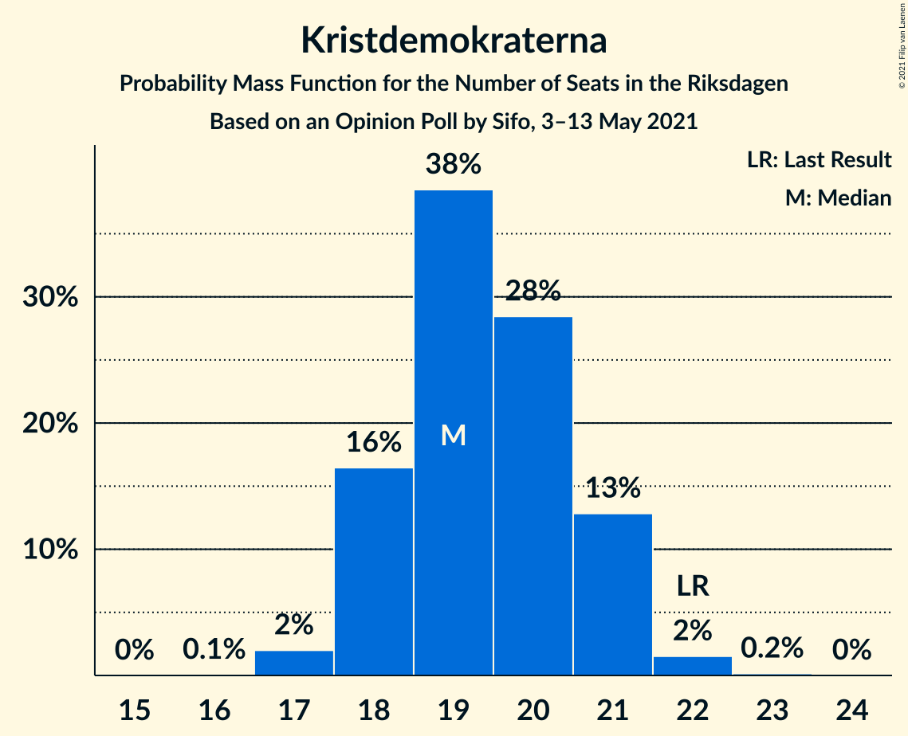
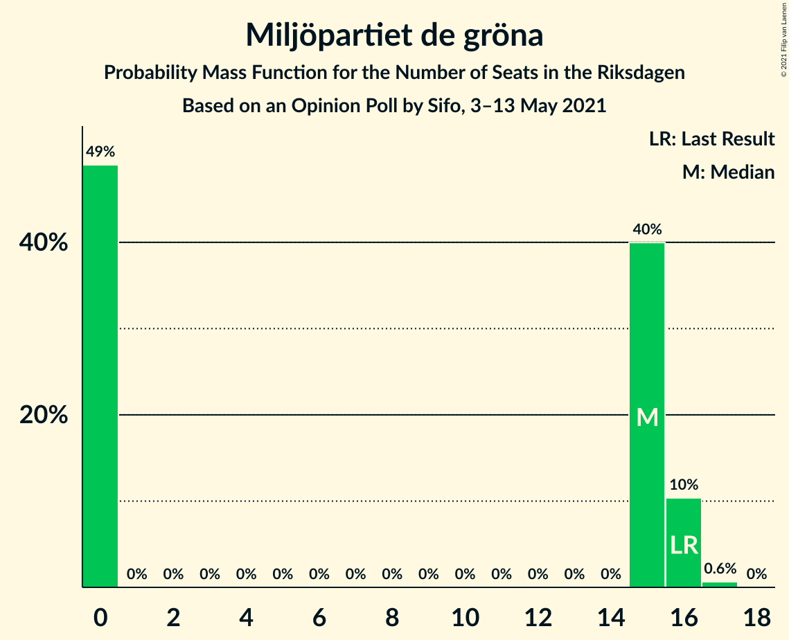
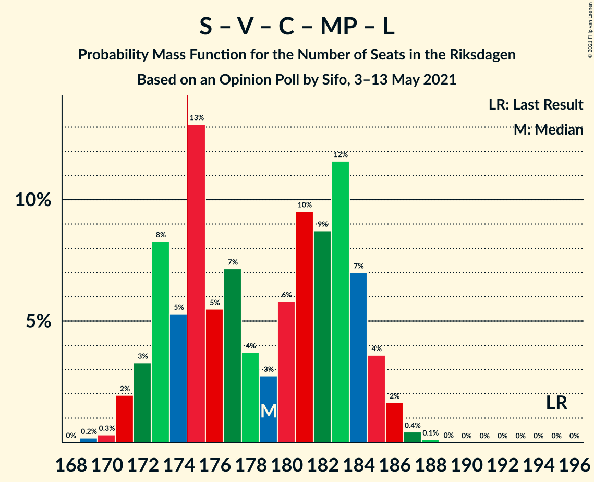
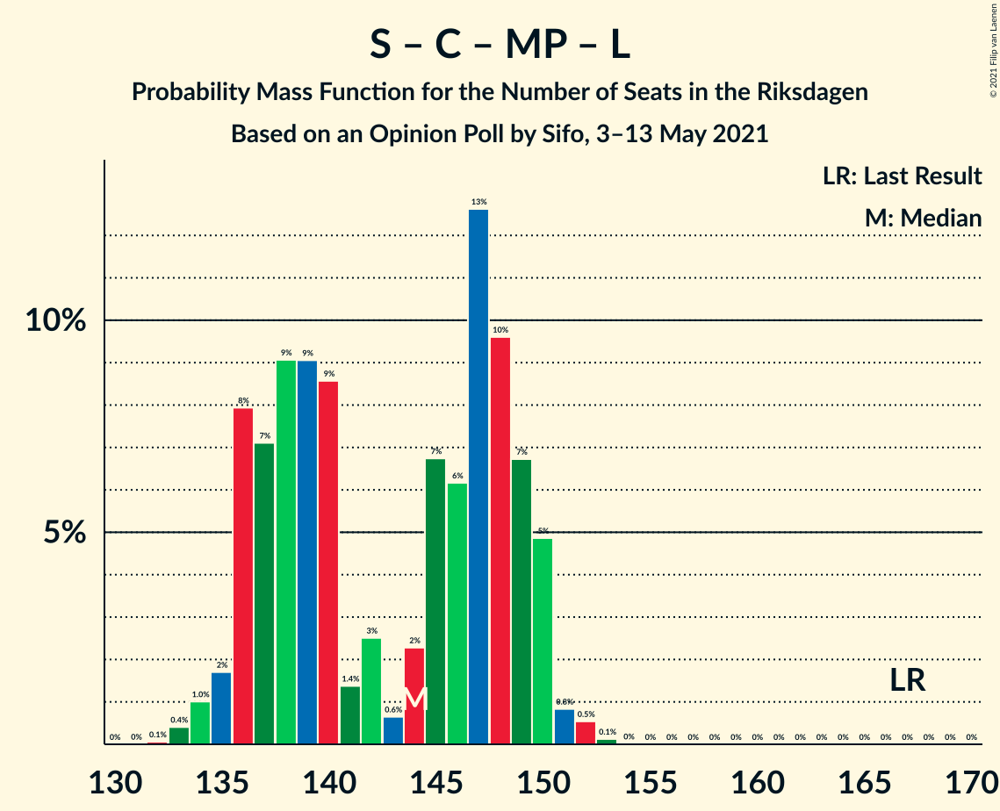

# Opinion Poll by Sifo, 3–13 May 2021

<a href="#voting-intentions">Voting Intentions</a> | <a href="#seats">Seats</a> | <a href="#coalitions">Coalitions</a> | <a href="#technical-information">Technical Information</a>

## Voting Intentions

### Confidence Intervals

| Party | Last Result | Poll Result | 80% Confidence Interval | 90% Confidence Interval | 95% Confidence Interval | 99% Confidence Interval |
|:-----:|:-----------:|:-----------:|:-----------------------:|:-----------------------:|:-----------------------:|:-----------------------:|
| Sveriges socialdemokratiska arbetareparti | 28.3% | 26.9% | 26.3–27.5% |26.1–27.7% |26.0–27.8% |25.7–28.1% |
| Moderata samlingspartiet | 19.8% | 21.7% | 21.1–22.3% |21.0–22.4% |20.9–22.6% |20.6–22.8% |
| Sverigedemokraterna | 17.5% | 18.8% | 18.3–19.3% |18.1–19.5% |18.0–19.6% |17.7–19.9% |
| Vänsterpartiet | 8.0% | 9.6% | 9.2–10.0% |9.1–10.1% |9.0–10.2% |8.8–10.4% |
| Centerpartiet | 8.6% | 9.3% | 8.9–9.7% |8.8–9.8% |8.7–9.9% |8.5–10.1% |
| Kristdemokraterna | 6.3% | 5.2% | 4.9–5.5% |4.8–5.6% |4.8–5.7% |4.6–5.8% |
| Miljöpartiet de gröna | 4.4% | 4.0% | 3.7–4.3% |3.7–4.4% |3.6–4.4% |3.5–4.6% |
| Liberalerna | 5.5% | 2.9% | 2.7–3.2% |2.6–3.2% |2.6–3.3% |2.5–3.4% |

*Note:* The poll result column reflects the actual value used in the calculations. Published results may vary slightly, and in addition be rounded to fewer digits.

## Seats

### Confidence Intervals

| Party | Last Result | Median | 80% Confidence Interval | 90% Confidence Interval | 95% Confidence Interval | 99% Confidence Interval |
|:-----:|:-----------:|:------:|:-----------------------:|:-----------------------:|:-----------------------:|:-----------------------:|
| <a href="#sveriges-socialdemokratiska-arbetareparti">Sveriges socialdemokratiska arbetareparti</a> | 100 | 98 | 97–104 |97–105 |96–105 |94–106 |
| <a href="#moderata-samlingspartiet">Moderata samlingspartiet</a> | 70 | 80 | 78–83 |78–84 |77–85 |75–87 |
| <a href="#sverigedemokraterna">Sverigedemokraterna</a> | 62 | 68 | 67–74 |66–75 |66–75 |65–76 |
| <a href="#vänsterpartiet">Vänsterpartiet</a> | 28 | 36 | 34–37 |34–38 |34–38 |33–39 |
| <a href="#centerpartiet">Centerpartiet</a> | 31 | 35 | 33–36 |33–37 |32–37 |32–38 |
| <a href="#kristdemokraterna">Kristdemokraterna</a> | 22 | 19 | 18–21 |18–21 |18–21 |17–22 |
| <a href="#miljöpartiet-de-gröna">Miljöpartiet de gröna</a> | 16 | 15 | 0–16 |0–16 |0–16 |0–17 |
| <a href="#liberalerna">Liberalerna</a> | 20 | 0 | 0 |0 |0 |0 |

### Sveriges socialdemokratiska arbetareparti

*For a full overview of the results for this party, see the [Sveriges socialdemokratiska arbetareparti](party-sverigessocialdemokratiskaarbetareparti.html) page.*

| Number of Seats | Probability | Accumulated | Special Marks |
|:---------------:|:-----------:|:-----------:|:-------------:|
| 93 | 0.1% | 100% |  |
| 94 | 0.5% | 99.9% |  |
| 95 | 0.3% | 99.4% |  |
| 96 | 2% | 99.1% |  |
| 97 | 20% | 97% |  |
| 98 | 30% | 78% | Median |
| 99 | 10% | 48% |  |
| 100 | 6% | 38% | Last Result |
| 101 | 6% | 32% |  |
| 102 | 10% | 26% |  |
| 103 | 6% | 16% |  |
| 104 | 5% | 10% |  |
| 105 | 3% | 5% |  |
| 106 | 2% | 2% |  |
| 107 | 0.4% | 0.5% |  |
| 108 | 0% | 0.1% |  |
| 109 | 0% | 0% |  |

### Moderata samlingspartiet

*For a full overview of the results for this party, see the [Moderata samlingspartiet](party-moderatasamlingspartiet.html) page.*

| Number of Seats | Probability | Accumulated | Special Marks |
|:---------------:|:-----------:|:-----------:|:-------------:|
| 70 | 0% | 100% | Last Result |
| 71 | 0% | 100% |  |
| 72 | 0% | 100% |  |
| 73 | 0% | 100% |  |
| 74 | 0% | 100% |  |
| 75 | 0.5% | 100% |  |
| 76 | 1.1% | 99.5% |  |
| 77 | 1.3% | 98% |  |
| 78 | 13% | 97% |  |
| 79 | 19% | 84% |  |
| 80 | 16% | 64% | Median |
| 81 | 4% | 48% |  |
| 82 | 26% | 44% |  |
| 83 | 11% | 17% |  |
| 84 | 3% | 6% |  |
| 85 | 2% | 3% |  |
| 86 | 0.9% | 1.4% |  |
| 87 | 0.4% | 0.5% |  |
| 88 | 0.1% | 0.1% |  |
| 89 | 0% | 0% |  |

### Sverigedemokraterna

*For a full overview of the results for this party, see the [Sverigedemokraterna](party-sverigedemokraterna.html) page.*

| Number of Seats | Probability | Accumulated | Special Marks |
|:---------------:|:-----------:|:-----------:|:-------------:|
| 62 | 0% | 100% | Last Result |
| 63 | 0% | 100% |  |
| 64 | 0.2% | 100% |  |
| 65 | 0.5% | 99.8% |  |
| 66 | 8% | 99.3% |  |
| 67 | 33% | 91% |  |
| 68 | 18% | 58% | Median |
| 69 | 2% | 40% |  |
| 70 | 6% | 37% |  |
| 71 | 2% | 32% |  |
| 72 | 7% | 30% |  |
| 73 | 12% | 23% |  |
| 74 | 3% | 11% |  |
| 75 | 7% | 8% |  |
| 76 | 0.6% | 0.6% |  |
| 77 | 0% | 0% |  |

### Vänsterpartiet

*For a full overview of the results for this party, see the [Vänsterpartiet](party-vänsterpartiet.html) page.*

| Number of Seats | Probability | Accumulated | Special Marks |
|:---------------:|:-----------:|:-----------:|:-------------:|
| 28 | 0% | 100% | Last Result |
| 29 | 0% | 100% |  |
| 30 | 0% | 100% |  |
| 31 | 0% | 100% |  |
| 32 | 0.3% | 100% |  |
| 33 | 2% | 99.7% |  |
| 34 | 29% | 98% |  |
| 35 | 12% | 69% |  |
| 36 | 34% | 57% | Median |
| 37 | 15% | 23% |  |
| 38 | 6% | 8% |  |
| 39 | 2% | 2% |  |
| 40 | 0.2% | 0.2% |  |
| 41 | 0% | 0% |  |

### Centerpartiet

*For a full overview of the results for this party, see the [Centerpartiet](party-centerpartiet.html) page.*

| Number of Seats | Probability | Accumulated | Special Marks |
|:---------------:|:-----------:|:-----------:|:-------------:|
| 31 | 0.4% | 100% | Last Result |
| 32 | 2% | 99.6% |  |
| 33 | 14% | 97% |  |
| 34 | 14% | 84% |  |
| 35 | 54% | 70% | Median |
| 36 | 10% | 16% |  |
| 37 | 5% | 6% |  |
| 38 | 0.7% | 0.8% |  |
| 39 | 0.1% | 0.1% |  |
| 40 | 0% | 0% |  |

### Kristdemokraterna

*For a full overview of the results for this party, see the [Kristdemokraterna](party-kristdemokraterna.html) page.*

| Number of Seats | Probability | Accumulated | Special Marks |
|:---------------:|:-----------:|:-----------:|:-------------:|
| 17 | 2% | 100% |  |
| 18 | 25% | 98% |  |
| 19 | 35% | 73% | Median |
| 20 | 26% | 38% |  |
| 21 | 11% | 12% |  |
| 22 | 1.1% | 1.3% | Last Result |
| 23 | 0.2% | 0.2% |  |
| 24 | 0% | 0% |  |

### Miljöpartiet de gröna

*For a full overview of the results for this party, see the [Miljöpartiet de gröna](party-miljöpartietdegröna.html) page.*

| Number of Seats | Probability | Accumulated | Special Marks |
|:---------------:|:-----------:|:-----------:|:-------------:|
| 0 | 34% | 100% |  |
| 1 | 0% | 66% |  |
| 2 | 0% | 66% |  |
| 3 | 0% | 66% |  |
| 4 | 0% | 66% |  |
| 5 | 0% | 66% |  |
| 6 | 0% | 66% |  |
| 7 | 0% | 66% |  |
| 8 | 0% | 66% |  |
| 9 | 0% | 66% |  |
| 10 | 0% | 66% |  |
| 11 | 0% | 66% |  |
| 12 | 0% | 66% |  |
| 13 | 0% | 66% |  |
| 14 | 0% | 66% |  |
| 15 | 49% | 66% | Median |
| 16 | 16% | 17% | Last Result |
| 17 | 0.8% | 0.8% |  |
| 18 | 0% | 0% |  |

### Liberalerna

*For a full overview of the results for this party, see the [Liberalerna](party-liberalerna.html) page.*

| Number of Seats | Probability | Accumulated | Special Marks |
|:---------------:|:-----------:|:-----------:|:-------------:|
| 0 | 100% | 100% | Median |
| 1 | 0% | 0% |  |
| 2 | 0% | 0% |  |
| 3 | 0% | 0% |  |
| 4 | 0% | 0% |  |
| 5 | 0% | 0% |  |
| 6 | 0% | 0% |  |
| 7 | 0% | 0% |  |
| 8 | 0% | 0% |  |
| 9 | 0% | 0% |  |
| 10 | 0% | 0% |  |
| 11 | 0% | 0% |  |
| 12 | 0% | 0% |  |
| 13 | 0% | 0% |  |
| 14 | 0% | 0% |  |
| 15 | 0% | 0% |  |
| 16 | 0% | 0% |  |
| 17 | 0% | 0% |  |
| 18 | 0% | 0% |  |
| 19 | 0% | 0% |  |
| 20 | 0% | 0% | Last Result |

## Coalitions

### Confidence Intervals

| Coalition | Last Result | Median | Majority? | 80% Confidence Interval | 90% Confidence Interval | 95% Confidence Interval | 99% Confidence Interval |
|:---------:|:-----------:|:------:|:---------:|:-----------------------:|:-----------------------:|:-----------------------:|:-----------------------:|
| Sveriges socialdemokratiska arbetareparti – Moderata samlingspartiet – Centerpartiet | 201 | 215 | 100% | 211–221 | 210–223 | 209–223 | 207–224 |
| Sveriges socialdemokratiska arbetareparti – Moderata samlingspartiet | 170 | 180 | 98% | 176–186 | 176–187 | 175–188 | 174–189 |
| Sveriges socialdemokratiska arbetareparti – Vänsterpartiet – Centerpartiet – Miljöpartiet de gröna – Liberalerna | 195 | 182 | 83% | 173–185 | 171–185 | 171–185 | 170–187 |
| Moderata samlingspartiet – Sverigedemokraterna – Kristdemokraterna | 154 | 167 | 17% | 164–176 | 164–178 | 164–178 | 162–179 |
| Moderata samlingspartiet – Sverigedemokraterna | 132 | 149 | 0% | 145–156 | 145–157 | 144–158 | 143–159 |
| Sveriges socialdemokratiska arbetareparti – Vänsterpartiet – Miljöpartiet de gröna | 144 | 147 | 0% | 137–150 | 137–150 | 136–151 | 135–153 |
| Sveriges socialdemokratiska arbetareparti – Centerpartiet – Miljöpartiet de gröna – Liberalerna | 167 | 147 | 0% | 137–149 | 136–149 | 135–150 | 133–152 |
| Sveriges socialdemokratiska arbetareparti – Vänsterpartiet | 128 | 134 | 0% | 132–141 | 132–142 | 132–142 | 129–143 |
| Moderata samlingspartiet – Centerpartiet – Kristdemokraterna – Liberalerna | 143 | 135 | 0% | 132–138 | 131–139 | 130–142 | 128–142 |
| Moderata samlingspartiet – Centerpartiet – Kristdemokraterna | 123 | 135 | 0% | 132–138 | 131–139 | 130–142 | 128–142 |
| Moderata samlingspartiet – Centerpartiet – Liberalerna | 121 | 115 | 0% | 113–118 | 112–119 | 111–121 | 109–122 |
| Moderata samlingspartiet – Centerpartiet | 101 | 115 | 0% | 113–118 | 112–119 | 111–121 | 109–122 |
| Sveriges socialdemokratiska arbetareparti – Miljöpartiet de gröna | 116 | 112 | 0% | 102–114 | 101–116 | 100–116 | 98–117 |

### Sveriges socialdemokratiska arbetareparti – Moderata samlingspartiet – Centerpartiet

| Number of Seats | Probability | Accumulated | Special Marks |
|:---------------:|:-----------:|:-----------:|:-------------:|
| 201 | 0% | 100% | Last Result |
| 202 | 0% | 100% |  |
| 203 | 0% | 100% |  |
| 204 | 0% | 100% |  |
| 205 | 0% | 100% |  |
| 206 | 0.1% | 100% |  |
| 207 | 0.7% | 99.9% |  |
| 208 | 0.7% | 99.2% |  |
| 209 | 2% | 98% |  |
| 210 | 5% | 97% |  |
| 211 | 28% | 92% |  |
| 212 | 5% | 64% |  |
| 213 | 1.2% | 59% | Median |
| 214 | 7% | 58% |  |
| 215 | 17% | 51% |  |
| 216 | 0.4% | 34% |  |
| 217 | 3% | 33% |  |
| 218 | 5% | 30% |  |
| 219 | 7% | 25% |  |
| 220 | 7% | 19% |  |
| 221 | 5% | 11% |  |
| 222 | 1.0% | 7% |  |
| 223 | 4% | 6% |  |
| 224 | 2% | 2% |  |
| 225 | 0.1% | 0.2% |  |
| 226 | 0.1% | 0.1% |  |
| 227 | 0% | 0% |  |

### Sveriges socialdemokratiska arbetareparti – Moderata samlingspartiet

| Number of Seats | Probability | Accumulated | Special Marks |
|:---------------:|:-----------:|:-----------:|:-------------:|
| 170 | 0% | 100% | Last Result |
| 171 | 0% | 100% |  |
| 172 | 0.1% | 100% |  |
| 173 | 0.2% | 99.8% |  |
| 174 | 1.5% | 99.7% |  |
| 175 | 2% | 98% | Majority |
| 176 | 27% | 96% |  |
| 177 | 5% | 69% |  |
| 178 | 4% | 64% | Median |
| 179 | 3% | 60% |  |
| 180 | 16% | 57% |  |
| 181 | 11% | 41% |  |
| 182 | 5% | 31% |  |
| 183 | 2% | 26% |  |
| 184 | 3% | 24% |  |
| 185 | 8% | 21% |  |
| 186 | 6% | 13% |  |
| 187 | 2% | 6% |  |
| 188 | 2% | 4% |  |
| 189 | 2% | 2% |  |
| 190 | 0.2% | 0.4% |  |
| 191 | 0.1% | 0.1% |  |
| 192 | 0% | 0% |  |

### Sveriges socialdemokratiska arbetareparti – Vänsterpartiet – Centerpartiet – Miljöpartiet de gröna – Liberalerna

| Number of Seats | Probability | Accumulated | Special Marks |
|:---------------:|:-----------:|:-----------:|:-------------:|
| 169 | 0.2% | 100% |  |
| 170 | 0.5% | 99.8% |  |
| 171 | 6% | 99.3% |  |
| 172 | 3% | 94% |  |
| 173 | 5% | 91% |  |
| 174 | 3% | 86% |  |
| 175 | 7% | 83% | Majority |
| 176 | 7% | 76% |  |
| 177 | 2% | 69% |  |
| 178 | 1.1% | 67% |  |
| 179 | 1.5% | 66% |  |
| 180 | 1.3% | 65% |  |
| 181 | 7% | 64% |  |
| 182 | 17% | 56% |  |
| 183 | 24% | 39% |  |
| 184 | 3% | 15% | Median |
| 185 | 11% | 12% |  |
| 186 | 0.4% | 1.2% |  |
| 187 | 0.5% | 0.8% |  |
| 188 | 0.3% | 0.3% |  |
| 189 | 0% | 0% |  |
| 190 | 0% | 0% |  |
| 191 | 0% | 0% |  |
| 192 | 0% | 0% |  |
| 193 | 0% | 0% |  |
| 194 | 0% | 0% |  |
| 195 | 0% | 0% | Last Result |

### Moderata samlingspartiet – Sverigedemokraterna – Kristdemokraterna

| Number of Seats | Probability | Accumulated | Special Marks |
|:---------------:|:-----------:|:-----------:|:-------------:|
| 154 | 0% | 100% | Last Result |
| 155 | 0% | 100% |  |
| 156 | 0% | 100% |  |
| 157 | 0% | 100% |  |
| 158 | 0% | 100% |  |
| 159 | 0% | 100% |  |
| 160 | 0% | 100% |  |
| 161 | 0.3% | 100% |  |
| 162 | 0.5% | 99.7% |  |
| 163 | 0.4% | 99.2% |  |
| 164 | 11% | 98.8% |  |
| 165 | 3% | 88% |  |
| 166 | 24% | 85% |  |
| 167 | 17% | 61% | Median |
| 168 | 7% | 44% |  |
| 169 | 1.3% | 36% |  |
| 170 | 1.5% | 35% |  |
| 171 | 1.1% | 34% |  |
| 172 | 2% | 33% |  |
| 173 | 7% | 31% |  |
| 174 | 7% | 24% |  |
| 175 | 3% | 17% | Majority |
| 176 | 5% | 14% |  |
| 177 | 3% | 9% |  |
| 178 | 6% | 6% |  |
| 179 | 0.5% | 0.7% |  |
| 180 | 0.2% | 0.2% |  |
| 181 | 0% | 0% |  |

### Moderata samlingspartiet – Sverigedemokraterna

| Number of Seats | Probability | Accumulated | Special Marks |
|:---------------:|:-----------:|:-----------:|:-------------:|
| 132 | 0% | 100% | Last Result |
| 133 | 0% | 100% |  |
| 134 | 0% | 100% |  |
| 135 | 0% | 100% |  |
| 136 | 0% | 100% |  |
| 137 | 0% | 100% |  |
| 138 | 0% | 100% |  |
| 139 | 0% | 100% |  |
| 140 | 0% | 100% |  |
| 141 | 0% | 100% |  |
| 142 | 0.1% | 100% |  |
| 143 | 0.5% | 99.9% |  |
| 144 | 2% | 99.4% |  |
| 145 | 11% | 97% |  |
| 146 | 3% | 86% |  |
| 147 | 20% | 82% |  |
| 148 | 9% | 63% | Median |
| 149 | 16% | 54% |  |
| 150 | 3% | 38% |  |
| 151 | 1.5% | 35% |  |
| 152 | 1.4% | 34% |  |
| 153 | 8% | 32% |  |
| 154 | 3% | 24% |  |
| 155 | 8% | 21% |  |
| 156 | 4% | 13% |  |
| 157 | 4% | 9% |  |
| 158 | 4% | 5% |  |
| 159 | 0.1% | 0.6% |  |
| 160 | 0.4% | 0.5% |  |
| 161 | 0.1% | 0.1% |  |
| 162 | 0% | 0% |  |

### Sveriges socialdemokratiska arbetareparti – Vänsterpartiet – Miljöpartiet de gröna

| Number of Seats | Probability | Accumulated | Special Marks |
|:---------------:|:-----------:|:-----------:|:-------------:|
| 134 | 0% | 100% |  |
| 135 | 0.9% | 99.9% |  |
| 136 | 4% | 99.0% |  |
| 137 | 7% | 95% |  |
| 138 | 5% | 88% |  |
| 139 | 4% | 83% |  |
| 140 | 2% | 79% |  |
| 141 | 5% | 76% |  |
| 142 | 3% | 72% |  |
| 143 | 2% | 68% |  |
| 144 | 0.7% | 66% | Last Result |
| 145 | 0.4% | 65% |  |
| 146 | 1.0% | 65% |  |
| 147 | 16% | 64% |  |
| 148 | 27% | 47% |  |
| 149 | 5% | 21% | Median |
| 150 | 11% | 15% |  |
| 151 | 2% | 4% |  |
| 152 | 1.5% | 2% |  |
| 153 | 0.7% | 0.9% |  |
| 154 | 0.2% | 0.2% |  |
| 155 | 0% | 0% |  |

### Sveriges socialdemokratiska arbetareparti – Centerpartiet – Miljöpartiet de gröna – Liberalerna

| Number of Seats | Probability | Accumulated | Special Marks |
|:---------------:|:-----------:|:-----------:|:-------------:|
| 132 | 0.2% | 100% |  |
| 133 | 1.0% | 99.8% |  |
| 134 | 1.1% | 98.8% |  |
| 135 | 0.2% | 98% |  |
| 136 | 3% | 97% |  |
| 137 | 8% | 94% |  |
| 138 | 10% | 86% |  |
| 139 | 7% | 76% |  |
| 140 | 2% | 70% |  |
| 141 | 1.4% | 68% |  |
| 142 | 0.4% | 66% |  |
| 143 | 0.5% | 66% |  |
| 144 | 1.2% | 65% |  |
| 145 | 2% | 64% |  |
| 146 | 4% | 62% |  |
| 147 | 23% | 59% |  |
| 148 | 20% | 36% | Median |
| 149 | 11% | 15% |  |
| 150 | 3% | 4% |  |
| 151 | 0.8% | 1.5% |  |
| 152 | 0.5% | 0.6% |  |
| 153 | 0.2% | 0.2% |  |
| 154 | 0% | 0% |  |
| 155 | 0% | 0% |  |
| 156 | 0% | 0% |  |
| 157 | 0% | 0% |  |
| 158 | 0% | 0% |  |
| 159 | 0% | 0% |  |
| 160 | 0% | 0% |  |
| 161 | 0% | 0% |  |
| 162 | 0% | 0% |  |
| 163 | 0% | 0% |  |
| 164 | 0% | 0% |  |
| 165 | 0% | 0% |  |
| 166 | 0% | 0% |  |
| 167 | 0% | 0% | Last Result |

### Sveriges socialdemokratiska arbetareparti – Vänsterpartiet

| Number of Seats | Probability | Accumulated | Special Marks |
|:---------------:|:-----------:|:-----------:|:-------------:|
| 128 | 0.4% | 100% | Last Result |
| 129 | 0.4% | 99.5% |  |
| 130 | 0.2% | 99.1% |  |
| 131 | 0.9% | 98.9% |  |
| 132 | 17% | 98% |  |
| 133 | 27% | 81% |  |
| 134 | 16% | 54% | Median |
| 135 | 3% | 38% |  |
| 136 | 5% | 36% |  |
| 137 | 7% | 31% |  |
| 138 | 6% | 23% |  |
| 139 | 4% | 17% |  |
| 140 | 2% | 13% |  |
| 141 | 5% | 10% |  |
| 142 | 3% | 6% |  |
| 143 | 2% | 2% |  |
| 144 | 0.3% | 0.3% |  |
| 145 | 0% | 0% |  |

### Moderata samlingspartiet – Centerpartiet – Kristdemokraterna – Liberalerna

| Number of Seats | Probability | Accumulated | Special Marks |
|:---------------:|:-----------:|:-----------:|:-------------:|
| 127 | 0.1% | 100% |  |
| 128 | 1.2% | 99.9% |  |
| 129 | 0.7% | 98.7% |  |
| 130 | 1.2% | 98% |  |
| 131 | 6% | 97% |  |
| 132 | 11% | 91% |  |
| 133 | 20% | 80% |  |
| 134 | 6% | 60% | Median |
| 135 | 29% | 54% |  |
| 136 | 3% | 25% |  |
| 137 | 8% | 23% |  |
| 138 | 7% | 15% |  |
| 139 | 4% | 8% |  |
| 140 | 2% | 5% |  |
| 141 | 0.4% | 3% |  |
| 142 | 2% | 3% |  |
| 143 | 0.2% | 0.2% | Last Result |
| 144 | 0% | 0% |  |

### Moderata samlingspartiet – Centerpartiet – Kristdemokraterna

| Number of Seats | Probability | Accumulated | Special Marks |
|:---------------:|:-----------:|:-----------:|:-------------:|
| 123 | 0% | 100% | Last Result |
| 124 | 0% | 100% |  |
| 125 | 0% | 100% |  |
| 126 | 0% | 100% |  |
| 127 | 0.1% | 100% |  |
| 128 | 1.2% | 99.9% |  |
| 129 | 0.7% | 98.7% |  |
| 130 | 1.2% | 98% |  |
| 131 | 6% | 97% |  |
| 132 | 11% | 91% |  |
| 133 | 20% | 80% |  |
| 134 | 6% | 60% | Median |
| 135 | 29% | 54% |  |
| 136 | 3% | 25% |  |
| 137 | 8% | 23% |  |
| 138 | 7% | 15% |  |
| 139 | 4% | 8% |  |
| 140 | 2% | 5% |  |
| 141 | 0.4% | 3% |  |
| 142 | 2% | 3% |  |
| 143 | 0.2% | 0.2% |  |
| 144 | 0% | 0% |  |

### Moderata samlingspartiet – Centerpartiet – Liberalerna

| Number of Seats | Probability | Accumulated | Special Marks |
|:---------------:|:-----------:|:-----------:|:-------------:|
| 108 | 0.1% | 100% |  |
| 109 | 0.7% | 99.9% |  |
| 110 | 1.2% | 99.2% |  |
| 111 | 2% | 98% |  |
| 112 | 3% | 96% |  |
| 113 | 13% | 93% |  |
| 114 | 21% | 79% |  |
| 115 | 13% | 58% | Median |
| 116 | 8% | 45% |  |
| 117 | 21% | 36% |  |
| 118 | 7% | 15% |  |
| 119 | 3% | 8% |  |
| 120 | 1.3% | 5% |  |
| 121 | 2% | 3% | Last Result |
| 122 | 2% | 2% |  |
| 123 | 0.1% | 0.1% |  |
| 124 | 0% | 0% |  |

### Moderata samlingspartiet – Centerpartiet

| Number of Seats | Probability | Accumulated | Special Marks |
|:---------------:|:-----------:|:-----------:|:-------------:|
| 101 | 0% | 100% | Last Result |
| 102 | 0% | 100% |  |
| 103 | 0% | 100% |  |
| 104 | 0% | 100% |  |
| 105 | 0% | 100% |  |
| 106 | 0% | 100% |  |
| 107 | 0% | 100% |  |
| 108 | 0.1% | 100% |  |
| 109 | 0.7% | 99.9% |  |
| 110 | 1.2% | 99.2% |  |
| 111 | 2% | 98% |  |
| 112 | 3% | 96% |  |
| 113 | 13% | 93% |  |
| 114 | 21% | 79% |  |
| 115 | 13% | 58% | Median |
| 116 | 8% | 45% |  |
| 117 | 21% | 36% |  |
| 118 | 7% | 15% |  |
| 119 | 3% | 8% |  |
| 120 | 1.3% | 5% |  |
| 121 | 2% | 3% |  |
| 122 | 2% | 2% |  |
| 123 | 0.1% | 0.1% |  |
| 124 | 0% | 0% |  |

### Sveriges socialdemokratiska arbetareparti – Miljöpartiet de gröna

| Number of Seats | Probability | Accumulated | Special Marks |
|:---------------:|:-----------:|:-----------:|:-------------:|
| 97 | 0% | 100% |  |
| 98 | 1.1% | 99.9% |  |
| 99 | 0.3% | 98.9% |  |
| 100 | 2% | 98.6% |  |
| 101 | 6% | 96% |  |
| 102 | 9% | 91% |  |
| 103 | 5% | 81% |  |
| 104 | 5% | 76% |  |
| 105 | 3% | 71% |  |
| 106 | 2% | 68% |  |
| 107 | 0.4% | 66% |  |
| 108 | 0.1% | 66% |  |
| 109 | 0.2% | 66% |  |
| 110 | 0.4% | 66% |  |
| 111 | 2% | 65% |  |
| 112 | 18% | 63% |  |
| 113 | 22% | 46% | Median |
| 114 | 17% | 23% |  |
| 115 | 1.2% | 6% |  |
| 116 | 4% | 5% | Last Result |
| 117 | 0.9% | 1.2% |  |
| 118 | 0.2% | 0.3% |  |
| 119 | 0.2% | 0.2% |  |
| 120 | 0% | 0% |  |

## Technical Information

### Opinion Poll

+ **Polling firm:** Sifo
+ **Commissioner(s):** —
+ **Fieldwork period:** 3–13 May 2021

### Calculations

+ **Sample size:** 8964
+ **Simulations done:** 131,072
+ **Error estimate:** 1.07%

