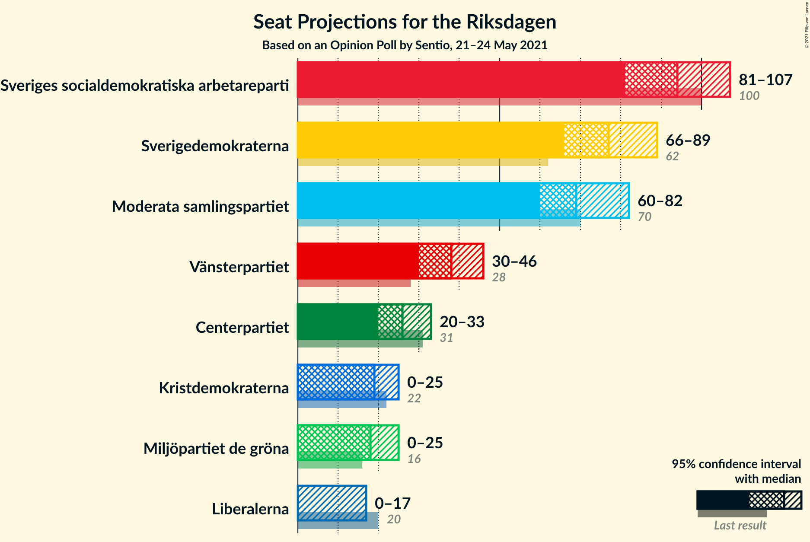
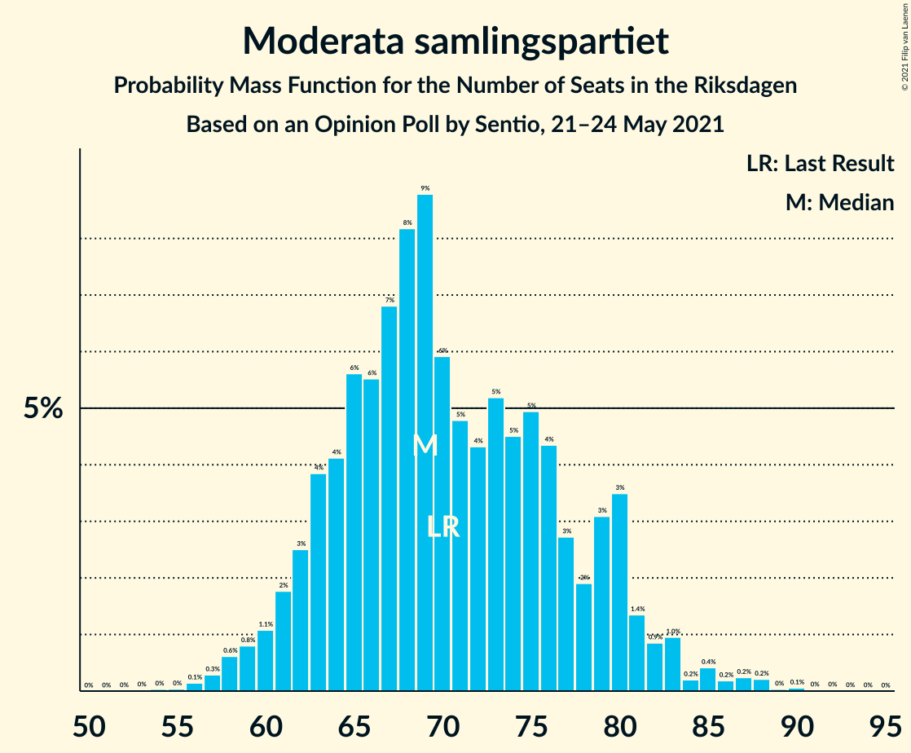
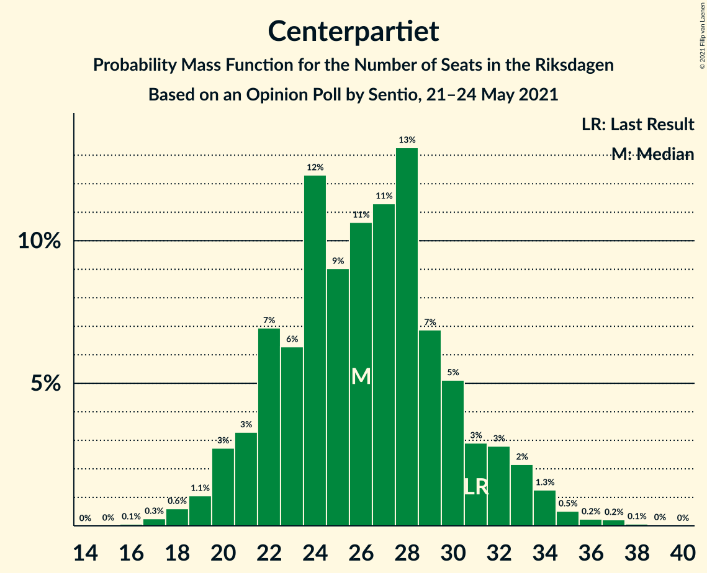
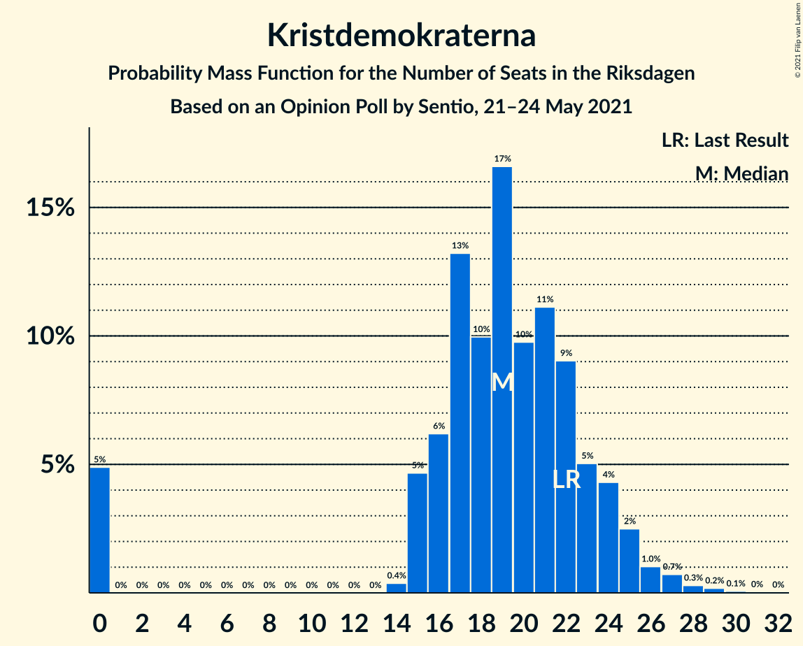
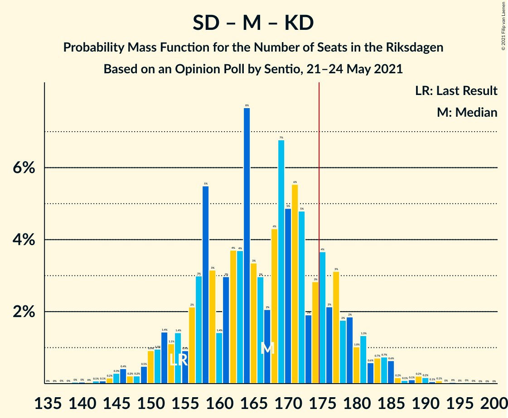
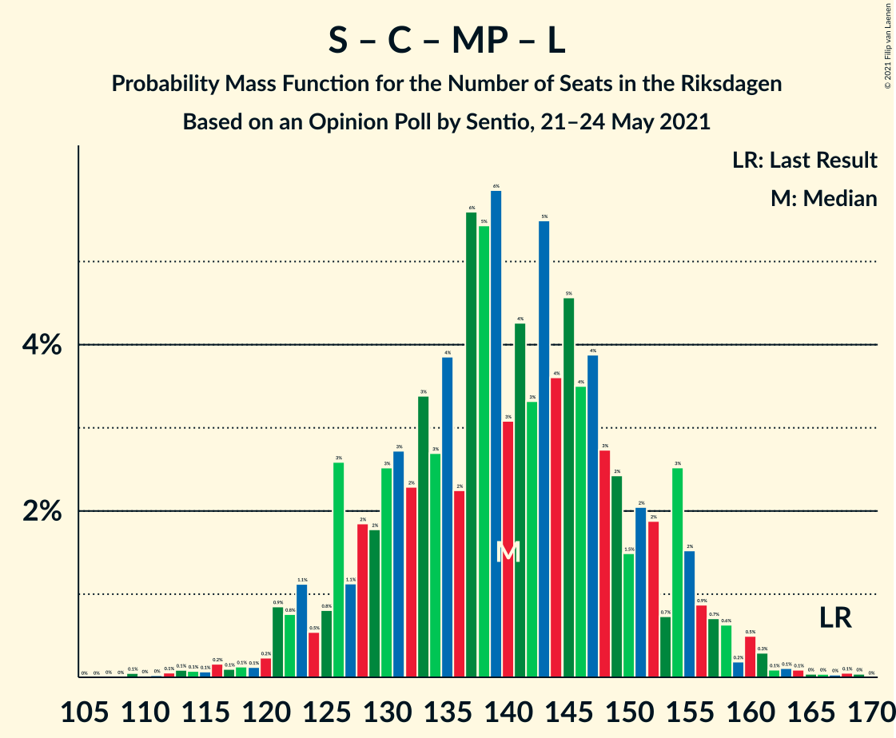

# Opinion Poll by Sentio, 21–24 May 2021

<a href="#voting-intentions">Voting Intentions</a> | <a href="#seats">Seats</a> | <a href="#coalitions">Coalitions</a> | <a href="#technical-information">Technical Information</a>

## Voting Intentions

### Confidence Intervals

| Party | Last Result | Poll Result | 80% Confidence Interval | 90% Confidence Interval | 95% Confidence Interval | 99% Confidence Interval |
|:-----:|:-----------:|:-----------:|:-----------------------:|:-----------------------:|:-----------------------:|:-----------------------:|
| Sveriges socialdemokratiska arbetareparti | 28.3% | 25.5% | 23.6–27.5% |23.0–28.1% |22.6–28.6% |21.7–29.6% |
| Sverigedemokraterna | 17.5% | 21.0% | 19.3–23.0% |18.8–23.5% |18.3–24.0% |17.5–25.0% |
| Moderata samlingspartiet | 19.8% | 19.3% | 17.6–21.2% |17.1–21.7% |16.7–22.2% |15.9–23.1% |
| Vänsterpartiet | 8.0% | 10.3% | 9.0–11.8% |8.6–12.2% |8.3–12.6% |7.8–13.4% |
| Centerpartiet | 8.6% | 7.0% | 5.9–8.3% |5.6–8.6% |5.4–9.0% |4.9–9.6% |
| Kristdemokraterna | 6.3% | 5.2% | 4.3–6.4% |4.1–6.7% |3.9–7.0% |3.5–7.6% |
| Miljöpartiet de gröna | 4.4% | 4.9% | 4.1–6.1% |3.8–6.4% |3.6–6.7% |3.3–7.3% |
| Liberalerna | 5.5% | 3.3% | 2.6–4.3% |2.4–4.5% |2.3–4.8% |2.0–5.3% |

*Note:* The poll result column reflects the actual value used in the calculations. Published results may vary slightly, and in addition be rounded to fewer digits.

## Seats

### Confidence Intervals

| Party | Last Result | Median | 80% Confidence Interval | 90% Confidence Interval | 95% Confidence Interval | 99% Confidence Interval |
|:-----:|:-----------:|:------:|:-----------------------:|:-----------------------:|:-----------------------:|:-----------------------:|
| <a href="#sveriges-socialdemokratiska-arbetareparti">Sveriges socialdemokratiska arbetareparti</a> | 100 | 95 | 85–103 |84–103 |81–105 |79–108 |
| <a href="#sverigedemokraterna">Sverigedemokraterna</a> | 62 | 77 | 71–83 |68–86 |67–88 |64–93 |
| <a href="#moderata-samlingspartiet">Moderata samlingspartiet</a> | 70 | 69 | 65–75 |64–77 |63–81 |58–85 |
| <a href="#vänsterpartiet">Vänsterpartiet</a> | 28 | 38 | 33–44 |32–46 |31–46 |28–49 |
| <a href="#centerpartiet">Centerpartiet</a> | 31 | 27 | 23–29 |21–32 |20–33 |18–36 |
| <a href="#kristdemokraterna">Kristdemokraterna</a> | 22 | 20 | 15–23 |15–24 |0–25 |0–27 |
| <a href="#miljöpartiet-de-gröna">Miljöpartiet de gröna</a> | 16 | 19 | 0–22 |0–23 |0–25 |0–26 |
| <a href="#liberalerna">Liberalerna</a> | 20 | 0 | 0–16 |0–17 |0–17 |0–18 |

### Sveriges socialdemokratiska arbetareparti

*For a full overview of the results for this party, see the [Sveriges socialdemokratiska arbetareparti](party-sverigessocialdemokratiskaarbetareparti.html) page.*

| Number of Seats | Probability | Accumulated | Special Marks |
|:---------------:|:-----------:|:-----------:|:-------------:|
| 74 | 0% | 100% |  |
| 75 | 0.1% | 99.9% |  |
| 76 | 0% | 99.9% |  |
| 77 | 0% | 99.9% |  |
| 78 | 0.1% | 99.8% |  |
| 79 | 2% | 99.7% |  |
| 80 | 0.3% | 98% |  |
| 81 | 0.5% | 98% |  |
| 82 | 0.6% | 97% |  |
| 83 | 0.4% | 97% |  |
| 84 | 2% | 96% |  |
| 85 | 6% | 94% |  |
| 86 | 2% | 89% |  |
| 87 | 3% | 87% |  |
| 88 | 1.3% | 83% |  |
| 89 | 4% | 82% |  |
| 90 | 13% | 78% |  |
| 91 | 2% | 65% |  |
| 92 | 2% | 63% |  |
| 93 | 3% | 61% |  |
| 94 | 4% | 58% |  |
| 95 | 7% | 54% | Median |
| 96 | 2% | 47% |  |
| 97 | 6% | 45% |  |
| 98 | 16% | 40% |  |
| 99 | 8% | 24% |  |
| 100 | 2% | 16% | Last Result |
| 101 | 3% | 14% |  |
| 102 | 0.8% | 11% |  |
| 103 | 7% | 10% |  |
| 104 | 0.7% | 4% |  |
| 105 | 0.5% | 3% |  |
| 106 | 0.7% | 2% |  |
| 107 | 0.9% | 2% |  |
| 108 | 0.4% | 0.8% |  |
| 109 | 0.2% | 0.4% |  |
| 110 | 0% | 0.2% |  |
| 111 | 0.1% | 0.2% |  |
| 112 | 0% | 0.1% |  |
| 113 | 0% | 0.1% |  |
| 114 | 0% | 0% |  |

### Sverigedemokraterna

*For a full overview of the results for this party, see the [Sverigedemokraterna](party-sverigedemokraterna.html) page.*

| Number of Seats | Probability | Accumulated | Special Marks |
|:---------------:|:-----------:|:-----------:|:-------------:|
| 60 | 0.1% | 100% |  |
| 61 | 0% | 99.9% |  |
| 62 | 0.2% | 99.9% | Last Result |
| 63 | 0.1% | 99.7% |  |
| 64 | 0.3% | 99.6% |  |
| 65 | 0.8% | 99.3% |  |
| 66 | 0.5% | 98% |  |
| 67 | 1.0% | 98% |  |
| 68 | 3% | 97% |  |
| 69 | 0.8% | 94% |  |
| 70 | 1.4% | 93% |  |
| 71 | 3% | 92% |  |
| 72 | 8% | 89% |  |
| 73 | 10% | 81% |  |
| 74 | 3% | 71% |  |
| 75 | 5% | 68% |  |
| 76 | 10% | 63% |  |
| 77 | 4% | 52% | Median |
| 78 | 22% | 48% |  |
| 79 | 0.7% | 26% |  |
| 80 | 2% | 25% |  |
| 81 | 10% | 23% |  |
| 82 | 2% | 13% |  |
| 83 | 2% | 11% |  |
| 84 | 1.3% | 9% |  |
| 85 | 0.7% | 8% |  |
| 86 | 3% | 7% |  |
| 87 | 0.7% | 4% |  |
| 88 | 0.7% | 3% |  |
| 89 | 0.2% | 2% |  |
| 90 | 0.6% | 2% |  |
| 91 | 0.8% | 2% |  |
| 92 | 0.2% | 0.7% |  |
| 93 | 0.1% | 0.5% |  |
| 94 | 0.3% | 0.4% |  |
| 95 | 0.1% | 0.1% |  |
| 96 | 0% | 0% |  |

### Moderata samlingspartiet

*For a full overview of the results for this party, see the [Moderata samlingspartiet](party-moderatasamlingspartiet.html) page.*

| Number of Seats | Probability | Accumulated | Special Marks |
|:---------------:|:-----------:|:-----------:|:-------------:|
| 54 | 0% | 100% |  |
| 55 | 0% | 99.9% |  |
| 56 | 0.1% | 99.9% |  |
| 57 | 0.2% | 99.8% |  |
| 58 | 0.3% | 99.7% |  |
| 59 | 0.3% | 99.4% |  |
| 60 | 0.2% | 99.2% |  |
| 61 | 0.4% | 98.9% |  |
| 62 | 0.9% | 98.5% |  |
| 63 | 0.6% | 98% |  |
| 64 | 4% | 97% |  |
| 65 | 5% | 93% |  |
| 66 | 4% | 89% |  |
| 67 | 7% | 85% |  |
| 68 | 9% | 78% |  |
| 69 | 27% | 69% | Median |
| 70 | 3% | 42% | Last Result |
| 71 | 8% | 40% |  |
| 72 | 2% | 32% |  |
| 73 | 10% | 29% |  |
| 74 | 7% | 20% |  |
| 75 | 6% | 13% |  |
| 76 | 2% | 7% |  |
| 77 | 0.6% | 5% |  |
| 78 | 0.9% | 5% |  |
| 79 | 0.7% | 4% |  |
| 80 | 0.5% | 3% |  |
| 81 | 0.6% | 3% |  |
| 82 | 0.6% | 2% |  |
| 83 | 0.2% | 2% |  |
| 84 | 0.6% | 2% |  |
| 85 | 0.5% | 0.9% |  |
| 86 | 0.1% | 0.4% |  |
| 87 | 0% | 0.2% |  |
| 88 | 0.1% | 0.2% |  |
| 89 | 0.1% | 0.1% |  |
| 90 | 0% | 0% |  |

### Vänsterpartiet

*For a full overview of the results for this party, see the [Vänsterpartiet](party-vänsterpartiet.html) page.*

| Number of Seats | Probability | Accumulated | Special Marks |
|:---------------:|:-----------:|:-----------:|:-------------:|
| 26 | 0% | 100% |  |
| 27 | 0.4% | 99.9% |  |
| 28 | 0.2% | 99.5% | Last Result |
| 29 | 0.4% | 99.4% |  |
| 30 | 0.9% | 98.9% |  |
| 31 | 1.4% | 98% |  |
| 32 | 4% | 97% |  |
| 33 | 3% | 93% |  |
| 34 | 5% | 89% |  |
| 35 | 23% | 85% |  |
| 36 | 5% | 62% |  |
| 37 | 2% | 57% |  |
| 38 | 7% | 55% | Median |
| 39 | 12% | 48% |  |
| 40 | 15% | 36% |  |
| 41 | 4% | 21% |  |
| 42 | 2% | 17% |  |
| 43 | 4% | 15% |  |
| 44 | 0.8% | 10% |  |
| 45 | 3% | 9% |  |
| 46 | 4% | 7% |  |
| 47 | 0.9% | 2% |  |
| 48 | 0.9% | 1.5% |  |
| 49 | 0.1% | 0.5% |  |
| 50 | 0% | 0.4% |  |
| 51 | 0.2% | 0.4% |  |
| 52 | 0% | 0.1% |  |
| 53 | 0% | 0.1% |  |
| 54 | 0% | 0.1% |  |
| 55 | 0% | 0% |  |

### Centerpartiet

*For a full overview of the results for this party, see the [Centerpartiet](party-centerpartiet.html) page.*

| Number of Seats | Probability | Accumulated | Special Marks |
|:---------------:|:-----------:|:-----------:|:-------------:|
| 16 | 0% | 100% |  |
| 17 | 0.4% | 99.9% |  |
| 18 | 0.6% | 99.5% |  |
| 19 | 1.2% | 98.9% |  |
| 20 | 2% | 98% |  |
| 21 | 0.9% | 96% |  |
| 22 | 3% | 95% |  |
| 23 | 5% | 92% |  |
| 24 | 12% | 87% |  |
| 25 | 9% | 75% |  |
| 26 | 6% | 66% |  |
| 27 | 31% | 59% | Median |
| 28 | 15% | 28% |  |
| 29 | 3% | 13% |  |
| 30 | 3% | 10% |  |
| 31 | 1.4% | 7% | Last Result |
| 32 | 3% | 6% |  |
| 33 | 1.3% | 3% |  |
| 34 | 0.2% | 2% |  |
| 35 | 0.9% | 1.4% |  |
| 36 | 0.2% | 0.5% |  |
| 37 | 0.3% | 0.3% |  |
| 38 | 0% | 0% |  |

### Kristdemokraterna

*For a full overview of the results for this party, see the [Kristdemokraterna](party-kristdemokraterna.html) page.*

| Number of Seats | Probability | Accumulated | Special Marks |
|:---------------:|:-----------:|:-----------:|:-------------:|
| 0 | 3% | 100% |  |
| 1 | 0% | 97% |  |
| 2 | 0% | 97% |  |
| 3 | 0% | 97% |  |
| 4 | 0% | 97% |  |
| 5 | 0% | 97% |  |
| 6 | 0% | 97% |  |
| 7 | 0% | 97% |  |
| 8 | 0% | 97% |  |
| 9 | 0% | 97% |  |
| 10 | 0% | 97% |  |
| 11 | 0% | 97% |  |
| 12 | 0% | 97% |  |
| 13 | 0% | 97% |  |
| 14 | 0.1% | 97% |  |
| 15 | 9% | 97% |  |
| 16 | 6% | 88% |  |
| 17 | 11% | 82% |  |
| 18 | 7% | 71% |  |
| 19 | 12% | 64% |  |
| 20 | 9% | 52% | Median |
| 21 | 13% | 43% |  |
| 22 | 18% | 30% | Last Result |
| 23 | 5% | 12% |  |
| 24 | 4% | 7% |  |
| 25 | 1.4% | 3% |  |
| 26 | 1.2% | 2% |  |
| 27 | 0.2% | 0.6% |  |
| 28 | 0.2% | 0.4% |  |
| 29 | 0.1% | 0.2% |  |
| 30 | 0% | 0.1% |  |
| 31 | 0% | 0% |  |

### Miljöpartiet de gröna

*For a full overview of the results for this party, see the [Miljöpartiet de gröna](party-miljöpartietdegröna.html) page.*

| Number of Seats | Probability | Accumulated | Special Marks |
|:---------------:|:-----------:|:-----------:|:-------------:|
| 0 | 16% | 100% |  |
| 1 | 0% | 84% |  |
| 2 | 0% | 84% |  |
| 3 | 0% | 84% |  |
| 4 | 0% | 84% |  |
| 5 | 0% | 84% |  |
| 6 | 0% | 84% |  |
| 7 | 0% | 84% |  |
| 8 | 0% | 84% |  |
| 9 | 0% | 84% |  |
| 10 | 0% | 84% |  |
| 11 | 0% | 84% |  |
| 12 | 0% | 84% |  |
| 13 | 0% | 84% |  |
| 14 | 0.1% | 84% |  |
| 15 | 2% | 84% |  |
| 16 | 7% | 82% | Last Result |
| 17 | 17% | 75% |  |
| 18 | 6% | 58% |  |
| 19 | 5% | 52% | Median |
| 20 | 28% | 47% |  |
| 21 | 4% | 19% |  |
| 22 | 10% | 15% |  |
| 23 | 1.4% | 6% |  |
| 24 | 1.5% | 4% |  |
| 25 | 0.9% | 3% |  |
| 26 | 1.4% | 2% |  |
| 27 | 0.3% | 0.4% |  |
| 28 | 0.1% | 0.2% |  |
| 29 | 0% | 0.1% |  |
| 30 | 0% | 0% |  |

### Liberalerna

*For a full overview of the results for this party, see the [Liberalerna](party-liberalerna.html) page.*

| Number of Seats | Probability | Accumulated | Special Marks |
|:---------------:|:-----------:|:-----------:|:-------------:|
| 0 | 82% | 100% | Median |
| 1 | 0% | 18% |  |
| 2 | 0% | 18% |  |
| 3 | 0% | 18% |  |
| 4 | 0% | 18% |  |
| 5 | 0% | 18% |  |
| 6 | 0% | 18% |  |
| 7 | 0% | 18% |  |
| 8 | 0% | 18% |  |
| 9 | 0% | 18% |  |
| 10 | 0% | 18% |  |
| 11 | 0% | 18% |  |
| 12 | 0% | 18% |  |
| 13 | 0% | 18% |  |
| 14 | 0.6% | 18% |  |
| 15 | 4% | 17% |  |
| 16 | 8% | 13% |  |
| 17 | 4% | 5% |  |
| 18 | 0.9% | 1.2% |  |
| 19 | 0.2% | 0.4% |  |
| 20 | 0.1% | 0.2% | Last Result |
| 21 | 0.1% | 0.1% |  |
| 22 | 0% | 0% |  |

## Coalitions

### Confidence Intervals

| Coalition | Last Result | Median | Majority? | 80% Confidence Interval | 90% Confidence Interval | 95% Confidence Interval | 99% Confidence Interval |
|:---------:|:-----------:|:------:|:---------:|:-----------------------:|:-----------------------:|:-----------------------:|:-----------------------:|
| Sveriges socialdemokratiska arbetareparti – Moderata samlingspartiet – Centerpartiet | 201 | 191 | 96% | 179–201 | 177–205 | 173–206 | 170–211 |
| Sveriges socialdemokratiska arbetareparti – Vänsterpartiet – Centerpartiet – Miljöpartiet de gröna – Liberalerna | 195 | 178 | 70% | 166–187 | 166–190 | 160–196 | 157–198 |
| Sverigedemokraterna – Moderata samlingspartiet – Kristdemokraterna | 154 | 168 | 12% | 157–175 | 153–177 | 151–182 | 147–190 |
| Sveriges socialdemokratiska arbetareparti – Moderata samlingspartiet | 170 | 166 | 11% | 153–175 | 151–177 | 148–180 | 146–183 |
| Sveriges socialdemokratiska arbetareparti – Vänsterpartiet – Miljöpartiet de gröna | 144 | 149 | 0% | 136–158 | 135–163 | 133–165 | 128–168 |
| Sverigedemokraterna – Moderata samlingspartiet | 132 | 147 | 0.2% | 140–154 | 135–159 | 132–162 | 129–172 |
| Sveriges socialdemokratiska arbetareparti – Centerpartiet – Miljöpartiet de gröna – Liberalerna | 167 | 140 | 0% | 126–149 | 126–152 | 126–155 | 116–159 |
| Sveriges socialdemokratiska arbetareparti – Vänsterpartiet | 128 | 133 | 0% | 122–141 | 119–143 | 118–145 | 114–150 |
| Moderata samlingspartiet – Centerpartiet – Kristdemokraterna – Liberalerna | 143 | 118 | 0% | 111–131 | 108–134 | 104–139 | 98–139 |
| Moderata samlingspartiet – Centerpartiet – Kristdemokraterna | 123 | 116 | 0% | 108–123 | 107–125 | 102–128 | 97–132 |
| Sveriges socialdemokratiska arbetareparti – Miljöpartiet de gröna | 116 | 110 | 0% | 99–120 | 95–122 | 95–124 | 90–129 |
| Moderata samlingspartiet – Centerpartiet – Liberalerna | 121 | 97 | 0% | 90–111 | 90–115 | 88–118 | 83–118 |
| Moderata samlingspartiet – Centerpartiet | 101 | 96 | 0% | 90–103 | 88–105 | 86–108 | 82–114 |

### Sveriges socialdemokratiska arbetareparti – Moderata samlingspartiet – Centerpartiet

| Number of Seats | Probability | Accumulated | Special Marks |
|:---------------:|:-----------:|:-----------:|:-------------:|
| 164 | 0% | 100% |  |
| 165 | 0% | 99.9% |  |
| 166 | 0.1% | 99.9% |  |
| 167 | 0% | 99.8% |  |
| 168 | 0% | 99.8% |  |
| 169 | 0.3% | 99.8% |  |
| 170 | 0.2% | 99.5% |  |
| 171 | 1.5% | 99.3% |  |
| 172 | 0.1% | 98% |  |
| 173 | 0.9% | 98% |  |
| 174 | 0.4% | 97% |  |
| 175 | 0.2% | 96% | Majority |
| 176 | 1.2% | 96% |  |
| 177 | 1.1% | 95% |  |
| 178 | 1.3% | 94% |  |
| 179 | 4% | 93% |  |
| 180 | 5% | 89% |  |
| 181 | 1.1% | 84% |  |
| 182 | 1.0% | 83% |  |
| 183 | 3% | 82% |  |
| 184 | 2% | 79% |  |
| 185 | 3% | 77% |  |
| 186 | 4% | 74% |  |
| 187 | 9% | 70% |  |
| 188 | 2% | 61% |  |
| 189 | 1.2% | 59% |  |
| 190 | 6% | 57% |  |
| 191 | 3% | 52% | Median |
| 192 | 0.7% | 49% |  |
| 193 | 2% | 48% |  |
| 194 | 17% | 46% |  |
| 195 | 2% | 29% |  |
| 196 | 0.5% | 28% |  |
| 197 | 7% | 27% |  |
| 198 | 1.2% | 20% |  |
| 199 | 8% | 19% |  |
| 200 | 0.9% | 11% |  |
| 201 | 0.9% | 11% | Last Result |
| 202 | 0.1% | 10% |  |
| 203 | 0.2% | 10% |  |
| 204 | 0.6% | 9% |  |
| 205 | 6% | 9% |  |
| 206 | 0.7% | 3% |  |
| 207 | 0.8% | 2% |  |
| 208 | 0% | 2% |  |
| 209 | 0.1% | 2% |  |
| 210 | 0.6% | 2% |  |
| 211 | 0.5% | 0.9% |  |
| 212 | 0.1% | 0.4% |  |
| 213 | 0.1% | 0.3% |  |
| 214 | 0% | 0.2% |  |
| 215 | 0.1% | 0.1% |  |
| 216 | 0% | 0.1% |  |
| 217 | 0% | 0.1% |  |
| 218 | 0% | 0.1% |  |
| 219 | 0% | 0% |  |

### Sveriges socialdemokratiska arbetareparti – Vänsterpartiet – Centerpartiet – Miljöpartiet de gröna – Liberalerna

| Number of Seats | Probability | Accumulated | Special Marks |
|:---------------:|:-----------:|:-----------:|:-------------:|
| 150 | 0% | 100% |  |
| 151 | 0% | 99.9% |  |
| 152 | 0% | 99.9% |  |
| 153 | 0.1% | 99.9% |  |
| 154 | 0% | 99.8% |  |
| 155 | 0% | 99.7% |  |
| 156 | 0.1% | 99.7% |  |
| 157 | 0.4% | 99.6% |  |
| 158 | 0.2% | 99.3% |  |
| 159 | 1.2% | 99.1% |  |
| 160 | 0.5% | 98% |  |
| 161 | 0.3% | 97% |  |
| 162 | 0.4% | 97% |  |
| 163 | 0.5% | 97% |  |
| 164 | 0.1% | 96% |  |
| 165 | 0.5% | 96% |  |
| 166 | 10% | 96% |  |
| 167 | 1.1% | 85% |  |
| 168 | 0.2% | 84% |  |
| 169 | 1.4% | 84% |  |
| 170 | 5% | 82% |  |
| 171 | 0.4% | 78% |  |
| 172 | 2% | 77% |  |
| 173 | 2% | 75% |  |
| 174 | 3% | 73% |  |
| 175 | 2% | 70% | Majority |
| 176 | 0.9% | 68% |  |
| 177 | 11% | 67% |  |
| 178 | 9% | 57% |  |
| 179 | 2% | 48% | Median |
| 180 | 16% | 45% |  |
| 181 | 3% | 29% |  |
| 182 | 0.4% | 26% |  |
| 183 | 1.0% | 26% |  |
| 184 | 5% | 25% |  |
| 185 | 3% | 19% |  |
| 186 | 6% | 17% |  |
| 187 | 2% | 10% |  |
| 188 | 0.4% | 8% |  |
| 189 | 0.7% | 8% |  |
| 190 | 2% | 7% |  |
| 191 | 0.6% | 5% |  |
| 192 | 0.9% | 4% |  |
| 193 | 0.2% | 3% |  |
| 194 | 0.3% | 3% |  |
| 195 | 0.2% | 3% | Last Result |
| 196 | 0.2% | 3% |  |
| 197 | 1.3% | 2% |  |
| 198 | 0.8% | 1.1% |  |
| 199 | 0.1% | 0.3% |  |
| 200 | 0% | 0.3% |  |
| 201 | 0.1% | 0.3% |  |
| 202 | 0.1% | 0.1% |  |
| 203 | 0% | 0.1% |  |
| 204 | 0% | 0% |  |

### Sverigedemokraterna – Moderata samlingspartiet – Kristdemokraterna

| Number of Seats | Probability | Accumulated | Special Marks |
|:---------------:|:-----------:|:-----------:|:-------------:|
| 139 | 0% | 100% |  |
| 140 | 0% | 99.9% |  |
| 141 | 0% | 99.9% |  |
| 142 | 0% | 99.9% |  |
| 143 | 0.1% | 99.9% |  |
| 144 | 0.1% | 99.8% |  |
| 145 | 0.1% | 99.7% |  |
| 146 | 0.1% | 99.7% |  |
| 147 | 0.1% | 99.5% |  |
| 148 | 0.3% | 99.4% |  |
| 149 | 0.7% | 99.1% |  |
| 150 | 0.4% | 98% |  |
| 151 | 1.2% | 98% |  |
| 152 | 2% | 97% |  |
| 153 | 0.8% | 95% |  |
| 154 | 0.5% | 94% | Last Result |
| 155 | 0.6% | 94% |  |
| 156 | 0.7% | 93% |  |
| 157 | 9% | 93% |  |
| 158 | 2% | 84% |  |
| 159 | 2% | 81% |  |
| 160 | 1.1% | 79% |  |
| 161 | 3% | 78% |  |
| 162 | 3% | 75% |  |
| 163 | 7% | 71% |  |
| 164 | 3% | 64% |  |
| 165 | 5% | 61% |  |
| 166 | 3% | 56% | Median |
| 167 | 0.4% | 53% |  |
| 168 | 10% | 53% |  |
| 169 | 16% | 43% |  |
| 170 | 2% | 27% |  |
| 171 | 9% | 24% |  |
| 172 | 1.1% | 15% |  |
| 173 | 0.2% | 14% |  |
| 174 | 2% | 14% |  |
| 175 | 3% | 12% | Majority |
| 176 | 2% | 9% |  |
| 177 | 2% | 7% |  |
| 178 | 0.2% | 5% |  |
| 179 | 0.6% | 4% |  |
| 180 | 0.9% | 4% |  |
| 181 | 0.2% | 3% |  |
| 182 | 0.9% | 3% |  |
| 183 | 0.2% | 2% |  |
| 184 | 0.5% | 2% |  |
| 185 | 0.1% | 1.1% |  |
| 186 | 0% | 1.0% |  |
| 187 | 0.1% | 1.0% |  |
| 188 | 0.1% | 0.9% |  |
| 189 | 0.3% | 0.8% |  |
| 190 | 0% | 0.5% |  |
| 191 | 0% | 0.5% |  |
| 192 | 0.4% | 0.5% |  |
| 193 | 0% | 0.1% |  |
| 194 | 0% | 0.1% |  |
| 195 | 0% | 0.1% |  |
| 196 | 0.1% | 0.1% |  |
| 197 | 0% | 0% |  |

### Sveriges socialdemokratiska arbetareparti – Moderata samlingspartiet

| Number of Seats | Probability | Accumulated | Special Marks |
|:---------------:|:-----------:|:-----------:|:-------------:|
| 139 | 0% | 100% |  |
| 140 | 0% | 99.9% |  |
| 141 | 0% | 99.9% |  |
| 142 | 0.1% | 99.9% |  |
| 143 | 0.1% | 99.8% |  |
| 144 | 0% | 99.8% |  |
| 145 | 0.1% | 99.7% |  |
| 146 | 2% | 99.6% |  |
| 147 | 0.5% | 98% |  |
| 148 | 0.2% | 98% |  |
| 149 | 1.3% | 97% |  |
| 150 | 0.5% | 96% |  |
| 151 | 1.1% | 96% |  |
| 152 | 1.0% | 95% |  |
| 153 | 4% | 94% |  |
| 154 | 4% | 90% |  |
| 155 | 0.2% | 86% |  |
| 156 | 2% | 86% |  |
| 157 | 4% | 84% |  |
| 158 | 4% | 79% |  |
| 159 | 8% | 75% |  |
| 160 | 2% | 67% |  |
| 161 | 3% | 65% |  |
| 162 | 5% | 62% |  |
| 163 | 0.8% | 57% |  |
| 164 | 3% | 56% | Median |
| 165 | 2% | 53% |  |
| 166 | 5% | 51% |  |
| 167 | 16% | 47% |  |
| 168 | 0.9% | 31% |  |
| 169 | 2% | 30% |  |
| 170 | 5% | 28% | Last Result |
| 171 | 0.6% | 22% |  |
| 172 | 9% | 21% |  |
| 173 | 0.5% | 12% |  |
| 174 | 0.7% | 12% |  |
| 175 | 1.4% | 11% | Majority |
| 176 | 0.2% | 10% |  |
| 177 | 6% | 10% |  |
| 178 | 0.5% | 4% |  |
| 179 | 0.8% | 3% |  |
| 180 | 0.7% | 3% |  |
| 181 | 1.2% | 2% |  |
| 182 | 0.2% | 0.8% |  |
| 183 | 0.3% | 0.6% |  |
| 184 | 0% | 0.3% |  |
| 185 | 0% | 0.3% |  |
| 186 | 0.1% | 0.3% |  |
| 187 | 0% | 0.2% |  |
| 188 | 0.1% | 0.2% |  |
| 189 | 0% | 0.1% |  |
| 190 | 0% | 0.1% |  |
| 191 | 0% | 0.1% |  |
| 192 | 0% | 0.1% |  |
| 193 | 0% | 0.1% |  |
| 194 | 0% | 0.1% |  |
| 195 | 0% | 0% |  |

### Sveriges socialdemokratiska arbetareparti – Vänsterpartiet – Miljöpartiet de gröna

| Number of Seats | Probability | Accumulated | Special Marks |
|:---------------:|:-----------:|:-----------:|:-------------:|
| 119 | 0% | 100% |  |
| 120 | 0% | 99.9% |  |
| 121 | 0% | 99.9% |  |
| 122 | 0% | 99.9% |  |
| 123 | 0% | 99.9% |  |
| 124 | 0% | 99.9% |  |
| 125 | 0.1% | 99.8% |  |
| 126 | 0.1% | 99.8% |  |
| 127 | 0.1% | 99.7% |  |
| 128 | 0.2% | 99.6% |  |
| 129 | 0.1% | 99.4% |  |
| 130 | 0.1% | 99.3% |  |
| 131 | 0.1% | 99.2% |  |
| 132 | 0.3% | 99.1% |  |
| 133 | 1.3% | 98.8% |  |
| 134 | 1.1% | 97% |  |
| 135 | 5% | 96% |  |
| 136 | 3% | 92% |  |
| 137 | 0.3% | 89% |  |
| 138 | 0.6% | 88% |  |
| 139 | 9% | 88% |  |
| 140 | 1.1% | 79% |  |
| 141 | 4% | 78% |  |
| 142 | 2% | 73% |  |
| 143 | 5% | 71% |  |
| 144 | 0.9% | 66% | Last Result |
| 145 | 0.3% | 65% |  |
| 146 | 3% | 65% |  |
| 147 | 2% | 61% |  |
| 148 | 2% | 59% |  |
| 149 | 10% | 57% |  |
| 150 | 0.8% | 48% |  |
| 151 | 4% | 47% |  |
| 152 | 1.3% | 43% | Median |
| 153 | 14% | 42% |  |
| 154 | 5% | 27% |  |
| 155 | 2% | 22% |  |
| 156 | 4% | 20% |  |
| 157 | 0.4% | 17% |  |
| 158 | 6% | 16% |  |
| 159 | 0.4% | 10% |  |
| 160 | 4% | 10% |  |
| 161 | 0.4% | 6% |  |
| 162 | 0.4% | 5% |  |
| 163 | 2% | 5% |  |
| 164 | 0.1% | 3% |  |
| 165 | 0.9% | 3% |  |
| 166 | 0% | 2% |  |
| 167 | 1.3% | 2% |  |
| 168 | 0.4% | 0.7% |  |
| 169 | 0% | 0.3% |  |
| 170 | 0.2% | 0.3% |  |
| 171 | 0.1% | 0.1% |  |
| 172 | 0% | 0.1% |  |
| 173 | 0% | 0.1% |  |
| 174 | 0% | 0% |  |

### Sverigedemokraterna – Moderata samlingspartiet

| Number of Seats | Probability | Accumulated | Special Marks |
|:---------------:|:-----------:|:-----------:|:-------------:|
| 125 | 0% | 100% |  |
| 126 | 0% | 99.9% |  |
| 127 | 0.1% | 99.9% |  |
| 128 | 0% | 99.8% |  |
| 129 | 0.6% | 99.8% |  |
| 130 | 0.6% | 99.2% |  |
| 131 | 0.2% | 98.5% |  |
| 132 | 1.1% | 98% | Last Result |
| 133 | 0.6% | 97% |  |
| 134 | 0.9% | 97% |  |
| 135 | 1.0% | 96% |  |
| 136 | 0.6% | 95% |  |
| 137 | 0.6% | 94% |  |
| 138 | 1.1% | 93% |  |
| 139 | 2% | 92% |  |
| 140 | 2% | 91% |  |
| 141 | 1.5% | 89% |  |
| 142 | 11% | 87% |  |
| 143 | 5% | 76% |  |
| 144 | 5% | 71% |  |
| 145 | 4% | 67% |  |
| 146 | 7% | 63% | Median |
| 147 | 15% | 55% |  |
| 148 | 3% | 40% |  |
| 149 | 9% | 37% |  |
| 150 | 9% | 28% |  |
| 151 | 2% | 19% |  |
| 152 | 3% | 17% |  |
| 153 | 2% | 14% |  |
| 154 | 2% | 12% |  |
| 155 | 0.7% | 10% |  |
| 156 | 1.0% | 9% |  |
| 157 | 1.3% | 8% |  |
| 158 | 1.0% | 7% |  |
| 159 | 1.2% | 6% |  |
| 160 | 0.5% | 5% |  |
| 161 | 1.4% | 4% |  |
| 162 | 0.4% | 3% |  |
| 163 | 0.1% | 2% |  |
| 164 | 0.1% | 2% |  |
| 165 | 0.1% | 2% |  |
| 166 | 0% | 2% |  |
| 167 | 0.1% | 2% |  |
| 168 | 0.4% | 2% |  |
| 169 | 0.3% | 1.5% |  |
| 170 | 0.3% | 1.1% |  |
| 171 | 0.2% | 0.8% |  |
| 172 | 0.3% | 0.6% |  |
| 173 | 0.1% | 0.2% |  |
| 174 | 0% | 0.2% |  |
| 175 | 0.2% | 0.2% | Majority |
| 176 | 0% | 0% |  |

### Sveriges socialdemokratiska arbetareparti – Centerpartiet – Miljöpartiet de gröna – Liberalerna

| Number of Seats | Probability | Accumulated | Special Marks |
|:---------------:|:-----------:|:-----------:|:-------------:|
| 113 | 0.1% | 100% |  |
| 114 | 0% | 99.9% |  |
| 115 | 0% | 99.9% |  |
| 116 | 0.5% | 99.8% |  |
| 117 | 0% | 99.3% |  |
| 118 | 0.3% | 99.3% |  |
| 119 | 0.1% | 99.0% |  |
| 120 | 0% | 98.9% |  |
| 121 | 0.1% | 98.8% |  |
| 122 | 0.3% | 98.8% |  |
| 123 | 0.1% | 98.5% |  |
| 124 | 0.5% | 98% |  |
| 125 | 0.1% | 98% |  |
| 126 | 8% | 98% |  |
| 127 | 1.3% | 90% |  |
| 128 | 2% | 89% |  |
| 129 | 3% | 87% |  |
| 130 | 0.5% | 84% |  |
| 131 | 4% | 83% |  |
| 132 | 2% | 79% |  |
| 133 | 2% | 77% |  |
| 134 | 2% | 76% |  |
| 135 | 0.5% | 74% |  |
| 136 | 2% | 73% |  |
| 137 | 2% | 71% |  |
| 138 | 16% | 69% |  |
| 139 | 3% | 54% |  |
| 140 | 1.1% | 50% |  |
| 141 | 2% | 49% | Median |
| 142 | 3% | 47% |  |
| 143 | 6% | 44% |  |
| 144 | 2% | 38% |  |
| 145 | 14% | 35% |  |
| 146 | 2% | 22% |  |
| 147 | 1.4% | 19% |  |
| 148 | 6% | 18% |  |
| 149 | 2% | 11% |  |
| 150 | 1.1% | 9% |  |
| 151 | 2% | 8% |  |
| 152 | 2% | 6% |  |
| 153 | 0.3% | 4% |  |
| 154 | 0.3% | 4% |  |
| 155 | 1.4% | 3% |  |
| 156 | 0.3% | 2% |  |
| 157 | 0.2% | 2% |  |
| 158 | 0.8% | 1.4% |  |
| 159 | 0.1% | 0.6% |  |
| 160 | 0.1% | 0.5% |  |
| 161 | 0.1% | 0.3% |  |
| 162 | 0.1% | 0.2% |  |
| 163 | 0% | 0.2% |  |
| 164 | 0% | 0.1% |  |
| 165 | 0% | 0.1% |  |
| 166 | 0% | 0.1% |  |
| 167 | 0% | 0.1% | Last Result |
| 168 | 0% | 0% |  |

### Sveriges socialdemokratiska arbetareparti – Vänsterpartiet

| Number of Seats | Probability | Accumulated | Special Marks |
|:---------------:|:-----------:|:-----------:|:-------------:|
| 109 | 0% | 100% |  |
| 110 | 0% | 99.9% |  |
| 111 | 0% | 99.9% |  |
| 112 | 0.1% | 99.9% |  |
| 113 | 0% | 99.7% |  |
| 114 | 0.4% | 99.7% |  |
| 115 | 0.1% | 99.3% |  |
| 116 | 0.4% | 99.3% |  |
| 117 | 1.2% | 98.9% |  |
| 118 | 0.4% | 98% |  |
| 119 | 3% | 97% |  |
| 120 | 0.8% | 94% |  |
| 121 | 2% | 94% |  |
| 122 | 2% | 92% |  |
| 123 | 2% | 90% |  |
| 124 | 3% | 88% |  |
| 125 | 4% | 84% |  |
| 126 | 5% | 81% |  |
| 127 | 0.9% | 75% |  |
| 128 | 1.0% | 74% | Last Result |
| 129 | 10% | 73% |  |
| 130 | 0.8% | 64% |  |
| 131 | 2% | 63% |  |
| 132 | 6% | 61% |  |
| 133 | 17% | 55% | Median |
| 134 | 2% | 38% |  |
| 135 | 8% | 36% |  |
| 136 | 2% | 28% |  |
| 137 | 0.9% | 27% |  |
| 138 | 2% | 26% |  |
| 139 | 8% | 24% |  |
| 140 | 3% | 16% |  |
| 141 | 6% | 13% |  |
| 142 | 0.5% | 8% |  |
| 143 | 3% | 7% |  |
| 144 | 1.1% | 4% |  |
| 145 | 0.8% | 3% |  |
| 146 | 0.6% | 2% |  |
| 147 | 0.2% | 2% |  |
| 148 | 0.3% | 1.5% |  |
| 149 | 0.5% | 1.2% |  |
| 150 | 0.4% | 0.7% |  |
| 151 | 0.1% | 0.3% |  |
| 152 | 0% | 0.2% |  |
| 153 | 0.1% | 0.2% |  |
| 154 | 0% | 0.1% |  |
| 155 | 0% | 0.1% |  |
| 156 | 0% | 0.1% |  |
| 157 | 0% | 0.1% |  |
| 158 | 0% | 0% |  |

### Moderata samlingspartiet – Centerpartiet – Kristdemokraterna – Liberalerna

| Number of Seats | Probability | Accumulated | Special Marks |
|:---------------:|:-----------:|:-----------:|:-------------:|
| 93 | 0% | 100% |  |
| 94 | 0% | 99.9% |  |
| 95 | 0.2% | 99.9% |  |
| 96 | 0% | 99.7% |  |
| 97 | 0.1% | 99.7% |  |
| 98 | 0.3% | 99.6% |  |
| 99 | 0.1% | 99.3% |  |
| 100 | 0.3% | 99.1% |  |
| 101 | 0.1% | 98.8% |  |
| 102 | 0.3% | 98.7% |  |
| 103 | 0.6% | 98% |  |
| 104 | 0.4% | 98% |  |
| 105 | 0.1% | 97% |  |
| 106 | 0.7% | 97% |  |
| 107 | 1.4% | 97% |  |
| 108 | 3% | 95% |  |
| 109 | 0.7% | 92% |  |
| 110 | 0.9% | 91% |  |
| 111 | 4% | 90% |  |
| 112 | 13% | 86% |  |
| 113 | 4% | 73% |  |
| 114 | 5% | 69% |  |
| 115 | 0.9% | 64% |  |
| 116 | 2% | 63% | Median |
| 117 | 2% | 60% |  |
| 118 | 15% | 58% |  |
| 119 | 15% | 43% |  |
| 120 | 0.8% | 28% |  |
| 121 | 0.8% | 27% |  |
| 122 | 2% | 26% |  |
| 123 | 2% | 24% |  |
| 124 | 1.0% | 22% |  |
| 125 | 4% | 21% |  |
| 126 | 2% | 18% |  |
| 127 | 1.1% | 16% |  |
| 128 | 0.7% | 14% |  |
| 129 | 2% | 14% |  |
| 130 | 0.8% | 12% |  |
| 131 | 2% | 11% |  |
| 132 | 2% | 9% |  |
| 133 | 2% | 7% |  |
| 134 | 0.2% | 5% |  |
| 135 | 0% | 5% |  |
| 136 | 0.3% | 5% |  |
| 137 | 0.1% | 5% |  |
| 138 | 0.2% | 5% |  |
| 139 | 4% | 4% |  |
| 140 | 0.1% | 0.3% |  |
| 141 | 0% | 0.2% |  |
| 142 | 0% | 0.2% |  |
| 143 | 0.1% | 0.1% | Last Result |
| 144 | 0% | 0.1% |  |
| 145 | 0% | 0% |  |

### Moderata samlingspartiet – Centerpartiet – Kristdemokraterna

| Number of Seats | Probability | Accumulated | Special Marks |
|:---------------:|:-----------:|:-----------:|:-------------:|
| 89 | 0% | 100% |  |
| 90 | 0% | 99.9% |  |
| 91 | 0% | 99.9% |  |
| 92 | 0% | 99.9% |  |
| 93 | 0.1% | 99.9% |  |
| 94 | 0% | 99.8% |  |
| 95 | 0.2% | 99.8% |  |
| 96 | 0% | 99.6% |  |
| 97 | 0.1% | 99.5% |  |
| 98 | 0.6% | 99.4% |  |
| 99 | 0.5% | 98.8% |  |
| 100 | 0.3% | 98% |  |
| 101 | 0.2% | 98% |  |
| 102 | 0.4% | 98% |  |
| 103 | 0.7% | 97% |  |
| 104 | 0.4% | 97% |  |
| 105 | 0.3% | 96% |  |
| 106 | 0.9% | 96% |  |
| 107 | 2% | 95% |  |
| 108 | 3% | 93% |  |
| 109 | 0.8% | 89% |  |
| 110 | 4% | 89% |  |
| 111 | 5% | 85% |  |
| 112 | 13% | 80% |  |
| 113 | 3% | 67% |  |
| 114 | 8% | 63% |  |
| 115 | 0.9% | 55% |  |
| 116 | 5% | 54% | Median |
| 117 | 3% | 49% |  |
| 118 | 15% | 46% |  |
| 119 | 15% | 31% |  |
| 120 | 0.7% | 16% |  |
| 121 | 0.8% | 15% |  |
| 122 | 2% | 15% |  |
| 123 | 6% | 13% | Last Result |
| 124 | 0.4% | 7% |  |
| 125 | 2% | 7% |  |
| 126 | 0.8% | 5% |  |
| 127 | 1.1% | 4% |  |
| 128 | 0.5% | 3% |  |
| 129 | 0.6% | 2% |  |
| 130 | 0.7% | 2% |  |
| 131 | 0.1% | 1.0% |  |
| 132 | 0.4% | 0.9% |  |
| 133 | 0.2% | 0.5% |  |
| 134 | 0.1% | 0.3% |  |
| 135 | 0% | 0.2% |  |
| 136 | 0% | 0.2% |  |
| 137 | 0.1% | 0.2% |  |
| 138 | 0.1% | 0.1% |  |
| 139 | 0% | 0% |  |

### Sveriges socialdemokratiska arbetareparti – Miljöpartiet de gröna

| Number of Seats | Probability | Accumulated | Special Marks |
|:---------------:|:-----------:|:-----------:|:-------------:|
| 82 | 0.1% | 100% |  |
| 83 | 0% | 99.9% |  |
| 84 | 0% | 99.9% |  |
| 85 | 0% | 99.9% |  |
| 86 | 0.1% | 99.9% |  |
| 87 | 0.1% | 99.8% |  |
| 88 | 0.1% | 99.8% |  |
| 89 | 0% | 99.7% |  |
| 90 | 0.5% | 99.6% |  |
| 91 | 0.2% | 99.1% |  |
| 92 | 0% | 98.9% |  |
| 93 | 0.2% | 98.9% |  |
| 94 | 0.1% | 98.6% |  |
| 95 | 4% | 98.6% |  |
| 96 | 1.5% | 94% |  |
| 97 | 0.6% | 93% |  |
| 98 | 0.5% | 92% |  |
| 99 | 8% | 92% |  |
| 100 | 0.4% | 84% |  |
| 101 | 3% | 84% |  |
| 102 | 3% | 81% |  |
| 103 | 2% | 78% |  |
| 104 | 2% | 76% |  |
| 105 | 0.7% | 74% |  |
| 106 | 6% | 73% |  |
| 107 | 4% | 67% |  |
| 108 | 3% | 63% |  |
| 109 | 2% | 60% |  |
| 110 | 10% | 58% |  |
| 111 | 2% | 48% |  |
| 112 | 1.1% | 46% |  |
| 113 | 1.1% | 45% |  |
| 114 | 4% | 43% | Median |
| 115 | 1.0% | 40% |  |
| 116 | 2% | 39% | Last Result |
| 117 | 3% | 37% |  |
| 118 | 16% | 33% |  |
| 119 | 5% | 18% |  |
| 120 | 7% | 13% |  |
| 121 | 0.3% | 6% |  |
| 122 | 2% | 5% |  |
| 123 | 0.6% | 4% |  |
| 124 | 1.0% | 3% |  |
| 125 | 0.1% | 2% |  |
| 126 | 0.3% | 2% |  |
| 127 | 0.9% | 2% |  |
| 128 | 0.2% | 0.7% |  |
| 129 | 0.2% | 0.5% |  |
| 130 | 0.2% | 0.3% |  |
| 131 | 0% | 0.1% |  |
| 132 | 0% | 0.1% |  |
| 133 | 0% | 0% |  |

### Moderata samlingspartiet – Centerpartiet – Liberalerna

| Number of Seats | Probability | Accumulated | Special Marks |
|:---------------:|:-----------:|:-----------:|:-------------:|
| 79 | 0% | 100% |  |
| 80 | 0.2% | 99.9% |  |
| 81 | 0% | 99.8% |  |
| 82 | 0.1% | 99.7% |  |
| 83 | 0.4% | 99.6% |  |
| 84 | 0.2% | 99.3% |  |
| 85 | 0.2% | 99.0% |  |
| 86 | 0.7% | 98.9% |  |
| 87 | 0.3% | 98% |  |
| 88 | 1.0% | 98% |  |
| 89 | 1.1% | 97% |  |
| 90 | 6% | 96% |  |
| 91 | 3% | 90% |  |
| 92 | 4% | 87% |  |
| 93 | 7% | 83% |  |
| 94 | 2% | 76% |  |
| 95 | 4% | 74% |  |
| 96 | 14% | 70% | Median |
| 97 | 10% | 56% |  |
| 98 | 2% | 46% |  |
| 99 | 2% | 44% |  |
| 100 | 9% | 43% |  |
| 101 | 1.1% | 34% |  |
| 102 | 6% | 32% |  |
| 103 | 3% | 27% |  |
| 104 | 2% | 24% |  |
| 105 | 2% | 22% |  |
| 106 | 1.3% | 19% |  |
| 107 | 1.2% | 18% |  |
| 108 | 3% | 17% |  |
| 109 | 1.4% | 14% |  |
| 110 | 0.3% | 12% |  |
| 111 | 3% | 12% |  |
| 112 | 0.2% | 9% |  |
| 113 | 0.9% | 9% |  |
| 114 | 1.3% | 8% |  |
| 115 | 2% | 7% |  |
| 116 | 0.2% | 5% |  |
| 117 | 0.2% | 5% |  |
| 118 | 4% | 5% |  |
| 119 | 0% | 0.5% |  |
| 120 | 0.1% | 0.4% |  |
| 121 | 0% | 0.4% | Last Result |
| 122 | 0% | 0.3% |  |
| 123 | 0.2% | 0.3% |  |
| 124 | 0% | 0.1% |  |
| 125 | 0% | 0.1% |  |
| 126 | 0.1% | 0.1% |  |
| 127 | 0% | 0% |  |

### Moderata samlingspartiet – Centerpartiet

| Number of Seats | Probability | Accumulated | Special Marks |
|:---------------:|:-----------:|:-----------:|:-------------:|
| 77 | 0% | 100% |  |
| 78 | 0% | 99.9% |  |
| 79 | 0.1% | 99.9% |  |
| 80 | 0.2% | 99.9% |  |
| 81 | 0.1% | 99.7% |  |
| 82 | 0.5% | 99.5% |  |
| 83 | 0.5% | 99.1% |  |
| 84 | 0.3% | 98.6% |  |
| 85 | 0.4% | 98% |  |
| 86 | 0.8% | 98% |  |
| 87 | 0.5% | 97% |  |
| 88 | 2% | 97% |  |
| 89 | 1.3% | 95% |  |
| 90 | 7% | 94% |  |
| 91 | 3% | 86% |  |
| 92 | 7% | 83% |  |
| 93 | 8% | 77% |  |
| 94 | 4% | 69% |  |
| 95 | 4% | 65% |  |
| 96 | 15% | 61% | Median |
| 97 | 10% | 47% |  |
| 98 | 4% | 37% |  |
| 99 | 2% | 33% |  |
| 100 | 9% | 30% |  |
| 101 | 1.3% | 21% | Last Result |
| 102 | 10% | 20% |  |
| 103 | 2% | 10% |  |
| 104 | 2% | 8% |  |
| 105 | 1.5% | 6% |  |
| 106 | 1.0% | 5% |  |
| 107 | 1.2% | 4% |  |
| 108 | 0.5% | 3% |  |
| 109 | 0.5% | 2% |  |
| 110 | 0.2% | 2% |  |
| 111 | 0.5% | 2% |  |
| 112 | 0.1% | 1.1% |  |
| 113 | 0.1% | 1.0% |  |
| 114 | 0.7% | 0.9% |  |
| 115 | 0% | 0.2% |  |
| 116 | 0% | 0.2% |  |
| 117 | 0% | 0.1% |  |
| 118 | 0% | 0.1% |  |
| 119 | 0% | 0% |  |

## Technical Information

### Opinion Poll

+ **Polling firm:** Sentio
+ **Commissioner(s):** —
+ **Fieldwork period:** 21–24 May 2021

### Calculations

+ **Sample size:** 789
+ **Simulations done:** 131,072
+ **Error estimate:** 1.46%

