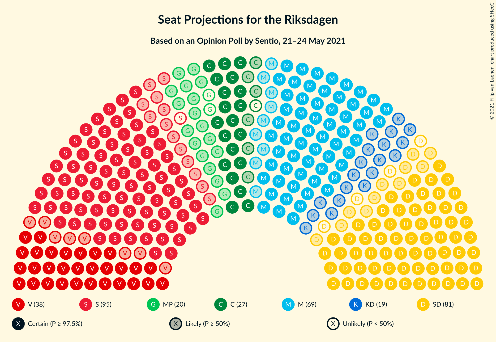
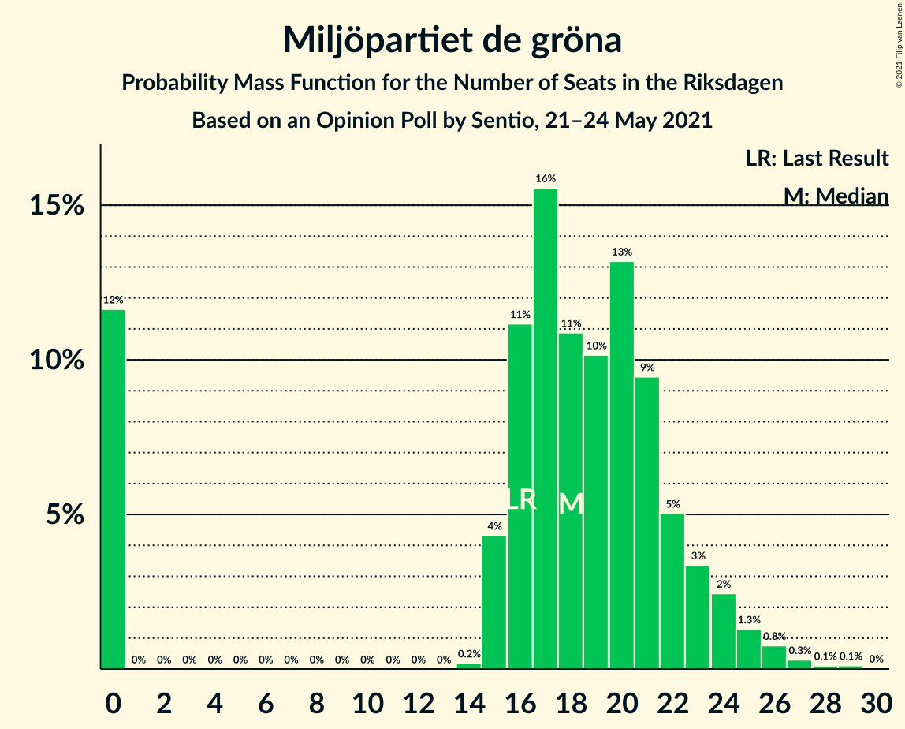
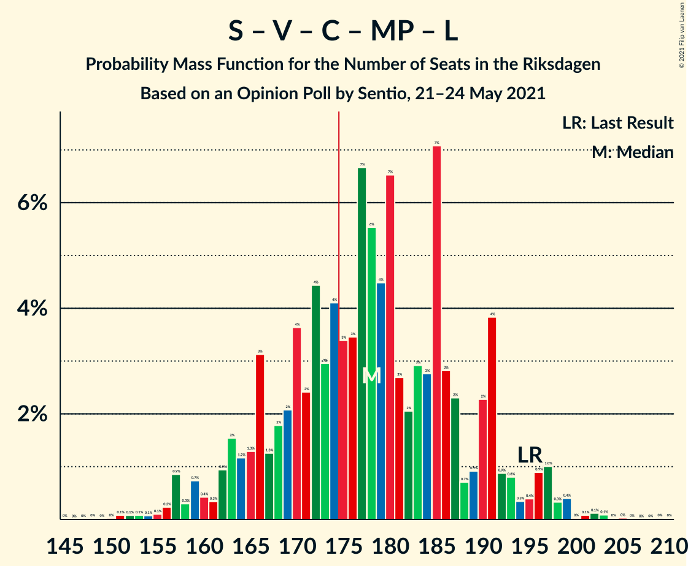
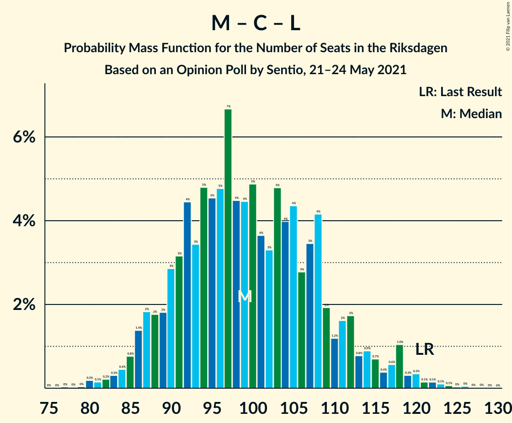

# Opinion Poll by Sentio, 21–24 May 2021

<a href="#voting-intentions">Voting Intentions</a> | <a href="#seats">Seats</a> | <a href="#coalitions">Coalitions</a> | <a href="#technical-information">Technical Information</a>

## Voting Intentions

### Confidence Intervals

| Party | Last Result | Poll Result | 80% Confidence Interval | 90% Confidence Interval | 95% Confidence Interval | 99% Confidence Interval |
|:-----:|:-----------:|:-----------:|:-----------------------:|:-----------------------:|:-----------------------:|:-----------------------:|
| Sveriges socialdemokratiska arbetareparti | 28.3% | 25.5% | 23.6–27.5% |23.0–28.1% |22.6–28.6% |21.7–29.6% |
| Sverigedemokraterna | 17.5% | 21.0% | 19.3–23.0% |18.8–23.5% |18.3–24.0% |17.5–25.0% |
| Moderata samlingspartiet | 19.8% | 19.3% | 17.6–21.2% |17.1–21.7% |16.7–22.2% |15.9–23.1% |
| Vänsterpartiet | 8.0% | 10.3% | 9.0–11.8% |8.6–12.2% |8.3–12.6% |7.8–13.4% |
| Centerpartiet | 8.6% | 7.0% | 5.9–8.3% |5.6–8.6% |5.4–9.0% |4.9–9.6% |
| Kristdemokraterna | 6.3% | 5.2% | 4.3–6.4% |4.1–6.7% |3.9–7.0% |3.5–7.6% |
| Miljöpartiet de gröna | 4.4% | 4.9% | 4.1–6.1% |3.8–6.4% |3.6–6.7% |3.3–7.3% |
| Liberalerna | 5.5% | 3.3% | 2.6–4.3% |2.4–4.5% |2.3–4.8% |2.0–5.3% |

*Note:* The poll result column reflects the actual value used in the calculations. Published results may vary slightly, and in addition be rounded to fewer digits.

## Seats

### Confidence Intervals

| Party | Last Result | Median | 80% Confidence Interval | 90% Confidence Interval | 95% Confidence Interval | 99% Confidence Interval |
|:-----:|:-----------:|:------:|:-----------------------:|:-----------------------:|:-----------------------:|:-----------------------:|
| <a href="#sveriges-socialdemokratiska-arbetareparti">Sveriges socialdemokratiska arbetareparti</a> | 100 | 94 | 85–102 |83–105 |81–107 |78–112 |
| <a href="#sverigedemokraterna">Sverigedemokraterna</a> | 62 | 77 | 70–86 |68–88 |66–89 |63–94 |
| <a href="#moderata-samlingspartiet">Moderata samlingspartiet</a> | 70 | 69 | 63–79 |62–80 |60–82 |57–87 |
| <a href="#vänsterpartiet">Vänsterpartiet</a> | 28 | 38 | 33–43 |31–46 |30–46 |28–49 |
| <a href="#centerpartiet">Centerpartiet</a> | 31 | 26 | 22–31 |21–32 |20–33 |18–36 |
| <a href="#kristdemokraterna">Kristdemokraterna</a> | 22 | 19 | 16–23 |14–24 |0–25 |0–28 |
| <a href="#miljöpartiet-de-gröna">Miljöpartiet de gröna</a> | 16 | 18 | 0–22 |0–24 |0–25 |0–27 |
| <a href="#liberalerna">Liberalerna</a> | 20 | 0 | 0–16 |0–16 |0–17 |0–19 |

### Sveriges socialdemokratiska arbetareparti

*For a full overview of the results for this party, see the [Sveriges socialdemokratiska arbetareparti](party-sverigessocialdemokratiskaarbetareparti.html) page.*

| Number of Seats | Probability | Accumulated | Special Marks |
|:---------------:|:-----------:|:-----------:|:-------------:|
| 74 | 0% | 100% |  |
| 75 | 0.1% | 99.9% |  |
| 76 | 0.1% | 99.8% |  |
| 77 | 0.1% | 99.8% |  |
| 78 | 0.2% | 99.6% |  |
| 79 | 0.6% | 99.4% |  |
| 80 | 0.7% | 98.8% |  |
| 81 | 0.7% | 98% |  |
| 82 | 0.9% | 97% |  |
| 83 | 2% | 96% |  |
| 84 | 3% | 95% |  |
| 85 | 4% | 92% |  |
| 86 | 2% | 89% |  |
| 87 | 3% | 87% |  |
| 88 | 4% | 84% |  |
| 89 | 4% | 81% |  |
| 90 | 7% | 76% |  |
| 91 | 4% | 69% |  |
| 92 | 7% | 65% |  |
| 93 | 6% | 58% |  |
| 94 | 5% | 53% | Median |
| 95 | 7% | 47% |  |
| 96 | 6% | 41% |  |
| 97 | 5% | 34% |  |
| 98 | 6% | 29% |  |
| 99 | 4% | 24% |  |
| 100 | 3% | 20% | Last Result |
| 101 | 6% | 17% |  |
| 102 | 2% | 11% |  |
| 103 | 2% | 9% |  |
| 104 | 1.0% | 7% |  |
| 105 | 0.9% | 6% |  |
| 106 | 2% | 5% |  |
| 107 | 0.7% | 3% |  |
| 108 | 0.6% | 2% |  |
| 109 | 0.4% | 2% |  |
| 110 | 0.5% | 1.2% |  |
| 111 | 0.1% | 0.7% |  |
| 112 | 0.3% | 0.6% |  |
| 113 | 0.1% | 0.3% |  |
| 114 | 0.1% | 0.2% |  |
| 115 | 0.1% | 0.2% |  |
| 116 | 0% | 0.1% |  |
| 117 | 0% | 0% |  |

### Sverigedemokraterna

*For a full overview of the results for this party, see the [Sverigedemokraterna](party-sverigedemokraterna.html) page.*

| Number of Seats | Probability | Accumulated | Special Marks |
|:---------------:|:-----------:|:-----------:|:-------------:|
| 59 | 0% | 100% |  |
| 60 | 0.1% | 99.9% |  |
| 61 | 0.1% | 99.9% |  |
| 62 | 0.1% | 99.8% | Last Result |
| 63 | 0.3% | 99.7% |  |
| 64 | 0.5% | 99.4% |  |
| 65 | 0.5% | 98.9% |  |
| 66 | 1.0% | 98% |  |
| 67 | 0.9% | 97% |  |
| 68 | 3% | 97% |  |
| 69 | 1.3% | 94% |  |
| 70 | 4% | 93% |  |
| 71 | 4% | 89% |  |
| 72 | 5% | 85% |  |
| 73 | 4% | 80% |  |
| 74 | 8% | 76% |  |
| 75 | 4% | 68% |  |
| 76 | 7% | 63% |  |
| 77 | 7% | 56% | Median |
| 78 | 7% | 49% |  |
| 79 | 4% | 41% |  |
| 80 | 4% | 37% |  |
| 81 | 8% | 33% |  |
| 82 | 2% | 24% |  |
| 83 | 5% | 22% |  |
| 84 | 3% | 17% |  |
| 85 | 4% | 14% |  |
| 86 | 4% | 10% |  |
| 87 | 1.3% | 7% |  |
| 88 | 1.3% | 5% |  |
| 89 | 2% | 4% |  |
| 90 | 0.5% | 2% |  |
| 91 | 0.6% | 2% |  |
| 92 | 0.3% | 1.1% |  |
| 93 | 0.2% | 0.8% |  |
| 94 | 0.2% | 0.6% |  |
| 95 | 0.2% | 0.4% |  |
| 96 | 0% | 0.2% |  |
| 97 | 0.1% | 0.1% |  |
| 98 | 0% | 0.1% |  |
| 99 | 0% | 0% |  |

### Moderata samlingspartiet

*For a full overview of the results for this party, see the [Moderata samlingspartiet](party-moderatasamlingspartiet.html) page.*

| Number of Seats | Probability | Accumulated | Special Marks |
|:---------------:|:-----------:|:-----------:|:-------------:|
| 54 | 0% | 100% |  |
| 55 | 0% | 99.9% |  |
| 56 | 0.1% | 99.9% |  |
| 57 | 0.3% | 99.7% |  |
| 58 | 0.6% | 99.5% |  |
| 59 | 0.8% | 98.8% |  |
| 60 | 1.1% | 98% |  |
| 61 | 2% | 97% |  |
| 62 | 3% | 95% |  |
| 63 | 4% | 93% |  |
| 64 | 4% | 89% |  |
| 65 | 6% | 85% |  |
| 66 | 6% | 79% |  |
| 67 | 7% | 74% |  |
| 68 | 8% | 67% |  |
| 69 | 9% | 59% | Median |
| 70 | 6% | 50% | Last Result |
| 71 | 5% | 44% |  |
| 72 | 4% | 39% |  |
| 73 | 5% | 35% |  |
| 74 | 5% | 30% |  |
| 75 | 5% | 25% |  |
| 76 | 4% | 20% |  |
| 77 | 3% | 16% |  |
| 78 | 2% | 13% |  |
| 79 | 3% | 11% |  |
| 80 | 3% | 8% |  |
| 81 | 1.4% | 5% |  |
| 82 | 0.9% | 3% |  |
| 83 | 1.0% | 2% |  |
| 84 | 0.2% | 1.4% |  |
| 85 | 0.4% | 1.2% |  |
| 86 | 0.2% | 0.8% |  |
| 87 | 0.2% | 0.6% |  |
| 88 | 0.2% | 0.4% |  |
| 89 | 0% | 0.1% |  |
| 90 | 0.1% | 0.1% |  |
| 91 | 0% | 0.1% |  |
| 92 | 0% | 0% |  |

### Vänsterpartiet

*For a full overview of the results for this party, see the [Vänsterpartiet](party-vänsterpartiet.html) page.*

| Number of Seats | Probability | Accumulated | Special Marks |
|:---------------:|:-----------:|:-----------:|:-------------:|
| 26 | 0.1% | 100% |  |
| 27 | 0.2% | 99.9% |  |
| 28 | 0.3% | 99.7% | Last Result |
| 29 | 0.7% | 99.4% |  |
| 30 | 2% | 98.7% |  |
| 31 | 2% | 97% |  |
| 32 | 4% | 95% |  |
| 33 | 5% | 91% |  |
| 34 | 5% | 86% |  |
| 35 | 8% | 81% |  |
| 36 | 7% | 73% |  |
| 37 | 13% | 66% |  |
| 38 | 11% | 53% | Median |
| 39 | 10% | 42% |  |
| 40 | 7% | 32% |  |
| 41 | 6% | 25% |  |
| 42 | 4% | 19% |  |
| 43 | 5% | 14% |  |
| 44 | 3% | 10% |  |
| 45 | 2% | 7% |  |
| 46 | 3% | 5% |  |
| 47 | 0.8% | 2% |  |
| 48 | 0.8% | 2% |  |
| 49 | 0.4% | 0.8% |  |
| 50 | 0.2% | 0.4% |  |
| 51 | 0.1% | 0.3% |  |
| 52 | 0.1% | 0.1% |  |
| 53 | 0% | 0.1% |  |
| 54 | 0% | 0% |  |

### Centerpartiet

*For a full overview of the results for this party, see the [Centerpartiet](party-centerpartiet.html) page.*

| Number of Seats | Probability | Accumulated | Special Marks |
|:---------------:|:-----------:|:-----------:|:-------------:|
| 16 | 0.1% | 100% |  |
| 17 | 0.3% | 99.9% |  |
| 18 | 0.6% | 99.7% |  |
| 19 | 1.1% | 99.1% |  |
| 20 | 3% | 98% |  |
| 21 | 3% | 95% |  |
| 22 | 7% | 92% |  |
| 23 | 6% | 85% |  |
| 24 | 12% | 79% |  |
| 25 | 9% | 66% |  |
| 26 | 11% | 57% | Median |
| 27 | 11% | 47% |  |
| 28 | 13% | 35% |  |
| 29 | 7% | 22% |  |
| 30 | 5% | 15% |  |
| 31 | 3% | 10% | Last Result |
| 32 | 3% | 7% |  |
| 33 | 2% | 5% |  |
| 34 | 1.3% | 2% |  |
| 35 | 0.5% | 1.1% |  |
| 36 | 0.2% | 0.6% |  |
| 37 | 0.2% | 0.3% |  |
| 38 | 0.1% | 0.1% |  |
| 39 | 0% | 0.1% |  |
| 40 | 0% | 0% |  |

### Kristdemokraterna

*For a full overview of the results for this party, see the [Kristdemokraterna](party-kristdemokraterna.html) page.*

| Number of Seats | Probability | Accumulated | Special Marks |
|:---------------:|:-----------:|:-----------:|:-------------:|
| 0 | 5% | 100% |  |
| 1 | 0% | 95% |  |
| 2 | 0% | 95% |  |
| 3 | 0% | 95% |  |
| 4 | 0% | 95% |  |
| 5 | 0% | 95% |  |
| 6 | 0% | 95% |  |
| 7 | 0% | 95% |  |
| 8 | 0% | 95% |  |
| 9 | 0% | 95% |  |
| 10 | 0% | 95% |  |
| 11 | 0% | 95% |  |
| 12 | 0% | 95% |  |
| 13 | 0% | 95% |  |
| 14 | 0.4% | 95% |  |
| 15 | 5% | 95% |  |
| 16 | 6% | 90% |  |
| 17 | 13% | 84% |  |
| 18 | 10% | 71% |  |
| 19 | 17% | 61% | Median |
| 20 | 10% | 44% |  |
| 21 | 11% | 34% |  |
| 22 | 9% | 23% | Last Result |
| 23 | 5% | 14% |  |
| 24 | 4% | 9% |  |
| 25 | 2% | 5% |  |
| 26 | 1.0% | 2% |  |
| 27 | 0.7% | 1.3% |  |
| 28 | 0.3% | 0.6% |  |
| 29 | 0.2% | 0.3% |  |
| 30 | 0.1% | 0.1% |  |
| 31 | 0% | 0.1% |  |
| 32 | 0% | 0% |  |

### Miljöpartiet de gröna

*For a full overview of the results for this party, see the [Miljöpartiet de gröna](party-miljöpartietdegröna.html) page.*

| Number of Seats | Probability | Accumulated | Special Marks |
|:---------------:|:-----------:|:-----------:|:-------------:|
| 0 | 12% | 100% |  |
| 1 | 0% | 88% |  |
| 2 | 0% | 88% |  |
| 3 | 0% | 88% |  |
| 4 | 0% | 88% |  |
| 5 | 0% | 88% |  |
| 6 | 0% | 88% |  |
| 7 | 0% | 88% |  |
| 8 | 0% | 88% |  |
| 9 | 0% | 88% |  |
| 10 | 0% | 88% |  |
| 11 | 0% | 88% |  |
| 12 | 0% | 88% |  |
| 13 | 0% | 88% |  |
| 14 | 0.2% | 88% |  |
| 15 | 4% | 88% |  |
| 16 | 11% | 84% | Last Result |
| 17 | 16% | 73% |  |
| 18 | 11% | 57% | Median |
| 19 | 10% | 46% |  |
| 20 | 13% | 36% |  |
| 21 | 9% | 23% |  |
| 22 | 5% | 13% |  |
| 23 | 3% | 8% |  |
| 24 | 2% | 5% |  |
| 25 | 1.3% | 3% |  |
| 26 | 0.8% | 1.3% |  |
| 27 | 0.3% | 0.6% |  |
| 28 | 0.1% | 0.3% |  |
| 29 | 0.1% | 0.2% |  |
| 30 | 0% | 0% |  |

### Liberalerna

*For a full overview of the results for this party, see the [Liberalerna](party-liberalerna.html) page.*

| Number of Seats | Probability | Accumulated | Special Marks |
|:---------------:|:-----------:|:-----------:|:-------------:|
| 0 | 81% | 100% | Median |
| 1 | 0% | 19% |  |
| 2 | 0% | 19% |  |
| 3 | 0% | 19% |  |
| 4 | 0% | 19% |  |
| 5 | 0% | 19% |  |
| 6 | 0% | 19% |  |
| 7 | 0% | 19% |  |
| 8 | 0% | 19% |  |
| 9 | 0% | 19% |  |
| 10 | 0% | 19% |  |
| 11 | 0% | 19% |  |
| 12 | 0% | 19% |  |
| 13 | 0% | 19% |  |
| 14 | 1.3% | 19% |  |
| 15 | 8% | 18% |  |
| 16 | 6% | 10% |  |
| 17 | 3% | 4% |  |
| 18 | 0.9% | 2% |  |
| 19 | 0.6% | 0.9% |  |
| 20 | 0.3% | 0.4% | Last Result |
| 21 | 0.1% | 0.1% |  |
| 22 | 0% | 0% |  |

## Coalitions

### Confidence Intervals

| Coalition | Last Result | Median | Majority? | 80% Confidence Interval | 90% Confidence Interval | 95% Confidence Interval | 99% Confidence Interval |
|:---------:|:-----------:|:------:|:---------:|:-----------------------:|:-----------------------:|:-----------------------:|:-----------------------:|
| Sveriges socialdemokratiska arbetareparti – Moderata samlingspartiet – Centerpartiet | 201 | 190 | 96% | 179–202 | 176–205 | 173–210 | 168–215 |
| Sveriges socialdemokratiska arbetareparti – Vänsterpartiet – Centerpartiet – Miljöpartiet de gröna – Liberalerna | 195 | 178 | 66% | 166–190 | 163–192 | 159–196 | 155–199 |
| Sverigedemokraterna – Moderata samlingspartiet – Kristdemokraterna | 154 | 167 | 19% | 156–177 | 152–180 | 150–183 | 145–189 |
| Sveriges socialdemokratiska arbetareparti – Moderata samlingspartiet | 170 | 164 | 11% | 154–175 | 151–178 | 148–181 | 143–186 |
| Sveriges socialdemokratiska arbetareparti – Vänsterpartiet – Miljöpartiet de gröna | 144 | 149 | 0.1% | 138–159 | 135–162 | 132–165 | 127–171 |
| Sverigedemokraterna – Moderata samlingspartiet | 132 | 148 | 0.1% | 138–158 | 135–161 | 132–163 | 128–170 |
| Sveriges socialdemokratiska arbetareparti – Centerpartiet – Miljöpartiet de gröna – Liberalerna | 167 | 140 | 0% | 128–152 | 125–155 | 122–157 | 116–162 |
| Sveriges socialdemokratiska arbetareparti – Vänsterpartiet | 128 | 132 | 0% | 122–142 | 119–144 | 117–148 | 113–153 |
| Moderata samlingspartiet – Centerpartiet – Kristdemokraterna – Liberalerna | 143 | 118 | 0% | 107–129 | 105–132 | 102–136 | 96–140 |
| Moderata samlingspartiet – Centerpartiet – Kristdemokraterna | 123 | 115 | 0% | 105–125 | 103–127 | 100–130 | 95–134 |
| Sveriges socialdemokratiska arbetareparti – Miljöpartiet de gröna | 116 | 111 | 0% | 100–121 | 97–123 | 94–126 | 88–129 |
| Moderata samlingspartiet – Centerpartiet – Liberalerna | 121 | 99 | 0% | 90–110 | 87–113 | 86–117 | 82–121 |
| Moderata samlingspartiet – Centerpartiet | 101 | 96 | 0% | 88–105 | 86–108 | 84–110 | 80–114 |

### Sveriges socialdemokratiska arbetareparti – Moderata samlingspartiet – Centerpartiet

| Number of Seats | Probability | Accumulated | Special Marks |
|:---------------:|:-----------:|:-----------:|:-------------:|
| 163 | 0% | 100% |  |
| 164 | 0% | 99.9% |  |
| 165 | 0% | 99.9% |  |
| 166 | 0.1% | 99.8% |  |
| 167 | 0.1% | 99.8% |  |
| 168 | 0.2% | 99.7% |  |
| 169 | 0.2% | 99.5% |  |
| 170 | 0.2% | 99.3% |  |
| 171 | 0.6% | 99.1% |  |
| 172 | 0.4% | 98% |  |
| 173 | 0.8% | 98% |  |
| 174 | 0.9% | 97% |  |
| 175 | 0.9% | 96% | Majority |
| 176 | 1.4% | 95% |  |
| 177 | 1.0% | 94% |  |
| 178 | 2% | 93% |  |
| 179 | 3% | 91% |  |
| 180 | 2% | 88% |  |
| 181 | 3% | 86% |  |
| 182 | 2% | 82% |  |
| 183 | 3% | 81% |  |
| 184 | 3% | 78% |  |
| 185 | 2% | 75% |  |
| 186 | 3% | 73% |  |
| 187 | 5% | 69% |  |
| 188 | 4% | 64% |  |
| 189 | 4% | 60% | Median |
| 190 | 7% | 55% |  |
| 191 | 3% | 48% |  |
| 192 | 3% | 45% |  |
| 193 | 5% | 42% |  |
| 194 | 6% | 37% |  |
| 195 | 2% | 31% |  |
| 196 | 3% | 28% |  |
| 197 | 3% | 25% |  |
| 198 | 2% | 22% |  |
| 199 | 5% | 20% |  |
| 200 | 2% | 15% |  |
| 201 | 2% | 13% | Last Result |
| 202 | 1.3% | 10% |  |
| 203 | 2% | 9% |  |
| 204 | 0.8% | 8% |  |
| 205 | 2% | 7% |  |
| 206 | 0.8% | 5% |  |
| 207 | 0.8% | 4% |  |
| 208 | 0.5% | 3% |  |
| 209 | 0.4% | 3% |  |
| 210 | 0.9% | 3% |  |
| 211 | 0.4% | 2% |  |
| 212 | 0.1% | 1.2% |  |
| 213 | 0.4% | 1.1% |  |
| 214 | 0.1% | 0.6% |  |
| 215 | 0% | 0.5% |  |
| 216 | 0.1% | 0.5% |  |
| 217 | 0.1% | 0.4% |  |
| 218 | 0.1% | 0.2% |  |
| 219 | 0% | 0.2% |  |
| 220 | 0% | 0.1% |  |
| 221 | 0% | 0.1% |  |
| 222 | 0% | 0.1% |  |
| 223 | 0% | 0.1% |  |
| 224 | 0% | 0.1% |  |
| 225 | 0% | 0.1% |  |
| 226 | 0% | 0% |  |

### Sveriges socialdemokratiska arbetareparti – Vänsterpartiet – Centerpartiet – Miljöpartiet de gröna – Liberalerna

| Number of Seats | Probability | Accumulated | Special Marks |
|:---------------:|:-----------:|:-----------:|:-------------:|
| 148 | 0% | 100% |  |
| 149 | 0% | 99.9% |  |
| 150 | 0% | 99.9% |  |
| 151 | 0.1% | 99.9% |  |
| 152 | 0.1% | 99.8% |  |
| 153 | 0.1% | 99.7% |  |
| 154 | 0.1% | 99.7% |  |
| 155 | 0.1% | 99.6% |  |
| 156 | 0.2% | 99.5% |  |
| 157 | 0.9% | 99.3% |  |
| 158 | 0.3% | 98% |  |
| 159 | 0.7% | 98% |  |
| 160 | 0.4% | 97% |  |
| 161 | 0.3% | 97% |  |
| 162 | 0.9% | 97% |  |
| 163 | 2% | 96% |  |
| 164 | 1.2% | 94% |  |
| 165 | 1.3% | 93% |  |
| 166 | 3% | 92% |  |
| 167 | 1.3% | 89% |  |
| 168 | 2% | 87% |  |
| 169 | 2% | 86% |  |
| 170 | 4% | 83% |  |
| 171 | 2% | 80% |  |
| 172 | 4% | 77% |  |
| 173 | 3% | 73% |  |
| 174 | 4% | 70% |  |
| 175 | 3% | 66% | Majority |
| 176 | 3% | 62% | Median |
| 177 | 7% | 59% |  |
| 178 | 6% | 52% |  |
| 179 | 4% | 47% |  |
| 180 | 7% | 42% |  |
| 181 | 3% | 36% |  |
| 182 | 2% | 33% |  |
| 183 | 3% | 31% |  |
| 184 | 3% | 28% |  |
| 185 | 7% | 25% |  |
| 186 | 3% | 18% |  |
| 187 | 2% | 16% |  |
| 188 | 0.7% | 13% |  |
| 189 | 0.9% | 13% |  |
| 190 | 2% | 12% |  |
| 191 | 4% | 9% |  |
| 192 | 0.9% | 5% |  |
| 193 | 0.8% | 5% |  |
| 194 | 0.3% | 4% |  |
| 195 | 0.4% | 3% | Last Result |
| 196 | 0.9% | 3% |  |
| 197 | 1.0% | 2% |  |
| 198 | 0.3% | 1.2% |  |
| 199 | 0.4% | 0.8% |  |
| 200 | 0% | 0.4% |  |
| 201 | 0.1% | 0.4% |  |
| 202 | 0.1% | 0.3% |  |
| 203 | 0.1% | 0.2% |  |
| 204 | 0% | 0.1% |  |
| 205 | 0% | 0.1% |  |
| 206 | 0% | 0.1% |  |
| 207 | 0% | 0.1% |  |
| 208 | 0% | 0.1% |  |
| 209 | 0% | 0.1% |  |
| 210 | 0% | 0% |  |

### Sverigedemokraterna – Moderata samlingspartiet – Kristdemokraterna

| Number of Seats | Probability | Accumulated | Special Marks |
|:---------------:|:-----------:|:-----------:|:-------------:|
| 137 | 0% | 100% |  |
| 138 | 0% | 99.9% |  |
| 139 | 0% | 99.9% |  |
| 140 | 0% | 99.9% |  |
| 141 | 0% | 99.9% |  |
| 142 | 0.1% | 99.8% |  |
| 143 | 0.1% | 99.7% |  |
| 144 | 0.2% | 99.7% |  |
| 145 | 0.3% | 99.5% |  |
| 146 | 0.4% | 99.2% |  |
| 147 | 0.2% | 98.8% |  |
| 148 | 0.2% | 98.6% |  |
| 149 | 0.5% | 98% |  |
| 150 | 0.9% | 98% |  |
| 151 | 1.0% | 97% |  |
| 152 | 1.4% | 96% |  |
| 153 | 1.1% | 95% |  |
| 154 | 1.4% | 93% | Last Result |
| 155 | 0.9% | 92% |  |
| 156 | 2% | 91% |  |
| 157 | 3% | 89% |  |
| 158 | 5% | 86% |  |
| 159 | 3% | 81% |  |
| 160 | 1.4% | 77% |  |
| 161 | 3% | 76% |  |
| 162 | 4% | 73% |  |
| 163 | 4% | 69% |  |
| 164 | 8% | 66% |  |
| 165 | 3% | 58% | Median |
| 166 | 3% | 55% |  |
| 167 | 2% | 52% |  |
| 168 | 4% | 50% |  |
| 169 | 7% | 45% |  |
| 170 | 5% | 38% |  |
| 171 | 6% | 34% |  |
| 172 | 5% | 28% |  |
| 173 | 2% | 23% |  |
| 174 | 3% | 21% |  |
| 175 | 4% | 19% | Majority |
| 176 | 2% | 15% |  |
| 177 | 3% | 13% |  |
| 178 | 2% | 10% |  |
| 179 | 2% | 8% |  |
| 180 | 1.0% | 6% |  |
| 181 | 1.3% | 5% |  |
| 182 | 0.6% | 4% |  |
| 183 | 0.7% | 3% |  |
| 184 | 0.7% | 2% |  |
| 185 | 0.6% | 2% |  |
| 186 | 0.2% | 1.0% |  |
| 187 | 0.1% | 0.8% |  |
| 188 | 0.1% | 0.7% |  |
| 189 | 0.2% | 0.6% |  |
| 190 | 0.2% | 0.4% |  |
| 191 | 0.1% | 0.3% |  |
| 192 | 0.1% | 0.2% |  |
| 193 | 0% | 0.1% |  |
| 194 | 0% | 0.1% |  |
| 195 | 0% | 0.1% |  |
| 196 | 0% | 0% |  |

### Sveriges socialdemokratiska arbetareparti – Moderata samlingspartiet

| Number of Seats | Probability | Accumulated | Special Marks |
|:---------------:|:-----------:|:-----------:|:-------------:|
| 138 | 0% | 100% |  |
| 139 | 0% | 99.9% |  |
| 140 | 0% | 99.9% |  |
| 141 | 0.1% | 99.9% |  |
| 142 | 0.1% | 99.8% |  |
| 143 | 0.2% | 99.7% |  |
| 144 | 0.2% | 99.5% |  |
| 145 | 0.2% | 99.2% |  |
| 146 | 0.5% | 99.0% |  |
| 147 | 0.4% | 98% |  |
| 148 | 1.1% | 98% |  |
| 149 | 1.1% | 97% |  |
| 150 | 0.7% | 96% |  |
| 151 | 1.0% | 95% |  |
| 152 | 2% | 94% |  |
| 153 | 2% | 92% |  |
| 154 | 3% | 91% |  |
| 155 | 2% | 88% |  |
| 156 | 3% | 86% |  |
| 157 | 3% | 83% |  |
| 158 | 3% | 80% |  |
| 159 | 6% | 77% |  |
| 160 | 5% | 70% |  |
| 161 | 6% | 65% |  |
| 162 | 3% | 60% |  |
| 163 | 4% | 56% | Median |
| 164 | 3% | 52% |  |
| 165 | 3% | 49% |  |
| 166 | 4% | 46% |  |
| 167 | 7% | 41% |  |
| 168 | 4% | 35% |  |
| 169 | 3% | 31% |  |
| 170 | 3% | 28% | Last Result |
| 171 | 4% | 25% |  |
| 172 | 5% | 21% |  |
| 173 | 4% | 16% |  |
| 174 | 1.2% | 12% |  |
| 175 | 1.4% | 11% | Majority |
| 176 | 1.1% | 10% |  |
| 177 | 2% | 9% |  |
| 178 | 2% | 7% |  |
| 179 | 0.8% | 5% |  |
| 180 | 1.3% | 4% |  |
| 181 | 0.5% | 3% |  |
| 182 | 0.3% | 2% |  |
| 183 | 0.7% | 2% |  |
| 184 | 0.4% | 1.3% |  |
| 185 | 0.2% | 0.8% |  |
| 186 | 0.2% | 0.7% |  |
| 187 | 0.1% | 0.5% |  |
| 188 | 0% | 0.4% |  |
| 189 | 0.1% | 0.3% |  |
| 190 | 0.1% | 0.3% |  |
| 191 | 0% | 0.2% |  |
| 192 | 0% | 0.1% |  |
| 193 | 0% | 0.1% |  |
| 194 | 0% | 0.1% |  |
| 195 | 0% | 0.1% |  |
| 196 | 0% | 0% |  |

### Sveriges socialdemokratiska arbetareparti – Vänsterpartiet – Miljöpartiet de gröna

| Number of Seats | Probability | Accumulated | Special Marks |
|:---------------:|:-----------:|:-----------:|:-------------:|
| 119 | 0% | 100% |  |
| 120 | 0% | 99.9% |  |
| 121 | 0% | 99.9% |  |
| 122 | 0% | 99.9% |  |
| 123 | 0.1% | 99.9% |  |
| 124 | 0.1% | 99.8% |  |
| 125 | 0% | 99.7% |  |
| 126 | 0.1% | 99.7% |  |
| 127 | 0.2% | 99.5% |  |
| 128 | 0.3% | 99.4% |  |
| 129 | 0.2% | 99.1% |  |
| 130 | 0.4% | 98.9% |  |
| 131 | 0.6% | 98% |  |
| 132 | 1.2% | 98% |  |
| 133 | 0.7% | 97% |  |
| 134 | 1.0% | 96% |  |
| 135 | 2% | 95% |  |
| 136 | 2% | 93% |  |
| 137 | 2% | 92% |  |
| 138 | 1.5% | 90% |  |
| 139 | 4% | 89% |  |
| 140 | 3% | 85% |  |
| 141 | 3% | 82% |  |
| 142 | 2% | 79% |  |
| 143 | 4% | 77% |  |
| 144 | 3% | 73% | Last Result |
| 145 | 4% | 70% |  |
| 146 | 3% | 66% |  |
| 147 | 3% | 63% |  |
| 148 | 6% | 60% |  |
| 149 | 6% | 54% |  |
| 150 | 5% | 48% | Median |
| 151 | 6% | 43% |  |
| 152 | 4% | 37% |  |
| 153 | 5% | 33% |  |
| 154 | 3% | 28% |  |
| 155 | 3% | 25% |  |
| 156 | 3% | 21% |  |
| 157 | 2% | 18% |  |
| 158 | 3% | 16% |  |
| 159 | 3% | 13% |  |
| 160 | 2% | 10% |  |
| 161 | 2% | 8% |  |
| 162 | 1.1% | 6% |  |
| 163 | 1.3% | 5% |  |
| 164 | 0.8% | 3% |  |
| 165 | 0.5% | 3% |  |
| 166 | 0.3% | 2% |  |
| 167 | 0.6% | 2% |  |
| 168 | 0.4% | 1.2% |  |
| 169 | 0.1% | 0.8% |  |
| 170 | 0.1% | 0.7% |  |
| 171 | 0.1% | 0.6% |  |
| 172 | 0.3% | 0.5% |  |
| 173 | 0% | 0.1% |  |
| 174 | 0% | 0.1% |  |
| 175 | 0% | 0.1% | Majority |
| 176 | 0% | 0% |  |

### Sverigedemokraterna – Moderata samlingspartiet

| Number of Seats | Probability | Accumulated | Special Marks |
|:---------------:|:-----------:|:-----------:|:-------------:|
| 124 | 0% | 100% |  |
| 125 | 0.1% | 99.9% |  |
| 126 | 0% | 99.8% |  |
| 127 | 0.2% | 99.8% |  |
| 128 | 0.2% | 99.6% |  |
| 129 | 0.3% | 99.4% |  |
| 130 | 0.5% | 99.1% |  |
| 131 | 0.5% | 98.6% |  |
| 132 | 0.9% | 98% | Last Result |
| 133 | 0.6% | 97% |  |
| 134 | 1.1% | 97% |  |
| 135 | 1.3% | 95% |  |
| 136 | 1.2% | 94% |  |
| 137 | 2% | 93% |  |
| 138 | 2% | 91% |  |
| 139 | 4% | 89% |  |
| 140 | 3% | 85% |  |
| 141 | 4% | 83% |  |
| 142 | 4% | 79% |  |
| 143 | 5% | 75% |  |
| 144 | 3% | 70% |  |
| 145 | 5% | 67% |  |
| 146 | 4% | 62% | Median |
| 147 | 6% | 58% |  |
| 148 | 5% | 52% |  |
| 149 | 5% | 47% |  |
| 150 | 5% | 42% |  |
| 151 | 5% | 37% |  |
| 152 | 3% | 32% |  |
| 153 | 6% | 29% |  |
| 154 | 3% | 24% |  |
| 155 | 4% | 21% |  |
| 156 | 2% | 17% |  |
| 157 | 3% | 15% |  |
| 158 | 4% | 13% |  |
| 159 | 2% | 9% |  |
| 160 | 1.2% | 7% |  |
| 161 | 2% | 6% |  |
| 162 | 2% | 4% |  |
| 163 | 0.7% | 3% |  |
| 164 | 0.3% | 2% |  |
| 165 | 0.6% | 2% |  |
| 166 | 0.2% | 1.4% |  |
| 167 | 0.2% | 1.2% |  |
| 168 | 0.2% | 1.0% |  |
| 169 | 0.1% | 0.8% |  |
| 170 | 0.2% | 0.6% |  |
| 171 | 0.2% | 0.5% |  |
| 172 | 0.1% | 0.3% |  |
| 173 | 0.1% | 0.2% |  |
| 174 | 0% | 0.1% |  |
| 175 | 0% | 0.1% | Majority |
| 176 | 0% | 0.1% |  |
| 177 | 0% | 0.1% |  |
| 178 | 0% | 0% |  |

### Sveriges socialdemokratiska arbetareparti – Centerpartiet – Miljöpartiet de gröna – Liberalerna

| Number of Seats | Probability | Accumulated | Special Marks |
|:---------------:|:-----------:|:-----------:|:-------------:|
| 109 | 0.1% | 100% |  |
| 110 | 0% | 99.9% |  |
| 111 | 0% | 99.9% |  |
| 112 | 0.1% | 99.9% |  |
| 113 | 0.1% | 99.8% |  |
| 114 | 0.1% | 99.7% |  |
| 115 | 0.1% | 99.7% |  |
| 116 | 0.2% | 99.6% |  |
| 117 | 0.1% | 99.4% |  |
| 118 | 0.1% | 99.3% |  |
| 119 | 0.1% | 99.2% |  |
| 120 | 0.2% | 99.1% |  |
| 121 | 0.9% | 98.8% |  |
| 122 | 0.8% | 98% |  |
| 123 | 1.1% | 97% |  |
| 124 | 0.5% | 96% |  |
| 125 | 0.8% | 96% |  |
| 126 | 3% | 95% |  |
| 127 | 1.1% | 92% |  |
| 128 | 2% | 91% |  |
| 129 | 2% | 89% |  |
| 130 | 3% | 87% |  |
| 131 | 3% | 85% |  |
| 132 | 2% | 82% |  |
| 133 | 3% | 80% |  |
| 134 | 3% | 76% |  |
| 135 | 4% | 74% |  |
| 136 | 2% | 70% |  |
| 137 | 6% | 68% |  |
| 138 | 5% | 62% | Median |
| 139 | 6% | 57% |  |
| 140 | 3% | 51% |  |
| 141 | 4% | 48% |  |
| 142 | 3% | 43% |  |
| 143 | 5% | 40% |  |
| 144 | 4% | 35% |  |
| 145 | 5% | 31% |  |
| 146 | 4% | 26% |  |
| 147 | 4% | 23% |  |
| 148 | 3% | 19% |  |
| 149 | 2% | 16% |  |
| 150 | 1.5% | 14% |  |
| 151 | 2% | 12% |  |
| 152 | 2% | 10% |  |
| 153 | 0.7% | 8% |  |
| 154 | 3% | 8% |  |
| 155 | 2% | 5% |  |
| 156 | 0.9% | 4% |  |
| 157 | 0.7% | 3% |  |
| 158 | 0.6% | 2% |  |
| 159 | 0.2% | 1.5% |  |
| 160 | 0.5% | 1.3% |  |
| 161 | 0.3% | 0.8% |  |
| 162 | 0.1% | 0.5% |  |
| 163 | 0.1% | 0.4% |  |
| 164 | 0.1% | 0.3% |  |
| 165 | 0% | 0.2% |  |
| 166 | 0% | 0.2% |  |
| 167 | 0% | 0.1% | Last Result |
| 168 | 0.1% | 0.1% |  |
| 169 | 0% | 0.1% |  |
| 170 | 0% | 0% |  |

### Sveriges socialdemokratiska arbetareparti – Vänsterpartiet

| Number of Seats | Probability | Accumulated | Special Marks |
|:---------------:|:-----------:|:-----------:|:-------------:|
| 108 | 0% | 100% |  |
| 109 | 0.1% | 99.9% |  |
| 110 | 0% | 99.9% |  |
| 111 | 0.1% | 99.8% |  |
| 112 | 0.2% | 99.8% |  |
| 113 | 0.1% | 99.6% |  |
| 114 | 0.3% | 99.5% |  |
| 115 | 0.4% | 99.2% |  |
| 116 | 0.4% | 98.7% |  |
| 117 | 1.1% | 98% |  |
| 118 | 1.1% | 97% |  |
| 119 | 1.3% | 96% |  |
| 120 | 1.4% | 95% |  |
| 121 | 2% | 93% |  |
| 122 | 3% | 91% |  |
| 123 | 2% | 88% |  |
| 124 | 3% | 86% |  |
| 125 | 3% | 84% |  |
| 126 | 3% | 81% |  |
| 127 | 4% | 78% |  |
| 128 | 4% | 74% | Last Result |
| 129 | 5% | 69% |  |
| 130 | 8% | 65% |  |
| 131 | 4% | 57% |  |
| 132 | 6% | 52% | Median |
| 133 | 7% | 46% |  |
| 134 | 4% | 39% |  |
| 135 | 5% | 35% |  |
| 136 | 3% | 30% |  |
| 137 | 2% | 27% |  |
| 138 | 3% | 24% |  |
| 139 | 5% | 21% |  |
| 140 | 2% | 16% |  |
| 141 | 4% | 14% |  |
| 142 | 2% | 10% |  |
| 143 | 2% | 8% |  |
| 144 | 0.9% | 6% |  |
| 145 | 1.0% | 5% |  |
| 146 | 0.7% | 4% |  |
| 147 | 0.4% | 3% |  |
| 148 | 0.6% | 3% |  |
| 149 | 0.3% | 2% |  |
| 150 | 0.4% | 2% |  |
| 151 | 0.6% | 1.3% |  |
| 152 | 0.1% | 0.6% |  |
| 153 | 0.2% | 0.5% |  |
| 154 | 0.1% | 0.3% |  |
| 155 | 0.1% | 0.3% |  |
| 156 | 0% | 0.1% |  |
| 157 | 0% | 0.1% |  |
| 158 | 0% | 0.1% |  |
| 159 | 0% | 0.1% |  |
| 160 | 0% | 0% |  |

### Moderata samlingspartiet – Centerpartiet – Kristdemokraterna – Liberalerna

| Number of Seats | Probability | Accumulated | Special Marks |
|:---------------:|:-----------:|:-----------:|:-------------:|
| 88 | 0% | 100% |  |
| 89 | 0% | 99.9% |  |
| 90 | 0% | 99.9% |  |
| 91 | 0% | 99.9% |  |
| 92 | 0.1% | 99.9% |  |
| 93 | 0.1% | 99.8% |  |
| 94 | 0% | 99.8% |  |
| 95 | 0.2% | 99.7% |  |
| 96 | 0.1% | 99.6% |  |
| 97 | 0.3% | 99.5% |  |
| 98 | 0.2% | 99.2% |  |
| 99 | 0.4% | 99.0% |  |
| 100 | 0.5% | 98.6% |  |
| 101 | 0.5% | 98% |  |
| 102 | 0.5% | 98% |  |
| 103 | 1.0% | 97% |  |
| 104 | 0.8% | 96% |  |
| 105 | 2% | 95% |  |
| 106 | 1.0% | 93% |  |
| 107 | 2% | 92% |  |
| 108 | 3% | 90% |  |
| 109 | 3% | 87% |  |
| 110 | 2% | 84% |  |
| 111 | 2% | 82% |  |
| 112 | 6% | 80% |  |
| 113 | 3% | 74% |  |
| 114 | 4% | 71% | Median |
| 115 | 6% | 67% |  |
| 116 | 4% | 61% |  |
| 117 | 5% | 57% |  |
| 118 | 5% | 53% |  |
| 119 | 5% | 47% |  |
| 120 | 3% | 42% |  |
| 121 | 5% | 39% |  |
| 122 | 3% | 35% |  |
| 123 | 4% | 32% |  |
| 124 | 5% | 28% |  |
| 125 | 3% | 23% |  |
| 126 | 4% | 21% |  |
| 127 | 5% | 17% |  |
| 128 | 2% | 12% |  |
| 129 | 2% | 11% |  |
| 130 | 2% | 9% |  |
| 131 | 1.2% | 7% |  |
| 132 | 1.2% | 6% |  |
| 133 | 0.7% | 5% |  |
| 134 | 0.5% | 4% |  |
| 135 | 0.7% | 3% |  |
| 136 | 0.5% | 3% |  |
| 137 | 0.2% | 2% |  |
| 138 | 0.2% | 2% |  |
| 139 | 1.1% | 2% |  |
| 140 | 0.1% | 0.6% |  |
| 141 | 0.2% | 0.4% |  |
| 142 | 0.1% | 0.3% |  |
| 143 | 0.1% | 0.2% | Last Result |
| 144 | 0% | 0.1% |  |
| 145 | 0% | 0.1% |  |
| 146 | 0% | 0% |  |

### Moderata samlingspartiet – Centerpartiet – Kristdemokraterna

| Number of Seats | Probability | Accumulated | Special Marks |
|:---------------:|:-----------:|:-----------:|:-------------:|
| 87 | 0% | 100% |  |
| 88 | 0% | 99.9% |  |
| 89 | 0% | 99.9% |  |
| 90 | 0% | 99.9% |  |
| 91 | 0% | 99.9% |  |
| 92 | 0.1% | 99.8% |  |
| 93 | 0.1% | 99.7% |  |
| 94 | 0.1% | 99.6% |  |
| 95 | 0.3% | 99.5% |  |
| 96 | 0.2% | 99.2% |  |
| 97 | 0.4% | 99.1% |  |
| 98 | 0.4% | 98.7% |  |
| 99 | 0.6% | 98% |  |
| 100 | 0.7% | 98% |  |
| 101 | 0.9% | 97% |  |
| 102 | 0.7% | 96% |  |
| 103 | 1.3% | 95% |  |
| 104 | 1.2% | 94% |  |
| 105 | 3% | 93% |  |
| 106 | 2% | 90% |  |
| 107 | 3% | 88% |  |
| 108 | 4% | 84% |  |
| 109 | 4% | 80% |  |
| 110 | 3% | 76% |  |
| 111 | 3% | 73% |  |
| 112 | 8% | 71% |  |
| 113 | 3% | 63% |  |
| 114 | 6% | 59% | Median |
| 115 | 6% | 54% |  |
| 116 | 4% | 47% |  |
| 117 | 5% | 43% |  |
| 118 | 6% | 38% |  |
| 119 | 5% | 33% |  |
| 120 | 3% | 28% |  |
| 121 | 4% | 25% |  |
| 122 | 2% | 21% |  |
| 123 | 4% | 19% | Last Result |
| 124 | 4% | 15% |  |
| 125 | 2% | 12% |  |
| 126 | 3% | 10% |  |
| 127 | 2% | 7% |  |
| 128 | 0.7% | 5% |  |
| 129 | 0.7% | 4% |  |
| 130 | 0.9% | 3% |  |
| 131 | 0.6% | 2% |  |
| 132 | 0.6% | 2% |  |
| 133 | 0.3% | 1.1% |  |
| 134 | 0.3% | 0.7% |  |
| 135 | 0.2% | 0.4% |  |
| 136 | 0.1% | 0.3% |  |
| 137 | 0.1% | 0.2% |  |
| 138 | 0% | 0.1% |  |
| 139 | 0% | 0.1% |  |
| 140 | 0% | 0.1% |  |
| 141 | 0% | 0% |  |

### Sveriges socialdemokratiska arbetareparti – Miljöpartiet de gröna

| Number of Seats | Probability | Accumulated | Special Marks |
|:---------------:|:-----------:|:-----------:|:-------------:|
| 83 | 0% | 100% |  |
| 84 | 0% | 99.9% |  |
| 85 | 0.1% | 99.9% |  |
| 86 | 0.1% | 99.8% |  |
| 87 | 0.2% | 99.7% |  |
| 88 | 0.2% | 99.5% |  |
| 89 | 0.1% | 99.4% |  |
| 90 | 0.2% | 99.3% |  |
| 91 | 0.3% | 99.1% |  |
| 92 | 0.2% | 98.8% |  |
| 93 | 0.4% | 98.6% |  |
| 94 | 0.8% | 98% |  |
| 95 | 1.0% | 97% |  |
| 96 | 1.4% | 96% |  |
| 97 | 0.7% | 95% |  |
| 98 | 1.4% | 94% |  |
| 99 | 2% | 93% |  |
| 100 | 1.3% | 90% |  |
| 101 | 3% | 89% |  |
| 102 | 2% | 86% |  |
| 103 | 2% | 84% |  |
| 104 | 3% | 82% |  |
| 105 | 3% | 79% |  |
| 106 | 4% | 76% |  |
| 107 | 4% | 71% |  |
| 108 | 4% | 67% |  |
| 109 | 4% | 64% |  |
| 110 | 4% | 59% |  |
| 111 | 8% | 56% |  |
| 112 | 4% | 48% | Median |
| 113 | 6% | 44% |  |
| 114 | 6% | 37% |  |
| 115 | 3% | 32% |  |
| 116 | 4% | 28% | Last Result |
| 117 | 3% | 24% |  |
| 118 | 6% | 22% |  |
| 119 | 2% | 16% |  |
| 120 | 3% | 14% |  |
| 121 | 3% | 10% |  |
| 122 | 1.3% | 7% |  |
| 123 | 1.2% | 6% |  |
| 124 | 0.9% | 5% |  |
| 125 | 1.1% | 4% |  |
| 126 | 0.5% | 3% |  |
| 127 | 0.9% | 2% |  |
| 128 | 0.6% | 1.2% |  |
| 129 | 0.2% | 0.6% |  |
| 130 | 0.1% | 0.4% |  |
| 131 | 0.1% | 0.3% |  |
| 132 | 0% | 0.2% |  |
| 133 | 0.1% | 0.1% |  |
| 134 | 0% | 0.1% |  |
| 135 | 0% | 0.1% |  |
| 136 | 0% | 0% |  |

### Moderata samlingspartiet – Centerpartiet – Liberalerna

| Number of Seats | Probability | Accumulated | Special Marks |
|:---------------:|:-----------:|:-----------:|:-------------:|
| 77 | 0% | 100% |  |
| 78 | 0% | 99.9% |  |
| 79 | 0% | 99.9% |  |
| 80 | 0.2% | 99.9% |  |
| 81 | 0.1% | 99.7% |  |
| 82 | 0.2% | 99.6% |  |
| 83 | 0.3% | 99.3% |  |
| 84 | 0.4% | 99.0% |  |
| 85 | 0.8% | 98.6% |  |
| 86 | 1.4% | 98% |  |
| 87 | 2% | 96% |  |
| 88 | 2% | 95% |  |
| 89 | 2% | 93% |  |
| 90 | 3% | 91% |  |
| 91 | 3% | 88% |  |
| 92 | 4% | 85% |  |
| 93 | 3% | 81% |  |
| 94 | 5% | 77% |  |
| 95 | 5% | 72% | Median |
| 96 | 5% | 68% |  |
| 97 | 7% | 63% |  |
| 98 | 4% | 56% |  |
| 99 | 4% | 52% |  |
| 100 | 5% | 47% |  |
| 101 | 4% | 43% |  |
| 102 | 3% | 39% |  |
| 103 | 5% | 36% |  |
| 104 | 4% | 31% |  |
| 105 | 4% | 27% |  |
| 106 | 3% | 22% |  |
| 107 | 3% | 20% |  |
| 108 | 4% | 16% |  |
| 109 | 2% | 12% |  |
| 110 | 1.2% | 10% |  |
| 111 | 2% | 9% |  |
| 112 | 2% | 7% |  |
| 113 | 0.8% | 6% |  |
| 114 | 0.9% | 5% |  |
| 115 | 0.7% | 4% |  |
| 116 | 0.4% | 3% |  |
| 117 | 0.6% | 3% |  |
| 118 | 1.0% | 2% |  |
| 119 | 0.3% | 1.2% |  |
| 120 | 0.3% | 0.9% |  |
| 121 | 0.1% | 0.6% | Last Result |
| 122 | 0.1% | 0.4% |  |
| 123 | 0.1% | 0.3% |  |
| 124 | 0.1% | 0.2% |  |
| 125 | 0% | 0.1% |  |
| 126 | 0% | 0.1% |  |
| 127 | 0% | 0.1% |  |
| 128 | 0% | 0% |  |

### Moderata samlingspartiet – Centerpartiet

| Number of Seats | Probability | Accumulated | Special Marks |
|:---------------:|:-----------:|:-----------:|:-------------:|
| 77 | 0% | 100% |  |
| 78 | 0.1% | 99.9% |  |
| 79 | 0.1% | 99.8% |  |
| 80 | 0.3% | 99.8% |  |
| 81 | 0.2% | 99.4% |  |
| 82 | 0.5% | 99.2% |  |
| 83 | 0.7% | 98.7% |  |
| 84 | 0.7% | 98% |  |
| 85 | 1.2% | 97% |  |
| 86 | 2% | 96% |  |
| 87 | 3% | 94% |  |
| 88 | 2% | 92% |  |
| 89 | 4% | 89% |  |
| 90 | 4% | 86% |  |
| 91 | 5% | 82% |  |
| 92 | 6% | 77% |  |
| 93 | 6% | 72% |  |
| 94 | 6% | 66% |  |
| 95 | 5% | 60% | Median |
| 96 | 5% | 55% |  |
| 97 | 8% | 50% |  |
| 98 | 5% | 42% |  |
| 99 | 5% | 37% |  |
| 100 | 5% | 32% |  |
| 101 | 3% | 27% | Last Result |
| 102 | 4% | 24% |  |
| 103 | 4% | 20% |  |
| 104 | 4% | 16% |  |
| 105 | 2% | 12% |  |
| 106 | 2% | 10% |  |
| 107 | 3% | 8% |  |
| 108 | 1.5% | 5% |  |
| 109 | 1.0% | 4% |  |
| 110 | 0.5% | 3% |  |
| 111 | 0.6% | 2% |  |
| 112 | 0.5% | 2% |  |
| 113 | 0.4% | 1.1% |  |
| 114 | 0.2% | 0.6% |  |
| 115 | 0.1% | 0.4% |  |
| 116 | 0.1% | 0.3% |  |
| 117 | 0.1% | 0.2% |  |
| 118 | 0% | 0.1% |  |
| 119 | 0% | 0.1% |  |
| 120 | 0% | 0.1% |  |
| 121 | 0% | 0% |  |

## Technical Information

### Opinion Poll

+ **Polling firm:** Sentio
+ **Commissioner(s):** —
+ **Fieldwork period:** 21–24 May 2021

### Calculations

+ **Sample size:** 789
+ **Simulations done:** 1,048,576
+ **Error estimate:** 0.90%

