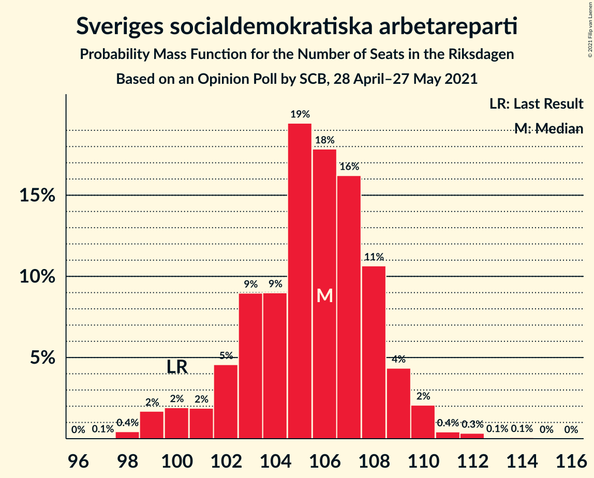
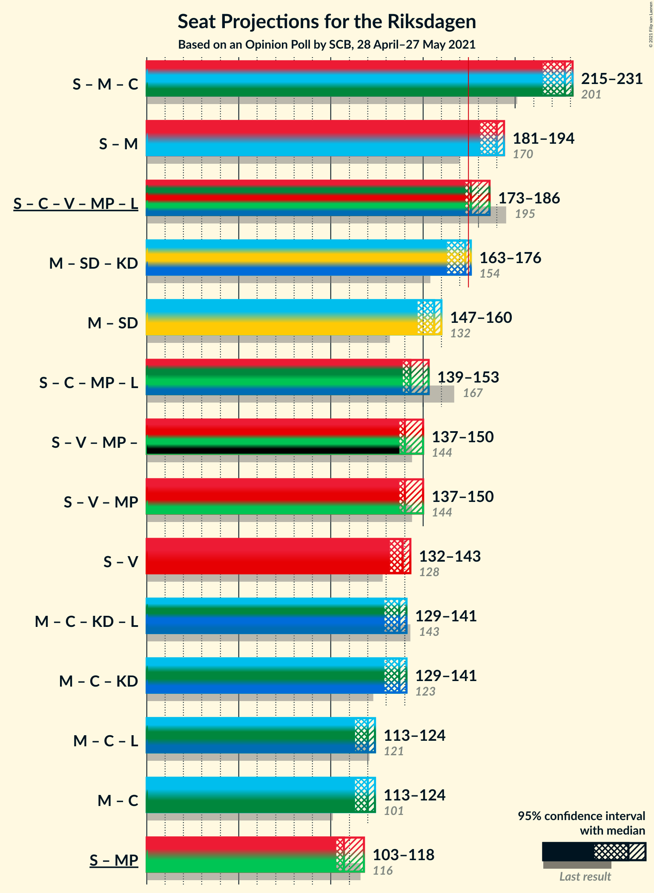
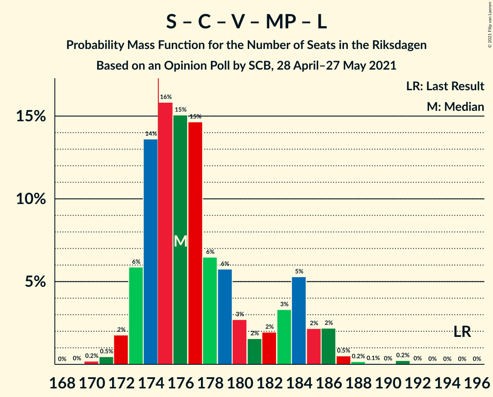
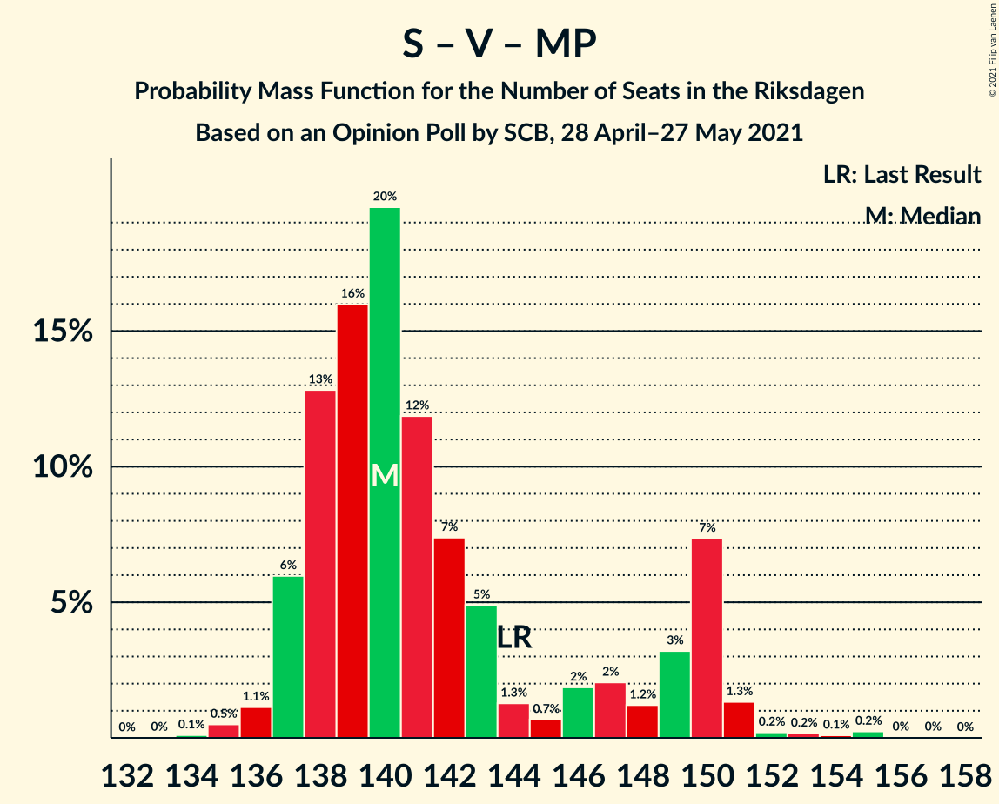

# Opinion Poll by SCB, 28 April–27 May 2021

<a href="#voting-intentions">Voting Intentions</a> | <a href="#seats">Seats</a> | <a href="#coalitions">Coalitions</a> | <a href="#technical-information">Technical Information</a>

## Voting Intentions

### Confidence Intervals

| Party | Last Result | Poll Result | 80% Confidence Interval | 90% Confidence Interval | 95% Confidence Interval | 99% Confidence Interval |
|:-----:|:-----------:|:-----------:|:-----------------------:|:-----------------------:|:-----------------------:|:-----------------------:|
| Sveriges socialdemokratiska arbetareparti | 28.3% | 28.2% | 27.6–28.8% |27.4–29.0% |27.3–29.1% |27.0–29.4% |
| Moderata samlingspartiet | 19.8% | 22.4% | 21.8–22.9% |21.7–23.1% |21.5–23.2% |21.3–23.5% |
| Sverigedemokraterna | 17.5% | 18.9% | 18.4–19.4% |18.2–19.6% |18.1–19.7% |17.8–20.0% |
| Centerpartiet | 8.6% | 9.5% | 9.1–9.9% |9.0–10.0% |8.9–10.1% |8.7–10.3% |
| Vänsterpartiet | 8.0% | 8.9% | 8.5–9.3% |8.4–9.4% |8.3–9.5% |8.1–9.7% |
| Kristdemokraterna | 6.3% | 4.5% | 4.2–4.8% |4.1–4.9% |4.1–4.9% |4.0–5.1% |
| Miljöpartiet de gröna | 4.4% | 3.8% | 3.6–4.1% |3.5–4.1% |3.4–4.2% |3.3–4.3% |
| Liberalerna | 5.5% | 2.5% | 2.3–2.7% |2.2–2.8% |2.2–2.8% |2.1–3.0% |

*Note:* The poll result column reflects the actual value used in the calculations. Published results may vary slightly, and in addition be rounded to fewer digits.

## Seats

### Confidence Intervals

| Party | Last Result | Median | 80% Confidence Interval | 90% Confidence Interval | 95% Confidence Interval | 99% Confidence Interval |
|:-----:|:-----------:|:------:|:-----------------------:|:-----------------------:|:-----------------------:|:-----------------------:|
| <a href="#sveriges-socialdemokratiska-arbetareparti">Sveriges socialdemokratiska arbetareparti</a> | 100 | 107 | 101–109 |100–110 |100–110 |99–111 |
| <a href="#moderata-samlingspartiet">Moderata samlingspartiet</a> | 70 | 83 | 80–84 |80–85 |79–86 |77–87 |
| <a href="#sverigedemokraterna">Sverigedemokraterna</a> | 62 | 72 | 68–73 |67–74 |67–74 |67–75 |
| <a href="#centerpartiet">Centerpartiet</a> | 31 | 36 | 35–37 |34–38 |33–38 |33–39 |
| <a href="#vänsterpartiet">Vänsterpartiet</a> | 28 | 33 | 32–35 |31–35 |31–35 |30–36 |
| <a href="#kristdemokraterna">Kristdemokraterna</a> | 22 | 18 | 17–18 |16–19 |16–19 |16–19 |
| <a href="#miljöpartiet-de-gröna">Miljöpartiet de gröna</a> | 16 | 0 | 0–15 |0–15 |0–15 |0–16 |
| <a href="#liberalerna">Liberalerna</a> | 20 | 0 | 0 |0 |0 |0 |

### Sveriges socialdemokratiska arbetareparti

*For a full overview of the results for this party, see the [Sveriges socialdemokratiska arbetareparti](party-sverigessocialdemokratiskaarbetareparti.html) page.*

| Number of Seats | Probability | Accumulated | Special Marks |
|:---------------:|:-----------:|:-----------:|:-------------:|
| 98 | 0% | 100% |  |
| 99 | 2% | 99.9% |  |
| 100 | 4% | 98% | Last Result |
| 101 | 4% | 93% |  |
| 102 | 2% | 89% |  |
| 103 | 3% | 87% |  |
| 104 | 5% | 84% |  |
| 105 | 4% | 79% |  |
| 106 | 23% | 75% |  |
| 107 | 28% | 52% | Median |
| 108 | 7% | 23% |  |
| 109 | 10% | 16% |  |
| 110 | 5% | 6% |  |
| 111 | 0.7% | 0.8% |  |
| 112 | 0.1% | 0.1% |  |
| 113 | 0% | 0% |  |

### Moderata samlingspartiet

*For a full overview of the results for this party, see the [Moderata samlingspartiet](party-moderatasamlingspartiet.html) page.*

| Number of Seats | Probability | Accumulated | Special Marks |
|:---------------:|:-----------:|:-----------:|:-------------:|
| 70 | 0% | 100% | Last Result |
| 71 | 0% | 100% |  |
| 72 | 0% | 100% |  |
| 73 | 0% | 100% |  |
| 74 | 0% | 100% |  |
| 75 | 0% | 100% |  |
| 76 | 0.1% | 100% |  |
| 77 | 0.8% | 99.9% |  |
| 78 | 1.4% | 99.1% |  |
| 79 | 0.9% | 98% |  |
| 80 | 8% | 97% |  |
| 81 | 19% | 89% |  |
| 82 | 15% | 71% |  |
| 83 | 14% | 56% | Median |
| 84 | 32% | 42% |  |
| 85 | 5% | 10% |  |
| 86 | 2% | 4% |  |
| 87 | 2% | 2% |  |
| 88 | 0.2% | 0.3% |  |
| 89 | 0% | 0.1% |  |
| 90 | 0% | 0% |  |

### Sverigedemokraterna

*For a full overview of the results for this party, see the [Sverigedemokraterna](party-sverigedemokraterna.html) page.*

| Number of Seats | Probability | Accumulated | Special Marks |
|:---------------:|:-----------:|:-----------:|:-------------:|
| 62 | 0% | 100% | Last Result |
| 63 | 0% | 100% |  |
| 64 | 0% | 100% |  |
| 65 | 0.1% | 100% |  |
| 66 | 0.2% | 99.9% |  |
| 67 | 5% | 99.6% |  |
| 68 | 7% | 94% |  |
| 69 | 2% | 87% |  |
| 70 | 25% | 85% |  |
| 71 | 10% | 61% |  |
| 72 | 32% | 51% | Median |
| 73 | 11% | 18% |  |
| 74 | 6% | 7% |  |
| 75 | 1.5% | 2% |  |
| 76 | 0.1% | 0.1% |  |
| 77 | 0% | 0% |  |

### Centerpartiet

*For a full overview of the results for this party, see the [Centerpartiet](party-centerpartiet.html) page.*

| Number of Seats | Probability | Accumulated | Special Marks |
|:---------------:|:-----------:|:-----------:|:-------------:|
| 31 | 0% | 100% | Last Result |
| 32 | 0.1% | 100% |  |
| 33 | 4% | 99.9% |  |
| 34 | 5% | 96% |  |
| 35 | 24% | 90% |  |
| 36 | 38% | 66% | Median |
| 37 | 23% | 28% |  |
| 38 | 4% | 5% |  |
| 39 | 0.8% | 1.2% |  |
| 40 | 0.4% | 0.4% |  |
| 41 | 0% | 0% |  |

### Vänsterpartiet

*For a full overview of the results for this party, see the [Vänsterpartiet](party-vänsterpartiet.html) page.*

| Number of Seats | Probability | Accumulated | Special Marks |
|:---------------:|:-----------:|:-----------:|:-------------:|
| 28 | 0% | 100% | Last Result |
| 29 | 0% | 100% |  |
| 30 | 2% | 99.9% |  |
| 31 | 7% | 98% |  |
| 32 | 38% | 91% |  |
| 33 | 14% | 54% | Median |
| 34 | 21% | 39% |  |
| 35 | 16% | 18% |  |
| 36 | 1.4% | 2% |  |
| 37 | 0.2% | 0.2% |  |
| 38 | 0% | 0% |  |

### Kristdemokraterna

*For a full overview of the results for this party, see the [Kristdemokraterna](party-kristdemokraterna.html) page.*

| Number of Seats | Probability | Accumulated | Special Marks |
|:---------------:|:-----------:|:-----------:|:-------------:|
| 15 | 0.3% | 100% |  |
| 16 | 8% | 99.6% |  |
| 17 | 31% | 91% |  |
| 18 | 54% | 60% | Median |
| 19 | 5% | 5% |  |
| 20 | 0.3% | 0.3% |  |
| 21 | 0% | 0% |  |
| 22 | 0% | 0% | Last Result |

### Miljöpartiet de gröna

*For a full overview of the results for this party, see the [Miljöpartiet de gröna](party-miljöpartietdegröna.html) page.*

| Number of Seats | Probability | Accumulated | Special Marks |
|:---------------:|:-----------:|:-----------:|:-------------:|
| 0 | 81% | 100% | Median |
| 1 | 0% | 19% |  |
| 2 | 0% | 19% |  |
| 3 | 0% | 19% |  |
| 4 | 0% | 19% |  |
| 5 | 0% | 19% |  |
| 6 | 0% | 19% |  |
| 7 | 0% | 19% |  |
| 8 | 0% | 19% |  |
| 9 | 0% | 19% |  |
| 10 | 0% | 19% |  |
| 11 | 0% | 19% |  |
| 12 | 0% | 19% |  |
| 13 | 0% | 19% |  |
| 14 | 0% | 19% |  |
| 15 | 18% | 19% |  |
| 16 | 0.7% | 0.7% | Last Result |
| 17 | 0% | 0% |  |

### Liberalerna

*For a full overview of the results for this party, see the [Liberalerna](party-liberalerna.html) page.*

| Number of Seats | Probability | Accumulated | Special Marks |
|:---------------:|:-----------:|:-----------:|:-------------:|
| 0 | 100% | 100% | Median |
| 1 | 0% | 0% |  |
| 2 | 0% | 0% |  |
| 3 | 0% | 0% |  |
| 4 | 0% | 0% |  |
| 5 | 0% | 0% |  |
| 6 | 0% | 0% |  |
| 7 | 0% | 0% |  |
| 8 | 0% | 0% |  |
| 9 | 0% | 0% |  |
| 10 | 0% | 0% |  |
| 11 | 0% | 0% |  |
| 12 | 0% | 0% |  |
| 13 | 0% | 0% |  |
| 14 | 0% | 0% |  |
| 15 | 0% | 0% |  |
| 16 | 0% | 0% |  |
| 17 | 0% | 0% |  |
| 18 | 0% | 0% |  |
| 19 | 0% | 0% |  |
| 20 | 0% | 0% | Last Result |

## Coalitions

### Confidence Intervals

| Coalition | Last Result | Median | Majority? | 80% Confidence Interval | 90% Confidence Interval | 95% Confidence Interval | 99% Confidence Interval |
|:---------:|:-----------:|:------:|:---------:|:-----------------------:|:-----------------------:|:-----------------------:|:-----------------------:|
| Sveriges socialdemokratiska arbetareparti – Moderata samlingspartiet – Centerpartiet | 201 | 226 | 100% | 217–229 | 215–230 | 214–230 | 214–231 |
| Sveriges socialdemokratiska arbetareparti – Moderata samlingspartiet | 170 | 190 | 100% | 182–193 | 181–193 | 180–194 | 179–195 |
| Sveriges socialdemokratiska arbetareparti – Centerpartiet – Vänsterpartiet – Miljöpartiet de gröna – Liberalerna | 195 | 177 | 93% | 175–183 | 174–184 | 173–186 | 172–187 |
| Moderata samlingspartiet – Sverigedemokraterna – Kristdemokraterna | 154 | 172 | 7% | 166–174 | 165–175 | 163–176 | 162–177 |
| Moderata samlingspartiet – Sverigedemokraterna | 132 | 154 | 0% | 149–156 | 148–157 | 147–158 | 146–159 |
| Sveriges socialdemokratiska arbetareparti – Centerpartiet – Miljöpartiet de gröna – Liberalerna | 167 | 143 | 0% | 141–151 | 141–152 | 140–154 | 138–155 |
| Sveriges socialdemokratiska arbetareparti – Vänsterpartiet – Miljöpartiet de gröna | 144 | 141 | 0% | 139–148 | 138–150 | 138–151 | 136–151 |
| Sveriges socialdemokratiska arbetareparti – Vänsterpartiet | 128 | 139 | 0% | 133–143 | 132–143 | 132–143 | 131–145 |
| Moderata samlingspartiet – Centerpartiet – Kristdemokraterna – Liberalerna | 143 | 136 | 0% | 132–139 | 131–140 | 129–141 | 128–142 |
| Moderata samlingspartiet – Centerpartiet – Kristdemokraterna | 123 | 136 | 0% | 132–139 | 131–140 | 129–141 | 128–142 |
| Moderata samlingspartiet – Centerpartiet – Liberalerna | 121 | 119 | 0% | 115–121 | 114–122 | 113–123 | 111–124 |
| Moderata samlingspartiet – Centerpartiet | 101 | 119 | 0% | 115–121 | 114–122 | 113–123 | 111–124 |
| Sveriges socialdemokratiska arbetareparti – Miljöpartiet de gröna | 116 | 107 | 0% | 106–116 | 105–118 | 104–119 | 102–120 |

### Sveriges socialdemokratiska arbetareparti – Moderata samlingspartiet – Centerpartiet

| Number of Seats | Probability | Accumulated | Special Marks |
|:---------------:|:-----------:|:-----------:|:-------------:|
| 201 | 0% | 100% | Last Result |
| 202 | 0% | 100% |  |
| 203 | 0% | 100% |  |
| 204 | 0% | 100% |  |
| 205 | 0% | 100% |  |
| 206 | 0% | 100% |  |
| 207 | 0% | 100% |  |
| 208 | 0% | 100% |  |
| 209 | 0% | 100% |  |
| 210 | 0% | 100% |  |
| 211 | 0% | 100% |  |
| 212 | 0% | 100% |  |
| 213 | 0.2% | 100% |  |
| 214 | 3% | 99.8% |  |
| 215 | 1.5% | 96% |  |
| 216 | 4% | 95% |  |
| 217 | 4% | 91% |  |
| 218 | 4% | 87% |  |
| 219 | 2% | 84% |  |
| 220 | 0.2% | 82% |  |
| 221 | 0.2% | 81% |  |
| 222 | 0.3% | 81% |  |
| 223 | 9% | 81% |  |
| 224 | 5% | 72% |  |
| 225 | 15% | 68% |  |
| 226 | 10% | 53% | Median |
| 227 | 21% | 43% |  |
| 228 | 8% | 21% |  |
| 229 | 6% | 13% |  |
| 230 | 5% | 7% |  |
| 231 | 2% | 2% |  |
| 232 | 0.2% | 0.2% |  |
| 233 | 0% | 0.1% |  |
| 234 | 0% | 0% |  |

### Sveriges socialdemokratiska arbetareparti – Moderata samlingspartiet

| Number of Seats | Probability | Accumulated | Special Marks |
|:---------------:|:-----------:|:-----------:|:-------------:|
| 170 | 0% | 100% | Last Result |
| 171 | 0% | 100% |  |
| 172 | 0% | 100% |  |
| 173 | 0% | 100% |  |
| 174 | 0% | 100% |  |
| 175 | 0% | 100% | Majority |
| 176 | 0% | 100% |  |
| 177 | 0% | 100% |  |
| 178 | 0.3% | 100% |  |
| 179 | 2% | 99.7% |  |
| 180 | 1.3% | 98% |  |
| 181 | 3% | 97% |  |
| 182 | 7% | 93% |  |
| 183 | 3% | 86% |  |
| 184 | 2% | 84% |  |
| 185 | 0.2% | 82% |  |
| 186 | 0.9% | 82% |  |
| 187 | 2% | 81% |  |
| 188 | 14% | 79% |  |
| 189 | 14% | 64% |  |
| 190 | 10% | 50% | Median |
| 191 | 24% | 40% |  |
| 192 | 3% | 17% |  |
| 193 | 11% | 14% |  |
| 194 | 3% | 4% |  |
| 195 | 0.4% | 0.6% |  |
| 196 | 0.2% | 0.2% |  |
| 197 | 0% | 0.1% |  |
| 198 | 0% | 0% |  |

### Sveriges socialdemokratiska arbetareparti – Centerpartiet – Vänsterpartiet – Miljöpartiet de gröna – Liberalerna

| Number of Seats | Probability | Accumulated | Special Marks |
|:---------------:|:-----------:|:-----------:|:-------------:|
| 170 | 0.1% | 100% |  |
| 171 | 0.1% | 99.9% |  |
| 172 | 1.3% | 99.8% |  |
| 173 | 3% | 98.6% |  |
| 174 | 3% | 96% |  |
| 175 | 23% | 93% | Majority |
| 176 | 14% | 70% | Median |
| 177 | 8% | 55% |  |
| 178 | 17% | 47% |  |
| 179 | 9% | 30% |  |
| 180 | 3% | 21% |  |
| 181 | 3% | 18% |  |
| 182 | 2% | 15% |  |
| 183 | 7% | 13% |  |
| 184 | 1.3% | 6% |  |
| 185 | 2% | 5% |  |
| 186 | 2% | 3% |  |
| 187 | 0.5% | 0.7% |  |
| 188 | 0% | 0.3% |  |
| 189 | 0.2% | 0.2% |  |
| 190 | 0% | 0% |  |
| 191 | 0% | 0% |  |
| 192 | 0% | 0% |  |
| 193 | 0% | 0% |  |
| 194 | 0% | 0% |  |
| 195 | 0% | 0% | Last Result |

### Moderata samlingspartiet – Sverigedemokraterna – Kristdemokraterna

| Number of Seats | Probability | Accumulated | Special Marks |
|:---------------:|:-----------:|:-----------:|:-------------:|
| 154 | 0% | 100% | Last Result |
| 155 | 0% | 100% |  |
| 156 | 0% | 100% |  |
| 157 | 0% | 100% |  |
| 158 | 0% | 100% |  |
| 159 | 0% | 100% |  |
| 160 | 0.2% | 100% |  |
| 161 | 0% | 99.8% |  |
| 162 | 0.5% | 99.7% |  |
| 163 | 2% | 99.3% |  |
| 164 | 2% | 97% |  |
| 165 | 1.3% | 95% |  |
| 166 | 7% | 94% |  |
| 167 | 2% | 87% |  |
| 168 | 3% | 85% |  |
| 169 | 3% | 82% |  |
| 170 | 9% | 79% |  |
| 171 | 17% | 70% |  |
| 172 | 8% | 53% |  |
| 173 | 14% | 45% | Median |
| 174 | 23% | 30% |  |
| 175 | 3% | 7% | Majority |
| 176 | 3% | 4% |  |
| 177 | 1.3% | 1.4% |  |
| 178 | 0.1% | 0.2% |  |
| 179 | 0.1% | 0.1% |  |
| 180 | 0% | 0% |  |

### Moderata samlingspartiet – Sverigedemokraterna

| Number of Seats | Probability | Accumulated | Special Marks |
|:---------------:|:-----------:|:-----------:|:-------------:|
| 132 | 0% | 100% | Last Result |
| 133 | 0% | 100% |  |
| 134 | 0% | 100% |  |
| 135 | 0% | 100% |  |
| 136 | 0% | 100% |  |
| 137 | 0% | 100% |  |
| 138 | 0% | 100% |  |
| 139 | 0% | 100% |  |
| 140 | 0% | 100% |  |
| 141 | 0% | 100% |  |
| 142 | 0% | 100% |  |
| 143 | 0% | 100% |  |
| 144 | 0.1% | 100% |  |
| 145 | 0.3% | 99.8% |  |
| 146 | 0.4% | 99.5% |  |
| 147 | 4% | 99.2% |  |
| 148 | 1.2% | 96% |  |
| 149 | 7% | 94% |  |
| 150 | 4% | 88% |  |
| 151 | 1.3% | 84% |  |
| 152 | 8% | 83% |  |
| 153 | 16% | 74% |  |
| 154 | 8% | 58% |  |
| 155 | 17% | 50% | Median |
| 156 | 24% | 33% |  |
| 157 | 4% | 9% |  |
| 158 | 3% | 5% |  |
| 159 | 1.3% | 1.4% |  |
| 160 | 0.1% | 0.2% |  |
| 161 | 0.1% | 0.1% |  |
| 162 | 0% | 0.1% |  |
| 163 | 0% | 0% |  |

### Sveriges socialdemokratiska arbetareparti – Centerpartiet – Miljöpartiet de gröna – Liberalerna

| Number of Seats | Probability | Accumulated | Special Marks |
|:---------------:|:-----------:|:-----------:|:-------------:|
| 137 | 0.1% | 100% |  |
| 138 | 0.6% | 99.9% |  |
| 139 | 1.1% | 99.3% |  |
| 140 | 2% | 98% |  |
| 141 | 11% | 96% |  |
| 142 | 8% | 85% |  |
| 143 | 29% | 78% | Median |
| 144 | 14% | 49% |  |
| 145 | 7% | 35% |  |
| 146 | 7% | 28% |  |
| 147 | 1.3% | 21% |  |
| 148 | 2% | 19% |  |
| 149 | 2% | 17% |  |
| 150 | 0.1% | 15% |  |
| 151 | 9% | 14% |  |
| 152 | 1.0% | 6% |  |
| 153 | 2% | 5% |  |
| 154 | 3% | 3% |  |
| 155 | 0.3% | 0.5% |  |
| 156 | 0.2% | 0.2% |  |
| 157 | 0% | 0% |  |
| 158 | 0% | 0% |  |
| 159 | 0% | 0% |  |
| 160 | 0% | 0% |  |
| 161 | 0% | 0% |  |
| 162 | 0% | 0% |  |
| 163 | 0% | 0% |  |
| 164 | 0% | 0% |  |
| 165 | 0% | 0% |  |
| 166 | 0% | 0% |  |
| 167 | 0% | 0% | Last Result |

### Sveriges socialdemokratiska arbetareparti – Vänsterpartiet – Miljöpartiet de gröna

| Number of Seats | Probability | Accumulated | Special Marks |
|:---------------:|:-----------:|:-----------:|:-------------:|
| 134 | 0.1% | 100% |  |
| 135 | 0.1% | 99.9% |  |
| 136 | 0.7% | 99.8% |  |
| 137 | 1.3% | 99.1% |  |
| 138 | 6% | 98% |  |
| 139 | 27% | 92% |  |
| 140 | 5% | 65% | Median |
| 141 | 22% | 60% |  |
| 142 | 6% | 38% |  |
| 143 | 12% | 31% |  |
| 144 | 0.3% | 19% | Last Result |
| 145 | 0.5% | 19% |  |
| 146 | 1.5% | 19% |  |
| 147 | 6% | 17% |  |
| 148 | 5% | 11% |  |
| 149 | 0.4% | 6% |  |
| 150 | 2% | 6% |  |
| 151 | 4% | 4% |  |
| 152 | 0.3% | 0.5% |  |
| 153 | 0.1% | 0.2% |  |
| 154 | 0% | 0.1% |  |
| 155 | 0% | 0% |  |

### Sveriges socialdemokratiska arbetareparti – Vänsterpartiet

| Number of Seats | Probability | Accumulated | Special Marks |
|:---------------:|:-----------:|:-----------:|:-------------:|
| 128 | 0% | 100% | Last Result |
| 129 | 0% | 100% |  |
| 130 | 0% | 100% |  |
| 131 | 1.4% | 99.9% |  |
| 132 | 6% | 98.5% |  |
| 133 | 5% | 92% |  |
| 134 | 0.2% | 87% |  |
| 135 | 2% | 87% |  |
| 136 | 5% | 86% |  |
| 137 | 2% | 81% |  |
| 138 | 6% | 79% |  |
| 139 | 27% | 73% |  |
| 140 | 5% | 46% | Median |
| 141 | 22% | 41% |  |
| 142 | 6% | 19% |  |
| 143 | 12% | 13% |  |
| 144 | 0.3% | 0.8% |  |
| 145 | 0.4% | 0.5% |  |
| 146 | 0.1% | 0.1% |  |
| 147 | 0% | 0% |  |

### Moderata samlingspartiet – Centerpartiet – Kristdemokraterna – Liberalerna

| Number of Seats | Probability | Accumulated | Special Marks |
|:---------------:|:-----------:|:-----------:|:-------------:|
| 126 | 0% | 100% |  |
| 127 | 0.1% | 99.9% |  |
| 128 | 1.4% | 99.8% |  |
| 129 | 1.5% | 98% |  |
| 130 | 0.4% | 97% |  |
| 131 | 6% | 97% |  |
| 132 | 1.4% | 91% |  |
| 133 | 6% | 90% |  |
| 134 | 5% | 84% |  |
| 135 | 12% | 79% |  |
| 136 | 22% | 67% |  |
| 137 | 8% | 45% | Median |
| 138 | 25% | 38% |  |
| 139 | 4% | 13% |  |
| 140 | 6% | 9% |  |
| 141 | 2% | 3% |  |
| 142 | 0.9% | 1.0% |  |
| 143 | 0.1% | 0.1% | Last Result |
| 144 | 0% | 0% |  |

### Moderata samlingspartiet – Centerpartiet – Kristdemokraterna

| Number of Seats | Probability | Accumulated | Special Marks |
|:---------------:|:-----------:|:-----------:|:-------------:|
| 123 | 0% | 100% | Last Result |
| 124 | 0% | 100% |  |
| 125 | 0% | 100% |  |
| 126 | 0% | 100% |  |
| 127 | 0.1% | 99.9% |  |
| 128 | 1.4% | 99.8% |  |
| 129 | 1.5% | 98% |  |
| 130 | 0.4% | 97% |  |
| 131 | 6% | 97% |  |
| 132 | 1.4% | 91% |  |
| 133 | 6% | 90% |  |
| 134 | 5% | 84% |  |
| 135 | 12% | 79% |  |
| 136 | 22% | 67% |  |
| 137 | 8% | 45% | Median |
| 138 | 25% | 38% |  |
| 139 | 4% | 13% |  |
| 140 | 6% | 9% |  |
| 141 | 2% | 3% |  |
| 142 | 0.9% | 1.0% |  |
| 143 | 0.1% | 0.1% |  |
| 144 | 0% | 0% |  |

### Moderata samlingspartiet – Centerpartiet – Liberalerna

| Number of Seats | Probability | Accumulated | Special Marks |
|:---------------:|:-----------:|:-----------:|:-------------:|
| 110 | 0% | 100% |  |
| 111 | 0.8% | 99.9% |  |
| 112 | 0.9% | 99.2% |  |
| 113 | 1.4% | 98% |  |
| 114 | 4% | 97% |  |
| 115 | 5% | 93% |  |
| 116 | 9% | 88% |  |
| 117 | 10% | 80% |  |
| 118 | 12% | 70% |  |
| 119 | 18% | 58% | Median |
| 120 | 24% | 40% |  |
| 121 | 6% | 16% | Last Result |
| 122 | 6% | 9% |  |
| 123 | 0.9% | 3% |  |
| 124 | 2% | 2% |  |
| 125 | 0.1% | 0.1% |  |
| 126 | 0% | 0.1% |  |
| 127 | 0% | 0% |  |

### Moderata samlingspartiet – Centerpartiet

| Number of Seats | Probability | Accumulated | Special Marks |
|:---------------:|:-----------:|:-----------:|:-------------:|
| 101 | 0% | 100% | Last Result |
| 102 | 0% | 100% |  |
| 103 | 0% | 100% |  |
| 104 | 0% | 100% |  |
| 105 | 0% | 100% |  |
| 106 | 0% | 100% |  |
| 107 | 0% | 100% |  |
| 108 | 0% | 100% |  |
| 109 | 0% | 100% |  |
| 110 | 0% | 100% |  |
| 111 | 0.8% | 99.9% |  |
| 112 | 0.9% | 99.2% |  |
| 113 | 1.4% | 98% |  |
| 114 | 4% | 97% |  |
| 115 | 5% | 93% |  |
| 116 | 9% | 88% |  |
| 117 | 10% | 80% |  |
| 118 | 12% | 70% |  |
| 119 | 18% | 58% | Median |
| 120 | 24% | 40% |  |
| 121 | 6% | 16% |  |
| 122 | 6% | 9% |  |
| 123 | 0.9% | 3% |  |
| 124 | 2% | 2% |  |
| 125 | 0.1% | 0.1% |  |
| 126 | 0% | 0.1% |  |
| 127 | 0% | 0% |  |

### Sveriges socialdemokratiska arbetareparti – Miljöpartiet de gröna

| Number of Seats | Probability | Accumulated | Special Marks |
|:---------------:|:-----------:|:-----------:|:-------------:|
| 102 | 0.7% | 100% |  |
| 103 | 0.6% | 99.3% |  |
| 104 | 2% | 98.7% |  |
| 105 | 3% | 97% |  |
| 106 | 23% | 93% |  |
| 107 | 28% | 70% | Median |
| 108 | 7% | 42% |  |
| 109 | 10% | 35% |  |
| 110 | 5% | 25% |  |
| 111 | 0.7% | 19% |  |
| 112 | 0.1% | 19% |  |
| 113 | 0% | 19% |  |
| 114 | 2% | 19% |  |
| 115 | 4% | 16% |  |
| 116 | 4% | 12% | Last Result |
| 117 | 2% | 8% |  |
| 118 | 2% | 6% |  |
| 119 | 3% | 4% |  |
| 120 | 0.5% | 0.7% |  |
| 121 | 0.1% | 0.2% |  |
| 122 | 0.1% | 0.1% |  |
| 123 | 0% | 0% |  |

## Technical Information

### Opinion Poll

+ **Polling firm:** SCB
+ **Commissioner(s):** —
+ **Fieldwork period:** 28 April–27 May 2021

### Calculations

+ **Sample size:** 9216
+ **Simulations done:** 131,072
+ **Error estimate:** 0.84%

