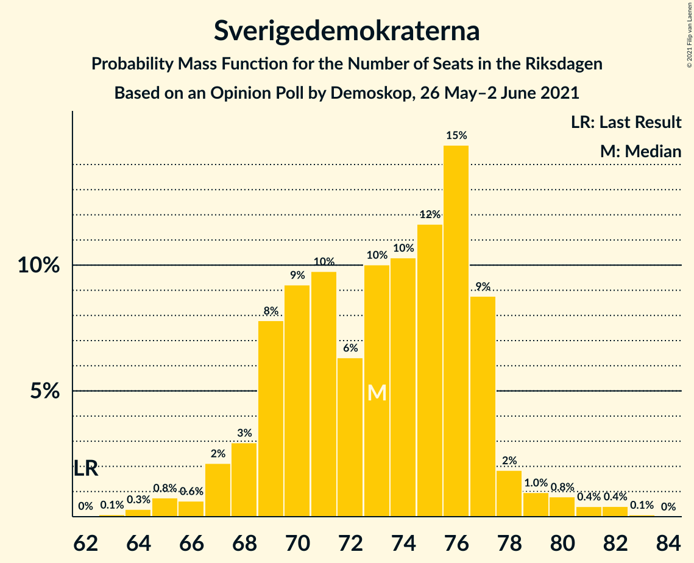
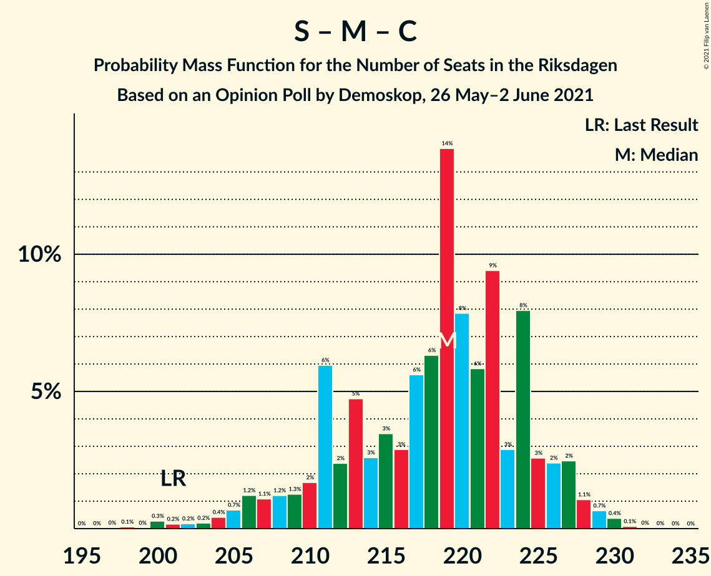
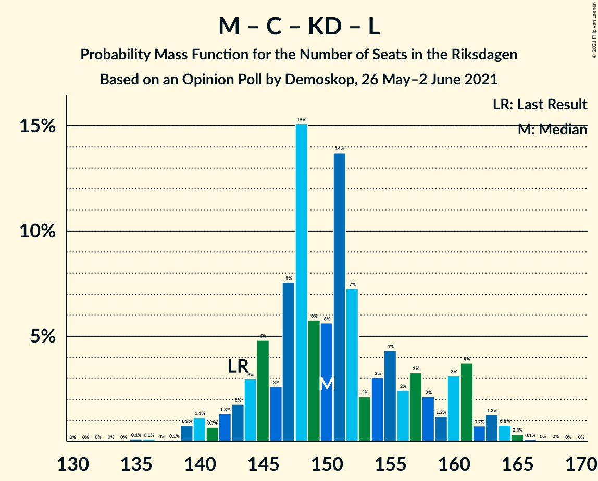
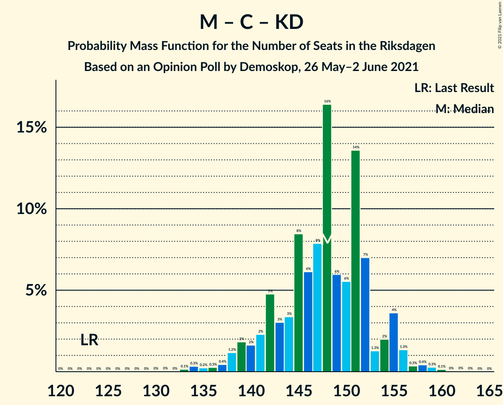
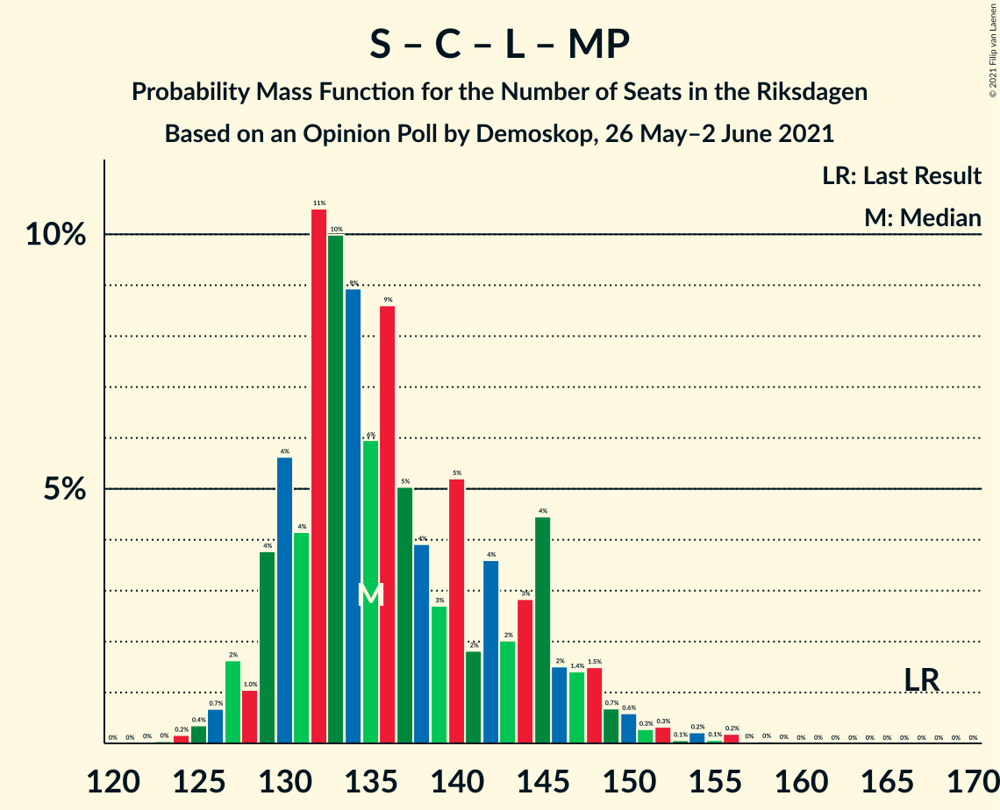

# Opinion Poll by Demoskop, 26 May–2 June 2021

<a href="#voting-intentions">Voting Intentions</a> | <a href="#seats">Seats</a> | <a href="#coalitions">Coalitions</a> | <a href="#technical-information">Technical Information</a>

## Voting Intentions

### Confidence Intervals

| Party | Last Result | Poll Result | 80% Confidence Interval | 90% Confidence Interval | 95% Confidence Interval | 99% Confidence Interval |
|:-----:|:-----------:|:-----------:|:-----------------------:|:-----------------------:|:-----------------------:|:-----------------------:|
| Sveriges socialdemokratiska arbetareparti | 28.3% | 24.1% | 23.1–25.2% |22.8–25.5% |22.6–25.8% |22.1–26.3% |
| Moderata samlingspartiet | 19.8% | 22.9% | 21.8–23.9% |21.6–24.2% |21.3–24.5% |20.8–25.0% |
| Sverigedemokraterna | 17.5% | 19.2% | 18.2–20.2% |17.9–20.4% |17.7–20.7% |17.3–21.2% |
| Centerpartiet | 8.6% | 10.7% | 10.0–11.5% |9.8–11.7% |9.6–11.9% |9.3–12.3% |
| Vänsterpartiet | 8.0% | 8.5% | 7.8–9.2% |7.7–9.4% |7.5–9.6% |7.2–10.0% |
| Kristdemokraterna | 6.3% | 5.6% | 5.1–6.2% |4.9–6.4% |4.8–6.5% |4.6–6.8% |
| Liberalerna | 5.5% | 3.6% | 3.2–4.1% |3.0–4.2% |2.9–4.4% |2.8–4.6% |
| Miljöpartiet de gröna | 4.4% | 3.5% | 3.1–4.0% |2.9–4.1% |2.9–4.2% |2.7–4.5% |

*Note:* The poll result column reflects the actual value used in the calculations. Published results may vary slightly, and in addition be rounded to fewer digits.

## Seats

### Confidence Intervals

| Party | Last Result | Median | 80% Confidence Interval | 90% Confidence Interval | 95% Confidence Interval | 99% Confidence Interval |
|:-----:|:-----------:|:------:|:-----------------------:|:-----------------------:|:-----------------------:|:-----------------------:|
| <a href="#sveriges-socialdemokratiska-arbetareparti">Sveriges socialdemokratiska arbetareparti</a> | 100 | 92 | 87–96 |86–97 |85–98 |82–101 |
| <a href="#moderata-samlingspartiet">Moderata samlingspartiet</a> | 70 | 86 | 82–90 |81–92 |79–93 |77–95 |
| <a href="#sverigedemokraterna">Sverigedemokraterna</a> | 62 | 73 | 69–77 |68–77 |67–79 |65–82 |
| <a href="#centerpartiet">Centerpartiet</a> | 31 | 40 | 38–43 |36–44 |36–45 |34–47 |
| <a href="#vänsterpartiet">Vänsterpartiet</a> | 28 | 32 | 30–35 |29–36 |28–36 |27–37 |
| <a href="#kristdemokraterna">Kristdemokraterna</a> | 22 | 21 | 19–23 |19–24 |18–25 |17–26 |
| <a href="#liberalerna">Liberalerna</a> | 20 | 0 | 0–15 |0–16 |0–16 |0–17 |
| <a href="#miljöpartiet-de-gröna">Miljöpartiet de gröna</a> | 16 | 0 | 0 |0–15 |0–16 |0–17 |

### Sveriges socialdemokratiska arbetareparti

*For a full overview of the results for this party, see the [Sveriges socialdemokratiska arbetareparti](party-sverigessocialdemokratiskaarbetareparti.html) page.*

| Number of Seats | Probability | Accumulated | Special Marks |
|:---------------:|:-----------:|:-----------:|:-------------:|
| 80 | 0.2% | 100% |  |
| 81 | 0.2% | 99.8% |  |
| 82 | 0.2% | 99.6% |  |
| 83 | 0.9% | 99.4% |  |
| 84 | 1.0% | 98.5% |  |
| 85 | 2% | 98% |  |
| 86 | 3% | 96% |  |
| 87 | 6% | 93% |  |
| 88 | 8% | 87% |  |
| 89 | 4% | 79% |  |
| 90 | 7% | 75% |  |
| 91 | 13% | 68% |  |
| 92 | 14% | 55% | Median |
| 93 | 9% | 41% |  |
| 94 | 9% | 32% |  |
| 95 | 8% | 22% |  |
| 96 | 5% | 14% |  |
| 97 | 4% | 9% |  |
| 98 | 3% | 5% |  |
| 99 | 0.9% | 2% |  |
| 100 | 0.6% | 1.2% | Last Result |
| 101 | 0.3% | 0.6% |  |
| 102 | 0.2% | 0.3% |  |
| 103 | 0% | 0.1% |  |
| 104 | 0% | 0% |  |

### Moderata samlingspartiet

*For a full overview of the results for this party, see the [Moderata samlingspartiet](party-moderatasamlingspartiet.html) page.*

| Number of Seats | Probability | Accumulated | Special Marks |
|:---------------:|:-----------:|:-----------:|:-------------:|
| 70 | 0% | 100% | Last Result |
| 71 | 0% | 100% |  |
| 72 | 0% | 100% |  |
| 73 | 0% | 100% |  |
| 74 | 0% | 100% |  |
| 75 | 0.2% | 100% |  |
| 76 | 0.1% | 99.8% |  |
| 77 | 0.4% | 99.7% |  |
| 78 | 1.0% | 99.3% |  |
| 79 | 1.1% | 98% |  |
| 80 | 2% | 97% |  |
| 81 | 4% | 95% |  |
| 82 | 3% | 91% |  |
| 83 | 10% | 88% |  |
| 84 | 9% | 78% |  |
| 85 | 8% | 70% |  |
| 86 | 14% | 61% | Median |
| 87 | 11% | 48% |  |
| 88 | 11% | 36% |  |
| 89 | 8% | 26% |  |
| 90 | 8% | 18% |  |
| 91 | 3% | 10% |  |
| 92 | 3% | 7% |  |
| 93 | 2% | 4% |  |
| 94 | 1.1% | 2% |  |
| 95 | 0.3% | 0.7% |  |
| 96 | 0.3% | 0.4% |  |
| 97 | 0.1% | 0.1% |  |
| 98 | 0% | 0% |  |

### Sverigedemokraterna

*For a full overview of the results for this party, see the [Sverigedemokraterna](party-sverigedemokraterna.html) page.*

| Number of Seats | Probability | Accumulated | Special Marks |
|:---------------:|:-----------:|:-----------:|:-------------:|
| 62 | 0% | 100% | Last Result |
| 63 | 0.1% | 99.9% |  |
| 64 | 0.3% | 99.9% |  |
| 65 | 0.8% | 99.6% |  |
| 66 | 0.6% | 98.8% |  |
| 67 | 2% | 98% |  |
| 68 | 3% | 96% |  |
| 69 | 8% | 93% |  |
| 70 | 9% | 85% |  |
| 71 | 10% | 76% |  |
| 72 | 6% | 66% |  |
| 73 | 10% | 60% | Median |
| 74 | 10% | 50% |  |
| 75 | 12% | 40% |  |
| 76 | 15% | 28% |  |
| 77 | 9% | 13% |  |
| 78 | 2% | 5% |  |
| 79 | 1.0% | 3% |  |
| 80 | 0.8% | 2% |  |
| 81 | 0.4% | 0.9% |  |
| 82 | 0.4% | 0.5% |  |
| 83 | 0.1% | 0.1% |  |
| 84 | 0% | 0% |  |

### Centerpartiet

*For a full overview of the results for this party, see the [Centerpartiet](party-centerpartiet.html) page.*

| Number of Seats | Probability | Accumulated | Special Marks |
|:---------------:|:-----------:|:-----------:|:-------------:|
| 31 | 0% | 100% | Last Result |
| 32 | 0% | 100% |  |
| 33 | 0.1% | 100% |  |
| 34 | 0.4% | 99.9% |  |
| 35 | 2% | 99.5% |  |
| 36 | 3% | 98% |  |
| 37 | 4% | 95% |  |
| 38 | 11% | 90% |  |
| 39 | 22% | 80% |  |
| 40 | 17% | 58% | Median |
| 41 | 10% | 41% |  |
| 42 | 15% | 31% |  |
| 43 | 9% | 16% |  |
| 44 | 5% | 7% |  |
| 45 | 1.4% | 3% |  |
| 46 | 0.8% | 1.4% |  |
| 47 | 0.3% | 0.6% |  |
| 48 | 0.2% | 0.3% |  |
| 49 | 0% | 0% |  |

### Vänsterpartiet

*For a full overview of the results for this party, see the [Vänsterpartiet](party-vänsterpartiet.html) page.*

| Number of Seats | Probability | Accumulated | Special Marks |
|:---------------:|:-----------:|:-----------:|:-------------:|
| 26 | 0.2% | 100% |  |
| 27 | 0.9% | 99.7% |  |
| 28 | 2% | 98.8% | Last Result |
| 29 | 6% | 97% |  |
| 30 | 13% | 90% |  |
| 31 | 18% | 77% |  |
| 32 | 18% | 59% | Median |
| 33 | 15% | 40% |  |
| 34 | 11% | 25% |  |
| 35 | 9% | 14% |  |
| 36 | 3% | 5% |  |
| 37 | 2% | 2% |  |
| 38 | 0.3% | 0.4% |  |
| 39 | 0.1% | 0.1% |  |
| 40 | 0% | 0% |  |

### Kristdemokraterna

*For a full overview of the results for this party, see the [Kristdemokraterna](party-kristdemokraterna.html) page.*

| Number of Seats | Probability | Accumulated | Special Marks |
|:---------------:|:-----------:|:-----------:|:-------------:|
| 16 | 0.1% | 100% |  |
| 17 | 1.0% | 99.8% |  |
| 18 | 3% | 98.9% |  |
| 19 | 12% | 95% |  |
| 20 | 17% | 84% |  |
| 21 | 24% | 67% | Median |
| 22 | 19% | 43% | Last Result |
| 23 | 14% | 24% |  |
| 24 | 7% | 10% |  |
| 25 | 3% | 3% |  |
| 26 | 0.5% | 0.7% |  |
| 27 | 0.2% | 0.2% |  |
| 28 | 0% | 0% |  |

### Liberalerna

*For a full overview of the results for this party, see the [Liberalerna](party-liberalerna.html) page.*

| Number of Seats | Probability | Accumulated | Special Marks |
|:---------------:|:-----------:|:-----------:|:-------------:|
| 0 | 80% | 100% | Median |
| 1 | 0% | 20% |  |
| 2 | 0% | 20% |  |
| 3 | 0% | 20% |  |
| 4 | 0% | 20% |  |
| 5 | 0% | 20% |  |
| 6 | 0% | 20% |  |
| 7 | 0% | 20% |  |
| 8 | 0% | 20% |  |
| 9 | 0% | 20% |  |
| 10 | 0% | 20% |  |
| 11 | 0% | 20% |  |
| 12 | 0% | 20% |  |
| 13 | 0% | 20% |  |
| 14 | 0.2% | 20% |  |
| 15 | 13% | 20% |  |
| 16 | 5% | 7% |  |
| 17 | 1.0% | 1.2% |  |
| 18 | 0.2% | 0.2% |  |
| 19 | 0% | 0% |  |
| 20 | 0% | 0% | Last Result |

### Miljöpartiet de gröna

*For a full overview of the results for this party, see the [Miljöpartiet de gröna](party-miljöpartietdegröna.html) page.*

| Number of Seats | Probability | Accumulated | Special Marks |
|:---------------:|:-----------:|:-----------:|:-------------:|
| 0 | 92% | 100% | Median |
| 1 | 0% | 8% |  |
| 2 | 0% | 8% |  |
| 3 | 0% | 8% |  |
| 4 | 0% | 8% |  |
| 5 | 0% | 8% |  |
| 6 | 0% | 8% |  |
| 7 | 0% | 8% |  |
| 8 | 0% | 8% |  |
| 9 | 0% | 8% |  |
| 10 | 0% | 8% |  |
| 11 | 0% | 8% |  |
| 12 | 0% | 8% |  |
| 13 | 0% | 8% |  |
| 14 | 0.2% | 8% |  |
| 15 | 5% | 7% |  |
| 16 | 2% | 3% | Last Result |
| 17 | 0.4% | 0.5% |  |
| 18 | 0.1% | 0.1% |  |
| 19 | 0% | 0% |  |

## Coalitions

### Confidence Intervals

| Coalition | Last Result | Median | Majority? | 80% Confidence Interval | 90% Confidence Interval | 95% Confidence Interval | 99% Confidence Interval |
|:---------:|:-----------:|:------:|:---------:|:-----------------------:|:-----------------------:|:-----------------------:|:-----------------------:|
| Sveriges socialdemokratiska arbetareparti – Moderata samlingspartiet – Centerpartiet | 201 | 219 | 100% | 211–224 | 208–226 | 206–227 | 201–230 |
| Moderata samlingspartiet – Sverigedemokraterna – Kristdemokraterna | 154 | 182 | 85% | 173–186 | 171–188 | 170–189 | 166–192 |
| Sveriges socialdemokratiska arbetareparti – Moderata samlingspartiet | 170 | 179 | 76% | 171–185 | 169–186 | 167–187 | 163–189 |
| Sveriges socialdemokratiska arbetareparti – Centerpartiet – Vänsterpartiet – Liberalerna – Miljöpartiet de gröna | 195 | 167 | 15% | 163–176 | 161–178 | 160–179 | 157–183 |
| Moderata samlingspartiet – Sverigedemokraterna | 132 | 160 | 0% | 152–165 | 151–166 | 149–168 | 145–170 |
| Moderata samlingspartiet – Centerpartiet – Kristdemokraterna – Liberalerna | 143 | 150 | 0% | 145–160 | 143–161 | 141–163 | 139–165 |
| Moderata samlingspartiet – Centerpartiet – Kristdemokraterna | 123 | 148 | 0% | 142–152 | 140–155 | 138–156 | 134–158 |
| Sveriges socialdemokratiska arbetareparti – Centerpartiet – Liberalerna – Miljöpartiet de gröna | 167 | 135 | 0% | 130–145 | 129–147 | 127–149 | 125–154 |
| Moderata samlingspartiet – Centerpartiet – Liberalerna | 121 | 129 | 0% | 123–139 | 122–140 | 120–142 | 118–144 |
| Sveriges socialdemokratiska arbetareparti – Vänsterpartiet – Miljöpartiet de gröna | 144 | 125 | 0% | 119–131 | 118–134 | 116–136 | 114–141 |
| Moderata samlingspartiet – Centerpartiet | 101 | 127 | 0% | 121–131 | 120–133 | 118–134 | 115–136 |
| Sveriges socialdemokratiska arbetareparti – Vänsterpartiet | 128 | 124 | 0% | 118–129 | 117–130 | 115–131 | 113–134 |
| Sveriges socialdemokratiska arbetareparti – Miljöpartiet de gröna | 116 | 92 | 0% | 88–98 | 87–102 | 86–106 | 83–109 |

### Sveriges socialdemokratiska arbetareparti – Moderata samlingspartiet – Centerpartiet

| Number of Seats | Probability | Accumulated | Special Marks |
|:---------------:|:-----------:|:-----------:|:-------------:|
| 197 | 0% | 100% |  |
| 198 | 0.1% | 99.9% |  |
| 199 | 0% | 99.9% |  |
| 200 | 0.3% | 99.8% |  |
| 201 | 0.2% | 99.6% | Last Result |
| 202 | 0.2% | 99.4% |  |
| 203 | 0.2% | 99.2% |  |
| 204 | 0.4% | 99.0% |  |
| 205 | 0.7% | 98.6% |  |
| 206 | 1.2% | 98% |  |
| 207 | 1.1% | 97% |  |
| 208 | 1.2% | 96% |  |
| 209 | 1.3% | 94% |  |
| 210 | 2% | 93% |  |
| 211 | 6% | 91% |  |
| 212 | 2% | 85% |  |
| 213 | 5% | 83% |  |
| 214 | 3% | 78% |  |
| 215 | 3% | 76% |  |
| 216 | 3% | 72% |  |
| 217 | 6% | 69% |  |
| 218 | 6% | 64% | Median |
| 219 | 14% | 57% |  |
| 220 | 8% | 44% |  |
| 221 | 6% | 36% |  |
| 222 | 9% | 30% |  |
| 223 | 3% | 21% |  |
| 224 | 8% | 18% |  |
| 225 | 3% | 10% |  |
| 226 | 2% | 7% |  |
| 227 | 2% | 5% |  |
| 228 | 1.1% | 2% |  |
| 229 | 0.7% | 1.2% |  |
| 230 | 0.4% | 0.5% |  |
| 231 | 0.1% | 0.1% |  |
| 232 | 0% | 0% |  |

### Moderata samlingspartiet – Sverigedemokraterna – Kristdemokraterna

| Number of Seats | Probability | Accumulated | Special Marks |
|:---------------:|:-----------:|:-----------:|:-------------:|
| 154 | 0% | 100% | Last Result |
| 155 | 0% | 100% |  |
| 156 | 0% | 100% |  |
| 157 | 0% | 100% |  |
| 158 | 0% | 100% |  |
| 159 | 0% | 100% |  |
| 160 | 0% | 100% |  |
| 161 | 0% | 100% |  |
| 162 | 0.2% | 100% |  |
| 163 | 0.1% | 99.8% |  |
| 164 | 0.1% | 99.7% |  |
| 165 | 0.1% | 99.6% |  |
| 166 | 0.3% | 99.5% |  |
| 167 | 0.3% | 99.2% |  |
| 168 | 0.4% | 98.8% |  |
| 169 | 0.7% | 98% |  |
| 170 | 1.1% | 98% |  |
| 171 | 2% | 97% |  |
| 172 | 1.1% | 95% |  |
| 173 | 5% | 94% |  |
| 174 | 4% | 89% |  |
| 175 | 2% | 85% | Majority |
| 176 | 3% | 83% |  |
| 177 | 5% | 79% |  |
| 178 | 6% | 74% |  |
| 179 | 6% | 68% |  |
| 180 | 5% | 62% | Median |
| 181 | 6% | 58% |  |
| 182 | 12% | 52% |  |
| 183 | 7% | 40% |  |
| 184 | 6% | 33% |  |
| 185 | 10% | 26% |  |
| 186 | 6% | 16% |  |
| 187 | 1.1% | 10% |  |
| 188 | 4% | 9% |  |
| 189 | 3% | 5% |  |
| 190 | 0.7% | 2% |  |
| 191 | 0.4% | 1.0% |  |
| 192 | 0.4% | 0.6% |  |
| 193 | 0.2% | 0.2% |  |
| 194 | 0% | 0.1% |  |
| 195 | 0% | 0% |  |

### Sveriges socialdemokratiska arbetareparti – Moderata samlingspartiet

| Number of Seats | Probability | Accumulated | Special Marks |
|:---------------:|:-----------:|:-----------:|:-------------:|
| 159 | 0% | 100% |  |
| 160 | 0.1% | 99.9% |  |
| 161 | 0% | 99.9% |  |
| 162 | 0.1% | 99.9% |  |
| 163 | 0.4% | 99.8% |  |
| 164 | 0.3% | 99.4% |  |
| 165 | 0.4% | 99.1% |  |
| 166 | 0.7% | 98.7% |  |
| 167 | 0.9% | 98% |  |
| 168 | 1.4% | 97% |  |
| 169 | 1.5% | 96% |  |
| 170 | 1.2% | 94% | Last Result |
| 171 | 4% | 93% |  |
| 172 | 4% | 89% |  |
| 173 | 5% | 84% |  |
| 174 | 3% | 80% |  |
| 175 | 3% | 76% | Majority |
| 176 | 8% | 73% |  |
| 177 | 8% | 65% |  |
| 178 | 6% | 57% | Median |
| 179 | 12% | 51% |  |
| 180 | 9% | 39% |  |
| 181 | 5% | 30% |  |
| 182 | 5% | 24% |  |
| 183 | 3% | 19% |  |
| 184 | 5% | 16% |  |
| 185 | 5% | 11% |  |
| 186 | 2% | 6% |  |
| 187 | 3% | 4% |  |
| 188 | 0.8% | 1.4% |  |
| 189 | 0.4% | 0.6% |  |
| 190 | 0.1% | 0.2% |  |
| 191 | 0.1% | 0.1% |  |
| 192 | 0% | 0% |  |

### Sveriges socialdemokratiska arbetareparti – Centerpartiet – Vänsterpartiet – Liberalerna – Miljöpartiet de gröna

| Number of Seats | Probability | Accumulated | Special Marks |
|:---------------:|:-----------:|:-----------:|:-------------:|
| 155 | 0% | 100% |  |
| 156 | 0.2% | 99.9% |  |
| 157 | 0.4% | 99.8% |  |
| 158 | 0.4% | 99.4% |  |
| 159 | 0.7% | 99.0% |  |
| 160 | 3% | 98% |  |
| 161 | 4% | 95% |  |
| 162 | 1.1% | 91% |  |
| 163 | 6% | 90% |  |
| 164 | 10% | 84% | Median |
| 165 | 6% | 74% |  |
| 166 | 7% | 67% |  |
| 167 | 12% | 60% |  |
| 168 | 6% | 48% |  |
| 169 | 5% | 42% |  |
| 170 | 6% | 38% |  |
| 171 | 6% | 32% |  |
| 172 | 5% | 26% |  |
| 173 | 3% | 21% |  |
| 174 | 2% | 17% |  |
| 175 | 4% | 15% | Majority |
| 176 | 5% | 11% |  |
| 177 | 1.1% | 6% |  |
| 178 | 2% | 5% |  |
| 179 | 1.1% | 3% |  |
| 180 | 0.7% | 2% |  |
| 181 | 0.4% | 2% |  |
| 182 | 0.3% | 1.2% |  |
| 183 | 0.3% | 0.8% |  |
| 184 | 0.1% | 0.5% |  |
| 185 | 0.1% | 0.4% |  |
| 186 | 0.1% | 0.3% |  |
| 187 | 0.2% | 0.2% |  |
| 188 | 0% | 0% |  |
| 189 | 0% | 0% |  |
| 190 | 0% | 0% |  |
| 191 | 0% | 0% |  |
| 192 | 0% | 0% |  |
| 193 | 0% | 0% |  |
| 194 | 0% | 0% |  |
| 195 | 0% | 0% | Last Result |

### Moderata samlingspartiet – Sverigedemokraterna

| Number of Seats | Probability | Accumulated | Special Marks |
|:---------------:|:-----------:|:-----------:|:-------------:|
| 132 | 0% | 100% | Last Result |
| 133 | 0% | 100% |  |
| 134 | 0% | 100% |  |
| 135 | 0% | 100% |  |
| 136 | 0% | 100% |  |
| 137 | 0% | 100% |  |
| 138 | 0% | 100% |  |
| 139 | 0% | 100% |  |
| 140 | 0% | 100% |  |
| 141 | 0% | 100% |  |
| 142 | 0.1% | 100% |  |
| 143 | 0.1% | 99.8% |  |
| 144 | 0.1% | 99.8% |  |
| 145 | 0.2% | 99.7% |  |
| 146 | 0.3% | 99.5% |  |
| 147 | 0.4% | 99.2% |  |
| 148 | 0.7% | 98.8% |  |
| 149 | 0.7% | 98% |  |
| 150 | 2% | 97% |  |
| 151 | 2% | 95% |  |
| 152 | 4% | 94% |  |
| 153 | 3% | 90% |  |
| 154 | 3% | 87% |  |
| 155 | 4% | 84% |  |
| 156 | 6% | 80% |  |
| 157 | 6% | 73% |  |
| 158 | 4% | 67% |  |
| 159 | 9% | 63% | Median |
| 160 | 8% | 53% |  |
| 161 | 10% | 45% |  |
| 162 | 7% | 36% |  |
| 163 | 5% | 29% |  |
| 164 | 9% | 23% |  |
| 165 | 6% | 14% |  |
| 166 | 4% | 8% |  |
| 167 | 1.1% | 4% |  |
| 168 | 1.4% | 3% |  |
| 169 | 1.0% | 2% |  |
| 170 | 0.4% | 0.7% |  |
| 171 | 0.2% | 0.3% |  |
| 172 | 0.1% | 0.1% |  |
| 173 | 0% | 0% |  |

### Moderata samlingspartiet – Centerpartiet – Kristdemokraterna – Liberalerna

| Number of Seats | Probability | Accumulated | Special Marks |
|:---------------:|:-----------:|:-----------:|:-------------:|
| 135 | 0.1% | 100% |  |
| 136 | 0.1% | 99.9% |  |
| 137 | 0% | 99.8% |  |
| 138 | 0.1% | 99.7% |  |
| 139 | 0.8% | 99.7% |  |
| 140 | 1.1% | 98.9% |  |
| 141 | 0.7% | 98% |  |
| 142 | 1.3% | 97% |  |
| 143 | 2% | 96% | Last Result |
| 144 | 3% | 94% |  |
| 145 | 5% | 91% |  |
| 146 | 3% | 86% |  |
| 147 | 8% | 84% | Median |
| 148 | 15% | 76% |  |
| 149 | 6% | 61% |  |
| 150 | 6% | 55% |  |
| 151 | 14% | 50% |  |
| 152 | 7% | 36% |  |
| 153 | 2% | 29% |  |
| 154 | 3% | 26% |  |
| 155 | 4% | 23% |  |
| 156 | 2% | 19% |  |
| 157 | 3% | 17% |  |
| 158 | 2% | 13% |  |
| 159 | 1.2% | 11% |  |
| 160 | 3% | 10% |  |
| 161 | 4% | 7% |  |
| 162 | 0.7% | 3% |  |
| 163 | 1.3% | 3% |  |
| 164 | 0.8% | 1.3% |  |
| 165 | 0.3% | 0.5% |  |
| 166 | 0.1% | 0.2% |  |
| 167 | 0% | 0.1% |  |
| 168 | 0% | 0.1% |  |
| 169 | 0% | 0% |  |

### Moderata samlingspartiet – Centerpartiet – Kristdemokraterna

| Number of Seats | Probability | Accumulated | Special Marks |
|:---------------:|:-----------:|:-----------:|:-------------:|
| 123 | 0% | 100% | Last Result |
| 124 | 0% | 100% |  |
| 125 | 0% | 100% |  |
| 126 | 0% | 100% |  |
| 127 | 0% | 100% |  |
| 128 | 0% | 100% |  |
| 129 | 0% | 100% |  |
| 130 | 0% | 100% |  |
| 131 | 0% | 100% |  |
| 132 | 0% | 100% |  |
| 133 | 0.1% | 99.9% |  |
| 134 | 0.3% | 99.8% |  |
| 135 | 0.2% | 99.5% |  |
| 136 | 0.3% | 99.2% |  |
| 137 | 0.4% | 99.0% |  |
| 138 | 1.2% | 98.5% |  |
| 139 | 2% | 97% |  |
| 140 | 2% | 96% |  |
| 141 | 2% | 94% |  |
| 142 | 5% | 92% |  |
| 143 | 3% | 87% |  |
| 144 | 3% | 84% |  |
| 145 | 8% | 80% |  |
| 146 | 6% | 72% |  |
| 147 | 8% | 66% | Median |
| 148 | 16% | 58% |  |
| 149 | 6% | 42% |  |
| 150 | 6% | 36% |  |
| 151 | 14% | 30% |  |
| 152 | 7% | 16% |  |
| 153 | 1.3% | 9% |  |
| 154 | 2% | 8% |  |
| 155 | 4% | 6% |  |
| 156 | 1.3% | 3% |  |
| 157 | 0.3% | 1.3% |  |
| 158 | 0.4% | 0.9% |  |
| 159 | 0.3% | 0.5% |  |
| 160 | 0.1% | 0.2% |  |
| 161 | 0% | 0.1% |  |
| 162 | 0% | 0.1% |  |
| 163 | 0% | 0% |  |

### Sveriges socialdemokratiska arbetareparti – Centerpartiet – Liberalerna – Miljöpartiet de gröna

| Number of Seats | Probability | Accumulated | Special Marks |
|:---------------:|:-----------:|:-----------:|:-------------:|
| 123 | 0% | 100% |  |
| 124 | 0.2% | 99.9% |  |
| 125 | 0.4% | 99.8% |  |
| 126 | 0.7% | 99.4% |  |
| 127 | 2% | 98.7% |  |
| 128 | 1.0% | 97% |  |
| 129 | 4% | 96% |  |
| 130 | 6% | 92% |  |
| 131 | 4% | 87% |  |
| 132 | 11% | 82% | Median |
| 133 | 10% | 72% |  |
| 134 | 9% | 62% |  |
| 135 | 6% | 53% |  |
| 136 | 9% | 47% |  |
| 137 | 5% | 39% |  |
| 138 | 4% | 33% |  |
| 139 | 3% | 30% |  |
| 140 | 5% | 27% |  |
| 141 | 2% | 22% |  |
| 142 | 4% | 20% |  |
| 143 | 2% | 16% |  |
| 144 | 3% | 14% |  |
| 145 | 4% | 11% |  |
| 146 | 2% | 7% |  |
| 147 | 1.4% | 5% |  |
| 148 | 1.5% | 4% |  |
| 149 | 0.7% | 3% |  |
| 150 | 0.6% | 2% |  |
| 151 | 0.3% | 1.2% |  |
| 152 | 0.3% | 0.9% |  |
| 153 | 0.1% | 0.6% |  |
| 154 | 0.2% | 0.6% |  |
| 155 | 0.1% | 0.3% |  |
| 156 | 0.2% | 0.3% |  |
| 157 | 0% | 0.1% |  |
| 158 | 0% | 0.1% |  |
| 159 | 0% | 0% |  |
| 160 | 0% | 0% |  |
| 161 | 0% | 0% |  |
| 162 | 0% | 0% |  |
| 163 | 0% | 0% |  |
| 164 | 0% | 0% |  |
| 165 | 0% | 0% |  |
| 166 | 0% | 0% |  |
| 167 | 0% | 0% | Last Result |

### Moderata samlingspartiet – Centerpartiet – Liberalerna

| Number of Seats | Probability | Accumulated | Special Marks |
|:---------------:|:-----------:|:-----------:|:-------------:|
| 114 | 0% | 100% |  |
| 115 | 0.1% | 99.9% |  |
| 116 | 0.1% | 99.9% |  |
| 117 | 0.1% | 99.8% |  |
| 118 | 0.4% | 99.7% |  |
| 119 | 0.5% | 99.2% |  |
| 120 | 1.3% | 98.7% |  |
| 121 | 2% | 97% | Last Result |
| 122 | 3% | 96% |  |
| 123 | 4% | 93% |  |
| 124 | 4% | 89% |  |
| 125 | 9% | 86% |  |
| 126 | 5% | 77% | Median |
| 127 | 9% | 72% |  |
| 128 | 13% | 63% |  |
| 129 | 12% | 50% |  |
| 130 | 4% | 39% |  |
| 131 | 5% | 34% |  |
| 132 | 5% | 29% |  |
| 133 | 3% | 25% |  |
| 134 | 2% | 21% |  |
| 135 | 3% | 19% |  |
| 136 | 2% | 17% |  |
| 137 | 2% | 15% |  |
| 138 | 3% | 13% |  |
| 139 | 3% | 10% |  |
| 140 | 4% | 8% |  |
| 141 | 0.6% | 3% |  |
| 142 | 1.1% | 3% |  |
| 143 | 0.7% | 2% |  |
| 144 | 0.6% | 1.0% |  |
| 145 | 0.2% | 0.4% |  |
| 146 | 0.1% | 0.2% |  |
| 147 | 0% | 0% |  |

### Sveriges socialdemokratiska arbetareparti – Vänsterpartiet – Miljöpartiet de gröna

| Number of Seats | Probability | Accumulated | Special Marks |
|:---------------:|:-----------:|:-----------:|:-------------:|
| 111 | 0% | 100% |  |
| 112 | 0.1% | 99.9% |  |
| 113 | 0.3% | 99.9% |  |
| 114 | 0.5% | 99.6% |  |
| 115 | 0.4% | 99.0% |  |
| 116 | 1.4% | 98.6% |  |
| 117 | 2% | 97% |  |
| 118 | 2% | 95% |  |
| 119 | 7% | 93% |  |
| 120 | 3% | 86% |  |
| 121 | 6% | 84% |  |
| 122 | 8% | 78% |  |
| 123 | 7% | 70% |  |
| 124 | 9% | 63% | Median |
| 125 | 11% | 54% |  |
| 126 | 7% | 43% |  |
| 127 | 12% | 37% |  |
| 128 | 4% | 24% |  |
| 129 | 6% | 20% |  |
| 130 | 3% | 14% |  |
| 131 | 2% | 11% |  |
| 132 | 2% | 8% |  |
| 133 | 1.5% | 7% |  |
| 134 | 1.2% | 5% |  |
| 135 | 0.5% | 4% |  |
| 136 | 2% | 3% |  |
| 137 | 0.4% | 2% |  |
| 138 | 0.5% | 2% |  |
| 139 | 0.3% | 1.1% |  |
| 140 | 0.2% | 0.8% |  |
| 141 | 0.2% | 0.5% |  |
| 142 | 0.2% | 0.3% |  |
| 143 | 0% | 0.1% |  |
| 144 | 0% | 0% | Last Result |

### Moderata samlingspartiet – Centerpartiet

| Number of Seats | Probability | Accumulated | Special Marks |
|:---------------:|:-----------:|:-----------:|:-------------:|
| 101 | 0% | 100% | Last Result |
| 102 | 0% | 100% |  |
| 103 | 0% | 100% |  |
| 104 | 0% | 100% |  |
| 105 | 0% | 100% |  |
| 106 | 0% | 100% |  |
| 107 | 0% | 100% |  |
| 108 | 0% | 100% |  |
| 109 | 0% | 100% |  |
| 110 | 0% | 100% |  |
| 111 | 0% | 100% |  |
| 112 | 0% | 100% |  |
| 113 | 0.3% | 99.9% |  |
| 114 | 0.1% | 99.7% |  |
| 115 | 0.3% | 99.6% |  |
| 116 | 0.5% | 99.3% |  |
| 117 | 0.8% | 98.8% |  |
| 118 | 1.3% | 98% |  |
| 119 | 1.2% | 97% |  |
| 120 | 3% | 95% |  |
| 121 | 3% | 92% |  |
| 122 | 5% | 89% |  |
| 123 | 6% | 85% |  |
| 124 | 6% | 79% |  |
| 125 | 13% | 72% |  |
| 126 | 6% | 60% | Median |
| 127 | 9% | 53% |  |
| 128 | 13% | 44% |  |
| 129 | 12% | 31% |  |
| 130 | 4% | 19% |  |
| 131 | 5% | 15% |  |
| 132 | 4% | 10% |  |
| 133 | 3% | 6% |  |
| 134 | 1.5% | 3% |  |
| 135 | 0.6% | 2% |  |
| 136 | 0.8% | 1.3% |  |
| 137 | 0.2% | 0.4% |  |
| 138 | 0.1% | 0.2% |  |
| 139 | 0.1% | 0.1% |  |
| 140 | 0% | 0% |  |

### Sveriges socialdemokratiska arbetareparti – Vänsterpartiet

| Number of Seats | Probability | Accumulated | Special Marks |
|:---------------:|:-----------:|:-----------:|:-------------:|
| 108 | 0% | 100% |  |
| 109 | 0% | 99.9% |  |
| 110 | 0% | 99.9% |  |
| 111 | 0.1% | 99.9% |  |
| 112 | 0.2% | 99.8% |  |
| 113 | 0.5% | 99.5% |  |
| 114 | 0.9% | 99.0% |  |
| 115 | 1.0% | 98% |  |
| 116 | 2% | 97% |  |
| 117 | 3% | 95% |  |
| 118 | 3% | 93% |  |
| 119 | 8% | 90% |  |
| 120 | 3% | 82% |  |
| 121 | 7% | 79% |  |
| 122 | 9% | 72% |  |
| 123 | 8% | 63% |  |
| 124 | 9% | 56% | Median |
| 125 | 11% | 47% |  |
| 126 | 7% | 36% |  |
| 127 | 12% | 29% |  |
| 128 | 4% | 17% | Last Result |
| 129 | 5% | 13% |  |
| 130 | 3% | 7% |  |
| 131 | 2% | 4% |  |
| 132 | 1.3% | 2% |  |
| 133 | 0.6% | 1.1% |  |
| 134 | 0.3% | 0.6% |  |
| 135 | 0.2% | 0.3% |  |
| 136 | 0.1% | 0.1% |  |
| 137 | 0% | 0.1% |  |
| 138 | 0% | 0% |  |

### Sveriges socialdemokratiska arbetareparti – Miljöpartiet de gröna

| Number of Seats | Probability | Accumulated | Special Marks |
|:---------------:|:-----------:|:-----------:|:-------------:|
| 81 | 0.1% | 100% |  |
| 82 | 0.1% | 99.9% |  |
| 83 | 0.6% | 99.8% |  |
| 84 | 0.8% | 99.2% |  |
| 85 | 0.7% | 98% |  |
| 86 | 2% | 98% |  |
| 87 | 5% | 96% |  |
| 88 | 7% | 90% |  |
| 89 | 4% | 83% |  |
| 90 | 6% | 79% |  |
| 91 | 12% | 73% |  |
| 92 | 14% | 61% | Median |
| 93 | 9% | 47% |  |
| 94 | 9% | 39% |  |
| 95 | 8% | 30% |  |
| 96 | 5% | 22% |  |
| 97 | 4% | 16% |  |
| 98 | 3% | 12% |  |
| 99 | 1.2% | 9% |  |
| 100 | 1.4% | 8% |  |
| 101 | 0.9% | 7% |  |
| 102 | 1.0% | 6% |  |
| 103 | 0.7% | 5% |  |
| 104 | 0.7% | 4% |  |
| 105 | 0.9% | 3% |  |
| 106 | 1.0% | 3% |  |
| 107 | 0.3% | 2% |  |
| 108 | 0.5% | 1.2% |  |
| 109 | 0.3% | 0.7% |  |
| 110 | 0.3% | 0.4% |  |
| 111 | 0.1% | 0.1% |  |
| 112 | 0% | 0% |  |
| 113 | 0% | 0% |  |
| 114 | 0% | 0% |  |
| 115 | 0% | 0% |  |
| 116 | 0% | 0% | Last Result |

## Technical Information

### Opinion Poll

+ **Polling firm:** Demoskop
+ **Commissioner(s):** —
+ **Fieldwork period:** 26 May–2 June 2021

### Calculations

+ **Sample size:** 2730
+ **Simulations done:** 1,048,576
+ **Error estimate:** 1.34%

