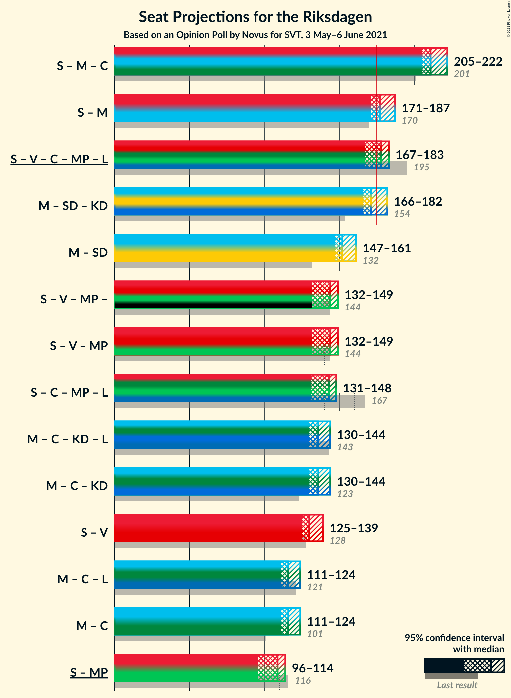
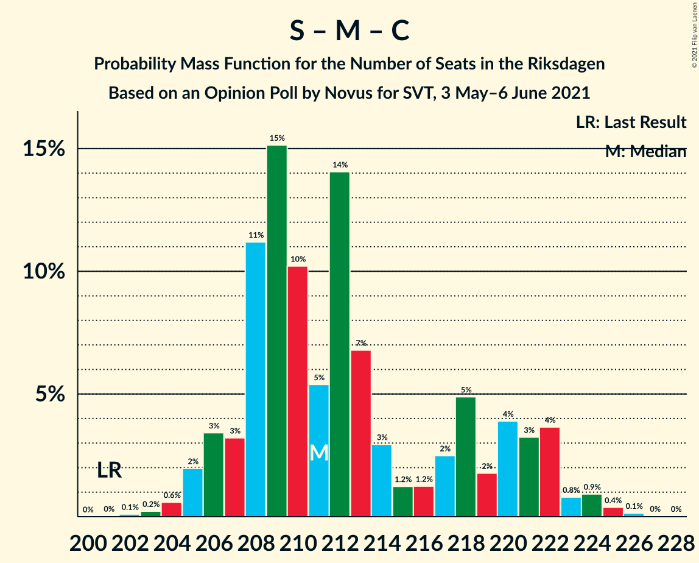

# Opinion Poll by Novus for SVT, 3 May–6 June 2021

<a href="#voting-intentions">Voting Intentions</a> | <a href="#seats">Seats</a> | <a href="#coalitions">Coalitions</a> | <a href="#technical-information">Technical Information</a>

## Voting Intentions

### Confidence Intervals

| Party | Last Result | Poll Result | 80% Confidence Interval | 90% Confidence Interval | 95% Confidence Interval | 99% Confidence Interval |
|:-----:|:-----------:|:-----------:|:-----------------------:|:-----------------------:|:-----------------------:|:-----------------------:|
| Sveriges socialdemokratiska arbetareparti | 28.3% | 26.1% | 25.3–26.9% |25.1–27.1% |24.9–27.3% |24.5–27.7% |
| Moderata samlingspartiet | 19.8% | 22.6% | 21.8–23.4% |21.6–23.6% |21.4–23.8% |21.1–24.2% |
| Sverigedemokraterna | 17.5% | 19.2% | 18.5–20.0% |18.3–20.2% |18.1–20.3% |17.8–20.7% |
| Vänsterpartiet | 8.0% | 9.6% | 9.1–10.2% |8.9–10.3% |8.8–10.5% |8.6–10.7% |
| Centerpartiet | 8.6% | 9.4% | 8.9–10.0% |8.7–10.1% |8.6–10.3% |8.4–10.5% |
| Kristdemokraterna | 6.3% | 5.3% | 4.9–5.7% |4.8–5.9% |4.7–6.0% |4.5–6.2% |
| Miljöpartiet de gröna | 4.4% | 4.2% | 3.9–4.6% |3.7–4.7% |3.7–4.8% |3.5–5.0% |
| Liberalerna | 5.5% | 2.3% | 2.0–2.6% |2.0–2.7% |1.9–2.8% |1.8–2.9% |

*Note:* The poll result column reflects the actual value used in the calculations. Published results may vary slightly, and in addition be rounded to fewer digits.

## Seats

### Confidence Intervals

| Party | Last Result | Median | 80% Confidence Interval | 90% Confidence Interval | 95% Confidence Interval | 99% Confidence Interval |
|:-----:|:-----------:|:------:|:-----------------------:|:-----------------------:|:-----------------------:|:-----------------------:|
| <a href="#sveriges-socialdemokratiska-arbetareparti">Sveriges socialdemokratiska arbetareparti</a> | 100 | 94 | 93–99 |91–99 |91–101 |88–102 |
| <a href="#moderata-samlingspartiet">Moderata samlingspartiet</a> | 70 | 82 | 79–85 |79–86 |78–87 |77–90 |
| <a href="#sverigedemokraterna">Sverigedemokraterna</a> | 62 | 70 | 67–74 |66–74 |65–74 |65–76 |
| <a href="#vänsterpartiet">Vänsterpartiet</a> | 28 | 35 | 33–37 |33–38 |33–38 |31–39 |
| <a href="#centerpartiet">Centerpartiet</a> | 31 | 34 | 33–36 |32–37 |32–37 |30–39 |
| <a href="#kristdemokraterna">Kristdemokraterna</a> | 22 | 19 | 18–21 |18–21 |17–21 |17–22 |
| <a href="#miljöpartiet-de-gröna">Miljöpartiet de gröna</a> | 16 | 15 | 0–16 |0–17 |0–17 |0–18 |
| <a href="#liberalerna">Liberalerna</a> | 20 | 0 | 0 |0 |0 |0 |

### Sveriges socialdemokratiska arbetareparti

*For a full overview of the results for this party, see the [Sveriges socialdemokratiska arbetareparti](party-sverigessocialdemokratiskaarbetareparti.html) page.*

| Number of Seats | Probability | Accumulated | Special Marks |
|:---------------:|:-----------:|:-----------:|:-------------:|
| 87 | 0.4% | 100% |  |
| 88 | 0.2% | 99.6% |  |
| 89 | 0.5% | 99.4% |  |
| 90 | 1.0% | 98.9% |  |
| 91 | 5% | 98% |  |
| 92 | 3% | 93% |  |
| 93 | 26% | 90% |  |
| 94 | 16% | 64% | Median |
| 95 | 7% | 48% |  |
| 96 | 5% | 41% |  |
| 97 | 3% | 36% |  |
| 98 | 4% | 34% |  |
| 99 | 25% | 30% |  |
| 100 | 2% | 5% | Last Result |
| 101 | 2% | 3% |  |
| 102 | 0.7% | 1.1% |  |
| 103 | 0.1% | 0.4% |  |
| 104 | 0.2% | 0.2% |  |
| 105 | 0.1% | 0.1% |  |
| 106 | 0% | 0% |  |

### Moderata samlingspartiet

*For a full overview of the results for this party, see the [Moderata samlingspartiet](party-moderatasamlingspartiet.html) page.*

| Number of Seats | Probability | Accumulated | Special Marks |
|:---------------:|:-----------:|:-----------:|:-------------:|
| 70 | 0% | 100% | Last Result |
| 71 | 0% | 100% |  |
| 72 | 0% | 100% |  |
| 73 | 0% | 100% |  |
| 74 | 0% | 100% |  |
| 75 | 0.1% | 100% |  |
| 76 | 0.3% | 99.9% |  |
| 77 | 0.4% | 99.6% |  |
| 78 | 2% | 99.3% |  |
| 79 | 13% | 97% |  |
| 80 | 9% | 84% |  |
| 81 | 13% | 75% |  |
| 82 | 14% | 62% | Median |
| 83 | 14% | 48% |  |
| 84 | 9% | 34% |  |
| 85 | 19% | 25% |  |
| 86 | 1.0% | 6% |  |
| 87 | 3% | 5% |  |
| 88 | 0.8% | 2% |  |
| 89 | 0.6% | 1.5% |  |
| 90 | 0.5% | 0.9% |  |
| 91 | 0.3% | 0.4% |  |
| 92 | 0% | 0% |  |

### Sverigedemokraterna

*For a full overview of the results for this party, see the [Sverigedemokraterna](party-sverigedemokraterna.html) page.*

| Number of Seats | Probability | Accumulated | Special Marks |
|:---------------:|:-----------:|:-----------:|:-------------:|
| 62 | 0% | 100% | Last Result |
| 63 | 0.1% | 100% |  |
| 64 | 0.1% | 99.9% |  |
| 65 | 4% | 99.8% |  |
| 66 | 1.4% | 96% |  |
| 67 | 6% | 95% |  |
| 68 | 12% | 89% |  |
| 69 | 17% | 77% |  |
| 70 | 18% | 60% | Median |
| 71 | 9% | 41% |  |
| 72 | 7% | 33% |  |
| 73 | 6% | 26% |  |
| 74 | 17% | 19% |  |
| 75 | 1.0% | 2% |  |
| 76 | 0.5% | 0.9% |  |
| 77 | 0.3% | 0.4% |  |
| 78 | 0.1% | 0.1% |  |
| 79 | 0% | 0% |  |

### Vänsterpartiet

*For a full overview of the results for this party, see the [Vänsterpartiet](party-vänsterpartiet.html) page.*

| Number of Seats | Probability | Accumulated | Special Marks |
|:---------------:|:-----------:|:-----------:|:-------------:|
| 28 | 0% | 100% | Last Result |
| 29 | 0% | 100% |  |
| 30 | 0.1% | 100% |  |
| 31 | 0.6% | 99.9% |  |
| 32 | 1.0% | 99.3% |  |
| 33 | 11% | 98% |  |
| 34 | 21% | 88% |  |
| 35 | 24% | 67% | Median |
| 36 | 7% | 43% |  |
| 37 | 30% | 36% |  |
| 38 | 5% | 6% |  |
| 39 | 0.6% | 0.8% |  |
| 40 | 0.2% | 0.2% |  |
| 41 | 0% | 0.1% |  |
| 42 | 0% | 0% |  |

### Centerpartiet

*For a full overview of the results for this party, see the [Centerpartiet](party-centerpartiet.html) page.*

| Number of Seats | Probability | Accumulated | Special Marks |
|:---------------:|:-----------:|:-----------:|:-------------:|
| 29 | 0.1% | 100% |  |
| 30 | 0.7% | 99.9% |  |
| 31 | 1.3% | 99.3% | Last Result |
| 32 | 4% | 98% |  |
| 33 | 17% | 94% |  |
| 34 | 47% | 77% | Median |
| 35 | 12% | 30% |  |
| 36 | 12% | 18% |  |
| 37 | 4% | 6% |  |
| 38 | 0.4% | 1.2% |  |
| 39 | 0.7% | 0.9% |  |
| 40 | 0.1% | 0.1% |  |
| 41 | 0% | 0% |  |

### Kristdemokraterna

*For a full overview of the results for this party, see the [Kristdemokraterna](party-kristdemokraterna.html) page.*

| Number of Seats | Probability | Accumulated | Special Marks |
|:---------------:|:-----------:|:-----------:|:-------------:|
| 16 | 0.4% | 100% |  |
| 17 | 4% | 99.6% |  |
| 18 | 11% | 96% |  |
| 19 | 41% | 85% | Median |
| 20 | 24% | 45% |  |
| 21 | 19% | 21% |  |
| 22 | 1.0% | 1.4% | Last Result |
| 23 | 0.3% | 0.4% |  |
| 24 | 0% | 0% |  |

### Miljöpartiet de gröna

*For a full overview of the results for this party, see the [Miljöpartiet de gröna](party-miljöpartietdegröna.html) page.*

| Number of Seats | Probability | Accumulated | Special Marks |
|:---------------:|:-----------:|:-----------:|:-------------:|
| 0 | 25% | 100% |  |
| 1 | 0% | 75% |  |
| 2 | 0% | 75% |  |
| 3 | 0% | 75% |  |
| 4 | 0% | 75% |  |
| 5 | 0% | 75% |  |
| 6 | 0% | 75% |  |
| 7 | 0% | 75% |  |
| 8 | 0% | 75% |  |
| 9 | 0% | 75% |  |
| 10 | 0% | 75% |  |
| 11 | 0% | 75% |  |
| 12 | 0% | 75% |  |
| 13 | 0% | 75% |  |
| 14 | 0% | 75% |  |
| 15 | 40% | 75% | Median |
| 16 | 29% | 35% | Last Result |
| 17 | 5% | 6% |  |
| 18 | 1.0% | 1.1% |  |
| 19 | 0.1% | 0.1% |  |
| 20 | 0% | 0% |  |

### Liberalerna

*For a full overview of the results for this party, see the [Liberalerna](party-liberalerna.html) page.*

| Number of Seats | Probability | Accumulated | Special Marks |
|:---------------:|:-----------:|:-----------:|:-------------:|
| 0 | 100% | 100% | Median |
| 1 | 0% | 0% |  |
| 2 | 0% | 0% |  |
| 3 | 0% | 0% |  |
| 4 | 0% | 0% |  |
| 5 | 0% | 0% |  |
| 6 | 0% | 0% |  |
| 7 | 0% | 0% |  |
| 8 | 0% | 0% |  |
| 9 | 0% | 0% |  |
| 10 | 0% | 0% |  |
| 11 | 0% | 0% |  |
| 12 | 0% | 0% |  |
| 13 | 0% | 0% |  |
| 14 | 0% | 0% |  |
| 15 | 0% | 0% |  |
| 16 | 0% | 0% |  |
| 17 | 0% | 0% |  |
| 18 | 0% | 0% |  |
| 19 | 0% | 0% |  |
| 20 | 0% | 0% | Last Result |

## Coalitions

### Confidence Intervals

| Coalition | Last Result | Median | Majority? | 80% Confidence Interval | 90% Confidence Interval | 95% Confidence Interval | 99% Confidence Interval |
|:---------:|:-----------:|:------:|:---------:|:-----------------------:|:-----------------------:|:-----------------------:|:-----------------------:|
| Sveriges socialdemokratiska arbetareparti – Moderata samlingspartiet – Centerpartiet | 201 | 210 | 100% | 208–218 | 206–221 | 206–222 | 204–226 |
| Sveriges socialdemokratiska arbetareparti – Moderata samlingspartiet | 170 | 176 | 86% | 174–184 | 173–185 | 172–187 | 169–190 |
| Sveriges socialdemokratiska arbetareparti – Vänsterpartiet – Centerpartiet – Miljöpartiet de gröna – Liberalerna | 195 | 177 | 75% | 170–182 | 170–183 | 170–183 | 166–184 |
| Moderata samlingspartiet – Sverigedemokraterna – Kristdemokraterna | 154 | 172 | 25% | 167–179 | 166–179 | 166–179 | 165–183 |
| Moderata samlingspartiet – Sverigedemokraterna | 132 | 151 | 0% | 147–159 | 147–159 | 147–160 | 145–163 |
| Sveriges socialdemokratiska arbetareparti – Vänsterpartiet – Miljöpartiet de gröna | 144 | 144 | 0% | 136–148 | 136–149 | 134–149 | 131–151 |
| Sveriges socialdemokratiska arbetareparti – Centerpartiet – Miljöpartiet de gröna – Liberalerna | 167 | 143 | 0% | 133–148 | 133–148 | 133–148 | 130–150 |
| Moderata samlingspartiet – Centerpartiet – Kristdemokraterna – Liberalerna | 143 | 136 | 0% | 132–139 | 131–141 | 131–143 | 129–146 |
| Moderata samlingspartiet – Centerpartiet – Kristdemokraterna | 123 | 136 | 0% | 132–139 | 131–141 | 131–143 | 129–146 |
| Sveriges socialdemokratiska arbetareparti – Vänsterpartiet | 128 | 130 | 0% | 126–136 | 126–136 | 125–138 | 122–139 |
| Moderata samlingspartiet – Centerpartiet – Liberalerna | 121 | 117 | 0% | 113–120 | 113–122 | 112–123 | 110–126 |
| Moderata samlingspartiet – Centerpartiet | 101 | 117 | 0% | 113–120 | 113–122 | 112–123 | 110–126 |
| Sveriges socialdemokratiska arbetareparti – Miljöpartiet de gröna | 116 | 109 | 0% | 99–114 | 99–114 | 98–114 | 95–115 |

### Sveriges socialdemokratiska arbetareparti – Moderata samlingspartiet – Centerpartiet

| Number of Seats | Probability | Accumulated | Special Marks |
|:---------------:|:-----------:|:-----------:|:-------------:|
| 201 | 0.1% | 100% | Last Result |
| 202 | 0% | 99.9% |  |
| 203 | 0.3% | 99.9% |  |
| 204 | 0.6% | 99.6% |  |
| 205 | 0.3% | 99.1% |  |
| 206 | 5% | 98.8% |  |
| 207 | 3% | 94% |  |
| 208 | 12% | 91% |  |
| 209 | 18% | 79% |  |
| 210 | 12% | 61% | Median |
| 211 | 5% | 49% |  |
| 212 | 9% | 44% |  |
| 213 | 4% | 35% |  |
| 214 | 6% | 31% |  |
| 215 | 0.4% | 25% |  |
| 216 | 0.4% | 25% |  |
| 217 | 0.5% | 24% |  |
| 218 | 17% | 24% |  |
| 219 | 0.7% | 7% |  |
| 220 | 0.9% | 6% |  |
| 221 | 0.4% | 5% |  |
| 222 | 4% | 5% |  |
| 223 | 0.1% | 1.3% |  |
| 224 | 0.2% | 1.2% |  |
| 225 | 0.4% | 1.0% |  |
| 226 | 0.5% | 0.6% |  |
| 227 | 0% | 0% |  |

### Sveriges socialdemokratiska arbetareparti – Moderata samlingspartiet

| Number of Seats | Probability | Accumulated | Special Marks |
|:---------------:|:-----------:|:-----------:|:-------------:|
| 168 | 0.2% | 100% |  |
| 169 | 0.3% | 99.7% |  |
| 170 | 0.2% | 99.4% | Last Result |
| 171 | 0.5% | 99.2% |  |
| 172 | 2% | 98.7% |  |
| 173 | 5% | 96% |  |
| 174 | 5% | 91% |  |
| 175 | 29% | 86% | Majority |
| 176 | 12% | 57% | Median |
| 177 | 4% | 46% |  |
| 178 | 15% | 42% |  |
| 179 | 1.1% | 26% |  |
| 180 | 0.4% | 25% |  |
| 181 | 0.3% | 25% |  |
| 182 | 0.4% | 25% |  |
| 183 | 1.4% | 24% |  |
| 184 | 18% | 23% |  |
| 185 | 1.1% | 5% |  |
| 186 | 0.7% | 4% |  |
| 187 | 2% | 3% |  |
| 188 | 0.2% | 1.2% |  |
| 189 | 0.2% | 1.0% |  |
| 190 | 0.6% | 0.8% |  |
| 191 | 0.2% | 0.2% |  |
| 192 | 0% | 0% |  |

### Sveriges socialdemokratiska arbetareparti – Vänsterpartiet – Centerpartiet – Miljöpartiet de gröna – Liberalerna

| Number of Seats | Probability | Accumulated | Special Marks |
|:---------------:|:-----------:|:-----------:|:-------------:|
| 164 | 0.1% | 100% |  |
| 165 | 0.1% | 99.8% |  |
| 166 | 0.3% | 99.7% |  |
| 167 | 0.7% | 99.4% |  |
| 168 | 0.6% | 98.7% |  |
| 169 | 0.3% | 98% |  |
| 170 | 17% | 98% |  |
| 171 | 1.2% | 81% |  |
| 172 | 2% | 80% |  |
| 173 | 2% | 78% |  |
| 174 | 0.8% | 76% |  |
| 175 | 2% | 75% | Majority |
| 176 | 9% | 73% |  |
| 177 | 20% | 65% |  |
| 178 | 2% | 45% | Median |
| 179 | 15% | 43% |  |
| 180 | 12% | 28% |  |
| 181 | 3% | 16% |  |
| 182 | 3% | 13% |  |
| 183 | 9% | 10% |  |
| 184 | 0.8% | 1.1% |  |
| 185 | 0.1% | 0.3% |  |
| 186 | 0.1% | 0.2% |  |
| 187 | 0% | 0% |  |
| 188 | 0% | 0% |  |
| 189 | 0% | 0% |  |
| 190 | 0% | 0% |  |
| 191 | 0% | 0% |  |
| 192 | 0% | 0% |  |
| 193 | 0% | 0% |  |
| 194 | 0% | 0% |  |
| 195 | 0% | 0% | Last Result |

### Moderata samlingspartiet – Sverigedemokraterna – Kristdemokraterna

| Number of Seats | Probability | Accumulated | Special Marks |
|:---------------:|:-----------:|:-----------:|:-------------:|
| 154 | 0% | 100% | Last Result |
| 155 | 0% | 100% |  |
| 156 | 0% | 100% |  |
| 157 | 0% | 100% |  |
| 158 | 0% | 100% |  |
| 159 | 0% | 100% |  |
| 160 | 0% | 100% |  |
| 161 | 0% | 100% |  |
| 162 | 0% | 100% |  |
| 163 | 0.1% | 100% |  |
| 164 | 0.1% | 99.8% |  |
| 165 | 0.8% | 99.7% |  |
| 166 | 9% | 98.9% |  |
| 167 | 3% | 90% |  |
| 168 | 3% | 87% |  |
| 169 | 12% | 84% |  |
| 170 | 15% | 72% |  |
| 171 | 2% | 57% | Median |
| 172 | 20% | 55% |  |
| 173 | 9% | 35% |  |
| 174 | 2% | 27% |  |
| 175 | 0.8% | 25% | Majority |
| 176 | 2% | 24% |  |
| 177 | 2% | 22% |  |
| 178 | 1.2% | 20% |  |
| 179 | 17% | 19% |  |
| 180 | 0.3% | 2% |  |
| 181 | 0.6% | 2% |  |
| 182 | 0.7% | 1.3% |  |
| 183 | 0.3% | 0.6% |  |
| 184 | 0.1% | 0.3% |  |
| 185 | 0.1% | 0.2% |  |
| 186 | 0% | 0% |  |

### Moderata samlingspartiet – Sverigedemokraterna

| Number of Seats | Probability | Accumulated | Special Marks |
|:---------------:|:-----------:|:-----------:|:-------------:|
| 132 | 0% | 100% | Last Result |
| 133 | 0% | 100% |  |
| 134 | 0% | 100% |  |
| 135 | 0% | 100% |  |
| 136 | 0% | 100% |  |
| 137 | 0% | 100% |  |
| 138 | 0% | 100% |  |
| 139 | 0% | 100% |  |
| 140 | 0% | 100% |  |
| 141 | 0% | 100% |  |
| 142 | 0% | 100% |  |
| 143 | 0% | 100% |  |
| 144 | 0.1% | 100% |  |
| 145 | 0.6% | 99.8% |  |
| 146 | 0.8% | 99.2% |  |
| 147 | 9% | 98% |  |
| 148 | 6% | 90% |  |
| 149 | 4% | 84% |  |
| 150 | 5% | 80% |  |
| 151 | 27% | 75% |  |
| 152 | 4% | 48% | Median |
| 153 | 5% | 44% |  |
| 154 | 13% | 39% |  |
| 155 | 1.2% | 25% |  |
| 156 | 2% | 24% |  |
| 157 | 0.7% | 22% |  |
| 158 | 1.2% | 21% |  |
| 159 | 17% | 20% |  |
| 160 | 0.7% | 3% |  |
| 161 | 0.3% | 2% |  |
| 162 | 0.7% | 2% |  |
| 163 | 0.6% | 0.9% |  |
| 164 | 0.1% | 0.3% |  |
| 165 | 0.2% | 0.2% |  |
| 166 | 0% | 0% |  |

### Sveriges socialdemokratiska arbetareparti – Vänsterpartiet – Miljöpartiet de gröna

| Number of Seats | Probability | Accumulated | Special Marks |
|:---------------:|:-----------:|:-----------:|:-------------:|
| 128 | 0% | 100% |  |
| 129 | 0.1% | 99.9% |  |
| 130 | 0.2% | 99.9% |  |
| 131 | 0.5% | 99.6% |  |
| 132 | 0.8% | 99.1% |  |
| 133 | 0.5% | 98% |  |
| 134 | 0.7% | 98% |  |
| 135 | 1.2% | 97% |  |
| 136 | 17% | 96% |  |
| 137 | 0.7% | 79% |  |
| 138 | 2% | 78% |  |
| 139 | 2% | 77% |  |
| 140 | 0.6% | 74% |  |
| 141 | 5% | 74% |  |
| 142 | 9% | 69% |  |
| 143 | 4% | 60% |  |
| 144 | 18% | 56% | Last Result, Median |
| 145 | 17% | 38% |  |
| 146 | 6% | 21% |  |
| 147 | 4% | 15% |  |
| 148 | 2% | 11% |  |
| 149 | 8% | 9% |  |
| 150 | 0.7% | 1.2% |  |
| 151 | 0.3% | 0.5% |  |
| 152 | 0.1% | 0.2% |  |
| 153 | 0% | 0% |  |

### Sveriges socialdemokratiska arbetareparti – Centerpartiet – Miljöpartiet de gröna – Liberalerna

| Number of Seats | Probability | Accumulated | Special Marks |
|:---------------:|:-----------:|:-----------:|:-------------:|
| 128 | 0.1% | 100% |  |
| 129 | 0.3% | 99.9% |  |
| 130 | 0.1% | 99.6% |  |
| 131 | 0.7% | 99.5% |  |
| 132 | 0.2% | 98.8% |  |
| 133 | 18% | 98.6% |  |
| 134 | 0.7% | 81% |  |
| 135 | 2% | 80% |  |
| 136 | 0.2% | 78% |  |
| 137 | 1.5% | 78% |  |
| 138 | 2% | 77% |  |
| 139 | 1.4% | 75% |  |
| 140 | 1.0% | 73% |  |
| 141 | 5% | 72% |  |
| 142 | 16% | 68% |  |
| 143 | 18% | 52% | Median |
| 144 | 5% | 34% |  |
| 145 | 12% | 29% |  |
| 146 | 3% | 16% |  |
| 147 | 2% | 14% |  |
| 148 | 10% | 12% |  |
| 149 | 0.8% | 2% |  |
| 150 | 0.9% | 1.0% |  |
| 151 | 0.1% | 0.1% |  |
| 152 | 0.1% | 0.1% |  |
| 153 | 0% | 0% |  |
| 154 | 0% | 0% |  |
| 155 | 0% | 0% |  |
| 156 | 0% | 0% |  |
| 157 | 0% | 0% |  |
| 158 | 0% | 0% |  |
| 159 | 0% | 0% |  |
| 160 | 0% | 0% |  |
| 161 | 0% | 0% |  |
| 162 | 0% | 0% |  |
| 163 | 0% | 0% |  |
| 164 | 0% | 0% |  |
| 165 | 0% | 0% |  |
| 166 | 0% | 0% |  |
| 167 | 0% | 0% | Last Result |

### Moderata samlingspartiet – Centerpartiet – Kristdemokraterna – Liberalerna

| Number of Seats | Probability | Accumulated | Special Marks |
|:---------------:|:-----------:|:-----------:|:-------------:|
| 128 | 0.1% | 100% |  |
| 129 | 2% | 99.9% |  |
| 130 | 0.3% | 98% |  |
| 131 | 4% | 98% |  |
| 132 | 13% | 94% |  |
| 133 | 5% | 81% |  |
| 134 | 3% | 76% |  |
| 135 | 21% | 73% | Median |
| 136 | 11% | 52% |  |
| 137 | 0.9% | 41% |  |
| 138 | 8% | 40% |  |
| 139 | 24% | 32% |  |
| 140 | 2% | 8% |  |
| 141 | 1.3% | 6% |  |
| 142 | 2% | 5% |  |
| 143 | 0.8% | 3% | Last Result |
| 144 | 0.7% | 2% |  |
| 145 | 0.7% | 1.3% |  |
| 146 | 0.3% | 0.6% |  |
| 147 | 0.3% | 0.3% |  |
| 148 | 0% | 0% |  |

### Moderata samlingspartiet – Centerpartiet – Kristdemokraterna

| Number of Seats | Probability | Accumulated | Special Marks |
|:---------------:|:-----------:|:-----------:|:-------------:|
| 123 | 0% | 100% | Last Result |
| 124 | 0% | 100% |  |
| 125 | 0% | 100% |  |
| 126 | 0% | 100% |  |
| 127 | 0% | 100% |  |
| 128 | 0.1% | 100% |  |
| 129 | 2% | 99.9% |  |
| 130 | 0.3% | 98% |  |
| 131 | 4% | 98% |  |
| 132 | 13% | 94% |  |
| 133 | 5% | 81% |  |
| 134 | 3% | 76% |  |
| 135 | 21% | 73% | Median |
| 136 | 11% | 52% |  |
| 137 | 0.9% | 41% |  |
| 138 | 8% | 40% |  |
| 139 | 24% | 32% |  |
| 140 | 2% | 8% |  |
| 141 | 1.3% | 6% |  |
| 142 | 2% | 5% |  |
| 143 | 0.8% | 3% |  |
| 144 | 0.7% | 2% |  |
| 145 | 0.7% | 1.3% |  |
| 146 | 0.3% | 0.6% |  |
| 147 | 0.3% | 0.3% |  |
| 148 | 0% | 0% |  |

### Sveriges socialdemokratiska arbetareparti – Vänsterpartiet

| Number of Seats | Probability | Accumulated | Special Marks |
|:---------------:|:-----------:|:-----------:|:-------------:|
| 122 | 0.5% | 100% |  |
| 123 | 0.6% | 99.4% |  |
| 124 | 0.4% | 98.8% |  |
| 125 | 1.1% | 98% |  |
| 126 | 12% | 97% |  |
| 127 | 3% | 85% |  |
| 128 | 17% | 83% | Last Result |
| 129 | 7% | 65% | Median |
| 130 | 17% | 58% |  |
| 131 | 5% | 41% |  |
| 132 | 4% | 36% |  |
| 133 | 1.0% | 32% |  |
| 134 | 9% | 31% |  |
| 135 | 1.3% | 22% |  |
| 136 | 17% | 21% |  |
| 137 | 0.2% | 4% |  |
| 138 | 2% | 3% |  |
| 139 | 2% | 2% |  |
| 140 | 0.1% | 0.3% |  |
| 141 | 0.1% | 0.2% |  |
| 142 | 0.1% | 0.1% |  |
| 143 | 0% | 0% |  |

### Moderata samlingspartiet – Centerpartiet – Liberalerna

| Number of Seats | Probability | Accumulated | Special Marks |
|:---------------:|:-----------:|:-----------:|:-------------:|
| 108 | 0% | 100% |  |
| 109 | 0.1% | 99.9% |  |
| 110 | 2% | 99.9% |  |
| 111 | 0.6% | 98% |  |
| 112 | 0.4% | 98% |  |
| 113 | 16% | 97% |  |
| 114 | 14% | 81% |  |
| 115 | 5% | 67% |  |
| 116 | 11% | 62% | Median |
| 117 | 11% | 51% |  |
| 118 | 5% | 40% |  |
| 119 | 19% | 34% |  |
| 120 | 7% | 15% |  |
| 121 | 3% | 8% | Last Result |
| 122 | 2% | 5% |  |
| 123 | 0.8% | 3% |  |
| 124 | 2% | 2% |  |
| 125 | 0.3% | 0.8% |  |
| 126 | 0.2% | 0.5% |  |
| 127 | 0.1% | 0.3% |  |
| 128 | 0% | 0.2% |  |
| 129 | 0.1% | 0.1% |  |
| 130 | 0% | 0% |  |

### Moderata samlingspartiet – Centerpartiet

| Number of Seats | Probability | Accumulated | Special Marks |
|:---------------:|:-----------:|:-----------:|:-------------:|
| 101 | 0% | 100% | Last Result |
| 102 | 0% | 100% |  |
| 103 | 0% | 100% |  |
| 104 | 0% | 100% |  |
| 105 | 0% | 100% |  |
| 106 | 0% | 100% |  |
| 107 | 0% | 100% |  |
| 108 | 0% | 100% |  |
| 109 | 0.1% | 99.9% |  |
| 110 | 2% | 99.9% |  |
| 111 | 0.6% | 98% |  |
| 112 | 0.4% | 98% |  |
| 113 | 16% | 97% |  |
| 114 | 14% | 81% |  |
| 115 | 5% | 67% |  |
| 116 | 11% | 62% | Median |
| 117 | 11% | 51% |  |
| 118 | 5% | 40% |  |
| 119 | 19% | 34% |  |
| 120 | 7% | 15% |  |
| 121 | 3% | 8% |  |
| 122 | 2% | 5% |  |
| 123 | 0.8% | 3% |  |
| 124 | 2% | 2% |  |
| 125 | 0.3% | 0.8% |  |
| 126 | 0.2% | 0.5% |  |
| 127 | 0.1% | 0.3% |  |
| 128 | 0% | 0.2% |  |
| 129 | 0.1% | 0.1% |  |
| 130 | 0% | 0% |  |

### Sveriges socialdemokratiska arbetareparti – Miljöpartiet de gröna

| Number of Seats | Probability | Accumulated | Special Marks |
|:---------------:|:-----------:|:-----------:|:-------------:|
| 93 | 0.3% | 100% |  |
| 94 | 0.1% | 99.7% |  |
| 95 | 0.2% | 99.6% |  |
| 96 | 0.2% | 99.4% |  |
| 97 | 1.1% | 99.2% |  |
| 98 | 2% | 98% |  |
| 99 | 17% | 97% |  |
| 100 | 2% | 80% |  |
| 101 | 1.5% | 78% |  |
| 102 | 1.0% | 76% |  |
| 103 | 0.3% | 75% |  |
| 104 | 0.4% | 75% |  |
| 105 | 0.5% | 75% |  |
| 106 | 4% | 74% |  |
| 107 | 3% | 70% |  |
| 108 | 15% | 67% |  |
| 109 | 15% | 52% | Median |
| 110 | 15% | 37% |  |
| 111 | 8% | 22% |  |
| 112 | 2% | 14% |  |
| 113 | 1.3% | 12% |  |
| 114 | 10% | 11% |  |
| 115 | 1.0% | 1.2% |  |
| 116 | 0.1% | 0.2% | Last Result |
| 117 | 0.1% | 0.1% |  |
| 118 | 0% | 0% |  |

## Technical Information

### Opinion Poll

+ **Polling firm:** Novus
+ **Commissioner(s):** SVT
+ **Fieldwork period:** 3 May–6 June 2021

### Calculations

+ **Sample size:** 4925
+ **Simulations done:** 131,072
+ **Error estimate:** 0.64%

