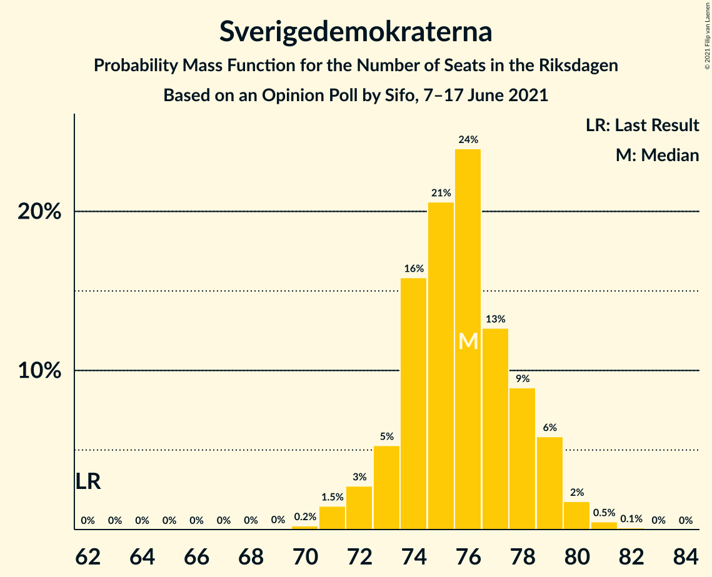
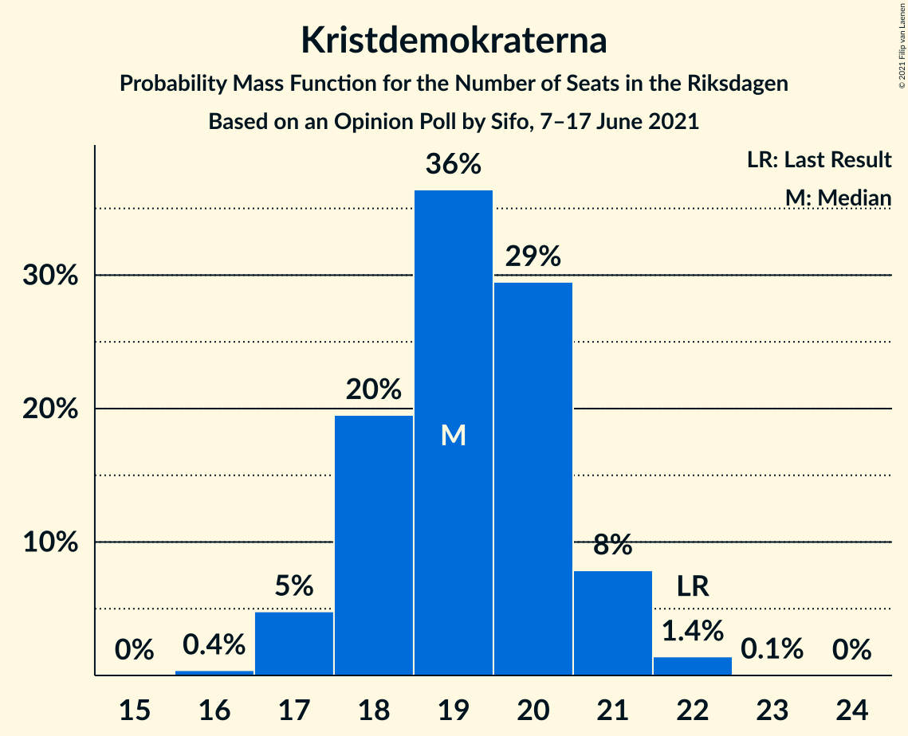
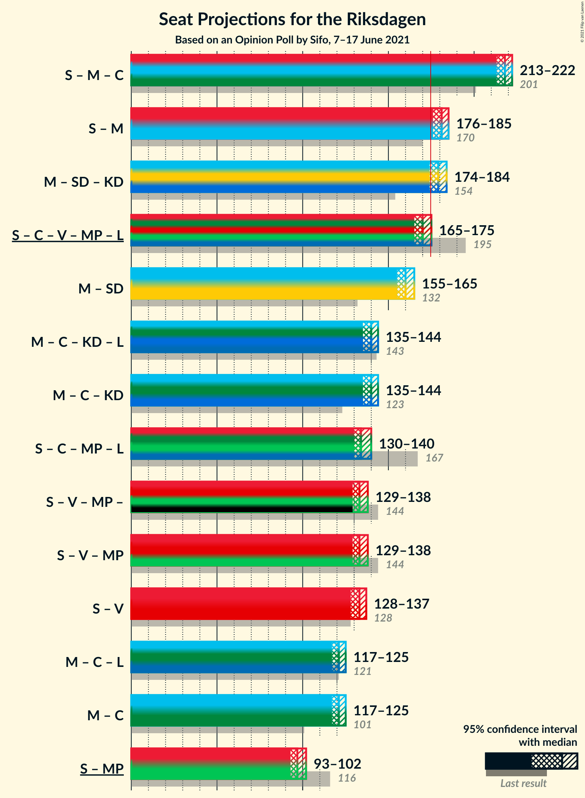
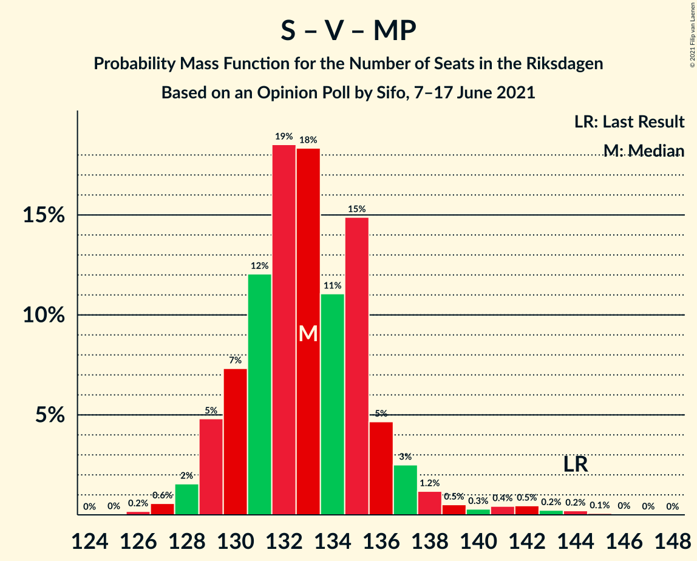
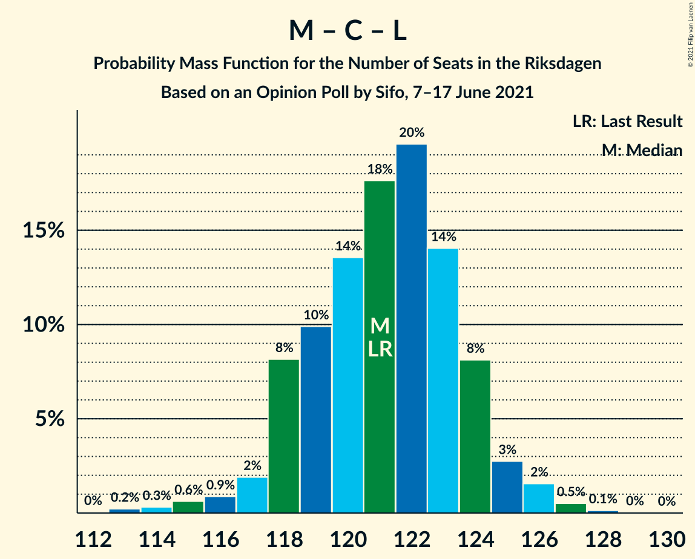

# Opinion Poll by Sifo, 7–17 June 2021

<a href="#voting-intentions">Voting Intentions</a> | <a href="#seats">Seats</a> | <a href="#coalitions">Coalitions</a> | <a href="#technical-information">Technical Information</a>

## Voting Intentions

### Confidence Intervals

| Party | Last Result | Poll Result | 80% Confidence Interval | 90% Confidence Interval | 95% Confidence Interval | 99% Confidence Interval |
|:-----:|:-----------:|:-----------:|:-----------------------:|:-----------------------:|:-----------------------:|:-----------------------:|
| Sveriges socialdemokratiska arbetareparti | 28.3% | 25.8% | 25.1–26.5% |24.9–26.7% |24.8–26.9% |24.4–27.2% |
| Moderata samlingspartiet | 19.8% | 22.4% | 21.7–23.1% |21.6–23.3% |21.4–23.4% |21.1–23.8% |
| Sverigedemokraterna | 17.5% | 20.2% | 19.6–20.9% |19.4–21.0% |19.2–21.2% |18.9–21.5% |
| Centerpartiet | 8.6% | 9.9% | 9.4–10.4% |9.3–10.5% |9.2–10.7% |9.0–10.9% |
| Vänsterpartiet | 8.0% | 9.6% | 9.1–10.1% |9.0–10.2% |8.9–10.3% |8.7–10.6% |
| Kristdemokraterna | 6.3% | 5.1% | 4.8–5.5% |4.7–5.6% |4.6–5.7% |4.4–5.8% |
| Miljöpartiet de gröna | 4.4% | 3.5% | 3.2–3.8% |3.1–3.9% |3.1–4.0% |3.0–4.1% |
| Liberalerna | 5.5% | 2.3% | 2.1–2.6% |2.0–2.6% |2.0–2.7% |1.8–2.8% |

*Note:* The poll result column reflects the actual value used in the calculations. Published results may vary slightly, and in addition be rounded to fewer digits.

## Seats

### Confidence Intervals

| Party | Last Result | Median | 80% Confidence Interval | 90% Confidence Interval | 95% Confidence Interval | 99% Confidence Interval |
|:-----:|:-----------:|:------:|:-----------------------:|:-----------------------:|:-----------------------:|:-----------------------:|
| <a href="#sveriges-socialdemokratiska-arbetareparti">Sveriges socialdemokratiska arbetareparti</a> | 100 | 96 | 94–99 |93–100 |93–101 |91–102 |
| <a href="#moderata-samlingspartiet">Moderata samlingspartiet</a> | 70 | 84 | 81–86 |81–87 |80–88 |79–89 |
| <a href="#sverigedemokraterna">Sverigedemokraterna</a> | 62 | 76 | 74–78 |73–79 |72–79 |71–81 |
| <a href="#centerpartiet">Centerpartiet</a> | 31 | 37 | 35–39 |35–39 |34–40 |34–41 |
| <a href="#vänsterpartiet">Vänsterpartiet</a> | 28 | 36 | 34–38 |34–38 |33–39 |33–40 |
| <a href="#kristdemokraterna">Kristdemokraterna</a> | 22 | 19 | 18–20 |17–21 |17–21 |17–22 |
| <a href="#miljöpartiet-de-gröna">Miljöpartiet de gröna</a> | 16 | 0 | 0 |0 |0 |0–15 |
| <a href="#liberalerna">Liberalerna</a> | 20 | 0 | 0 |0 |0 |0 |

### Sveriges socialdemokratiska arbetareparti

*For a full overview of the results for this party, see the [Sveriges socialdemokratiska arbetareparti](party-sverigessocialdemokratiskaarbetareparti.html) page.*

| Number of Seats | Probability | Accumulated | Special Marks |
|:---------------:|:-----------:|:-----------:|:-------------:|
| 89 | 0.1% | 100% |  |
| 90 | 0.2% | 99.9% |  |
| 91 | 0.6% | 99.7% |  |
| 92 | 1.4% | 99.1% |  |
| 93 | 5% | 98% |  |
| 94 | 8% | 92% |  |
| 95 | 14% | 84% |  |
| 96 | 21% | 70% | Median |
| 97 | 18% | 50% |  |
| 98 | 15% | 32% |  |
| 99 | 8% | 17% |  |
| 100 | 6% | 9% | Last Result |
| 101 | 2% | 3% |  |
| 102 | 0.8% | 1.1% |  |
| 103 | 0.2% | 0.3% |  |
| 104 | 0% | 0% |  |

### Moderata samlingspartiet

*For a full overview of the results for this party, see the [Moderata samlingspartiet](party-moderatasamlingspartiet.html) page.*

| Number of Seats | Probability | Accumulated | Special Marks |
|:---------------:|:-----------:|:-----------:|:-------------:|
| 70 | 0% | 100% | Last Result |
| 71 | 0% | 100% |  |
| 72 | 0% | 100% |  |
| 73 | 0% | 100% |  |
| 74 | 0% | 100% |  |
| 75 | 0% | 100% |  |
| 76 | 0% | 100% |  |
| 77 | 0.1% | 100% |  |
| 78 | 0.3% | 99.9% |  |
| 79 | 0.9% | 99.6% |  |
| 80 | 2% | 98.7% |  |
| 81 | 7% | 96% |  |
| 82 | 13% | 90% |  |
| 83 | 14% | 77% |  |
| 84 | 21% | 63% | Median |
| 85 | 24% | 42% |  |
| 86 | 9% | 18% |  |
| 87 | 5% | 9% |  |
| 88 | 3% | 4% |  |
| 89 | 0.8% | 1.0% |  |
| 90 | 0.1% | 0.2% |  |
| 91 | 0% | 0.1% |  |
| 92 | 0% | 0% |  |

### Sverigedemokraterna

*For a full overview of the results for this party, see the [Sverigedemokraterna](party-sverigedemokraterna.html) page.*

| Number of Seats | Probability | Accumulated | Special Marks |
|:---------------:|:-----------:|:-----------:|:-------------:|
| 62 | 0% | 100% | Last Result |
| 63 | 0% | 100% |  |
| 64 | 0% | 100% |  |
| 65 | 0% | 100% |  |
| 66 | 0% | 100% |  |
| 67 | 0% | 100% |  |
| 68 | 0% | 100% |  |
| 69 | 0% | 100% |  |
| 70 | 0.2% | 99.9% |  |
| 71 | 1.5% | 99.7% |  |
| 72 | 3% | 98% |  |
| 73 | 5% | 95% |  |
| 74 | 16% | 90% |  |
| 75 | 21% | 74% |  |
| 76 | 24% | 54% | Median |
| 77 | 13% | 30% |  |
| 78 | 9% | 17% |  |
| 79 | 6% | 8% |  |
| 80 | 2% | 2% |  |
| 81 | 0.5% | 0.6% |  |
| 82 | 0.1% | 0.1% |  |
| 83 | 0% | 0% |  |

### Centerpartiet

*For a full overview of the results for this party, see the [Centerpartiet](party-centerpartiet.html) page.*

| Number of Seats | Probability | Accumulated | Special Marks |
|:---------------:|:-----------:|:-----------:|:-------------:|
| 31 | 0% | 100% | Last Result |
| 32 | 0% | 100% |  |
| 33 | 0.4% | 100% |  |
| 34 | 3% | 99.5% |  |
| 35 | 10% | 97% |  |
| 36 | 16% | 87% |  |
| 37 | 25% | 71% | Median |
| 38 | 31% | 46% |  |
| 39 | 10% | 14% |  |
| 40 | 3% | 4% |  |
| 41 | 0.6% | 0.7% |  |
| 42 | 0.1% | 0.1% |  |
| 43 | 0% | 0% |  |

### Vänsterpartiet

*For a full overview of the results for this party, see the [Vänsterpartiet](party-vänsterpartiet.html) page.*

| Number of Seats | Probability | Accumulated | Special Marks |
|:---------------:|:-----------:|:-----------:|:-------------:|
| 28 | 0% | 100% | Last Result |
| 29 | 0% | 100% |  |
| 30 | 0% | 100% |  |
| 31 | 0% | 100% |  |
| 32 | 0.4% | 100% |  |
| 33 | 3% | 99.6% |  |
| 34 | 7% | 97% |  |
| 35 | 24% | 90% |  |
| 36 | 27% | 65% | Median |
| 37 | 24% | 39% |  |
| 38 | 10% | 15% |  |
| 39 | 4% | 4% |  |
| 40 | 0.5% | 0.6% |  |
| 41 | 0.1% | 0.1% |  |
| 42 | 0% | 0% |  |

### Kristdemokraterna

*For a full overview of the results for this party, see the [Kristdemokraterna](party-kristdemokraterna.html) page.*

| Number of Seats | Probability | Accumulated | Special Marks |
|:---------------:|:-----------:|:-----------:|:-------------:|
| 16 | 0.4% | 100% |  |
| 17 | 5% | 99.6% |  |
| 18 | 20% | 95% |  |
| 19 | 36% | 75% | Median |
| 20 | 29% | 39% |  |
| 21 | 8% | 9% |  |
| 22 | 1.4% | 2% | Last Result |
| 23 | 0.1% | 0.1% |  |
| 24 | 0% | 0% |  |

### Miljöpartiet de gröna

*For a full overview of the results for this party, see the [Miljöpartiet de gröna](party-miljöpartietdegröna.html) page.*

| Number of Seats | Probability | Accumulated | Special Marks |
|:---------------:|:-----------:|:-----------:|:-------------:|
| 0 | 98% | 100% | Median |
| 1 | 0% | 2% |  |
| 2 | 0% | 2% |  |
| 3 | 0% | 2% |  |
| 4 | 0% | 2% |  |
| 5 | 0% | 2% |  |
| 6 | 0% | 2% |  |
| 7 | 0% | 2% |  |
| 8 | 0% | 2% |  |
| 9 | 0% | 2% |  |
| 10 | 0% | 2% |  |
| 11 | 0% | 2% |  |
| 12 | 0% | 2% |  |
| 13 | 0% | 2% |  |
| 14 | 0.4% | 2% |  |
| 15 | 2% | 2% |  |
| 16 | 0.1% | 0.1% | Last Result |
| 17 | 0% | 0% |  |

### Liberalerna

*For a full overview of the results for this party, see the [Liberalerna](party-liberalerna.html) page.*

| Number of Seats | Probability | Accumulated | Special Marks |
|:---------------:|:-----------:|:-----------:|:-------------:|
| 0 | 100% | 100% | Median |
| 1 | 0% | 0% |  |
| 2 | 0% | 0% |  |
| 3 | 0% | 0% |  |
| 4 | 0% | 0% |  |
| 5 | 0% | 0% |  |
| 6 | 0% | 0% |  |
| 7 | 0% | 0% |  |
| 8 | 0% | 0% |  |
| 9 | 0% | 0% |  |
| 10 | 0% | 0% |  |
| 11 | 0% | 0% |  |
| 12 | 0% | 0% |  |
| 13 | 0% | 0% |  |
| 14 | 0% | 0% |  |
| 15 | 0% | 0% |  |
| 16 | 0% | 0% |  |
| 17 | 0% | 0% |  |
| 18 | 0% | 0% |  |
| 19 | 0% | 0% |  |
| 20 | 0% | 0% | Last Result |

## Coalitions

### Confidence Intervals

| Coalition | Last Result | Median | Majority? | 80% Confidence Interval | 90% Confidence Interval | 95% Confidence Interval | 99% Confidence Interval |
|:---------:|:-----------:|:------:|:---------:|:-----------------------:|:-----------------------:|:-----------------------:|:-----------------------:|
| Sveriges socialdemokratiska arbetareparti – Moderata samlingspartiet – Centerpartiet | 201 | 218 | 100% | 215–221 | 214–222 | 213–222 | 208–224 |
| Sveriges socialdemokratiska arbetareparti – Moderata samlingspartiet | 170 | 181 | 98% | 178–184 | 177–184 | 176–185 | 172–187 |
| Moderata samlingspartiet – Sverigedemokraterna – Kristdemokraterna | 154 | 179 | 96% | 176–182 | 175–183 | 174–184 | 171–185 |
| Sveriges socialdemokratiska arbetareparti – Centerpartiet – Vänsterpartiet – Miljöpartiet de gröna – Liberalerna | 195 | 170 | 4% | 167–173 | 166–174 | 165–175 | 164–178 |
| Moderata samlingspartiet – Sverigedemokraterna | 132 | 160 | 0% | 157–163 | 156–164 | 155–165 | 152–166 |
| Moderata samlingspartiet – Centerpartiet – Kristdemokraterna – Liberalerna | 143 | 140 | 0% | 138–143 | 136–144 | 135–144 | 132–146 |
| Moderata samlingspartiet – Centerpartiet – Kristdemokraterna | 123 | 140 | 0% | 138–143 | 136–144 | 135–144 | 132–146 |
| Sveriges socialdemokratiska arbetareparti – Centerpartiet – Miljöpartiet de gröna – Liberalerna | 167 | 134 | 0% | 131–137 | 130–138 | 130–140 | 128–145 |
| Sveriges socialdemokratiska arbetareparti – Vänsterpartiet – Miljöpartiet de gröna | 144 | 133 | 0% | 130–136 | 129–137 | 129–138 | 127–143 |
| Sveriges socialdemokratiska arbetareparti – Vänsterpartiet | 128 | 133 | 0% | 130–135 | 129–136 | 128–137 | 125–139 |
| Moderata samlingspartiet – Centerpartiet – Liberalerna | 121 | 121 | 0% | 118–124 | 118–124 | 117–125 | 114–127 |
| Moderata samlingspartiet – Centerpartiet | 101 | 121 | 0% | 118–124 | 118–124 | 117–125 | 114–127 |
| Sveriges socialdemokratiska arbetareparti – Miljöpartiet de gröna | 116 | 97 | 0% | 94–100 | 93–100 | 93–102 | 92–108 |

### Sveriges socialdemokratiska arbetareparti – Moderata samlingspartiet – Centerpartiet

| Number of Seats | Probability | Accumulated | Special Marks |
|:---------------:|:-----------:|:-----------:|:-------------:|
| 201 | 0% | 100% | Last Result |
| 202 | 0% | 100% |  |
| 203 | 0% | 100% |  |
| 204 | 0% | 100% |  |
| 205 | 0.1% | 100% |  |
| 206 | 0.1% | 99.9% |  |
| 207 | 0.2% | 99.8% |  |
| 208 | 0.5% | 99.5% |  |
| 209 | 0.3% | 99.1% |  |
| 210 | 0.3% | 98.8% |  |
| 211 | 0.5% | 98.5% |  |
| 212 | 0.5% | 98% |  |
| 213 | 2% | 98% |  |
| 214 | 2% | 96% |  |
| 215 | 9% | 93% |  |
| 216 | 10% | 85% |  |
| 217 | 18% | 75% | Median |
| 218 | 20% | 56% |  |
| 219 | 16% | 37% |  |
| 220 | 9% | 20% |  |
| 221 | 6% | 11% |  |
| 222 | 4% | 5% |  |
| 223 | 1.1% | 2% |  |
| 224 | 0.4% | 0.5% |  |
| 225 | 0.1% | 0.1% |  |
| 226 | 0% | 0% |  |

### Sveriges socialdemokratiska arbetareparti – Moderata samlingspartiet

| Number of Seats | Probability | Accumulated | Special Marks |
|:---------------:|:-----------:|:-----------:|:-------------:|
| 169 | 0.1% | 100% |  |
| 170 | 0.1% | 99.9% | Last Result |
| 171 | 0.2% | 99.8% |  |
| 172 | 0.2% | 99.6% |  |
| 173 | 0.4% | 99.4% |  |
| 174 | 0.8% | 99.0% |  |
| 175 | 0.7% | 98% | Majority |
| 176 | 1.2% | 98% |  |
| 177 | 6% | 96% |  |
| 178 | 9% | 90% |  |
| 179 | 17% | 82% |  |
| 180 | 13% | 64% | Median |
| 181 | 20% | 51% |  |
| 182 | 8% | 32% |  |
| 183 | 10% | 23% |  |
| 184 | 8% | 13% |  |
| 185 | 3% | 5% |  |
| 186 | 0.9% | 2% |  |
| 187 | 0.5% | 0.7% |  |
| 188 | 0.1% | 0.1% |  |
| 189 | 0% | 0% |  |

### Moderata samlingspartiet – Sverigedemokraterna – Kristdemokraterna

| Number of Seats | Probability | Accumulated | Special Marks |
|:---------------:|:-----------:|:-----------:|:-------------:|
| 154 | 0% | 100% | Last Result |
| 155 | 0% | 100% |  |
| 156 | 0% | 100% |  |
| 157 | 0% | 100% |  |
| 158 | 0% | 100% |  |
| 159 | 0% | 100% |  |
| 160 | 0% | 100% |  |
| 161 | 0% | 100% |  |
| 162 | 0% | 100% |  |
| 163 | 0% | 100% |  |
| 164 | 0% | 100% |  |
| 165 | 0% | 100% |  |
| 166 | 0% | 100% |  |
| 167 | 0% | 100% |  |
| 168 | 0.1% | 99.9% |  |
| 169 | 0.1% | 99.8% |  |
| 170 | 0.2% | 99.7% |  |
| 171 | 0.5% | 99.5% |  |
| 172 | 0.5% | 99.0% |  |
| 173 | 1.0% | 98.5% |  |
| 174 | 1.3% | 98% |  |
| 175 | 3% | 96% | Majority |
| 176 | 7% | 93% |  |
| 177 | 9% | 86% |  |
| 178 | 19% | 76% |  |
| 179 | 18% | 58% | Median |
| 180 | 17% | 40% |  |
| 181 | 12% | 23% |  |
| 182 | 4% | 11% |  |
| 183 | 4% | 7% |  |
| 184 | 2% | 3% |  |
| 185 | 0.6% | 0.7% |  |
| 186 | 0.1% | 0.2% |  |
| 187 | 0% | 0% |  |

### Sveriges socialdemokratiska arbetareparti – Centerpartiet – Vänsterpartiet – Miljöpartiet de gröna – Liberalerna

| Number of Seats | Probability | Accumulated | Special Marks |
|:---------------:|:-----------:|:-----------:|:-------------:|
| 163 | 0.1% | 100% |  |
| 164 | 0.6% | 99.8% |  |
| 165 | 2% | 99.3% |  |
| 166 | 4% | 97% |  |
| 167 | 4% | 93% |  |
| 168 | 12% | 89% |  |
| 169 | 17% | 77% | Median |
| 170 | 18% | 60% |  |
| 171 | 19% | 42% |  |
| 172 | 9% | 24% |  |
| 173 | 7% | 14% |  |
| 174 | 3% | 7% |  |
| 175 | 1.3% | 4% | Majority |
| 176 | 1.0% | 2% |  |
| 177 | 0.5% | 1.5% |  |
| 178 | 0.5% | 1.0% |  |
| 179 | 0.2% | 0.5% |  |
| 180 | 0.1% | 0.3% |  |
| 181 | 0.1% | 0.2% |  |
| 182 | 0% | 0.1% |  |
| 183 | 0% | 0% |  |
| 184 | 0% | 0% |  |
| 185 | 0% | 0% |  |
| 186 | 0% | 0% |  |
| 187 | 0% | 0% |  |
| 188 | 0% | 0% |  |
| 189 | 0% | 0% |  |
| 190 | 0% | 0% |  |
| 191 | 0% | 0% |  |
| 192 | 0% | 0% |  |
| 193 | 0% | 0% |  |
| 194 | 0% | 0% |  |
| 195 | 0% | 0% | Last Result |

### Moderata samlingspartiet – Sverigedemokraterna

| Number of Seats | Probability | Accumulated | Special Marks |
|:---------------:|:-----------:|:-----------:|:-------------:|
| 132 | 0% | 100% | Last Result |
| 133 | 0% | 100% |  |
| 134 | 0% | 100% |  |
| 135 | 0% | 100% |  |
| 136 | 0% | 100% |  |
| 137 | 0% | 100% |  |
| 138 | 0% | 100% |  |
| 139 | 0% | 100% |  |
| 140 | 0% | 100% |  |
| 141 | 0% | 100% |  |
| 142 | 0% | 100% |  |
| 143 | 0% | 100% |  |
| 144 | 0% | 100% |  |
| 145 | 0% | 100% |  |
| 146 | 0% | 100% |  |
| 147 | 0% | 100% |  |
| 148 | 0% | 100% |  |
| 149 | 0.1% | 100% |  |
| 150 | 0.1% | 99.9% |  |
| 151 | 0.2% | 99.8% |  |
| 152 | 0.2% | 99.6% |  |
| 153 | 0.6% | 99.4% |  |
| 154 | 1.1% | 98.8% |  |
| 155 | 2% | 98% |  |
| 156 | 5% | 96% |  |
| 157 | 7% | 91% |  |
| 158 | 9% | 83% |  |
| 159 | 20% | 75% |  |
| 160 | 24% | 55% | Median |
| 161 | 11% | 31% |  |
| 162 | 9% | 20% |  |
| 163 | 4% | 12% |  |
| 164 | 5% | 7% |  |
| 165 | 2% | 3% |  |
| 166 | 0.7% | 0.8% |  |
| 167 | 0.1% | 0.1% |  |
| 168 | 0% | 0% |  |

### Moderata samlingspartiet – Centerpartiet – Kristdemokraterna – Liberalerna

| Number of Seats | Probability | Accumulated | Special Marks |
|:---------------:|:-----------:|:-----------:|:-------------:|
| 130 | 0% | 100% |  |
| 131 | 0.2% | 99.9% |  |
| 132 | 0.2% | 99.7% |  |
| 133 | 0.3% | 99.5% |  |
| 134 | 0.5% | 99.2% |  |
| 135 | 1.2% | 98.7% |  |
| 136 | 3% | 97% |  |
| 137 | 4% | 95% |  |
| 138 | 11% | 91% |  |
| 139 | 13% | 80% |  |
| 140 | 18% | 67% | Median |
| 141 | 20% | 50% |  |
| 142 | 12% | 30% |  |
| 143 | 10% | 18% | Last Result |
| 144 | 6% | 8% |  |
| 145 | 1.2% | 2% |  |
| 146 | 0.8% | 1.1% |  |
| 147 | 0.3% | 0.3% |  |
| 148 | 0% | 0.1% |  |
| 149 | 0% | 0% |  |

### Moderata samlingspartiet – Centerpartiet – Kristdemokraterna

| Number of Seats | Probability | Accumulated | Special Marks |
|:---------------:|:-----------:|:-----------:|:-------------:|
| 123 | 0% | 100% | Last Result |
| 124 | 0% | 100% |  |
| 125 | 0% | 100% |  |
| 126 | 0% | 100% |  |
| 127 | 0% | 100% |  |
| 128 | 0% | 100% |  |
| 129 | 0% | 100% |  |
| 130 | 0% | 100% |  |
| 131 | 0.2% | 99.9% |  |
| 132 | 0.2% | 99.7% |  |
| 133 | 0.3% | 99.5% |  |
| 134 | 0.5% | 99.2% |  |
| 135 | 1.2% | 98.7% |  |
| 136 | 3% | 97% |  |
| 137 | 4% | 95% |  |
| 138 | 11% | 91% |  |
| 139 | 13% | 80% |  |
| 140 | 18% | 67% | Median |
| 141 | 20% | 50% |  |
| 142 | 12% | 30% |  |
| 143 | 10% | 18% |  |
| 144 | 6% | 8% |  |
| 145 | 1.2% | 2% |  |
| 146 | 0.8% | 1.1% |  |
| 147 | 0.3% | 0.3% |  |
| 148 | 0% | 0.1% |  |
| 149 | 0% | 0% |  |

### Sveriges socialdemokratiska arbetareparti – Centerpartiet – Miljöpartiet de gröna – Liberalerna

| Number of Seats | Probability | Accumulated | Special Marks |
|:---------------:|:-----------:|:-----------:|:-------------:|
| 127 | 0.1% | 100% |  |
| 128 | 0.5% | 99.9% |  |
| 129 | 1.0% | 99.4% |  |
| 130 | 4% | 98% |  |
| 131 | 7% | 94% |  |
| 132 | 9% | 87% |  |
| 133 | 24% | 78% | Median |
| 134 | 15% | 55% |  |
| 135 | 21% | 39% |  |
| 136 | 7% | 19% |  |
| 137 | 4% | 12% |  |
| 138 | 4% | 8% |  |
| 139 | 1.0% | 4% |  |
| 140 | 0.9% | 3% |  |
| 141 | 0.2% | 2% |  |
| 142 | 0.3% | 2% |  |
| 143 | 0.5% | 1.3% |  |
| 144 | 0.3% | 0.8% |  |
| 145 | 0.3% | 0.5% |  |
| 146 | 0.1% | 0.2% |  |
| 147 | 0.1% | 0.1% |  |
| 148 | 0% | 0% |  |
| 149 | 0% | 0% |  |
| 150 | 0% | 0% |  |
| 151 | 0% | 0% |  |
| 152 | 0% | 0% |  |
| 153 | 0% | 0% |  |
| 154 | 0% | 0% |  |
| 155 | 0% | 0% |  |
| 156 | 0% | 0% |  |
| 157 | 0% | 0% |  |
| 158 | 0% | 0% |  |
| 159 | 0% | 0% |  |
| 160 | 0% | 0% |  |
| 161 | 0% | 0% |  |
| 162 | 0% | 0% |  |
| 163 | 0% | 0% |  |
| 164 | 0% | 0% |  |
| 165 | 0% | 0% |  |
| 166 | 0% | 0% |  |
| 167 | 0% | 0% | Last Result |

### Sveriges socialdemokratiska arbetareparti – Vänsterpartiet – Miljöpartiet de gröna

| Number of Seats | Probability | Accumulated | Special Marks |
|:---------------:|:-----------:|:-----------:|:-------------:|
| 126 | 0.2% | 100% |  |
| 127 | 0.6% | 99.8% |  |
| 128 | 2% | 99.2% |  |
| 129 | 5% | 98% |  |
| 130 | 7% | 93% |  |
| 131 | 12% | 86% |  |
| 132 | 19% | 73% | Median |
| 133 | 18% | 55% |  |
| 134 | 11% | 37% |  |
| 135 | 15% | 26% |  |
| 136 | 5% | 11% |  |
| 137 | 3% | 6% |  |
| 138 | 1.2% | 3% |  |
| 139 | 0.5% | 2% |  |
| 140 | 0.3% | 2% |  |
| 141 | 0.4% | 1.5% |  |
| 142 | 0.5% | 1.1% |  |
| 143 | 0.2% | 0.6% |  |
| 144 | 0.2% | 0.4% | Last Result |
| 145 | 0.1% | 0.2% |  |
| 146 | 0% | 0.1% |  |
| 147 | 0% | 0% |  |

### Sveriges socialdemokratiska arbetareparti – Vänsterpartiet

| Number of Seats | Probability | Accumulated | Special Marks |
|:---------------:|:-----------:|:-----------:|:-------------:|
| 123 | 0% | 100% |  |
| 124 | 0.2% | 99.9% |  |
| 125 | 0.2% | 99.7% |  |
| 126 | 0.6% | 99.5% |  |
| 127 | 0.9% | 98.9% |  |
| 128 | 2% | 98% | Last Result |
| 129 | 5% | 96% |  |
| 130 | 7% | 91% |  |
| 131 | 12% | 84% |  |
| 132 | 19% | 72% | Median |
| 133 | 18% | 53% |  |
| 134 | 11% | 35% |  |
| 135 | 15% | 24% |  |
| 136 | 5% | 9% |  |
| 137 | 2% | 4% |  |
| 138 | 1.0% | 2% |  |
| 139 | 0.4% | 0.5% |  |
| 140 | 0.1% | 0.1% |  |
| 141 | 0% | 0% |  |

### Moderata samlingspartiet – Centerpartiet – Liberalerna

| Number of Seats | Probability | Accumulated | Special Marks |
|:---------------:|:-----------:|:-----------:|:-------------:|
| 112 | 0% | 100% |  |
| 113 | 0.2% | 99.9% |  |
| 114 | 0.3% | 99.7% |  |
| 115 | 0.6% | 99.4% |  |
| 116 | 0.9% | 98.8% |  |
| 117 | 2% | 98% |  |
| 118 | 8% | 96% |  |
| 119 | 10% | 88% |  |
| 120 | 14% | 78% |  |
| 121 | 18% | 64% | Last Result, Median |
| 122 | 20% | 47% |  |
| 123 | 14% | 27% |  |
| 124 | 8% | 13% |  |
| 125 | 3% | 5% |  |
| 126 | 2% | 2% |  |
| 127 | 0.5% | 0.7% |  |
| 128 | 0.1% | 0.2% |  |
| 129 | 0% | 0% |  |

### Moderata samlingspartiet – Centerpartiet

| Number of Seats | Probability | Accumulated | Special Marks |
|:---------------:|:-----------:|:-----------:|:-------------:|
| 101 | 0% | 100% | Last Result |
| 102 | 0% | 100% |  |
| 103 | 0% | 100% |  |
| 104 | 0% | 100% |  |
| 105 | 0% | 100% |  |
| 106 | 0% | 100% |  |
| 107 | 0% | 100% |  |
| 108 | 0% | 100% |  |
| 109 | 0% | 100% |  |
| 110 | 0% | 100% |  |
| 111 | 0% | 100% |  |
| 112 | 0% | 100% |  |
| 113 | 0.2% | 99.9% |  |
| 114 | 0.3% | 99.7% |  |
| 115 | 0.6% | 99.4% |  |
| 116 | 0.9% | 98.8% |  |
| 117 | 2% | 98% |  |
| 118 | 8% | 96% |  |
| 119 | 10% | 88% |  |
| 120 | 14% | 78% |  |
| 121 | 18% | 64% | Median |
| 122 | 20% | 47% |  |
| 123 | 14% | 27% |  |
| 124 | 8% | 13% |  |
| 125 | 3% | 5% |  |
| 126 | 2% | 2% |  |
| 127 | 0.5% | 0.7% |  |
| 128 | 0.1% | 0.2% |  |
| 129 | 0% | 0% |  |

### Sveriges socialdemokratiska arbetareparti – Miljöpartiet de gröna

| Number of Seats | Probability | Accumulated | Special Marks |
|:---------------:|:-----------:|:-----------:|:-------------:|
| 90 | 0.1% | 100% |  |
| 91 | 0.3% | 99.9% |  |
| 92 | 1.2% | 99.6% |  |
| 93 | 5% | 98% |  |
| 94 | 7% | 93% |  |
| 95 | 14% | 86% |  |
| 96 | 21% | 72% | Median |
| 97 | 18% | 52% |  |
| 98 | 15% | 34% |  |
| 99 | 8% | 19% |  |
| 100 | 6% | 11% |  |
| 101 | 2% | 5% |  |
| 102 | 0.8% | 3% |  |
| 103 | 0.3% | 2% |  |
| 104 | 0.2% | 2% |  |
| 105 | 0.1% | 2% |  |
| 106 | 0.2% | 2% |  |
| 107 | 0.2% | 1.4% |  |
| 108 | 0.7% | 1.2% |  |
| 109 | 0.2% | 0.5% |  |
| 110 | 0.2% | 0.3% |  |
| 111 | 0.1% | 0.1% |  |
| 112 | 0% | 0% |  |
| 113 | 0% | 0% |  |
| 114 | 0% | 0% |  |
| 115 | 0% | 0% |  |
| 116 | 0% | 0% | Last Result |

## Technical Information

### Opinion Poll

+ **Polling firm:** Sifo
+ **Commissioner(s):** —
+ **Fieldwork period:** 7–17 June 2021

### Calculations

+ **Sample size:** 6539
+ **Simulations done:** 1,048,576
+ **Error estimate:** 0.53%

