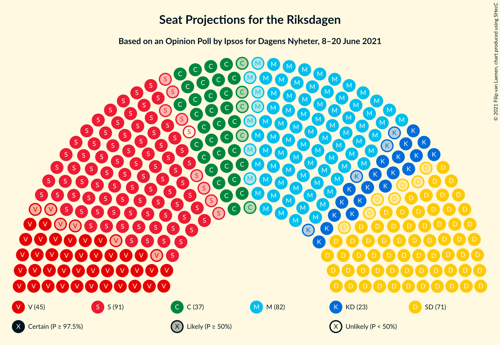
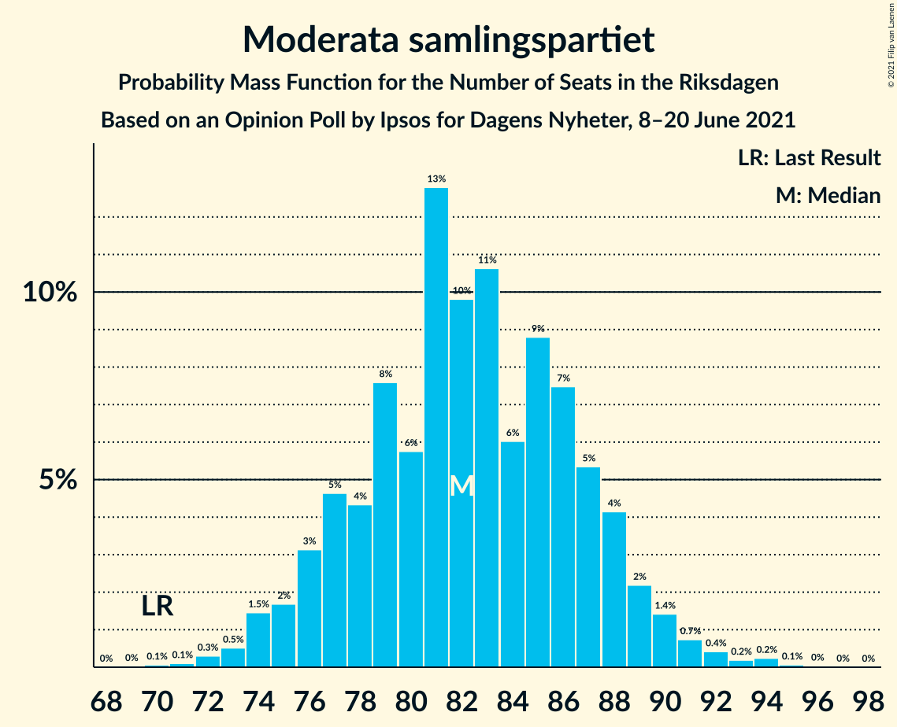
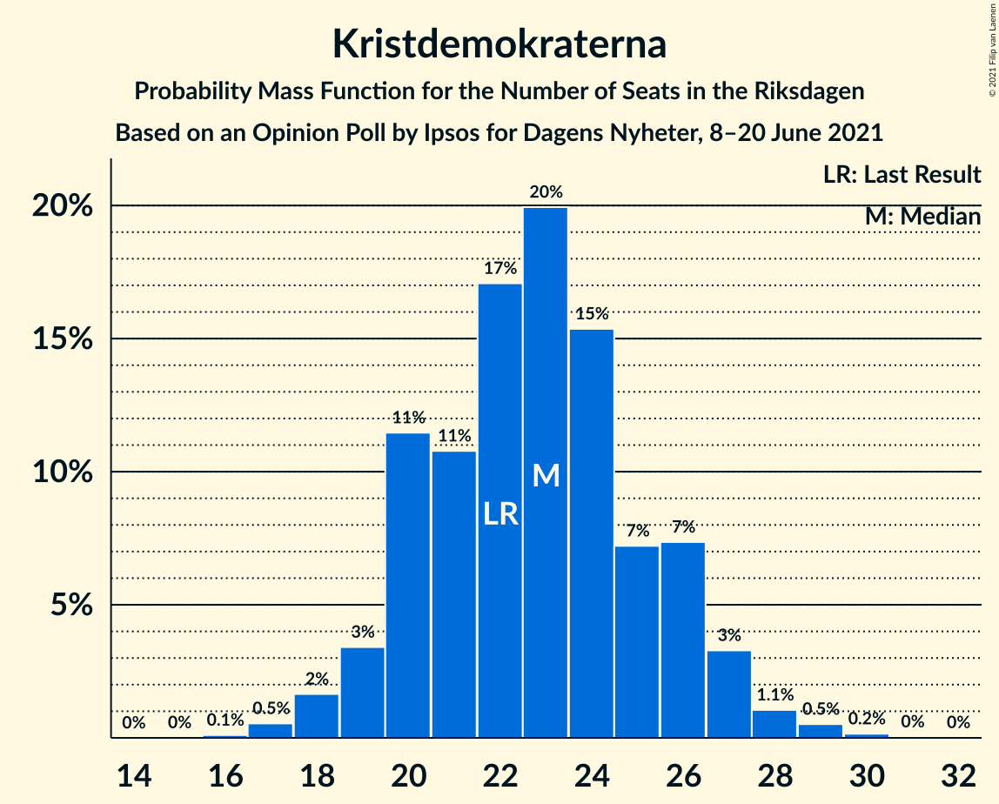
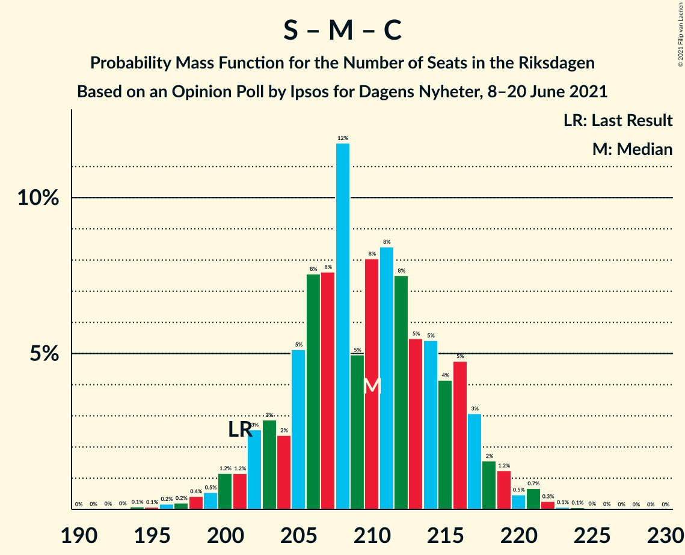
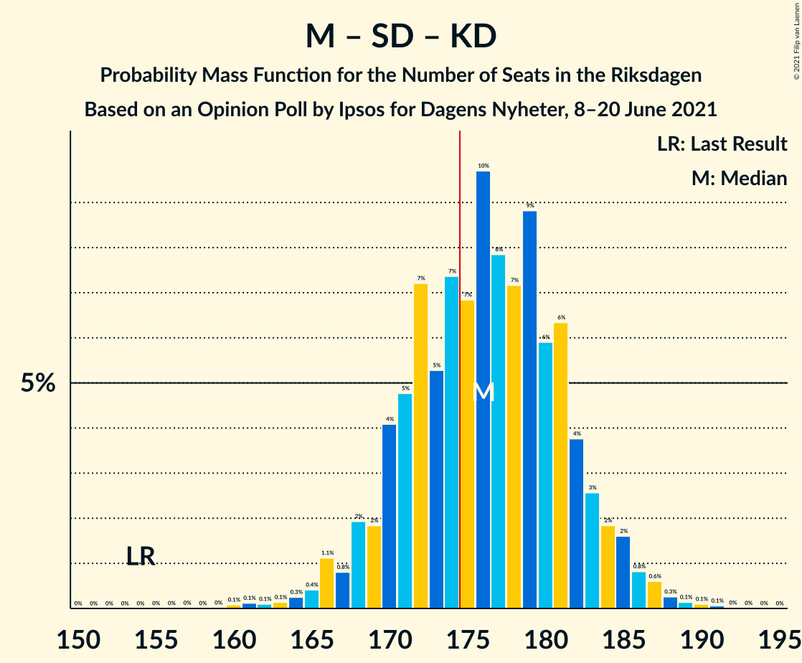
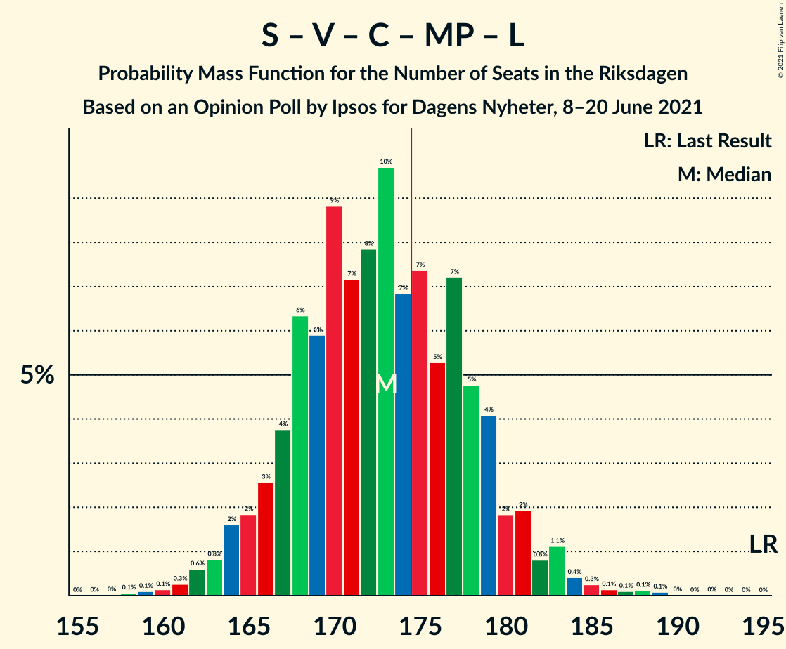
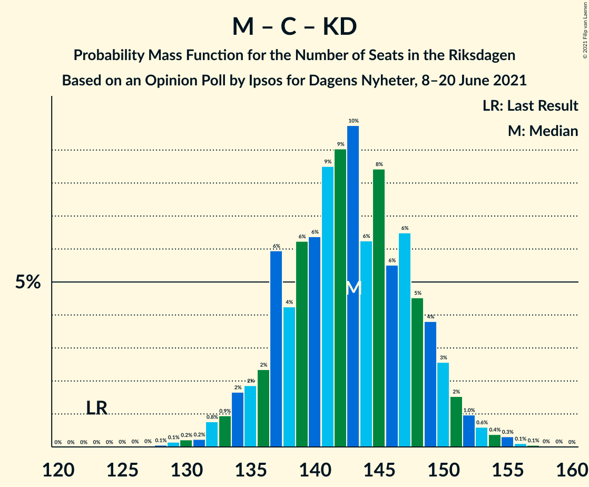
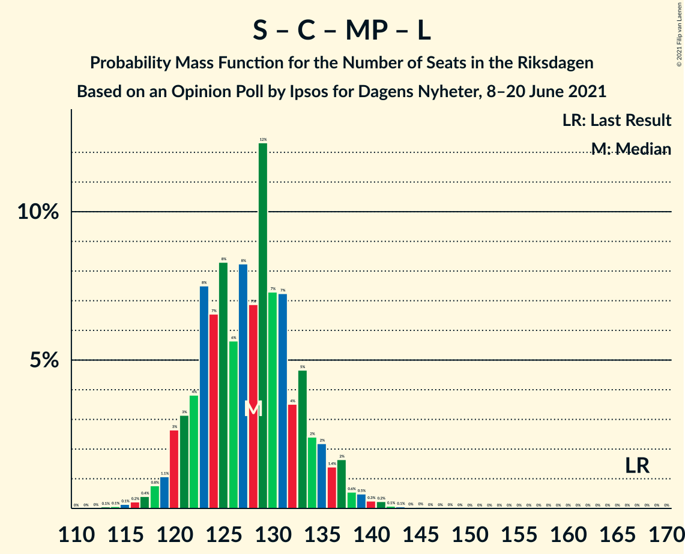

# Opinion Poll by Ipsos for Dagens Nyheter, 8–20 June 2021

<a href="#voting-intentions">Voting Intentions</a> | <a href="#seats">Seats</a> | <a href="#coalitions">Coalitions</a> | <a href="#technical-information">Technical Information</a>

## Voting Intentions

### Confidence Intervals

| Party | Last Result | Poll Result | 80% Confidence Interval | 90% Confidence Interval | 95% Confidence Interval | 99% Confidence Interval |
|:-----:|:-----------:|:-----------:|:-----------------------:|:-----------------------:|:-----------------------:|:-----------------------:|
| Sveriges socialdemokratiska arbetareparti | 28.3% | 24.0% | 22.6–25.4% |22.2–25.8% |21.9–26.2% |21.3–26.9% |
| Moderata samlingspartiet | 19.8% | 22.0% | 20.7–23.4% |20.3–23.8% |20.0–24.1% |19.4–24.8% |
| Sverigedemokraterna | 17.5% | 19.0% | 17.8–20.3% |17.4–20.7% |17.1–21.0% |16.6–21.7% |
| Vänsterpartiet | 8.0% | 12.0% | 11.0–13.2% |10.7–13.5% |10.5–13.7% |10.0–14.3% |
| Centerpartiet | 8.6% | 10.0% | 9.1–11.1% |8.8–11.4% |8.6–11.6% |8.2–12.1% |
| Kristdemokraterna | 6.3% | 6.0% | 5.3–6.9% |5.1–7.1% |4.9–7.3% |4.6–7.7% |
| Miljöpartiet de gröna | 4.4% | 3.0% | 2.5–3.6% |2.3–3.8% |2.2–3.9% |2.0–4.3% |
| Liberalerna | 5.5% | 2.0% | 1.6–2.5% |1.5–2.7% |1.4–2.8% |1.2–3.1% |

*Note:* The poll result column reflects the actual value used in the calculations. Published results may vary slightly, and in addition be rounded to fewer digits.

## Seats

### Confidence Intervals

| Party | Last Result | Median | 80% Confidence Interval | 90% Confidence Interval | 95% Confidence Interval | 99% Confidence Interval |
|:-----:|:-----------:|:------:|:-----------------------:|:-----------------------:|:-----------------------:|:-----------------------:|
| <a href="#sveriges-socialdemokratiska-arbetareparti">Sveriges socialdemokratiska arbetareparti</a> | 100 | 90 | 84–95 |83–97 |82–98 |80–100 |
| <a href="#moderata-samlingspartiet">Moderata samlingspartiet</a> | 70 | 82 | 77–87 |76–89 |75–90 |72–93 |
| <a href="#sverigedemokraterna">Sverigedemokraterna</a> | 62 | 71 | 67–76 |65–77 |64–78 |62–81 |
| <a href="#vänsterpartiet">Vänsterpartiet</a> | 28 | 45 | 41–49 |40–50 |39–51 |38–54 |
| <a href="#centerpartiet">Centerpartiet</a> | 31 | 37 | 34–41 |33–42 |32–43 |31–45 |
| <a href="#kristdemokraterna">Kristdemokraterna</a> | 22 | 23 | 20–26 |19–27 |19–27 |17–29 |
| <a href="#miljöpartiet-de-gröna">Miljöpartiet de gröna</a> | 16 | 0 | 0 |0 |0 |0–15 |
| <a href="#liberalerna">Liberalerna</a> | 20 | 0 | 0 |0 |0 |0 |

### Sveriges socialdemokratiska arbetareparti

*For a full overview of the results for this party, see the [Sveriges socialdemokratiska arbetareparti](party-sverigessocialdemokratiskaarbetareparti.html) page.*

| Number of Seats | Probability | Accumulated | Special Marks |
|:---------------:|:-----------:|:-----------:|:-------------:|
| 77 | 0.1% | 100% |  |
| 78 | 0.1% | 99.9% |  |
| 79 | 0.2% | 99.8% |  |
| 80 | 0.4% | 99.5% |  |
| 81 | 0.8% | 99.1% |  |
| 82 | 2% | 98% |  |
| 83 | 2% | 96% |  |
| 84 | 4% | 94% |  |
| 85 | 6% | 90% |  |
| 86 | 6% | 84% |  |
| 87 | 7% | 79% |  |
| 88 | 10% | 72% |  |
| 89 | 10% | 61% |  |
| 90 | 7% | 51% | Median |
| 91 | 8% | 44% |  |
| 92 | 12% | 36% |  |
| 93 | 7% | 24% |  |
| 94 | 3% | 17% |  |
| 95 | 6% | 14% |  |
| 96 | 3% | 8% |  |
| 97 | 2% | 5% |  |
| 98 | 1.2% | 3% |  |
| 99 | 0.9% | 2% |  |
| 100 | 0.4% | 0.9% | Last Result |
| 101 | 0.1% | 0.5% |  |
| 102 | 0.2% | 0.3% |  |
| 103 | 0.1% | 0.1% |  |
| 104 | 0% | 0% |  |

### Moderata samlingspartiet

*For a full overview of the results for this party, see the [Moderata samlingspartiet](party-moderatasamlingspartiet.html) page.*

| Number of Seats | Probability | Accumulated | Special Marks |
|:---------------:|:-----------:|:-----------:|:-------------:|
| 70 | 0.1% | 100% | Last Result |
| 71 | 0.1% | 99.9% |  |
| 72 | 0.3% | 99.8% |  |
| 73 | 0.5% | 99.5% |  |
| 74 | 1.5% | 99.0% |  |
| 75 | 2% | 98% |  |
| 76 | 3% | 96% |  |
| 77 | 5% | 93% |  |
| 78 | 4% | 88% |  |
| 79 | 8% | 84% |  |
| 80 | 6% | 76% |  |
| 81 | 13% | 70% |  |
| 82 | 10% | 58% | Median |
| 83 | 11% | 48% |  |
| 84 | 6% | 37% |  |
| 85 | 9% | 31% |  |
| 86 | 7% | 22% |  |
| 87 | 5% | 15% |  |
| 88 | 4% | 9% |  |
| 89 | 2% | 5% |  |
| 90 | 1.4% | 3% |  |
| 91 | 0.7% | 2% |  |
| 92 | 0.4% | 1.0% |  |
| 93 | 0.2% | 0.6% |  |
| 94 | 0.2% | 0.4% |  |
| 95 | 0.1% | 0.1% |  |
| 96 | 0% | 0.1% |  |
| 97 | 0% | 0% |  |

### Sverigedemokraterna

*For a full overview of the results for this party, see the [Sverigedemokraterna](party-sverigedemokraterna.html) page.*

| Number of Seats | Probability | Accumulated | Special Marks |
|:---------------:|:-----------:|:-----------:|:-------------:|
| 59 | 0% | 100% |  |
| 60 | 0.1% | 99.9% |  |
| 61 | 0.2% | 99.8% |  |
| 62 | 0.5% | 99.6% | Last Result |
| 63 | 0.8% | 99.2% |  |
| 64 | 1.2% | 98% |  |
| 65 | 2% | 97% |  |
| 66 | 4% | 95% |  |
| 67 | 6% | 91% |  |
| 68 | 6% | 85% |  |
| 69 | 12% | 79% |  |
| 70 | 12% | 66% |  |
| 71 | 11% | 55% | Median |
| 72 | 10% | 44% |  |
| 73 | 9% | 34% |  |
| 74 | 8% | 24% |  |
| 75 | 5% | 16% |  |
| 76 | 5% | 11% |  |
| 77 | 2% | 6% |  |
| 78 | 2% | 4% |  |
| 79 | 1.0% | 2% |  |
| 80 | 0.8% | 1.4% |  |
| 81 | 0.3% | 0.6% |  |
| 82 | 0.2% | 0.3% |  |
| 83 | 0.1% | 0.1% |  |
| 84 | 0% | 0.1% |  |
| 85 | 0% | 0% |  |

### Vänsterpartiet

*For a full overview of the results for this party, see the [Vänsterpartiet](party-vänsterpartiet.html) page.*

| Number of Seats | Probability | Accumulated | Special Marks |
|:---------------:|:-----------:|:-----------:|:-------------:|
| 28 | 0% | 100% | Last Result |
| 29 | 0% | 100% |  |
| 30 | 0% | 100% |  |
| 31 | 0% | 100% |  |
| 32 | 0% | 100% |  |
| 33 | 0% | 100% |  |
| 34 | 0% | 100% |  |
| 35 | 0% | 100% |  |
| 36 | 0.1% | 100% |  |
| 37 | 0.3% | 99.9% |  |
| 38 | 0.8% | 99.5% |  |
| 39 | 2% | 98.7% |  |
| 40 | 3% | 97% |  |
| 41 | 5% | 94% |  |
| 42 | 9% | 89% |  |
| 43 | 10% | 80% |  |
| 44 | 12% | 70% |  |
| 45 | 12% | 58% | Median |
| 46 | 11% | 46% |  |
| 47 | 11% | 35% |  |
| 48 | 10% | 24% |  |
| 49 | 6% | 14% |  |
| 50 | 4% | 8% |  |
| 51 | 1.4% | 4% |  |
| 52 | 1.2% | 2% |  |
| 53 | 0.5% | 1.0% |  |
| 54 | 0.3% | 0.5% |  |
| 55 | 0.1% | 0.2% |  |
| 56 | 0.1% | 0.1% |  |
| 57 | 0% | 0% |  |

### Centerpartiet

*For a full overview of the results for this party, see the [Centerpartiet](party-centerpartiet.html) page.*

| Number of Seats | Probability | Accumulated | Special Marks |
|:---------------:|:-----------:|:-----------:|:-------------:|
| 29 | 0.1% | 100% |  |
| 30 | 0.3% | 99.9% |  |
| 31 | 0.9% | 99.6% | Last Result |
| 32 | 2% | 98.7% |  |
| 33 | 3% | 97% |  |
| 34 | 8% | 94% |  |
| 35 | 8% | 86% |  |
| 36 | 16% | 78% |  |
| 37 | 13% | 62% | Median |
| 38 | 15% | 49% |  |
| 39 | 10% | 34% |  |
| 40 | 8% | 24% |  |
| 41 | 8% | 17% |  |
| 42 | 4% | 9% |  |
| 43 | 2% | 5% |  |
| 44 | 1.1% | 2% |  |
| 45 | 0.6% | 1.0% |  |
| 46 | 0.3% | 0.5% |  |
| 47 | 0.1% | 0.2% |  |
| 48 | 0% | 0.1% |  |
| 49 | 0% | 0% |  |

### Kristdemokraterna

*For a full overview of the results for this party, see the [Kristdemokraterna](party-kristdemokraterna.html) page.*

| Number of Seats | Probability | Accumulated | Special Marks |
|:---------------:|:-----------:|:-----------:|:-------------:|
| 16 | 0.1% | 100% |  |
| 17 | 0.5% | 99.9% |  |
| 18 | 2% | 99.3% |  |
| 19 | 3% | 98% |  |
| 20 | 11% | 94% |  |
| 21 | 11% | 83% |  |
| 22 | 17% | 72% | Last Result |
| 23 | 20% | 55% | Median |
| 24 | 15% | 35% |  |
| 25 | 7% | 20% |  |
| 26 | 7% | 12% |  |
| 27 | 3% | 5% |  |
| 28 | 1.1% | 2% |  |
| 29 | 0.5% | 0.7% |  |
| 30 | 0.2% | 0.2% |  |
| 31 | 0% | 0.1% |  |
| 32 | 0% | 0% |  |

### Miljöpartiet de gröna

*For a full overview of the results for this party, see the [Miljöpartiet de gröna](party-miljöpartietdegröna.html) page.*

| Number of Seats | Probability | Accumulated | Special Marks |
|:---------------:|:-----------:|:-----------:|:-------------:|
| 0 | 98% | 100% | Median |
| 1 | 0% | 2% |  |
| 2 | 0% | 2% |  |
| 3 | 0% | 2% |  |
| 4 | 0% | 2% |  |
| 5 | 0% | 2% |  |
| 6 | 0% | 2% |  |
| 7 | 0% | 2% |  |
| 8 | 0% | 2% |  |
| 9 | 0% | 2% |  |
| 10 | 0% | 2% |  |
| 11 | 0% | 2% |  |
| 12 | 0% | 2% |  |
| 13 | 0% | 2% |  |
| 14 | 0.2% | 2% |  |
| 15 | 1.0% | 1.5% |  |
| 16 | 0.4% | 0.5% | Last Result |
| 17 | 0.1% | 0.1% |  |
| 18 | 0% | 0% |  |

### Liberalerna

*For a full overview of the results for this party, see the [Liberalerna](party-liberalerna.html) page.*

| Number of Seats | Probability | Accumulated | Special Marks |
|:---------------:|:-----------:|:-----------:|:-------------:|
| 0 | 100% | 100% | Median |
| 1 | 0% | 0% |  |
| 2 | 0% | 0% |  |
| 3 | 0% | 0% |  |
| 4 | 0% | 0% |  |
| 5 | 0% | 0% |  |
| 6 | 0% | 0% |  |
| 7 | 0% | 0% |  |
| 8 | 0% | 0% |  |
| 9 | 0% | 0% |  |
| 10 | 0% | 0% |  |
| 11 | 0% | 0% |  |
| 12 | 0% | 0% |  |
| 13 | 0% | 0% |  |
| 14 | 0% | 0% |  |
| 15 | 0% | 0% |  |
| 16 | 0% | 0% |  |
| 17 | 0% | 0% |  |
| 18 | 0% | 0% |  |
| 19 | 0% | 0% |  |
| 20 | 0% | 0% | Last Result |

## Coalitions

### Confidence Intervals

| Coalition | Last Result | Median | Majority? | 80% Confidence Interval | 90% Confidence Interval | 95% Confidence Interval | 99% Confidence Interval |
|:---------:|:-----------:|:------:|:---------:|:-----------------------:|:-----------------------:|:-----------------------:|:-----------------------:|
| Sveriges socialdemokratiska arbetareparti – Moderata samlingspartiet – Centerpartiet | 201 | 210 | 100% | 204–216 | 202–217 | 200–219 | 197–221 |
| Moderata samlingspartiet – Sverigedemokraterna – Kristdemokraterna | 154 | 176 | 64% | 170–182 | 168–184 | 167–185 | 164–188 |
| Sveriges socialdemokratiska arbetareparti – Vänsterpartiet – Centerpartiet – Miljöpartiet de gröna – Liberalerna | 195 | 173 | 36% | 167–179 | 165–181 | 164–182 | 161–185 |
| Sveriges socialdemokratiska arbetareparti – Moderata samlingspartiet | 170 | 172 | 31% | 166–179 | 164–180 | 163–181 | 160–184 |
| Moderata samlingspartiet – Sverigedemokraterna | 132 | 154 | 0% | 148–159 | 146–161 | 144–162 | 141–165 |
| Moderata samlingspartiet – Centerpartiet – Kristdemokraterna – Liberalerna | 143 | 143 | 0% | 137–149 | 135–150 | 134–151 | 131–155 |
| Moderata samlingspartiet – Centerpartiet – Kristdemokraterna | 123 | 143 | 0% | 137–149 | 135–150 | 134–151 | 131–155 |
| Sveriges socialdemokratiska arbetareparti – Vänsterpartiet – Miljöpartiet de gröna | 144 | 135 | 0% | 130–141 | 128–143 | 126–145 | 124–148 |
| Sveriges socialdemokratiska arbetareparti – Vänsterpartiet | 128 | 135 | 0% | 129–141 | 127–142 | 126–144 | 123–146 |
| Sveriges socialdemokratiska arbetareparti – Centerpartiet – Miljöpartiet de gröna – Liberalerna | 167 | 128 | 0% | 122–133 | 120–135 | 119–137 | 116–141 |
| Moderata samlingspartiet – Centerpartiet – Liberalerna | 121 | 120 | 0% | 114–125 | 113–127 | 111–129 | 109–131 |
| Moderata samlingspartiet – Centerpartiet | 101 | 120 | 0% | 114–125 | 113–127 | 111–129 | 109–131 |
| Sveriges socialdemokratiska arbetareparti – Miljöpartiet de gröna | 116 | 90 | 0% | 85–95 | 83–97 | 82–99 | 80–104 |

### Sveriges socialdemokratiska arbetareparti – Moderata samlingspartiet – Centerpartiet

| Number of Seats | Probability | Accumulated | Special Marks |
|:---------------:|:-----------:|:-----------:|:-------------:|
| 192 | 0% | 100% |  |
| 193 | 0% | 99.9% |  |
| 194 | 0.1% | 99.9% |  |
| 195 | 0.1% | 99.8% |  |
| 196 | 0.2% | 99.7% |  |
| 197 | 0.2% | 99.6% |  |
| 198 | 0.4% | 99.4% |  |
| 199 | 0.5% | 98.9% |  |
| 200 | 1.2% | 98% |  |
| 201 | 1.2% | 97% | Last Result |
| 202 | 3% | 96% |  |
| 203 | 3% | 94% |  |
| 204 | 2% | 91% |  |
| 205 | 5% | 88% |  |
| 206 | 8% | 83% |  |
| 207 | 8% | 76% |  |
| 208 | 12% | 68% |  |
| 209 | 5% | 56% | Median |
| 210 | 8% | 51% |  |
| 211 | 8% | 43% |  |
| 212 | 8% | 35% |  |
| 213 | 5% | 27% |  |
| 214 | 5% | 22% |  |
| 215 | 4% | 16% |  |
| 216 | 5% | 12% |  |
| 217 | 3% | 7% |  |
| 218 | 2% | 4% |  |
| 219 | 1.2% | 3% |  |
| 220 | 0.5% | 2% |  |
| 221 | 0.7% | 1.1% |  |
| 222 | 0.3% | 0.4% |  |
| 223 | 0.1% | 0.2% |  |
| 224 | 0.1% | 0.1% |  |
| 225 | 0% | 0.1% |  |
| 226 | 0% | 0% |  |

### Moderata samlingspartiet – Sverigedemokraterna – Kristdemokraterna

| Number of Seats | Probability | Accumulated | Special Marks |
|:---------------:|:-----------:|:-----------:|:-------------:|
| 154 | 0% | 100% | Last Result |
| 155 | 0% | 100% |  |
| 156 | 0% | 100% |  |
| 157 | 0% | 100% |  |
| 158 | 0% | 100% |  |
| 159 | 0% | 100% |  |
| 160 | 0.1% | 100% |  |
| 161 | 0.1% | 99.9% |  |
| 162 | 0.1% | 99.8% |  |
| 163 | 0.1% | 99.7% |  |
| 164 | 0.3% | 99.5% |  |
| 165 | 0.4% | 99.3% |  |
| 166 | 1.1% | 98.8% |  |
| 167 | 0.8% | 98% |  |
| 168 | 2% | 97% |  |
| 169 | 2% | 95% |  |
| 170 | 4% | 93% |  |
| 171 | 5% | 89% |  |
| 172 | 7% | 84% |  |
| 173 | 5% | 77% |  |
| 174 | 7% | 72% |  |
| 175 | 7% | 64% | Majority |
| 176 | 10% | 58% | Median |
| 177 | 8% | 48% |  |
| 178 | 7% | 40% |  |
| 179 | 9% | 33% |  |
| 180 | 6% | 24% |  |
| 181 | 6% | 18% |  |
| 182 | 4% | 12% |  |
| 183 | 3% | 8% |  |
| 184 | 2% | 5% |  |
| 185 | 2% | 4% |  |
| 186 | 0.8% | 2% |  |
| 187 | 0.6% | 1.2% |  |
| 188 | 0.3% | 0.6% |  |
| 189 | 0.1% | 0.3% |  |
| 190 | 0.1% | 0.2% |  |
| 191 | 0.1% | 0.1% |  |
| 192 | 0% | 0% |  |

### Sveriges socialdemokratiska arbetareparti – Vänsterpartiet – Centerpartiet – Miljöpartiet de gröna – Liberalerna

| Number of Seats | Probability | Accumulated | Special Marks |
|:---------------:|:-----------:|:-----------:|:-------------:|
| 158 | 0.1% | 100% |  |
| 159 | 0.1% | 99.9% |  |
| 160 | 0.1% | 99.8% |  |
| 161 | 0.3% | 99.7% |  |
| 162 | 0.6% | 99.4% |  |
| 163 | 0.8% | 98.8% |  |
| 164 | 2% | 98% |  |
| 165 | 2% | 96% |  |
| 166 | 3% | 95% |  |
| 167 | 4% | 92% |  |
| 168 | 6% | 88% |  |
| 169 | 6% | 82% |  |
| 170 | 9% | 76% |  |
| 171 | 7% | 67% |  |
| 172 | 8% | 60% | Median |
| 173 | 10% | 52% |  |
| 174 | 7% | 42% |  |
| 175 | 7% | 36% | Majority |
| 176 | 5% | 28% |  |
| 177 | 7% | 23% |  |
| 178 | 5% | 16% |  |
| 179 | 4% | 11% |  |
| 180 | 2% | 7% |  |
| 181 | 2% | 5% |  |
| 182 | 0.8% | 3% |  |
| 183 | 1.1% | 2% |  |
| 184 | 0.4% | 1.2% |  |
| 185 | 0.3% | 0.7% |  |
| 186 | 0.1% | 0.5% |  |
| 187 | 0.1% | 0.3% |  |
| 188 | 0.1% | 0.2% |  |
| 189 | 0.1% | 0.1% |  |
| 190 | 0% | 0% |  |
| 191 | 0% | 0% |  |
| 192 | 0% | 0% |  |
| 193 | 0% | 0% |  |
| 194 | 0% | 0% |  |
| 195 | 0% | 0% | Last Result |

### Sveriges socialdemokratiska arbetareparti – Moderata samlingspartiet

| Number of Seats | Probability | Accumulated | Special Marks |
|:---------------:|:-----------:|:-----------:|:-------------:|
| 155 | 0% | 100% |  |
| 156 | 0% | 99.9% |  |
| 157 | 0.1% | 99.9% |  |
| 158 | 0.1% | 99.8% |  |
| 159 | 0.2% | 99.7% |  |
| 160 | 0.2% | 99.5% |  |
| 161 | 0.4% | 99.3% |  |
| 162 | 1.0% | 98.9% |  |
| 163 | 2% | 98% |  |
| 164 | 2% | 96% |  |
| 165 | 2% | 94% |  |
| 166 | 3% | 92% |  |
| 167 | 4% | 90% |  |
| 168 | 7% | 85% |  |
| 169 | 11% | 78% |  |
| 170 | 6% | 68% | Last Result |
| 171 | 8% | 61% |  |
| 172 | 5% | 54% | Median |
| 173 | 9% | 49% |  |
| 174 | 9% | 40% |  |
| 175 | 7% | 31% | Majority |
| 176 | 7% | 24% |  |
| 177 | 4% | 17% |  |
| 178 | 3% | 13% |  |
| 179 | 3% | 10% |  |
| 180 | 3% | 8% |  |
| 181 | 2% | 4% |  |
| 182 | 1.1% | 2% |  |
| 183 | 0.6% | 1.2% |  |
| 184 | 0.2% | 0.6% |  |
| 185 | 0.1% | 0.3% |  |
| 186 | 0.1% | 0.2% |  |
| 187 | 0.1% | 0.1% |  |
| 188 | 0% | 0% |  |

### Moderata samlingspartiet – Sverigedemokraterna

| Number of Seats | Probability | Accumulated | Special Marks |
|:---------------:|:-----------:|:-----------:|:-------------:|
| 132 | 0% | 100% | Last Result |
| 133 | 0% | 100% |  |
| 134 | 0% | 100% |  |
| 135 | 0% | 100% |  |
| 136 | 0% | 100% |  |
| 137 | 0.1% | 100% |  |
| 138 | 0% | 99.9% |  |
| 139 | 0.1% | 99.9% |  |
| 140 | 0.2% | 99.8% |  |
| 141 | 0.2% | 99.6% |  |
| 142 | 0.5% | 99.4% |  |
| 143 | 0.6% | 99.0% |  |
| 144 | 0.9% | 98% |  |
| 145 | 2% | 97% |  |
| 146 | 2% | 96% |  |
| 147 | 2% | 94% |  |
| 148 | 6% | 92% |  |
| 149 | 4% | 86% |  |
| 150 | 7% | 82% |  |
| 151 | 8% | 75% |  |
| 152 | 8% | 67% |  |
| 153 | 8% | 59% | Median |
| 154 | 12% | 51% |  |
| 155 | 8% | 39% |  |
| 156 | 6% | 31% |  |
| 157 | 6% | 25% |  |
| 158 | 6% | 19% |  |
| 159 | 5% | 13% |  |
| 160 | 1.5% | 8% |  |
| 161 | 3% | 7% |  |
| 162 | 2% | 3% |  |
| 163 | 0.6% | 2% |  |
| 164 | 0.6% | 1.2% |  |
| 165 | 0.3% | 0.7% |  |
| 166 | 0.1% | 0.3% |  |
| 167 | 0.1% | 0.3% |  |
| 168 | 0% | 0.1% |  |
| 169 | 0% | 0.1% |  |
| 170 | 0% | 0% |  |

### Moderata samlingspartiet – Centerpartiet – Kristdemokraterna – Liberalerna

| Number of Seats | Probability | Accumulated | Special Marks |
|:---------------:|:-----------:|:-----------:|:-------------:|
| 127 | 0% | 100% |  |
| 128 | 0.1% | 99.9% |  |
| 129 | 0.1% | 99.9% |  |
| 130 | 0.2% | 99.7% |  |
| 131 | 0.2% | 99.5% |  |
| 132 | 0.8% | 99.3% |  |
| 133 | 0.9% | 98.5% |  |
| 134 | 2% | 98% |  |
| 135 | 2% | 96% |  |
| 136 | 2% | 94% |  |
| 137 | 6% | 92% |  |
| 138 | 4% | 86% |  |
| 139 | 6% | 81% |  |
| 140 | 6% | 75% |  |
| 141 | 9% | 69% |  |
| 142 | 9% | 60% | Median |
| 143 | 10% | 51% | Last Result |
| 144 | 6% | 42% |  |
| 145 | 8% | 35% |  |
| 146 | 6% | 27% |  |
| 147 | 6% | 21% |  |
| 148 | 5% | 15% |  |
| 149 | 4% | 10% |  |
| 150 | 3% | 7% |  |
| 151 | 2% | 4% |  |
| 152 | 1.0% | 2% |  |
| 153 | 0.6% | 2% |  |
| 154 | 0.4% | 0.9% |  |
| 155 | 0.3% | 0.5% |  |
| 156 | 0.1% | 0.2% |  |
| 157 | 0.1% | 0.1% |  |
| 158 | 0% | 0.1% |  |
| 159 | 0% | 0% |  |

### Moderata samlingspartiet – Centerpartiet – Kristdemokraterna

| Number of Seats | Probability | Accumulated | Special Marks |
|:---------------:|:-----------:|:-----------:|:-------------:|
| 123 | 0% | 100% | Last Result |
| 124 | 0% | 100% |  |
| 125 | 0% | 100% |  |
| 126 | 0% | 100% |  |
| 127 | 0% | 100% |  |
| 128 | 0.1% | 99.9% |  |
| 129 | 0.1% | 99.9% |  |
| 130 | 0.2% | 99.7% |  |
| 131 | 0.2% | 99.5% |  |
| 132 | 0.8% | 99.3% |  |
| 133 | 0.9% | 98.5% |  |
| 134 | 2% | 98% |  |
| 135 | 2% | 96% |  |
| 136 | 2% | 94% |  |
| 137 | 6% | 92% |  |
| 138 | 4% | 86% |  |
| 139 | 6% | 81% |  |
| 140 | 6% | 75% |  |
| 141 | 9% | 69% |  |
| 142 | 9% | 60% | Median |
| 143 | 10% | 51% |  |
| 144 | 6% | 42% |  |
| 145 | 8% | 35% |  |
| 146 | 6% | 27% |  |
| 147 | 6% | 21% |  |
| 148 | 5% | 15% |  |
| 149 | 4% | 10% |  |
| 150 | 3% | 7% |  |
| 151 | 2% | 4% |  |
| 152 | 1.0% | 2% |  |
| 153 | 0.6% | 2% |  |
| 154 | 0.4% | 0.9% |  |
| 155 | 0.3% | 0.5% |  |
| 156 | 0.1% | 0.2% |  |
| 157 | 0.1% | 0.1% |  |
| 158 | 0% | 0.1% |  |
| 159 | 0% | 0% |  |

### Sveriges socialdemokratiska arbetareparti – Vänsterpartiet – Miljöpartiet de gröna

| Number of Seats | Probability | Accumulated | Special Marks |
|:---------------:|:-----------:|:-----------:|:-------------:|
| 121 | 0% | 100% |  |
| 122 | 0.1% | 99.9% |  |
| 123 | 0.2% | 99.8% |  |
| 124 | 0.3% | 99.6% |  |
| 125 | 0.5% | 99.3% |  |
| 126 | 2% | 98.8% |  |
| 127 | 1.4% | 97% |  |
| 128 | 2% | 95% |  |
| 129 | 3% | 93% |  |
| 130 | 7% | 90% |  |
| 131 | 5% | 84% |  |
| 132 | 6% | 79% |  |
| 133 | 9% | 72% |  |
| 134 | 9% | 63% |  |
| 135 | 7% | 54% | Median |
| 136 | 9% | 47% |  |
| 137 | 8% | 38% |  |
| 138 | 5% | 30% |  |
| 139 | 7% | 25% |  |
| 140 | 5% | 19% |  |
| 141 | 4% | 13% |  |
| 142 | 3% | 9% |  |
| 143 | 1.3% | 5% |  |
| 144 | 1.2% | 4% | Last Result |
| 145 | 0.9% | 3% |  |
| 146 | 0.7% | 2% |  |
| 147 | 0.4% | 1.1% |  |
| 148 | 0.2% | 0.7% |  |
| 149 | 0.2% | 0.5% |  |
| 150 | 0.1% | 0.3% |  |
| 151 | 0% | 0.2% |  |
| 152 | 0.1% | 0.2% |  |
| 153 | 0% | 0.1% |  |
| 154 | 0% | 0.1% |  |
| 155 | 0% | 0% |  |

### Sveriges socialdemokratiska arbetareparti – Vänsterpartiet

| Number of Seats | Probability | Accumulated | Special Marks |
|:---------------:|:-----------:|:-----------:|:-------------:|
| 120 | 0% | 100% |  |
| 121 | 0.1% | 99.9% |  |
| 122 | 0.2% | 99.9% |  |
| 123 | 0.4% | 99.7% |  |
| 124 | 0.3% | 99.3% |  |
| 125 | 0.5% | 98.9% |  |
| 126 | 2% | 98% |  |
| 127 | 2% | 96% |  |
| 128 | 2% | 95% | Last Result |
| 129 | 3% | 93% |  |
| 130 | 7% | 90% |  |
| 131 | 5% | 83% |  |
| 132 | 6% | 78% |  |
| 133 | 9% | 71% |  |
| 134 | 9% | 62% |  |
| 135 | 7% | 53% | Median |
| 136 | 9% | 46% |  |
| 137 | 8% | 37% |  |
| 138 | 5% | 29% |  |
| 139 | 7% | 24% |  |
| 140 | 5% | 17% |  |
| 141 | 4% | 12% |  |
| 142 | 3% | 7% |  |
| 143 | 1.1% | 4% |  |
| 144 | 1.2% | 3% |  |
| 145 | 0.8% | 2% |  |
| 146 | 0.6% | 1.1% |  |
| 147 | 0.2% | 0.4% |  |
| 148 | 0.1% | 0.3% |  |
| 149 | 0.1% | 0.1% |  |
| 150 | 0% | 0.1% |  |
| 151 | 0% | 0% |  |

### Sveriges socialdemokratiska arbetareparti – Centerpartiet – Miljöpartiet de gröna – Liberalerna

| Number of Seats | Probability | Accumulated | Special Marks |
|:---------------:|:-----------:|:-----------:|:-------------:|
| 113 | 0.1% | 100% |  |
| 114 | 0.1% | 99.9% |  |
| 115 | 0.1% | 99.8% |  |
| 116 | 0.2% | 99.7% |  |
| 117 | 0.4% | 99.5% |  |
| 118 | 0.8% | 99.1% |  |
| 119 | 1.1% | 98% |  |
| 120 | 3% | 97% |  |
| 121 | 3% | 95% |  |
| 122 | 4% | 91% |  |
| 123 | 8% | 88% |  |
| 124 | 7% | 80% |  |
| 125 | 8% | 74% |  |
| 126 | 6% | 65% |  |
| 127 | 8% | 60% | Median |
| 128 | 7% | 51% |  |
| 129 | 12% | 45% |  |
| 130 | 7% | 32% |  |
| 131 | 7% | 25% |  |
| 132 | 4% | 18% |  |
| 133 | 5% | 14% |  |
| 134 | 2% | 9% |  |
| 135 | 2% | 7% |  |
| 136 | 1.4% | 5% |  |
| 137 | 2% | 3% |  |
| 138 | 0.6% | 2% |  |
| 139 | 0.5% | 1.3% |  |
| 140 | 0.3% | 0.8% |  |
| 141 | 0.2% | 0.5% |  |
| 142 | 0.1% | 0.3% |  |
| 143 | 0.1% | 0.2% |  |
| 144 | 0% | 0.1% |  |
| 145 | 0% | 0.1% |  |
| 146 | 0% | 0.1% |  |
| 147 | 0% | 0% |  |
| 148 | 0% | 0% |  |
| 149 | 0% | 0% |  |
| 150 | 0% | 0% |  |
| 151 | 0% | 0% |  |
| 152 | 0% | 0% |  |
| 153 | 0% | 0% |  |
| 154 | 0% | 0% |  |
| 155 | 0% | 0% |  |
| 156 | 0% | 0% |  |
| 157 | 0% | 0% |  |
| 158 | 0% | 0% |  |
| 159 | 0% | 0% |  |
| 160 | 0% | 0% |  |
| 161 | 0% | 0% |  |
| 162 | 0% | 0% |  |
| 163 | 0% | 0% |  |
| 164 | 0% | 0% |  |
| 165 | 0% | 0% |  |
| 166 | 0% | 0% |  |
| 167 | 0% | 0% | Last Result |

### Moderata samlingspartiet – Centerpartiet – Liberalerna

| Number of Seats | Probability | Accumulated | Special Marks |
|:---------------:|:-----------:|:-----------:|:-------------:|
| 105 | 0% | 100% |  |
| 106 | 0% | 99.9% |  |
| 107 | 0.2% | 99.9% |  |
| 108 | 0.2% | 99.7% |  |
| 109 | 0.3% | 99.5% |  |
| 110 | 1.1% | 99.2% |  |
| 111 | 0.9% | 98% |  |
| 112 | 2% | 97% |  |
| 113 | 3% | 95% |  |
| 114 | 3% | 93% |  |
| 115 | 6% | 90% |  |
| 116 | 7% | 83% |  |
| 117 | 8% | 77% |  |
| 118 | 8% | 68% |  |
| 119 | 8% | 61% | Median |
| 120 | 5% | 52% |  |
| 121 | 10% | 47% | Last Result |
| 122 | 8% | 38% |  |
| 123 | 9% | 30% |  |
| 124 | 6% | 21% |  |
| 125 | 5% | 15% |  |
| 126 | 2% | 9% |  |
| 127 | 3% | 7% |  |
| 128 | 2% | 5% |  |
| 129 | 1.5% | 3% |  |
| 130 | 0.6% | 1.3% |  |
| 131 | 0.3% | 0.7% |  |
| 132 | 0.2% | 0.4% |  |
| 133 | 0.1% | 0.2% |  |
| 134 | 0.1% | 0.2% |  |
| 135 | 0% | 0.1% |  |
| 136 | 0% | 0% |  |

### Moderata samlingspartiet – Centerpartiet

| Number of Seats | Probability | Accumulated | Special Marks |
|:---------------:|:-----------:|:-----------:|:-------------:|
| 101 | 0% | 100% | Last Result |
| 102 | 0% | 100% |  |
| 103 | 0% | 100% |  |
| 104 | 0% | 100% |  |
| 105 | 0% | 100% |  |
| 106 | 0% | 99.9% |  |
| 107 | 0.2% | 99.9% |  |
| 108 | 0.2% | 99.7% |  |
| 109 | 0.3% | 99.5% |  |
| 110 | 1.1% | 99.2% |  |
| 111 | 0.9% | 98% |  |
| 112 | 2% | 97% |  |
| 113 | 3% | 95% |  |
| 114 | 3% | 93% |  |
| 115 | 6% | 90% |  |
| 116 | 7% | 83% |  |
| 117 | 8% | 77% |  |
| 118 | 8% | 68% |  |
| 119 | 8% | 61% | Median |
| 120 | 5% | 52% |  |
| 121 | 10% | 47% |  |
| 122 | 8% | 38% |  |
| 123 | 9% | 30% |  |
| 124 | 6% | 21% |  |
| 125 | 5% | 15% |  |
| 126 | 2% | 9% |  |
| 127 | 3% | 7% |  |
| 128 | 2% | 5% |  |
| 129 | 1.5% | 3% |  |
| 130 | 0.6% | 1.3% |  |
| 131 | 0.3% | 0.7% |  |
| 132 | 0.2% | 0.4% |  |
| 133 | 0.1% | 0.2% |  |
| 134 | 0.1% | 0.2% |  |
| 135 | 0% | 0.1% |  |
| 136 | 0% | 0% |  |

### Sveriges socialdemokratiska arbetareparti – Miljöpartiet de gröna

| Number of Seats | Probability | Accumulated | Special Marks |
|:---------------:|:-----------:|:-----------:|:-------------:|
| 77 | 0.1% | 100% |  |
| 78 | 0.1% | 99.9% |  |
| 79 | 0.2% | 99.8% |  |
| 80 | 0.4% | 99.7% |  |
| 81 | 0.8% | 99.3% |  |
| 82 | 2% | 98% |  |
| 83 | 2% | 97% |  |
| 84 | 4% | 95% |  |
| 85 | 5% | 90% |  |
| 86 | 6% | 85% |  |
| 87 | 7% | 80% |  |
| 88 | 10% | 73% |  |
| 89 | 10% | 63% |  |
| 90 | 7% | 53% | Median |
| 91 | 8% | 45% |  |
| 92 | 12% | 37% |  |
| 93 | 7% | 26% |  |
| 94 | 3% | 19% |  |
| 95 | 6% | 16% |  |
| 96 | 3% | 10% |  |
| 97 | 2% | 7% |  |
| 98 | 1.2% | 4% |  |
| 99 | 0.9% | 3% |  |
| 100 | 0.6% | 2% |  |
| 101 | 0.4% | 1.5% |  |
| 102 | 0.3% | 1.1% |  |
| 103 | 0.2% | 0.7% |  |
| 104 | 0.2% | 0.6% |  |
| 105 | 0.1% | 0.3% |  |
| 106 | 0.1% | 0.3% |  |
| 107 | 0.1% | 0.2% |  |
| 108 | 0.1% | 0.1% |  |
| 109 | 0% | 0.1% |  |
| 110 | 0% | 0% |  |
| 111 | 0% | 0% |  |
| 112 | 0% | 0% |  |
| 113 | 0% | 0% |  |
| 114 | 0% | 0% |  |
| 115 | 0% | 0% |  |
| 116 | 0% | 0% | Last Result |

## Technical Information

### Opinion Poll

+ **Polling firm:** Ipsos
+ **Commissioner(s):** Dagens Nyheter
+ **Fieldwork period:** 8–20 June 2021

### Calculations

+ **Sample size:** 1547
+ **Simulations done:** 1,048,576
+ **Error estimate:** 1.02%

