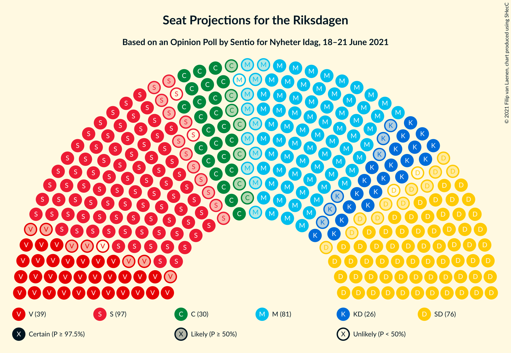
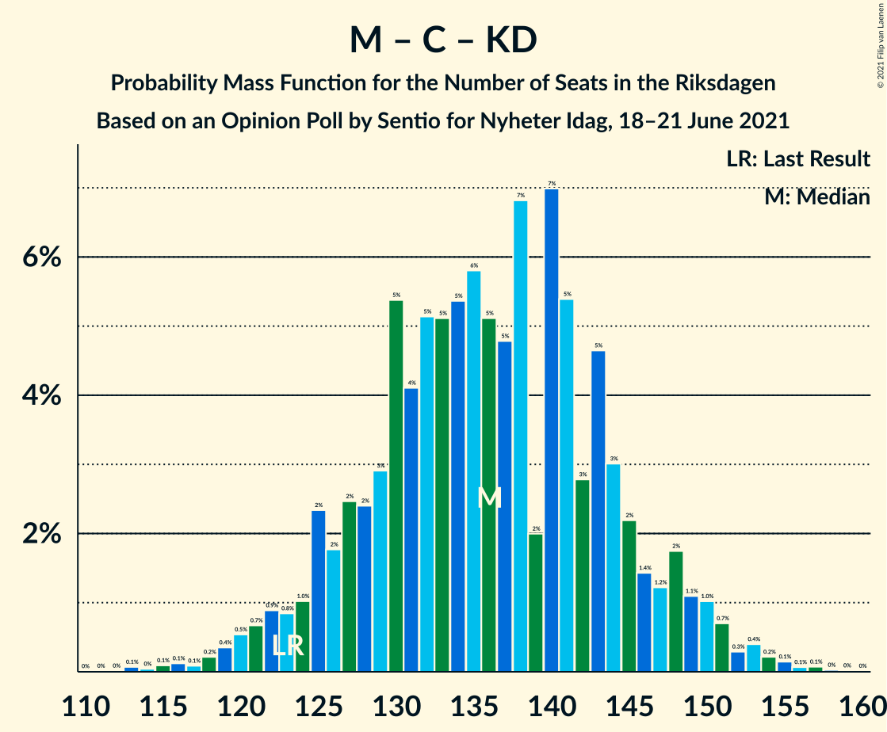

# Opinion Poll by Sentio for Nyheter Idag, 18–21 June 2021

<a href="#voting-intentions">Voting Intentions</a> | <a href="#seats">Seats</a> | <a href="#coalitions">Coalitions</a> | <a href="#technical-information">Technical Information</a>

## Voting Intentions

### Confidence Intervals

| Party | Last Result | Poll Result | 80% Confidence Interval | 90% Confidence Interval | 95% Confidence Interval | 99% Confidence Interval |
|:-----:|:-----------:|:-----------:|:-----------------------:|:-----------------------:|:-----------------------:|:-----------------------:|
| Sveriges socialdemokratiska arbetareparti | 28.3% | 25.2% | 23.3–27.3% |22.8–27.9% |22.3–28.4% |21.4–29.4% |
| Moderata samlingspartiet | 19.8% | 21.2% | 19.4–23.1% |18.9–23.7% |18.5–24.2% |17.6–25.1% |
| Sverigedemokraterna | 17.5% | 19.4% | 17.7–21.3% |17.2–21.8% |16.8–22.3% |16.0–23.2% |
| Vänsterpartiet | 8.0% | 10.1% | 8.9–11.6% |8.5–12.1% |8.2–12.5% |7.7–13.2% |
| Centerpartiet | 8.6% | 7.9% | 6.8–9.2% |6.4–9.6% |6.2–10.0% |5.7–10.6% |
| Kristdemokraterna | 6.3% | 6.8% | 5.8–8.1% |5.5–8.5% |5.3–8.8% |4.8–9.5% |
| Miljöpartiet de gröna | 4.4% | 3.3% | 2.6–4.3% |2.4–4.5% |2.3–4.8% |2.0–5.3% |
| Liberalerna | 5.5% | 2.8% | 2.2–3.7% |2.0–4.0% |1.8–4.2% |1.6–4.7% |

*Note:* The poll result column reflects the actual value used in the calculations. Published results may vary slightly, and in addition be rounded to fewer digits.

## Seats

### Confidence Intervals

| Party | Last Result | Median | 80% Confidence Interval | 90% Confidence Interval | 95% Confidence Interval | 99% Confidence Interval |
|:-----:|:-----------:|:------:|:-----------------------:|:-----------------------:|:-----------------------:|:-----------------------:|
| <a href="#sveriges-socialdemokratiska-arbetareparti">Sveriges socialdemokratiska arbetareparti</a> | 100 | 96 | 86–103 |84–105 |83–107 |78–111 |
| <a href="#moderata-samlingspartiet">Moderata samlingspartiet</a> | 70 | 80 | 71–89 |70–89 |69–93 |66–93 |
| <a href="#sverigedemokraterna">Sverigedemokraterna</a> | 62 | 72 | 65–81 |64–83 |62–84 |59–87 |
| <a href="#vänsterpartiet">Vänsterpartiet</a> | 28 | 38 | 33–45 |32–47 |31–47 |29–50 |
| <a href="#centerpartiet">Centerpartiet</a> | 31 | 30 | 25–35 |24–36 |24–37 |21–41 |
| <a href="#kristdemokraterna">Kristdemokraterna</a> | 22 | 26 | 21–31 |21–33 |20–33 |18–35 |
| <a href="#miljöpartiet-de-gröna">Miljöpartiet de gröna</a> | 16 | 0 | 0–16 |0–17 |0–18 |0–19 |
| <a href="#liberalerna">Liberalerna</a> | 20 | 0 | 0 |0 |0–14 |0–18 |

### Sveriges socialdemokratiska arbetareparti

*For a full overview of the results for this party, see the [Sveriges socialdemokratiska arbetareparti](party-sverigessocialdemokratiskaarbetareparti.html) page.*

| Number of Seats | Probability | Accumulated | Special Marks |
|:---------------:|:-----------:|:-----------:|:-------------:|
| 75 | 0.1% | 100% |  |
| 76 | 0% | 99.9% |  |
| 77 | 0.1% | 99.9% |  |
| 78 | 0.4% | 99.8% |  |
| 79 | 0.1% | 99.4% |  |
| 80 | 0.1% | 99.3% |  |
| 81 | 0.4% | 99.2% |  |
| 82 | 0.4% | 98.8% |  |
| 83 | 1.0% | 98% |  |
| 84 | 3% | 97% |  |
| 85 | 3% | 95% |  |
| 86 | 2% | 92% |  |
| 87 | 2% | 90% |  |
| 88 | 3% | 88% |  |
| 89 | 3% | 86% |  |
| 90 | 7% | 83% |  |
| 91 | 6% | 76% |  |
| 92 | 4% | 70% |  |
| 93 | 5% | 66% |  |
| 94 | 2% | 61% |  |
| 95 | 3% | 59% |  |
| 96 | 8% | 56% | Median |
| 97 | 4% | 48% |  |
| 98 | 12% | 44% |  |
| 99 | 2% | 32% |  |
| 100 | 3% | 31% | Last Result |
| 101 | 4% | 28% |  |
| 102 | 6% | 23% |  |
| 103 | 8% | 17% |  |
| 104 | 2% | 9% |  |
| 105 | 4% | 7% |  |
| 106 | 0.3% | 3% |  |
| 107 | 1.4% | 3% |  |
| 108 | 0.7% | 2% |  |
| 109 | 0.4% | 1.0% |  |
| 110 | 0.1% | 0.6% |  |
| 111 | 0.1% | 0.5% |  |
| 112 | 0.1% | 0.4% |  |
| 113 | 0.1% | 0.3% |  |
| 114 | 0.1% | 0.2% |  |
| 115 | 0% | 0.1% |  |
| 116 | 0% | 0.1% |  |
| 117 | 0% | 0% |  |

### Moderata samlingspartiet

*For a full overview of the results for this party, see the [Moderata samlingspartiet](party-moderatasamlingspartiet.html) page.*

| Number of Seats | Probability | Accumulated | Special Marks |
|:---------------:|:-----------:|:-----------:|:-------------:|
| 61 | 0% | 100% |  |
| 62 | 0.1% | 99.9% |  |
| 63 | 0% | 99.9% |  |
| 64 | 0.1% | 99.9% |  |
| 65 | 0% | 99.8% |  |
| 66 | 0.3% | 99.7% |  |
| 67 | 0.2% | 99.4% |  |
| 68 | 1.1% | 99.2% |  |
| 69 | 2% | 98% |  |
| 70 | 3% | 96% | Last Result |
| 71 | 3% | 93% |  |
| 72 | 3% | 89% |  |
| 73 | 2% | 86% |  |
| 74 | 3% | 84% |  |
| 75 | 5% | 81% |  |
| 76 | 10% | 76% |  |
| 77 | 8% | 66% |  |
| 78 | 5% | 58% |  |
| 79 | 2% | 53% |  |
| 80 | 7% | 51% | Median |
| 81 | 2% | 44% |  |
| 82 | 2% | 42% |  |
| 83 | 9% | 40% |  |
| 84 | 4% | 31% |  |
| 85 | 4% | 27% |  |
| 86 | 3% | 22% |  |
| 87 | 5% | 19% |  |
| 88 | 4% | 14% |  |
| 89 | 6% | 10% |  |
| 90 | 0.8% | 4% |  |
| 91 | 0.7% | 4% |  |
| 92 | 0.3% | 3% |  |
| 93 | 2% | 3% |  |
| 94 | 0.2% | 0.4% |  |
| 95 | 0% | 0.3% |  |
| 96 | 0.1% | 0.3% |  |
| 97 | 0% | 0.2% |  |
| 98 | 0% | 0.2% |  |
| 99 | 0% | 0.1% |  |
| 100 | 0.1% | 0.1% |  |
| 101 | 0% | 0.1% |  |
| 102 | 0% | 0% |  |

### Sverigedemokraterna

*For a full overview of the results for this party, see the [Sverigedemokraterna](party-sverigedemokraterna.html) page.*

| Number of Seats | Probability | Accumulated | Special Marks |
|:---------------:|:-----------:|:-----------:|:-------------:|
| 56 | 0.1% | 100% |  |
| 57 | 0.1% | 99.9% |  |
| 58 | 0.2% | 99.8% |  |
| 59 | 0.2% | 99.6% |  |
| 60 | 0.5% | 99.4% |  |
| 61 | 0.5% | 98.9% |  |
| 62 | 1.0% | 98% | Last Result |
| 63 | 2% | 97% |  |
| 64 | 0.7% | 95% |  |
| 65 | 5% | 95% |  |
| 66 | 1.3% | 90% |  |
| 67 | 0.8% | 89% |  |
| 68 | 17% | 88% |  |
| 69 | 4% | 71% |  |
| 70 | 4% | 66% |  |
| 71 | 10% | 63% |  |
| 72 | 3% | 53% | Median |
| 73 | 4% | 49% |  |
| 74 | 7% | 45% |  |
| 75 | 7% | 38% |  |
| 76 | 5% | 31% |  |
| 77 | 5% | 26% |  |
| 78 | 3% | 21% |  |
| 79 | 0.8% | 18% |  |
| 80 | 2% | 17% |  |
| 81 | 7% | 16% |  |
| 82 | 4% | 9% |  |
| 83 | 2% | 5% |  |
| 84 | 3% | 4% |  |
| 85 | 0.2% | 1.1% |  |
| 86 | 0.1% | 0.8% |  |
| 87 | 0.4% | 0.8% |  |
| 88 | 0% | 0.4% |  |
| 89 | 0% | 0.3% |  |
| 90 | 0% | 0.3% |  |
| 91 | 0.1% | 0.3% |  |
| 92 | 0.1% | 0.1% |  |
| 93 | 0% | 0.1% |  |
| 94 | 0% | 0% |  |

### Vänsterpartiet

*For a full overview of the results for this party, see the [Vänsterpartiet](party-vänsterpartiet.html) page.*

| Number of Seats | Probability | Accumulated | Special Marks |
|:---------------:|:-----------:|:-----------:|:-------------:|
| 27 | 0.1% | 100% |  |
| 28 | 0.1% | 99.8% | Last Result |
| 29 | 0.6% | 99.7% |  |
| 30 | 0.7% | 99.1% |  |
| 31 | 3% | 98% |  |
| 32 | 5% | 96% |  |
| 33 | 4% | 91% |  |
| 34 | 5% | 87% |  |
| 35 | 15% | 82% |  |
| 36 | 9% | 67% |  |
| 37 | 8% | 59% |  |
| 38 | 4% | 50% | Median |
| 39 | 7% | 46% |  |
| 40 | 6% | 39% |  |
| 41 | 8% | 33% |  |
| 42 | 7% | 25% |  |
| 43 | 6% | 18% |  |
| 44 | 2% | 12% |  |
| 45 | 3% | 10% |  |
| 46 | 1.1% | 7% |  |
| 47 | 5% | 6% |  |
| 48 | 1.0% | 2% |  |
| 49 | 0.2% | 0.7% |  |
| 50 | 0.2% | 0.5% |  |
| 51 | 0.1% | 0.3% |  |
| 52 | 0.1% | 0.2% |  |
| 53 | 0.1% | 0.2% |  |
| 54 | 0% | 0.1% |  |
| 55 | 0% | 0% |  |

### Centerpartiet

*For a full overview of the results for this party, see the [Centerpartiet](party-centerpartiet.html) page.*

| Number of Seats | Probability | Accumulated | Special Marks |
|:---------------:|:-----------:|:-----------:|:-------------:|
| 19 | 0.1% | 100% |  |
| 20 | 0.3% | 99.8% |  |
| 21 | 0.4% | 99.5% |  |
| 22 | 0.7% | 99.2% |  |
| 23 | 1.0% | 98.5% |  |
| 24 | 7% | 98% |  |
| 25 | 4% | 90% |  |
| 26 | 5% | 86% |  |
| 27 | 9% | 81% |  |
| 28 | 8% | 72% |  |
| 29 | 7% | 64% |  |
| 30 | 12% | 57% | Median |
| 31 | 7% | 45% | Last Result |
| 32 | 15% | 38% |  |
| 33 | 6% | 23% |  |
| 34 | 5% | 17% |  |
| 35 | 5% | 12% |  |
| 36 | 3% | 7% |  |
| 37 | 1.1% | 4% |  |
| 38 | 0.8% | 2% |  |
| 39 | 0.3% | 2% |  |
| 40 | 0.8% | 1.4% |  |
| 41 | 0.3% | 0.6% |  |
| 42 | 0.2% | 0.3% |  |
| 43 | 0% | 0.1% |  |
| 44 | 0% | 0% |  |

### Kristdemokraterna

*For a full overview of the results for this party, see the [Kristdemokraterna](party-kristdemokraterna.html) page.*

| Number of Seats | Probability | Accumulated | Special Marks |
|:---------------:|:-----------:|:-----------:|:-------------:|
| 16 | 0% | 100% |  |
| 17 | 0.3% | 99.9% |  |
| 18 | 0.3% | 99.7% |  |
| 19 | 0.8% | 99.4% |  |
| 20 | 3% | 98.6% |  |
| 21 | 7% | 96% |  |
| 22 | 7% | 89% | Last Result |
| 23 | 6% | 82% |  |
| 24 | 8% | 76% |  |
| 25 | 9% | 68% |  |
| 26 | 9% | 59% | Median |
| 27 | 11% | 49% |  |
| 28 | 13% | 39% |  |
| 29 | 8% | 25% |  |
| 30 | 5% | 18% |  |
| 31 | 4% | 13% |  |
| 32 | 1.0% | 9% |  |
| 33 | 5% | 8% |  |
| 34 | 0.8% | 2% |  |
| 35 | 1.0% | 1.4% |  |
| 36 | 0.2% | 0.4% |  |
| 37 | 0.1% | 0.2% |  |
| 38 | 0.1% | 0.1% |  |
| 39 | 0% | 0.1% |  |
| 40 | 0% | 0% |  |

### Miljöpartiet de gröna

*For a full overview of the results for this party, see the [Miljöpartiet de gröna](party-miljöpartietdegröna.html) page.*

| Number of Seats | Probability | Accumulated | Special Marks |
|:---------------:|:-----------:|:-----------:|:-------------:|
| 0 | 85% | 100% | Median |
| 1 | 0% | 15% |  |
| 2 | 0% | 15% |  |
| 3 | 0% | 15% |  |
| 4 | 0% | 15% |  |
| 5 | 0% | 15% |  |
| 6 | 0% | 15% |  |
| 7 | 0% | 15% |  |
| 8 | 0% | 15% |  |
| 9 | 0% | 15% |  |
| 10 | 0% | 15% |  |
| 11 | 0% | 15% |  |
| 12 | 0% | 15% |  |
| 13 | 0% | 15% |  |
| 14 | 0.1% | 15% |  |
| 15 | 5% | 15% |  |
| 16 | 4% | 10% | Last Result |
| 17 | 4% | 7% |  |
| 18 | 2% | 3% |  |
| 19 | 0.7% | 1.1% |  |
| 20 | 0.2% | 0.4% |  |
| 21 | 0.1% | 0.2% |  |
| 22 | 0.1% | 0.1% |  |
| 23 | 0% | 0% |  |

### Liberalerna

*For a full overview of the results for this party, see the [Liberalerna](party-liberalerna.html) page.*

| Number of Seats | Probability | Accumulated | Special Marks |
|:---------------:|:-----------:|:-----------:|:-------------:|
| 0 | 97% | 100% | Median |
| 1 | 0% | 3% |  |
| 2 | 0% | 3% |  |
| 3 | 0% | 3% |  |
| 4 | 0% | 3% |  |
| 5 | 0% | 3% |  |
| 6 | 0% | 3% |  |
| 7 | 0% | 3% |  |
| 8 | 0% | 3% |  |
| 9 | 0% | 3% |  |
| 10 | 0% | 3% |  |
| 11 | 0% | 3% |  |
| 12 | 0% | 3% |  |
| 13 | 0% | 3% |  |
| 14 | 0.3% | 3% |  |
| 15 | 0.6% | 2% |  |
| 16 | 0.8% | 2% |  |
| 17 | 0.2% | 1.1% |  |
| 18 | 0.7% | 0.9% |  |
| 19 | 0.2% | 0.2% |  |
| 20 | 0% | 0% | Last Result |

## Coalitions

### Confidence Intervals

| Coalition | Last Result | Median | Majority? | 80% Confidence Interval | 90% Confidence Interval | 95% Confidence Interval | 99% Confidence Interval |
|:---------:|:-----------:|:------:|:---------:|:-----------------------:|:-----------------------:|:-----------------------:|:-----------------------:|
| Sveriges socialdemokratiska arbetareparti – Moderata samlingspartiet – Centerpartiet | 201 | 206 | 100% | 194–218 | 190–218 | 189–219 | 183–225 |
| Moderata samlingspartiet – Sverigedemokraterna – Kristdemokraterna | 154 | 179 | 75% | 169–190 | 166–193 | 163–195 | 156–199 |
| Sveriges socialdemokratiska arbetareparti – Moderata samlingspartiet | 170 | 175 | 56% | 165–186 | 160–186 | 159–189 | 153–194 |
| Sveriges socialdemokratiska arbetareparti – Vänsterpartiet – Centerpartiet – Miljöpartiet de gröna – Liberalerna | 195 | 168 | 14% | 156–176 | 154–179 | 150–183 | 147–189 |
| Moderata samlingspartiet – Sverigedemokraterna | 132 | 152 | 0.1% | 144–162 | 141–166 | 137–170 | 131–172 |
| Moderata samlingspartiet – Centerpartiet – Kristdemokraterna – Liberalerna | 143 | 137 | 0% | 126–149 | 123–150 | 121–151 | 119–157 |
| Moderata samlingspartiet – Centerpartiet – Kristdemokraterna | 123 | 136 | 0% | 126–147 | 123–149 | 121–151 | 119–153 |
| Sveriges socialdemokratiska arbetareparti – Vänsterpartiet – Miljöpartiet de gröna | 144 | 137 | 0% | 125–147 | 124–149 | 120–151 | 118–158 |
| Sveriges socialdemokratiska arbetareparti – Vänsterpartiet | 128 | 135 | 0% | 124–145 | 121–145 | 120–147 | 115–151 |
| Sveriges socialdemokratiska arbetareparti – Centerpartiet – Miljöpartiet de gröna – Liberalerna | 167 | 128 | 0% | 119–139 | 115–143 | 113–146 | 111–153 |
| Moderata samlingspartiet – Centerpartiet – Liberalerna | 121 | 110 | 0% | 101–120 | 99–122 | 97–123 | 94–132 |
| Moderata samlingspartiet – Centerpartiet | 101 | 110 | 0% | 101–120 | 99–121 | 97–122 | 94–125 |
| Sveriges socialdemokratiska arbetareparti – Miljöpartiet de gröna | 116 | 98 | 0% | 88–108 | 85–113 | 84–115 | 82–119 |

### Sveriges socialdemokratiska arbetareparti – Moderata samlingspartiet – Centerpartiet

| Number of Seats | Probability | Accumulated | Special Marks |
|:---------------:|:-----------:|:-----------:|:-------------:|
| 175 | 0% | 100% | Majority |
| 176 | 0% | 99.9% |  |
| 177 | 0% | 99.9% |  |
| 178 | 0% | 99.9% |  |
| 179 | 0% | 99.8% |  |
| 180 | 0% | 99.8% |  |
| 181 | 0.1% | 99.8% |  |
| 182 | 0.1% | 99.7% |  |
| 183 | 0.4% | 99.6% |  |
| 184 | 0.3% | 99.2% |  |
| 185 | 0.3% | 98.9% |  |
| 186 | 0.4% | 98.6% |  |
| 187 | 0.1% | 98% |  |
| 188 | 0.5% | 98% |  |
| 189 | 2% | 98% |  |
| 190 | 2% | 96% |  |
| 191 | 0.7% | 94% |  |
| 192 | 1.1% | 93% |  |
| 193 | 1.0% | 92% |  |
| 194 | 2% | 91% |  |
| 195 | 2% | 89% |  |
| 196 | 2% | 86% |  |
| 197 | 1.4% | 84% |  |
| 198 | 3% | 83% |  |
| 199 | 3% | 79% |  |
| 200 | 5% | 76% |  |
| 201 | 6% | 71% | Last Result |
| 202 | 4% | 65% |  |
| 203 | 1.0% | 60% |  |
| 204 | 2% | 59% |  |
| 205 | 4% | 57% |  |
| 206 | 8% | 54% | Median |
| 207 | 2% | 46% |  |
| 208 | 3% | 44% |  |
| 209 | 4% | 41% |  |
| 210 | 5% | 36% |  |
| 211 | 0.8% | 31% |  |
| 212 | 7% | 30% |  |
| 213 | 6% | 23% |  |
| 214 | 1.2% | 17% |  |
| 215 | 2% | 16% |  |
| 216 | 2% | 15% |  |
| 217 | 2% | 13% |  |
| 218 | 8% | 11% |  |
| 219 | 1.2% | 3% |  |
| 220 | 0.3% | 2% |  |
| 221 | 0% | 1.5% |  |
| 222 | 0.5% | 1.4% |  |
| 223 | 0% | 0.9% |  |
| 224 | 0.4% | 0.9% |  |
| 225 | 0.1% | 0.5% |  |
| 226 | 0.3% | 0.5% |  |
| 227 | 0.1% | 0.1% |  |
| 228 | 0% | 0.1% |  |
| 229 | 0% | 0.1% |  |
| 230 | 0% | 0% |  |

### Moderata samlingspartiet – Sverigedemokraterna – Kristdemokraterna

| Number of Seats | Probability | Accumulated | Special Marks |
|:---------------:|:-----------:|:-----------:|:-------------:|
| 150 | 0.1% | 100% |  |
| 151 | 0% | 99.9% |  |
| 152 | 0% | 99.9% |  |
| 153 | 0.1% | 99.9% |  |
| 154 | 0.2% | 99.8% | Last Result |
| 155 | 0% | 99.6% |  |
| 156 | 0.2% | 99.6% |  |
| 157 | 0.1% | 99.4% |  |
| 158 | 0.3% | 99.3% |  |
| 159 | 0.1% | 99.0% |  |
| 160 | 0.3% | 98.9% |  |
| 161 | 0.6% | 98.6% |  |
| 162 | 0.4% | 98% |  |
| 163 | 0.7% | 98% |  |
| 164 | 0.3% | 97% |  |
| 165 | 1.3% | 97% |  |
| 166 | 1.3% | 95% |  |
| 167 | 1.0% | 94% |  |
| 168 | 3% | 93% |  |
| 169 | 0.6% | 90% |  |
| 170 | 3% | 90% |  |
| 171 | 2% | 87% |  |
| 172 | 2% | 84% |  |
| 173 | 4% | 83% |  |
| 174 | 3% | 78% |  |
| 175 | 4% | 75% | Majority |
| 176 | 5% | 70% |  |
| 177 | 7% | 65% |  |
| 178 | 3% | 58% | Median |
| 179 | 14% | 54% |  |
| 180 | 5% | 40% |  |
| 181 | 3% | 35% |  |
| 182 | 3% | 33% |  |
| 183 | 2% | 30% |  |
| 184 | 3% | 28% |  |
| 185 | 4% | 25% |  |
| 186 | 0.6% | 21% |  |
| 187 | 3% | 21% |  |
| 188 | 4% | 18% |  |
| 189 | 0.1% | 13% |  |
| 190 | 3% | 13% |  |
| 191 | 3% | 10% |  |
| 192 | 0% | 7% |  |
| 193 | 3% | 6% |  |
| 194 | 0.5% | 4% |  |
| 195 | 2% | 3% |  |
| 196 | 0.3% | 1.2% |  |
| 197 | 0.1% | 0.9% |  |
| 198 | 0% | 0.9% |  |
| 199 | 0.7% | 0.8% |  |
| 200 | 0% | 0.1% |  |
| 201 | 0% | 0.1% |  |
| 202 | 0.1% | 0.1% |  |
| 203 | 0% | 0% |  |

### Sveriges socialdemokratiska arbetareparti – Moderata samlingspartiet

| Number of Seats | Probability | Accumulated | Special Marks |
|:---------------:|:-----------:|:-----------:|:-------------:|
| 146 | 0.1% | 100% |  |
| 147 | 0% | 99.9% |  |
| 148 | 0% | 99.9% |  |
| 149 | 0% | 99.9% |  |
| 150 | 0% | 99.9% |  |
| 151 | 0.1% | 99.9% |  |
| 152 | 0.2% | 99.8% |  |
| 153 | 0% | 99.5% |  |
| 154 | 0.1% | 99.5% |  |
| 155 | 0.2% | 99.4% |  |
| 156 | 0.1% | 99.1% |  |
| 157 | 0.2% | 99.0% |  |
| 158 | 0.6% | 98.8% |  |
| 159 | 2% | 98% |  |
| 160 | 2% | 96% |  |
| 161 | 2% | 94% |  |
| 162 | 0.6% | 92% |  |
| 163 | 0.2% | 92% |  |
| 164 | 1.1% | 92% |  |
| 165 | 0.8% | 90% |  |
| 166 | 3% | 90% |  |
| 167 | 3% | 87% |  |
| 168 | 5% | 84% |  |
| 169 | 5% | 79% |  |
| 170 | 0.6% | 74% | Last Result |
| 171 | 2% | 73% |  |
| 172 | 2% | 71% |  |
| 173 | 8% | 70% |  |
| 174 | 6% | 62% |  |
| 175 | 7% | 56% | Majority |
| 176 | 4% | 50% | Median |
| 177 | 3% | 46% |  |
| 178 | 7% | 43% |  |
| 179 | 5% | 36% |  |
| 180 | 0.9% | 31% |  |
| 181 | 0.8% | 30% |  |
| 182 | 5% | 30% |  |
| 183 | 3% | 25% |  |
| 184 | 3% | 21% |  |
| 185 | 6% | 18% |  |
| 186 | 9% | 12% |  |
| 187 | 1.1% | 4% |  |
| 188 | 0.2% | 3% |  |
| 189 | 0.5% | 3% |  |
| 190 | 0.1% | 2% |  |
| 191 | 0.3% | 2% |  |
| 192 | 0.7% | 2% |  |
| 193 | 0.3% | 1.0% |  |
| 194 | 0.3% | 0.6% |  |
| 195 | 0% | 0.3% |  |
| 196 | 0% | 0.3% |  |
| 197 | 0% | 0.3% |  |
| 198 | 0% | 0.3% |  |
| 199 | 0% | 0.3% |  |
| 200 | 0.2% | 0.2% |  |
| 201 | 0% | 0% |  |

### Sveriges socialdemokratiska arbetareparti – Vänsterpartiet – Centerpartiet – Miljöpartiet de gröna – Liberalerna

| Number of Seats | Probability | Accumulated | Special Marks |
|:---------------:|:-----------:|:-----------:|:-------------:|
| 142 | 0% | 100% |  |
| 143 | 0.2% | 99.9% |  |
| 144 | 0% | 99.8% |  |
| 145 | 0.2% | 99.8% |  |
| 146 | 0% | 99.6% |  |
| 147 | 0.2% | 99.6% |  |
| 148 | 0.4% | 99.4% |  |
| 149 | 0% | 99.0% |  |
| 150 | 1.5% | 98.9% |  |
| 151 | 0.4% | 97% |  |
| 152 | 0.2% | 97% |  |
| 153 | 0.7% | 97% |  |
| 154 | 4% | 96% |  |
| 155 | 0.8% | 93% |  |
| 156 | 3% | 92% |  |
| 157 | 2% | 89% |  |
| 158 | 4% | 87% |  |
| 159 | 4% | 83% |  |
| 160 | 1.5% | 79% |  |
| 161 | 6% | 78% |  |
| 162 | 4% | 72% |  |
| 163 | 2% | 68% |  |
| 164 | 4% | 66% | Median |
| 165 | 5% | 62% |  |
| 166 | 1.5% | 57% |  |
| 167 | 3% | 56% |  |
| 168 | 3% | 52% |  |
| 169 | 3% | 50% |  |
| 170 | 14% | 46% |  |
| 171 | 3% | 32% |  |
| 172 | 5% | 29% |  |
| 173 | 6% | 24% |  |
| 174 | 4% | 18% |  |
| 175 | 2% | 14% | Majority |
| 176 | 4% | 12% |  |
| 177 | 0.8% | 8% |  |
| 178 | 2% | 7% |  |
| 179 | 0.8% | 5% |  |
| 180 | 0.4% | 5% |  |
| 181 | 0.6% | 4% |  |
| 182 | 0.3% | 4% |  |
| 183 | 1.1% | 3% |  |
| 184 | 0.5% | 2% |  |
| 185 | 0.1% | 2% |  |
| 186 | 0.5% | 2% |  |
| 187 | 0.3% | 1.1% |  |
| 188 | 0.3% | 0.8% |  |
| 189 | 0.2% | 0.5% |  |
| 190 | 0.1% | 0.3% |  |
| 191 | 0% | 0.2% |  |
| 192 | 0% | 0.2% |  |
| 193 | 0.2% | 0.2% |  |
| 194 | 0% | 0% |  |
| 195 | 0% | 0% | Last Result |

### Moderata samlingspartiet – Sverigedemokraterna

| Number of Seats | Probability | Accumulated | Special Marks |
|:---------------:|:-----------:|:-----------:|:-------------:|
| 125 | 0.1% | 100% |  |
| 126 | 0% | 99.9% |  |
| 127 | 0% | 99.9% |  |
| 128 | 0.1% | 99.9% |  |
| 129 | 0% | 99.8% |  |
| 130 | 0.2% | 99.8% |  |
| 131 | 0.2% | 99.6% |  |
| 132 | 0% | 99.5% | Last Result |
| 133 | 0.7% | 99.4% |  |
| 134 | 0.3% | 98.7% |  |
| 135 | 0.1% | 98% |  |
| 136 | 0.6% | 98% |  |
| 137 | 0.6% | 98% |  |
| 138 | 0.2% | 97% |  |
| 139 | 0.9% | 97% |  |
| 140 | 0.3% | 96% |  |
| 141 | 2% | 96% |  |
| 142 | 2% | 93% |  |
| 143 | 0.8% | 91% |  |
| 144 | 4% | 90% |  |
| 145 | 1.3% | 87% |  |
| 146 | 6% | 85% |  |
| 147 | 1.0% | 79% |  |
| 148 | 4% | 78% |  |
| 149 | 2% | 74% |  |
| 150 | 9% | 72% |  |
| 151 | 12% | 63% |  |
| 152 | 4% | 51% | Median |
| 153 | 9% | 48% |  |
| 154 | 2% | 39% |  |
| 155 | 3% | 37% |  |
| 156 | 3% | 34% |  |
| 157 | 4% | 32% |  |
| 158 | 3% | 27% |  |
| 159 | 4% | 24% |  |
| 160 | 3% | 20% |  |
| 161 | 0.3% | 17% |  |
| 162 | 7% | 17% |  |
| 163 | 0.7% | 9% |  |
| 164 | 2% | 9% |  |
| 165 | 0.2% | 6% |  |
| 166 | 2% | 6% |  |
| 167 | 0.1% | 4% |  |
| 168 | 0.2% | 4% |  |
| 169 | 0.1% | 3% |  |
| 170 | 2% | 3% |  |
| 171 | 0.1% | 0.8% |  |
| 172 | 0.4% | 0.7% |  |
| 173 | 0.1% | 0.3% |  |
| 174 | 0.1% | 0.2% |  |
| 175 | 0% | 0.1% | Majority |
| 176 | 0% | 0.1% |  |
| 177 | 0% | 0% |  |

### Moderata samlingspartiet – Centerpartiet – Kristdemokraterna – Liberalerna

| Number of Seats | Probability | Accumulated | Special Marks |
|:---------------:|:-----------:|:-----------:|:-------------:|
| 113 | 0% | 100% |  |
| 114 | 0% | 99.9% |  |
| 115 | 0.1% | 99.9% |  |
| 116 | 0% | 99.8% |  |
| 117 | 0.1% | 99.8% |  |
| 118 | 0% | 99.7% |  |
| 119 | 0.4% | 99.7% |  |
| 120 | 0.1% | 99.3% |  |
| 121 | 2% | 99.2% |  |
| 122 | 1.3% | 97% |  |
| 123 | 1.1% | 96% |  |
| 124 | 0.2% | 95% |  |
| 125 | 2% | 95% |  |
| 126 | 4% | 93% |  |
| 127 | 0.7% | 88% |  |
| 128 | 4% | 88% |  |
| 129 | 7% | 84% |  |
| 130 | 9% | 77% |  |
| 131 | 4% | 68% |  |
| 132 | 1.0% | 64% |  |
| 133 | 2% | 63% |  |
| 134 | 6% | 61% |  |
| 135 | 2% | 55% |  |
| 136 | 3% | 53% | Median |
| 137 | 4% | 50% |  |
| 138 | 3% | 46% |  |
| 139 | 1.5% | 43% |  |
| 140 | 4% | 41% |  |
| 141 | 2% | 37% |  |
| 142 | 1.4% | 35% |  |
| 143 | 12% | 33% | Last Result |
| 144 | 4% | 21% |  |
| 145 | 2% | 17% |  |
| 146 | 2% | 15% |  |
| 147 | 2% | 13% |  |
| 148 | 0.3% | 11% |  |
| 149 | 5% | 11% |  |
| 150 | 1.2% | 6% |  |
| 151 | 2% | 4% |  |
| 152 | 0.1% | 2% |  |
| 153 | 1.0% | 2% |  |
| 154 | 0.2% | 1.0% |  |
| 155 | 0.1% | 0.8% |  |
| 156 | 0.1% | 0.7% |  |
| 157 | 0.3% | 0.6% |  |
| 158 | 0.2% | 0.4% |  |
| 159 | 0.1% | 0.2% |  |
| 160 | 0% | 0.1% |  |
| 161 | 0% | 0.1% |  |
| 162 | 0% | 0% |  |

### Moderata samlingspartiet – Centerpartiet – Kristdemokraterna

| Number of Seats | Probability | Accumulated | Special Marks |
|:---------------:|:-----------:|:-----------:|:-------------:|
| 111 | 0% | 100% |  |
| 112 | 0% | 99.9% |  |
| 113 | 0% | 99.9% |  |
| 114 | 0% | 99.9% |  |
| 115 | 0.1% | 99.8% |  |
| 116 | 0% | 99.8% |  |
| 117 | 0.1% | 99.7% |  |
| 118 | 0.1% | 99.6% |  |
| 119 | 0.4% | 99.6% |  |
| 120 | 0.2% | 99.2% |  |
| 121 | 2% | 99.0% |  |
| 122 | 1.4% | 97% |  |
| 123 | 1.1% | 96% | Last Result |
| 124 | 0.4% | 94% |  |
| 125 | 2% | 94% |  |
| 126 | 4% | 92% |  |
| 127 | 0.8% | 88% |  |
| 128 | 4% | 87% |  |
| 129 | 7% | 83% |  |
| 130 | 9% | 76% |  |
| 131 | 5% | 67% |  |
| 132 | 1.3% | 63% |  |
| 133 | 2% | 61% |  |
| 134 | 7% | 60% |  |
| 135 | 2% | 53% |  |
| 136 | 3% | 51% | Median |
| 137 | 4% | 48% |  |
| 138 | 3% | 44% |  |
| 139 | 1.5% | 41% |  |
| 140 | 4% | 39% |  |
| 141 | 2% | 35% |  |
| 142 | 1.3% | 33% |  |
| 143 | 12% | 31% |  |
| 144 | 4% | 19% |  |
| 145 | 2% | 15% |  |
| 146 | 2% | 13% |  |
| 147 | 2% | 11% |  |
| 148 | 0.3% | 10% |  |
| 149 | 5% | 9% |  |
| 150 | 0.7% | 4% |  |
| 151 | 2% | 4% |  |
| 152 | 0% | 1.3% |  |
| 153 | 0.8% | 1.2% |  |
| 154 | 0.1% | 0.4% |  |
| 155 | 0% | 0.3% |  |
| 156 | 0.1% | 0.3% |  |
| 157 | 0.1% | 0.2% |  |
| 158 | 0.1% | 0.2% |  |
| 159 | 0% | 0.1% |  |
| 160 | 0% | 0% |  |

### Sveriges socialdemokratiska arbetareparti – Vänsterpartiet – Miljöpartiet de gröna

| Number of Seats | Probability | Accumulated | Special Marks |
|:---------------:|:-----------:|:-----------:|:-------------:|
| 113 | 0.1% | 100% |  |
| 114 | 0% | 99.9% |  |
| 115 | 0% | 99.8% |  |
| 116 | 0.1% | 99.8% |  |
| 117 | 0.2% | 99.7% |  |
| 118 | 0.1% | 99.5% |  |
| 119 | 0.3% | 99.4% |  |
| 120 | 2% | 99.1% |  |
| 121 | 0.6% | 97% |  |
| 122 | 0.4% | 97% |  |
| 123 | 0.6% | 96% |  |
| 124 | 5% | 96% |  |
| 125 | 2% | 91% |  |
| 126 | 5% | 89% |  |
| 127 | 3% | 85% |  |
| 128 | 1.2% | 81% |  |
| 129 | 4% | 80% |  |
| 130 | 3% | 76% |  |
| 131 | 3% | 73% |  |
| 132 | 4% | 70% |  |
| 133 | 2% | 67% |  |
| 134 | 3% | 65% | Median |
| 135 | 2% | 62% |  |
| 136 | 5% | 60% |  |
| 137 | 7% | 55% |  |
| 138 | 9% | 48% |  |
| 139 | 3% | 39% |  |
| 140 | 6% | 36% |  |
| 141 | 0.9% | 30% |  |
| 142 | 2% | 29% |  |
| 143 | 3% | 28% |  |
| 144 | 2% | 25% | Last Result |
| 145 | 13% | 23% |  |
| 146 | 0.2% | 10% |  |
| 147 | 3% | 10% |  |
| 148 | 0.9% | 7% |  |
| 149 | 1.4% | 6% |  |
| 150 | 0.3% | 5% |  |
| 151 | 2% | 4% |  |
| 152 | 0.8% | 2% |  |
| 153 | 0.3% | 1.4% |  |
| 154 | 0.4% | 1.1% |  |
| 155 | 0.1% | 0.7% |  |
| 156 | 0% | 0.7% |  |
| 157 | 0.1% | 0.6% |  |
| 158 | 0.2% | 0.5% |  |
| 159 | 0.2% | 0.3% |  |
| 160 | 0% | 0.1% |  |
| 161 | 0% | 0.1% |  |
| 162 | 0% | 0.1% |  |
| 163 | 0% | 0.1% |  |
| 164 | 0% | 0% |  |

### Sveriges socialdemokratiska arbetareparti – Vänsterpartiet

| Number of Seats | Probability | Accumulated | Special Marks |
|:---------------:|:-----------:|:-----------:|:-------------:|
| 110 | 0% | 100% |  |
| 111 | 0.1% | 99.9% |  |
| 112 | 0.1% | 99.9% |  |
| 113 | 0.1% | 99.8% |  |
| 114 | 0.1% | 99.6% |  |
| 115 | 0.2% | 99.5% |  |
| 116 | 0.3% | 99.3% |  |
| 117 | 0.3% | 99.0% |  |
| 118 | 0.5% | 98.7% |  |
| 119 | 0.4% | 98% |  |
| 120 | 2% | 98% |  |
| 121 | 1.2% | 96% |  |
| 122 | 1.0% | 95% |  |
| 123 | 1.0% | 94% |  |
| 124 | 5% | 93% |  |
| 125 | 2% | 88% |  |
| 126 | 5% | 86% |  |
| 127 | 4% | 81% |  |
| 128 | 4% | 77% | Last Result |
| 129 | 4% | 73% |  |
| 130 | 5% | 69% |  |
| 131 | 3% | 64% |  |
| 132 | 4% | 61% |  |
| 133 | 3% | 57% |  |
| 134 | 4% | 54% | Median |
| 135 | 3% | 50% |  |
| 136 | 5% | 48% |  |
| 137 | 8% | 42% |  |
| 138 | 9% | 35% |  |
| 139 | 2% | 26% |  |
| 140 | 6% | 24% |  |
| 141 | 0.6% | 18% |  |
| 142 | 1.3% | 17% |  |
| 143 | 2% | 16% |  |
| 144 | 2% | 14% |  |
| 145 | 9% | 12% |  |
| 146 | 0.2% | 4% |  |
| 147 | 2% | 3% |  |
| 148 | 0.3% | 1.3% |  |
| 149 | 0.2% | 1.0% |  |
| 150 | 0.1% | 0.8% |  |
| 151 | 0.3% | 0.7% |  |
| 152 | 0% | 0.4% |  |
| 153 | 0% | 0.3% |  |
| 154 | 0.2% | 0.3% |  |
| 155 | 0% | 0.2% |  |
| 156 | 0% | 0.1% |  |
| 157 | 0% | 0.1% |  |
| 158 | 0.1% | 0.1% |  |
| 159 | 0% | 0% |  |

### Sveriges socialdemokratiska arbetareparti – Centerpartiet – Miljöpartiet de gröna – Liberalerna

| Number of Seats | Probability | Accumulated | Special Marks |
|:---------------:|:-----------:|:-----------:|:-------------:|
| 105 | 0% | 100% |  |
| 106 | 0.1% | 99.9% |  |
| 107 | 0.1% | 99.9% |  |
| 108 | 0% | 99.7% |  |
| 109 | 0% | 99.7% |  |
| 110 | 0% | 99.7% |  |
| 111 | 0.2% | 99.7% |  |
| 112 | 0.6% | 99.4% |  |
| 113 | 3% | 98.8% |  |
| 114 | 0.5% | 96% |  |
| 115 | 3% | 96% |  |
| 116 | 0.1% | 93% |  |
| 117 | 0.3% | 93% |  |
| 118 | 1.0% | 92% |  |
| 119 | 4% | 91% |  |
| 120 | 4% | 88% |  |
| 121 | 4% | 84% |  |
| 122 | 5% | 80% |  |
| 123 | 0.9% | 75% |  |
| 124 | 2% | 74% |  |
| 125 | 6% | 72% |  |
| 126 | 8% | 66% | Median |
| 127 | 6% | 59% |  |
| 128 | 6% | 53% |  |
| 129 | 5% | 47% |  |
| 130 | 4% | 42% |  |
| 131 | 1.4% | 38% |  |
| 132 | 3% | 37% |  |
| 133 | 4% | 34% |  |
| 134 | 4% | 30% |  |
| 135 | 12% | 25% |  |
| 136 | 0.8% | 13% |  |
| 137 | 1.3% | 13% |  |
| 138 | 1.2% | 11% |  |
| 139 | 1.3% | 10% |  |
| 140 | 0.7% | 9% |  |
| 141 | 2% | 8% |  |
| 142 | 0.8% | 6% |  |
| 143 | 0.6% | 5% |  |
| 144 | 0.6% | 5% |  |
| 145 | 0.2% | 4% |  |
| 146 | 2% | 4% |  |
| 147 | 0.4% | 2% |  |
| 148 | 0.1% | 1.4% |  |
| 149 | 0.2% | 1.3% |  |
| 150 | 0.2% | 1.1% |  |
| 151 | 0% | 1.0% |  |
| 152 | 0.1% | 0.9% |  |
| 153 | 0.5% | 0.8% |  |
| 154 | 0.2% | 0.2% |  |
| 155 | 0% | 0.1% |  |
| 156 | 0% | 0% |  |
| 157 | 0% | 0% |  |
| 158 | 0% | 0% |  |
| 159 | 0% | 0% |  |
| 160 | 0% | 0% |  |
| 161 | 0% | 0% |  |
| 162 | 0% | 0% |  |
| 163 | 0% | 0% |  |
| 164 | 0% | 0% |  |
| 165 | 0% | 0% |  |
| 166 | 0% | 0% |  |
| 167 | 0% | 0% | Last Result |

### Moderata samlingspartiet – Centerpartiet – Liberalerna

| Number of Seats | Probability | Accumulated | Special Marks |
|:---------------:|:-----------:|:-----------:|:-------------:|
| 88 | 0% | 100% |  |
| 89 | 0% | 99.9% |  |
| 90 | 0% | 99.9% |  |
| 91 | 0% | 99.9% |  |
| 92 | 0.1% | 99.9% |  |
| 93 | 0% | 99.8% |  |
| 94 | 0.4% | 99.7% |  |
| 95 | 0.1% | 99.3% |  |
| 96 | 1.2% | 99.2% |  |
| 97 | 0.6% | 98% |  |
| 98 | 0.7% | 97% |  |
| 99 | 3% | 97% |  |
| 100 | 3% | 94% |  |
| 101 | 5% | 91% |  |
| 102 | 2% | 86% |  |
| 103 | 6% | 84% |  |
| 104 | 7% | 78% |  |
| 105 | 5% | 71% |  |
| 106 | 3% | 66% |  |
| 107 | 7% | 64% |  |
| 108 | 2% | 57% |  |
| 109 | 2% | 55% |  |
| 110 | 6% | 54% | Median |
| 111 | 4% | 48% |  |
| 112 | 2% | 43% |  |
| 113 | 1.5% | 41% |  |
| 114 | 2% | 40% |  |
| 115 | 9% | 37% |  |
| 116 | 5% | 29% |  |
| 117 | 3% | 23% |  |
| 118 | 1.3% | 21% |  |
| 119 | 2% | 19% |  |
| 120 | 9% | 17% |  |
| 121 | 3% | 8% | Last Result |
| 122 | 2% | 5% |  |
| 123 | 0.7% | 3% |  |
| 124 | 0.6% | 2% |  |
| 125 | 0.7% | 2% |  |
| 126 | 0.1% | 0.9% |  |
| 127 | 0% | 0.8% |  |
| 128 | 0% | 0.8% |  |
| 129 | 0.1% | 0.8% |  |
| 130 | 0% | 0.7% |  |
| 131 | 0.1% | 0.6% |  |
| 132 | 0% | 0.5% |  |
| 133 | 0.3% | 0.5% |  |
| 134 | 0.1% | 0.2% |  |
| 135 | 0.1% | 0.1% |  |
| 136 | 0% | 0.1% |  |
| 137 | 0% | 0% |  |

### Moderata samlingspartiet – Centerpartiet

| Number of Seats | Probability | Accumulated | Special Marks |
|:---------------:|:-----------:|:-----------:|:-------------:|
| 87 | 0% | 100% |  |
| 88 | 0% | 99.9% |  |
| 89 | 0.1% | 99.9% |  |
| 90 | 0% | 99.9% |  |
| 91 | 0% | 99.8% |  |
| 92 | 0.1% | 99.8% |  |
| 93 | 0.1% | 99.7% |  |
| 94 | 0.4% | 99.6% |  |
| 95 | 0.1% | 99.2% |  |
| 96 | 1.2% | 99.1% |  |
| 97 | 0.7% | 98% |  |
| 98 | 0.8% | 97% |  |
| 99 | 3% | 96% |  |
| 100 | 3% | 94% |  |
| 101 | 5% | 91% | Last Result |
| 102 | 2% | 86% |  |
| 103 | 6% | 83% |  |
| 104 | 7% | 77% |  |
| 105 | 5% | 70% |  |
| 106 | 3% | 65% |  |
| 107 | 7% | 62% |  |
| 108 | 2% | 55% |  |
| 109 | 2% | 53% |  |
| 110 | 6% | 52% | Median |
| 111 | 4% | 46% |  |
| 112 | 2% | 41% |  |
| 113 | 1.5% | 39% |  |
| 114 | 2% | 38% |  |
| 115 | 9% | 36% |  |
| 116 | 5% | 27% |  |
| 117 | 3% | 21% |  |
| 118 | 1.3% | 19% |  |
| 119 | 2% | 17% |  |
| 120 | 9% | 15% |  |
| 121 | 3% | 7% |  |
| 122 | 2% | 4% |  |
| 123 | 0.7% | 2% |  |
| 124 | 0.3% | 1.0% |  |
| 125 | 0.4% | 0.7% |  |
| 126 | 0% | 0.3% |  |
| 127 | 0% | 0.3% |  |
| 128 | 0% | 0.3% |  |
| 129 | 0% | 0.3% |  |
| 130 | 0% | 0.2% |  |
| 131 | 0.1% | 0.2% |  |
| 132 | 0% | 0.1% |  |
| 133 | 0.1% | 0.1% |  |
| 134 | 0% | 0% |  |

### Sveriges socialdemokratiska arbetareparti – Miljöpartiet de gröna

| Number of Seats | Probability | Accumulated | Special Marks |
|:---------------:|:-----------:|:-----------:|:-------------:|
| 77 | 0% | 100% |  |
| 78 | 0% | 99.9% |  |
| 79 | 0.1% | 99.9% |  |
| 80 | 0.1% | 99.8% |  |
| 81 | 0.2% | 99.8% |  |
| 82 | 0.2% | 99.6% |  |
| 83 | 0.9% | 99.4% |  |
| 84 | 3% | 98.5% |  |
| 85 | 3% | 96% |  |
| 86 | 2% | 93% |  |
| 87 | 1.5% | 92% |  |
| 88 | 2% | 90% |  |
| 89 | 3% | 88% |  |
| 90 | 6% | 86% |  |
| 91 | 4% | 80% |  |
| 92 | 3% | 77% |  |
| 93 | 5% | 73% |  |
| 94 | 2% | 69% |  |
| 95 | 3% | 67% |  |
| 96 | 6% | 64% | Median |
| 97 | 3% | 58% |  |
| 98 | 10% | 55% |  |
| 99 | 2% | 45% |  |
| 100 | 3% | 43% |  |
| 101 | 3% | 40% |  |
| 102 | 7% | 37% |  |
| 103 | 8% | 30% |  |
| 104 | 2% | 22% |  |
| 105 | 4% | 20% |  |
| 106 | 4% | 16% |  |
| 107 | 2% | 12% |  |
| 108 | 2% | 11% |  |
| 109 | 0.8% | 9% |  |
| 110 | 0.3% | 8% |  |
| 111 | 0.4% | 8% |  |
| 112 | 1.0% | 8% |  |
| 113 | 2% | 7% |  |
| 114 | 1.4% | 4% |  |
| 115 | 0.8% | 3% |  |
| 116 | 0.1% | 2% | Last Result |
| 117 | 1.1% | 2% |  |
| 118 | 0.1% | 0.9% |  |
| 119 | 0.4% | 0.8% |  |
| 120 | 0% | 0.4% |  |
| 121 | 0% | 0.3% |  |
| 122 | 0.1% | 0.3% |  |
| 123 | 0.2% | 0.2% |  |
| 124 | 0% | 0% |  |

## Technical Information

### Opinion Poll

+ **Polling firm:** Sentio
+ **Commissioner(s):** Nyheter Idag
+ **Fieldwork period:** 18–21 June 2021

### Calculations

+ **Sample size:** 789
+ **Simulations done:** 131,072
+ **Error estimate:** 3.35%

