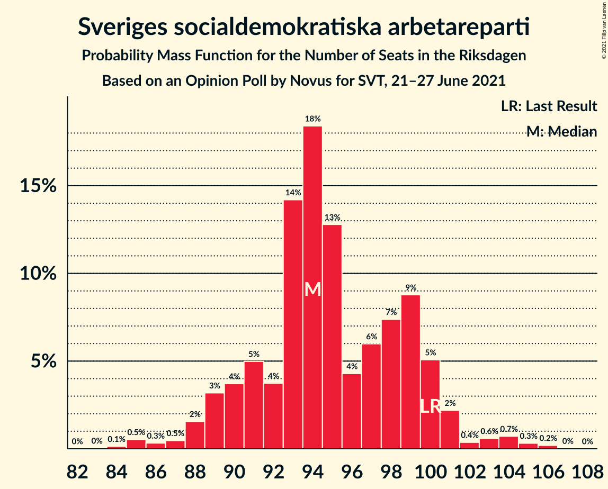
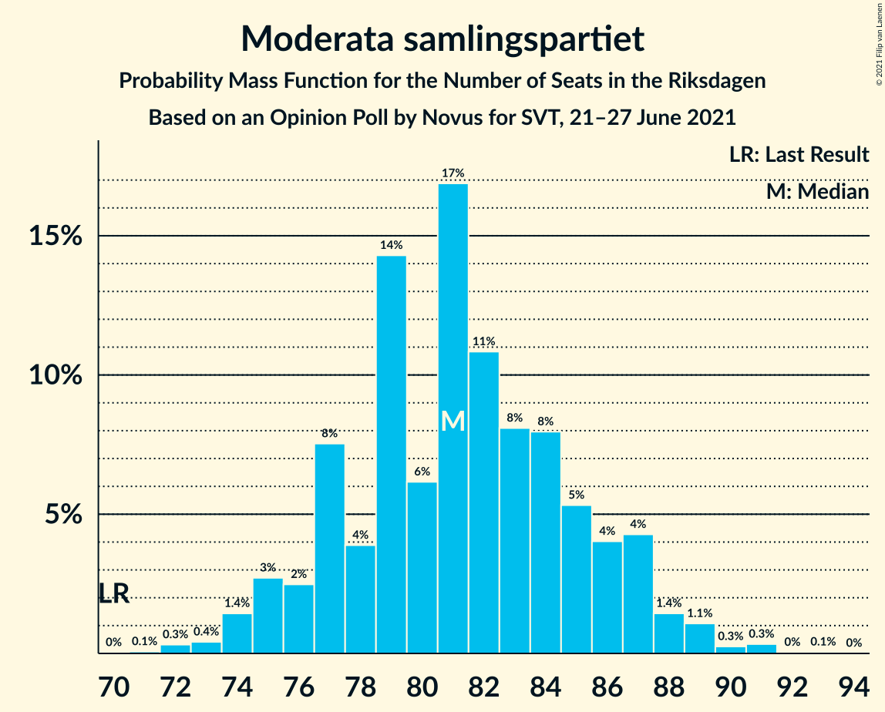
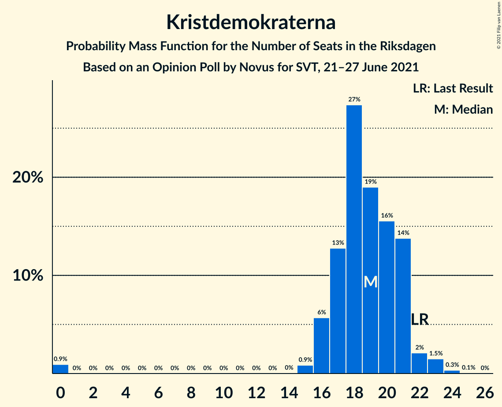
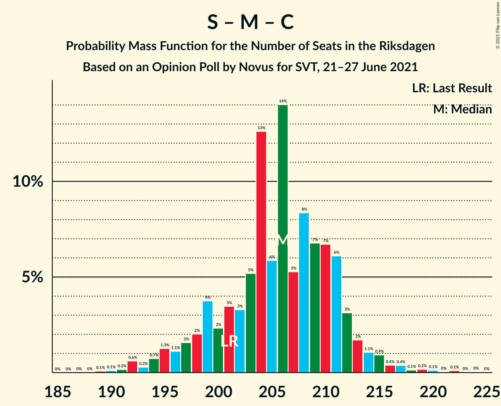
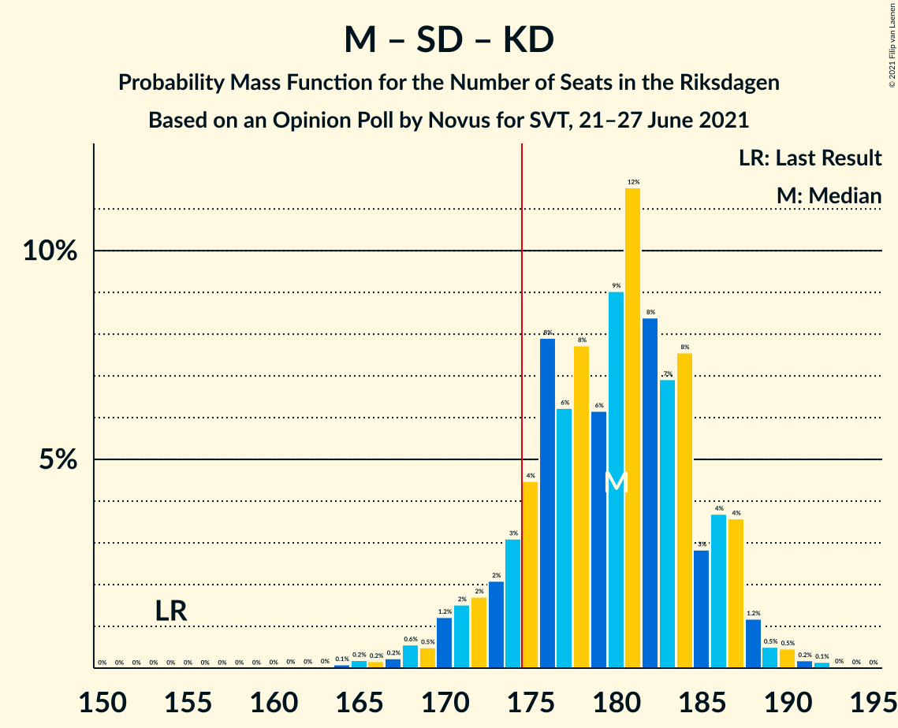
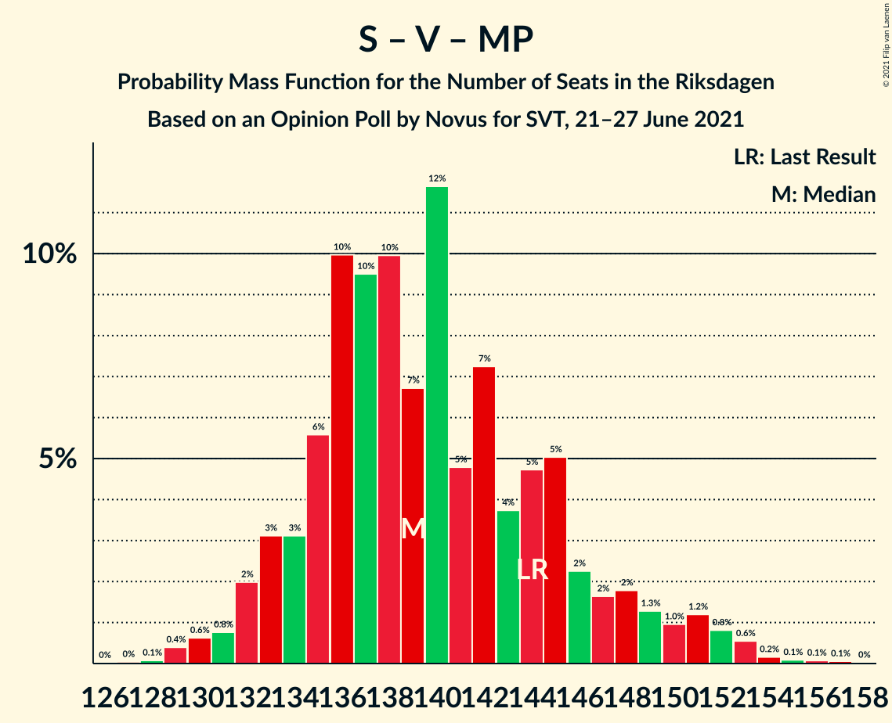
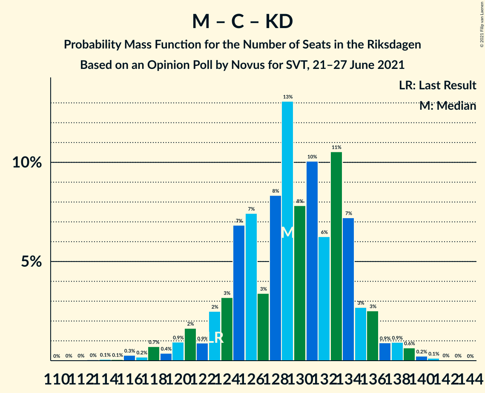

# Opinion Poll by Novus for SVT, 21–27 June 2021

<a href="#voting-intentions">Voting Intentions</a> | <a href="#seats">Seats</a> | <a href="#coalitions">Coalitions</a> | <a href="#technical-information">Technical Information</a>

## Voting Intentions

### Confidence Intervals

| Party | Last Result | Poll Result | 80% Confidence Interval | 90% Confidence Interval | 95% Confidence Interval | 99% Confidence Interval |
|:-----:|:-----------:|:-----------:|:-----------------------:|:-----------------------:|:-----------------------:|:-----------------------:|
| Sveriges socialdemokratiska arbetareparti | 28.3% | 25.4% | 24.3–26.6% |24.0–26.9% |23.7–27.2% |23.2–27.8% |
| Moderata samlingspartiet | 19.8% | 21.7% | 20.7–22.8% |20.4–23.2% |20.1–23.4% |19.6–24.0% |
| Sverigedemokraterna | 17.5% | 21.3% | 20.3–22.4% |20.0–22.7% |19.7–23.0% |19.2–23.5% |
| Vänsterpartiet | 8.0% | 11.5% | 10.7–12.3% |10.4–12.6% |10.2–12.8% |9.9–13.2% |
| Centerpartiet | 8.6% | 7.8% | 7.2–8.6% |7.0–8.8% |6.8–9.0% |6.5–9.4% |
| Kristdemokraterna | 6.3% | 5.0% | 4.5–5.6% |4.3–5.8% |4.2–5.9% |3.9–6.2% |
| Miljöpartiet de gröna | 4.4% | 3.5% | 3.0–4.0% |2.9–4.2% |2.8–4.3% |2.6–4.6% |
| Liberalerna | 5.5% | 2.5% | 2.1–3.0% |2.0–3.1% |1.9–3.2% |1.8–3.4% |

*Note:* The poll result column reflects the actual value used in the calculations. Published results may vary slightly, and in addition be rounded to fewer digits.

## Seats

### Confidence Intervals

| Party | Last Result | Median | 80% Confidence Interval | 90% Confidence Interval | 95% Confidence Interval | 99% Confidence Interval |
|:-----:|:-----------:|:------:|:-----------------------:|:-----------------------:|:-----------------------:|:-----------------------:|
| <a href="#sveriges-socialdemokratiska-arbetareparti">Sveriges socialdemokratiska arbetareparti</a> | 100 | 93 | 91–99 |89–100 |88–101 |88–105 |
| <a href="#moderata-samlingspartiet">Moderata samlingspartiet</a> | 70 | 81 | 79–85 |77–87 |76–88 |74–90 |
| <a href="#sverigedemokraterna">Sverigedemokraterna</a> | 62 | 81 | 77–83 |75–85 |74–86 |71–88 |
| <a href="#vänsterpartiet">Vänsterpartiet</a> | 28 | 44 | 40–46 |40–47 |38–48 |38–49 |
| <a href="#centerpartiet">Centerpartiet</a> | 31 | 30 | 28–32 |26–33 |25–33 |24–34 |
| <a href="#kristdemokraterna">Kristdemokraterna</a> | 22 | 18 | 17–20 |16–21 |16–21 |0–23 |
| <a href="#miljöpartiet-de-gröna">Miljöpartiet de gröna</a> | 16 | 0 | 0 |0–15 |0–15 |0–16 |
| <a href="#liberalerna">Liberalerna</a> | 20 | 0 | 0 |0 |0 |0 |

### Sveriges socialdemokratiska arbetareparti

*For a full overview of the results for this party, see the [Sveriges socialdemokratiska arbetareparti](party-sverigessocialdemokratiskaarbetareparti.html) page.*

| Number of Seats | Probability | Accumulated | Special Marks |
|:---------------:|:-----------:|:-----------:|:-------------:|
| 83 | 0.1% | 100% |  |
| 84 | 0% | 99.9% |  |
| 85 | 0% | 99.9% |  |
| 86 | 0.1% | 99.8% |  |
| 87 | 0.2% | 99.7% |  |
| 88 | 3% | 99.5% |  |
| 89 | 2% | 97% |  |
| 90 | 2% | 94% |  |
| 91 | 6% | 92% |  |
| 92 | 5% | 87% |  |
| 93 | 38% | 82% | Median |
| 94 | 17% | 43% |  |
| 95 | 6% | 26% |  |
| 96 | 2% | 20% |  |
| 97 | 2% | 19% |  |
| 98 | 5% | 16% |  |
| 99 | 6% | 12% |  |
| 100 | 4% | 6% | Last Result |
| 101 | 0.8% | 3% |  |
| 102 | 0.2% | 2% |  |
| 103 | 0.4% | 2% |  |
| 104 | 0.6% | 1.1% |  |
| 105 | 0.1% | 0.6% |  |
| 106 | 0.4% | 0.5% |  |
| 107 | 0% | 0% |  |

### Moderata samlingspartiet

*For a full overview of the results for this party, see the [Moderata samlingspartiet](party-moderatasamlingspartiet.html) page.*

| Number of Seats | Probability | Accumulated | Special Marks |
|:---------------:|:-----------:|:-----------:|:-------------:|
| 70 | 0% | 100% | Last Result |
| 71 | 0.1% | 99.9% |  |
| 72 | 0.1% | 99.9% |  |
| 73 | 0.1% | 99.7% |  |
| 74 | 0.5% | 99.7% |  |
| 75 | 0.8% | 99.2% |  |
| 76 | 2% | 98% |  |
| 77 | 2% | 96% |  |
| 78 | 2% | 95% |  |
| 79 | 18% | 93% |  |
| 80 | 2% | 75% |  |
| 81 | 28% | 72% | Median |
| 82 | 11% | 44% |  |
| 83 | 14% | 34% |  |
| 84 | 6% | 20% |  |
| 85 | 4% | 14% |  |
| 86 | 5% | 10% |  |
| 87 | 2% | 5% |  |
| 88 | 1.4% | 3% |  |
| 89 | 1.3% | 2% |  |
| 90 | 0.1% | 0.5% |  |
| 91 | 0.3% | 0.4% |  |
| 92 | 0% | 0.1% |  |
| 93 | 0% | 0.1% |  |
| 94 | 0% | 0.1% |  |
| 95 | 0.1% | 0.1% |  |
| 96 | 0% | 0% |  |

### Sverigedemokraterna

*For a full overview of the results for this party, see the [Sverigedemokraterna](party-sverigedemokraterna.html) page.*

| Number of Seats | Probability | Accumulated | Special Marks |
|:---------------:|:-----------:|:-----------:|:-------------:|
| 62 | 0% | 100% | Last Result |
| 63 | 0% | 100% |  |
| 64 | 0% | 100% |  |
| 65 | 0% | 100% |  |
| 66 | 0% | 100% |  |
| 67 | 0% | 100% |  |
| 68 | 0% | 100% |  |
| 69 | 0.1% | 100% |  |
| 70 | 0.3% | 99.9% |  |
| 71 | 0.4% | 99.6% |  |
| 72 | 0.4% | 99.2% |  |
| 73 | 0.8% | 98.9% |  |
| 74 | 3% | 98% |  |
| 75 | 2% | 96% |  |
| 76 | 4% | 94% |  |
| 77 | 5% | 90% |  |
| 78 | 4% | 85% |  |
| 79 | 21% | 81% |  |
| 80 | 5% | 60% |  |
| 81 | 8% | 55% | Median |
| 82 | 24% | 47% |  |
| 83 | 15% | 23% |  |
| 84 | 2% | 8% |  |
| 85 | 2% | 6% |  |
| 86 | 2% | 3% |  |
| 87 | 0.5% | 1.3% |  |
| 88 | 0.4% | 0.8% |  |
| 89 | 0.2% | 0.4% |  |
| 90 | 0.1% | 0.2% |  |
| 91 | 0% | 0.1% |  |
| 92 | 0% | 0.1% |  |
| 93 | 0% | 0% |  |

### Vänsterpartiet

*For a full overview of the results for this party, see the [Vänsterpartiet](party-vänsterpartiet.html) page.*

| Number of Seats | Probability | Accumulated | Special Marks |
|:---------------:|:-----------:|:-----------:|:-------------:|
| 28 | 0% | 100% | Last Result |
| 29 | 0% | 100% |  |
| 30 | 0% | 100% |  |
| 31 | 0% | 100% |  |
| 32 | 0% | 100% |  |
| 33 | 0% | 100% |  |
| 34 | 0% | 100% |  |
| 35 | 0.1% | 100% |  |
| 36 | 0.1% | 99.9% |  |
| 37 | 0.1% | 99.8% |  |
| 38 | 3% | 99.7% |  |
| 39 | 2% | 97% |  |
| 40 | 8% | 95% |  |
| 41 | 11% | 87% |  |
| 42 | 9% | 76% |  |
| 43 | 17% | 67% |  |
| 44 | 3% | 51% | Median |
| 45 | 27% | 48% |  |
| 46 | 14% | 21% |  |
| 47 | 3% | 7% |  |
| 48 | 3% | 4% |  |
| 49 | 0.9% | 1.4% |  |
| 50 | 0.3% | 0.4% |  |
| 51 | 0.1% | 0.1% |  |
| 52 | 0% | 0% |  |

### Centerpartiet

*For a full overview of the results for this party, see the [Centerpartiet](party-centerpartiet.html) page.*

| Number of Seats | Probability | Accumulated | Special Marks |
|:---------------:|:-----------:|:-----------:|:-------------:|
| 23 | 0.1% | 100% |  |
| 24 | 0.6% | 99.9% |  |
| 25 | 3% | 99.2% |  |
| 26 | 3% | 96% |  |
| 27 | 2% | 94% |  |
| 28 | 7% | 92% |  |
| 29 | 10% | 84% |  |
| 30 | 38% | 75% | Median |
| 31 | 11% | 36% | Last Result |
| 32 | 17% | 26% |  |
| 33 | 7% | 9% |  |
| 34 | 1.0% | 1.4% |  |
| 35 | 0.4% | 0.4% |  |
| 36 | 0% | 0.1% |  |
| 37 | 0% | 0% |  |

### Kristdemokraterna

*For a full overview of the results for this party, see the [Kristdemokraterna](party-kristdemokraterna.html) page.*

| Number of Seats | Probability | Accumulated | Special Marks |
|:---------------:|:-----------:|:-----------:|:-------------:|
| 0 | 0.9% | 100% |  |
| 1 | 0% | 99.1% |  |
| 2 | 0% | 99.1% |  |
| 3 | 0% | 99.1% |  |
| 4 | 0% | 99.1% |  |
| 5 | 0% | 99.1% |  |
| 6 | 0% | 99.1% |  |
| 7 | 0% | 99.1% |  |
| 8 | 0% | 99.1% |  |
| 9 | 0% | 99.1% |  |
| 10 | 0% | 99.1% |  |
| 11 | 0% | 99.1% |  |
| 12 | 0% | 99.1% |  |
| 13 | 0% | 99.1% |  |
| 14 | 0% | 99.1% |  |
| 15 | 1.3% | 99.1% |  |
| 16 | 5% | 98% |  |
| 17 | 10% | 92% |  |
| 18 | 44% | 82% | Median |
| 19 | 17% | 39% |  |
| 20 | 12% | 22% |  |
| 21 | 9% | 10% |  |
| 22 | 0.8% | 1.4% | Last Result |
| 23 | 0.4% | 0.6% |  |
| 24 | 0.1% | 0.2% |  |
| 25 | 0% | 0% |  |

### Miljöpartiet de gröna

*For a full overview of the results for this party, see the [Miljöpartiet de gröna](party-miljöpartietdegröna.html) page.*

| Number of Seats | Probability | Accumulated | Special Marks |
|:---------------:|:-----------:|:-----------:|:-------------:|
| 0 | 94% | 100% | Median |
| 1 | 0% | 6% |  |
| 2 | 0% | 6% |  |
| 3 | 0% | 6% |  |
| 4 | 0% | 6% |  |
| 5 | 0% | 6% |  |
| 6 | 0% | 6% |  |
| 7 | 0% | 6% |  |
| 8 | 0% | 6% |  |
| 9 | 0% | 6% |  |
| 10 | 0% | 6% |  |
| 11 | 0% | 6% |  |
| 12 | 0% | 6% |  |
| 13 | 0% | 6% |  |
| 14 | 0% | 6% |  |
| 15 | 4% | 6% |  |
| 16 | 2% | 2% | Last Result |
| 17 | 0.2% | 0.2% |  |
| 18 | 0% | 0% |  |

### Liberalerna

*For a full overview of the results for this party, see the [Liberalerna](party-liberalerna.html) page.*

| Number of Seats | Probability | Accumulated | Special Marks |
|:---------------:|:-----------:|:-----------:|:-------------:|
| 0 | 100% | 100% | Median |
| 1 | 0% | 0% |  |
| 2 | 0% | 0% |  |
| 3 | 0% | 0% |  |
| 4 | 0% | 0% |  |
| 5 | 0% | 0% |  |
| 6 | 0% | 0% |  |
| 7 | 0% | 0% |  |
| 8 | 0% | 0% |  |
| 9 | 0% | 0% |  |
| 10 | 0% | 0% |  |
| 11 | 0% | 0% |  |
| 12 | 0% | 0% |  |
| 13 | 0% | 0% |  |
| 14 | 0% | 0% |  |
| 15 | 0% | 0% |  |
| 16 | 0% | 0% |  |
| 17 | 0% | 0% |  |
| 18 | 0% | 0% |  |
| 19 | 0% | 0% |  |
| 20 | 0% | 0% | Last Result |

## Coalitions

### Confidence Intervals

| Coalition | Last Result | Median | Majority? | 80% Confidence Interval | 90% Confidence Interval | 95% Confidence Interval | 99% Confidence Interval |
|:---------:|:-----------:|:------:|:---------:|:-----------------------:|:-----------------------:|:-----------------------:|:-----------------------:|
| Sveriges socialdemokratiska arbetareparti – Moderata samlingspartiet – Centerpartiet | 201 | 205 | 100% | 202–212 | 199–213 | 198–214 | 195–219 |
| Moderata samlingspartiet – Sverigedemokraterna – Kristdemokraterna | 154 | 181 | 92% | 176–186 | 173–187 | 171–188 | 167–190 |
| Sveriges socialdemokratiska arbetareparti – Moderata samlingspartiet | 170 | 174 | 47% | 172–181 | 170–183 | 169–185 | 166–186 |
| Sveriges socialdemokratiska arbetareparti – Vänsterpartiet – Centerpartiet – Miljöpartiet de gröna – Liberalerna | 195 | 168 | 8% | 163–173 | 162–176 | 161–178 | 159–182 |
| Moderata samlingspartiet – Sverigedemokraterna | 132 | 163 | 0.3% | 157–166 | 155–168 | 153–170 | 150–173 |
| Sveriges socialdemokratiska arbetareparti – Vänsterpartiet – Miljöpartiet de gröna | 144 | 138 | 0% | 134–145 | 132–147 | 131–150 | 129–153 |
| Sveriges socialdemokratiska arbetareparti – Vänsterpartiet | 128 | 138 | 0% | 133–142 | 131–144 | 130–146 | 129–148 |
| Moderata samlingspartiet – Centerpartiet – Kristdemokraterna – Liberalerna | 143 | 130 | 0% | 126–134 | 124–136 | 121–137 | 116–139 |
| Moderata samlingspartiet – Centerpartiet – Kristdemokraterna | 123 | 130 | 0% | 126–134 | 124–136 | 121–137 | 116–139 |
| Sveriges socialdemokratiska arbetareparti – Centerpartiet – Miljöpartiet de gröna – Liberalerna | 167 | 124 | 0% | 120–131 | 120–134 | 118–136 | 116–138 |
| Moderata samlingspartiet – Centerpartiet – Liberalerna | 121 | 111 | 0% | 108–116 | 106–117 | 104–119 | 102–120 |
| Moderata samlingspartiet – Centerpartiet | 101 | 111 | 0% | 108–116 | 106–117 | 104–119 | 102–120 |
| Sveriges socialdemokratiska arbetareparti – Miljöpartiet de gröna | 116 | 93 | 0% | 92–100 | 91–105 | 88–107 | 88–109 |

### Sveriges socialdemokratiska arbetareparti – Moderata samlingspartiet – Centerpartiet

| Number of Seats | Probability | Accumulated | Special Marks |
|:---------------:|:-----------:|:-----------:|:-------------:|
| 189 | 0.1% | 100% |  |
| 190 | 0.1% | 99.9% |  |
| 191 | 0.1% | 99.8% |  |
| 192 | 0% | 99.7% |  |
| 193 | 0% | 99.7% |  |
| 194 | 0.1% | 99.6% |  |
| 195 | 0.3% | 99.5% |  |
| 196 | 0.2% | 99.2% |  |
| 197 | 1.4% | 99.0% |  |
| 198 | 2% | 98% |  |
| 199 | 1.3% | 95% |  |
| 200 | 0.8% | 94% |  |
| 201 | 0.8% | 93% | Last Result |
| 202 | 3% | 92% |  |
| 203 | 12% | 89% |  |
| 204 | 21% | 77% | Median |
| 205 | 13% | 56% |  |
| 206 | 11% | 43% |  |
| 207 | 3% | 31% |  |
| 208 | 3% | 29% |  |
| 209 | 7% | 26% |  |
| 210 | 6% | 18% |  |
| 211 | 2% | 12% |  |
| 212 | 5% | 10% |  |
| 213 | 3% | 5% |  |
| 214 | 1.2% | 3% |  |
| 215 | 0.3% | 2% |  |
| 216 | 0.4% | 1.4% |  |
| 217 | 0.5% | 1.0% |  |
| 218 | 0% | 0.6% |  |
| 219 | 0.3% | 0.5% |  |
| 220 | 0.1% | 0.3% |  |
| 221 | 0% | 0.1% |  |
| 222 | 0% | 0.1% |  |
| 223 | 0% | 0.1% |  |
| 224 | 0% | 0.1% |  |
| 225 | 0.1% | 0.1% |  |
| 226 | 0% | 0% |  |

### Moderata samlingspartiet – Sverigedemokraterna – Kristdemokraterna

| Number of Seats | Probability | Accumulated | Special Marks |
|:---------------:|:-----------:|:-----------:|:-------------:|
| 154 | 0% | 100% | Last Result |
| 155 | 0% | 100% |  |
| 156 | 0% | 100% |  |
| 157 | 0% | 100% |  |
| 158 | 0% | 100% |  |
| 159 | 0% | 100% |  |
| 160 | 0% | 100% |  |
| 161 | 0% | 100% |  |
| 162 | 0% | 99.9% |  |
| 163 | 0% | 99.9% |  |
| 164 | 0% | 99.9% |  |
| 165 | 0.1% | 99.9% |  |
| 166 | 0% | 99.8% |  |
| 167 | 0.3% | 99.8% |  |
| 168 | 0.3% | 99.5% |  |
| 169 | 0.3% | 99.1% |  |
| 170 | 1.2% | 98.8% |  |
| 171 | 0.5% | 98% |  |
| 172 | 1.2% | 97% |  |
| 173 | 2% | 96% |  |
| 174 | 2% | 94% |  |
| 175 | 2% | 92% | Majority |
| 176 | 3% | 91% |  |
| 177 | 12% | 88% |  |
| 178 | 6% | 76% |  |
| 179 | 5% | 70% |  |
| 180 | 7% | 65% | Median |
| 181 | 27% | 58% |  |
| 182 | 4% | 31% |  |
| 183 | 7% | 27% |  |
| 184 | 8% | 21% |  |
| 185 | 1.4% | 13% |  |
| 186 | 6% | 12% |  |
| 187 | 2% | 6% |  |
| 188 | 2% | 4% |  |
| 189 | 0.3% | 1.4% |  |
| 190 | 0.7% | 1.1% |  |
| 191 | 0.1% | 0.4% |  |
| 192 | 0.2% | 0.3% |  |
| 193 | 0% | 0% |  |

### Sveriges socialdemokratiska arbetareparti – Moderata samlingspartiet

| Number of Seats | Probability | Accumulated | Special Marks |
|:---------------:|:-----------:|:-----------:|:-------------:|
| 161 | 0% | 100% |  |
| 162 | 0.1% | 99.9% |  |
| 163 | 0.1% | 99.8% |  |
| 164 | 0.1% | 99.7% |  |
| 165 | 0.1% | 99.6% |  |
| 166 | 0.2% | 99.6% |  |
| 167 | 0.3% | 99.3% |  |
| 168 | 1.0% | 99.0% |  |
| 169 | 2% | 98% |  |
| 170 | 2% | 96% | Last Result |
| 171 | 2% | 94% |  |
| 172 | 6% | 92% |  |
| 173 | 12% | 85% |  |
| 174 | 26% | 73% | Median |
| 175 | 2% | 47% | Majority |
| 176 | 15% | 45% |  |
| 177 | 4% | 30% |  |
| 178 | 2% | 26% |  |
| 179 | 4% | 24% |  |
| 180 | 8% | 20% |  |
| 181 | 4% | 12% |  |
| 182 | 2% | 8% |  |
| 183 | 0.7% | 6% |  |
| 184 | 2% | 5% |  |
| 185 | 2% | 3% |  |
| 186 | 1.1% | 2% |  |
| 187 | 0.2% | 0.5% |  |
| 188 | 0.1% | 0.3% |  |
| 189 | 0% | 0.1% |  |
| 190 | 0% | 0.1% |  |
| 191 | 0% | 0.1% |  |
| 192 | 0% | 0.1% |  |
| 193 | 0% | 0.1% |  |
| 194 | 0% | 0.1% |  |
| 195 | 0.1% | 0.1% |  |
| 196 | 0% | 0% |  |

### Sveriges socialdemokratiska arbetareparti – Vänsterpartiet – Centerpartiet – Miljöpartiet de gröna – Liberalerna

| Number of Seats | Probability | Accumulated | Special Marks |
|:---------------:|:-----------:|:-----------:|:-------------:|
| 157 | 0.2% | 100% |  |
| 158 | 0.1% | 99.7% |  |
| 159 | 0.7% | 99.6% |  |
| 160 | 0.3% | 98.9% |  |
| 161 | 2% | 98.6% |  |
| 162 | 2% | 96% |  |
| 163 | 6% | 94% |  |
| 164 | 1.4% | 88% |  |
| 165 | 8% | 87% |  |
| 166 | 7% | 79% |  |
| 167 | 4% | 73% | Median |
| 168 | 27% | 69% |  |
| 169 | 7% | 42% |  |
| 170 | 5% | 35% |  |
| 171 | 6% | 30% |  |
| 172 | 12% | 24% |  |
| 173 | 3% | 12% |  |
| 174 | 2% | 9% |  |
| 175 | 2% | 8% | Majority |
| 176 | 2% | 6% |  |
| 177 | 1.2% | 4% |  |
| 178 | 0.5% | 3% |  |
| 179 | 1.2% | 2% |  |
| 180 | 0.3% | 1.2% |  |
| 181 | 0.3% | 0.9% |  |
| 182 | 0.3% | 0.5% |  |
| 183 | 0% | 0.2% |  |
| 184 | 0.1% | 0.2% |  |
| 185 | 0% | 0.1% |  |
| 186 | 0% | 0.1% |  |
| 187 | 0% | 0.1% |  |
| 188 | 0% | 0.1% |  |
| 189 | 0% | 0% |  |
| 190 | 0% | 0% |  |
| 191 | 0% | 0% |  |
| 192 | 0% | 0% |  |
| 193 | 0% | 0% |  |
| 194 | 0% | 0% |  |
| 195 | 0% | 0% | Last Result |

### Moderata samlingspartiet – Sverigedemokraterna

| Number of Seats | Probability | Accumulated | Special Marks |
|:---------------:|:-----------:|:-----------:|:-------------:|
| 132 | 0% | 100% | Last Result |
| 133 | 0% | 100% |  |
| 134 | 0% | 100% |  |
| 135 | 0% | 100% |  |
| 136 | 0% | 100% |  |
| 137 | 0% | 100% |  |
| 138 | 0% | 100% |  |
| 139 | 0% | 100% |  |
| 140 | 0% | 100% |  |
| 141 | 0% | 100% |  |
| 142 | 0% | 100% |  |
| 143 | 0% | 100% |  |
| 144 | 0% | 100% |  |
| 145 | 0% | 100% |  |
| 146 | 0% | 100% |  |
| 147 | 0.1% | 100% |  |
| 148 | 0% | 99.9% |  |
| 149 | 0.1% | 99.9% |  |
| 150 | 0.5% | 99.8% |  |
| 151 | 0.1% | 99.3% |  |
| 152 | 0.3% | 99.2% |  |
| 153 | 2% | 98.9% |  |
| 154 | 0.9% | 97% |  |
| 155 | 1.4% | 96% |  |
| 156 | 2% | 95% |  |
| 157 | 3% | 93% |  |
| 158 | 11% | 90% |  |
| 159 | 4% | 79% |  |
| 160 | 6% | 75% |  |
| 161 | 5% | 68% |  |
| 162 | 10% | 63% | Median |
| 163 | 25% | 53% |  |
| 164 | 6% | 28% |  |
| 165 | 1.1% | 22% |  |
| 166 | 12% | 21% |  |
| 167 | 3% | 9% |  |
| 168 | 1.4% | 6% |  |
| 169 | 0.8% | 5% |  |
| 170 | 2% | 4% |  |
| 171 | 1.2% | 2% |  |
| 172 | 0.3% | 0.8% |  |
| 173 | 0.1% | 0.5% |  |
| 174 | 0.1% | 0.4% |  |
| 175 | 0.1% | 0.3% | Majority |
| 176 | 0.1% | 0.2% |  |
| 177 | 0.1% | 0.1% |  |
| 178 | 0% | 0% |  |

### Sveriges socialdemokratiska arbetareparti – Vänsterpartiet – Miljöpartiet de gröna

| Number of Seats | Probability | Accumulated | Special Marks |
|:---------------:|:-----------:|:-----------:|:-------------:|
| 128 | 0% | 100% |  |
| 129 | 0.7% | 99.9% |  |
| 130 | 0.3% | 99.2% |  |
| 131 | 2% | 98.9% |  |
| 132 | 2% | 97% |  |
| 133 | 2% | 95% |  |
| 134 | 6% | 92% |  |
| 135 | 11% | 86% |  |
| 136 | 6% | 75% |  |
| 137 | 4% | 69% | Median |
| 138 | 28% | 65% |  |
| 139 | 5% | 38% |  |
| 140 | 12% | 33% |  |
| 141 | 4% | 20% |  |
| 142 | 0.8% | 16% |  |
| 143 | 3% | 15% |  |
| 144 | 2% | 12% | Last Result |
| 145 | 3% | 10% |  |
| 146 | 2% | 7% |  |
| 147 | 2% | 5% |  |
| 148 | 0.6% | 3% |  |
| 149 | 0.3% | 3% |  |
| 150 | 0.4% | 3% |  |
| 151 | 1.4% | 2% |  |
| 152 | 0.2% | 0.7% |  |
| 153 | 0.3% | 0.6% |  |
| 154 | 0.1% | 0.3% |  |
| 155 | 0% | 0.2% |  |
| 156 | 0.1% | 0.1% |  |
| 157 | 0% | 0.1% |  |
| 158 | 0% | 0.1% |  |
| 159 | 0% | 0% |  |

### Sveriges socialdemokratiska arbetareparti – Vänsterpartiet

| Number of Seats | Probability | Accumulated | Special Marks |
|:---------------:|:-----------:|:-----------:|:-------------:|
| 125 | 0% | 100% |  |
| 126 | 0.1% | 99.9% |  |
| 127 | 0.1% | 99.9% |  |
| 128 | 0.2% | 99.8% | Last Result |
| 129 | 2% | 99.6% |  |
| 130 | 0.4% | 98% |  |
| 131 | 3% | 97% |  |
| 132 | 3% | 94% |  |
| 133 | 2% | 91% |  |
| 134 | 6% | 89% |  |
| 135 | 11% | 82% |  |
| 136 | 7% | 71% |  |
| 137 | 4% | 64% | Median |
| 138 | 28% | 60% |  |
| 139 | 5% | 32% |  |
| 140 | 12% | 27% |  |
| 141 | 4% | 14% |  |
| 142 | 0.8% | 10% |  |
| 143 | 3% | 9% |  |
| 144 | 2% | 6% |  |
| 145 | 2% | 4% |  |
| 146 | 0.9% | 3% |  |
| 147 | 1.1% | 2% |  |
| 148 | 0.5% | 0.7% |  |
| 149 | 0.1% | 0.2% |  |
| 150 | 0.1% | 0.1% |  |
| 151 | 0% | 0.1% |  |
| 152 | 0% | 0% |  |

### Moderata samlingspartiet – Centerpartiet – Kristdemokraterna – Liberalerna

| Number of Seats | Probability | Accumulated | Special Marks |
|:---------------:|:-----------:|:-----------:|:-------------:|
| 111 | 0.1% | 100% |  |
| 112 | 0% | 99.9% |  |
| 113 | 0% | 99.9% |  |
| 114 | 0.1% | 99.8% |  |
| 115 | 0% | 99.8% |  |
| 116 | 0.4% | 99.8% |  |
| 117 | 0% | 99.4% |  |
| 118 | 0.1% | 99.4% |  |
| 119 | 0.2% | 99.3% |  |
| 120 | 0.2% | 99.1% |  |
| 121 | 2% | 98.9% |  |
| 122 | 0.6% | 97% |  |
| 123 | 2% | 97% |  |
| 124 | 1.2% | 95% |  |
| 125 | 2% | 94% |  |
| 126 | 4% | 92% |  |
| 127 | 4% | 88% |  |
| 128 | 6% | 84% |  |
| 129 | 25% | 78% | Median |
| 130 | 10% | 53% |  |
| 131 | 12% | 43% |  |
| 132 | 8% | 31% |  |
| 133 | 9% | 23% |  |
| 134 | 7% | 15% |  |
| 135 | 1.1% | 8% |  |
| 136 | 4% | 7% |  |
| 137 | 0.8% | 3% |  |
| 138 | 1.3% | 2% |  |
| 139 | 0.3% | 0.6% |  |
| 140 | 0.2% | 0.3% |  |
| 141 | 0% | 0.1% |  |
| 142 | 0.1% | 0.1% |  |
| 143 | 0% | 0% | Last Result |

### Moderata samlingspartiet – Centerpartiet – Kristdemokraterna

| Number of Seats | Probability | Accumulated | Special Marks |
|:---------------:|:-----------:|:-----------:|:-------------:|
| 111 | 0.1% | 100% |  |
| 112 | 0% | 99.9% |  |
| 113 | 0% | 99.9% |  |
| 114 | 0.1% | 99.8% |  |
| 115 | 0% | 99.8% |  |
| 116 | 0.4% | 99.8% |  |
| 117 | 0% | 99.4% |  |
| 118 | 0.1% | 99.4% |  |
| 119 | 0.2% | 99.3% |  |
| 120 | 0.2% | 99.1% |  |
| 121 | 2% | 98.9% |  |
| 122 | 0.6% | 97% |  |
| 123 | 2% | 97% | Last Result |
| 124 | 1.2% | 95% |  |
| 125 | 2% | 94% |  |
| 126 | 4% | 92% |  |
| 127 | 4% | 88% |  |
| 128 | 6% | 84% |  |
| 129 | 25% | 78% | Median |
| 130 | 10% | 53% |  |
| 131 | 12% | 43% |  |
| 132 | 8% | 31% |  |
| 133 | 9% | 23% |  |
| 134 | 7% | 15% |  |
| 135 | 1.1% | 8% |  |
| 136 | 4% | 7% |  |
| 137 | 0.8% | 3% |  |
| 138 | 1.3% | 2% |  |
| 139 | 0.3% | 0.6% |  |
| 140 | 0.2% | 0.3% |  |
| 141 | 0% | 0.1% |  |
| 142 | 0.1% | 0.1% |  |
| 143 | 0% | 0% |  |

### Sveriges socialdemokratiska arbetareparti – Centerpartiet – Miljöpartiet de gröna – Liberalerna

| Number of Seats | Probability | Accumulated | Special Marks |
|:---------------:|:-----------:|:-----------:|:-------------:|
| 114 | 0.1% | 100% |  |
| 115 | 0% | 99.9% |  |
| 116 | 0.4% | 99.9% |  |
| 117 | 0.1% | 99.4% |  |
| 118 | 2% | 99.3% |  |
| 119 | 0.8% | 97% |  |
| 120 | 7% | 96% |  |
| 121 | 2% | 89% |  |
| 122 | 2% | 87% |  |
| 123 | 31% | 85% | Median |
| 124 | 11% | 54% |  |
| 125 | 3% | 43% |  |
| 126 | 11% | 40% |  |
| 127 | 9% | 29% |  |
| 128 | 6% | 20% |  |
| 129 | 0.7% | 14% |  |
| 130 | 2% | 14% |  |
| 131 | 4% | 12% |  |
| 132 | 0.7% | 8% |  |
| 133 | 2% | 7% |  |
| 134 | 0.8% | 5% |  |
| 135 | 2% | 4% |  |
| 136 | 2% | 3% |  |
| 137 | 0.4% | 0.9% |  |
| 138 | 0.2% | 0.5% |  |
| 139 | 0.1% | 0.4% |  |
| 140 | 0% | 0.3% |  |
| 141 | 0.1% | 0.3% |  |
| 142 | 0.1% | 0.2% |  |
| 143 | 0.1% | 0.1% |  |
| 144 | 0% | 0% |  |
| 145 | 0% | 0% |  |
| 146 | 0% | 0% |  |
| 147 | 0% | 0% |  |
| 148 | 0% | 0% |  |
| 149 | 0% | 0% |  |
| 150 | 0% | 0% |  |
| 151 | 0% | 0% |  |
| 152 | 0% | 0% |  |
| 153 | 0% | 0% |  |
| 154 | 0% | 0% |  |
| 155 | 0% | 0% |  |
| 156 | 0% | 0% |  |
| 157 | 0% | 0% |  |
| 158 | 0% | 0% |  |
| 159 | 0% | 0% |  |
| 160 | 0% | 0% |  |
| 161 | 0% | 0% |  |
| 162 | 0% | 0% |  |
| 163 | 0% | 0% |  |
| 164 | 0% | 0% |  |
| 165 | 0% | 0% |  |
| 166 | 0% | 0% |  |
| 167 | 0% | 0% | Last Result |

### Moderata samlingspartiet – Centerpartiet – Liberalerna

| Number of Seats | Probability | Accumulated | Special Marks |
|:---------------:|:-----------:|:-----------:|:-------------:|
| 98 | 0% | 100% |  |
| 99 | 0.1% | 99.9% |  |
| 100 | 0.1% | 99.9% |  |
| 101 | 0.1% | 99.8% |  |
| 102 | 0.4% | 99.7% |  |
| 103 | 0.3% | 99.2% |  |
| 104 | 1.5% | 98.9% |  |
| 105 | 2% | 97% |  |
| 106 | 2% | 96% |  |
| 107 | 3% | 94% |  |
| 108 | 2% | 91% |  |
| 109 | 4% | 90% |  |
| 110 | 10% | 86% |  |
| 111 | 30% | 76% | Median |
| 112 | 11% | 46% |  |
| 113 | 15% | 35% |  |
| 114 | 3% | 20% |  |
| 115 | 8% | 18% |  |
| 116 | 3% | 10% |  |
| 117 | 2% | 7% |  |
| 118 | 2% | 5% |  |
| 119 | 1.4% | 3% |  |
| 120 | 0.7% | 1.2% |  |
| 121 | 0.2% | 0.4% | Last Result |
| 122 | 0.1% | 0.2% |  |
| 123 | 0% | 0.1% |  |
| 124 | 0% | 0.1% |  |
| 125 | 0.1% | 0.1% |  |
| 126 | 0% | 0% |  |

### Moderata samlingspartiet – Centerpartiet

| Number of Seats | Probability | Accumulated | Special Marks |
|:---------------:|:-----------:|:-----------:|:-------------:|
| 98 | 0% | 100% |  |
| 99 | 0.1% | 99.9% |  |
| 100 | 0.1% | 99.9% |  |
| 101 | 0.1% | 99.8% | Last Result |
| 102 | 0.4% | 99.7% |  |
| 103 | 0.3% | 99.2% |  |
| 104 | 1.5% | 98.9% |  |
| 105 | 2% | 97% |  |
| 106 | 2% | 96% |  |
| 107 | 3% | 94% |  |
| 108 | 2% | 91% |  |
| 109 | 4% | 90% |  |
| 110 | 10% | 86% |  |
| 111 | 30% | 76% | Median |
| 112 | 11% | 46% |  |
| 113 | 15% | 35% |  |
| 114 | 3% | 20% |  |
| 115 | 8% | 18% |  |
| 116 | 3% | 10% |  |
| 117 | 2% | 7% |  |
| 118 | 2% | 5% |  |
| 119 | 1.4% | 3% |  |
| 120 | 0.7% | 1.2% |  |
| 121 | 0.2% | 0.4% |  |
| 122 | 0.1% | 0.2% |  |
| 123 | 0% | 0.1% |  |
| 124 | 0% | 0.1% |  |
| 125 | 0.1% | 0.1% |  |
| 126 | 0% | 0% |  |

### Sveriges socialdemokratiska arbetareparti – Miljöpartiet de gröna

| Number of Seats | Probability | Accumulated | Special Marks |
|:---------------:|:-----------:|:-----------:|:-------------:|
| 86 | 0.1% | 100% |  |
| 87 | 0.2% | 99.9% |  |
| 88 | 3% | 99.7% |  |
| 89 | 0.8% | 97% |  |
| 90 | 0.6% | 96% |  |
| 91 | 5% | 96% |  |
| 92 | 4% | 90% |  |
| 93 | 37% | 86% | Median |
| 94 | 17% | 49% |  |
| 95 | 6% | 32% |  |
| 96 | 2% | 26% |  |
| 97 | 2% | 24% |  |
| 98 | 5% | 22% |  |
| 99 | 6% | 18% |  |
| 100 | 4% | 12% |  |
| 101 | 0.9% | 9% |  |
| 102 | 0.2% | 8% |  |
| 103 | 0.5% | 7% |  |
| 104 | 0.7% | 7% |  |
| 105 | 3% | 6% |  |
| 106 | 0.5% | 3% |  |
| 107 | 0.7% | 3% |  |
| 108 | 1.2% | 2% |  |
| 109 | 0.3% | 0.7% |  |
| 110 | 0% | 0.5% |  |
| 111 | 0.2% | 0.4% |  |
| 112 | 0% | 0.2% |  |
| 113 | 0.1% | 0.2% |  |
| 114 | 0% | 0.1% |  |
| 115 | 0% | 0.1% |  |
| 116 | 0% | 0% | Last Result |

## Technical Information

### Opinion Poll

+ **Polling firm:** Novus
+ **Commissioner(s):** SVT
+ **Fieldwork period:** 21–27 June 2021

### Calculations

+ **Sample size:** 2408
+ **Simulations done:** 131,072
+ **Error estimate:** 0.90%

