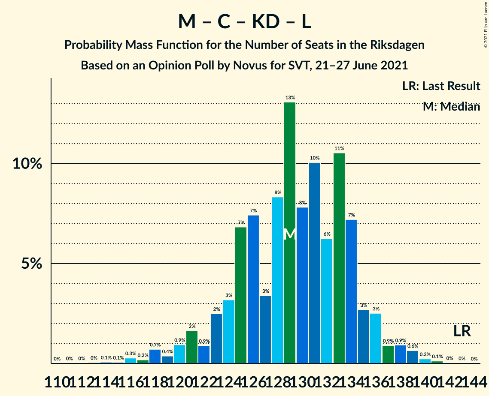

# Opinion Poll by Novus for SVT, 21–27 June 2021

<a href="#voting-intentions">Voting Intentions</a> | <a href="#seats">Seats</a> | <a href="#coalitions">Coalitions</a> | <a href="#technical-information">Technical Information</a>

## Voting Intentions

### Confidence Intervals

| Party | Last Result | Poll Result | 80% Confidence Interval | 90% Confidence Interval | 95% Confidence Interval | 99% Confidence Interval |
|:-----:|:-----------:|:-----------:|:-----------------------:|:-----------------------:|:-----------------------:|:-----------------------:|
| Sveriges socialdemokratiska arbetareparti | 28.3% | 25.4% | 24.3–26.6% |24.0–26.9% |23.7–27.2% |23.2–27.8% |
| Moderata samlingspartiet | 19.8% | 21.7% | 20.7–22.8% |20.4–23.2% |20.1–23.4% |19.6–24.0% |
| Sverigedemokraterna | 17.5% | 21.3% | 20.3–22.4% |20.0–22.7% |19.7–23.0% |19.2–23.5% |
| Vänsterpartiet | 8.0% | 11.5% | 10.7–12.3% |10.4–12.6% |10.2–12.8% |9.9–13.2% |
| Centerpartiet | 8.6% | 7.8% | 7.2–8.6% |7.0–8.8% |6.8–9.0% |6.5–9.4% |
| Kristdemokraterna | 6.3% | 5.0% | 4.5–5.6% |4.3–5.8% |4.2–5.9% |3.9–6.2% |
| Miljöpartiet de gröna | 4.4% | 3.5% | 3.0–4.0% |2.9–4.2% |2.8–4.3% |2.6–4.6% |
| Liberalerna | 5.5% | 2.5% | 2.1–3.0% |2.0–3.1% |1.9–3.2% |1.8–3.4% |

*Note:* The poll result column reflects the actual value used in the calculations. Published results may vary slightly, and in addition be rounded to fewer digits.

## Seats

### Confidence Intervals

| Party | Last Result | Median | 80% Confidence Interval | 90% Confidence Interval | 95% Confidence Interval | 99% Confidence Interval |
|:-----:|:-----------:|:------:|:-----------------------:|:-----------------------:|:-----------------------:|:-----------------------:|
| <a href="#sveriges-socialdemokratiska-arbetareparti">Sveriges socialdemokratiska arbetareparti</a> | 100 | 94 | 91–99 |89–100 |88–101 |85–105 |
| <a href="#moderata-samlingspartiet">Moderata samlingspartiet</a> | 70 | 81 | 77–86 |75–87 |75–88 |73–90 |
| <a href="#sverigedemokraterna">Sverigedemokraterna</a> | 62 | 80 | 76–84 |74–85 |73–86 |72–88 |
| <a href="#vänsterpartiet">Vänsterpartiet</a> | 28 | 43 | 40–46 |39–47 |38–48 |37–50 |
| <a href="#centerpartiet">Centerpartiet</a> | 31 | 29 | 27–32 |26–33 |25–34 |24–35 |
| <a href="#kristdemokraterna">Kristdemokraterna</a> | 22 | 19 | 17–21 |16–21 |16–22 |0–23 |
| <a href="#miljöpartiet-de-gröna">Miljöpartiet de gröna</a> | 16 | 0 | 0–14 |0–15 |0–16 |0–17 |
| <a href="#liberalerna">Liberalerna</a> | 20 | 0 | 0 |0 |0 |0 |

### Sveriges socialdemokratiska arbetareparti

*For a full overview of the results for this party, see the [Sveriges socialdemokratiska arbetareparti](party-sverigessocialdemokratiskaarbetareparti.html) page.*

| Number of Seats | Probability | Accumulated | Special Marks |
|:---------------:|:-----------:|:-----------:|:-------------:|
| 83 | 0% | 100% |  |
| 84 | 0.1% | 99.9% |  |
| 85 | 0.5% | 99.8% |  |
| 86 | 0.3% | 99.3% |  |
| 87 | 0.5% | 99.0% |  |
| 88 | 2% | 98% |  |
| 89 | 3% | 97% |  |
| 90 | 4% | 94% |  |
| 91 | 5% | 90% |  |
| 92 | 4% | 85% |  |
| 93 | 14% | 81% |  |
| 94 | 18% | 67% | Median |
| 95 | 13% | 49% |  |
| 96 | 4% | 36% |  |
| 97 | 6% | 32% |  |
| 98 | 7% | 26% |  |
| 99 | 9% | 18% |  |
| 100 | 5% | 9% | Last Result |
| 101 | 2% | 4% |  |
| 102 | 0.4% | 2% |  |
| 103 | 0.6% | 2% |  |
| 104 | 0.7% | 1.3% |  |
| 105 | 0.3% | 0.6% |  |
| 106 | 0.2% | 0.2% |  |
| 107 | 0% | 0.1% |  |
| 108 | 0% | 0% |  |

### Moderata samlingspartiet

*For a full overview of the results for this party, see the [Moderata samlingspartiet](party-moderatasamlingspartiet.html) page.*

| Number of Seats | Probability | Accumulated | Special Marks |
|:---------------:|:-----------:|:-----------:|:-------------:|
| 70 | 0% | 100% | Last Result |
| 71 | 0.1% | 99.9% |  |
| 72 | 0.3% | 99.9% |  |
| 73 | 0.4% | 99.6% |  |
| 74 | 1.4% | 99.1% |  |
| 75 | 3% | 98% |  |
| 76 | 2% | 95% |  |
| 77 | 8% | 93% |  |
| 78 | 4% | 85% |  |
| 79 | 14% | 81% |  |
| 80 | 6% | 67% |  |
| 81 | 17% | 61% | Median |
| 82 | 11% | 44% |  |
| 83 | 8% | 33% |  |
| 84 | 8% | 25% |  |
| 85 | 5% | 17% |  |
| 86 | 4% | 12% |  |
| 87 | 4% | 8% |  |
| 88 | 1.4% | 3% |  |
| 89 | 1.1% | 2% |  |
| 90 | 0.3% | 0.7% |  |
| 91 | 0.3% | 0.5% |  |
| 92 | 0% | 0.1% |  |
| 93 | 0.1% | 0.1% |  |
| 94 | 0% | 0% |  |

### Sverigedemokraterna

*For a full overview of the results for this party, see the [Sverigedemokraterna](party-sverigedemokraterna.html) page.*

| Number of Seats | Probability | Accumulated | Special Marks |
|:---------------:|:-----------:|:-----------:|:-------------:|
| 62 | 0% | 100% | Last Result |
| 63 | 0% | 100% |  |
| 64 | 0% | 100% |  |
| 65 | 0% | 100% |  |
| 66 | 0% | 100% |  |
| 67 | 0% | 100% |  |
| 68 | 0% | 100% |  |
| 69 | 0.1% | 100% |  |
| 70 | 0.1% | 99.9% |  |
| 71 | 0.3% | 99.8% |  |
| 72 | 0.7% | 99.5% |  |
| 73 | 2% | 98.8% |  |
| 74 | 3% | 97% |  |
| 75 | 4% | 95% |  |
| 76 | 6% | 90% |  |
| 77 | 7% | 84% |  |
| 78 | 9% | 77% |  |
| 79 | 16% | 68% |  |
| 80 | 9% | 52% | Median |
| 81 | 10% | 43% |  |
| 82 | 11% | 33% |  |
| 83 | 11% | 22% |  |
| 84 | 4% | 12% |  |
| 85 | 3% | 7% |  |
| 86 | 3% | 4% |  |
| 87 | 0.9% | 2% |  |
| 88 | 0.5% | 1.0% |  |
| 89 | 0.3% | 0.4% |  |
| 90 | 0.1% | 0.1% |  |
| 91 | 0% | 0.1% |  |
| 92 | 0% | 0% |  |

### Vänsterpartiet

*For a full overview of the results for this party, see the [Vänsterpartiet](party-vänsterpartiet.html) page.*

| Number of Seats | Probability | Accumulated | Special Marks |
|:---------------:|:-----------:|:-----------:|:-------------:|
| 28 | 0% | 100% | Last Result |
| 29 | 0% | 100% |  |
| 30 | 0% | 100% |  |
| 31 | 0% | 100% |  |
| 32 | 0% | 100% |  |
| 33 | 0% | 100% |  |
| 34 | 0% | 100% |  |
| 35 | 0.1% | 100% |  |
| 36 | 0.2% | 99.9% |  |
| 37 | 1.0% | 99.7% |  |
| 38 | 2% | 98.7% |  |
| 39 | 5% | 97% |  |
| 40 | 10% | 92% |  |
| 41 | 7% | 82% |  |
| 42 | 22% | 75% |  |
| 43 | 13% | 54% | Median |
| 44 | 9% | 40% |  |
| 45 | 17% | 32% |  |
| 46 | 6% | 14% |  |
| 47 | 5% | 8% |  |
| 48 | 2% | 4% |  |
| 49 | 0.7% | 2% |  |
| 50 | 0.7% | 0.8% |  |
| 51 | 0.1% | 0.2% |  |
| 52 | 0% | 0.1% |  |
| 53 | 0% | 0% |  |

### Centerpartiet

*For a full overview of the results for this party, see the [Centerpartiet](party-centerpartiet.html) page.*

| Number of Seats | Probability | Accumulated | Special Marks |
|:---------------:|:-----------:|:-----------:|:-------------:|
| 23 | 0.1% | 100% |  |
| 24 | 0.4% | 99.9% |  |
| 25 | 2% | 99.5% |  |
| 26 | 4% | 97% |  |
| 27 | 14% | 94% |  |
| 28 | 8% | 80% |  |
| 29 | 22% | 72% | Median |
| 30 | 18% | 50% |  |
| 31 | 16% | 32% | Last Result |
| 32 | 8% | 16% |  |
| 33 | 6% | 9% |  |
| 34 | 2% | 3% |  |
| 35 | 1.0% | 1.3% |  |
| 36 | 0.2% | 0.3% |  |
| 37 | 0% | 0.1% |  |
| 38 | 0% | 0% |  |

### Kristdemokraterna

*For a full overview of the results for this party, see the [Kristdemokraterna](party-kristdemokraterna.html) page.*

| Number of Seats | Probability | Accumulated | Special Marks |
|:---------------:|:-----------:|:-----------:|:-------------:|
| 0 | 0.9% | 100% |  |
| 1 | 0% | 99.1% |  |
| 2 | 0% | 99.1% |  |
| 3 | 0% | 99.1% |  |
| 4 | 0% | 99.1% |  |
| 5 | 0% | 99.1% |  |
| 6 | 0% | 99.1% |  |
| 7 | 0% | 99.1% |  |
| 8 | 0% | 99.1% |  |
| 9 | 0% | 99.1% |  |
| 10 | 0% | 99.1% |  |
| 11 | 0% | 99.1% |  |
| 12 | 0% | 99.1% |  |
| 13 | 0% | 99.1% |  |
| 14 | 0% | 99.1% |  |
| 15 | 0.9% | 99.0% |  |
| 16 | 6% | 98% |  |
| 17 | 13% | 92% |  |
| 18 | 27% | 80% |  |
| 19 | 19% | 52% | Median |
| 20 | 16% | 33% |  |
| 21 | 14% | 18% |  |
| 22 | 2% | 4% | Last Result |
| 23 | 1.5% | 2% |  |
| 24 | 0.3% | 0.4% |  |
| 25 | 0.1% | 0.1% |  |
| 26 | 0% | 0% |  |

### Miljöpartiet de gröna

*For a full overview of the results for this party, see the [Miljöpartiet de gröna](party-miljöpartietdegröna.html) page.*

| Number of Seats | Probability | Accumulated | Special Marks |
|:---------------:|:-----------:|:-----------:|:-------------:|
| 0 | 88% | 100% | Median |
| 1 | 0% | 12% |  |
| 2 | 0% | 12% |  |
| 3 | 0% | 12% |  |
| 4 | 0% | 12% |  |
| 5 | 0% | 12% |  |
| 6 | 0% | 12% |  |
| 7 | 0% | 12% |  |
| 8 | 0% | 12% |  |
| 9 | 0% | 12% |  |
| 10 | 0% | 12% |  |
| 11 | 0% | 12% |  |
| 12 | 0% | 12% |  |
| 13 | 0% | 12% |  |
| 14 | 2% | 12% |  |
| 15 | 7% | 10% |  |
| 16 | 2% | 3% | Last Result |
| 17 | 0.5% | 0.5% |  |
| 18 | 0% | 0.1% |  |
| 19 | 0% | 0% |  |

### Liberalerna

*For a full overview of the results for this party, see the [Liberalerna](party-liberalerna.html) page.*

| Number of Seats | Probability | Accumulated | Special Marks |
|:---------------:|:-----------:|:-----------:|:-------------:|
| 0 | 100% | 100% | Median |
| 1 | 0% | 0% |  |
| 2 | 0% | 0% |  |
| 3 | 0% | 0% |  |
| 4 | 0% | 0% |  |
| 5 | 0% | 0% |  |
| 6 | 0% | 0% |  |
| 7 | 0% | 0% |  |
| 8 | 0% | 0% |  |
| 9 | 0% | 0% |  |
| 10 | 0% | 0% |  |
| 11 | 0% | 0% |  |
| 12 | 0% | 0% |  |
| 13 | 0% | 0% |  |
| 14 | 0% | 0% |  |
| 15 | 0% | 0% |  |
| 16 | 0% | 0% |  |
| 17 | 0% | 0% |  |
| 18 | 0% | 0% |  |
| 19 | 0% | 0% |  |
| 20 | 0% | 0% | Last Result |

## Coalitions

### Confidence Intervals

| Coalition | Last Result | Median | Majority? | 80% Confidence Interval | 90% Confidence Interval | 95% Confidence Interval | 99% Confidence Interval |
|:---------:|:-----------:|:------:|:---------:|:-----------------------:|:-----------------------:|:-----------------------:|:-----------------------:|
| Sveriges socialdemokratiska arbetareparti – Moderata samlingspartiet – Centerpartiet | 201 | 206 | 100% | 199–211 | 197–213 | 195–214 | 192–219 |
| Moderata samlingspartiet – Sverigedemokraterna – Kristdemokraterna | 154 | 180 | 89% | 174–185 | 172–187 | 170–188 | 166–190 |
| Sveriges socialdemokratiska arbetareparti – Moderata samlingspartiet | 170 | 176 | 65% | 170–182 | 168–183 | 167–185 | 164–189 |
| Sveriges socialdemokratiska arbetareparti – Vänsterpartiet – Centerpartiet – Miljöpartiet de gröna – Liberalerna | 195 | 169 | 11% | 164–175 | 162–177 | 161–179 | 159–183 |
| Moderata samlingspartiet – Sverigedemokraterna | 132 | 161 | 0.2% | 156–167 | 154–168 | 153–169 | 149–172 |
| Sveriges socialdemokratiska arbetareparti – Vänsterpartiet – Miljöpartiet de gröna | 144 | 139 | 0% | 134–146 | 133–149 | 132–151 | 129–153 |
| Sveriges socialdemokratiska arbetareparti – Vänsterpartiet | 128 | 138 | 0% | 132–143 | 131–145 | 130–146 | 127–149 |
| Moderata samlingspartiet – Centerpartiet – Kristdemokraterna – Liberalerna | 143 | 129 | 0% | 124–134 | 122–136 | 120–137 | 116–139 |
| Moderata samlingspartiet – Centerpartiet – Kristdemokraterna | 123 | 129 | 0% | 124–134 | 122–136 | 120–137 | 116–139 |
| Sveriges socialdemokratiska arbetareparti – Centerpartiet – Miljöpartiet de gröna – Liberalerna | 167 | 125 | 0% | 121–133 | 120–135 | 118–136 | 116–141 |
| Moderata samlingspartiet – Centerpartiet – Liberalerna | 121 | 111 | 0% | 106–116 | 104–117 | 103–118 | 101–120 |
| Moderata samlingspartiet – Centerpartiet | 101 | 111 | 0% | 106–116 | 104–117 | 103–118 | 101–120 |
| Sveriges socialdemokratiska arbetareparti – Miljöpartiet de gröna | 116 | 95 | 0% | 92–105 | 90–107 | 89–109 | 88–111 |

### Sveriges socialdemokratiska arbetareparti – Moderata samlingspartiet – Centerpartiet

| Number of Seats | Probability | Accumulated | Special Marks |
|:---------------:|:-----------:|:-----------:|:-------------:|
| 189 | 0.1% | 100% |  |
| 190 | 0.1% | 99.9% |  |
| 191 | 0.2% | 99.8% |  |
| 192 | 0.6% | 99.6% |  |
| 193 | 0.3% | 99.0% |  |
| 194 | 0.7% | 98.7% |  |
| 195 | 1.3% | 98% |  |
| 196 | 1.1% | 97% |  |
| 197 | 2% | 96% |  |
| 198 | 2% | 94% |  |
| 199 | 4% | 92% |  |
| 200 | 2% | 88% |  |
| 201 | 3% | 86% | Last Result |
| 202 | 3% | 82% |  |
| 203 | 5% | 79% |  |
| 204 | 13% | 74% | Median |
| 205 | 6% | 61% |  |
| 206 | 14% | 56% |  |
| 207 | 5% | 42% |  |
| 208 | 8% | 36% |  |
| 209 | 7% | 28% |  |
| 210 | 7% | 21% |  |
| 211 | 6% | 14% |  |
| 212 | 3% | 8% |  |
| 213 | 2% | 5% |  |
| 214 | 1.1% | 3% |  |
| 215 | 0.9% | 2% |  |
| 216 | 0.4% | 1.4% |  |
| 217 | 0.4% | 1.1% |  |
| 218 | 0.1% | 0.7% |  |
| 219 | 0.2% | 0.5% |  |
| 220 | 0.1% | 0.4% |  |
| 221 | 0% | 0.3% |  |
| 222 | 0.1% | 0.2% |  |
| 223 | 0% | 0.1% |  |
| 224 | 0% | 0.1% |  |
| 225 | 0% | 0% |  |

### Moderata samlingspartiet – Sverigedemokraterna – Kristdemokraterna

| Number of Seats | Probability | Accumulated | Special Marks |
|:---------------:|:-----------:|:-----------:|:-------------:|
| 154 | 0% | 100% | Last Result |
| 155 | 0% | 100% |  |
| 156 | 0% | 100% |  |
| 157 | 0% | 100% |  |
| 158 | 0% | 100% |  |
| 159 | 0% | 100% |  |
| 160 | 0% | 100% |  |
| 161 | 0% | 100% |  |
| 162 | 0% | 100% |  |
| 163 | 0% | 99.9% |  |
| 164 | 0.1% | 99.9% |  |
| 165 | 0.2% | 99.8% |  |
| 166 | 0.2% | 99.6% |  |
| 167 | 0.2% | 99.5% |  |
| 168 | 0.6% | 99.2% |  |
| 169 | 0.5% | 98.7% |  |
| 170 | 1.2% | 98% |  |
| 171 | 2% | 97% |  |
| 172 | 2% | 95% |  |
| 173 | 2% | 94% |  |
| 174 | 3% | 92% |  |
| 175 | 4% | 89% | Majority |
| 176 | 8% | 84% |  |
| 177 | 6% | 76% |  |
| 178 | 8% | 70% |  |
| 179 | 6% | 62% |  |
| 180 | 9% | 56% | Median |
| 181 | 12% | 47% |  |
| 182 | 8% | 36% |  |
| 183 | 7% | 27% |  |
| 184 | 8% | 20% |  |
| 185 | 3% | 13% |  |
| 186 | 4% | 10% |  |
| 187 | 4% | 6% |  |
| 188 | 1.2% | 3% |  |
| 189 | 0.5% | 1.3% |  |
| 190 | 0.5% | 0.8% |  |
| 191 | 0.2% | 0.4% |  |
| 192 | 0.1% | 0.2% |  |
| 193 | 0% | 0.1% |  |
| 194 | 0% | 0% |  |

### Sveriges socialdemokratiska arbetareparti – Moderata samlingspartiet

| Number of Seats | Probability | Accumulated | Special Marks |
|:---------------:|:-----------:|:-----------:|:-------------:|
| 160 | 0% | 100% |  |
| 161 | 0% | 99.9% |  |
| 162 | 0.1% | 99.9% |  |
| 163 | 0.2% | 99.8% |  |
| 164 | 0.4% | 99.6% |  |
| 165 | 1.0% | 99.3% |  |
| 166 | 0.4% | 98% |  |
| 167 | 0.8% | 98% |  |
| 168 | 2% | 97% |  |
| 169 | 2% | 95% |  |
| 170 | 4% | 93% | Last Result |
| 171 | 4% | 88% |  |
| 172 | 3% | 85% |  |
| 173 | 6% | 82% |  |
| 174 | 10% | 75% |  |
| 175 | 12% | 65% | Median, Majority |
| 176 | 10% | 53% |  |
| 177 | 6% | 43% |  |
| 178 | 5% | 36% |  |
| 179 | 7% | 31% |  |
| 180 | 5% | 25% |  |
| 181 | 7% | 19% |  |
| 182 | 5% | 12% |  |
| 183 | 2% | 7% |  |
| 184 | 2% | 5% |  |
| 185 | 0.9% | 3% |  |
| 186 | 1.0% | 2% |  |
| 187 | 0.3% | 1.0% |  |
| 188 | 0.2% | 0.7% |  |
| 189 | 0.2% | 0.5% |  |
| 190 | 0.1% | 0.3% |  |
| 191 | 0% | 0.2% |  |
| 192 | 0.1% | 0.2% |  |
| 193 | 0% | 0.1% |  |
| 194 | 0% | 0% |  |

### Sveriges socialdemokratiska arbetareparti – Vänsterpartiet – Centerpartiet – Miljöpartiet de gröna – Liberalerna

| Number of Seats | Probability | Accumulated | Special Marks |
|:---------------:|:-----------:|:-----------:|:-------------:|
| 156 | 0% | 100% |  |
| 157 | 0.1% | 99.9% |  |
| 158 | 0.2% | 99.8% |  |
| 159 | 0.5% | 99.6% |  |
| 160 | 0.5% | 99.2% |  |
| 161 | 1.2% | 98.7% |  |
| 162 | 4% | 97% |  |
| 163 | 4% | 94% |  |
| 164 | 3% | 90% |  |
| 165 | 8% | 87% |  |
| 166 | 7% | 80% | Median |
| 167 | 8% | 73% |  |
| 168 | 12% | 64% |  |
| 169 | 9% | 53% |  |
| 170 | 6% | 44% |  |
| 171 | 8% | 38% |  |
| 172 | 6% | 30% |  |
| 173 | 8% | 24% |  |
| 174 | 4% | 16% |  |
| 175 | 3% | 11% | Majority |
| 176 | 2% | 8% |  |
| 177 | 2% | 6% |  |
| 178 | 2% | 5% |  |
| 179 | 1.2% | 3% |  |
| 180 | 0.5% | 2% |  |
| 181 | 0.6% | 1.3% |  |
| 182 | 0.2% | 0.8% |  |
| 183 | 0.2% | 0.5% |  |
| 184 | 0.2% | 0.4% |  |
| 185 | 0.1% | 0.2% |  |
| 186 | 0% | 0.1% |  |
| 187 | 0% | 0.1% |  |
| 188 | 0% | 0% |  |
| 189 | 0% | 0% |  |
| 190 | 0% | 0% |  |
| 191 | 0% | 0% |  |
| 192 | 0% | 0% |  |
| 193 | 0% | 0% |  |
| 194 | 0% | 0% |  |
| 195 | 0% | 0% | Last Result |

### Moderata samlingspartiet – Sverigedemokraterna

| Number of Seats | Probability | Accumulated | Special Marks |
|:---------------:|:-----------:|:-----------:|:-------------:|
| 132 | 0% | 100% | Last Result |
| 133 | 0% | 100% |  |
| 134 | 0% | 100% |  |
| 135 | 0% | 100% |  |
| 136 | 0% | 100% |  |
| 137 | 0% | 100% |  |
| 138 | 0% | 100% |  |
| 139 | 0% | 100% |  |
| 140 | 0% | 100% |  |
| 141 | 0% | 100% |  |
| 142 | 0% | 100% |  |
| 143 | 0% | 100% |  |
| 144 | 0% | 100% |  |
| 145 | 0% | 100% |  |
| 146 | 0.1% | 100% |  |
| 147 | 0.1% | 99.8% |  |
| 148 | 0.1% | 99.8% |  |
| 149 | 0.3% | 99.7% |  |
| 150 | 0.7% | 99.4% |  |
| 151 | 0.6% | 98.7% |  |
| 152 | 0.4% | 98% |  |
| 153 | 2% | 98% |  |
| 154 | 2% | 95% |  |
| 155 | 3% | 93% |  |
| 156 | 3% | 90% |  |
| 157 | 6% | 87% |  |
| 158 | 10% | 81% |  |
| 159 | 4% | 71% |  |
| 160 | 12% | 67% |  |
| 161 | 10% | 55% | Median |
| 162 | 5% | 45% |  |
| 163 | 11% | 41% |  |
| 164 | 10% | 29% |  |
| 165 | 5% | 20% |  |
| 166 | 4% | 15% |  |
| 167 | 5% | 11% |  |
| 168 | 3% | 6% |  |
| 169 | 0.7% | 3% |  |
| 170 | 0.9% | 2% |  |
| 171 | 0.8% | 1.5% |  |
| 172 | 0.2% | 0.7% |  |
| 173 | 0.2% | 0.4% |  |
| 174 | 0.1% | 0.3% |  |
| 175 | 0.1% | 0.2% | Majority |
| 176 | 0.1% | 0.1% |  |
| 177 | 0% | 0% |  |

### Sveriges socialdemokratiska arbetareparti – Vänsterpartiet – Miljöpartiet de gröna

| Number of Seats | Probability | Accumulated | Special Marks |
|:---------------:|:-----------:|:-----------:|:-------------:|
| 127 | 0% | 100% |  |
| 128 | 0.1% | 99.9% |  |
| 129 | 0.4% | 99.9% |  |
| 130 | 0.6% | 99.5% |  |
| 131 | 0.8% | 98.8% |  |
| 132 | 2% | 98% |  |
| 133 | 3% | 96% |  |
| 134 | 3% | 93% |  |
| 135 | 6% | 90% |  |
| 136 | 10% | 84% |  |
| 137 | 10% | 74% | Median |
| 138 | 10% | 65% |  |
| 139 | 7% | 55% |  |
| 140 | 12% | 48% |  |
| 141 | 5% | 36% |  |
| 142 | 7% | 32% |  |
| 143 | 4% | 24% |  |
| 144 | 5% | 21% | Last Result |
| 145 | 5% | 16% |  |
| 146 | 2% | 11% |  |
| 147 | 2% | 9% |  |
| 148 | 2% | 7% |  |
| 149 | 1.3% | 5% |  |
| 150 | 1.0% | 4% |  |
| 151 | 1.2% | 3% |  |
| 152 | 0.8% | 2% |  |
| 153 | 0.6% | 1.0% |  |
| 154 | 0.2% | 0.4% |  |
| 155 | 0.1% | 0.3% |  |
| 156 | 0.1% | 0.2% |  |
| 157 | 0.1% | 0.1% |  |
| 158 | 0% | 0% |  |

### Sveriges socialdemokratiska arbetareparti – Vänsterpartiet

| Number of Seats | Probability | Accumulated | Special Marks |
|:---------------:|:-----------:|:-----------:|:-------------:|
| 123 | 0% | 100% |  |
| 124 | 0% | 99.9% |  |
| 125 | 0.1% | 99.9% |  |
| 126 | 0.2% | 99.8% |  |
| 127 | 0.5% | 99.6% |  |
| 128 | 0.7% | 99.1% | Last Result |
| 129 | 0.9% | 98% |  |
| 130 | 1.2% | 98% |  |
| 131 | 4% | 96% |  |
| 132 | 3% | 92% |  |
| 133 | 5% | 90% |  |
| 134 | 4% | 85% |  |
| 135 | 6% | 81% |  |
| 136 | 11% | 75% |  |
| 137 | 10% | 64% | Median |
| 138 | 10% | 53% |  |
| 139 | 7% | 43% |  |
| 140 | 12% | 36% |  |
| 141 | 5% | 25% |  |
| 142 | 7% | 20% |  |
| 143 | 3% | 13% |  |
| 144 | 4% | 10% |  |
| 145 | 2% | 5% |  |
| 146 | 1.0% | 3% |  |
| 147 | 0.7% | 2% |  |
| 148 | 0.8% | 1.3% |  |
| 149 | 0.2% | 0.6% |  |
| 150 | 0.2% | 0.4% |  |
| 151 | 0.1% | 0.2% |  |
| 152 | 0.1% | 0.1% |  |
| 153 | 0% | 0.1% |  |
| 154 | 0% | 0% |  |

### Moderata samlingspartiet – Centerpartiet – Kristdemokraterna – Liberalerna

| Number of Seats | Probability | Accumulated | Special Marks |
|:---------------:|:-----------:|:-----------:|:-------------:|
| 111 | 0% | 100% |  |
| 112 | 0% | 99.9% |  |
| 113 | 0% | 99.9% |  |
| 114 | 0.1% | 99.9% |  |
| 115 | 0.1% | 99.8% |  |
| 116 | 0.3% | 99.7% |  |
| 117 | 0.2% | 99.5% |  |
| 118 | 0.7% | 99.3% |  |
| 119 | 0.4% | 98.6% |  |
| 120 | 0.9% | 98% |  |
| 121 | 2% | 97% |  |
| 122 | 0.9% | 96% |  |
| 123 | 2% | 95% |  |
| 124 | 3% | 92% |  |
| 125 | 7% | 89% |  |
| 126 | 7% | 82% |  |
| 127 | 3% | 75% |  |
| 128 | 8% | 71% |  |
| 129 | 13% | 63% | Median |
| 130 | 8% | 50% |  |
| 131 | 10% | 42% |  |
| 132 | 6% | 32% |  |
| 133 | 11% | 26% |  |
| 134 | 7% | 15% |  |
| 135 | 3% | 8% |  |
| 136 | 3% | 5% |  |
| 137 | 0.9% | 3% |  |
| 138 | 0.9% | 2% |  |
| 139 | 0.6% | 1.1% |  |
| 140 | 0.2% | 0.4% |  |
| 141 | 0.1% | 0.2% |  |
| 142 | 0% | 0.1% |  |
| 143 | 0% | 0% | Last Result |

### Moderata samlingspartiet – Centerpartiet – Kristdemokraterna

| Number of Seats | Probability | Accumulated | Special Marks |
|:---------------:|:-----------:|:-----------:|:-------------:|
| 111 | 0% | 100% |  |
| 112 | 0% | 99.9% |  |
| 113 | 0% | 99.9% |  |
| 114 | 0.1% | 99.9% |  |
| 115 | 0.1% | 99.8% |  |
| 116 | 0.3% | 99.7% |  |
| 117 | 0.2% | 99.5% |  |
| 118 | 0.7% | 99.3% |  |
| 119 | 0.4% | 98.6% |  |
| 120 | 0.9% | 98% |  |
| 121 | 2% | 97% |  |
| 122 | 0.9% | 96% |  |
| 123 | 2% | 95% | Last Result |
| 124 | 3% | 92% |  |
| 125 | 7% | 89% |  |
| 126 | 7% | 82% |  |
| 127 | 3% | 75% |  |
| 128 | 8% | 71% |  |
| 129 | 13% | 63% | Median |
| 130 | 8% | 50% |  |
| 131 | 10% | 42% |  |
| 132 | 6% | 32% |  |
| 133 | 11% | 26% |  |
| 134 | 7% | 15% |  |
| 135 | 3% | 8% |  |
| 136 | 3% | 5% |  |
| 137 | 0.9% | 3% |  |
| 138 | 0.9% | 2% |  |
| 139 | 0.6% | 1.1% |  |
| 140 | 0.2% | 0.4% |  |
| 141 | 0.1% | 0.2% |  |
| 142 | 0% | 0.1% |  |
| 143 | 0% | 0% |  |

### Sveriges socialdemokratiska arbetareparti – Centerpartiet – Miljöpartiet de gröna – Liberalerna

| Number of Seats | Probability | Accumulated | Special Marks |
|:---------------:|:-----------:|:-----------:|:-------------:|
| 114 | 0.1% | 100% |  |
| 115 | 0.2% | 99.9% |  |
| 116 | 0.4% | 99.7% |  |
| 117 | 0.7% | 99.3% |  |
| 118 | 1.4% | 98.7% |  |
| 119 | 2% | 97% |  |
| 120 | 4% | 96% |  |
| 121 | 4% | 92% |  |
| 122 | 5% | 88% |  |
| 123 | 12% | 82% | Median |
| 124 | 9% | 71% |  |
| 125 | 12% | 61% |  |
| 126 | 6% | 50% |  |
| 127 | 10% | 44% |  |
| 128 | 8% | 34% |  |
| 129 | 4% | 26% |  |
| 130 | 4% | 21% |  |
| 131 | 3% | 17% |  |
| 132 | 2% | 14% |  |
| 133 | 2% | 12% |  |
| 134 | 4% | 10% |  |
| 135 | 1.3% | 6% |  |
| 136 | 2% | 5% |  |
| 137 | 0.6% | 2% |  |
| 138 | 0.3% | 2% |  |
| 139 | 0.5% | 1.3% |  |
| 140 | 0.2% | 0.8% |  |
| 141 | 0.2% | 0.6% |  |
| 142 | 0.2% | 0.4% |  |
| 143 | 0.1% | 0.2% |  |
| 144 | 0.1% | 0.1% |  |
| 145 | 0% | 0.1% |  |
| 146 | 0% | 0% |  |
| 147 | 0% | 0% |  |
| 148 | 0% | 0% |  |
| 149 | 0% | 0% |  |
| 150 | 0% | 0% |  |
| 151 | 0% | 0% |  |
| 152 | 0% | 0% |  |
| 153 | 0% | 0% |  |
| 154 | 0% | 0% |  |
| 155 | 0% | 0% |  |
| 156 | 0% | 0% |  |
| 157 | 0% | 0% |  |
| 158 | 0% | 0% |  |
| 159 | 0% | 0% |  |
| 160 | 0% | 0% |  |
| 161 | 0% | 0% |  |
| 162 | 0% | 0% |  |
| 163 | 0% | 0% |  |
| 164 | 0% | 0% |  |
| 165 | 0% | 0% |  |
| 166 | 0% | 0% |  |
| 167 | 0% | 0% | Last Result |

### Moderata samlingspartiet – Centerpartiet – Liberalerna

| Number of Seats | Probability | Accumulated | Special Marks |
|:---------------:|:-----------:|:-----------:|:-------------:|
| 97 | 0.1% | 100% |  |
| 98 | 0.1% | 99.9% |  |
| 99 | 0.1% | 99.9% |  |
| 100 | 0.2% | 99.8% |  |
| 101 | 1.0% | 99.6% |  |
| 102 | 0.8% | 98.6% |  |
| 103 | 1.1% | 98% |  |
| 104 | 3% | 97% |  |
| 105 | 3% | 94% |  |
| 106 | 5% | 91% |  |
| 107 | 5% | 86% |  |
| 108 | 8% | 81% |  |
| 109 | 8% | 73% |  |
| 110 | 10% | 65% | Median |
| 111 | 13% | 55% |  |
| 112 | 10% | 41% |  |
| 113 | 8% | 32% |  |
| 114 | 6% | 24% |  |
| 115 | 7% | 18% |  |
| 116 | 5% | 11% |  |
| 117 | 2% | 5% |  |
| 118 | 1.1% | 3% |  |
| 119 | 1.3% | 2% |  |
| 120 | 0.6% | 1.0% |  |
| 121 | 0.3% | 0.5% | Last Result |
| 122 | 0.1% | 0.2% |  |
| 123 | 0.1% | 0.1% |  |
| 124 | 0% | 0.1% |  |
| 125 | 0% | 0% |  |

### Moderata samlingspartiet – Centerpartiet

| Number of Seats | Probability | Accumulated | Special Marks |
|:---------------:|:-----------:|:-----------:|:-------------:|
| 97 | 0.1% | 100% |  |
| 98 | 0.1% | 99.9% |  |
| 99 | 0.1% | 99.9% |  |
| 100 | 0.2% | 99.8% |  |
| 101 | 1.0% | 99.6% | Last Result |
| 102 | 0.8% | 98.6% |  |
| 103 | 1.1% | 98% |  |
| 104 | 3% | 97% |  |
| 105 | 3% | 94% |  |
| 106 | 5% | 91% |  |
| 107 | 5% | 86% |  |
| 108 | 8% | 81% |  |
| 109 | 8% | 73% |  |
| 110 | 10% | 65% | Median |
| 111 | 13% | 55% |  |
| 112 | 10% | 41% |  |
| 113 | 8% | 32% |  |
| 114 | 6% | 24% |  |
| 115 | 7% | 18% |  |
| 116 | 5% | 11% |  |
| 117 | 2% | 5% |  |
| 118 | 1.1% | 3% |  |
| 119 | 1.3% | 2% |  |
| 120 | 0.6% | 1.0% |  |
| 121 | 0.3% | 0.5% |  |
| 122 | 0.1% | 0.2% |  |
| 123 | 0.1% | 0.1% |  |
| 124 | 0% | 0.1% |  |
| 125 | 0% | 0% |  |

### Sveriges socialdemokratiska arbetareparti – Miljöpartiet de gröna

| Number of Seats | Probability | Accumulated | Special Marks |
|:---------------:|:-----------:|:-----------:|:-------------:|
| 85 | 0% | 100% |  |
| 86 | 0.1% | 99.9% |  |
| 87 | 0.3% | 99.9% |  |
| 88 | 1.2% | 99.6% |  |
| 89 | 2% | 98% |  |
| 90 | 2% | 96% |  |
| 91 | 2% | 95% |  |
| 92 | 3% | 93% |  |
| 93 | 14% | 89% |  |
| 94 | 16% | 76% | Median |
| 95 | 12% | 60% |  |
| 96 | 4% | 48% |  |
| 97 | 6% | 44% |  |
| 98 | 7% | 38% |  |
| 99 | 9% | 30% |  |
| 100 | 6% | 22% |  |
| 101 | 2% | 16% |  |
| 102 | 0.5% | 14% |  |
| 103 | 0.9% | 13% |  |
| 104 | 2% | 12% |  |
| 105 | 4% | 10% |  |
| 106 | 1.1% | 6% |  |
| 107 | 0.9% | 5% |  |
| 108 | 0.5% | 4% |  |
| 109 | 2% | 4% |  |
| 110 | 0.6% | 2% |  |
| 111 | 0.5% | 1.0% |  |
| 112 | 0.1% | 0.4% |  |
| 113 | 0.1% | 0.3% |  |
| 114 | 0% | 0.1% |  |
| 115 | 0% | 0.1% |  |
| 116 | 0% | 0.1% | Last Result |
| 117 | 0% | 0% |  |

## Technical Information

### Opinion Poll

+ **Polling firm:** Novus
+ **Commissioner(s):** SVT
+ **Fieldwork period:** 21–27 June 2021

### Calculations

+ **Sample size:** 2408
+ **Simulations done:** 1,048,576
+ **Error estimate:** 0.79%

