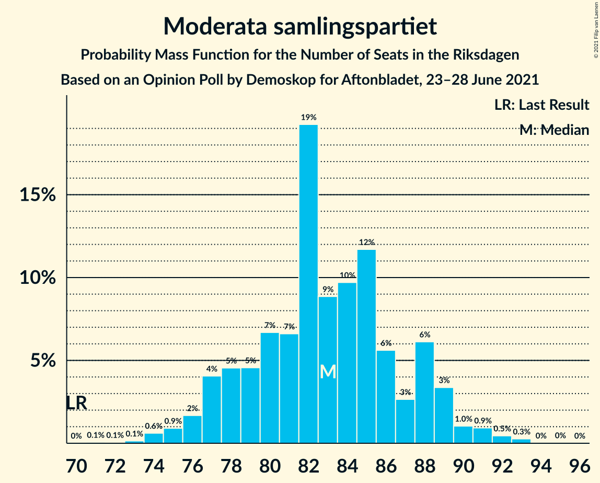
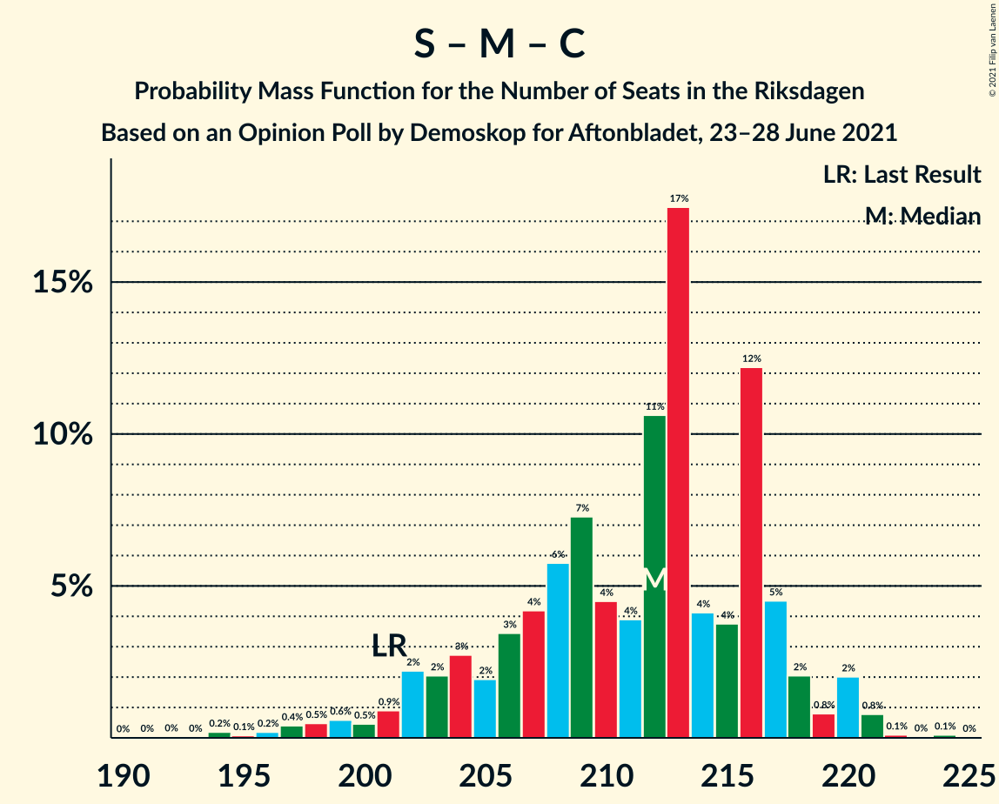
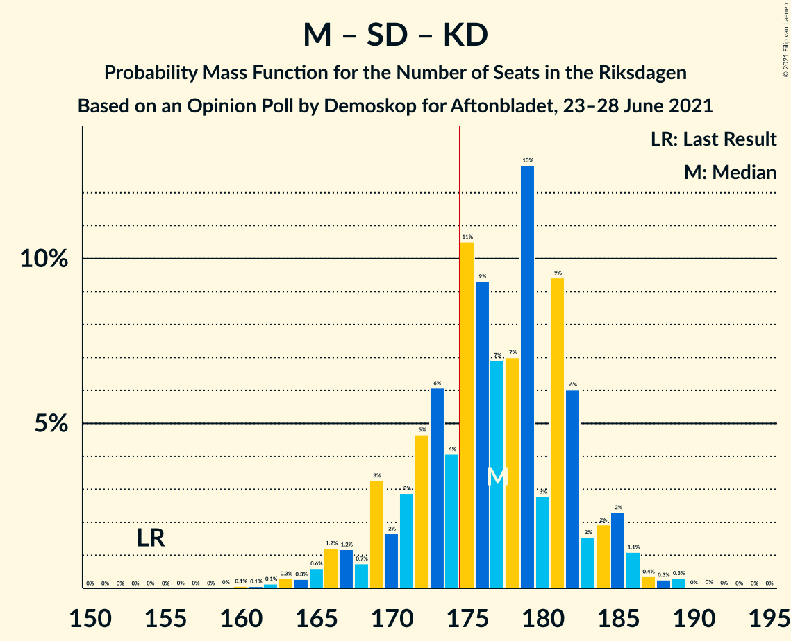
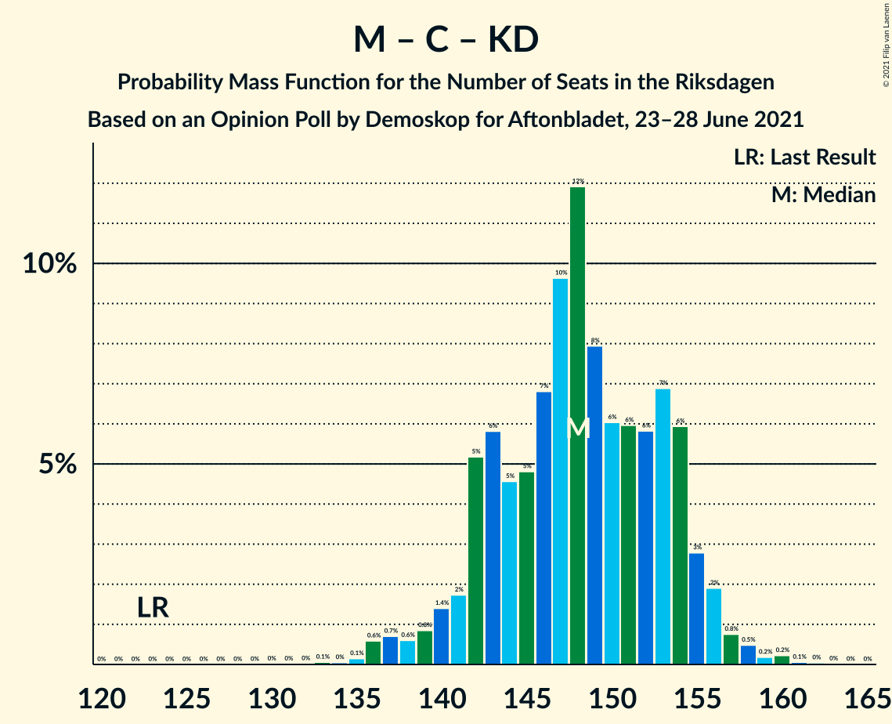
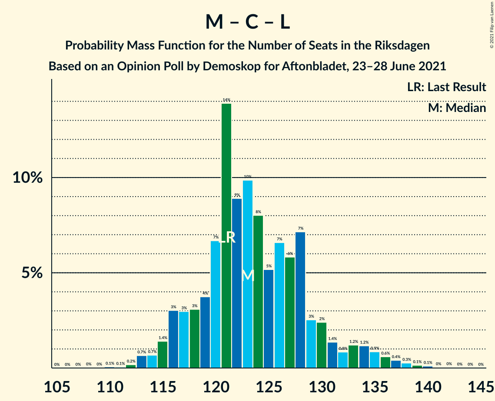

# Opinion Poll by Demoskop for Aftonbladet, 23–28 June 2021

<a href="#voting-intentions">Voting Intentions</a> | <a href="#seats">Seats</a> | <a href="#coalitions">Coalitions</a> | <a href="#technical-information">Technical Information</a>

## Voting Intentions

### Confidence Intervals

| Party | Last Result | Poll Result | 80% Confidence Interval | 90% Confidence Interval | 95% Confidence Interval | 99% Confidence Interval |
|:-----:|:-----------:|:-----------:|:-----------------------:|:-----------------------:|:-----------------------:|:-----------------------:|
| Sveriges socialdemokratiska arbetareparti | 28.3% | 23.4% | 22.3–24.6% |21.9–25.0% |21.7–25.3% |21.1–25.8% |
| Moderata samlingspartiet | 19.8% | 22.1% | 21.0–23.3% |20.7–23.6% |20.4–23.9% |19.9–24.5% |
| Sverigedemokraterna | 17.5% | 18.2% | 17.2–19.3% |16.9–19.6% |16.6–19.9% |16.1–20.4% |
| Vänsterpartiet | 8.0% | 11.3% | 10.5–12.2% |10.2–12.5% |10.0–12.7% |9.6–13.2% |
| Centerpartiet | 8.6% | 10.6% | 9.8–11.5% |9.6–11.8% |9.4–12.0% |9.0–12.4% |
| Kristdemokraterna | 6.3% | 6.8% | 6.1–7.5% |6.0–7.8% |5.8–8.0% |5.5–8.3% |
| Liberalerna | 5.5% | 3.4% | 2.9–4.0% |2.8–4.1% |2.7–4.3% |2.5–4.5% |
| Miljöpartiet de gröna | 4.4% | 3.3% | 2.9–3.9% |2.7–4.0% |2.6–4.2% |2.4–4.4% |

*Note:* The poll result column reflects the actual value used in the calculations. Published results may vary slightly, and in addition be rounded to fewer digits.

## Seats

### Confidence Intervals

| Party | Last Result | Median | 80% Confidence Interval | 90% Confidence Interval | 95% Confidence Interval | 99% Confidence Interval |
|:-----:|:-----------:|:------:|:-----------------------:|:-----------------------:|:-----------------------:|:-----------------------:|
| <a href="#sveriges-socialdemokratiska-arbetareparti">Sveriges socialdemokratiska arbetareparti</a> | 100 | 90 | 82–93 |81–95 |80–95 |78–96 |
| <a href="#moderata-samlingspartiet">Moderata samlingspartiet</a> | 70 | 83 | 78–87 |77–89 |76–91 |73–93 |
| <a href="#sverigedemokraterna">Sverigedemokraterna</a> | 62 | 68 | 64–73 |63–74 |62–75 |60–76 |
| <a href="#vänsterpartiet">Vänsterpartiet</a> | 28 | 42 | 38–47 |38–48 |37–49 |36–50 |
| <a href="#centerpartiet">Centerpartiet</a> | 31 | 39 | 36–43 |35–44 |34–45 |33–47 |
| <a href="#kristdemokraterna">Kristdemokraterna</a> | 22 | 26 | 23–29 |22–29 |21–30 |21–31 |
| <a href="#liberalerna">Liberalerna</a> | 20 | 0 | 0 |0–15 |0–16 |0–16 |
| <a href="#miljöpartiet-de-gröna">Miljöpartiet de gröna</a> | 16 | 0 | 0 |0–15 |0–15 |0–16 |

### Sveriges socialdemokratiska arbetareparti

*For a full overview of the results for this party, see the [Sveriges socialdemokratiska arbetareparti](party-sverigessocialdemokratiskaarbetareparti.html) page.*

| Number of Seats | Probability | Accumulated | Special Marks |
|:---------------:|:-----------:|:-----------:|:-------------:|
| 74 | 0.1% | 100% |  |
| 75 | 0.1% | 99.9% |  |
| 76 | 0.1% | 99.9% |  |
| 77 | 0.2% | 99.8% |  |
| 78 | 1.1% | 99.6% |  |
| 79 | 0.9% | 98% |  |
| 80 | 1.1% | 98% |  |
| 81 | 5% | 96% |  |
| 82 | 4% | 92% |  |
| 83 | 4% | 87% |  |
| 84 | 6% | 84% |  |
| 85 | 5% | 78% |  |
| 86 | 4% | 73% |  |
| 87 | 6% | 68% |  |
| 88 | 6% | 62% |  |
| 89 | 3% | 56% |  |
| 90 | 14% | 54% | Median |
| 91 | 17% | 40% |  |
| 92 | 4% | 23% |  |
| 93 | 9% | 19% |  |
| 94 | 3% | 9% |  |
| 95 | 4% | 6% |  |
| 96 | 2% | 2% |  |
| 97 | 0.1% | 0.2% |  |
| 98 | 0% | 0.1% |  |
| 99 | 0% | 0.1% |  |
| 100 | 0% | 0% | Last Result |

### Moderata samlingspartiet

*For a full overview of the results for this party, see the [Moderata samlingspartiet](party-moderatasamlingspartiet.html) page.*

| Number of Seats | Probability | Accumulated | Special Marks |
|:---------------:|:-----------:|:-----------:|:-------------:|
| 70 | 0% | 100% | Last Result |
| 71 | 0.1% | 100% |  |
| 72 | 0.1% | 99.9% |  |
| 73 | 0.3% | 99.7% |  |
| 74 | 0.5% | 99.4% |  |
| 75 | 1.1% | 98.9% |  |
| 76 | 2% | 98% |  |
| 77 | 3% | 96% |  |
| 78 | 8% | 93% |  |
| 79 | 8% | 85% |  |
| 80 | 8% | 77% |  |
| 81 | 5% | 70% |  |
| 82 | 8% | 64% |  |
| 83 | 17% | 56% | Median |
| 84 | 6% | 39% |  |
| 85 | 16% | 33% |  |
| 86 | 5% | 17% |  |
| 87 | 2% | 12% |  |
| 88 | 3% | 10% |  |
| 89 | 3% | 7% |  |
| 90 | 0.9% | 4% |  |
| 91 | 2% | 3% |  |
| 92 | 0.3% | 1.0% |  |
| 93 | 0.6% | 0.7% |  |
| 94 | 0% | 0.1% |  |
| 95 | 0% | 0% |  |

### Sverigedemokraterna

*For a full overview of the results for this party, see the [Sverigedemokraterna](party-sverigedemokraterna.html) page.*

| Number of Seats | Probability | Accumulated | Special Marks |
|:---------------:|:-----------:|:-----------:|:-------------:|
| 58 | 0.1% | 100% |  |
| 59 | 0.3% | 99.8% |  |
| 60 | 0.3% | 99.6% |  |
| 61 | 0.7% | 99.2% |  |
| 62 | 2% | 98% | Last Result |
| 63 | 4% | 97% |  |
| 64 | 5% | 93% |  |
| 65 | 7% | 88% |  |
| 66 | 8% | 81% |  |
| 67 | 10% | 73% |  |
| 68 | 16% | 63% | Median |
| 69 | 14% | 46% |  |
| 70 | 9% | 32% |  |
| 71 | 6% | 23% |  |
| 72 | 4% | 17% |  |
| 73 | 6% | 13% |  |
| 74 | 4% | 7% |  |
| 75 | 2% | 3% |  |
| 76 | 0.6% | 1.0% |  |
| 77 | 0.2% | 0.5% |  |
| 78 | 0.2% | 0.2% |  |
| 79 | 0% | 0.1% |  |
| 80 | 0% | 0% |  |

### Vänsterpartiet

*For a full overview of the results for this party, see the [Vänsterpartiet](party-vänsterpartiet.html) page.*

| Number of Seats | Probability | Accumulated | Special Marks |
|:---------------:|:-----------:|:-----------:|:-------------:|
| 28 | 0% | 100% | Last Result |
| 29 | 0% | 100% |  |
| 30 | 0% | 100% |  |
| 31 | 0% | 100% |  |
| 32 | 0% | 100% |  |
| 33 | 0% | 100% |  |
| 34 | 0.1% | 100% |  |
| 35 | 0.2% | 99.9% |  |
| 36 | 0.9% | 99.7% |  |
| 37 | 3% | 98.8% |  |
| 38 | 6% | 96% |  |
| 39 | 14% | 89% |  |
| 40 | 7% | 76% |  |
| 41 | 7% | 69% |  |
| 42 | 18% | 61% | Median |
| 43 | 10% | 43% |  |
| 44 | 8% | 33% |  |
| 45 | 10% | 26% |  |
| 46 | 4% | 16% |  |
| 47 | 4% | 12% |  |
| 48 | 5% | 8% |  |
| 49 | 2% | 3% |  |
| 50 | 1.1% | 1.1% |  |
| 51 | 0% | 0.1% |  |
| 52 | 0% | 0% |  |

### Centerpartiet

*For a full overview of the results for this party, see the [Centerpartiet](party-centerpartiet.html) page.*

| Number of Seats | Probability | Accumulated | Special Marks |
|:---------------:|:-----------:|:-----------:|:-------------:|
| 31 | 0.1% | 100% | Last Result |
| 32 | 0.1% | 99.9% |  |
| 33 | 0.6% | 99.8% |  |
| 34 | 2% | 99.2% |  |
| 35 | 5% | 97% |  |
| 36 | 4% | 92% |  |
| 37 | 10% | 89% |  |
| 38 | 24% | 78% |  |
| 39 | 6% | 54% | Median |
| 40 | 10% | 48% |  |
| 41 | 16% | 38% |  |
| 42 | 9% | 22% |  |
| 43 | 6% | 14% |  |
| 44 | 4% | 8% |  |
| 45 | 2% | 4% |  |
| 46 | 0.7% | 2% |  |
| 47 | 0.5% | 0.9% |  |
| 48 | 0.3% | 0.4% |  |
| 49 | 0.1% | 0.1% |  |
| 50 | 0% | 0% |  |

### Kristdemokraterna

*For a full overview of the results for this party, see the [Kristdemokraterna](party-kristdemokraterna.html) page.*

| Number of Seats | Probability | Accumulated | Special Marks |
|:---------------:|:-----------:|:-----------:|:-------------:|
| 19 | 0.1% | 100% |  |
| 20 | 0.3% | 99.9% |  |
| 21 | 2% | 99.6% |  |
| 22 | 5% | 97% | Last Result |
| 23 | 10% | 92% |  |
| 24 | 8% | 82% |  |
| 25 | 19% | 75% |  |
| 26 | 18% | 56% | Median |
| 27 | 21% | 38% |  |
| 28 | 7% | 17% |  |
| 29 | 7% | 11% |  |
| 30 | 3% | 4% |  |
| 31 | 0.8% | 1.2% |  |
| 32 | 0.3% | 0.4% |  |
| 33 | 0.1% | 0.1% |  |
| 34 | 0% | 0% |  |

### Liberalerna

*For a full overview of the results for this party, see the [Liberalerna](party-liberalerna.html) page.*

| Number of Seats | Probability | Accumulated | Special Marks |
|:---------------:|:-----------:|:-----------:|:-------------:|
| 0 | 93% | 100% | Median |
| 1 | 0% | 7% |  |
| 2 | 0% | 7% |  |
| 3 | 0% | 7% |  |
| 4 | 0% | 7% |  |
| 5 | 0% | 7% |  |
| 6 | 0% | 7% |  |
| 7 | 0% | 7% |  |
| 8 | 0% | 7% |  |
| 9 | 0% | 7% |  |
| 10 | 0% | 7% |  |
| 11 | 0% | 7% |  |
| 12 | 0% | 7% |  |
| 13 | 0% | 7% |  |
| 14 | 0.1% | 7% |  |
| 15 | 4% | 7% |  |
| 16 | 2% | 3% |  |
| 17 | 0.4% | 0.4% |  |
| 18 | 0.1% | 0.1% |  |
| 19 | 0% | 0% |  |
| 20 | 0% | 0% | Last Result |

### Miljöpartiet de gröna

*For a full overview of the results for this party, see the [Miljöpartiet de gröna](party-miljöpartietdegröna.html) page.*

| Number of Seats | Probability | Accumulated | Special Marks |
|:---------------:|:-----------:|:-----------:|:-------------:|
| 0 | 93% | 100% | Median |
| 1 | 0% | 7% |  |
| 2 | 0% | 7% |  |
| 3 | 0% | 7% |  |
| 4 | 0% | 7% |  |
| 5 | 0% | 7% |  |
| 6 | 0% | 7% |  |
| 7 | 0% | 7% |  |
| 8 | 0% | 7% |  |
| 9 | 0% | 7% |  |
| 10 | 0% | 7% |  |
| 11 | 0% | 7% |  |
| 12 | 0% | 7% |  |
| 13 | 0% | 7% |  |
| 14 | 0.1% | 7% |  |
| 15 | 6% | 7% |  |
| 16 | 1.0% | 1.2% | Last Result |
| 17 | 0.2% | 0.3% |  |
| 18 | 0% | 0% |  |

## Coalitions

### Confidence Intervals

| Coalition | Last Result | Median | Majority? | 80% Confidence Interval | 90% Confidence Interval | 95% Confidence Interval | 99% Confidence Interval |
|:---------:|:-----------:|:------:|:---------:|:-----------------------:|:-----------------------:|:-----------------------:|:-----------------------:|
| Sveriges socialdemokratiska arbetareparti – Moderata samlingspartiet – Centerpartiet | 201 | 211 | 100% | 204–217 | 203–219 | 200–220 | 194–221 |
| Moderata samlingspartiet – Sverigedemokraterna – Kristdemokraterna | 154 | 178 | 70% | 171–182 | 169–184 | 166–186 | 162–188 |
| Sveriges socialdemokratiska arbetareparti – Vänsterpartiet – Centerpartiet – Liberalerna – Miljöpartiet de gröna | 195 | 171 | 30% | 167–178 | 165–180 | 163–183 | 161–187 |
| Sveriges socialdemokratiska arbetareparti – Moderata samlingspartiet | 170 | 172 | 27% | 165–178 | 163–179 | 160–180 | 156–181 |
| Moderata samlingspartiet – Sverigedemokraterna | 132 | 151 | 0% | 145–157 | 143–158 | 142–159 | 138–162 |
| Moderata samlingspartiet – Centerpartiet – Kristdemokraterna – Liberalerna | 143 | 148 | 0% | 142–156 | 141–157 | 140–159 | 137–163 |
| Moderata samlingspartiet – Centerpartiet – Kristdemokraterna | 123 | 148 | 0% | 142–154 | 140–156 | 138–157 | 137–159 |
| Sveriges socialdemokratiska arbetareparti – Centerpartiet – Liberalerna – Miljöpartiet de gröna | 167 | 129 | 0% | 123–138 | 122–140 | 122–142 | 118–146 |
| Sveriges socialdemokratiska arbetareparti – Vänsterpartiet – Miljöpartiet de gröna | 144 | 132 | 0% | 126–139 | 124–140 | 122–142 | 120–146 |
| Sveriges socialdemokratiska arbetareparti – Vänsterpartiet | 128 | 131 | 0% | 125–136 | 124–138 | 122–140 | 119–141 |
| Moderata samlingspartiet – Centerpartiet – Liberalerna | 121 | 122 | 0% | 116–130 | 116–131 | 115–133 | 113–138 |
| Moderata samlingspartiet – Centerpartiet | 101 | 122 | 0% | 116–128 | 115–130 | 114–131 | 112–132 |
| Sveriges socialdemokratiska arbetareparti – Miljöpartiet de gröna | 116 | 90 | 0% | 82–95 | 81–101 | 80–102 | 78–106 |

### Sveriges socialdemokratiska arbetareparti – Moderata samlingspartiet – Centerpartiet

| Number of Seats | Probability | Accumulated | Special Marks |
|:---------------:|:-----------:|:-----------:|:-------------:|
| 190 | 0% | 100% |  |
| 191 | 0% | 99.9% |  |
| 192 | 0.1% | 99.9% |  |
| 193 | 0% | 99.8% |  |
| 194 | 0.4% | 99.8% |  |
| 195 | 0.1% | 99.5% |  |
| 196 | 0.4% | 99.3% |  |
| 197 | 0.2% | 98.9% |  |
| 198 | 0.7% | 98.8% |  |
| 199 | 0.5% | 98% |  |
| 200 | 0.7% | 98% |  |
| 201 | 0.6% | 97% | Last Result |
| 202 | 1.2% | 96% |  |
| 203 | 5% | 95% |  |
| 204 | 4% | 90% |  |
| 205 | 2% | 86% |  |
| 206 | 4% | 84% |  |
| 207 | 9% | 81% |  |
| 208 | 8% | 71% |  |
| 209 | 5% | 64% |  |
| 210 | 5% | 59% |  |
| 211 | 5% | 54% |  |
| 212 | 15% | 49% | Median |
| 213 | 7% | 33% |  |
| 214 | 2% | 27% |  |
| 215 | 4% | 25% |  |
| 216 | 11% | 21% |  |
| 217 | 3% | 10% |  |
| 218 | 3% | 8% |  |
| 219 | 0.7% | 5% |  |
| 220 | 3% | 4% |  |
| 221 | 1.4% | 2% |  |
| 222 | 0.2% | 0.3% |  |
| 223 | 0.1% | 0.2% |  |
| 224 | 0.1% | 0.1% |  |
| 225 | 0% | 0.1% |  |
| 226 | 0% | 0% |  |

### Moderata samlingspartiet – Sverigedemokraterna – Kristdemokraterna

| Number of Seats | Probability | Accumulated | Special Marks |
|:---------------:|:-----------:|:-----------:|:-------------:|
| 154 | 0% | 100% | Last Result |
| 155 | 0% | 100% |  |
| 156 | 0% | 100% |  |
| 157 | 0% | 100% |  |
| 158 | 0% | 100% |  |
| 159 | 0.1% | 100% |  |
| 160 | 0% | 99.9% |  |
| 161 | 0.1% | 99.9% |  |
| 162 | 0.4% | 99.8% |  |
| 163 | 0.3% | 99.4% |  |
| 164 | 0.4% | 99.1% |  |
| 165 | 0.8% | 98.6% |  |
| 166 | 0.9% | 98% |  |
| 167 | 0.5% | 97% |  |
| 168 | 0.9% | 96% |  |
| 169 | 3% | 96% |  |
| 170 | 2% | 93% |  |
| 171 | 6% | 91% |  |
| 172 | 5% | 84% |  |
| 173 | 4% | 79% |  |
| 174 | 6% | 76% |  |
| 175 | 5% | 70% | Majority |
| 176 | 6% | 64% |  |
| 177 | 4% | 58% | Median |
| 178 | 16% | 54% |  |
| 179 | 13% | 38% |  |
| 180 | 5% | 24% |  |
| 181 | 8% | 19% |  |
| 182 | 3% | 11% |  |
| 183 | 2% | 8% |  |
| 184 | 2% | 6% |  |
| 185 | 2% | 4% |  |
| 186 | 1.2% | 3% |  |
| 187 | 0.6% | 1.5% |  |
| 188 | 0.5% | 0.8% |  |
| 189 | 0.2% | 0.3% |  |
| 190 | 0% | 0.1% |  |
| 191 | 0% | 0.1% |  |
| 192 | 0% | 0% |  |

### Sveriges socialdemokratiska arbetareparti – Vänsterpartiet – Centerpartiet – Liberalerna – Miljöpartiet de gröna

| Number of Seats | Probability | Accumulated | Special Marks |
|:---------------:|:-----------:|:-----------:|:-------------:|
| 158 | 0% | 100% |  |
| 159 | 0% | 99.9% |  |
| 160 | 0.2% | 99.9% |  |
| 161 | 0.5% | 99.7% |  |
| 162 | 0.6% | 99.2% |  |
| 163 | 1.2% | 98.5% |  |
| 164 | 2% | 97% |  |
| 165 | 2% | 96% |  |
| 166 | 2% | 94% |  |
| 167 | 3% | 92% |  |
| 168 | 8% | 89% |  |
| 169 | 5% | 81% |  |
| 170 | 13% | 76% |  |
| 171 | 16% | 62% | Median |
| 172 | 4% | 46% |  |
| 173 | 6% | 42% |  |
| 174 | 5% | 36% |  |
| 175 | 6% | 30% | Majority |
| 176 | 4% | 24% |  |
| 177 | 5% | 21% |  |
| 178 | 6% | 16% |  |
| 179 | 2% | 9% |  |
| 180 | 3% | 7% |  |
| 181 | 0.9% | 4% |  |
| 182 | 0.5% | 4% |  |
| 183 | 0.9% | 3% |  |
| 184 | 0.8% | 2% |  |
| 185 | 0.4% | 1.4% |  |
| 186 | 0.3% | 0.9% |  |
| 187 | 0.4% | 0.6% |  |
| 188 | 0.1% | 0.2% |  |
| 189 | 0% | 0.1% |  |
| 190 | 0.1% | 0.1% |  |
| 191 | 0% | 0% |  |
| 192 | 0% | 0% |  |
| 193 | 0% | 0% |  |
| 194 | 0% | 0% |  |
| 195 | 0% | 0% | Last Result |

### Sveriges socialdemokratiska arbetareparti – Moderata samlingspartiet

| Number of Seats | Probability | Accumulated | Special Marks |
|:---------------:|:-----------:|:-----------:|:-------------:|
| 151 | 0% | 100% |  |
| 152 | 0% | 99.9% |  |
| 153 | 0% | 99.9% |  |
| 154 | 0.1% | 99.9% |  |
| 155 | 0.2% | 99.7% |  |
| 156 | 0.3% | 99.6% |  |
| 157 | 0.3% | 99.3% |  |
| 158 | 0.3% | 99.0% |  |
| 159 | 0.5% | 98.7% |  |
| 160 | 0.9% | 98% |  |
| 161 | 1.4% | 97% |  |
| 162 | 0.9% | 96% |  |
| 163 | 1.2% | 95% |  |
| 164 | 3% | 94% |  |
| 165 | 7% | 90% |  |
| 166 | 7% | 84% |  |
| 167 | 4% | 77% |  |
| 168 | 3% | 72% |  |
| 169 | 7% | 70% |  |
| 170 | 7% | 62% | Last Result |
| 171 | 3% | 56% |  |
| 172 | 7% | 53% |  |
| 173 | 6% | 46% | Median |
| 174 | 14% | 40% |  |
| 175 | 11% | 27% | Majority |
| 176 | 2% | 16% |  |
| 177 | 4% | 14% |  |
| 178 | 3% | 10% |  |
| 179 | 4% | 7% |  |
| 180 | 1.0% | 3% |  |
| 181 | 1.1% | 2% |  |
| 182 | 0.3% | 0.4% |  |
| 183 | 0.1% | 0.2% |  |
| 184 | 0% | 0.1% |  |
| 185 | 0% | 0% |  |

### Moderata samlingspartiet – Sverigedemokraterna

| Number of Seats | Probability | Accumulated | Special Marks |
|:---------------:|:-----------:|:-----------:|:-------------:|
| 132 | 0% | 100% | Last Result |
| 133 | 0% | 100% |  |
| 134 | 0% | 100% |  |
| 135 | 0.1% | 100% |  |
| 136 | 0.1% | 99.9% |  |
| 137 | 0.1% | 99.8% |  |
| 138 | 0.4% | 99.6% |  |
| 139 | 0.5% | 99.3% |  |
| 140 | 0.5% | 98.8% |  |
| 141 | 0.4% | 98% |  |
| 142 | 1.4% | 98% |  |
| 143 | 2% | 96% |  |
| 144 | 3% | 95% |  |
| 145 | 5% | 92% |  |
| 146 | 5% | 87% |  |
| 147 | 4% | 82% |  |
| 148 | 4% | 79% |  |
| 149 | 11% | 75% |  |
| 150 | 4% | 64% |  |
| 151 | 18% | 60% | Median |
| 152 | 2% | 41% |  |
| 153 | 11% | 39% |  |
| 154 | 7% | 29% |  |
| 155 | 7% | 21% |  |
| 156 | 2% | 14% |  |
| 157 | 4% | 12% |  |
| 158 | 4% | 8% |  |
| 159 | 2% | 4% |  |
| 160 | 0.5% | 2% |  |
| 161 | 1.0% | 2% |  |
| 162 | 0.2% | 0.6% |  |
| 163 | 0.2% | 0.4% |  |
| 164 | 0.1% | 0.1% |  |
| 165 | 0% | 0.1% |  |
| 166 | 0% | 0.1% |  |
| 167 | 0% | 0% |  |

### Moderata samlingspartiet – Centerpartiet – Kristdemokraterna – Liberalerna

| Number of Seats | Probability | Accumulated | Special Marks |
|:---------------:|:-----------:|:-----------:|:-------------:|
| 133 | 0% | 100% |  |
| 134 | 0% | 99.9% |  |
| 135 | 0.1% | 99.9% |  |
| 136 | 0.1% | 99.8% |  |
| 137 | 0.7% | 99.7% |  |
| 138 | 0.2% | 99.0% |  |
| 139 | 0.3% | 98.8% |  |
| 140 | 1.4% | 98% |  |
| 141 | 2% | 97% |  |
| 142 | 10% | 95% |  |
| 143 | 2% | 85% | Last Result |
| 144 | 2% | 83% |  |
| 145 | 4% | 81% |  |
| 146 | 9% | 77% |  |
| 147 | 5% | 68% |  |
| 148 | 15% | 63% | Median |
| 149 | 4% | 48% |  |
| 150 | 5% | 44% |  |
| 151 | 10% | 39% |  |
| 152 | 5% | 29% |  |
| 153 | 7% | 23% |  |
| 154 | 3% | 17% |  |
| 155 | 3% | 14% |  |
| 156 | 6% | 11% |  |
| 157 | 2% | 6% |  |
| 158 | 1.0% | 4% |  |
| 159 | 0.6% | 3% |  |
| 160 | 0.5% | 2% |  |
| 161 | 0.9% | 2% |  |
| 162 | 0.2% | 0.8% |  |
| 163 | 0.3% | 0.6% |  |
| 164 | 0.2% | 0.4% |  |
| 165 | 0% | 0.1% |  |
| 166 | 0% | 0.1% |  |
| 167 | 0% | 0.1% |  |
| 168 | 0.1% | 0.1% |  |
| 169 | 0% | 0% |  |

### Moderata samlingspartiet – Centerpartiet – Kristdemokraterna

| Number of Seats | Probability | Accumulated | Special Marks |
|:---------------:|:-----------:|:-----------:|:-------------:|
| 123 | 0% | 100% | Last Result |
| 124 | 0% | 100% |  |
| 125 | 0% | 100% |  |
| 126 | 0% | 100% |  |
| 127 | 0% | 100% |  |
| 128 | 0% | 100% |  |
| 129 | 0% | 100% |  |
| 130 | 0% | 100% |  |
| 131 | 0% | 100% |  |
| 132 | 0% | 99.9% |  |
| 133 | 0.1% | 99.9% |  |
| 134 | 0% | 99.9% |  |
| 135 | 0.2% | 99.8% |  |
| 136 | 0.1% | 99.6% |  |
| 137 | 1.1% | 99.5% |  |
| 138 | 2% | 98% |  |
| 139 | 0.7% | 97% |  |
| 140 | 2% | 96% |  |
| 141 | 3% | 94% |  |
| 142 | 10% | 91% |  |
| 143 | 2% | 81% |  |
| 144 | 3% | 78% |  |
| 145 | 4% | 76% |  |
| 146 | 9% | 71% |  |
| 147 | 5% | 62% |  |
| 148 | 15% | 57% | Median |
| 149 | 4% | 42% |  |
| 150 | 5% | 37% |  |
| 151 | 10% | 33% |  |
| 152 | 5% | 23% |  |
| 153 | 5% | 17% |  |
| 154 | 2% | 12% |  |
| 155 | 2% | 10% |  |
| 156 | 5% | 7% |  |
| 157 | 2% | 3% |  |
| 158 | 0.5% | 1.1% |  |
| 159 | 0.2% | 0.6% |  |
| 160 | 0.2% | 0.3% |  |
| 161 | 0.1% | 0.1% |  |
| 162 | 0% | 0% |  |

### Sveriges socialdemokratiska arbetareparti – Centerpartiet – Liberalerna – Miljöpartiet de gröna

| Number of Seats | Probability | Accumulated | Special Marks |
|:---------------:|:-----------:|:-----------:|:-------------:|
| 116 | 0.2% | 100% |  |
| 117 | 0.1% | 99.8% |  |
| 118 | 0.4% | 99.7% |  |
| 119 | 0.2% | 99.3% |  |
| 120 | 0.7% | 99.1% |  |
| 121 | 0.6% | 98% |  |
| 122 | 5% | 98% |  |
| 123 | 5% | 93% |  |
| 124 | 2% | 88% |  |
| 125 | 5% | 86% |  |
| 126 | 2% | 80% |  |
| 127 | 6% | 78% |  |
| 128 | 13% | 71% |  |
| 129 | 15% | 59% | Median |
| 130 | 1.3% | 44% |  |
| 131 | 12% | 43% |  |
| 132 | 6% | 31% |  |
| 133 | 4% | 25% |  |
| 134 | 4% | 21% |  |
| 135 | 1.5% | 17% |  |
| 136 | 3% | 16% |  |
| 137 | 2% | 13% |  |
| 138 | 2% | 11% |  |
| 139 | 0.9% | 9% |  |
| 140 | 4% | 8% |  |
| 141 | 0.2% | 4% |  |
| 142 | 1.4% | 4% |  |
| 143 | 0.5% | 2% |  |
| 144 | 0.3% | 2% |  |
| 145 | 0.9% | 1.4% |  |
| 146 | 0.1% | 0.5% |  |
| 147 | 0.3% | 0.4% |  |
| 148 | 0% | 0.1% |  |
| 149 | 0% | 0.1% |  |
| 150 | 0% | 0.1% |  |
| 151 | 0% | 0.1% |  |
| 152 | 0% | 0% |  |
| 153 | 0% | 0% |  |
| 154 | 0% | 0% |  |
| 155 | 0% | 0% |  |
| 156 | 0% | 0% |  |
| 157 | 0% | 0% |  |
| 158 | 0% | 0% |  |
| 159 | 0% | 0% |  |
| 160 | 0% | 0% |  |
| 161 | 0% | 0% |  |
| 162 | 0% | 0% |  |
| 163 | 0% | 0% |  |
| 164 | 0% | 0% |  |
| 165 | 0% | 0% |  |
| 166 | 0% | 0% |  |
| 167 | 0% | 0% | Last Result |

### Sveriges socialdemokratiska arbetareparti – Vänsterpartiet – Miljöpartiet de gröna

| Number of Seats | Probability | Accumulated | Special Marks |
|:---------------:|:-----------:|:-----------:|:-------------:|
| 117 | 0.1% | 100% |  |
| 118 | 0.1% | 99.9% |  |
| 119 | 0.2% | 99.8% |  |
| 120 | 0.1% | 99.6% |  |
| 121 | 0.9% | 99.5% |  |
| 122 | 1.2% | 98.6% |  |
| 123 | 0.8% | 97% |  |
| 124 | 3% | 97% |  |
| 125 | 3% | 94% |  |
| 126 | 5% | 91% |  |
| 127 | 4% | 86% |  |
| 128 | 3% | 82% |  |
| 129 | 17% | 79% |  |
| 130 | 5% | 62% |  |
| 131 | 3% | 57% |  |
| 132 | 5% | 54% | Median |
| 133 | 18% | 49% |  |
| 134 | 5% | 31% |  |
| 135 | 4% | 26% |  |
| 136 | 6% | 22% |  |
| 137 | 2% | 15% |  |
| 138 | 4% | 14% |  |
| 139 | 2% | 10% |  |
| 140 | 5% | 8% |  |
| 141 | 0.5% | 3% |  |
| 142 | 0.4% | 3% |  |
| 143 | 0.9% | 2% |  |
| 144 | 0.4% | 1.2% | Last Result |
| 145 | 0.1% | 0.8% |  |
| 146 | 0.5% | 0.7% |  |
| 147 | 0.1% | 0.3% |  |
| 148 | 0.1% | 0.2% |  |
| 149 | 0% | 0.1% |  |
| 150 | 0% | 0.1% |  |
| 151 | 0% | 0% |  |

### Sveriges socialdemokratiska arbetareparti – Vänsterpartiet

| Number of Seats | Probability | Accumulated | Special Marks |
|:---------------:|:-----------:|:-----------:|:-------------:|
| 114 | 0% | 100% |  |
| 115 | 0% | 99.9% |  |
| 116 | 0% | 99.9% |  |
| 117 | 0.1% | 99.9% |  |
| 118 | 0.1% | 99.8% |  |
| 119 | 0.2% | 99.6% |  |
| 120 | 0.2% | 99.4% |  |
| 121 | 1.3% | 99.1% |  |
| 122 | 1.4% | 98% |  |
| 123 | 1.5% | 97% |  |
| 124 | 3% | 95% |  |
| 125 | 6% | 92% |  |
| 126 | 5% | 86% |  |
| 127 | 4% | 81% |  |
| 128 | 4% | 77% | Last Result |
| 129 | 18% | 73% |  |
| 130 | 5% | 55% |  |
| 131 | 3% | 50% |  |
| 132 | 5% | 47% | Median |
| 133 | 18% | 42% |  |
| 134 | 5% | 24% |  |
| 135 | 4% | 19% |  |
| 136 | 6% | 15% |  |
| 137 | 1.3% | 9% |  |
| 138 | 3% | 8% |  |
| 139 | 2% | 5% |  |
| 140 | 2% | 3% |  |
| 141 | 0.2% | 0.7% |  |
| 142 | 0.3% | 0.5% |  |
| 143 | 0.1% | 0.1% |  |
| 144 | 0% | 0.1% |  |
| 145 | 0% | 0% |  |

### Moderata samlingspartiet – Centerpartiet – Liberalerna

| Number of Seats | Probability | Accumulated | Special Marks |
|:---------------:|:-----------:|:-----------:|:-------------:|
| 108 | 0.1% | 100% |  |
| 109 | 0% | 99.9% |  |
| 110 | 0.1% | 99.9% |  |
| 111 | 0.1% | 99.8% |  |
| 112 | 0.2% | 99.7% |  |
| 113 | 0.4% | 99.6% |  |
| 114 | 0.4% | 99.1% |  |
| 115 | 3% | 98.7% |  |
| 116 | 9% | 96% |  |
| 117 | 5% | 87% |  |
| 118 | 1.2% | 82% |  |
| 119 | 4% | 81% |  |
| 120 | 4% | 77% |  |
| 121 | 16% | 72% | Last Result |
| 122 | 7% | 57% | Median |
| 123 | 6% | 50% |  |
| 124 | 3% | 43% |  |
| 125 | 5% | 41% |  |
| 126 | 11% | 35% |  |
| 127 | 6% | 25% |  |
| 128 | 4% | 19% |  |
| 129 | 2% | 15% |  |
| 130 | 4% | 12% |  |
| 131 | 4% | 8% |  |
| 132 | 1.2% | 4% |  |
| 133 | 0.7% | 3% |  |
| 134 | 0.5% | 2% |  |
| 135 | 0.3% | 2% |  |
| 136 | 0.3% | 2% |  |
| 137 | 0.5% | 1.2% |  |
| 138 | 0.4% | 0.7% |  |
| 139 | 0.1% | 0.4% |  |
| 140 | 0.1% | 0.3% |  |
| 141 | 0% | 0.1% |  |
| 142 | 0% | 0.1% |  |
| 143 | 0.1% | 0.1% |  |
| 144 | 0% | 0% |  |

### Moderata samlingspartiet – Centerpartiet

| Number of Seats | Probability | Accumulated | Special Marks |
|:---------------:|:-----------:|:-----------:|:-------------:|
| 101 | 0% | 100% | Last Result |
| 102 | 0% | 100% |  |
| 103 | 0% | 100% |  |
| 104 | 0% | 100% |  |
| 105 | 0% | 100% |  |
| 106 | 0% | 100% |  |
| 107 | 0% | 100% |  |
| 108 | 0.1% | 99.9% |  |
| 109 | 0.1% | 99.9% |  |
| 110 | 0.1% | 99.8% |  |
| 111 | 0.2% | 99.7% |  |
| 112 | 0.3% | 99.5% |  |
| 113 | 0.9% | 99.2% |  |
| 114 | 1.1% | 98% |  |
| 115 | 4% | 97% |  |
| 116 | 10% | 93% |  |
| 117 | 5% | 83% |  |
| 118 | 2% | 78% |  |
| 119 | 4% | 76% |  |
| 120 | 5% | 72% |  |
| 121 | 16% | 67% |  |
| 122 | 8% | 51% | Median |
| 123 | 6% | 43% |  |
| 124 | 3% | 37% |  |
| 125 | 5% | 34% |  |
| 126 | 11% | 29% |  |
| 127 | 6% | 18% |  |
| 128 | 4% | 13% |  |
| 129 | 2% | 8% |  |
| 130 | 3% | 7% |  |
| 131 | 3% | 4% |  |
| 132 | 0.8% | 1.2% |  |
| 133 | 0.1% | 0.4% |  |
| 134 | 0% | 0.2% |  |
| 135 | 0.1% | 0.2% |  |
| 136 | 0.1% | 0.1% |  |
| 137 | 0% | 0% |  |

### Sveriges socialdemokratiska arbetareparti – Miljöpartiet de gröna

| Number of Seats | Probability | Accumulated | Special Marks |
|:---------------:|:-----------:|:-----------:|:-------------:|
| 76 | 0.1% | 100% |  |
| 77 | 0.1% | 99.9% |  |
| 78 | 0.9% | 99.8% |  |
| 79 | 0.6% | 98.8% |  |
| 80 | 1.0% | 98% |  |
| 81 | 5% | 97% |  |
| 82 | 4% | 93% |  |
| 83 | 3% | 88% |  |
| 84 | 6% | 85% |  |
| 85 | 4% | 79% |  |
| 86 | 4% | 75% |  |
| 87 | 3% | 71% |  |
| 88 | 5% | 68% |  |
| 89 | 3% | 62% |  |
| 90 | 13% | 60% | Median |
| 91 | 17% | 46% |  |
| 92 | 4% | 29% |  |
| 93 | 10% | 25% |  |
| 94 | 3% | 16% |  |
| 95 | 4% | 12% |  |
| 96 | 2% | 8% |  |
| 97 | 0.2% | 6% |  |
| 98 | 0.2% | 6% |  |
| 99 | 0.1% | 6% |  |
| 100 | 0.6% | 6% |  |
| 101 | 0.5% | 5% |  |
| 102 | 3% | 5% |  |
| 103 | 0.8% | 2% |  |
| 104 | 0.1% | 1.1% |  |
| 105 | 0.4% | 1.0% |  |
| 106 | 0.5% | 0.6% |  |
| 107 | 0.1% | 0.1% |  |
| 108 | 0% | 0% |  |
| 109 | 0% | 0% |  |
| 110 | 0% | 0% |  |
| 111 | 0% | 0% |  |
| 112 | 0% | 0% |  |
| 113 | 0% | 0% |  |
| 114 | 0% | 0% |  |
| 115 | 0% | 0% |  |
| 116 | 0% | 0% | Last Result |

## Technical Information

### Opinion Poll

+ **Polling firm:** Demoskop
+ **Commissioner(s):** Aftonbladet
+ **Fieldwork period:** 23–28 June 2021

### Calculations

+ **Sample size:** 2148
+ **Simulations done:** 262,144
+ **Error estimate:** 0.78%

