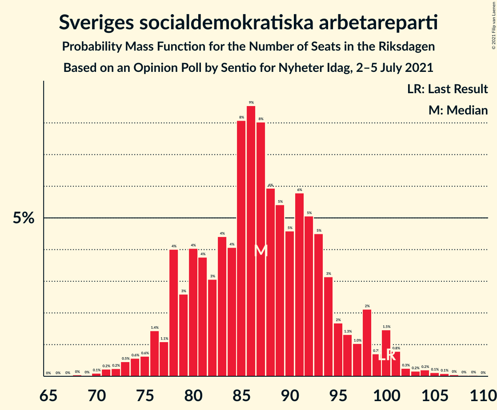
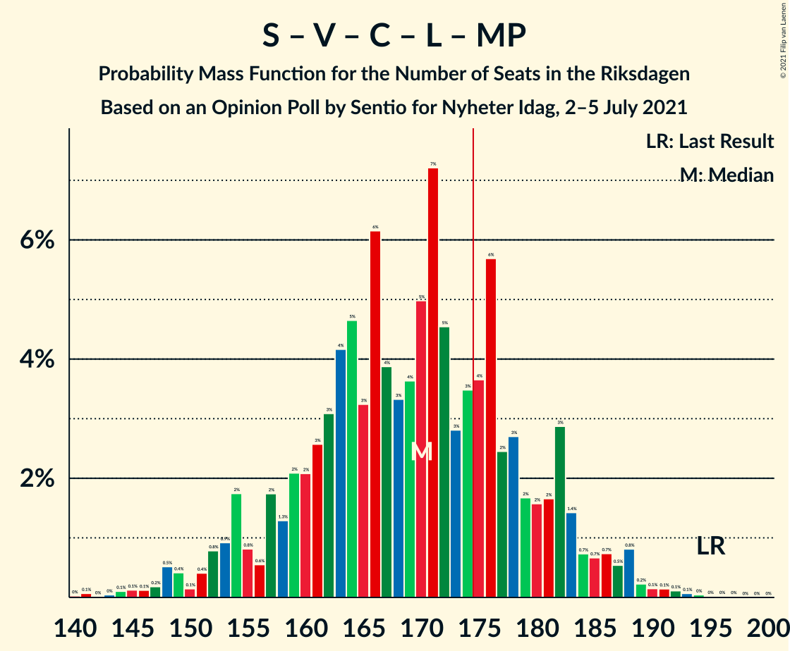
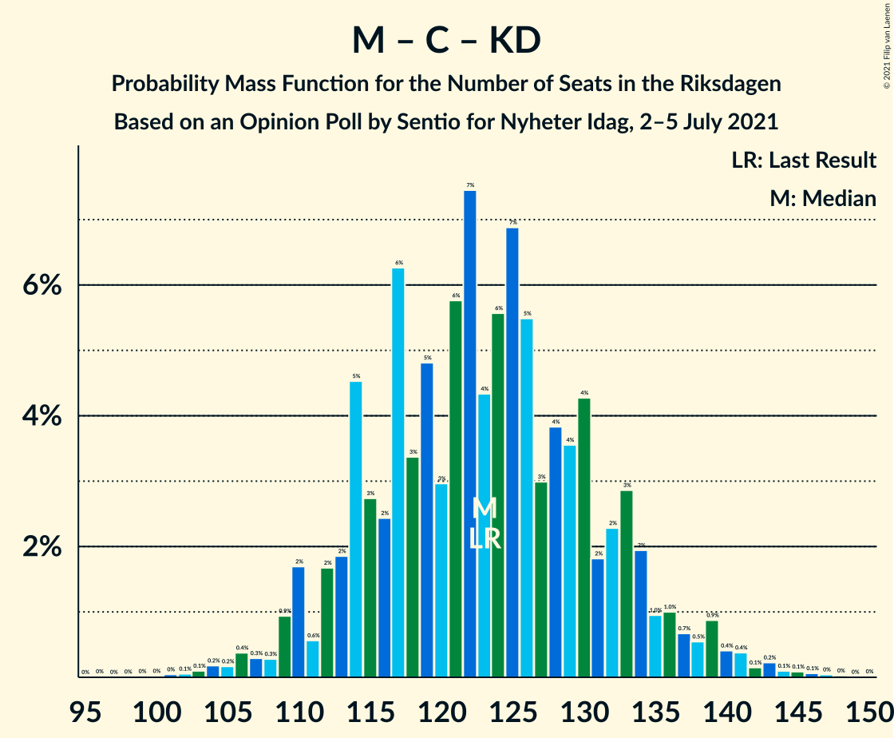

# Opinion Poll by Sentio for Nyheter Idag, 2–5 July 2021

<a href="#voting-intentions">Voting Intentions</a> | <a href="#seats">Seats</a> | <a href="#coalitions">Coalitions</a> | <a href="#technical-information">Technical Information</a>

## Voting Intentions

### Confidence Intervals

| Party | Last Result | Poll Result | 80% Confidence Interval | 90% Confidence Interval | 95% Confidence Interval | 99% Confidence Interval |
|:-----:|:-----------:|:-----------:|:-----------------------:|:-----------------------:|:-----------------------:|:-----------------------:|
| Sveriges socialdemokratiska arbetareparti | 28.3% | 23.8% | 22.0–25.9% |21.4–26.4% |21.0–26.9% |20.1–27.9% |
| Sverigedemokraterna | 17.5% | 21.9% | 20.1–23.9% |19.6–24.5% |19.2–25.0% |18.3–25.9% |
| Moderata samlingspartiet | 19.8% | 21.0% | 19.3–23.0% |18.8–23.5% |18.3–24.0% |17.5–25.0% |
| Vänsterpartiet | 8.0% | 10.3% | 9.0–11.8% |8.6–12.2% |8.3–12.6% |7.8–13.4% |
| Centerpartiet | 8.6% | 6.3% | 5.3–7.6% |5.1–8.0% |4.8–8.3% |4.4–8.9% |
| Kristdemokraterna | 6.3% | 6.1% | 5.1–7.3% |4.8–7.7% |4.6–8.0% |4.2–8.6% |
| Liberalerna | 5.5% | 4.3% | 3.5–5.4% |3.3–5.7% |3.1–6.0% |2.8–6.5% |
| Miljöpartiet de gröna | 4.4% | 4.3% | 3.5–5.4% |3.3–5.7% |3.1–6.0% |2.8–6.5% |

*Note:* The poll result column reflects the actual value used in the calculations. Published results may vary slightly, and in addition be rounded to fewer digits.

## Seats

### Confidence Intervals

| Party | Last Result | Median | 80% Confidence Interval | 90% Confidence Interval | 95% Confidence Interval | 99% Confidence Interval |
|:-----:|:-----------:|:------:|:-----------------------:|:-----------------------:|:-----------------------:|:-----------------------:|
| <a href="#sveriges-socialdemokratiska-arbetareparti">Sveriges socialdemokratiska arbetareparti</a> | 100 | 89 | 82–93 |80–100 |76–100 |73–106 |
| <a href="#sverigedemokraterna">Sverigedemokraterna</a> | 62 | 78 | 78–86 |74–91 |72–91 |67–94 |
| <a href="#moderata-samlingspartiet">Moderata samlingspartiet</a> | 70 | 81 | 72–82 |70–84 |70–88 |65–93 |
| <a href="#vänsterpartiet">Vänsterpartiet</a> | 28 | 40 | 33–41 |33–43 |33–45 |28–48 |
| <a href="#centerpartiet">Centerpartiet</a> | 31 | 25 | 21–27 |20–28 |18–28 |18–33 |
| <a href="#kristdemokraterna">Kristdemokraterna</a> | 22 | 19 | 19–25 |19–28 |19–30 |18–31 |
| <a href="#liberalerna">Liberalerna</a> | 20 | 0 | 0–18 |0–18 |0–18 |0–19 |
| <a href="#miljöpartiet-de-gröna">Miljöpartiet de gröna</a> | 16 | 17 | 0–17 |0–18 |0–19 |0–21 |

### Sveriges socialdemokratiska arbetareparti

*For a full overview of the results for this party, see the [Sveriges socialdemokratiska arbetareparti](party-sverigessocialdemokratiskaarbetareparti.html) page.*

| Number of Seats | Probability | Accumulated | Special Marks |
|:---------------:|:-----------:|:-----------:|:-------------:|
| 70 | 0.2% | 100% |  |
| 71 | 0% | 99.8% |  |
| 72 | 0.1% | 99.8% |  |
| 73 | 0.4% | 99.7% |  |
| 74 | 0% | 99.3% |  |
| 75 | 0.1% | 99.3% |  |
| 76 | 3% | 99.2% |  |
| 77 | 0.4% | 97% |  |
| 78 | 0.1% | 96% |  |
| 79 | 0.1% | 96% |  |
| 80 | 1.4% | 96% |  |
| 81 | 4% | 95% |  |
| 82 | 2% | 91% |  |
| 83 | 0% | 89% |  |
| 84 | 0.2% | 89% |  |
| 85 | 0.6% | 89% |  |
| 86 | 0.3% | 88% |  |
| 87 | 0.9% | 88% |  |
| 88 | 1.0% | 87% |  |
| 89 | 65% | 86% | Median |
| 90 | 3% | 21% |  |
| 91 | 7% | 18% |  |
| 92 | 0.1% | 11% |  |
| 93 | 1.5% | 11% |  |
| 94 | 0.7% | 9% |  |
| 95 | 0.2% | 9% |  |
| 96 | 0.1% | 8% |  |
| 97 | 0.1% | 8% |  |
| 98 | 0% | 8% |  |
| 99 | 1.0% | 8% |  |
| 100 | 5% | 7% | Last Result |
| 101 | 0% | 2% |  |
| 102 | 0.4% | 2% |  |
| 103 | 0.5% | 1.5% |  |
| 104 | 0% | 1.0% |  |
| 105 | 0.3% | 1.0% |  |
| 106 | 0.6% | 0.7% |  |
| 107 | 0% | 0% |  |

### Sverigedemokraterna

*For a full overview of the results for this party, see the [Sverigedemokraterna](party-sverigedemokraterna.html) page.*

| Number of Seats | Probability | Accumulated | Special Marks |
|:---------------:|:-----------:|:-----------:|:-------------:|
| 62 | 0% | 100% | Last Result |
| 63 | 0.1% | 100% |  |
| 64 | 0% | 99.9% |  |
| 65 | 0% | 99.8% |  |
| 66 | 0% | 99.8% |  |
| 67 | 0.4% | 99.8% |  |
| 68 | 0.1% | 99.4% |  |
| 69 | 0.8% | 99.3% |  |
| 70 | 0.1% | 98% |  |
| 71 | 0.5% | 98% |  |
| 72 | 0.9% | 98% |  |
| 73 | 0.9% | 97% |  |
| 74 | 1.2% | 96% |  |
| 75 | 0.6% | 95% |  |
| 76 | 1.1% | 94% |  |
| 77 | 0.9% | 93% |  |
| 78 | 64% | 92% | Median |
| 79 | 2% | 28% |  |
| 80 | 1.0% | 26% |  |
| 81 | 0.7% | 25% |  |
| 82 | 2% | 25% |  |
| 83 | 7% | 23% |  |
| 84 | 0.8% | 16% |  |
| 85 | 5% | 15% |  |
| 86 | 2% | 10% |  |
| 87 | 0.2% | 8% |  |
| 88 | 1.0% | 8% |  |
| 89 | 0% | 7% |  |
| 90 | 0.2% | 7% |  |
| 91 | 6% | 7% |  |
| 92 | 0.2% | 0.7% |  |
| 93 | 0% | 0.6% |  |
| 94 | 0.1% | 0.5% |  |
| 95 | 0.1% | 0.4% |  |
| 96 | 0.1% | 0.3% |  |
| 97 | 0% | 0.2% |  |
| 98 | 0% | 0.2% |  |
| 99 | 0% | 0.2% |  |
| 100 | 0% | 0.1% |  |
| 101 | 0.1% | 0.1% |  |
| 102 | 0.1% | 0.1% |  |
| 103 | 0% | 0% |  |

### Moderata samlingspartiet

*For a full overview of the results for this party, see the [Moderata samlingspartiet](party-moderatasamlingspartiet.html) page.*

| Number of Seats | Probability | Accumulated | Special Marks |
|:---------------:|:-----------:|:-----------:|:-------------:|
| 58 | 0.1% | 100% |  |
| 59 | 0% | 99.9% |  |
| 60 | 0% | 99.9% |  |
| 61 | 0.1% | 99.9% |  |
| 62 | 0% | 99.8% |  |
| 63 | 0.1% | 99.8% |  |
| 64 | 0.1% | 99.6% |  |
| 65 | 0.7% | 99.6% |  |
| 66 | 0% | 98.8% |  |
| 67 | 0.1% | 98.8% |  |
| 68 | 0.2% | 98.7% |  |
| 69 | 0.8% | 98.5% |  |
| 70 | 5% | 98% | Last Result |
| 71 | 0.5% | 92% |  |
| 72 | 4% | 92% |  |
| 73 | 3% | 88% |  |
| 74 | 0.1% | 86% |  |
| 75 | 0% | 86% |  |
| 76 | 2% | 86% |  |
| 77 | 0.5% | 84% |  |
| 78 | 0.1% | 83% |  |
| 79 | 0.6% | 83% |  |
| 80 | 0.5% | 82% |  |
| 81 | 67% | 82% | Median |
| 82 | 9% | 15% |  |
| 83 | 0.3% | 5% |  |
| 84 | 0.5% | 5% |  |
| 85 | 0.1% | 5% |  |
| 86 | 2% | 5% |  |
| 87 | 0.1% | 3% |  |
| 88 | 0.3% | 3% |  |
| 89 | 0% | 2% |  |
| 90 | 0% | 2% |  |
| 91 | 0.2% | 2% |  |
| 92 | 1.4% | 2% |  |
| 93 | 0.8% | 0.8% |  |
| 94 | 0% | 0% |  |

### Vänsterpartiet

*For a full overview of the results for this party, see the [Vänsterpartiet](party-vänsterpartiet.html) page.*

| Number of Seats | Probability | Accumulated | Special Marks |
|:---------------:|:-----------:|:-----------:|:-------------:|
| 26 | 0.2% | 100% |  |
| 27 | 0% | 99.8% |  |
| 28 | 0.5% | 99.8% | Last Result |
| 29 | 0.1% | 99.2% |  |
| 30 | 0.2% | 99.1% |  |
| 31 | 0.3% | 98.9% |  |
| 32 | 0.4% | 98.7% |  |
| 33 | 9% | 98% |  |
| 34 | 1.4% | 89% |  |
| 35 | 0.6% | 88% |  |
| 36 | 2% | 87% |  |
| 37 | 3% | 85% |  |
| 38 | 0.3% | 83% |  |
| 39 | 2% | 82% |  |
| 40 | 66% | 80% | Median |
| 41 | 8% | 14% |  |
| 42 | 1.1% | 6% |  |
| 43 | 0.6% | 5% |  |
| 44 | 1.3% | 4% |  |
| 45 | 0.7% | 3% |  |
| 46 | 0.6% | 2% |  |
| 47 | 0.8% | 2% |  |
| 48 | 0.7% | 0.9% |  |
| 49 | 0% | 0.2% |  |
| 50 | 0% | 0.2% |  |
| 51 | 0% | 0.2% |  |
| 52 | 0% | 0.1% |  |
| 53 | 0% | 0.1% |  |
| 54 | 0.1% | 0.1% |  |
| 55 | 0% | 0% |  |

### Centerpartiet

*For a full overview of the results for this party, see the [Centerpartiet](party-centerpartiet.html) page.*

| Number of Seats | Probability | Accumulated | Special Marks |
|:---------------:|:-----------:|:-----------:|:-------------:|
| 0 | 0.2% | 100% |  |
| 1 | 0% | 99.8% |  |
| 2 | 0% | 99.8% |  |
| 3 | 0% | 99.8% |  |
| 4 | 0% | 99.8% |  |
| 5 | 0% | 99.8% |  |
| 6 | 0% | 99.8% |  |
| 7 | 0% | 99.8% |  |
| 8 | 0% | 99.8% |  |
| 9 | 0% | 99.8% |  |
| 10 | 0% | 99.8% |  |
| 11 | 0% | 99.8% |  |
| 12 | 0% | 99.8% |  |
| 13 | 0% | 99.8% |  |
| 14 | 0% | 99.8% |  |
| 15 | 0% | 99.8% |  |
| 16 | 0.1% | 99.8% |  |
| 17 | 0.1% | 99.7% |  |
| 18 | 3% | 99.6% |  |
| 19 | 0.7% | 96% |  |
| 20 | 3% | 95% |  |
| 21 | 3% | 92% |  |
| 22 | 1.5% | 89% |  |
| 23 | 0.7% | 88% |  |
| 24 | 1.0% | 87% |  |
| 25 | 68% | 86% | Median |
| 26 | 3% | 19% |  |
| 27 | 8% | 16% |  |
| 28 | 5% | 8% |  |
| 29 | 0.3% | 2% |  |
| 30 | 0% | 2% |  |
| 31 | 1.1% | 2% | Last Result |
| 32 | 0.1% | 1.0% |  |
| 33 | 0.5% | 0.9% |  |
| 34 | 0.3% | 0.4% |  |
| 35 | 0.1% | 0.1% |  |
| 36 | 0% | 0% |  |

### Kristdemokraterna

*For a full overview of the results for this party, see the [Kristdemokraterna](party-kristdemokraterna.html) page.*

| Number of Seats | Probability | Accumulated | Special Marks |
|:---------------:|:-----------:|:-----------:|:-------------:|
| 17 | 0.3% | 100% |  |
| 18 | 0.2% | 99.6% |  |
| 19 | 60% | 99.5% | Median |
| 20 | 2% | 40% |  |
| 21 | 0.5% | 38% |  |
| 22 | 7% | 38% | Last Result |
| 23 | 7% | 31% |  |
| 24 | 6% | 24% |  |
| 25 | 9% | 17% |  |
| 26 | 0.7% | 8% |  |
| 27 | 3% | 8% |  |
| 28 | 1.1% | 5% |  |
| 29 | 0.7% | 4% |  |
| 30 | 2% | 3% |  |
| 31 | 1.0% | 1.1% |  |
| 32 | 0.1% | 0.1% |  |
| 33 | 0% | 0.1% |  |
| 34 | 0% | 0% |  |

### Liberalerna

*For a full overview of the results for this party, see the [Liberalerna](party-liberalerna.html) page.*

| Number of Seats | Probability | Accumulated | Special Marks |
|:---------------:|:-----------:|:-----------:|:-------------:|
| 0 | 86% | 100% | Median |
| 1 | 0% | 14% |  |
| 2 | 0% | 14% |  |
| 3 | 0% | 14% |  |
| 4 | 0% | 14% |  |
| 5 | 0% | 14% |  |
| 6 | 0% | 14% |  |
| 7 | 0% | 14% |  |
| 8 | 0% | 14% |  |
| 9 | 0% | 14% |  |
| 10 | 0% | 14% |  |
| 11 | 0% | 14% |  |
| 12 | 0% | 14% |  |
| 13 | 0% | 14% |  |
| 14 | 0% | 14% |  |
| 15 | 0% | 14% |  |
| 16 | 0% | 14% |  |
| 17 | 0.2% | 14% |  |
| 18 | 12% | 14% |  |
| 19 | 1.0% | 1.4% |  |
| 20 | 0% | 0.4% | Last Result |
| 21 | 0% | 0.4% |  |
| 22 | 0% | 0.4% |  |
| 23 | 0.1% | 0.4% |  |
| 24 | 0.3% | 0.3% |  |
| 25 | 0% | 0% |  |

### Miljöpartiet de gröna

*For a full overview of the results for this party, see the [Miljöpartiet de gröna](party-miljöpartietdegröna.html) page.*

| Number of Seats | Probability | Accumulated | Special Marks |
|:---------------:|:-----------:|:-----------:|:-------------:|
| 0 | 26% | 100% |  |
| 1 | 0% | 74% |  |
| 2 | 0% | 74% |  |
| 3 | 0% | 74% |  |
| 4 | 0% | 74% |  |
| 5 | 0% | 74% |  |
| 6 | 0% | 74% |  |
| 7 | 0% | 74% |  |
| 8 | 0% | 74% |  |
| 9 | 0% | 74% |  |
| 10 | 0% | 74% |  |
| 11 | 0% | 74% |  |
| 12 | 0% | 74% |  |
| 13 | 0% | 74% |  |
| 14 | 0.1% | 74% |  |
| 15 | 3% | 74% |  |
| 16 | 2% | 71% | Last Result |
| 17 | 61% | 69% | Median |
| 18 | 4% | 8% |  |
| 19 | 2% | 4% |  |
| 20 | 0.2% | 1.2% |  |
| 21 | 0.8% | 1.0% |  |
| 22 | 0.1% | 0.2% |  |
| 23 | 0% | 0% |  |

## Coalitions

### Confidence Intervals

| Coalition | Last Result | Median | Majority? | 80% Confidence Interval | 90% Confidence Interval | 95% Confidence Interval | 99% Confidence Interval |
|:---------:|:-----------:|:------:|:---------:|:-----------------------:|:-----------------------:|:-----------------------:|:-----------------------:|
| Sveriges socialdemokratiska arbetareparti – Moderata samlingspartiet – Centerpartiet | 201 | 195 | 99.3% | 185–199 | 180–200 | 175–202 | 174–211 |
| Sverigedemokraterna – Moderata samlingspartiet – Kristdemokraterna | 154 | 178 | 96% | 178–190 | 176–190 | 172–192 | 165–197 |
| Sveriges socialdemokratiska arbetareparti – Moderata samlingspartiet | 170 | 170 | 4% | 162–173 | 154–173 | 153–181 | 152–191 |
| Sveriges socialdemokratiska arbetareparti – Vänsterpartiet – Centerpartiet – Liberalerna – Miljöpartiet de gröna | 195 | 171 | 4% | 159–171 | 159–173 | 157–177 | 152–184 |
| Sverigedemokraterna – Moderata samlingspartiet | 132 | 159 | 0.6% | 158–165 | 152–168 | 145–170 | 141–176 |
| Sveriges socialdemokratiska arbetareparti – Vänsterpartiet – Miljöpartiet de gröna | 144 | 146 | 0% | 126–146 | 122–146 | 121–153 | 115–159 |
| Moderata samlingspartiet – Centerpartiet – Kristdemokraterna – Liberalerna | 143 | 125 | 0% | 123–142 | 118–149 | 118–149 | 113–151 |
| Sveriges socialdemokratiska arbetareparti – Vänsterpartiet | 128 | 129 | 0% | 122–134 | 115–140 | 113–140 | 108–143 |
| Sveriges socialdemokratiska arbetareparti – Centerpartiet – Liberalerna – Miljöpartiet de gröna | 167 | 131 | 0% | 119–133 | 118–135 | 118–139 | 113–147 |
| Moderata samlingspartiet – Centerpartiet – Kristdemokraterna | 123 | 125 | 0% | 121–134 | 118–135 | 118–135 | 113–140 |
| Moderata samlingspartiet – Centerpartiet – Liberalerna | 121 | 106 | 0% | 99–118 | 95–127 | 95–127 | 89–127 |
| Moderata samlingspartiet – Centerpartiet | 101 | 106 | 0% | 95–109 | 94–110 | 91–112 | 88–118 |
| Sveriges socialdemokratiska arbetareparti – Miljöpartiet de gröna | 116 | 106 | 0% | 89–106 | 85–108 | 81–111 | 76–119 |

### Sveriges socialdemokratiska arbetareparti – Moderata samlingspartiet – Centerpartiet

| Number of Seats | Probability | Accumulated | Special Marks |
|:---------------:|:-----------:|:-----------:|:-------------:|
| 161 | 0.1% | 100% |  |
| 162 | 0% | 99.9% |  |
| 163 | 0% | 99.9% |  |
| 164 | 0% | 99.9% |  |
| 165 | 0% | 99.9% |  |
| 166 | 0% | 99.9% |  |
| 167 | 0% | 99.9% |  |
| 168 | 0% | 99.9% |  |
| 169 | 0% | 99.9% |  |
| 170 | 0.2% | 99.9% |  |
| 171 | 0% | 99.8% |  |
| 172 | 0% | 99.7% |  |
| 173 | 0.1% | 99.7% |  |
| 174 | 0.3% | 99.6% |  |
| 175 | 2% | 99.3% | Majority |
| 176 | 0.1% | 97% |  |
| 177 | 0.9% | 97% |  |
| 178 | 0.5% | 96% |  |
| 179 | 0.8% | 96% |  |
| 180 | 2% | 95% |  |
| 181 | 0.3% | 93% |  |
| 182 | 0.3% | 93% |  |
| 183 | 0.3% | 93% |  |
| 184 | 2% | 92% |  |
| 185 | 2% | 91% |  |
| 186 | 0.3% | 89% |  |
| 187 | 2% | 89% |  |
| 188 | 0.1% | 87% |  |
| 189 | 3% | 87% |  |
| 190 | 1.1% | 84% |  |
| 191 | 0.1% | 82% |  |
| 192 | 0.1% | 82% |  |
| 193 | 0.3% | 82% |  |
| 194 | 1.0% | 82% |  |
| 195 | 64% | 81% | Median |
| 196 | 0.2% | 17% |  |
| 197 | 0.6% | 16% |  |
| 198 | 6% | 16% |  |
| 199 | 0.5% | 10% |  |
| 200 | 7% | 10% |  |
| 201 | 0.1% | 3% | Last Result |
| 202 | 0.7% | 3% |  |
| 203 | 0.1% | 2% |  |
| 204 | 0.3% | 2% |  |
| 205 | 0% | 2% |  |
| 206 | 0% | 2% |  |
| 207 | 0.3% | 2% |  |
| 208 | 0% | 1.5% |  |
| 209 | 0.4% | 1.4% |  |
| 210 | 0% | 1.1% |  |
| 211 | 1.0% | 1.1% |  |
| 212 | 0% | 0.1% |  |
| 213 | 0% | 0.1% |  |
| 214 | 0% | 0.1% |  |
| 215 | 0% | 0.1% |  |
| 216 | 0% | 0% |  |

### Sverigedemokraterna – Moderata samlingspartiet – Kristdemokraterna

| Number of Seats | Probability | Accumulated | Special Marks |
|:---------------:|:-----------:|:-----------:|:-------------:|
| 154 | 0% | 100% | Last Result |
| 155 | 0% | 100% |  |
| 156 | 0% | 99.9% |  |
| 157 | 0% | 99.9% |  |
| 158 | 0% | 99.9% |  |
| 159 | 0% | 99.9% |  |
| 160 | 0% | 99.9% |  |
| 161 | 0% | 99.9% |  |
| 162 | 0% | 99.9% |  |
| 163 | 0% | 99.9% |  |
| 164 | 0% | 99.9% |  |
| 165 | 0.6% | 99.9% |  |
| 166 | 0.1% | 99.3% |  |
| 167 | 0% | 99.2% |  |
| 168 | 0.6% | 99.2% |  |
| 169 | 0.5% | 98.5% |  |
| 170 | 0% | 98% |  |
| 171 | 0.1% | 98% |  |
| 172 | 2% | 98% |  |
| 173 | 0.1% | 96% |  |
| 174 | 0.3% | 96% |  |
| 175 | 0.6% | 96% | Majority |
| 176 | 0.5% | 95% |  |
| 177 | 2% | 95% |  |
| 178 | 60% | 93% | Median |
| 179 | 1.2% | 34% |  |
| 180 | 0.1% | 32% |  |
| 181 | 6% | 32% |  |
| 182 | 0.7% | 26% |  |
| 183 | 0.2% | 26% |  |
| 184 | 5% | 25% |  |
| 185 | 0.7% | 20% |  |
| 186 | 0.8% | 20% |  |
| 187 | 0% | 19% |  |
| 188 | 0.4% | 19% |  |
| 189 | 2% | 18% |  |
| 190 | 11% | 16% |  |
| 191 | 1.0% | 5% |  |
| 192 | 2% | 4% |  |
| 193 | 0.4% | 2% |  |
| 194 | 0.2% | 2% |  |
| 195 | 0% | 2% |  |
| 196 | 0% | 2% |  |
| 197 | 1.2% | 2% |  |
| 198 | 0% | 0.5% |  |
| 199 | 0.1% | 0.5% |  |
| 200 | 0% | 0.4% |  |
| 201 | 0% | 0.3% |  |
| 202 | 0.1% | 0.3% |  |
| 203 | 0.2% | 0.2% |  |
| 204 | 0% | 0% |  |

### Sveriges socialdemokratiska arbetareparti – Moderata samlingspartiet

| Number of Seats | Probability | Accumulated | Special Marks |
|:---------------:|:-----------:|:-----------:|:-------------:|
| 136 | 0.1% | 100% |  |
| 137 | 0% | 99.9% |  |
| 138 | 0% | 99.9% |  |
| 139 | 0% | 99.9% |  |
| 140 | 0% | 99.9% |  |
| 141 | 0% | 99.9% |  |
| 142 | 0% | 99.9% |  |
| 143 | 0% | 99.9% |  |
| 144 | 0% | 99.9% |  |
| 145 | 0% | 99.9% |  |
| 146 | 0% | 99.9% |  |
| 147 | 0.1% | 99.9% |  |
| 148 | 0% | 99.8% |  |
| 149 | 0% | 99.7% |  |
| 150 | 0.1% | 99.7% |  |
| 151 | 0% | 99.6% |  |
| 152 | 0.5% | 99.5% |  |
| 153 | 2% | 99.0% |  |
| 154 | 4% | 97% |  |
| 155 | 0.1% | 94% |  |
| 156 | 0.2% | 93% |  |
| 157 | 0.6% | 93% |  |
| 158 | 2% | 93% |  |
| 159 | 0.3% | 91% |  |
| 160 | 0.1% | 91% |  |
| 161 | 0.1% | 90% |  |
| 162 | 2% | 90% |  |
| 163 | 0.2% | 89% |  |
| 164 | 0.7% | 88% |  |
| 165 | 2% | 88% |  |
| 166 | 0% | 86% |  |
| 167 | 0.2% | 86% |  |
| 168 | 0.2% | 85% |  |
| 169 | 0.8% | 85% |  |
| 170 | 70% | 84% | Last Result, Median |
| 171 | 3% | 15% |  |
| 172 | 0% | 12% |  |
| 173 | 7% | 12% |  |
| 174 | 0.8% | 4% |  |
| 175 | 0.1% | 4% | Majority |
| 176 | 0.1% | 3% |  |
| 177 | 0.1% | 3% |  |
| 178 | 0.2% | 3% |  |
| 179 | 0.5% | 3% |  |
| 180 | 0% | 3% |  |
| 181 | 0.4% | 3% |  |
| 182 | 1.0% | 2% |  |
| 183 | 0% | 1.1% |  |
| 184 | 0% | 1.1% |  |
| 185 | 0% | 1.1% |  |
| 186 | 0% | 1.1% |  |
| 187 | 0% | 1.1% |  |
| 188 | 0% | 1.1% |  |
| 189 | 0% | 1.1% |  |
| 190 | 0% | 1.0% |  |
| 191 | 1.0% | 1.0% |  |
| 192 | 0% | 0% |  |

### Sveriges socialdemokratiska arbetareparti – Vänsterpartiet – Centerpartiet – Liberalerna – Miljöpartiet de gröna

| Number of Seats | Probability | Accumulated | Special Marks |
|:---------------:|:-----------:|:-----------:|:-------------:|
| 146 | 0.2% | 100% |  |
| 147 | 0.1% | 99.8% |  |
| 148 | 0% | 99.7% |  |
| 149 | 0% | 99.7% |  |
| 150 | 0.1% | 99.6% |  |
| 151 | 0% | 99.5% |  |
| 152 | 1.2% | 99.5% |  |
| 153 | 0% | 98% |  |
| 154 | 0% | 98% |  |
| 155 | 0.2% | 98% |  |
| 156 | 0.4% | 98% |  |
| 157 | 2% | 98% |  |
| 158 | 1.0% | 96% |  |
| 159 | 11% | 95% |  |
| 160 | 2% | 84% |  |
| 161 | 0.4% | 82% |  |
| 162 | 0.1% | 81% |  |
| 163 | 0.8% | 81% |  |
| 164 | 0.7% | 80% |  |
| 165 | 5% | 80% |  |
| 166 | 0.2% | 74% |  |
| 167 | 0.7% | 74% |  |
| 168 | 6% | 74% |  |
| 169 | 0.1% | 68% |  |
| 170 | 1.2% | 68% |  |
| 171 | 60% | 66% | Median |
| 172 | 2% | 7% |  |
| 173 | 0.5% | 5% |  |
| 174 | 0.6% | 5% |  |
| 175 | 0.3% | 4% | Majority |
| 176 | 0.1% | 4% |  |
| 177 | 2% | 4% |  |
| 178 | 0.1% | 2% |  |
| 179 | 0% | 2% |  |
| 180 | 0.5% | 2% |  |
| 181 | 0.6% | 1.5% |  |
| 182 | 0% | 0.8% |  |
| 183 | 0.1% | 0.8% |  |
| 184 | 0.6% | 0.7% |  |
| 185 | 0% | 0.1% |  |
| 186 | 0% | 0.1% |  |
| 187 | 0% | 0.1% |  |
| 188 | 0% | 0.1% |  |
| 189 | 0% | 0.1% |  |
| 190 | 0% | 0.1% |  |
| 191 | 0% | 0.1% |  |
| 192 | 0% | 0.1% |  |
| 193 | 0% | 0.1% |  |
| 194 | 0% | 0.1% |  |
| 195 | 0% | 0% | Last Result |

### Sverigedemokraterna – Moderata samlingspartiet

| Number of Seats | Probability | Accumulated | Special Marks |
|:---------------:|:-----------:|:-----------:|:-------------:|
| 131 | 0% | 100% |  |
| 132 | 0% | 99.9% | Last Result |
| 133 | 0% | 99.9% |  |
| 134 | 0% | 99.9% |  |
| 135 | 0% | 99.9% |  |
| 136 | 0% | 99.9% |  |
| 137 | 0% | 99.9% |  |
| 138 | 0% | 99.9% |  |
| 139 | 0% | 99.9% |  |
| 140 | 0.1% | 99.9% |  |
| 141 | 2% | 99.8% |  |
| 142 | 0.1% | 98% |  |
| 143 | 0% | 98% |  |
| 144 | 0.1% | 98% |  |
| 145 | 1.2% | 98% |  |
| 146 | 0.2% | 97% |  |
| 147 | 1.0% | 97% |  |
| 148 | 0.1% | 96% |  |
| 149 | 0.3% | 96% |  |
| 150 | 0.1% | 95% |  |
| 151 | 0.2% | 95% |  |
| 152 | 0.9% | 95% |  |
| 153 | 0.7% | 94% |  |
| 154 | 0.1% | 93% |  |
| 155 | 1.0% | 93% |  |
| 156 | 0.3% | 92% |  |
| 157 | 2% | 92% |  |
| 158 | 0.7% | 90% |  |
| 159 | 66% | 90% | Median |
| 160 | 0.5% | 24% |  |
| 161 | 6% | 23% |  |
| 162 | 0.1% | 17% |  |
| 163 | 1.1% | 17% |  |
| 164 | 0% | 16% |  |
| 165 | 7% | 16% |  |
| 166 | 3% | 9% |  |
| 167 | 0% | 6% |  |
| 168 | 3% | 6% |  |
| 169 | 0.1% | 3% |  |
| 170 | 2% | 3% |  |
| 171 | 0.2% | 1.1% |  |
| 172 | 0.3% | 0.9% |  |
| 173 | 0% | 0.7% |  |
| 174 | 0% | 0.6% |  |
| 175 | 0% | 0.6% | Majority |
| 176 | 0.2% | 0.6% |  |
| 177 | 0.1% | 0.4% |  |
| 178 | 0% | 0.3% |  |
| 179 | 0% | 0.3% |  |
| 180 | 0.1% | 0.3% |  |
| 181 | 0% | 0.2% |  |
| 182 | 0% | 0.2% |  |
| 183 | 0.2% | 0.2% |  |
| 184 | 0% | 0% |  |

### Sveriges socialdemokratiska arbetareparti – Vänsterpartiet – Miljöpartiet de gröna

| Number of Seats | Probability | Accumulated | Special Marks |
|:---------------:|:-----------:|:-----------:|:-------------:|
| 109 | 0.1% | 100% |  |
| 110 | 0% | 99.9% |  |
| 111 | 0% | 99.8% |  |
| 112 | 0% | 99.8% |  |
| 113 | 0% | 99.8% |  |
| 114 | 0.3% | 99.8% |  |
| 115 | 1.1% | 99.5% |  |
| 116 | 0.1% | 98% |  |
| 117 | 0.2% | 98% |  |
| 118 | 0.1% | 98% |  |
| 119 | 0% | 98% |  |
| 120 | 0.2% | 98% |  |
| 121 | 2% | 98% |  |
| 122 | 5% | 96% |  |
| 123 | 0.6% | 91% |  |
| 124 | 0.1% | 90% |  |
| 125 | 0% | 90% |  |
| 126 | 0.6% | 90% |  |
| 127 | 0.9% | 90% |  |
| 128 | 0.2% | 89% |  |
| 129 | 0.5% | 88% |  |
| 130 | 0% | 88% |  |
| 131 | 0.2% | 88% |  |
| 132 | 10% | 88% |  |
| 133 | 0.1% | 78% |  |
| 134 | 0.5% | 78% |  |
| 135 | 0.7% | 77% |  |
| 136 | 0.1% | 77% |  |
| 137 | 1.0% | 76% |  |
| 138 | 2% | 75% |  |
| 139 | 1.3% | 74% |  |
| 140 | 5% | 73% |  |
| 141 | 3% | 67% |  |
| 142 | 0.1% | 64% |  |
| 143 | 0.7% | 64% |  |
| 144 | 0.2% | 64% | Last Result |
| 145 | 0.1% | 63% |  |
| 146 | 59% | 63% | Median |
| 147 | 0.4% | 4% |  |
| 148 | 0.4% | 4% |  |
| 149 | 0.1% | 3% |  |
| 150 | 0.1% | 3% |  |
| 151 | 0.1% | 3% |  |
| 152 | 0.1% | 3% |  |
| 153 | 1.3% | 3% |  |
| 154 | 0.4% | 2% |  |
| 155 | 0.5% | 1.2% |  |
| 156 | 0% | 0.7% |  |
| 157 | 0% | 0.6% |  |
| 158 | 0% | 0.6% |  |
| 159 | 0.6% | 0.6% |  |
| 160 | 0% | 0% |  |

### Moderata samlingspartiet – Centerpartiet – Kristdemokraterna – Liberalerna

| Number of Seats | Probability | Accumulated | Special Marks |
|:---------------:|:-----------:|:-----------:|:-------------:|
| 110 | 0% | 100% |  |
| 111 | 0% | 99.9% |  |
| 112 | 0% | 99.9% |  |
| 113 | 0.5% | 99.9% |  |
| 114 | 0.1% | 99.4% |  |
| 115 | 0% | 99.3% |  |
| 116 | 0.7% | 99.2% |  |
| 117 | 0.1% | 98.5% |  |
| 118 | 5% | 98% |  |
| 119 | 0% | 93% |  |
| 120 | 0.2% | 93% |  |
| 121 | 2% | 93% |  |
| 122 | 0.3% | 91% |  |
| 123 | 3% | 91% |  |
| 124 | 0.3% | 87% |  |
| 125 | 60% | 87% | Median |
| 126 | 0% | 27% |  |
| 127 | 0.2% | 27% |  |
| 128 | 0.8% | 26% |  |
| 129 | 0.2% | 26% |  |
| 130 | 0% | 25% |  |
| 131 | 0.3% | 25% |  |
| 132 | 0.1% | 25% |  |
| 133 | 0.1% | 25% |  |
| 134 | 7% | 25% |  |
| 135 | 3% | 18% |  |
| 136 | 0.2% | 15% |  |
| 137 | 0.2% | 15% |  |
| 138 | 0.1% | 15% |  |
| 139 | 0.5% | 15% |  |
| 140 | 2% | 14% |  |
| 141 | 0.1% | 12% |  |
| 142 | 2% | 12% |  |
| 143 | 0.8% | 10% | Last Result |
| 144 | 0.6% | 9% |  |
| 145 | 0.1% | 9% |  |
| 146 | 2% | 8% |  |
| 147 | 0% | 7% |  |
| 148 | 0.2% | 7% |  |
| 149 | 5% | 7% |  |
| 150 | 0.3% | 1.1% |  |
| 151 | 0.4% | 0.8% |  |
| 152 | 0.1% | 0.5% |  |
| 153 | 0.1% | 0.4% |  |
| 154 | 0.1% | 0.3% |  |
| 155 | 0.1% | 0.1% |  |
| 156 | 0% | 0.1% |  |
| 157 | 0% | 0% |  |

### Sveriges socialdemokratiska arbetareparti – Vänsterpartiet

| Number of Seats | Probability | Accumulated | Special Marks |
|:---------------:|:-----------:|:-----------:|:-------------:|
| 106 | 0% | 100% |  |
| 107 | 0.1% | 99.9% |  |
| 108 | 0.5% | 99.8% |  |
| 109 | 0.1% | 99.4% |  |
| 110 | 0.3% | 99.3% |  |
| 111 | 0.2% | 98.9% |  |
| 112 | 0.1% | 98.7% |  |
| 113 | 2% | 98.6% |  |
| 114 | 0.3% | 97% |  |
| 115 | 2% | 97% |  |
| 116 | 0.2% | 95% |  |
| 117 | 0.6% | 94% |  |
| 118 | 0.5% | 94% |  |
| 119 | 0.2% | 93% |  |
| 120 | 0.2% | 93% |  |
| 121 | 2% | 93% |  |
| 122 | 6% | 91% |  |
| 123 | 3% | 85% |  |
| 124 | 1.2% | 81% |  |
| 125 | 0% | 80% |  |
| 126 | 0.2% | 80% |  |
| 127 | 0.9% | 80% |  |
| 128 | 0.1% | 79% | Last Result |
| 129 | 60% | 79% | Median |
| 130 | 0.5% | 19% |  |
| 131 | 0.1% | 19% |  |
| 132 | 8% | 19% |  |
| 133 | 0.2% | 10% |  |
| 134 | 0.8% | 10% |  |
| 135 | 0.3% | 9% |  |
| 136 | 0.4% | 9% |  |
| 137 | 0.2% | 9% |  |
| 138 | 1.0% | 8% |  |
| 139 | 0.6% | 7% |  |
| 140 | 5% | 7% |  |
| 141 | 0.6% | 2% |  |
| 142 | 0% | 1.1% |  |
| 143 | 0.6% | 1.1% |  |
| 144 | 0.1% | 0.4% |  |
| 145 | 0% | 0.4% |  |
| 146 | 0% | 0.3% |  |
| 147 | 0% | 0.3% |  |
| 148 | 0.3% | 0.3% |  |
| 149 | 0% | 0% |  |

### Sveriges socialdemokratiska arbetareparti – Centerpartiet – Liberalerna – Miljöpartiet de gröna

| Number of Seats | Probability | Accumulated | Special Marks |
|:---------------:|:-----------:|:-----------:|:-------------:|
| 102 | 0.1% | 100% |  |
| 103 | 0% | 99.9% |  |
| 104 | 0% | 99.9% |  |
| 105 | 0% | 99.9% |  |
| 106 | 0% | 99.9% |  |
| 107 | 0% | 99.9% |  |
| 108 | 0% | 99.9% |  |
| 109 | 0% | 99.8% |  |
| 110 | 0.1% | 99.8% |  |
| 111 | 0.1% | 99.7% |  |
| 112 | 0% | 99.6% |  |
| 113 | 0.2% | 99.6% |  |
| 114 | 0.2% | 99.4% |  |
| 115 | 0.4% | 99.2% |  |
| 116 | 0.1% | 98.8% |  |
| 117 | 0% | 98.7% |  |
| 118 | 8% | 98.7% |  |
| 119 | 1.2% | 91% |  |
| 120 | 4% | 90% |  |
| 121 | 0.1% | 86% |  |
| 122 | 0.2% | 85% |  |
| 123 | 0.7% | 85% |  |
| 124 | 1.3% | 85% |  |
| 125 | 6% | 83% |  |
| 126 | 4% | 77% |  |
| 127 | 0.1% | 73% |  |
| 128 | 1.4% | 73% |  |
| 129 | 0% | 72% |  |
| 130 | 0.3% | 72% |  |
| 131 | 60% | 71% | Median |
| 132 | 0.5% | 11% |  |
| 133 | 1.1% | 11% |  |
| 134 | 0.2% | 10% |  |
| 135 | 5% | 9% |  |
| 136 | 0.7% | 4% |  |
| 137 | 0.6% | 4% |  |
| 138 | 0% | 3% |  |
| 139 | 0.6% | 3% |  |
| 140 | 0.3% | 2% |  |
| 141 | 0% | 2% |  |
| 142 | 0% | 2% |  |
| 143 | 0.1% | 2% |  |
| 144 | 1.2% | 2% |  |
| 145 | 0% | 0.7% |  |
| 146 | 0.1% | 0.7% |  |
| 147 | 0.4% | 0.5% |  |
| 148 | 0.1% | 0.2% |  |
| 149 | 0% | 0.1% |  |
| 150 | 0% | 0.1% |  |
| 151 | 0% | 0.1% |  |
| 152 | 0% | 0.1% |  |
| 153 | 0% | 0.1% |  |
| 154 | 0% | 0.1% |  |
| 155 | 0% | 0.1% |  |
| 156 | 0% | 0.1% |  |
| 157 | 0% | 0% |  |
| 158 | 0% | 0% |  |
| 159 | 0% | 0% |  |
| 160 | 0% | 0% |  |
| 161 | 0% | 0% |  |
| 162 | 0% | 0% |  |
| 163 | 0% | 0% |  |
| 164 | 0% | 0% |  |
| 165 | 0% | 0% |  |
| 166 | 0% | 0% |  |
| 167 | 0% | 0% | Last Result |

### Moderata samlingspartiet – Centerpartiet – Kristdemokraterna

| Number of Seats | Probability | Accumulated | Special Marks |
|:---------------:|:-----------:|:-----------:|:-------------:|
| 107 | 0% | 100% |  |
| 108 | 0% | 99.9% |  |
| 109 | 0.2% | 99.9% |  |
| 110 | 0.1% | 99.7% |  |
| 111 | 0% | 99.6% |  |
| 112 | 0% | 99.6% |  |
| 113 | 0.7% | 99.5% |  |
| 114 | 0.1% | 98.8% |  |
| 115 | 0.1% | 98.7% |  |
| 116 | 0.8% | 98.6% |  |
| 117 | 0.2% | 98% |  |
| 118 | 5% | 98% |  |
| 119 | 0% | 92% |  |
| 120 | 0.2% | 92% |  |
| 121 | 2% | 92% |  |
| 122 | 2% | 90% |  |
| 123 | 3% | 88% | Last Result |
| 124 | 2% | 85% |  |
| 125 | 61% | 83% | Median |
| 126 | 0.2% | 22% |  |
| 127 | 0.5% | 21% |  |
| 128 | 2% | 21% |  |
| 129 | 0.1% | 18% |  |
| 130 | 0.1% | 18% |  |
| 131 | 6% | 18% |  |
| 132 | 0.4% | 13% |  |
| 133 | 0.1% | 12% |  |
| 134 | 7% | 12% |  |
| 135 | 3% | 5% |  |
| 136 | 0.2% | 2% |  |
| 137 | 0.2% | 2% |  |
| 138 | 0% | 2% |  |
| 139 | 0.4% | 2% |  |
| 140 | 1.1% | 1.5% |  |
| 141 | 0.1% | 0.3% |  |
| 142 | 0% | 0.2% |  |
| 143 | 0.1% | 0.2% |  |
| 144 | 0% | 0.1% |  |
| 145 | 0% | 0.1% |  |
| 146 | 0.1% | 0.1% |  |
| 147 | 0% | 0% |  |

### Moderata samlingspartiet – Centerpartiet – Liberalerna

| Number of Seats | Probability | Accumulated | Special Marks |
|:---------------:|:-----------:|:-----------:|:-------------:|
| 85 | 0% | 100% |  |
| 86 | 0% | 99.9% |  |
| 87 | 0% | 99.9% |  |
| 88 | 0% | 99.9% |  |
| 89 | 0.7% | 99.9% |  |
| 90 | 0% | 99.2% |  |
| 91 | 0.6% | 99.1% |  |
| 92 | 0.1% | 98.5% |  |
| 93 | 0.1% | 98% |  |
| 94 | 0.5% | 98% |  |
| 95 | 5% | 98% |  |
| 96 | 0.8% | 93% |  |
| 97 | 1.3% | 92% |  |
| 98 | 0.1% | 90% |  |
| 99 | 3% | 90% |  |
| 100 | 0.1% | 87% |  |
| 101 | 0.2% | 87% |  |
| 102 | 0.3% | 87% |  |
| 103 | 1.2% | 87% |  |
| 104 | 0.8% | 86% |  |
| 105 | 0.1% | 85% |  |
| 106 | 59% | 85% | Median |
| 107 | 0.4% | 25% |  |
| 108 | 0.1% | 25% |  |
| 109 | 8% | 25% |  |
| 110 | 0.6% | 17% |  |
| 111 | 2% | 17% |  |
| 112 | 3% | 15% |  |
| 113 | 0.8% | 12% |  |
| 114 | 0.1% | 11% |  |
| 115 | 0.1% | 11% |  |
| 116 | 0.5% | 11% |  |
| 117 | 0.3% | 11% |  |
| 118 | 2% | 10% |  |
| 119 | 0.2% | 9% |  |
| 120 | 0.2% | 8% |  |
| 121 | 0.7% | 8% | Last Result |
| 122 | 0.2% | 8% |  |
| 123 | 0.5% | 7% |  |
| 124 | 0.2% | 7% |  |
| 125 | 0.1% | 7% |  |
| 126 | 1.0% | 7% |  |
| 127 | 5% | 5% |  |
| 128 | 0.1% | 0.4% |  |
| 129 | 0.2% | 0.3% |  |
| 130 | 0% | 0.1% |  |
| 131 | 0% | 0.1% |  |
| 132 | 0% | 0.1% |  |
| 133 | 0% | 0.1% |  |
| 134 | 0% | 0% |  |

### Moderata samlingspartiet – Centerpartiet

| Number of Seats | Probability | Accumulated | Special Marks |
|:---------------:|:-----------:|:-----------:|:-------------:|
| 82 | 0.1% | 100% |  |
| 83 | 0% | 99.8% |  |
| 84 | 0% | 99.8% |  |
| 85 | 0.1% | 99.8% |  |
| 86 | 0.1% | 99.7% |  |
| 87 | 0% | 99.6% |  |
| 88 | 0.2% | 99.6% |  |
| 89 | 0.8% | 99.4% |  |
| 90 | 0.2% | 98.6% |  |
| 91 | 1.4% | 98% |  |
| 92 | 0.1% | 97% |  |
| 93 | 0.1% | 97% |  |
| 94 | 2% | 97% |  |
| 95 | 5% | 95% |  |
| 96 | 0.9% | 89% |  |
| 97 | 1.3% | 88% |  |
| 98 | 0.6% | 87% |  |
| 99 | 3% | 87% |  |
| 100 | 1.4% | 83% |  |
| 101 | 0.2% | 82% | Last Result |
| 102 | 0.9% | 82% |  |
| 103 | 1.4% | 81% |  |
| 104 | 1.1% | 79% |  |
| 105 | 0.2% | 78% |  |
| 106 | 59% | 78% | Median |
| 107 | 0.4% | 19% |  |
| 108 | 0.9% | 18% |  |
| 109 | 12% | 17% |  |
| 110 | 0.7% | 5% |  |
| 111 | 2% | 5% |  |
| 112 | 1.1% | 3% |  |
| 113 | 0.8% | 2% |  |
| 114 | 0% | 0.8% |  |
| 115 | 0% | 0.8% |  |
| 116 | 0% | 0.8% |  |
| 117 | 0.2% | 0.8% |  |
| 118 | 0.4% | 0.5% |  |
| 119 | 0% | 0.2% |  |
| 120 | 0% | 0.1% |  |
| 121 | 0.1% | 0.1% |  |
| 122 | 0% | 0% |  |

### Sveriges socialdemokratiska arbetareparti – Miljöpartiet de gröna

| Number of Seats | Probability | Accumulated | Special Marks |
|:---------------:|:-----------:|:-----------:|:-------------:|
| 73 | 0% | 100% |  |
| 74 | 0% | 99.9% |  |
| 75 | 0% | 99.9% |  |
| 76 | 1.0% | 99.9% |  |
| 77 | 0.1% | 99.0% |  |
| 78 | 0.1% | 98.9% |  |
| 79 | 0% | 98.8% |  |
| 80 | 0.8% | 98.8% |  |
| 81 | 2% | 98% |  |
| 82 | 0% | 96% |  |
| 83 | 0% | 96% |  |
| 84 | 0% | 96% |  |
| 85 | 0.7% | 96% |  |
| 86 | 0.2% | 95% |  |
| 87 | 0.8% | 95% |  |
| 88 | 0.1% | 94% |  |
| 89 | 6% | 94% |  |
| 90 | 0.1% | 88% |  |
| 91 | 7% | 88% |  |
| 92 | 0.2% | 81% |  |
| 93 | 0.3% | 81% |  |
| 94 | 0.2% | 81% |  |
| 95 | 2% | 80% |  |
| 96 | 0% | 78% |  |
| 97 | 2% | 78% |  |
| 98 | 0.8% | 76% |  |
| 99 | 2% | 76% |  |
| 100 | 5% | 74% |  |
| 101 | 0.2% | 68% |  |
| 102 | 0.2% | 68% |  |
| 103 | 0.2% | 68% |  |
| 104 | 1.0% | 68% |  |
| 105 | 0.4% | 67% |  |
| 106 | 60% | 66% | Median |
| 107 | 0% | 7% |  |
| 108 | 3% | 7% |  |
| 109 | 0.8% | 4% |  |
| 110 | 0% | 3% |  |
| 111 | 1.1% | 3% |  |
| 112 | 0.6% | 2% |  |
| 113 | 0.1% | 1.1% |  |
| 114 | 0% | 1.0% |  |
| 115 | 0.1% | 1.0% |  |
| 116 | 0.1% | 1.0% | Last Result |
| 117 | 0% | 0.9% |  |
| 118 | 0% | 0.9% |  |
| 119 | 0.5% | 0.9% |  |
| 120 | 0.4% | 0.4% |  |
| 121 | 0% | 0% |  |

## Technical Information

### Opinion Poll

+ **Polling firm:** Sentio
+ **Commissioner(s):** Nyheter Idag
+ **Fieldwork period:** 2–5 July 2021

### Calculations

+ **Sample size:** 789
+ **Simulations done:** 16,384
+ **Error estimate:** 3.73%

