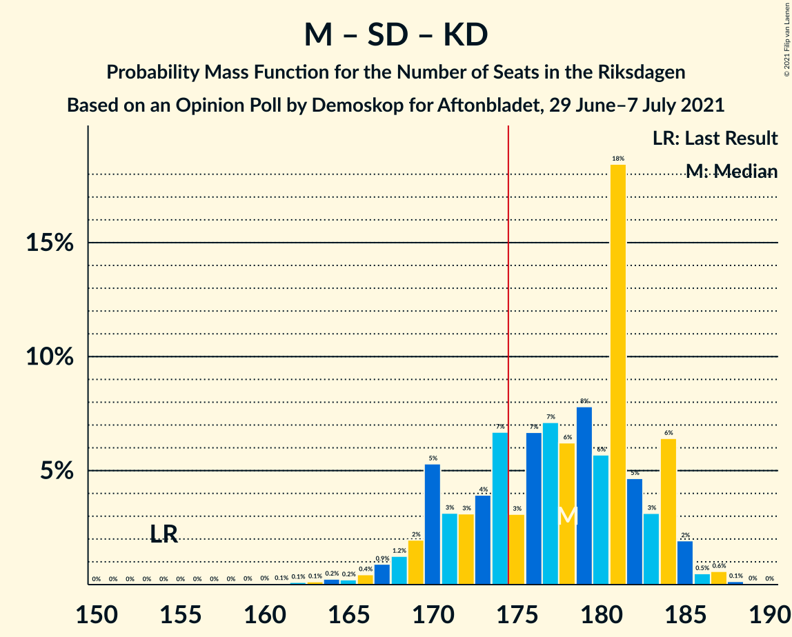

# Opinion Poll by Demoskop for Aftonbladet, 29 June–7 July 2021

<a href="#voting-intentions">Voting Intentions</a> | <a href="#seats">Seats</a> | <a href="#coalitions">Coalitions</a> | <a href="#technical-information">Technical Information</a>

## Voting Intentions

### Confidence Intervals

| Party | Last Result | Poll Result | 80% Confidence Interval | 90% Confidence Interval | 95% Confidence Interval | 99% Confidence Interval |
|:-----:|:-----------:|:-----------:|:-----------------------:|:-----------------------:|:-----------------------:|:-----------------------:|
| Sveriges socialdemokratiska arbetareparti | 28.3% | 25.2% | 24.2–26.2% |24.0–26.5% |23.7–26.7% |23.3–27.2% |
| Moderata samlingspartiet | 19.8% | 21.7% | 20.8–22.6% |20.5–22.9% |20.3–23.2% |19.9–23.6% |
| Sverigedemokraterna | 17.5% | 19.3% | 18.4–20.2% |18.2–20.5% |18.0–20.7% |17.6–21.2% |
| Centerpartiet | 8.6% | 10.4% | 9.7–11.1% |9.6–11.3% |9.4–11.5% |9.1–11.9% |
| Vänsterpartiet | 8.0% | 9.4% | 8.8–10.1% |8.6–10.3% |8.4–10.5% |8.1–10.8% |
| Kristdemokraterna | 6.3% | 6.1% | 5.6–6.7% |5.4–6.8% |5.3–7.0% |5.1–7.3% |
| Liberalerna | 5.5% | 3.5% | 3.1–3.9% |3.0–4.1% |2.9–4.2% |2.7–4.4% |
| Miljöpartiet de gröna | 4.4% | 3.5% | 3.1–3.9% |3.0–4.1% |2.9–4.2% |2.7–4.4% |

*Note:* The poll result column reflects the actual value used in the calculations. Published results may vary slightly, and in addition be rounded to fewer digits.

## Seats

### Confidence Intervals

| Party | Last Result | Median | 80% Confidence Interval | 90% Confidence Interval | 95% Confidence Interval | 99% Confidence Interval |
|:-----:|:-----------:|:------:|:-----------------------:|:-----------------------:|:-----------------------:|:-----------------------:|
| <a href="#sveriges-socialdemokratiska-arbetareparti">Sveriges socialdemokratiska arbetareparti</a> | 100 | 94 | 90–99 |89–100 |88–101 |86–103 |
| <a href="#moderata-samlingspartiet">Moderata samlingspartiet</a> | 70 | 82 | 78–86 |76–87 |75–88 |73–89 |
| <a href="#sverigedemokraterna">Sverigedemokraterna</a> | 62 | 73 | 69–76 |68–77 |67–78 |65–80 |
| <a href="#centerpartiet">Centerpartiet</a> | 31 | 39 | 36–42 |36–43 |35–44 |34–45 |
| <a href="#vänsterpartiet">Vänsterpartiet</a> | 28 | 35 | 33–38 |32–38 |32–39 |30–41 |
| <a href="#kristdemokraterna">Kristdemokraterna</a> | 22 | 23 | 21–26 |20–26 |20–27 |19–27 |
| <a href="#liberalerna">Liberalerna</a> | 20 | 0 | 0–15 |0–15 |0–15 |0–16 |
| <a href="#miljöpartiet-de-gröna">Miljöpartiet de gröna</a> | 16 | 0 | 0 |0–15 |0–15 |0–16 |

### Sveriges socialdemokratiska arbetareparti

*For a full overview of the results for this party, see the [Sveriges socialdemokratiska arbetareparti](party-sverigessocialdemokratiskaarbetareparti.html) page.*

| Number of Seats | Probability | Accumulated | Special Marks |
|:---------------:|:-----------:|:-----------:|:-------------:|
| 84 | 0.1% | 100% |  |
| 85 | 0.3% | 99.9% |  |
| 86 | 0.5% | 99.6% |  |
| 87 | 1.3% | 99.0% |  |
| 88 | 2% | 98% |  |
| 89 | 4% | 96% |  |
| 90 | 6% | 92% |  |
| 91 | 7% | 86% |  |
| 92 | 9% | 79% |  |
| 93 | 16% | 70% |  |
| 94 | 12% | 54% | Median |
| 95 | 8% | 42% |  |
| 96 | 9% | 34% |  |
| 97 | 6% | 24% |  |
| 98 | 7% | 18% |  |
| 99 | 5% | 11% |  |
| 100 | 2% | 6% | Last Result |
| 101 | 2% | 4% |  |
| 102 | 0.9% | 2% |  |
| 103 | 0.4% | 0.6% |  |
| 104 | 0.2% | 0.3% |  |
| 105 | 0.1% | 0.1% |  |
| 106 | 0% | 0% |  |

### Moderata samlingspartiet

*For a full overview of the results for this party, see the [Moderata samlingspartiet](party-moderatasamlingspartiet.html) page.*

| Number of Seats | Probability | Accumulated | Special Marks |
|:---------------:|:-----------:|:-----------:|:-------------:|
| 70 | 0% | 100% | Last Result |
| 71 | 0% | 100% |  |
| 72 | 0.2% | 99.9% |  |
| 73 | 0.3% | 99.8% |  |
| 74 | 0.5% | 99.4% |  |
| 75 | 2% | 99.0% |  |
| 76 | 2% | 97% |  |
| 77 | 4% | 95% |  |
| 78 | 4% | 91% |  |
| 79 | 8% | 86% |  |
| 80 | 11% | 78% |  |
| 81 | 8% | 68% |  |
| 82 | 14% | 59% | Median |
| 83 | 19% | 45% |  |
| 84 | 7% | 25% |  |
| 85 | 9% | 19% |  |
| 86 | 4% | 10% |  |
| 87 | 3% | 6% |  |
| 88 | 2% | 3% |  |
| 89 | 0.7% | 1.0% |  |
| 90 | 0.2% | 0.3% |  |
| 91 | 0.1% | 0.1% |  |
| 92 | 0% | 0% |  |

### Sverigedemokraterna

*For a full overview of the results for this party, see the [Sverigedemokraterna](party-sverigedemokraterna.html) page.*

| Number of Seats | Probability | Accumulated | Special Marks |
|:---------------:|:-----------:|:-----------:|:-------------:|
| 62 | 0% | 100% | Last Result |
| 63 | 0.1% | 100% |  |
| 64 | 0.3% | 99.9% |  |
| 65 | 0.4% | 99.6% |  |
| 66 | 1.1% | 99.2% |  |
| 67 | 3% | 98% |  |
| 68 | 5% | 95% |  |
| 69 | 6% | 90% |  |
| 70 | 7% | 84% |  |
| 71 | 12% | 77% |  |
| 72 | 11% | 65% |  |
| 73 | 14% | 54% | Median |
| 74 | 9% | 40% |  |
| 75 | 17% | 31% |  |
| 76 | 5% | 13% |  |
| 77 | 5% | 9% |  |
| 78 | 2% | 4% |  |
| 79 | 0.9% | 2% |  |
| 80 | 0.5% | 0.8% |  |
| 81 | 0.2% | 0.3% |  |
| 82 | 0.1% | 0.1% |  |
| 83 | 0% | 0% |  |

### Centerpartiet

*For a full overview of the results for this party, see the [Centerpartiet](party-centerpartiet.html) page.*

| Number of Seats | Probability | Accumulated | Special Marks |
|:---------------:|:-----------:|:-----------:|:-------------:|
| 31 | 0% | 100% | Last Result |
| 32 | 0.1% | 100% |  |
| 33 | 0.3% | 99.9% |  |
| 34 | 0.7% | 99.6% |  |
| 35 | 2% | 98.9% |  |
| 36 | 8% | 97% |  |
| 37 | 12% | 89% |  |
| 38 | 15% | 77% |  |
| 39 | 15% | 62% | Median |
| 40 | 22% | 48% |  |
| 41 | 15% | 26% |  |
| 42 | 6% | 11% |  |
| 43 | 2% | 5% |  |
| 44 | 1.4% | 3% |  |
| 45 | 1.1% | 1.2% |  |
| 46 | 0.1% | 0.1% |  |
| 47 | 0% | 0% |  |

### Vänsterpartiet

*For a full overview of the results for this party, see the [Vänsterpartiet](party-vänsterpartiet.html) page.*

| Number of Seats | Probability | Accumulated | Special Marks |
|:---------------:|:-----------:|:-----------:|:-------------:|
| 28 | 0% | 100% | Last Result |
| 29 | 0.1% | 100% |  |
| 30 | 0.5% | 99.8% |  |
| 31 | 2% | 99.3% |  |
| 32 | 7% | 98% |  |
| 33 | 12% | 91% |  |
| 34 | 20% | 79% |  |
| 35 | 24% | 59% | Median |
| 36 | 14% | 35% |  |
| 37 | 11% | 21% |  |
| 38 | 6% | 10% |  |
| 39 | 3% | 5% |  |
| 40 | 1.2% | 2% |  |
| 41 | 0.4% | 0.6% |  |
| 42 | 0.1% | 0.1% |  |
| 43 | 0% | 0% |  |

### Kristdemokraterna

*For a full overview of the results for this party, see the [Kristdemokraterna](party-kristdemokraterna.html) page.*

| Number of Seats | Probability | Accumulated | Special Marks |
|:---------------:|:-----------:|:-----------:|:-------------:|
| 18 | 0.2% | 100% |  |
| 19 | 1.3% | 99.8% |  |
| 20 | 4% | 98.5% |  |
| 21 | 13% | 94% |  |
| 22 | 16% | 81% | Last Result |
| 23 | 26% | 65% | Median |
| 24 | 16% | 39% |  |
| 25 | 13% | 23% |  |
| 26 | 8% | 10% |  |
| 27 | 2% | 3% |  |
| 28 | 0.3% | 0.4% |  |
| 29 | 0.1% | 0.1% |  |
| 30 | 0% | 0% |  |

### Liberalerna

*For a full overview of the results for this party, see the [Liberalerna](party-liberalerna.html) page.*

| Number of Seats | Probability | Accumulated | Special Marks |
|:---------------:|:-----------:|:-----------:|:-------------:|
| 0 | 89% | 100% | Median |
| 1 | 0% | 11% |  |
| 2 | 0% | 11% |  |
| 3 | 0% | 11% |  |
| 4 | 0% | 11% |  |
| 5 | 0% | 11% |  |
| 6 | 0% | 11% |  |
| 7 | 0% | 11% |  |
| 8 | 0% | 11% |  |
| 9 | 0% | 11% |  |
| 10 | 0% | 11% |  |
| 11 | 0% | 11% |  |
| 12 | 0% | 11% |  |
| 13 | 0% | 11% |  |
| 14 | 0.4% | 11% |  |
| 15 | 8% | 10% |  |
| 16 | 2% | 2% |  |
| 17 | 0.3% | 0.3% |  |
| 18 | 0% | 0% |  |
| 19 | 0% | 0% |  |
| 20 | 0% | 0% | Last Result |

### Miljöpartiet de gröna

*For a full overview of the results for this party, see the [Miljöpartiet de gröna](party-miljöpartietdegröna.html) page.*

| Number of Seats | Probability | Accumulated | Special Marks |
|:---------------:|:-----------:|:-----------:|:-------------:|
| 0 | 90% | 100% | Median |
| 1 | 0% | 10% |  |
| 2 | 0% | 10% |  |
| 3 | 0% | 10% |  |
| 4 | 0% | 10% |  |
| 5 | 0% | 10% |  |
| 6 | 0% | 10% |  |
| 7 | 0% | 10% |  |
| 8 | 0% | 10% |  |
| 9 | 0% | 10% |  |
| 10 | 0% | 10% |  |
| 11 | 0% | 10% |  |
| 12 | 0% | 10% |  |
| 13 | 0% | 10% |  |
| 14 | 0.3% | 10% |  |
| 15 | 8% | 10% |  |
| 16 | 2% | 2% | Last Result |
| 17 | 0.2% | 0.3% |  |
| 18 | 0% | 0% |  |

## Coalitions

### Confidence Intervals

| Coalition | Last Result | Median | Majority? | 80% Confidence Interval | 90% Confidence Interval | 95% Confidence Interval | 99% Confidence Interval |
|:---------:|:-----------:|:------:|:---------:|:-----------------------:|:-----------------------:|:-----------------------:|:-----------------------:|
| Sveriges socialdemokratiska arbetareparti – Moderata samlingspartiet – Centerpartiet | 201 | 216 | 100% | 208–221 | 205–222 | 203–223 | 201–225 |
| Moderata samlingspartiet – Sverigedemokraterna – Kristdemokraterna | 154 | 178 | 72% | 170–183 | 169–184 | 168–185 | 164–187 |
| Sveriges socialdemokratiska arbetareparti – Moderata samlingspartiet | 170 | 176 | 67% | 169–181 | 167–183 | 166–183 | 163–185 |
| Sveriges socialdemokratiska arbetareparti – Centerpartiet – Vänsterpartiet – Liberalerna – Miljöpartiet de gröna | 195 | 171 | 28% | 166–179 | 165–180 | 164–181 | 162–185 |
| Moderata samlingspartiet – Sverigedemokraterna | 132 | 155 | 0% | 149–160 | 147–160 | 146–161 | 142–164 |
| Moderata samlingspartiet – Centerpartiet – Kristdemokraterna – Liberalerna | 143 | 146 | 0% | 140–152 | 138–154 | 137–157 | 134–158 |
| Moderata samlingspartiet – Centerpartiet – Kristdemokraterna | 123 | 145 | 0% | 139–149 | 137–150 | 135–151 | 133–153 |
| Sveriges socialdemokratiska arbetareparti – Centerpartiet – Liberalerna – Miljöpartiet de gröna | 167 | 136 | 0% | 131–144 | 130–146 | 129–147 | 127–151 |
| Sveriges socialdemokratiska arbetareparti – Vänsterpartiet – Miljöpartiet de gröna | 144 | 129 | 0% | 125–138 | 124–140 | 123–141 | 121–145 |
| Sveriges socialdemokratiska arbetareparti – Vänsterpartiet | 128 | 128 | 0% | 124–135 | 123–136 | 122–137 | 119–139 |
| Moderata samlingspartiet – Centerpartiet – Liberalerna | 121 | 122 | 0% | 117–129 | 115–133 | 115–134 | 112–136 |
| Moderata samlingspartiet – Centerpartiet | 101 | 121 | 0% | 116–125 | 114–127 | 113–127 | 110–130 |
| Sveriges socialdemokratiska arbetareparti – Miljöpartiet de gröna | 116 | 95 | 0% | 91–102 | 90–105 | 88–108 | 87–110 |

### Sveriges socialdemokratiska arbetareparti – Moderata samlingspartiet – Centerpartiet

| Number of Seats | Probability | Accumulated | Special Marks |
|:---------------:|:-----------:|:-----------:|:-------------:|
| 195 | 0% | 100% |  |
| 196 | 0% | 99.9% |  |
| 197 | 0% | 99.9% |  |
| 198 | 0.1% | 99.9% |  |
| 199 | 0.1% | 99.8% |  |
| 200 | 0.1% | 99.7% |  |
| 201 | 0.6% | 99.6% | Last Result |
| 202 | 0.7% | 99.0% |  |
| 203 | 1.0% | 98% |  |
| 204 | 1.5% | 97% |  |
| 205 | 2% | 96% |  |
| 206 | 2% | 94% |  |
| 207 | 2% | 92% |  |
| 208 | 1.3% | 90% |  |
| 209 | 3% | 89% |  |
| 210 | 5% | 86% |  |
| 211 | 3% | 81% |  |
| 212 | 4% | 77% |  |
| 213 | 3% | 74% |  |
| 214 | 4% | 71% |  |
| 215 | 6% | 66% | Median |
| 216 | 14% | 60% |  |
| 217 | 14% | 46% |  |
| 218 | 9% | 33% |  |
| 219 | 7% | 24% |  |
| 220 | 6% | 17% |  |
| 221 | 5% | 11% |  |
| 222 | 3% | 6% |  |
| 223 | 2% | 4% |  |
| 224 | 0.9% | 1.5% |  |
| 225 | 0.3% | 0.6% |  |
| 226 | 0.1% | 0.2% |  |
| 227 | 0% | 0.1% |  |
| 228 | 0% | 0% |  |

### Moderata samlingspartiet – Sverigedemokraterna – Kristdemokraterna

| Number of Seats | Probability | Accumulated | Special Marks |
|:---------------:|:-----------:|:-----------:|:-------------:|
| 154 | 0% | 100% | Last Result |
| 155 | 0% | 100% |  |
| 156 | 0% | 100% |  |
| 157 | 0% | 100% |  |
| 158 | 0% | 100% |  |
| 159 | 0% | 100% |  |
| 160 | 0% | 100% |  |
| 161 | 0.1% | 99.9% |  |
| 162 | 0.1% | 99.9% |  |
| 163 | 0.1% | 99.8% |  |
| 164 | 0.2% | 99.6% |  |
| 165 | 0.2% | 99.4% |  |
| 166 | 0.4% | 99.2% |  |
| 167 | 0.9% | 98.7% |  |
| 168 | 1.2% | 98% |  |
| 169 | 2% | 97% |  |
| 170 | 5% | 95% |  |
| 171 | 3% | 89% |  |
| 172 | 3% | 86% |  |
| 173 | 4% | 83% |  |
| 174 | 7% | 79% |  |
| 175 | 3% | 72% | Majority |
| 176 | 7% | 69% |  |
| 177 | 7% | 63% |  |
| 178 | 6% | 56% | Median |
| 179 | 8% | 49% |  |
| 180 | 6% | 42% |  |
| 181 | 18% | 36% |  |
| 182 | 5% | 17% |  |
| 183 | 3% | 13% |  |
| 184 | 6% | 10% |  |
| 185 | 2% | 3% |  |
| 186 | 0.5% | 1.3% |  |
| 187 | 0.6% | 0.8% |  |
| 188 | 0.1% | 0.2% |  |
| 189 | 0% | 0.1% |  |
| 190 | 0% | 0% |  |

### Sveriges socialdemokratiska arbetareparti – Moderata samlingspartiet

| Number of Seats | Probability | Accumulated | Special Marks |
|:---------------:|:-----------:|:-----------:|:-------------:|
| 158 | 0% | 100% |  |
| 159 | 0% | 99.9% |  |
| 160 | 0% | 99.9% |  |
| 161 | 0% | 99.9% |  |
| 162 | 0.2% | 99.9% |  |
| 163 | 0.5% | 99.7% |  |
| 164 | 1.0% | 99.2% |  |
| 165 | 0.3% | 98% |  |
| 166 | 2% | 98% |  |
| 167 | 2% | 96% |  |
| 168 | 2% | 94% |  |
| 169 | 2% | 92% |  |
| 170 | 2% | 90% | Last Result |
| 171 | 5% | 88% |  |
| 172 | 3% | 83% |  |
| 173 | 8% | 80% |  |
| 174 | 5% | 72% |  |
| 175 | 3% | 67% | Majority |
| 176 | 16% | 65% | Median |
| 177 | 12% | 49% |  |
| 178 | 9% | 37% |  |
| 179 | 4% | 28% |  |
| 180 | 7% | 24% |  |
| 181 | 9% | 17% |  |
| 182 | 4% | 9% |  |
| 183 | 3% | 5% |  |
| 184 | 0.8% | 2% |  |
| 185 | 1.2% | 2% |  |
| 186 | 0.2% | 0.4% |  |
| 187 | 0.1% | 0.2% |  |
| 188 | 0% | 0.1% |  |
| 189 | 0% | 0% |  |

### Sveriges socialdemokratiska arbetareparti – Centerpartiet – Vänsterpartiet – Liberalerna – Miljöpartiet de gröna

| Number of Seats | Probability | Accumulated | Special Marks |
|:---------------:|:-----------:|:-----------:|:-------------:|
| 160 | 0% | 100% |  |
| 161 | 0.1% | 99.9% |  |
| 162 | 0.6% | 99.8% |  |
| 163 | 0.5% | 99.2% |  |
| 164 | 2% | 98.7% |  |
| 165 | 6% | 97% |  |
| 166 | 3% | 90% |  |
| 167 | 5% | 87% |  |
| 168 | 18% | 83% | Median |
| 169 | 6% | 64% |  |
| 170 | 8% | 58% |  |
| 171 | 6% | 51% |  |
| 172 | 7% | 44% |  |
| 173 | 7% | 37% |  |
| 174 | 3% | 31% |  |
| 175 | 7% | 28% | Majority |
| 176 | 4% | 21% |  |
| 177 | 3% | 17% |  |
| 178 | 3% | 14% |  |
| 179 | 5% | 11% |  |
| 180 | 2% | 5% |  |
| 181 | 1.2% | 3% |  |
| 182 | 0.9% | 2% |  |
| 183 | 0.4% | 1.3% |  |
| 184 | 0.2% | 0.8% |  |
| 185 | 0.2% | 0.6% |  |
| 186 | 0.1% | 0.4% |  |
| 187 | 0.1% | 0.2% |  |
| 188 | 0.1% | 0.1% |  |
| 189 | 0% | 0.1% |  |
| 190 | 0% | 0% |  |
| 191 | 0% | 0% |  |
| 192 | 0% | 0% |  |
| 193 | 0% | 0% |  |
| 194 | 0% | 0% |  |
| 195 | 0% | 0% | Last Result |

### Moderata samlingspartiet – Sverigedemokraterna

| Number of Seats | Probability | Accumulated | Special Marks |
|:---------------:|:-----------:|:-----------:|:-------------:|
| 132 | 0% | 100% | Last Result |
| 133 | 0% | 100% |  |
| 134 | 0% | 100% |  |
| 135 | 0% | 100% |  |
| 136 | 0% | 100% |  |
| 137 | 0% | 100% |  |
| 138 | 0.1% | 100% |  |
| 139 | 0% | 99.9% |  |
| 140 | 0.1% | 99.9% |  |
| 141 | 0.2% | 99.8% |  |
| 142 | 0.3% | 99.6% |  |
| 143 | 0.5% | 99.3% |  |
| 144 | 0.5% | 98.8% |  |
| 145 | 0.7% | 98% |  |
| 146 | 2% | 98% |  |
| 147 | 3% | 96% |  |
| 148 | 2% | 93% |  |
| 149 | 6% | 91% |  |
| 150 | 3% | 85% |  |
| 151 | 6% | 83% |  |
| 152 | 8% | 76% |  |
| 153 | 7% | 68% |  |
| 154 | 6% | 61% |  |
| 155 | 8% | 55% | Median |
| 156 | 12% | 46% |  |
| 157 | 8% | 35% |  |
| 158 | 12% | 27% |  |
| 159 | 4% | 15% |  |
| 160 | 7% | 11% |  |
| 161 | 2% | 4% |  |
| 162 | 0.8% | 2% |  |
| 163 | 0.2% | 1.1% |  |
| 164 | 0.7% | 0.9% |  |
| 165 | 0.1% | 0.2% |  |
| 166 | 0% | 0.1% |  |
| 167 | 0% | 0% |  |

### Moderata samlingspartiet – Centerpartiet – Kristdemokraterna – Liberalerna

| Number of Seats | Probability | Accumulated | Special Marks |
|:---------------:|:-----------:|:-----------:|:-------------:|
| 131 | 0% | 100% |  |
| 132 | 0.1% | 99.9% |  |
| 133 | 0.1% | 99.8% |  |
| 134 | 0.3% | 99.7% |  |
| 135 | 0.9% | 99.4% |  |
| 136 | 0.6% | 98.5% |  |
| 137 | 3% | 98% |  |
| 138 | 1.0% | 95% |  |
| 139 | 2% | 94% |  |
| 140 | 5% | 92% |  |
| 141 | 4% | 87% |  |
| 142 | 9% | 83% |  |
| 143 | 5% | 74% | Last Result |
| 144 | 7% | 69% | Median |
| 145 | 6% | 62% |  |
| 146 | 18% | 56% |  |
| 147 | 5% | 38% |  |
| 148 | 6% | 33% |  |
| 149 | 11% | 27% |  |
| 150 | 2% | 16% |  |
| 151 | 2% | 14% |  |
| 152 | 3% | 11% |  |
| 153 | 1.2% | 8% |  |
| 154 | 3% | 7% |  |
| 155 | 0.9% | 4% |  |
| 156 | 0.8% | 3% |  |
| 157 | 0.6% | 3% |  |
| 158 | 1.5% | 2% |  |
| 159 | 0.1% | 0.4% |  |
| 160 | 0.2% | 0.3% |  |
| 161 | 0.1% | 0.1% |  |
| 162 | 0% | 0% |  |

### Moderata samlingspartiet – Centerpartiet – Kristdemokraterna

| Number of Seats | Probability | Accumulated | Special Marks |
|:---------------:|:-----------:|:-----------:|:-------------:|
| 123 | 0% | 100% | Last Result |
| 124 | 0% | 100% |  |
| 125 | 0% | 100% |  |
| 126 | 0% | 100% |  |
| 127 | 0% | 100% |  |
| 128 | 0% | 100% |  |
| 129 | 0% | 100% |  |
| 130 | 0% | 99.9% |  |
| 131 | 0.1% | 99.9% |  |
| 132 | 0.2% | 99.8% |  |
| 133 | 0.4% | 99.6% |  |
| 134 | 0.7% | 99.2% |  |
| 135 | 1.1% | 98.5% |  |
| 136 | 1.4% | 97% |  |
| 137 | 4% | 96% |  |
| 138 | 2% | 92% |  |
| 139 | 5% | 90% |  |
| 140 | 6% | 85% |  |
| 141 | 5% | 79% |  |
| 142 | 10% | 74% |  |
| 143 | 6% | 65% |  |
| 144 | 7% | 59% | Median |
| 145 | 6% | 51% |  |
| 146 | 18% | 45% |  |
| 147 | 5% | 28% |  |
| 148 | 5% | 23% |  |
| 149 | 11% | 17% |  |
| 150 | 2% | 6% |  |
| 151 | 2% | 4% |  |
| 152 | 1.4% | 2% |  |
| 153 | 0.3% | 0.7% |  |
| 154 | 0.2% | 0.4% |  |
| 155 | 0.2% | 0.2% |  |
| 156 | 0% | 0.1% |  |
| 157 | 0% | 0% |  |

### Sveriges socialdemokratiska arbetareparti – Centerpartiet – Liberalerna – Miljöpartiet de gröna

| Number of Seats | Probability | Accumulated | Special Marks |
|:---------------:|:-----------:|:-----------:|:-------------:|
| 125 | 0.1% | 100% |  |
| 126 | 0.2% | 99.9% |  |
| 127 | 0.6% | 99.6% |  |
| 128 | 0.8% | 99.1% |  |
| 129 | 2% | 98% |  |
| 130 | 5% | 96% |  |
| 131 | 4% | 91% |  |
| 132 | 5% | 87% |  |
| 133 | 13% | 82% | Median |
| 134 | 11% | 69% |  |
| 135 | 8% | 58% |  |
| 136 | 8% | 50% |  |
| 137 | 11% | 42% |  |
| 138 | 4% | 31% |  |
| 139 | 4% | 28% |  |
| 140 | 2% | 24% |  |
| 141 | 3% | 21% |  |
| 142 | 4% | 18% |  |
| 143 | 3% | 15% |  |
| 144 | 2% | 11% |  |
| 145 | 3% | 9% |  |
| 146 | 2% | 6% |  |
| 147 | 2% | 4% |  |
| 148 | 0.8% | 2% |  |
| 149 | 0.5% | 1.4% |  |
| 150 | 0.3% | 0.9% |  |
| 151 | 0.2% | 0.6% |  |
| 152 | 0.1% | 0.4% |  |
| 153 | 0.2% | 0.3% |  |
| 154 | 0% | 0.2% |  |
| 155 | 0.1% | 0.1% |  |
| 156 | 0% | 0.1% |  |
| 157 | 0% | 0% |  |
| 158 | 0% | 0% |  |
| 159 | 0% | 0% |  |
| 160 | 0% | 0% |  |
| 161 | 0% | 0% |  |
| 162 | 0% | 0% |  |
| 163 | 0% | 0% |  |
| 164 | 0% | 0% |  |
| 165 | 0% | 0% |  |
| 166 | 0% | 0% |  |
| 167 | 0% | 0% | Last Result |

### Sveriges socialdemokratiska arbetareparti – Vänsterpartiet – Miljöpartiet de gröna

| Number of Seats | Probability | Accumulated | Special Marks |
|:---------------:|:-----------:|:-----------:|:-------------:|
| 118 | 0.1% | 100% |  |
| 119 | 0.1% | 99.9% |  |
| 120 | 0.3% | 99.8% |  |
| 121 | 0.4% | 99.6% |  |
| 122 | 1.1% | 99.2% |  |
| 123 | 2% | 98% |  |
| 124 | 3% | 96% |  |
| 125 | 4% | 93% |  |
| 126 | 6% | 89% |  |
| 127 | 9% | 83% |  |
| 128 | 15% | 74% |  |
| 129 | 9% | 59% | Median |
| 130 | 6% | 50% |  |
| 131 | 6% | 44% |  |
| 132 | 6% | 38% |  |
| 133 | 5% | 32% |  |
| 134 | 7% | 27% |  |
| 135 | 4% | 20% |  |
| 136 | 3% | 16% |  |
| 137 | 2% | 13% |  |
| 138 | 2% | 10% |  |
| 139 | 2% | 8% |  |
| 140 | 4% | 7% |  |
| 141 | 0.5% | 3% |  |
| 142 | 0.9% | 2% |  |
| 143 | 0.8% | 2% |  |
| 144 | 0.2% | 0.8% | Last Result |
| 145 | 0.4% | 0.6% |  |
| 146 | 0.1% | 0.2% |  |
| 147 | 0% | 0.1% |  |
| 148 | 0% | 0.1% |  |
| 149 | 0% | 0% |  |

### Sveriges socialdemokratiska arbetareparti – Vänsterpartiet

| Number of Seats | Probability | Accumulated | Special Marks |
|:---------------:|:-----------:|:-----------:|:-------------:|
| 117 | 0% | 100% |  |
| 118 | 0.1% | 99.9% |  |
| 119 | 0.3% | 99.8% |  |
| 120 | 0.4% | 99.5% |  |
| 121 | 0.7% | 99.1% |  |
| 122 | 2% | 98% |  |
| 123 | 3% | 96% |  |
| 124 | 4% | 93% |  |
| 125 | 7% | 89% |  |
| 126 | 6% | 82% |  |
| 127 | 10% | 76% |  |
| 128 | 16% | 65% | Last Result |
| 129 | 9% | 49% | Median |
| 130 | 6% | 40% |  |
| 131 | 6% | 34% |  |
| 132 | 6% | 28% |  |
| 133 | 5% | 22% |  |
| 134 | 7% | 17% |  |
| 135 | 4% | 11% |  |
| 136 | 2% | 6% |  |
| 137 | 1.5% | 4% |  |
| 138 | 1.0% | 2% |  |
| 139 | 0.8% | 1.2% |  |
| 140 | 0.2% | 0.4% |  |
| 141 | 0.1% | 0.2% |  |
| 142 | 0% | 0.1% |  |
| 143 | 0% | 0% |  |

### Moderata samlingspartiet – Centerpartiet – Liberalerna

| Number of Seats | Probability | Accumulated | Special Marks |
|:---------------:|:-----------:|:-----------:|:-------------:|
| 109 | 0.1% | 100% |  |
| 110 | 0.2% | 99.9% |  |
| 111 | 0.3% | 99.8% |  |
| 112 | 0.7% | 99.5% |  |
| 113 | 0.5% | 98.8% |  |
| 114 | 0.7% | 98% |  |
| 115 | 3% | 98% |  |
| 116 | 2% | 95% |  |
| 117 | 4% | 93% |  |
| 118 | 5% | 89% |  |
| 119 | 7% | 84% |  |
| 120 | 10% | 77% |  |
| 121 | 9% | 67% | Last Result, Median |
| 122 | 10% | 58% |  |
| 123 | 14% | 49% |  |
| 124 | 9% | 35% |  |
| 125 | 5% | 26% |  |
| 126 | 4% | 20% |  |
| 127 | 4% | 17% |  |
| 128 | 2% | 12% |  |
| 129 | 2% | 11% |  |
| 130 | 0.8% | 9% |  |
| 131 | 0.9% | 8% |  |
| 132 | 1.2% | 7% |  |
| 133 | 3% | 6% |  |
| 134 | 0.5% | 3% |  |
| 135 | 0.3% | 2% |  |
| 136 | 1.4% | 2% |  |
| 137 | 0.2% | 0.4% |  |
| 138 | 0.1% | 0.2% |  |
| 139 | 0.1% | 0.1% |  |
| 140 | 0% | 0% |  |

### Moderata samlingspartiet – Centerpartiet

| Number of Seats | Probability | Accumulated | Special Marks |
|:---------------:|:-----------:|:-----------:|:-------------:|
| 101 | 0% | 100% | Last Result |
| 102 | 0% | 100% |  |
| 103 | 0% | 100% |  |
| 104 | 0% | 100% |  |
| 105 | 0% | 100% |  |
| 106 | 0% | 100% |  |
| 107 | 0% | 99.9% |  |
| 108 | 0% | 99.9% |  |
| 109 | 0.2% | 99.9% |  |
| 110 | 0.3% | 99.7% |  |
| 111 | 0.4% | 99.5% |  |
| 112 | 1.1% | 99.0% |  |
| 113 | 0.9% | 98% |  |
| 114 | 2% | 97% |  |
| 115 | 3% | 95% |  |
| 116 | 3% | 92% |  |
| 117 | 5% | 88% |  |
| 118 | 8% | 83% |  |
| 119 | 7% | 76% |  |
| 120 | 10% | 68% |  |
| 121 | 10% | 58% | Median |
| 122 | 10% | 48% |  |
| 123 | 14% | 38% |  |
| 124 | 9% | 24% |  |
| 125 | 5% | 15% |  |
| 126 | 4% | 10% |  |
| 127 | 4% | 6% |  |
| 128 | 1.2% | 2% |  |
| 129 | 0.5% | 1.1% |  |
| 130 | 0.2% | 0.5% |  |
| 131 | 0.2% | 0.3% |  |
| 132 | 0.1% | 0.1% |  |
| 133 | 0% | 0% |  |

### Sveriges socialdemokratiska arbetareparti – Miljöpartiet de gröna

| Number of Seats | Probability | Accumulated | Special Marks |
|:---------------:|:-----------:|:-----------:|:-------------:|
| 84 | 0.1% | 100% |  |
| 85 | 0.1% | 99.9% |  |
| 86 | 0.3% | 99.8% |  |
| 87 | 0.7% | 99.5% |  |
| 88 | 1.4% | 98.8% |  |
| 89 | 2% | 97% |  |
| 90 | 4% | 96% |  |
| 91 | 6% | 92% |  |
| 92 | 9% | 86% |  |
| 93 | 15% | 77% |  |
| 94 | 11% | 62% | Median |
| 95 | 8% | 51% |  |
| 96 | 9% | 43% |  |
| 97 | 6% | 34% |  |
| 98 | 7% | 28% |  |
| 99 | 5% | 21% |  |
| 100 | 2% | 16% |  |
| 101 | 3% | 14% |  |
| 102 | 1.3% | 11% |  |
| 103 | 1.1% | 10% |  |
| 104 | 2% | 9% |  |
| 105 | 1.4% | 6% |  |
| 106 | 2% | 5% |  |
| 107 | 0.5% | 3% |  |
| 108 | 0.7% | 3% |  |
| 109 | 0.7% | 2% |  |
| 110 | 0.8% | 1.2% |  |
| 111 | 0.2% | 0.4% |  |
| 112 | 0.1% | 0.2% |  |
| 113 | 0.1% | 0.1% |  |
| 114 | 0% | 0% |  |
| 115 | 0% | 0% |  |
| 116 | 0% | 0% | Last Result |

## Technical Information

### Opinion Poll

+ **Polling firm:** Demoskop
+ **Commissioner(s):** Aftonbladet
+ **Fieldwork period:** 29 June–7 July 2021

### Calculations

+ **Sample size:** 3267
+ **Simulations done:** 1,048,576
+ **Error estimate:** 0.61%

