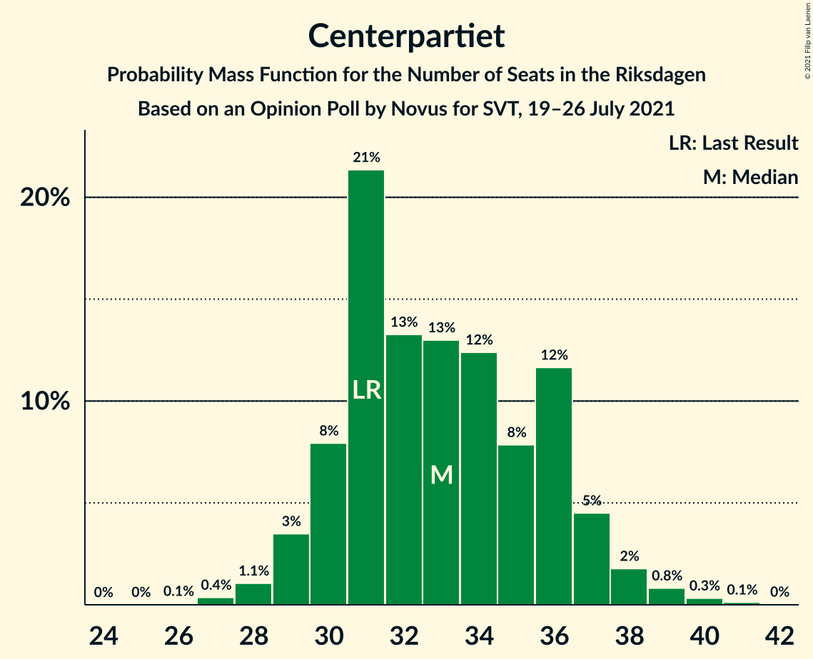
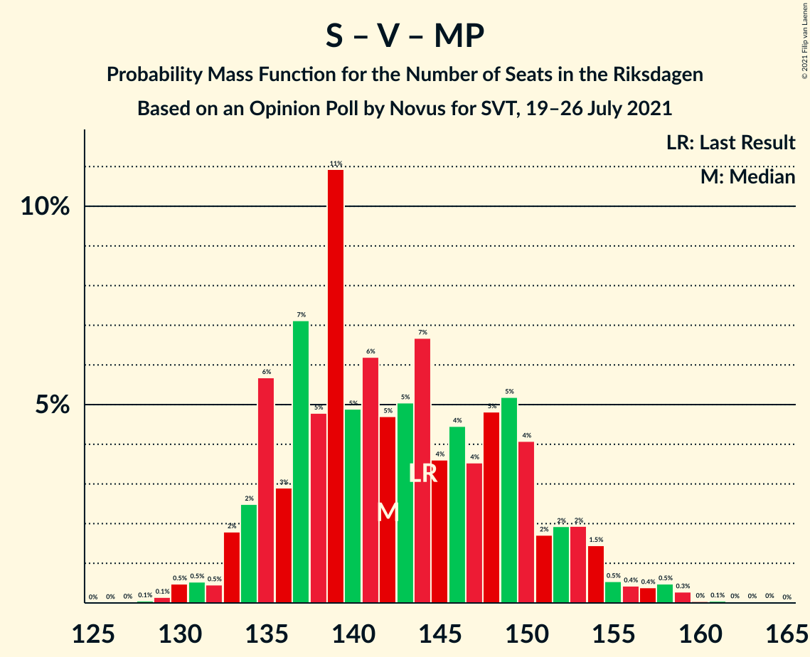

# Opinion Poll by Novus for SVT, 19–26 July 2021

<a href="#voting-intentions">Voting Intentions</a> | <a href="#seats">Seats</a> | <a href="#coalitions">Coalitions</a> | <a href="#technical-information">Technical Information</a>

## Voting Intentions

### Confidence Intervals

| Party | Last Result | Poll Result | 80% Confidence Interval | 90% Confidence Interval | 95% Confidence Interval | 99% Confidence Interval |
|:-----:|:-----------:|:-----------:|:-----------------------:|:-----------------------:|:-----------------------:|:-----------------------:|
| Sveriges socialdemokratiska arbetareparti | 28.3% | 23.8% | 22.7–24.9% |22.4–25.2% |22.1–25.5% |21.6–26.1% |
| Sverigedemokraterna | 17.5% | 21.6% | 20.6–22.7% |20.3–23.0% |20.0–23.3% |19.5–23.8% |
| Moderata samlingspartiet | 19.8% | 21.0% | 20.0–22.1% |19.7–22.4% |19.4–22.7% |19.0–23.2% |
| Vänsterpartiet | 8.0% | 13.3% | 12.5–14.2% |12.2–14.5% |12.0–14.7% |11.6–15.2% |
| Centerpartiet | 8.6% | 8.9% | 8.2–9.7% |8.0–9.9% |7.8–10.1% |7.5–10.5% |
| Kristdemokraterna | 6.3% | 4.5% | 4.0–5.1% |3.9–5.3% |3.8–5.4% |3.5–5.7% |
| Miljöpartiet de gröna | 4.4% | 3.8% | 3.3–4.3% |3.2–4.5% |3.1–4.6% |2.9–4.9% |
| Liberalerna | 5.5% | 2.2% | 1.9–2.7% |1.8–2.8% |1.7–2.9% |1.6–3.1% |

*Note:* The poll result column reflects the actual value used in the calculations. Published results may vary slightly, and in addition be rounded to fewer digits.

## Seats

### Confidence Intervals

| Party | Last Result | Median | 80% Confidence Interval | 90% Confidence Interval | 95% Confidence Interval | 99% Confidence Interval |
|:-----:|:-----------:|:------:|:-----------------------:|:-----------------------:|:-----------------------:|:-----------------------:|
| <a href="#sveriges-socialdemokratiska-arbetareparti">Sveriges socialdemokratiska arbetareparti</a> | 100 | 88 | 83–94 |81–95 |80–96 |78–99 |
| <a href="#sverigedemokraterna">Sverigedemokraterna</a> | 62 | 80 | 76–85 |74–86 |73–88 |71–90 |
| <a href="#moderata-samlingspartiet">Moderata samlingspartiet</a> | 70 | 78 | 73–82 |72–84 |71–85 |69–87 |
| <a href="#vänsterpartiet">Vänsterpartiet</a> | 28 | 50 | 46–53 |45–54 |44–55 |43–57 |
| <a href="#centerpartiet">Centerpartiet</a> | 31 | 33 | 30–36 |30–37 |29–38 |28–39 |
| <a href="#kristdemokraterna">Kristdemokraterna</a> | 22 | 17 | 15–19 |0–19 |0–20 |0–21 |
| <a href="#miljöpartiet-de-gröna">Miljöpartiet de gröna</a> | 16 | 0 | 0–15 |0–16 |0–17 |0–18 |
| <a href="#liberalerna">Liberalerna</a> | 20 | 0 | 0 |0 |0 |0 |

### Sveriges socialdemokratiska arbetareparti

*For a full overview of the results for this party, see the [Sveriges socialdemokratiska arbetareparti](party-sverigessocialdemokratiskaarbetareparti.html) page.*

| Number of Seats | Probability | Accumulated | Special Marks |
|:---------------:|:-----------:|:-----------:|:-------------:|
| 76 | 0.1% | 100% |  |
| 77 | 0.1% | 99.9% |  |
| 78 | 0.4% | 99.8% |  |
| 79 | 1.2% | 99.4% |  |
| 80 | 0.8% | 98% |  |
| 81 | 4% | 97% |  |
| 82 | 3% | 93% |  |
| 83 | 3% | 91% |  |
| 84 | 6% | 88% |  |
| 85 | 8% | 81% |  |
| 86 | 8% | 73% |  |
| 87 | 6% | 65% |  |
| 88 | 12% | 59% | Median |
| 89 | 11% | 47% |  |
| 90 | 6% | 37% |  |
| 91 | 9% | 31% |  |
| 92 | 4% | 21% |  |
| 93 | 6% | 17% |  |
| 94 | 4% | 11% |  |
| 95 | 3% | 7% |  |
| 96 | 2% | 4% |  |
| 97 | 1.5% | 2% |  |
| 98 | 0.2% | 0.9% |  |
| 99 | 0.4% | 0.7% |  |
| 100 | 0.1% | 0.3% | Last Result |
| 101 | 0.1% | 0.2% |  |
| 102 | 0% | 0% |  |

### Sverigedemokraterna

*For a full overview of the results for this party, see the [Sverigedemokraterna](party-sverigedemokraterna.html) page.*

| Number of Seats | Probability | Accumulated | Special Marks |
|:---------------:|:-----------:|:-----------:|:-------------:|
| 62 | 0% | 100% | Last Result |
| 63 | 0% | 100% |  |
| 64 | 0% | 100% |  |
| 65 | 0% | 100% |  |
| 66 | 0% | 100% |  |
| 67 | 0% | 100% |  |
| 68 | 0% | 100% |  |
| 69 | 0.1% | 100% |  |
| 70 | 0.1% | 99.9% |  |
| 71 | 0.3% | 99.8% |  |
| 72 | 0.7% | 99.4% |  |
| 73 | 1.3% | 98.8% |  |
| 74 | 3% | 97% |  |
| 75 | 3% | 95% |  |
| 76 | 5% | 92% |  |
| 77 | 9% | 86% |  |
| 78 | 9% | 77% |  |
| 79 | 7% | 68% |  |
| 80 | 15% | 61% | Median |
| 81 | 9% | 46% |  |
| 82 | 9% | 37% |  |
| 83 | 10% | 28% |  |
| 84 | 6% | 18% |  |
| 85 | 5% | 12% |  |
| 86 | 3% | 7% |  |
| 87 | 2% | 4% |  |
| 88 | 2% | 3% |  |
| 89 | 0.3% | 1.1% |  |
| 90 | 0.5% | 0.8% |  |
| 91 | 0.1% | 0.3% |  |
| 92 | 0.1% | 0.2% |  |
| 93 | 0% | 0.1% |  |
| 94 | 0% | 0% |  |

### Moderata samlingspartiet

*For a full overview of the results for this party, see the [Moderata samlingspartiet](party-moderatasamlingspartiet.html) page.*

| Number of Seats | Probability | Accumulated | Special Marks |
|:---------------:|:-----------:|:-----------:|:-------------:|
| 67 | 0.1% | 100% |  |
| 68 | 0.2% | 99.9% |  |
| 69 | 0.6% | 99.7% |  |
| 70 | 1.2% | 99.1% | Last Result |
| 71 | 2% | 98% |  |
| 72 | 5% | 96% |  |
| 73 | 4% | 91% |  |
| 74 | 6% | 87% |  |
| 75 | 8% | 80% |  |
| 76 | 9% | 72% |  |
| 77 | 12% | 64% |  |
| 78 | 8% | 52% | Median |
| 79 | 14% | 43% |  |
| 80 | 8% | 30% |  |
| 81 | 8% | 22% |  |
| 82 | 7% | 15% |  |
| 83 | 2% | 8% |  |
| 84 | 3% | 6% |  |
| 85 | 1.1% | 3% |  |
| 86 | 0.5% | 2% |  |
| 87 | 0.9% | 1.3% |  |
| 88 | 0.1% | 0.4% |  |
| 89 | 0.2% | 0.3% |  |
| 90 | 0.1% | 0.1% |  |
| 91 | 0% | 0% |  |

### Vänsterpartiet

*For a full overview of the results for this party, see the [Vänsterpartiet](party-vänsterpartiet.html) page.*

| Number of Seats | Probability | Accumulated | Special Marks |
|:---------------:|:-----------:|:-----------:|:-------------:|
| 28 | 0% | 100% | Last Result |
| 29 | 0% | 100% |  |
| 30 | 0% | 100% |  |
| 31 | 0% | 100% |  |
| 32 | 0% | 100% |  |
| 33 | 0% | 100% |  |
| 34 | 0% | 100% |  |
| 35 | 0% | 100% |  |
| 36 | 0% | 100% |  |
| 37 | 0% | 100% |  |
| 38 | 0% | 100% |  |
| 39 | 0% | 100% |  |
| 40 | 0% | 100% |  |
| 41 | 0.1% | 100% |  |
| 42 | 0.2% | 99.9% |  |
| 43 | 0.8% | 99.6% |  |
| 44 | 2% | 98.9% |  |
| 45 | 5% | 97% |  |
| 46 | 9% | 92% |  |
| 47 | 9% | 83% |  |
| 48 | 12% | 73% |  |
| 49 | 11% | 61% |  |
| 50 | 16% | 50% | Median |
| 51 | 14% | 35% |  |
| 52 | 8% | 20% |  |
| 53 | 6% | 12% |  |
| 54 | 3% | 6% |  |
| 55 | 0.9% | 3% |  |
| 56 | 0.8% | 2% |  |
| 57 | 0.5% | 0.9% |  |
| 58 | 0.3% | 0.4% |  |
| 59 | 0.1% | 0.1% |  |
| 60 | 0% | 0% |  |

### Centerpartiet

*For a full overview of the results for this party, see the [Centerpartiet](party-centerpartiet.html) page.*

| Number of Seats | Probability | Accumulated | Special Marks |
|:---------------:|:-----------:|:-----------:|:-------------:|
| 26 | 0.1% | 100% |  |
| 27 | 0.4% | 99.9% |  |
| 28 | 1.1% | 99.6% |  |
| 29 | 3% | 98.5% |  |
| 30 | 8% | 95% |  |
| 31 | 21% | 87% | Last Result |
| 32 | 13% | 66% |  |
| 33 | 13% | 52% | Median |
| 34 | 12% | 39% |  |
| 35 | 8% | 27% |  |
| 36 | 12% | 19% |  |
| 37 | 5% | 8% |  |
| 38 | 2% | 3% |  |
| 39 | 0.8% | 1.3% |  |
| 40 | 0.3% | 0.5% |  |
| 41 | 0.1% | 0.2% |  |
| 42 | 0% | 0% |  |

### Kristdemokraterna

*For a full overview of the results for this party, see the [Kristdemokraterna](party-kristdemokraterna.html) page.*

| Number of Seats | Probability | Accumulated | Special Marks |
|:---------------:|:-----------:|:-----------:|:-------------:|
| 0 | 9% | 100% |  |
| 1 | 0% | 91% |  |
| 2 | 0% | 91% |  |
| 3 | 0% | 91% |  |
| 4 | 0% | 91% |  |
| 5 | 0% | 91% |  |
| 6 | 0% | 91% |  |
| 7 | 0% | 91% |  |
| 8 | 0% | 91% |  |
| 9 | 0% | 91% |  |
| 10 | 0% | 91% |  |
| 11 | 0% | 91% |  |
| 12 | 0% | 91% |  |
| 13 | 0% | 91% |  |
| 14 | 0.1% | 91% |  |
| 15 | 10% | 90% |  |
| 16 | 20% | 81% |  |
| 17 | 28% | 60% | Median |
| 18 | 20% | 32% |  |
| 19 | 7% | 12% |  |
| 20 | 3% | 4% |  |
| 21 | 1.1% | 1.4% |  |
| 22 | 0.2% | 0.3% | Last Result |
| 23 | 0% | 0% |  |

### Miljöpartiet de gröna

*For a full overview of the results for this party, see the [Miljöpartiet de gröna](party-miljöpartietdegröna.html) page.*

| Number of Seats | Probability | Accumulated | Special Marks |
|:---------------:|:-----------:|:-----------:|:-------------:|
| 0 | 68% | 100% | Median |
| 1 | 0% | 32% |  |
| 2 | 0% | 32% |  |
| 3 | 0% | 32% |  |
| 4 | 0% | 32% |  |
| 5 | 0% | 32% |  |
| 6 | 0% | 32% |  |
| 7 | 0% | 32% |  |
| 8 | 0% | 32% |  |
| 9 | 0% | 32% |  |
| 10 | 0% | 32% |  |
| 11 | 0% | 32% |  |
| 12 | 0% | 32% |  |
| 13 | 0% | 32% |  |
| 14 | 1.0% | 32% |  |
| 15 | 21% | 31% |  |
| 16 | 5% | 10% | Last Result |
| 17 | 3% | 4% |  |
| 18 | 1.1% | 1.2% |  |
| 19 | 0.1% | 0.1% |  |
| 20 | 0% | 0% |  |

### Liberalerna

*For a full overview of the results for this party, see the [Liberalerna](party-liberalerna.html) page.*

| Number of Seats | Probability | Accumulated | Special Marks |
|:---------------:|:-----------:|:-----------:|:-------------:|
| 0 | 100% | 100% | Median |
| 1 | 0% | 0% |  |
| 2 | 0% | 0% |  |
| 3 | 0% | 0% |  |
| 4 | 0% | 0% |  |
| 5 | 0% | 0% |  |
| 6 | 0% | 0% |  |
| 7 | 0% | 0% |  |
| 8 | 0% | 0% |  |
| 9 | 0% | 0% |  |
| 10 | 0% | 0% |  |
| 11 | 0% | 0% |  |
| 12 | 0% | 0% |  |
| 13 | 0% | 0% |  |
| 14 | 0% | 0% |  |
| 15 | 0% | 0% |  |
| 16 | 0% | 0% |  |
| 17 | 0% | 0% |  |
| 18 | 0% | 0% |  |
| 19 | 0% | 0% |  |
| 20 | 0% | 0% | Last Result |

## Coalitions

### Confidence Intervals

| Coalition | Last Result | Median | Majority? | 80% Confidence Interval | 90% Confidence Interval | 95% Confidence Interval | 99% Confidence Interval |
|:---------:|:-----------:|:------:|:---------:|:-----------------------:|:-----------------------:|:-----------------------:|:-----------------------:|
| Sveriges socialdemokratiska arbetareparti – Moderata samlingspartiet – Centerpartiet | 201 | 199 | 100% | 190–207 | 188–210 | 188–213 | 185–217 |
| Sveriges socialdemokratiska arbetareparti – Vänsterpartiet – Centerpartiet – Miljöpartiet de gröna – Liberalerna | 195 | 175 | 54% | 169–183 | 167–185 | 166–187 | 164–192 |
| Sverigedemokraterna – Moderata samlingspartiet – Kristdemokraterna | 154 | 174 | 46% | 166–180 | 164–182 | 162–183 | 157–185 |
| Sveriges socialdemokratiska arbetareparti – Moderata samlingspartiet | 170 | 166 | 7% | 157–173 | 156–176 | 155–178 | 152–183 |
| Sverigedemokraterna – Moderata samlingspartiet | 132 | 158 | 0.1% | 151–165 | 149–167 | 148–169 | 145–172 |
| Sveriges socialdemokratiska arbetareparti – Vänsterpartiet – Miljöpartiet de gröna | 144 | 142 | 0% | 135–150 | 134–153 | 133–154 | 130–158 |
| Sveriges socialdemokratiska arbetareparti – Vänsterpartiet | 128 | 138 | 0% | 131–144 | 129–147 | 128–148 | 125–151 |
| Sveriges socialdemokratiska arbetareparti – Centerpartiet – Miljöpartiet de gröna – Liberalerna | 167 | 125 | 0% | 119–135 | 118–137 | 117–138 | 114–142 |
| Moderata samlingspartiet – Centerpartiet – Kristdemokraterna – Liberalerna | 143 | 127 | 0% | 119–133 | 116–134 | 113–135 | 109–138 |
| Moderata samlingspartiet – Centerpartiet – Kristdemokraterna | 123 | 127 | 0% | 119–133 | 116–134 | 113–135 | 109–138 |
| Moderata samlingspartiet – Centerpartiet – Liberalerna | 121 | 110 | 0% | 105–117 | 104–118 | 103–120 | 101–123 |
| Moderata samlingspartiet – Centerpartiet | 101 | 110 | 0% | 105–117 | 104–118 | 103–120 | 101–123 |
| Sveriges socialdemokratiska arbetareparti – Miljöpartiet de gröna | 116 | 92 | 0% | 86–102 | 85–104 | 83–106 | 81–109 |

### Sveriges socialdemokratiska arbetareparti – Moderata samlingspartiet – Centerpartiet

| Number of Seats | Probability | Accumulated | Special Marks |
|:---------------:|:-----------:|:-----------:|:-------------:|
| 182 | 0.1% | 100% |  |
| 183 | 0% | 99.9% |  |
| 184 | 0.2% | 99.8% |  |
| 185 | 0.9% | 99.7% |  |
| 186 | 0.4% | 98.7% |  |
| 187 | 0.6% | 98% |  |
| 188 | 3% | 98% |  |
| 189 | 3% | 94% |  |
| 190 | 3% | 92% |  |
| 191 | 5% | 88% |  |
| 192 | 3% | 83% |  |
| 193 | 3% | 80% |  |
| 194 | 3% | 77% |  |
| 195 | 2% | 74% |  |
| 196 | 8% | 72% |  |
| 197 | 2% | 64% |  |
| 198 | 3% | 62% |  |
| 199 | 10% | 59% | Median |
| 200 | 7% | 49% |  |
| 201 | 3% | 42% | Last Result |
| 202 | 13% | 38% |  |
| 203 | 5% | 25% |  |
| 204 | 2% | 20% |  |
| 205 | 6% | 17% |  |
| 206 | 0.8% | 12% |  |
| 207 | 1.3% | 11% |  |
| 208 | 3% | 10% |  |
| 209 | 0.8% | 6% |  |
| 210 | 2% | 5% |  |
| 211 | 0.6% | 4% |  |
| 212 | 0.3% | 3% |  |
| 213 | 0.5% | 3% |  |
| 214 | 0.6% | 2% |  |
| 215 | 0.1% | 2% |  |
| 216 | 0.6% | 1.5% |  |
| 217 | 0.6% | 0.8% |  |
| 218 | 0% | 0.3% |  |
| 219 | 0.2% | 0.2% |  |
| 220 | 0% | 0.1% |  |
| 221 | 0% | 0% |  |

### Sveriges socialdemokratiska arbetareparti – Vänsterpartiet – Centerpartiet – Miljöpartiet de gröna – Liberalerna

| Number of Seats | Probability | Accumulated | Special Marks |
|:---------------:|:-----------:|:-----------:|:-------------:|
| 161 | 0% | 100% |  |
| 162 | 0.2% | 99.9% |  |
| 163 | 0.2% | 99.8% |  |
| 164 | 0.6% | 99.6% |  |
| 165 | 0.5% | 99.0% |  |
| 166 | 2% | 98% |  |
| 167 | 2% | 97% |  |
| 168 | 3% | 95% |  |
| 169 | 4% | 92% |  |
| 170 | 9% | 88% |  |
| 171 | 8% | 79% | Median |
| 172 | 5% | 71% |  |
| 173 | 6% | 66% |  |
| 174 | 6% | 60% |  |
| 175 | 7% | 54% | Majority |
| 176 | 6% | 47% |  |
| 177 | 6% | 41% |  |
| 178 | 5% | 35% |  |
| 179 | 4% | 30% |  |
| 180 | 4% | 26% |  |
| 181 | 8% | 22% |  |
| 182 | 2% | 13% |  |
| 183 | 2% | 11% |  |
| 184 | 2% | 9% |  |
| 185 | 2% | 6% |  |
| 186 | 1.0% | 4% |  |
| 187 | 0.7% | 3% |  |
| 188 | 0.7% | 2% |  |
| 189 | 0.5% | 2% |  |
| 190 | 0.6% | 1.4% |  |
| 191 | 0.1% | 0.7% |  |
| 192 | 0.1% | 0.6% |  |
| 193 | 0.3% | 0.5% |  |
| 194 | 0.1% | 0.2% |  |
| 195 | 0.1% | 0.2% | Last Result |
| 196 | 0.1% | 0.1% |  |
| 197 | 0% | 0% |  |

### Sverigedemokraterna – Moderata samlingspartiet – Kristdemokraterna

| Number of Seats | Probability | Accumulated | Special Marks |
|:---------------:|:-----------:|:-----------:|:-------------:|
| 153 | 0.1% | 100% |  |
| 154 | 0.1% | 99.9% | Last Result |
| 155 | 0.1% | 99.8% |  |
| 156 | 0.3% | 99.8% |  |
| 157 | 0.1% | 99.5% |  |
| 158 | 0.1% | 99.4% |  |
| 159 | 0.6% | 99.3% |  |
| 160 | 0.5% | 98.6% |  |
| 161 | 0.7% | 98% |  |
| 162 | 0.7% | 98% |  |
| 163 | 1.0% | 97% |  |
| 164 | 2% | 96% |  |
| 165 | 2% | 94% |  |
| 166 | 2% | 91% |  |
| 167 | 2% | 89% |  |
| 168 | 8% | 87% |  |
| 169 | 4% | 78% |  |
| 170 | 4% | 74% |  |
| 171 | 5% | 70% |  |
| 172 | 6% | 65% |  |
| 173 | 6% | 59% |  |
| 174 | 7% | 53% |  |
| 175 | 6% | 46% | Median, Majority |
| 176 | 6% | 40% |  |
| 177 | 5% | 34% |  |
| 178 | 8% | 29% |  |
| 179 | 9% | 21% |  |
| 180 | 4% | 12% |  |
| 181 | 3% | 8% |  |
| 182 | 2% | 5% |  |
| 183 | 2% | 3% |  |
| 184 | 0.5% | 2% |  |
| 185 | 0.6% | 1.0% |  |
| 186 | 0.2% | 0.4% |  |
| 187 | 0.2% | 0.2% |  |
| 188 | 0% | 0.1% |  |
| 189 | 0% | 0% |  |

### Sveriges socialdemokratiska arbetareparti – Moderata samlingspartiet

| Number of Seats | Probability | Accumulated | Special Marks |
|:---------------:|:-----------:|:-----------:|:-------------:|
| 149 | 0% | 100% |  |
| 150 | 0% | 99.9% |  |
| 151 | 0.2% | 99.9% |  |
| 152 | 0.7% | 99.7% |  |
| 153 | 0.6% | 99.1% |  |
| 154 | 0.2% | 98.5% |  |
| 155 | 1.0% | 98% |  |
| 156 | 3% | 97% |  |
| 157 | 5% | 95% |  |
| 158 | 1.3% | 89% |  |
| 159 | 4% | 88% |  |
| 160 | 3% | 84% |  |
| 161 | 6% | 81% |  |
| 162 | 3% | 75% |  |
| 163 | 6% | 72% |  |
| 164 | 5% | 67% |  |
| 165 | 5% | 62% |  |
| 166 | 7% | 57% | Median |
| 167 | 7% | 50% |  |
| 168 | 12% | 43% |  |
| 169 | 6% | 31% |  |
| 170 | 5% | 25% | Last Result |
| 171 | 5% | 20% |  |
| 172 | 4% | 15% |  |
| 173 | 2% | 11% |  |
| 174 | 2% | 9% |  |
| 175 | 1.2% | 7% | Majority |
| 176 | 1.5% | 6% |  |
| 177 | 1.3% | 4% |  |
| 178 | 0.9% | 3% |  |
| 179 | 0.3% | 2% |  |
| 180 | 0.4% | 2% |  |
| 181 | 0.2% | 1.4% |  |
| 182 | 0.4% | 1.3% |  |
| 183 | 0.4% | 0.8% |  |
| 184 | 0.4% | 0.5% |  |
| 185 | 0% | 0.1% |  |
| 186 | 0% | 0% |  |

### Sverigedemokraterna – Moderata samlingspartiet

| Number of Seats | Probability | Accumulated | Special Marks |
|:---------------:|:-----------:|:-----------:|:-------------:|
| 132 | 0% | 100% | Last Result |
| 133 | 0% | 100% |  |
| 134 | 0% | 100% |  |
| 135 | 0% | 100% |  |
| 136 | 0% | 100% |  |
| 137 | 0% | 100% |  |
| 138 | 0% | 100% |  |
| 139 | 0% | 100% |  |
| 140 | 0% | 100% |  |
| 141 | 0% | 100% |  |
| 142 | 0% | 100% |  |
| 143 | 0.1% | 100% |  |
| 144 | 0.2% | 99.8% |  |
| 145 | 0.3% | 99.7% |  |
| 146 | 0.4% | 99.4% |  |
| 147 | 1.3% | 99.0% |  |
| 148 | 1.4% | 98% |  |
| 149 | 2% | 96% |  |
| 150 | 3% | 95% |  |
| 151 | 4% | 92% |  |
| 152 | 5% | 88% |  |
| 153 | 4% | 83% |  |
| 154 | 5% | 79% |  |
| 155 | 4% | 74% |  |
| 156 | 10% | 70% |  |
| 157 | 8% | 60% |  |
| 158 | 7% | 52% | Median |
| 159 | 5% | 46% |  |
| 160 | 7% | 41% |  |
| 161 | 8% | 34% |  |
| 162 | 7% | 26% |  |
| 163 | 4% | 18% |  |
| 164 | 3% | 15% |  |
| 165 | 3% | 11% |  |
| 166 | 2% | 9% |  |
| 167 | 3% | 7% |  |
| 168 | 2% | 4% |  |
| 169 | 0.9% | 3% |  |
| 170 | 0.5% | 2% |  |
| 171 | 0.5% | 1.1% |  |
| 172 | 0.4% | 0.7% |  |
| 173 | 0.1% | 0.3% |  |
| 174 | 0.1% | 0.2% |  |
| 175 | 0% | 0.1% | Majority |
| 176 | 0% | 0.1% |  |
| 177 | 0% | 0% |  |

### Sveriges socialdemokratiska arbetareparti – Vänsterpartiet – Miljöpartiet de gröna

| Number of Seats | Probability | Accumulated | Special Marks |
|:---------------:|:-----------:|:-----------:|:-------------:|
| 128 | 0.1% | 100% |  |
| 129 | 0.1% | 99.9% |  |
| 130 | 0.5% | 99.8% |  |
| 131 | 0.5% | 99.3% |  |
| 132 | 0.5% | 98.7% |  |
| 133 | 2% | 98% |  |
| 134 | 2% | 96% |  |
| 135 | 6% | 94% |  |
| 136 | 3% | 88% |  |
| 137 | 7% | 85% |  |
| 138 | 5% | 78% | Median |
| 139 | 11% | 74% |  |
| 140 | 5% | 63% |  |
| 141 | 6% | 58% |  |
| 142 | 5% | 51% |  |
| 143 | 5% | 47% |  |
| 144 | 7% | 42% | Last Result |
| 145 | 4% | 35% |  |
| 146 | 4% | 31% |  |
| 147 | 4% | 27% |  |
| 148 | 5% | 23% |  |
| 149 | 5% | 19% |  |
| 150 | 4% | 13% |  |
| 151 | 2% | 9% |  |
| 152 | 2% | 8% |  |
| 153 | 2% | 6% |  |
| 154 | 1.5% | 4% |  |
| 155 | 0.5% | 2% |  |
| 156 | 0.4% | 2% |  |
| 157 | 0.4% | 1.4% |  |
| 158 | 0.5% | 1.0% |  |
| 159 | 0.3% | 0.5% |  |
| 160 | 0% | 0.2% |  |
| 161 | 0.1% | 0.2% |  |
| 162 | 0% | 0.1% |  |
| 163 | 0% | 0.1% |  |
| 164 | 0% | 0.1% |  |
| 165 | 0% | 0% |  |

### Sveriges socialdemokratiska arbetareparti – Vänsterpartiet

| Number of Seats | Probability | Accumulated | Special Marks |
|:---------------:|:-----------:|:-----------:|:-------------:|
| 122 | 0% | 100% |  |
| 123 | 0% | 99.9% |  |
| 124 | 0.2% | 99.9% |  |
| 125 | 0.5% | 99.7% |  |
| 126 | 0.6% | 99.2% |  |
| 127 | 0.9% | 98.6% |  |
| 128 | 0.6% | 98% | Last Result |
| 129 | 4% | 97% |  |
| 130 | 3% | 93% |  |
| 131 | 4% | 90% |  |
| 132 | 2% | 86% |  |
| 133 | 5% | 84% |  |
| 134 | 6% | 79% |  |
| 135 | 9% | 73% |  |
| 136 | 4% | 63% |  |
| 137 | 9% | 60% |  |
| 138 | 6% | 51% | Median |
| 139 | 12% | 44% |  |
| 140 | 5% | 32% |  |
| 141 | 6% | 28% |  |
| 142 | 4% | 21% |  |
| 143 | 5% | 17% |  |
| 144 | 3% | 12% |  |
| 145 | 2% | 9% |  |
| 146 | 2% | 8% |  |
| 147 | 1.2% | 5% |  |
| 148 | 2% | 4% |  |
| 149 | 1.0% | 2% |  |
| 150 | 0.3% | 1.2% |  |
| 151 | 0.4% | 0.9% |  |
| 152 | 0.1% | 0.4% |  |
| 153 | 0.1% | 0.3% |  |
| 154 | 0.2% | 0.2% |  |
| 155 | 0% | 0.1% |  |
| 156 | 0% | 0% |  |

### Sveriges socialdemokratiska arbetareparti – Centerpartiet – Miljöpartiet de gröna – Liberalerna

| Number of Seats | Probability | Accumulated | Special Marks |
|:---------------:|:-----------:|:-----------:|:-------------:|
| 112 | 0.1% | 100% |  |
| 113 | 0.1% | 99.9% |  |
| 114 | 0.3% | 99.7% |  |
| 115 | 0.6% | 99.4% |  |
| 116 | 0.4% | 98.8% |  |
| 117 | 3% | 98% |  |
| 118 | 2% | 96% |  |
| 119 | 4% | 93% |  |
| 120 | 8% | 89% |  |
| 121 | 7% | 82% | Median |
| 122 | 7% | 74% |  |
| 123 | 7% | 67% |  |
| 124 | 6% | 61% |  |
| 125 | 5% | 54% |  |
| 126 | 6% | 50% |  |
| 127 | 4% | 44% |  |
| 128 | 5% | 40% |  |
| 129 | 6% | 35% |  |
| 130 | 5% | 29% |  |
| 131 | 2% | 24% |  |
| 132 | 5% | 22% |  |
| 133 | 4% | 17% |  |
| 134 | 3% | 13% |  |
| 135 | 3% | 10% |  |
| 136 | 2% | 7% |  |
| 137 | 2% | 5% |  |
| 138 | 1.2% | 4% |  |
| 139 | 0.8% | 2% |  |
| 140 | 0.8% | 2% |  |
| 141 | 0.3% | 0.8% |  |
| 142 | 0.2% | 0.5% |  |
| 143 | 0.1% | 0.3% |  |
| 144 | 0.1% | 0.2% |  |
| 145 | 0% | 0.1% |  |
| 146 | 0% | 0.1% |  |
| 147 | 0% | 0% |  |
| 148 | 0% | 0% |  |
| 149 | 0% | 0% |  |
| 150 | 0% | 0% |  |
| 151 | 0% | 0% |  |
| 152 | 0% | 0% |  |
| 153 | 0% | 0% |  |
| 154 | 0% | 0% |  |
| 155 | 0% | 0% |  |
| 156 | 0% | 0% |  |
| 157 | 0% | 0% |  |
| 158 | 0% | 0% |  |
| 159 | 0% | 0% |  |
| 160 | 0% | 0% |  |
| 161 | 0% | 0% |  |
| 162 | 0% | 0% |  |
| 163 | 0% | 0% |  |
| 164 | 0% | 0% |  |
| 165 | 0% | 0% |  |
| 166 | 0% | 0% |  |
| 167 | 0% | 0% | Last Result |

### Moderata samlingspartiet – Centerpartiet – Kristdemokraterna – Liberalerna

| Number of Seats | Probability | Accumulated | Special Marks |
|:---------------:|:-----------:|:-----------:|:-------------:|
| 106 | 0.1% | 100% |  |
| 107 | 0% | 99.9% |  |
| 108 | 0.1% | 99.8% |  |
| 109 | 0.3% | 99.7% |  |
| 110 | 0.1% | 99.4% |  |
| 111 | 0.7% | 99.3% |  |
| 112 | 0.5% | 98.6% |  |
| 113 | 1.3% | 98% |  |
| 114 | 0.6% | 97% |  |
| 115 | 1.2% | 96% |  |
| 116 | 1.4% | 95% |  |
| 117 | 2% | 94% |  |
| 118 | 0.7% | 92% |  |
| 119 | 3% | 91% |  |
| 120 | 3% | 88% |  |
| 121 | 5% | 85% |  |
| 122 | 4% | 80% |  |
| 123 | 5% | 77% |  |
| 124 | 7% | 72% |  |
| 125 | 4% | 65% |  |
| 126 | 8% | 60% |  |
| 127 | 10% | 52% |  |
| 128 | 6% | 42% | Median |
| 129 | 8% | 36% |  |
| 130 | 6% | 27% |  |
| 131 | 5% | 22% |  |
| 132 | 4% | 16% |  |
| 133 | 5% | 13% |  |
| 134 | 5% | 8% |  |
| 135 | 1.2% | 3% |  |
| 136 | 0.9% | 2% |  |
| 137 | 0.4% | 1.1% |  |
| 138 | 0.4% | 0.7% |  |
| 139 | 0.1% | 0.3% |  |
| 140 | 0.1% | 0.2% |  |
| 141 | 0% | 0.1% |  |
| 142 | 0% | 0% |  |
| 143 | 0% | 0% | Last Result |

### Moderata samlingspartiet – Centerpartiet – Kristdemokraterna

| Number of Seats | Probability | Accumulated | Special Marks |
|:---------------:|:-----------:|:-----------:|:-------------:|
| 106 | 0.1% | 100% |  |
| 107 | 0% | 99.9% |  |
| 108 | 0.1% | 99.8% |  |
| 109 | 0.3% | 99.7% |  |
| 110 | 0.1% | 99.4% |  |
| 111 | 0.7% | 99.3% |  |
| 112 | 0.5% | 98.6% |  |
| 113 | 1.3% | 98% |  |
| 114 | 0.6% | 97% |  |
| 115 | 1.2% | 96% |  |
| 116 | 1.4% | 95% |  |
| 117 | 2% | 94% |  |
| 118 | 0.7% | 92% |  |
| 119 | 3% | 91% |  |
| 120 | 3% | 88% |  |
| 121 | 5% | 85% |  |
| 122 | 4% | 80% |  |
| 123 | 5% | 77% | Last Result |
| 124 | 7% | 72% |  |
| 125 | 4% | 65% |  |
| 126 | 8% | 60% |  |
| 127 | 10% | 52% |  |
| 128 | 6% | 42% | Median |
| 129 | 8% | 36% |  |
| 130 | 6% | 27% |  |
| 131 | 5% | 22% |  |
| 132 | 4% | 16% |  |
| 133 | 5% | 13% |  |
| 134 | 5% | 8% |  |
| 135 | 1.2% | 3% |  |
| 136 | 0.9% | 2% |  |
| 137 | 0.4% | 1.1% |  |
| 138 | 0.4% | 0.7% |  |
| 139 | 0.1% | 0.3% |  |
| 140 | 0.1% | 0.2% |  |
| 141 | 0% | 0.1% |  |
| 142 | 0% | 0% |  |

### Moderata samlingspartiet – Centerpartiet – Liberalerna

| Number of Seats | Probability | Accumulated | Special Marks |
|:---------------:|:-----------:|:-----------:|:-------------:|
| 98 | 0.1% | 100% |  |
| 99 | 0.1% | 99.9% |  |
| 100 | 0.2% | 99.8% |  |
| 101 | 1.1% | 99.6% |  |
| 102 | 0.4% | 98% |  |
| 103 | 3% | 98% |  |
| 104 | 5% | 95% |  |
| 105 | 3% | 90% |  |
| 106 | 6% | 87% |  |
| 107 | 8% | 82% |  |
| 108 | 6% | 73% |  |
| 109 | 8% | 67% |  |
| 110 | 9% | 59% |  |
| 111 | 9% | 50% | Median |
| 112 | 7% | 41% |  |
| 113 | 6% | 35% |  |
| 114 | 7% | 28% |  |
| 115 | 7% | 21% |  |
| 116 | 3% | 14% |  |
| 117 | 6% | 11% |  |
| 118 | 2% | 6% |  |
| 119 | 0.8% | 4% |  |
| 120 | 2% | 3% |  |
| 121 | 0.4% | 1.3% | Last Result |
| 122 | 0.4% | 1.0% |  |
| 123 | 0.3% | 0.6% |  |
| 124 | 0.1% | 0.3% |  |
| 125 | 0% | 0.2% |  |
| 126 | 0.1% | 0.2% |  |
| 127 | 0% | 0% |  |

### Moderata samlingspartiet – Centerpartiet

| Number of Seats | Probability | Accumulated | Special Marks |
|:---------------:|:-----------:|:-----------:|:-------------:|
| 98 | 0.1% | 100% |  |
| 99 | 0.1% | 99.9% |  |
| 100 | 0.2% | 99.8% |  |
| 101 | 1.1% | 99.6% | Last Result |
| 102 | 0.4% | 98% |  |
| 103 | 3% | 98% |  |
| 104 | 5% | 95% |  |
| 105 | 3% | 90% |  |
| 106 | 6% | 87% |  |
| 107 | 8% | 82% |  |
| 108 | 6% | 73% |  |
| 109 | 8% | 67% |  |
| 110 | 9% | 59% |  |
| 111 | 9% | 50% | Median |
| 112 | 7% | 41% |  |
| 113 | 6% | 35% |  |
| 114 | 7% | 28% |  |
| 115 | 7% | 21% |  |
| 116 | 3% | 14% |  |
| 117 | 6% | 11% |  |
| 118 | 2% | 6% |  |
| 119 | 0.8% | 4% |  |
| 120 | 2% | 3% |  |
| 121 | 0.4% | 1.3% |  |
| 122 | 0.4% | 1.0% |  |
| 123 | 0.3% | 0.6% |  |
| 124 | 0.1% | 0.3% |  |
| 125 | 0% | 0.2% |  |
| 126 | 0.1% | 0.2% |  |
| 127 | 0% | 0% |  |

### Sveriges socialdemokratiska arbetareparti – Miljöpartiet de gröna

| Number of Seats | Probability | Accumulated | Special Marks |
|:---------------:|:-----------:|:-----------:|:-------------:|
| 79 | 0% | 100% |  |
| 80 | 0.3% | 99.9% |  |
| 81 | 0.2% | 99.7% |  |
| 82 | 0.8% | 99.4% |  |
| 83 | 1.4% | 98.7% |  |
| 84 | 0.5% | 97% |  |
| 85 | 5% | 97% |  |
| 86 | 6% | 91% |  |
| 87 | 2% | 86% |  |
| 88 | 11% | 84% | Median |
| 89 | 8% | 73% |  |
| 90 | 5% | 66% |  |
| 91 | 9% | 60% |  |
| 92 | 3% | 52% |  |
| 93 | 6% | 48% |  |
| 94 | 5% | 42% |  |
| 95 | 3% | 37% |  |
| 96 | 5% | 34% |  |
| 97 | 3% | 29% |  |
| 98 | 2% | 26% |  |
| 99 | 5% | 24% |  |
| 100 | 4% | 19% |  |
| 101 | 3% | 15% |  |
| 102 | 3% | 13% |  |
| 103 | 3% | 10% |  |
| 104 | 3% | 7% |  |
| 105 | 1.0% | 4% |  |
| 106 | 1.2% | 3% |  |
| 107 | 1.1% | 2% |  |
| 108 | 0.5% | 1.1% |  |
| 109 | 0.2% | 0.5% |  |
| 110 | 0.2% | 0.4% |  |
| 111 | 0% | 0.1% |  |
| 112 | 0.1% | 0.1% |  |
| 113 | 0% | 0% |  |
| 114 | 0% | 0% |  |
| 115 | 0% | 0% |  |
| 116 | 0% | 0% | Last Result |

## Technical Information

### Opinion Poll

+ **Polling firm:** Novus
+ **Commissioner(s):** SVT
+ **Fieldwork period:** 19–26 July 2021

### Calculations

+ **Sample size:** 2480
+ **Simulations done:** 1,048,576
+ **Error estimate:** 1.60%

