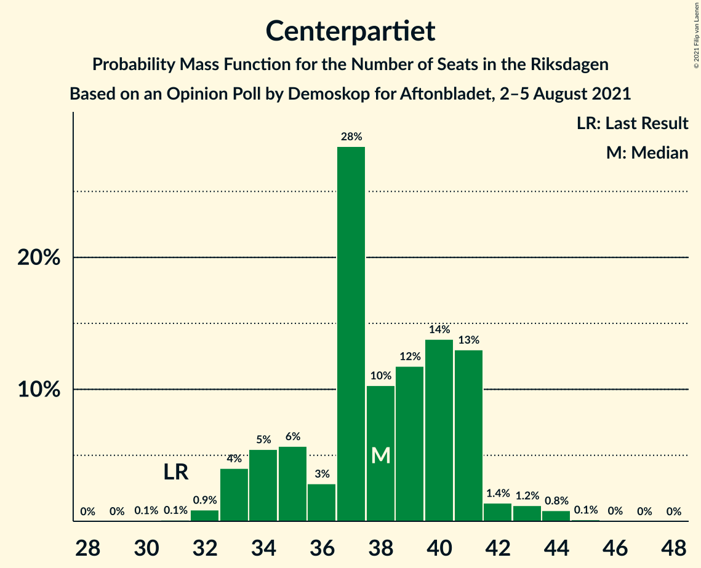
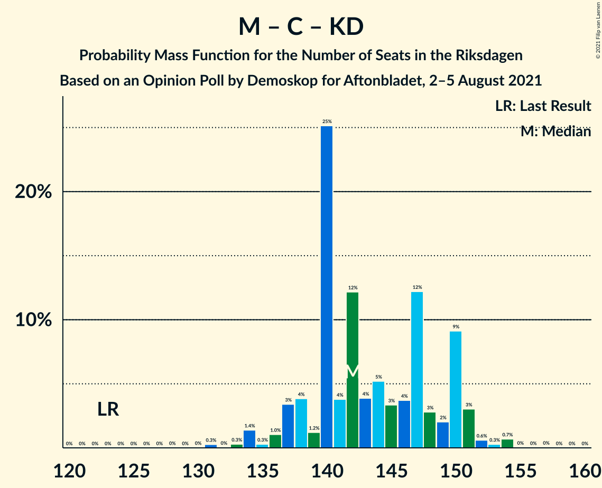

# Opinion Poll by Demoskop for Aftonbladet, 2–5 August 2021

<a href="#voting-intentions">Voting Intentions</a> | <a href="#seats">Seats</a> | <a href="#coalitions">Coalitions</a> | <a href="#technical-information">Technical Information</a>

## Voting Intentions

### Confidence Intervals

| Party | Last Result | Poll Result | 80% Confidence Interval | 90% Confidence Interval | 95% Confidence Interval | 99% Confidence Interval |
|:-----:|:-----------:|:-----------:|:-----------------------:|:-----------------------:|:-----------------------:|:-----------------------:|
| Sveriges socialdemokratiska arbetareparti | 28.3% | 24.6% | 23.5–25.8% |23.2–26.1% |22.9–26.4% |22.4–26.9% |
| Moderata samlingspartiet | 19.8% | 23.2% | 22.1–24.3% |21.8–24.6% |21.5–24.9% |21.0–25.5% |
| Sverigedemokraterna | 17.5% | 19.9% | 18.9–21.0% |18.6–21.3% |18.3–21.5% |17.9–22.1% |
| Vänsterpartiet | 8.0% | 10.2% | 9.4–11.0% |9.2–11.3% |9.0–11.5% |8.7–11.9% |
| Centerpartiet | 8.6% | 10.1% | 9.4–10.9% |9.1–11.2% |9.0–11.4% |8.6–11.8% |
| Kristdemokraterna | 6.3% | 5.4% | 4.9–6.1% |4.7–6.2% |4.6–6.4% |4.3–6.7% |
| Miljöpartiet de gröna | 4.4% | 3.5% | 3.0–4.0% |2.9–4.2% |2.8–4.3% |2.6–4.6% |
| Liberalerna | 5.5% | 2.3% | 1.9–2.7% |1.8–2.9% |1.8–3.0% |1.6–3.2% |

*Note:* The poll result column reflects the actual value used in the calculations. Published results may vary slightly, and in addition be rounded to fewer digits.

## Seats

### Confidence Intervals

| Party | Last Result | Median | 80% Confidence Interval | 90% Confidence Interval | 95% Confidence Interval | 99% Confidence Interval |
|:-----:|:-----------:|:------:|:-----------------------:|:-----------------------:|:-----------------------:|:-----------------------:|
| <a href="#sveriges-socialdemokratiska-arbetareparti">Sveriges socialdemokratiska arbetareparti</a> | 100 | 92 | 87–96 |86–97 |85–97 |82–100 |
| <a href="#moderata-samlingspartiet">Moderata samlingspartiet</a> | 70 | 85 | 82–89 |80–91 |79–92 |78–95 |
| <a href="#sverigedemokraterna">Sverigedemokraterna</a> | 62 | 75 | 70–78 |69–79 |68–81 |66–83 |
| <a href="#vänsterpartiet">Vänsterpartiet</a> | 28 | 38 | 36–41 |34–42 |34–43 |32–44 |
| <a href="#centerpartiet">Centerpartiet</a> | 31 | 38 | 35–41 |34–42 |33–42 |32–44 |
| <a href="#kristdemokraterna">Kristdemokraterna</a> | 22 | 20 | 18–22 |17–23 |17–24 |16–25 |
| <a href="#miljöpartiet-de-gröna">Miljöpartiet de gröna</a> | 16 | 0 | 0 |0–15 |0–16 |0–17 |
| <a href="#liberalerna">Liberalerna</a> | 20 | 0 | 0 |0 |0 |0 |

### Sveriges socialdemokratiska arbetareparti

*For a full overview of the results for this party, see the [Sveriges socialdemokratiska arbetareparti](party-sverigessocialdemokratiskaarbetareparti.html) page.*

| Number of Seats | Probability | Accumulated | Special Marks |
|:---------------:|:-----------:|:-----------:|:-------------:|
| 80 | 0% | 100% |  |
| 81 | 0.1% | 99.9% |  |
| 82 | 0.4% | 99.8% |  |
| 83 | 0.6% | 99.4% |  |
| 84 | 0.8% | 98.9% |  |
| 85 | 3% | 98% |  |
| 86 | 5% | 95% |  |
| 87 | 5% | 91% |  |
| 88 | 10% | 86% |  |
| 89 | 8% | 76% |  |
| 90 | 6% | 68% |  |
| 91 | 7% | 62% |  |
| 92 | 5% | 55% | Median |
| 93 | 10% | 50% |  |
| 94 | 16% | 39% |  |
| 95 | 12% | 23% |  |
| 96 | 5% | 12% |  |
| 97 | 4% | 7% |  |
| 98 | 1.5% | 2% |  |
| 99 | 0.3% | 0.9% |  |
| 100 | 0.3% | 0.6% | Last Result |
| 101 | 0.1% | 0.3% |  |
| 102 | 0.1% | 0.2% |  |
| 103 | 0.1% | 0.1% |  |
| 104 | 0% | 0% |  |

### Moderata samlingspartiet

*For a full overview of the results for this party, see the [Moderata samlingspartiet](party-moderatasamlingspartiet.html) page.*

| Number of Seats | Probability | Accumulated | Special Marks |
|:---------------:|:-----------:|:-----------:|:-------------:|
| 70 | 0% | 100% | Last Result |
| 71 | 0% | 100% |  |
| 72 | 0% | 100% |  |
| 73 | 0% | 100% |  |
| 74 | 0% | 100% |  |
| 75 | 0.1% | 99.9% |  |
| 76 | 0.1% | 99.9% |  |
| 77 | 0.2% | 99.8% |  |
| 78 | 1.3% | 99.5% |  |
| 79 | 1.1% | 98% |  |
| 80 | 3% | 97% |  |
| 81 | 3% | 94% |  |
| 82 | 5% | 91% |  |
| 83 | 13% | 87% |  |
| 84 | 10% | 73% |  |
| 85 | 15% | 63% | Median |
| 86 | 9% | 48% |  |
| 87 | 15% | 39% |  |
| 88 | 7% | 24% |  |
| 89 | 7% | 17% |  |
| 90 | 4% | 10% |  |
| 91 | 2% | 6% |  |
| 92 | 2% | 4% |  |
| 93 | 1.0% | 2% |  |
| 94 | 0.5% | 1.0% |  |
| 95 | 0.3% | 0.5% |  |
| 96 | 0.1% | 0.2% |  |
| 97 | 0.1% | 0.1% |  |
| 98 | 0% | 0% |  |

### Sverigedemokraterna

*For a full overview of the results for this party, see the [Sverigedemokraterna](party-sverigedemokraterna.html) page.*

| Number of Seats | Probability | Accumulated | Special Marks |
|:---------------:|:-----------:|:-----------:|:-------------:|
| 62 | 0% | 100% | Last Result |
| 63 | 0.1% | 100% |  |
| 64 | 0.1% | 99.9% |  |
| 65 | 0.2% | 99.8% |  |
| 66 | 0.4% | 99.6% |  |
| 67 | 0.9% | 99.1% |  |
| 68 | 2% | 98% |  |
| 69 | 3% | 97% |  |
| 70 | 4% | 94% |  |
| 71 | 6% | 90% |  |
| 72 | 7% | 83% |  |
| 73 | 12% | 76% |  |
| 74 | 8% | 64% |  |
| 75 | 14% | 56% | Median |
| 76 | 13% | 42% |  |
| 77 | 14% | 30% |  |
| 78 | 8% | 16% |  |
| 79 | 4% | 8% |  |
| 80 | 1.5% | 5% |  |
| 81 | 2% | 3% |  |
| 82 | 0.7% | 1.2% |  |
| 83 | 0.4% | 0.5% |  |
| 84 | 0.1% | 0.1% |  |
| 85 | 0% | 0% |  |

### Vänsterpartiet

*For a full overview of the results for this party, see the [Vänsterpartiet](party-vänsterpartiet.html) page.*

| Number of Seats | Probability | Accumulated | Special Marks |
|:---------------:|:-----------:|:-----------:|:-------------:|
| 28 | 0% | 100% | Last Result |
| 29 | 0% | 100% |  |
| 30 | 0% | 100% |  |
| 31 | 0.2% | 100% |  |
| 32 | 0.6% | 99.8% |  |
| 33 | 2% | 99.2% |  |
| 34 | 3% | 98% |  |
| 35 | 4% | 95% |  |
| 36 | 24% | 91% |  |
| 37 | 15% | 67% |  |
| 38 | 19% | 51% | Median |
| 39 | 9% | 32% |  |
| 40 | 4% | 23% |  |
| 41 | 12% | 19% |  |
| 42 | 5% | 7% |  |
| 43 | 2% | 3% |  |
| 44 | 0.5% | 0.7% |  |
| 45 | 0.1% | 0.3% |  |
| 46 | 0.1% | 0.2% |  |
| 47 | 0% | 0% |  |

### Centerpartiet

*For a full overview of the results for this party, see the [Centerpartiet](party-centerpartiet.html) page.*

| Number of Seats | Probability | Accumulated | Special Marks |
|:---------------:|:-----------:|:-----------:|:-------------:|
| 30 | 0.1% | 100% |  |
| 31 | 0.3% | 99.9% | Last Result |
| 32 | 0.7% | 99.7% |  |
| 33 | 2% | 99.0% |  |
| 34 | 4% | 97% |  |
| 35 | 8% | 93% |  |
| 36 | 7% | 85% |  |
| 37 | 19% | 78% |  |
| 38 | 18% | 59% | Median |
| 39 | 15% | 41% |  |
| 40 | 9% | 26% |  |
| 41 | 7% | 16% |  |
| 42 | 7% | 9% |  |
| 43 | 1.3% | 2% |  |
| 44 | 0.8% | 1.1% |  |
| 45 | 0.2% | 0.3% |  |
| 46 | 0.1% | 0.1% |  |
| 47 | 0% | 0% |  |

### Kristdemokraterna

*For a full overview of the results for this party, see the [Kristdemokraterna](party-kristdemokraterna.html) page.*

| Number of Seats | Probability | Accumulated | Special Marks |
|:---------------:|:-----------:|:-----------:|:-------------:|
| 15 | 0.2% | 100% |  |
| 16 | 1.2% | 99.8% |  |
| 17 | 5% | 98.6% |  |
| 18 | 11% | 94% |  |
| 19 | 22% | 83% |  |
| 20 | 21% | 61% | Median |
| 21 | 18% | 40% |  |
| 22 | 13% | 22% | Last Result |
| 23 | 6% | 9% |  |
| 24 | 3% | 3% |  |
| 25 | 0.6% | 0.8% |  |
| 26 | 0.2% | 0.2% |  |
| 27 | 0% | 0% |  |

### Miljöpartiet de gröna

*For a full overview of the results for this party, see the [Miljöpartiet de gröna](party-miljöpartietdegröna.html) page.*

| Number of Seats | Probability | Accumulated | Special Marks |
|:---------------:|:-----------:|:-----------:|:-------------:|
| 0 | 92% | 100% | Median |
| 1 | 0% | 8% |  |
| 2 | 0% | 8% |  |
| 3 | 0% | 8% |  |
| 4 | 0% | 8% |  |
| 5 | 0% | 8% |  |
| 6 | 0% | 8% |  |
| 7 | 0% | 8% |  |
| 8 | 0% | 8% |  |
| 9 | 0% | 8% |  |
| 10 | 0% | 8% |  |
| 11 | 0% | 8% |  |
| 12 | 0% | 8% |  |
| 13 | 0% | 8% |  |
| 14 | 1.2% | 8% |  |
| 15 | 4% | 6% |  |
| 16 | 2% | 3% | Last Result |
| 17 | 0.6% | 0.7% |  |
| 18 | 0.1% | 0.1% |  |
| 19 | 0% | 0% |  |

### Liberalerna

*For a full overview of the results for this party, see the [Liberalerna](party-liberalerna.html) page.*

| Number of Seats | Probability | Accumulated | Special Marks |
|:---------------:|:-----------:|:-----------:|:-------------:|
| 0 | 100% | 100% | Median |
| 1 | 0% | 0% |  |
| 2 | 0% | 0% |  |
| 3 | 0% | 0% |  |
| 4 | 0% | 0% |  |
| 5 | 0% | 0% |  |
| 6 | 0% | 0% |  |
| 7 | 0% | 0% |  |
| 8 | 0% | 0% |  |
| 9 | 0% | 0% |  |
| 10 | 0% | 0% |  |
| 11 | 0% | 0% |  |
| 12 | 0% | 0% |  |
| 13 | 0% | 0% |  |
| 14 | 0% | 0% |  |
| 15 | 0% | 0% |  |
| 16 | 0% | 0% |  |
| 17 | 0% | 0% |  |
| 18 | 0% | 0% |  |
| 19 | 0% | 0% |  |
| 20 | 0% | 0% | Last Result |

## Coalitions

### Confidence Intervals

| Coalition | Last Result | Median | Majority? | 80% Confidence Interval | 90% Confidence Interval | 95% Confidence Interval | 99% Confidence Interval |
|:---------:|:-----------:|:------:|:---------:|:-----------------------:|:-----------------------:|:-----------------------:|:-----------------------:|
| Sveriges socialdemokratiska arbetareparti – Moderata samlingspartiet – Centerpartiet | 201 | 216 | 100% | 210–220 | 208–221 | 205–223 | 202–225 |
| Moderata samlingspartiet – Sverigedemokraterna – Kristdemokraterna | 154 | 181 | 91% | 175–186 | 173–187 | 171–188 | 168–190 |
| Sveriges socialdemokratiska arbetareparti – Moderata samlingspartiet | 170 | 178 | 74% | 172–181 | 171–184 | 169–185 | 165–187 |
| Sveriges socialdemokratiska arbetareparti – Vänsterpartiet – Centerpartiet – Miljöpartiet de gröna – Liberalerna | 195 | 168 | 9% | 163–174 | 162–176 | 161–178 | 159–181 |
| Moderata samlingspartiet – Sverigedemokraterna | 132 | 161 | 0% | 155–165 | 153–167 | 151–168 | 148–170 |
| Moderata samlingspartiet – Centerpartiet – Kristdemokraterna – Liberalerna | 143 | 143 | 0% | 139–149 | 137–150 | 136–151 | 133–154 |
| Moderata samlingspartiet – Centerpartiet – Kristdemokraterna | 123 | 143 | 0% | 139–149 | 137–150 | 136–151 | 133–154 |
| Sveriges socialdemokratiska arbetareparti – Vänsterpartiet – Miljöpartiet de gröna | 144 | 130 | 0% | 125–136 | 124–139 | 123–142 | 121–145 |
| Sveriges socialdemokratiska arbetareparti – Centerpartiet – Miljöpartiet de gröna – Liberalerna | 167 | 131 | 0% | 125–136 | 124–139 | 123–140 | 121–145 |
| Sveriges socialdemokratiska arbetareparti – Vänsterpartiet | 128 | 130 | 0% | 124–135 | 123–136 | 122–136 | 119–139 |
| Moderata samlingspartiet – Centerpartiet – Liberalerna | 121 | 124 | 0% | 119–129 | 117–130 | 116–131 | 114–133 |
| Moderata samlingspartiet – Centerpartiet | 101 | 124 | 0% | 119–129 | 117–130 | 116–131 | 114–133 |
| Sveriges socialdemokratiska arbetareparti – Miljöpartiet de gröna | 116 | 93 | 0% | 87–97 | 86–102 | 85–105 | 84–108 |

### Sveriges socialdemokratiska arbetareparti – Moderata samlingspartiet – Centerpartiet

| Number of Seats | Probability | Accumulated | Special Marks |
|:---------------:|:-----------:|:-----------:|:-------------:|
| 198 | 0% | 100% |  |
| 199 | 0.1% | 99.9% |  |
| 200 | 0.1% | 99.9% |  |
| 201 | 0.1% | 99.7% | Last Result |
| 202 | 0.2% | 99.6% |  |
| 203 | 1.0% | 99.4% |  |
| 204 | 0.6% | 98% |  |
| 205 | 0.6% | 98% |  |
| 206 | 0.5% | 97% |  |
| 207 | 2% | 97% |  |
| 208 | 2% | 95% |  |
| 209 | 2% | 93% |  |
| 210 | 3% | 91% |  |
| 211 | 6% | 88% |  |
| 212 | 6% | 83% |  |
| 213 | 8% | 77% |  |
| 214 | 7% | 68% |  |
| 215 | 10% | 62% | Median |
| 216 | 10% | 52% |  |
| 217 | 11% | 42% |  |
| 218 | 10% | 31% |  |
| 219 | 7% | 21% |  |
| 220 | 5% | 14% |  |
| 221 | 4% | 9% |  |
| 222 | 2% | 5% |  |
| 223 | 2% | 3% |  |
| 224 | 1.0% | 1.5% |  |
| 225 | 0.2% | 0.5% |  |
| 226 | 0.2% | 0.3% |  |
| 227 | 0.1% | 0.1% |  |
| 228 | 0% | 0.1% |  |
| 229 | 0% | 0% |  |

### Moderata samlingspartiet – Sverigedemokraterna – Kristdemokraterna

| Number of Seats | Probability | Accumulated | Special Marks |
|:---------------:|:-----------:|:-----------:|:-------------:|
| 154 | 0% | 100% | Last Result |
| 155 | 0% | 100% |  |
| 156 | 0% | 100% |  |
| 157 | 0% | 100% |  |
| 158 | 0% | 100% |  |
| 159 | 0% | 100% |  |
| 160 | 0% | 100% |  |
| 161 | 0% | 100% |  |
| 162 | 0% | 100% |  |
| 163 | 0% | 100% |  |
| 164 | 0% | 100% |  |
| 165 | 0.1% | 99.9% |  |
| 166 | 0.1% | 99.9% |  |
| 167 | 0.2% | 99.8% |  |
| 168 | 0.4% | 99.6% |  |
| 169 | 0.3% | 99.2% |  |
| 170 | 0.6% | 98.9% |  |
| 171 | 1.3% | 98% |  |
| 172 | 1.5% | 97% |  |
| 173 | 2% | 95% |  |
| 174 | 3% | 93% |  |
| 175 | 4% | 91% | Majority |
| 176 | 4% | 87% |  |
| 177 | 5% | 83% |  |
| 178 | 7% | 77% |  |
| 179 | 9% | 71% |  |
| 180 | 11% | 62% | Median |
| 181 | 11% | 50% |  |
| 182 | 9% | 39% |  |
| 183 | 11% | 31% |  |
| 184 | 6% | 20% |  |
| 185 | 4% | 14% |  |
| 186 | 4% | 10% |  |
| 187 | 2% | 6% |  |
| 188 | 2% | 4% |  |
| 189 | 1.0% | 2% |  |
| 190 | 0.4% | 0.8% |  |
| 191 | 0.2% | 0.4% |  |
| 192 | 0.1% | 0.2% |  |
| 193 | 0.1% | 0.1% |  |
| 194 | 0% | 0% |  |

### Sveriges socialdemokratiska arbetareparti – Moderata samlingspartiet

| Number of Seats | Probability | Accumulated | Special Marks |
|:---------------:|:-----------:|:-----------:|:-------------:|
| 160 | 0% | 100% |  |
| 161 | 0.1% | 99.9% |  |
| 162 | 0.1% | 99.9% |  |
| 163 | 0.1% | 99.8% |  |
| 164 | 0.1% | 99.7% |  |
| 165 | 0.2% | 99.6% |  |
| 166 | 0.9% | 99.4% |  |
| 167 | 0.4% | 98% |  |
| 168 | 0.5% | 98% |  |
| 169 | 0.9% | 98% |  |
| 170 | 2% | 97% | Last Result |
| 171 | 1.5% | 95% |  |
| 172 | 4% | 94% |  |
| 173 | 5% | 89% |  |
| 174 | 10% | 84% |  |
| 175 | 7% | 74% | Majority |
| 176 | 9% | 67% |  |
| 177 | 8% | 58% | Median |
| 178 | 11% | 51% |  |
| 179 | 11% | 39% |  |
| 180 | 10% | 28% |  |
| 181 | 8% | 18% |  |
| 182 | 3% | 10% |  |
| 183 | 2% | 7% |  |
| 184 | 2% | 5% |  |
| 185 | 1.0% | 3% |  |
| 186 | 1.3% | 2% |  |
| 187 | 0.8% | 1.2% |  |
| 188 | 0.2% | 0.3% |  |
| 189 | 0.1% | 0.2% |  |
| 190 | 0.1% | 0.1% |  |
| 191 | 0% | 0.1% |  |
| 192 | 0% | 0% |  |

### Sveriges socialdemokratiska arbetareparti – Vänsterpartiet – Centerpartiet – Miljöpartiet de gröna – Liberalerna

| Number of Seats | Probability | Accumulated | Special Marks |
|:---------------:|:-----------:|:-----------:|:-------------:|
| 156 | 0.1% | 100% |  |
| 157 | 0.1% | 99.9% |  |
| 158 | 0.2% | 99.8% |  |
| 159 | 0.4% | 99.6% |  |
| 160 | 1.0% | 99.2% |  |
| 161 | 2% | 98% |  |
| 162 | 2% | 96% |  |
| 163 | 4% | 94% |  |
| 164 | 4% | 90% |  |
| 165 | 6% | 86% |  |
| 166 | 11% | 80% |  |
| 167 | 9% | 69% |  |
| 168 | 11% | 61% | Median |
| 169 | 11% | 50% |  |
| 170 | 9% | 38% |  |
| 171 | 7% | 29% |  |
| 172 | 5% | 23% |  |
| 173 | 4% | 17% |  |
| 174 | 4% | 13% |  |
| 175 | 3% | 9% | Majority |
| 176 | 2% | 7% |  |
| 177 | 1.5% | 5% |  |
| 178 | 1.3% | 3% |  |
| 179 | 0.6% | 2% |  |
| 180 | 0.3% | 1.1% |  |
| 181 | 0.4% | 0.8% |  |
| 182 | 0.2% | 0.4% |  |
| 183 | 0.1% | 0.2% |  |
| 184 | 0.1% | 0.1% |  |
| 185 | 0% | 0.1% |  |
| 186 | 0% | 0% |  |
| 187 | 0% | 0% |  |
| 188 | 0% | 0% |  |
| 189 | 0% | 0% |  |
| 190 | 0% | 0% |  |
| 191 | 0% | 0% |  |
| 192 | 0% | 0% |  |
| 193 | 0% | 0% |  |
| 194 | 0% | 0% |  |
| 195 | 0% | 0% | Last Result |

### Moderata samlingspartiet – Sverigedemokraterna

| Number of Seats | Probability | Accumulated | Special Marks |
|:---------------:|:-----------:|:-----------:|:-------------:|
| 132 | 0% | 100% | Last Result |
| 133 | 0% | 100% |  |
| 134 | 0% | 100% |  |
| 135 | 0% | 100% |  |
| 136 | 0% | 100% |  |
| 137 | 0% | 100% |  |
| 138 | 0% | 100% |  |
| 139 | 0% | 100% |  |
| 140 | 0% | 100% |  |
| 141 | 0% | 100% |  |
| 142 | 0% | 100% |  |
| 143 | 0% | 100% |  |
| 144 | 0% | 100% |  |
| 145 | 0% | 100% |  |
| 146 | 0.1% | 99.9% |  |
| 147 | 0.2% | 99.9% |  |
| 148 | 0.3% | 99.7% |  |
| 149 | 0.2% | 99.4% |  |
| 150 | 0.6% | 99.2% |  |
| 151 | 2% | 98.6% |  |
| 152 | 1.2% | 97% |  |
| 153 | 2% | 96% |  |
| 154 | 3% | 94% |  |
| 155 | 4% | 91% |  |
| 156 | 3% | 87% |  |
| 157 | 9% | 84% |  |
| 158 | 8% | 75% |  |
| 159 | 7% | 67% |  |
| 160 | 7% | 59% | Median |
| 161 | 15% | 52% |  |
| 162 | 9% | 38% |  |
| 163 | 7% | 28% |  |
| 164 | 10% | 21% |  |
| 165 | 3% | 11% |  |
| 166 | 3% | 8% |  |
| 167 | 2% | 5% |  |
| 168 | 2% | 3% |  |
| 169 | 0.9% | 2% |  |
| 170 | 0.4% | 0.7% |  |
| 171 | 0.2% | 0.3% |  |
| 172 | 0.1% | 0.2% |  |
| 173 | 0% | 0.1% |  |
| 174 | 0% | 0% |  |

### Moderata samlingspartiet – Centerpartiet – Kristdemokraterna – Liberalerna

| Number of Seats | Probability | Accumulated | Special Marks |
|:---------------:|:-----------:|:-----------:|:-------------:|
| 130 | 0% | 100% |  |
| 131 | 0.1% | 99.9% |  |
| 132 | 0.2% | 99.8% |  |
| 133 | 0.2% | 99.7% |  |
| 134 | 0.5% | 99.5% |  |
| 135 | 1.3% | 99.0% |  |
| 136 | 1.5% | 98% |  |
| 137 | 2% | 96% |  |
| 138 | 4% | 94% |  |
| 139 | 3% | 90% |  |
| 140 | 8% | 87% |  |
| 141 | 11% | 79% |  |
| 142 | 6% | 68% |  |
| 143 | 13% | 62% | Last Result, Median |
| 144 | 9% | 49% |  |
| 145 | 7% | 40% |  |
| 146 | 6% | 33% |  |
| 147 | 5% | 27% |  |
| 148 | 7% | 21% |  |
| 149 | 6% | 14% |  |
| 150 | 4% | 8% |  |
| 151 | 2% | 4% |  |
| 152 | 1.3% | 2% |  |
| 153 | 0.4% | 1.0% |  |
| 154 | 0.4% | 0.6% |  |
| 155 | 0.1% | 0.2% |  |
| 156 | 0.1% | 0.1% |  |
| 157 | 0% | 0% |  |

### Moderata samlingspartiet – Centerpartiet – Kristdemokraterna

| Number of Seats | Probability | Accumulated | Special Marks |
|:---------------:|:-----------:|:-----------:|:-------------:|
| 123 | 0% | 100% | Last Result |
| 124 | 0% | 100% |  |
| 125 | 0% | 100% |  |
| 126 | 0% | 100% |  |
| 127 | 0% | 100% |  |
| 128 | 0% | 100% |  |
| 129 | 0% | 100% |  |
| 130 | 0% | 100% |  |
| 131 | 0.1% | 99.9% |  |
| 132 | 0.2% | 99.8% |  |
| 133 | 0.2% | 99.7% |  |
| 134 | 0.5% | 99.5% |  |
| 135 | 1.3% | 99.0% |  |
| 136 | 1.5% | 98% |  |
| 137 | 2% | 96% |  |
| 138 | 4% | 94% |  |
| 139 | 3% | 90% |  |
| 140 | 8% | 87% |  |
| 141 | 11% | 79% |  |
| 142 | 6% | 68% |  |
| 143 | 13% | 62% | Median |
| 144 | 9% | 49% |  |
| 145 | 7% | 40% |  |
| 146 | 6% | 33% |  |
| 147 | 5% | 27% |  |
| 148 | 7% | 21% |  |
| 149 | 6% | 14% |  |
| 150 | 4% | 8% |  |
| 151 | 2% | 4% |  |
| 152 | 1.3% | 2% |  |
| 153 | 0.4% | 1.0% |  |
| 154 | 0.4% | 0.6% |  |
| 155 | 0.1% | 0.2% |  |
| 156 | 0.1% | 0.1% |  |
| 157 | 0% | 0% |  |

### Sveriges socialdemokratiska arbetareparti – Vänsterpartiet – Miljöpartiet de gröna

| Number of Seats | Probability | Accumulated | Special Marks |
|:---------------:|:-----------:|:-----------:|:-------------:|
| 119 | 0.1% | 100% |  |
| 120 | 0.1% | 99.9% |  |
| 121 | 0.4% | 99.7% |  |
| 122 | 1.0% | 99.3% |  |
| 123 | 2% | 98% |  |
| 124 | 4% | 96% |  |
| 125 | 4% | 92% |  |
| 126 | 8% | 88% |  |
| 127 | 8% | 80% |  |
| 128 | 4% | 72% |  |
| 129 | 7% | 68% |  |
| 130 | 12% | 61% | Median |
| 131 | 10% | 49% |  |
| 132 | 9% | 39% |  |
| 133 | 5% | 30% |  |
| 134 | 7% | 25% |  |
| 135 | 5% | 17% |  |
| 136 | 4% | 12% |  |
| 137 | 2% | 9% |  |
| 138 | 0.9% | 7% |  |
| 139 | 1.2% | 6% |  |
| 140 | 0.9% | 5% |  |
| 141 | 1.3% | 4% |  |
| 142 | 0.9% | 3% |  |
| 143 | 0.7% | 2% |  |
| 144 | 0.3% | 1.0% | Last Result |
| 145 | 0.3% | 0.7% |  |
| 146 | 0.2% | 0.4% |  |
| 147 | 0.1% | 0.1% |  |
| 148 | 0.1% | 0.1% |  |
| 149 | 0% | 0% |  |

### Sveriges socialdemokratiska arbetareparti – Centerpartiet – Miljöpartiet de gröna – Liberalerna

| Number of Seats | Probability | Accumulated | Special Marks |
|:---------------:|:-----------:|:-----------:|:-------------:|
| 118 | 0% | 100% |  |
| 119 | 0.1% | 99.9% |  |
| 120 | 0.2% | 99.8% |  |
| 121 | 0.4% | 99.6% |  |
| 122 | 0.9% | 99.3% |  |
| 123 | 2% | 98% |  |
| 124 | 2% | 96% |  |
| 125 | 4% | 94% |  |
| 126 | 4% | 90% |  |
| 127 | 7% | 85% |  |
| 128 | 7% | 78% |  |
| 129 | 10% | 72% |  |
| 130 | 10% | 62% | Median |
| 131 | 11% | 52% |  |
| 132 | 10% | 41% |  |
| 133 | 8% | 31% |  |
| 134 | 6% | 22% |  |
| 135 | 3% | 17% |  |
| 136 | 3% | 13% |  |
| 137 | 2% | 10% |  |
| 138 | 2% | 8% |  |
| 139 | 2% | 6% |  |
| 140 | 1.1% | 4% |  |
| 141 | 0.6% | 2% |  |
| 142 | 0.4% | 2% |  |
| 143 | 0.3% | 1.4% |  |
| 144 | 0.4% | 1.1% |  |
| 145 | 0.4% | 0.7% |  |
| 146 | 0.2% | 0.3% |  |
| 147 | 0.1% | 0.1% |  |
| 148 | 0% | 0.1% |  |
| 149 | 0% | 0% |  |
| 150 | 0% | 0% |  |
| 151 | 0% | 0% |  |
| 152 | 0% | 0% |  |
| 153 | 0% | 0% |  |
| 154 | 0% | 0% |  |
| 155 | 0% | 0% |  |
| 156 | 0% | 0% |  |
| 157 | 0% | 0% |  |
| 158 | 0% | 0% |  |
| 159 | 0% | 0% |  |
| 160 | 0% | 0% |  |
| 161 | 0% | 0% |  |
| 162 | 0% | 0% |  |
| 163 | 0% | 0% |  |
| 164 | 0% | 0% |  |
| 165 | 0% | 0% |  |
| 166 | 0% | 0% |  |
| 167 | 0% | 0% | Last Result |

### Sveriges socialdemokratiska arbetareparti – Vänsterpartiet

| Number of Seats | Probability | Accumulated | Special Marks |
|:---------------:|:-----------:|:-----------:|:-------------:|
| 116 | 0.1% | 100% |  |
| 117 | 0.1% | 99.9% |  |
| 118 | 0.3% | 99.8% |  |
| 119 | 0.3% | 99.5% |  |
| 120 | 0.5% | 99.3% |  |
| 121 | 0.8% | 98.8% |  |
| 122 | 2% | 98% |  |
| 123 | 3% | 96% |  |
| 124 | 5% | 94% |  |
| 125 | 5% | 89% |  |
| 126 | 9% | 84% |  |
| 127 | 10% | 75% |  |
| 128 | 4% | 66% | Last Result |
| 129 | 7% | 61% |  |
| 130 | 12% | 54% | Median |
| 131 | 10% | 42% |  |
| 132 | 9% | 31% |  |
| 133 | 5% | 22% |  |
| 134 | 7% | 18% |  |
| 135 | 5% | 10% |  |
| 136 | 3% | 5% |  |
| 137 | 1.2% | 2% |  |
| 138 | 0.4% | 1.1% |  |
| 139 | 0.5% | 0.7% |  |
| 140 | 0.2% | 0.3% |  |
| 141 | 0% | 0.1% |  |
| 142 | 0% | 0.1% |  |
| 143 | 0% | 0% |  |

### Moderata samlingspartiet – Centerpartiet – Liberalerna

| Number of Seats | Probability | Accumulated | Special Marks |
|:---------------:|:-----------:|:-----------:|:-------------:|
| 111 | 0.1% | 100% |  |
| 112 | 0.1% | 99.9% |  |
| 113 | 0.2% | 99.8% |  |
| 114 | 0.3% | 99.6% |  |
| 115 | 1.4% | 99.3% |  |
| 116 | 1.2% | 98% |  |
| 117 | 2% | 97% |  |
| 118 | 4% | 94% |  |
| 119 | 3% | 90% |  |
| 120 | 10% | 87% |  |
| 121 | 9% | 78% | Last Result |
| 122 | 8% | 69% |  |
| 123 | 10% | 61% | Median |
| 124 | 10% | 51% |  |
| 125 | 12% | 41% |  |
| 126 | 7% | 30% |  |
| 127 | 5% | 23% |  |
| 128 | 6% | 17% |  |
| 129 | 5% | 12% |  |
| 130 | 4% | 7% |  |
| 131 | 1.1% | 3% |  |
| 132 | 0.9% | 2% |  |
| 133 | 0.6% | 1.0% |  |
| 134 | 0.2% | 0.4% |  |
| 135 | 0.1% | 0.2% |  |
| 136 | 0% | 0.1% |  |
| 137 | 0% | 0% |  |

### Moderata samlingspartiet – Centerpartiet

| Number of Seats | Probability | Accumulated | Special Marks |
|:---------------:|:-----------:|:-----------:|:-------------:|
| 101 | 0% | 100% | Last Result |
| 102 | 0% | 100% |  |
| 103 | 0% | 100% |  |
| 104 | 0% | 100% |  |
| 105 | 0% | 100% |  |
| 106 | 0% | 100% |  |
| 107 | 0% | 100% |  |
| 108 | 0% | 100% |  |
| 109 | 0% | 100% |  |
| 110 | 0% | 100% |  |
| 111 | 0.1% | 100% |  |
| 112 | 0.1% | 99.9% |  |
| 113 | 0.2% | 99.8% |  |
| 114 | 0.3% | 99.6% |  |
| 115 | 1.4% | 99.3% |  |
| 116 | 1.2% | 98% |  |
| 117 | 2% | 97% |  |
| 118 | 4% | 94% |  |
| 119 | 3% | 90% |  |
| 120 | 10% | 87% |  |
| 121 | 9% | 78% |  |
| 122 | 8% | 69% |  |
| 123 | 10% | 61% | Median |
| 124 | 10% | 51% |  |
| 125 | 12% | 41% |  |
| 126 | 7% | 30% |  |
| 127 | 5% | 23% |  |
| 128 | 6% | 17% |  |
| 129 | 5% | 12% |  |
| 130 | 4% | 7% |  |
| 131 | 1.1% | 3% |  |
| 132 | 0.9% | 2% |  |
| 133 | 0.6% | 1.0% |  |
| 134 | 0.2% | 0.4% |  |
| 135 | 0.1% | 0.2% |  |
| 136 | 0% | 0.1% |  |
| 137 | 0% | 0% |  |

### Sveriges socialdemokratiska arbetareparti – Miljöpartiet de gröna

| Number of Seats | Probability | Accumulated | Special Marks |
|:---------------:|:-----------:|:-----------:|:-------------:|
| 82 | 0% | 100% |  |
| 83 | 0.2% | 99.9% |  |
| 84 | 0.4% | 99.7% |  |
| 85 | 2% | 99.3% |  |
| 86 | 4% | 97% |  |
| 87 | 4% | 93% |  |
| 88 | 9% | 89% |  |
| 89 | 7% | 80% |  |
| 90 | 5% | 72% |  |
| 91 | 6% | 67% |  |
| 92 | 4% | 61% | Median |
| 93 | 10% | 57% |  |
| 94 | 16% | 47% |  |
| 95 | 12% | 31% |  |
| 96 | 5% | 19% |  |
| 97 | 5% | 14% |  |
| 98 | 2% | 10% |  |
| 99 | 0.6% | 8% |  |
| 100 | 0.8% | 7% |  |
| 101 | 0.6% | 6% |  |
| 102 | 1.3% | 6% |  |
| 103 | 0.6% | 5% |  |
| 104 | 0.7% | 4% |  |
| 105 | 0.9% | 3% |  |
| 106 | 0.5% | 2% |  |
| 107 | 1.2% | 2% |  |
| 108 | 0.2% | 0.5% |  |
| 109 | 0.2% | 0.3% |  |
| 110 | 0.1% | 0.1% |  |
| 111 | 0% | 0.1% |  |
| 112 | 0% | 0% |  |
| 113 | 0% | 0% |  |
| 114 | 0% | 0% |  |
| 115 | 0% | 0% |  |
| 116 | 0% | 0% | Last Result |

## Technical Information

### Opinion Poll

+ **Polling firm:** Demoskop
+ **Commissioner(s):** Aftonbladet
+ **Fieldwork period:** 2–5 August 2021

### Calculations

+ **Sample size:** 2403
+ **Simulations done:** 1,048,576
+ **Error estimate:** 1.77%

