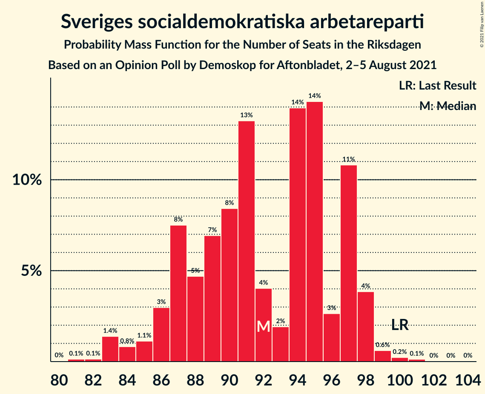
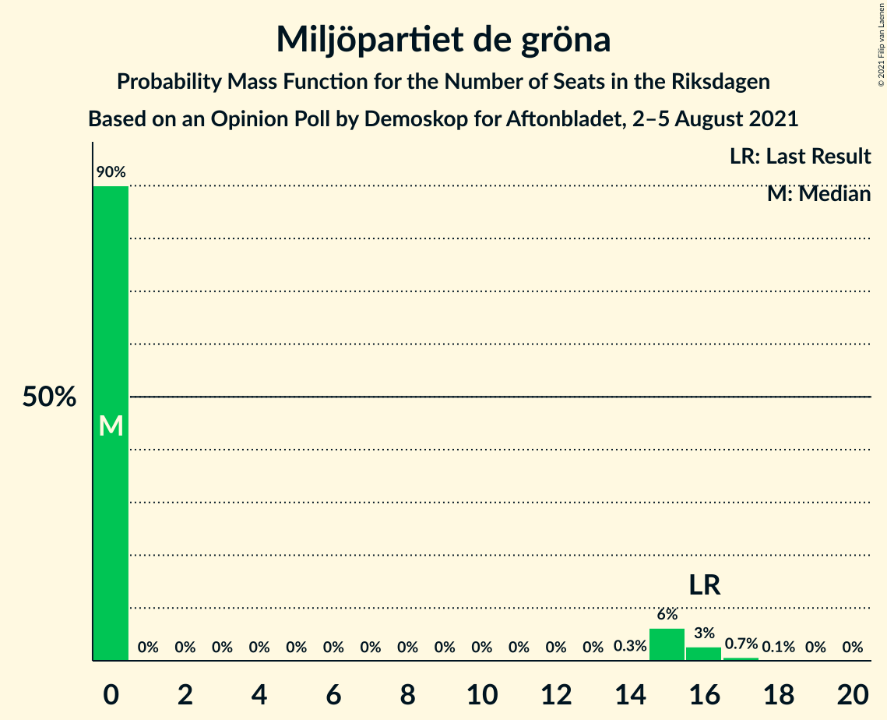

# Opinion Poll by Demoskop for Aftonbladet, 2–5 August 2021

<a href="#voting-intentions">Voting Intentions</a> | <a href="#seats">Seats</a> | <a href="#coalitions">Coalitions</a> | <a href="#technical-information">Technical Information</a>

## Voting Intentions

### Confidence Intervals

| Party | Last Result | Poll Result | 80% Confidence Interval | 90% Confidence Interval | 95% Confidence Interval | 99% Confidence Interval |
|:-----:|:-----------:|:-----------:|:-----------------------:|:-----------------------:|:-----------------------:|:-----------------------:|
| Sveriges socialdemokratiska arbetareparti | 28.3% | 24.6% | 23.5–25.8% |23.2–26.1% |22.9–26.4% |22.4–26.9% |
| Moderata samlingspartiet | 19.8% | 23.2% | 22.1–24.3% |21.8–24.6% |21.5–24.9% |21.0–25.5% |
| Sverigedemokraterna | 17.5% | 19.9% | 18.9–21.0% |18.6–21.3% |18.3–21.5% |17.9–22.1% |
| Vänsterpartiet | 8.0% | 10.2% | 9.4–11.0% |9.2–11.3% |9.0–11.5% |8.7–11.9% |
| Centerpartiet | 8.6% | 10.1% | 9.4–10.9% |9.1–11.2% |9.0–11.4% |8.6–11.8% |
| Kristdemokraterna | 6.3% | 5.4% | 4.9–6.1% |4.7–6.2% |4.6–6.4% |4.3–6.7% |
| Miljöpartiet de gröna | 4.4% | 3.5% | 3.0–4.0% |2.9–4.2% |2.8–4.3% |2.6–4.6% |
| Liberalerna | 5.5% | 2.3% | 1.9–2.7% |1.8–2.9% |1.8–3.0% |1.6–3.2% |

*Note:* The poll result column reflects the actual value used in the calculations. Published results may vary slightly, and in addition be rounded to fewer digits.

## Seats

### Confidence Intervals

| Party | Last Result | Median | 80% Confidence Interval | 90% Confidence Interval | 95% Confidence Interval | 99% Confidence Interval |
|:-----:|:-----------:|:------:|:-----------------------:|:-----------------------:|:-----------------------:|:-----------------------:|
| <a href="#sveriges-socialdemokratiska-arbetareparti">Sveriges socialdemokratiska arbetareparti</a> | 100 | 92 | 87–97 |86–97 |84–98 |83–99 |
| <a href="#moderata-samlingspartiet">Moderata samlingspartiet</a> | 70 | 86 | 82–90 |81–91 |80–92 |78–94 |
| <a href="#sverigedemokraterna">Sverigedemokraterna</a> | 62 | 74 | 70–78 |69–79 |68–80 |65–82 |
| <a href="#vänsterpartiet">Vänsterpartiet</a> | 28 | 37 | 34–41 |34–42 |33–43 |32–44 |
| <a href="#centerpartiet">Centerpartiet</a> | 31 | 38 | 34–41 |33–41 |33–42 |32–44 |
| <a href="#kristdemokraterna">Kristdemokraterna</a> | 22 | 20 | 17–22 |17–23 |17–24 |16–25 |
| <a href="#miljöpartiet-de-gröna">Miljöpartiet de gröna</a> | 16 | 0 | 0 |0–15 |0–16 |0–17 |
| <a href="#liberalerna">Liberalerna</a> | 20 | 0 | 0 |0 |0 |0 |

### Sveriges socialdemokratiska arbetareparti

*For a full overview of the results for this party, see the [Sveriges socialdemokratiska arbetareparti](party-sverigessocialdemokratiskaarbetareparti.html) page.*

| Number of Seats | Probability | Accumulated | Special Marks |
|:---------------:|:-----------:|:-----------:|:-------------:|
| 80 | 0% | 100% |  |
| 81 | 0.1% | 99.9% |  |
| 82 | 0.1% | 99.8% |  |
| 83 | 1.4% | 99.7% |  |
| 84 | 0.8% | 98% |  |
| 85 | 1.1% | 97% |  |
| 86 | 3% | 96% |  |
| 87 | 8% | 93% |  |
| 88 | 5% | 86% |  |
| 89 | 7% | 81% |  |
| 90 | 8% | 74% |  |
| 91 | 13% | 66% |  |
| 92 | 4% | 53% | Median |
| 93 | 2% | 49% |  |
| 94 | 14% | 47% |  |
| 95 | 14% | 33% |  |
| 96 | 3% | 18% |  |
| 97 | 11% | 16% |  |
| 98 | 4% | 5% |  |
| 99 | 0.6% | 1.0% |  |
| 100 | 0.2% | 0.4% | Last Result |
| 101 | 0.1% | 0.2% |  |
| 102 | 0% | 0.1% |  |
| 103 | 0% | 0.1% |  |
| 104 | 0% | 0% |  |

### Moderata samlingspartiet

*For a full overview of the results for this party, see the [Moderata samlingspartiet](party-moderatasamlingspartiet.html) page.*

| Number of Seats | Probability | Accumulated | Special Marks |
|:---------------:|:-----------:|:-----------:|:-------------:|
| 70 | 0% | 100% | Last Result |
| 71 | 0% | 100% |  |
| 72 | 0% | 100% |  |
| 73 | 0% | 100% |  |
| 74 | 0% | 100% |  |
| 75 | 0% | 99.9% |  |
| 76 | 0.2% | 99.9% |  |
| 77 | 0.2% | 99.8% |  |
| 78 | 0.6% | 99.6% |  |
| 79 | 0.6% | 98.9% |  |
| 80 | 1.4% | 98% |  |
| 81 | 4% | 97% |  |
| 82 | 6% | 93% |  |
| 83 | 19% | 87% |  |
| 84 | 11% | 68% |  |
| 85 | 5% | 57% |  |
| 86 | 15% | 52% | Median |
| 87 | 8% | 37% |  |
| 88 | 3% | 30% |  |
| 89 | 16% | 27% |  |
| 90 | 4% | 11% |  |
| 91 | 3% | 6% |  |
| 92 | 0.9% | 3% |  |
| 93 | 0.5% | 2% |  |
| 94 | 1.1% | 2% |  |
| 95 | 0.2% | 0.4% |  |
| 96 | 0.1% | 0.3% |  |
| 97 | 0% | 0.1% |  |
| 98 | 0.1% | 0.1% |  |
| 99 | 0% | 0% |  |

### Sverigedemokraterna

*For a full overview of the results for this party, see the [Sverigedemokraterna](party-sverigedemokraterna.html) page.*

| Number of Seats | Probability | Accumulated | Special Marks |
|:---------------:|:-----------:|:-----------:|:-------------:|
| 62 | 0% | 100% | Last Result |
| 63 | 0% | 100% |  |
| 64 | 0.1% | 100% |  |
| 65 | 0.5% | 99.9% |  |
| 66 | 0.3% | 99.4% |  |
| 67 | 0.7% | 99.1% |  |
| 68 | 1.1% | 98% |  |
| 69 | 4% | 97% |  |
| 70 | 4% | 93% |  |
| 71 | 6% | 89% |  |
| 72 | 6% | 83% |  |
| 73 | 20% | 77% |  |
| 74 | 13% | 57% | Median |
| 75 | 3% | 44% |  |
| 76 | 10% | 41% |  |
| 77 | 2% | 31% |  |
| 78 | 23% | 30% |  |
| 79 | 2% | 6% |  |
| 80 | 3% | 4% |  |
| 81 | 0.2% | 1.3% |  |
| 82 | 0.6% | 1.1% |  |
| 83 | 0.1% | 0.4% |  |
| 84 | 0.3% | 0.3% |  |
| 85 | 0% | 0% |  |

### Vänsterpartiet

*For a full overview of the results for this party, see the [Vänsterpartiet](party-vänsterpartiet.html) page.*

| Number of Seats | Probability | Accumulated | Special Marks |
|:---------------:|:-----------:|:-----------:|:-------------:|
| 28 | 0% | 100% | Last Result |
| 29 | 0% | 100% |  |
| 30 | 0% | 100% |  |
| 31 | 0.1% | 100% |  |
| 32 | 0.8% | 99.9% |  |
| 33 | 2% | 99.1% |  |
| 34 | 9% | 97% |  |
| 35 | 4% | 88% |  |
| 36 | 16% | 84% |  |
| 37 | 26% | 67% | Median |
| 38 | 9% | 41% |  |
| 39 | 17% | 33% |  |
| 40 | 4% | 15% |  |
| 41 | 3% | 11% |  |
| 42 | 5% | 9% |  |
| 43 | 3% | 4% |  |
| 44 | 0.4% | 0.5% |  |
| 45 | 0.1% | 0.1% |  |
| 46 | 0% | 0.1% |  |
| 47 | 0% | 0% |  |

### Centerpartiet

*For a full overview of the results for this party, see the [Centerpartiet](party-centerpartiet.html) page.*

| Number of Seats | Probability | Accumulated | Special Marks |
|:---------------:|:-----------:|:-----------:|:-------------:|
| 30 | 0.1% | 100% |  |
| 31 | 0.1% | 99.9% | Last Result |
| 32 | 0.9% | 99.8% |  |
| 33 | 4% | 98.9% |  |
| 34 | 5% | 95% |  |
| 35 | 6% | 89% |  |
| 36 | 3% | 84% |  |
| 37 | 28% | 81% |  |
| 38 | 10% | 52% | Median |
| 39 | 12% | 42% |  |
| 40 | 14% | 30% |  |
| 41 | 13% | 17% |  |
| 42 | 1.4% | 4% |  |
| 43 | 1.2% | 2% |  |
| 44 | 0.8% | 1.0% |  |
| 45 | 0.1% | 0.2% |  |
| 46 | 0% | 0.1% |  |
| 47 | 0% | 0% |  |

### Kristdemokraterna

*For a full overview of the results for this party, see the [Kristdemokraterna](party-kristdemokraterna.html) page.*

| Number of Seats | Probability | Accumulated | Special Marks |
|:---------------:|:-----------:|:-----------:|:-------------:|
| 0 | 0.1% | 100% |  |
| 1 | 0% | 99.9% |  |
| 2 | 0% | 99.9% |  |
| 3 | 0% | 99.9% |  |
| 4 | 0% | 99.9% |  |
| 5 | 0% | 99.9% |  |
| 6 | 0% | 99.9% |  |
| 7 | 0% | 99.9% |  |
| 8 | 0% | 99.9% |  |
| 9 | 0% | 99.9% |  |
| 10 | 0% | 99.9% |  |
| 11 | 0% | 99.9% |  |
| 12 | 0% | 99.9% |  |
| 13 | 0% | 99.9% |  |
| 14 | 0% | 99.9% |  |
| 15 | 0.2% | 99.9% |  |
| 16 | 1.3% | 99.8% |  |
| 17 | 12% | 98% |  |
| 18 | 11% | 87% |  |
| 19 | 20% | 76% |  |
| 20 | 30% | 56% | Median |
| 21 | 11% | 26% |  |
| 22 | 6% | 15% | Last Result |
| 23 | 5% | 9% |  |
| 24 | 3% | 4% |  |
| 25 | 0.7% | 0.8% |  |
| 26 | 0.1% | 0.1% |  |
| 27 | 0% | 0% |  |

### Miljöpartiet de gröna

*For a full overview of the results for this party, see the [Miljöpartiet de gröna](party-miljöpartietdegröna.html) page.*

| Number of Seats | Probability | Accumulated | Special Marks |
|:---------------:|:-----------:|:-----------:|:-------------:|
| 0 | 90% | 100% | Median |
| 1 | 0% | 10% |  |
| 2 | 0% | 10% |  |
| 3 | 0% | 10% |  |
| 4 | 0% | 10% |  |
| 5 | 0% | 10% |  |
| 6 | 0% | 10% |  |
| 7 | 0% | 10% |  |
| 8 | 0% | 10% |  |
| 9 | 0% | 10% |  |
| 10 | 0% | 10% |  |
| 11 | 0% | 10% |  |
| 12 | 0% | 10% |  |
| 13 | 0% | 10% |  |
| 14 | 0.3% | 10% |  |
| 15 | 6% | 10% |  |
| 16 | 3% | 3% | Last Result |
| 17 | 0.7% | 0.8% |  |
| 18 | 0.1% | 0.1% |  |
| 19 | 0% | 0% |  |

### Liberalerna

*For a full overview of the results for this party, see the [Liberalerna](party-liberalerna.html) page.*

| Number of Seats | Probability | Accumulated | Special Marks |
|:---------------:|:-----------:|:-----------:|:-------------:|
| 0 | 100% | 100% | Median |
| 1 | 0% | 0% |  |
| 2 | 0% | 0% |  |
| 3 | 0% | 0% |  |
| 4 | 0% | 0% |  |
| 5 | 0% | 0% |  |
| 6 | 0% | 0% |  |
| 7 | 0% | 0% |  |
| 8 | 0% | 0% |  |
| 9 | 0% | 0% |  |
| 10 | 0% | 0% |  |
| 11 | 0% | 0% |  |
| 12 | 0% | 0% |  |
| 13 | 0% | 0% |  |
| 14 | 0% | 0% |  |
| 15 | 0% | 0% |  |
| 16 | 0% | 0% |  |
| 17 | 0% | 0% |  |
| 18 | 0% | 0% |  |
| 19 | 0% | 0% |  |
| 20 | 0% | 0% | Last Result |

## Coalitions

### Confidence Intervals

| Coalition | Last Result | Median | Majority? | 80% Confidence Interval | 90% Confidence Interval | 95% Confidence Interval | 99% Confidence Interval |
|:---------:|:-----------:|:------:|:---------:|:-----------------------:|:-----------------------:|:-----------------------:|:-----------------------:|
| Sveriges socialdemokratiska arbetareparti – Moderata samlingspartiet – Centerpartiet | 201 | 217 | 100% | 209–221 | 207–221 | 204–223 | 201–225 |
| Moderata samlingspartiet – Sverigedemokraterna – Kristdemokraterna | 154 | 181 | 91% | 175–185 | 173–187 | 171–188 | 167–190 |
| Sveriges socialdemokratiska arbetareparti – Moderata samlingspartiet | 170 | 179 | 80% | 172–181 | 170–184 | 168–186 | 165–187 |
| Sveriges socialdemokratiska arbetareparti – Vänsterpartiet – Centerpartiet – Miljöpartiet de gröna – Liberalerna | 195 | 168 | 9% | 164–174 | 162–176 | 161–178 | 159–182 |
| Moderata samlingspartiet – Sverigedemokraterna | 132 | 161 | 0% | 154–164 | 153–166 | 151–168 | 148–170 |
| Moderata samlingspartiet – Centerpartiet – Kristdemokraterna – Liberalerna | 143 | 142 | 0% | 138–150 | 137–150 | 136–151 | 133–154 |
| Moderata samlingspartiet – Centerpartiet – Kristdemokraterna | 123 | 142 | 0% | 138–150 | 137–150 | 136–151 | 133–154 |
| Sveriges socialdemokratiska arbetareparti – Vänsterpartiet – Miljöpartiet de gröna | 144 | 131 | 0% | 125–137 | 125–140 | 123–141 | 122–146 |
| Sveriges socialdemokratiska arbetareparti – Centerpartiet – Miljöpartiet de gröna – Liberalerna | 167 | 131 | 0% | 126–138 | 125–139 | 124–140 | 121–145 |
| Sveriges socialdemokratiska arbetareparti – Vänsterpartiet | 128 | 130 | 0% | 125–135 | 122–136 | 121–137 | 118–139 |
| Moderata samlingspartiet – Centerpartiet – Liberalerna | 121 | 123 | 0% | 119–130 | 118–130 | 116–130 | 113–134 |
| Moderata samlingspartiet – Centerpartiet | 101 | 123 | 0% | 119–130 | 118–130 | 116–130 | 113–134 |
| Sveriges socialdemokratiska arbetareparti – Miljöpartiet de gröna | 116 | 94 | 0% | 88–98 | 87–103 | 86–106 | 85–108 |

### Sveriges socialdemokratiska arbetareparti – Moderata samlingspartiet – Centerpartiet

| Number of Seats | Probability | Accumulated | Special Marks |
|:---------------:|:-----------:|:-----------:|:-------------:|
| 199 | 0% | 100% |  |
| 200 | 0.1% | 99.9% |  |
| 201 | 0.4% | 99.9% | Last Result |
| 202 | 0.4% | 99.4% |  |
| 203 | 0.2% | 99.1% |  |
| 204 | 2% | 98.9% |  |
| 205 | 0.8% | 97% |  |
| 206 | 0.6% | 96% |  |
| 207 | 4% | 96% |  |
| 208 | 2% | 92% |  |
| 209 | 1.2% | 90% |  |
| 210 | 2% | 89% |  |
| 211 | 2% | 87% |  |
| 212 | 6% | 85% |  |
| 213 | 3% | 78% |  |
| 214 | 3% | 76% |  |
| 215 | 17% | 73% |  |
| 216 | 5% | 56% | Median |
| 217 | 13% | 51% |  |
| 218 | 11% | 39% |  |
| 219 | 7% | 27% |  |
| 220 | 1.1% | 20% |  |
| 221 | 15% | 19% |  |
| 222 | 1.2% | 4% |  |
| 223 | 1.4% | 3% |  |
| 224 | 0.6% | 1.2% |  |
| 225 | 0.2% | 0.6% |  |
| 226 | 0.2% | 0.4% |  |
| 227 | 0.1% | 0.2% |  |
| 228 | 0% | 0.1% |  |
| 229 | 0% | 0.1% |  |
| 230 | 0% | 0.1% |  |
| 231 | 0% | 0.1% |  |
| 232 | 0% | 0% |  |

### Moderata samlingspartiet – Sverigedemokraterna – Kristdemokraterna

| Number of Seats | Probability | Accumulated | Special Marks |
|:---------------:|:-----------:|:-----------:|:-------------:|
| 154 | 0% | 100% | Last Result |
| 155 | 0% | 100% |  |
| 156 | 0% | 100% |  |
| 157 | 0% | 100% |  |
| 158 | 0% | 100% |  |
| 159 | 0% | 100% |  |
| 160 | 0% | 100% |  |
| 161 | 0% | 100% |  |
| 162 | 0% | 100% |  |
| 163 | 0% | 100% |  |
| 164 | 0% | 100% |  |
| 165 | 0.1% | 100% |  |
| 166 | 0.2% | 99.8% |  |
| 167 | 0.2% | 99.7% |  |
| 168 | 1.0% | 99.5% |  |
| 169 | 0.2% | 98% |  |
| 170 | 0.5% | 98% |  |
| 171 | 0.5% | 98% |  |
| 172 | 2% | 97% |  |
| 173 | 1.1% | 96% |  |
| 174 | 4% | 94% |  |
| 175 | 12% | 91% | Majority |
| 176 | 3% | 79% |  |
| 177 | 4% | 76% |  |
| 178 | 3% | 72% |  |
| 179 | 2% | 69% |  |
| 180 | 7% | 67% | Median |
| 181 | 30% | 60% |  |
| 182 | 10% | 30% |  |
| 183 | 8% | 21% |  |
| 184 | 2% | 13% |  |
| 185 | 3% | 11% |  |
| 186 | 2% | 8% |  |
| 187 | 2% | 5% |  |
| 188 | 1.4% | 4% |  |
| 189 | 1.4% | 2% |  |
| 190 | 0.4% | 0.8% |  |
| 191 | 0.2% | 0.4% |  |
| 192 | 0.1% | 0.2% |  |
| 193 | 0% | 0.1% |  |
| 194 | 0.1% | 0.1% |  |
| 195 | 0% | 0% |  |

### Sveriges socialdemokratiska arbetareparti – Moderata samlingspartiet

| Number of Seats | Probability | Accumulated | Special Marks |
|:---------------:|:-----------:|:-----------:|:-------------:|
| 163 | 0% | 100% |  |
| 164 | 0.1% | 99.9% |  |
| 165 | 0.8% | 99.8% |  |
| 166 | 0.3% | 99.0% |  |
| 167 | 0.9% | 98.7% |  |
| 168 | 0.5% | 98% |  |
| 169 | 1.4% | 97% |  |
| 170 | 3% | 96% | Last Result |
| 171 | 2% | 93% |  |
| 172 | 1.3% | 91% |  |
| 173 | 3% | 89% |  |
| 174 | 6% | 86% |  |
| 175 | 2% | 80% | Majority |
| 176 | 5% | 78% |  |
| 177 | 7% | 73% |  |
| 178 | 15% | 66% | Median |
| 179 | 13% | 51% |  |
| 180 | 20% | 38% |  |
| 181 | 9% | 18% |  |
| 182 | 1.3% | 9% |  |
| 183 | 2% | 8% |  |
| 184 | 1.5% | 6% |  |
| 185 | 0.7% | 4% |  |
| 186 | 2% | 3% |  |
| 187 | 0.6% | 0.9% |  |
| 188 | 0.1% | 0.3% |  |
| 189 | 0.1% | 0.1% |  |
| 190 | 0% | 0.1% |  |
| 191 | 0% | 0% |  |

### Sveriges socialdemokratiska arbetareparti – Vänsterpartiet – Centerpartiet – Miljöpartiet de gröna – Liberalerna

| Number of Seats | Probability | Accumulated | Special Marks |
|:---------------:|:-----------:|:-----------:|:-------------:|
| 155 | 0.1% | 100% |  |
| 156 | 0% | 99.9% |  |
| 157 | 0.1% | 99.9% |  |
| 158 | 0.2% | 99.8% |  |
| 159 | 0.4% | 99.6% |  |
| 160 | 1.4% | 99.2% |  |
| 161 | 1.4% | 98% |  |
| 162 | 2% | 96% |  |
| 163 | 2% | 95% |  |
| 164 | 3% | 92% |  |
| 165 | 2% | 89% |  |
| 166 | 8% | 87% |  |
| 167 | 10% | 79% | Median |
| 168 | 30% | 70% |  |
| 169 | 7% | 40% |  |
| 170 | 2% | 33% |  |
| 171 | 3% | 31% |  |
| 172 | 4% | 28% |  |
| 173 | 3% | 24% |  |
| 174 | 12% | 21% |  |
| 175 | 4% | 9% | Majority |
| 176 | 1.1% | 6% |  |
| 177 | 2% | 4% |  |
| 178 | 0.5% | 3% |  |
| 179 | 0.5% | 2% |  |
| 180 | 0.2% | 2% |  |
| 181 | 1.0% | 2% |  |
| 182 | 0.2% | 0.5% |  |
| 183 | 0.2% | 0.3% |  |
| 184 | 0.1% | 0.2% |  |
| 185 | 0% | 0% |  |
| 186 | 0% | 0% |  |
| 187 | 0% | 0% |  |
| 188 | 0% | 0% |  |
| 189 | 0% | 0% |  |
| 190 | 0% | 0% |  |
| 191 | 0% | 0% |  |
| 192 | 0% | 0% |  |
| 193 | 0% | 0% |  |
| 194 | 0% | 0% |  |
| 195 | 0% | 0% | Last Result |

### Moderata samlingspartiet – Sverigedemokraterna

| Number of Seats | Probability | Accumulated | Special Marks |
|:---------------:|:-----------:|:-----------:|:-------------:|
| 132 | 0% | 100% | Last Result |
| 133 | 0% | 100% |  |
| 134 | 0% | 100% |  |
| 135 | 0% | 100% |  |
| 136 | 0% | 100% |  |
| 137 | 0% | 100% |  |
| 138 | 0% | 100% |  |
| 139 | 0% | 100% |  |
| 140 | 0% | 100% |  |
| 141 | 0% | 100% |  |
| 142 | 0% | 100% |  |
| 143 | 0% | 100% |  |
| 144 | 0% | 100% |  |
| 145 | 0% | 99.9% |  |
| 146 | 0.1% | 99.9% |  |
| 147 | 0.1% | 99.8% |  |
| 148 | 0.2% | 99.7% |  |
| 149 | 0.2% | 99.5% |  |
| 150 | 0.5% | 99.2% |  |
| 151 | 2% | 98.8% |  |
| 152 | 2% | 97% |  |
| 153 | 4% | 95% |  |
| 154 | 2% | 92% |  |
| 155 | 4% | 90% |  |
| 156 | 1.3% | 86% |  |
| 157 | 10% | 84% |  |
| 158 | 3% | 74% |  |
| 159 | 7% | 71% |  |
| 160 | 6% | 63% | Median |
| 161 | 18% | 58% |  |
| 162 | 10% | 40% |  |
| 163 | 12% | 30% |  |
| 164 | 11% | 18% |  |
| 165 | 1.0% | 7% |  |
| 166 | 2% | 6% |  |
| 167 | 1.0% | 4% |  |
| 168 | 1.3% | 3% |  |
| 169 | 0.7% | 2% |  |
| 170 | 1.0% | 1.3% |  |
| 171 | 0.1% | 0.3% |  |
| 172 | 0.2% | 0.2% |  |
| 173 | 0% | 0.1% |  |
| 174 | 0% | 0% |  |

### Moderata samlingspartiet – Centerpartiet – Kristdemokraterna – Liberalerna

| Number of Seats | Probability | Accumulated | Special Marks |
|:---------------:|:-----------:|:-----------:|:-------------:|
| 130 | 0% | 100% |  |
| 131 | 0.3% | 99.9% |  |
| 132 | 0% | 99.7% |  |
| 133 | 0.3% | 99.6% |  |
| 134 | 1.4% | 99.3% |  |
| 135 | 0.3% | 98% |  |
| 136 | 1.0% | 98% |  |
| 137 | 3% | 97% |  |
| 138 | 4% | 93% |  |
| 139 | 1.2% | 89% |  |
| 140 | 25% | 88% |  |
| 141 | 4% | 63% |  |
| 142 | 12% | 59% |  |
| 143 | 4% | 47% | Last Result |
| 144 | 5% | 43% | Median |
| 145 | 3% | 38% |  |
| 146 | 4% | 35% |  |
| 147 | 12% | 31% |  |
| 148 | 3% | 19% |  |
| 149 | 2% | 16% |  |
| 150 | 9% | 14% |  |
| 151 | 3% | 5% |  |
| 152 | 0.6% | 2% |  |
| 153 | 0.3% | 1.1% |  |
| 154 | 0.7% | 0.8% |  |
| 155 | 0% | 0.1% |  |
| 156 | 0% | 0.1% |  |
| 157 | 0% | 0.1% |  |
| 158 | 0% | 0% |  |

### Moderata samlingspartiet – Centerpartiet – Kristdemokraterna

| Number of Seats | Probability | Accumulated | Special Marks |
|:---------------:|:-----------:|:-----------:|:-------------:|
| 123 | 0% | 100% | Last Result |
| 124 | 0% | 100% |  |
| 125 | 0% | 100% |  |
| 126 | 0% | 100% |  |
| 127 | 0% | 100% |  |
| 128 | 0% | 100% |  |
| 129 | 0% | 100% |  |
| 130 | 0% | 100% |  |
| 131 | 0.3% | 99.9% |  |
| 132 | 0% | 99.7% |  |
| 133 | 0.3% | 99.6% |  |
| 134 | 1.4% | 99.3% |  |
| 135 | 0.3% | 98% |  |
| 136 | 1.0% | 98% |  |
| 137 | 3% | 97% |  |
| 138 | 4% | 93% |  |
| 139 | 1.2% | 89% |  |
| 140 | 25% | 88% |  |
| 141 | 4% | 63% |  |
| 142 | 12% | 59% |  |
| 143 | 4% | 47% |  |
| 144 | 5% | 43% | Median |
| 145 | 3% | 38% |  |
| 146 | 4% | 35% |  |
| 147 | 12% | 31% |  |
| 148 | 3% | 19% |  |
| 149 | 2% | 16% |  |
| 150 | 9% | 14% |  |
| 151 | 3% | 5% |  |
| 152 | 0.6% | 2% |  |
| 153 | 0.3% | 1.1% |  |
| 154 | 0.7% | 0.8% |  |
| 155 | 0% | 0.1% |  |
| 156 | 0% | 0.1% |  |
| 157 | 0% | 0.1% |  |
| 158 | 0% | 0% |  |

### Sveriges socialdemokratiska arbetareparti – Vänsterpartiet – Miljöpartiet de gröna

| Number of Seats | Probability | Accumulated | Special Marks |
|:---------------:|:-----------:|:-----------:|:-------------:|
| 119 | 0.1% | 100% |  |
| 120 | 0.1% | 99.9% |  |
| 121 | 0.2% | 99.8% |  |
| 122 | 0.8% | 99.6% |  |
| 123 | 1.4% | 98.8% |  |
| 124 | 2% | 97% |  |
| 125 | 10% | 96% |  |
| 126 | 5% | 86% |  |
| 127 | 4% | 81% |  |
| 128 | 2% | 77% |  |
| 129 | 11% | 76% | Median |
| 130 | 7% | 64% |  |
| 131 | 22% | 58% |  |
| 132 | 2% | 36% |  |
| 133 | 2% | 34% |  |
| 134 | 11% | 33% |  |
| 135 | 8% | 22% |  |
| 136 | 3% | 14% |  |
| 137 | 1.4% | 10% |  |
| 138 | 2% | 9% |  |
| 139 | 2% | 7% |  |
| 140 | 2% | 6% |  |
| 141 | 1.1% | 3% |  |
| 142 | 0.3% | 2% |  |
| 143 | 0.2% | 2% |  |
| 144 | 0.8% | 2% | Last Result |
| 145 | 0.1% | 0.8% |  |
| 146 | 0.4% | 0.7% |  |
| 147 | 0.2% | 0.3% |  |
| 148 | 0.1% | 0.1% |  |
| 149 | 0% | 0.1% |  |
| 150 | 0% | 0% |  |

### Sveriges socialdemokratiska arbetareparti – Centerpartiet – Miljöpartiet de gröna – Liberalerna

| Number of Seats | Probability | Accumulated | Special Marks |
|:---------------:|:-----------:|:-----------:|:-------------:|
| 118 | 0.1% | 100% |  |
| 119 | 0.1% | 99.9% |  |
| 120 | 0.1% | 99.8% |  |
| 121 | 0.2% | 99.7% |  |
| 122 | 0.4% | 99.5% |  |
| 123 | 1.0% | 99.1% |  |
| 124 | 1.5% | 98% |  |
| 125 | 4% | 97% |  |
| 126 | 3% | 92% |  |
| 127 | 4% | 89% |  |
| 128 | 5% | 85% |  |
| 129 | 14% | 80% |  |
| 130 | 5% | 66% | Median |
| 131 | 13% | 61% |  |
| 132 | 20% | 48% |  |
| 133 | 3% | 28% |  |
| 134 | 2% | 25% |  |
| 135 | 2% | 24% |  |
| 136 | 0.9% | 21% |  |
| 137 | 9% | 20% |  |
| 138 | 6% | 11% |  |
| 139 | 2% | 5% |  |
| 140 | 1.3% | 4% |  |
| 141 | 0.8% | 2% |  |
| 142 | 0.1% | 2% |  |
| 143 | 0.2% | 2% |  |
| 144 | 0.2% | 1.4% |  |
| 145 | 1.0% | 1.2% |  |
| 146 | 0.1% | 0.2% |  |
| 147 | 0% | 0.1% |  |
| 148 | 0% | 0.1% |  |
| 149 | 0% | 0% |  |
| 150 | 0% | 0% |  |
| 151 | 0% | 0% |  |
| 152 | 0% | 0% |  |
| 153 | 0% | 0% |  |
| 154 | 0% | 0% |  |
| 155 | 0% | 0% |  |
| 156 | 0% | 0% |  |
| 157 | 0% | 0% |  |
| 158 | 0% | 0% |  |
| 159 | 0% | 0% |  |
| 160 | 0% | 0% |  |
| 161 | 0% | 0% |  |
| 162 | 0% | 0% |  |
| 163 | 0% | 0% |  |
| 164 | 0% | 0% |  |
| 165 | 0% | 0% |  |
| 166 | 0% | 0% |  |
| 167 | 0% | 0% | Last Result |

### Sveriges socialdemokratiska arbetareparti – Vänsterpartiet

| Number of Seats | Probability | Accumulated | Special Marks |
|:---------------:|:-----------:|:-----------:|:-------------:|
| 116 | 0.2% | 100% |  |
| 117 | 0.1% | 99.7% |  |
| 118 | 0.3% | 99.7% |  |
| 119 | 0.1% | 99.4% |  |
| 120 | 1.0% | 99.3% |  |
| 121 | 2% | 98% |  |
| 122 | 2% | 97% |  |
| 123 | 2% | 95% |  |
| 124 | 2% | 93% |  |
| 125 | 12% | 91% |  |
| 126 | 6% | 79% |  |
| 127 | 4% | 73% |  |
| 128 | 2% | 69% | Last Result |
| 129 | 11% | 66% | Median |
| 130 | 7% | 55% |  |
| 131 | 22% | 48% |  |
| 132 | 1.4% | 26% |  |
| 133 | 2% | 25% |  |
| 134 | 11% | 23% |  |
| 135 | 7% | 13% |  |
| 136 | 2% | 5% |  |
| 137 | 0.5% | 3% |  |
| 138 | 0.6% | 2% |  |
| 139 | 1.3% | 2% |  |
| 140 | 0.1% | 0.2% |  |
| 141 | 0.1% | 0.1% |  |
| 142 | 0% | 0% |  |

### Moderata samlingspartiet – Centerpartiet – Liberalerna

| Number of Seats | Probability | Accumulated | Special Marks |
|:---------------:|:-----------:|:-----------:|:-------------:|
| 111 | 0.1% | 100% |  |
| 112 | 0.1% | 99.9% |  |
| 113 | 0.5% | 99.8% |  |
| 114 | 0.5% | 99.3% |  |
| 115 | 0.2% | 98.9% |  |
| 116 | 2% | 98.6% |  |
| 117 | 1.2% | 97% |  |
| 118 | 5% | 96% |  |
| 119 | 4% | 91% |  |
| 120 | 15% | 87% |  |
| 121 | 7% | 72% | Last Result |
| 122 | 2% | 65% |  |
| 123 | 14% | 62% |  |
| 124 | 12% | 48% | Median |
| 125 | 6% | 36% |  |
| 126 | 2% | 30% |  |
| 127 | 1.5% | 28% |  |
| 128 | 12% | 26% |  |
| 129 | 4% | 14% |  |
| 130 | 8% | 10% |  |
| 131 | 1.2% | 2% |  |
| 132 | 0.5% | 1.3% |  |
| 133 | 0.1% | 0.8% |  |
| 134 | 0.5% | 0.7% |  |
| 135 | 0% | 0.2% |  |
| 136 | 0.1% | 0.2% |  |
| 137 | 0% | 0% |  |

### Moderata samlingspartiet – Centerpartiet

| Number of Seats | Probability | Accumulated | Special Marks |
|:---------------:|:-----------:|:-----------:|:-------------:|
| 101 | 0% | 100% | Last Result |
| 102 | 0% | 100% |  |
| 103 | 0% | 100% |  |
| 104 | 0% | 100% |  |
| 105 | 0% | 100% |  |
| 106 | 0% | 100% |  |
| 107 | 0% | 100% |  |
| 108 | 0% | 100% |  |
| 109 | 0% | 100% |  |
| 110 | 0% | 100% |  |
| 111 | 0.1% | 100% |  |
| 112 | 0.1% | 99.9% |  |
| 113 | 0.5% | 99.8% |  |
| 114 | 0.5% | 99.3% |  |
| 115 | 0.2% | 98.9% |  |
| 116 | 2% | 98.6% |  |
| 117 | 1.2% | 97% |  |
| 118 | 5% | 96% |  |
| 119 | 4% | 91% |  |
| 120 | 15% | 87% |  |
| 121 | 7% | 72% |  |
| 122 | 2% | 65% |  |
| 123 | 14% | 62% |  |
| 124 | 12% | 48% | Median |
| 125 | 6% | 36% |  |
| 126 | 2% | 30% |  |
| 127 | 1.5% | 28% |  |
| 128 | 12% | 26% |  |
| 129 | 4% | 14% |  |
| 130 | 8% | 10% |  |
| 131 | 1.2% | 2% |  |
| 132 | 0.5% | 1.3% |  |
| 133 | 0.1% | 0.8% |  |
| 134 | 0.5% | 0.7% |  |
| 135 | 0% | 0.2% |  |
| 136 | 0.1% | 0.2% |  |
| 137 | 0% | 0% |  |

### Sveriges socialdemokratiska arbetareparti – Miljöpartiet de gröna

| Number of Seats | Probability | Accumulated | Special Marks |
|:---------------:|:-----------:|:-----------:|:-------------:|
| 82 | 0% | 100% |  |
| 83 | 0.1% | 99.9% |  |
| 84 | 0.2% | 99.8% |  |
| 85 | 0.3% | 99.6% |  |
| 86 | 2% | 99.4% |  |
| 87 | 7% | 97% |  |
| 88 | 4% | 91% |  |
| 89 | 5% | 86% |  |
| 90 | 8% | 82% |  |
| 91 | 12% | 73% |  |
| 92 | 3% | 61% | Median |
| 93 | 2% | 58% |  |
| 94 | 14% | 56% |  |
| 95 | 14% | 43% |  |
| 96 | 3% | 28% |  |
| 97 | 11% | 26% |  |
| 98 | 5% | 15% |  |
| 99 | 1.1% | 10% |  |
| 100 | 0.7% | 9% |  |
| 101 | 1.5% | 8% |  |
| 102 | 1.1% | 7% |  |
| 103 | 0.6% | 5% |  |
| 104 | 2% | 5% |  |
| 105 | 0.4% | 3% |  |
| 106 | 1.1% | 3% |  |
| 107 | 0.3% | 1.5% |  |
| 108 | 0.9% | 1.2% |  |
| 109 | 0.1% | 0.2% |  |
| 110 | 0.1% | 0.1% |  |
| 111 | 0% | 0.1% |  |
| 112 | 0% | 0% |  |
| 113 | 0% | 0% |  |
| 114 | 0% | 0% |  |
| 115 | 0% | 0% |  |
| 116 | 0% | 0% | Last Result |

## Technical Information

### Opinion Poll

+ **Polling firm:** Demoskop
+ **Commissioner(s):** Aftonbladet
+ **Fieldwork period:** 2–5 August 2021

### Calculations

+ **Sample size:** 2403
+ **Simulations done:** 131,072
+ **Error estimate:** 0.91%

