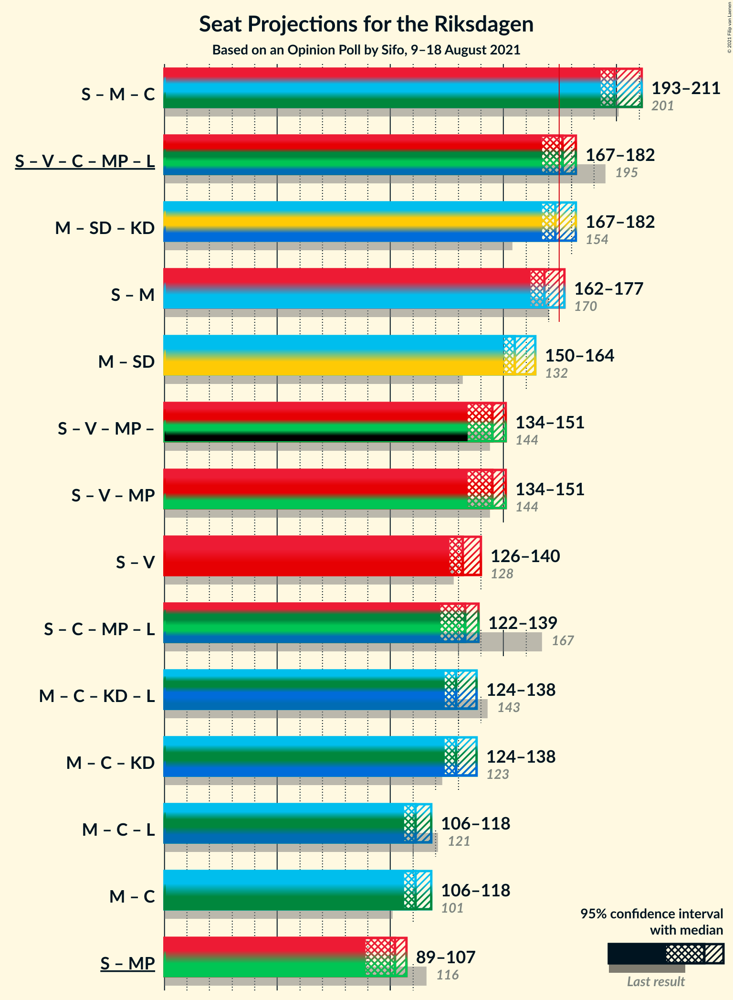

# Opinion Poll by Sifo, 9–18 August 2021

<a href="#voting-intentions">Voting Intentions</a> | <a href="#seats">Seats</a> | <a href="#coalitions">Coalitions</a> | <a href="#technical-information">Technical Information</a>

## Voting Intentions

### Confidence Intervals

| Party | Last Result | Poll Result | 80% Confidence Interval | 90% Confidence Interval | 95% Confidence Interval | 99% Confidence Interval |
|:-----:|:-----------:|:-----------:|:-----------------------:|:-----------------------:|:-----------------------:|:-----------------------:|
| Sveriges socialdemokratiska arbetareparti | 28.3% | 24.1% | 23.3–24.9% |23.1–25.1% |22.9–25.3% |22.6–25.7% |
| Moderata samlingspartiet | 19.8% | 21.8% | 21.1–22.6% |20.9–22.8% |20.7–23.0% |20.3–23.4% |
| Sverigedemokraterna | 17.5% | 20.5% | 19.8–21.2% |19.6–21.5% |19.4–21.6% |19.1–22.0% |
| Vänsterpartiet | 8.0% | 11.9% | 11.3–12.5% |11.2–12.7% |11.0–12.8% |10.8–13.1% |
| Centerpartiet | 8.6% | 8.6% | 8.1–9.1% |8.0–9.3% |7.8–9.4% |7.6–9.7% |
| Kristdemokraterna | 6.3% | 4.9% | 4.5–5.3% |4.4–5.4% |4.3–5.5% |4.2–5.8% |
| Miljöpartiet de gröna | 4.4% | 4.2% | 3.9–4.6% |3.7–4.7% |3.7–4.8% |3.5–5.0% |
| Liberalerna | 5.5% | 2.7% | 2.4–3.0% |2.3–3.1% |2.3–3.2% |2.1–3.4% |

*Note:* The poll result column reflects the actual value used in the calculations. Published results may vary slightly, and in addition be rounded to fewer digits.

## Seats

### Confidence Intervals

| Party | Last Result | Median | 80% Confidence Interval | 90% Confidence Interval | 95% Confidence Interval | 99% Confidence Interval |
|:-----:|:-----------:|:------:|:-----------------------:|:-----------------------:|:-----------------------:|:-----------------------:|
| <a href="#sveriges-socialdemokratiska-arbetareparti">Sveriges socialdemokratiska arbetareparti</a> | 100 | 88 | 85–93 |84–94 |83–94 |82–95 |
| <a href="#moderata-samlingspartiet">Moderata samlingspartiet</a> | 70 | 80 | 77–84 |76–84 |75–85 |74–87 |
| <a href="#sverigedemokraterna">Sverigedemokraterna</a> | 62 | 75 | 72–78 |71–80 |71–81 |69–82 |
| <a href="#vänsterpartiet">Vänsterpartiet</a> | 28 | 44 | 41–46 |41–47 |40–47 |39–49 |
| <a href="#centerpartiet">Centerpartiet</a> | 31 | 32 | 29–34 |29–34 |29–35 |28–36 |
| <a href="#kristdemokraterna">Kristdemokraterna</a> | 22 | 18 | 17–20 |16–20 |16–21 |15–21 |
| <a href="#miljöpartiet-de-gröna">Miljöpartiet de gröna</a> | 16 | 15 | 0–17 |0–17 |0–17 |0–18 |
| <a href="#liberalerna">Liberalerna</a> | 20 | 0 | 0 |0 |0 |0 |

### Sveriges socialdemokratiska arbetareparti

*For a full overview of the results for this party, see the [Sveriges socialdemokratiska arbetareparti](party-sverigessocialdemokratiskaarbetareparti.html) page.*

| Number of Seats | Probability | Accumulated | Special Marks |
|:---------------:|:-----------:|:-----------:|:-------------:|
| 81 | 0.1% | 100% |  |
| 82 | 0.6% | 99.8% |  |
| 83 | 3% | 99.2% |  |
| 84 | 4% | 97% |  |
| 85 | 7% | 92% |  |
| 86 | 11% | 85% |  |
| 87 | 16% | 74% |  |
| 88 | 10% | 58% | Median |
| 89 | 9% | 48% |  |
| 90 | 12% | 39% |  |
| 91 | 8% | 27% |  |
| 92 | 8% | 19% |  |
| 93 | 6% | 11% |  |
| 94 | 3% | 5% |  |
| 95 | 1.5% | 2% |  |
| 96 | 0.2% | 0.4% |  |
| 97 | 0.1% | 0.2% |  |
| 98 | 0% | 0.1% |  |
| 99 | 0% | 0% |  |
| 100 | 0% | 0% | Last Result |

### Moderata samlingspartiet

*For a full overview of the results for this party, see the [Moderata samlingspartiet](party-moderatasamlingspartiet.html) page.*

| Number of Seats | Probability | Accumulated | Special Marks |
|:---------------:|:-----------:|:-----------:|:-------------:|
| 70 | 0% | 100% | Last Result |
| 71 | 0% | 100% |  |
| 72 | 0% | 100% |  |
| 73 | 0.2% | 100% |  |
| 74 | 0.8% | 99.7% |  |
| 75 | 2% | 98.9% |  |
| 76 | 4% | 97% |  |
| 77 | 13% | 93% |  |
| 78 | 11% | 81% |  |
| 79 | 11% | 69% |  |
| 80 | 16% | 58% | Median |
| 81 | 14% | 42% |  |
| 82 | 12% | 27% |  |
| 83 | 4% | 15% |  |
| 84 | 6% | 11% |  |
| 85 | 3% | 5% |  |
| 86 | 0.8% | 2% |  |
| 87 | 0.8% | 1.0% |  |
| 88 | 0.2% | 0.2% |  |
| 89 | 0% | 0.1% |  |
| 90 | 0% | 0% |  |

### Sverigedemokraterna

*For a full overview of the results for this party, see the [Sverigedemokraterna](party-sverigedemokraterna.html) page.*

| Number of Seats | Probability | Accumulated | Special Marks |
|:---------------:|:-----------:|:-----------:|:-------------:|
| 62 | 0% | 100% | Last Result |
| 63 | 0% | 100% |  |
| 64 | 0% | 100% |  |
| 65 | 0% | 100% |  |
| 66 | 0% | 100% |  |
| 67 | 0% | 100% |  |
| 68 | 0.1% | 100% |  |
| 69 | 0.5% | 99.9% |  |
| 70 | 2% | 99.3% |  |
| 71 | 6% | 98% |  |
| 72 | 6% | 92% |  |
| 73 | 7% | 86% |  |
| 74 | 18% | 78% |  |
| 75 | 17% | 60% | Median |
| 76 | 14% | 44% |  |
| 77 | 10% | 29% |  |
| 78 | 10% | 19% |  |
| 79 | 3% | 9% |  |
| 80 | 3% | 6% |  |
| 81 | 1.2% | 3% |  |
| 82 | 1.5% | 2% |  |
| 83 | 0.3% | 0.4% |  |
| 84 | 0.1% | 0.1% |  |
| 85 | 0% | 0% |  |

### Vänsterpartiet

*For a full overview of the results for this party, see the [Vänsterpartiet](party-vänsterpartiet.html) page.*

| Number of Seats | Probability | Accumulated | Special Marks |
|:---------------:|:-----------:|:-----------:|:-------------:|
| 28 | 0% | 100% | Last Result |
| 29 | 0% | 100% |  |
| 30 | 0% | 100% |  |
| 31 | 0% | 100% |  |
| 32 | 0% | 100% |  |
| 33 | 0% | 100% |  |
| 34 | 0% | 100% |  |
| 35 | 0% | 100% |  |
| 36 | 0% | 100% |  |
| 37 | 0% | 100% |  |
| 38 | 0.1% | 100% |  |
| 39 | 0.7% | 99.9% |  |
| 40 | 3% | 99.2% |  |
| 41 | 9% | 97% |  |
| 42 | 15% | 87% |  |
| 43 | 18% | 73% |  |
| 44 | 19% | 55% | Median |
| 45 | 16% | 36% |  |
| 46 | 13% | 20% |  |
| 47 | 5% | 7% |  |
| 48 | 2% | 2% |  |
| 49 | 0.7% | 0.9% |  |
| 50 | 0.2% | 0.2% |  |
| 51 | 0.1% | 0.1% |  |
| 52 | 0% | 0% |  |

### Centerpartiet

*For a full overview of the results for this party, see the [Centerpartiet](party-centerpartiet.html) page.*

| Number of Seats | Probability | Accumulated | Special Marks |
|:---------------:|:-----------:|:-----------:|:-------------:|
| 27 | 0.2% | 100% |  |
| 28 | 2% | 99.7% |  |
| 29 | 8% | 98% |  |
| 30 | 15% | 90% |  |
| 31 | 20% | 75% | Last Result |
| 32 | 20% | 55% | Median |
| 33 | 20% | 35% |  |
| 34 | 11% | 15% |  |
| 35 | 3% | 4% |  |
| 36 | 0.8% | 1.0% |  |
| 37 | 0.2% | 0.2% |  |
| 38 | 0% | 0% |  |

### Kristdemokraterna

*For a full overview of the results for this party, see the [Kristdemokraterna](party-kristdemokraterna.html) page.*

| Number of Seats | Probability | Accumulated | Special Marks |
|:---------------:|:-----------:|:-----------:|:-------------:|
| 0 | 0.1% | 100% |  |
| 1 | 0% | 99.9% |  |
| 2 | 0% | 99.9% |  |
| 3 | 0% | 99.9% |  |
| 4 | 0% | 99.9% |  |
| 5 | 0% | 99.9% |  |
| 6 | 0% | 99.9% |  |
| 7 | 0% | 99.9% |  |
| 8 | 0% | 99.9% |  |
| 9 | 0% | 99.9% |  |
| 10 | 0% | 99.9% |  |
| 11 | 0% | 99.9% |  |
| 12 | 0% | 99.9% |  |
| 13 | 0% | 99.9% |  |
| 14 | 0% | 99.9% |  |
| 15 | 1.2% | 99.9% |  |
| 16 | 8% | 98.8% |  |
| 17 | 24% | 91% |  |
| 18 | 31% | 67% | Median |
| 19 | 23% | 36% |  |
| 20 | 10% | 13% |  |
| 21 | 2% | 3% |  |
| 22 | 0.4% | 0.4% | Last Result |
| 23 | 0% | 0% |  |

### Miljöpartiet de gröna

*For a full overview of the results for this party, see the [Miljöpartiet de gröna](party-miljöpartietdegröna.html) page.*

| Number of Seats | Probability | Accumulated | Special Marks |
|:---------------:|:-----------:|:-----------:|:-------------:|
| 0 | 27% | 100% |  |
| 1 | 0% | 73% |  |
| 2 | 0% | 73% |  |
| 3 | 0% | 73% |  |
| 4 | 0% | 73% |  |
| 5 | 0% | 73% |  |
| 6 | 0% | 73% |  |
| 7 | 0% | 73% |  |
| 8 | 0% | 73% |  |
| 9 | 0% | 73% |  |
| 10 | 0% | 73% |  |
| 11 | 0% | 73% |  |
| 12 | 0% | 73% |  |
| 13 | 0% | 73% |  |
| 14 | 0.7% | 73% |  |
| 15 | 26% | 73% | Median |
| 16 | 36% | 46% | Last Result |
| 17 | 9% | 11% |  |
| 18 | 2% | 2% |  |
| 19 | 0.2% | 0.2% |  |
| 20 | 0% | 0% |  |

### Liberalerna

*For a full overview of the results for this party, see the [Liberalerna](party-liberalerna.html) page.*

| Number of Seats | Probability | Accumulated | Special Marks |
|:---------------:|:-----------:|:-----------:|:-------------:|
| 0 | 100% | 100% | Median |
| 1 | 0% | 0% |  |
| 2 | 0% | 0% |  |
| 3 | 0% | 0% |  |
| 4 | 0% | 0% |  |
| 5 | 0% | 0% |  |
| 6 | 0% | 0% |  |
| 7 | 0% | 0% |  |
| 8 | 0% | 0% |  |
| 9 | 0% | 0% |  |
| 10 | 0% | 0% |  |
| 11 | 0% | 0% |  |
| 12 | 0% | 0% |  |
| 13 | 0% | 0% |  |
| 14 | 0% | 0% |  |
| 15 | 0% | 0% |  |
| 16 | 0% | 0% |  |
| 17 | 0% | 0% |  |
| 18 | 0% | 0% |  |
| 19 | 0% | 0% |  |
| 20 | 0% | 0% | Last Result |

## Coalitions

### Confidence Intervals

| Coalition | Last Result | Median | Majority? | 80% Confidence Interval | 90% Confidence Interval | 95% Confidence Interval | 99% Confidence Interval |
|:---------:|:-----------:|:------:|:---------:|:-----------------------:|:-----------------------:|:-----------------------:|:-----------------------:|
| Sveriges socialdemokratiska arbetareparti – Moderata samlingspartiet – Centerpartiet | 201 | 199 | 100% | 195–209 | 194–209 | 193–211 | 191–212 |
| Sveriges socialdemokratiska arbetareparti – Vänsterpartiet – Centerpartiet – Miljöpartiet de gröna – Liberalerna | 195 | 176 | 67% | 169–181 | 168–181 | 167–182 | 165–184 |
| Moderata samlingspartiet – Sverigedemokraterna – Kristdemokraterna | 154 | 173 | 33% | 168–180 | 168–181 | 167–182 | 165–184 |
| Sveriges socialdemokratiska arbetareparti – Moderata samlingspartiet | 170 | 168 | 14% | 163–175 | 163–176 | 162–177 | 160–179 |
| Moderata samlingspartiet – Sverigedemokraterna | 132 | 155 | 0% | 151–161 | 150–163 | 150–164 | 147–165 |
| Sveriges socialdemokratiska arbetareparti – Vänsterpartiet – Miljöpartiet de gröna | 144 | 145 | 0% | 136–150 | 134–150 | 134–151 | 133–153 |
| Sveriges socialdemokratiska arbetareparti – Vänsterpartiet | 128 | 132 | 0% | 128–139 | 127–139 | 126–140 | 125–142 |
| Sveriges socialdemokratiska arbetareparti – Centerpartiet – Miljöpartiet de gröna – Liberalerna | 167 | 133 | 0% | 125–137 | 123–138 | 122–139 | 120–140 |
| Moderata samlingspartiet – Centerpartiet – Kristdemokraterna – Liberalerna | 143 | 129 | 0% | 125–135 | 124–137 | 124–138 | 122–139 |
| Moderata samlingspartiet – Centerpartiet – Kristdemokraterna | 123 | 129 | 0% | 125–135 | 124–137 | 124–138 | 122–139 |
| Moderata samlingspartiet – Centerpartiet – Liberalerna | 121 | 111 | 0% | 108–116 | 107–118 | 106–118 | 105–120 |
| Moderata samlingspartiet – Centerpartiet | 101 | 111 | 0% | 108–116 | 107–118 | 106–118 | 105–120 |
| Sveriges socialdemokratiska arbetareparti – Miljöpartiet de gröna | 116 | 102 | 0% | 91–106 | 90–107 | 89–107 | 87–109 |

### Sveriges socialdemokratiska arbetareparti – Moderata samlingspartiet – Centerpartiet

| Number of Seats | Probability | Accumulated | Special Marks |
|:---------------:|:-----------:|:-----------:|:-------------:|
| 190 | 0.1% | 100% |  |
| 191 | 0.4% | 99.9% |  |
| 192 | 0.6% | 99.5% |  |
| 193 | 2% | 98.9% |  |
| 194 | 4% | 97% |  |
| 195 | 7% | 93% |  |
| 196 | 11% | 86% |  |
| 197 | 10% | 76% |  |
| 198 | 13% | 66% |  |
| 199 | 7% | 53% |  |
| 200 | 11% | 46% | Median |
| 201 | 4% | 35% | Last Result |
| 202 | 4% | 32% |  |
| 203 | 3% | 28% |  |
| 204 | 2% | 25% |  |
| 205 | 3% | 23% |  |
| 206 | 2% | 20% |  |
| 207 | 5% | 18% |  |
| 208 | 3% | 13% |  |
| 209 | 6% | 10% |  |
| 210 | 1.5% | 4% |  |
| 211 | 2% | 3% |  |
| 212 | 0.7% | 1.0% |  |
| 213 | 0.2% | 0.3% |  |
| 214 | 0% | 0.1% |  |
| 215 | 0% | 0% |  |

### Sveriges socialdemokratiska arbetareparti – Vänsterpartiet – Centerpartiet – Miljöpartiet de gröna – Liberalerna

| Number of Seats | Probability | Accumulated | Special Marks |
|:---------------:|:-----------:|:-----------:|:-------------:|
| 162 | 0% | 100% |  |
| 163 | 0% | 99.9% |  |
| 164 | 0.2% | 99.9% |  |
| 165 | 0.2% | 99.7% |  |
| 166 | 2% | 99.4% |  |
| 167 | 2% | 98% |  |
| 168 | 3% | 95% |  |
| 169 | 2% | 92% |  |
| 170 | 2% | 90% |  |
| 171 | 4% | 87% |  |
| 172 | 5% | 83% |  |
| 173 | 5% | 78% |  |
| 174 | 6% | 73% |  |
| 175 | 9% | 67% | Majority |
| 176 | 11% | 57% |  |
| 177 | 10% | 46% |  |
| 178 | 7% | 36% |  |
| 179 | 8% | 29% | Median |
| 180 | 10% | 21% |  |
| 181 | 7% | 11% |  |
| 182 | 3% | 4% |  |
| 183 | 0.9% | 1.4% |  |
| 184 | 0.3% | 0.6% |  |
| 185 | 0.1% | 0.2% |  |
| 186 | 0.1% | 0.2% |  |
| 187 | 0% | 0% |  |
| 188 | 0% | 0% |  |
| 189 | 0% | 0% |  |
| 190 | 0% | 0% |  |
| 191 | 0% | 0% |  |
| 192 | 0% | 0% |  |
| 193 | 0% | 0% |  |
| 194 | 0% | 0% |  |
| 195 | 0% | 0% | Last Result |

### Moderata samlingspartiet – Sverigedemokraterna – Kristdemokraterna

| Number of Seats | Probability | Accumulated | Special Marks |
|:---------------:|:-----------:|:-----------:|:-------------:|
| 154 | 0% | 100% | Last Result |
| 155 | 0% | 100% |  |
| 156 | 0% | 100% |  |
| 157 | 0% | 100% |  |
| 158 | 0% | 100% |  |
| 159 | 0% | 100% |  |
| 160 | 0% | 100% |  |
| 161 | 0% | 100% |  |
| 162 | 0% | 100% |  |
| 163 | 0.1% | 100% |  |
| 164 | 0.1% | 99.8% |  |
| 165 | 0.3% | 99.8% |  |
| 166 | 0.9% | 99.4% |  |
| 167 | 3% | 98.6% |  |
| 168 | 7% | 96% |  |
| 169 | 10% | 89% |  |
| 170 | 8% | 79% |  |
| 171 | 7% | 71% |  |
| 172 | 10% | 64% |  |
| 173 | 11% | 54% | Median |
| 174 | 9% | 43% |  |
| 175 | 6% | 33% | Majority |
| 176 | 5% | 27% |  |
| 177 | 5% | 22% |  |
| 178 | 4% | 17% |  |
| 179 | 2% | 13% |  |
| 180 | 2% | 10% |  |
| 181 | 3% | 8% |  |
| 182 | 2% | 5% |  |
| 183 | 2% | 2% |  |
| 184 | 0.2% | 0.6% |  |
| 185 | 0.2% | 0.3% |  |
| 186 | 0% | 0.1% |  |
| 187 | 0% | 0.1% |  |
| 188 | 0% | 0% |  |

### Sveriges socialdemokratiska arbetareparti – Moderata samlingspartiet

| Number of Seats | Probability | Accumulated | Special Marks |
|:---------------:|:-----------:|:-----------:|:-------------:|
| 159 | 0.1% | 100% |  |
| 160 | 0.6% | 99.8% |  |
| 161 | 0.9% | 99.3% |  |
| 162 | 2% | 98% |  |
| 163 | 7% | 96% |  |
| 164 | 8% | 89% |  |
| 165 | 7% | 81% |  |
| 166 | 9% | 74% |  |
| 167 | 14% | 65% |  |
| 168 | 8% | 51% | Median |
| 169 | 8% | 44% |  |
| 170 | 4% | 36% | Last Result |
| 171 | 7% | 32% |  |
| 172 | 4% | 25% |  |
| 173 | 3% | 21% |  |
| 174 | 4% | 18% |  |
| 175 | 9% | 14% | Majority |
| 176 | 2% | 6% |  |
| 177 | 2% | 3% |  |
| 178 | 1.0% | 2% |  |
| 179 | 0.3% | 0.7% |  |
| 180 | 0.3% | 0.5% |  |
| 181 | 0.1% | 0.2% |  |
| 182 | 0% | 0.1% |  |
| 183 | 0% | 0% |  |

### Moderata samlingspartiet – Sverigedemokraterna

| Number of Seats | Probability | Accumulated | Special Marks |
|:---------------:|:-----------:|:-----------:|:-------------:|
| 132 | 0% | 100% | Last Result |
| 133 | 0% | 100% |  |
| 134 | 0% | 100% |  |
| 135 | 0% | 100% |  |
| 136 | 0% | 100% |  |
| 137 | 0% | 100% |  |
| 138 | 0% | 100% |  |
| 139 | 0% | 100% |  |
| 140 | 0% | 100% |  |
| 141 | 0% | 100% |  |
| 142 | 0% | 100% |  |
| 143 | 0% | 100% |  |
| 144 | 0% | 100% |  |
| 145 | 0% | 100% |  |
| 146 | 0.3% | 100% |  |
| 147 | 0.4% | 99.7% |  |
| 148 | 0.3% | 99.3% |  |
| 149 | 1.5% | 99.0% |  |
| 150 | 5% | 98% |  |
| 151 | 11% | 92% |  |
| 152 | 13% | 81% |  |
| 153 | 5% | 69% |  |
| 154 | 4% | 64% |  |
| 155 | 11% | 60% | Median |
| 156 | 16% | 48% |  |
| 157 | 9% | 32% |  |
| 158 | 6% | 23% |  |
| 159 | 4% | 17% |  |
| 160 | 1.5% | 13% |  |
| 161 | 1.4% | 11% |  |
| 162 | 4% | 10% |  |
| 163 | 2% | 6% |  |
| 164 | 3% | 3% |  |
| 165 | 0.5% | 0.7% |  |
| 166 | 0% | 0.2% |  |
| 167 | 0.1% | 0.2% |  |
| 168 | 0.1% | 0.1% |  |
| 169 | 0% | 0% |  |

### Sveriges socialdemokratiska arbetareparti – Vänsterpartiet – Miljöpartiet de gröna

| Number of Seats | Probability | Accumulated | Special Marks |
|:---------------:|:-----------:|:-----------:|:-------------:|
| 129 | 0% | 100% |  |
| 130 | 0% | 99.9% |  |
| 131 | 0.1% | 99.9% |  |
| 132 | 0.2% | 99.8% |  |
| 133 | 1.3% | 99.6% |  |
| 134 | 4% | 98% |  |
| 135 | 2% | 94% |  |
| 136 | 2% | 92% |  |
| 137 | 2% | 90% |  |
| 138 | 3% | 87% |  |
| 139 | 8% | 84% |  |
| 140 | 2% | 76% |  |
| 141 | 1.1% | 74% |  |
| 142 | 3% | 73% |  |
| 143 | 6% | 69% |  |
| 144 | 8% | 63% | Last Result |
| 145 | 8% | 55% |  |
| 146 | 12% | 47% |  |
| 147 | 6% | 35% | Median |
| 148 | 13% | 28% |  |
| 149 | 5% | 16% |  |
| 150 | 8% | 11% |  |
| 151 | 2% | 3% |  |
| 152 | 0.6% | 1.1% |  |
| 153 | 0.3% | 0.5% |  |
| 154 | 0.1% | 0.2% |  |
| 155 | 0% | 0.1% |  |
| 156 | 0% | 0% |  |

### Sveriges socialdemokratiska arbetareparti – Vänsterpartiet

| Number of Seats | Probability | Accumulated | Special Marks |
|:---------------:|:-----------:|:-----------:|:-------------:|
| 123 | 0.1% | 100% |  |
| 124 | 0.3% | 99.9% |  |
| 125 | 0.8% | 99.6% |  |
| 126 | 2% | 98.8% |  |
| 127 | 4% | 97% |  |
| 128 | 9% | 92% | Last Result |
| 129 | 8% | 83% |  |
| 130 | 10% | 75% |  |
| 131 | 9% | 64% |  |
| 132 | 12% | 55% | Median |
| 133 | 8% | 43% |  |
| 134 | 9% | 35% |  |
| 135 | 7% | 26% |  |
| 136 | 3% | 19% |  |
| 137 | 3% | 17% |  |
| 138 | 3% | 14% |  |
| 139 | 8% | 11% |  |
| 140 | 2% | 3% |  |
| 141 | 0.4% | 1.0% |  |
| 142 | 0.4% | 0.5% |  |
| 143 | 0.1% | 0.2% |  |
| 144 | 0.1% | 0.1% |  |
| 145 | 0% | 0% |  |

### Sveriges socialdemokratiska arbetareparti – Centerpartiet – Miljöpartiet de gröna – Liberalerna

| Number of Seats | Probability | Accumulated | Special Marks |
|:---------------:|:-----------:|:-----------:|:-------------:|
| 118 | 0.1% | 100% |  |
| 119 | 0.3% | 99.9% |  |
| 120 | 0.5% | 99.5% |  |
| 121 | 1.2% | 99.0% |  |
| 122 | 2% | 98% |  |
| 123 | 3% | 96% |  |
| 124 | 3% | 93% |  |
| 125 | 7% | 90% |  |
| 126 | 2% | 83% |  |
| 127 | 7% | 82% |  |
| 128 | 0.8% | 75% |  |
| 129 | 2% | 74% |  |
| 130 | 3% | 73% |  |
| 131 | 5% | 69% |  |
| 132 | 7% | 64% |  |
| 133 | 10% | 58% |  |
| 134 | 14% | 48% |  |
| 135 | 10% | 34% | Median |
| 136 | 9% | 24% |  |
| 137 | 8% | 15% |  |
| 138 | 3% | 7% |  |
| 139 | 3% | 4% |  |
| 140 | 1.0% | 1.4% |  |
| 141 | 0.3% | 0.4% |  |
| 142 | 0.1% | 0.1% |  |
| 143 | 0% | 0% |  |
| 144 | 0% | 0% |  |
| 145 | 0% | 0% |  |
| 146 | 0% | 0% |  |
| 147 | 0% | 0% |  |
| 148 | 0% | 0% |  |
| 149 | 0% | 0% |  |
| 150 | 0% | 0% |  |
| 151 | 0% | 0% |  |
| 152 | 0% | 0% |  |
| 153 | 0% | 0% |  |
| 154 | 0% | 0% |  |
| 155 | 0% | 0% |  |
| 156 | 0% | 0% |  |
| 157 | 0% | 0% |  |
| 158 | 0% | 0% |  |
| 159 | 0% | 0% |  |
| 160 | 0% | 0% |  |
| 161 | 0% | 0% |  |
| 162 | 0% | 0% |  |
| 163 | 0% | 0% |  |
| 164 | 0% | 0% |  |
| 165 | 0% | 0% |  |
| 166 | 0% | 0% |  |
| 167 | 0% | 0% | Last Result |

### Moderata samlingspartiet – Centerpartiet – Kristdemokraterna – Liberalerna

| Number of Seats | Probability | Accumulated | Special Marks |
|:---------------:|:-----------:|:-----------:|:-------------:|
| 119 | 0% | 100% |  |
| 120 | 0% | 99.9% |  |
| 121 | 0.2% | 99.9% |  |
| 122 | 0.4% | 99.8% |  |
| 123 | 1.3% | 99.4% |  |
| 124 | 5% | 98% |  |
| 125 | 4% | 93% |  |
| 126 | 6% | 89% |  |
| 127 | 14% | 83% |  |
| 128 | 10% | 68% |  |
| 129 | 11% | 59% |  |
| 130 | 9% | 48% | Median |
| 131 | 10% | 39% |  |
| 132 | 4% | 29% |  |
| 133 | 6% | 25% |  |
| 134 | 3% | 18% |  |
| 135 | 7% | 15% |  |
| 136 | 2% | 8% |  |
| 137 | 3% | 6% |  |
| 138 | 2% | 3% |  |
| 139 | 0.4% | 0.7% |  |
| 140 | 0.2% | 0.3% |  |
| 141 | 0.1% | 0.1% |  |
| 142 | 0.1% | 0.1% |  |
| 143 | 0% | 0% | Last Result |

### Moderata samlingspartiet – Centerpartiet – Kristdemokraterna

| Number of Seats | Probability | Accumulated | Special Marks |
|:---------------:|:-----------:|:-----------:|:-------------:|
| 119 | 0% | 100% |  |
| 120 | 0% | 99.9% |  |
| 121 | 0.2% | 99.9% |  |
| 122 | 0.4% | 99.8% |  |
| 123 | 1.3% | 99.4% | Last Result |
| 124 | 5% | 98% |  |
| 125 | 4% | 93% |  |
| 126 | 6% | 89% |  |
| 127 | 14% | 83% |  |
| 128 | 10% | 68% |  |
| 129 | 11% | 59% |  |
| 130 | 9% | 48% | Median |
| 131 | 10% | 39% |  |
| 132 | 4% | 29% |  |
| 133 | 6% | 25% |  |
| 134 | 3% | 18% |  |
| 135 | 7% | 15% |  |
| 136 | 2% | 8% |  |
| 137 | 3% | 6% |  |
| 138 | 2% | 3% |  |
| 139 | 0.4% | 0.7% |  |
| 140 | 0.2% | 0.3% |  |
| 141 | 0.1% | 0.1% |  |
| 142 | 0.1% | 0.1% |  |
| 143 | 0% | 0% |  |

### Moderata samlingspartiet – Centerpartiet – Liberalerna

| Number of Seats | Probability | Accumulated | Special Marks |
|:---------------:|:-----------:|:-----------:|:-------------:|
| 103 | 0.1% | 100% |  |
| 104 | 0.3% | 99.9% |  |
| 105 | 0.9% | 99.6% |  |
| 106 | 3% | 98.7% |  |
| 107 | 5% | 96% |  |
| 108 | 5% | 90% |  |
| 109 | 12% | 85% |  |
| 110 | 16% | 74% |  |
| 111 | 11% | 58% |  |
| 112 | 8% | 47% | Median |
| 113 | 11% | 39% |  |
| 114 | 8% | 28% |  |
| 115 | 6% | 21% |  |
| 116 | 6% | 15% |  |
| 117 | 2% | 9% |  |
| 118 | 4% | 7% |  |
| 119 | 1.0% | 2% |  |
| 120 | 1.0% | 1.4% |  |
| 121 | 0.2% | 0.4% | Last Result |
| 122 | 0.1% | 0.2% |  |
| 123 | 0% | 0.1% |  |
| 124 | 0% | 0% |  |

### Moderata samlingspartiet – Centerpartiet

| Number of Seats | Probability | Accumulated | Special Marks |
|:---------------:|:-----------:|:-----------:|:-------------:|
| 101 | 0% | 100% | Last Result |
| 102 | 0% | 100% |  |
| 103 | 0.1% | 100% |  |
| 104 | 0.3% | 99.9% |  |
| 105 | 0.9% | 99.6% |  |
| 106 | 3% | 98.7% |  |
| 107 | 5% | 96% |  |
| 108 | 5% | 90% |  |
| 109 | 12% | 85% |  |
| 110 | 16% | 74% |  |
| 111 | 11% | 58% |  |
| 112 | 8% | 47% | Median |
| 113 | 11% | 39% |  |
| 114 | 8% | 28% |  |
| 115 | 6% | 21% |  |
| 116 | 6% | 15% |  |
| 117 | 2% | 9% |  |
| 118 | 4% | 7% |  |
| 119 | 1.0% | 2% |  |
| 120 | 1.0% | 1.4% |  |
| 121 | 0.2% | 0.4% |  |
| 122 | 0.1% | 0.2% |  |
| 123 | 0% | 0.1% |  |
| 124 | 0% | 0% |  |

### Sveriges socialdemokratiska arbetareparti – Miljöpartiet de gröna

| Number of Seats | Probability | Accumulated | Special Marks |
|:---------------:|:-----------:|:-----------:|:-------------:|
| 85 | 0.1% | 100% |  |
| 86 | 0.1% | 99.9% |  |
| 87 | 0.4% | 99.8% |  |
| 88 | 0.6% | 99.4% |  |
| 89 | 2% | 98.8% |  |
| 90 | 3% | 97% |  |
| 91 | 5% | 94% |  |
| 92 | 6% | 89% |  |
| 93 | 4% | 83% |  |
| 94 | 3% | 78% |  |
| 95 | 1.5% | 75% |  |
| 96 | 0.3% | 74% |  |
| 97 | 0.4% | 74% |  |
| 98 | 0.7% | 73% |  |
| 99 | 4% | 72% |  |
| 100 | 5% | 69% |  |
| 101 | 6% | 63% |  |
| 102 | 13% | 58% |  |
| 103 | 13% | 44% | Median |
| 104 | 10% | 31% |  |
| 105 | 7% | 21% |  |
| 106 | 8% | 14% |  |
| 107 | 4% | 6% |  |
| 108 | 2% | 2% |  |
| 109 | 0.5% | 0.7% |  |
| 110 | 0.2% | 0.2% |  |
| 111 | 0% | 0.1% |  |
| 112 | 0% | 0% |  |
| 113 | 0% | 0% |  |
| 114 | 0% | 0% |  |
| 115 | 0% | 0% |  |
| 116 | 0% | 0% | Last Result |

## Technical Information

### Opinion Poll

+ **Polling firm:** Sifo
+ **Commissioner(s):** —
+ **Fieldwork period:** 9–18 August 2021

### Calculations

+ **Sample size:** 4972
+ **Simulations done:** 1,048,576
+ **Error estimate:** 1.05%

