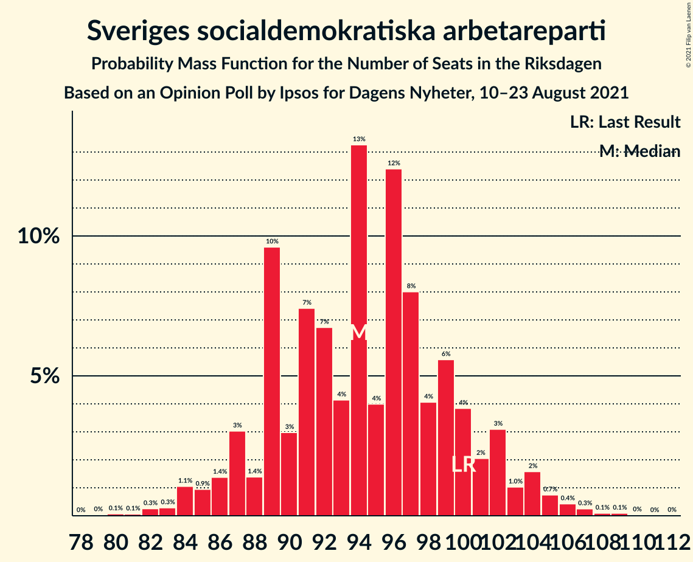
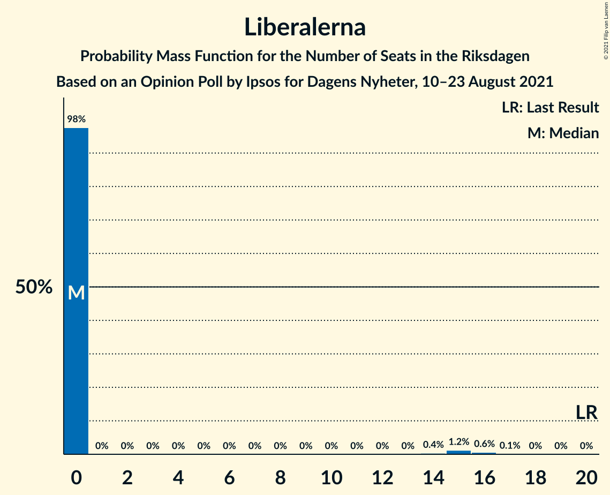
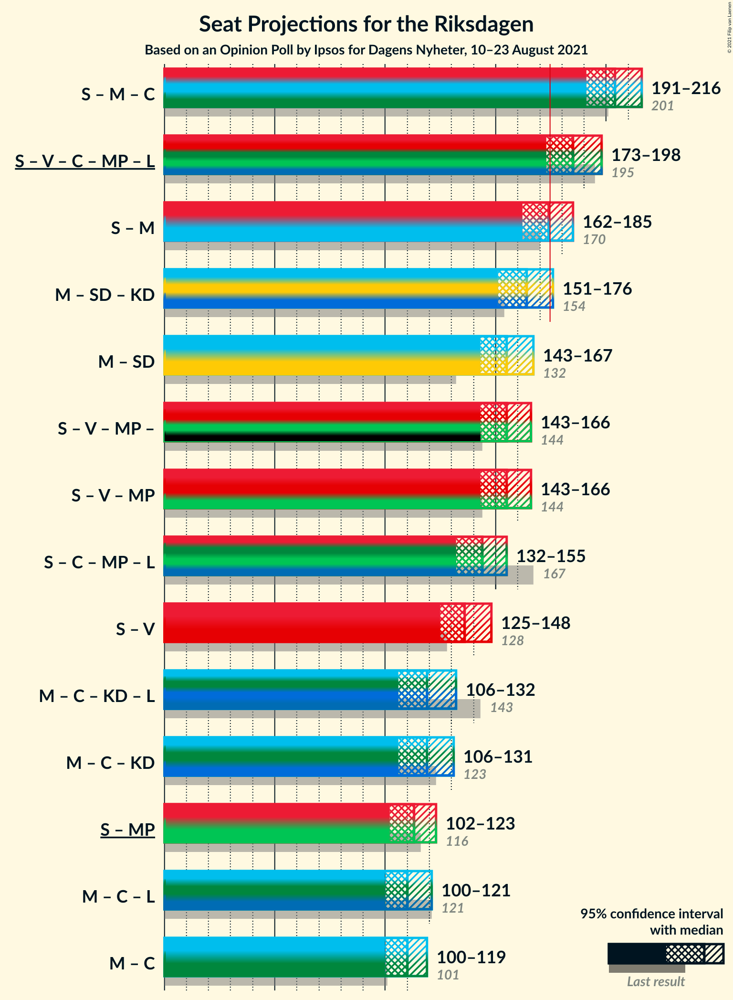
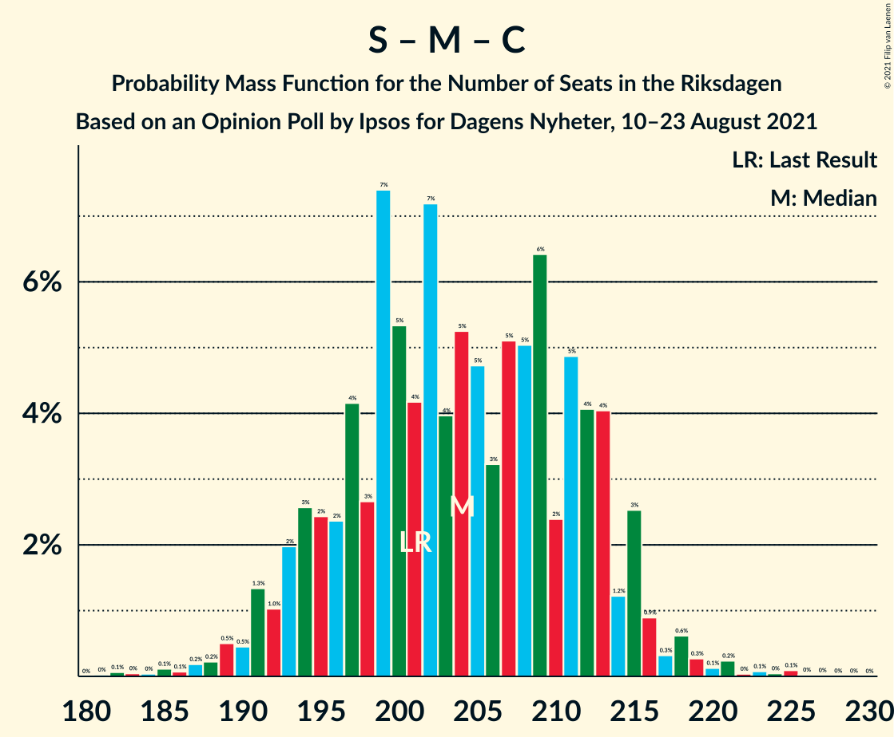

# Opinion Poll by Ipsos for Dagens Nyheter, 10–23 August 2021

<a href="#voting-intentions">Voting Intentions</a> | <a href="#seats">Seats</a> | <a href="#coalitions">Coalitions</a> | <a href="#technical-information">Technical Information</a>

## Voting Intentions

### Confidence Intervals

| Party | Last Result | Poll Result | 80% Confidence Interval | 90% Confidence Interval | 95% Confidence Interval | 99% Confidence Interval |
|:-----:|:-----------:|:-----------:|:-----------------------:|:-----------------------:|:-----------------------:|:-----------------------:|
| Sveriges socialdemokratiska arbetareparti | 28.3% | 25.3% | 23.9–26.7% |23.5–27.1% |23.2–27.5% |22.5–28.2% |
| Moderata samlingspartiet | 19.8% | 21.2% | 19.9–22.6% |19.5–23.0% |19.2–23.3% |18.6–24.0% |
| Sverigedemokraterna | 17.5% | 20.2% | 19.0–21.6% |18.6–22.0% |18.3–22.3% |17.7–23.0% |
| Vänsterpartiet | 8.0% | 11.1% | 10.2–12.2% |9.9–12.5% |9.6–12.8% |9.2–13.3% |
| Centerpartiet | 8.6% | 8.1% | 7.3–9.0% |7.0–9.3% |6.8–9.6% |6.4–10.0% |
| Miljöpartiet de gröna | 4.4% | 5.0% | 4.4–5.8% |4.2–6.1% |4.1–6.2% |3.8–6.7% |
| Kristdemokraterna | 6.3% | 4.1% | 3.5–4.8% |3.3–5.0% |3.2–5.2% |2.9–5.5% |
| Liberalerna | 5.5% | 3.0% | 2.5–3.7% |2.4–3.9% |2.3–4.0% |2.1–4.4% |

*Note:* The poll result column reflects the actual value used in the calculations. Published results may vary slightly, and in addition be rounded to fewer digits.

## Seats

### Confidence Intervals

| Party | Last Result | Median | 80% Confidence Interval | 90% Confidence Interval | 95% Confidence Interval | 99% Confidence Interval |
|:-----:|:-----------:|:------:|:-----------------------:|:-----------------------:|:-----------------------:|:-----------------------:|
| <a href="#sveriges-socialdemokratiska-arbetareparti">Sveriges socialdemokratiska arbetareparti</a> | 100 | 94 | 87–98 |87–100 |85–102 |83–106 |
| <a href="#moderata-samlingspartiet">Moderata samlingspartiet</a> | 70 | 80 | 75–85 |72–87 |70–89 |69–89 |
| <a href="#sverigedemokraterna">Sverigedemokraterna</a> | 62 | 76 | 71–81 |70–81 |68–83 |65–86 |
| <a href="#vänsterpartiet">Vänsterpartiet</a> | 28 | 42 | 38–45 |37–46 |36–47 |35–51 |
| <a href="#centerpartiet">Centerpartiet</a> | 31 | 30 | 28–34 |26–34 |25–36 |24–37 |
| <a href="#miljöpartiet-de-gröna">Miljöpartiet de gröna</a> | 16 | 18 | 16–22 |16–22 |0–23 |0–25 |
| <a href="#kristdemokraterna">Kristdemokraterna</a> | 22 | 15 | 0–17 |0–18 |0–19 |0–20 |
| <a href="#liberalerna">Liberalerna</a> | 20 | 0 | 0 |0 |0 |0–16 |

### Sveriges socialdemokratiska arbetareparti

*For a full overview of the results for this party, see the [Sveriges socialdemokratiska arbetareparti](party-sverigessocialdemokratiskaarbetareparti.html) page.*

| Number of Seats | Probability | Accumulated | Special Marks |
|:---------------:|:-----------:|:-----------:|:-------------:|
| 80 | 0.1% | 100% |  |
| 81 | 0% | 99.9% |  |
| 82 | 0.2% | 99.8% |  |
| 83 | 0.3% | 99.6% |  |
| 84 | 0.9% | 99.3% |  |
| 85 | 0.9% | 98% |  |
| 86 | 0.5% | 97% |  |
| 87 | 8% | 97% |  |
| 88 | 0.9% | 89% |  |
| 89 | 17% | 88% |  |
| 90 | 0.6% | 72% |  |
| 91 | 5% | 71% |  |
| 92 | 4% | 66% |  |
| 93 | 7% | 62% |  |
| 94 | 21% | 55% | Median |
| 95 | 1.3% | 34% |  |
| 96 | 9% | 33% |  |
| 97 | 13% | 24% |  |
| 98 | 1.4% | 11% |  |
| 99 | 3% | 9% |  |
| 100 | 3% | 6% | Last Result |
| 101 | 0.6% | 3% |  |
| 102 | 1.2% | 3% |  |
| 103 | 0.4% | 2% |  |
| 104 | 0.2% | 1.2% |  |
| 105 | 0.4% | 1.0% |  |
| 106 | 0.1% | 0.6% |  |
| 107 | 0.2% | 0.5% |  |
| 108 | 0.1% | 0.3% |  |
| 109 | 0.1% | 0.2% |  |
| 110 | 0.1% | 0.1% |  |
| 111 | 0% | 0.1% |  |
| 112 | 0% | 0.1% |  |
| 113 | 0% | 0% |  |

### Moderata samlingspartiet

*For a full overview of the results for this party, see the [Moderata samlingspartiet](party-moderatasamlingspartiet.html) page.*

| Number of Seats | Probability | Accumulated | Special Marks |
|:---------------:|:-----------:|:-----------:|:-------------:|
| 65 | 0% | 100% |  |
| 66 | 0.1% | 99.9% |  |
| 67 | 0.1% | 99.9% |  |
| 68 | 0.2% | 99.8% |  |
| 69 | 1.2% | 99.6% |  |
| 70 | 3% | 98% | Last Result |
| 71 | 0.6% | 96% |  |
| 72 | 0.6% | 95% |  |
| 73 | 1.1% | 95% |  |
| 74 | 3% | 94% |  |
| 75 | 5% | 91% |  |
| 76 | 11% | 86% |  |
| 77 | 1.4% | 75% |  |
| 78 | 4% | 73% |  |
| 79 | 8% | 69% |  |
| 80 | 42% | 62% | Median |
| 81 | 2% | 20% |  |
| 82 | 2% | 18% |  |
| 83 | 1.0% | 16% |  |
| 84 | 3% | 15% |  |
| 85 | 6% | 12% |  |
| 86 | 2% | 7% |  |
| 87 | 0.5% | 5% |  |
| 88 | 0.6% | 5% |  |
| 89 | 4% | 4% |  |
| 90 | 0.2% | 0.3% |  |
| 91 | 0% | 0.1% |  |
| 92 | 0% | 0.1% |  |
| 93 | 0% | 0% |  |

### Sverigedemokraterna

*For a full overview of the results for this party, see the [Sverigedemokraterna](party-sverigedemokraterna.html) page.*

| Number of Seats | Probability | Accumulated | Special Marks |
|:---------------:|:-----------:|:-----------:|:-------------:|
| 62 | 0% | 100% | Last Result |
| 63 | 0.3% | 100% |  |
| 64 | 0.1% | 99.6% |  |
| 65 | 0.2% | 99.5% |  |
| 66 | 0.3% | 99.4% |  |
| 67 | 1.0% | 99.0% |  |
| 68 | 1.0% | 98% |  |
| 69 | 2% | 97% |  |
| 70 | 0.9% | 95% |  |
| 71 | 6% | 95% |  |
| 72 | 0.8% | 89% |  |
| 73 | 17% | 88% |  |
| 74 | 10% | 71% |  |
| 75 | 10% | 61% |  |
| 76 | 15% | 51% | Median |
| 77 | 4% | 36% |  |
| 78 | 3% | 32% |  |
| 79 | 4% | 30% |  |
| 80 | 11% | 26% |  |
| 81 | 10% | 15% |  |
| 82 | 1.2% | 4% |  |
| 83 | 1.4% | 3% |  |
| 84 | 0.8% | 2% |  |
| 85 | 0.3% | 1.0% |  |
| 86 | 0.2% | 0.7% |  |
| 87 | 0.2% | 0.4% |  |
| 88 | 0.1% | 0.2% |  |
| 89 | 0.1% | 0.1% |  |
| 90 | 0% | 0% |  |

### Vänsterpartiet

*For a full overview of the results for this party, see the [Vänsterpartiet](party-vänsterpartiet.html) page.*

| Number of Seats | Probability | Accumulated | Special Marks |
|:---------------:|:-----------:|:-----------:|:-------------:|
| 28 | 0% | 100% | Last Result |
| 29 | 0% | 100% |  |
| 30 | 0% | 100% |  |
| 31 | 0% | 100% |  |
| 32 | 0.1% | 100% |  |
| 33 | 0.1% | 99.9% |  |
| 34 | 0.2% | 99.8% |  |
| 35 | 1.0% | 99.5% |  |
| 36 | 2% | 98.5% |  |
| 37 | 4% | 96% |  |
| 38 | 9% | 92% |  |
| 39 | 4% | 83% |  |
| 40 | 4% | 79% |  |
| 41 | 11% | 75% |  |
| 42 | 20% | 63% | Median |
| 43 | 7% | 43% |  |
| 44 | 20% | 36% |  |
| 45 | 11% | 17% |  |
| 46 | 3% | 6% |  |
| 47 | 1.0% | 3% |  |
| 48 | 0.6% | 2% |  |
| 49 | 0.4% | 1.2% |  |
| 50 | 0.1% | 0.8% |  |
| 51 | 0.6% | 0.7% |  |
| 52 | 0.1% | 0.1% |  |
| 53 | 0% | 0% |  |

### Centerpartiet

*For a full overview of the results for this party, see the [Centerpartiet](party-centerpartiet.html) page.*

| Number of Seats | Probability | Accumulated | Special Marks |
|:---------------:|:-----------:|:-----------:|:-------------:|
| 22 | 0% | 100% |  |
| 23 | 0.3% | 99.9% |  |
| 24 | 0.6% | 99.6% |  |
| 25 | 2% | 99.1% |  |
| 26 | 2% | 97% |  |
| 27 | 3% | 95% |  |
| 28 | 19% | 91% |  |
| 29 | 10% | 72% |  |
| 30 | 30% | 62% | Median |
| 31 | 9% | 32% | Last Result |
| 32 | 10% | 23% |  |
| 33 | 2% | 13% |  |
| 34 | 7% | 11% |  |
| 35 | 1.4% | 4% |  |
| 36 | 2% | 3% |  |
| 37 | 0.3% | 0.7% |  |
| 38 | 0.2% | 0.4% |  |
| 39 | 0.1% | 0.2% |  |
| 40 | 0% | 0.1% |  |
| 41 | 0% | 0% |  |

### Miljöpartiet de gröna

*For a full overview of the results for this party, see the [Miljöpartiet de gröna](party-miljöpartietdegröna.html) page.*

| Number of Seats | Probability | Accumulated | Special Marks |
|:---------------:|:-----------:|:-----------:|:-------------:|
| 0 | 3% | 100% |  |
| 1 | 0% | 97% |  |
| 2 | 0% | 97% |  |
| 3 | 0% | 97% |  |
| 4 | 0% | 97% |  |
| 5 | 0% | 97% |  |
| 6 | 0% | 97% |  |
| 7 | 0% | 97% |  |
| 8 | 0% | 97% |  |
| 9 | 0% | 97% |  |
| 10 | 0% | 97% |  |
| 11 | 0% | 97% |  |
| 12 | 0% | 97% |  |
| 13 | 0% | 97% |  |
| 14 | 0% | 97% |  |
| 15 | 1.2% | 97% |  |
| 16 | 22% | 96% | Last Result |
| 17 | 8% | 75% |  |
| 18 | 25% | 67% | Median |
| 19 | 5% | 42% |  |
| 20 | 6% | 36% |  |
| 21 | 20% | 30% |  |
| 22 | 6% | 10% |  |
| 23 | 3% | 5% |  |
| 24 | 0.6% | 1.2% |  |
| 25 | 0.3% | 0.6% |  |
| 26 | 0.2% | 0.2% |  |
| 27 | 0% | 0.1% |  |
| 28 | 0% | 0% |  |

### Kristdemokraterna

*For a full overview of the results for this party, see the [Kristdemokraterna](party-kristdemokraterna.html) page.*

| Number of Seats | Probability | Accumulated | Special Marks |
|:---------------:|:-----------:|:-----------:|:-------------:|
| 0 | 39% | 100% |  |
| 1 | 0% | 61% |  |
| 2 | 0% | 61% |  |
| 3 | 0% | 61% |  |
| 4 | 0% | 61% |  |
| 5 | 0% | 61% |  |
| 6 | 0% | 61% |  |
| 7 | 0% | 61% |  |
| 8 | 0% | 61% |  |
| 9 | 0% | 61% |  |
| 10 | 0% | 61% |  |
| 11 | 0% | 61% |  |
| 12 | 0% | 61% |  |
| 13 | 0% | 61% |  |
| 14 | 0% | 61% |  |
| 15 | 14% | 61% | Median |
| 16 | 26% | 46% |  |
| 17 | 12% | 21% |  |
| 18 | 5% | 8% |  |
| 19 | 2% | 3% |  |
| 20 | 1.1% | 1.4% |  |
| 21 | 0.3% | 0.4% |  |
| 22 | 0% | 0.1% | Last Result |
| 23 | 0% | 0% |  |

### Liberalerna

*For a full overview of the results for this party, see the [Liberalerna](party-liberalerna.html) page.*

| Number of Seats | Probability | Accumulated | Special Marks |
|:---------------:|:-----------:|:-----------:|:-------------:|
| 0 | 98% | 100% | Median |
| 1 | 0% | 2% |  |
| 2 | 0% | 2% |  |
| 3 | 0% | 2% |  |
| 4 | 0% | 2% |  |
| 5 | 0% | 2% |  |
| 6 | 0% | 2% |  |
| 7 | 0% | 2% |  |
| 8 | 0% | 2% |  |
| 9 | 0% | 2% |  |
| 10 | 0% | 2% |  |
| 11 | 0% | 2% |  |
| 12 | 0% | 2% |  |
| 13 | 0% | 2% |  |
| 14 | 0.1% | 2% |  |
| 15 | 2% | 2% |  |
| 16 | 0.4% | 0.5% |  |
| 17 | 0.1% | 0.1% |  |
| 18 | 0% | 0% |  |
| 19 | 0% | 0% |  |
| 20 | 0% | 0% | Last Result |

## Coalitions

### Confidence Intervals

| Coalition | Last Result | Median | Majority? | 80% Confidence Interval | 90% Confidence Interval | 95% Confidence Interval | 99% Confidence Interval |
|:---------:|:-----------:|:------:|:---------:|:-----------------------:|:-----------------------:|:-----------------------:|:-----------------------:|
| Sveriges socialdemokratiska arbetareparti – Moderata samlingspartiet – Centerpartiet | 201 | 202 | 100% | 196–212 | 192–215 | 191–215 | 188–219 |
| Sveriges socialdemokratiska arbetareparti – Vänsterpartiet – Centerpartiet – Miljöpartiet de gröna – Liberalerna | 195 | 185 | 95% | 177–191 | 175–195 | 171–197 | 168–200 |
| Sveriges socialdemokratiska arbetareparti – Moderata samlingspartiet | 170 | 173 | 36% | 166–179 | 163–185 | 163–185 | 159–189 |
| Moderata samlingspartiet – Sverigedemokraterna – Kristdemokraterna | 154 | 164 | 5% | 158–172 | 154–174 | 152–178 | 149–181 |
| Moderata samlingspartiet – Sverigedemokraterna | 132 | 156 | 0% | 149–161 | 146–164 | 144–165 | 140–169 |
| Sveriges socialdemokratiska arbetareparti – Vänsterpartiet – Miljöpartiet de gröna | 144 | 155 | 0% | 146–160 | 145–160 | 140–165 | 135–168 |
| Sveriges socialdemokratiska arbetareparti – Centerpartiet – Miljöpartiet de gröna – Liberalerna | 167 | 141 | 0% | 135–149 | 135–152 | 129–156 | 127–161 |
| Sveriges socialdemokratiska arbetareparti – Vänsterpartiet | 128 | 135 | 0% | 128–142 | 128–142 | 125–145 | 123–148 |
| Moderata samlingspartiet – Centerpartiet – Kristdemokraterna – Liberalerna | 143 | 120 | 0% | 108–129 | 108–130 | 107–134 | 104–136 |
| Moderata samlingspartiet – Centerpartiet – Kristdemokraterna | 123 | 120 | 0% | 108–129 | 108–129 | 107–132 | 104–135 |
| Sveriges socialdemokratiska arbetareparti – Miljöpartiet de gröna | 116 | 113 | 0% | 105–117 | 104–118 | 98–120 | 93–127 |
| Moderata samlingspartiet – Centerpartiet – Liberalerna | 121 | 110 | 0% | 104–117 | 102–119 | 101–119 | 98–123 |
| Moderata samlingspartiet – Centerpartiet | 101 | 110 | 0% | 104–117 | 102–119 | 101–119 | 97–121 |

### Sveriges socialdemokratiska arbetareparti – Moderata samlingspartiet – Centerpartiet

| Number of Seats | Probability | Accumulated | Special Marks |
|:---------------:|:-----------:|:-----------:|:-------------:|
| 182 | 0.1% | 100% |  |
| 183 | 0% | 99.9% |  |
| 184 | 0% | 99.9% |  |
| 185 | 0% | 99.9% |  |
| 186 | 0% | 99.8% |  |
| 187 | 0.2% | 99.8% |  |
| 188 | 0.3% | 99.6% |  |
| 189 | 0.6% | 99.3% |  |
| 190 | 0.1% | 98.7% |  |
| 191 | 3% | 98.6% |  |
| 192 | 1.4% | 96% |  |
| 193 | 0.8% | 95% |  |
| 194 | 2% | 94% |  |
| 195 | 0.4% | 92% |  |
| 196 | 2% | 92% |  |
| 197 | 2% | 90% |  |
| 198 | 4% | 87% |  |
| 199 | 26% | 84% |  |
| 200 | 2% | 57% |  |
| 201 | 4% | 56% | Last Result |
| 202 | 2% | 51% |  |
| 203 | 3% | 49% |  |
| 204 | 14% | 46% | Median |
| 205 | 11% | 32% |  |
| 206 | 0.3% | 20% |  |
| 207 | 0.8% | 20% |  |
| 208 | 0.8% | 19% |  |
| 209 | 3% | 18% |  |
| 210 | 2% | 15% |  |
| 211 | 2% | 13% |  |
| 212 | 3% | 11% |  |
| 213 | 1.5% | 9% |  |
| 214 | 2% | 7% |  |
| 215 | 4% | 6% |  |
| 216 | 0.4% | 2% |  |
| 217 | 0.1% | 1.3% |  |
| 218 | 0.5% | 1.2% |  |
| 219 | 0.2% | 0.7% |  |
| 220 | 0.2% | 0.5% |  |
| 221 | 0.2% | 0.3% |  |
| 222 | 0.1% | 0.1% |  |
| 223 | 0% | 0.1% |  |
| 224 | 0% | 0.1% |  |
| 225 | 0% | 0.1% |  |
| 226 | 0% | 0.1% |  |
| 227 | 0% | 0% |  |

### Sveriges socialdemokratiska arbetareparti – Vänsterpartiet – Centerpartiet – Miljöpartiet de gröna – Liberalerna

| Number of Seats | Probability | Accumulated | Special Marks |
|:---------------:|:-----------:|:-----------:|:-------------:|
| 163 | 0.1% | 100% |  |
| 164 | 0% | 99.8% |  |
| 165 | 0% | 99.8% |  |
| 166 | 0.1% | 99.8% |  |
| 167 | 0% | 99.8% |  |
| 168 | 0.3% | 99.7% |  |
| 169 | 2% | 99.4% |  |
| 170 | 0.3% | 98% |  |
| 171 | 0.4% | 98% |  |
| 172 | 0.3% | 97% |  |
| 173 | 0.7% | 97% |  |
| 174 | 1.2% | 96% |  |
| 175 | 1.1% | 95% | Majority |
| 176 | 2% | 94% |  |
| 177 | 14% | 92% |  |
| 178 | 9% | 78% |  |
| 179 | 0.9% | 70% |  |
| 180 | 7% | 69% |  |
| 181 | 1.2% | 61% |  |
| 182 | 3% | 60% |  |
| 183 | 2% | 57% |  |
| 184 | 3% | 55% | Median |
| 185 | 11% | 52% |  |
| 186 | 0.8% | 41% |  |
| 187 | 3% | 40% |  |
| 188 | 11% | 37% |  |
| 189 | 10% | 26% |  |
| 190 | 3% | 16% |  |
| 191 | 6% | 13% |  |
| 192 | 0.6% | 7% |  |
| 193 | 0.3% | 6% |  |
| 194 | 0.7% | 6% |  |
| 195 | 0.7% | 5% | Last Result |
| 196 | 2% | 5% |  |
| 197 | 0.3% | 3% |  |
| 198 | 0.5% | 2% |  |
| 199 | 0.5% | 2% |  |
| 200 | 1.0% | 1.4% |  |
| 201 | 0.1% | 0.4% |  |
| 202 | 0.1% | 0.3% |  |
| 203 | 0% | 0.2% |  |
| 204 | 0% | 0.1% |  |
| 205 | 0% | 0.1% |  |
| 206 | 0% | 0.1% |  |
| 207 | 0% | 0% |  |

### Sveriges socialdemokratiska arbetareparti – Moderata samlingspartiet

| Number of Seats | Probability | Accumulated | Special Marks |
|:---------------:|:-----------:|:-----------:|:-------------:|
| 153 | 0.1% | 100% |  |
| 154 | 0% | 99.9% |  |
| 155 | 0% | 99.9% |  |
| 156 | 0.1% | 99.9% |  |
| 157 | 0.2% | 99.8% |  |
| 158 | 0.1% | 99.6% |  |
| 159 | 0.2% | 99.5% |  |
| 160 | 0.2% | 99.3% |  |
| 161 | 0.3% | 99.1% |  |
| 162 | 0.2% | 98.9% |  |
| 163 | 5% | 98.6% |  |
| 164 | 0.6% | 94% |  |
| 165 | 2% | 93% |  |
| 166 | 2% | 91% |  |
| 167 | 8% | 89% |  |
| 168 | 1.3% | 81% |  |
| 169 | 15% | 80% |  |
| 170 | 12% | 65% | Last Result |
| 171 | 0.8% | 52% |  |
| 172 | 0.8% | 51% |  |
| 173 | 5% | 51% |  |
| 174 | 11% | 46% | Median |
| 175 | 0.4% | 36% | Majority |
| 176 | 7% | 35% |  |
| 177 | 13% | 28% |  |
| 178 | 5% | 15% |  |
| 179 | 0.4% | 10% |  |
| 180 | 1.0% | 10% |  |
| 181 | 2% | 9% |  |
| 182 | 0.3% | 7% |  |
| 183 | 0.5% | 7% |  |
| 184 | 1.0% | 6% |  |
| 185 | 3% | 5% |  |
| 186 | 0.1% | 2% |  |
| 187 | 0.4% | 2% |  |
| 188 | 0.7% | 1.2% |  |
| 189 | 0.1% | 0.5% |  |
| 190 | 0.4% | 0.4% |  |
| 191 | 0% | 0.1% |  |
| 192 | 0% | 0.1% |  |
| 193 | 0% | 0.1% |  |
| 194 | 0% | 0% |  |

### Moderata samlingspartiet – Sverigedemokraterna – Kristdemokraterna

| Number of Seats | Probability | Accumulated | Special Marks |
|:---------------:|:-----------:|:-----------:|:-------------:|
| 143 | 0% | 100% |  |
| 144 | 0% | 99.9% |  |
| 145 | 0% | 99.9% |  |
| 146 | 0% | 99.9% |  |
| 147 | 0.1% | 99.8% |  |
| 148 | 0.1% | 99.7% |  |
| 149 | 1.0% | 99.6% |  |
| 150 | 0.5% | 98.6% |  |
| 151 | 0.5% | 98% |  |
| 152 | 0.3% | 98% |  |
| 153 | 2% | 97% |  |
| 154 | 0.7% | 95% | Last Result |
| 155 | 0.8% | 95% |  |
| 156 | 0.3% | 94% |  |
| 157 | 0.6% | 94% |  |
| 158 | 6% | 93% |  |
| 159 | 3% | 87% |  |
| 160 | 10% | 84% |  |
| 161 | 11% | 74% |  |
| 162 | 3% | 63% |  |
| 163 | 0.8% | 60% |  |
| 164 | 11% | 59% |  |
| 165 | 3% | 48% |  |
| 166 | 2% | 45% |  |
| 167 | 3% | 43% |  |
| 168 | 1.2% | 40% |  |
| 169 | 7% | 39% |  |
| 170 | 0.9% | 31% |  |
| 171 | 9% | 30% | Median |
| 172 | 14% | 22% |  |
| 173 | 2% | 8% |  |
| 174 | 1.1% | 6% |  |
| 175 | 1.2% | 5% | Majority |
| 176 | 0.7% | 4% |  |
| 177 | 0.3% | 3% |  |
| 178 | 0.4% | 3% |  |
| 179 | 0.3% | 2% |  |
| 180 | 2% | 2% |  |
| 181 | 0.3% | 0.6% |  |
| 182 | 0% | 0.3% |  |
| 183 | 0.1% | 0.2% |  |
| 184 | 0% | 0.2% |  |
| 185 | 0% | 0.2% |  |
| 186 | 0.1% | 0.2% |  |
| 187 | 0% | 0% |  |

### Moderata samlingspartiet – Sverigedemokraterna

| Number of Seats | Probability | Accumulated | Special Marks |
|:---------------:|:-----------:|:-----------:|:-------------:|
| 132 | 0% | 100% | Last Result |
| 133 | 0% | 100% |  |
| 134 | 0% | 100% |  |
| 135 | 0% | 100% |  |
| 136 | 0% | 100% |  |
| 137 | 0.2% | 100% |  |
| 138 | 0.1% | 99.7% |  |
| 139 | 0% | 99.6% |  |
| 140 | 0.1% | 99.6% |  |
| 141 | 0.2% | 99.5% |  |
| 142 | 0.6% | 99.3% |  |
| 143 | 0.3% | 98.7% |  |
| 144 | 2% | 98% |  |
| 145 | 0.4% | 96% |  |
| 146 | 4% | 96% |  |
| 147 | 1.2% | 92% |  |
| 148 | 0.6% | 91% |  |
| 149 | 11% | 90% |  |
| 150 | 3% | 80% |  |
| 151 | 4% | 76% |  |
| 152 | 2% | 72% |  |
| 153 | 4% | 70% |  |
| 154 | 7% | 66% |  |
| 155 | 5% | 59% |  |
| 156 | 14% | 54% | Median |
| 157 | 1.4% | 40% |  |
| 158 | 6% | 39% |  |
| 159 | 3% | 32% |  |
| 160 | 10% | 30% |  |
| 161 | 11% | 20% |  |
| 162 | 0.7% | 9% |  |
| 163 | 2% | 8% |  |
| 164 | 4% | 6% |  |
| 165 | 0.5% | 3% |  |
| 166 | 0.7% | 2% |  |
| 167 | 0.4% | 1.4% |  |
| 168 | 0.1% | 1.0% |  |
| 169 | 0.6% | 0.9% |  |
| 170 | 0.1% | 0.3% |  |
| 171 | 0.1% | 0.2% |  |
| 172 | 0% | 0.1% |  |
| 173 | 0% | 0.1% |  |
| 174 | 0% | 0% |  |

### Sveriges socialdemokratiska arbetareparti – Vänsterpartiet – Miljöpartiet de gröna

| Number of Seats | Probability | Accumulated | Special Marks |
|:---------------:|:-----------:|:-----------:|:-------------:|
| 133 | 0.1% | 100% |  |
| 134 | 0% | 99.8% |  |
| 135 | 1.5% | 99.8% |  |
| 136 | 0.2% | 98% |  |
| 137 | 0.1% | 98% |  |
| 138 | 0% | 98% |  |
| 139 | 0.2% | 98% |  |
| 140 | 0.3% | 98% |  |
| 141 | 0.3% | 97% |  |
| 142 | 0.3% | 97% |  |
| 143 | 0.5% | 97% |  |
| 144 | 0.6% | 96% | Last Result |
| 145 | 2% | 96% |  |
| 146 | 5% | 94% |  |
| 147 | 15% | 89% |  |
| 148 | 1.2% | 74% |  |
| 149 | 0.7% | 72% |  |
| 150 | 10% | 72% |  |
| 151 | 1.1% | 62% |  |
| 152 | 3% | 61% |  |
| 153 | 3% | 57% |  |
| 154 | 3% | 55% | Median |
| 155 | 5% | 51% |  |
| 156 | 11% | 46% |  |
| 157 | 3% | 35% |  |
| 158 | 2% | 32% |  |
| 159 | 12% | 30% |  |
| 160 | 13% | 18% |  |
| 161 | 0.8% | 5% |  |
| 162 | 0.4% | 4% |  |
| 163 | 0.5% | 4% |  |
| 164 | 0.7% | 3% |  |
| 165 | 0.7% | 3% |  |
| 166 | 1.1% | 2% |  |
| 167 | 0.2% | 0.8% |  |
| 168 | 0.1% | 0.5% |  |
| 169 | 0.2% | 0.5% |  |
| 170 | 0% | 0.3% |  |
| 171 | 0.1% | 0.3% |  |
| 172 | 0.1% | 0.2% |  |
| 173 | 0% | 0.1% |  |
| 174 | 0% | 0.1% |  |
| 175 | 0% | 0% | Majority |

### Sveriges socialdemokratiska arbetareparti – Centerpartiet – Miljöpartiet de gröna – Liberalerna

| Number of Seats | Probability | Accumulated | Special Marks |
|:---------------:|:-----------:|:-----------:|:-------------:|
| 122 | 0.1% | 100% |  |
| 123 | 0.2% | 99.9% |  |
| 124 | 0% | 99.8% |  |
| 125 | 0.2% | 99.7% |  |
| 126 | 0% | 99.6% |  |
| 127 | 1.5% | 99.5% |  |
| 128 | 0% | 98% |  |
| 129 | 1.0% | 98% |  |
| 130 | 0.1% | 97% |  |
| 131 | 0.2% | 97% |  |
| 132 | 0.5% | 97% |  |
| 133 | 0.2% | 96% |  |
| 134 | 0.9% | 96% |  |
| 135 | 14% | 95% |  |
| 136 | 0.9% | 81% |  |
| 137 | 6% | 80% |  |
| 138 | 3% | 74% |  |
| 139 | 7% | 72% |  |
| 140 | 5% | 65% |  |
| 141 | 9% | 59% |  |
| 142 | 0.8% | 50% | Median |
| 143 | 12% | 49% |  |
| 144 | 4% | 37% |  |
| 145 | 11% | 33% |  |
| 146 | 1.2% | 22% |  |
| 147 | 7% | 21% |  |
| 148 | 2% | 14% |  |
| 149 | 4% | 12% |  |
| 150 | 1.4% | 8% |  |
| 151 | 1.2% | 6% |  |
| 152 | 0.6% | 5% |  |
| 153 | 0.2% | 5% |  |
| 154 | 0.4% | 4% |  |
| 155 | 0.5% | 4% |  |
| 156 | 2% | 3% |  |
| 157 | 0.1% | 2% |  |
| 158 | 0.4% | 2% |  |
| 159 | 0.2% | 1.4% |  |
| 160 | 0.2% | 1.2% |  |
| 161 | 0.8% | 1.0% |  |
| 162 | 0.1% | 0.2% |  |
| 163 | 0.1% | 0.1% |  |
| 164 | 0% | 0% |  |
| 165 | 0% | 0% |  |
| 166 | 0% | 0% |  |
| 167 | 0% | 0% | Last Result |

### Sveriges socialdemokratiska arbetareparti – Vänsterpartiet

| Number of Seats | Probability | Accumulated | Special Marks |
|:---------------:|:-----------:|:-----------:|:-------------:|
| 119 | 0.1% | 100% |  |
| 120 | 0.2% | 99.9% |  |
| 121 | 0.1% | 99.7% |  |
| 122 | 0.1% | 99.7% |  |
| 123 | 0.5% | 99.5% |  |
| 124 | 1.2% | 99.0% |  |
| 125 | 1.2% | 98% |  |
| 126 | 0.3% | 97% |  |
| 127 | 1.3% | 96% |  |
| 128 | 6% | 95% | Last Result |
| 129 | 2% | 89% |  |
| 130 | 3% | 88% |  |
| 131 | 16% | 85% |  |
| 132 | 0.6% | 68% |  |
| 133 | 4% | 68% |  |
| 134 | 11% | 64% |  |
| 135 | 8% | 53% |  |
| 136 | 2% | 46% | Median |
| 137 | 3% | 44% |  |
| 138 | 19% | 41% |  |
| 139 | 4% | 22% |  |
| 140 | 0.4% | 18% |  |
| 141 | 1.0% | 17% |  |
| 142 | 12% | 16% |  |
| 143 | 1.3% | 5% |  |
| 144 | 0.3% | 3% |  |
| 145 | 1.0% | 3% |  |
| 146 | 0.3% | 2% |  |
| 147 | 0.5% | 2% |  |
| 148 | 0.6% | 1.1% |  |
| 149 | 0.1% | 0.5% |  |
| 150 | 0.1% | 0.4% |  |
| 151 | 0.1% | 0.3% |  |
| 152 | 0% | 0.2% |  |
| 153 | 0.1% | 0.2% |  |
| 154 | 0.1% | 0.1% |  |
| 155 | 0% | 0.1% |  |
| 156 | 0% | 0% |  |

### Moderata samlingspartiet – Centerpartiet – Kristdemokraterna – Liberalerna

| Number of Seats | Probability | Accumulated | Special Marks |
|:---------------:|:-----------:|:-----------:|:-------------:|
| 100 | 0% | 100% |  |
| 101 | 0.1% | 99.9% |  |
| 102 | 0% | 99.8% |  |
| 103 | 0.1% | 99.8% |  |
| 104 | 0.3% | 99.7% |  |
| 105 | 0.5% | 99.3% |  |
| 106 | 0.3% | 98.8% |  |
| 107 | 1.2% | 98.5% |  |
| 108 | 10% | 97% |  |
| 109 | 0.4% | 87% |  |
| 110 | 9% | 86% |  |
| 111 | 1.1% | 77% |  |
| 112 | 0.4% | 76% |  |
| 113 | 0.7% | 76% |  |
| 114 | 0.9% | 75% |  |
| 115 | 2% | 74% |  |
| 116 | 4% | 72% |  |
| 117 | 3% | 68% |  |
| 118 | 1.0% | 65% |  |
| 119 | 7% | 64% |  |
| 120 | 11% | 57% |  |
| 121 | 0.4% | 46% |  |
| 122 | 4% | 45% |  |
| 123 | 3% | 41% |  |
| 124 | 6% | 38% |  |
| 125 | 0.5% | 32% | Median |
| 126 | 17% | 32% |  |
| 127 | 1.1% | 14% |  |
| 128 | 2% | 13% |  |
| 129 | 6% | 11% |  |
| 130 | 0.7% | 5% |  |
| 131 | 0.7% | 4% |  |
| 132 | 0.8% | 4% |  |
| 133 | 0.4% | 3% |  |
| 134 | 0.4% | 3% |  |
| 135 | 2% | 2% |  |
| 136 | 0.2% | 0.6% |  |
| 137 | 0.3% | 0.5% |  |
| 138 | 0% | 0.2% |  |
| 139 | 0% | 0.1% |  |
| 140 | 0% | 0.1% |  |
| 141 | 0% | 0.1% |  |
| 142 | 0% | 0.1% |  |
| 143 | 0.1% | 0.1% | Last Result |
| 144 | 0% | 0% |  |

### Moderata samlingspartiet – Centerpartiet – Kristdemokraterna

| Number of Seats | Probability | Accumulated | Special Marks |
|:---------------:|:-----------:|:-----------:|:-------------:|
| 98 | 0% | 100% |  |
| 99 | 0% | 99.9% |  |
| 100 | 0% | 99.9% |  |
| 101 | 0.1% | 99.9% |  |
| 102 | 0% | 99.8% |  |
| 103 | 0.1% | 99.7% |  |
| 104 | 0.4% | 99.6% |  |
| 105 | 0.5% | 99.2% |  |
| 106 | 0.3% | 98.7% |  |
| 107 | 1.3% | 98% |  |
| 108 | 11% | 97% |  |
| 109 | 0.5% | 86% |  |
| 110 | 10% | 85% |  |
| 111 | 1.2% | 76% |  |
| 112 | 0.4% | 75% |  |
| 113 | 0.8% | 74% |  |
| 114 | 0.9% | 74% |  |
| 115 | 2% | 73% |  |
| 116 | 4% | 70% |  |
| 117 | 3% | 66% |  |
| 118 | 1.0% | 63% |  |
| 119 | 7% | 62% |  |
| 120 | 11% | 55% |  |
| 121 | 0.4% | 44% |  |
| 122 | 4% | 43% |  |
| 123 | 2% | 39% | Last Result |
| 124 | 6% | 37% |  |
| 125 | 0.5% | 31% | Median |
| 126 | 17% | 30% |  |
| 127 | 1.1% | 13% |  |
| 128 | 2% | 12% |  |
| 129 | 6% | 10% |  |
| 130 | 0.7% | 4% |  |
| 131 | 0.5% | 3% |  |
| 132 | 0.5% | 3% |  |
| 133 | 0.3% | 2% |  |
| 134 | 0.2% | 2% |  |
| 135 | 1.5% | 2% |  |
| 136 | 0% | 0.3% |  |
| 137 | 0.3% | 0.3% |  |
| 138 | 0% | 0% |  |

### Sveriges socialdemokratiska arbetareparti – Miljöpartiet de gröna

| Number of Seats | Probability | Accumulated | Special Marks |
|:---------------:|:-----------:|:-----------:|:-------------:|
| 93 | 1.5% | 100% |  |
| 94 | 0.1% | 98.5% |  |
| 95 | 0.3% | 98% |  |
| 96 | 0% | 98% |  |
| 97 | 0.5% | 98% |  |
| 98 | 0.1% | 98% |  |
| 99 | 0% | 97% |  |
| 100 | 0.1% | 97% |  |
| 101 | 0.9% | 97% |  |
| 102 | 0.2% | 96% |  |
| 103 | 0.5% | 96% |  |
| 104 | 2% | 96% |  |
| 105 | 19% | 94% |  |
| 106 | 0.6% | 75% |  |
| 107 | 2% | 74% |  |
| 108 | 2% | 72% |  |
| 109 | 0.3% | 70% |  |
| 110 | 1.2% | 70% |  |
| 111 | 5% | 68% |  |
| 112 | 13% | 63% | Median |
| 113 | 5% | 50% |  |
| 114 | 4% | 45% |  |
| 115 | 25% | 41% |  |
| 116 | 3% | 16% | Last Result |
| 117 | 6% | 13% |  |
| 118 | 3% | 7% |  |
| 119 | 0.4% | 5% |  |
| 120 | 2% | 4% |  |
| 121 | 0.5% | 2% |  |
| 122 | 0.3% | 2% |  |
| 123 | 0.1% | 2% |  |
| 124 | 0.2% | 1.4% |  |
| 125 | 0.4% | 1.2% |  |
| 126 | 0.1% | 0.8% |  |
| 127 | 0.3% | 0.7% |  |
| 128 | 0% | 0.4% |  |
| 129 | 0.2% | 0.3% |  |
| 130 | 0.1% | 0.2% |  |
| 131 | 0.1% | 0.1% |  |
| 132 | 0% | 0% |  |

### Moderata samlingspartiet – Centerpartiet – Liberalerna

| Number of Seats | Probability | Accumulated | Special Marks |
|:---------------:|:-----------:|:-----------:|:-------------:|
| 95 | 0% | 100% |  |
| 96 | 0.2% | 99.9% |  |
| 97 | 0.2% | 99.7% |  |
| 98 | 0.1% | 99.5% |  |
| 99 | 1.0% | 99.4% |  |
| 100 | 0.3% | 98% |  |
| 101 | 3% | 98% |  |
| 102 | 3% | 96% |  |
| 103 | 1.1% | 93% |  |
| 104 | 2% | 91% |  |
| 105 | 9% | 89% |  |
| 106 | 4% | 80% |  |
| 107 | 3% | 76% |  |
| 108 | 15% | 73% |  |
| 109 | 4% | 57% |  |
| 110 | 24% | 54% | Median |
| 111 | 3% | 30% |  |
| 112 | 6% | 26% |  |
| 113 | 1.0% | 21% |  |
| 114 | 2% | 20% |  |
| 115 | 3% | 18% |  |
| 116 | 3% | 15% |  |
| 117 | 2% | 12% |  |
| 118 | 2% | 10% |  |
| 119 | 6% | 8% |  |
| 120 | 0.2% | 2% |  |
| 121 | 0.4% | 2% | Last Result |
| 122 | 0.3% | 2% |  |
| 123 | 1.0% | 1.4% |  |
| 124 | 0.1% | 0.4% |  |
| 125 | 0.1% | 0.4% |  |
| 126 | 0.1% | 0.3% |  |
| 127 | 0% | 0.2% |  |
| 128 | 0.1% | 0.1% |  |
| 129 | 0% | 0.1% |  |
| 130 | 0% | 0.1% |  |
| 131 | 0% | 0.1% |  |
| 132 | 0% | 0.1% |  |
| 133 | 0% | 0.1% |  |
| 134 | 0% | 0% |  |

### Moderata samlingspartiet – Centerpartiet

| Number of Seats | Probability | Accumulated | Special Marks |
|:---------------:|:-----------:|:-----------:|:-------------:|
| 94 | 0% | 100% |  |
| 95 | 0% | 99.9% |  |
| 96 | 0.2% | 99.9% |  |
| 97 | 0.2% | 99.7% |  |
| 98 | 0.3% | 99.5% |  |
| 99 | 1.0% | 99.2% |  |
| 100 | 0.5% | 98% |  |
| 101 | 3% | 98% | Last Result |
| 102 | 3% | 95% |  |
| 103 | 1.1% | 92% |  |
| 104 | 2% | 91% |  |
| 105 | 9% | 88% |  |
| 106 | 4% | 79% |  |
| 107 | 3% | 75% |  |
| 108 | 16% | 72% |  |
| 109 | 4% | 55% |  |
| 110 | 24% | 52% | Median |
| 111 | 3% | 28% |  |
| 112 | 6% | 24% |  |
| 113 | 0.8% | 19% |  |
| 114 | 2% | 18% |  |
| 115 | 3% | 16% |  |
| 116 | 2% | 13% |  |
| 117 | 2% | 10% |  |
| 118 | 2% | 8% |  |
| 119 | 6% | 6% |  |
| 120 | 0.2% | 0.8% |  |
| 121 | 0.2% | 0.6% |  |
| 122 | 0.2% | 0.4% |  |
| 123 | 0.1% | 0.2% |  |
| 124 | 0% | 0.1% |  |
| 125 | 0% | 0.1% |  |
| 126 | 0% | 0% |  |

## Technical Information

### Opinion Poll

+ **Polling firm:** Ipsos
+ **Commissioner(s):** Dagens Nyheter
+ **Fieldwork period:** 10–23 August 2021

### Calculations

+ **Sample size:** 1547
+ **Simulations done:** 131,072
+ **Error estimate:** 1.05%

