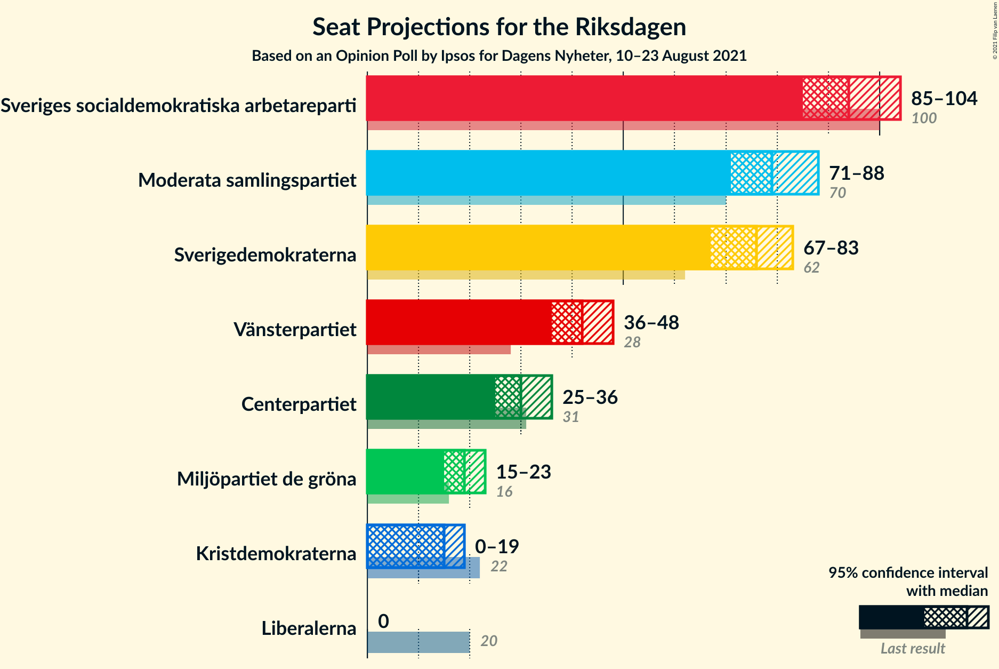
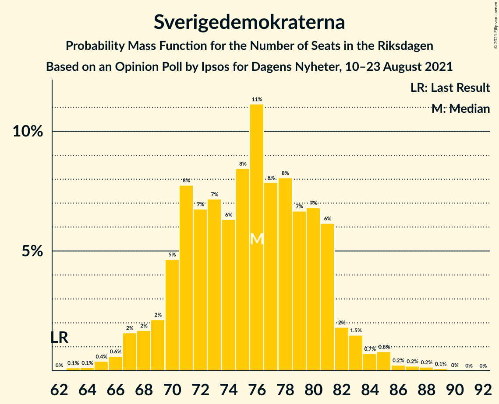
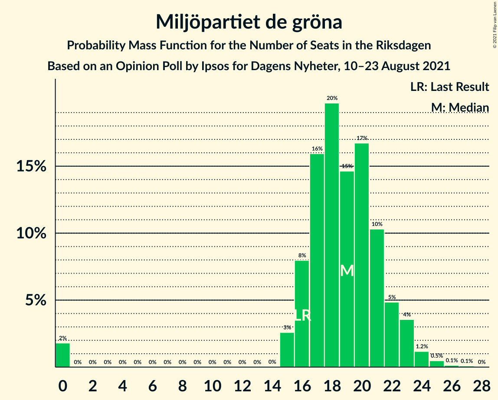
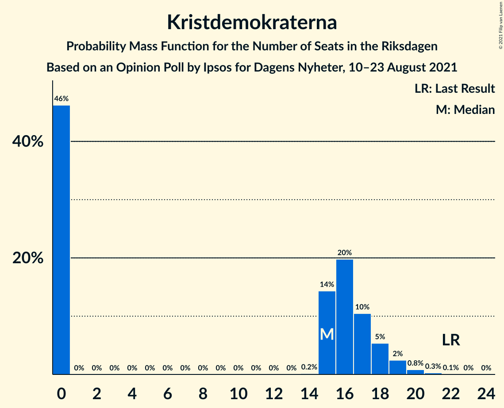
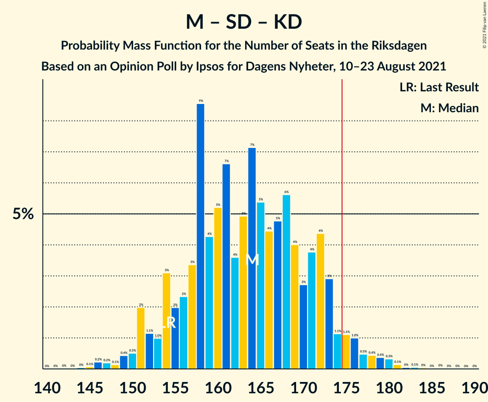
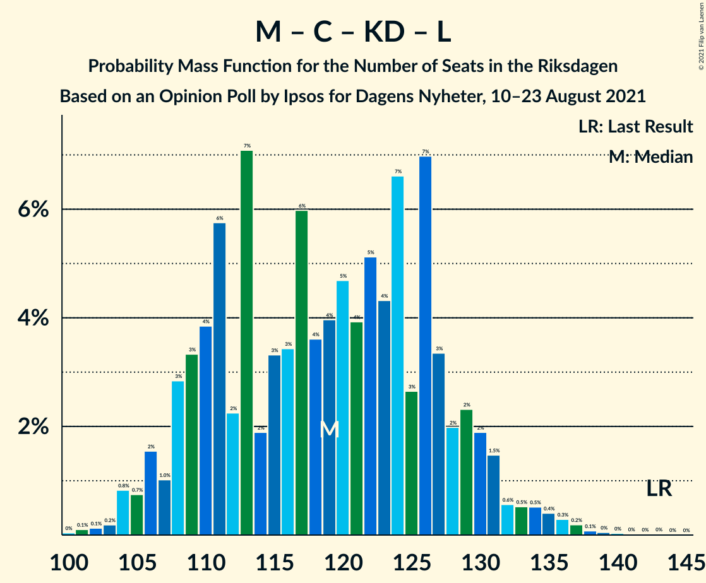
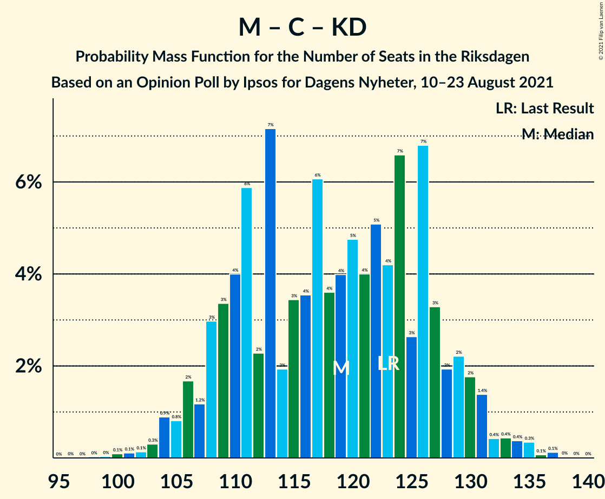

# Opinion Poll by Ipsos for Dagens Nyheter, 10–23 August 2021

<a href="#voting-intentions">Voting Intentions</a> | <a href="#seats">Seats</a> | <a href="#coalitions">Coalitions</a> | <a href="#technical-information">Technical Information</a>

## Voting Intentions

### Confidence Intervals

| Party | Last Result | Poll Result | 80% Confidence Interval | 90% Confidence Interval | 95% Confidence Interval | 99% Confidence Interval |
|:-----:|:-----------:|:-----------:|:-----------------------:|:-----------------------:|:-----------------------:|:-----------------------:|
| Sveriges socialdemokratiska arbetareparti | 28.3% | 25.3% | 23.9–26.7% |23.5–27.1% |23.2–27.5% |22.5–28.2% |
| Moderata samlingspartiet | 19.8% | 21.2% | 19.9–22.6% |19.5–23.0% |19.2–23.3% |18.6–24.0% |
| Sverigedemokraterna | 17.5% | 20.2% | 19.0–21.6% |18.6–22.0% |18.3–22.3% |17.7–23.0% |
| Vänsterpartiet | 8.0% | 11.1% | 10.2–12.2% |9.9–12.5% |9.6–12.8% |9.2–13.3% |
| Centerpartiet | 8.6% | 8.1% | 7.3–9.0% |7.0–9.3% |6.8–9.6% |6.4–10.0% |
| Miljöpartiet de gröna | 4.4% | 5.0% | 4.4–5.8% |4.2–6.1% |4.1–6.2% |3.8–6.7% |
| Kristdemokraterna | 6.3% | 4.1% | 3.5–4.8% |3.3–5.0% |3.2–5.2% |2.9–5.5% |
| Liberalerna | 5.5% | 3.0% | 2.5–3.7% |2.4–3.9% |2.3–4.0% |2.1–4.4% |

*Note:* The poll result column reflects the actual value used in the calculations. Published results may vary slightly, and in addition be rounded to fewer digits.

## Seats

### Confidence Intervals

| Party | Last Result | Median | 80% Confidence Interval | 90% Confidence Interval | 95% Confidence Interval | 99% Confidence Interval |
|:-----:|:-----------:|:------:|:-----------------------:|:-----------------------:|:-----------------------:|:-----------------------:|
| <a href="#sveriges-socialdemokratiska-arbetareparti">Sveriges socialdemokratiska arbetareparti</a> | 100 | 94 | 89–100 |87–102 |85–104 |83–107 |
| <a href="#moderata-samlingspartiet">Moderata samlingspartiet</a> | 70 | 79 | 74–85 |72–86 |71–88 |69–90 |
| <a href="#sverigedemokraterna">Sverigedemokraterna</a> | 62 | 76 | 70–81 |69–82 |67–83 |65–86 |
| <a href="#vänsterpartiet">Vänsterpartiet</a> | 28 | 42 | 38–45 |37–47 |36–48 |34–50 |
| <a href="#centerpartiet">Centerpartiet</a> | 31 | 30 | 27–34 |26–35 |25–36 |24–38 |
| <a href="#miljöpartiet-de-gröna">Miljöpartiet de gröna</a> | 16 | 19 | 16–22 |16–23 |15–23 |0–25 |
| <a href="#kristdemokraterna">Kristdemokraterna</a> | 22 | 15 | 0–17 |0–18 |0–19 |0–20 |
| <a href="#liberalerna">Liberalerna</a> | 20 | 0 | 0 |0 |0 |0–16 |

### Sveriges socialdemokratiska arbetareparti

*For a full overview of the results for this party, see the [Sveriges socialdemokratiska arbetareparti](party-sverigessocialdemokratiskaarbetareparti.html) page.*

| Number of Seats | Probability | Accumulated | Special Marks |
|:---------------:|:-----------:|:-----------:|:-------------:|
| 80 | 0.1% | 100% |  |
| 81 | 0.1% | 99.9% |  |
| 82 | 0.3% | 99.8% |  |
| 83 | 0.3% | 99.6% |  |
| 84 | 1.1% | 99.3% |  |
| 85 | 0.9% | 98% |  |
| 86 | 1.4% | 97% |  |
| 87 | 3% | 96% |  |
| 88 | 1.4% | 93% |  |
| 89 | 10% | 91% |  |
| 90 | 3% | 82% |  |
| 91 | 7% | 79% |  |
| 92 | 7% | 71% |  |
| 93 | 4% | 65% |  |
| 94 | 13% | 61% | Median |
| 95 | 4% | 47% |  |
| 96 | 12% | 43% |  |
| 97 | 8% | 31% |  |
| 98 | 4% | 23% |  |
| 99 | 6% | 19% |  |
| 100 | 4% | 13% | Last Result |
| 101 | 2% | 9% |  |
| 102 | 3% | 7% |  |
| 103 | 1.0% | 4% |  |
| 104 | 2% | 3% |  |
| 105 | 0.7% | 2% |  |
| 106 | 0.4% | 0.9% |  |
| 107 | 0.3% | 0.5% |  |
| 108 | 0.1% | 0.3% |  |
| 109 | 0.1% | 0.2% |  |
| 110 | 0% | 0.1% |  |
| 111 | 0% | 0% |  |

### Moderata samlingspartiet

*For a full overview of the results for this party, see the [Moderata samlingspartiet](party-moderatasamlingspartiet.html) page.*

| Number of Seats | Probability | Accumulated | Special Marks |
|:---------------:|:-----------:|:-----------:|:-------------:|
| 66 | 0.1% | 100% |  |
| 67 | 0.1% | 99.9% |  |
| 68 | 0.2% | 99.8% |  |
| 69 | 0.5% | 99.6% |  |
| 70 | 1.0% | 99.1% | Last Result |
| 71 | 1.2% | 98% |  |
| 72 | 3% | 97% |  |
| 73 | 3% | 94% |  |
| 74 | 4% | 91% |  |
| 75 | 4% | 87% |  |
| 76 | 11% | 82% |  |
| 77 | 6% | 71% |  |
| 78 | 7% | 65% |  |
| 79 | 10% | 58% | Median |
| 80 | 14% | 48% |  |
| 81 | 3% | 33% |  |
| 82 | 11% | 30% |  |
| 83 | 6% | 19% |  |
| 84 | 2% | 13% |  |
| 85 | 4% | 11% |  |
| 86 | 2% | 7% |  |
| 87 | 2% | 5% |  |
| 88 | 1.1% | 3% |  |
| 89 | 1.4% | 2% |  |
| 90 | 0.3% | 0.7% |  |
| 91 | 0.2% | 0.4% |  |
| 92 | 0.1% | 0.2% |  |
| 93 | 0.1% | 0.1% |  |
| 94 | 0% | 0.1% |  |
| 95 | 0% | 0% |  |

### Sverigedemokraterna

*For a full overview of the results for this party, see the [Sverigedemokraterna](party-sverigedemokraterna.html) page.*

| Number of Seats | Probability | Accumulated | Special Marks |
|:---------------:|:-----------:|:-----------:|:-------------:|
| 62 | 0% | 100% | Last Result |
| 63 | 0.1% | 100% |  |
| 64 | 0.1% | 99.8% |  |
| 65 | 0.4% | 99.7% |  |
| 66 | 0.6% | 99.3% |  |
| 67 | 2% | 98.7% |  |
| 68 | 2% | 97% |  |
| 69 | 2% | 95% |  |
| 70 | 5% | 93% |  |
| 71 | 8% | 89% |  |
| 72 | 7% | 81% |  |
| 73 | 7% | 74% |  |
| 74 | 6% | 67% |  |
| 75 | 8% | 61% |  |
| 76 | 11% | 52% | Median |
| 77 | 8% | 41% |  |
| 78 | 8% | 33% |  |
| 79 | 7% | 25% |  |
| 80 | 7% | 19% |  |
| 81 | 6% | 12% |  |
| 82 | 2% | 6% |  |
| 83 | 1.5% | 4% |  |
| 84 | 0.7% | 2% |  |
| 85 | 0.8% | 2% |  |
| 86 | 0.2% | 0.7% |  |
| 87 | 0.2% | 0.5% |  |
| 88 | 0.2% | 0.3% |  |
| 89 | 0.1% | 0.2% |  |
| 90 | 0% | 0.1% |  |
| 91 | 0% | 0% |  |

### Vänsterpartiet

*For a full overview of the results for this party, see the [Vänsterpartiet](party-vänsterpartiet.html) page.*

| Number of Seats | Probability | Accumulated | Special Marks |
|:---------------:|:-----------:|:-----------:|:-------------:|
| 28 | 0% | 100% | Last Result |
| 29 | 0% | 100% |  |
| 30 | 0% | 100% |  |
| 31 | 0% | 100% |  |
| 32 | 0.1% | 100% |  |
| 33 | 0.2% | 99.9% |  |
| 34 | 0.6% | 99.7% |  |
| 35 | 1.0% | 99.1% |  |
| 36 | 2% | 98% |  |
| 37 | 4% | 96% |  |
| 38 | 7% | 92% |  |
| 39 | 9% | 85% |  |
| 40 | 9% | 76% |  |
| 41 | 13% | 68% |  |
| 42 | 13% | 55% | Median |
| 43 | 10% | 42% |  |
| 44 | 16% | 32% |  |
| 45 | 7% | 16% |  |
| 46 | 4% | 10% |  |
| 47 | 2% | 6% |  |
| 48 | 2% | 3% |  |
| 49 | 0.5% | 1.4% |  |
| 50 | 0.4% | 0.9% |  |
| 51 | 0.3% | 0.5% |  |
| 52 | 0.1% | 0.1% |  |
| 53 | 0% | 0.1% |  |
| 54 | 0% | 0% |  |

### Centerpartiet

*For a full overview of the results for this party, see the [Centerpartiet](party-centerpartiet.html) page.*

| Number of Seats | Probability | Accumulated | Special Marks |
|:---------------:|:-----------:|:-----------:|:-------------:|
| 22 | 0% | 100% |  |
| 23 | 0.3% | 99.9% |  |
| 24 | 0.7% | 99.7% |  |
| 25 | 2% | 98.9% |  |
| 26 | 3% | 97% |  |
| 27 | 7% | 93% |  |
| 28 | 10% | 86% |  |
| 29 | 11% | 76% |  |
| 30 | 16% | 65% | Median |
| 31 | 16% | 49% | Last Result |
| 32 | 13% | 33% |  |
| 33 | 7% | 20% |  |
| 34 | 4% | 13% |  |
| 35 | 5% | 8% |  |
| 36 | 2% | 3% |  |
| 37 | 0.6% | 1.2% |  |
| 38 | 0.4% | 0.6% |  |
| 39 | 0.2% | 0.3% |  |
| 40 | 0.1% | 0.1% |  |
| 41 | 0% | 0% |  |

### Miljöpartiet de gröna

*For a full overview of the results for this party, see the [Miljöpartiet de gröna](party-miljöpartietdegröna.html) page.*

| Number of Seats | Probability | Accumulated | Special Marks |
|:---------------:|:-----------:|:-----------:|:-------------:|
| 0 | 2% | 100% |  |
| 1 | 0% | 98% |  |
| 2 | 0% | 98% |  |
| 3 | 0% | 98% |  |
| 4 | 0% | 98% |  |
| 5 | 0% | 98% |  |
| 6 | 0% | 98% |  |
| 7 | 0% | 98% |  |
| 8 | 0% | 98% |  |
| 9 | 0% | 98% |  |
| 10 | 0% | 98% |  |
| 11 | 0% | 98% |  |
| 12 | 0% | 98% |  |
| 13 | 0% | 98% |  |
| 14 | 0% | 98% |  |
| 15 | 3% | 98% |  |
| 16 | 8% | 96% | Last Result |
| 17 | 16% | 88% |  |
| 18 | 20% | 72% |  |
| 19 | 15% | 52% | Median |
| 20 | 17% | 37% |  |
| 21 | 10% | 21% |  |
| 22 | 5% | 10% |  |
| 23 | 4% | 5% |  |
| 24 | 1.2% | 2% |  |
| 25 | 0.5% | 0.7% |  |
| 26 | 0.1% | 0.2% |  |
| 27 | 0.1% | 0.1% |  |
| 28 | 0% | 0% |  |

### Kristdemokraterna

*For a full overview of the results for this party, see the [Kristdemokraterna](party-kristdemokraterna.html) page.*

| Number of Seats | Probability | Accumulated | Special Marks |
|:---------------:|:-----------:|:-----------:|:-------------:|
| 0 | 46% | 100% |  |
| 1 | 0% | 54% |  |
| 2 | 0% | 54% |  |
| 3 | 0% | 54% |  |
| 4 | 0% | 54% |  |
| 5 | 0% | 54% |  |
| 6 | 0% | 54% |  |
| 7 | 0% | 54% |  |
| 8 | 0% | 54% |  |
| 9 | 0% | 54% |  |
| 10 | 0% | 54% |  |
| 11 | 0% | 54% |  |
| 12 | 0% | 54% |  |
| 13 | 0% | 54% |  |
| 14 | 0.2% | 54% |  |
| 15 | 14% | 54% | Median |
| 16 | 20% | 39% |  |
| 17 | 10% | 19% |  |
| 18 | 5% | 9% |  |
| 19 | 2% | 4% |  |
| 20 | 0.8% | 1.2% |  |
| 21 | 0.3% | 0.4% |  |
| 22 | 0.1% | 0.1% | Last Result |
| 23 | 0% | 0% |  |

### Liberalerna

*For a full overview of the results for this party, see the [Liberalerna](party-liberalerna.html) page.*

| Number of Seats | Probability | Accumulated | Special Marks |
|:---------------:|:-----------:|:-----------:|:-------------:|
| 0 | 98% | 100% | Median |
| 1 | 0% | 2% |  |
| 2 | 0% | 2% |  |
| 3 | 0% | 2% |  |
| 4 | 0% | 2% |  |
| 5 | 0% | 2% |  |
| 6 | 0% | 2% |  |
| 7 | 0% | 2% |  |
| 8 | 0% | 2% |  |
| 9 | 0% | 2% |  |
| 10 | 0% | 2% |  |
| 11 | 0% | 2% |  |
| 12 | 0% | 2% |  |
| 13 | 0% | 2% |  |
| 14 | 0.4% | 2% |  |
| 15 | 1.2% | 2% |  |
| 16 | 0.6% | 0.8% |  |
| 17 | 0.1% | 0.1% |  |
| 18 | 0% | 0% |  |
| 19 | 0% | 0% |  |
| 20 | 0% | 0% | Last Result |

## Coalitions

### Confidence Intervals

| Coalition | Last Result | Median | Majority? | 80% Confidence Interval | 90% Confidence Interval | 95% Confidence Interval | 99% Confidence Interval |
|:---------:|:-----------:|:------:|:---------:|:-----------------------:|:-----------------------:|:-----------------------:|:-----------------------:|
| Sveriges socialdemokratiska arbetareparti – Moderata samlingspartiet – Centerpartiet | 201 | 204 | 100% | 195–213 | 193–215 | 191–216 | 187–221 |
| Sveriges socialdemokratiska arbetareparti – Vänsterpartiet – Centerpartiet – Miljöpartiet de gröna – Liberalerna | 195 | 185 | 96% | 177–194 | 175–196 | 173–198 | 169–202 |
| Sveriges socialdemokratiska arbetareparti – Moderata samlingspartiet | 170 | 174 | 47% | 166–181 | 163–183 | 162–185 | 158–189 |
| Moderata samlingspartiet – Sverigedemokraterna – Kristdemokraterna | 154 | 164 | 4% | 155–172 | 153–174 | 151–176 | 147–180 |
| Moderata samlingspartiet – Sverigedemokraterna | 132 | 155 | 0.1% | 147–162 | 145–164 | 143–167 | 140–170 |
| Sveriges socialdemokratiska arbetareparti – Vänsterpartiet – Miljöpartiet de gröna | 144 | 155 | 0% | 147–162 | 145–165 | 143–166 | 138–170 |
| Sveriges socialdemokratiska arbetareparti – Centerpartiet – Miljöpartiet de gröna – Liberalerna | 167 | 144 | 0% | 136–151 | 134–153 | 132–155 | 127–160 |
| Sveriges socialdemokratiska arbetareparti – Vänsterpartiet | 128 | 136 | 0% | 129–144 | 127–145 | 125–148 | 122–151 |
| Moderata samlingspartiet – Centerpartiet – Kristdemokraterna – Liberalerna | 143 | 119 | 0% | 109–128 | 108–130 | 106–132 | 103–136 |
| Moderata samlingspartiet – Centerpartiet – Kristdemokraterna | 123 | 119 | 0% | 109–127 | 107–129 | 106–131 | 103–135 |
| Sveriges socialdemokratiska arbetareparti – Miljöpartiet de gröna | 116 | 113 | 0% | 106–120 | 104–121 | 102–123 | 95–126 |
| Moderata samlingspartiet – Centerpartiet – Liberalerna | 121 | 110 | 0% | 103–117 | 102–119 | 100–121 | 97–126 |
| Moderata samlingspartiet – Centerpartiet | 101 | 110 | 0% | 103–117 | 101–118 | 100–119 | 97–123 |

### Sveriges socialdemokratiska arbetareparti – Moderata samlingspartiet – Centerpartiet

| Number of Seats | Probability | Accumulated | Special Marks |
|:---------------:|:-----------:|:-----------:|:-------------:|
| 182 | 0.1% | 100% |  |
| 183 | 0% | 99.9% |  |
| 184 | 0% | 99.9% |  |
| 185 | 0.1% | 99.8% |  |
| 186 | 0.1% | 99.7% |  |
| 187 | 0.2% | 99.6% |  |
| 188 | 0.2% | 99.4% |  |
| 189 | 0.5% | 99.2% |  |
| 190 | 0.5% | 98.7% |  |
| 191 | 1.3% | 98% |  |
| 192 | 1.0% | 97% |  |
| 193 | 2% | 96% |  |
| 194 | 3% | 94% |  |
| 195 | 2% | 91% |  |
| 196 | 2% | 89% |  |
| 197 | 4% | 87% |  |
| 198 | 3% | 82% |  |
| 199 | 7% | 80% |  |
| 200 | 5% | 72% |  |
| 201 | 4% | 67% | Last Result |
| 202 | 7% | 63% |  |
| 203 | 4% | 56% | Median |
| 204 | 5% | 52% |  |
| 205 | 5% | 46% |  |
| 206 | 3% | 42% |  |
| 207 | 5% | 38% |  |
| 208 | 5% | 33% |  |
| 209 | 6% | 28% |  |
| 210 | 2% | 22% |  |
| 211 | 5% | 20% |  |
| 212 | 4% | 15% |  |
| 213 | 4% | 11% |  |
| 214 | 1.2% | 7% |  |
| 215 | 3% | 5% |  |
| 216 | 0.9% | 3% |  |
| 217 | 0.3% | 2% |  |
| 218 | 0.6% | 2% |  |
| 219 | 0.3% | 1.0% |  |
| 220 | 0.1% | 0.7% |  |
| 221 | 0.2% | 0.6% |  |
| 222 | 0% | 0.3% |  |
| 223 | 0.1% | 0.3% |  |
| 224 | 0% | 0.2% |  |
| 225 | 0.1% | 0.2% |  |
| 226 | 0% | 0.1% |  |
| 227 | 0% | 0% |  |

### Sveriges socialdemokratiska arbetareparti – Vänsterpartiet – Centerpartiet – Miljöpartiet de gröna – Liberalerna

| Number of Seats | Probability | Accumulated | Special Marks |
|:---------------:|:-----------:|:-----------:|:-------------:|
| 164 | 0% | 100% |  |
| 165 | 0% | 99.9% |  |
| 166 | 0.1% | 99.9% |  |
| 167 | 0% | 99.9% |  |
| 168 | 0.1% | 99.8% |  |
| 169 | 0.3% | 99.7% |  |
| 170 | 0.4% | 99.3% |  |
| 171 | 0.4% | 99.0% |  |
| 172 | 0.5% | 98.5% |  |
| 173 | 1.0% | 98% |  |
| 174 | 1.1% | 97% |  |
| 175 | 1.1% | 96% | Majority |
| 176 | 3% | 95% |  |
| 177 | 4% | 92% |  |
| 178 | 4% | 88% |  |
| 179 | 3% | 84% |  |
| 180 | 4% | 81% |  |
| 181 | 6% | 77% |  |
| 182 | 5% | 71% |  |
| 183 | 4% | 67% |  |
| 184 | 5% | 62% |  |
| 185 | 7% | 57% | Median |
| 186 | 5% | 50% |  |
| 187 | 4% | 45% |  |
| 188 | 7% | 41% |  |
| 189 | 5% | 35% |  |
| 190 | 4% | 29% |  |
| 191 | 9% | 25% |  |
| 192 | 3% | 17% |  |
| 193 | 2% | 13% |  |
| 194 | 2% | 11% |  |
| 195 | 3% | 9% | Last Result |
| 196 | 1.0% | 6% |  |
| 197 | 1.1% | 5% |  |
| 198 | 2% | 4% |  |
| 199 | 0.5% | 2% |  |
| 200 | 0.4% | 1.1% |  |
| 201 | 0.1% | 0.7% |  |
| 202 | 0.2% | 0.6% |  |
| 203 | 0.2% | 0.4% |  |
| 204 | 0.1% | 0.2% |  |
| 205 | 0% | 0.1% |  |
| 206 | 0% | 0% |  |

### Sveriges socialdemokratiska arbetareparti – Moderata samlingspartiet

| Number of Seats | Probability | Accumulated | Special Marks |
|:---------------:|:-----------:|:-----------:|:-------------:|
| 153 | 0.1% | 100% |  |
| 154 | 0% | 99.9% |  |
| 155 | 0.1% | 99.9% |  |
| 156 | 0.1% | 99.8% |  |
| 157 | 0.2% | 99.7% |  |
| 158 | 0.3% | 99.5% |  |
| 159 | 0.4% | 99.2% |  |
| 160 | 0.3% | 98.9% |  |
| 161 | 0.8% | 98.6% |  |
| 162 | 2% | 98% |  |
| 163 | 2% | 96% |  |
| 164 | 1.5% | 94% |  |
| 165 | 2% | 93% |  |
| 166 | 2% | 91% |  |
| 167 | 5% | 89% |  |
| 168 | 5% | 84% |  |
| 169 | 5% | 79% |  |
| 170 | 9% | 74% | Last Result |
| 171 | 9% | 65% |  |
| 172 | 2% | 56% |  |
| 173 | 3% | 53% | Median |
| 174 | 4% | 51% |  |
| 175 | 3% | 47% | Majority |
| 176 | 5% | 43% |  |
| 177 | 8% | 39% |  |
| 178 | 13% | 31% |  |
| 179 | 4% | 18% |  |
| 180 | 2% | 13% |  |
| 181 | 2% | 12% |  |
| 182 | 4% | 10% |  |
| 183 | 1.5% | 6% |  |
| 184 | 0.8% | 5% |  |
| 185 | 2% | 4% |  |
| 186 | 0.4% | 2% |  |
| 187 | 0.3% | 2% |  |
| 188 | 0.8% | 1.5% |  |
| 189 | 0.2% | 0.6% |  |
| 190 | 0.1% | 0.4% |  |
| 191 | 0.1% | 0.2% |  |
| 192 | 0% | 0.1% |  |
| 193 | 0% | 0.1% |  |
| 194 | 0% | 0.1% |  |
| 195 | 0% | 0.1% |  |
| 196 | 0% | 0% |  |

### Moderata samlingspartiet – Sverigedemokraterna – Kristdemokraterna

| Number of Seats | Probability | Accumulated | Special Marks |
|:---------------:|:-----------:|:-----------:|:-------------:|
| 144 | 0% | 100% |  |
| 145 | 0.1% | 99.9% |  |
| 146 | 0.2% | 99.8% |  |
| 147 | 0.2% | 99.6% |  |
| 148 | 0.1% | 99.4% |  |
| 149 | 0.4% | 99.3% |  |
| 150 | 0.5% | 98.9% |  |
| 151 | 2% | 98% |  |
| 152 | 1.1% | 96% |  |
| 153 | 1.0% | 95% |  |
| 154 | 3% | 94% | Last Result |
| 155 | 2% | 91% |  |
| 156 | 2% | 89% |  |
| 157 | 3% | 87% |  |
| 158 | 9% | 83% |  |
| 159 | 4% | 75% |  |
| 160 | 5% | 71% |  |
| 161 | 7% | 65% |  |
| 162 | 4% | 59% |  |
| 163 | 5% | 55% |  |
| 164 | 7% | 50% |  |
| 165 | 5% | 43% |  |
| 166 | 4% | 38% |  |
| 167 | 5% | 33% |  |
| 168 | 6% | 29% |  |
| 169 | 4% | 23% |  |
| 170 | 3% | 19% | Median |
| 171 | 4% | 16% |  |
| 172 | 4% | 12% |  |
| 173 | 3% | 8% |  |
| 174 | 1.1% | 5% |  |
| 175 | 1.1% | 4% | Majority |
| 176 | 1.0% | 3% |  |
| 177 | 0.5% | 2% |  |
| 178 | 0.4% | 1.5% |  |
| 179 | 0.4% | 1.0% |  |
| 180 | 0.3% | 0.7% |  |
| 181 | 0.1% | 0.3% |  |
| 182 | 0% | 0.2% |  |
| 183 | 0.1% | 0.1% |  |
| 184 | 0% | 0.1% |  |
| 185 | 0% | 0.1% |  |
| 186 | 0% | 0% |  |

### Moderata samlingspartiet – Sverigedemokraterna

| Number of Seats | Probability | Accumulated | Special Marks |
|:---------------:|:-----------:|:-----------:|:-------------:|
| 132 | 0% | 100% | Last Result |
| 133 | 0% | 100% |  |
| 134 | 0% | 100% |  |
| 135 | 0% | 100% |  |
| 136 | 0% | 100% |  |
| 137 | 0.1% | 100% |  |
| 138 | 0.1% | 99.9% |  |
| 139 | 0.1% | 99.8% |  |
| 140 | 0.2% | 99.6% |  |
| 141 | 0.5% | 99.4% |  |
| 142 | 1.1% | 98.9% |  |
| 143 | 0.5% | 98% |  |
| 144 | 1.1% | 97% |  |
| 145 | 2% | 96% |  |
| 146 | 4% | 94% |  |
| 147 | 2% | 90% |  |
| 148 | 4% | 88% |  |
| 149 | 4% | 83% |  |
| 150 | 7% | 80% |  |
| 151 | 5% | 73% |  |
| 152 | 4% | 68% |  |
| 153 | 6% | 64% |  |
| 154 | 7% | 58% |  |
| 155 | 5% | 51% | Median |
| 156 | 5% | 46% |  |
| 157 | 6% | 41% |  |
| 158 | 9% | 35% |  |
| 159 | 4% | 26% |  |
| 160 | 4% | 22% |  |
| 161 | 6% | 17% |  |
| 162 | 2% | 12% |  |
| 163 | 2% | 9% |  |
| 164 | 2% | 7% |  |
| 165 | 1.4% | 5% |  |
| 166 | 0.6% | 4% |  |
| 167 | 1.5% | 3% |  |
| 168 | 0.7% | 2% |  |
| 169 | 0.3% | 0.8% |  |
| 170 | 0.2% | 0.6% |  |
| 171 | 0.2% | 0.4% |  |
| 172 | 0% | 0.2% |  |
| 173 | 0.1% | 0.2% |  |
| 174 | 0% | 0.1% |  |
| 175 | 0% | 0.1% | Majority |
| 176 | 0% | 0.1% |  |
| 177 | 0% | 0% |  |

### Sveriges socialdemokratiska arbetareparti – Vänsterpartiet – Miljöpartiet de gröna

| Number of Seats | Probability | Accumulated | Special Marks |
|:---------------:|:-----------:|:-----------:|:-------------:|
| 133 | 0% | 100% |  |
| 134 | 0% | 99.9% |  |
| 135 | 0.2% | 99.9% |  |
| 136 | 0.1% | 99.7% |  |
| 137 | 0.1% | 99.6% |  |
| 138 | 0.1% | 99.5% |  |
| 139 | 0.2% | 99.4% |  |
| 140 | 0.3% | 99.2% |  |
| 141 | 0.3% | 98.8% |  |
| 142 | 0.8% | 98% |  |
| 143 | 0.9% | 98% |  |
| 144 | 1.2% | 97% | Last Result |
| 145 | 2% | 96% |  |
| 146 | 3% | 94% |  |
| 147 | 5% | 91% |  |
| 148 | 2% | 86% |  |
| 149 | 5% | 84% |  |
| 150 | 5% | 79% |  |
| 151 | 4% | 74% |  |
| 152 | 5% | 70% |  |
| 153 | 7% | 65% |  |
| 154 | 4% | 58% |  |
| 155 | 7% | 55% | Median |
| 156 | 8% | 47% |  |
| 157 | 6% | 39% |  |
| 158 | 4% | 33% |  |
| 159 | 5% | 29% |  |
| 160 | 8% | 24% |  |
| 161 | 4% | 16% |  |
| 162 | 4% | 12% |  |
| 163 | 2% | 8% |  |
| 164 | 1.5% | 7% |  |
| 165 | 2% | 5% |  |
| 166 | 1.5% | 4% |  |
| 167 | 0.6% | 2% |  |
| 168 | 0.4% | 2% |  |
| 169 | 0.5% | 1.1% |  |
| 170 | 0.4% | 0.6% |  |
| 171 | 0.1% | 0.3% |  |
| 172 | 0.1% | 0.2% |  |
| 173 | 0% | 0.1% |  |
| 174 | 0% | 0% |  |

### Sveriges socialdemokratiska arbetareparti – Centerpartiet – Miljöpartiet de gröna – Liberalerna

| Number of Seats | Probability | Accumulated | Special Marks |
|:---------------:|:-----------:|:-----------:|:-------------:|
| 122 | 0% | 100% |  |
| 123 | 0.1% | 99.9% |  |
| 124 | 0% | 99.9% |  |
| 125 | 0.1% | 99.8% |  |
| 126 | 0% | 99.8% |  |
| 127 | 0.3% | 99.7% |  |
| 128 | 0.2% | 99.4% |  |
| 129 | 0.3% | 99.2% |  |
| 130 | 0.5% | 98.9% |  |
| 131 | 0.4% | 98% |  |
| 132 | 1.1% | 98% |  |
| 133 | 0.8% | 97% |  |
| 134 | 1.4% | 96% |  |
| 135 | 3% | 95% |  |
| 136 | 3% | 92% |  |
| 137 | 3% | 89% |  |
| 138 | 4% | 86% |  |
| 139 | 6% | 82% |  |
| 140 | 5% | 76% |  |
| 141 | 5% | 70% |  |
| 142 | 7% | 65% |  |
| 143 | 7% | 58% | Median |
| 144 | 5% | 51% |  |
| 145 | 8% | 46% |  |
| 146 | 6% | 38% |  |
| 147 | 8% | 33% |  |
| 148 | 4% | 25% |  |
| 149 | 5% | 21% |  |
| 150 | 4% | 16% |  |
| 151 | 2% | 12% |  |
| 152 | 3% | 10% |  |
| 153 | 2% | 7% |  |
| 154 | 2% | 5% |  |
| 155 | 0.8% | 3% |  |
| 156 | 0.7% | 2% |  |
| 157 | 0.5% | 2% |  |
| 158 | 0.3% | 1.2% |  |
| 159 | 0.3% | 0.9% |  |
| 160 | 0.1% | 0.5% |  |
| 161 | 0.2% | 0.5% |  |
| 162 | 0.1% | 0.3% |  |
| 163 | 0% | 0.1% |  |
| 164 | 0% | 0.1% |  |
| 165 | 0% | 0.1% |  |
| 166 | 0% | 0% |  |
| 167 | 0% | 0% | Last Result |

### Sveriges socialdemokratiska arbetareparti – Vänsterpartiet

| Number of Seats | Probability | Accumulated | Special Marks |
|:---------------:|:-----------:|:-----------:|:-------------:|
| 119 | 0.1% | 100% |  |
| 120 | 0.1% | 99.9% |  |
| 121 | 0.2% | 99.8% |  |
| 122 | 0.3% | 99.7% |  |
| 123 | 0.3% | 99.4% |  |
| 124 | 0.7% | 99.1% |  |
| 125 | 1.1% | 98% |  |
| 126 | 2% | 97% |  |
| 127 | 2% | 96% |  |
| 128 | 3% | 93% | Last Result |
| 129 | 2% | 90% |  |
| 130 | 4% | 88% |  |
| 131 | 6% | 83% |  |
| 132 | 3% | 77% |  |
| 133 | 7% | 74% |  |
| 134 | 5% | 67% |  |
| 135 | 7% | 62% |  |
| 136 | 7% | 55% | Median |
| 137 | 7% | 48% |  |
| 138 | 7% | 41% |  |
| 139 | 3% | 34% |  |
| 140 | 10% | 31% |  |
| 141 | 4% | 21% |  |
| 142 | 4% | 17% |  |
| 143 | 1.3% | 13% |  |
| 144 | 5% | 11% |  |
| 145 | 2% | 7% |  |
| 146 | 0.9% | 5% |  |
| 147 | 0.9% | 4% |  |
| 148 | 1.2% | 3% |  |
| 149 | 0.5% | 2% |  |
| 150 | 0.7% | 1.2% |  |
| 151 | 0.2% | 0.5% |  |
| 152 | 0.2% | 0.3% |  |
| 153 | 0.1% | 0.2% |  |
| 154 | 0% | 0.1% |  |
| 155 | 0% | 0.1% |  |
| 156 | 0% | 0% |  |

### Moderata samlingspartiet – Centerpartiet – Kristdemokraterna – Liberalerna

| Number of Seats | Probability | Accumulated | Special Marks |
|:---------------:|:-----------:|:-----------:|:-------------:|
| 100 | 0% | 100% |  |
| 101 | 0.1% | 99.9% |  |
| 102 | 0.1% | 99.8% |  |
| 103 | 0.2% | 99.7% |  |
| 104 | 0.8% | 99.5% |  |
| 105 | 0.7% | 98.7% |  |
| 106 | 2% | 98% |  |
| 107 | 1.0% | 96% |  |
| 108 | 3% | 95% |  |
| 109 | 3% | 93% |  |
| 110 | 4% | 89% |  |
| 111 | 6% | 85% |  |
| 112 | 2% | 80% |  |
| 113 | 7% | 77% |  |
| 114 | 2% | 70% |  |
| 115 | 3% | 68% |  |
| 116 | 3% | 65% |  |
| 117 | 6% | 62% |  |
| 118 | 4% | 56% |  |
| 119 | 4% | 52% |  |
| 120 | 5% | 48% |  |
| 121 | 4% | 43% |  |
| 122 | 5% | 39% |  |
| 123 | 4% | 34% |  |
| 124 | 7% | 30% | Median |
| 125 | 3% | 23% |  |
| 126 | 7% | 21% |  |
| 127 | 3% | 14% |  |
| 128 | 2% | 10% |  |
| 129 | 2% | 8% |  |
| 130 | 2% | 6% |  |
| 131 | 1.5% | 4% |  |
| 132 | 0.6% | 3% |  |
| 133 | 0.5% | 2% |  |
| 134 | 0.5% | 2% |  |
| 135 | 0.4% | 1.1% |  |
| 136 | 0.3% | 0.7% |  |
| 137 | 0.2% | 0.4% |  |
| 138 | 0.1% | 0.2% |  |
| 139 | 0% | 0.1% |  |
| 140 | 0% | 0.1% |  |
| 141 | 0% | 0.1% |  |
| 142 | 0% | 0% |  |
| 143 | 0% | 0% | Last Result |

### Moderata samlingspartiet – Centerpartiet – Kristdemokraterna

| Number of Seats | Probability | Accumulated | Special Marks |
|:---------------:|:-----------:|:-----------:|:-------------:|
| 99 | 0% | 100% |  |
| 100 | 0.1% | 99.9% |  |
| 101 | 0.1% | 99.8% |  |
| 102 | 0.1% | 99.7% |  |
| 103 | 0.3% | 99.6% |  |
| 104 | 0.9% | 99.3% |  |
| 105 | 0.8% | 98% |  |
| 106 | 2% | 98% |  |
| 107 | 1.2% | 96% |  |
| 108 | 3% | 95% |  |
| 109 | 3% | 92% |  |
| 110 | 4% | 88% |  |
| 111 | 6% | 84% |  |
| 112 | 2% | 79% |  |
| 113 | 7% | 76% |  |
| 114 | 2% | 69% |  |
| 115 | 3% | 67% |  |
| 116 | 4% | 64% |  |
| 117 | 6% | 60% |  |
| 118 | 4% | 54% |  |
| 119 | 4% | 50% |  |
| 120 | 5% | 46% |  |
| 121 | 4% | 42% |  |
| 122 | 5% | 38% |  |
| 123 | 4% | 33% | Last Result |
| 124 | 7% | 28% | Median |
| 125 | 3% | 22% |  |
| 126 | 7% | 19% |  |
| 127 | 3% | 12% |  |
| 128 | 2% | 9% |  |
| 129 | 2% | 7% |  |
| 130 | 2% | 5% |  |
| 131 | 1.4% | 3% |  |
| 132 | 0.4% | 2% |  |
| 133 | 0.4% | 1.4% |  |
| 134 | 0.4% | 1.0% |  |
| 135 | 0.3% | 0.6% |  |
| 136 | 0.1% | 0.3% |  |
| 137 | 0.1% | 0.2% |  |
| 138 | 0% | 0.1% |  |
| 139 | 0% | 0% |  |

### Sveriges socialdemokratiska arbetareparti – Miljöpartiet de gröna

| Number of Seats | Probability | Accumulated | Special Marks |
|:---------------:|:-----------:|:-----------:|:-------------:|
| 91 | 0% | 100% |  |
| 92 | 0% | 99.9% |  |
| 93 | 0.2% | 99.9% |  |
| 94 | 0% | 99.7% |  |
| 95 | 0.2% | 99.6% |  |
| 96 | 0.1% | 99.4% |  |
| 97 | 0.2% | 99.4% |  |
| 98 | 0.1% | 99.2% |  |
| 99 | 0.1% | 99.1% |  |
| 100 | 0.4% | 98.9% |  |
| 101 | 0.4% | 98.5% |  |
| 102 | 0.7% | 98% |  |
| 103 | 1.2% | 97% |  |
| 104 | 1.3% | 96% |  |
| 105 | 4% | 95% |  |
| 106 | 2% | 91% |  |
| 107 | 4% | 89% |  |
| 108 | 6% | 86% |  |
| 109 | 4% | 80% |  |
| 110 | 6% | 76% |  |
| 111 | 8% | 70% |  |
| 112 | 8% | 62% |  |
| 113 | 5% | 54% | Median |
| 114 | 11% | 49% |  |
| 115 | 6% | 38% |  |
| 116 | 9% | 32% | Last Result |
| 117 | 6% | 23% |  |
| 118 | 3% | 17% |  |
| 119 | 5% | 15% |  |
| 120 | 4% | 10% |  |
| 121 | 2% | 7% |  |
| 122 | 2% | 5% |  |
| 123 | 0.9% | 3% |  |
| 124 | 0.9% | 2% |  |
| 125 | 0.3% | 0.9% |  |
| 126 | 0.2% | 0.6% |  |
| 127 | 0.2% | 0.4% |  |
| 128 | 0.1% | 0.2% |  |
| 129 | 0.1% | 0.2% |  |
| 130 | 0% | 0.1% |  |
| 131 | 0% | 0% |  |

### Moderata samlingspartiet – Centerpartiet – Liberalerna

| Number of Seats | Probability | Accumulated | Special Marks |
|:---------------:|:-----------:|:-----------:|:-------------:|
| 94 | 0% | 100% |  |
| 95 | 0.1% | 99.9% |  |
| 96 | 0.1% | 99.9% |  |
| 97 | 0.3% | 99.8% |  |
| 98 | 0.4% | 99.5% |  |
| 99 | 0.7% | 99.0% |  |
| 100 | 1.3% | 98% |  |
| 101 | 2% | 97% |  |
| 102 | 2% | 95% |  |
| 103 | 4% | 93% |  |
| 104 | 4% | 90% |  |
| 105 | 5% | 85% |  |
| 106 | 6% | 80% |  |
| 107 | 5% | 74% |  |
| 108 | 8% | 69% |  |
| 109 | 7% | 60% | Median |
| 110 | 9% | 53% |  |
| 111 | 9% | 44% |  |
| 112 | 5% | 35% |  |
| 113 | 8% | 30% |  |
| 114 | 3% | 22% |  |
| 115 | 4% | 19% |  |
| 116 | 3% | 15% |  |
| 117 | 5% | 12% |  |
| 118 | 2% | 7% |  |
| 119 | 2% | 6% |  |
| 120 | 0.8% | 4% |  |
| 121 | 0.8% | 3% | Last Result |
| 122 | 0.7% | 2% |  |
| 123 | 0.4% | 1.4% |  |
| 124 | 0.2% | 0.9% |  |
| 125 | 0.2% | 0.7% |  |
| 126 | 0.2% | 0.5% |  |
| 127 | 0.1% | 0.3% |  |
| 128 | 0% | 0.2% |  |
| 129 | 0% | 0.2% |  |
| 130 | 0.1% | 0.1% |  |
| 131 | 0% | 0.1% |  |
| 132 | 0% | 0% |  |

### Moderata samlingspartiet – Centerpartiet

| Number of Seats | Probability | Accumulated | Special Marks |
|:---------------:|:-----------:|:-----------:|:-------------:|
| 94 | 0% | 100% |  |
| 95 | 0.1% | 99.9% |  |
| 96 | 0.2% | 99.8% |  |
| 97 | 0.3% | 99.7% |  |
| 98 | 0.5% | 99.4% |  |
| 99 | 0.8% | 98.8% |  |
| 100 | 1.4% | 98% |  |
| 101 | 2% | 97% | Last Result |
| 102 | 2% | 95% |  |
| 103 | 4% | 93% |  |
| 104 | 5% | 89% |  |
| 105 | 5% | 84% |  |
| 106 | 6% | 79% |  |
| 107 | 6% | 73% |  |
| 108 | 8% | 67% |  |
| 109 | 8% | 59% | Median |
| 110 | 9% | 51% |  |
| 111 | 9% | 42% |  |
| 112 | 5% | 33% |  |
| 113 | 8% | 28% |  |
| 114 | 3% | 20% |  |
| 115 | 4% | 17% |  |
| 116 | 3% | 13% |  |
| 117 | 5% | 10% |  |
| 118 | 1.2% | 6% |  |
| 119 | 2% | 4% |  |
| 120 | 0.6% | 2% |  |
| 121 | 0.6% | 2% |  |
| 122 | 0.4% | 1.0% |  |
| 123 | 0.2% | 0.6% |  |
| 124 | 0.1% | 0.4% |  |
| 125 | 0.2% | 0.3% |  |
| 126 | 0% | 0.1% |  |
| 127 | 0% | 0% |  |

## Technical Information

### Opinion Poll

+ **Polling firm:** Ipsos
+ **Commissioner(s):** Dagens Nyheter
+ **Fieldwork period:** 10–23 August 2021

### Calculations

+ **Sample size:** 1547
+ **Simulations done:** 1,048,576
+ **Error estimate:** 0.75%

