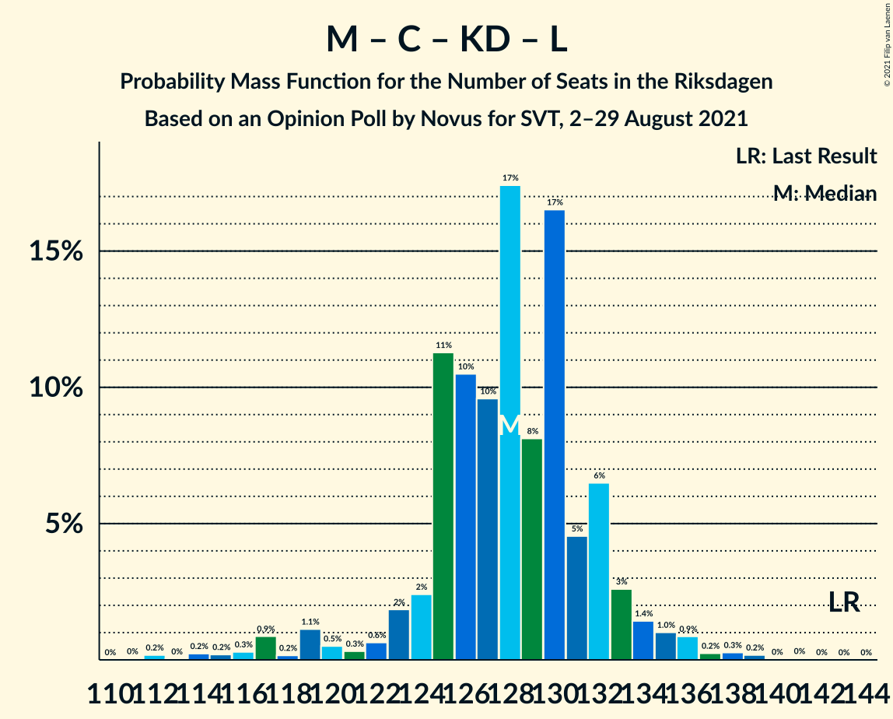

# Opinion Poll by Novus for SVT, 2–29 August 2021

<a href="#voting-intentions">Voting Intentions</a> | <a href="#seats">Seats</a> | <a href="#coalitions">Coalitions</a> | <a href="#technical-information">Technical Information</a>

## Voting Intentions

### Confidence Intervals

| Party | Last Result | Poll Result | 80% Confidence Interval | 90% Confidence Interval | 95% Confidence Interval | 99% Confidence Interval |
|:-----:|:-----------:|:-----------:|:-----------------------:|:-----------------------:|:-----------------------:|:-----------------------:|
| Sveriges socialdemokratiska arbetareparti | 28.3% | 25.9% | 25.1–26.7% |24.9–27.0% |24.7–27.2% |24.3–27.6% |
| Moderata samlingspartiet | 19.8% | 22.0% | 21.2–22.8% |21.0–23.0% |20.8–23.2% |20.5–23.6% |
| Sverigedemokraterna | 17.5% | 19.6% | 18.9–20.4% |18.7–20.6% |18.5–20.8% |18.2–21.1% |
| Vänsterpartiet | 8.0% | 11.2% | 10.6–11.8% |10.5–12.0% |10.3–12.1% |10.1–12.4% |
| Centerpartiet | 8.6% | 8.9% | 8.4–9.4% |8.2–9.6% |8.1–9.8% |7.9–10.0% |
| Kristdemokraterna | 6.3% | 4.5% | 4.1–4.9% |4.0–5.0% |3.9–5.1% |3.8–5.3% |
| Miljöpartiet de gröna | 4.4% | 4.4% | 4.0–4.8% |3.9–4.9% |3.9–5.0% |3.7–5.2% |
| Liberalerna | 5.5% | 2.1% | 1.8–2.4% |1.8–2.5% |1.7–2.6% |1.6–2.7% |

*Note:* The poll result column reflects the actual value used in the calculations. Published results may vary slightly, and in addition be rounded to fewer digits.

## Seats

### Confidence Intervals

| Party | Last Result | Median | 80% Confidence Interval | 90% Confidence Interval | 95% Confidence Interval | 99% Confidence Interval |
|:-----:|:-----------:|:------:|:-----------------------:|:-----------------------:|:-----------------------:|:-----------------------:|
| <a href="#sveriges-socialdemokratiska-arbetareparti">Sveriges socialdemokratiska arbetareparti</a> | 100 | 94 | 91–97 |90–99 |89–100 |88–103 |
| <a href="#moderata-samlingspartiet">Moderata samlingspartiet</a> | 70 | 79 | 78–83 |76–84 |75–85 |74–87 |
| <a href="#sverigedemokraterna">Sverigedemokraterna</a> | 62 | 71 | 68–74 |67–75 |67–76 |66–78 |
| <a href="#vänsterpartiet">Vänsterpartiet</a> | 28 | 41 | 39–43 |38–44 |38–44 |36–46 |
| <a href="#centerpartiet">Centerpartiet</a> | 31 | 32 | 30–34 |30–35 |30–36 |29–37 |
| <a href="#kristdemokraterna">Kristdemokraterna</a> | 22 | 16 | 15–18 |15–18 |0–19 |0–19 |
| <a href="#miljöpartiet-de-gröna">Miljöpartiet de gröna</a> | 16 | 16 | 15–17 |0–18 |0–18 |0–19 |
| <a href="#liberalerna">Liberalerna</a> | 20 | 0 | 0 |0 |0 |0 |

### Sveriges socialdemokratiska arbetareparti

*For a full overview of the results for this party, see the [Sveriges socialdemokratiska arbetareparti](party-sverigessocialdemokratiskaarbetareparti.html) page.*

| Number of Seats | Probability | Accumulated | Special Marks |
|:---------------:|:-----------:|:-----------:|:-------------:|
| 86 | 0% | 100% |  |
| 87 | 0.2% | 99.9% |  |
| 88 | 0.7% | 99.8% |  |
| 89 | 2% | 99.1% |  |
| 90 | 4% | 97% |  |
| 91 | 10% | 93% |  |
| 92 | 11% | 83% |  |
| 93 | 17% | 71% |  |
| 94 | 17% | 54% | Median |
| 95 | 15% | 37% |  |
| 96 | 7% | 22% |  |
| 97 | 7% | 16% |  |
| 98 | 3% | 9% |  |
| 99 | 2% | 6% |  |
| 100 | 1.5% | 4% | Last Result |
| 101 | 0.9% | 2% |  |
| 102 | 0.4% | 1.2% |  |
| 103 | 0.7% | 0.8% |  |
| 104 | 0.1% | 0.1% |  |
| 105 | 0% | 0.1% |  |
| 106 | 0% | 0% |  |

### Moderata samlingspartiet

*For a full overview of the results for this party, see the [Moderata samlingspartiet](party-moderatasamlingspartiet.html) page.*

| Number of Seats | Probability | Accumulated | Special Marks |
|:---------------:|:-----------:|:-----------:|:-------------:|
| 70 | 0% | 100% | Last Result |
| 71 | 0% | 100% |  |
| 72 | 0% | 100% |  |
| 73 | 0.1% | 100% |  |
| 74 | 0.5% | 99.9% |  |
| 75 | 3% | 99.4% |  |
| 76 | 2% | 97% |  |
| 77 | 4% | 94% |  |
| 78 | 31% | 90% |  |
| 79 | 10% | 59% | Median |
| 80 | 6% | 49% |  |
| 81 | 19% | 43% |  |
| 82 | 14% | 24% |  |
| 83 | 2% | 11% |  |
| 84 | 4% | 9% |  |
| 85 | 3% | 5% |  |
| 86 | 0.7% | 1.5% |  |
| 87 | 0.4% | 0.8% |  |
| 88 | 0.3% | 0.4% |  |
| 89 | 0.1% | 0.1% |  |
| 90 | 0% | 0% |  |

### Sverigedemokraterna

*For a full overview of the results for this party, see the [Sverigedemokraterna](party-sverigedemokraterna.html) page.*

| Number of Seats | Probability | Accumulated | Special Marks |
|:---------------:|:-----------:|:-----------:|:-------------:|
| 62 | 0% | 100% | Last Result |
| 63 | 0% | 100% |  |
| 64 | 0.1% | 100% |  |
| 65 | 0.4% | 99.9% |  |
| 66 | 2% | 99.6% |  |
| 67 | 3% | 98% |  |
| 68 | 6% | 95% |  |
| 69 | 10% | 89% |  |
| 70 | 15% | 79% |  |
| 71 | 17% | 64% | Median |
| 72 | 19% | 46% |  |
| 73 | 13% | 27% |  |
| 74 | 7% | 14% |  |
| 75 | 3% | 7% |  |
| 76 | 2% | 4% |  |
| 77 | 0.8% | 2% |  |
| 78 | 0.6% | 1.0% |  |
| 79 | 0.3% | 0.4% |  |
| 80 | 0% | 0.1% |  |
| 81 | 0% | 0.1% |  |
| 82 | 0% | 0% |  |

### Vänsterpartiet

*For a full overview of the results for this party, see the [Vänsterpartiet](party-vänsterpartiet.html) page.*

| Number of Seats | Probability | Accumulated | Special Marks |
|:---------------:|:-----------:|:-----------:|:-------------:|
| 28 | 0% | 100% | Last Result |
| 29 | 0% | 100% |  |
| 30 | 0% | 100% |  |
| 31 | 0% | 100% |  |
| 32 | 0% | 100% |  |
| 33 | 0% | 100% |  |
| 34 | 0% | 100% |  |
| 35 | 0.1% | 100% |  |
| 36 | 0.7% | 99.9% |  |
| 37 | 2% | 99.2% |  |
| 38 | 5% | 98% |  |
| 39 | 16% | 93% |  |
| 40 | 20% | 76% |  |
| 41 | 26% | 57% | Median |
| 42 | 18% | 30% |  |
| 43 | 6% | 12% |  |
| 44 | 4% | 6% |  |
| 45 | 1.3% | 2% |  |
| 46 | 0.4% | 0.7% |  |
| 47 | 0.2% | 0.2% |  |
| 48 | 0% | 0% |  |

### Centerpartiet

*For a full overview of the results for this party, see the [Centerpartiet](party-centerpartiet.html) page.*

| Number of Seats | Probability | Accumulated | Special Marks |
|:---------------:|:-----------:|:-----------:|:-------------:|
| 27 | 0.1% | 100% |  |
| 28 | 0.4% | 99.9% |  |
| 29 | 2% | 99.6% |  |
| 30 | 9% | 98% |  |
| 31 | 24% | 89% | Last Result |
| 32 | 18% | 65% | Median |
| 33 | 30% | 47% |  |
| 34 | 7% | 16% |  |
| 35 | 6% | 9% |  |
| 36 | 2% | 3% |  |
| 37 | 0.4% | 0.6% |  |
| 38 | 0.2% | 0.2% |  |
| 39 | 0% | 0% |  |

### Kristdemokraterna

*For a full overview of the results for this party, see the [Kristdemokraterna](party-kristdemokraterna.html) page.*

| Number of Seats | Probability | Accumulated | Special Marks |
|:---------------:|:-----------:|:-----------:|:-------------:|
| 0 | 4% | 100% |  |
| 1 | 0% | 96% |  |
| 2 | 0% | 96% |  |
| 3 | 0% | 96% |  |
| 4 | 0% | 96% |  |
| 5 | 0% | 96% |  |
| 6 | 0% | 96% |  |
| 7 | 0% | 96% |  |
| 8 | 0% | 96% |  |
| 9 | 0% | 96% |  |
| 10 | 0% | 96% |  |
| 11 | 0% | 96% |  |
| 12 | 0% | 96% |  |
| 13 | 0% | 96% |  |
| 14 | 0.2% | 96% |  |
| 15 | 17% | 96% |  |
| 16 | 35% | 79% | Median |
| 17 | 26% | 44% |  |
| 18 | 15% | 18% |  |
| 19 | 3% | 3% |  |
| 20 | 0.3% | 0.3% |  |
| 21 | 0% | 0% |  |
| 22 | 0% | 0% | Last Result |

### Miljöpartiet de gröna

*For a full overview of the results for this party, see the [Miljöpartiet de gröna](party-miljöpartietdegröna.html) page.*

| Number of Seats | Probability | Accumulated | Special Marks |
|:---------------:|:-----------:|:-----------:|:-------------:|
| 0 | 6% | 100% |  |
| 1 | 0% | 94% |  |
| 2 | 0% | 94% |  |
| 3 | 0% | 94% |  |
| 4 | 0% | 94% |  |
| 5 | 0% | 94% |  |
| 6 | 0% | 94% |  |
| 7 | 0% | 94% |  |
| 8 | 0% | 94% |  |
| 9 | 0% | 94% |  |
| 10 | 0% | 94% |  |
| 11 | 0% | 94% |  |
| 12 | 0% | 94% |  |
| 13 | 0% | 94% |  |
| 14 | 0.2% | 94% |  |
| 15 | 33% | 94% |  |
| 16 | 36% | 62% | Last Result, Median |
| 17 | 18% | 26% |  |
| 18 | 6% | 8% |  |
| 19 | 1.5% | 2% |  |
| 20 | 0.1% | 0.1% |  |
| 21 | 0% | 0% |  |

### Liberalerna

*For a full overview of the results for this party, see the [Liberalerna](party-liberalerna.html) page.*

| Number of Seats | Probability | Accumulated | Special Marks |
|:---------------:|:-----------:|:-----------:|:-------------:|
| 0 | 100% | 100% | Median |
| 1 | 0% | 0% |  |
| 2 | 0% | 0% |  |
| 3 | 0% | 0% |  |
| 4 | 0% | 0% |  |
| 5 | 0% | 0% |  |
| 6 | 0% | 0% |  |
| 7 | 0% | 0% |  |
| 8 | 0% | 0% |  |
| 9 | 0% | 0% |  |
| 10 | 0% | 0% |  |
| 11 | 0% | 0% |  |
| 12 | 0% | 0% |  |
| 13 | 0% | 0% |  |
| 14 | 0% | 0% |  |
| 15 | 0% | 0% |  |
| 16 | 0% | 0% |  |
| 17 | 0% | 0% |  |
| 18 | 0% | 0% |  |
| 19 | 0% | 0% |  |
| 20 | 0% | 0% | Last Result |

## Coalitions

### Confidence Intervals

| Coalition | Last Result | Median | Majority? | 80% Confidence Interval | 90% Confidence Interval | 95% Confidence Interval | 99% Confidence Interval |
|:---------:|:-----------:|:------:|:---------:|:-----------------------:|:-----------------------:|:-----------------------:|:-----------------------:|
| Sveriges socialdemokratiska arbetareparti – Moderata samlingspartiet – Centerpartiet | 201 | 205 | 100% | 202–210 | 201–216 | 200–218 | 199–220 |
| Sveriges socialdemokratiska arbetareparti – Vänsterpartiet – Centerpartiet – Miljöpartiet de gröna – Liberalerna | 195 | 182 | 98% | 178–186 | 177–187 | 175–190 | 171–195 |
| Sveriges socialdemokratiska arbetareparti – Moderata samlingspartiet | 170 | 173 | 35% | 170–178 | 169–182 | 168–184 | 166–186 |
| Moderata samlingspartiet – Sverigedemokraterna – Kristdemokraterna | 154 | 167 | 2% | 163–171 | 162–172 | 159–174 | 154–178 |
| Moderata samlingspartiet – Sverigedemokraterna | 132 | 151 | 0% | 147–155 | 147–157 | 146–160 | 144–162 |
| Sveriges socialdemokratiska arbetareparti – Vänsterpartiet – Miljöpartiet de gröna | 144 | 150 | 0% | 146–154 | 144–155 | 141–157 | 137–160 |
| Sveriges socialdemokratiska arbetareparti – Centerpartiet – Miljöpartiet de gröna – Liberalerna | 167 | 142 | 0% | 138–145 | 135–147 | 133–148 | 129–152 |
| Sveriges socialdemokratiska arbetareparti – Vänsterpartiet | 128 | 134 | 0% | 131–139 | 130–141 | 129–143 | 128–145 |
| Moderata samlingspartiet – Centerpartiet – Kristdemokraterna – Liberalerna | 143 | 128 | 0% | 125–132 | 123–133 | 119–135 | 115–138 |
| Moderata samlingspartiet – Centerpartiet – Kristdemokraterna | 123 | 128 | 0% | 125–132 | 123–133 | 119–135 | 115–138 |
| Moderata samlingspartiet – Centerpartiet – Liberalerna | 121 | 112 | 0% | 109–116 | 108–118 | 107–119 | 105–121 |
| Moderata samlingspartiet – Centerpartiet | 101 | 112 | 0% | 109–116 | 108–118 | 107–119 | 105–121 |
| Sveriges socialdemokratiska arbetareparti – Miljöpartiet de gröna | 116 | 109 | 0% | 106–113 | 103–114 | 99–115 | 95–118 |

### Sveriges socialdemokratiska arbetareparti – Moderata samlingspartiet – Centerpartiet

| Number of Seats | Probability | Accumulated | Special Marks |
|:---------------:|:-----------:|:-----------:|:-------------:|
| 197 | 0.1% | 100% |  |
| 198 | 0.2% | 99.9% |  |
| 199 | 0.8% | 99.7% |  |
| 200 | 2% | 98.9% |  |
| 201 | 4% | 97% | Last Result |
| 202 | 6% | 93% |  |
| 203 | 8% | 87% |  |
| 204 | 18% | 79% |  |
| 205 | 15% | 61% | Median |
| 206 | 12% | 46% |  |
| 207 | 11% | 34% |  |
| 208 | 8% | 24% |  |
| 209 | 3% | 15% |  |
| 210 | 3% | 13% |  |
| 211 | 1.0% | 10% |  |
| 212 | 0.8% | 9% |  |
| 213 | 0.9% | 8% |  |
| 214 | 1.1% | 7% |  |
| 215 | 1.2% | 6% |  |
| 216 | 1.2% | 5% |  |
| 217 | 1.0% | 4% |  |
| 218 | 1.1% | 3% |  |
| 219 | 0.9% | 2% |  |
| 220 | 0.4% | 0.8% |  |
| 221 | 0.1% | 0.4% |  |
| 222 | 0.1% | 0.3% |  |
| 223 | 0% | 0.2% |  |
| 224 | 0% | 0.2% |  |
| 225 | 0% | 0.1% |  |
| 226 | 0.1% | 0.1% |  |
| 227 | 0% | 0.1% |  |
| 228 | 0% | 0% |  |

### Sveriges socialdemokratiska arbetareparti – Vänsterpartiet – Centerpartiet – Miljöpartiet de gröna – Liberalerna

| Number of Seats | Probability | Accumulated | Special Marks |
|:---------------:|:-----------:|:-----------:|:-------------:|
| 168 | 0% | 100% |  |
| 169 | 0.1% | 99.9% |  |
| 170 | 0.3% | 99.9% |  |
| 171 | 0.2% | 99.6% |  |
| 172 | 0.4% | 99.4% |  |
| 173 | 0.7% | 99.0% |  |
| 174 | 0.7% | 98% |  |
| 175 | 1.0% | 98% | Majority |
| 176 | 0.9% | 97% |  |
| 177 | 2% | 96% |  |
| 178 | 5% | 93% |  |
| 179 | 9% | 88% |  |
| 180 | 14% | 79% |  |
| 181 | 9% | 66% |  |
| 182 | 9% | 56% |  |
| 183 | 11% | 48% | Median |
| 184 | 17% | 36% |  |
| 185 | 8% | 19% |  |
| 186 | 5% | 12% |  |
| 187 | 2% | 6% |  |
| 188 | 0.9% | 5% |  |
| 189 | 1.3% | 4% |  |
| 190 | 0.6% | 3% |  |
| 191 | 0.6% | 2% |  |
| 192 | 0.6% | 2% |  |
| 193 | 0.2% | 0.9% |  |
| 194 | 0.1% | 0.7% |  |
| 195 | 0.2% | 0.5% | Last Result |
| 196 | 0.1% | 0.3% |  |
| 197 | 0.1% | 0.2% |  |
| 198 | 0% | 0% |  |

### Sveriges socialdemokratiska arbetareparti – Moderata samlingspartiet

| Number of Seats | Probability | Accumulated | Special Marks |
|:---------------:|:-----------:|:-----------:|:-------------:|
| 165 | 0.2% | 100% |  |
| 166 | 0.3% | 99.8% |  |
| 167 | 0.9% | 99.5% |  |
| 168 | 2% | 98.6% |  |
| 169 | 5% | 97% |  |
| 170 | 5% | 91% | Last Result |
| 171 | 14% | 86% |  |
| 172 | 12% | 72% |  |
| 173 | 17% | 60% | Median |
| 174 | 8% | 43% |  |
| 175 | 12% | 35% | Majority |
| 176 | 7% | 23% |  |
| 177 | 5% | 17% |  |
| 178 | 2% | 11% |  |
| 179 | 1.5% | 9% |  |
| 180 | 1.2% | 8% |  |
| 181 | 2% | 7% |  |
| 182 | 0.8% | 5% |  |
| 183 | 1.2% | 4% |  |
| 184 | 1.0% | 3% |  |
| 185 | 1.1% | 2% |  |
| 186 | 0.6% | 1.0% |  |
| 187 | 0.1% | 0.4% |  |
| 188 | 0.1% | 0.3% |  |
| 189 | 0% | 0.1% |  |
| 190 | 0% | 0.1% |  |
| 191 | 0% | 0.1% |  |
| 192 | 0% | 0.1% |  |
| 193 | 0% | 0% |  |

### Moderata samlingspartiet – Sverigedemokraterna – Kristdemokraterna

| Number of Seats | Probability | Accumulated | Special Marks |
|:---------------:|:-----------:|:-----------:|:-------------:|
| 152 | 0.1% | 100% |  |
| 153 | 0.1% | 99.8% |  |
| 154 | 0.2% | 99.7% | Last Result |
| 155 | 0.1% | 99.5% |  |
| 156 | 0.2% | 99.3% |  |
| 157 | 0.6% | 99.1% |  |
| 158 | 0.6% | 98% |  |
| 159 | 0.6% | 98% |  |
| 160 | 1.3% | 97% |  |
| 161 | 0.9% | 96% |  |
| 162 | 2% | 95% |  |
| 163 | 5% | 94% |  |
| 164 | 8% | 88% |  |
| 165 | 17% | 81% |  |
| 166 | 11% | 64% | Median |
| 167 | 9% | 52% |  |
| 168 | 9% | 44% |  |
| 169 | 14% | 34% |  |
| 170 | 9% | 21% |  |
| 171 | 5% | 12% |  |
| 172 | 2% | 7% |  |
| 173 | 0.9% | 4% |  |
| 174 | 1.0% | 3% |  |
| 175 | 0.7% | 2% | Majority |
| 176 | 0.7% | 2% |  |
| 177 | 0.4% | 1.0% |  |
| 178 | 0.2% | 0.6% |  |
| 179 | 0.3% | 0.4% |  |
| 180 | 0.1% | 0.1% |  |
| 181 | 0% | 0.1% |  |
| 182 | 0% | 0% |  |

### Moderata samlingspartiet – Sverigedemokraterna

| Number of Seats | Probability | Accumulated | Special Marks |
|:---------------:|:-----------:|:-----------:|:-------------:|
| 132 | 0% | 100% | Last Result |
| 133 | 0% | 100% |  |
| 134 | 0% | 100% |  |
| 135 | 0% | 100% |  |
| 136 | 0% | 100% |  |
| 137 | 0% | 100% |  |
| 138 | 0% | 100% |  |
| 139 | 0% | 100% |  |
| 140 | 0% | 100% |  |
| 141 | 0% | 100% |  |
| 142 | 0.1% | 100% |  |
| 143 | 0.2% | 99.9% |  |
| 144 | 0.7% | 99.7% |  |
| 145 | 1.4% | 99.0% |  |
| 146 | 2% | 98% |  |
| 147 | 6% | 95% |  |
| 148 | 11% | 89% |  |
| 149 | 12% | 79% |  |
| 150 | 17% | 67% | Median |
| 151 | 13% | 50% |  |
| 152 | 9% | 38% |  |
| 153 | 10% | 29% |  |
| 154 | 7% | 19% |  |
| 155 | 3% | 12% |  |
| 156 | 2% | 9% |  |
| 157 | 2% | 7% |  |
| 158 | 1.2% | 5% |  |
| 159 | 1.2% | 4% |  |
| 160 | 1.3% | 3% |  |
| 161 | 0.5% | 1.2% |  |
| 162 | 0.4% | 0.7% |  |
| 163 | 0.1% | 0.3% |  |
| 164 | 0.1% | 0.3% |  |
| 165 | 0% | 0.2% |  |
| 166 | 0.1% | 0.1% |  |
| 167 | 0% | 0.1% |  |
| 168 | 0% | 0% |  |

### Sveriges socialdemokratiska arbetareparti – Vänsterpartiet – Miljöpartiet de gröna

| Number of Seats | Probability | Accumulated | Special Marks |
|:---------------:|:-----------:|:-----------:|:-------------:|
| 135 | 0.1% | 100% |  |
| 136 | 0.2% | 99.9% |  |
| 137 | 0.4% | 99.7% |  |
| 138 | 0.4% | 99.3% |  |
| 139 | 0.2% | 98.9% |  |
| 140 | 0.8% | 98.7% |  |
| 141 | 1.1% | 98% |  |
| 142 | 0.5% | 97% |  |
| 143 | 0.9% | 96% |  |
| 144 | 1.0% | 95% | Last Result |
| 145 | 2% | 94% |  |
| 146 | 3% | 92% |  |
| 147 | 10% | 89% |  |
| 148 | 14% | 79% |  |
| 149 | 11% | 65% |  |
| 150 | 11% | 55% |  |
| 151 | 14% | 44% | Median |
| 152 | 11% | 30% |  |
| 153 | 9% | 19% |  |
| 154 | 3% | 10% |  |
| 155 | 3% | 7% |  |
| 156 | 1.4% | 4% |  |
| 157 | 1.2% | 3% |  |
| 158 | 0.5% | 2% |  |
| 159 | 0.5% | 1.2% |  |
| 160 | 0.2% | 0.7% |  |
| 161 | 0.2% | 0.5% |  |
| 162 | 0.2% | 0.3% |  |
| 163 | 0.1% | 0.1% |  |
| 164 | 0% | 0.1% |  |
| 165 | 0% | 0% |  |

### Sveriges socialdemokratiska arbetareparti – Centerpartiet – Miljöpartiet de gröna – Liberalerna

| Number of Seats | Probability | Accumulated | Special Marks |
|:---------------:|:-----------:|:-----------:|:-------------:|
| 126 | 0% | 100% |  |
| 127 | 0.1% | 99.9% |  |
| 128 | 0.1% | 99.8% |  |
| 129 | 0.6% | 99.7% |  |
| 130 | 0.4% | 99.0% |  |
| 131 | 0.4% | 98.7% |  |
| 132 | 0.6% | 98% |  |
| 133 | 0.8% | 98% |  |
| 134 | 0.5% | 97% |  |
| 135 | 2% | 96% |  |
| 136 | 2% | 95% |  |
| 137 | 2% | 93% |  |
| 138 | 6% | 91% |  |
| 139 | 7% | 85% |  |
| 140 | 15% | 79% |  |
| 141 | 13% | 64% |  |
| 142 | 17% | 51% | Median |
| 143 | 14% | 34% |  |
| 144 | 7% | 20% |  |
| 145 | 4% | 13% |  |
| 146 | 4% | 9% |  |
| 147 | 2% | 5% |  |
| 148 | 0.7% | 3% |  |
| 149 | 0.8% | 2% |  |
| 150 | 0.7% | 2% |  |
| 151 | 0.3% | 0.8% |  |
| 152 | 0.2% | 0.5% |  |
| 153 | 0.2% | 0.3% |  |
| 154 | 0.1% | 0.2% |  |
| 155 | 0% | 0.1% |  |
| 156 | 0% | 0% |  |
| 157 | 0% | 0% |  |
| 158 | 0% | 0% |  |
| 159 | 0% | 0% |  |
| 160 | 0% | 0% |  |
| 161 | 0% | 0% |  |
| 162 | 0% | 0% |  |
| 163 | 0% | 0% |  |
| 164 | 0% | 0% |  |
| 165 | 0% | 0% |  |
| 166 | 0% | 0% |  |
| 167 | 0% | 0% | Last Result |

### Sveriges socialdemokratiska arbetareparti – Vänsterpartiet

| Number of Seats | Probability | Accumulated | Special Marks |
|:---------------:|:-----------:|:-----------:|:-------------:|
| 126 | 0.1% | 100% |  |
| 127 | 0.2% | 99.9% |  |
| 128 | 0.8% | 99.7% | Last Result |
| 129 | 2% | 98.9% |  |
| 130 | 4% | 97% |  |
| 131 | 9% | 93% |  |
| 132 | 7% | 85% |  |
| 133 | 19% | 78% |  |
| 134 | 8% | 58% |  |
| 135 | 16% | 50% | Median |
| 136 | 11% | 34% |  |
| 137 | 6% | 23% |  |
| 138 | 7% | 17% |  |
| 139 | 3% | 10% |  |
| 140 | 2% | 8% |  |
| 141 | 2% | 6% |  |
| 142 | 1.0% | 4% |  |
| 143 | 0.8% | 3% |  |
| 144 | 0.6% | 2% |  |
| 145 | 0.8% | 1.1% |  |
| 146 | 0.1% | 0.3% |  |
| 147 | 0.1% | 0.2% |  |
| 148 | 0.1% | 0.1% |  |
| 149 | 0% | 0% |  |

### Moderata samlingspartiet – Centerpartiet – Kristdemokraterna – Liberalerna

| Number of Seats | Probability | Accumulated | Special Marks |
|:---------------:|:-----------:|:-----------:|:-------------:|
| 111 | 0% | 100% |  |
| 112 | 0.2% | 99.9% |  |
| 113 | 0% | 99.8% |  |
| 114 | 0.2% | 99.7% |  |
| 115 | 0.2% | 99.5% |  |
| 116 | 0.3% | 99.3% |  |
| 117 | 0.9% | 99.0% |  |
| 118 | 0.2% | 98% |  |
| 119 | 1.1% | 98% |  |
| 120 | 0.5% | 97% |  |
| 121 | 0.3% | 96% |  |
| 122 | 0.6% | 96% |  |
| 123 | 2% | 95% |  |
| 124 | 2% | 94% |  |
| 125 | 11% | 91% |  |
| 126 | 10% | 80% |  |
| 127 | 10% | 69% | Median |
| 128 | 17% | 60% |  |
| 129 | 8% | 42% |  |
| 130 | 17% | 34% |  |
| 131 | 5% | 18% |  |
| 132 | 6% | 13% |  |
| 133 | 3% | 7% |  |
| 134 | 1.4% | 4% |  |
| 135 | 1.0% | 3% |  |
| 136 | 0.9% | 2% |  |
| 137 | 0.2% | 0.8% |  |
| 138 | 0.3% | 0.5% |  |
| 139 | 0.2% | 0.3% |  |
| 140 | 0% | 0.1% |  |
| 141 | 0% | 0.1% |  |
| 142 | 0% | 0% |  |
| 143 | 0% | 0% | Last Result |

### Moderata samlingspartiet – Centerpartiet – Kristdemokraterna

| Number of Seats | Probability | Accumulated | Special Marks |
|:---------------:|:-----------:|:-----------:|:-------------:|
| 111 | 0% | 100% |  |
| 112 | 0.2% | 99.9% |  |
| 113 | 0% | 99.8% |  |
| 114 | 0.2% | 99.7% |  |
| 115 | 0.2% | 99.5% |  |
| 116 | 0.3% | 99.3% |  |
| 117 | 0.9% | 99.0% |  |
| 118 | 0.2% | 98% |  |
| 119 | 1.1% | 98% |  |
| 120 | 0.5% | 97% |  |
| 121 | 0.3% | 96% |  |
| 122 | 0.6% | 96% |  |
| 123 | 2% | 95% | Last Result |
| 124 | 2% | 94% |  |
| 125 | 11% | 91% |  |
| 126 | 10% | 80% |  |
| 127 | 10% | 69% | Median |
| 128 | 17% | 60% |  |
| 129 | 8% | 42% |  |
| 130 | 17% | 34% |  |
| 131 | 5% | 18% |  |
| 132 | 6% | 13% |  |
| 133 | 3% | 7% |  |
| 134 | 1.4% | 4% |  |
| 135 | 1.0% | 3% |  |
| 136 | 0.9% | 2% |  |
| 137 | 0.2% | 0.8% |  |
| 138 | 0.3% | 0.5% |  |
| 139 | 0.2% | 0.3% |  |
| 140 | 0% | 0.1% |  |
| 141 | 0% | 0.1% |  |
| 142 | 0% | 0% |  |

### Moderata samlingspartiet – Centerpartiet – Liberalerna

| Number of Seats | Probability | Accumulated | Special Marks |
|:---------------:|:-----------:|:-----------:|:-------------:|
| 104 | 0.1% | 100% |  |
| 105 | 0.5% | 99.9% |  |
| 106 | 0.7% | 99.4% |  |
| 107 | 2% | 98.7% |  |
| 108 | 3% | 97% |  |
| 109 | 13% | 93% |  |
| 110 | 10% | 80% |  |
| 111 | 18% | 71% | Median |
| 112 | 11% | 53% |  |
| 113 | 15% | 42% |  |
| 114 | 12% | 27% |  |
| 115 | 3% | 15% |  |
| 116 | 4% | 12% |  |
| 117 | 3% | 8% |  |
| 118 | 1.2% | 5% |  |
| 119 | 2% | 4% |  |
| 120 | 0.9% | 2% |  |
| 121 | 0.4% | 0.8% | Last Result |
| 122 | 0.2% | 0.5% |  |
| 123 | 0.1% | 0.2% |  |
| 124 | 0.1% | 0.2% |  |
| 125 | 0.1% | 0.1% |  |
| 126 | 0% | 0% |  |

### Moderata samlingspartiet – Centerpartiet

| Number of Seats | Probability | Accumulated | Special Marks |
|:---------------:|:-----------:|:-----------:|:-------------:|
| 101 | 0% | 100% | Last Result |
| 102 | 0% | 100% |  |
| 103 | 0% | 100% |  |
| 104 | 0.1% | 100% |  |
| 105 | 0.5% | 99.9% |  |
| 106 | 0.7% | 99.4% |  |
| 107 | 2% | 98.7% |  |
| 108 | 3% | 97% |  |
| 109 | 13% | 93% |  |
| 110 | 10% | 80% |  |
| 111 | 18% | 71% | Median |
| 112 | 11% | 53% |  |
| 113 | 15% | 42% |  |
| 114 | 12% | 27% |  |
| 115 | 3% | 15% |  |
| 116 | 4% | 12% |  |
| 117 | 3% | 8% |  |
| 118 | 1.2% | 5% |  |
| 119 | 2% | 4% |  |
| 120 | 0.9% | 2% |  |
| 121 | 0.4% | 0.8% |  |
| 122 | 0.2% | 0.5% |  |
| 123 | 0.1% | 0.2% |  |
| 124 | 0.1% | 0.2% |  |
| 125 | 0.1% | 0.1% |  |
| 126 | 0% | 0% |  |

### Sveriges socialdemokratiska arbetareparti – Miljöpartiet de gröna

| Number of Seats | Probability | Accumulated | Special Marks |
|:---------------:|:-----------:|:-----------:|:-------------:|
| 92 | 0% | 100% |  |
| 93 | 0.1% | 99.9% |  |
| 94 | 0.1% | 99.9% |  |
| 95 | 0.3% | 99.7% |  |
| 96 | 0.5% | 99.5% |  |
| 97 | 0.7% | 98.9% |  |
| 98 | 0.5% | 98% |  |
| 99 | 1.0% | 98% |  |
| 100 | 0.8% | 97% |  |
| 101 | 0.7% | 96% |  |
| 102 | 0.2% | 95% |  |
| 103 | 0.9% | 95% |  |
| 104 | 0.7% | 94% |  |
| 105 | 2% | 94% |  |
| 106 | 3% | 92% |  |
| 107 | 15% | 88% |  |
| 108 | 8% | 74% |  |
| 109 | 18% | 65% |  |
| 110 | 16% | 47% | Median |
| 111 | 13% | 31% |  |
| 112 | 8% | 18% |  |
| 113 | 3% | 10% |  |
| 114 | 3% | 7% |  |
| 115 | 2% | 4% |  |
| 116 | 1.0% | 2% | Last Result |
| 117 | 0.7% | 1.3% |  |
| 118 | 0.4% | 0.6% |  |
| 119 | 0.1% | 0.2% |  |
| 120 | 0.1% | 0.1% |  |
| 121 | 0% | 0% |  |

## Technical Information

### Opinion Poll

+ **Polling firm:** Novus
+ **Commissioner(s):** SVT
+ **Fieldwork period:** 2–29 August 2021

### Calculations

+ **Sample size:** 4765
+ **Simulations done:** 1,048,576
+ **Error estimate:** 0.55%

