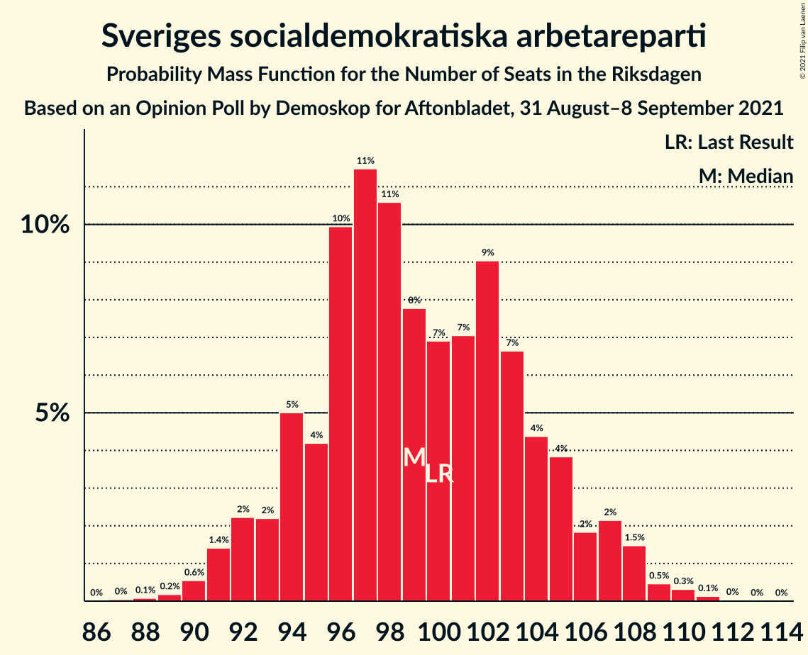
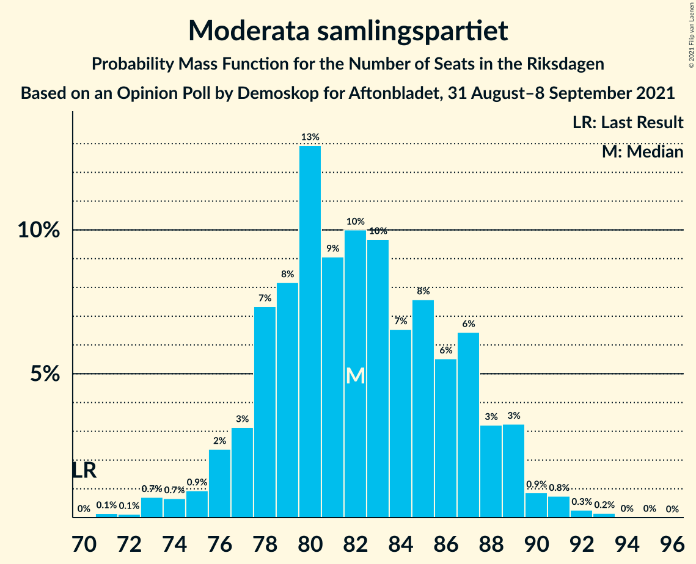
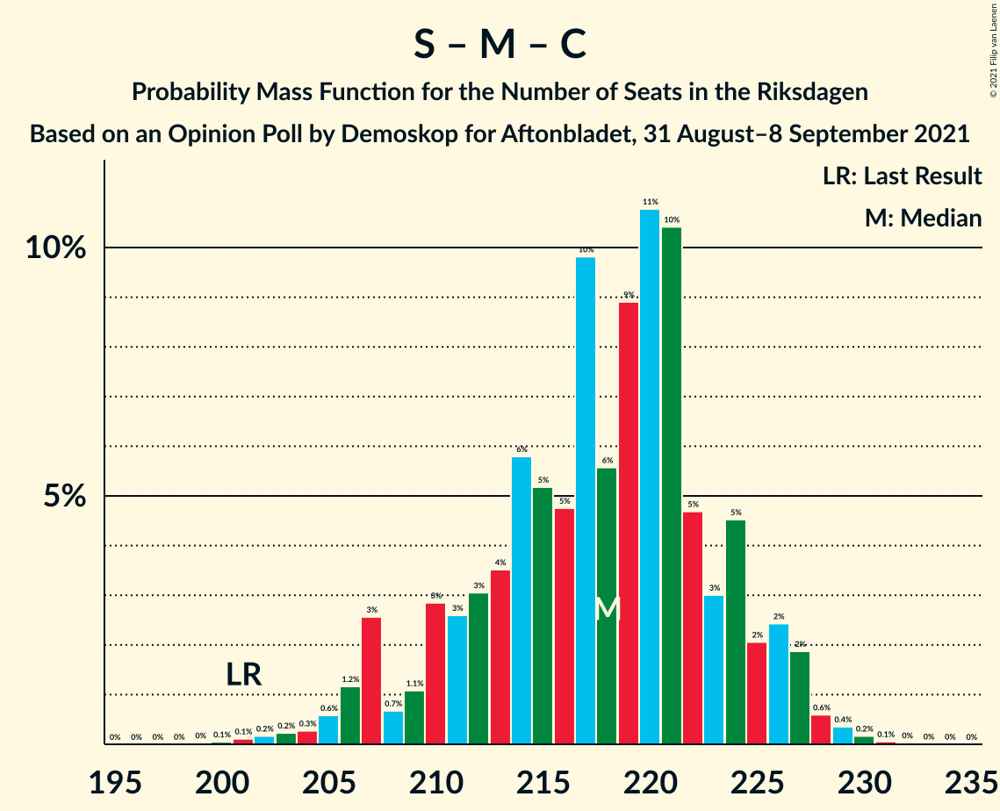
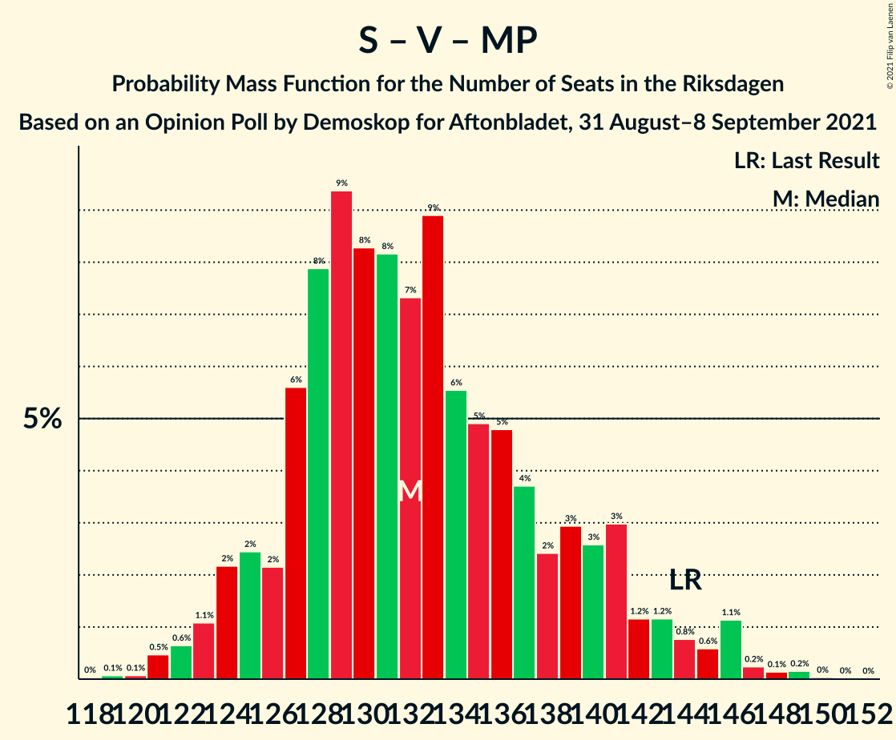

# Opinion Poll by Demoskop for Aftonbladet, 31 August–8 September 2021

<a href="#voting-intentions">Voting Intentions</a> | <a href="#seats">Seats</a> | <a href="#coalitions">Coalitions</a> | <a href="#technical-information">Technical Information</a>

## Voting Intentions

### Confidence Intervals

| Party | Last Result | Poll Result | 80% Confidence Interval | 90% Confidence Interval | 95% Confidence Interval | 99% Confidence Interval |
|:-----:|:-----------:|:-----------:|:-----------------------:|:-----------------------:|:-----------------------:|:-----------------------:|
| Sveriges socialdemokratiska arbetareparti | 28.3% | 26.7% | 25.5–28.0% |25.2–28.3% |24.9–28.6% |24.4–29.2% |
| Moderata samlingspartiet | 19.8% | 22.1% | 21.0–23.3% |20.7–23.6% |20.4–23.9% |19.9–24.5% |
| Sverigedemokraterna | 17.5% | 20.7% | 19.6–21.9% |19.4–22.2% |19.1–22.5% |18.6–23.0% |
| Centerpartiet | 8.6% | 9.7% | 9.0–10.6% |8.7–10.8% |8.6–11.1% |8.2–11.5% |
| Vänsterpartiet | 8.0% | 8.2% | 7.5–9.0% |7.3–9.2% |7.1–9.4% |6.8–9.8% |
| Kristdemokraterna | 6.3% | 5.6% | 5.0–6.3% |4.8–6.5% |4.7–6.6% |4.4–7.0% |
| Miljöpartiet de gröna | 4.4% | 3.5% | 3.0–4.1% |2.9–4.2% |2.8–4.4% |2.6–4.6% |
| Liberalerna | 5.5% | 2.5% | 2.1–3.0% |2.0–3.1% |1.9–3.2% |1.8–3.5% |

*Note:* The poll result column reflects the actual value used in the calculations. Published results may vary slightly, and in addition be rounded to fewer digits.

## Seats

### Confidence Intervals

| Party | Last Result | Median | 80% Confidence Interval | 90% Confidence Interval | 95% Confidence Interval | 99% Confidence Interval |
|:-----:|:-----------:|:------:|:-----------------------:|:-----------------------:|:-----------------------:|:-----------------------:|
| <a href="#sveriges-socialdemokratiska-arbetareparti">Sveriges socialdemokratiska arbetareparti</a> | 100 | 99 | 94–105 |93–106 |92–107 |90–110 |
| <a href="#moderata-samlingspartiet">Moderata samlingspartiet</a> | 70 | 82 | 78–87 |77–89 |75–89 |73–91 |
| <a href="#sverigedemokraterna">Sverigedemokraterna</a> | 62 | 77 | 73–82 |71–83 |70–84 |68–86 |
| <a href="#centerpartiet">Centerpartiet</a> | 31 | 36 | 33–40 |32–40 |32–41 |30–43 |
| <a href="#vänsterpartiet">Vänsterpartiet</a> | 28 | 31 | 28–34 |27–35 |26–35 |25–37 |
| <a href="#kristdemokraterna">Kristdemokraterna</a> | 22 | 21 | 19–23 |18–24 |17–25 |16–26 |
| <a href="#miljöpartiet-de-gröna">Miljöpartiet de gröna</a> | 16 | 0 | 0–15 |0–15 |0–16 |0–17 |
| <a href="#liberalerna">Liberalerna</a> | 20 | 0 | 0 |0 |0 |0 |

### Sveriges socialdemokratiska arbetareparti

*For a full overview of the results for this party, see the [Sveriges socialdemokratiska arbetareparti](party-sverigessocialdemokratiskaarbetareparti.html) page.*

| Number of Seats | Probability | Accumulated | Special Marks |
|:---------------:|:-----------:|:-----------:|:-------------:|
| 87 | 0% | 100% |  |
| 88 | 0.1% | 99.9% |  |
| 89 | 0.2% | 99.9% |  |
| 90 | 0.6% | 99.7% |  |
| 91 | 1.4% | 99.1% |  |
| 92 | 2% | 98% |  |
| 93 | 2% | 95% |  |
| 94 | 5% | 93% |  |
| 95 | 4% | 88% |  |
| 96 | 10% | 84% |  |
| 97 | 11% | 74% |  |
| 98 | 11% | 63% |  |
| 99 | 8% | 52% | Median |
| 100 | 7% | 44% | Last Result |
| 101 | 7% | 37% |  |
| 102 | 9% | 30% |  |
| 103 | 7% | 21% |  |
| 104 | 4% | 15% |  |
| 105 | 4% | 10% |  |
| 106 | 2% | 6% |  |
| 107 | 2% | 5% |  |
| 108 | 1.5% | 2% |  |
| 109 | 0.5% | 1.0% |  |
| 110 | 0.3% | 0.5% |  |
| 111 | 0.1% | 0.2% |  |
| 112 | 0% | 0.1% |  |
| 113 | 0% | 0% |  |

### Moderata samlingspartiet

*For a full overview of the results for this party, see the [Moderata samlingspartiet](party-moderatasamlingspartiet.html) page.*

| Number of Seats | Probability | Accumulated | Special Marks |
|:---------------:|:-----------:|:-----------:|:-------------:|
| 70 | 0% | 100% | Last Result |
| 71 | 0.1% | 100% |  |
| 72 | 0.1% | 99.8% |  |
| 73 | 0.7% | 99.7% |  |
| 74 | 0.7% | 99.0% |  |
| 75 | 0.9% | 98% |  |
| 76 | 2% | 97% |  |
| 77 | 3% | 95% |  |
| 78 | 7% | 92% |  |
| 79 | 8% | 85% |  |
| 80 | 13% | 76% |  |
| 81 | 9% | 63% |  |
| 82 | 10% | 54% | Median |
| 83 | 10% | 44% |  |
| 84 | 7% | 35% |  |
| 85 | 8% | 28% |  |
| 86 | 6% | 21% |  |
| 87 | 6% | 15% |  |
| 88 | 3% | 9% |  |
| 89 | 3% | 5% |  |
| 90 | 0.9% | 2% |  |
| 91 | 0.8% | 1.2% |  |
| 92 | 0.3% | 0.5% |  |
| 93 | 0.2% | 0.2% |  |
| 94 | 0% | 0.1% |  |
| 95 | 0% | 0% |  |

### Sverigedemokraterna

*For a full overview of the results for this party, see the [Sverigedemokraterna](party-sverigedemokraterna.html) page.*

| Number of Seats | Probability | Accumulated | Special Marks |
|:---------------:|:-----------:|:-----------:|:-------------:|
| 62 | 0% | 100% | Last Result |
| 63 | 0% | 100% |  |
| 64 | 0% | 100% |  |
| 65 | 0% | 100% |  |
| 66 | 0.1% | 100% |  |
| 67 | 0.2% | 99.9% |  |
| 68 | 0.2% | 99.7% |  |
| 69 | 0.8% | 99.5% |  |
| 70 | 2% | 98.7% |  |
| 71 | 2% | 97% |  |
| 72 | 4% | 95% |  |
| 73 | 5% | 91% |  |
| 74 | 8% | 86% |  |
| 75 | 11% | 78% |  |
| 76 | 9% | 67% |  |
| 77 | 10% | 58% | Median |
| 78 | 10% | 47% |  |
| 79 | 8% | 37% |  |
| 80 | 13% | 29% |  |
| 81 | 5% | 16% |  |
| 82 | 5% | 11% |  |
| 83 | 2% | 6% |  |
| 84 | 1.3% | 4% |  |
| 85 | 2% | 2% |  |
| 86 | 0.3% | 0.5% |  |
| 87 | 0.2% | 0.3% |  |
| 88 | 0.1% | 0.1% |  |
| 89 | 0% | 0% |  |

### Centerpartiet

*For a full overview of the results for this party, see the [Centerpartiet](party-centerpartiet.html) page.*

| Number of Seats | Probability | Accumulated | Special Marks |
|:---------------:|:-----------:|:-----------:|:-------------:|
| 29 | 0.1% | 100% |  |
| 30 | 0.6% | 99.8% |  |
| 31 | 1.3% | 99.3% | Last Result |
| 32 | 5% | 98% |  |
| 33 | 6% | 93% |  |
| 34 | 11% | 87% |  |
| 35 | 16% | 76% |  |
| 36 | 16% | 60% | Median |
| 37 | 14% | 44% |  |
| 38 | 9% | 31% |  |
| 39 | 9% | 22% |  |
| 40 | 8% | 13% |  |
| 41 | 2% | 5% |  |
| 42 | 1.4% | 2% |  |
| 43 | 0.7% | 1.0% |  |
| 44 | 0.2% | 0.3% |  |
| 45 | 0.1% | 0.1% |  |
| 46 | 0% | 0% |  |

### Vänsterpartiet

*For a full overview of the results for this party, see the [Vänsterpartiet](party-vänsterpartiet.html) page.*

| Number of Seats | Probability | Accumulated | Special Marks |
|:---------------:|:-----------:|:-----------:|:-------------:|
| 24 | 0.2% | 100% |  |
| 25 | 0.7% | 99.8% |  |
| 26 | 2% | 99.0% |  |
| 27 | 5% | 97% |  |
| 28 | 12% | 92% | Last Result |
| 29 | 11% | 80% |  |
| 30 | 15% | 69% |  |
| 31 | 20% | 54% | Median |
| 32 | 12% | 33% |  |
| 33 | 11% | 22% |  |
| 34 | 5% | 11% |  |
| 35 | 4% | 6% |  |
| 36 | 1.3% | 2% |  |
| 37 | 0.6% | 0.8% |  |
| 38 | 0.1% | 0.1% |  |
| 39 | 0% | 0% |  |

### Kristdemokraterna

*For a full overview of the results for this party, see the [Kristdemokraterna](party-kristdemokraterna.html) page.*

| Number of Seats | Probability | Accumulated | Special Marks |
|:---------------:|:-----------:|:-----------:|:-------------:|
| 15 | 0.1% | 100% |  |
| 16 | 0.7% | 99.9% |  |
| 17 | 2% | 99.2% |  |
| 18 | 7% | 97% |  |
| 19 | 14% | 90% |  |
| 20 | 22% | 77% |  |
| 21 | 18% | 55% | Median |
| 22 | 17% | 36% | Last Result |
| 23 | 11% | 20% |  |
| 24 | 5% | 9% |  |
| 25 | 2% | 3% |  |
| 26 | 1.0% | 1.3% |  |
| 27 | 0.2% | 0.3% |  |
| 28 | 0.1% | 0.1% |  |
| 29 | 0% | 0% |  |

### Miljöpartiet de gröna

*For a full overview of the results for this party, see the [Miljöpartiet de gröna](party-miljöpartietdegröna.html) page.*

| Number of Seats | Probability | Accumulated | Special Marks |
|:---------------:|:-----------:|:-----------:|:-------------:|
| 0 | 83% | 100% | Median |
| 1 | 0% | 17% |  |
| 2 | 0% | 17% |  |
| 3 | 0% | 17% |  |
| 4 | 0% | 17% |  |
| 5 | 0% | 17% |  |
| 6 | 0% | 17% |  |
| 7 | 0% | 17% |  |
| 8 | 0% | 17% |  |
| 9 | 0% | 17% |  |
| 10 | 0% | 17% |  |
| 11 | 0% | 17% |  |
| 12 | 0% | 17% |  |
| 13 | 0% | 17% |  |
| 14 | 0.3% | 17% |  |
| 15 | 12% | 16% |  |
| 16 | 3% | 4% | Last Result |
| 17 | 0.9% | 1.0% |  |
| 18 | 0.1% | 0.1% |  |
| 19 | 0% | 0% |  |

### Liberalerna

*For a full overview of the results for this party, see the [Liberalerna](party-liberalerna.html) page.*

| Number of Seats | Probability | Accumulated | Special Marks |
|:---------------:|:-----------:|:-----------:|:-------------:|
| 0 | 100% | 100% | Median |
| 1 | 0% | 0% |  |
| 2 | 0% | 0% |  |
| 3 | 0% | 0% |  |
| 4 | 0% | 0% |  |
| 5 | 0% | 0% |  |
| 6 | 0% | 0% |  |
| 7 | 0% | 0% |  |
| 8 | 0% | 0% |  |
| 9 | 0% | 0% |  |
| 10 | 0% | 0% |  |
| 11 | 0% | 0% |  |
| 12 | 0% | 0% |  |
| 13 | 0% | 0% |  |
| 14 | 0% | 0% |  |
| 15 | 0% | 0% |  |
| 16 | 0% | 0% |  |
| 17 | 0% | 0% |  |
| 18 | 0% | 0% |  |
| 19 | 0% | 0% |  |
| 20 | 0% | 0% | Last Result |

## Coalitions

### Confidence Intervals

| Coalition | Last Result | Median | Majority? | 80% Confidence Interval | 90% Confidence Interval | 95% Confidence Interval | 99% Confidence Interval |
|:---------:|:-----------:|:------:|:---------:|:-----------------------:|:-----------------------:|:-----------------------:|:-----------------------:|
| Sveriges socialdemokratiska arbetareparti – Moderata samlingspartiet – Centerpartiet | 201 | 218 | 100% | 211–224 | 207–226 | 206–227 | 203–229 |
| Sveriges socialdemokratiska arbetareparti – Moderata samlingspartiet | 170 | 181 | 93% | 175–188 | 173–189 | 171–190 | 167–193 |
| Moderata samlingspartiet – Sverigedemokraterna – Kristdemokraterna | 154 | 181 | 86% | 174–187 | 172–188 | 170–189 | 167–191 |
| Sveriges socialdemokratiska arbetareparti – Centerpartiet – Vänsterpartiet – Miljöpartiet de gröna – Liberalerna | 195 | 168 | 14% | 162–175 | 161–177 | 160–179 | 158–182 |
| Moderata samlingspartiet – Sverigedemokraterna | 132 | 160 | 0% | 153–165 | 152–167 | 149–168 | 147–170 |
| Sveriges socialdemokratiska arbetareparti – Centerpartiet – Miljöpartiet de gröna – Liberalerna | 167 | 137 | 0% | 132–145 | 131–148 | 130–149 | 127–153 |
| Moderata samlingspartiet – Centerpartiet – Kristdemokraterna – Liberalerna | 143 | 140 | 0% | 134–145 | 132–147 | 131–148 | 128–151 |
| Moderata samlingspartiet – Centerpartiet – Kristdemokraterna | 123 | 140 | 0% | 134–145 | 132–146 | 131–148 | 128–151 |
| Sveriges socialdemokratiska arbetareparti – Vänsterpartiet – Miljöpartiet de gröna | 144 | 132 | 0% | 127–140 | 125–142 | 124–144 | 121–147 |
| Sveriges socialdemokratiska arbetareparti – Vänsterpartiet | 128 | 130 | 0% | 124–136 | 122–137 | 121–138 | 118–140 |
| Moderata samlingspartiet – Centerpartiet – Liberalerna | 121 | 119 | 0% | 113–124 | 112–125 | 110–127 | 108–129 |
| Moderata samlingspartiet – Centerpartiet | 101 | 119 | 0% | 113–124 | 112–125 | 110–127 | 108–129 |
| Sveriges socialdemokratiska arbetareparti – Miljöpartiet de gröna | 116 | 101 | 0% | 96–110 | 94–112 | 93–114 | 91–116 |

### Sveriges socialdemokratiska arbetareparti – Moderata samlingspartiet – Centerpartiet

| Number of Seats | Probability | Accumulated | Special Marks |
|:---------------:|:-----------:|:-----------:|:-------------:|
| 200 | 0.1% | 100% |  |
| 201 | 0.1% | 99.9% | Last Result |
| 202 | 0.2% | 99.8% |  |
| 203 | 0.2% | 99.6% |  |
| 204 | 0.3% | 99.4% |  |
| 205 | 0.6% | 99.1% |  |
| 206 | 1.2% | 98.5% |  |
| 207 | 3% | 97% |  |
| 208 | 0.7% | 95% |  |
| 209 | 1.1% | 94% |  |
| 210 | 3% | 93% |  |
| 211 | 3% | 90% |  |
| 212 | 3% | 88% |  |
| 213 | 4% | 85% |  |
| 214 | 6% | 81% |  |
| 215 | 5% | 75% |  |
| 216 | 5% | 70% |  |
| 217 | 10% | 65% | Median |
| 218 | 6% | 55% |  |
| 219 | 9% | 50% |  |
| 220 | 11% | 41% |  |
| 221 | 10% | 30% |  |
| 222 | 5% | 20% |  |
| 223 | 3% | 15% |  |
| 224 | 5% | 12% |  |
| 225 | 2% | 8% |  |
| 226 | 2% | 6% |  |
| 227 | 2% | 3% |  |
| 228 | 0.6% | 1.2% |  |
| 229 | 0.4% | 0.6% |  |
| 230 | 0.2% | 0.3% |  |
| 231 | 0.1% | 0.1% |  |
| 232 | 0% | 0.1% |  |
| 233 | 0% | 0% |  |

### Sveriges socialdemokratiska arbetareparti – Moderata samlingspartiet

| Number of Seats | Probability | Accumulated | Special Marks |
|:---------------:|:-----------:|:-----------:|:-------------:|
| 165 | 0% | 100% |  |
| 166 | 0.1% | 99.9% |  |
| 167 | 0.4% | 99.8% |  |
| 168 | 0.2% | 99.4% |  |
| 169 | 0.3% | 99.2% |  |
| 170 | 1.0% | 98.9% | Last Result |
| 171 | 1.1% | 98% |  |
| 172 | 1.3% | 97% |  |
| 173 | 2% | 96% |  |
| 174 | 1.1% | 94% |  |
| 175 | 6% | 93% | Majority |
| 176 | 3% | 87% |  |
| 177 | 6% | 85% |  |
| 178 | 5% | 78% |  |
| 179 | 8% | 74% |  |
| 180 | 6% | 66% |  |
| 181 | 10% | 60% | Median |
| 182 | 8% | 50% |  |
| 183 | 7% | 42% |  |
| 184 | 7% | 35% |  |
| 185 | 9% | 28% |  |
| 186 | 5% | 19% |  |
| 187 | 3% | 14% |  |
| 188 | 4% | 11% |  |
| 189 | 3% | 7% |  |
| 190 | 2% | 4% |  |
| 191 | 0.7% | 2% |  |
| 192 | 0.7% | 2% |  |
| 193 | 0.5% | 0.9% |  |
| 194 | 0.2% | 0.3% |  |
| 195 | 0.1% | 0.1% |  |
| 196 | 0% | 0.1% |  |
| 197 | 0% | 0% |  |

### Moderata samlingspartiet – Sverigedemokraterna – Kristdemokraterna

| Number of Seats | Probability | Accumulated | Special Marks |
|:---------------:|:-----------:|:-----------:|:-------------:|
| 154 | 0% | 100% | Last Result |
| 155 | 0% | 100% |  |
| 156 | 0% | 100% |  |
| 157 | 0% | 100% |  |
| 158 | 0% | 100% |  |
| 159 | 0% | 100% |  |
| 160 | 0% | 100% |  |
| 161 | 0% | 100% |  |
| 162 | 0% | 100% |  |
| 163 | 0% | 100% |  |
| 164 | 0.1% | 100% |  |
| 165 | 0% | 99.9% |  |
| 166 | 0.2% | 99.8% |  |
| 167 | 1.0% | 99.7% |  |
| 168 | 0.7% | 98.7% |  |
| 169 | 0.5% | 98% |  |
| 170 | 1.0% | 98% |  |
| 171 | 0.7% | 97% |  |
| 172 | 2% | 96% |  |
| 173 | 4% | 94% |  |
| 174 | 4% | 90% |  |
| 175 | 3% | 86% | Majority |
| 176 | 4% | 83% |  |
| 177 | 8% | 79% |  |
| 178 | 6% | 71% |  |
| 179 | 7% | 65% |  |
| 180 | 8% | 59% | Median |
| 181 | 10% | 51% |  |
| 182 | 5% | 41% |  |
| 183 | 8% | 36% |  |
| 184 | 9% | 29% |  |
| 185 | 5% | 20% |  |
| 186 | 4% | 15% |  |
| 187 | 5% | 10% |  |
| 188 | 2% | 6% |  |
| 189 | 2% | 3% |  |
| 190 | 1.1% | 2% |  |
| 191 | 0.4% | 0.7% |  |
| 192 | 0.1% | 0.3% |  |
| 193 | 0.1% | 0.2% |  |
| 194 | 0% | 0.1% |  |
| 195 | 0% | 0% |  |

### Sveriges socialdemokratiska arbetareparti – Centerpartiet – Vänsterpartiet – Miljöpartiet de gröna – Liberalerna

| Number of Seats | Probability | Accumulated | Special Marks |
|:---------------:|:-----------:|:-----------:|:-------------:|
| 155 | 0% | 100% |  |
| 156 | 0.1% | 99.9% |  |
| 157 | 0.1% | 99.8% |  |
| 158 | 0.4% | 99.7% |  |
| 159 | 1.1% | 99.3% |  |
| 160 | 2% | 98% |  |
| 161 | 2% | 97% |  |
| 162 | 5% | 94% |  |
| 163 | 4% | 90% |  |
| 164 | 5% | 85% |  |
| 165 | 9% | 80% |  |
| 166 | 8% | 71% | Median |
| 167 | 5% | 64% |  |
| 168 | 10% | 59% |  |
| 169 | 8% | 49% |  |
| 170 | 7% | 41% |  |
| 171 | 6% | 35% |  |
| 172 | 8% | 29% |  |
| 173 | 4% | 21% |  |
| 174 | 3% | 17% |  |
| 175 | 4% | 14% | Majority |
| 176 | 4% | 10% |  |
| 177 | 2% | 6% |  |
| 178 | 0.7% | 4% |  |
| 179 | 1.0% | 3% |  |
| 180 | 0.5% | 2% |  |
| 181 | 0.7% | 2% |  |
| 182 | 1.0% | 1.3% |  |
| 183 | 0.2% | 0.3% |  |
| 184 | 0% | 0.2% |  |
| 185 | 0.1% | 0.1% |  |
| 186 | 0% | 0% |  |
| 187 | 0% | 0% |  |
| 188 | 0% | 0% |  |
| 189 | 0% | 0% |  |
| 190 | 0% | 0% |  |
| 191 | 0% | 0% |  |
| 192 | 0% | 0% |  |
| 193 | 0% | 0% |  |
| 194 | 0% | 0% |  |
| 195 | 0% | 0% | Last Result |

### Moderata samlingspartiet – Sverigedemokraterna

| Number of Seats | Probability | Accumulated | Special Marks |
|:---------------:|:-----------:|:-----------:|:-------------:|
| 132 | 0% | 100% | Last Result |
| 133 | 0% | 100% |  |
| 134 | 0% | 100% |  |
| 135 | 0% | 100% |  |
| 136 | 0% | 100% |  |
| 137 | 0% | 100% |  |
| 138 | 0% | 100% |  |
| 139 | 0% | 100% |  |
| 140 | 0% | 100% |  |
| 141 | 0% | 100% |  |
| 142 | 0% | 100% |  |
| 143 | 0% | 100% |  |
| 144 | 0.1% | 100% |  |
| 145 | 0.1% | 99.9% |  |
| 146 | 0.2% | 99.8% |  |
| 147 | 1.0% | 99.6% |  |
| 148 | 0.9% | 98.6% |  |
| 149 | 0.5% | 98% |  |
| 150 | 1.3% | 97% |  |
| 151 | 0.8% | 96% |  |
| 152 | 2% | 95% |  |
| 153 | 4% | 93% |  |
| 154 | 6% | 90% |  |
| 155 | 3% | 84% |  |
| 156 | 6% | 81% |  |
| 157 | 8% | 75% |  |
| 158 | 9% | 67% |  |
| 159 | 7% | 58% | Median |
| 160 | 9% | 51% |  |
| 161 | 6% | 42% |  |
| 162 | 10% | 36% |  |
| 163 | 7% | 26% |  |
| 164 | 5% | 19% |  |
| 165 | 4% | 14% |  |
| 166 | 3% | 9% |  |
| 167 | 3% | 7% |  |
| 168 | 2% | 4% |  |
| 169 | 0.8% | 2% |  |
| 170 | 0.7% | 1.1% |  |
| 171 | 0.2% | 0.3% |  |
| 172 | 0.1% | 0.2% |  |
| 173 | 0% | 0.1% |  |
| 174 | 0% | 0.1% |  |
| 175 | 0% | 0% | Majority |

### Sveriges socialdemokratiska arbetareparti – Centerpartiet – Miljöpartiet de gröna – Liberalerna

| Number of Seats | Probability | Accumulated | Special Marks |
|:---------------:|:-----------:|:-----------:|:-------------:|
| 124 | 0% | 100% |  |
| 125 | 0.1% | 99.9% |  |
| 126 | 0.2% | 99.8% |  |
| 127 | 0.6% | 99.6% |  |
| 128 | 0.7% | 99.0% |  |
| 129 | 0.7% | 98% |  |
| 130 | 2% | 98% |  |
| 131 | 5% | 95% |  |
| 132 | 3% | 91% |  |
| 133 | 5% | 88% |  |
| 134 | 11% | 83% |  |
| 135 | 6% | 72% | Median |
| 136 | 6% | 66% |  |
| 137 | 14% | 60% |  |
| 138 | 5% | 46% |  |
| 139 | 6% | 42% |  |
| 140 | 5% | 35% |  |
| 141 | 4% | 30% |  |
| 142 | 7% | 26% |  |
| 143 | 2% | 19% |  |
| 144 | 3% | 16% |  |
| 145 | 4% | 14% |  |
| 146 | 4% | 10% |  |
| 147 | 0.8% | 6% |  |
| 148 | 2% | 5% |  |
| 149 | 1.1% | 4% |  |
| 150 | 1.1% | 2% |  |
| 151 | 0.2% | 1.3% |  |
| 152 | 0.3% | 1.1% |  |
| 153 | 0.5% | 0.7% |  |
| 154 | 0.1% | 0.2% |  |
| 155 | 0.1% | 0.1% |  |
| 156 | 0% | 0% |  |
| 157 | 0% | 0% |  |
| 158 | 0% | 0% |  |
| 159 | 0% | 0% |  |
| 160 | 0% | 0% |  |
| 161 | 0% | 0% |  |
| 162 | 0% | 0% |  |
| 163 | 0% | 0% |  |
| 164 | 0% | 0% |  |
| 165 | 0% | 0% |  |
| 166 | 0% | 0% |  |
| 167 | 0% | 0% | Last Result |

### Moderata samlingspartiet – Centerpartiet – Kristdemokraterna – Liberalerna

| Number of Seats | Probability | Accumulated | Special Marks |
|:---------------:|:-----------:|:-----------:|:-------------:|
| 125 | 0.1% | 100% |  |
| 126 | 0.1% | 99.9% |  |
| 127 | 0.2% | 99.8% |  |
| 128 | 0.5% | 99.6% |  |
| 129 | 0.4% | 99.1% |  |
| 130 | 0.7% | 98.6% |  |
| 131 | 2% | 98% |  |
| 132 | 2% | 96% |  |
| 133 | 4% | 94% |  |
| 134 | 5% | 90% |  |
| 135 | 6% | 85% |  |
| 136 | 7% | 80% |  |
| 137 | 6% | 73% |  |
| 138 | 8% | 67% |  |
| 139 | 9% | 59% | Median |
| 140 | 9% | 50% |  |
| 141 | 9% | 41% |  |
| 142 | 7% | 33% |  |
| 143 | 8% | 26% | Last Result |
| 144 | 4% | 18% |  |
| 145 | 6% | 14% |  |
| 146 | 3% | 8% |  |
| 147 | 2% | 5% |  |
| 148 | 1.0% | 3% |  |
| 149 | 0.7% | 2% |  |
| 150 | 0.5% | 1.1% |  |
| 151 | 0.4% | 0.6% |  |
| 152 | 0.2% | 0.2% |  |
| 153 | 0% | 0.1% |  |
| 154 | 0% | 0% |  |

### Moderata samlingspartiet – Centerpartiet – Kristdemokraterna

| Number of Seats | Probability | Accumulated | Special Marks |
|:---------------:|:-----------:|:-----------:|:-------------:|
| 123 | 0% | 100% | Last Result |
| 124 | 0% | 100% |  |
| 125 | 0.1% | 100% |  |
| 126 | 0.1% | 99.9% |  |
| 127 | 0.2% | 99.8% |  |
| 128 | 0.5% | 99.6% |  |
| 129 | 0.4% | 99.1% |  |
| 130 | 0.7% | 98.6% |  |
| 131 | 2% | 98% |  |
| 132 | 2% | 96% |  |
| 133 | 4% | 94% |  |
| 134 | 5% | 90% |  |
| 135 | 6% | 85% |  |
| 136 | 7% | 80% |  |
| 137 | 6% | 73% |  |
| 138 | 8% | 67% |  |
| 139 | 9% | 59% | Median |
| 140 | 9% | 50% |  |
| 141 | 9% | 41% |  |
| 142 | 7% | 33% |  |
| 143 | 8% | 26% |  |
| 144 | 4% | 18% |  |
| 145 | 6% | 14% |  |
| 146 | 3% | 8% |  |
| 147 | 2% | 5% |  |
| 148 | 1.0% | 3% |  |
| 149 | 0.7% | 2% |  |
| 150 | 0.5% | 1.1% |  |
| 151 | 0.4% | 0.6% |  |
| 152 | 0.2% | 0.2% |  |
| 153 | 0% | 0.1% |  |
| 154 | 0% | 0% |  |

### Sveriges socialdemokratiska arbetareparti – Vänsterpartiet – Miljöpartiet de gröna

| Number of Seats | Probability | Accumulated | Special Marks |
|:---------------:|:-----------:|:-----------:|:-------------:|
| 119 | 0.1% | 100% |  |
| 120 | 0.1% | 99.9% |  |
| 121 | 0.5% | 99.8% |  |
| 122 | 0.6% | 99.3% |  |
| 123 | 1.1% | 98.7% |  |
| 124 | 2% | 98% |  |
| 125 | 2% | 95% |  |
| 126 | 2% | 93% |  |
| 127 | 6% | 91% |  |
| 128 | 8% | 85% |  |
| 129 | 9% | 77% |  |
| 130 | 8% | 68% | Median |
| 131 | 8% | 60% |  |
| 132 | 7% | 52% |  |
| 133 | 9% | 44% |  |
| 134 | 6% | 35% |  |
| 135 | 5% | 30% |  |
| 136 | 5% | 25% |  |
| 137 | 4% | 20% |  |
| 138 | 2% | 16% |  |
| 139 | 3% | 14% |  |
| 140 | 3% | 11% |  |
| 141 | 3% | 8% |  |
| 142 | 1.2% | 5% |  |
| 143 | 1.2% | 4% |  |
| 144 | 0.8% | 3% | Last Result |
| 145 | 0.6% | 2% |  |
| 146 | 1.1% | 2% |  |
| 147 | 0.2% | 0.6% |  |
| 148 | 0.1% | 0.4% |  |
| 149 | 0.2% | 0.2% |  |
| 150 | 0% | 0.1% |  |
| 151 | 0% | 0% |  |

### Sveriges socialdemokratiska arbetareparti – Vänsterpartiet

| Number of Seats | Probability | Accumulated | Special Marks |
|:---------------:|:-----------:|:-----------:|:-------------:|
| 116 | 0% | 100% |  |
| 117 | 0.2% | 99.9% |  |
| 118 | 0.2% | 99.7% |  |
| 119 | 0.6% | 99.5% |  |
| 120 | 1.1% | 98.8% |  |
| 121 | 1.4% | 98% |  |
| 122 | 2% | 96% |  |
| 123 | 2% | 95% |  |
| 124 | 5% | 93% |  |
| 125 | 4% | 88% |  |
| 126 | 5% | 84% |  |
| 127 | 7% | 79% |  |
| 128 | 9% | 72% | Last Result |
| 129 | 10% | 63% |  |
| 130 | 9% | 53% | Median |
| 131 | 9% | 44% |  |
| 132 | 7% | 35% |  |
| 133 | 9% | 28% |  |
| 134 | 5% | 19% |  |
| 135 | 4% | 14% |  |
| 136 | 4% | 10% |  |
| 137 | 3% | 6% |  |
| 138 | 1.5% | 3% |  |
| 139 | 1.1% | 2% |  |
| 140 | 0.4% | 0.9% |  |
| 141 | 0.2% | 0.4% |  |
| 142 | 0.1% | 0.2% |  |
| 143 | 0% | 0.1% |  |
| 144 | 0% | 0.1% |  |
| 145 | 0% | 0% |  |

### Moderata samlingspartiet – Centerpartiet – Liberalerna

| Number of Seats | Probability | Accumulated | Special Marks |
|:---------------:|:-----------:|:-----------:|:-------------:|
| 105 | 0.1% | 100% |  |
| 106 | 0.1% | 99.9% |  |
| 107 | 0.2% | 99.8% |  |
| 108 | 0.3% | 99.7% |  |
| 109 | 1.0% | 99.4% |  |
| 110 | 1.0% | 98% |  |
| 111 | 1.3% | 97% |  |
| 112 | 4% | 96% |  |
| 113 | 7% | 92% |  |
| 114 | 4% | 86% |  |
| 115 | 8% | 82% |  |
| 116 | 7% | 74% |  |
| 117 | 8% | 67% |  |
| 118 | 6% | 58% | Median |
| 119 | 11% | 52% |  |
| 120 | 8% | 41% |  |
| 121 | 6% | 33% | Last Result |
| 122 | 7% | 27% |  |
| 123 | 9% | 20% |  |
| 124 | 3% | 12% |  |
| 125 | 5% | 9% |  |
| 126 | 1.2% | 4% |  |
| 127 | 1.2% | 3% |  |
| 128 | 0.7% | 2% |  |
| 129 | 0.7% | 1.0% |  |
| 130 | 0.1% | 0.3% |  |
| 131 | 0.1% | 0.2% |  |
| 132 | 0% | 0.1% |  |
| 133 | 0% | 0% |  |

### Moderata samlingspartiet – Centerpartiet

| Number of Seats | Probability | Accumulated | Special Marks |
|:---------------:|:-----------:|:-----------:|:-------------:|
| 101 | 0% | 100% | Last Result |
| 102 | 0% | 100% |  |
| 103 | 0% | 100% |  |
| 104 | 0% | 100% |  |
| 105 | 0.1% | 100% |  |
| 106 | 0.1% | 99.9% |  |
| 107 | 0.2% | 99.8% |  |
| 108 | 0.3% | 99.7% |  |
| 109 | 1.0% | 99.4% |  |
| 110 | 1.0% | 98% |  |
| 111 | 1.3% | 97% |  |
| 112 | 4% | 96% |  |
| 113 | 7% | 92% |  |
| 114 | 4% | 86% |  |
| 115 | 8% | 82% |  |
| 116 | 7% | 74% |  |
| 117 | 8% | 67% |  |
| 118 | 6% | 58% | Median |
| 119 | 11% | 52% |  |
| 120 | 8% | 41% |  |
| 121 | 6% | 33% |  |
| 122 | 7% | 27% |  |
| 123 | 9% | 20% |  |
| 124 | 3% | 12% |  |
| 125 | 5% | 9% |  |
| 126 | 1.2% | 4% |  |
| 127 | 1.2% | 3% |  |
| 128 | 0.7% | 2% |  |
| 129 | 0.7% | 1.0% |  |
| 130 | 0.1% | 0.3% |  |
| 131 | 0.1% | 0.2% |  |
| 132 | 0% | 0.1% |  |
| 133 | 0% | 0% |  |

### Sveriges socialdemokratiska arbetareparti – Miljöpartiet de gröna

| Number of Seats | Probability | Accumulated | Special Marks |
|:---------------:|:-----------:|:-----------:|:-------------:|
| 89 | 0.1% | 100% |  |
| 90 | 0.1% | 99.9% |  |
| 91 | 0.5% | 99.8% |  |
| 92 | 1.0% | 99.3% |  |
| 93 | 1.4% | 98% |  |
| 94 | 3% | 97% |  |
| 95 | 3% | 94% |  |
| 96 | 6% | 91% |  |
| 97 | 10% | 86% |  |
| 98 | 10% | 76% |  |
| 99 | 7% | 66% | Median |
| 100 | 6% | 59% |  |
| 101 | 6% | 53% |  |
| 102 | 9% | 47% |  |
| 103 | 7% | 38% |  |
| 104 | 4% | 31% |  |
| 105 | 4% | 27% |  |
| 106 | 3% | 23% |  |
| 107 | 3% | 20% |  |
| 108 | 2% | 16% |  |
| 109 | 2% | 14% |  |
| 110 | 2% | 12% |  |
| 111 | 4% | 10% |  |
| 112 | 2% | 6% |  |
| 113 | 0.8% | 4% |  |
| 114 | 0.9% | 3% |  |
| 115 | 0.9% | 2% |  |
| 116 | 0.9% | 1.2% | Last Result |
| 117 | 0.1% | 0.4% |  |
| 118 | 0.1% | 0.2% |  |
| 119 | 0.1% | 0.2% |  |
| 120 | 0.1% | 0.1% |  |
| 121 | 0% | 0% |  |

## Technical Information

### Opinion Poll

+ **Polling firm:** Demoskop
+ **Commissioner(s):** Aftonbladet
+ **Fieldwork period:** 31 August–8 September 2021

### Calculations

+ **Sample size:** 2199
+ **Simulations done:** 1,048,576
+ **Error estimate:** 1.97%

