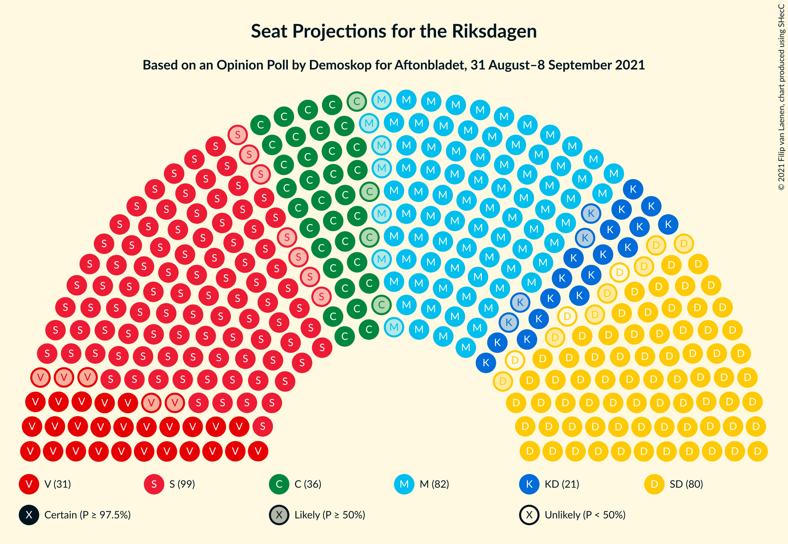
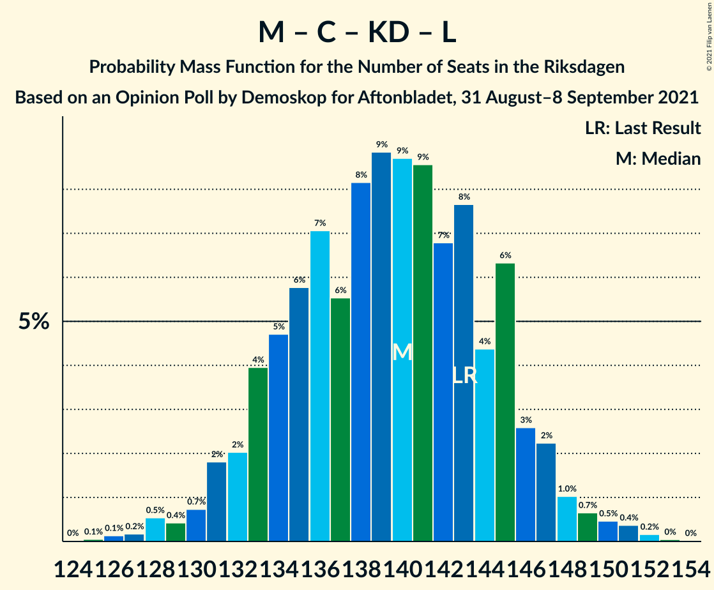
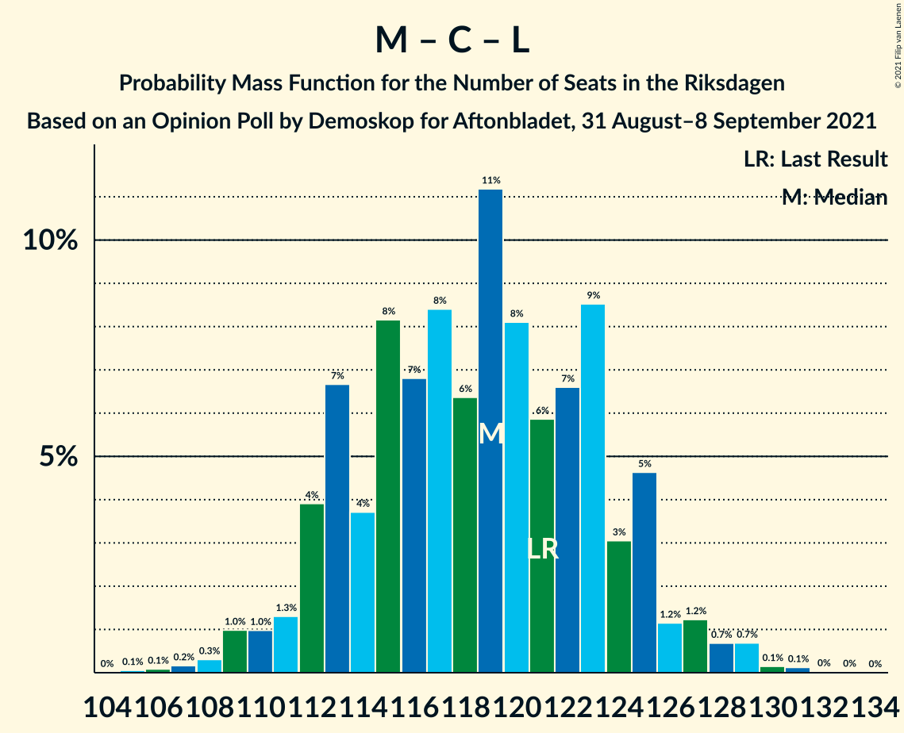

# Opinion Poll by Demoskop for Aftonbladet, 31 August–8 September 2021

<a href="#voting-intentions">Voting Intentions</a> | <a href="#seats">Seats</a> | <a href="#coalitions">Coalitions</a> | <a href="#technical-information">Technical Information</a>

## Voting Intentions

### Confidence Intervals

| Party | Last Result | Poll Result | 80% Confidence Interval | 90% Confidence Interval | 95% Confidence Interval | 99% Confidence Interval |
|:-----:|:-----------:|:-----------:|:-----------------------:|:-----------------------:|:-----------------------:|:-----------------------:|
| Sveriges socialdemokratiska arbetareparti | 28.3% | 26.7% | 25.5–28.0% |25.2–28.3% |24.9–28.6% |24.4–29.2% |
| Moderata samlingspartiet | 19.8% | 22.1% | 21.0–23.3% |20.7–23.6% |20.4–23.9% |19.9–24.5% |
| Sverigedemokraterna | 17.5% | 20.7% | 19.6–21.9% |19.4–22.2% |19.1–22.5% |18.6–23.0% |
| Centerpartiet | 8.6% | 9.7% | 9.0–10.6% |8.7–10.8% |8.6–11.1% |8.2–11.5% |
| Vänsterpartiet | 8.0% | 8.2% | 7.5–9.0% |7.3–9.2% |7.1–9.4% |6.8–9.8% |
| Kristdemokraterna | 6.3% | 5.6% | 5.0–6.3% |4.8–6.5% |4.7–6.6% |4.4–7.0% |
| Miljöpartiet de gröna | 4.4% | 3.5% | 3.0–4.1% |2.9–4.2% |2.8–4.4% |2.6–4.6% |
| Liberalerna | 5.5% | 2.5% | 2.1–3.0% |2.0–3.1% |1.9–3.2% |1.8–3.5% |

*Note:* The poll result column reflects the actual value used in the calculations. Published results may vary slightly, and in addition be rounded to fewer digits.

## Seats

### Confidence Intervals

| Party | Last Result | Median | 80% Confidence Interval | 90% Confidence Interval | 95% Confidence Interval | 99% Confidence Interval |
|:-----:|:-----------:|:------:|:-----------------------:|:-----------------------:|:-----------------------:|:-----------------------:|
| <a href="#sveriges-socialdemokratiska-arbetareparti">Sveriges socialdemokratiska arbetareparti</a> | 100 | 100 | 94–105 |93–107 |92–108 |89–108 |
| <a href="#moderata-samlingspartiet">Moderata samlingspartiet</a> | 70 | 81 | 77–88 |76–90 |74–92 |74–93 |
| <a href="#sverigedemokraterna">Sverigedemokraterna</a> | 62 | 77 | 70–82 |70–83 |70–84 |68–86 |
| <a href="#centerpartiet">Centerpartiet</a> | 31 | 36 | 33–40 |32–40 |30–40 |30–44 |
| <a href="#vänsterpartiet">Vänsterpartiet</a> | 28 | 31 | 28–34 |27–34 |26–35 |24–36 |
| <a href="#kristdemokraterna">Kristdemokraterna</a> | 22 | 20 | 18–24 |17–24 |17–26 |17–26 |
| <a href="#miljöpartiet-de-gröna">Miljöpartiet de gröna</a> | 16 | 0 | 0–15 |0–15 |0–15 |0–17 |
| <a href="#liberalerna">Liberalerna</a> | 20 | 0 | 0 |0 |0 |0 |

### Sveriges socialdemokratiska arbetareparti

*For a full overview of the results for this party, see the [Sveriges socialdemokratiska arbetareparti](party-sverigessocialdemokratiskaarbetareparti.html) page.*

| Number of Seats | Probability | Accumulated | Special Marks |
|:---------------:|:-----------:|:-----------:|:-------------:|
| 87 | 0.3% | 100% |  |
| 88 | 0.1% | 99.7% |  |
| 89 | 0.5% | 99.6% |  |
| 90 | 0.2% | 99.1% |  |
| 91 | 0.7% | 98.9% |  |
| 92 | 2% | 98% |  |
| 93 | 6% | 96% |  |
| 94 | 5% | 90% |  |
| 95 | 1.5% | 85% |  |
| 96 | 4% | 84% |  |
| 97 | 4% | 79% |  |
| 98 | 2% | 75% |  |
| 99 | 22% | 73% |  |
| 100 | 15% | 52% | Last Result, Median |
| 101 | 2% | 37% |  |
| 102 | 20% | 35% |  |
| 103 | 0.7% | 15% |  |
| 104 | 4% | 14% |  |
| 105 | 4% | 10% |  |
| 106 | 0.9% | 6% |  |
| 107 | 2% | 5% |  |
| 108 | 3% | 4% |  |
| 109 | 0% | 0.4% |  |
| 110 | 0.3% | 0.3% |  |
| 111 | 0% | 0.1% |  |
| 112 | 0% | 0.1% |  |
| 113 | 0% | 0% |  |

### Moderata samlingspartiet

*For a full overview of the results for this party, see the [Moderata samlingspartiet](party-moderatasamlingspartiet.html) page.*

| Number of Seats | Probability | Accumulated | Special Marks |
|:---------------:|:-----------:|:-----------:|:-------------:|
| 70 | 0% | 100% | Last Result |
| 71 | 0% | 99.9% |  |
| 72 | 0.4% | 99.9% |  |
| 73 | 0% | 99.6% |  |
| 74 | 2% | 99.5% |  |
| 75 | 0.8% | 97% |  |
| 76 | 4% | 97% |  |
| 77 | 14% | 93% |  |
| 78 | 3% | 79% |  |
| 79 | 17% | 77% |  |
| 80 | 7% | 60% |  |
| 81 | 9% | 53% | Median |
| 82 | 8% | 44% |  |
| 83 | 8% | 37% |  |
| 84 | 3% | 29% |  |
| 85 | 7% | 26% |  |
| 86 | 1.0% | 19% |  |
| 87 | 5% | 18% |  |
| 88 | 6% | 13% |  |
| 89 | 0.6% | 7% |  |
| 90 | 3% | 6% |  |
| 91 | 0.1% | 3% |  |
| 92 | 2% | 3% |  |
| 93 | 0.7% | 0.7% |  |
| 94 | 0% | 0% |  |

### Sverigedemokraterna

*For a full overview of the results for this party, see the [Sverigedemokraterna](party-sverigedemokraterna.html) page.*

| Number of Seats | Probability | Accumulated | Special Marks |
|:---------------:|:-----------:|:-----------:|:-------------:|
| 62 | 0% | 100% | Last Result |
| 63 | 0% | 100% |  |
| 64 | 0% | 100% |  |
| 65 | 0% | 100% |  |
| 66 | 0.1% | 100% |  |
| 67 | 0.2% | 99.9% |  |
| 68 | 0.2% | 99.7% |  |
| 69 | 0.9% | 99.5% |  |
| 70 | 11% | 98.6% |  |
| 71 | 0.8% | 87% |  |
| 72 | 0.6% | 86% |  |
| 73 | 3% | 86% |  |
| 74 | 2% | 83% |  |
| 75 | 23% | 81% |  |
| 76 | 4% | 59% |  |
| 77 | 8% | 55% | Median |
| 78 | 3% | 47% |  |
| 79 | 19% | 44% |  |
| 80 | 8% | 25% |  |
| 81 | 1.1% | 17% |  |
| 82 | 8% | 16% |  |
| 83 | 5% | 8% |  |
| 84 | 1.2% | 3% |  |
| 85 | 0.3% | 2% |  |
| 86 | 1.0% | 1.2% |  |
| 87 | 0.1% | 0.3% |  |
| 88 | 0% | 0.1% |  |
| 89 | 0.1% | 0.1% |  |
| 90 | 0% | 0% |  |

### Centerpartiet

*For a full overview of the results for this party, see the [Centerpartiet](party-centerpartiet.html) page.*

| Number of Seats | Probability | Accumulated | Special Marks |
|:---------------:|:-----------:|:-----------:|:-------------:|
| 29 | 0.1% | 100% |  |
| 30 | 4% | 99.9% |  |
| 31 | 0.5% | 96% | Last Result |
| 32 | 3% | 95% |  |
| 33 | 10% | 92% |  |
| 34 | 6% | 82% |  |
| 35 | 23% | 76% |  |
| 36 | 4% | 53% | Median |
| 37 | 12% | 49% |  |
| 38 | 7% | 37% |  |
| 39 | 6% | 30% |  |
| 40 | 22% | 24% |  |
| 41 | 0.7% | 2% |  |
| 42 | 0.5% | 1.4% |  |
| 43 | 0.1% | 1.0% |  |
| 44 | 0.8% | 0.9% |  |
| 45 | 0.1% | 0.1% |  |
| 46 | 0% | 0% |  |

### Vänsterpartiet

*For a full overview of the results for this party, see the [Vänsterpartiet](party-vänsterpartiet.html) page.*

| Number of Seats | Probability | Accumulated | Special Marks |
|:---------------:|:-----------:|:-----------:|:-------------:|
| 24 | 1.0% | 100% |  |
| 25 | 1.4% | 99.0% |  |
| 26 | 0.3% | 98% |  |
| 27 | 4% | 97% |  |
| 28 | 14% | 93% | Last Result |
| 29 | 1.5% | 79% |  |
| 30 | 7% | 77% |  |
| 31 | 35% | 70% | Median |
| 32 | 3% | 35% |  |
| 33 | 20% | 32% |  |
| 34 | 9% | 12% |  |
| 35 | 1.1% | 3% |  |
| 36 | 1.2% | 2% |  |
| 37 | 0.4% | 0.5% |  |
| 38 | 0% | 0.1% |  |
| 39 | 0% | 0.1% |  |
| 40 | 0% | 0% |  |

### Kristdemokraterna

*For a full overview of the results for this party, see the [Kristdemokraterna](party-kristdemokraterna.html) page.*

| Number of Seats | Probability | Accumulated | Special Marks |
|:---------------:|:-----------:|:-----------:|:-------------:|
| 15 | 0% | 100% |  |
| 16 | 0.2% | 99.9% |  |
| 17 | 5% | 99.7% |  |
| 18 | 7% | 95% |  |
| 19 | 7% | 87% |  |
| 20 | 32% | 81% | Median |
| 21 | 21% | 49% |  |
| 22 | 4% | 28% | Last Result |
| 23 | 13% | 25% |  |
| 24 | 8% | 11% |  |
| 25 | 0.7% | 4% |  |
| 26 | 3% | 3% |  |
| 27 | 0% | 0.1% |  |
| 28 | 0% | 0% |  |

### Miljöpartiet de gröna

*For a full overview of the results for this party, see the [Miljöpartiet de gröna](party-miljöpartietdegröna.html) page.*

| Number of Seats | Probability | Accumulated | Special Marks |
|:---------------:|:-----------:|:-----------:|:-------------:|
| 0 | 82% | 100% | Median |
| 1 | 0% | 18% |  |
| 2 | 0% | 18% |  |
| 3 | 0% | 18% |  |
| 4 | 0% | 18% |  |
| 5 | 0% | 18% |  |
| 6 | 0% | 18% |  |
| 7 | 0% | 18% |  |
| 8 | 0% | 18% |  |
| 9 | 0% | 18% |  |
| 10 | 0% | 18% |  |
| 11 | 0% | 18% |  |
| 12 | 0% | 18% |  |
| 13 | 0% | 18% |  |
| 14 | 0.3% | 18% |  |
| 15 | 15% | 17% |  |
| 16 | 1.2% | 2% | Last Result |
| 17 | 0.9% | 1.0% |  |
| 18 | 0.1% | 0.1% |  |
| 19 | 0% | 0% |  |

### Liberalerna

*For a full overview of the results for this party, see the [Liberalerna](party-liberalerna.html) page.*

| Number of Seats | Probability | Accumulated | Special Marks |
|:---------------:|:-----------:|:-----------:|:-------------:|
| 0 | 100% | 100% | Median |
| 1 | 0% | 0% |  |
| 2 | 0% | 0% |  |
| 3 | 0% | 0% |  |
| 4 | 0% | 0% |  |
| 5 | 0% | 0% |  |
| 6 | 0% | 0% |  |
| 7 | 0% | 0% |  |
| 8 | 0% | 0% |  |
| 9 | 0% | 0% |  |
| 10 | 0% | 0% |  |
| 11 | 0% | 0% |  |
| 12 | 0% | 0% |  |
| 13 | 0% | 0% |  |
| 14 | 0% | 0% |  |
| 15 | 0% | 0% |  |
| 16 | 0% | 0% |  |
| 17 | 0% | 0% |  |
| 18 | 0% | 0% |  |
| 19 | 0% | 0% |  |
| 20 | 0% | 0% | Last Result |

## Coalitions

### Confidence Intervals

| Coalition | Last Result | Median | Majority? | 80% Confidence Interval | 90% Confidence Interval | 95% Confidence Interval | 99% Confidence Interval |
|:---------:|:-----------:|:------:|:---------:|:-----------------------:|:-----------------------:|:-----------------------:|:-----------------------:|
| Sveriges socialdemokratiska arbetareparti – Moderata samlingspartiet – Centerpartiet | 201 | 218 | 100% | 212–222 | 209–224 | 207–228 | 202–229 |
| Sveriges socialdemokratiska arbetareparti – Moderata samlingspartiet | 170 | 181 | 92% | 175–188 | 173–190 | 172–191 | 167–194 |
| Moderata samlingspartiet – Sverigedemokraterna – Kristdemokraterna | 154 | 180 | 71% | 168–187 | 168–189 | 168–190 | 168–191 |
| Sveriges socialdemokratiska arbetareparti – Centerpartiet – Vänsterpartiet – Miljöpartiet de gröna – Liberalerna | 195 | 169 | 29% | 162–181 | 160–181 | 159–181 | 158–181 |
| Moderata samlingspartiet – Sverigedemokraterna | 132 | 159 | 0% | 147–167 | 147–169 | 147–170 | 147–170 |
| Sveriges socialdemokratiska arbetareparti – Centerpartiet – Miljöpartiet de gröna – Liberalerna | 167 | 139 | 0% | 131–150 | 131–150 | 131–150 | 127–153 |
| Moderata samlingspartiet – Centerpartiet – Kristdemokraterna – Liberalerna | 143 | 139 | 0% | 133–145 | 133–146 | 131–147 | 128–152 |
| Moderata samlingspartiet – Centerpartiet – Kristdemokraterna | 123 | 139 | 0% | 133–145 | 133–146 | 131–147 | 128–152 |
| Sveriges socialdemokratiska arbetareparti – Vänsterpartiet – Miljöpartiet de gröna | 144 | 133 | 0% | 126–146 | 124–146 | 122–146 | 121–146 |
| Sveriges socialdemokratiska arbetareparti – Vänsterpartiet | 128 | 131 | 0% | 124–135 | 122–137 | 120–138 | 119–140 |
| Moderata samlingspartiet – Centerpartiet – Liberalerna | 121 | 119 | 0% | 112–124 | 112–125 | 110–126 | 109–131 |
| Moderata samlingspartiet – Centerpartiet | 101 | 119 | 0% | 112–124 | 112–125 | 110–126 | 109–131 |
| Sveriges socialdemokratiska arbetareparti – Miljöpartiet de gröna | 116 | 102 | 0% | 94–115 | 93–115 | 93–115 | 91–117 |

### Sveriges socialdemokratiska arbetareparti – Moderata samlingspartiet – Centerpartiet

| Number of Seats | Probability | Accumulated | Special Marks |
|:---------------:|:-----------:|:-----------:|:-------------:|
| 201 | 0.1% | 100% | Last Result |
| 202 | 0.8% | 99.9% |  |
| 203 | 0.1% | 99.1% |  |
| 204 | 0% | 98.9% |  |
| 205 | 0.6% | 98.9% |  |
| 206 | 0.2% | 98% |  |
| 207 | 0.8% | 98% |  |
| 208 | 1.3% | 97% |  |
| 209 | 3% | 96% |  |
| 210 | 2% | 93% |  |
| 211 | 0.3% | 91% |  |
| 212 | 11% | 91% |  |
| 213 | 1.2% | 80% |  |
| 214 | 7% | 79% |  |
| 215 | 6% | 72% |  |
| 216 | 8% | 66% |  |
| 217 | 1.3% | 58% | Median |
| 218 | 9% | 57% |  |
| 219 | 2% | 48% |  |
| 220 | 7% | 46% |  |
| 221 | 23% | 39% |  |
| 222 | 6% | 16% |  |
| 223 | 2% | 10% |  |
| 224 | 3% | 7% |  |
| 225 | 1.1% | 5% |  |
| 226 | 0.6% | 4% |  |
| 227 | 0.4% | 3% |  |
| 228 | 1.1% | 3% |  |
| 229 | 0.9% | 1.4% |  |
| 230 | 0.4% | 0.5% |  |
| 231 | 0% | 0% |  |

### Sveriges socialdemokratiska arbetareparti – Moderata samlingspartiet

| Number of Seats | Probability | Accumulated | Special Marks |
|:---------------:|:-----------:|:-----------:|:-------------:|
| 166 | 0% | 100% |  |
| 167 | 0.9% | 99.9% |  |
| 168 | 0% | 99.1% |  |
| 169 | 0.4% | 99.1% |  |
| 170 | 0.3% | 98.6% | Last Result |
| 171 | 0.5% | 98% |  |
| 172 | 2% | 98% |  |
| 173 | 2% | 96% |  |
| 174 | 2% | 94% |  |
| 175 | 3% | 92% | Majority |
| 176 | 0.4% | 88% |  |
| 177 | 12% | 88% |  |
| 178 | 5% | 76% |  |
| 179 | 4% | 71% |  |
| 180 | 9% | 67% |  |
| 181 | 23% | 58% | Median |
| 182 | 3% | 36% |  |
| 183 | 4% | 33% |  |
| 184 | 3% | 29% |  |
| 185 | 5% | 26% |  |
| 186 | 4% | 21% |  |
| 187 | 6% | 17% |  |
| 188 | 5% | 11% |  |
| 189 | 0.6% | 6% |  |
| 190 | 1.3% | 6% |  |
| 191 | 2% | 4% |  |
| 192 | 0.8% | 2% |  |
| 193 | 0.4% | 1.4% |  |
| 194 | 0.9% | 0.9% |  |
| 195 | 0% | 0% |  |

### Moderata samlingspartiet – Sverigedemokraterna – Kristdemokraterna

| Number of Seats | Probability | Accumulated | Special Marks |
|:---------------:|:-----------:|:-----------:|:-------------:|
| 154 | 0% | 100% | Last Result |
| 155 | 0% | 100% |  |
| 156 | 0% | 100% |  |
| 157 | 0% | 100% |  |
| 158 | 0% | 100% |  |
| 159 | 0% | 100% |  |
| 160 | 0% | 100% |  |
| 161 | 0% | 100% |  |
| 162 | 0% | 100% |  |
| 163 | 0% | 100% |  |
| 164 | 0.2% | 100% |  |
| 165 | 0.1% | 99.8% |  |
| 166 | 0.1% | 99.7% |  |
| 167 | 0% | 99.6% |  |
| 168 | 10% | 99.6% |  |
| 169 | 0.4% | 89% |  |
| 170 | 0.3% | 89% |  |
| 171 | 0.4% | 89% |  |
| 172 | 3% | 88% |  |
| 173 | 0.8% | 85% |  |
| 174 | 14% | 84% |  |
| 175 | 1.5% | 71% | Majority |
| 176 | 7% | 69% |  |
| 177 | 4% | 62% |  |
| 178 | 6% | 58% | Median |
| 179 | 2% | 52% |  |
| 180 | 4% | 51% |  |
| 181 | 2% | 46% |  |
| 182 | 3% | 44% |  |
| 183 | 4% | 41% |  |
| 184 | 9% | 37% |  |
| 185 | 6% | 28% |  |
| 186 | 4% | 22% |  |
| 187 | 9% | 18% |  |
| 188 | 3% | 8% |  |
| 189 | 0.9% | 6% |  |
| 190 | 4% | 5% |  |
| 191 | 0.2% | 0.6% |  |
| 192 | 0.1% | 0.4% |  |
| 193 | 0.1% | 0.3% |  |
| 194 | 0% | 0.2% |  |
| 195 | 0.1% | 0.2% |  |
| 196 | 0% | 0% |  |

### Sveriges socialdemokratiska arbetareparti – Centerpartiet – Vänsterpartiet – Miljöpartiet de gröna – Liberalerna

| Number of Seats | Probability | Accumulated | Special Marks |
|:---------------:|:-----------:|:-----------:|:-------------:|
| 154 | 0.1% | 100% |  |
| 155 | 0% | 99.8% |  |
| 156 | 0.1% | 99.8% |  |
| 157 | 0.1% | 99.7% |  |
| 158 | 0.2% | 99.6% |  |
| 159 | 4% | 99.4% |  |
| 160 | 0.9% | 95% |  |
| 161 | 3% | 94% |  |
| 162 | 9% | 92% |  |
| 163 | 4% | 82% |  |
| 164 | 6% | 78% |  |
| 165 | 9% | 72% |  |
| 166 | 4% | 63% |  |
| 167 | 3% | 59% | Median |
| 168 | 2% | 56% |  |
| 169 | 4% | 54% |  |
| 170 | 2% | 49% |  |
| 171 | 6% | 48% |  |
| 172 | 4% | 42% |  |
| 173 | 7% | 38% |  |
| 174 | 1.5% | 31% |  |
| 175 | 14% | 29% | Majority |
| 176 | 0.8% | 16% |  |
| 177 | 3% | 15% |  |
| 178 | 0.4% | 12% |  |
| 179 | 0.3% | 11% |  |
| 180 | 0.4% | 11% |  |
| 181 | 10% | 11% |  |
| 182 | 0% | 0.4% |  |
| 183 | 0.1% | 0.4% |  |
| 184 | 0.1% | 0.3% |  |
| 185 | 0.2% | 0.2% |  |
| 186 | 0% | 0% |  |
| 187 | 0% | 0% |  |
| 188 | 0% | 0% |  |
| 189 | 0% | 0% |  |
| 190 | 0% | 0% |  |
| 191 | 0% | 0% |  |
| 192 | 0% | 0% |  |
| 193 | 0% | 0% |  |
| 194 | 0% | 0% |  |
| 195 | 0% | 0% | Last Result |

### Moderata samlingspartiet – Sverigedemokraterna

| Number of Seats | Probability | Accumulated | Special Marks |
|:---------------:|:-----------:|:-----------:|:-------------:|
| 132 | 0% | 100% | Last Result |
| 133 | 0% | 100% |  |
| 134 | 0% | 100% |  |
| 135 | 0% | 100% |  |
| 136 | 0% | 100% |  |
| 137 | 0% | 100% |  |
| 138 | 0% | 100% |  |
| 139 | 0% | 100% |  |
| 140 | 0% | 100% |  |
| 141 | 0% | 100% |  |
| 142 | 0% | 100% |  |
| 143 | 0% | 100% |  |
| 144 | 0.2% | 100% |  |
| 145 | 0% | 99.7% |  |
| 146 | 0.2% | 99.7% |  |
| 147 | 10% | 99.5% |  |
| 148 | 0.5% | 89% |  |
| 149 | 0.3% | 89% |  |
| 150 | 0.2% | 89% |  |
| 151 | 0.6% | 88% |  |
| 152 | 3% | 88% |  |
| 153 | 1.4% | 85% |  |
| 154 | 14% | 83% |  |
| 155 | 4% | 69% |  |
| 156 | 8% | 65% |  |
| 157 | 4% | 57% |  |
| 158 | 3% | 53% | Median |
| 159 | 2% | 50% |  |
| 160 | 2% | 48% |  |
| 161 | 7% | 46% |  |
| 162 | 9% | 39% |  |
| 163 | 7% | 30% |  |
| 164 | 5% | 23% |  |
| 165 | 3% | 18% |  |
| 166 | 0.9% | 15% |  |
| 167 | 5% | 14% |  |
| 168 | 2% | 9% |  |
| 169 | 3% | 7% |  |
| 170 | 4% | 4% |  |
| 171 | 0% | 0.3% |  |
| 172 | 0.1% | 0.3% |  |
| 173 | 0.1% | 0.2% |  |
| 174 | 0.1% | 0.1% |  |
| 175 | 0% | 0% | Majority |

### Sveriges socialdemokratiska arbetareparti – Centerpartiet – Miljöpartiet de gröna – Liberalerna

| Number of Seats | Probability | Accumulated | Special Marks |
|:---------------:|:-----------:|:-----------:|:-------------:|
| 123 | 0.1% | 100% |  |
| 124 | 0.1% | 99.8% |  |
| 125 | 0.1% | 99.8% |  |
| 126 | 0% | 99.7% |  |
| 127 | 0.2% | 99.6% |  |
| 128 | 0.5% | 99.4% |  |
| 129 | 0.5% | 98.9% |  |
| 130 | 0.6% | 98% |  |
| 131 | 15% | 98% |  |
| 132 | 5% | 83% |  |
| 133 | 4% | 78% |  |
| 134 | 7% | 73% |  |
| 135 | 4% | 67% |  |
| 136 | 4% | 63% | Median |
| 137 | 2% | 59% |  |
| 138 | 5% | 57% |  |
| 139 | 7% | 52% |  |
| 140 | 3% | 45% |  |
| 141 | 6% | 42% |  |
| 142 | 17% | 36% |  |
| 143 | 2% | 19% |  |
| 144 | 3% | 17% |  |
| 145 | 0.5% | 14% |  |
| 146 | 0.3% | 13% |  |
| 147 | 0.4% | 13% |  |
| 148 | 0.3% | 13% |  |
| 149 | 1.0% | 12% |  |
| 150 | 10% | 11% |  |
| 151 | 0.2% | 1.0% |  |
| 152 | 0.3% | 0.8% |  |
| 153 | 0.1% | 0.5% |  |
| 154 | 0.3% | 0.4% |  |
| 155 | 0% | 0.1% |  |
| 156 | 0.1% | 0.1% |  |
| 157 | 0% | 0% |  |
| 158 | 0% | 0% |  |
| 159 | 0% | 0% |  |
| 160 | 0% | 0% |  |
| 161 | 0% | 0% |  |
| 162 | 0% | 0% |  |
| 163 | 0% | 0% |  |
| 164 | 0% | 0% |  |
| 165 | 0% | 0% |  |
| 166 | 0% | 0% |  |
| 167 | 0% | 0% | Last Result |

### Moderata samlingspartiet – Centerpartiet – Kristdemokraterna – Liberalerna

| Number of Seats | Probability | Accumulated | Special Marks |
|:---------------:|:-----------:|:-----------:|:-------------:|
| 123 | 0% | 100% |  |
| 124 | 0% | 99.9% |  |
| 125 | 0.1% | 99.9% |  |
| 126 | 0% | 99.9% |  |
| 127 | 0.1% | 99.9% |  |
| 128 | 0.7% | 99.7% |  |
| 129 | 1.0% | 99.0% |  |
| 130 | 0.5% | 98% |  |
| 131 | 0.4% | 98% |  |
| 132 | 2% | 97% |  |
| 133 | 12% | 95% |  |
| 134 | 6% | 83% |  |
| 135 | 4% | 77% |  |
| 136 | 7% | 72% |  |
| 137 | 3% | 65% | Median |
| 138 | 5% | 62% |  |
| 139 | 14% | 57% |  |
| 140 | 8% | 44% |  |
| 141 | 9% | 35% |  |
| 142 | 1.5% | 27% |  |
| 143 | 8% | 25% | Last Result |
| 144 | 6% | 17% |  |
| 145 | 3% | 12% |  |
| 146 | 5% | 8% |  |
| 147 | 1.4% | 4% |  |
| 148 | 0.8% | 2% |  |
| 149 | 0.2% | 2% |  |
| 150 | 0.4% | 1.5% |  |
| 151 | 0% | 1.1% |  |
| 152 | 1.0% | 1.1% |  |
| 153 | 0% | 0.1% |  |
| 154 | 0% | 0% |  |

### Moderata samlingspartiet – Centerpartiet – Kristdemokraterna

| Number of Seats | Probability | Accumulated | Special Marks |
|:---------------:|:-----------:|:-----------:|:-------------:|
| 123 | 0% | 100% | Last Result |
| 124 | 0% | 99.9% |  |
| 125 | 0.1% | 99.9% |  |
| 126 | 0% | 99.9% |  |
| 127 | 0.1% | 99.9% |  |
| 128 | 0.7% | 99.7% |  |
| 129 | 1.1% | 99.0% |  |
| 130 | 0.5% | 98% |  |
| 131 | 0.4% | 98% |  |
| 132 | 2% | 97% |  |
| 133 | 12% | 95% |  |
| 134 | 6% | 83% |  |
| 135 | 4% | 77% |  |
| 136 | 7% | 72% |  |
| 137 | 3% | 65% | Median |
| 138 | 5% | 62% |  |
| 139 | 14% | 57% |  |
| 140 | 8% | 44% |  |
| 141 | 9% | 35% |  |
| 142 | 1.5% | 27% |  |
| 143 | 8% | 25% |  |
| 144 | 6% | 17% |  |
| 145 | 3% | 12% |  |
| 146 | 5% | 8% |  |
| 147 | 1.4% | 4% |  |
| 148 | 0.8% | 2% |  |
| 149 | 0.2% | 2% |  |
| 150 | 0.4% | 1.5% |  |
| 151 | 0% | 1.1% |  |
| 152 | 1.0% | 1.1% |  |
| 153 | 0% | 0.1% |  |
| 154 | 0% | 0% |  |

### Sveriges socialdemokratiska arbetareparti – Vänsterpartiet – Miljöpartiet de gröna

| Number of Seats | Probability | Accumulated | Special Marks |
|:---------------:|:-----------:|:-----------:|:-------------:|
| 119 | 0.1% | 100% |  |
| 120 | 0.1% | 99.9% |  |
| 121 | 0.9% | 99.8% |  |
| 122 | 3% | 98.9% |  |
| 123 | 0.2% | 95% |  |
| 124 | 4% | 95% |  |
| 125 | 1.1% | 91% |  |
| 126 | 0.3% | 90% |  |
| 127 | 12% | 90% |  |
| 128 | 2% | 78% |  |
| 129 | 2% | 76% |  |
| 130 | 9% | 74% |  |
| 131 | 3% | 65% | Median |
| 132 | 6% | 61% |  |
| 133 | 12% | 55% |  |
| 134 | 4% | 43% |  |
| 135 | 14% | 39% |  |
| 136 | 3% | 25% |  |
| 137 | 3% | 22% |  |
| 138 | 4% | 19% |  |
| 139 | 1.2% | 16% |  |
| 140 | 0.9% | 14% |  |
| 141 | 1.4% | 13% |  |
| 142 | 0.4% | 12% |  |
| 143 | 0.7% | 12% |  |
| 144 | 0.1% | 11% | Last Result |
| 145 | 0.2% | 11% |  |
| 146 | 10% | 11% |  |
| 147 | 0% | 0.5% |  |
| 148 | 0.1% | 0.5% |  |
| 149 | 0.1% | 0.3% |  |
| 150 | 0.3% | 0.3% |  |
| 151 | 0% | 0% |  |

### Sveriges socialdemokratiska arbetareparti – Vänsterpartiet

| Number of Seats | Probability | Accumulated | Special Marks |
|:---------------:|:-----------:|:-----------:|:-------------:|
| 116 | 0% | 100% |  |
| 117 | 0.1% | 99.9% |  |
| 118 | 0% | 99.9% |  |
| 119 | 2% | 99.8% |  |
| 120 | 0.7% | 98% |  |
| 121 | 1.0% | 97% |  |
| 122 | 3% | 96% |  |
| 123 | 0.3% | 93% |  |
| 124 | 5% | 92% |  |
| 125 | 2% | 87% |  |
| 126 | 2% | 86% |  |
| 127 | 12% | 84% |  |
| 128 | 3% | 72% | Last Result |
| 129 | 2% | 69% |  |
| 130 | 9% | 67% |  |
| 131 | 14% | 58% | Median |
| 132 | 6% | 44% |  |
| 133 | 13% | 38% |  |
| 134 | 2% | 26% |  |
| 135 | 14% | 23% |  |
| 136 | 3% | 9% |  |
| 137 | 2% | 7% |  |
| 138 | 4% | 4% |  |
| 139 | 0.2% | 0.9% |  |
| 140 | 0.3% | 0.7% |  |
| 141 | 0.2% | 0.4% |  |
| 142 | 0.1% | 0.2% |  |
| 143 | 0.1% | 0.1% |  |
| 144 | 0% | 0% |  |

### Moderata samlingspartiet – Centerpartiet – Liberalerna

| Number of Seats | Probability | Accumulated | Special Marks |
|:---------------:|:-----------:|:-----------:|:-------------:|
| 104 | 0% | 100% |  |
| 105 | 0% | 99.9% |  |
| 106 | 0.1% | 99.9% |  |
| 107 | 0.1% | 99.9% |  |
| 108 | 0% | 99.7% |  |
| 109 | 2% | 99.7% |  |
| 110 | 2% | 98% |  |
| 111 | 0.9% | 96% |  |
| 112 | 11% | 95% |  |
| 113 | 9% | 84% |  |
| 114 | 3% | 75% |  |
| 115 | 4% | 71% |  |
| 116 | 5% | 67% |  |
| 117 | 7% | 62% | Median |
| 118 | 2% | 56% |  |
| 119 | 19% | 54% |  |
| 120 | 4% | 35% |  |
| 121 | 8% | 31% | Last Result |
| 122 | 0.7% | 23% |  |
| 123 | 10% | 22% |  |
| 124 | 5% | 12% |  |
| 125 | 5% | 8% |  |
| 126 | 0.6% | 3% |  |
| 127 | 0.8% | 2% |  |
| 128 | 0.1% | 1.4% |  |
| 129 | 0.4% | 1.4% |  |
| 130 | 0% | 0.9% |  |
| 131 | 0.9% | 0.9% |  |
| 132 | 0% | 0% |  |

### Moderata samlingspartiet – Centerpartiet

| Number of Seats | Probability | Accumulated | Special Marks |
|:---------------:|:-----------:|:-----------:|:-------------:|
| 101 | 0% | 100% | Last Result |
| 102 | 0% | 100% |  |
| 103 | 0% | 100% |  |
| 104 | 0% | 100% |  |
| 105 | 0% | 99.9% |  |
| 106 | 0.1% | 99.9% |  |
| 107 | 0.1% | 99.9% |  |
| 108 | 0% | 99.7% |  |
| 109 | 2% | 99.7% |  |
| 110 | 2% | 98% |  |
| 111 | 0.9% | 96% |  |
| 112 | 11% | 95% |  |
| 113 | 9% | 84% |  |
| 114 | 3% | 75% |  |
| 115 | 4% | 71% |  |
| 116 | 5% | 67% |  |
| 117 | 7% | 62% | Median |
| 118 | 2% | 56% |  |
| 119 | 19% | 54% |  |
| 120 | 4% | 35% |  |
| 121 | 8% | 31% |  |
| 122 | 0.7% | 23% |  |
| 123 | 10% | 22% |  |
| 124 | 5% | 12% |  |
| 125 | 5% | 8% |  |
| 126 | 0.6% | 3% |  |
| 127 | 0.8% | 2% |  |
| 128 | 0.1% | 1.4% |  |
| 129 | 0.4% | 1.3% |  |
| 130 | 0% | 0.9% |  |
| 131 | 0.9% | 0.9% |  |
| 132 | 0% | 0% |  |

### Sveriges socialdemokratiska arbetareparti – Miljöpartiet de gröna

| Number of Seats | Probability | Accumulated | Special Marks |
|:---------------:|:-----------:|:-----------:|:-------------:|
| 88 | 0.1% | 100% |  |
| 89 | 0.1% | 99.9% |  |
| 90 | 0.1% | 99.9% |  |
| 91 | 0.5% | 99.8% |  |
| 92 | 0.1% | 99.3% |  |
| 93 | 5% | 99.1% |  |
| 94 | 5% | 94% |  |
| 95 | 0.7% | 89% |  |
| 96 | 4% | 88% |  |
| 97 | 3% | 84% |  |
| 98 | 0.8% | 81% |  |
| 99 | 22% | 80% |  |
| 100 | 4% | 59% | Median |
| 101 | 2% | 54% |  |
| 102 | 20% | 52% |  |
| 103 | 0.7% | 32% |  |
| 104 | 4% | 31% |  |
| 105 | 4% | 27% |  |
| 106 | 1.3% | 23% |  |
| 107 | 3% | 22% |  |
| 108 | 4% | 18% |  |
| 109 | 0.2% | 14% |  |
| 110 | 1.0% | 14% |  |
| 111 | 0.2% | 13% |  |
| 112 | 0.5% | 13% |  |
| 113 | 1.5% | 12% |  |
| 114 | 0.1% | 11% |  |
| 115 | 10% | 11% |  |
| 116 | 0.1% | 0.7% | Last Result |
| 117 | 0.1% | 0.6% |  |
| 118 | 0% | 0.5% |  |
| 119 | 0.3% | 0.4% |  |
| 120 | 0.1% | 0.1% |  |
| 121 | 0% | 0% |  |

## Technical Information

### Opinion Poll

+ **Polling firm:** Demoskop
+ **Commissioner(s):** Aftonbladet
+ **Fieldwork period:** 31 August–8 September 2021

### Calculations

+ **Sample size:** 2199
+ **Simulations done:** 65,536
+ **Error estimate:** 2.26%

