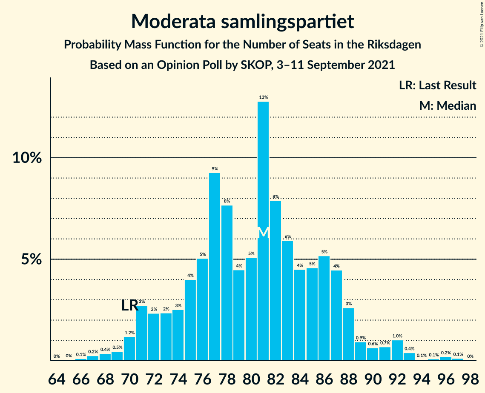
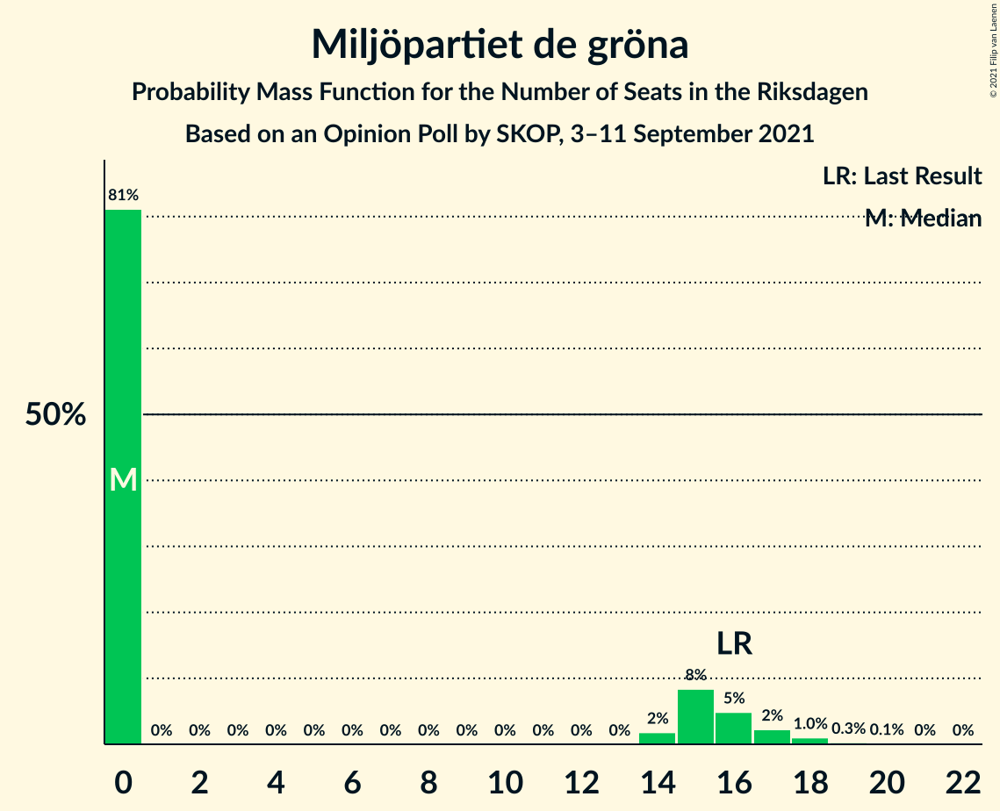
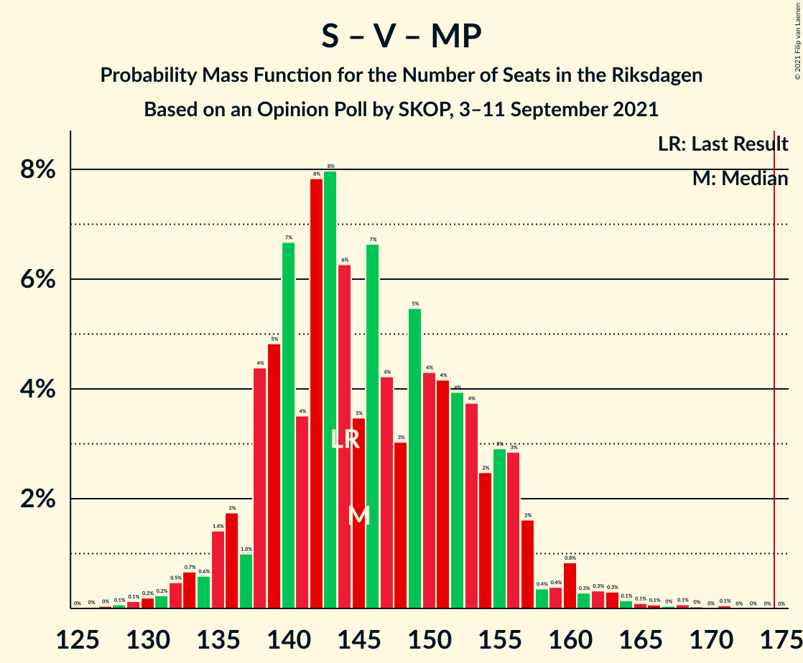

# Opinion Poll by SKOP, 3–11 September 2021

<a href="#voting-intentions">Voting Intentions</a> | <a href="#seats">Seats</a> | <a href="#coalitions">Coalitions</a> | <a href="#technical-information">Technical Information</a>

## Voting Intentions

### Confidence Intervals

| Party | Last Result | Poll Result | 80% Confidence Interval | 90% Confidence Interval | 95% Confidence Interval | 99% Confidence Interval |
|:-----:|:-----------:|:-----------:|:-----------------------:|:-----------------------:|:-----------------------:|:-----------------------:|
| Sveriges socialdemokratiska arbetareparti | 28.3% | 25.8% | 24.1–27.6% |23.7–28.2% |23.2–28.6% |22.5–29.5% |
| Moderata samlingspartiet | 19.8% | 21.6% | 20.0–23.3% |19.5–23.7% |19.1–24.2% |18.4–25.0% |
| Sverigedemokraterna | 17.5% | 18.5% | 17.1–20.2% |16.6–20.6% |16.3–21.0% |15.6–21.8% |
| Vänsterpartiet | 8.0% | 12.5% | 11.3–13.9% |10.9–14.3% |10.6–14.7% |10.1–15.4% |
| Centerpartiet | 8.6% | 9.6% | 8.5–10.9% |8.2–11.2% |8.0–11.6% |7.5–12.2% |
| Kristdemokraterna | 6.3% | 5.0% | 4.2–5.9% |4.0–6.2% |3.8–6.5% |3.4–7.0% |
| Miljöpartiet de gröna | 4.4% | 3.4% | 2.8–4.2% |2.6–4.5% |2.5–4.7% |2.2–5.1% |
| Liberalerna | 5.5% | 2.4% | 1.9–3.2% |1.8–3.4% |1.6–3.6% |1.4–3.9% |

*Note:* The poll result column reflects the actual value used in the calculations. Published results may vary slightly, and in addition be rounded to fewer digits.

## Seats

### Confidence Intervals

| Party | Last Result | Median | 80% Confidence Interval | 90% Confidence Interval | 95% Confidence Interval | 99% Confidence Interval |
|:-----:|:-----------:|:------:|:-----------------------:|:-----------------------:|:-----------------------:|:-----------------------:|
| <a href="#sveriges-socialdemokratiska-arbetareparti">Sveriges socialdemokratiska arbetareparti</a> | 100 | 95 | 88–103 |87–103 |87–105 |84–109 |
| <a href="#moderata-samlingspartiet">Moderata samlingspartiet</a> | 70 | 81 | 73–87 |73–88 |72–91 |68–92 |
| <a href="#sverigedemokraterna">Sverigedemokraterna</a> | 62 | 69 | 64–75 |62–78 |61–78 |58–81 |
| <a href="#vänsterpartiet">Vänsterpartiet</a> | 28 | 48 | 41–53 |41–54 |41–56 |38–57 |
| <a href="#centerpartiet">Centerpartiet</a> | 31 | 36 | 34–39 |32–40 |30–43 |28–46 |
| <a href="#kristdemokraterna">Kristdemokraterna</a> | 22 | 19 | 16–22 |0–23 |0–25 |0–26 |
| <a href="#miljöpartiet-de-gröna">Miljöpartiet de gröna</a> | 16 | 0 | 0 |0–16 |0–17 |0–18 |
| <a href="#liberalerna">Liberalerna</a> | 20 | 0 | 0 |0 |0 |0 |

### Sveriges socialdemokratiska arbetareparti

*For a full overview of the results for this party, see the [Sveriges socialdemokratiska arbetareparti](party-sverigessocialdemokratiskaarbetareparti.html) page.*

| Number of Seats | Probability | Accumulated | Special Marks |
|:---------------:|:-----------:|:-----------:|:-------------:|
| 80 | 0% | 100% |  |
| 81 | 0.1% | 99.9% |  |
| 82 | 0.1% | 99.8% |  |
| 83 | 0.1% | 99.7% |  |
| 84 | 0.2% | 99.6% |  |
| 85 | 1.1% | 99.4% |  |
| 86 | 0.3% | 98% |  |
| 87 | 6% | 98% |  |
| 88 | 3% | 92% |  |
| 89 | 2% | 89% |  |
| 90 | 2% | 87% |  |
| 91 | 4% | 86% |  |
| 92 | 4% | 81% |  |
| 93 | 10% | 77% |  |
| 94 | 15% | 67% |  |
| 95 | 7% | 52% | Median |
| 96 | 3% | 45% |  |
| 97 | 7% | 42% |  |
| 98 | 4% | 35% |  |
| 99 | 2% | 30% |  |
| 100 | 15% | 29% | Last Result |
| 101 | 1.5% | 14% |  |
| 102 | 1.3% | 12% |  |
| 103 | 7% | 11% |  |
| 104 | 1.0% | 4% |  |
| 105 | 0.3% | 3% |  |
| 106 | 0.4% | 2% |  |
| 107 | 1.0% | 2% |  |
| 108 | 0.1% | 1.1% |  |
| 109 | 0.5% | 1.0% |  |
| 110 | 0.2% | 0.5% |  |
| 111 | 0% | 0.3% |  |
| 112 | 0.2% | 0.3% |  |
| 113 | 0% | 0.1% |  |
| 114 | 0% | 0.1% |  |
| 115 | 0% | 0.1% |  |
| 116 | 0% | 0% |  |

### Moderata samlingspartiet

*For a full overview of the results for this party, see the [Moderata samlingspartiet](party-moderatasamlingspartiet.html) page.*

| Number of Seats | Probability | Accumulated | Special Marks |
|:---------------:|:-----------:|:-----------:|:-------------:|
| 64 | 0% | 100% |  |
| 65 | 0% | 99.9% |  |
| 66 | 0.1% | 99.9% |  |
| 67 | 0.2% | 99.8% |  |
| 68 | 0.2% | 99.6% |  |
| 69 | 0.7% | 99.4% |  |
| 70 | 0.5% | 98.8% | Last Result |
| 71 | 0.2% | 98% |  |
| 72 | 2% | 98% |  |
| 73 | 6% | 96% |  |
| 74 | 1.4% | 90% |  |
| 75 | 1.2% | 88% |  |
| 76 | 3% | 87% |  |
| 77 | 17% | 84% |  |
| 78 | 3% | 67% |  |
| 79 | 3% | 63% |  |
| 80 | 6% | 60% |  |
| 81 | 15% | 54% | Median |
| 82 | 1.0% | 39% |  |
| 83 | 2% | 38% |  |
| 84 | 13% | 36% |  |
| 85 | 3% | 23% |  |
| 86 | 0.3% | 20% |  |
| 87 | 10% | 20% |  |
| 88 | 6% | 9% |  |
| 89 | 0.6% | 4% |  |
| 90 | 0.1% | 3% |  |
| 91 | 1.5% | 3% |  |
| 92 | 1.0% | 1.4% |  |
| 93 | 0.1% | 0.4% |  |
| 94 | 0% | 0.3% |  |
| 95 | 0.1% | 0.3% |  |
| 96 | 0.1% | 0.2% |  |
| 97 | 0% | 0.1% |  |
| 98 | 0% | 0% |  |

### Sverigedemokraterna

*For a full overview of the results for this party, see the [Sverigedemokraterna](party-sverigedemokraterna.html) page.*

| Number of Seats | Probability | Accumulated | Special Marks |
|:---------------:|:-----------:|:-----------:|:-------------:|
| 55 | 0% | 100% |  |
| 56 | 0.1% | 99.9% |  |
| 57 | 0.2% | 99.9% |  |
| 58 | 0.2% | 99.7% |  |
| 59 | 1.3% | 99.5% |  |
| 60 | 0.3% | 98% |  |
| 61 | 0.7% | 98% |  |
| 62 | 3% | 97% | Last Result |
| 63 | 2% | 94% |  |
| 64 | 13% | 92% |  |
| 65 | 2% | 79% |  |
| 66 | 3% | 77% |  |
| 67 | 7% | 74% |  |
| 68 | 7% | 67% |  |
| 69 | 22% | 60% | Median |
| 70 | 3% | 39% |  |
| 71 | 3% | 35% |  |
| 72 | 2% | 32% |  |
| 73 | 13% | 30% |  |
| 74 | 6% | 18% |  |
| 75 | 3% | 12% |  |
| 76 | 2% | 9% |  |
| 77 | 0.4% | 7% |  |
| 78 | 4% | 6% |  |
| 79 | 1.1% | 2% |  |
| 80 | 0.3% | 1.1% |  |
| 81 | 0.5% | 0.8% |  |
| 82 | 0.1% | 0.3% |  |
| 83 | 0.1% | 0.2% |  |
| 84 | 0.1% | 0.1% |  |
| 85 | 0% | 0.1% |  |
| 86 | 0% | 0% |  |

### Vänsterpartiet

*For a full overview of the results for this party, see the [Vänsterpartiet](party-vänsterpartiet.html) page.*

| Number of Seats | Probability | Accumulated | Special Marks |
|:---------------:|:-----------:|:-----------:|:-------------:|
| 28 | 0% | 100% | Last Result |
| 29 | 0% | 100% |  |
| 30 | 0% | 100% |  |
| 31 | 0% | 100% |  |
| 32 | 0% | 100% |  |
| 33 | 0% | 100% |  |
| 34 | 0% | 100% |  |
| 35 | 0% | 100% |  |
| 36 | 0% | 99.9% |  |
| 37 | 0.4% | 99.9% |  |
| 38 | 0.9% | 99.5% |  |
| 39 | 0.4% | 98.6% |  |
| 40 | 0.5% | 98% |  |
| 41 | 10% | 98% |  |
| 42 | 2% | 88% |  |
| 43 | 2% | 86% |  |
| 44 | 4% | 84% |  |
| 45 | 23% | 80% |  |
| 46 | 2% | 57% |  |
| 47 | 2% | 55% |  |
| 48 | 11% | 53% | Median |
| 49 | 18% | 42% |  |
| 50 | 4% | 24% |  |
| 51 | 1.1% | 20% |  |
| 52 | 4% | 19% |  |
| 53 | 7% | 15% |  |
| 54 | 5% | 8% |  |
| 55 | 0.3% | 4% |  |
| 56 | 3% | 3% |  |
| 57 | 0.1% | 0.6% |  |
| 58 | 0.2% | 0.4% |  |
| 59 | 0% | 0.2% |  |
| 60 | 0.1% | 0.1% |  |
| 61 | 0% | 0% |  |

### Centerpartiet

*For a full overview of the results for this party, see the [Centerpartiet](party-centerpartiet.html) page.*

| Number of Seats | Probability | Accumulated | Special Marks |
|:---------------:|:-----------:|:-----------:|:-------------:|
| 25 | 0.1% | 100% |  |
| 26 | 0.1% | 99.9% |  |
| 27 | 0.2% | 99.8% |  |
| 28 | 1.0% | 99.5% |  |
| 29 | 0.3% | 98% |  |
| 30 | 1.0% | 98% |  |
| 31 | 1.2% | 97% | Last Result |
| 32 | 1.3% | 96% |  |
| 33 | 2% | 95% |  |
| 34 | 6% | 93% |  |
| 35 | 20% | 87% |  |
| 36 | 30% | 66% | Median |
| 37 | 10% | 36% |  |
| 38 | 10% | 26% |  |
| 39 | 8% | 16% |  |
| 40 | 5% | 8% |  |
| 41 | 0.2% | 3% |  |
| 42 | 0.5% | 3% |  |
| 43 | 1.1% | 3% |  |
| 44 | 0.5% | 1.5% |  |
| 45 | 0.3% | 1.0% |  |
| 46 | 0.4% | 0.7% |  |
| 47 | 0.1% | 0.3% |  |
| 48 | 0.1% | 0.1% |  |
| 49 | 0% | 0% |  |

### Kristdemokraterna

*For a full overview of the results for this party, see the [Kristdemokraterna](party-kristdemokraterna.html) page.*

| Number of Seats | Probability | Accumulated | Special Marks |
|:---------------:|:-----------:|:-----------:|:-------------:|
| 0 | 5% | 100% |  |
| 1 | 0% | 95% |  |
| 2 | 0% | 95% |  |
| 3 | 0% | 95% |  |
| 4 | 0% | 95% |  |
| 5 | 0% | 95% |  |
| 6 | 0% | 95% |  |
| 7 | 0% | 95% |  |
| 8 | 0% | 95% |  |
| 9 | 0% | 95% |  |
| 10 | 0% | 95% |  |
| 11 | 0% | 95% |  |
| 12 | 0% | 95% |  |
| 13 | 0% | 95% |  |
| 14 | 0% | 95% |  |
| 15 | 1.5% | 95% |  |
| 16 | 8% | 93% |  |
| 17 | 16% | 85% |  |
| 18 | 16% | 69% |  |
| 19 | 17% | 53% | Median |
| 20 | 16% | 35% |  |
| 21 | 6% | 19% |  |
| 22 | 5% | 13% | Last Result |
| 23 | 3% | 8% |  |
| 24 | 2% | 5% |  |
| 25 | 1.3% | 3% |  |
| 26 | 2% | 2% |  |
| 27 | 0.2% | 0.3% |  |
| 28 | 0.1% | 0.1% |  |
| 29 | 0% | 0% |  |

### Miljöpartiet de gröna

*For a full overview of the results for this party, see the [Miljöpartiet de gröna](party-miljöpartietdegröna.html) page.*

| Number of Seats | Probability | Accumulated | Special Marks |
|:---------------:|:-----------:|:-----------:|:-------------:|
| 0 | 90% | 100% | Median |
| 1 | 0% | 10% |  |
| 2 | 0% | 10% |  |
| 3 | 0% | 10% |  |
| 4 | 0% | 10% |  |
| 5 | 0% | 10% |  |
| 6 | 0% | 10% |  |
| 7 | 0% | 10% |  |
| 8 | 0% | 10% |  |
| 9 | 0% | 10% |  |
| 10 | 0% | 10% |  |
| 11 | 0% | 10% |  |
| 12 | 0% | 10% |  |
| 13 | 0% | 10% |  |
| 14 | 0% | 10% |  |
| 15 | 2% | 10% |  |
| 16 | 3% | 8% | Last Result |
| 17 | 4% | 5% |  |
| 18 | 0.6% | 1.0% |  |
| 19 | 0.2% | 0.4% |  |
| 20 | 0.1% | 0.2% |  |
| 21 | 0% | 0% |  |

### Liberalerna

*For a full overview of the results for this party, see the [Liberalerna](party-liberalerna.html) page.*

| Number of Seats | Probability | Accumulated | Special Marks |
|:---------------:|:-----------:|:-----------:|:-------------:|
| 0 | 99.7% | 100% | Median |
| 1 | 0% | 0.3% |  |
| 2 | 0% | 0.3% |  |
| 3 | 0% | 0.3% |  |
| 4 | 0% | 0.3% |  |
| 5 | 0% | 0.3% |  |
| 6 | 0% | 0.3% |  |
| 7 | 0% | 0.3% |  |
| 8 | 0% | 0.3% |  |
| 9 | 0% | 0.3% |  |
| 10 | 0% | 0.3% |  |
| 11 | 0% | 0.3% |  |
| 12 | 0% | 0.3% |  |
| 13 | 0% | 0.3% |  |
| 14 | 0% | 0.3% |  |
| 15 | 0.1% | 0.3% |  |
| 16 | 0.1% | 0.2% |  |
| 17 | 0% | 0% |  |
| 18 | 0% | 0% |  |
| 19 | 0% | 0% |  |
| 20 | 0% | 0% | Last Result |

## Coalitions

### Confidence Intervals

| Coalition | Last Result | Median | Majority? | 80% Confidence Interval | 90% Confidence Interval | 95% Confidence Interval | 99% Confidence Interval |
|:---------:|:-----------:|:------:|:---------:|:-----------------------:|:-----------------------:|:-----------------------:|:-----------------------:|
| Sveriges socialdemokratiska arbetareparti – Moderata samlingspartiet – Centerpartiet | 201 | 212 | 100% | 203–220 | 201–222 | 199–224 | 195–231 |
| Sveriges socialdemokratiska arbetareparti – Vänsterpartiet – Centerpartiet – Miljöpartiet de gröna – Liberalerna | 195 | 182 | 86% | 173–188 | 173–190 | 170–192 | 168–200 |
| Sveriges socialdemokratiska arbetareparti – Moderata samlingspartiet | 170 | 177 | 65% | 167–184 | 165–185 | 162–187 | 159–192 |
| Moderata samlingspartiet – Sverigedemokraterna – Kristdemokraterna | 154 | 167 | 14% | 161–176 | 159–176 | 157–179 | 149–181 |
| Moderata samlingspartiet – Sverigedemokraterna | 132 | 147 | 0% | 143–157 | 141–160 | 140–162 | 133–164 |
| Sveriges socialdemokratiska arbetareparti – Vänsterpartiet – Miljöpartiet de gröna | 144 | 146 | 0% | 137–151 | 135–153 | 135–156 | 132–162 |
| Sveriges socialdemokratiska arbetareparti – Vänsterpartiet | 128 | 143 | 0% | 135–149 | 133–150 | 132–152 | 128–159 |
| Sveriges socialdemokratiska arbetareparti – Centerpartiet – Miljöpartiet de gröna – Liberalerna | 167 | 133 | 0% | 126–142 | 124–146 | 124–148 | 121–154 |
| Moderata samlingspartiet – Centerpartiet – Kristdemokraterna – Liberalerna | 143 | 137 | 0% | 127–143 | 125–145 | 123–146 | 118–151 |
| Moderata samlingspartiet – Centerpartiet – Kristdemokraterna | 123 | 137 | 0% | 127–143 | 125–145 | 123–146 | 118–151 |
| Moderata samlingspartiet – Centerpartiet – Liberalerna | 121 | 117 | 0% | 110–125 | 107–127 | 107–130 | 102–132 |
| Moderata samlingspartiet – Centerpartiet | 101 | 117 | 0% | 110–125 | 107–127 | 107–130 | 102–132 |
| Sveriges socialdemokratiska arbetareparti – Miljöpartiet de gröna | 116 | 96 | 0% | 90–105 | 87–109 | 87–112 | 85–117 |

### Sveriges socialdemokratiska arbetareparti – Moderata samlingspartiet – Centerpartiet

| Number of Seats | Probability | Accumulated | Special Marks |
|:---------------:|:-----------:|:-----------:|:-------------:|
| 191 | 0.1% | 100% |  |
| 192 | 0% | 99.8% |  |
| 193 | 0.1% | 99.8% |  |
| 194 | 0% | 99.7% |  |
| 195 | 0.2% | 99.6% |  |
| 196 | 0.2% | 99.5% |  |
| 197 | 0.3% | 99.3% |  |
| 198 | 1.5% | 99.0% |  |
| 199 | 0.2% | 98% |  |
| 200 | 0.9% | 97% |  |
| 201 | 2% | 96% | Last Result |
| 202 | 2% | 94% |  |
| 203 | 5% | 92% |  |
| 204 | 2% | 87% |  |
| 205 | 2% | 84% |  |
| 206 | 2% | 83% |  |
| 207 | 2% | 80% |  |
| 208 | 1.3% | 78% |  |
| 209 | 2% | 77% |  |
| 210 | 7% | 75% |  |
| 211 | 2% | 68% |  |
| 212 | 18% | 65% | Median |
| 213 | 0.9% | 47% |  |
| 214 | 13% | 46% |  |
| 215 | 1.3% | 33% |  |
| 216 | 1.2% | 32% |  |
| 217 | 3% | 31% |  |
| 218 | 6% | 27% |  |
| 219 | 0.4% | 21% |  |
| 220 | 12% | 21% |  |
| 221 | 0.2% | 9% |  |
| 222 | 6% | 9% |  |
| 223 | 0.2% | 3% |  |
| 224 | 0.5% | 3% |  |
| 225 | 0.3% | 2% |  |
| 226 | 0.5% | 2% |  |
| 227 | 0% | 2% |  |
| 228 | 0.4% | 2% |  |
| 229 | 0.1% | 1.3% |  |
| 230 | 0.1% | 1.2% |  |
| 231 | 0.8% | 1.1% |  |
| 232 | 0.1% | 0.3% |  |
| 233 | 0% | 0.2% |  |
| 234 | 0% | 0.2% |  |
| 235 | 0% | 0.2% |  |
| 236 | 0% | 0.2% |  |
| 237 | 0% | 0.1% |  |
| 238 | 0% | 0.1% |  |
| 239 | 0% | 0.1% |  |
| 240 | 0.1% | 0.1% |  |
| 241 | 0% | 0% |  |

### Sveriges socialdemokratiska arbetareparti – Vänsterpartiet – Centerpartiet – Miljöpartiet de gröna – Liberalerna

| Number of Seats | Probability | Accumulated | Special Marks |
|:---------------:|:-----------:|:-----------:|:-------------:|
| 163 | 0.1% | 100% |  |
| 164 | 0% | 99.9% |  |
| 165 | 0% | 99.9% |  |
| 166 | 0.1% | 99.8% |  |
| 167 | 0.1% | 99.8% |  |
| 168 | 0.7% | 99.6% |  |
| 169 | 0.4% | 98.9% |  |
| 170 | 1.1% | 98.5% |  |
| 171 | 0.3% | 97% |  |
| 172 | 2% | 97% |  |
| 173 | 5% | 95% |  |
| 174 | 4% | 90% |  |
| 175 | 19% | 86% | Majority |
| 176 | 0.8% | 67% |  |
| 177 | 3% | 67% |  |
| 178 | 2% | 63% |  |
| 179 | 5% | 62% | Median |
| 180 | 0.6% | 57% |  |
| 181 | 1.2% | 56% |  |
| 182 | 10% | 55% |  |
| 183 | 0.5% | 45% |  |
| 184 | 22% | 45% |  |
| 185 | 3% | 23% |  |
| 186 | 2% | 19% |  |
| 187 | 4% | 18% |  |
| 188 | 6% | 14% |  |
| 189 | 1.2% | 8% |  |
| 190 | 3% | 7% |  |
| 191 | 0.6% | 4% |  |
| 192 | 1.4% | 3% |  |
| 193 | 0.5% | 2% |  |
| 194 | 0.3% | 1.4% |  |
| 195 | 0.2% | 1.1% | Last Result |
| 196 | 0.1% | 1.0% |  |
| 197 | 0.1% | 0.9% |  |
| 198 | 0.1% | 0.8% |  |
| 199 | 0.2% | 0.7% |  |
| 200 | 0.1% | 0.5% |  |
| 201 | 0.2% | 0.4% |  |
| 202 | 0% | 0.3% |  |
| 203 | 0% | 0.2% |  |
| 204 | 0.1% | 0.2% |  |
| 205 | 0% | 0.1% |  |
| 206 | 0% | 0% |  |

### Sveriges socialdemokratiska arbetareparti – Moderata samlingspartiet

| Number of Seats | Probability | Accumulated | Special Marks |
|:---------------:|:-----------:|:-----------:|:-------------:|
| 153 | 0.1% | 100% |  |
| 154 | 0% | 99.9% |  |
| 155 | 0% | 99.9% |  |
| 156 | 0% | 99.9% |  |
| 157 | 0% | 99.8% |  |
| 158 | 0.1% | 99.8% |  |
| 159 | 1.4% | 99.7% |  |
| 160 | 0.2% | 98% |  |
| 161 | 0.1% | 98% |  |
| 162 | 0.7% | 98% |  |
| 163 | 0.2% | 97% |  |
| 164 | 2% | 97% |  |
| 165 | 2% | 96% |  |
| 166 | 0.3% | 94% |  |
| 167 | 5% | 94% |  |
| 168 | 3% | 89% |  |
| 169 | 2% | 86% |  |
| 170 | 2% | 84% | Last Result |
| 171 | 3% | 82% |  |
| 172 | 3% | 79% |  |
| 173 | 2% | 76% |  |
| 174 | 9% | 74% |  |
| 175 | 3% | 65% | Majority |
| 176 | 1.2% | 61% | Median |
| 177 | 14% | 60% |  |
| 178 | 13% | 47% |  |
| 179 | 7% | 34% |  |
| 180 | 4% | 26% |  |
| 181 | 3% | 22% |  |
| 182 | 0.7% | 19% |  |
| 183 | 1.4% | 19% |  |
| 184 | 8% | 17% |  |
| 185 | 6% | 10% |  |
| 186 | 0.7% | 3% |  |
| 187 | 0.3% | 3% |  |
| 188 | 0.2% | 2% |  |
| 189 | 0.2% | 2% |  |
| 190 | 0.3% | 2% |  |
| 191 | 1.0% | 2% |  |
| 192 | 0.2% | 0.6% |  |
| 193 | 0% | 0.4% |  |
| 194 | 0% | 0.3% |  |
| 195 | 0.1% | 0.3% |  |
| 196 | 0% | 0.2% |  |
| 197 | 0% | 0.2% |  |
| 198 | 0.1% | 0.2% |  |
| 199 | 0% | 0.1% |  |
| 200 | 0% | 0% |  |

### Moderata samlingspartiet – Sverigedemokraterna – Kristdemokraterna

| Number of Seats | Probability | Accumulated | Special Marks |
|:---------------:|:-----------:|:-----------:|:-------------:|
| 144 | 0% | 100% |  |
| 145 | 0.1% | 99.9% |  |
| 146 | 0% | 99.8% |  |
| 147 | 0% | 99.8% |  |
| 148 | 0.2% | 99.7% |  |
| 149 | 0.1% | 99.6% |  |
| 150 | 0.2% | 99.5% |  |
| 151 | 0.1% | 99.3% |  |
| 152 | 0.1% | 99.2% |  |
| 153 | 0.1% | 99.1% |  |
| 154 | 0.2% | 99.0% | Last Result |
| 155 | 0.3% | 98.9% |  |
| 156 | 0.5% | 98.6% |  |
| 157 | 1.4% | 98% |  |
| 158 | 0.6% | 97% |  |
| 159 | 3% | 96% |  |
| 160 | 1.2% | 93% |  |
| 161 | 6% | 92% |  |
| 162 | 4% | 86% |  |
| 163 | 2% | 82% |  |
| 164 | 3% | 81% |  |
| 165 | 22% | 77% |  |
| 166 | 0.5% | 55% |  |
| 167 | 10% | 55% |  |
| 168 | 1.2% | 45% |  |
| 169 | 0.6% | 44% | Median |
| 170 | 5% | 43% |  |
| 171 | 2% | 38% |  |
| 172 | 3% | 37% |  |
| 173 | 0.8% | 33% |  |
| 174 | 19% | 33% |  |
| 175 | 4% | 14% | Majority |
| 176 | 5% | 10% |  |
| 177 | 2% | 5% |  |
| 178 | 0.3% | 3% |  |
| 179 | 1.1% | 3% |  |
| 180 | 0.4% | 1.5% |  |
| 181 | 0.7% | 1.1% |  |
| 182 | 0.1% | 0.4% |  |
| 183 | 0.1% | 0.2% |  |
| 184 | 0% | 0.2% |  |
| 185 | 0% | 0.1% |  |
| 186 | 0.1% | 0.1% |  |
| 187 | 0% | 0% |  |

### Moderata samlingspartiet – Sverigedemokraterna

| Number of Seats | Probability | Accumulated | Special Marks |
|:---------------:|:-----------:|:-----------:|:-------------:|
| 129 | 0.1% | 100% |  |
| 130 | 0.1% | 99.9% |  |
| 131 | 0.1% | 99.8% |  |
| 132 | 0.1% | 99.7% | Last Result |
| 133 | 0.2% | 99.6% |  |
| 134 | 0.1% | 99.4% |  |
| 135 | 0.2% | 99.3% |  |
| 136 | 0.2% | 99.2% |  |
| 137 | 0.1% | 99.0% |  |
| 138 | 0.1% | 98.9% |  |
| 139 | 0.2% | 98.8% |  |
| 140 | 1.3% | 98.6% |  |
| 141 | 3% | 97% |  |
| 142 | 1.4% | 94% |  |
| 143 | 5% | 93% |  |
| 144 | 4% | 88% |  |
| 145 | 14% | 84% |  |
| 146 | 17% | 70% |  |
| 147 | 7% | 53% |  |
| 148 | 0.7% | 46% |  |
| 149 | 0.8% | 45% |  |
| 150 | 0.6% | 45% | Median |
| 151 | 0.4% | 44% |  |
| 152 | 0.3% | 44% |  |
| 153 | 1.1% | 43% |  |
| 154 | 6% | 42% |  |
| 155 | 1.2% | 37% |  |
| 156 | 11% | 35% |  |
| 157 | 16% | 25% |  |
| 158 | 2% | 8% |  |
| 159 | 1.3% | 6% |  |
| 160 | 0.5% | 5% |  |
| 161 | 0.9% | 5% |  |
| 162 | 3% | 4% |  |
| 163 | 0.1% | 0.7% |  |
| 164 | 0.2% | 0.5% |  |
| 165 | 0% | 0.3% |  |
| 166 | 0% | 0.3% |  |
| 167 | 0.1% | 0.3% |  |
| 168 | 0.1% | 0.2% |  |
| 169 | 0% | 0.1% |  |
| 170 | 0% | 0.1% |  |
| 171 | 0% | 0.1% |  |
| 172 | 0% | 0.1% |  |
| 173 | 0% | 0.1% |  |
| 174 | 0% | 0% |  |

### Sveriges socialdemokratiska arbetareparti – Vänsterpartiet – Miljöpartiet de gröna

| Number of Seats | Probability | Accumulated | Special Marks |
|:---------------:|:-----------:|:-----------:|:-------------:|
| 126 | 0% | 100% |  |
| 127 | 0% | 99.9% |  |
| 128 | 0% | 99.9% |  |
| 129 | 0.1% | 99.8% |  |
| 130 | 0% | 99.8% |  |
| 131 | 0.1% | 99.7% |  |
| 132 | 0.5% | 99.6% |  |
| 133 | 0.7% | 99.1% |  |
| 134 | 0.7% | 98% |  |
| 135 | 5% | 98% |  |
| 136 | 2% | 93% |  |
| 137 | 1.3% | 91% |  |
| 138 | 8% | 89% |  |
| 139 | 12% | 82% |  |
| 140 | 7% | 69% |  |
| 141 | 0.9% | 62% |  |
| 142 | 2% | 61% |  |
| 143 | 2% | 60% | Median |
| 144 | 2% | 57% | Last Result |
| 145 | 2% | 55% |  |
| 146 | 5% | 53% |  |
| 147 | 6% | 48% |  |
| 148 | 10% | 42% |  |
| 149 | 15% | 32% |  |
| 150 | 5% | 16% |  |
| 151 | 4% | 11% |  |
| 152 | 0.9% | 7% |  |
| 153 | 1.3% | 6% |  |
| 154 | 2% | 5% |  |
| 155 | 0.2% | 3% |  |
| 156 | 0.5% | 3% |  |
| 157 | 0.4% | 2% |  |
| 158 | 0.4% | 2% |  |
| 159 | 0.2% | 2% |  |
| 160 | 0.6% | 1.4% |  |
| 161 | 0.2% | 0.8% |  |
| 162 | 0.3% | 0.6% |  |
| 163 | 0.1% | 0.3% |  |
| 164 | 0% | 0.2% |  |
| 165 | 0.1% | 0.2% |  |
| 166 | 0% | 0.1% |  |
| 167 | 0% | 0.1% |  |
| 168 | 0% | 0.1% |  |
| 169 | 0% | 0.1% |  |
| 170 | 0% | 0% |  |

### Sveriges socialdemokratiska arbetareparti – Vänsterpartiet

| Number of Seats | Probability | Accumulated | Special Marks |
|:---------------:|:-----------:|:-----------:|:-------------:|
| 124 | 0.1% | 100% |  |
| 125 | 0.1% | 99.9% |  |
| 126 | 0.1% | 99.8% |  |
| 127 | 0.2% | 99.7% |  |
| 128 | 0.1% | 99.5% | Last Result |
| 129 | 0.3% | 99.5% |  |
| 130 | 0.2% | 99.2% |  |
| 131 | 0.2% | 99.0% |  |
| 132 | 2% | 98.8% |  |
| 133 | 2% | 97% |  |
| 134 | 0.8% | 95% |  |
| 135 | 7% | 94% |  |
| 136 | 3% | 88% |  |
| 137 | 2% | 85% |  |
| 138 | 9% | 83% |  |
| 139 | 12% | 74% |  |
| 140 | 7% | 61% |  |
| 141 | 1.2% | 54% |  |
| 142 | 2% | 53% |  |
| 143 | 3% | 51% | Median |
| 144 | 2% | 48% |  |
| 145 | 2% | 46% |  |
| 146 | 5% | 44% |  |
| 147 | 4% | 39% |  |
| 148 | 10% | 35% |  |
| 149 | 15% | 25% |  |
| 150 | 4% | 9% |  |
| 151 | 2% | 5% |  |
| 152 | 0.9% | 3% |  |
| 153 | 0.5% | 2% |  |
| 154 | 0.5% | 1.4% |  |
| 155 | 0.2% | 0.9% |  |
| 156 | 0.1% | 0.7% |  |
| 157 | 0.1% | 0.6% |  |
| 158 | 0% | 0.6% |  |
| 159 | 0.2% | 0.5% |  |
| 160 | 0.1% | 0.4% |  |
| 161 | 0.1% | 0.2% |  |
| 162 | 0.1% | 0.1% |  |
| 163 | 0% | 0.1% |  |
| 164 | 0% | 0.1% |  |
| 165 | 0% | 0% |  |

### Sveriges socialdemokratiska arbetareparti – Centerpartiet – Miljöpartiet de gröna – Liberalerna

| Number of Seats | Probability | Accumulated | Special Marks |
|:---------------:|:-----------:|:-----------:|:-------------:|
| 116 | 0.1% | 100% |  |
| 117 | 0% | 99.9% |  |
| 118 | 0% | 99.9% |  |
| 119 | 0.1% | 99.9% |  |
| 120 | 0.1% | 99.8% |  |
| 121 | 1.0% | 99.7% |  |
| 122 | 0.7% | 98.7% |  |
| 123 | 0.4% | 98% |  |
| 124 | 3% | 98% |  |
| 125 | 5% | 95% |  |
| 126 | 2% | 90% |  |
| 127 | 2% | 88% |  |
| 128 | 3% | 86% |  |
| 129 | 6% | 83% |  |
| 130 | 14% | 77% |  |
| 131 | 7% | 63% | Median |
| 132 | 3% | 56% |  |
| 133 | 5% | 53% |  |
| 134 | 7% | 49% |  |
| 135 | 14% | 42% |  |
| 136 | 3% | 28% |  |
| 137 | 1.4% | 24% |  |
| 138 | 1.4% | 23% |  |
| 139 | 8% | 22% |  |
| 140 | 3% | 14% |  |
| 141 | 0.6% | 11% |  |
| 142 | 2% | 11% |  |
| 143 | 1.1% | 8% |  |
| 144 | 2% | 7% |  |
| 145 | 0.5% | 6% |  |
| 146 | 1.2% | 5% |  |
| 147 | 0.6% | 4% |  |
| 148 | 1.4% | 3% |  |
| 149 | 0.1% | 2% |  |
| 150 | 0.1% | 2% |  |
| 151 | 0.8% | 2% |  |
| 152 | 0.1% | 0.8% |  |
| 153 | 0.2% | 0.7% |  |
| 154 | 0.1% | 0.5% |  |
| 155 | 0.2% | 0.5% |  |
| 156 | 0.1% | 0.3% |  |
| 157 | 0.1% | 0.2% |  |
| 158 | 0% | 0.1% |  |
| 159 | 0% | 0.1% |  |
| 160 | 0% | 0.1% |  |
| 161 | 0% | 0.1% |  |
| 162 | 0% | 0% |  |
| 163 | 0% | 0% |  |
| 164 | 0% | 0% |  |
| 165 | 0% | 0% |  |
| 166 | 0% | 0% |  |
| 167 | 0% | 0% | Last Result |

### Moderata samlingspartiet – Centerpartiet – Kristdemokraterna – Liberalerna

| Number of Seats | Probability | Accumulated | Special Marks |
|:---------------:|:-----------:|:-----------:|:-------------:|
| 108 | 0% | 100% |  |
| 109 | 0% | 99.9% |  |
| 110 | 0% | 99.9% |  |
| 111 | 0% | 99.9% |  |
| 112 | 0.1% | 99.9% |  |
| 113 | 0% | 99.8% |  |
| 114 | 0% | 99.8% |  |
| 115 | 0.1% | 99.8% |  |
| 116 | 0% | 99.7% |  |
| 117 | 0.1% | 99.7% |  |
| 118 | 0.1% | 99.6% |  |
| 119 | 0.1% | 99.4% |  |
| 120 | 0.4% | 99.3% |  |
| 121 | 0.6% | 98.9% |  |
| 122 | 0.1% | 98% |  |
| 123 | 0.9% | 98% |  |
| 124 | 0.7% | 97% |  |
| 125 | 2% | 97% |  |
| 126 | 1.1% | 95% |  |
| 127 | 5% | 94% |  |
| 128 | 2% | 89% |  |
| 129 | 2% | 86% |  |
| 130 | 0.5% | 84% |  |
| 131 | 19% | 84% |  |
| 132 | 3% | 65% |  |
| 133 | 4% | 62% |  |
| 134 | 3% | 59% |  |
| 135 | 4% | 56% |  |
| 136 | 0.5% | 52% | Median |
| 137 | 23% | 52% |  |
| 138 | 1.2% | 28% |  |
| 139 | 5% | 27% |  |
| 140 | 2% | 22% |  |
| 141 | 2% | 20% |  |
| 142 | 4% | 18% |  |
| 143 | 6% | 14% | Last Result |
| 144 | 0.5% | 8% |  |
| 145 | 5% | 8% |  |
| 146 | 0.3% | 3% |  |
| 147 | 0.6% | 2% |  |
| 148 | 0.3% | 2% |  |
| 149 | 0.1% | 2% |  |
| 150 | 0.2% | 1.5% |  |
| 151 | 1.1% | 1.3% |  |
| 152 | 0% | 0.1% |  |
| 153 | 0% | 0.1% |  |
| 154 | 0% | 0.1% |  |
| 155 | 0% | 0.1% |  |
| 156 | 0% | 0% |  |

### Moderata samlingspartiet – Centerpartiet – Kristdemokraterna

| Number of Seats | Probability | Accumulated | Special Marks |
|:---------------:|:-----------:|:-----------:|:-------------:|
| 108 | 0% | 100% |  |
| 109 | 0% | 99.9% |  |
| 110 | 0% | 99.9% |  |
| 111 | 0% | 99.9% |  |
| 112 | 0.1% | 99.9% |  |
| 113 | 0% | 99.8% |  |
| 114 | 0% | 99.8% |  |
| 115 | 0.1% | 99.8% |  |
| 116 | 0% | 99.7% |  |
| 117 | 0.1% | 99.7% |  |
| 118 | 0.2% | 99.6% |  |
| 119 | 0.1% | 99.4% |  |
| 120 | 0.4% | 99.3% |  |
| 121 | 0.6% | 98.9% |  |
| 122 | 0.2% | 98% |  |
| 123 | 0.9% | 98% | Last Result |
| 124 | 0.7% | 97% |  |
| 125 | 2% | 97% |  |
| 126 | 1.1% | 95% |  |
| 127 | 5% | 93% |  |
| 128 | 2% | 88% |  |
| 129 | 2% | 86% |  |
| 130 | 0.5% | 84% |  |
| 131 | 19% | 84% |  |
| 132 | 3% | 65% |  |
| 133 | 4% | 62% |  |
| 134 | 3% | 58% |  |
| 135 | 4% | 55% |  |
| 136 | 0.5% | 52% | Median |
| 137 | 23% | 51% |  |
| 138 | 1.1% | 28% |  |
| 139 | 5% | 27% |  |
| 140 | 2% | 22% |  |
| 141 | 2% | 20% |  |
| 142 | 4% | 18% |  |
| 143 | 6% | 14% |  |
| 144 | 0.5% | 8% |  |
| 145 | 5% | 8% |  |
| 146 | 0.3% | 3% |  |
| 147 | 0.5% | 2% |  |
| 148 | 0.3% | 2% |  |
| 149 | 0.1% | 2% |  |
| 150 | 0.2% | 1.4% |  |
| 151 | 1.1% | 1.2% |  |
| 152 | 0% | 0.1% |  |
| 153 | 0% | 0.1% |  |
| 154 | 0% | 0% |  |

### Moderata samlingspartiet – Centerpartiet – Liberalerna

| Number of Seats | Probability | Accumulated | Special Marks |
|:---------------:|:-----------:|:-----------:|:-------------:|
| 98 | 0.1% | 100% |  |
| 99 | 0% | 99.9% |  |
| 100 | 0% | 99.9% |  |
| 101 | 0.1% | 99.8% |  |
| 102 | 0.3% | 99.7% |  |
| 103 | 0.3% | 99.4% |  |
| 104 | 0.2% | 99.2% |  |
| 105 | 0.2% | 98.9% |  |
| 106 | 0.4% | 98.8% |  |
| 107 | 5% | 98% |  |
| 108 | 2% | 94% |  |
| 109 | 0.8% | 92% |  |
| 110 | 2% | 91% |  |
| 111 | 4% | 89% |  |
| 112 | 15% | 85% |  |
| 113 | 1.4% | 69% |  |
| 114 | 3% | 68% |  |
| 115 | 7% | 65% |  |
| 116 | 4% | 59% |  |
| 117 | 13% | 55% | Median |
| 118 | 0.7% | 41% |  |
| 119 | 4% | 41% |  |
| 120 | 13% | 37% |  |
| 121 | 2% | 24% | Last Result |
| 122 | 2% | 22% |  |
| 123 | 0.7% | 20% |  |
| 124 | 0.4% | 19% |  |
| 125 | 9% | 19% |  |
| 126 | 4% | 10% |  |
| 127 | 3% | 6% |  |
| 128 | 0.2% | 3% |  |
| 129 | 0.1% | 3% |  |
| 130 | 1.2% | 3% |  |
| 131 | 0.4% | 1.5% |  |
| 132 | 0.8% | 1.1% |  |
| 133 | 0% | 0.3% |  |
| 134 | 0% | 0.3% |  |
| 135 | 0% | 0.2% |  |
| 136 | 0% | 0.2% |  |
| 137 | 0% | 0.2% |  |
| 138 | 0.1% | 0.1% |  |
| 139 | 0% | 0% |  |

### Moderata samlingspartiet – Centerpartiet

| Number of Seats | Probability | Accumulated | Special Marks |
|:---------------:|:-----------:|:-----------:|:-------------:|
| 98 | 0.1% | 100% |  |
| 99 | 0% | 99.9% |  |
| 100 | 0% | 99.9% |  |
| 101 | 0.1% | 99.8% | Last Result |
| 102 | 0.3% | 99.7% |  |
| 103 | 0.3% | 99.4% |  |
| 104 | 0.3% | 99.2% |  |
| 105 | 0.2% | 98.9% |  |
| 106 | 0.4% | 98.7% |  |
| 107 | 5% | 98% |  |
| 108 | 2% | 94% |  |
| 109 | 0.9% | 92% |  |
| 110 | 2% | 91% |  |
| 111 | 4% | 89% |  |
| 112 | 16% | 85% |  |
| 113 | 1.4% | 69% |  |
| 114 | 3% | 68% |  |
| 115 | 7% | 65% |  |
| 116 | 4% | 58% |  |
| 117 | 13% | 54% | Median |
| 118 | 0.7% | 41% |  |
| 119 | 4% | 40% |  |
| 120 | 13% | 36% |  |
| 121 | 2% | 24% |  |
| 122 | 2% | 22% |  |
| 123 | 0.7% | 20% |  |
| 124 | 0.4% | 19% |  |
| 125 | 9% | 19% |  |
| 126 | 4% | 10% |  |
| 127 | 3% | 6% |  |
| 128 | 0.1% | 3% |  |
| 129 | 0.1% | 3% |  |
| 130 | 1.2% | 3% |  |
| 131 | 0.4% | 1.4% |  |
| 132 | 0.8% | 1.0% |  |
| 133 | 0% | 0.2% |  |
| 134 | 0% | 0.2% |  |
| 135 | 0% | 0.2% |  |
| 136 | 0% | 0.2% |  |
| 137 | 0% | 0.1% |  |
| 138 | 0.1% | 0.1% |  |
| 139 | 0% | 0% |  |

### Sveriges socialdemokratiska arbetareparti – Miljöpartiet de gröna

| Number of Seats | Probability | Accumulated | Special Marks |
|:---------------:|:-----------:|:-----------:|:-------------:|
| 82 | 0.1% | 100% |  |
| 83 | 0.1% | 99.9% |  |
| 84 | 0% | 99.8% |  |
| 85 | 1.0% | 99.8% |  |
| 86 | 0.1% | 98.8% |  |
| 87 | 4% | 98.7% |  |
| 88 | 3% | 95% |  |
| 89 | 0.7% | 92% |  |
| 90 | 1.5% | 91% |  |
| 91 | 3% | 90% |  |
| 92 | 4% | 87% |  |
| 93 | 9% | 82% |  |
| 94 | 14% | 73% |  |
| 95 | 6% | 59% | Median |
| 96 | 3% | 53% |  |
| 97 | 7% | 50% |  |
| 98 | 4% | 43% |  |
| 99 | 2% | 39% |  |
| 100 | 14% | 37% |  |
| 101 | 1.4% | 23% |  |
| 102 | 1.5% | 22% |  |
| 103 | 9% | 20% |  |
| 104 | 1.2% | 11% |  |
| 105 | 0.5% | 10% |  |
| 106 | 3% | 10% |  |
| 107 | 1.0% | 7% |  |
| 108 | 0.3% | 6% |  |
| 109 | 1.1% | 6% |  |
| 110 | 1.4% | 4% |  |
| 111 | 0.1% | 3% |  |
| 112 | 1.1% | 3% |  |
| 113 | 0.2% | 2% |  |
| 114 | 0.2% | 2% |  |
| 115 | 0.1% | 1.3% |  |
| 116 | 0.2% | 1.2% | Last Result |
| 117 | 0.6% | 1.0% |  |
| 118 | 0.1% | 0.3% |  |
| 119 | 0.1% | 0.2% |  |
| 120 | 0.1% | 0.2% |  |
| 121 | 0% | 0.1% |  |
| 122 | 0% | 0.1% |  |
| 123 | 0% | 0% |  |

## Technical Information

### Opinion Poll

+ **Polling firm:** SKOP
+ **Commissioner(s):** —
+ **Fieldwork period:** 3–11 September 2021

### Calculations

+ **Sample size:** 1030
+ **Simulations done:** 131,072
+ **Error estimate:** 2.04%

