# Opinion Poll by Sifo, 6–16 September 2021

<a href="#voting-intentions">Voting Intentions</a> | <a href="#seats">Seats</a> | <a href="#coalitions">Coalitions</a> | <a href="#technical-information">Technical Information</a>

## Voting Intentions

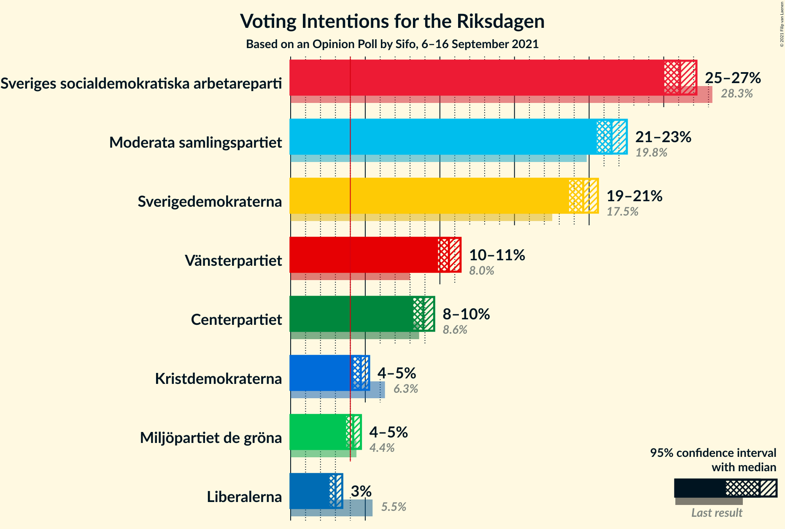

### Confidence Intervals

| Party | Last Result | Poll Result | 80% Confidence Interval | 90% Confidence Interval | 95% Confidence Interval | 99% Confidence Interval |
|:-----:|:-----------:|:-----------:|:-----------------------:|:-----------------------:|:-----------------------:|:-----------------------:|
| Sveriges socialdemokratiska arbetareparti | 28.3% | 26.1% | 25.4–26.8% |25.2–27.0% |25.0–27.2% |24.7–27.5% |
| Moderata samlingspartiet | 19.8% | 21.5% | 20.9–22.2% |20.7–22.4% |20.5–22.5% |20.2–22.8% |
| Sverigedemokraterna | 17.5% | 19.6% | 19.0–20.3% |18.8–20.4% |18.7–20.6% |18.4–20.9% |
| Vänsterpartiet | 8.0% | 10.6% | 10.1–11.1% |10.0–11.3% |9.9–11.4% |9.6–11.6% |
| Centerpartiet | 8.6% | 8.9% | 8.4–9.4% |8.3–9.5% |8.2–9.6% |8.0–9.8% |
| Kristdemokraterna | 6.3% | 4.7% | 4.4–5.1% |4.3–5.2% |4.2–5.3% |4.1–5.4% |
| Miljöpartiet de gröna | 4.4% | 4.2% | 3.9–4.5% |3.8–4.6% |3.7–4.7% |3.6–4.9% |
| Liberalerna | 5.5% | 3.0% | 2.7–3.3% |2.7–3.4% |2.6–3.5% |2.5–3.6% |

*Note:* The poll result column reflects the actual value used in the calculations. Published results may vary slightly, and in addition be rounded to fewer digits.

## Seats

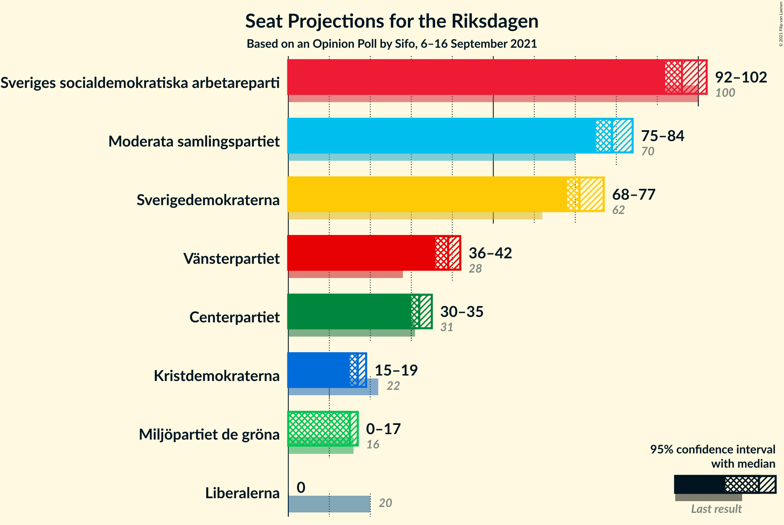

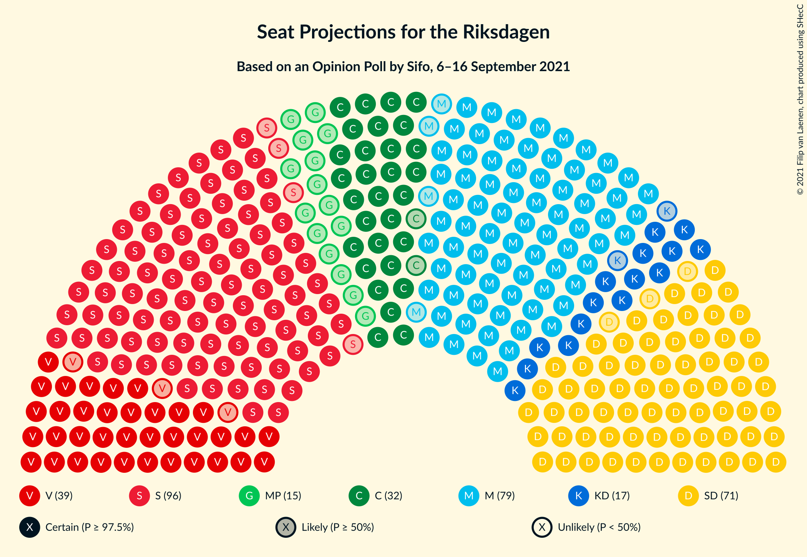

### Confidence Intervals

| Party | Last Result | Median | 80% Confidence Interval | 90% Confidence Interval | 95% Confidence Interval | 99% Confidence Interval |
|:-----:|:-----------:|:------:|:-----------------------:|:-----------------------:|:-----------------------:|:-----------------------:|
| <a href="#sveriges-socialdemokratiska-arbetareparti">Sveriges socialdemokratiska arbetareparti</a> | 100 | 96 | 93–99 |92–101 |92–102 |90–104 |
| <a href="#moderata-samlingspartiet">Moderata samlingspartiet</a> | 70 | 79 | 77–82 |76–83 |75–84 |74–86 |
| <a href="#sverigedemokraterna">Sverigedemokraterna</a> | 62 | 71 | 69–75 |69–76 |68–77 |67–79 |
| <a href="#vänsterpartiet">Vänsterpartiet</a> | 28 | 39 | 37–41 |37–42 |36–42 |35–43 |
| <a href="#centerpartiet">Centerpartiet</a> | 31 | 32 | 31–34 |31–35 |30–35 |29–37 |
| <a href="#kristdemokraterna">Kristdemokraterna</a> | 22 | 17 | 16–18 |16–19 |15–19 |15–20 |
| <a href="#miljöpartiet-de-gröna">Miljöpartiet de gröna</a> | 16 | 15 | 0–16 |0–17 |0–17 |0–18 |
| <a href="#liberalerna">Liberalerna</a> | 20 | 0 | 0 |0 |0 |0 |

### Sveriges socialdemokratiska arbetareparti

*For a full overview of the results for this party, see the [Sveriges socialdemokratiska arbetareparti](party-sverigessocialdemokratiskaarbetareparti.html) page.*

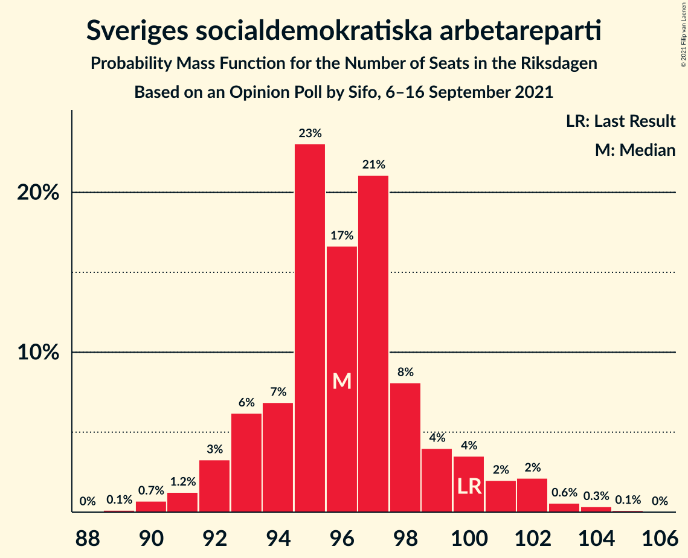

| Number of Seats | Probability | Accumulated | Special Marks |
|:---------------:|:-----------:|:-----------:|:-------------:|
| 89 | 0.1% | 100% |  |
| 90 | 0.7% | 99.9% |  |
| 91 | 1.2% | 99.2% |  |
| 92 | 3% | 98% |  |
| 93 | 6% | 95% |  |
| 94 | 7% | 88% |  |
| 95 | 23% | 82% |  |
| 96 | 17% | 59% | Median |
| 97 | 21% | 42% |  |
| 98 | 8% | 21% |  |
| 99 | 4% | 13% |  |
| 100 | 4% | 9% | Last Result |
| 101 | 2% | 5% |  |
| 102 | 2% | 3% |  |
| 103 | 0.6% | 1.1% |  |
| 104 | 0.3% | 0.5% |  |
| 105 | 0.1% | 0.2% |  |
| 106 | 0% | 0% |  |

### Moderata samlingspartiet

*For a full overview of the results for this party, see the [Moderata samlingspartiet](party-moderatasamlingspartiet.html) page.*

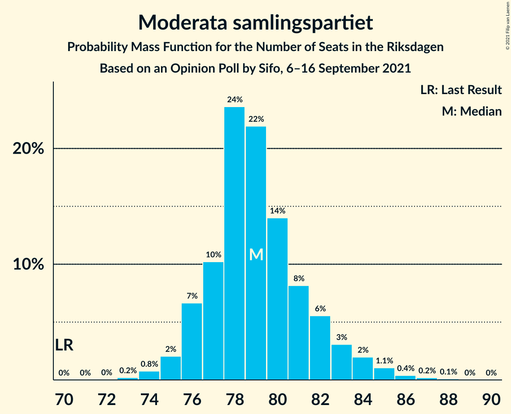

| Number of Seats | Probability | Accumulated | Special Marks |
|:---------------:|:-----------:|:-----------:|:-------------:|
| 70 | 0% | 100% | Last Result |
| 71 | 0% | 100% |  |
| 72 | 0% | 100% |  |
| 73 | 0.2% | 100% |  |
| 74 | 0.8% | 99.8% |  |
| 75 | 2% | 99.0% |  |
| 76 | 7% | 97% |  |
| 77 | 10% | 90% |  |
| 78 | 24% | 80% |  |
| 79 | 22% | 56% | Median |
| 80 | 14% | 35% |  |
| 81 | 8% | 21% |  |
| 82 | 6% | 12% |  |
| 83 | 3% | 7% |  |
| 84 | 2% | 4% |  |
| 85 | 1.1% | 2% |  |
| 86 | 0.4% | 0.7% |  |
| 87 | 0.2% | 0.3% |  |
| 88 | 0.1% | 0.1% |  |
| 89 | 0% | 0% |  |

### Sverigedemokraterna

*For a full overview of the results for this party, see the [Sverigedemokraterna](party-sverigedemokraterna.html) page.*

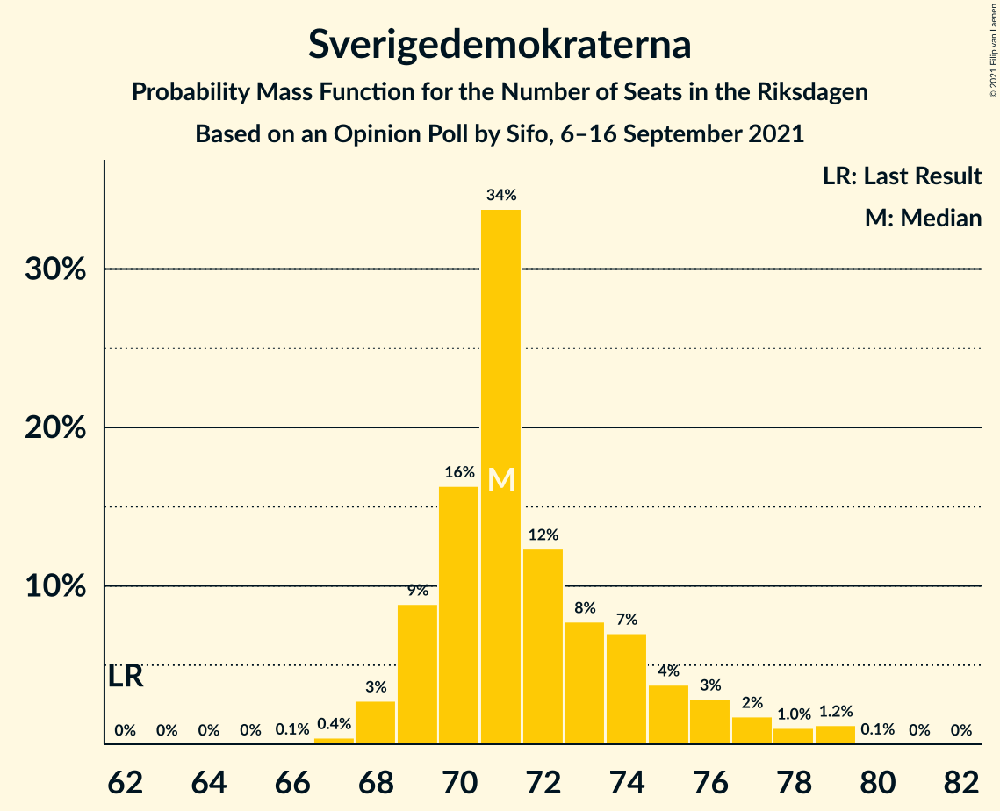

| Number of Seats | Probability | Accumulated | Special Marks |
|:---------------:|:-----------:|:-----------:|:-------------:|
| 62 | 0% | 100% | Last Result |
| 63 | 0% | 100% |  |
| 64 | 0% | 100% |  |
| 65 | 0% | 100% |  |
| 66 | 0.1% | 100% |  |
| 67 | 0.4% | 99.9% |  |
| 68 | 3% | 99.5% |  |
| 69 | 9% | 97% |  |
| 70 | 16% | 88% |  |
| 71 | 34% | 72% | Median |
| 72 | 12% | 38% |  |
| 73 | 8% | 25% |  |
| 74 | 7% | 18% |  |
| 75 | 4% | 11% |  |
| 76 | 3% | 7% |  |
| 77 | 2% | 4% |  |
| 78 | 1.0% | 2% |  |
| 79 | 1.2% | 1.3% |  |
| 80 | 0.1% | 0.1% |  |
| 81 | 0% | 0% |  |

### Vänsterpartiet

*For a full overview of the results for this party, see the [Vänsterpartiet](party-vänsterpartiet.html) page.*

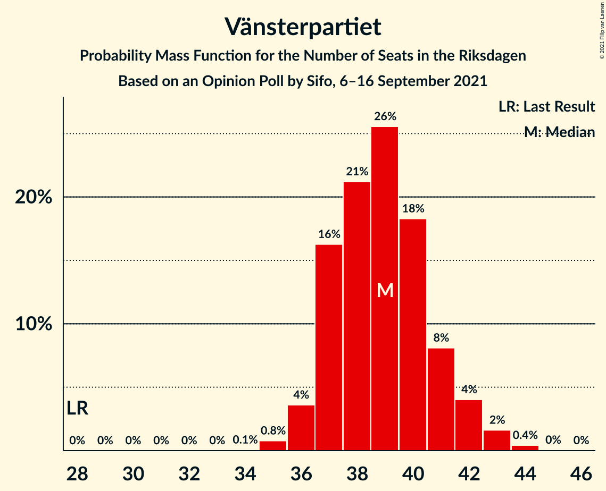

| Number of Seats | Probability | Accumulated | Special Marks |
|:---------------:|:-----------:|:-----------:|:-------------:|
| 28 | 0% | 100% | Last Result |
| 29 | 0% | 100% |  |
| 30 | 0% | 100% |  |
| 31 | 0% | 100% |  |
| 32 | 0% | 100% |  |
| 33 | 0% | 100% |  |
| 34 | 0.1% | 100% |  |
| 35 | 0.8% | 99.9% |  |
| 36 | 4% | 99.2% |  |
| 37 | 16% | 96% |  |
| 38 | 21% | 79% |  |
| 39 | 26% | 58% | Median |
| 40 | 18% | 33% |  |
| 41 | 8% | 14% |  |
| 42 | 4% | 6% |  |
| 43 | 2% | 2% |  |
| 44 | 0.4% | 0.5% |  |
| 45 | 0% | 0.1% |  |
| 46 | 0% | 0% |  |

### Centerpartiet

*For a full overview of the results for this party, see the [Centerpartiet](party-centerpartiet.html) page.*

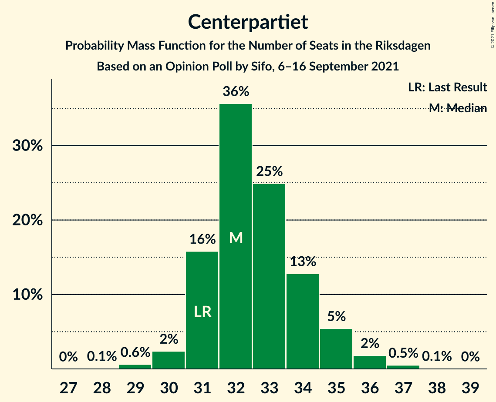

| Number of Seats | Probability | Accumulated | Special Marks |
|:---------------:|:-----------:|:-----------:|:-------------:|
| 28 | 0.1% | 100% |  |
| 29 | 0.6% | 99.9% |  |
| 30 | 2% | 99.3% |  |
| 31 | 16% | 97% | Last Result |
| 32 | 36% | 81% | Median |
| 33 | 25% | 46% |  |
| 34 | 13% | 21% |  |
| 35 | 5% | 8% |  |
| 36 | 2% | 2% |  |
| 37 | 0.5% | 0.6% |  |
| 38 | 0.1% | 0.1% |  |
| 39 | 0% | 0% |  |

### Kristdemokraterna

*For a full overview of the results for this party, see the [Kristdemokraterna](party-kristdemokraterna.html) page.*

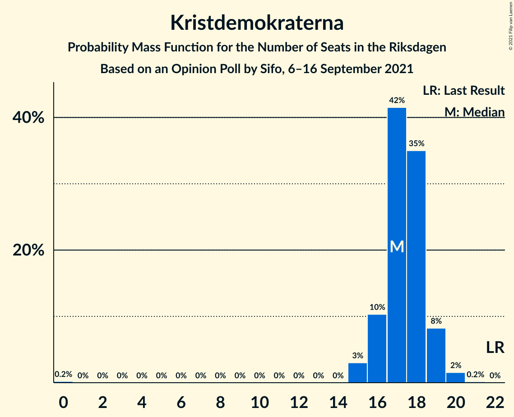

| Number of Seats | Probability | Accumulated | Special Marks |
|:---------------:|:-----------:|:-----------:|:-------------:|
| 0 | 0.2% | 100% |  |
| 1 | 0% | 99.8% |  |
| 2 | 0% | 99.8% |  |
| 3 | 0% | 99.8% |  |
| 4 | 0% | 99.8% |  |
| 5 | 0% | 99.8% |  |
| 6 | 0% | 99.8% |  |
| 7 | 0% | 99.8% |  |
| 8 | 0% | 99.8% |  |
| 9 | 0% | 99.8% |  |
| 10 | 0% | 99.8% |  |
| 11 | 0% | 99.8% |  |
| 12 | 0% | 99.8% |  |
| 13 | 0% | 99.8% |  |
| 14 | 0% | 99.8% |  |
| 15 | 3% | 99.8% |  |
| 16 | 10% | 97% |  |
| 17 | 42% | 86% | Median |
| 18 | 35% | 45% |  |
| 19 | 8% | 10% |  |
| 20 | 2% | 2% |  |
| 21 | 0.2% | 0.2% |  |
| 22 | 0% | 0% | Last Result |

### Miljöpartiet de gröna

*For a full overview of the results for this party, see the [Miljöpartiet de gröna](party-miljöpartietdegröna.html) page.*

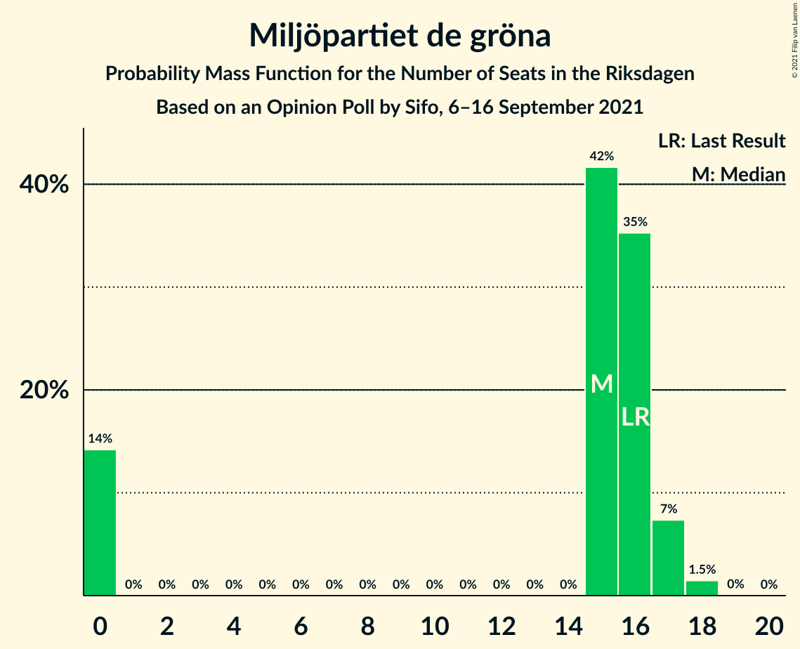

| Number of Seats | Probability | Accumulated | Special Marks |
|:---------------:|:-----------:|:-----------:|:-------------:|
| 0 | 14% | 100% |  |
| 1 | 0% | 86% |  |
| 2 | 0% | 86% |  |
| 3 | 0% | 86% |  |
| 4 | 0% | 86% |  |
| 5 | 0% | 86% |  |
| 6 | 0% | 86% |  |
| 7 | 0% | 86% |  |
| 8 | 0% | 86% |  |
| 9 | 0% | 86% |  |
| 10 | 0% | 86% |  |
| 11 | 0% | 86% |  |
| 12 | 0% | 86% |  |
| 13 | 0% | 86% |  |
| 14 | 0% | 86% |  |
| 15 | 42% | 86% | Median |
| 16 | 35% | 44% | Last Result |
| 17 | 7% | 9% |  |
| 18 | 1.5% | 2% |  |
| 19 | 0% | 0% |  |

### Liberalerna

*For a full overview of the results for this party, see the [Liberalerna](party-liberalerna.html) page.*

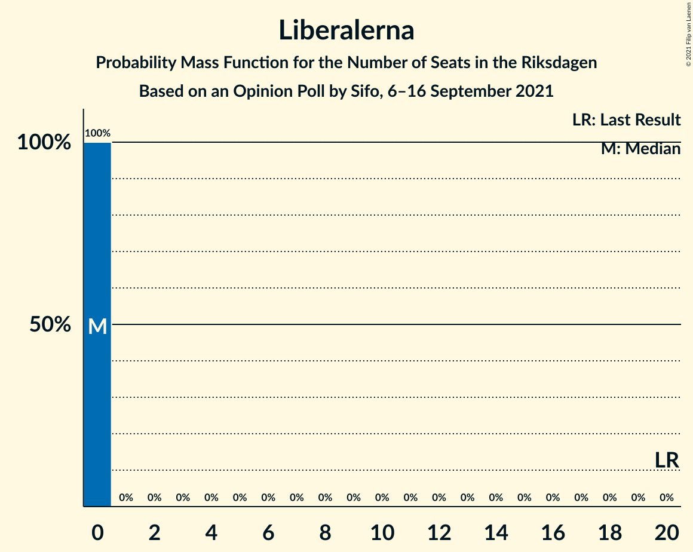

| Number of Seats | Probability | Accumulated | Special Marks |
|:---------------:|:-----------:|:-----------:|:-------------:|
| 0 | 100% | 100% | Median |
| 1 | 0% | 0% |  |
| 2 | 0% | 0% |  |
| 3 | 0% | 0% |  |
| 4 | 0% | 0% |  |
| 5 | 0% | 0% |  |
| 6 | 0% | 0% |  |
| 7 | 0% | 0% |  |
| 8 | 0% | 0% |  |
| 9 | 0% | 0% |  |
| 10 | 0% | 0% |  |
| 11 | 0% | 0% |  |
| 12 | 0% | 0% |  |
| 13 | 0% | 0% |  |
| 14 | 0% | 0% |  |
| 15 | 0% | 0% |  |
| 16 | 0% | 0% |  |
| 17 | 0% | 0% |  |
| 18 | 0% | 0% |  |
| 19 | 0% | 0% |  |
| 20 | 0% | 0% | Last Result |

## Coalitions

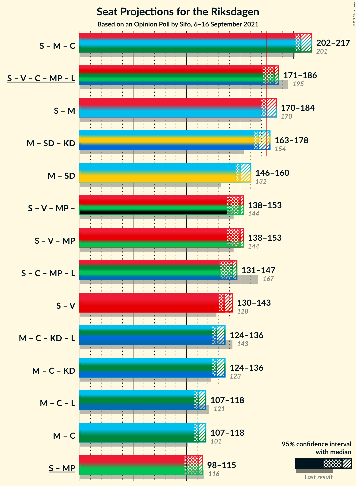

### Confidence Intervals

| Coalition | Last Result | Median | Majority? | 80% Confidence Interval | 90% Confidence Interval | 95% Confidence Interval | 99% Confidence Interval |
|:---------:|:-----------:|:------:|:---------:|:-----------------------:|:-----------------------:|:-----------------------:|:-----------------------:|
| Sveriges socialdemokratiska arbetareparti – Moderata samlingspartiet – Centerpartiet | 201 | 207 | 100% | 204–214 | 203–217 | 202–217 | 201–220 |
| Sveriges socialdemokratiska arbetareparti – Vänsterpartiet – Centerpartiet – Miljöpartiet de gröna – Liberalerna | 195 | 182 | 92% | 176–184 | 173–185 | 171–186 | 170–188 |
| Sveriges socialdemokratiska arbetareparti – Moderata samlingspartiet | 170 | 175 | 52% | 172–180 | 170–183 | 170–184 | 168–186 |
| Moderata samlingspartiet – Sverigedemokraterna – Kristdemokraterna | 154 | 167 | 8% | 165–173 | 164–176 | 163–178 | 161–179 |
| Moderata samlingspartiet – Sverigedemokraterna | 132 | 150 | 0% | 148–156 | 147–158 | 146–160 | 144–161 |
| Sveriges socialdemokratiska arbetareparti – Vänsterpartiet – Miljöpartiet de gröna | 144 | 150 | 0% | 142–151 | 139–153 | 138–153 | 136–155 |
| Sveriges socialdemokratiska arbetareparti – Centerpartiet – Miljöpartiet de gröna – Liberalerna | 167 | 143 | 0% | 135–145 | 132–146 | 131–147 | 129–149 |
| Sveriges socialdemokratiska arbetareparti – Vänsterpartiet | 128 | 135 | 0% | 132–139 | 131–142 | 130–143 | 129–145 |
| Moderata samlingspartiet – Centerpartiet – Kristdemokraterna – Liberalerna | 143 | 128 | 0% | 126–133 | 125–134 | 124–136 | 123–138 |
| Moderata samlingspartiet – Centerpartiet – Kristdemokraterna | 123 | 128 | 0% | 126–133 | 125–134 | 124–136 | 123–138 |
| Moderata samlingspartiet – Centerpartiet – Liberalerna | 121 | 111 | 0% | 109–115 | 108–117 | 107–118 | 106–120 |
| Moderata samlingspartiet – Centerpartiet | 101 | 111 | 0% | 109–115 | 108–117 | 107–118 | 106–120 |
| Sveriges socialdemokratiska arbetareparti – Miljöpartiet de gröna | 116 | 111 | 0% | 101–113 | 99–114 | 98–115 | 95–116 |

### Sveriges socialdemokratiska arbetareparti – Moderata samlingspartiet – Centerpartiet

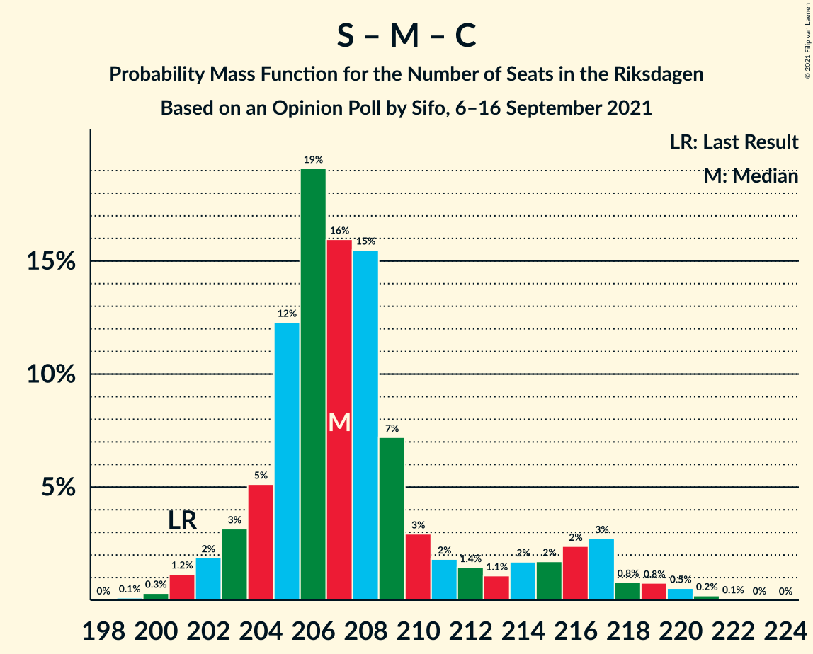

| Number of Seats | Probability | Accumulated | Special Marks |
|:---------------:|:-----------:|:-----------:|:-------------:|
| 199 | 0.1% | 100% |  |
| 200 | 0.3% | 99.9% |  |
| 201 | 1.2% | 99.6% | Last Result |
| 202 | 2% | 98% |  |
| 203 | 3% | 97% |  |
| 204 | 5% | 93% |  |
| 205 | 12% | 88% |  |
| 206 | 19% | 76% |  |
| 207 | 16% | 57% | Median |
| 208 | 15% | 41% |  |
| 209 | 7% | 25% |  |
| 210 | 3% | 18% |  |
| 211 | 2% | 15% |  |
| 212 | 1.4% | 13% |  |
| 213 | 1.1% | 12% |  |
| 214 | 2% | 11% |  |
| 215 | 2% | 9% |  |
| 216 | 2% | 8% |  |
| 217 | 3% | 5% |  |
| 218 | 0.8% | 2% |  |
| 219 | 0.8% | 2% |  |
| 220 | 0.5% | 0.8% |  |
| 221 | 0.2% | 0.3% |  |
| 222 | 0.1% | 0.1% |  |
| 223 | 0% | 0% |  |

### Sveriges socialdemokratiska arbetareparti – Vänsterpartiet – Centerpartiet – Miljöpartiet de gröna – Liberalerna

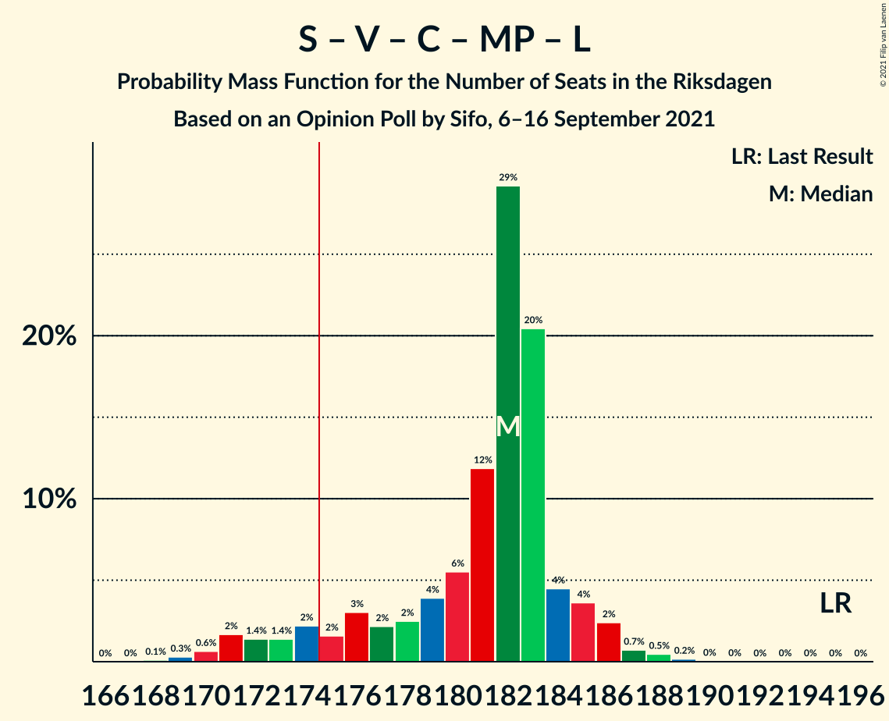

| Number of Seats | Probability | Accumulated | Special Marks |
|:---------------:|:-----------:|:-----------:|:-------------:|
| 168 | 0.1% | 100% |  |
| 169 | 0.3% | 99.9% |  |
| 170 | 0.6% | 99.6% |  |
| 171 | 2% | 98.9% |  |
| 172 | 1.4% | 97% |  |
| 173 | 1.4% | 96% |  |
| 174 | 2% | 94% |  |
| 175 | 2% | 92% | Majority |
| 176 | 3% | 91% |  |
| 177 | 2% | 88% |  |
| 178 | 2% | 85% |  |
| 179 | 4% | 83% |  |
| 180 | 6% | 79% |  |
| 181 | 12% | 74% |  |
| 182 | 29% | 62% | Median |
| 183 | 20% | 32% |  |
| 184 | 4% | 12% |  |
| 185 | 4% | 8% |  |
| 186 | 2% | 4% |  |
| 187 | 0.7% | 1.5% |  |
| 188 | 0.5% | 0.8% |  |
| 189 | 0.2% | 0.3% |  |
| 190 | 0% | 0.1% |  |
| 191 | 0% | 0.1% |  |
| 192 | 0% | 0.1% |  |
| 193 | 0% | 0% |  |
| 194 | 0% | 0% |  |
| 195 | 0% | 0% | Last Result |

### Sveriges socialdemokratiska arbetareparti – Moderata samlingspartiet

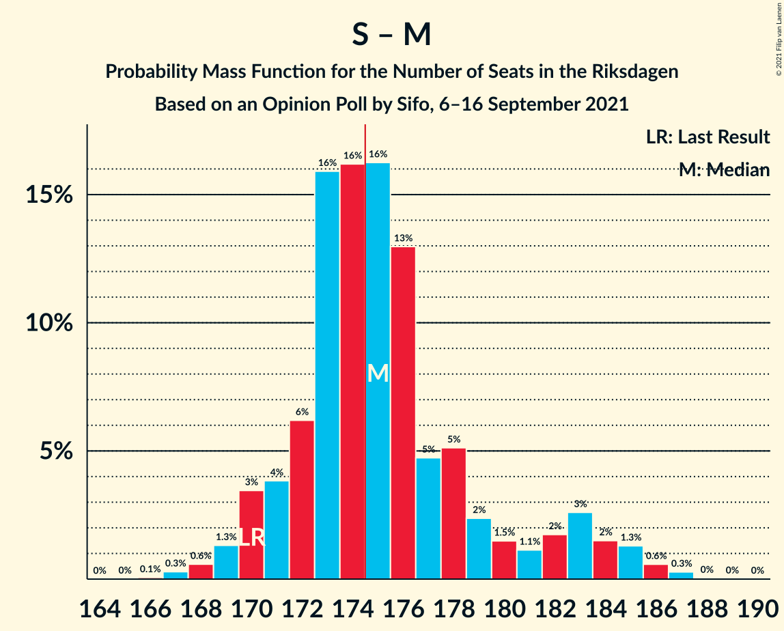

| Number of Seats | Probability | Accumulated | Special Marks |
|:---------------:|:-----------:|:-----------:|:-------------:|
| 166 | 0.1% | 100% |  |
| 167 | 0.3% | 99.9% |  |
| 168 | 0.6% | 99.6% |  |
| 169 | 1.3% | 99.1% |  |
| 170 | 3% | 98% | Last Result |
| 171 | 4% | 94% |  |
| 172 | 6% | 90% |  |
| 173 | 16% | 84% |  |
| 174 | 16% | 68% |  |
| 175 | 16% | 52% | Median, Majority |
| 176 | 13% | 36% |  |
| 177 | 5% | 23% |  |
| 178 | 5% | 18% |  |
| 179 | 2% | 13% |  |
| 180 | 1.5% | 11% |  |
| 181 | 1.1% | 9% |  |
| 182 | 2% | 8% |  |
| 183 | 3% | 6% |  |
| 184 | 2% | 4% |  |
| 185 | 1.3% | 2% |  |
| 186 | 0.6% | 0.9% |  |
| 187 | 0.3% | 0.4% |  |
| 188 | 0% | 0.1% |  |
| 189 | 0% | 0% |  |

### Moderata samlingspartiet – Sverigedemokraterna – Kristdemokraterna

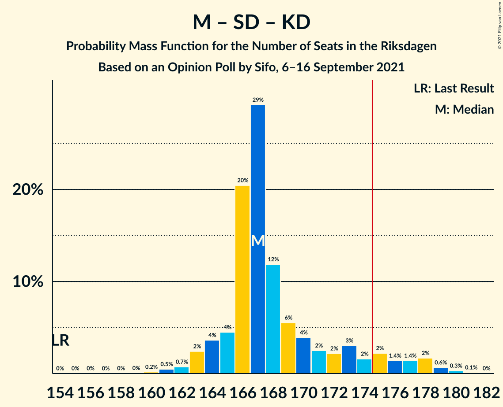

| Number of Seats | Probability | Accumulated | Special Marks |
|:---------------:|:-----------:|:-----------:|:-------------:|
| 154 | 0% | 100% | Last Result |
| 155 | 0% | 100% |  |
| 156 | 0% | 100% |  |
| 157 | 0% | 100% |  |
| 158 | 0% | 99.9% |  |
| 159 | 0% | 99.9% |  |
| 160 | 0.2% | 99.9% |  |
| 161 | 0.5% | 99.7% |  |
| 162 | 0.7% | 99.2% |  |
| 163 | 2% | 98.5% |  |
| 164 | 4% | 96% |  |
| 165 | 4% | 92% |  |
| 166 | 20% | 88% |  |
| 167 | 29% | 68% | Median |
| 168 | 12% | 38% |  |
| 169 | 6% | 26% |  |
| 170 | 4% | 21% |  |
| 171 | 2% | 17% |  |
| 172 | 2% | 15% |  |
| 173 | 3% | 12% |  |
| 174 | 2% | 9% |  |
| 175 | 2% | 8% | Majority |
| 176 | 1.4% | 6% |  |
| 177 | 1.4% | 4% |  |
| 178 | 2% | 3% |  |
| 179 | 0.6% | 1.1% |  |
| 180 | 0.3% | 0.4% |  |
| 181 | 0.1% | 0.1% |  |
| 182 | 0% | 0% |  |

### Moderata samlingspartiet – Sverigedemokraterna

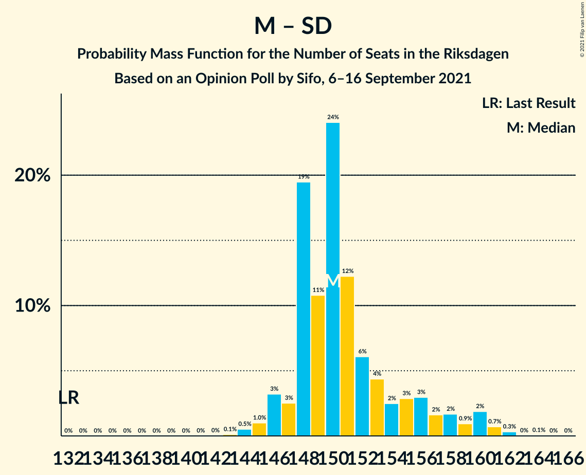

| Number of Seats | Probability | Accumulated | Special Marks |
|:---------------:|:-----------:|:-----------:|:-------------:|
| 132 | 0% | 100% | Last Result |
| 133 | 0% | 100% |  |
| 134 | 0% | 100% |  |
| 135 | 0% | 100% |  |
| 136 | 0% | 100% |  |
| 137 | 0% | 100% |  |
| 138 | 0% | 100% |  |
| 139 | 0% | 100% |  |
| 140 | 0% | 100% |  |
| 141 | 0% | 100% |  |
| 142 | 0% | 100% |  |
| 143 | 0.1% | 100% |  |
| 144 | 0.5% | 99.8% |  |
| 145 | 1.0% | 99.3% |  |
| 146 | 3% | 98% |  |
| 147 | 3% | 95% |  |
| 148 | 19% | 93% |  |
| 149 | 11% | 73% |  |
| 150 | 24% | 62% | Median |
| 151 | 12% | 38% |  |
| 152 | 6% | 26% |  |
| 153 | 4% | 20% |  |
| 154 | 2% | 16% |  |
| 155 | 3% | 13% |  |
| 156 | 3% | 10% |  |
| 157 | 2% | 7% |  |
| 158 | 2% | 6% |  |
| 159 | 0.9% | 4% |  |
| 160 | 2% | 3% |  |
| 161 | 0.7% | 1.1% |  |
| 162 | 0.3% | 0.4% |  |
| 163 | 0% | 0.1% |  |
| 164 | 0.1% | 0.1% |  |
| 165 | 0% | 0% |  |

### Sveriges socialdemokratiska arbetareparti – Vänsterpartiet – Miljöpartiet de gröna

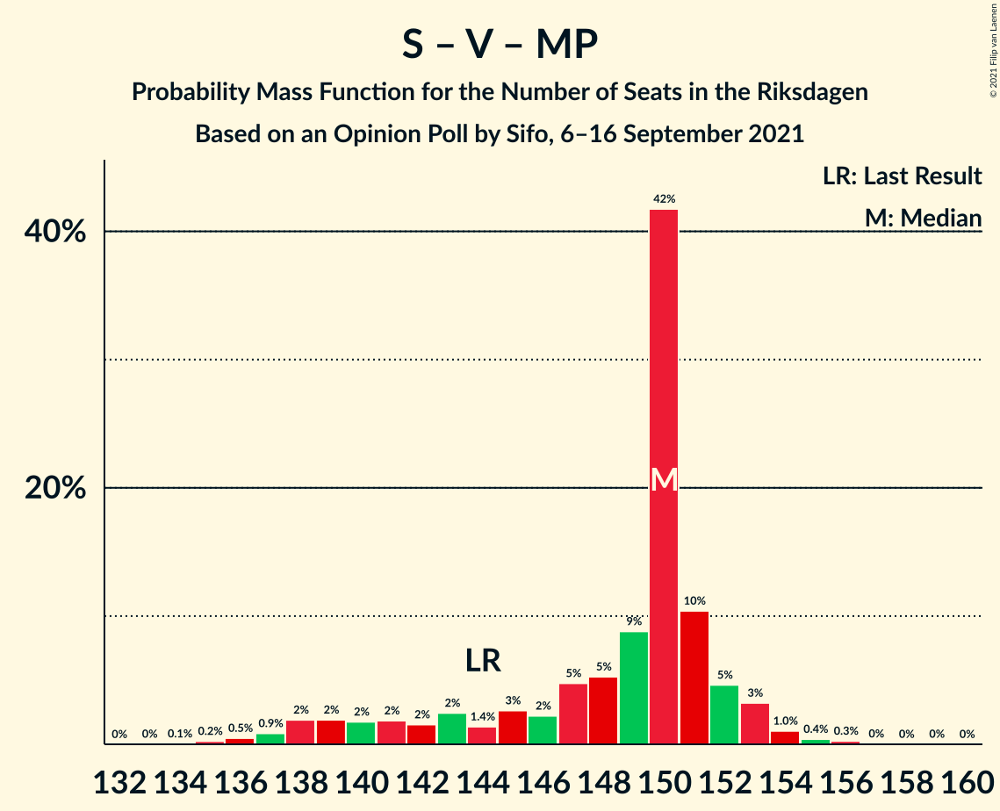

| Number of Seats | Probability | Accumulated | Special Marks |
|:---------------:|:-----------:|:-----------:|:-------------:|
| 134 | 0.1% | 100% |  |
| 135 | 0.2% | 99.9% |  |
| 136 | 0.5% | 99.7% |  |
| 137 | 0.9% | 99.2% |  |
| 138 | 2% | 98% |  |
| 139 | 2% | 96% |  |
| 140 | 2% | 95% |  |
| 141 | 2% | 93% |  |
| 142 | 2% | 91% |  |
| 143 | 2% | 89% |  |
| 144 | 1.4% | 87% | Last Result |
| 145 | 3% | 86% |  |
| 146 | 2% | 83% |  |
| 147 | 5% | 81% |  |
| 148 | 5% | 76% |  |
| 149 | 9% | 71% |  |
| 150 | 42% | 62% | Median |
| 151 | 10% | 20% |  |
| 152 | 5% | 10% |  |
| 153 | 3% | 5% |  |
| 154 | 1.0% | 2% |  |
| 155 | 0.4% | 0.8% |  |
| 156 | 0.3% | 0.4% |  |
| 157 | 0% | 0.1% |  |
| 158 | 0% | 0.1% |  |
| 159 | 0% | 0% |  |

### Sveriges socialdemokratiska arbetareparti – Centerpartiet – Miljöpartiet de gröna – Liberalerna

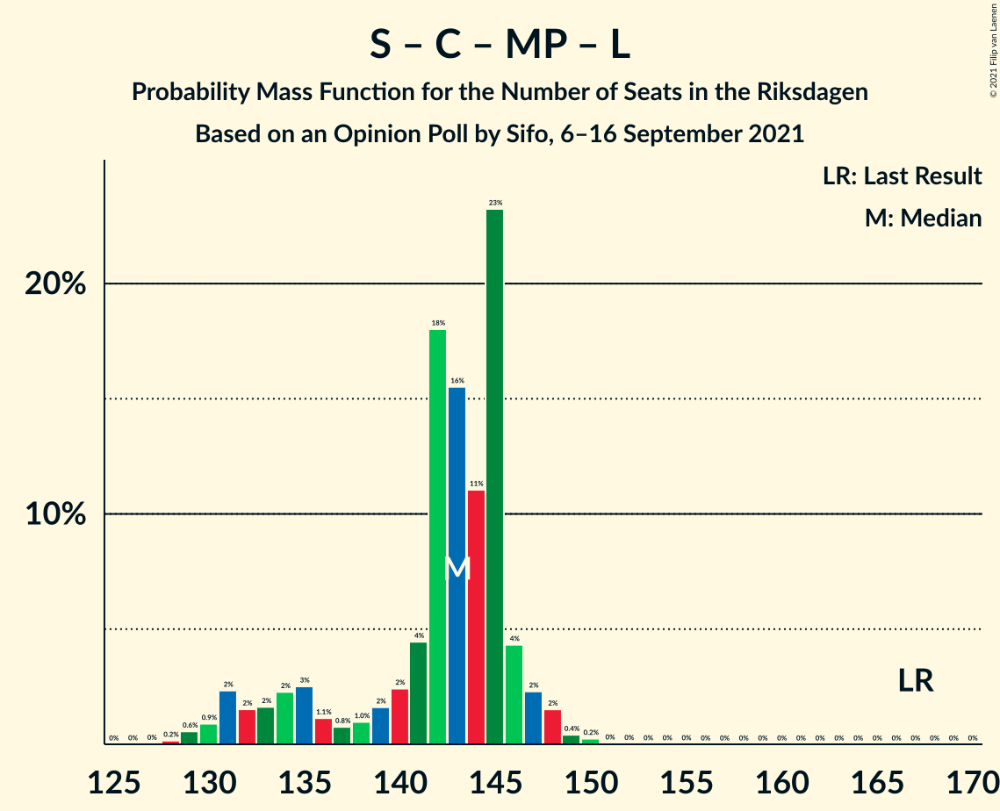

| Number of Seats | Probability | Accumulated | Special Marks |
|:---------------:|:-----------:|:-----------:|:-------------:|
| 128 | 0.2% | 100% |  |
| 129 | 0.6% | 99.8% |  |
| 130 | 0.9% | 99.2% |  |
| 131 | 2% | 98% |  |
| 132 | 2% | 96% |  |
| 133 | 2% | 94% |  |
| 134 | 2% | 93% |  |
| 135 | 3% | 91% |  |
| 136 | 1.1% | 88% |  |
| 137 | 0.8% | 87% |  |
| 138 | 1.0% | 86% |  |
| 139 | 2% | 85% |  |
| 140 | 2% | 84% |  |
| 141 | 4% | 81% |  |
| 142 | 18% | 77% |  |
| 143 | 16% | 59% | Median |
| 144 | 11% | 43% |  |
| 145 | 23% | 32% |  |
| 146 | 4% | 9% |  |
| 147 | 2% | 5% |  |
| 148 | 2% | 2% |  |
| 149 | 0.4% | 0.8% |  |
| 150 | 0.2% | 0.3% |  |
| 151 | 0% | 0.1% |  |
| 152 | 0% | 0.1% |  |
| 153 | 0% | 0% |  |
| 154 | 0% | 0% |  |
| 155 | 0% | 0% |  |
| 156 | 0% | 0% |  |
| 157 | 0% | 0% |  |
| 158 | 0% | 0% |  |
| 159 | 0% | 0% |  |
| 160 | 0% | 0% |  |
| 161 | 0% | 0% |  |
| 162 | 0% | 0% |  |
| 163 | 0% | 0% |  |
| 164 | 0% | 0% |  |
| 165 | 0% | 0% |  |
| 166 | 0% | 0% |  |
| 167 | 0% | 0% | Last Result |

### Sveriges socialdemokratiska arbetareparti – Vänsterpartiet

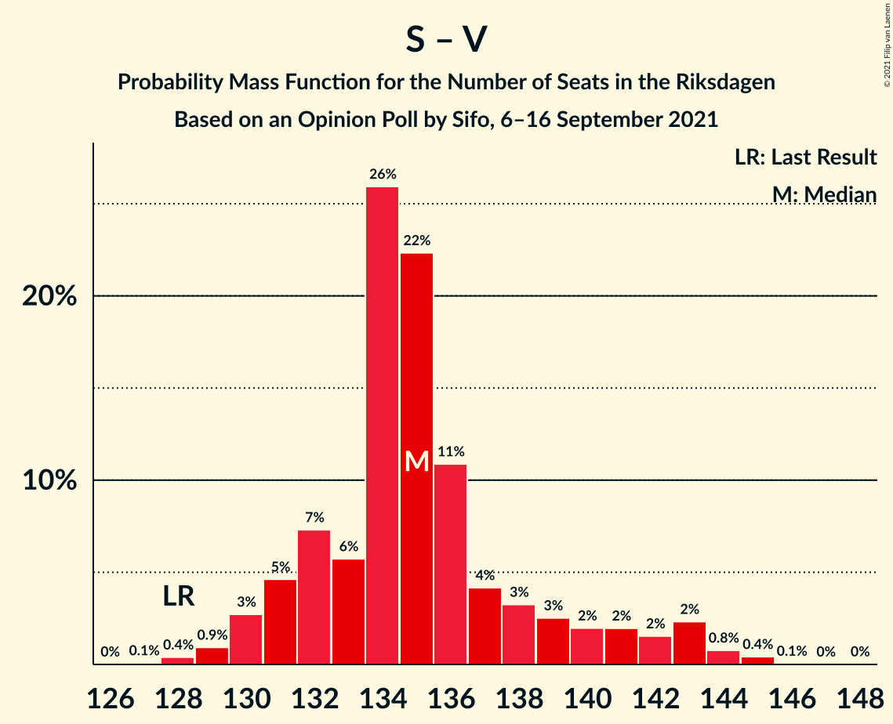

| Number of Seats | Probability | Accumulated | Special Marks |
|:---------------:|:-----------:|:-----------:|:-------------:|
| 127 | 0.1% | 100% |  |
| 128 | 0.4% | 99.9% | Last Result |
| 129 | 0.9% | 99.5% |  |
| 130 | 3% | 98.6% |  |
| 131 | 5% | 96% |  |
| 132 | 7% | 91% |  |
| 133 | 6% | 84% |  |
| 134 | 26% | 78% |  |
| 135 | 22% | 52% | Median |
| 136 | 11% | 30% |  |
| 137 | 4% | 19% |  |
| 138 | 3% | 15% |  |
| 139 | 3% | 12% |  |
| 140 | 2% | 9% |  |
| 141 | 2% | 7% |  |
| 142 | 2% | 5% |  |
| 143 | 2% | 4% |  |
| 144 | 0.8% | 1.3% |  |
| 145 | 0.4% | 0.5% |  |
| 146 | 0.1% | 0.1% |  |
| 147 | 0% | 0% |  |

### Moderata samlingspartiet – Centerpartiet – Kristdemokraterna – Liberalerna

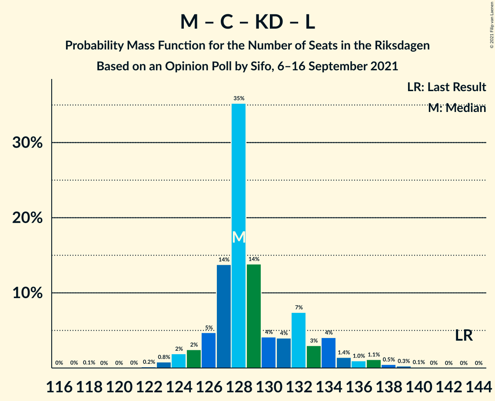

| Number of Seats | Probability | Accumulated | Special Marks |
|:---------------:|:-----------:|:-----------:|:-------------:|
| 116 | 0% | 100% |  |
| 117 | 0% | 99.9% |  |
| 118 | 0.1% | 99.9% |  |
| 119 | 0% | 99.8% |  |
| 120 | 0% | 99.8% |  |
| 121 | 0% | 99.8% |  |
| 122 | 0.2% | 99.8% |  |
| 123 | 0.8% | 99.6% |  |
| 124 | 2% | 98.8% |  |
| 125 | 2% | 97% |  |
| 126 | 5% | 94% |  |
| 127 | 14% | 90% |  |
| 128 | 35% | 76% | Median |
| 129 | 14% | 41% |  |
| 130 | 4% | 27% |  |
| 131 | 4% | 23% |  |
| 132 | 7% | 19% |  |
| 133 | 3% | 11% |  |
| 134 | 4% | 8% |  |
| 135 | 1.4% | 4% |  |
| 136 | 1.0% | 3% |  |
| 137 | 1.1% | 2% |  |
| 138 | 0.5% | 0.9% |  |
| 139 | 0.3% | 0.4% |  |
| 140 | 0.1% | 0.1% |  |
| 141 | 0% | 0% |  |
| 142 | 0% | 0% |  |
| 143 | 0% | 0% | Last Result |

### Moderata samlingspartiet – Centerpartiet – Kristdemokraterna

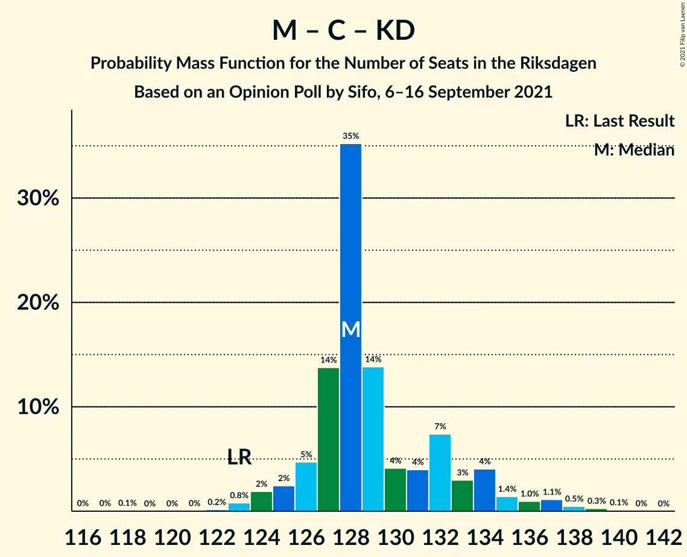

| Number of Seats | Probability | Accumulated | Special Marks |
|:---------------:|:-----------:|:-----------:|:-------------:|
| 116 | 0% | 100% |  |
| 117 | 0% | 99.9% |  |
| 118 | 0.1% | 99.9% |  |
| 119 | 0% | 99.8% |  |
| 120 | 0% | 99.8% |  |
| 121 | 0% | 99.8% |  |
| 122 | 0.2% | 99.8% |  |
| 123 | 0.8% | 99.6% | Last Result |
| 124 | 2% | 98.8% |  |
| 125 | 2% | 97% |  |
| 126 | 5% | 94% |  |
| 127 | 14% | 90% |  |
| 128 | 35% | 76% | Median |
| 129 | 14% | 41% |  |
| 130 | 4% | 27% |  |
| 131 | 4% | 23% |  |
| 132 | 7% | 19% |  |
| 133 | 3% | 11% |  |
| 134 | 4% | 8% |  |
| 135 | 1.4% | 4% |  |
| 136 | 1.0% | 3% |  |
| 137 | 1.1% | 2% |  |
| 138 | 0.5% | 0.9% |  |
| 139 | 0.3% | 0.4% |  |
| 140 | 0.1% | 0.1% |  |
| 141 | 0% | 0% |  |

### Moderata samlingspartiet – Centerpartiet – Liberalerna

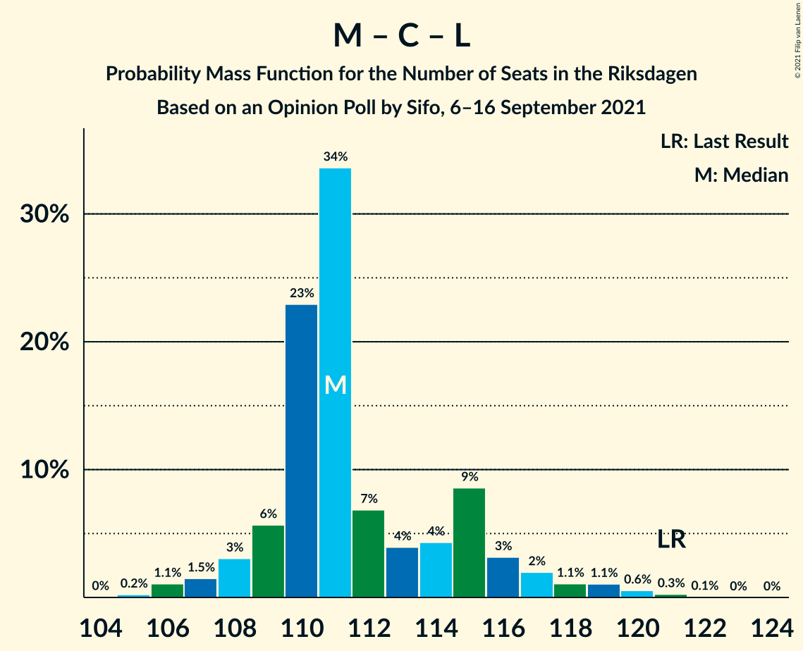

| Number of Seats | Probability | Accumulated | Special Marks |
|:---------------:|:-----------:|:-----------:|:-------------:|
| 104 | 0% | 100% |  |
| 105 | 0.2% | 99.9% |  |
| 106 | 1.1% | 99.7% |  |
| 107 | 1.5% | 98.6% |  |
| 108 | 3% | 97% |  |
| 109 | 6% | 94% |  |
| 110 | 23% | 88% |  |
| 111 | 34% | 65% | Median |
| 112 | 7% | 32% |  |
| 113 | 4% | 25% |  |
| 114 | 4% | 21% |  |
| 115 | 9% | 17% |  |
| 116 | 3% | 8% |  |
| 117 | 2% | 5% |  |
| 118 | 1.1% | 3% |  |
| 119 | 1.1% | 2% |  |
| 120 | 0.6% | 0.9% |  |
| 121 | 0.3% | 0.3% | Last Result |
| 122 | 0.1% | 0.1% |  |
| 123 | 0% | 0% |  |

### Moderata samlingspartiet – Centerpartiet

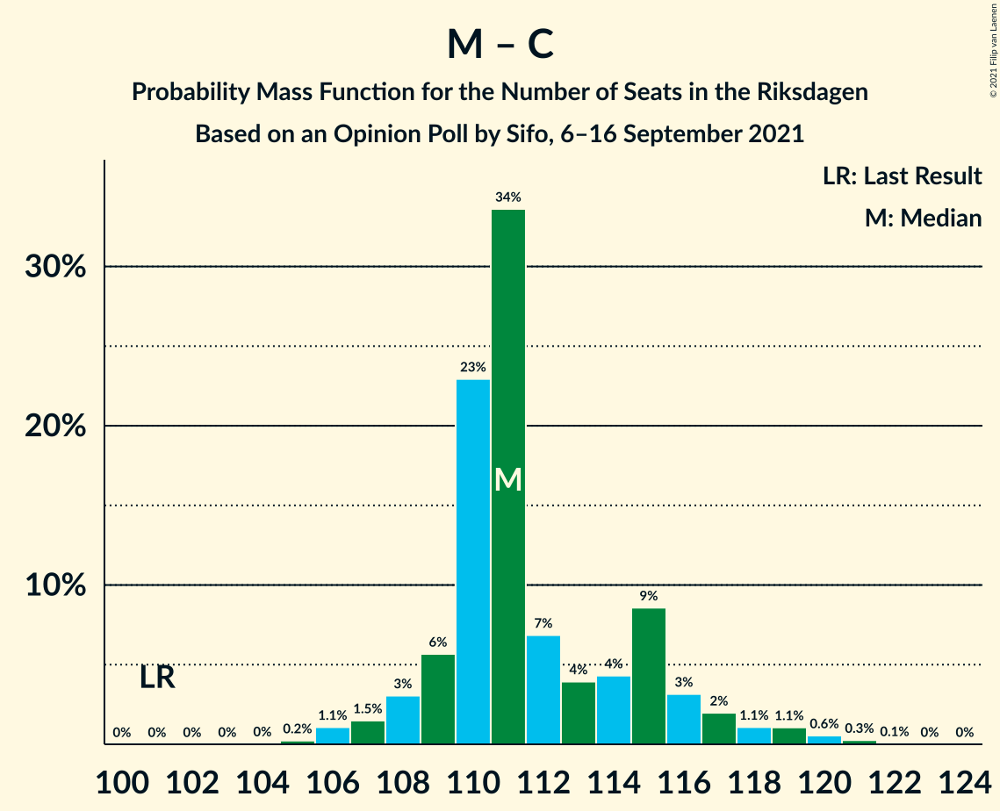

| Number of Seats | Probability | Accumulated | Special Marks |
|:---------------:|:-----------:|:-----------:|:-------------:|
| 101 | 0% | 100% | Last Result |
| 102 | 0% | 100% |  |
| 103 | 0% | 100% |  |
| 104 | 0% | 100% |  |
| 105 | 0.2% | 99.9% |  |
| 106 | 1.1% | 99.7% |  |
| 107 | 1.5% | 98.6% |  |
| 108 | 3% | 97% |  |
| 109 | 6% | 94% |  |
| 110 | 23% | 88% |  |
| 111 | 34% | 65% | Median |
| 112 | 7% | 32% |  |
| 113 | 4% | 25% |  |
| 114 | 4% | 21% |  |
| 115 | 9% | 17% |  |
| 116 | 3% | 8% |  |
| 117 | 2% | 5% |  |
| 118 | 1.1% | 3% |  |
| 119 | 1.1% | 2% |  |
| 120 | 0.6% | 0.9% |  |
| 121 | 0.3% | 0.3% |  |
| 122 | 0.1% | 0.1% |  |
| 123 | 0% | 0% |  |

### Sveriges socialdemokratiska arbetareparti – Miljöpartiet de gröna

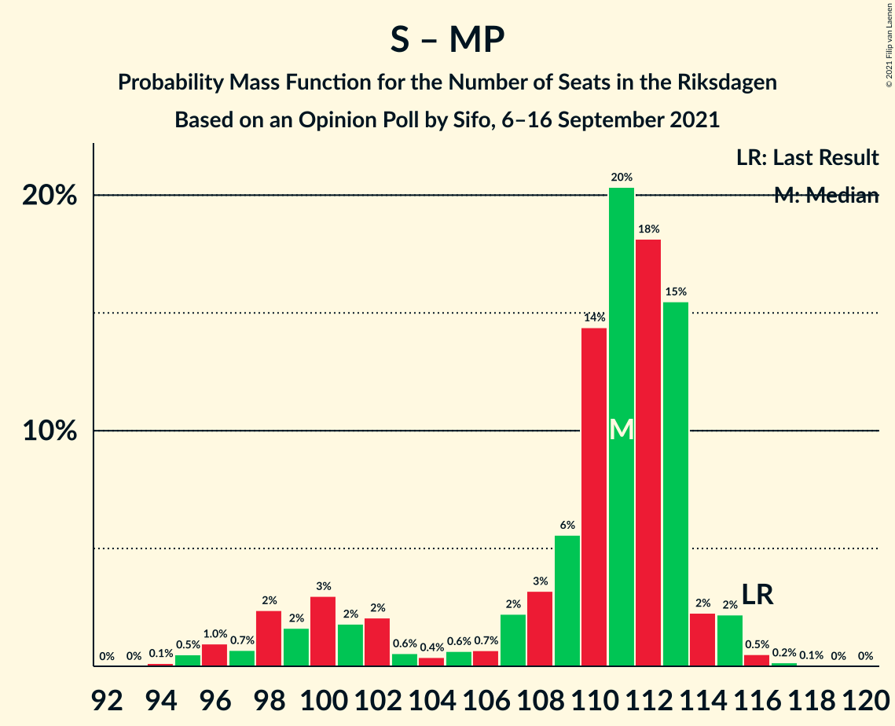

| Number of Seats | Probability | Accumulated | Special Marks |
|:---------------:|:-----------:|:-----------:|:-------------:|
| 94 | 0.1% | 100% |  |
| 95 | 0.5% | 99.8% |  |
| 96 | 1.0% | 99.3% |  |
| 97 | 0.7% | 98% |  |
| 98 | 2% | 98% |  |
| 99 | 2% | 95% |  |
| 100 | 3% | 94% |  |
| 101 | 2% | 91% |  |
| 102 | 2% | 89% |  |
| 103 | 0.6% | 87% |  |
| 104 | 0.4% | 86% |  |
| 105 | 0.6% | 86% |  |
| 106 | 0.7% | 85% |  |
| 107 | 2% | 85% |  |
| 108 | 3% | 82% |  |
| 109 | 6% | 79% |  |
| 110 | 14% | 74% |  |
| 111 | 20% | 59% | Median |
| 112 | 18% | 39% |  |
| 113 | 15% | 21% |  |
| 114 | 2% | 5% |  |
| 115 | 2% | 3% |  |
| 116 | 0.5% | 0.8% | Last Result |
| 117 | 0.2% | 0.2% |  |
| 118 | 0.1% | 0.1% |  |
| 119 | 0% | 0% |  |

## Technical Information

### Opinion Poll

+ **Polling firm:** Sifo
+ **Commissioner(s):** —
+ **Fieldwork period:** 6–16 September 2021

### Calculations

+ **Sample size:** 6488
+ **Simulations done:** 1,048,576
+ **Error estimate:** 0.50%

