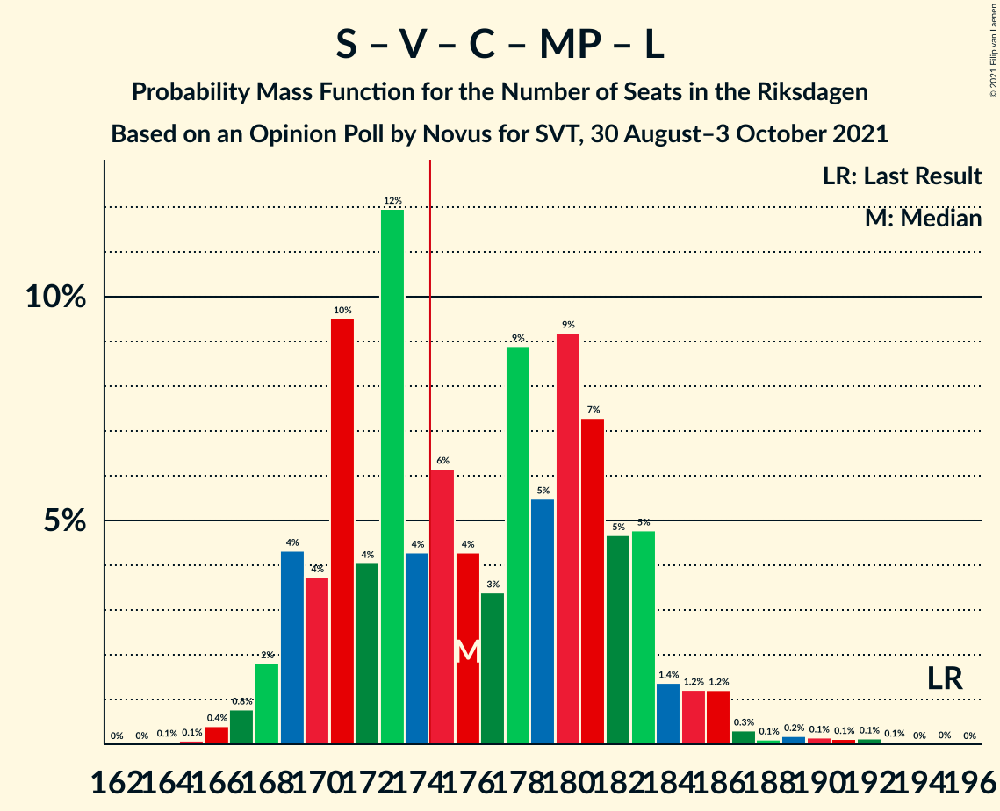

# Opinion Poll by Novus for SVT, 30 August–3 October 2021

<a href="#voting-intentions">Voting Intentions</a> | <a href="#seats">Seats</a> | <a href="#coalitions">Coalitions</a> | <a href="#technical-information">Technical Information</a>

## Voting Intentions

### Confidence Intervals

| Party | Last Result | Poll Result | 80% Confidence Interval | 90% Confidence Interval | 95% Confidence Interval | 99% Confidence Interval |
|:-----:|:-----------:|:-----------:|:-----------------------:|:-----------------------:|:-----------------------:|:-----------------------:|
| Sveriges socialdemokratiska arbetareparti | 28.3% | 26.0% | 25.2–26.8% |25.0–27.1% |24.8–27.3% |24.4–27.6% |
| Moderata samlingspartiet | 19.8% | 22.6% | 21.8–23.4% |21.6–23.6% |21.4–23.8% |21.1–24.2% |
| Sverigedemokraterna | 17.5% | 19.4% | 18.7–20.1% |18.5–20.4% |18.3–20.5% |18.0–20.9% |
| Vänsterpartiet | 8.0% | 10.6% | 10.1–11.2% |9.9–11.4% |9.8–11.5% |9.5–11.8% |
| Centerpartiet | 8.6% | 8.8% | 8.3–9.3% |8.2–9.5% |8.0–9.6% |7.8–9.9% |
| Kristdemokraterna | 6.3% | 4.6% | 4.2–5.0% |4.1–5.1% |4.0–5.2% |3.9–5.4% |
| Miljöpartiet de gröna | 4.4% | 4.0% | 3.7–4.4% |3.6–4.5% |3.5–4.6% |3.3–4.8% |
| Liberalerna | 5.5% | 2.6% | 2.3–2.9% |2.3–3.0% |2.2–3.1% |2.1–3.2% |

*Note:* The poll result column reflects the actual value used in the calculations. Published results may vary slightly, and in addition be rounded to fewer digits.

## Seats

### Confidence Intervals

| Party | Last Result | Median | 80% Confidence Interval | 90% Confidence Interval | 95% Confidence Interval | 99% Confidence Interval |
|:-----:|:-----------:|:------:|:-----------------------:|:-----------------------:|:-----------------------:|:-----------------------:|
| <a href="#sveriges-socialdemokratiska-arbetareparti">Sveriges socialdemokratiska arbetareparti</a> | 100 | 96 | 93–101 |92–102 |91–102 |89–104 |
| <a href="#moderata-samlingspartiet">Moderata samlingspartiet</a> | 70 | 84 | 80–87 |79–88 |78–89 |77–91 |
| <a href="#sverigedemokraterna">Sverigedemokraterna</a> | 62 | 72 | 68–76 |68–77 |67–77 |66–79 |
| <a href="#vänsterpartiet">Vänsterpartiet</a> | 28 | 39 | 37–42 |36–42 |36–43 |35–44 |
| <a href="#centerpartiet">Centerpartiet</a> | 31 | 33 | 31–35 |30–35 |30–36 |28–37 |
| <a href="#kristdemokraterna">Kristdemokraterna</a> | 22 | 17 | 16–19 |15–19 |15–20 |0–20 |
| <a href="#miljöpartiet-de-gröna">Miljöpartiet de gröna</a> | 16 | 0 | 0–16 |0–16 |0–17 |0–17 |
| <a href="#liberalerna">Liberalerna</a> | 20 | 0 | 0 |0 |0 |0 |

### Sveriges socialdemokratiska arbetareparti

*For a full overview of the results for this party, see the [Sveriges socialdemokratiska arbetareparti](party-sverigessocialdemokratiskaarbetareparti.html) page.*

| Number of Seats | Probability | Accumulated | Special Marks |
|:---------------:|:-----------:|:-----------:|:-------------:|
| 87 | 0% | 100% |  |
| 88 | 0.2% | 99.9% |  |
| 89 | 0.3% | 99.8% |  |
| 90 | 1.4% | 99.4% |  |
| 91 | 2% | 98% |  |
| 92 | 5% | 96% |  |
| 93 | 11% | 91% |  |
| 94 | 9% | 80% |  |
| 95 | 10% | 71% |  |
| 96 | 12% | 61% | Median |
| 97 | 9% | 49% |  |
| 98 | 9% | 40% |  |
| 99 | 15% | 31% |  |
| 100 | 5% | 16% | Last Result |
| 101 | 6% | 11% |  |
| 102 | 3% | 5% |  |
| 103 | 1.3% | 2% |  |
| 104 | 0.5% | 1.0% |  |
| 105 | 0.3% | 0.5% |  |
| 106 | 0.1% | 0.2% |  |
| 107 | 0.1% | 0.1% |  |
| 108 | 0% | 0% |  |

### Moderata samlingspartiet

*For a full overview of the results for this party, see the [Moderata samlingspartiet](party-moderatasamlingspartiet.html) page.*

| Number of Seats | Probability | Accumulated | Special Marks |
|:---------------:|:-----------:|:-----------:|:-------------:|
| 70 | 0% | 100% | Last Result |
| 71 | 0% | 100% |  |
| 72 | 0% | 100% |  |
| 73 | 0% | 100% |  |
| 74 | 0% | 100% |  |
| 75 | 0.1% | 100% |  |
| 76 | 0.2% | 99.9% |  |
| 77 | 1.2% | 99.8% |  |
| 78 | 1.4% | 98.6% |  |
| 79 | 3% | 97% |  |
| 80 | 8% | 94% |  |
| 81 | 9% | 86% |  |
| 82 | 10% | 77% |  |
| 83 | 9% | 67% |  |
| 84 | 12% | 58% | Median |
| 85 | 22% | 46% |  |
| 86 | 5% | 24% |  |
| 87 | 10% | 19% |  |
| 88 | 4% | 8% |  |
| 89 | 3% | 5% |  |
| 90 | 0.9% | 2% |  |
| 91 | 0.7% | 1.0% |  |
| 92 | 0.2% | 0.3% |  |
| 93 | 0% | 0.1% |  |
| 94 | 0% | 0% |  |

### Sverigedemokraterna

*For a full overview of the results for this party, see the [Sverigedemokraterna](party-sverigedemokraterna.html) page.*

| Number of Seats | Probability | Accumulated | Special Marks |
|:---------------:|:-----------:|:-----------:|:-------------:|
| 62 | 0% | 100% | Last Result |
| 63 | 0% | 100% |  |
| 64 | 0.1% | 100% |  |
| 65 | 0.3% | 99.9% |  |
| 66 | 0.7% | 99.7% |  |
| 67 | 2% | 99.0% |  |
| 68 | 7% | 97% |  |
| 69 | 6% | 90% |  |
| 70 | 9% | 84% |  |
| 71 | 19% | 75% |  |
| 72 | 15% | 56% | Median |
| 73 | 7% | 40% |  |
| 74 | 15% | 33% |  |
| 75 | 8% | 18% |  |
| 76 | 5% | 10% |  |
| 77 | 3% | 6% |  |
| 78 | 2% | 2% |  |
| 79 | 0.3% | 0.5% |  |
| 80 | 0.2% | 0.3% |  |
| 81 | 0.1% | 0.1% |  |
| 82 | 0% | 0% |  |

### Vänsterpartiet

*For a full overview of the results for this party, see the [Vänsterpartiet](party-vänsterpartiet.html) page.*

| Number of Seats | Probability | Accumulated | Special Marks |
|:---------------:|:-----------:|:-----------:|:-------------:|
| 28 | 0% | 100% | Last Result |
| 29 | 0% | 100% |  |
| 30 | 0% | 100% |  |
| 31 | 0% | 100% |  |
| 32 | 0% | 100% |  |
| 33 | 0% | 100% |  |
| 34 | 0.2% | 100% |  |
| 35 | 1.2% | 99.8% |  |
| 36 | 4% | 98.6% |  |
| 37 | 5% | 94% |  |
| 38 | 17% | 89% |  |
| 39 | 25% | 72% | Median |
| 40 | 10% | 48% |  |
| 41 | 26% | 37% |  |
| 42 | 8% | 11% |  |
| 43 | 2% | 4% |  |
| 44 | 1.4% | 2% |  |
| 45 | 0.4% | 0.4% |  |
| 46 | 0% | 0.1% |  |
| 47 | 0% | 0% |  |

### Centerpartiet

*For a full overview of the results for this party, see the [Centerpartiet](party-centerpartiet.html) page.*

| Number of Seats | Probability | Accumulated | Special Marks |
|:---------------:|:-----------:|:-----------:|:-------------:|
| 28 | 0.5% | 100% |  |
| 29 | 2% | 99.5% |  |
| 30 | 6% | 98% |  |
| 31 | 22% | 92% | Last Result |
| 32 | 19% | 70% |  |
| 33 | 25% | 51% | Median |
| 34 | 13% | 26% |  |
| 35 | 9% | 14% |  |
| 36 | 3% | 5% |  |
| 37 | 0.9% | 1.2% |  |
| 38 | 0.3% | 0.4% |  |
| 39 | 0% | 0% |  |

### Kristdemokraterna

*For a full overview of the results for this party, see the [Kristdemokraterna](party-kristdemokraterna.html) page.*

| Number of Seats | Probability | Accumulated | Special Marks |
|:---------------:|:-----------:|:-----------:|:-------------:|
| 0 | 2% | 100% |  |
| 1 | 0% | 98% |  |
| 2 | 0% | 98% |  |
| 3 | 0% | 98% |  |
| 4 | 0% | 98% |  |
| 5 | 0% | 98% |  |
| 6 | 0% | 98% |  |
| 7 | 0% | 98% |  |
| 8 | 0% | 98% |  |
| 9 | 0% | 98% |  |
| 10 | 0% | 98% |  |
| 11 | 0% | 98% |  |
| 12 | 0% | 98% |  |
| 13 | 0% | 98% |  |
| 14 | 0% | 98% |  |
| 15 | 6% | 98% |  |
| 16 | 27% | 93% |  |
| 17 | 34% | 66% | Median |
| 18 | 21% | 32% |  |
| 19 | 8% | 11% |  |
| 20 | 2% | 3% |  |
| 21 | 0.3% | 0.3% |  |
| 22 | 0% | 0% | Last Result |

### Miljöpartiet de gröna

*For a full overview of the results for this party, see the [Miljöpartiet de gröna](party-miljöpartietdegröna.html) page.*

| Number of Seats | Probability | Accumulated | Special Marks |
|:---------------:|:-----------:|:-----------:|:-------------:|
| 0 | 50% | 100% | Median |
| 1 | 0% | 50% |  |
| 2 | 0% | 50% |  |
| 3 | 0% | 50% |  |
| 4 | 0% | 50% |  |
| 5 | 0% | 50% |  |
| 6 | 0% | 50% |  |
| 7 | 0% | 50% |  |
| 8 | 0% | 50% |  |
| 9 | 0% | 50% |  |
| 10 | 0% | 50% |  |
| 11 | 0% | 50% |  |
| 12 | 0% | 50% |  |
| 13 | 0% | 50% |  |
| 14 | 0.2% | 50% |  |
| 15 | 36% | 50% |  |
| 16 | 11% | 14% | Last Result |
| 17 | 3% | 3% |  |
| 18 | 0.3% | 0.3% |  |
| 19 | 0% | 0% |  |

### Liberalerna

*For a full overview of the results for this party, see the [Liberalerna](party-liberalerna.html) page.*

| Number of Seats | Probability | Accumulated | Special Marks |
|:---------------:|:-----------:|:-----------:|:-------------:|
| 0 | 100% | 100% | Median |
| 1 | 0% | 0% |  |
| 2 | 0% | 0% |  |
| 3 | 0% | 0% |  |
| 4 | 0% | 0% |  |
| 5 | 0% | 0% |  |
| 6 | 0% | 0% |  |
| 7 | 0% | 0% |  |
| 8 | 0% | 0% |  |
| 9 | 0% | 0% |  |
| 10 | 0% | 0% |  |
| 11 | 0% | 0% |  |
| 12 | 0% | 0% |  |
| 13 | 0% | 0% |  |
| 14 | 0% | 0% |  |
| 15 | 0% | 0% |  |
| 16 | 0% | 0% |  |
| 17 | 0% | 0% |  |
| 18 | 0% | 0% |  |
| 19 | 0% | 0% |  |
| 20 | 0% | 0% | Last Result |

## Coalitions

### Confidence Intervals

| Coalition | Last Result | Median | Majority? | 80% Confidence Interval | 90% Confidence Interval | 95% Confidence Interval | 99% Confidence Interval |
|:---------:|:-----------:|:------:|:---------:|:-----------------------:|:-----------------------:|:-----------------------:|:-----------------------:|
| Sveriges socialdemokratiska arbetareparti – Moderata samlingspartiet – Centerpartiet | 201 | 213 | 100% | 206–220 | 205–221 | 204–222 | 202–226 |
| Sveriges socialdemokratiska arbetareparti – Moderata samlingspartiet | 170 | 180 | 88% | 174–186 | 173–188 | 172–189 | 170–192 |
| Sveriges socialdemokratiska arbetareparti – Vänsterpartiet – Centerpartiet – Miljöpartiet de gröna – Liberalerna | 195 | 176 | 59% | 170–182 | 169–183 | 168–185 | 166–189 |
| Moderata samlingspartiet – Sverigedemokraterna – Kristdemokraterna | 154 | 173 | 41% | 167–179 | 166–180 | 164–181 | 160–183 |
| Moderata samlingspartiet – Sverigedemokraterna | 132 | 156 | 0% | 150–162 | 149–163 | 148–163 | 146–167 |
| Sveriges socialdemokratiska arbetareparti – Vänsterpartiet – Miljöpartiet de gröna | 144 | 144 | 0% | 137–150 | 136–152 | 135–153 | 133–156 |
| Sveriges socialdemokratiska arbetareparti – Centerpartiet – Miljöpartiet de gröna – Liberalerna | 167 | 137 | 0% | 130–144 | 129–145 | 128–146 | 127–150 |
| Sveriges socialdemokratiska arbetareparti – Vänsterpartiet | 128 | 136 | 0% | 131–141 | 130–142 | 129–143 | 127–146 |
| Moderata samlingspartiet – Centerpartiet – Kristdemokraterna – Liberalerna | 143 | 134 | 0% | 128–138 | 127–140 | 126–140 | 120–143 |
| Moderata samlingspartiet – Centerpartiet – Kristdemokraterna | 123 | 134 | 0% | 128–138 | 127–140 | 126–140 | 120–143 |
| Moderata samlingspartiet – Centerpartiet – Liberalerna | 121 | 116 | 0% | 112–121 | 111–122 | 110–123 | 108–125 |
| Moderata samlingspartiet – Centerpartiet | 101 | 116 | 0% | 112–121 | 111–122 | 110–123 | 108–125 |
| Sveriges socialdemokratiska arbetareparti – Miljöpartiet de gröna | 116 | 104 | 0% | 96–112 | 96–113 | 95–114 | 94–116 |

### Sveriges socialdemokratiska arbetareparti – Moderata samlingspartiet – Centerpartiet

| Number of Seats | Probability | Accumulated | Special Marks |
|:---------------:|:-----------:|:-----------:|:-------------:|
| 201 | 0.1% | 100% | Last Result |
| 202 | 0.5% | 99.8% |  |
| 203 | 1.1% | 99.4% |  |
| 204 | 1.4% | 98% |  |
| 205 | 3% | 97% |  |
| 206 | 5% | 94% |  |
| 207 | 7% | 89% |  |
| 208 | 13% | 82% |  |
| 209 | 7% | 69% |  |
| 210 | 4% | 62% |  |
| 211 | 3% | 58% |  |
| 212 | 3% | 55% |  |
| 213 | 2% | 52% | Median |
| 214 | 3% | 49% |  |
| 215 | 6% | 46% |  |
| 216 | 5% | 40% |  |
| 217 | 12% | 35% |  |
| 218 | 7% | 23% |  |
| 219 | 6% | 16% |  |
| 220 | 4% | 10% |  |
| 221 | 2% | 6% |  |
| 222 | 2% | 4% |  |
| 223 | 0.9% | 2% |  |
| 224 | 0.2% | 1.0% |  |
| 225 | 0.2% | 0.8% |  |
| 226 | 0.1% | 0.6% |  |
| 227 | 0.1% | 0.5% |  |
| 228 | 0.1% | 0.4% |  |
| 229 | 0% | 0.3% |  |
| 230 | 0.1% | 0.2% |  |
| 231 | 0% | 0.2% |  |
| 232 | 0.1% | 0.1% |  |
| 233 | 0% | 0.1% |  |
| 234 | 0% | 0% |  |

### Sveriges socialdemokratiska arbetareparti – Moderata samlingspartiet

| Number of Seats | Probability | Accumulated | Special Marks |
|:---------------:|:-----------:|:-----------:|:-------------:|
| 169 | 0.2% | 100% |  |
| 170 | 0.5% | 99.8% | Last Result |
| 171 | 0.7% | 99.2% |  |
| 172 | 2% | 98.5% |  |
| 173 | 2% | 97% |  |
| 174 | 6% | 94% |  |
| 175 | 4% | 88% | Majority |
| 176 | 10% | 85% |  |
| 177 | 13% | 75% |  |
| 178 | 4% | 62% |  |
| 179 | 4% | 59% |  |
| 180 | 6% | 54% | Median |
| 181 | 3% | 49% |  |
| 182 | 6% | 45% |  |
| 183 | 6% | 40% |  |
| 184 | 13% | 33% |  |
| 185 | 5% | 20% |  |
| 186 | 6% | 14% |  |
| 187 | 2% | 9% |  |
| 188 | 4% | 6% |  |
| 189 | 0.9% | 3% |  |
| 190 | 0.7% | 2% |  |
| 191 | 0.6% | 1.1% |  |
| 192 | 0.1% | 0.6% |  |
| 193 | 0.1% | 0.4% |  |
| 194 | 0.1% | 0.3% |  |
| 195 | 0.1% | 0.2% |  |
| 196 | 0.1% | 0.1% |  |
| 197 | 0% | 0.1% |  |
| 198 | 0% | 0% |  |

### Sveriges socialdemokratiska arbetareparti – Vänsterpartiet – Centerpartiet – Miljöpartiet de gröna – Liberalerna

| Number of Seats | Probability | Accumulated | Special Marks |
|:---------------:|:-----------:|:-----------:|:-------------:|
| 164 | 0.1% | 100% |  |
| 165 | 0.1% | 99.9% |  |
| 166 | 0.4% | 99.9% |  |
| 167 | 0.8% | 99.4% |  |
| 168 | 2% | 98.7% | Median |
| 169 | 4% | 97% |  |
| 170 | 4% | 93% |  |
| 171 | 10% | 89% |  |
| 172 | 4% | 79% |  |
| 173 | 12% | 75% |  |
| 174 | 4% | 63% |  |
| 175 | 6% | 59% | Majority |
| 176 | 4% | 53% |  |
| 177 | 3% | 49% |  |
| 178 | 9% | 45% |  |
| 179 | 5% | 36% |  |
| 180 | 9% | 31% |  |
| 181 | 7% | 22% |  |
| 182 | 5% | 14% |  |
| 183 | 5% | 10% |  |
| 184 | 1.4% | 5% |  |
| 185 | 1.2% | 3% |  |
| 186 | 1.2% | 2% |  |
| 187 | 0.3% | 1.1% |  |
| 188 | 0.1% | 0.8% |  |
| 189 | 0.2% | 0.7% |  |
| 190 | 0.1% | 0.5% |  |
| 191 | 0.1% | 0.3% |  |
| 192 | 0.1% | 0.2% |  |
| 193 | 0.1% | 0.1% |  |
| 194 | 0% | 0% |  |
| 195 | 0% | 0% | Last Result |

### Moderata samlingspartiet – Sverigedemokraterna – Kristdemokraterna

| Number of Seats | Probability | Accumulated | Special Marks |
|:---------------:|:-----------:|:-----------:|:-------------:|
| 154 | 0% | 100% | Last Result |
| 155 | 0% | 100% |  |
| 156 | 0.1% | 100% |  |
| 157 | 0.1% | 99.9% |  |
| 158 | 0.1% | 99.8% |  |
| 159 | 0.1% | 99.7% |  |
| 160 | 0.2% | 99.5% |  |
| 161 | 0.1% | 99.3% |  |
| 162 | 0.3% | 99.2% |  |
| 163 | 1.2% | 98.9% |  |
| 164 | 1.2% | 98% |  |
| 165 | 1.4% | 97% |  |
| 166 | 5% | 95% |  |
| 167 | 5% | 90% |  |
| 168 | 7% | 86% |  |
| 169 | 9% | 78% |  |
| 170 | 5% | 69% |  |
| 171 | 9% | 64% |  |
| 172 | 3% | 55% |  |
| 173 | 4% | 51% | Median |
| 174 | 6% | 47% |  |
| 175 | 4% | 41% | Majority |
| 176 | 12% | 37% |  |
| 177 | 4% | 25% |  |
| 178 | 10% | 21% |  |
| 179 | 4% | 11% |  |
| 180 | 4% | 7% |  |
| 181 | 2% | 3% |  |
| 182 | 0.8% | 1.3% |  |
| 183 | 0.4% | 0.6% |  |
| 184 | 0.1% | 0.1% |  |
| 185 | 0.1% | 0.1% |  |
| 186 | 0% | 0% |  |

### Moderata samlingspartiet – Sverigedemokraterna

| Number of Seats | Probability | Accumulated | Special Marks |
|:---------------:|:-----------:|:-----------:|:-------------:|
| 132 | 0% | 100% | Last Result |
| 133 | 0% | 100% |  |
| 134 | 0% | 100% |  |
| 135 | 0% | 100% |  |
| 136 | 0% | 100% |  |
| 137 | 0% | 100% |  |
| 138 | 0% | 100% |  |
| 139 | 0% | 100% |  |
| 140 | 0% | 100% |  |
| 141 | 0% | 100% |  |
| 142 | 0% | 100% |  |
| 143 | 0% | 100% |  |
| 144 | 0% | 100% |  |
| 145 | 0.1% | 100% |  |
| 146 | 0.5% | 99.9% |  |
| 147 | 2% | 99.4% |  |
| 148 | 2% | 98% |  |
| 149 | 3% | 96% |  |
| 150 | 3% | 93% |  |
| 151 | 7% | 90% |  |
| 152 | 10% | 82% |  |
| 153 | 8% | 72% |  |
| 154 | 2% | 64% |  |
| 155 | 9% | 62% |  |
| 156 | 5% | 54% | Median |
| 157 | 9% | 48% |  |
| 158 | 5% | 40% |  |
| 159 | 12% | 35% |  |
| 160 | 7% | 23% |  |
| 161 | 5% | 16% |  |
| 162 | 5% | 11% |  |
| 163 | 4% | 6% |  |
| 164 | 0.5% | 2% |  |
| 165 | 0.7% | 1.4% |  |
| 166 | 0.2% | 0.7% |  |
| 167 | 0.2% | 0.5% |  |
| 168 | 0.1% | 0.4% |  |
| 169 | 0.1% | 0.2% |  |
| 170 | 0% | 0.1% |  |
| 171 | 0% | 0.1% |  |
| 172 | 0% | 0% |  |

### Sveriges socialdemokratiska arbetareparti – Vänsterpartiet – Miljöpartiet de gröna

| Number of Seats | Probability | Accumulated | Special Marks |
|:---------------:|:-----------:|:-----------:|:-------------:|
| 131 | 0% | 100% |  |
| 132 | 0.2% | 99.9% |  |
| 133 | 0.4% | 99.8% |  |
| 134 | 1.1% | 99.3% |  |
| 135 | 3% | 98% | Median |
| 136 | 4% | 96% |  |
| 137 | 3% | 91% |  |
| 138 | 9% | 88% |  |
| 139 | 4% | 78% |  |
| 140 | 14% | 74% |  |
| 141 | 3% | 60% |  |
| 142 | 4% | 57% |  |
| 143 | 2% | 53% |  |
| 144 | 2% | 51% | Last Result |
| 145 | 3% | 49% |  |
| 146 | 5% | 45% |  |
| 147 | 9% | 41% |  |
| 148 | 11% | 32% |  |
| 149 | 4% | 21% |  |
| 150 | 7% | 17% |  |
| 151 | 4% | 9% |  |
| 152 | 3% | 6% |  |
| 153 | 1.2% | 3% |  |
| 154 | 1.1% | 2% |  |
| 155 | 0.1% | 0.7% |  |
| 156 | 0.3% | 0.6% |  |
| 157 | 0.1% | 0.4% |  |
| 158 | 0.2% | 0.3% |  |
| 159 | 0% | 0.1% |  |
| 160 | 0.1% | 0.1% |  |
| 161 | 0% | 0% |  |

### Sveriges socialdemokratiska arbetareparti – Centerpartiet – Miljöpartiet de gröna – Liberalerna

| Number of Seats | Probability | Accumulated | Special Marks |
|:---------------:|:-----------:|:-----------:|:-------------:|
| 124 | 0% | 100% |  |
| 125 | 0.1% | 99.9% |  |
| 126 | 0.3% | 99.8% |  |
| 127 | 0.8% | 99.5% |  |
| 128 | 3% | 98.7% |  |
| 129 | 3% | 96% | Median |
| 130 | 7% | 92% |  |
| 131 | 7% | 85% |  |
| 132 | 11% | 78% |  |
| 133 | 4% | 67% |  |
| 134 | 6% | 63% |  |
| 135 | 3% | 57% |  |
| 136 | 2% | 54% |  |
| 137 | 3% | 51% |  |
| 138 | 3% | 49% |  |
| 139 | 8% | 46% |  |
| 140 | 7% | 38% |  |
| 141 | 8% | 31% |  |
| 142 | 7% | 23% |  |
| 143 | 4% | 16% |  |
| 144 | 6% | 12% |  |
| 145 | 3% | 7% |  |
| 146 | 1.1% | 3% |  |
| 147 | 0.9% | 2% |  |
| 148 | 0.6% | 1.3% |  |
| 149 | 0.2% | 0.7% |  |
| 150 | 0.2% | 0.5% |  |
| 151 | 0.2% | 0.3% |  |
| 152 | 0.1% | 0.1% |  |
| 153 | 0% | 0.1% |  |
| 154 | 0% | 0% |  |
| 155 | 0% | 0% |  |
| 156 | 0% | 0% |  |
| 157 | 0% | 0% |  |
| 158 | 0% | 0% |  |
| 159 | 0% | 0% |  |
| 160 | 0% | 0% |  |
| 161 | 0% | 0% |  |
| 162 | 0% | 0% |  |
| 163 | 0% | 0% |  |
| 164 | 0% | 0% |  |
| 165 | 0% | 0% |  |
| 166 | 0% | 0% |  |
| 167 | 0% | 0% | Last Result |

### Sveriges socialdemokratiska arbetareparti – Vänsterpartiet

| Number of Seats | Probability | Accumulated | Special Marks |
|:---------------:|:-----------:|:-----------:|:-------------:|
| 125 | 0.1% | 100% |  |
| 126 | 0.2% | 99.9% |  |
| 127 | 0.4% | 99.7% |  |
| 128 | 0.9% | 99.3% | Last Result |
| 129 | 2% | 98% |  |
| 130 | 3% | 96% |  |
| 131 | 4% | 93% |  |
| 132 | 9% | 89% |  |
| 133 | 11% | 80% |  |
| 134 | 6% | 68% |  |
| 135 | 9% | 62% | Median |
| 136 | 8% | 54% |  |
| 137 | 6% | 46% |  |
| 138 | 10% | 40% |  |
| 139 | 5% | 30% |  |
| 140 | 14% | 25% |  |
| 141 | 3% | 11% |  |
| 142 | 4% | 8% |  |
| 143 | 2% | 3% |  |
| 144 | 1.0% | 2% |  |
| 145 | 0.4% | 1.0% |  |
| 146 | 0.2% | 0.6% |  |
| 147 | 0.1% | 0.4% |  |
| 148 | 0.1% | 0.2% |  |
| 149 | 0.1% | 0.1% |  |
| 150 | 0.1% | 0.1% |  |
| 151 | 0% | 0% |  |

### Moderata samlingspartiet – Centerpartiet – Kristdemokraterna – Liberalerna

| Number of Seats | Probability | Accumulated | Special Marks |
|:---------------:|:-----------:|:-----------:|:-------------:|
| 115 | 0.1% | 100% |  |
| 116 | 0% | 99.9% |  |
| 117 | 0.1% | 99.9% |  |
| 118 | 0.2% | 99.8% |  |
| 119 | 0.1% | 99.6% |  |
| 120 | 0.3% | 99.5% |  |
| 121 | 0.2% | 99.2% |  |
| 122 | 0.1% | 99.1% |  |
| 123 | 0.2% | 99.0% |  |
| 124 | 0.3% | 98.8% |  |
| 125 | 0.4% | 98.5% |  |
| 126 | 2% | 98% |  |
| 127 | 5% | 96% |  |
| 128 | 2% | 92% |  |
| 129 | 7% | 89% |  |
| 130 | 9% | 83% |  |
| 131 | 14% | 74% |  |
| 132 | 7% | 60% |  |
| 133 | 2% | 53% |  |
| 134 | 9% | 51% | Median |
| 135 | 14% | 42% |  |
| 136 | 4% | 27% |  |
| 137 | 7% | 24% |  |
| 138 | 7% | 17% |  |
| 139 | 4% | 10% |  |
| 140 | 3% | 5% |  |
| 141 | 1.4% | 2% |  |
| 142 | 0.4% | 1.0% |  |
| 143 | 0.4% | 0.6% | Last Result |
| 144 | 0.1% | 0.1% |  |
| 145 | 0% | 0% |  |

### Moderata samlingspartiet – Centerpartiet – Kristdemokraterna

| Number of Seats | Probability | Accumulated | Special Marks |
|:---------------:|:-----------:|:-----------:|:-------------:|
| 115 | 0.1% | 100% |  |
| 116 | 0% | 99.9% |  |
| 117 | 0.1% | 99.9% |  |
| 118 | 0.2% | 99.8% |  |
| 119 | 0.1% | 99.6% |  |
| 120 | 0.3% | 99.5% |  |
| 121 | 0.2% | 99.2% |  |
| 122 | 0.1% | 99.1% |  |
| 123 | 0.2% | 99.0% | Last Result |
| 124 | 0.3% | 98.8% |  |
| 125 | 0.4% | 98.5% |  |
| 126 | 2% | 98% |  |
| 127 | 5% | 96% |  |
| 128 | 2% | 92% |  |
| 129 | 7% | 89% |  |
| 130 | 9% | 83% |  |
| 131 | 14% | 74% |  |
| 132 | 7% | 60% |  |
| 133 | 2% | 53% |  |
| 134 | 9% | 51% | Median |
| 135 | 14% | 42% |  |
| 136 | 4% | 27% |  |
| 137 | 7% | 24% |  |
| 138 | 7% | 17% |  |
| 139 | 4% | 10% |  |
| 140 | 3% | 5% |  |
| 141 | 1.4% | 2% |  |
| 142 | 0.4% | 1.0% |  |
| 143 | 0.4% | 0.6% |  |
| 144 | 0.1% | 0.1% |  |
| 145 | 0% | 0% |  |

### Moderata samlingspartiet – Centerpartiet – Liberalerna

| Number of Seats | Probability | Accumulated | Special Marks |
|:---------------:|:-----------:|:-----------:|:-------------:|
| 107 | 0.2% | 100% |  |
| 108 | 0.7% | 99.8% |  |
| 109 | 0.6% | 99.1% |  |
| 110 | 2% | 98% |  |
| 111 | 6% | 96% |  |
| 112 | 5% | 91% |  |
| 113 | 8% | 86% |  |
| 114 | 11% | 78% |  |
| 115 | 10% | 67% |  |
| 116 | 10% | 58% |  |
| 117 | 7% | 48% | Median |
| 118 | 14% | 41% |  |
| 119 | 5% | 27% |  |
| 120 | 8% | 22% |  |
| 121 | 5% | 13% | Last Result |
| 122 | 4% | 8% |  |
| 123 | 2% | 4% |  |
| 124 | 1.1% | 2% |  |
| 125 | 0.6% | 1.0% |  |
| 126 | 0.2% | 0.4% |  |
| 127 | 0.1% | 0.2% |  |
| 128 | 0% | 0.1% |  |
| 129 | 0% | 0.1% |  |
| 130 | 0% | 0% |  |

### Moderata samlingspartiet – Centerpartiet

| Number of Seats | Probability | Accumulated | Special Marks |
|:---------------:|:-----------:|:-----------:|:-------------:|
| 101 | 0% | 100% | Last Result |
| 102 | 0% | 100% |  |
| 103 | 0% | 100% |  |
| 104 | 0% | 100% |  |
| 105 | 0% | 100% |  |
| 106 | 0% | 100% |  |
| 107 | 0.2% | 100% |  |
| 108 | 0.7% | 99.8% |  |
| 109 | 0.6% | 99.1% |  |
| 110 | 2% | 98% |  |
| 111 | 6% | 96% |  |
| 112 | 5% | 91% |  |
| 113 | 8% | 86% |  |
| 114 | 11% | 78% |  |
| 115 | 10% | 67% |  |
| 116 | 10% | 58% |  |
| 117 | 7% | 48% | Median |
| 118 | 14% | 41% |  |
| 119 | 5% | 27% |  |
| 120 | 8% | 22% |  |
| 121 | 5% | 13% |  |
| 122 | 4% | 8% |  |
| 123 | 2% | 4% |  |
| 124 | 1.1% | 2% |  |
| 125 | 0.6% | 1.0% |  |
| 126 | 0.2% | 0.4% |  |
| 127 | 0.1% | 0.2% |  |
| 128 | 0% | 0.1% |  |
| 129 | 0% | 0.1% |  |
| 130 | 0% | 0% |  |

### Sveriges socialdemokratiska arbetareparti – Miljöpartiet de gröna

| Number of Seats | Probability | Accumulated | Special Marks |
|:---------------:|:-----------:|:-----------:|:-------------:|
| 92 | 0.1% | 100% |  |
| 93 | 0.4% | 99.9% |  |
| 94 | 1.5% | 99.5% |  |
| 95 | 3% | 98% |  |
| 96 | 6% | 95% | Median |
| 97 | 5% | 89% |  |
| 98 | 6% | 84% |  |
| 99 | 14% | 78% |  |
| 100 | 4% | 64% |  |
| 101 | 6% | 60% |  |
| 102 | 3% | 55% |  |
| 103 | 1.4% | 52% |  |
| 104 | 0.8% | 51% |  |
| 105 | 0.6% | 50% |  |
| 106 | 2% | 49% |  |
| 107 | 4% | 47% |  |
| 108 | 10% | 43% |  |
| 109 | 9% | 33% |  |
| 110 | 7% | 25% |  |
| 111 | 7% | 18% |  |
| 112 | 4% | 11% |  |
| 113 | 4% | 7% |  |
| 114 | 2% | 3% |  |
| 115 | 0.7% | 1.4% |  |
| 116 | 0.4% | 0.8% | Last Result |
| 117 | 0.1% | 0.4% |  |
| 118 | 0.2% | 0.2% |  |
| 119 | 0% | 0.1% |  |
| 120 | 0% | 0% |  |

## Technical Information

### Opinion Poll

+ **Polling firm:** Novus
+ **Commissioner(s):** SVT
+ **Fieldwork period:** 30 August–3 October 2021

### Calculations

+ **Sample size:** 4922
+ **Simulations done:** 1,048,576
+ **Error estimate:** 0.66%

