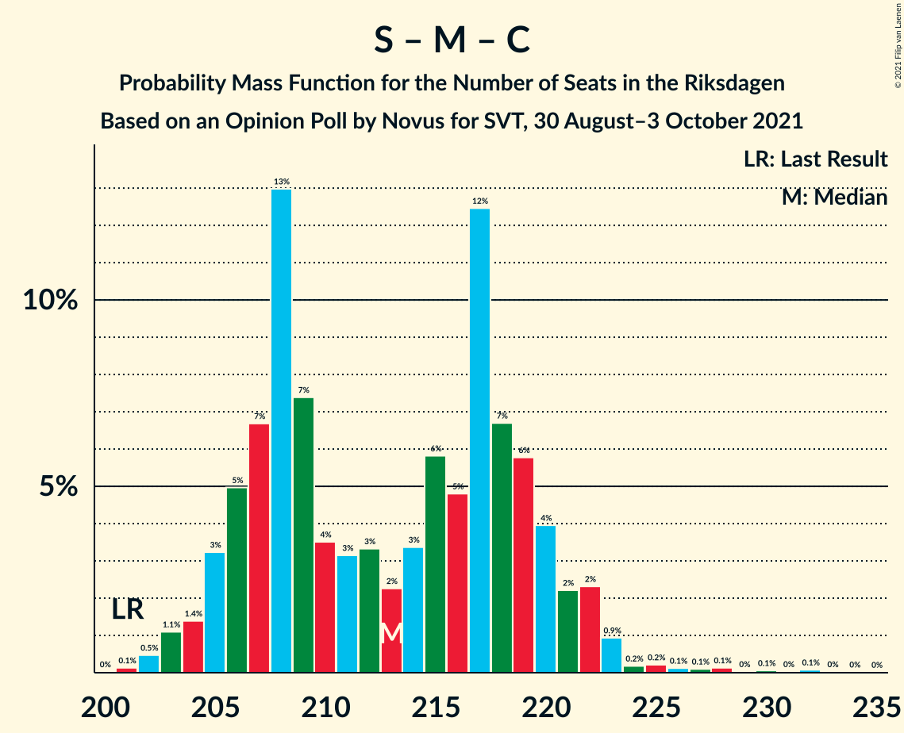
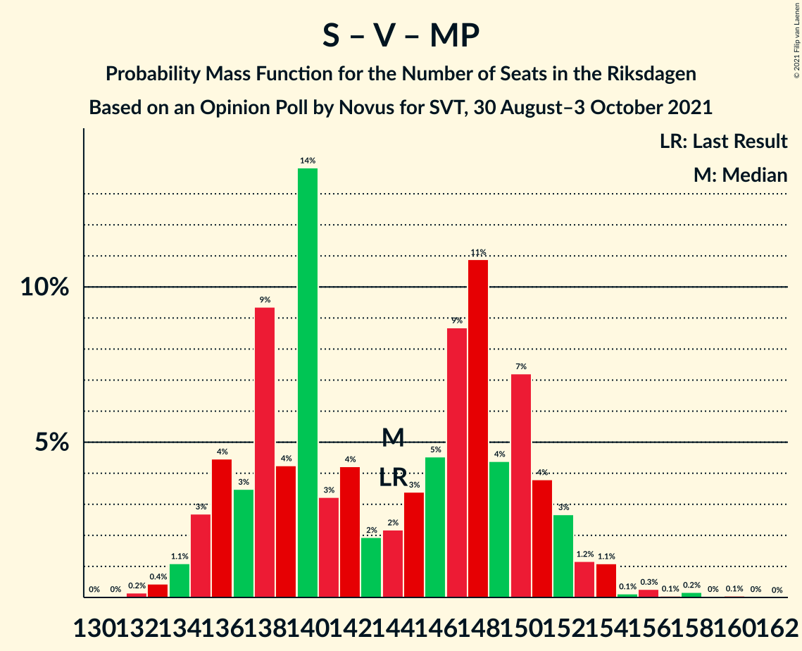
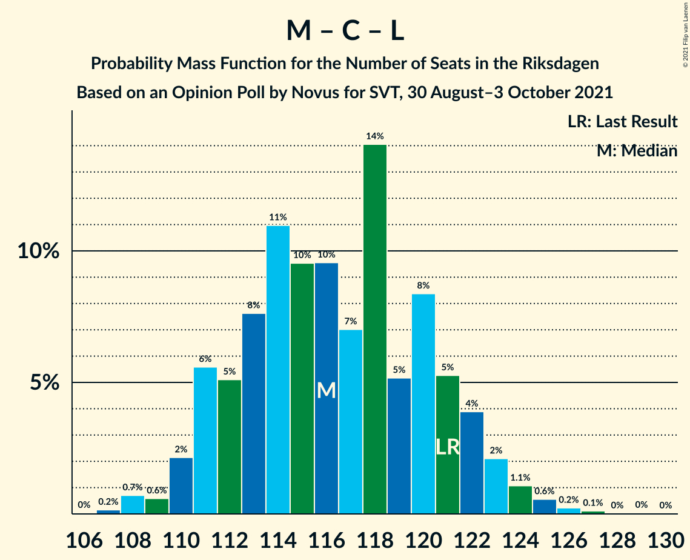

# Opinion Poll by Novus for SVT, 30 August–3 October 2021

<a href="#voting-intentions">Voting Intentions</a> | <a href="#seats">Seats</a> | <a href="#coalitions">Coalitions</a> | <a href="#technical-information">Technical Information</a>

## Voting Intentions

### Confidence Intervals

| Party | Last Result | Poll Result | 80% Confidence Interval | 90% Confidence Interval | 95% Confidence Interval | 99% Confidence Interval |
|:-----:|:-----------:|:-----------:|:-----------------------:|:-----------------------:|:-----------------------:|:-----------------------:|
| Sveriges socialdemokratiska arbetareparti | 28.3% | 26.0% | 25.2–26.8% |25.0–27.1% |24.8–27.3% |24.4–27.6% |
| Moderata samlingspartiet | 19.8% | 22.6% | 21.8–23.4% |21.6–23.6% |21.4–23.8% |21.1–24.2% |
| Sverigedemokraterna | 17.5% | 19.4% | 18.7–20.1% |18.5–20.4% |18.3–20.5% |18.0–20.9% |
| Vänsterpartiet | 8.0% | 10.6% | 10.1–11.2% |9.9–11.4% |9.8–11.5% |9.5–11.8% |
| Centerpartiet | 8.6% | 8.8% | 8.3–9.3% |8.2–9.5% |8.0–9.6% |7.8–9.9% |
| Kristdemokraterna | 6.3% | 4.6% | 4.2–5.0% |4.1–5.1% |4.0–5.2% |3.9–5.4% |
| Miljöpartiet de gröna | 4.4% | 4.0% | 3.7–4.4% |3.6–4.5% |3.5–4.6% |3.3–4.8% |
| Liberalerna | 5.5% | 2.6% | 2.3–2.9% |2.3–3.0% |2.2–3.1% |2.1–3.2% |

*Note:* The poll result column reflects the actual value used in the calculations. Published results may vary slightly, and in addition be rounded to fewer digits.

## Seats

### Confidence Intervals

| Party | Last Result | Median | 80% Confidence Interval | 90% Confidence Interval | 95% Confidence Interval | 99% Confidence Interval |
|:-----:|:-----------:|:------:|:-----------------------:|:-----------------------:|:-----------------------:|:-----------------------:|
| <a href="#sveriges-socialdemokratiska-arbetareparti">Sveriges socialdemokratiska arbetareparti</a> | 100 | 99 | 92–101 |91–102 |91–102 |89–105 |
| <a href="#moderata-samlingspartiet">Moderata samlingspartiet</a> | 70 | 85 | 82–86 |80–88 |80–89 |77–89 |
| <a href="#sverigedemokraterna">Sverigedemokraterna</a> | 62 | 74 | 70–75 |69–76 |68–77 |67–79 |
| <a href="#vänsterpartiet">Vänsterpartiet</a> | 28 | 41 | 38–41 |37–42 |36–44 |35–45 |
| <a href="#centerpartiet">Centerpartiet</a> | 31 | 33 | 31–34 |30–35 |30–36 |29–37 |
| <a href="#kristdemokraterna">Kristdemokraterna</a> | 22 | 17 | 16–18 |15–19 |15–20 |0–21 |
| <a href="#miljöpartiet-de-gröna">Miljöpartiet de gröna</a> | 16 | 0 | 0–16 |0–16 |0–17 |0–18 |
| <a href="#liberalerna">Liberalerna</a> | 20 | 0 | 0 |0 |0 |0 |

### Sveriges socialdemokratiska arbetareparti

*For a full overview of the results for this party, see the [Sveriges socialdemokratiska arbetareparti](party-sverigessocialdemokratiskaarbetareparti.html) page.*

| Number of Seats | Probability | Accumulated | Special Marks |
|:---------------:|:-----------:|:-----------:|:-------------:|
| 88 | 0.3% | 100% |  |
| 89 | 1.0% | 99.6% |  |
| 90 | 0.7% | 98.6% |  |
| 91 | 4% | 98% |  |
| 92 | 5% | 94% |  |
| 93 | 1.2% | 90% |  |
| 94 | 2% | 89% |  |
| 95 | 1.1% | 87% |  |
| 96 | 4% | 86% |  |
| 97 | 4% | 82% |  |
| 98 | 6% | 77% |  |
| 99 | 54% | 71% | Median |
| 100 | 6% | 17% | Last Result |
| 101 | 3% | 11% |  |
| 102 | 6% | 8% |  |
| 103 | 0.4% | 2% |  |
| 104 | 0.7% | 1.4% |  |
| 105 | 0.6% | 0.7% |  |
| 106 | 0% | 0.1% |  |
| 107 | 0.1% | 0.1% |  |
| 108 | 0% | 0% |  |

### Moderata samlingspartiet

*For a full overview of the results for this party, see the [Moderata samlingspartiet](party-moderatasamlingspartiet.html) page.*

| Number of Seats | Probability | Accumulated | Special Marks |
|:---------------:|:-----------:|:-----------:|:-------------:|
| 70 | 0% | 100% | Last Result |
| 71 | 0% | 100% |  |
| 72 | 0% | 100% |  |
| 73 | 0% | 100% |  |
| 74 | 0% | 100% |  |
| 75 | 0% | 100% |  |
| 76 | 0.1% | 100% |  |
| 77 | 2% | 99.9% |  |
| 78 | 0.3% | 98% |  |
| 79 | 0.3% | 98% |  |
| 80 | 4% | 98% |  |
| 81 | 4% | 94% |  |
| 82 | 7% | 90% |  |
| 83 | 3% | 83% |  |
| 84 | 3% | 81% |  |
| 85 | 61% | 78% | Median |
| 86 | 8% | 16% |  |
| 87 | 1.0% | 8% |  |
| 88 | 2% | 7% |  |
| 89 | 4% | 5% |  |
| 90 | 0.1% | 0.3% |  |
| 91 | 0.1% | 0.2% |  |
| 92 | 0% | 0.1% |  |
| 93 | 0% | 0.1% |  |
| 94 | 0% | 0% |  |

### Sverigedemokraterna

*For a full overview of the results for this party, see the [Sverigedemokraterna](party-sverigedemokraterna.html) page.*

| Number of Seats | Probability | Accumulated | Special Marks |
|:---------------:|:-----------:|:-----------:|:-------------:|
| 62 | 0% | 100% | Last Result |
| 63 | 0% | 100% |  |
| 64 | 0% | 100% |  |
| 65 | 0.2% | 100% |  |
| 66 | 0.2% | 99.8% |  |
| 67 | 1.3% | 99.6% |  |
| 68 | 1.0% | 98% |  |
| 69 | 5% | 97% |  |
| 70 | 4% | 92% |  |
| 71 | 6% | 88% |  |
| 72 | 10% | 82% |  |
| 73 | 10% | 72% |  |
| 74 | 49% | 62% | Median |
| 75 | 5% | 12% |  |
| 76 | 4% | 8% |  |
| 77 | 3% | 4% |  |
| 78 | 0.2% | 0.8% |  |
| 79 | 0.4% | 0.6% |  |
| 80 | 0.1% | 0.1% |  |
| 81 | 0% | 0.1% |  |
| 82 | 0% | 0% |  |

### Vänsterpartiet

*For a full overview of the results for this party, see the [Vänsterpartiet](party-vänsterpartiet.html) page.*

| Number of Seats | Probability | Accumulated | Special Marks |
|:---------------:|:-----------:|:-----------:|:-------------:|
| 28 | 0% | 100% | Last Result |
| 29 | 0% | 100% |  |
| 30 | 0% | 100% |  |
| 31 | 0% | 100% |  |
| 32 | 0% | 100% |  |
| 33 | 0% | 100% |  |
| 34 | 0.1% | 100% |  |
| 35 | 0.5% | 99.8% |  |
| 36 | 2% | 99.3% |  |
| 37 | 3% | 97% |  |
| 38 | 7% | 94% |  |
| 39 | 14% | 87% |  |
| 40 | 9% | 74% |  |
| 41 | 55% | 65% | Median |
| 42 | 5% | 10% |  |
| 43 | 2% | 4% |  |
| 44 | 2% | 3% |  |
| 45 | 0.7% | 0.9% |  |
| 46 | 0.1% | 0.2% |  |
| 47 | 0% | 0% |  |

### Centerpartiet

*For a full overview of the results for this party, see the [Centerpartiet](party-centerpartiet.html) page.*

| Number of Seats | Probability | Accumulated | Special Marks |
|:---------------:|:-----------:|:-----------:|:-------------:|
| 28 | 0.3% | 100% |  |
| 29 | 1.1% | 99.6% |  |
| 30 | 4% | 98.6% |  |
| 31 | 5% | 95% | Last Result |
| 32 | 13% | 89% |  |
| 33 | 59% | 76% | Median |
| 34 | 7% | 16% |  |
| 35 | 7% | 10% |  |
| 36 | 2% | 3% |  |
| 37 | 0.5% | 0.7% |  |
| 38 | 0.1% | 0.1% |  |
| 39 | 0% | 0% |  |

### Kristdemokraterna

*For a full overview of the results for this party, see the [Kristdemokraterna](party-kristdemokraterna.html) page.*

| Number of Seats | Probability | Accumulated | Special Marks |
|:---------------:|:-----------:|:-----------:|:-------------:|
| 0 | 0.9% | 100% |  |
| 1 | 0% | 99.1% |  |
| 2 | 0% | 99.1% |  |
| 3 | 0% | 99.1% |  |
| 4 | 0% | 99.1% |  |
| 5 | 0% | 99.1% |  |
| 6 | 0% | 99.1% |  |
| 7 | 0% | 99.1% |  |
| 8 | 0% | 99.1% |  |
| 9 | 0% | 99.1% |  |
| 10 | 0% | 99.1% |  |
| 11 | 0% | 99.1% |  |
| 12 | 0% | 99.1% |  |
| 13 | 0% | 99.1% |  |
| 14 | 0% | 99.1% |  |
| 15 | 4% | 99.1% |  |
| 16 | 13% | 95% |  |
| 17 | 61% | 82% | Median |
| 18 | 14% | 21% |  |
| 19 | 3% | 7% |  |
| 20 | 3% | 3% |  |
| 21 | 0.6% | 0.6% |  |
| 22 | 0% | 0% | Last Result |

### Miljöpartiet de gröna

*For a full overview of the results for this party, see the [Miljöpartiet de gröna](party-miljöpartietdegröna.html) page.*

| Number of Seats | Probability | Accumulated | Special Marks |
|:---------------:|:-----------:|:-----------:|:-------------:|
| 0 | 81% | 100% | Median |
| 1 | 0% | 19% |  |
| 2 | 0% | 19% |  |
| 3 | 0% | 19% |  |
| 4 | 0% | 19% |  |
| 5 | 0% | 19% |  |
| 6 | 0% | 19% |  |
| 7 | 0% | 19% |  |
| 8 | 0% | 19% |  |
| 9 | 0% | 19% |  |
| 10 | 0% | 19% |  |
| 11 | 0% | 19% |  |
| 12 | 0% | 19% |  |
| 13 | 0% | 19% |  |
| 14 | 0.2% | 19% |  |
| 15 | 7% | 19% |  |
| 16 | 8% | 12% | Last Result |
| 17 | 2% | 3% |  |
| 18 | 0.6% | 0.6% |  |
| 19 | 0% | 0% |  |

### Liberalerna

*For a full overview of the results for this party, see the [Liberalerna](party-liberalerna.html) page.*

| Number of Seats | Probability | Accumulated | Special Marks |
|:---------------:|:-----------:|:-----------:|:-------------:|
| 0 | 100% | 100% | Median |
| 1 | 0% | 0% |  |
| 2 | 0% | 0% |  |
| 3 | 0% | 0% |  |
| 4 | 0% | 0% |  |
| 5 | 0% | 0% |  |
| 6 | 0% | 0% |  |
| 7 | 0% | 0% |  |
| 8 | 0% | 0% |  |
| 9 | 0% | 0% |  |
| 10 | 0% | 0% |  |
| 11 | 0% | 0% |  |
| 12 | 0% | 0% |  |
| 13 | 0% | 0% |  |
| 14 | 0% | 0% |  |
| 15 | 0% | 0% |  |
| 16 | 0% | 0% |  |
| 17 | 0% | 0% |  |
| 18 | 0% | 0% |  |
| 19 | 0% | 0% |  |
| 20 | 0% | 0% | Last Result |

## Coalitions

### Confidence Intervals

| Coalition | Last Result | Median | Majority? | 80% Confidence Interval | 90% Confidence Interval | 95% Confidence Interval | 99% Confidence Interval |
|:---------:|:-----------:|:------:|:---------:|:-----------------------:|:-----------------------:|:-----------------------:|:-----------------------:|
| Sveriges socialdemokratiska arbetareparti – Moderata samlingspartiet – Centerpartiet | 201 | 217 | 100% | 208–220 | 206–221 | 205–221 | 203–224 |
| Sveriges socialdemokratiska arbetareparti – Moderata samlingspartiet | 170 | 184 | 93% | 177–187 | 173–188 | 173–189 | 171–192 |
| Sveriges socialdemokratiska arbetareparti – Vänsterpartiet – Centerpartiet – Miljöpartiet de gröna – Liberalerna | 195 | 173 | 28% | 171–179 | 170–181 | 170–183 | 169–188 |
| Moderata samlingspartiet – Sverigedemokraterna – Kristdemokraterna | 154 | 176 | 72% | 170–178 | 168–179 | 166–179 | 161–180 |
| Moderata samlingspartiet – Sverigedemokraterna | 132 | 159 | 0% | 153–161 | 151–162 | 149–162 | 147–165 |
| Sveriges socialdemokratiska arbetareparti – Vänsterpartiet – Miljöpartiet de gröna | 144 | 140 | 0% | 138–147 | 138–151 | 137–151 | 136–155 |
| Sveriges socialdemokratiska arbetareparti – Centerpartiet – Miljöpartiet de gröna – Liberalerna | 167 | 132 | 0% | 131–141 | 130–142 | 129–145 | 128–148 |
| Sveriges socialdemokratiska arbetareparti – Vänsterpartiet | 128 | 140 | 0% | 131–141 | 129–143 | 128–143 | 126–145 |
| Moderata samlingspartiet – Centerpartiet – Kristdemokraterna – Liberalerna | 143 | 135 | 0% | 130–138 | 128–138 | 127–138 | 123–140 |
| Moderata samlingspartiet – Centerpartiet – Kristdemokraterna | 123 | 135 | 0% | 130–138 | 128–138 | 127–138 | 123–140 |
| Moderata samlingspartiet – Centerpartiet – Liberalerna | 121 | 118 | 0% | 114–120 | 112–121 | 110–121 | 108–124 |
| Moderata samlingspartiet – Centerpartiet | 101 | 118 | 0% | 114–120 | 112–121 | 110–121 | 108–124 |
| Sveriges socialdemokratiska arbetareparti – Miljöpartiet de gröna | 116 | 99 | 0% | 98–108 | 97–111 | 96–113 | 95–116 |

### Sveriges socialdemokratiska arbetareparti – Moderata samlingspartiet – Centerpartiet

| Number of Seats | Probability | Accumulated | Special Marks |
|:---------------:|:-----------:|:-----------:|:-------------:|
| 201 | 0.3% | 100% | Last Result |
| 202 | 0.1% | 99.7% |  |
| 203 | 0.3% | 99.6% |  |
| 204 | 1.3% | 99.3% |  |
| 205 | 0.6% | 98% |  |
| 206 | 5% | 97% |  |
| 207 | 0.8% | 92% |  |
| 208 | 2% | 91% |  |
| 209 | 4% | 89% |  |
| 210 | 0.8% | 85% |  |
| 211 | 2% | 84% |  |
| 212 | 1.5% | 83% |  |
| 213 | 1.1% | 81% |  |
| 214 | 5% | 80% |  |
| 215 | 1.3% | 76% |  |
| 216 | 6% | 74% |  |
| 217 | 51% | 68% | Median |
| 218 | 2% | 17% |  |
| 219 | 3% | 15% |  |
| 220 | 5% | 12% |  |
| 221 | 5% | 7% |  |
| 222 | 0.9% | 2% |  |
| 223 | 0.9% | 1.4% |  |
| 224 | 0.1% | 0.6% |  |
| 225 | 0.1% | 0.4% |  |
| 226 | 0.1% | 0.4% |  |
| 227 | 0% | 0.3% |  |
| 228 | 0.1% | 0.2% |  |
| 229 | 0% | 0.1% |  |
| 230 | 0% | 0.1% |  |
| 231 | 0% | 0.1% |  |
| 232 | 0% | 0.1% |  |
| 233 | 0% | 0% |  |

### Sveriges socialdemokratiska arbetareparti – Moderata samlingspartiet

| Number of Seats | Probability | Accumulated | Special Marks |
|:---------------:|:-----------:|:-----------:|:-------------:|
| 169 | 0.1% | 100% |  |
| 170 | 0.3% | 99.9% | Last Result |
| 171 | 1.3% | 99.6% |  |
| 172 | 0.5% | 98% |  |
| 173 | 4% | 98% |  |
| 174 | 0.8% | 94% |  |
| 175 | 0.9% | 93% | Majority |
| 176 | 3% | 93% |  |
| 177 | 5% | 90% |  |
| 178 | 2% | 85% |  |
| 179 | 0.9% | 83% |  |
| 180 | 3% | 82% |  |
| 181 | 2% | 79% |  |
| 182 | 4% | 77% |  |
| 183 | 6% | 74% |  |
| 184 | 51% | 68% | Median |
| 185 | 4% | 16% |  |
| 186 | 2% | 13% |  |
| 187 | 1.1% | 11% |  |
| 188 | 7% | 10% |  |
| 189 | 1.1% | 3% |  |
| 190 | 0.7% | 2% |  |
| 191 | 0.2% | 0.9% |  |
| 192 | 0.4% | 0.7% |  |
| 193 | 0.2% | 0.3% |  |
| 194 | 0% | 0.1% |  |
| 195 | 0% | 0.1% |  |
| 196 | 0% | 0.1% |  |
| 197 | 0% | 0% |  |

### Sveriges socialdemokratiska arbetareparti – Vänsterpartiet – Centerpartiet – Miljöpartiet de gröna – Liberalerna

| Number of Seats | Probability | Accumulated | Special Marks |
|:---------------:|:-----------:|:-----------:|:-------------:|
| 165 | 0% | 100% |  |
| 166 | 0.1% | 99.9% |  |
| 167 | 0.1% | 99.9% |  |
| 168 | 0.2% | 99.8% |  |
| 169 | 2% | 99.6% |  |
| 170 | 6% | 98% |  |
| 171 | 4% | 92% |  |
| 172 | 2% | 88% |  |
| 173 | 54% | 86% | Median |
| 174 | 4% | 32% |  |
| 175 | 4% | 28% | Majority |
| 176 | 3% | 24% |  |
| 177 | 2% | 20% |  |
| 178 | 3% | 18% |  |
| 179 | 7% | 15% |  |
| 180 | 0.7% | 8% |  |
| 181 | 3% | 8% |  |
| 182 | 0.7% | 5% |  |
| 183 | 2% | 4% |  |
| 184 | 0.6% | 2% |  |
| 185 | 0.8% | 2% |  |
| 186 | 0.2% | 0.8% |  |
| 187 | 0% | 0.6% |  |
| 188 | 0.1% | 0.6% |  |
| 189 | 0.2% | 0.4% |  |
| 190 | 0% | 0.2% |  |
| 191 | 0% | 0.2% |  |
| 192 | 0.1% | 0.2% |  |
| 193 | 0% | 0% |  |
| 194 | 0% | 0% |  |
| 195 | 0% | 0% | Last Result |

### Moderata samlingspartiet – Sverigedemokraterna – Kristdemokraterna

| Number of Seats | Probability | Accumulated | Special Marks |
|:---------------:|:-----------:|:-----------:|:-------------:|
| 154 | 0% | 100% | Last Result |
| 155 | 0% | 100% |  |
| 156 | 0% | 100% |  |
| 157 | 0.1% | 100% |  |
| 158 | 0% | 99.8% |  |
| 159 | 0% | 99.8% |  |
| 160 | 0.2% | 99.8% |  |
| 161 | 0.1% | 99.6% |  |
| 162 | 0% | 99.4% |  |
| 163 | 0.2% | 99.4% |  |
| 164 | 0.8% | 99.2% |  |
| 165 | 0.6% | 98% |  |
| 166 | 2% | 98% |  |
| 167 | 0.7% | 96% |  |
| 168 | 3% | 95% |  |
| 169 | 0.7% | 92% |  |
| 170 | 7% | 92% |  |
| 171 | 3% | 85% |  |
| 172 | 2% | 82% |  |
| 173 | 3% | 80% |  |
| 174 | 4% | 76% |  |
| 175 | 4% | 72% | Majority |
| 176 | 54% | 68% | Median |
| 177 | 2% | 14% |  |
| 178 | 4% | 12% |  |
| 179 | 6% | 8% |  |
| 180 | 2% | 2% |  |
| 181 | 0.2% | 0.4% |  |
| 182 | 0.1% | 0.2% |  |
| 183 | 0.1% | 0.1% |  |
| 184 | 0% | 0.1% |  |
| 185 | 0% | 0% |  |

### Moderata samlingspartiet – Sverigedemokraterna

| Number of Seats | Probability | Accumulated | Special Marks |
|:---------------:|:-----------:|:-----------:|:-------------:|
| 132 | 0% | 100% | Last Result |
| 133 | 0% | 100% |  |
| 134 | 0% | 100% |  |
| 135 | 0% | 100% |  |
| 136 | 0% | 100% |  |
| 137 | 0% | 100% |  |
| 138 | 0% | 100% |  |
| 139 | 0% | 100% |  |
| 140 | 0% | 100% |  |
| 141 | 0% | 100% |  |
| 142 | 0% | 100% |  |
| 143 | 0% | 100% |  |
| 144 | 0% | 100% |  |
| 145 | 0% | 99.9% |  |
| 146 | 0.2% | 99.9% |  |
| 147 | 0.7% | 99.7% |  |
| 148 | 1.4% | 99.1% |  |
| 149 | 0.3% | 98% |  |
| 150 | 1.4% | 97% |  |
| 151 | 3% | 96% |  |
| 152 | 0.5% | 93% |  |
| 153 | 3% | 92% |  |
| 154 | 5% | 89% |  |
| 155 | 5% | 84% |  |
| 156 | 0.1% | 79% |  |
| 157 | 6% | 79% |  |
| 158 | 12% | 73% |  |
| 159 | 50% | 61% | Median |
| 160 | 0.3% | 11% |  |
| 161 | 3% | 11% |  |
| 162 | 8% | 8% |  |
| 163 | 0.1% | 0.7% |  |
| 164 | 0.1% | 0.6% |  |
| 165 | 0.3% | 0.5% |  |
| 166 | 0.1% | 0.2% |  |
| 167 | 0% | 0.1% |  |
| 168 | 0% | 0.1% |  |
| 169 | 0% | 0.1% |  |
| 170 | 0% | 0% |  |

### Sveriges socialdemokratiska arbetareparti – Vänsterpartiet – Miljöpartiet de gröna

| Number of Seats | Probability | Accumulated | Special Marks |
|:---------------:|:-----------:|:-----------:|:-------------:|
| 132 | 0% | 100% |  |
| 133 | 0% | 99.9% |  |
| 134 | 0% | 99.9% |  |
| 135 | 0.3% | 99.9% |  |
| 136 | 2% | 99.6% |  |
| 137 | 2% | 98% |  |
| 138 | 6% | 95% |  |
| 139 | 3% | 89% |  |
| 140 | 55% | 86% | Median |
| 141 | 6% | 32% |  |
| 142 | 3% | 25% |  |
| 143 | 4% | 23% |  |
| 144 | 3% | 19% | Last Result |
| 145 | 0.8% | 16% |  |
| 146 | 3% | 15% |  |
| 147 | 3% | 11% |  |
| 148 | 0.8% | 9% |  |
| 149 | 1.4% | 8% |  |
| 150 | 1.3% | 6% |  |
| 151 | 3% | 5% |  |
| 152 | 0.4% | 2% |  |
| 153 | 1.1% | 2% |  |
| 154 | 0.3% | 0.9% |  |
| 155 | 0.1% | 0.6% |  |
| 156 | 0.2% | 0.5% |  |
| 157 | 0% | 0.3% |  |
| 158 | 0% | 0.2% |  |
| 159 | 0.1% | 0.2% |  |
| 160 | 0% | 0.2% |  |
| 161 | 0.1% | 0.2% |  |
| 162 | 0% | 0% |  |

### Sveriges socialdemokratiska arbetareparti – Centerpartiet – Miljöpartiet de gröna – Liberalerna

| Number of Seats | Probability | Accumulated | Special Marks |
|:---------------:|:-----------:|:-----------:|:-------------:|
| 126 | 0.1% | 100% |  |
| 127 | 0.3% | 99.9% |  |
| 128 | 0.5% | 99.6% |  |
| 129 | 4% | 99.1% |  |
| 130 | 2% | 95% |  |
| 131 | 7% | 93% |  |
| 132 | 51% | 87% | Median |
| 133 | 3% | 35% |  |
| 134 | 3% | 32% |  |
| 135 | 7% | 29% |  |
| 136 | 3% | 23% |  |
| 137 | 1.3% | 20% |  |
| 138 | 1.0% | 18% |  |
| 139 | 2% | 17% |  |
| 140 | 6% | 16% |  |
| 141 | 3% | 10% |  |
| 142 | 3% | 7% |  |
| 143 | 1.2% | 5% |  |
| 144 | 0.9% | 3% |  |
| 145 | 0.3% | 3% |  |
| 146 | 0.9% | 2% |  |
| 147 | 0.7% | 1.4% |  |
| 148 | 0.3% | 0.7% |  |
| 149 | 0.3% | 0.4% |  |
| 150 | 0.1% | 0.1% |  |
| 151 | 0% | 0.1% |  |
| 152 | 0% | 0% |  |
| 153 | 0% | 0% |  |
| 154 | 0% | 0% |  |
| 155 | 0% | 0% |  |
| 156 | 0% | 0% |  |
| 157 | 0% | 0% |  |
| 158 | 0% | 0% |  |
| 159 | 0% | 0% |  |
| 160 | 0% | 0% |  |
| 161 | 0% | 0% |  |
| 162 | 0% | 0% |  |
| 163 | 0% | 0% |  |
| 164 | 0% | 0% |  |
| 165 | 0% | 0% |  |
| 166 | 0% | 0% |  |
| 167 | 0% | 0% | Last Result |

### Sveriges socialdemokratiska arbetareparti – Vänsterpartiet

| Number of Seats | Probability | Accumulated | Special Marks |
|:---------------:|:-----------:|:-----------:|:-------------:|
| 125 | 0.1% | 100% |  |
| 126 | 0.6% | 99.9% |  |
| 127 | 0.7% | 99.3% |  |
| 128 | 2% | 98.6% | Last Result |
| 129 | 1.5% | 96% |  |
| 130 | 3% | 95% |  |
| 131 | 3% | 92% |  |
| 132 | 0.9% | 89% |  |
| 133 | 0.2% | 88% |  |
| 134 | 0.7% | 88% |  |
| 135 | 2% | 87% |  |
| 136 | 4% | 86% |  |
| 137 | 3% | 81% |  |
| 138 | 7% | 78% |  |
| 139 | 3% | 71% |  |
| 140 | 55% | 68% | Median |
| 141 | 6% | 13% |  |
| 142 | 2% | 8% |  |
| 143 | 3% | 5% |  |
| 144 | 1.3% | 2% |  |
| 145 | 0.3% | 0.7% |  |
| 146 | 0.1% | 0.4% |  |
| 147 | 0% | 0.3% |  |
| 148 | 0.1% | 0.3% |  |
| 149 | 0.1% | 0.2% |  |
| 150 | 0% | 0.1% |  |
| 151 | 0% | 0% |  |

### Moderata samlingspartiet – Centerpartiet – Kristdemokraterna – Liberalerna

| Number of Seats | Probability | Accumulated | Special Marks |
|:---------------:|:-----------:|:-----------:|:-------------:|
| 114 | 0.1% | 100% |  |
| 115 | 0% | 99.8% |  |
| 116 | 0% | 99.8% |  |
| 117 | 0% | 99.8% |  |
| 118 | 0% | 99.8% |  |
| 119 | 0% | 99.8% |  |
| 120 | 0.2% | 99.8% |  |
| 121 | 0% | 99.6% |  |
| 122 | 0% | 99.6% |  |
| 123 | 0.1% | 99.5% |  |
| 124 | 0.8% | 99.4% |  |
| 125 | 0.4% | 98.7% |  |
| 126 | 0.3% | 98% |  |
| 127 | 2% | 98% |  |
| 128 | 2% | 96% |  |
| 129 | 1.3% | 94% |  |
| 130 | 3% | 93% |  |
| 131 | 2% | 90% |  |
| 132 | 4% | 88% |  |
| 133 | 6% | 83% |  |
| 134 | 3% | 78% |  |
| 135 | 53% | 75% | Median |
| 136 | 6% | 22% |  |
| 137 | 6% | 16% |  |
| 138 | 9% | 11% |  |
| 139 | 1.4% | 2% |  |
| 140 | 0.4% | 0.5% |  |
| 141 | 0.1% | 0.2% |  |
| 142 | 0% | 0.1% |  |
| 143 | 0% | 0.1% | Last Result |
| 144 | 0% | 0% |  |

### Moderata samlingspartiet – Centerpartiet – Kristdemokraterna

| Number of Seats | Probability | Accumulated | Special Marks |
|:---------------:|:-----------:|:-----------:|:-------------:|
| 114 | 0.1% | 100% |  |
| 115 | 0% | 99.8% |  |
| 116 | 0% | 99.8% |  |
| 117 | 0% | 99.8% |  |
| 118 | 0% | 99.8% |  |
| 119 | 0% | 99.8% |  |
| 120 | 0.2% | 99.8% |  |
| 121 | 0% | 99.6% |  |
| 122 | 0% | 99.6% |  |
| 123 | 0.1% | 99.5% | Last Result |
| 124 | 0.8% | 99.4% |  |
| 125 | 0.4% | 98.7% |  |
| 126 | 0.3% | 98% |  |
| 127 | 2% | 98% |  |
| 128 | 2% | 96% |  |
| 129 | 1.3% | 94% |  |
| 130 | 3% | 93% |  |
| 131 | 2% | 90% |  |
| 132 | 4% | 88% |  |
| 133 | 6% | 83% |  |
| 134 | 3% | 78% |  |
| 135 | 53% | 75% | Median |
| 136 | 6% | 22% |  |
| 137 | 6% | 16% |  |
| 138 | 9% | 11% |  |
| 139 | 1.4% | 2% |  |
| 140 | 0.4% | 0.5% |  |
| 141 | 0.1% | 0.2% |  |
| 142 | 0% | 0.1% |  |
| 143 | 0% | 0.1% |  |
| 144 | 0% | 0% |  |

### Moderata samlingspartiet – Centerpartiet – Liberalerna

| Number of Seats | Probability | Accumulated | Special Marks |
|:---------------:|:-----------:|:-----------:|:-------------:|
| 107 | 0.3% | 100% |  |
| 108 | 0.7% | 99.7% |  |
| 109 | 0.3% | 99.0% |  |
| 110 | 3% | 98.6% |  |
| 111 | 0.3% | 95% |  |
| 112 | 1.0% | 95% |  |
| 113 | 1.1% | 94% |  |
| 114 | 3% | 93% |  |
| 115 | 5% | 90% |  |
| 116 | 5% | 85% |  |
| 117 | 8% | 80% |  |
| 118 | 52% | 72% | Median |
| 119 | 7% | 20% |  |
| 120 | 5% | 13% |  |
| 121 | 5% | 7% | Last Result |
| 122 | 1.3% | 2% |  |
| 123 | 0.1% | 0.6% |  |
| 124 | 0.3% | 0.5% |  |
| 125 | 0% | 0.2% |  |
| 126 | 0.1% | 0.1% |  |
| 127 | 0% | 0.1% |  |
| 128 | 0% | 0% |  |

### Moderata samlingspartiet – Centerpartiet

| Number of Seats | Probability | Accumulated | Special Marks |
|:---------------:|:-----------:|:-----------:|:-------------:|
| 101 | 0% | 100% | Last Result |
| 102 | 0% | 100% |  |
| 103 | 0% | 100% |  |
| 104 | 0% | 100% |  |
| 105 | 0% | 100% |  |
| 106 | 0% | 100% |  |
| 107 | 0.3% | 100% |  |
| 108 | 0.7% | 99.7% |  |
| 109 | 0.3% | 99.0% |  |
| 110 | 3% | 98.6% |  |
| 111 | 0.3% | 95% |  |
| 112 | 1.0% | 95% |  |
| 113 | 1.1% | 94% |  |
| 114 | 3% | 93% |  |
| 115 | 5% | 90% |  |
| 116 | 5% | 85% |  |
| 117 | 8% | 80% |  |
| 118 | 52% | 72% | Median |
| 119 | 7% | 20% |  |
| 120 | 5% | 13% |  |
| 121 | 5% | 7% |  |
| 122 | 1.3% | 2% |  |
| 123 | 0.1% | 0.6% |  |
| 124 | 0.3% | 0.5% |  |
| 125 | 0% | 0.2% |  |
| 126 | 0.1% | 0.1% |  |
| 127 | 0% | 0.1% |  |
| 128 | 0% | 0% |  |

### Sveriges socialdemokratiska arbetareparti – Miljöpartiet de gröna

| Number of Seats | Probability | Accumulated | Special Marks |
|:---------------:|:-----------:|:-----------:|:-------------:|
| 94 | 0.2% | 100% |  |
| 95 | 0.4% | 99.7% |  |
| 96 | 2% | 99.3% |  |
| 97 | 4% | 97% |  |
| 98 | 5% | 93% |  |
| 99 | 54% | 88% | Median |
| 100 | 5% | 35% |  |
| 101 | 3% | 30% |  |
| 102 | 6% | 27% |  |
| 103 | 0.7% | 21% |  |
| 104 | 1.3% | 20% |  |
| 105 | 0.9% | 19% |  |
| 106 | 0.9% | 18% |  |
| 107 | 3% | 17% |  |
| 108 | 4% | 13% |  |
| 109 | 2% | 9% |  |
| 110 | 0.6% | 7% |  |
| 111 | 3% | 7% |  |
| 112 | 1.0% | 4% |  |
| 113 | 1.1% | 3% |  |
| 114 | 0.4% | 2% |  |
| 115 | 1.0% | 2% |  |
| 116 | 0.2% | 0.5% | Last Result |
| 117 | 0.2% | 0.3% |  |
| 118 | 0.1% | 0.1% |  |
| 119 | 0% | 0% |  |

## Technical Information

### Opinion Poll

+ **Polling firm:** Novus
+ **Commissioner(s):** SVT
+ **Fieldwork period:** 30 August–3 October 2021

### Calculations

+ **Sample size:** 4922
+ **Simulations done:** 131,072
+ **Error estimate:** 0.75%

