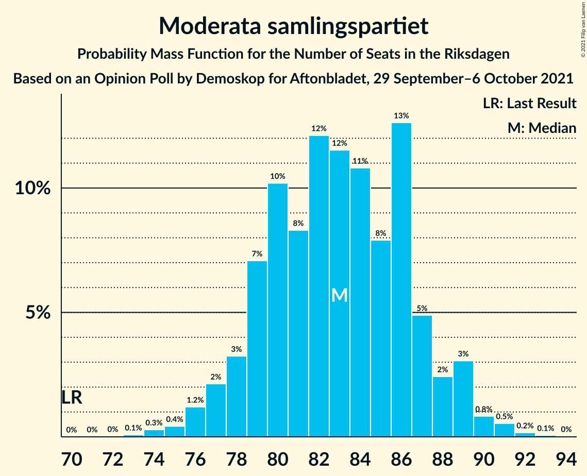
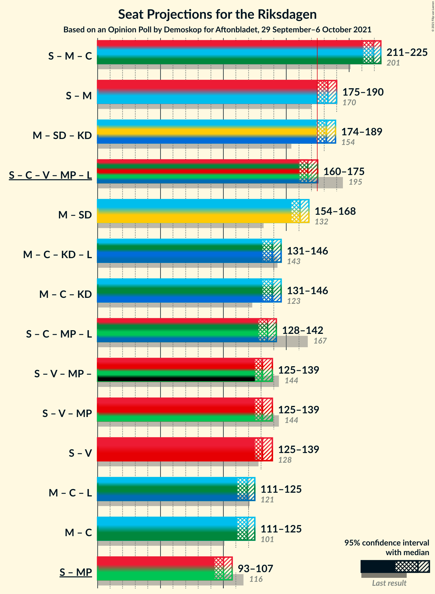
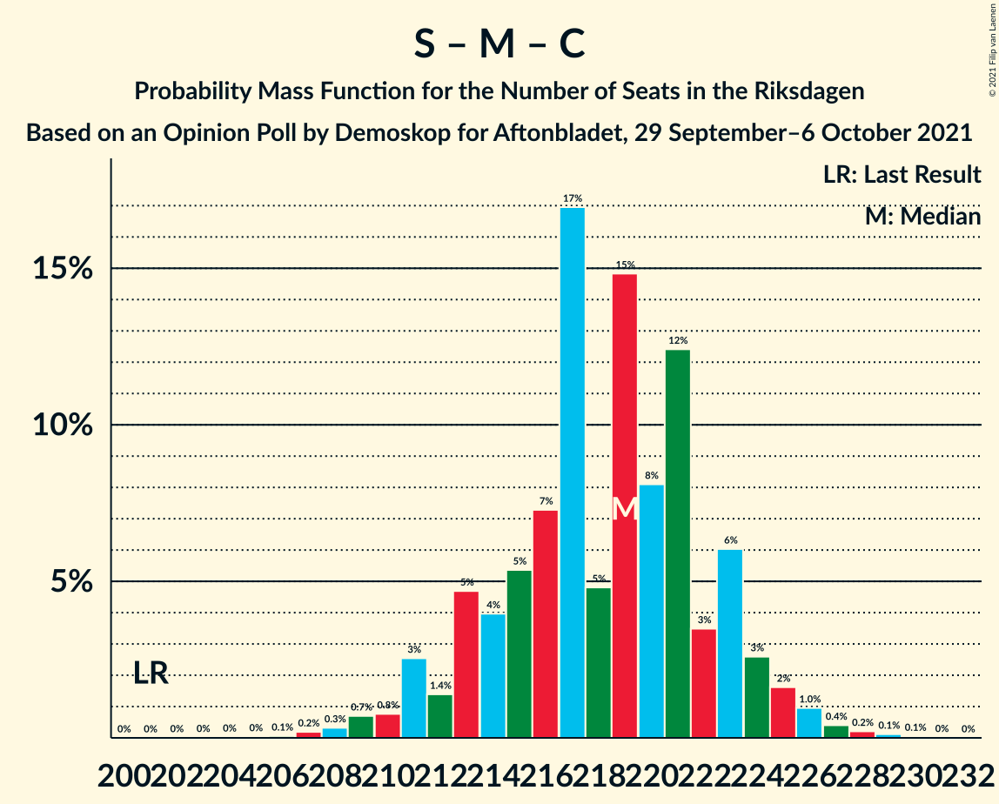
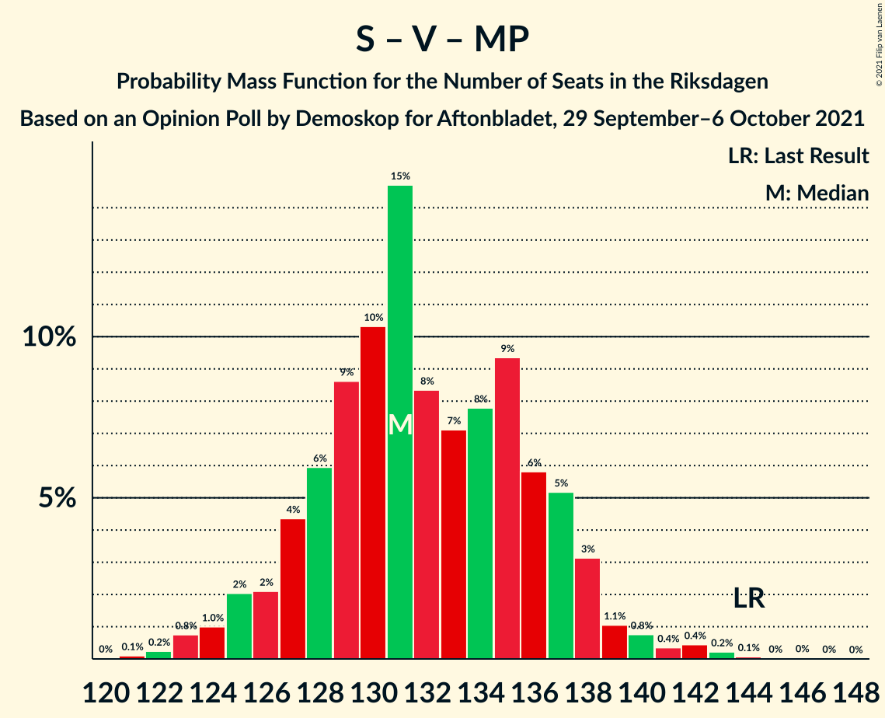

# Opinion Poll by Demoskop for Aftonbladet, 29 September–6 October 2021

<a href="#voting-intentions">Voting Intentions</a> | <a href="#seats">Seats</a> | <a href="#coalitions">Coalitions</a> | <a href="#technical-information">Technical Information</a>

## Voting Intentions

### Confidence Intervals

| Party | Last Result | Poll Result | 80% Confidence Interval | 90% Confidence Interval | 95% Confidence Interval | 99% Confidence Interval |
|:-----:|:-----------:|:-----------:|:-----------------------:|:-----------------------:|:-----------------------:|:-----------------------:|
| Sveriges socialdemokratiska arbetareparti | 28.3% | 26.7% | 25.6–27.9% |25.3–28.2% |25.0–28.5% |24.5–29.1% |
| Moderata samlingspartiet | 19.8% | 22.2% | 21.2–23.3% |20.9–23.7% |20.6–23.9% |20.1–24.5% |
| Sverigedemokraterna | 17.5% | 20.9% | 19.9–22.0% |19.6–22.3% |19.4–22.6% |18.9–23.1% |
| Centerpartiet | 8.6% | 9.5% | 8.8–10.3% |8.6–10.6% |8.4–10.8% |8.1–11.2% |
| Vänsterpartiet | 8.0% | 8.6% | 7.9–9.4% |7.7–9.6% |7.5–9.8% |7.2–10.2% |
| Kristdemokraterna | 6.3% | 5.5% | 4.9–6.2% |4.8–6.3% |4.6–6.5% |4.4–6.8% |
| Miljöpartiet de gröna | 4.4% | 3.0% | 2.6–3.5% |2.5–3.7% |2.4–3.8% |2.2–4.0% |
| Liberalerna | 5.5% | 2.7% | 2.3–3.2% |2.2–3.3% |2.1–3.4% |1.9–3.7% |

*Note:* The poll result column reflects the actual value used in the calculations. Published results may vary slightly, and in addition be rounded to fewer digits.

## Seats

### Confidence Intervals

| Party | Last Result | Median | 80% Confidence Interval | 90% Confidence Interval | 95% Confidence Interval | 99% Confidence Interval |
|:-----:|:-----------:|:------:|:-----------------------:|:-----------------------:|:-----------------------:|:-----------------------:|
| <a href="#sveriges-socialdemokratiska-arbetareparti">Sveriges socialdemokratiska arbetareparti</a> | 100 | 100 | 96–104 |94–105 |93–106 |91–109 |
| <a href="#moderata-samlingspartiet">Moderata samlingspartiet</a> | 70 | 83 | 79–87 |78–88 |77–89 |75–91 |
| <a href="#sverigedemokraterna">Sverigedemokraterna</a> | 62 | 78 | 74–82 |73–83 |72–84 |70–86 |
| <a href="#centerpartiet">Centerpartiet</a> | 31 | 35 | 33–38 |32–40 |31–40 |30–42 |
| <a href="#vänsterpartiet">Vänsterpartiet</a> | 28 | 32 | 29–35 |29–36 |28–36 |27–38 |
| <a href="#kristdemokraterna">Kristdemokraterna</a> | 22 | 21 | 18–23 |18–24 |17–24 |16–25 |
| <a href="#miljöpartiet-de-gröna">Miljöpartiet de gröna</a> | 16 | 0 | 0 |0 |0 |0–15 |
| <a href="#liberalerna">Liberalerna</a> | 20 | 0 | 0 |0 |0 |0 |

### Sveriges socialdemokratiska arbetareparti

*For a full overview of the results for this party, see the [Sveriges socialdemokratiska arbetareparti](party-sverigessocialdemokratiskaarbetareparti.html) page.*

| Number of Seats | Probability | Accumulated | Special Marks |
|:---------------:|:-----------:|:-----------:|:-------------:|
| 89 | 0.1% | 100% |  |
| 90 | 0.2% | 99.9% |  |
| 91 | 0.3% | 99.7% |  |
| 92 | 0.6% | 99.3% |  |
| 93 | 2% | 98.7% |  |
| 94 | 3% | 97% |  |
| 95 | 4% | 94% |  |
| 96 | 7% | 90% |  |
| 97 | 8% | 83% |  |
| 98 | 11% | 75% |  |
| 99 | 8% | 64% |  |
| 100 | 16% | 56% | Last Result, Median |
| 101 | 10% | 40% |  |
| 102 | 10% | 30% |  |
| 103 | 6% | 20% |  |
| 104 | 8% | 15% |  |
| 105 | 3% | 7% |  |
| 106 | 1.3% | 4% |  |
| 107 | 1.0% | 2% |  |
| 108 | 0.8% | 1.3% |  |
| 109 | 0.4% | 0.6% |  |
| 110 | 0.1% | 0.1% |  |
| 111 | 0% | 0.1% |  |
| 112 | 0% | 0% |  |

### Moderata samlingspartiet

*For a full overview of the results for this party, see the [Moderata samlingspartiet](party-moderatasamlingspartiet.html) page.*

| Number of Seats | Probability | Accumulated | Special Marks |
|:---------------:|:-----------:|:-----------:|:-------------:|
| 70 | 0% | 100% | Last Result |
| 71 | 0% | 100% |  |
| 72 | 0% | 100% |  |
| 73 | 0.1% | 100% |  |
| 74 | 0.3% | 99.9% |  |
| 75 | 0.4% | 99.6% |  |
| 76 | 1.2% | 99.2% |  |
| 77 | 2% | 98% |  |
| 78 | 3% | 96% |  |
| 79 | 7% | 93% |  |
| 80 | 10% | 86% |  |
| 81 | 8% | 75% |  |
| 82 | 12% | 67% |  |
| 83 | 12% | 55% | Median |
| 84 | 11% | 43% |  |
| 85 | 8% | 33% |  |
| 86 | 13% | 25% |  |
| 87 | 5% | 12% |  |
| 88 | 2% | 7% |  |
| 89 | 3% | 5% |  |
| 90 | 0.8% | 2% |  |
| 91 | 0.5% | 0.8% |  |
| 92 | 0.2% | 0.3% |  |
| 93 | 0.1% | 0.1% |  |
| 94 | 0% | 0% |  |

### Sverigedemokraterna

*For a full overview of the results for this party, see the [Sverigedemokraterna](party-sverigedemokraterna.html) page.*

| Number of Seats | Probability | Accumulated | Special Marks |
|:---------------:|:-----------:|:-----------:|:-------------:|
| 62 | 0% | 100% | Last Result |
| 63 | 0% | 100% |  |
| 64 | 0% | 100% |  |
| 65 | 0% | 100% |  |
| 66 | 0% | 100% |  |
| 67 | 0% | 100% |  |
| 68 | 0% | 100% |  |
| 69 | 0.1% | 99.9% |  |
| 70 | 0.5% | 99.8% |  |
| 71 | 1.1% | 99.3% |  |
| 72 | 2% | 98% |  |
| 73 | 2% | 96% |  |
| 74 | 4% | 94% |  |
| 75 | 8% | 89% |  |
| 76 | 18% | 82% |  |
| 77 | 11% | 64% |  |
| 78 | 14% | 53% | Median |
| 79 | 7% | 39% |  |
| 80 | 8% | 31% |  |
| 81 | 8% | 24% |  |
| 82 | 7% | 16% |  |
| 83 | 4% | 9% |  |
| 84 | 2% | 4% |  |
| 85 | 1.2% | 2% |  |
| 86 | 0.7% | 1.0% |  |
| 87 | 0.2% | 0.3% |  |
| 88 | 0.1% | 0.1% |  |
| 89 | 0% | 0% |  |

### Centerpartiet

*For a full overview of the results for this party, see the [Centerpartiet](party-centerpartiet.html) page.*

| Number of Seats | Probability | Accumulated | Special Marks |
|:---------------:|:-----------:|:-----------:|:-------------:|
| 29 | 0.3% | 100% |  |
| 30 | 0.5% | 99.7% |  |
| 31 | 2% | 99.2% | Last Result |
| 32 | 3% | 97% |  |
| 33 | 15% | 94% |  |
| 34 | 12% | 79% |  |
| 35 | 22% | 67% | Median |
| 36 | 13% | 45% |  |
| 37 | 14% | 33% |  |
| 38 | 9% | 19% |  |
| 39 | 4% | 10% |  |
| 40 | 5% | 6% |  |
| 41 | 0.4% | 1.1% |  |
| 42 | 0.6% | 0.7% |  |
| 43 | 0.1% | 0.1% |  |
| 44 | 0% | 0.1% |  |
| 45 | 0% | 0% |  |

### Vänsterpartiet

*For a full overview of the results for this party, see the [Vänsterpartiet](party-vänsterpartiet.html) page.*

| Number of Seats | Probability | Accumulated | Special Marks |
|:---------------:|:-----------:|:-----------:|:-------------:|
| 26 | 0.2% | 100% |  |
| 27 | 0.9% | 99.7% |  |
| 28 | 3% | 98.8% | Last Result |
| 29 | 7% | 96% |  |
| 30 | 11% | 89% |  |
| 31 | 20% | 78% |  |
| 32 | 17% | 57% | Median |
| 33 | 17% | 41% |  |
| 34 | 12% | 24% |  |
| 35 | 5% | 12% |  |
| 36 | 4% | 7% |  |
| 37 | 2% | 2% |  |
| 38 | 0.5% | 0.8% |  |
| 39 | 0.2% | 0.2% |  |
| 40 | 0.1% | 0.1% |  |
| 41 | 0% | 0% |  |

### Kristdemokraterna

*For a full overview of the results for this party, see the [Kristdemokraterna](party-kristdemokraterna.html) page.*

| Number of Seats | Probability | Accumulated | Special Marks |
|:---------------:|:-----------:|:-----------:|:-------------:|
| 15 | 0% | 100% |  |
| 16 | 0.5% | 99.9% |  |
| 17 | 3% | 99.4% |  |
| 18 | 9% | 97% |  |
| 19 | 16% | 88% |  |
| 20 | 19% | 72% |  |
| 21 | 22% | 53% | Median |
| 22 | 14% | 30% | Last Result |
| 23 | 10% | 16% |  |
| 24 | 4% | 6% |  |
| 25 | 1.0% | 1.3% |  |
| 26 | 0.2% | 0.3% |  |
| 27 | 0.1% | 0.1% |  |
| 28 | 0% | 0% |  |

### Miljöpartiet de gröna

*For a full overview of the results for this party, see the [Miljöpartiet de gröna](party-miljöpartietdegröna.html) page.*

| Number of Seats | Probability | Accumulated | Special Marks |
|:---------------:|:-----------:|:-----------:|:-------------:|
| 0 | 99.4% | 100% | Median |
| 1 | 0% | 0.6% |  |
| 2 | 0% | 0.6% |  |
| 3 | 0% | 0.6% |  |
| 4 | 0% | 0.6% |  |
| 5 | 0% | 0.6% |  |
| 6 | 0% | 0.6% |  |
| 7 | 0% | 0.6% |  |
| 8 | 0% | 0.6% |  |
| 9 | 0% | 0.6% |  |
| 10 | 0% | 0.6% |  |
| 11 | 0% | 0.6% |  |
| 12 | 0% | 0.6% |  |
| 13 | 0% | 0.6% |  |
| 14 | 0.1% | 0.6% |  |
| 15 | 0.5% | 0.5% |  |
| 16 | 0.1% | 0.1% | Last Result |
| 17 | 0% | 0% |  |

### Liberalerna

*For a full overview of the results for this party, see the [Liberalerna](party-liberalerna.html) page.*

| Number of Seats | Probability | Accumulated | Special Marks |
|:---------------:|:-----------:|:-----------:|:-------------:|
| 0 | 100% | 100% | Median |
| 1 | 0% | 0% |  |
| 2 | 0% | 0% |  |
| 3 | 0% | 0% |  |
| 4 | 0% | 0% |  |
| 5 | 0% | 0% |  |
| 6 | 0% | 0% |  |
| 7 | 0% | 0% |  |
| 8 | 0% | 0% |  |
| 9 | 0% | 0% |  |
| 10 | 0% | 0% |  |
| 11 | 0% | 0% |  |
| 12 | 0% | 0% |  |
| 13 | 0% | 0% |  |
| 14 | 0% | 0% |  |
| 15 | 0% | 0% |  |
| 16 | 0% | 0% |  |
| 17 | 0% | 0% |  |
| 18 | 0% | 0% |  |
| 19 | 0% | 0% |  |
| 20 | 0% | 0% | Last Result |

## Coalitions

### Confidence Intervals

| Coalition | Last Result | Median | Majority? | 80% Confidence Interval | 90% Confidence Interval | 95% Confidence Interval | 99% Confidence Interval |
|:---------:|:-----------:|:------:|:---------:|:-----------------------:|:-----------------------:|:-----------------------:|:-----------------------:|
| Sveriges socialdemokratiska arbetareparti – Moderata samlingspartiet – Centerpartiet | 201 | 219 | 100% | 213–223 | 212–224 | 211–225 | 208–227 |
| Sveriges socialdemokratiska arbetareparti – Moderata samlingspartiet | 170 | 183 | 98% | 178–187 | 177–188 | 175–190 | 173–192 |
| Moderata samlingspartiet – Sverigedemokraterna – Kristdemokraterna | 154 | 182 | 96% | 176–186 | 175–188 | 174–189 | 172–191 |
| Sveriges socialdemokratiska arbetareparti – Centerpartiet – Vänsterpartiet – Miljöpartiet de gröna – Liberalerna | 195 | 167 | 4% | 163–173 | 161–174 | 160–175 | 158–177 |
| Moderata samlingspartiet – Sverigedemokraterna | 132 | 161 | 0% | 156–166 | 155–167 | 154–168 | 151–171 |
| Moderata samlingspartiet – Centerpartiet – Kristdemokraterna – Liberalerna | 143 | 139 | 0% | 134–144 | 133–145 | 131–146 | 129–149 |
| Moderata samlingspartiet – Centerpartiet – Kristdemokraterna | 123 | 139 | 0% | 134–144 | 133–145 | 131–146 | 129–149 |
| Sveriges socialdemokratiska arbetareparti – Centerpartiet – Miljöpartiet de gröna – Liberalerna | 167 | 135 | 0% | 130–140 | 129–141 | 128–142 | 126–145 |
| Sveriges socialdemokratiska arbetareparti – Vänsterpartiet – Miljöpartiet de gröna | 144 | 131 | 0% | 127–137 | 126–138 | 125–139 | 123–142 |
| Sveriges socialdemokratiska arbetareparti – Vänsterpartiet | 128 | 131 | 0% | 127–137 | 126–138 | 125–139 | 123–142 |
| Moderata samlingspartiet – Centerpartiet – Liberalerna | 121 | 119 | 0% | 114–123 | 113–124 | 111–125 | 109–127 |
| Moderata samlingspartiet – Centerpartiet | 101 | 119 | 0% | 114–123 | 113–124 | 111–125 | 109–127 |
| Sveriges socialdemokratiska arbetareparti – Miljöpartiet de gröna | 116 | 100 | 0% | 96–104 | 94–105 | 93–107 | 91–110 |

### Sveriges socialdemokratiska arbetareparti – Moderata samlingspartiet – Centerpartiet

| Number of Seats | Probability | Accumulated | Special Marks |
|:---------------:|:-----------:|:-----------:|:-------------:|
| 201 | 0% | 100% | Last Result |
| 202 | 0% | 100% |  |
| 203 | 0% | 100% |  |
| 204 | 0% | 100% |  |
| 205 | 0% | 99.9% |  |
| 206 | 0.1% | 99.9% |  |
| 207 | 0.2% | 99.8% |  |
| 208 | 0.3% | 99.6% |  |
| 209 | 0.7% | 99.3% |  |
| 210 | 0.8% | 98.6% |  |
| 211 | 3% | 98% |  |
| 212 | 1.4% | 95% |  |
| 213 | 5% | 94% |  |
| 214 | 4% | 89% |  |
| 215 | 5% | 85% |  |
| 216 | 7% | 80% |  |
| 217 | 17% | 73% |  |
| 218 | 5% | 56% | Median |
| 219 | 15% | 51% |  |
| 220 | 8% | 36% |  |
| 221 | 12% | 28% |  |
| 222 | 3% | 16% |  |
| 223 | 6% | 12% |  |
| 224 | 3% | 6% |  |
| 225 | 2% | 3% |  |
| 226 | 1.0% | 2% |  |
| 227 | 0.4% | 0.8% |  |
| 228 | 0.2% | 0.4% |  |
| 229 | 0.1% | 0.2% |  |
| 230 | 0.1% | 0.1% |  |
| 231 | 0% | 0% |  |

### Sveriges socialdemokratiska arbetareparti – Moderata samlingspartiet

| Number of Seats | Probability | Accumulated | Special Marks |
|:---------------:|:-----------:|:-----------:|:-------------:|
| 169 | 0% | 100% |  |
| 170 | 0.1% | 99.9% | Last Result |
| 171 | 0.1% | 99.9% |  |
| 172 | 0.2% | 99.8% |  |
| 173 | 0.4% | 99.5% |  |
| 174 | 0.9% | 99.1% |  |
| 175 | 0.8% | 98% | Majority |
| 176 | 2% | 97% |  |
| 177 | 2% | 95% |  |
| 178 | 7% | 93% |  |
| 179 | 4% | 86% |  |
| 180 | 9% | 82% |  |
| 181 | 9% | 73% |  |
| 182 | 12% | 64% |  |
| 183 | 8% | 51% | Median |
| 184 | 10% | 43% |  |
| 185 | 6% | 33% |  |
| 186 | 13% | 27% |  |
| 187 | 4% | 14% |  |
| 188 | 6% | 10% |  |
| 189 | 1.2% | 4% |  |
| 190 | 1.3% | 3% |  |
| 191 | 0.6% | 1.4% |  |
| 192 | 0.5% | 0.8% |  |
| 193 | 0.1% | 0.3% |  |
| 194 | 0.1% | 0.2% |  |
| 195 | 0% | 0.1% |  |
| 196 | 0% | 0% |  |

### Moderata samlingspartiet – Sverigedemokraterna – Kristdemokraterna

| Number of Seats | Probability | Accumulated | Special Marks |
|:---------------:|:-----------:|:-----------:|:-------------:|
| 154 | 0% | 100% | Last Result |
| 155 | 0% | 100% |  |
| 156 | 0% | 100% |  |
| 157 | 0% | 100% |  |
| 158 | 0% | 100% |  |
| 159 | 0% | 100% |  |
| 160 | 0% | 100% |  |
| 161 | 0% | 100% |  |
| 162 | 0% | 100% |  |
| 163 | 0% | 100% |  |
| 164 | 0% | 100% |  |
| 165 | 0% | 100% |  |
| 166 | 0% | 100% |  |
| 167 | 0% | 100% |  |
| 168 | 0% | 100% |  |
| 169 | 0.1% | 99.9% |  |
| 170 | 0.1% | 99.9% |  |
| 171 | 0.1% | 99.8% |  |
| 172 | 0.4% | 99.6% |  |
| 173 | 0.5% | 99.2% |  |
| 174 | 2% | 98.7% |  |
| 175 | 3% | 96% | Majority |
| 176 | 4% | 94% |  |
| 177 | 5% | 89% |  |
| 178 | 6% | 84% |  |
| 179 | 5% | 78% |  |
| 180 | 7% | 74% |  |
| 181 | 14% | 66% |  |
| 182 | 8% | 52% | Median |
| 183 | 17% | 44% |  |
| 184 | 6% | 27% |  |
| 185 | 8% | 21% |  |
| 186 | 3% | 13% |  |
| 187 | 4% | 10% |  |
| 188 | 3% | 6% |  |
| 189 | 1.1% | 3% |  |
| 190 | 1.2% | 2% |  |
| 191 | 0.7% | 1.0% |  |
| 192 | 0.2% | 0.3% |  |
| 193 | 0.1% | 0.1% |  |
| 194 | 0% | 0.1% |  |
| 195 | 0% | 0% |  |

### Sveriges socialdemokratiska arbetareparti – Centerpartiet – Vänsterpartiet – Miljöpartiet de gröna – Liberalerna

| Number of Seats | Probability | Accumulated | Special Marks |
|:---------------:|:-----------:|:-----------:|:-------------:|
| 155 | 0% | 100% |  |
| 156 | 0.1% | 99.9% |  |
| 157 | 0.2% | 99.9% |  |
| 158 | 0.7% | 99.7% |  |
| 159 | 1.2% | 99.0% |  |
| 160 | 1.1% | 98% |  |
| 161 | 3% | 97% |  |
| 162 | 4% | 94% |  |
| 163 | 3% | 90% |  |
| 164 | 8% | 87% |  |
| 165 | 6% | 79% |  |
| 166 | 17% | 73% |  |
| 167 | 8% | 56% | Median |
| 168 | 14% | 48% |  |
| 169 | 7% | 34% |  |
| 170 | 5% | 26% |  |
| 171 | 6% | 22% |  |
| 172 | 5% | 16% |  |
| 173 | 4% | 11% |  |
| 174 | 3% | 6% |  |
| 175 | 2% | 4% | Majority |
| 176 | 0.5% | 1.3% |  |
| 177 | 0.4% | 0.8% |  |
| 178 | 0.1% | 0.4% |  |
| 179 | 0.1% | 0.2% |  |
| 180 | 0.1% | 0.1% |  |
| 181 | 0% | 0.1% |  |
| 182 | 0% | 0% |  |
| 183 | 0% | 0% |  |
| 184 | 0% | 0% |  |
| 185 | 0% | 0% |  |
| 186 | 0% | 0% |  |
| 187 | 0% | 0% |  |
| 188 | 0% | 0% |  |
| 189 | 0% | 0% |  |
| 190 | 0% | 0% |  |
| 191 | 0% | 0% |  |
| 192 | 0% | 0% |  |
| 193 | 0% | 0% |  |
| 194 | 0% | 0% |  |
| 195 | 0% | 0% | Last Result |

### Moderata samlingspartiet – Sverigedemokraterna

| Number of Seats | Probability | Accumulated | Special Marks |
|:---------------:|:-----------:|:-----------:|:-------------:|
| 132 | 0% | 100% | Last Result |
| 133 | 0% | 100% |  |
| 134 | 0% | 100% |  |
| 135 | 0% | 100% |  |
| 136 | 0% | 100% |  |
| 137 | 0% | 100% |  |
| 138 | 0% | 100% |  |
| 139 | 0% | 100% |  |
| 140 | 0% | 100% |  |
| 141 | 0% | 100% |  |
| 142 | 0% | 100% |  |
| 143 | 0% | 100% |  |
| 144 | 0% | 100% |  |
| 145 | 0% | 100% |  |
| 146 | 0% | 100% |  |
| 147 | 0% | 100% |  |
| 148 | 0% | 100% |  |
| 149 | 0.1% | 99.9% |  |
| 150 | 0.2% | 99.8% |  |
| 151 | 0.2% | 99.7% |  |
| 152 | 0.5% | 99.5% |  |
| 153 | 1.3% | 98.9% |  |
| 154 | 1.2% | 98% |  |
| 155 | 6% | 96% |  |
| 156 | 6% | 91% |  |
| 157 | 4% | 85% |  |
| 158 | 6% | 81% |  |
| 159 | 9% | 75% |  |
| 160 | 7% | 66% |  |
| 161 | 10% | 59% | Median |
| 162 | 14% | 49% |  |
| 163 | 11% | 35% |  |
| 164 | 9% | 24% |  |
| 165 | 4% | 15% |  |
| 166 | 5% | 11% |  |
| 167 | 3% | 7% |  |
| 168 | 2% | 4% |  |
| 169 | 1.0% | 2% |  |
| 170 | 0.5% | 1.4% |  |
| 171 | 0.4% | 0.8% |  |
| 172 | 0.3% | 0.4% |  |
| 173 | 0.1% | 0.1% |  |
| 174 | 0% | 0% |  |

### Moderata samlingspartiet – Centerpartiet – Kristdemokraterna – Liberalerna

| Number of Seats | Probability | Accumulated | Special Marks |
|:---------------:|:-----------:|:-----------:|:-------------:|
| 126 | 0% | 100% |  |
| 127 | 0% | 99.9% |  |
| 128 | 0.1% | 99.9% |  |
| 129 | 0.3% | 99.7% |  |
| 130 | 0.6% | 99.4% |  |
| 131 | 1.5% | 98.9% |  |
| 132 | 1.2% | 97% |  |
| 133 | 4% | 96% |  |
| 134 | 3% | 92% |  |
| 135 | 9% | 90% |  |
| 136 | 6% | 80% |  |
| 137 | 8% | 74% |  |
| 138 | 12% | 66% |  |
| 139 | 8% | 55% | Median |
| 140 | 9% | 47% |  |
| 141 | 10% | 39% |  |
| 142 | 13% | 29% |  |
| 143 | 5% | 16% | Last Result |
| 144 | 3% | 11% |  |
| 145 | 4% | 7% |  |
| 146 | 2% | 4% |  |
| 147 | 0.8% | 2% |  |
| 148 | 0.7% | 1.2% |  |
| 149 | 0.4% | 0.5% |  |
| 150 | 0.1% | 0.2% |  |
| 151 | 0% | 0.1% |  |
| 152 | 0% | 0% |  |

### Moderata samlingspartiet – Centerpartiet – Kristdemokraterna

| Number of Seats | Probability | Accumulated | Special Marks |
|:---------------:|:-----------:|:-----------:|:-------------:|
| 123 | 0% | 100% | Last Result |
| 124 | 0% | 100% |  |
| 125 | 0% | 100% |  |
| 126 | 0% | 100% |  |
| 127 | 0% | 99.9% |  |
| 128 | 0.1% | 99.9% |  |
| 129 | 0.3% | 99.7% |  |
| 130 | 0.6% | 99.4% |  |
| 131 | 1.5% | 98.9% |  |
| 132 | 1.2% | 97% |  |
| 133 | 4% | 96% |  |
| 134 | 3% | 92% |  |
| 135 | 9% | 90% |  |
| 136 | 6% | 80% |  |
| 137 | 8% | 74% |  |
| 138 | 12% | 66% |  |
| 139 | 8% | 55% | Median |
| 140 | 9% | 47% |  |
| 141 | 10% | 38% |  |
| 142 | 13% | 29% |  |
| 143 | 5% | 16% |  |
| 144 | 3% | 11% |  |
| 145 | 4% | 7% |  |
| 146 | 2% | 4% |  |
| 147 | 0.8% | 2% |  |
| 148 | 0.7% | 1.2% |  |
| 149 | 0.4% | 0.5% |  |
| 150 | 0.1% | 0.2% |  |
| 151 | 0% | 0.1% |  |
| 152 | 0% | 0% |  |

### Sveriges socialdemokratiska arbetareparti – Centerpartiet – Miljöpartiet de gröna – Liberalerna

| Number of Seats | Probability | Accumulated | Special Marks |
|:---------------:|:-----------:|:-----------:|:-------------:|
| 124 | 0.1% | 100% |  |
| 125 | 0.3% | 99.9% |  |
| 126 | 0.3% | 99.6% |  |
| 127 | 0.9% | 99.3% |  |
| 128 | 2% | 98% |  |
| 129 | 3% | 97% |  |
| 130 | 3% | 93% |  |
| 131 | 4% | 90% |  |
| 132 | 5% | 85% |  |
| 133 | 9% | 80% |  |
| 134 | 9% | 71% |  |
| 135 | 14% | 62% | Median |
| 136 | 11% | 48% |  |
| 137 | 9% | 37% |  |
| 138 | 9% | 28% |  |
| 139 | 8% | 19% |  |
| 140 | 4% | 11% |  |
| 141 | 2% | 7% |  |
| 142 | 3% | 5% |  |
| 143 | 0.7% | 2% |  |
| 144 | 0.9% | 2% |  |
| 145 | 0.4% | 0.8% |  |
| 146 | 0.2% | 0.4% |  |
| 147 | 0.1% | 0.2% |  |
| 148 | 0.1% | 0.1% |  |
| 149 | 0% | 0.1% |  |
| 150 | 0% | 0.1% |  |
| 151 | 0% | 0% |  |
| 152 | 0% | 0% |  |
| 153 | 0% | 0% |  |
| 154 | 0% | 0% |  |
| 155 | 0% | 0% |  |
| 156 | 0% | 0% |  |
| 157 | 0% | 0% |  |
| 158 | 0% | 0% |  |
| 159 | 0% | 0% |  |
| 160 | 0% | 0% |  |
| 161 | 0% | 0% |  |
| 162 | 0% | 0% |  |
| 163 | 0% | 0% |  |
| 164 | 0% | 0% |  |
| 165 | 0% | 0% |  |
| 166 | 0% | 0% |  |
| 167 | 0% | 0% | Last Result |

### Sveriges socialdemokratiska arbetareparti – Vänsterpartiet – Miljöpartiet de gröna

| Number of Seats | Probability | Accumulated | Special Marks |
|:---------------:|:-----------:|:-----------:|:-------------:|
| 120 | 0% | 100% |  |
| 121 | 0.1% | 99.9% |  |
| 122 | 0.2% | 99.8% |  |
| 123 | 0.8% | 99.6% |  |
| 124 | 1.0% | 98.8% |  |
| 125 | 2% | 98% |  |
| 126 | 2% | 96% |  |
| 127 | 4% | 94% |  |
| 128 | 6% | 89% |  |
| 129 | 9% | 83% |  |
| 130 | 10% | 75% |  |
| 131 | 15% | 64% |  |
| 132 | 8% | 50% | Median |
| 133 | 7% | 41% |  |
| 134 | 8% | 34% |  |
| 135 | 9% | 26% |  |
| 136 | 6% | 17% |  |
| 137 | 5% | 11% |  |
| 138 | 3% | 6% |  |
| 139 | 1.1% | 3% |  |
| 140 | 0.8% | 2% |  |
| 141 | 0.4% | 1.2% |  |
| 142 | 0.4% | 0.8% |  |
| 143 | 0.2% | 0.4% |  |
| 144 | 0.1% | 0.2% | Last Result |
| 145 | 0% | 0.1% |  |
| 146 | 0% | 0.1% |  |
| 147 | 0% | 0% |  |

### Sveriges socialdemokratiska arbetareparti – Vänsterpartiet

| Number of Seats | Probability | Accumulated | Special Marks |
|:---------------:|:-----------:|:-----------:|:-------------:|
| 120 | 0% | 100% |  |
| 121 | 0.1% | 99.9% |  |
| 122 | 0.3% | 99.8% |  |
| 123 | 0.8% | 99.5% |  |
| 124 | 1.1% | 98.8% |  |
| 125 | 2% | 98% |  |
| 126 | 2% | 96% |  |
| 127 | 4% | 93% |  |
| 128 | 6% | 89% | Last Result |
| 129 | 9% | 83% |  |
| 130 | 10% | 74% |  |
| 131 | 15% | 64% |  |
| 132 | 8% | 49% | Median |
| 133 | 7% | 41% |  |
| 134 | 8% | 34% |  |
| 135 | 9% | 26% |  |
| 136 | 6% | 17% |  |
| 137 | 5% | 11% |  |
| 138 | 3% | 6% |  |
| 139 | 1.0% | 3% |  |
| 140 | 0.6% | 2% |  |
| 141 | 0.3% | 0.9% |  |
| 142 | 0.4% | 0.5% |  |
| 143 | 0.1% | 0.2% |  |
| 144 | 0% | 0.1% |  |
| 145 | 0% | 0% |  |

### Moderata samlingspartiet – Centerpartiet – Liberalerna

| Number of Seats | Probability | Accumulated | Special Marks |
|:---------------:|:-----------:|:-----------:|:-------------:|
| 107 | 0.1% | 100% |  |
| 108 | 0.1% | 99.9% |  |
| 109 | 0.3% | 99.8% |  |
| 110 | 0.8% | 99.4% |  |
| 111 | 1.4% | 98.6% |  |
| 112 | 2% | 97% |  |
| 113 | 4% | 95% |  |
| 114 | 8% | 92% |  |
| 115 | 6% | 84% |  |
| 116 | 6% | 78% |  |
| 117 | 13% | 72% |  |
| 118 | 8% | 60% | Median |
| 119 | 15% | 52% |  |
| 120 | 7% | 37% |  |
| 121 | 12% | 31% | Last Result |
| 122 | 7% | 19% |  |
| 123 | 4% | 12% |  |
| 124 | 4% | 8% |  |
| 125 | 2% | 5% |  |
| 126 | 1.3% | 2% |  |
| 127 | 0.6% | 1.1% |  |
| 128 | 0.2% | 0.5% |  |
| 129 | 0.2% | 0.3% |  |
| 130 | 0.1% | 0.1% |  |
| 131 | 0% | 0% |  |

### Moderata samlingspartiet – Centerpartiet

| Number of Seats | Probability | Accumulated | Special Marks |
|:---------------:|:-----------:|:-----------:|:-------------:|
| 101 | 0% | 100% | Last Result |
| 102 | 0% | 100% |  |
| 103 | 0% | 100% |  |
| 104 | 0% | 100% |  |
| 105 | 0% | 100% |  |
| 106 | 0% | 100% |  |
| 107 | 0.1% | 100% |  |
| 108 | 0.1% | 99.9% |  |
| 109 | 0.3% | 99.8% |  |
| 110 | 0.8% | 99.4% |  |
| 111 | 1.4% | 98.6% |  |
| 112 | 2% | 97% |  |
| 113 | 4% | 95% |  |
| 114 | 8% | 92% |  |
| 115 | 6% | 84% |  |
| 116 | 6% | 78% |  |
| 117 | 13% | 72% |  |
| 118 | 8% | 60% | Median |
| 119 | 15% | 52% |  |
| 120 | 7% | 37% |  |
| 121 | 12% | 31% |  |
| 122 | 7% | 19% |  |
| 123 | 4% | 12% |  |
| 124 | 4% | 8% |  |
| 125 | 2% | 5% |  |
| 126 | 1.3% | 2% |  |
| 127 | 0.6% | 1.1% |  |
| 128 | 0.2% | 0.5% |  |
| 129 | 0.2% | 0.3% |  |
| 130 | 0.1% | 0.1% |  |
| 131 | 0% | 0% |  |

### Sveriges socialdemokratiska arbetareparti – Miljöpartiet de gröna

| Number of Seats | Probability | Accumulated | Special Marks |
|:---------------:|:-----------:|:-----------:|:-------------:|
| 89 | 0.1% | 100% |  |
| 90 | 0.2% | 99.9% |  |
| 91 | 0.3% | 99.7% |  |
| 92 | 0.6% | 99.4% |  |
| 93 | 2% | 98.8% |  |
| 94 | 3% | 97% |  |
| 95 | 4% | 94% |  |
| 96 | 7% | 90% |  |
| 97 | 8% | 84% |  |
| 98 | 11% | 76% |  |
| 99 | 8% | 65% |  |
| 100 | 16% | 57% | Median |
| 101 | 10% | 41% |  |
| 102 | 10% | 31% |  |
| 103 | 6% | 21% |  |
| 104 | 8% | 15% |  |
| 105 | 4% | 8% |  |
| 106 | 1.3% | 4% |  |
| 107 | 1.0% | 3% |  |
| 108 | 0.8% | 2% |  |
| 109 | 0.4% | 1.0% |  |
| 110 | 0.1% | 0.6% |  |
| 111 | 0.2% | 0.4% |  |
| 112 | 0.1% | 0.2% |  |
| 113 | 0% | 0.1% |  |
| 114 | 0% | 0.1% |  |
| 115 | 0% | 0% |  |
| 116 | 0% | 0% | Last Result |

## Technical Information

### Opinion Poll

+ **Polling firm:** Demoskop
+ **Commissioner(s):** Aftonbladet
+ **Fieldwork period:** 29 September–6 October 2021

### Calculations

+ **Sample size:** 2417
+ **Simulations done:** 1,048,576
+ **Error estimate:** 0.55%

