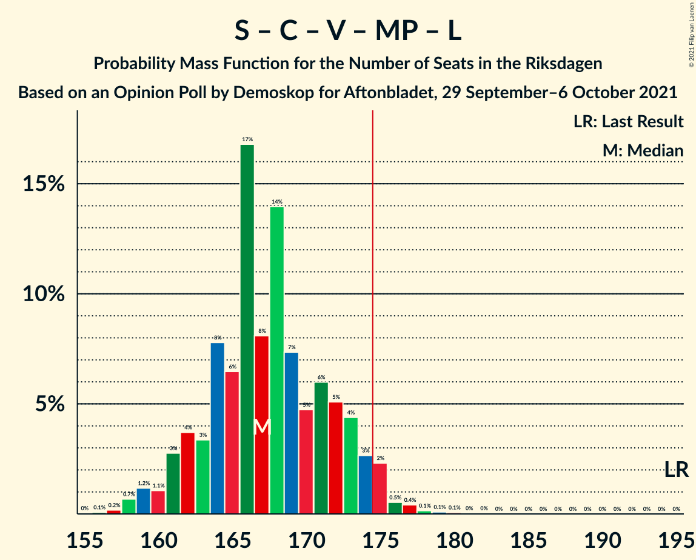
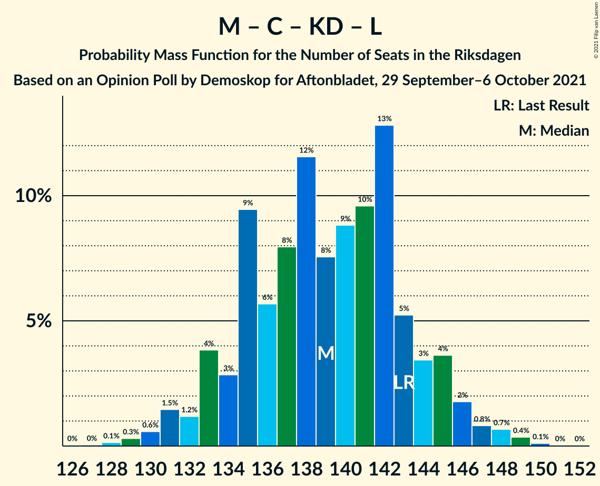
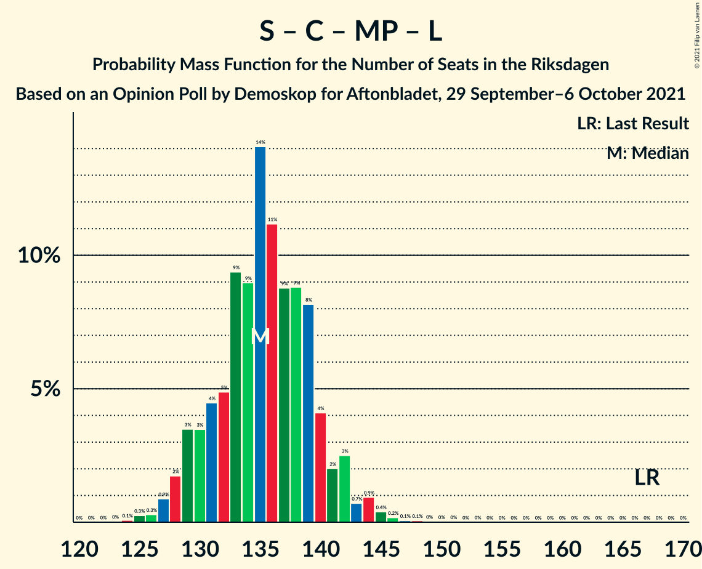

# Opinion Poll by Demoskop for Aftonbladet, 29 September–6 October 2021

<a href="#voting-intentions">Voting Intentions</a> | <a href="#seats">Seats</a> | <a href="#coalitions">Coalitions</a> | <a href="#technical-information">Technical Information</a>

## Voting Intentions

### Confidence Intervals

| Party | Last Result | Poll Result | 80% Confidence Interval | 90% Confidence Interval | 95% Confidence Interval | 99% Confidence Interval |
|:-----:|:-----------:|:-----------:|:-----------------------:|:-----------------------:|:-----------------------:|:-----------------------:|
| Sveriges socialdemokratiska arbetareparti | 28.3% | 26.7% | 25.6–27.9% |25.3–28.2% |25.0–28.5% |24.5–29.1% |
| Moderata samlingspartiet | 19.8% | 22.2% | 21.2–23.3% |20.9–23.7% |20.6–23.9% |20.1–24.5% |
| Sverigedemokraterna | 17.5% | 20.9% | 19.9–22.0% |19.6–22.3% |19.4–22.6% |18.9–23.1% |
| Centerpartiet | 8.6% | 9.5% | 8.8–10.3% |8.6–10.6% |8.4–10.8% |8.1–11.2% |
| Vänsterpartiet | 8.0% | 8.6% | 7.9–9.4% |7.7–9.6% |7.5–9.8% |7.2–10.2% |
| Kristdemokraterna | 6.3% | 5.5% | 4.9–6.2% |4.8–6.3% |4.6–6.5% |4.4–6.8% |
| Miljöpartiet de gröna | 4.4% | 3.0% | 2.6–3.5% |2.5–3.7% |2.4–3.8% |2.2–4.0% |
| Liberalerna | 5.5% | 2.7% | 2.3–3.2% |2.2–3.3% |2.1–3.4% |1.9–3.7% |

*Note:* The poll result column reflects the actual value used in the calculations. Published results may vary slightly, and in addition be rounded to fewer digits.

## Seats

### Confidence Intervals

| Party | Last Result | Median | 80% Confidence Interval | 90% Confidence Interval | 95% Confidence Interval | 99% Confidence Interval |
|:-----:|:-----------:|:------:|:-----------------------:|:-----------------------:|:-----------------------:|:-----------------------:|
| <a href="#sveriges-socialdemokratiska-arbetareparti">Sveriges socialdemokratiska arbetareparti</a> | 100 | 100 | 96–104 |94–105 |92–106 |90–108 |
| <a href="#moderata-samlingspartiet">Moderata samlingspartiet</a> | 70 | 84 | 78–87 |77–88 |77–89 |75–91 |
| <a href="#sverigedemokraterna">Sverigedemokraterna</a> | 62 | 78 | 75–83 |71–85 |70–86 |70–86 |
| <a href="#centerpartiet">Centerpartiet</a> | 31 | 35 | 33–38 |33–39 |31–40 |29–42 |
| <a href="#vänsterpartiet">Vänsterpartiet</a> | 28 | 33 | 28–34 |28–35 |27–35 |26–38 |
| <a href="#kristdemokraterna">Kristdemokraterna</a> | 22 | 20 | 18–23 |18–23 |17–24 |17–25 |
| <a href="#miljöpartiet-de-gröna">Miljöpartiet de gröna</a> | 16 | 0 | 0 |0 |0 |0 |
| <a href="#liberalerna">Liberalerna</a> | 20 | 0 | 0 |0 |0 |0 |

### Sveriges socialdemokratiska arbetareparti

*For a full overview of the results for this party, see the [Sveriges socialdemokratiska arbetareparti](party-sverigessocialdemokratiskaarbetareparti.html) page.*

| Number of Seats | Probability | Accumulated | Special Marks |
|:---------------:|:-----------:|:-----------:|:-------------:|
| 88 | 0% | 100% |  |
| 89 | 0.2% | 99.9% |  |
| 90 | 1.0% | 99.7% |  |
| 91 | 0.6% | 98.7% |  |
| 92 | 2% | 98% |  |
| 93 | 1.2% | 97% |  |
| 94 | 1.2% | 95% |  |
| 95 | 1.1% | 94% |  |
| 96 | 4% | 93% |  |
| 97 | 14% | 89% |  |
| 98 | 9% | 75% |  |
| 99 | 12% | 66% |  |
| 100 | 9% | 54% | Last Result, Median |
| 101 | 14% | 45% |  |
| 102 | 8% | 31% |  |
| 103 | 7% | 22% |  |
| 104 | 8% | 15% |  |
| 105 | 5% | 8% |  |
| 106 | 2% | 3% |  |
| 107 | 1.1% | 2% |  |
| 108 | 0.3% | 0.6% |  |
| 109 | 0.2% | 0.3% |  |
| 110 | 0.1% | 0.2% |  |
| 111 | 0% | 0.1% |  |
| 112 | 0% | 0% |  |

### Moderata samlingspartiet

*For a full overview of the results for this party, see the [Moderata samlingspartiet](party-moderatasamlingspartiet.html) page.*

| Number of Seats | Probability | Accumulated | Special Marks |
|:---------------:|:-----------:|:-----------:|:-------------:|
| 70 | 0% | 100% | Last Result |
| 71 | 0% | 100% |  |
| 72 | 0% | 100% |  |
| 73 | 0% | 100% |  |
| 74 | 0.2% | 99.9% |  |
| 75 | 0.7% | 99.7% |  |
| 76 | 0.5% | 99.0% |  |
| 77 | 5% | 98% |  |
| 78 | 6% | 93% |  |
| 79 | 7% | 88% |  |
| 80 | 5% | 81% |  |
| 81 | 16% | 76% |  |
| 82 | 4% | 60% |  |
| 83 | 6% | 56% |  |
| 84 | 6% | 50% | Median |
| 85 | 8% | 44% |  |
| 86 | 17% | 36% |  |
| 87 | 11% | 19% |  |
| 88 | 4% | 8% |  |
| 89 | 2% | 4% |  |
| 90 | 1.0% | 2% |  |
| 91 | 0.7% | 0.9% |  |
| 92 | 0.1% | 0.2% |  |
| 93 | 0% | 0.1% |  |
| 94 | 0% | 0% |  |

### Sverigedemokraterna

*For a full overview of the results for this party, see the [Sverigedemokraterna](party-sverigedemokraterna.html) page.*

| Number of Seats | Probability | Accumulated | Special Marks |
|:---------------:|:-----------:|:-----------:|:-------------:|
| 62 | 0% | 100% | Last Result |
| 63 | 0% | 100% |  |
| 64 | 0% | 100% |  |
| 65 | 0% | 100% |  |
| 66 | 0% | 100% |  |
| 67 | 0% | 100% |  |
| 68 | 0% | 100% |  |
| 69 | 0.2% | 99.9% |  |
| 70 | 3% | 99.7% |  |
| 71 | 2% | 97% |  |
| 72 | 1.4% | 95% |  |
| 73 | 0.9% | 93% |  |
| 74 | 2% | 93% |  |
| 75 | 22% | 91% |  |
| 76 | 8% | 68% |  |
| 77 | 5% | 60% |  |
| 78 | 14% | 55% | Median |
| 79 | 5% | 42% |  |
| 80 | 9% | 37% |  |
| 81 | 5% | 28% |  |
| 82 | 9% | 23% |  |
| 83 | 5% | 13% |  |
| 84 | 1.5% | 9% |  |
| 85 | 4% | 7% |  |
| 86 | 3% | 3% |  |
| 87 | 0.1% | 0.2% |  |
| 88 | 0.1% | 0.1% |  |
| 89 | 0% | 0.1% |  |
| 90 | 0% | 0% |  |

### Centerpartiet

*For a full overview of the results for this party, see the [Centerpartiet](party-centerpartiet.html) page.*

| Number of Seats | Probability | Accumulated | Special Marks |
|:---------------:|:-----------:|:-----------:|:-------------:|
| 29 | 0.8% | 100% |  |
| 30 | 0.1% | 99.2% |  |
| 31 | 2% | 99.1% | Last Result |
| 32 | 2% | 97% |  |
| 33 | 28% | 95% |  |
| 34 | 10% | 68% |  |
| 35 | 16% | 58% | Median |
| 36 | 3% | 42% |  |
| 37 | 19% | 39% |  |
| 38 | 13% | 20% |  |
| 39 | 3% | 7% |  |
| 40 | 2% | 4% |  |
| 41 | 0.9% | 2% |  |
| 42 | 0.9% | 1.0% |  |
| 43 | 0.1% | 0.1% |  |
| 44 | 0% | 0% |  |

### Vänsterpartiet

*For a full overview of the results for this party, see the [Vänsterpartiet](party-vänsterpartiet.html) page.*

| Number of Seats | Probability | Accumulated | Special Marks |
|:---------------:|:-----------:|:-----------:|:-------------:|
| 26 | 1.1% | 100% |  |
| 27 | 2% | 98.9% |  |
| 28 | 10% | 97% | Last Result |
| 29 | 13% | 87% |  |
| 30 | 2% | 75% |  |
| 31 | 8% | 73% |  |
| 32 | 14% | 64% |  |
| 33 | 25% | 50% | Median |
| 34 | 19% | 25% |  |
| 35 | 3% | 6% |  |
| 36 | 0.8% | 2% |  |
| 37 | 0.3% | 2% |  |
| 38 | 1.0% | 1.3% |  |
| 39 | 0.1% | 0.3% |  |
| 40 | 0.2% | 0.2% |  |
| 41 | 0% | 0% |  |

### Kristdemokraterna

*For a full overview of the results for this party, see the [Kristdemokraterna](party-kristdemokraterna.html) page.*

| Number of Seats | Probability | Accumulated | Special Marks |
|:---------------:|:-----------:|:-----------:|:-------------:|
| 15 | 0.1% | 100% |  |
| 16 | 0.4% | 99.9% |  |
| 17 | 3% | 99.5% |  |
| 18 | 7% | 96% |  |
| 19 | 17% | 89% |  |
| 20 | 25% | 72% | Median |
| 21 | 15% | 48% |  |
| 22 | 15% | 33% | Last Result |
| 23 | 14% | 18% |  |
| 24 | 3% | 4% |  |
| 25 | 0.7% | 1.1% |  |
| 26 | 0.2% | 0.3% |  |
| 27 | 0.2% | 0.2% |  |
| 28 | 0% | 0% |  |

### Miljöpartiet de gröna

*For a full overview of the results for this party, see the [Miljöpartiet de gröna](party-miljöpartietdegröna.html) page.*

| Number of Seats | Probability | Accumulated | Special Marks |
|:---------------:|:-----------:|:-----------:|:-------------:|
| 0 | 99.6% | 100% | Median |
| 1 | 0% | 0.4% |  |
| 2 | 0% | 0.4% |  |
| 3 | 0% | 0.4% |  |
| 4 | 0% | 0.4% |  |
| 5 | 0% | 0.4% |  |
| 6 | 0% | 0.4% |  |
| 7 | 0% | 0.4% |  |
| 8 | 0% | 0.4% |  |
| 9 | 0% | 0.4% |  |
| 10 | 0% | 0.4% |  |
| 11 | 0% | 0.4% |  |
| 12 | 0% | 0.4% |  |
| 13 | 0% | 0.4% |  |
| 14 | 0% | 0.4% |  |
| 15 | 0.3% | 0.4% |  |
| 16 | 0.1% | 0.1% | Last Result |
| 17 | 0% | 0% |  |

### Liberalerna

*For a full overview of the results for this party, see the [Liberalerna](party-liberalerna.html) page.*

| Number of Seats | Probability | Accumulated | Special Marks |
|:---------------:|:-----------:|:-----------:|:-------------:|
| 0 | 100% | 100% | Median |
| 1 | 0% | 0% |  |
| 2 | 0% | 0% |  |
| 3 | 0% | 0% |  |
| 4 | 0% | 0% |  |
| 5 | 0% | 0% |  |
| 6 | 0% | 0% |  |
| 7 | 0% | 0% |  |
| 8 | 0% | 0% |  |
| 9 | 0% | 0% |  |
| 10 | 0% | 0% |  |
| 11 | 0% | 0% |  |
| 12 | 0% | 0% |  |
| 13 | 0% | 0% |  |
| 14 | 0% | 0% |  |
| 15 | 0% | 0% |  |
| 16 | 0% | 0% |  |
| 17 | 0% | 0% |  |
| 18 | 0% | 0% |  |
| 19 | 0% | 0% |  |
| 20 | 0% | 0% | Last Result |

## Coalitions

### Confidence Intervals

| Coalition | Last Result | Median | Majority? | 80% Confidence Interval | 90% Confidence Interval | 95% Confidence Interval | 99% Confidence Interval |
|:---------:|:-----------:|:------:|:---------:|:-----------------------:|:-----------------------:|:-----------------------:|:-----------------------:|
| Sveriges socialdemokratiska arbetareparti – Moderata samlingspartiet – Centerpartiet | 201 | 219 | 100% | 213–223 | 212–225 | 211–225 | 209–228 |
| Sveriges socialdemokratiska arbetareparti – Moderata samlingspartiet | 170 | 183 | 98% | 177–188 | 176–188 | 175–190 | 173–193 |
| Moderata samlingspartiet – Sverigedemokraterna – Kristdemokraterna | 154 | 182 | 97% | 176–187 | 176–188 | 174–190 | 172–192 |
| Sveriges socialdemokratiska arbetareparti – Centerpartiet – Vänsterpartiet – Miljöpartiet de gröna – Liberalerna | 195 | 167 | 3% | 162–173 | 161–173 | 159–175 | 157–177 |
| Moderata samlingspartiet – Sverigedemokraterna | 132 | 161 | 0% | 156–167 | 154–168 | 153–169 | 151–172 |
| Moderata samlingspartiet – Centerpartiet – Kristdemokraterna – Liberalerna | 143 | 139 | 0% | 133–146 | 131–146 | 131–146 | 130–148 |
| Moderata samlingspartiet – Centerpartiet – Kristdemokraterna | 123 | 139 | 0% | 133–146 | 131–146 | 131–146 | 130–148 |
| Sveriges socialdemokratiska arbetareparti – Centerpartiet – Miljöpartiet de gröna – Liberalerna | 167 | 136 | 0% | 130–139 | 129–140 | 126–141 | 125–146 |
| Sveriges socialdemokratiska arbetareparti – Vänsterpartiet – Miljöpartiet de gröna | 144 | 131 | 0% | 127–138 | 126–138 | 124–138 | 122–142 |
| Sveriges socialdemokratiska arbetareparti – Vänsterpartiet | 128 | 131 | 0% | 127–137 | 126–138 | 123–138 | 122–142 |
| Moderata samlingspartiet – Centerpartiet – Liberalerna | 121 | 119 | 0% | 113–124 | 111–125 | 110–126 | 108–128 |
| Moderata samlingspartiet – Centerpartiet | 101 | 119 | 0% | 113–124 | 111–125 | 110–126 | 108–128 |
| Sveriges socialdemokratiska arbetareparti – Miljöpartiet de gröna | 116 | 100 | 0% | 96–104 | 94–105 | 92–106 | 90–109 |

### Sveriges socialdemokratiska arbetareparti – Moderata samlingspartiet – Centerpartiet

| Number of Seats | Probability | Accumulated | Special Marks |
|:---------------:|:-----------:|:-----------:|:-------------:|
| 201 | 0% | 100% | Last Result |
| 202 | 0% | 100% |  |
| 203 | 0% | 100% |  |
| 204 | 0% | 99.9% |  |
| 205 | 0% | 99.9% |  |
| 206 | 0% | 99.9% |  |
| 207 | 0.1% | 99.8% |  |
| 208 | 0.1% | 99.8% |  |
| 209 | 0.7% | 99.6% |  |
| 210 | 0.5% | 99.0% |  |
| 211 | 3% | 98% |  |
| 212 | 4% | 95% |  |
| 213 | 8% | 92% |  |
| 214 | 7% | 84% |  |
| 215 | 4% | 77% |  |
| 216 | 12% | 73% |  |
| 217 | 2% | 61% |  |
| 218 | 6% | 60% |  |
| 219 | 8% | 54% | Median |
| 220 | 9% | 46% |  |
| 221 | 10% | 36% |  |
| 222 | 9% | 26% |  |
| 223 | 10% | 18% |  |
| 224 | 2% | 8% |  |
| 225 | 5% | 6% |  |
| 226 | 0.4% | 1.5% |  |
| 227 | 0.3% | 1.1% |  |
| 228 | 0.3% | 0.8% |  |
| 229 | 0.2% | 0.4% |  |
| 230 | 0.1% | 0.2% |  |
| 231 | 0.1% | 0.1% |  |
| 232 | 0% | 0% |  |

### Sveriges socialdemokratiska arbetareparti – Moderata samlingspartiet

| Number of Seats | Probability | Accumulated | Special Marks |
|:---------------:|:-----------:|:-----------:|:-------------:|
| 169 | 0% | 100% |  |
| 170 | 0.1% | 99.9% | Last Result |
| 171 | 0.1% | 99.9% |  |
| 172 | 0.2% | 99.8% |  |
| 173 | 1.0% | 99.6% |  |
| 174 | 0.7% | 98.6% |  |
| 175 | 3% | 98% | Majority |
| 176 | 4% | 95% |  |
| 177 | 3% | 91% |  |
| 178 | 2% | 88% |  |
| 179 | 3% | 86% |  |
| 180 | 5% | 83% |  |
| 181 | 7% | 78% |  |
| 182 | 11% | 70% |  |
| 183 | 13% | 60% |  |
| 184 | 6% | 46% | Median |
| 185 | 16% | 40% |  |
| 186 | 3% | 24% |  |
| 187 | 5% | 21% |  |
| 188 | 12% | 16% |  |
| 189 | 2% | 5% |  |
| 190 | 2% | 3% |  |
| 191 | 0.4% | 1.1% |  |
| 192 | 0.1% | 0.7% |  |
| 193 | 0.3% | 0.6% |  |
| 194 | 0.2% | 0.3% |  |
| 195 | 0.1% | 0.1% |  |
| 196 | 0.1% | 0.1% |  |
| 197 | 0% | 0% |  |

### Moderata samlingspartiet – Sverigedemokraterna – Kristdemokraterna

| Number of Seats | Probability | Accumulated | Special Marks |
|:---------------:|:-----------:|:-----------:|:-------------:|
| 154 | 0% | 100% | Last Result |
| 155 | 0% | 100% |  |
| 156 | 0% | 100% |  |
| 157 | 0% | 100% |  |
| 158 | 0% | 100% |  |
| 159 | 0% | 100% |  |
| 160 | 0% | 100% |  |
| 161 | 0% | 100% |  |
| 162 | 0% | 100% |  |
| 163 | 0% | 100% |  |
| 164 | 0% | 100% |  |
| 165 | 0% | 100% |  |
| 166 | 0% | 100% |  |
| 167 | 0.1% | 100% |  |
| 168 | 0% | 99.9% |  |
| 169 | 0.1% | 99.9% |  |
| 170 | 0.1% | 99.8% |  |
| 171 | 0.1% | 99.6% |  |
| 172 | 0.3% | 99.6% |  |
| 173 | 0.3% | 99.3% |  |
| 174 | 2% | 99.0% |  |
| 175 | 1.1% | 97% | Majority |
| 176 | 8% | 96% |  |
| 177 | 4% | 88% |  |
| 178 | 9% | 84% |  |
| 179 | 3% | 76% |  |
| 180 | 10% | 72% |  |
| 181 | 9% | 63% |  |
| 182 | 8% | 54% | Median |
| 183 | 12% | 46% |  |
| 184 | 7% | 35% |  |
| 185 | 5% | 28% |  |
| 186 | 7% | 23% |  |
| 187 | 9% | 16% |  |
| 188 | 2% | 7% |  |
| 189 | 1.4% | 5% |  |
| 190 | 2% | 3% |  |
| 191 | 0.7% | 1.3% |  |
| 192 | 0.3% | 0.6% |  |
| 193 | 0.2% | 0.3% |  |
| 194 | 0.1% | 0.1% |  |
| 195 | 0% | 0% |  |

### Sveriges socialdemokratiska arbetareparti – Centerpartiet – Vänsterpartiet – Miljöpartiet de gröna – Liberalerna

| Number of Seats | Probability | Accumulated | Special Marks |
|:---------------:|:-----------:|:-----------:|:-------------:|
| 155 | 0.1% | 100% |  |
| 156 | 0.2% | 99.9% |  |
| 157 | 0.3% | 99.7% |  |
| 158 | 0.7% | 99.4% |  |
| 159 | 2% | 98.7% |  |
| 160 | 1.4% | 97% |  |
| 161 | 2% | 95% |  |
| 162 | 9% | 93% |  |
| 163 | 7% | 84% |  |
| 164 | 5% | 77% |  |
| 165 | 7% | 72% |  |
| 166 | 12% | 65% |  |
| 167 | 8% | 54% |  |
| 168 | 9% | 46% | Median |
| 169 | 10% | 37% |  |
| 170 | 3% | 28% |  |
| 171 | 9% | 24% |  |
| 172 | 4% | 16% |  |
| 173 | 8% | 12% |  |
| 174 | 1.1% | 4% |  |
| 175 | 2% | 3% | Majority |
| 176 | 0.3% | 1.0% |  |
| 177 | 0.3% | 0.7% |  |
| 178 | 0.1% | 0.4% |  |
| 179 | 0.1% | 0.4% |  |
| 180 | 0.1% | 0.2% |  |
| 181 | 0% | 0.1% |  |
| 182 | 0.1% | 0.1% |  |
| 183 | 0% | 0% |  |
| 184 | 0% | 0% |  |
| 185 | 0% | 0% |  |
| 186 | 0% | 0% |  |
| 187 | 0% | 0% |  |
| 188 | 0% | 0% |  |
| 189 | 0% | 0% |  |
| 190 | 0% | 0% |  |
| 191 | 0% | 0% |  |
| 192 | 0% | 0% |  |
| 193 | 0% | 0% |  |
| 194 | 0% | 0% |  |
| 195 | 0% | 0% | Last Result |

### Moderata samlingspartiet – Sverigedemokraterna

| Number of Seats | Probability | Accumulated | Special Marks |
|:---------------:|:-----------:|:-----------:|:-------------:|
| 132 | 0% | 100% | Last Result |
| 133 | 0% | 100% |  |
| 134 | 0% | 100% |  |
| 135 | 0% | 100% |  |
| 136 | 0% | 100% |  |
| 137 | 0% | 100% |  |
| 138 | 0% | 100% |  |
| 139 | 0% | 100% |  |
| 140 | 0% | 100% |  |
| 141 | 0% | 100% |  |
| 142 | 0% | 100% |  |
| 143 | 0% | 100% |  |
| 144 | 0% | 100% |  |
| 145 | 0% | 100% |  |
| 146 | 0% | 100% |  |
| 147 | 0.1% | 100% |  |
| 148 | 0% | 99.9% |  |
| 149 | 0.2% | 99.9% |  |
| 150 | 0.1% | 99.7% |  |
| 151 | 0.2% | 99.6% |  |
| 152 | 0.4% | 99.3% |  |
| 153 | 3% | 98.9% |  |
| 154 | 2% | 96% |  |
| 155 | 2% | 94% |  |
| 156 | 9% | 93% |  |
| 157 | 6% | 84% |  |
| 158 | 2% | 78% |  |
| 159 | 7% | 76% |  |
| 160 | 9% | 69% |  |
| 161 | 13% | 59% |  |
| 162 | 4% | 47% | Median |
| 163 | 8% | 43% |  |
| 164 | 12% | 35% |  |
| 165 | 8% | 23% |  |
| 166 | 3% | 15% |  |
| 167 | 6% | 12% |  |
| 168 | 3% | 5% |  |
| 169 | 0.4% | 3% |  |
| 170 | 2% | 2% |  |
| 171 | 0.1% | 0.6% |  |
| 172 | 0.5% | 0.5% |  |
| 173 | 0% | 0.1% |  |
| 174 | 0% | 0% |  |

### Moderata samlingspartiet – Centerpartiet – Kristdemokraterna – Liberalerna

| Number of Seats | Probability | Accumulated | Special Marks |
|:---------------:|:-----------:|:-----------:|:-------------:|
| 128 | 0.1% | 100% |  |
| 129 | 0.2% | 99.9% |  |
| 130 | 0.6% | 99.7% |  |
| 131 | 7% | 99.2% |  |
| 132 | 0.9% | 92% |  |
| 133 | 6% | 91% |  |
| 134 | 5% | 85% |  |
| 135 | 1.2% | 80% |  |
| 136 | 9% | 79% |  |
| 137 | 1.3% | 70% |  |
| 138 | 10% | 68% |  |
| 139 | 9% | 58% | Median |
| 140 | 10% | 49% |  |
| 141 | 6% | 39% |  |
| 142 | 12% | 34% |  |
| 143 | 5% | 22% | Last Result |
| 144 | 4% | 17% |  |
| 145 | 3% | 13% |  |
| 146 | 9% | 11% |  |
| 147 | 1.0% | 2% |  |
| 148 | 0.5% | 0.6% |  |
| 149 | 0.1% | 0.1% |  |
| 150 | 0% | 0.1% |  |
| 151 | 0% | 0% |  |

### Moderata samlingspartiet – Centerpartiet – Kristdemokraterna

| Number of Seats | Probability | Accumulated | Special Marks |
|:---------------:|:-----------:|:-----------:|:-------------:|
| 123 | 0% | 100% | Last Result |
| 124 | 0% | 100% |  |
| 125 | 0% | 100% |  |
| 126 | 0% | 100% |  |
| 127 | 0% | 100% |  |
| 128 | 0.1% | 100% |  |
| 129 | 0.2% | 99.9% |  |
| 130 | 0.6% | 99.7% |  |
| 131 | 7% | 99.2% |  |
| 132 | 0.9% | 92% |  |
| 133 | 6% | 91% |  |
| 134 | 5% | 85% |  |
| 135 | 1.2% | 80% |  |
| 136 | 9% | 79% |  |
| 137 | 1.3% | 70% |  |
| 138 | 10% | 68% |  |
| 139 | 9% | 58% | Median |
| 140 | 10% | 49% |  |
| 141 | 6% | 39% |  |
| 142 | 12% | 34% |  |
| 143 | 5% | 22% |  |
| 144 | 4% | 17% |  |
| 145 | 3% | 13% |  |
| 146 | 9% | 11% |  |
| 147 | 1.0% | 2% |  |
| 148 | 0.5% | 0.6% |  |
| 149 | 0.1% | 0.1% |  |
| 150 | 0% | 0.1% |  |
| 151 | 0% | 0% |  |

### Sveriges socialdemokratiska arbetareparti – Centerpartiet – Miljöpartiet de gröna – Liberalerna

| Number of Seats | Probability | Accumulated | Special Marks |
|:---------------:|:-----------:|:-----------:|:-------------:|
| 123 | 0% | 100% |  |
| 124 | 0.3% | 99.9% |  |
| 125 | 1.3% | 99.7% |  |
| 126 | 1.2% | 98% |  |
| 127 | 1.2% | 97% |  |
| 128 | 0.8% | 96% |  |
| 129 | 0.9% | 95% |  |
| 130 | 8% | 94% |  |
| 131 | 3% | 86% |  |
| 132 | 2% | 83% |  |
| 133 | 8% | 80% |  |
| 134 | 6% | 72% |  |
| 135 | 14% | 67% | Median |
| 136 | 11% | 53% |  |
| 137 | 13% | 42% |  |
| 138 | 11% | 29% |  |
| 139 | 12% | 18% |  |
| 140 | 3% | 6% |  |
| 141 | 0.7% | 3% |  |
| 142 | 0.5% | 2% |  |
| 143 | 0.2% | 2% |  |
| 144 | 0.2% | 1.5% |  |
| 145 | 0.7% | 1.3% |  |
| 146 | 0.2% | 0.6% |  |
| 147 | 0.1% | 0.4% |  |
| 148 | 0.1% | 0.3% |  |
| 149 | 0.1% | 0.2% |  |
| 150 | 0.1% | 0.1% |  |
| 151 | 0% | 0.1% |  |
| 152 | 0% | 0% |  |
| 153 | 0% | 0% |  |
| 154 | 0% | 0% |  |
| 155 | 0% | 0% |  |
| 156 | 0% | 0% |  |
| 157 | 0% | 0% |  |
| 158 | 0% | 0% |  |
| 159 | 0% | 0% |  |
| 160 | 0% | 0% |  |
| 161 | 0% | 0% |  |
| 162 | 0% | 0% |  |
| 163 | 0% | 0% |  |
| 164 | 0% | 0% |  |
| 165 | 0% | 0% |  |
| 166 | 0% | 0% |  |
| 167 | 0% | 0% | Last Result |

### Sveriges socialdemokratiska arbetareparti – Vänsterpartiet – Miljöpartiet de gröna

| Number of Seats | Probability | Accumulated | Special Marks |
|:---------------:|:-----------:|:-----------:|:-------------:|
| 120 | 0.1% | 100% |  |
| 121 | 0.2% | 99.9% |  |
| 122 | 0.4% | 99.8% |  |
| 123 | 2% | 99.3% |  |
| 124 | 0.5% | 98% |  |
| 125 | 1.3% | 97% |  |
| 126 | 3% | 96% |  |
| 127 | 3% | 92% |  |
| 128 | 11% | 90% |  |
| 129 | 18% | 79% |  |
| 130 | 8% | 61% |  |
| 131 | 6% | 53% |  |
| 132 | 4% | 47% |  |
| 133 | 3% | 43% | Median |
| 134 | 10% | 40% |  |
| 135 | 7% | 30% |  |
| 136 | 10% | 23% |  |
| 137 | 3% | 13% |  |
| 138 | 8% | 10% |  |
| 139 | 0.7% | 2% |  |
| 140 | 0.5% | 2% |  |
| 141 | 0.3% | 1.1% |  |
| 142 | 0.5% | 0.8% |  |
| 143 | 0.1% | 0.3% |  |
| 144 | 0.1% | 0.2% | Last Result |
| 145 | 0% | 0.1% |  |
| 146 | 0% | 0% |  |

### Sveriges socialdemokratiska arbetareparti – Vänsterpartiet

| Number of Seats | Probability | Accumulated | Special Marks |
|:---------------:|:-----------:|:-----------:|:-------------:|
| 120 | 0.1% | 100% |  |
| 121 | 0.2% | 99.9% |  |
| 122 | 0.5% | 99.7% |  |
| 123 | 2% | 99.2% |  |
| 124 | 0.5% | 97% |  |
| 125 | 1.4% | 97% |  |
| 126 | 4% | 95% |  |
| 127 | 3% | 92% |  |
| 128 | 11% | 89% | Last Result |
| 129 | 18% | 79% |  |
| 130 | 8% | 61% |  |
| 131 | 6% | 53% |  |
| 132 | 4% | 47% |  |
| 133 | 3% | 43% | Median |
| 134 | 10% | 39% |  |
| 135 | 7% | 29% |  |
| 136 | 10% | 22% |  |
| 137 | 3% | 12% |  |
| 138 | 8% | 10% |  |
| 139 | 0.6% | 2% |  |
| 140 | 0.4% | 1.3% |  |
| 141 | 0.3% | 0.9% |  |
| 142 | 0.4% | 0.6% |  |
| 143 | 0.1% | 0.2% |  |
| 144 | 0% | 0.1% |  |
| 145 | 0% | 0% |  |

### Moderata samlingspartiet – Centerpartiet – Liberalerna

| Number of Seats | Probability | Accumulated | Special Marks |
|:---------------:|:-----------:|:-----------:|:-------------:|
| 106 | 0% | 100% |  |
| 107 | 0% | 99.9% |  |
| 108 | 0.4% | 99.9% |  |
| 109 | 0.1% | 99.5% |  |
| 110 | 3% | 99.4% |  |
| 111 | 4% | 96% |  |
| 112 | 0.5% | 92% |  |
| 113 | 5% | 92% |  |
| 114 | 6% | 87% |  |
| 115 | 1.1% | 81% |  |
| 116 | 14% | 79% |  |
| 117 | 2% | 66% |  |
| 118 | 14% | 64% |  |
| 119 | 13% | 50% | Median |
| 120 | 2% | 37% |  |
| 121 | 11% | 35% | Last Result |
| 122 | 7% | 24% |  |
| 123 | 2% | 17% |  |
| 124 | 9% | 15% |  |
| 125 | 1.5% | 6% |  |
| 126 | 3% | 5% |  |
| 127 | 1.3% | 2% |  |
| 128 | 0.2% | 0.6% |  |
| 129 | 0.3% | 0.4% |  |
| 130 | 0.1% | 0.1% |  |
| 131 | 0% | 0% |  |

### Moderata samlingspartiet – Centerpartiet

| Number of Seats | Probability | Accumulated | Special Marks |
|:---------------:|:-----------:|:-----------:|:-------------:|
| 101 | 0% | 100% | Last Result |
| 102 | 0% | 100% |  |
| 103 | 0% | 100% |  |
| 104 | 0% | 100% |  |
| 105 | 0% | 100% |  |
| 106 | 0% | 100% |  |
| 107 | 0% | 99.9% |  |
| 108 | 0.4% | 99.9% |  |
| 109 | 0.1% | 99.5% |  |
| 110 | 3% | 99.4% |  |
| 111 | 4% | 96% |  |
| 112 | 0.5% | 92% |  |
| 113 | 5% | 92% |  |
| 114 | 6% | 87% |  |
| 115 | 1.1% | 81% |  |
| 116 | 14% | 79% |  |
| 117 | 2% | 66% |  |
| 118 | 14% | 64% |  |
| 119 | 13% | 50% | Median |
| 120 | 2% | 37% |  |
| 121 | 11% | 35% |  |
| 122 | 7% | 24% |  |
| 123 | 2% | 17% |  |
| 124 | 9% | 15% |  |
| 125 | 1.5% | 6% |  |
| 126 | 3% | 5% |  |
| 127 | 1.3% | 2% |  |
| 128 | 0.2% | 0.6% |  |
| 129 | 0.3% | 0.4% |  |
| 130 | 0.1% | 0.1% |  |
| 131 | 0% | 0% |  |

### Sveriges socialdemokratiska arbetareparti – Miljöpartiet de gröna

| Number of Seats | Probability | Accumulated | Special Marks |
|:---------------:|:-----------:|:-----------:|:-------------:|
| 89 | 0.2% | 100% |  |
| 90 | 1.0% | 99.7% |  |
| 91 | 0.6% | 98.8% |  |
| 92 | 2% | 98% |  |
| 93 | 1.2% | 97% |  |
| 94 | 1.1% | 95% |  |
| 95 | 1.1% | 94% |  |
| 96 | 4% | 93% |  |
| 97 | 14% | 89% |  |
| 98 | 9% | 76% |  |
| 99 | 12% | 67% |  |
| 100 | 9% | 55% | Median |
| 101 | 14% | 45% |  |
| 102 | 8% | 31% |  |
| 103 | 7% | 23% |  |
| 104 | 8% | 16% |  |
| 105 | 5% | 8% |  |
| 106 | 2% | 4% |  |
| 107 | 1.1% | 2% |  |
| 108 | 0.3% | 0.9% |  |
| 109 | 0.2% | 0.6% |  |
| 110 | 0.1% | 0.4% |  |
| 111 | 0% | 0.2% |  |
| 112 | 0% | 0.2% |  |
| 113 | 0.1% | 0.2% |  |
| 114 | 0% | 0.1% |  |
| 115 | 0% | 0.1% |  |
| 116 | 0% | 0% | Last Result |

## Technical Information

### Opinion Poll

+ **Polling firm:** Demoskop
+ **Commissioner(s):** Aftonbladet
+ **Fieldwork period:** 29 September–6 October 2021

### Calculations

+ **Sample size:** 2417
+ **Simulations done:** 131,072
+ **Error estimate:** 1.23%

