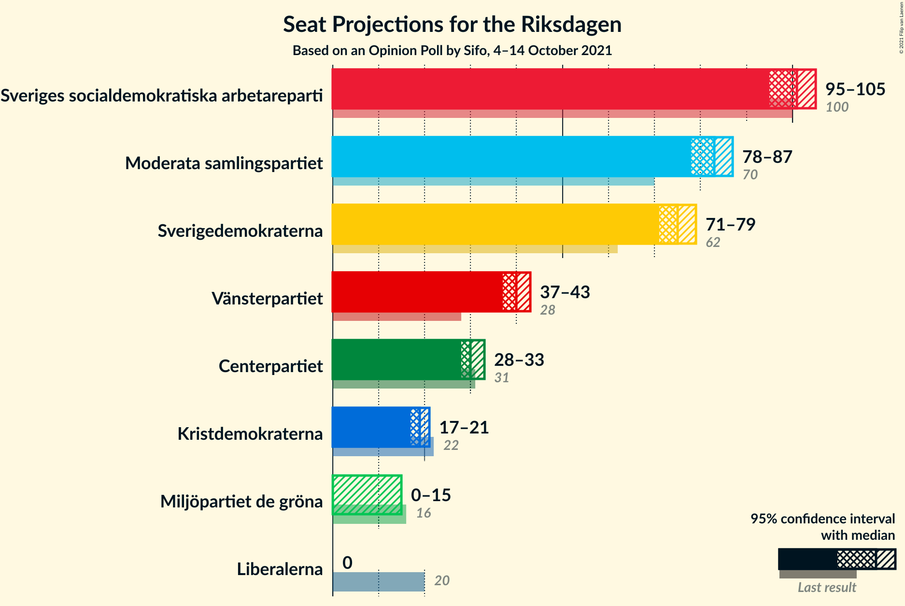
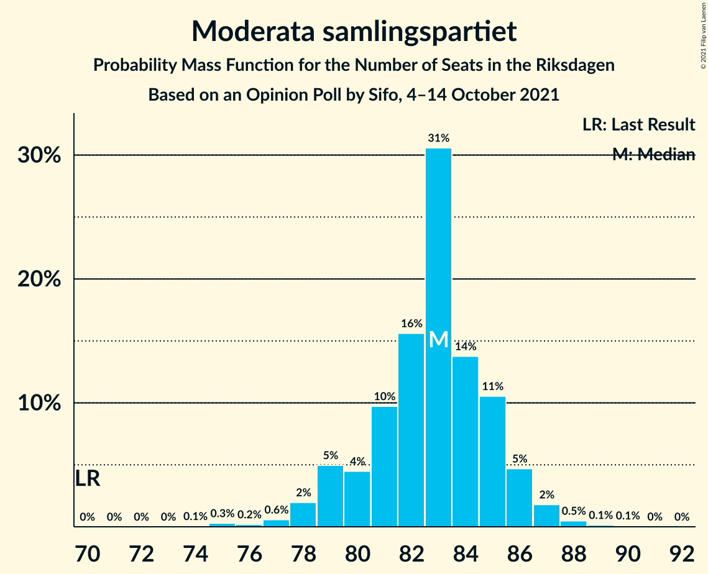
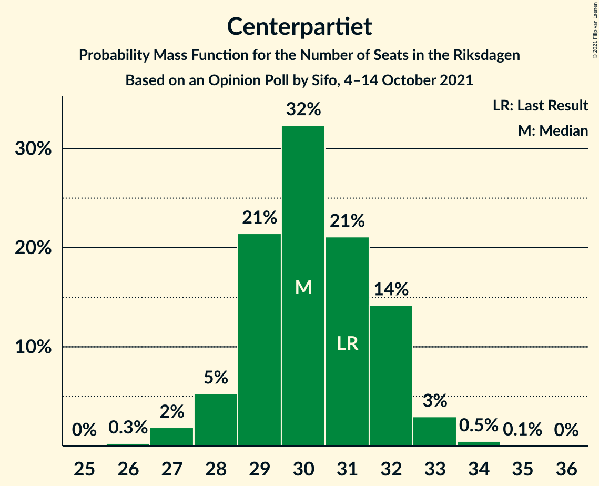
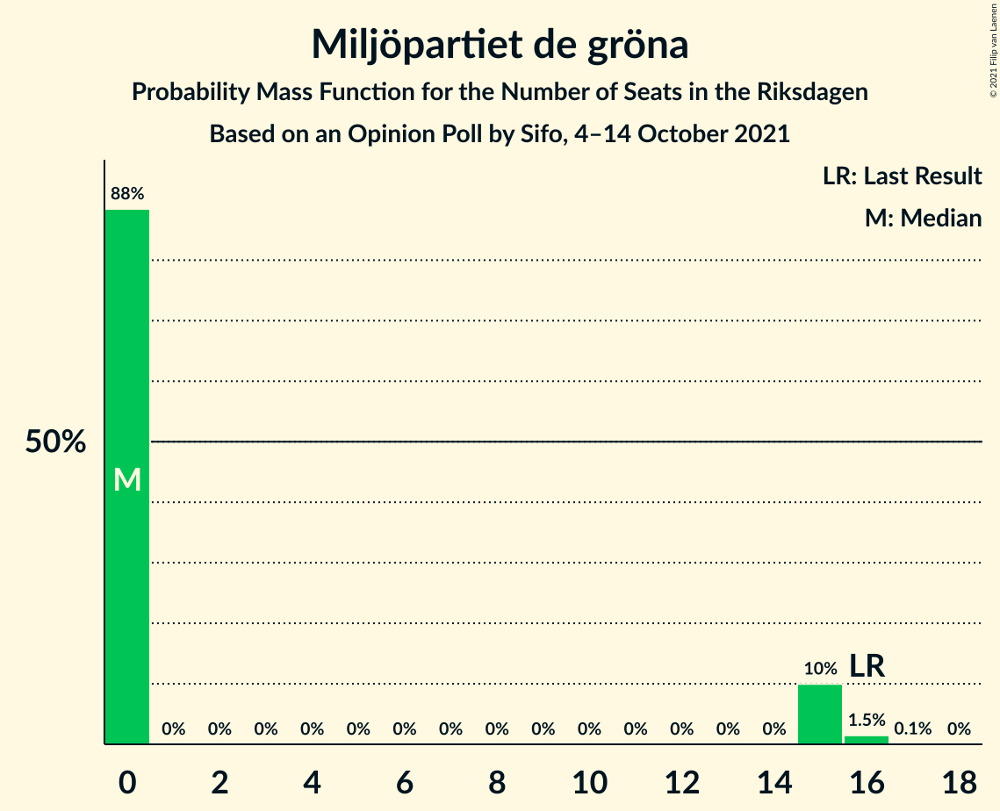
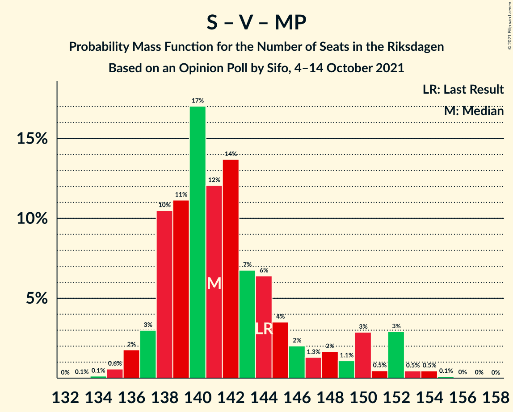
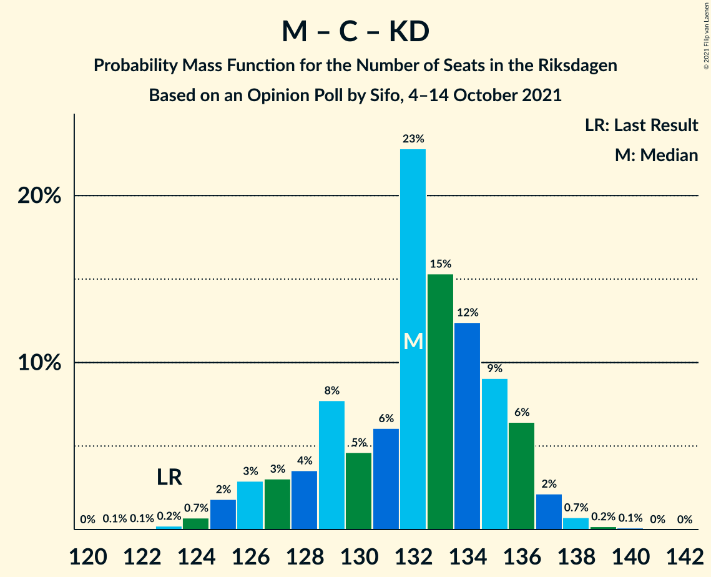

# Opinion Poll by Sifo, 4–14 October 2021

<a href="#voting-intentions">Voting Intentions</a> | <a href="#seats">Seats</a> | <a href="#coalitions">Coalitions</a> | <a href="#technical-information">Technical Information</a>

## Voting Intentions

### Confidence Intervals

| Party | Last Result | Poll Result | 80% Confidence Interval | 90% Confidence Interval | 95% Confidence Interval | 99% Confidence Interval |
|:-----:|:-----------:|:-----------:|:-----------------------:|:-----------------------:|:-----------------------:|:-----------------------:|
| Sveriges socialdemokratiska arbetareparti | 28.3% | 26.6% | 25.9–27.3% |25.7–27.5% |25.5–27.7% |25.2–28.1% |
| Moderata samlingspartiet | 19.8% | 21.9% | 21.2–22.6% |21.0–22.8% |20.9–23.0% |20.6–23.3% |
| Sverigedemokraterna | 17.5% | 19.9% | 19.3–20.6% |19.1–20.8% |18.9–20.9% |18.6–21.2% |
| Vänsterpartiet | 8.0% | 10.5% | 10.0–11.0% |9.9–11.2% |9.8–11.3% |9.5–11.6% |
| Centerpartiet | 8.6% | 8.0% | 7.6–8.5% |7.4–8.6% |7.3–8.7% |7.1–8.9% |
| Kristdemokraterna | 6.3% | 5.0% | 4.7–5.4% |4.6–5.5% |4.5–5.6% |4.3–5.8% |
| Miljöpartiet de gröna | 4.4% | 3.7% | 3.4–4.0% |3.3–4.1% |3.3–4.2% |3.1–4.4% |
| Liberalerna | 5.5% | 2.8% | 2.5–3.1% |2.5–3.2% |2.4–3.2% |2.3–3.4% |

*Note:* The poll result column reflects the actual value used in the calculations. Published results may vary slightly, and in addition be rounded to fewer digits.

## Seats

### Confidence Intervals

| Party | Last Result | Median | 80% Confidence Interval | 90% Confidence Interval | 95% Confidence Interval | 99% Confidence Interval |
|:-----:|:-----------:|:------:|:-----------------------:|:-----------------------:|:-----------------------:|:-----------------------:|
| <a href="#sveriges-socialdemokratiska-arbetareparti">Sveriges socialdemokratiska arbetareparti</a> | 100 | 100 | 97–104 |96–105 |95–105 |93–107 |
| <a href="#moderata-samlingspartiet">Moderata samlingspartiet</a> | 70 | 83 | 80–86 |79–86 |78–87 |76–88 |
| <a href="#sverigedemokraterna">Sverigedemokraterna</a> | 62 | 76 | 72–77 |72–78 |71–79 |69–81 |
| <a href="#vänsterpartiet">Vänsterpartiet</a> | 28 | 39 | 37–42 |37–42 |36–42 |35–44 |
| <a href="#centerpartiet">Centerpartiet</a> | 31 | 31 | 28–32 |28–32 |27–33 |27–33 |
| <a href="#kristdemokraterna">Kristdemokraterna</a> | 22 | 19 | 17–21 |17–21 |17–21 |16–22 |
| <a href="#miljöpartiet-de-gröna">Miljöpartiet de gröna</a> | 16 | 0 | 0–15 |0–15 |0–15 |0–16 |
| <a href="#liberalerna">Liberalerna</a> | 20 | 0 | 0 |0 |0 |0 |

### Sveriges socialdemokratiska arbetareparti

*For a full overview of the results for this party, see the [Sveriges socialdemokratiska arbetareparti](party-sverigessocialdemokratiskaarbetareparti.html) page.*

| Number of Seats | Probability | Accumulated | Special Marks |
|:---------------:|:-----------:|:-----------:|:-------------:|
| 91 | 0.1% | 100% |  |
| 92 | 0.1% | 99.9% |  |
| 93 | 0.9% | 99.8% |  |
| 94 | 1.0% | 98.9% |  |
| 95 | 1.2% | 98% |  |
| 96 | 4% | 97% |  |
| 97 | 8% | 92% |  |
| 98 | 7% | 85% |  |
| 99 | 9% | 77% |  |
| 100 | 28% | 68% | Last Result, Median |
| 101 | 16% | 40% |  |
| 102 | 7% | 24% |  |
| 103 | 5% | 17% |  |
| 104 | 4% | 12% |  |
| 105 | 7% | 8% |  |
| 106 | 0.5% | 1.2% |  |
| 107 | 0.5% | 0.7% |  |
| 108 | 0.2% | 0.2% |  |
| 109 | 0% | 0% |  |

### Moderata samlingspartiet

*For a full overview of the results for this party, see the [Moderata samlingspartiet](party-moderatasamlingspartiet.html) page.*

| Number of Seats | Probability | Accumulated | Special Marks |
|:---------------:|:-----------:|:-----------:|:-------------:|
| 70 | 0% | 100% | Last Result |
| 71 | 0% | 100% |  |
| 72 | 0% | 100% |  |
| 73 | 0% | 100% |  |
| 74 | 0% | 100% |  |
| 75 | 0.2% | 100% |  |
| 76 | 0.4% | 99.7% |  |
| 77 | 1.0% | 99.3% |  |
| 78 | 1.4% | 98% |  |
| 79 | 2% | 97% |  |
| 80 | 10% | 95% |  |
| 81 | 6% | 85% |  |
| 82 | 11% | 79% |  |
| 83 | 29% | 67% | Median |
| 84 | 10% | 38% |  |
| 85 | 18% | 28% |  |
| 86 | 6% | 11% |  |
| 87 | 4% | 5% |  |
| 88 | 0.3% | 0.6% |  |
| 89 | 0.1% | 0.2% |  |
| 90 | 0.1% | 0.2% |  |
| 91 | 0.1% | 0.1% |  |
| 92 | 0% | 0% |  |

### Sverigedemokraterna

*For a full overview of the results for this party, see the [Sverigedemokraterna](party-sverigedemokraterna.html) page.*

| Number of Seats | Probability | Accumulated | Special Marks |
|:---------------:|:-----------:|:-----------:|:-------------:|
| 62 | 0% | 100% | Last Result |
| 63 | 0% | 100% |  |
| 64 | 0% | 100% |  |
| 65 | 0% | 100% |  |
| 66 | 0% | 100% |  |
| 67 | 0% | 100% |  |
| 68 | 0.1% | 100% |  |
| 69 | 1.5% | 99.8% |  |
| 70 | 0.8% | 98% |  |
| 71 | 0.6% | 98% |  |
| 72 | 11% | 97% |  |
| 73 | 17% | 86% |  |
| 74 | 3% | 69% |  |
| 75 | 13% | 66% |  |
| 76 | 17% | 54% | Median |
| 77 | 30% | 37% |  |
| 78 | 4% | 7% |  |
| 79 | 0.9% | 3% |  |
| 80 | 1.3% | 2% |  |
| 81 | 0.8% | 0.9% |  |
| 82 | 0% | 0% |  |

### Vänsterpartiet

*For a full overview of the results for this party, see the [Vänsterpartiet](party-vänsterpartiet.html) page.*

| Number of Seats | Probability | Accumulated | Special Marks |
|:---------------:|:-----------:|:-----------:|:-------------:|
| 28 | 0% | 100% | Last Result |
| 29 | 0% | 100% |  |
| 30 | 0% | 100% |  |
| 31 | 0% | 100% |  |
| 32 | 0% | 100% |  |
| 33 | 0% | 100% |  |
| 34 | 0.1% | 100% |  |
| 35 | 0.7% | 99.9% |  |
| 36 | 3% | 99.2% |  |
| 37 | 8% | 96% |  |
| 38 | 15% | 88% |  |
| 39 | 33% | 73% | Median |
| 40 | 14% | 41% |  |
| 41 | 15% | 27% |  |
| 42 | 10% | 12% |  |
| 43 | 2% | 2% |  |
| 44 | 0.5% | 0.7% |  |
| 45 | 0.2% | 0.2% |  |
| 46 | 0% | 0% |  |

### Centerpartiet

*For a full overview of the results for this party, see the [Centerpartiet](party-centerpartiet.html) page.*

| Number of Seats | Probability | Accumulated | Special Marks |
|:---------------:|:-----------:|:-----------:|:-------------:|
| 26 | 0.3% | 100% |  |
| 27 | 5% | 99.7% |  |
| 28 | 5% | 95% |  |
| 29 | 18% | 90% |  |
| 30 | 17% | 72% |  |
| 31 | 32% | 55% | Last Result, Median |
| 32 | 18% | 23% |  |
| 33 | 4% | 5% |  |
| 34 | 0.3% | 0.3% |  |
| 35 | 0.1% | 0.1% |  |
| 36 | 0% | 0% |  |

### Kristdemokraterna

*For a full overview of the results for this party, see the [Kristdemokraterna](party-kristdemokraterna.html) page.*

| Number of Seats | Probability | Accumulated | Special Marks |
|:---------------:|:-----------:|:-----------:|:-------------:|
| 16 | 2% | 100% |  |
| 17 | 10% | 98% |  |
| 18 | 21% | 88% |  |
| 19 | 44% | 67% | Median |
| 20 | 10% | 22% |  |
| 21 | 11% | 12% |  |
| 22 | 0.8% | 0.8% | Last Result |
| 23 | 0.1% | 0.1% |  |
| 24 | 0% | 0% |  |

### Miljöpartiet de gröna

*For a full overview of the results for this party, see the [Miljöpartiet de gröna](party-miljöpartietdegröna.html) page.*

| Number of Seats | Probability | Accumulated | Special Marks |
|:---------------:|:-----------:|:-----------:|:-------------:|
| 0 | 87% | 100% | Median |
| 1 | 0% | 13% |  |
| 2 | 0% | 13% |  |
| 3 | 0% | 13% |  |
| 4 | 0% | 13% |  |
| 5 | 0% | 13% |  |
| 6 | 0% | 13% |  |
| 7 | 0% | 13% |  |
| 8 | 0% | 13% |  |
| 9 | 0% | 13% |  |
| 10 | 0% | 13% |  |
| 11 | 0% | 13% |  |
| 12 | 0% | 13% |  |
| 13 | 0% | 13% |  |
| 14 | 0% | 13% |  |
| 15 | 11% | 13% |  |
| 16 | 2% | 2% | Last Result |
| 17 | 0.1% | 0.1% |  |
| 18 | 0% | 0% |  |

### Liberalerna

*For a full overview of the results for this party, see the [Liberalerna](party-liberalerna.html) page.*

| Number of Seats | Probability | Accumulated | Special Marks |
|:---------------:|:-----------:|:-----------:|:-------------:|
| 0 | 100% | 100% | Median |
| 1 | 0% | 0% |  |
| 2 | 0% | 0% |  |
| 3 | 0% | 0% |  |
| 4 | 0% | 0% |  |
| 5 | 0% | 0% |  |
| 6 | 0% | 0% |  |
| 7 | 0% | 0% |  |
| 8 | 0% | 0% |  |
| 9 | 0% | 0% |  |
| 10 | 0% | 0% |  |
| 11 | 0% | 0% |  |
| 12 | 0% | 0% |  |
| 13 | 0% | 0% |  |
| 14 | 0% | 0% |  |
| 15 | 0% | 0% |  |
| 16 | 0% | 0% |  |
| 17 | 0% | 0% |  |
| 18 | 0% | 0% |  |
| 19 | 0% | 0% |  |
| 20 | 0% | 0% | Last Result |

## Coalitions

### Confidence Intervals

| Coalition | Last Result | Median | Majority? | 80% Confidence Interval | 90% Confidence Interval | 95% Confidence Interval | 99% Confidence Interval |
|:---------:|:-----------:|:------:|:---------:|:-----------------------:|:-----------------------:|:-----------------------:|:-----------------------:|
| Sveriges socialdemokratiska arbetareparti – Moderata samlingspartiet – Centerpartiet | 201 | 214 | 100% | 206–218 | 206–218 | 205–218 | 201–220 |
| Sveriges socialdemokratiska arbetareparti – Moderata samlingspartiet | 170 | 183 | 98% | 179–187 | 176–188 | 175–188 | 171–190 |
| Moderata samlingspartiet – Sverigedemokraterna – Kristdemokraterna | 154 | 178 | 81% | 171–181 | 170–183 | 168–183 | 167–183 |
| Sveriges socialdemokratiska arbetareparti – Vänsterpartiet – Centerpartiet – Miljöpartiet de gröna – Liberalerna | 195 | 171 | 19% | 168–178 | 166–179 | 166–181 | 166–182 |
| Moderata samlingspartiet – Sverigedemokraterna | 132 | 160 | 0% | 153–162 | 152–163 | 150–164 | 148–164 |
| Sveriges socialdemokratiska arbetareparti – Vänsterpartiet – Miljöpartiet de gröna | 144 | 140 | 0% | 138–148 | 137–152 | 136–152 | 135–154 |
| Sveriges socialdemokratiska arbetareparti – Vänsterpartiet | 128 | 139 | 0% | 136–144 | 135–146 | 133–146 | 130–147 |
| Sveriges socialdemokratiska arbetareparti – Centerpartiet – Miljöpartiet de gröna – Liberalerna | 167 | 132 | 0% | 128–140 | 127–141 | 126–142 | 125–144 |
| Moderata samlingspartiet – Centerpartiet – Kristdemokraterna – Liberalerna | 143 | 133 | 0% | 128–136 | 125–136 | 125–138 | 123–138 |
| Moderata samlingspartiet – Centerpartiet – Kristdemokraterna | 123 | 133 | 0% | 128–136 | 125–136 | 125–138 | 123–138 |
| Moderata samlingspartiet – Centerpartiet – Liberalerna | 121 | 114 | 0% | 109–117 | 107–117 | 107–117 | 105–118 |
| Moderata samlingspartiet – Centerpartiet | 101 | 114 | 0% | 109–117 | 107–117 | 107–117 | 105–118 |
| Sveriges socialdemokratiska arbetareparti – Miljöpartiet de gröna | 116 | 101 | 0% | 98–111 | 97–113 | 97–114 | 96–115 |

### Sveriges socialdemokratiska arbetareparti – Moderata samlingspartiet – Centerpartiet

| Number of Seats | Probability | Accumulated | Special Marks |
|:---------------:|:-----------:|:-----------:|:-------------:|
| 199 | 0% | 100% |  |
| 200 | 0.2% | 99.9% |  |
| 201 | 0.3% | 99.8% | Last Result |
| 202 | 0.3% | 99.4% |  |
| 203 | 0.6% | 99.1% |  |
| 204 | 0.9% | 98% |  |
| 205 | 2% | 98% |  |
| 206 | 6% | 96% |  |
| 207 | 0.9% | 90% |  |
| 208 | 1.1% | 89% |  |
| 209 | 1.1% | 88% |  |
| 210 | 1.2% | 87% |  |
| 211 | 5% | 85% |  |
| 212 | 5% | 80% |  |
| 213 | 10% | 75% |  |
| 214 | 21% | 65% | Median |
| 215 | 14% | 44% |  |
| 216 | 6% | 30% |  |
| 217 | 13% | 24% |  |
| 218 | 9% | 11% |  |
| 219 | 0.9% | 2% |  |
| 220 | 0.9% | 1.4% |  |
| 221 | 0.4% | 0.5% |  |
| 222 | 0.1% | 0.1% |  |
| 223 | 0% | 0% |  |

### Sveriges socialdemokratiska arbetareparti – Moderata samlingspartiet

| Number of Seats | Probability | Accumulated | Special Marks |
|:---------------:|:-----------:|:-----------:|:-------------:|
| 170 | 0.1% | 100% | Last Result |
| 171 | 0.3% | 99.8% |  |
| 172 | 0.3% | 99.5% |  |
| 173 | 0.7% | 99.2% |  |
| 174 | 0.3% | 98% |  |
| 175 | 1.2% | 98% | Majority |
| 176 | 3% | 97% |  |
| 177 | 2% | 94% |  |
| 178 | 1.0% | 92% |  |
| 179 | 6% | 91% |  |
| 180 | 2% | 85% |  |
| 181 | 3% | 83% |  |
| 182 | 3% | 80% |  |
| 183 | 27% | 77% | Median |
| 184 | 14% | 50% |  |
| 185 | 15% | 36% |  |
| 186 | 10% | 21% |  |
| 187 | 5% | 11% |  |
| 188 | 4% | 6% |  |
| 189 | 0.7% | 1.3% |  |
| 190 | 0.4% | 0.6% |  |
| 191 | 0.2% | 0.2% |  |
| 192 | 0% | 0.1% |  |
| 193 | 0% | 0% |  |

### Moderata samlingspartiet – Sverigedemokraterna – Kristdemokraterna

| Number of Seats | Probability | Accumulated | Special Marks |
|:---------------:|:-----------:|:-----------:|:-------------:|
| 154 | 0% | 100% | Last Result |
| 155 | 0% | 100% |  |
| 156 | 0% | 100% |  |
| 157 | 0% | 100% |  |
| 158 | 0% | 100% |  |
| 159 | 0% | 100% |  |
| 160 | 0% | 100% |  |
| 161 | 0% | 100% |  |
| 162 | 0% | 100% |  |
| 163 | 0% | 100% |  |
| 164 | 0% | 100% |  |
| 165 | 0.2% | 100% |  |
| 166 | 0.2% | 99.8% |  |
| 167 | 0.9% | 99.6% |  |
| 168 | 1.5% | 98.7% |  |
| 169 | 2% | 97% |  |
| 170 | 4% | 95% |  |
| 171 | 2% | 91% |  |
| 172 | 2% | 89% |  |
| 173 | 1.3% | 87% |  |
| 174 | 5% | 86% |  |
| 175 | 10% | 81% | Majority |
| 176 | 4% | 71% |  |
| 177 | 9% | 67% |  |
| 178 | 11% | 57% | Median |
| 179 | 31% | 47% |  |
| 180 | 2% | 15% |  |
| 181 | 4% | 13% |  |
| 182 | 5% | 10% |  |
| 183 | 5% | 5% |  |
| 184 | 0.3% | 0.4% |  |
| 185 | 0.1% | 0.1% |  |
| 186 | 0% | 0% |  |

### Sveriges socialdemokratiska arbetareparti – Vänsterpartiet – Centerpartiet – Miljöpartiet de gröna – Liberalerna

| Number of Seats | Probability | Accumulated | Special Marks |
|:---------------:|:-----------:|:-----------:|:-------------:|
| 164 | 0.1% | 100% |  |
| 165 | 0.3% | 99.9% |  |
| 166 | 5% | 99.6% |  |
| 167 | 5% | 95% |  |
| 168 | 4% | 90% |  |
| 169 | 2% | 87% |  |
| 170 | 31% | 85% | Median |
| 171 | 11% | 53% |  |
| 172 | 9% | 43% |  |
| 173 | 4% | 33% |  |
| 174 | 10% | 29% |  |
| 175 | 5% | 19% | Majority |
| 176 | 1.3% | 14% |  |
| 177 | 2% | 13% |  |
| 178 | 2% | 11% |  |
| 179 | 4% | 9% |  |
| 180 | 2% | 5% |  |
| 181 | 1.5% | 3% |  |
| 182 | 0.9% | 1.3% |  |
| 183 | 0.2% | 0.4% |  |
| 184 | 0.2% | 0.2% |  |
| 185 | 0% | 0% |  |
| 186 | 0% | 0% |  |
| 187 | 0% | 0% |  |
| 188 | 0% | 0% |  |
| 189 | 0% | 0% |  |
| 190 | 0% | 0% |  |
| 191 | 0% | 0% |  |
| 192 | 0% | 0% |  |
| 193 | 0% | 0% |  |
| 194 | 0% | 0% |  |
| 195 | 0% | 0% | Last Result |

### Moderata samlingspartiet – Sverigedemokraterna

| Number of Seats | Probability | Accumulated | Special Marks |
|:---------------:|:-----------:|:-----------:|:-------------:|
| 132 | 0% | 100% | Last Result |
| 133 | 0% | 100% |  |
| 134 | 0% | 100% |  |
| 135 | 0% | 100% |  |
| 136 | 0% | 100% |  |
| 137 | 0% | 100% |  |
| 138 | 0% | 100% |  |
| 139 | 0% | 100% |  |
| 140 | 0% | 100% |  |
| 141 | 0% | 100% |  |
| 142 | 0% | 100% |  |
| 143 | 0% | 100% |  |
| 144 | 0% | 100% |  |
| 145 | 0% | 100% |  |
| 146 | 0% | 100% |  |
| 147 | 0.1% | 99.9% |  |
| 148 | 0.9% | 99.8% |  |
| 149 | 0.2% | 98.9% |  |
| 150 | 2% | 98.6% |  |
| 151 | 0.7% | 97% |  |
| 152 | 5% | 96% |  |
| 153 | 3% | 92% |  |
| 154 | 2% | 89% |  |
| 155 | 8% | 86% |  |
| 156 | 5% | 78% |  |
| 157 | 7% | 73% |  |
| 158 | 7% | 66% |  |
| 159 | 5% | 59% | Median |
| 160 | 41% | 54% |  |
| 161 | 2% | 13% |  |
| 162 | 5% | 11% |  |
| 163 | 2% | 6% |  |
| 164 | 4% | 4% |  |
| 165 | 0.3% | 0.4% |  |
| 166 | 0.1% | 0.1% |  |
| 167 | 0% | 0% |  |

### Sveriges socialdemokratiska arbetareparti – Vänsterpartiet – Miljöpartiet de gröna

| Number of Seats | Probability | Accumulated | Special Marks |
|:---------------:|:-----------:|:-----------:|:-------------:|
| 134 | 0.1% | 100% |  |
| 135 | 0.9% | 99.8% |  |
| 136 | 4% | 98.9% |  |
| 137 | 2% | 95% |  |
| 138 | 13% | 93% |  |
| 139 | 23% | 80% | Median |
| 140 | 10% | 57% |  |
| 141 | 12% | 47% |  |
| 142 | 6% | 35% |  |
| 143 | 5% | 29% |  |
| 144 | 4% | 24% | Last Result |
| 145 | 3% | 20% |  |
| 146 | 5% | 17% |  |
| 147 | 1.4% | 13% |  |
| 148 | 1.4% | 11% |  |
| 149 | 2% | 10% |  |
| 150 | 3% | 8% |  |
| 151 | 0.5% | 6% |  |
| 152 | 4% | 5% |  |
| 153 | 0.3% | 1.1% |  |
| 154 | 0.6% | 0.8% |  |
| 155 | 0.1% | 0.2% |  |
| 156 | 0% | 0.1% |  |
| 157 | 0% | 0% |  |

### Sveriges socialdemokratiska arbetareparti – Vänsterpartiet

| Number of Seats | Probability | Accumulated | Special Marks |
|:---------------:|:-----------:|:-----------:|:-------------:|
| 128 | 0% | 100% | Last Result |
| 129 | 0% | 100% |  |
| 130 | 0.8% | 99.9% |  |
| 131 | 0.3% | 99.1% |  |
| 132 | 1.0% | 98.8% |  |
| 133 | 2% | 98% |  |
| 134 | 1.2% | 96% |  |
| 135 | 3% | 95% |  |
| 136 | 5% | 92% |  |
| 137 | 6% | 87% |  |
| 138 | 14% | 82% |  |
| 139 | 23% | 68% | Median |
| 140 | 11% | 45% |  |
| 141 | 12% | 34% |  |
| 142 | 6% | 22% |  |
| 143 | 5% | 16% |  |
| 144 | 4% | 11% |  |
| 145 | 2% | 7% |  |
| 146 | 5% | 5% |  |
| 147 | 0.4% | 0.9% |  |
| 148 | 0.4% | 0.5% |  |
| 149 | 0.1% | 0.1% |  |
| 150 | 0% | 0% |  |

### Sveriges socialdemokratiska arbetareparti – Centerpartiet – Miljöpartiet de gröna – Liberalerna

| Number of Seats | Probability | Accumulated | Special Marks |
|:---------------:|:-----------:|:-----------:|:-------------:|
| 124 | 0.1% | 100% |  |
| 125 | 0.5% | 99.8% |  |
| 126 | 3% | 99.4% |  |
| 127 | 4% | 96% |  |
| 128 | 4% | 92% |  |
| 129 | 6% | 88% |  |
| 130 | 6% | 82% |  |
| 131 | 25% | 76% | Median |
| 132 | 14% | 51% |  |
| 133 | 10% | 37% |  |
| 134 | 8% | 27% |  |
| 135 | 2% | 19% |  |
| 136 | 3% | 17% |  |
| 137 | 0.6% | 14% |  |
| 138 | 1.4% | 13% |  |
| 139 | 0.7% | 12% |  |
| 140 | 1.3% | 11% |  |
| 141 | 7% | 10% |  |
| 142 | 0.5% | 3% |  |
| 143 | 2% | 2% |  |
| 144 | 0.3% | 0.7% |  |
| 145 | 0.4% | 0.4% |  |
| 146 | 0% | 0% |  |
| 147 | 0% | 0% |  |
| 148 | 0% | 0% |  |
| 149 | 0% | 0% |  |
| 150 | 0% | 0% |  |
| 151 | 0% | 0% |  |
| 152 | 0% | 0% |  |
| 153 | 0% | 0% |  |
| 154 | 0% | 0% |  |
| 155 | 0% | 0% |  |
| 156 | 0% | 0% |  |
| 157 | 0% | 0% |  |
| 158 | 0% | 0% |  |
| 159 | 0% | 0% |  |
| 160 | 0% | 0% |  |
| 161 | 0% | 0% |  |
| 162 | 0% | 0% |  |
| 163 | 0% | 0% |  |
| 164 | 0% | 0% |  |
| 165 | 0% | 0% |  |
| 166 | 0% | 0% |  |
| 167 | 0% | 0% | Last Result |

### Moderata samlingspartiet – Centerpartiet – Kristdemokraterna – Liberalerna

| Number of Seats | Probability | Accumulated | Special Marks |
|:---------------:|:-----------:|:-----------:|:-------------:|
| 120 | 0% | 100% |  |
| 121 | 0.1% | 99.9% |  |
| 122 | 0% | 99.8% |  |
| 123 | 0.3% | 99.7% |  |
| 124 | 0.5% | 99.5% |  |
| 125 | 4% | 99.0% |  |
| 126 | 2% | 95% |  |
| 127 | 2% | 93% |  |
| 128 | 4% | 90% |  |
| 129 | 6% | 87% |  |
| 130 | 6% | 81% |  |
| 131 | 8% | 75% |  |
| 132 | 6% | 67% |  |
| 133 | 28% | 61% | Median |
| 134 | 11% | 33% |  |
| 135 | 3% | 22% |  |
| 136 | 14% | 19% |  |
| 137 | 2% | 5% |  |
| 138 | 2% | 3% |  |
| 139 | 0.2% | 0.3% |  |
| 140 | 0.1% | 0.1% |  |
| 141 | 0% | 0% |  |
| 142 | 0% | 0% |  |
| 143 | 0% | 0% | Last Result |

### Moderata samlingspartiet – Centerpartiet – Kristdemokraterna

| Number of Seats | Probability | Accumulated | Special Marks |
|:---------------:|:-----------:|:-----------:|:-------------:|
| 120 | 0% | 100% |  |
| 121 | 0.1% | 99.9% |  |
| 122 | 0% | 99.8% |  |
| 123 | 0.3% | 99.7% | Last Result |
| 124 | 0.5% | 99.5% |  |
| 125 | 4% | 99.0% |  |
| 126 | 2% | 95% |  |
| 127 | 2% | 93% |  |
| 128 | 4% | 90% |  |
| 129 | 6% | 87% |  |
| 130 | 6% | 81% |  |
| 131 | 8% | 75% |  |
| 132 | 6% | 67% |  |
| 133 | 28% | 61% | Median |
| 134 | 11% | 33% |  |
| 135 | 3% | 22% |  |
| 136 | 14% | 19% |  |
| 137 | 2% | 5% |  |
| 138 | 2% | 3% |  |
| 139 | 0.2% | 0.3% |  |
| 140 | 0.1% | 0.1% |  |
| 141 | 0% | 0% |  |

### Moderata samlingspartiet – Centerpartiet – Liberalerna

| Number of Seats | Probability | Accumulated | Special Marks |
|:---------------:|:-----------:|:-----------:|:-------------:|
| 103 | 0.2% | 100% |  |
| 104 | 0.1% | 99.8% |  |
| 105 | 0.4% | 99.6% |  |
| 106 | 1.0% | 99.3% |  |
| 107 | 4% | 98% |  |
| 108 | 1.0% | 94% |  |
| 109 | 4% | 93% |  |
| 110 | 6% | 89% |  |
| 111 | 5% | 83% |  |
| 112 | 10% | 78% |  |
| 113 | 5% | 67% |  |
| 114 | 30% | 62% | Median |
| 115 | 6% | 32% |  |
| 116 | 9% | 27% |  |
| 117 | 17% | 18% |  |
| 118 | 1.1% | 1.5% |  |
| 119 | 0.2% | 0.4% |  |
| 120 | 0.1% | 0.2% |  |
| 121 | 0.1% | 0.1% | Last Result |
| 122 | 0% | 0% |  |

### Moderata samlingspartiet – Centerpartiet

| Number of Seats | Probability | Accumulated | Special Marks |
|:---------------:|:-----------:|:-----------:|:-------------:|
| 101 | 0% | 100% | Last Result |
| 102 | 0% | 100% |  |
| 103 | 0.2% | 100% |  |
| 104 | 0.1% | 99.8% |  |
| 105 | 0.4% | 99.6% |  |
| 106 | 1.0% | 99.3% |  |
| 107 | 4% | 98% |  |
| 108 | 1.0% | 94% |  |
| 109 | 4% | 93% |  |
| 110 | 6% | 89% |  |
| 111 | 5% | 83% |  |
| 112 | 10% | 78% |  |
| 113 | 5% | 67% |  |
| 114 | 30% | 62% | Median |
| 115 | 6% | 32% |  |
| 116 | 9% | 27% |  |
| 117 | 17% | 18% |  |
| 118 | 1.1% | 1.5% |  |
| 119 | 0.2% | 0.4% |  |
| 120 | 0.1% | 0.2% |  |
| 121 | 0.1% | 0.1% |  |
| 122 | 0% | 0% |  |

### Sveriges socialdemokratiska arbetareparti – Miljöpartiet de gröna

| Number of Seats | Probability | Accumulated | Special Marks |
|:---------------:|:-----------:|:-----------:|:-------------:|
| 93 | 0.1% | 100% |  |
| 94 | 0% | 99.9% |  |
| 95 | 0.2% | 99.9% |  |
| 96 | 2% | 99.7% |  |
| 97 | 7% | 98% |  |
| 98 | 6% | 91% |  |
| 99 | 5% | 86% |  |
| 100 | 28% | 81% | Median |
| 101 | 16% | 53% |  |
| 102 | 7% | 36% |  |
| 103 | 5% | 29% |  |
| 104 | 4% | 25% |  |
| 105 | 7% | 21% |  |
| 106 | 0.6% | 14% |  |
| 107 | 0.6% | 13% |  |
| 108 | 1.0% | 13% |  |
| 109 | 0.8% | 12% |  |
| 110 | 0.7% | 11% |  |
| 111 | 3% | 10% |  |
| 112 | 2% | 8% |  |
| 113 | 1.4% | 6% |  |
| 114 | 4% | 4% |  |
| 115 | 0.5% | 0.7% |  |
| 116 | 0.1% | 0.2% | Last Result |
| 117 | 0.1% | 0.1% |  |
| 118 | 0% | 0% |  |

## Technical Information

### Opinion Poll

+ **Polling firm:** Sifo
+ **Commissioner(s):** —
+ **Fieldwork period:** 4–14 October 2021

### Calculations

+ **Sample size:** 6152
+ **Simulations done:** 131,072
+ **Error estimate:** 0.73%

