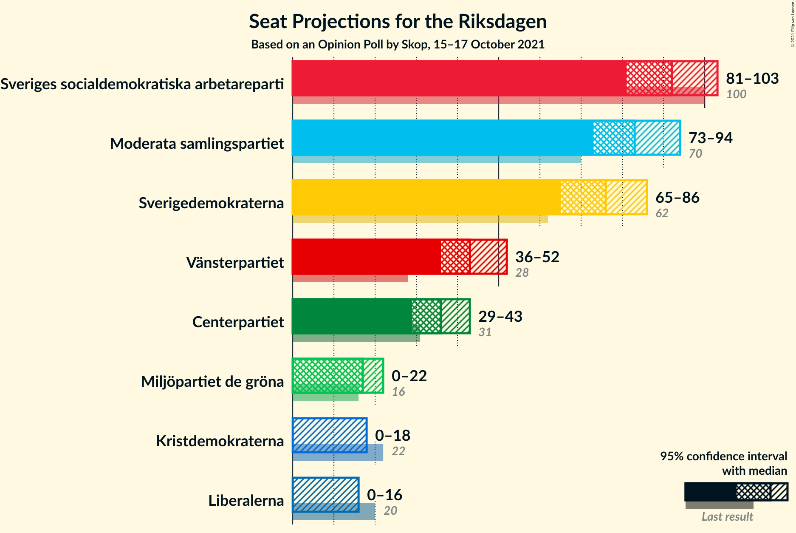
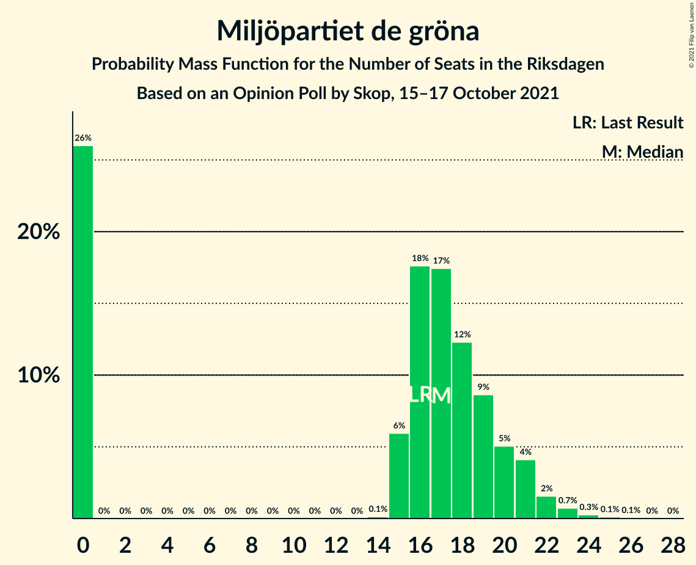
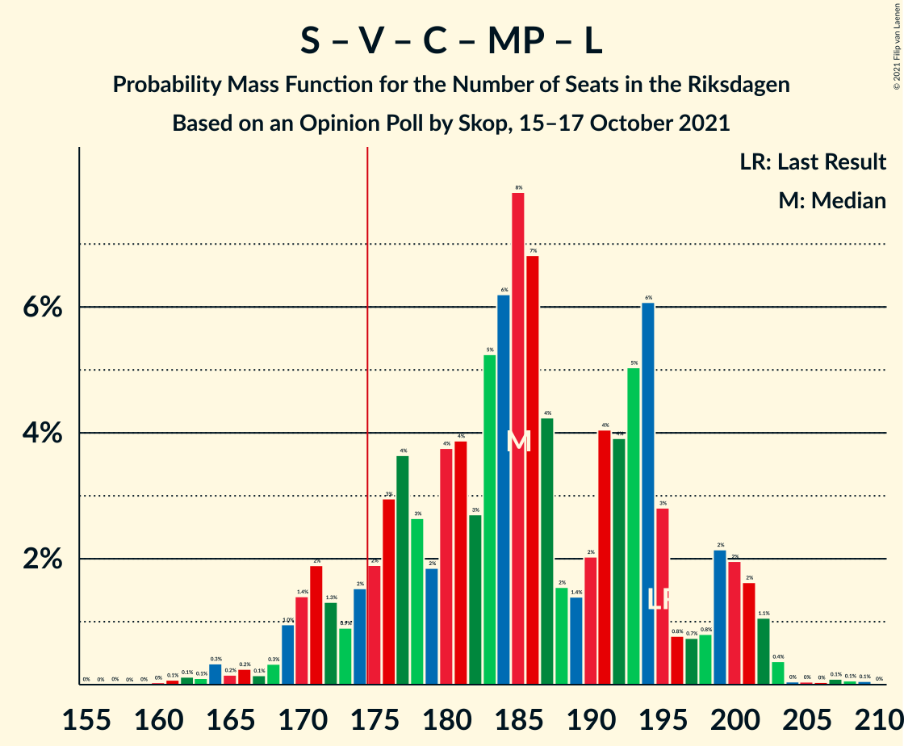

# Opinion Poll by Skop, 15–17 October 2021

<a href="#voting-intentions">Voting Intentions</a> | <a href="#seats">Seats</a> | <a href="#coalitions">Coalitions</a> | <a href="#technical-information">Technical Information</a>

## Voting Intentions

### Confidence Intervals

| Party | Last Result | Poll Result | 80% Confidence Interval | 90% Confidence Interval | 95% Confidence Interval | 99% Confidence Interval |
|:-----:|:-----------:|:-----------:|:-----------------------:|:-----------------------:|:-----------------------:|:-----------------------:|
| Sveriges socialdemokratiska arbetareparti | 28.3% | 24.3% | 22.7–26.1% |22.2–26.6% |21.8–27.1% |21.0–28.0% |
| Moderata samlingspartiet | 19.8% | 22.1% | 20.4–23.8% |20.0–24.3% |19.6–24.7% |18.9–25.6% |
| Sverigedemokraterna | 17.5% | 19.9% | 18.3–21.6% |17.9–22.0% |17.5–22.5% |16.8–23.3% |
| Vänsterpartiet | 8.0% | 11.5% | 10.3–12.9% |9.9–13.2% |9.6–13.6% |9.1–14.3% |
| Centerpartiet | 8.6% | 9.5% | 8.4–10.8% |8.1–11.1% |7.8–11.5% |7.3–12.1% |
| Miljöpartiet de gröna | 4.4% | 4.4% | 3.6–5.3% |3.4–5.6% |3.3–5.8% |2.9–6.3% |
| Kristdemokraterna | 6.3% | 3.7% | 3.0–4.5% |2.8–4.8% |2.7–5.0% |2.4–5.5% |
| Liberalerna | 5.5% | 3.1% | 2.5–3.9% |2.3–4.1% |2.2–4.3% |1.9–4.8% |

*Note:* The poll result column reflects the actual value used in the calculations. Published results may vary slightly, and in addition be rounded to fewer digits.

## Seats

### Confidence Intervals

| Party | Last Result | Median | 80% Confidence Interval | 90% Confidence Interval | 95% Confidence Interval | 99% Confidence Interval |
|:-----:|:-----------:|:------:|:-----------------------:|:-----------------------:|:-----------------------:|:-----------------------:|
| <a href="#sveriges-socialdemokratiska-arbetareparti">Sveriges socialdemokratiska arbetareparti</a> | 100 | 92 | 85–100 |81–101 |79–102 |77–106 |
| <a href="#moderata-samlingspartiet">Moderata samlingspartiet</a> | 70 | 84 | 76–92 |75–95 |73–98 |69–98 |
| <a href="#sverigedemokraterna">Sverigedemokraterna</a> | 62 | 76 | 68–82 |67–83 |66–84 |63–87 |
| <a href="#vänsterpartiet">Vänsterpartiet</a> | 28 | 42 | 39–49 |37–52 |36–52 |34–55 |
| <a href="#centerpartiet">Centerpartiet</a> | 31 | 35 | 30–40 |30–41 |29–43 |28–46 |
| <a href="#miljöpartiet-de-gröna">Miljöpartiet de gröna</a> | 16 | 16 | 0–19 |0–20 |0–21 |0–23 |
| <a href="#kristdemokraterna">Kristdemokraterna</a> | 22 | 0 | 0–16 |0–18 |0–18 |0–20 |
| <a href="#liberalerna">Liberalerna</a> | 20 | 0 | 0 |0–15 |0–15 |0–18 |

### Sveriges socialdemokratiska arbetareparti

*For a full overview of the results for this party, see the [Sveriges socialdemokratiska arbetareparti](party-sverigessocialdemokratiskaarbetareparti.html) page.*

| Number of Seats | Probability | Accumulated | Special Marks |
|:---------------:|:-----------:|:-----------:|:-------------:|
| 74 | 0% | 100% |  |
| 75 | 0.1% | 99.9% |  |
| 76 | 0.2% | 99.8% |  |
| 77 | 0.2% | 99.6% |  |
| 78 | 0.3% | 99.5% |  |
| 79 | 2% | 99.2% |  |
| 80 | 1.3% | 97% |  |
| 81 | 1.3% | 96% |  |
| 82 | 1.0% | 95% |  |
| 83 | 2% | 94% |  |
| 84 | 1.0% | 91% |  |
| 85 | 2% | 90% |  |
| 86 | 3% | 88% |  |
| 87 | 3% | 85% |  |
| 88 | 4% | 82% |  |
| 89 | 4% | 79% |  |
| 90 | 13% | 74% |  |
| 91 | 10% | 62% |  |
| 92 | 3% | 51% | Median |
| 93 | 10% | 48% |  |
| 94 | 7% | 38% |  |
| 95 | 5% | 31% |  |
| 96 | 5% | 26% |  |
| 97 | 1.1% | 21% |  |
| 98 | 4% | 20% |  |
| 99 | 4% | 16% |  |
| 100 | 3% | 12% | Last Result |
| 101 | 5% | 9% |  |
| 102 | 2% | 4% |  |
| 103 | 0.7% | 2% |  |
| 104 | 0.2% | 2% |  |
| 105 | 0.6% | 1.4% |  |
| 106 | 0.4% | 0.8% |  |
| 107 | 0% | 0.4% |  |
| 108 | 0.1% | 0.4% |  |
| 109 | 0.1% | 0.3% |  |
| 110 | 0% | 0.2% |  |
| 111 | 0% | 0.1% |  |
| 112 | 0% | 0.1% |  |
| 113 | 0.1% | 0.1% |  |
| 114 | 0% | 0% |  |

### Moderata samlingspartiet

*For a full overview of the results for this party, see the [Moderata samlingspartiet](party-moderatasamlingspartiet.html) page.*

| Number of Seats | Probability | Accumulated | Special Marks |
|:---------------:|:-----------:|:-----------:|:-------------:|
| 66 | 0% | 100% |  |
| 67 | 0.1% | 99.9% |  |
| 68 | 0% | 99.9% |  |
| 69 | 0.3% | 99.8% |  |
| 70 | 0.2% | 99.5% | Last Result |
| 71 | 0.2% | 99.3% |  |
| 72 | 1.0% | 99.1% |  |
| 73 | 2% | 98% |  |
| 74 | 0.5% | 96% |  |
| 75 | 2% | 96% |  |
| 76 | 4% | 94% |  |
| 77 | 2% | 90% |  |
| 78 | 3% | 88% |  |
| 79 | 2% | 85% |  |
| 80 | 5% | 82% |  |
| 81 | 9% | 77% |  |
| 82 | 12% | 68% |  |
| 83 | 6% | 56% |  |
| 84 | 6% | 50% | Median |
| 85 | 5% | 45% |  |
| 86 | 1.1% | 39% |  |
| 87 | 6% | 38% |  |
| 88 | 7% | 32% |  |
| 89 | 5% | 25% |  |
| 90 | 4% | 19% |  |
| 91 | 2% | 15% |  |
| 92 | 4% | 13% |  |
| 93 | 2% | 10% |  |
| 94 | 0.2% | 8% |  |
| 95 | 4% | 8% |  |
| 96 | 0.6% | 4% |  |
| 97 | 0.7% | 3% |  |
| 98 | 2% | 3% |  |
| 99 | 0.2% | 0.4% |  |
| 100 | 0.1% | 0.2% |  |
| 101 | 0% | 0.1% |  |
| 102 | 0% | 0.1% |  |
| 103 | 0.1% | 0.1% |  |
| 104 | 0% | 0% |  |

### Sverigedemokraterna

*For a full overview of the results for this party, see the [Sverigedemokraterna](party-sverigedemokraterna.html) page.*

| Number of Seats | Probability | Accumulated | Special Marks |
|:---------------:|:-----------:|:-----------:|:-------------:|
| 59 | 0% | 100% |  |
| 60 | 0.1% | 99.9% |  |
| 61 | 0.1% | 99.9% |  |
| 62 | 0.1% | 99.7% | Last Result |
| 63 | 0.3% | 99.6% |  |
| 64 | 0.6% | 99.3% |  |
| 65 | 0.9% | 98.7% |  |
| 66 | 1.1% | 98% |  |
| 67 | 6% | 97% |  |
| 68 | 5% | 91% |  |
| 69 | 5% | 86% |  |
| 70 | 5% | 82% |  |
| 71 | 3% | 77% |  |
| 72 | 6% | 74% |  |
| 73 | 3% | 68% |  |
| 74 | 4% | 65% |  |
| 75 | 4% | 61% |  |
| 76 | 7% | 56% | Median |
| 77 | 3% | 49% |  |
| 78 | 9% | 46% |  |
| 79 | 6% | 37% |  |
| 80 | 5% | 31% |  |
| 81 | 8% | 27% |  |
| 82 | 11% | 18% |  |
| 83 | 4% | 7% |  |
| 84 | 0.4% | 3% |  |
| 85 | 0.2% | 2% |  |
| 86 | 0.9% | 2% |  |
| 87 | 1.0% | 1.5% |  |
| 88 | 0.1% | 0.5% |  |
| 89 | 0.1% | 0.4% |  |
| 90 | 0.1% | 0.3% |  |
| 91 | 0.1% | 0.3% |  |
| 92 | 0.1% | 0.1% |  |
| 93 | 0% | 0% |  |

### Vänsterpartiet

*For a full overview of the results for this party, see the [Vänsterpartiet](party-vänsterpartiet.html) page.*

| Number of Seats | Probability | Accumulated | Special Marks |
|:---------------:|:-----------:|:-----------:|:-------------:|
| 28 | 0% | 100% | Last Result |
| 29 | 0% | 100% |  |
| 30 | 0% | 100% |  |
| 31 | 0% | 100% |  |
| 32 | 0% | 100% |  |
| 33 | 0.4% | 99.9% |  |
| 34 | 0.6% | 99.6% |  |
| 35 | 0.4% | 99.0% |  |
| 36 | 2% | 98.6% |  |
| 37 | 2% | 97% |  |
| 38 | 3% | 94% |  |
| 39 | 9% | 91% |  |
| 40 | 5% | 82% |  |
| 41 | 12% | 77% |  |
| 42 | 16% | 64% | Median |
| 43 | 7% | 48% |  |
| 44 | 7% | 41% |  |
| 45 | 3% | 34% |  |
| 46 | 6% | 31% |  |
| 47 | 13% | 25% |  |
| 48 | 2% | 13% |  |
| 49 | 0.6% | 10% |  |
| 50 | 2% | 10% |  |
| 51 | 0.6% | 8% |  |
| 52 | 5% | 7% |  |
| 53 | 0.6% | 2% |  |
| 54 | 0.2% | 2% |  |
| 55 | 1.3% | 2% |  |
| 56 | 0.2% | 0.3% |  |
| 57 | 0.1% | 0.1% |  |
| 58 | 0% | 0% |  |

### Centerpartiet

*For a full overview of the results for this party, see the [Centerpartiet](party-centerpartiet.html) page.*

| Number of Seats | Probability | Accumulated | Special Marks |
|:---------------:|:-----------:|:-----------:|:-------------:|
| 26 | 0.1% | 100% |  |
| 27 | 0.1% | 99.9% |  |
| 28 | 0.3% | 99.8% |  |
| 29 | 4% | 99.4% |  |
| 30 | 7% | 96% |  |
| 31 | 12% | 89% | Last Result |
| 32 | 10% | 77% |  |
| 33 | 9% | 67% |  |
| 34 | 6% | 58% |  |
| 35 | 7% | 52% | Median |
| 36 | 13% | 45% |  |
| 37 | 8% | 32% |  |
| 38 | 6% | 24% |  |
| 39 | 6% | 18% |  |
| 40 | 2% | 12% |  |
| 41 | 5% | 10% |  |
| 42 | 2% | 5% |  |
| 43 | 0.8% | 3% |  |
| 44 | 1.3% | 2% |  |
| 45 | 0.4% | 1.0% |  |
| 46 | 0.2% | 0.6% |  |
| 47 | 0.1% | 0.4% |  |
| 48 | 0.2% | 0.3% |  |
| 49 | 0% | 0% |  |

### Miljöpartiet de gröna

*For a full overview of the results for this party, see the [Miljöpartiet de gröna](party-miljöpartietdegröna.html) page.*

| Number of Seats | Probability | Accumulated | Special Marks |
|:---------------:|:-----------:|:-----------:|:-------------:|
| 0 | 30% | 100% |  |
| 1 | 0% | 70% |  |
| 2 | 0% | 70% |  |
| 3 | 0% | 70% |  |
| 4 | 0% | 70% |  |
| 5 | 0% | 70% |  |
| 6 | 0% | 70% |  |
| 7 | 0% | 70% |  |
| 8 | 0% | 70% |  |
| 9 | 0% | 70% |  |
| 10 | 0% | 70% |  |
| 11 | 0% | 70% |  |
| 12 | 0% | 70% |  |
| 13 | 0% | 70% |  |
| 14 | 0% | 70% |  |
| 15 | 6% | 70% |  |
| 16 | 16% | 64% | Last Result, Median |
| 17 | 12% | 48% |  |
| 18 | 15% | 35% |  |
| 19 | 11% | 20% |  |
| 20 | 4% | 9% |  |
| 21 | 3% | 5% |  |
| 22 | 0.9% | 2% |  |
| 23 | 0.7% | 1.2% |  |
| 24 | 0.2% | 0.4% |  |
| 25 | 0.1% | 0.2% |  |
| 26 | 0.1% | 0.1% |  |
| 27 | 0% | 0% |  |

### Kristdemokraterna

*For a full overview of the results for this party, see the [Kristdemokraterna](party-kristdemokraterna.html) page.*

| Number of Seats | Probability | Accumulated | Special Marks |
|:---------------:|:-----------:|:-----------:|:-------------:|
| 0 | 72% | 100% | Median |
| 1 | 0% | 28% |  |
| 2 | 0% | 28% |  |
| 3 | 0% | 28% |  |
| 4 | 0% | 28% |  |
| 5 | 0% | 28% |  |
| 6 | 0% | 28% |  |
| 7 | 0% | 28% |  |
| 8 | 0% | 28% |  |
| 9 | 0% | 28% |  |
| 10 | 0% | 28% |  |
| 11 | 0% | 28% |  |
| 12 | 0% | 28% |  |
| 13 | 0% | 28% |  |
| 14 | 0.2% | 28% |  |
| 15 | 10% | 28% |  |
| 16 | 9% | 18% |  |
| 17 | 4% | 9% |  |
| 18 | 3% | 5% |  |
| 19 | 1.1% | 2% |  |
| 20 | 1.0% | 1.2% |  |
| 21 | 0.2% | 0.3% |  |
| 22 | 0% | 0.1% | Last Result |
| 23 | 0% | 0.1% |  |
| 24 | 0% | 0% |  |

### Liberalerna

*For a full overview of the results for this party, see the [Liberalerna](party-liberalerna.html) page.*

| Number of Seats | Probability | Accumulated | Special Marks |
|:---------------:|:-----------:|:-----------:|:-------------:|
| 0 | 91% | 100% | Median |
| 1 | 0% | 9% |  |
| 2 | 0% | 9% |  |
| 3 | 0% | 9% |  |
| 4 | 0% | 9% |  |
| 5 | 0% | 9% |  |
| 6 | 0% | 9% |  |
| 7 | 0% | 9% |  |
| 8 | 0% | 9% |  |
| 9 | 0% | 9% |  |
| 10 | 0% | 9% |  |
| 11 | 0% | 9% |  |
| 12 | 0% | 9% |  |
| 13 | 0% | 9% |  |
| 14 | 2% | 9% |  |
| 15 | 5% | 8% |  |
| 16 | 1.3% | 2% |  |
| 17 | 0.5% | 1.2% |  |
| 18 | 0.4% | 0.6% |  |
| 19 | 0.1% | 0.2% |  |
| 20 | 0% | 0% | Last Result |

## Coalitions

### Confidence Intervals

| Coalition | Last Result | Median | Majority? | 80% Confidence Interval | 90% Confidence Interval | 95% Confidence Interval | 99% Confidence Interval |
|:---------:|:-----------:|:------:|:---------:|:-----------------------:|:-----------------------:|:-----------------------:|:-----------------------:|
| Sveriges socialdemokratiska arbetareparti – Moderata samlingspartiet – Centerpartiet | 201 | 211 | 100% | 200–224 | 196–227 | 192–230 | 189–234 |
| Sveriges socialdemokratiska arbetareparti – Vänsterpartiet – Centerpartiet – Miljöpartiet de gröna – Liberalerna | 195 | 184 | 89% | 174–195 | 171–199 | 171–200 | 161–203 |
| Sveriges socialdemokratiska arbetareparti – Moderata samlingspartiet | 170 | 177 | 72% | 164–186 | 161–189 | 160–193 | 156–194 |
| Moderata samlingspartiet – Sverigedemokraterna – Kristdemokraterna | 154 | 165 | 11% | 154–175 | 150–178 | 149–178 | 146–188 |
| Moderata samlingspartiet – Sverigedemokraterna | 132 | 161 | 3% | 149–171 | 148–172 | 144–175 | 140–178 |
| Sveriges socialdemokratiska arbetareparti – Vänsterpartiet – Miljöpartiet de gröna | 144 | 147 | 0% | 138–159 | 137–160 | 131–165 | 125–169 |
| Sveriges socialdemokratiska arbetareparti – Centerpartiet – Miljöpartiet de gröna – Liberalerna | 167 | 142 | 0% | 128–152 | 126–156 | 126–157 | 118–160 |
| Sveriges socialdemokratiska arbetareparti – Vänsterpartiet | 128 | 135 | 0% | 127–145 | 122–147 | 119–149 | 117–151 |
| Moderata samlingspartiet – Centerpartiet – Kristdemokraterna – Liberalerna | 143 | 126 | 0% | 114–134 | 113–140 | 111–142 | 108–148 |
| Moderata samlingspartiet – Centerpartiet – Kristdemokraterna | 123 | 125 | 0% | 114–134 | 110–137 | 106–140 | 105–148 |
| Moderata samlingspartiet – Centerpartiet – Liberalerna | 121 | 121 | 0% | 111–131 | 110–132 | 108–134 | 105–140 |
| Moderata samlingspartiet – Centerpartiet | 101 | 118 | 0% | 111–131 | 108–132 | 106–134 | 103–135 |
| Sveriges socialdemokratiska arbetareparti – Miljöpartiet de gröna | 116 | 106 | 0% | 92–113 | 90–118 | 89–119 | 84–123 |

### Sveriges socialdemokratiska arbetareparti – Moderata samlingspartiet – Centerpartiet

| Number of Seats | Probability | Accumulated | Special Marks |
|:---------------:|:-----------:|:-----------:|:-------------:|
| 185 | 0% | 100% |  |
| 186 | 0% | 99.9% |  |
| 187 | 0.1% | 99.9% |  |
| 188 | 0.3% | 99.9% |  |
| 189 | 0.3% | 99.6% |  |
| 190 | 2% | 99.3% |  |
| 191 | 0.2% | 98% |  |
| 192 | 0.2% | 98% |  |
| 193 | 0.3% | 97% |  |
| 194 | 0.2% | 97% |  |
| 195 | 1.1% | 97% |  |
| 196 | 3% | 96% |  |
| 197 | 0.1% | 93% |  |
| 198 | 0.6% | 93% |  |
| 199 | 2% | 92% |  |
| 200 | 2% | 90% |  |
| 201 | 3% | 88% | Last Result |
| 202 | 1.4% | 86% |  |
| 203 | 1.1% | 84% |  |
| 204 | 2% | 83% |  |
| 205 | 3% | 81% |  |
| 206 | 2% | 78% |  |
| 207 | 12% | 76% |  |
| 208 | 7% | 65% |  |
| 209 | 3% | 57% |  |
| 210 | 2% | 54% |  |
| 211 | 2% | 52% | Median |
| 212 | 4% | 50% |  |
| 213 | 6% | 46% |  |
| 214 | 1.5% | 40% |  |
| 215 | 10% | 38% |  |
| 216 | 3% | 29% |  |
| 217 | 2% | 26% |  |
| 218 | 3% | 23% |  |
| 219 | 0.7% | 20% |  |
| 220 | 1.1% | 20% |  |
| 221 | 4% | 19% |  |
| 222 | 1.5% | 15% |  |
| 223 | 0.8% | 14% |  |
| 224 | 5% | 13% |  |
| 225 | 2% | 8% |  |
| 226 | 0.5% | 6% |  |
| 227 | 1.0% | 6% |  |
| 228 | 0.1% | 5% |  |
| 229 | 2% | 5% |  |
| 230 | 0.9% | 3% |  |
| 231 | 0.1% | 2% |  |
| 232 | 0.9% | 2% |  |
| 233 | 0.1% | 0.8% |  |
| 234 | 0.5% | 0.8% |  |
| 235 | 0.1% | 0.3% |  |
| 236 | 0% | 0.1% |  |
| 237 | 0% | 0.1% |  |
| 238 | 0.1% | 0.1% |  |
| 239 | 0% | 0.1% |  |
| 240 | 0.1% | 0.1% |  |
| 241 | 0% | 0% |  |

### Sveriges socialdemokratiska arbetareparti – Vänsterpartiet – Centerpartiet – Miljöpartiet de gröna – Liberalerna

| Number of Seats | Probability | Accumulated | Special Marks |
|:---------------:|:-----------:|:-----------:|:-------------:|
| 160 | 0.3% | 100% |  |
| 161 | 0.4% | 99.7% |  |
| 162 | 0.5% | 99.3% |  |
| 163 | 0% | 98.8% |  |
| 164 | 0.1% | 98.8% |  |
| 165 | 0.1% | 98.7% |  |
| 166 | 0.4% | 98.6% |  |
| 167 | 0% | 98% |  |
| 168 | 0.1% | 98% |  |
| 169 | 0.1% | 98% |  |
| 170 | 0.1% | 98% |  |
| 171 | 3% | 98% |  |
| 172 | 2% | 95% |  |
| 173 | 1.3% | 93% |  |
| 174 | 2% | 91% |  |
| 175 | 3% | 89% | Majority |
| 176 | 0.5% | 86% |  |
| 177 | 5% | 86% |  |
| 178 | 5% | 81% |  |
| 179 | 1.5% | 76% |  |
| 180 | 3% | 74% |  |
| 181 | 7% | 72% |  |
| 182 | 2% | 65% |  |
| 183 | 8% | 63% |  |
| 184 | 8% | 55% |  |
| 185 | 13% | 47% | Median |
| 186 | 3% | 34% |  |
| 187 | 1.4% | 31% |  |
| 188 | 2% | 30% |  |
| 189 | 3% | 28% |  |
| 190 | 4% | 25% |  |
| 191 | 2% | 22% |  |
| 192 | 7% | 19% |  |
| 193 | 2% | 13% |  |
| 194 | 0.2% | 11% |  |
| 195 | 2% | 10% | Last Result |
| 196 | 0.7% | 8% |  |
| 197 | 0.3% | 8% |  |
| 198 | 0.3% | 7% |  |
| 199 | 2% | 7% |  |
| 200 | 3% | 5% |  |
| 201 | 0.4% | 2% |  |
| 202 | 0.9% | 1.4% |  |
| 203 | 0.2% | 0.5% |  |
| 204 | 0% | 0.3% |  |
| 205 | 0% | 0.3% |  |
| 206 | 0% | 0.3% |  |
| 207 | 0.2% | 0.3% |  |
| 208 | 0% | 0.1% |  |
| 209 | 0% | 0.1% |  |
| 210 | 0% | 0% |  |

### Sveriges socialdemokratiska arbetareparti – Moderata samlingspartiet

| Number of Seats | Probability | Accumulated | Special Marks |
|:---------------:|:-----------:|:-----------:|:-------------:|
| 150 | 0% | 100% |  |
| 151 | 0% | 99.9% |  |
| 152 | 0.1% | 99.9% |  |
| 153 | 0.1% | 99.8% |  |
| 154 | 0.1% | 99.7% |  |
| 155 | 0.1% | 99.7% |  |
| 156 | 0.1% | 99.5% |  |
| 157 | 0.5% | 99.5% |  |
| 158 | 0.5% | 98.9% |  |
| 159 | 0.3% | 98% |  |
| 160 | 2% | 98% |  |
| 161 | 1.1% | 96% |  |
| 162 | 0.5% | 95% |  |
| 163 | 2% | 94% |  |
| 164 | 4% | 93% |  |
| 165 | 1.1% | 89% |  |
| 166 | 2% | 88% |  |
| 167 | 1.2% | 86% |  |
| 168 | 0.3% | 84% |  |
| 169 | 2% | 84% |  |
| 170 | 2% | 82% | Last Result |
| 171 | 4% | 80% |  |
| 172 | 1.2% | 76% |  |
| 173 | 2% | 74% |  |
| 174 | 0.8% | 73% |  |
| 175 | 14% | 72% | Majority |
| 176 | 4% | 58% | Median |
| 177 | 6% | 54% |  |
| 178 | 6% | 48% |  |
| 179 | 8% | 42% |  |
| 180 | 7% | 34% |  |
| 181 | 3% | 28% |  |
| 182 | 5% | 25% |  |
| 183 | 1.3% | 20% |  |
| 184 | 1.0% | 19% |  |
| 185 | 7% | 18% |  |
| 186 | 0.8% | 10% |  |
| 187 | 0.2% | 9% |  |
| 188 | 3% | 9% |  |
| 189 | 2% | 6% |  |
| 190 | 0.6% | 4% |  |
| 191 | 0% | 4% |  |
| 192 | 0.6% | 4% |  |
| 193 | 2% | 3% |  |
| 194 | 0.6% | 0.8% |  |
| 195 | 0% | 0.2% |  |
| 196 | 0.1% | 0.2% |  |
| 197 | 0.1% | 0.2% |  |
| 198 | 0.1% | 0.1% |  |
| 199 | 0% | 0% |  |

### Moderata samlingspartiet – Sverigedemokraterna – Kristdemokraterna

| Number of Seats | Probability | Accumulated | Special Marks |
|:---------------:|:-----------:|:-----------:|:-------------:|
| 140 | 0% | 100% |  |
| 141 | 0% | 99.9% |  |
| 142 | 0.2% | 99.9% |  |
| 143 | 0% | 99.7% |  |
| 144 | 0% | 99.7% |  |
| 145 | 0% | 99.7% |  |
| 146 | 0.2% | 99.7% |  |
| 147 | 0.9% | 99.5% |  |
| 148 | 0.4% | 98.6% |  |
| 149 | 3% | 98% |  |
| 150 | 2% | 95% |  |
| 151 | 0.3% | 93% |  |
| 152 | 0.3% | 93% |  |
| 153 | 0.7% | 92% |  |
| 154 | 2% | 92% | Last Result |
| 155 | 0.2% | 90% |  |
| 156 | 2% | 89% |  |
| 157 | 7% | 87% |  |
| 158 | 2% | 81% |  |
| 159 | 4% | 78% |  |
| 160 | 3% | 75% | Median |
| 161 | 2% | 72% |  |
| 162 | 1.4% | 70% |  |
| 163 | 3% | 69% |  |
| 164 | 13% | 66% |  |
| 165 | 8% | 53% |  |
| 166 | 8% | 45% |  |
| 167 | 2% | 37% |  |
| 168 | 7% | 35% |  |
| 169 | 3% | 28% |  |
| 170 | 1.5% | 26% |  |
| 171 | 5% | 24% |  |
| 172 | 5% | 19% |  |
| 173 | 0.5% | 14% |  |
| 174 | 3% | 14% |  |
| 175 | 2% | 11% | Majority |
| 176 | 1.3% | 9% |  |
| 177 | 2% | 7% |  |
| 178 | 3% | 5% |  |
| 179 | 0.1% | 2% |  |
| 180 | 0.1% | 2% |  |
| 181 | 0.1% | 2% |  |
| 182 | 0% | 2% |  |
| 183 | 0.4% | 2% |  |
| 184 | 0.1% | 1.4% |  |
| 185 | 0.1% | 1.3% |  |
| 186 | 0% | 1.2% |  |
| 187 | 0.5% | 1.2% |  |
| 188 | 0.4% | 0.7% |  |
| 189 | 0.3% | 0.3% |  |
| 190 | 0% | 0% |  |

### Moderata samlingspartiet – Sverigedemokraterna

| Number of Seats | Probability | Accumulated | Special Marks |
|:---------------:|:-----------:|:-----------:|:-------------:|
| 132 | 0% | 100% | Last Result |
| 133 | 0% | 100% |  |
| 134 | 0% | 100% |  |
| 135 | 0% | 100% |  |
| 136 | 0% | 100% |  |
| 137 | 0.1% | 99.9% |  |
| 138 | 0% | 99.9% |  |
| 139 | 0% | 99.8% |  |
| 140 | 0.3% | 99.8% |  |
| 141 | 0.4% | 99.5% |  |
| 142 | 1.1% | 99.1% |  |
| 143 | 0.3% | 98% |  |
| 144 | 0.4% | 98% |  |
| 145 | 0.4% | 97% |  |
| 146 | 0.2% | 97% |  |
| 147 | 1.0% | 97% |  |
| 148 | 2% | 96% |  |
| 149 | 4% | 94% |  |
| 150 | 8% | 90% |  |
| 151 | 1.3% | 82% |  |
| 152 | 2% | 80% |  |
| 153 | 4% | 78% |  |
| 154 | 2% | 74% |  |
| 155 | 1.1% | 72% |  |
| 156 | 3% | 71% |  |
| 157 | 7% | 68% |  |
| 158 | 3% | 61% |  |
| 159 | 4% | 58% |  |
| 160 | 3% | 55% | Median |
| 161 | 3% | 51% |  |
| 162 | 3% | 48% |  |
| 163 | 2% | 45% |  |
| 164 | 12% | 43% |  |
| 165 | 4% | 31% |  |
| 166 | 7% | 27% |  |
| 167 | 1.1% | 20% |  |
| 168 | 4% | 19% |  |
| 169 | 1.1% | 15% |  |
| 170 | 1.1% | 14% |  |
| 171 | 4% | 13% |  |
| 172 | 4% | 9% |  |
| 173 | 0.2% | 4% |  |
| 174 | 0.7% | 4% |  |
| 175 | 2% | 3% | Majority |
| 176 | 0.1% | 1.3% |  |
| 177 | 0% | 1.2% |  |
| 178 | 1.1% | 1.2% |  |
| 179 | 0% | 0.1% |  |
| 180 | 0% | 0.1% |  |
| 181 | 0% | 0.1% |  |
| 182 | 0% | 0.1% |  |
| 183 | 0% | 0.1% |  |
| 184 | 0% | 0% |  |

### Sveriges socialdemokratiska arbetareparti – Vänsterpartiet – Miljöpartiet de gröna

| Number of Seats | Probability | Accumulated | Special Marks |
|:---------------:|:-----------:|:-----------:|:-------------:|
| 122 | 0% | 100% |  |
| 123 | 0% | 99.9% |  |
| 124 | 0% | 99.9% |  |
| 125 | 0.5% | 99.9% |  |
| 126 | 0.1% | 99.4% |  |
| 127 | 0% | 99.3% |  |
| 128 | 0.3% | 99.3% |  |
| 129 | 0.5% | 99.0% |  |
| 130 | 0.6% | 98.5% |  |
| 131 | 0.5% | 98% |  |
| 132 | 0.2% | 97% |  |
| 133 | 0.5% | 97% |  |
| 134 | 1.0% | 97% |  |
| 135 | 0.3% | 96% |  |
| 136 | 0.4% | 95% |  |
| 137 | 4% | 95% |  |
| 138 | 2% | 91% |  |
| 139 | 3% | 89% |  |
| 140 | 5% | 86% |  |
| 141 | 3% | 81% |  |
| 142 | 10% | 77% |  |
| 143 | 3% | 68% |  |
| 144 | 0.8% | 65% | Last Result |
| 145 | 1.5% | 64% |  |
| 146 | 1.0% | 63% |  |
| 147 | 12% | 62% |  |
| 148 | 4% | 49% |  |
| 149 | 1.1% | 46% |  |
| 150 | 2% | 45% | Median |
| 151 | 2% | 43% |  |
| 152 | 4% | 41% |  |
| 153 | 16% | 37% |  |
| 154 | 5% | 21% |  |
| 155 | 3% | 16% |  |
| 156 | 1.3% | 13% |  |
| 157 | 0.7% | 12% |  |
| 158 | 0.4% | 11% |  |
| 159 | 4% | 11% |  |
| 160 | 2% | 7% |  |
| 161 | 0.6% | 4% |  |
| 162 | 0.1% | 4% |  |
| 163 | 0.3% | 4% |  |
| 164 | 0.7% | 3% |  |
| 165 | 1.4% | 3% |  |
| 166 | 0.1% | 1.3% |  |
| 167 | 0.1% | 1.3% |  |
| 168 | 0.3% | 1.1% |  |
| 169 | 0.5% | 0.9% |  |
| 170 | 0.2% | 0.3% |  |
| 171 | 0.1% | 0.1% |  |
| 172 | 0% | 0% |  |

### Sveriges socialdemokratiska arbetareparti – Centerpartiet – Miljöpartiet de gröna – Liberalerna

| Number of Seats | Probability | Accumulated | Special Marks |
|:---------------:|:-----------:|:-----------:|:-------------:|
| 113 | 0.1% | 100% |  |
| 114 | 0% | 99.9% |  |
| 115 | 0% | 99.9% |  |
| 116 | 0% | 99.9% |  |
| 117 | 0% | 99.9% |  |
| 118 | 0.6% | 99.9% |  |
| 119 | 0.1% | 99.2% |  |
| 120 | 0% | 99.2% |  |
| 121 | 0.1% | 99.2% |  |
| 122 | 0.5% | 99.0% |  |
| 123 | 0.6% | 98% |  |
| 124 | 0.1% | 98% |  |
| 125 | 0.1% | 98% |  |
| 126 | 3% | 98% |  |
| 127 | 4% | 94% |  |
| 128 | 2% | 90% |  |
| 129 | 0.2% | 89% |  |
| 130 | 0.1% | 89% |  |
| 131 | 4% | 89% |  |
| 132 | 3% | 85% |  |
| 133 | 4% | 82% |  |
| 134 | 0.2% | 78% |  |
| 135 | 2% | 78% |  |
| 136 | 4% | 76% |  |
| 137 | 5% | 72% |  |
| 138 | 3% | 67% |  |
| 139 | 0.9% | 64% |  |
| 140 | 4% | 63% |  |
| 141 | 4% | 59% |  |
| 142 | 6% | 55% |  |
| 143 | 14% | 49% | Median |
| 144 | 10% | 35% |  |
| 145 | 4% | 25% |  |
| 146 | 1.2% | 22% |  |
| 147 | 0.5% | 20% |  |
| 148 | 0.8% | 20% |  |
| 149 | 2% | 19% |  |
| 150 | 5% | 17% |  |
| 151 | 0.6% | 13% |  |
| 152 | 2% | 12% |  |
| 153 | 3% | 10% |  |
| 154 | 0.8% | 7% |  |
| 155 | 0.9% | 6% |  |
| 156 | 1.4% | 5% |  |
| 157 | 2% | 4% |  |
| 158 | 0.6% | 2% |  |
| 159 | 0.2% | 1.0% |  |
| 160 | 0.3% | 0.8% |  |
| 161 | 0.3% | 0.5% |  |
| 162 | 0% | 0.2% |  |
| 163 | 0% | 0.2% |  |
| 164 | 0.1% | 0.2% |  |
| 165 | 0% | 0.1% |  |
| 166 | 0% | 0.1% |  |
| 167 | 0% | 0.1% | Last Result |
| 168 | 0% | 0.1% |  |
| 169 | 0% | 0% |  |

### Sveriges socialdemokratiska arbetareparti – Vänsterpartiet

| Number of Seats | Probability | Accumulated | Special Marks |
|:---------------:|:-----------:|:-----------:|:-------------:|
| 115 | 0.1% | 100% |  |
| 116 | 0.3% | 99.9% |  |
| 117 | 0.4% | 99.6% |  |
| 118 | 0.5% | 99.2% |  |
| 119 | 2% | 98.8% |  |
| 120 | 0.4% | 97% |  |
| 121 | 0.8% | 96% |  |
| 122 | 0.9% | 96% |  |
| 123 | 0.8% | 95% |  |
| 124 | 0.8% | 94% |  |
| 125 | 1.0% | 93% |  |
| 126 | 2% | 92% |  |
| 127 | 3% | 90% |  |
| 128 | 2% | 87% | Last Result |
| 129 | 1.5% | 85% |  |
| 130 | 7% | 84% |  |
| 131 | 6% | 77% |  |
| 132 | 0.6% | 71% |  |
| 133 | 6% | 70% |  |
| 134 | 2% | 64% | Median |
| 135 | 13% | 62% |  |
| 136 | 5% | 49% |  |
| 137 | 7% | 44% |  |
| 138 | 4% | 37% |  |
| 139 | 5% | 34% |  |
| 140 | 5% | 29% |  |
| 141 | 4% | 24% |  |
| 142 | 6% | 20% |  |
| 143 | 0.3% | 13% |  |
| 144 | 3% | 13% |  |
| 145 | 2% | 10% |  |
| 146 | 3% | 9% |  |
| 147 | 3% | 6% |  |
| 148 | 1.1% | 4% |  |
| 149 | 0.3% | 3% |  |
| 150 | 0.5% | 2% |  |
| 151 | 2% | 2% |  |
| 152 | 0% | 0.3% |  |
| 153 | 0.1% | 0.3% |  |
| 154 | 0.1% | 0.2% |  |
| 155 | 0% | 0.2% |  |
| 156 | 0% | 0.2% |  |
| 157 | 0% | 0.1% |  |
| 158 | 0% | 0.1% |  |
| 159 | 0% | 0.1% |  |
| 160 | 0% | 0.1% |  |
| 161 | 0% | 0.1% |  |
| 162 | 0% | 0.1% |  |
| 163 | 0.1% | 0.1% |  |
| 164 | 0% | 0% |  |

### Moderata samlingspartiet – Centerpartiet – Kristdemokraterna – Liberalerna

| Number of Seats | Probability | Accumulated | Special Marks |
|:---------------:|:-----------:|:-----------:|:-------------:|
| 103 | 0.1% | 100% |  |
| 104 | 0% | 99.8% |  |
| 105 | 0.2% | 99.8% |  |
| 106 | 0% | 99.6% |  |
| 107 | 0% | 99.6% |  |
| 108 | 1.0% | 99.5% |  |
| 109 | 0.1% | 98.5% |  |
| 110 | 0.9% | 98% |  |
| 111 | 2% | 98% |  |
| 112 | 0.1% | 96% |  |
| 113 | 0.8% | 95% |  |
| 114 | 11% | 95% |  |
| 115 | 1.1% | 83% |  |
| 116 | 2% | 82% |  |
| 117 | 0.6% | 80% |  |
| 118 | 2% | 80% |  |
| 119 | 1.5% | 77% | Median |
| 120 | 3% | 76% |  |
| 121 | 3% | 73% |  |
| 122 | 1.4% | 70% |  |
| 123 | 6% | 68% |  |
| 124 | 7% | 63% |  |
| 125 | 3% | 56% |  |
| 126 | 9% | 53% |  |
| 127 | 4% | 45% |  |
| 128 | 2% | 40% |  |
| 129 | 9% | 38% |  |
| 130 | 3% | 29% |  |
| 131 | 6% | 26% |  |
| 132 | 5% | 20% |  |
| 133 | 0.5% | 15% |  |
| 134 | 5% | 15% |  |
| 135 | 0.9% | 10% |  |
| 136 | 0.5% | 9% |  |
| 137 | 1.4% | 8% |  |
| 138 | 0.3% | 7% |  |
| 139 | 0.7% | 7% |  |
| 140 | 3% | 6% |  |
| 141 | 0.7% | 3% |  |
| 142 | 0.6% | 3% |  |
| 143 | 0.4% | 2% | Last Result |
| 144 | 0.2% | 2% |  |
| 145 | 0.4% | 1.4% |  |
| 146 | 0.1% | 0.9% |  |
| 147 | 0.1% | 0.8% |  |
| 148 | 0.5% | 0.7% |  |
| 149 | 0.1% | 0.2% |  |
| 150 | 0% | 0.1% |  |
| 151 | 0% | 0.1% |  |
| 152 | 0% | 0.1% |  |
| 153 | 0% | 0% |  |

### Moderata samlingspartiet – Centerpartiet – Kristdemokraterna

| Number of Seats | Probability | Accumulated | Special Marks |
|:---------------:|:-----------:|:-----------:|:-------------:|
| 101 | 0% | 100% |  |
| 102 | 0.1% | 99.9% |  |
| 103 | 0.1% | 99.8% |  |
| 104 | 0% | 99.7% |  |
| 105 | 1.1% | 99.7% |  |
| 106 | 1.3% | 98.6% |  |
| 107 | 0% | 97% |  |
| 108 | 1.3% | 97% |  |
| 109 | 0.1% | 96% |  |
| 110 | 0.9% | 96% |  |
| 111 | 2% | 95% |  |
| 112 | 0.1% | 93% |  |
| 113 | 0.8% | 93% |  |
| 114 | 12% | 92% |  |
| 115 | 1.2% | 80% |  |
| 116 | 3% | 79% |  |
| 117 | 1.2% | 76% |  |
| 118 | 3% | 74% |  |
| 119 | 1.4% | 72% | Median |
| 120 | 3% | 70% |  |
| 121 | 2% | 67% |  |
| 122 | 2% | 66% |  |
| 123 | 6% | 64% | Last Result |
| 124 | 7% | 59% |  |
| 125 | 3% | 52% |  |
| 126 | 10% | 49% |  |
| 127 | 4% | 39% |  |
| 128 | 3% | 35% |  |
| 129 | 8% | 32% |  |
| 130 | 4% | 24% |  |
| 131 | 5% | 20% |  |
| 132 | 4% | 16% |  |
| 133 | 0.3% | 12% |  |
| 134 | 5% | 12% |  |
| 135 | 0.8% | 6% |  |
| 136 | 0.4% | 6% |  |
| 137 | 1.2% | 5% |  |
| 138 | 0.2% | 4% |  |
| 139 | 0.6% | 4% |  |
| 140 | 1.4% | 3% |  |
| 141 | 0.4% | 2% |  |
| 142 | 0.2% | 1.3% |  |
| 143 | 0.3% | 1.1% |  |
| 144 | 0.1% | 0.8% |  |
| 145 | 0.1% | 0.7% |  |
| 146 | 0% | 0.6% |  |
| 147 | 0% | 0.6% |  |
| 148 | 0.5% | 0.6% |  |
| 149 | 0% | 0.1% |  |
| 150 | 0% | 0% |  |

### Moderata samlingspartiet – Centerpartiet – Liberalerna

| Number of Seats | Probability | Accumulated | Special Marks |
|:---------------:|:-----------:|:-----------:|:-------------:|
| 101 | 0% | 100% |  |
| 102 | 0% | 99.9% |  |
| 103 | 0.1% | 99.9% |  |
| 104 | 0% | 99.8% |  |
| 105 | 0.3% | 99.7% |  |
| 106 | 0.1% | 99.4% |  |
| 107 | 0.1% | 99.3% |  |
| 108 | 2% | 99.2% |  |
| 109 | 0.7% | 97% |  |
| 110 | 2% | 96% |  |
| 111 | 7% | 94% |  |
| 112 | 1.0% | 87% |  |
| 113 | 1.3% | 86% |  |
| 114 | 17% | 85% |  |
| 115 | 3% | 68% |  |
| 116 | 4% | 65% |  |
| 117 | 2% | 61% |  |
| 118 | 3% | 60% |  |
| 119 | 2% | 57% | Median |
| 120 | 3% | 55% |  |
| 121 | 4% | 51% | Last Result |
| 122 | 2% | 48% |  |
| 123 | 6% | 45% |  |
| 124 | 6% | 40% |  |
| 125 | 4% | 33% |  |
| 126 | 7% | 29% |  |
| 127 | 0.8% | 22% |  |
| 128 | 3% | 22% |  |
| 129 | 5% | 19% |  |
| 130 | 1.0% | 14% |  |
| 131 | 6% | 13% |  |
| 132 | 2% | 7% |  |
| 133 | 0.4% | 5% |  |
| 134 | 3% | 5% |  |
| 135 | 0.1% | 1.3% |  |
| 136 | 0.1% | 1.2% |  |
| 137 | 0.3% | 1.1% |  |
| 138 | 0.1% | 0.8% |  |
| 139 | 0.1% | 0.7% |  |
| 140 | 0.1% | 0.5% |  |
| 141 | 0.1% | 0.5% |  |
| 142 | 0.1% | 0.4% |  |
| 143 | 0.1% | 0.3% |  |
| 144 | 0% | 0.2% |  |
| 145 | 0% | 0.2% |  |
| 146 | 0% | 0.2% |  |
| 147 | 0.1% | 0.1% |  |
| 148 | 0% | 0.1% |  |
| 149 | 0.1% | 0.1% |  |
| 150 | 0% | 0% |  |

### Moderata samlingspartiet – Centerpartiet

| Number of Seats | Probability | Accumulated | Special Marks |
|:---------------:|:-----------:|:-----------:|:-------------:|
| 100 | 0.2% | 100% |  |
| 101 | 0.1% | 99.8% | Last Result |
| 102 | 0.1% | 99.7% |  |
| 103 | 0.6% | 99.6% |  |
| 104 | 0.1% | 99.0% |  |
| 105 | 1.3% | 98.8% |  |
| 106 | 1.3% | 98% |  |
| 107 | 0.3% | 96% |  |
| 108 | 3% | 96% |  |
| 109 | 0.8% | 93% |  |
| 110 | 2% | 92% |  |
| 111 | 8% | 90% |  |
| 112 | 1.1% | 82% |  |
| 113 | 2% | 81% |  |
| 114 | 17% | 79% |  |
| 115 | 3% | 62% |  |
| 116 | 5% | 59% |  |
| 117 | 2% | 54% |  |
| 118 | 3% | 52% |  |
| 119 | 2% | 49% | Median |
| 120 | 3% | 47% |  |
| 121 | 2% | 44% |  |
| 122 | 2% | 42% |  |
| 123 | 5% | 40% |  |
| 124 | 6% | 35% |  |
| 125 | 3% | 29% |  |
| 126 | 7% | 26% |  |
| 127 | 0.8% | 19% |  |
| 128 | 2% | 18% |  |
| 129 | 5% | 16% |  |
| 130 | 0.9% | 11% |  |
| 131 | 4% | 10% |  |
| 132 | 2% | 6% |  |
| 133 | 0.2% | 4% |  |
| 134 | 3% | 4% |  |
| 135 | 0.1% | 0.6% |  |
| 136 | 0% | 0.5% |  |
| 137 | 0.3% | 0.4% |  |
| 138 | 0% | 0.2% |  |
| 139 | 0% | 0.1% |  |
| 140 | 0.1% | 0.1% |  |
| 141 | 0% | 0.1% |  |
| 142 | 0% | 0% |  |

### Sveriges socialdemokratiska arbetareparti – Miljöpartiet de gröna

| Number of Seats | Probability | Accumulated | Special Marks |
|:---------------:|:-----------:|:-----------:|:-------------:|
| 80 | 0.1% | 100% |  |
| 81 | 0.1% | 99.9% |  |
| 82 | 0.1% | 99.8% |  |
| 83 | 0% | 99.7% |  |
| 84 | 0.2% | 99.6% |  |
| 85 | 0.9% | 99.4% |  |
| 86 | 0.2% | 98.5% |  |
| 87 | 0.4% | 98% |  |
| 88 | 0.4% | 98% |  |
| 89 | 2% | 98% |  |
| 90 | 3% | 95% |  |
| 91 | 1.1% | 92% |  |
| 92 | 1.4% | 91% |  |
| 93 | 0.8% | 90% |  |
| 94 | 0.6% | 89% |  |
| 95 | 4% | 89% |  |
| 96 | 4% | 85% |  |
| 97 | 3% | 81% |  |
| 98 | 4% | 78% |  |
| 99 | 5% | 74% |  |
| 100 | 3% | 69% |  |
| 101 | 4% | 66% |  |
| 102 | 2% | 63% |  |
| 103 | 3% | 60% |  |
| 104 | 3% | 58% |  |
| 105 | 0.9% | 55% |  |
| 106 | 7% | 54% |  |
| 107 | 3% | 47% |  |
| 108 | 7% | 45% | Median |
| 109 | 5% | 37% |  |
| 110 | 0.7% | 32% |  |
| 111 | 15% | 32% |  |
| 112 | 2% | 17% |  |
| 113 | 4% | 14% |  |
| 114 | 0.8% | 10% |  |
| 115 | 0.7% | 9% |  |
| 116 | 1.3% | 8% | Last Result |
| 117 | 2% | 7% |  |
| 118 | 2% | 5% |  |
| 119 | 1.1% | 3% |  |
| 120 | 0.3% | 2% |  |
| 121 | 0.1% | 2% |  |
| 122 | 0% | 2% |  |
| 123 | 1.1% | 2% |  |
| 124 | 0% | 0.5% |  |
| 125 | 0.3% | 0.5% |  |
| 126 | 0.1% | 0.2% |  |
| 127 | 0% | 0.1% |  |
| 128 | 0.1% | 0.1% |  |
| 129 | 0% | 0% |  |

## Technical Information

### Opinion Poll

+ **Polling firm:** Skop
+ **Commissioner(s):** —
+ **Fieldwork period:** 15–17 October 2021

### Calculations

+ **Sample size:** 1011
+ **Simulations done:** 131,072
+ **Error estimate:** 1.45%

