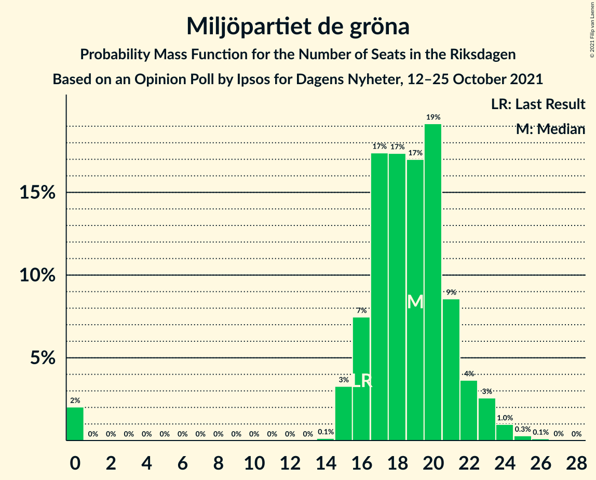
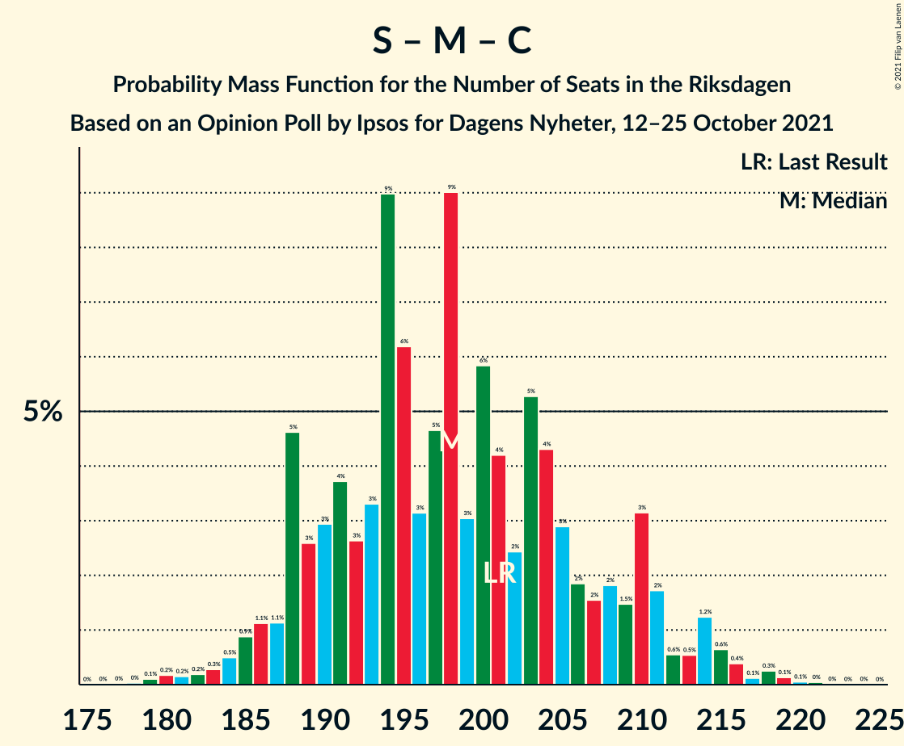
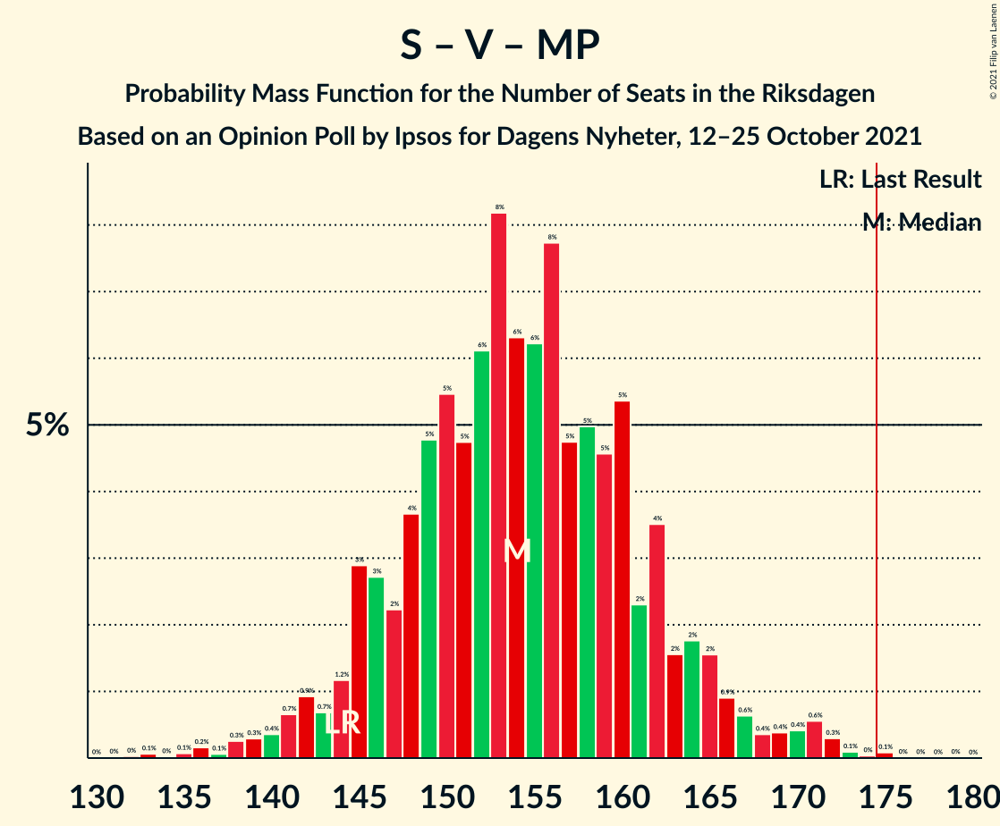
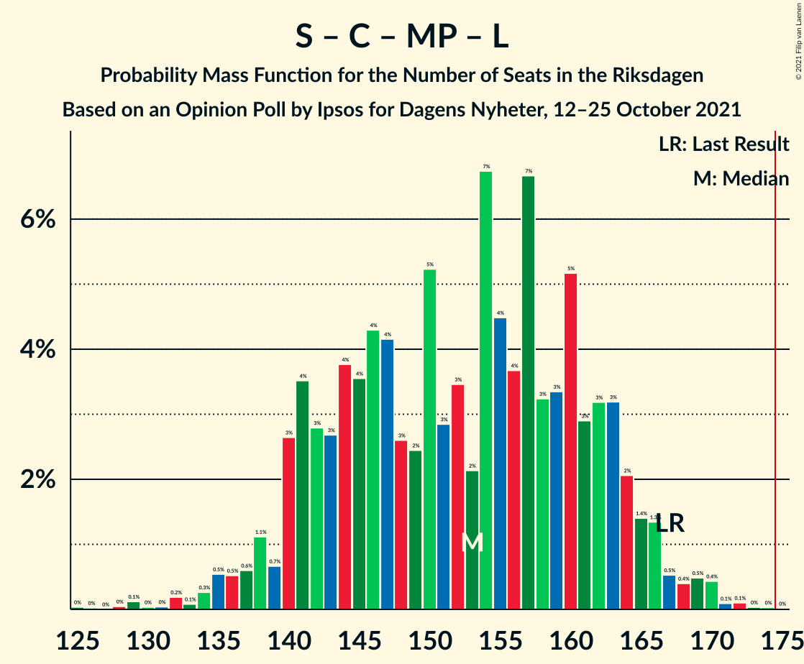

# Opinion Poll by Ipsos for Dagens Nyheter, 12–25 October 2021

<a href="#voting-intentions">Voting Intentions</a> | <a href="#seats">Seats</a> | <a href="#coalitions">Coalitions</a> | <a href="#technical-information">Technical Information</a>

## Voting Intentions

### Confidence Intervals

| Party | Last Result | Poll Result | 80% Confidence Interval | 90% Confidence Interval | 95% Confidence Interval | 99% Confidence Interval |
|:-----:|:-----------:|:-----------:|:-----------------------:|:-----------------------:|:-----------------------:|:-----------------------:|
| Sveriges socialdemokratiska arbetareparti | 28.3% | 26.0% | 24.6–27.5% |24.2–27.9% |23.9–28.3% |23.3–29.0% |
| Moderata samlingspartiet | 19.8% | 20.0% | 18.7–21.3% |18.4–21.7% |18.1–22.0% |17.5–22.7% |
| Sverigedemokraterna | 17.5% | 20.0% | 18.7–21.3% |18.4–21.7% |18.1–22.0% |17.5–22.7% |
| Vänsterpartiet | 8.0% | 11.0% | 10.0–12.1% |9.8–12.4% |9.5–12.7% |9.1–13.2% |
| Centerpartiet | 8.6% | 8.0% | 7.2–9.0% |7.0–9.2% |6.8–9.5% |6.4–9.9% |
| Miljöpartiet de gröna | 4.4% | 5.0% | 4.4–5.8% |4.2–6.0% |4.0–6.2% |3.8–6.6% |
| Kristdemokraterna | 6.3% | 4.0% | 3.4–4.7% |3.3–4.9% |3.1–5.1% |2.9–5.5% |
| Liberalerna | 5.5% | 4.0% | 3.4–4.7% |3.3–4.9% |3.1–5.1% |2.9–5.5% |

*Note:* The poll result column reflects the actual value used in the calculations. Published results may vary slightly, and in addition be rounded to fewer digits.

## Seats

### Confidence Intervals

| Party | Last Result | Median | 80% Confidence Interval | 90% Confidence Interval | 95% Confidence Interval | 99% Confidence Interval |
|:-----:|:-----------:|:------:|:-----------------------:|:-----------------------:|:-----------------------:|:-----------------------:|
| <a href="#sveriges-socialdemokratiska-arbetareparti">Sveriges socialdemokratiska arbetareparti</a> | 100 | 95 | 89–102 |88–104 |87–106 |83–109 |
| <a href="#moderata-samlingspartiet">Moderata samlingspartiet</a> | 70 | 73 | 68–79 |66–81 |65–82 |63–85 |
| <a href="#sverigedemokraterna">Sverigedemokraterna</a> | 62 | 74 | 67–78 |66–80 |66–82 |64–86 |
| <a href="#vänsterpartiet">Vänsterpartiet</a> | 28 | 41 | 37–44 |36–46 |35–47 |33–49 |
| <a href="#centerpartiet">Centerpartiet</a> | 31 | 29 | 26–33 |26–34 |25–35 |23–37 |
| <a href="#miljöpartiet-de-gröna">Miljöpartiet de gröna</a> | 16 | 19 | 16–21 |15–22 |15–23 |0–24 |
| <a href="#kristdemokraterna">Kristdemokraterna</a> | 22 | 16 | 0–16 |0–16 |0–19 |0–20 |
| <a href="#liberalerna">Liberalerna</a> | 20 | 15 | 0–17 |0–18 |0–19 |0–20 |

### Sveriges socialdemokratiska arbetareparti

*For a full overview of the results for this party, see the [Sveriges socialdemokratiska arbetareparti](party-sverigessocialdemokratiskaarbetareparti.html) page.*

| Number of Seats | Probability | Accumulated | Special Marks |
|:---------------:|:-----------:|:-----------:|:-------------:|
| 81 | 0.1% | 100% |  |
| 82 | 0.1% | 99.9% |  |
| 83 | 0.3% | 99.8% |  |
| 84 | 0.3% | 99.5% |  |
| 85 | 0.6% | 99.1% |  |
| 86 | 0.8% | 98.6% |  |
| 87 | 1.4% | 98% |  |
| 88 | 3% | 96% |  |
| 89 | 4% | 94% |  |
| 90 | 3% | 89% |  |
| 91 | 6% | 86% |  |
| 92 | 8% | 80% |  |
| 93 | 7% | 73% |  |
| 94 | 8% | 66% |  |
| 95 | 11% | 58% | Median |
| 96 | 10% | 47% |  |
| 97 | 6% | 36% |  |
| 98 | 6% | 31% |  |
| 99 | 7% | 24% |  |
| 100 | 4% | 18% | Last Result |
| 101 | 4% | 14% |  |
| 102 | 2% | 10% |  |
| 103 | 3% | 8% |  |
| 104 | 1.3% | 5% |  |
| 105 | 0.8% | 4% |  |
| 106 | 2% | 3% |  |
| 107 | 0.4% | 1.5% |  |
| 108 | 0.4% | 1.1% |  |
| 109 | 0.3% | 0.7% |  |
| 110 | 0.1% | 0.4% |  |
| 111 | 0.1% | 0.2% |  |
| 112 | 0.1% | 0.1% |  |
| 113 | 0% | 0.1% |  |
| 114 | 0% | 0% |  |

### Moderata samlingspartiet

*For a full overview of the results for this party, see the [Moderata samlingspartiet](party-moderatasamlingspartiet.html) page.*

| Number of Seats | Probability | Accumulated | Special Marks |
|:---------------:|:-----------:|:-----------:|:-------------:|
| 61 | 0.1% | 100% |  |
| 62 | 0.1% | 99.9% |  |
| 63 | 0.4% | 99.7% |  |
| 64 | 1.0% | 99.4% |  |
| 65 | 1.0% | 98% |  |
| 66 | 3% | 97% |  |
| 67 | 4% | 95% |  |
| 68 | 6% | 91% |  |
| 69 | 6% | 85% |  |
| 70 | 4% | 79% | Last Result |
| 71 | 11% | 75% |  |
| 72 | 10% | 64% |  |
| 73 | 7% | 55% | Median |
| 74 | 8% | 47% |  |
| 75 | 10% | 39% |  |
| 76 | 9% | 29% |  |
| 77 | 3% | 21% |  |
| 78 | 7% | 17% |  |
| 79 | 2% | 11% |  |
| 80 | 3% | 9% |  |
| 81 | 3% | 6% |  |
| 82 | 0.7% | 3% |  |
| 83 | 0.8% | 2% |  |
| 84 | 0.5% | 1.2% |  |
| 85 | 0.2% | 0.7% |  |
| 86 | 0.3% | 0.4% |  |
| 87 | 0.1% | 0.2% |  |
| 88 | 0% | 0.1% |  |
| 89 | 0% | 0% |  |

### Sverigedemokraterna

*For a full overview of the results for this party, see the [Sverigedemokraterna](party-sverigedemokraterna.html) page.*

| Number of Seats | Probability | Accumulated | Special Marks |
|:---------------:|:-----------:|:-----------:|:-------------:|
| 60 | 0% | 100% |  |
| 61 | 0% | 99.9% |  |
| 62 | 0.1% | 99.9% | Last Result |
| 63 | 0.3% | 99.8% |  |
| 64 | 0.7% | 99.5% |  |
| 65 | 1.1% | 98.8% |  |
| 66 | 7% | 98% |  |
| 67 | 3% | 91% |  |
| 68 | 5% | 88% |  |
| 69 | 4% | 83% |  |
| 70 | 6% | 80% |  |
| 71 | 8% | 74% |  |
| 72 | 9% | 66% |  |
| 73 | 6% | 57% |  |
| 74 | 9% | 52% | Median |
| 75 | 11% | 43% |  |
| 76 | 5% | 32% |  |
| 77 | 13% | 26% |  |
| 78 | 4% | 13% |  |
| 79 | 3% | 9% |  |
| 80 | 2% | 6% |  |
| 81 | 0.7% | 4% |  |
| 82 | 0.7% | 3% |  |
| 83 | 0.7% | 2% |  |
| 84 | 0.8% | 2% |  |
| 85 | 0.2% | 0.7% |  |
| 86 | 0.2% | 0.5% |  |
| 87 | 0.2% | 0.3% |  |
| 88 | 0% | 0.1% |  |
| 89 | 0.1% | 0.1% |  |
| 90 | 0% | 0% |  |

### Vänsterpartiet

*For a full overview of the results for this party, see the [Vänsterpartiet](party-vänsterpartiet.html) page.*

| Number of Seats | Probability | Accumulated | Special Marks |
|:---------------:|:-----------:|:-----------:|:-------------:|
| 28 | 0% | 100% | Last Result |
| 29 | 0% | 100% |  |
| 30 | 0% | 100% |  |
| 31 | 0% | 100% |  |
| 32 | 0.2% | 99.9% |  |
| 33 | 0.5% | 99.7% |  |
| 34 | 1.4% | 99.3% |  |
| 35 | 3% | 98% |  |
| 36 | 3% | 95% |  |
| 37 | 5% | 92% |  |
| 38 | 13% | 87% |  |
| 39 | 11% | 74% |  |
| 40 | 13% | 63% |  |
| 41 | 13% | 50% | Median |
| 42 | 14% | 38% |  |
| 43 | 9% | 24% |  |
| 44 | 6% | 15% |  |
| 45 | 4% | 9% |  |
| 46 | 3% | 6% |  |
| 47 | 1.4% | 3% |  |
| 48 | 0.7% | 1.5% |  |
| 49 | 0.4% | 0.7% |  |
| 50 | 0.2% | 0.4% |  |
| 51 | 0.1% | 0.2% |  |
| 52 | 0% | 0.1% |  |
| 53 | 0% | 0% |  |

### Centerpartiet

*For a full overview of the results for this party, see the [Centerpartiet](party-centerpartiet.html) page.*

| Number of Seats | Probability | Accumulated | Special Marks |
|:---------------:|:-----------:|:-----------:|:-------------:|
| 22 | 0.2% | 100% |  |
| 23 | 0.5% | 99.8% |  |
| 24 | 1.3% | 99.3% |  |
| 25 | 3% | 98% |  |
| 26 | 6% | 95% |  |
| 27 | 11% | 90% |  |
| 28 | 13% | 79% |  |
| 29 | 18% | 66% | Median |
| 30 | 11% | 48% |  |
| 31 | 15% | 37% | Last Result |
| 32 | 8% | 21% |  |
| 33 | 7% | 13% |  |
| 34 | 3% | 6% |  |
| 35 | 2% | 3% |  |
| 36 | 0.7% | 1.4% |  |
| 37 | 0.3% | 0.7% |  |
| 38 | 0.2% | 0.3% |  |
| 39 | 0.1% | 0.1% |  |
| 40 | 0% | 0% |  |

### Miljöpartiet de gröna

*For a full overview of the results for this party, see the [Miljöpartiet de gröna](party-miljöpartietdegröna.html) page.*

| Number of Seats | Probability | Accumulated | Special Marks |
|:---------------:|:-----------:|:-----------:|:-------------:|
| 0 | 2% | 100% |  |
| 1 | 0% | 98% |  |
| 2 | 0% | 98% |  |
| 3 | 0% | 98% |  |
| 4 | 0% | 98% |  |
| 5 | 0% | 98% |  |
| 6 | 0% | 98% |  |
| 7 | 0% | 98% |  |
| 8 | 0% | 98% |  |
| 9 | 0% | 98% |  |
| 10 | 0% | 98% |  |
| 11 | 0% | 98% |  |
| 12 | 0% | 98% |  |
| 13 | 0% | 98% |  |
| 14 | 0.1% | 98% |  |
| 15 | 3% | 98% |  |
| 16 | 7% | 95% | Last Result |
| 17 | 17% | 87% |  |
| 18 | 17% | 70% |  |
| 19 | 17% | 52% | Median |
| 20 | 19% | 35% |  |
| 21 | 9% | 16% |  |
| 22 | 4% | 8% |  |
| 23 | 3% | 4% |  |
| 24 | 1.0% | 1.4% |  |
| 25 | 0.3% | 0.4% |  |
| 26 | 0.1% | 0.1% |  |
| 27 | 0% | 0% |  |

### Kristdemokraterna

*For a full overview of the results for this party, see the [Kristdemokraterna](party-kristdemokraterna.html) page.*

| Number of Seats | Probability | Accumulated | Special Marks |
|:---------------:|:-----------:|:-----------:|:-------------:|
| 0 | 41% | 100% |  |
| 1 | 0% | 59% |  |
| 2 | 0% | 59% |  |
| 3 | 0% | 59% |  |
| 4 | 0% | 59% |  |
| 5 | 0% | 59% |  |
| 6 | 0% | 59% |  |
| 7 | 0% | 59% |  |
| 8 | 0% | 59% |  |
| 9 | 0% | 59% |  |
| 10 | 0% | 59% |  |
| 11 | 0% | 59% |  |
| 12 | 0% | 59% |  |
| 13 | 0% | 59% |  |
| 14 | 0% | 59% |  |
| 15 | 1.1% | 59% |  |
| 16 | 54% | 58% | Median |
| 17 | 1.4% | 4% |  |
| 18 | 0% | 3% |  |
| 19 | 1.0% | 3% |  |
| 20 | 2% | 2% |  |
| 21 | 0% | 0% |  |
| 22 | 0% | 0% | Last Result |

### Liberalerna

*For a full overview of the results for this party, see the [Liberalerna](party-liberalerna.html) page.*

| Number of Seats | Probability | Accumulated | Special Marks |
|:---------------:|:-----------:|:-----------:|:-------------:|
| 0 | 44% | 100% |  |
| 1 | 0% | 56% |  |
| 2 | 0% | 56% |  |
| 3 | 0% | 56% |  |
| 4 | 0% | 56% |  |
| 5 | 0% | 56% |  |
| 6 | 0% | 56% |  |
| 7 | 0% | 56% |  |
| 8 | 0% | 56% |  |
| 9 | 0% | 56% |  |
| 10 | 0% | 56% |  |
| 11 | 0% | 56% |  |
| 12 | 0% | 56% |  |
| 13 | 0% | 56% |  |
| 14 | 2% | 56% |  |
| 15 | 23% | 54% | Median |
| 16 | 16% | 31% |  |
| 17 | 8% | 15% |  |
| 18 | 4% | 7% |  |
| 19 | 1.3% | 3% |  |
| 20 | 1.0% | 1.2% | Last Result |
| 21 | 0.1% | 0.2% |  |
| 22 | 0.1% | 0.1% |  |
| 23 | 0% | 0% |  |

## Coalitions

### Confidence Intervals

| Coalition | Last Result | Median | Majority? | 80% Confidence Interval | 90% Confidence Interval | 95% Confidence Interval | 99% Confidence Interval |
|:---------:|:-----------:|:------:|:---------:|:-----------------------:|:-----------------------:|:-----------------------:|:-----------------------:|
| Sveriges socialdemokratiska arbetareparti – Moderata samlingspartiet – Centerpartiet | 201 | 198 | 100% | 189–209 | 188–211 | 186–214 | 182–218 |
| Sveriges socialdemokratiska arbetareparti – Vänsterpartiet – Centerpartiet – Miljöpartiet de gröna – Liberalerna | 195 | 193 | 99.6% | 182–203 | 180–206 | 178–208 | 175–211 |
| Sveriges socialdemokratiska arbetareparti – Moderata samlingspartiet | 170 | 168 | 20% | 161–178 | 158–181 | 157–183 | 154–185 |
| Moderata samlingspartiet – Sverigedemokraterna – Kristdemokraterna | 154 | 156 | 0.4% | 146–167 | 143–169 | 141–171 | 138–174 |
| Sveriges socialdemokratiska arbetareparti – Vänsterpartiet – Miljöpartiet de gröna | 144 | 154 | 0.1% | 146–162 | 145–165 | 142–167 | 138–172 |
| Sveriges socialdemokratiska arbetareparti – Centerpartiet – Miljöpartiet de gröna – Liberalerna | 167 | 153 | 0% | 141–163 | 140–164 | 137–166 | 132–170 |
| Moderata samlingspartiet – Sverigedemokraterna | 132 | 147 | 0% | 138–155 | 136–157 | 134–159 | 133–163 |
| Sveriges socialdemokratiska arbetareparti – Vänsterpartiet | 128 | 136 | 0% | 128–144 | 127–146 | 125–148 | 122–153 |
| Moderata samlingspartiet – Centerpartiet – Kristdemokraterna – Liberalerna | 143 | 121 | 0% | 111–132 | 108–134 | 106–136 | 101–139 |
| Moderata samlingspartiet – Centerpartiet – Liberalerna | 121 | 112 | 0% | 101–122 | 99–124 | 98–126 | 95–129 |
| Moderata samlingspartiet – Centerpartiet – Kristdemokraterna | 123 | 114 | 0% | 101–122 | 99–124 | 97–126 | 95–129 |
| Sveriges socialdemokratiska arbetareparti – Miljöpartiet de gröna | 116 | 114 | 0% | 107–120 | 105–123 | 102–125 | 97–129 |
| Moderata samlingspartiet – Centerpartiet | 101 | 103 | 0% | 97–110 | 94–111 | 93–114 | 91–117 |

### Sveriges socialdemokratiska arbetareparti – Moderata samlingspartiet – Centerpartiet

| Number of Seats | Probability | Accumulated | Special Marks |
|:---------------:|:-----------:|:-----------:|:-------------:|
| 178 | 0% | 100% |  |
| 179 | 0.1% | 99.9% |  |
| 180 | 0.2% | 99.8% |  |
| 181 | 0.2% | 99.7% |  |
| 182 | 0.2% | 99.5% |  |
| 183 | 0.3% | 99.3% |  |
| 184 | 0.5% | 99.0% |  |
| 185 | 0.9% | 98.5% |  |
| 186 | 1.1% | 98% |  |
| 187 | 1.1% | 97% |  |
| 188 | 5% | 95% |  |
| 189 | 3% | 91% |  |
| 190 | 3% | 88% |  |
| 191 | 4% | 85% |  |
| 192 | 3% | 82% |  |
| 193 | 3% | 79% |  |
| 194 | 9% | 76% |  |
| 195 | 6% | 67% |  |
| 196 | 3% | 60% |  |
| 197 | 5% | 57% | Median |
| 198 | 9% | 53% |  |
| 199 | 3% | 44% |  |
| 200 | 6% | 41% |  |
| 201 | 4% | 35% | Last Result |
| 202 | 2% | 31% |  |
| 203 | 5% | 28% |  |
| 204 | 4% | 23% |  |
| 205 | 3% | 18% |  |
| 206 | 2% | 16% |  |
| 207 | 2% | 14% |  |
| 208 | 2% | 12% |  |
| 209 | 1.5% | 10% |  |
| 210 | 3% | 9% |  |
| 211 | 2% | 6% |  |
| 212 | 0.6% | 4% |  |
| 213 | 0.5% | 3% |  |
| 214 | 1.2% | 3% |  |
| 215 | 0.6% | 2% |  |
| 216 | 0.4% | 1.1% |  |
| 217 | 0.1% | 0.7% |  |
| 218 | 0.3% | 0.5% |  |
| 219 | 0.1% | 0.3% |  |
| 220 | 0.1% | 0.2% |  |
| 221 | 0% | 0.1% |  |
| 222 | 0% | 0.1% |  |
| 223 | 0% | 0.1% |  |
| 224 | 0% | 0% |  |

### Sveriges socialdemokratiska arbetareparti – Vänsterpartiet – Centerpartiet – Miljöpartiet de gröna – Liberalerna

| Number of Seats | Probability | Accumulated | Special Marks |
|:---------------:|:-----------:|:-----------:|:-------------:|
| 168 | 0% | 100% |  |
| 169 | 0% | 99.9% |  |
| 170 | 0% | 99.9% |  |
| 171 | 0% | 99.9% |  |
| 172 | 0.1% | 99.9% |  |
| 173 | 0.1% | 99.8% |  |
| 174 | 0.1% | 99.7% |  |
| 175 | 0.2% | 99.6% | Majority |
| 176 | 0.4% | 99.4% |  |
| 177 | 0.9% | 99.0% |  |
| 178 | 0.7% | 98% |  |
| 179 | 1.3% | 97% |  |
| 180 | 1.5% | 96% |  |
| 181 | 1.2% | 95% |  |
| 182 | 4% | 93% |  |
| 183 | 5% | 90% |  |
| 184 | 4% | 85% |  |
| 185 | 3% | 81% |  |
| 186 | 2% | 78% |  |
| 187 | 4% | 76% |  |
| 188 | 4% | 72% |  |
| 189 | 2% | 68% |  |
| 190 | 5% | 66% |  |
| 191 | 3% | 61% |  |
| 192 | 7% | 58% |  |
| 193 | 3% | 51% |  |
| 194 | 3% | 47% |  |
| 195 | 5% | 44% | Last Result |
| 196 | 6% | 39% |  |
| 197 | 3% | 33% |  |
| 198 | 3% | 30% |  |
| 199 | 6% | 28% | Median |
| 200 | 2% | 22% |  |
| 201 | 5% | 19% |  |
| 202 | 2% | 14% |  |
| 203 | 2% | 12% |  |
| 204 | 2% | 10% |  |
| 205 | 3% | 8% |  |
| 206 | 2% | 5% |  |
| 207 | 0.6% | 3% |  |
| 208 | 1.2% | 3% |  |
| 209 | 0.4% | 2% |  |
| 210 | 0.6% | 1.1% |  |
| 211 | 0.1% | 0.6% |  |
| 212 | 0.2% | 0.4% |  |
| 213 | 0.1% | 0.2% |  |
| 214 | 0% | 0.1% |  |
| 215 | 0% | 0% |  |

### Sveriges socialdemokratiska arbetareparti – Moderata samlingspartiet

| Number of Seats | Probability | Accumulated | Special Marks |
|:---------------:|:-----------:|:-----------:|:-------------:|
| 150 | 0% | 100% |  |
| 151 | 0.1% | 99.9% |  |
| 152 | 0.1% | 99.8% |  |
| 153 | 0.1% | 99.7% |  |
| 154 | 0.4% | 99.6% |  |
| 155 | 0.7% | 99.2% |  |
| 156 | 0.3% | 98.5% |  |
| 157 | 1.4% | 98% |  |
| 158 | 3% | 97% |  |
| 159 | 2% | 94% |  |
| 160 | 1.3% | 92% |  |
| 161 | 4% | 90% |  |
| 162 | 4% | 86% |  |
| 163 | 6% | 82% |  |
| 164 | 3% | 76% |  |
| 165 | 9% | 73% |  |
| 166 | 5% | 64% |  |
| 167 | 8% | 60% |  |
| 168 | 3% | 52% | Median |
| 169 | 6% | 50% |  |
| 170 | 5% | 43% | Last Result |
| 171 | 8% | 39% |  |
| 172 | 4% | 31% |  |
| 173 | 3% | 26% |  |
| 174 | 3% | 23% |  |
| 175 | 3% | 20% | Majority |
| 176 | 4% | 17% |  |
| 177 | 3% | 13% |  |
| 178 | 1.2% | 10% |  |
| 179 | 2% | 9% |  |
| 180 | 2% | 7% |  |
| 181 | 2% | 5% |  |
| 182 | 0.5% | 3% |  |
| 183 | 0.9% | 3% |  |
| 184 | 1.1% | 2% |  |
| 185 | 0.2% | 0.7% |  |
| 186 | 0.1% | 0.4% |  |
| 187 | 0.2% | 0.4% |  |
| 188 | 0% | 0.2% |  |
| 189 | 0% | 0.1% |  |
| 190 | 0% | 0.1% |  |
| 191 | 0% | 0.1% |  |
| 192 | 0% | 0.1% |  |
| 193 | 0% | 0% |  |

### Moderata samlingspartiet – Sverigedemokraterna – Kristdemokraterna

| Number of Seats | Probability | Accumulated | Special Marks |
|:---------------:|:-----------:|:-----------:|:-------------:|
| 135 | 0% | 100% |  |
| 136 | 0.1% | 99.9% |  |
| 137 | 0.2% | 99.8% |  |
| 138 | 0.1% | 99.6% |  |
| 139 | 0.6% | 99.4% |  |
| 140 | 0.4% | 98.9% |  |
| 141 | 1.2% | 98% |  |
| 142 | 0.6% | 97% |  |
| 143 | 2% | 97% |  |
| 144 | 3% | 95% |  |
| 145 | 2% | 92% |  |
| 146 | 2% | 90% |  |
| 147 | 2% | 88% |  |
| 148 | 5% | 86% |  |
| 149 | 2% | 81% |  |
| 150 | 6% | 78% |  |
| 151 | 3% | 72% |  |
| 152 | 3% | 70% |  |
| 153 | 6% | 67% |  |
| 154 | 5% | 61% | Last Result |
| 155 | 3% | 56% |  |
| 156 | 3% | 53% |  |
| 157 | 7% | 49% |  |
| 158 | 3% | 42% |  |
| 159 | 5% | 39% |  |
| 160 | 2% | 34% |  |
| 161 | 4% | 32% |  |
| 162 | 4% | 28% |  |
| 163 | 2% | 24% | Median |
| 164 | 3% | 22% |  |
| 165 | 4% | 19% |  |
| 166 | 5% | 15% |  |
| 167 | 4% | 10% |  |
| 168 | 1.2% | 7% |  |
| 169 | 1.5% | 5% |  |
| 170 | 1.3% | 4% |  |
| 171 | 0.7% | 3% |  |
| 172 | 0.9% | 2% |  |
| 173 | 0.4% | 1.0% |  |
| 174 | 0.2% | 0.6% |  |
| 175 | 0.1% | 0.4% | Majority |
| 176 | 0.1% | 0.3% |  |
| 177 | 0.1% | 0.2% |  |
| 178 | 0% | 0.1% |  |
| 179 | 0% | 0.1% |  |
| 180 | 0% | 0.1% |  |
| 181 | 0% | 0.1% |  |
| 182 | 0% | 0% |  |

### Sveriges socialdemokratiska arbetareparti – Vänsterpartiet – Miljöpartiet de gröna

| Number of Seats | Probability | Accumulated | Special Marks |
|:---------------:|:-----------:|:-----------:|:-------------:|
| 132 | 0% | 100% |  |
| 133 | 0.1% | 99.9% |  |
| 134 | 0% | 99.9% |  |
| 135 | 0.1% | 99.8% |  |
| 136 | 0.2% | 99.8% |  |
| 137 | 0.1% | 99.6% |  |
| 138 | 0.3% | 99.6% |  |
| 139 | 0.3% | 99.3% |  |
| 140 | 0.4% | 99.0% |  |
| 141 | 0.7% | 98.6% |  |
| 142 | 0.9% | 98% |  |
| 143 | 0.7% | 97% |  |
| 144 | 1.2% | 96% | Last Result |
| 145 | 3% | 95% |  |
| 146 | 3% | 92% |  |
| 147 | 2% | 90% |  |
| 148 | 4% | 87% |  |
| 149 | 5% | 84% |  |
| 150 | 5% | 79% |  |
| 151 | 5% | 73% |  |
| 152 | 6% | 69% |  |
| 153 | 8% | 63% |  |
| 154 | 6% | 54% |  |
| 155 | 6% | 48% | Median |
| 156 | 8% | 42% |  |
| 157 | 5% | 34% |  |
| 158 | 5% | 29% |  |
| 159 | 5% | 24% |  |
| 160 | 5% | 20% |  |
| 161 | 2% | 14% |  |
| 162 | 4% | 12% |  |
| 163 | 2% | 9% |  |
| 164 | 2% | 7% |  |
| 165 | 2% | 5% |  |
| 166 | 0.9% | 4% |  |
| 167 | 0.6% | 3% |  |
| 168 | 0.4% | 2% |  |
| 169 | 0.4% | 2% |  |
| 170 | 0.4% | 2% |  |
| 171 | 0.6% | 1.1% |  |
| 172 | 0.3% | 0.6% |  |
| 173 | 0.1% | 0.3% |  |
| 174 | 0% | 0.2% |  |
| 175 | 0.1% | 0.1% | Majority |
| 176 | 0% | 0% |  |

### Sveriges socialdemokratiska arbetareparti – Centerpartiet – Miljöpartiet de gröna – Liberalerna

| Number of Seats | Probability | Accumulated | Special Marks |
|:---------------:|:-----------:|:-----------:|:-------------:|
| 126 | 0% | 100% |  |
| 127 | 0% | 99.9% |  |
| 128 | 0% | 99.9% |  |
| 129 | 0.1% | 99.9% |  |
| 130 | 0% | 99.8% |  |
| 131 | 0% | 99.7% |  |
| 132 | 0.2% | 99.7% |  |
| 133 | 0.1% | 99.5% |  |
| 134 | 0.3% | 99.4% |  |
| 135 | 0.5% | 99.1% |  |
| 136 | 0.5% | 98.6% |  |
| 137 | 0.6% | 98% |  |
| 138 | 1.1% | 97% |  |
| 139 | 0.7% | 96% |  |
| 140 | 3% | 96% |  |
| 141 | 4% | 93% |  |
| 142 | 3% | 90% |  |
| 143 | 3% | 87% |  |
| 144 | 4% | 84% |  |
| 145 | 4% | 80% |  |
| 146 | 4% | 77% |  |
| 147 | 4% | 72% |  |
| 148 | 3% | 68% |  |
| 149 | 2% | 66% |  |
| 150 | 5% | 63% |  |
| 151 | 3% | 58% |  |
| 152 | 3% | 55% |  |
| 153 | 2% | 52% |  |
| 154 | 7% | 50% |  |
| 155 | 4% | 43% |  |
| 156 | 4% | 38% |  |
| 157 | 7% | 35% |  |
| 158 | 3% | 28% | Median |
| 159 | 3% | 25% |  |
| 160 | 5% | 21% |  |
| 161 | 3% | 16% |  |
| 162 | 3% | 13% |  |
| 163 | 3% | 10% |  |
| 164 | 2% | 7% |  |
| 165 | 1.4% | 5% |  |
| 166 | 1.3% | 3% |  |
| 167 | 0.5% | 2% | Last Result |
| 168 | 0.4% | 2% |  |
| 169 | 0.5% | 1.2% |  |
| 170 | 0.4% | 0.7% |  |
| 171 | 0.1% | 0.3% |  |
| 172 | 0.1% | 0.2% |  |
| 173 | 0% | 0.1% |  |
| 174 | 0% | 0.1% |  |
| 175 | 0% | 0% | Majority |

### Moderata samlingspartiet – Sverigedemokraterna

| Number of Seats | Probability | Accumulated | Special Marks |
|:---------------:|:-----------:|:-----------:|:-------------:|
| 129 | 0% | 100% |  |
| 130 | 0.1% | 99.9% |  |
| 131 | 0.1% | 99.9% |  |
| 132 | 0.2% | 99.7% | Last Result |
| 133 | 0.7% | 99.5% |  |
| 134 | 2% | 98.8% |  |
| 135 | 0.7% | 97% |  |
| 136 | 2% | 96% |  |
| 137 | 4% | 95% |  |
| 138 | 4% | 91% |  |
| 139 | 3% | 87% |  |
| 140 | 2% | 84% |  |
| 141 | 6% | 82% |  |
| 142 | 3% | 76% |  |
| 143 | 6% | 73% |  |
| 144 | 5% | 67% |  |
| 145 | 5% | 62% |  |
| 146 | 6% | 57% |  |
| 147 | 4% | 51% | Median |
| 148 | 7% | 47% |  |
| 149 | 6% | 40% |  |
| 150 | 9% | 34% |  |
| 151 | 6% | 25% |  |
| 152 | 3% | 20% |  |
| 153 | 3% | 17% |  |
| 154 | 3% | 14% |  |
| 155 | 2% | 11% |  |
| 156 | 2% | 9% |  |
| 157 | 2% | 7% |  |
| 158 | 2% | 5% |  |
| 159 | 0.8% | 3% |  |
| 160 | 0.4% | 2% |  |
| 161 | 0.8% | 2% |  |
| 162 | 0.3% | 1.3% |  |
| 163 | 0.5% | 1.0% |  |
| 164 | 0.1% | 0.5% |  |
| 165 | 0.1% | 0.3% |  |
| 166 | 0.1% | 0.2% |  |
| 167 | 0.1% | 0.1% |  |
| 168 | 0% | 0.1% |  |
| 169 | 0% | 0% |  |

### Sveriges socialdemokratiska arbetareparti – Vänsterpartiet

| Number of Seats | Probability | Accumulated | Special Marks |
|:---------------:|:-----------:|:-----------:|:-------------:|
| 119 | 0.1% | 100% |  |
| 120 | 0% | 99.9% |  |
| 121 | 0.2% | 99.9% |  |
| 122 | 0.4% | 99.7% |  |
| 123 | 0.5% | 99.3% |  |
| 124 | 0.5% | 98.8% |  |
| 125 | 0.9% | 98% |  |
| 126 | 1.4% | 97% |  |
| 127 | 1.3% | 96% |  |
| 128 | 5% | 95% | Last Result |
| 129 | 3% | 89% |  |
| 130 | 2% | 87% |  |
| 131 | 7% | 85% |  |
| 132 | 4% | 78% |  |
| 133 | 8% | 74% |  |
| 134 | 9% | 66% |  |
| 135 | 6% | 57% |  |
| 136 | 9% | 51% | Median |
| 137 | 4% | 42% |  |
| 138 | 7% | 38% |  |
| 139 | 6% | 31% |  |
| 140 | 4% | 26% |  |
| 141 | 6% | 22% |  |
| 142 | 3% | 16% |  |
| 143 | 3% | 13% |  |
| 144 | 3% | 10% |  |
| 145 | 1.4% | 7% |  |
| 146 | 1.3% | 6% |  |
| 147 | 1.0% | 4% |  |
| 148 | 1.2% | 3% |  |
| 149 | 0.9% | 2% |  |
| 150 | 0.3% | 1.4% |  |
| 151 | 0.3% | 1.1% |  |
| 152 | 0.2% | 0.8% |  |
| 153 | 0.3% | 0.6% |  |
| 154 | 0.2% | 0.3% |  |
| 155 | 0.1% | 0.1% |  |
| 156 | 0% | 0.1% |  |
| 157 | 0% | 0% |  |

### Moderata samlingspartiet – Centerpartiet – Kristdemokraterna – Liberalerna

| Number of Seats | Probability | Accumulated | Special Marks |
|:---------------:|:-----------:|:-----------:|:-------------:|
| 97 | 0.1% | 100% |  |
| 98 | 0.1% | 99.9% |  |
| 99 | 0.1% | 99.8% |  |
| 100 | 0.1% | 99.7% |  |
| 101 | 0.2% | 99.7% |  |
| 102 | 0.3% | 99.5% |  |
| 103 | 0.8% | 99.2% |  |
| 104 | 0.2% | 98% |  |
| 105 | 0.7% | 98% |  |
| 106 | 0.7% | 98% |  |
| 107 | 0.9% | 97% |  |
| 108 | 2% | 96% |  |
| 109 | 0.7% | 94% |  |
| 110 | 2% | 94% |  |
| 111 | 2% | 92% |  |
| 112 | 1.2% | 89% |  |
| 113 | 2% | 88% |  |
| 114 | 2% | 87% |  |
| 115 | 6% | 84% |  |
| 116 | 5% | 79% |  |
| 117 | 3% | 74% |  |
| 118 | 7% | 71% |  |
| 119 | 8% | 64% |  |
| 120 | 4% | 56% |  |
| 121 | 3% | 52% |  |
| 122 | 6% | 49% |  |
| 123 | 6% | 43% |  |
| 124 | 5% | 37% |  |
| 125 | 3% | 33% |  |
| 126 | 3% | 30% |  |
| 127 | 3% | 27% |  |
| 128 | 3% | 23% |  |
| 129 | 3% | 20% |  |
| 130 | 3% | 17% |  |
| 131 | 4% | 15% |  |
| 132 | 3% | 10% |  |
| 133 | 2% | 7% | Median |
| 134 | 1.1% | 6% |  |
| 135 | 2% | 4% |  |
| 136 | 0.7% | 3% |  |
| 137 | 0.5% | 2% |  |
| 138 | 0.3% | 1.4% |  |
| 139 | 0.6% | 1.0% |  |
| 140 | 0.2% | 0.5% |  |
| 141 | 0.1% | 0.2% |  |
| 142 | 0.1% | 0.1% |  |
| 143 | 0% | 0.1% | Last Result |
| 144 | 0% | 0.1% |  |
| 145 | 0% | 0% |  |

### Moderata samlingspartiet – Centerpartiet – Liberalerna

| Number of Seats | Probability | Accumulated | Special Marks |
|:---------------:|:-----------:|:-----------:|:-------------:|
| 92 | 0.1% | 100% |  |
| 93 | 0.1% | 99.9% |  |
| 94 | 0.3% | 99.8% |  |
| 95 | 0.3% | 99.5% |  |
| 96 | 0.4% | 99.2% |  |
| 97 | 0.8% | 98.8% |  |
| 98 | 0.7% | 98% |  |
| 99 | 4% | 97% |  |
| 100 | 0.7% | 93% |  |
| 101 | 2% | 92% |  |
| 102 | 5% | 90% |  |
| 103 | 5% | 85% |  |
| 104 | 2% | 80% |  |
| 105 | 2% | 78% |  |
| 106 | 4% | 76% |  |
| 107 | 4% | 72% |  |
| 108 | 5% | 68% |  |
| 109 | 2% | 63% |  |
| 110 | 4% | 61% |  |
| 111 | 5% | 57% |  |
| 112 | 4% | 52% |  |
| 113 | 3% | 49% |  |
| 114 | 4% | 46% |  |
| 115 | 6% | 42% |  |
| 116 | 7% | 35% |  |
| 117 | 3% | 29% | Median |
| 118 | 4% | 26% |  |
| 119 | 6% | 22% |  |
| 120 | 3% | 16% |  |
| 121 | 2% | 14% | Last Result |
| 122 | 3% | 11% |  |
| 123 | 2% | 8% |  |
| 124 | 2% | 6% |  |
| 125 | 1.1% | 4% |  |
| 126 | 1.0% | 3% |  |
| 127 | 0.8% | 2% |  |
| 128 | 0.4% | 1.1% |  |
| 129 | 0.3% | 0.8% |  |
| 130 | 0.2% | 0.5% |  |
| 131 | 0.1% | 0.3% |  |
| 132 | 0.1% | 0.1% |  |
| 133 | 0% | 0.1% |  |
| 134 | 0% | 0% |  |

### Moderata samlingspartiet – Centerpartiet – Kristdemokraterna

| Number of Seats | Probability | Accumulated | Special Marks |
|:---------------:|:-----------:|:-----------:|:-------------:|
| 92 | 0.1% | 100% |  |
| 93 | 0.1% | 99.9% |  |
| 94 | 0.2% | 99.8% |  |
| 95 | 0.4% | 99.7% |  |
| 96 | 0.6% | 99.2% |  |
| 97 | 1.2% | 98.6% |  |
| 98 | 0.3% | 97% |  |
| 99 | 3% | 97% |  |
| 100 | 3% | 95% |  |
| 101 | 3% | 92% |  |
| 102 | 1.3% | 89% |  |
| 103 | 3% | 88% |  |
| 104 | 5% | 85% |  |
| 105 | 2% | 80% |  |
| 106 | 3% | 78% |  |
| 107 | 3% | 74% |  |
| 108 | 4% | 72% |  |
| 109 | 4% | 67% |  |
| 110 | 4% | 64% |  |
| 111 | 3% | 60% |  |
| 112 | 2% | 57% |  |
| 113 | 4% | 55% |  |
| 114 | 5% | 50% |  |
| 115 | 7% | 46% |  |
| 116 | 6% | 39% |  |
| 117 | 3% | 33% |  |
| 118 | 7% | 30% | Median |
| 119 | 5% | 23% |  |
| 120 | 3% | 18% |  |
| 121 | 1.2% | 15% |  |
| 122 | 4% | 13% |  |
| 123 | 4% | 10% | Last Result |
| 124 | 1.5% | 6% |  |
| 125 | 0.6% | 4% |  |
| 126 | 2% | 4% |  |
| 127 | 0.6% | 2% |  |
| 128 | 0.7% | 2% |  |
| 129 | 0.3% | 0.8% |  |
| 130 | 0.2% | 0.5% |  |
| 131 | 0.1% | 0.3% |  |
| 132 | 0.1% | 0.1% |  |
| 133 | 0% | 0.1% |  |
| 134 | 0% | 0% |  |

### Sveriges socialdemokratiska arbetareparti – Miljöpartiet de gröna

| Number of Seats | Probability | Accumulated | Special Marks |
|:---------------:|:-----------:|:-----------:|:-------------:|
| 92 | 0% | 100% |  |
| 93 | 0% | 99.9% |  |
| 94 | 0.2% | 99.9% |  |
| 95 | 0% | 99.7% |  |
| 96 | 0.1% | 99.7% |  |
| 97 | 0.2% | 99.6% |  |
| 98 | 0.1% | 99.5% |  |
| 99 | 0.3% | 99.3% |  |
| 100 | 0.3% | 99.0% |  |
| 101 | 0.6% | 98.7% |  |
| 102 | 0.6% | 98% |  |
| 103 | 0.9% | 97% |  |
| 104 | 0.8% | 97% |  |
| 105 | 3% | 96% |  |
| 106 | 1.5% | 93% |  |
| 107 | 3% | 92% |  |
| 108 | 2% | 88% |  |
| 109 | 5% | 86% |  |
| 110 | 5% | 80% |  |
| 111 | 6% | 76% |  |
| 112 | 7% | 70% |  |
| 113 | 11% | 63% |  |
| 114 | 7% | 52% | Median |
| 115 | 9% | 45% |  |
| 116 | 6% | 36% | Last Result |
| 117 | 8% | 30% |  |
| 118 | 7% | 22% |  |
| 119 | 3% | 15% |  |
| 120 | 2% | 12% |  |
| 121 | 3% | 10% |  |
| 122 | 1.0% | 7% |  |
| 123 | 2% | 6% |  |
| 124 | 0.5% | 4% |  |
| 125 | 1.1% | 3% |  |
| 126 | 0.5% | 2% |  |
| 127 | 0.4% | 1.5% |  |
| 128 | 0.2% | 1.0% |  |
| 129 | 0.5% | 0.8% |  |
| 130 | 0.1% | 0.3% |  |
| 131 | 0.1% | 0.2% |  |
| 132 | 0.1% | 0.1% |  |
| 133 | 0% | 0.1% |  |
| 134 | 0% | 0% |  |

### Moderata samlingspartiet – Centerpartiet

| Number of Seats | Probability | Accumulated | Special Marks |
|:---------------:|:-----------:|:-----------:|:-------------:|
| 87 | 0% | 100% |  |
| 88 | 0% | 99.9% |  |
| 89 | 0.2% | 99.9% |  |
| 90 | 0.1% | 99.7% |  |
| 91 | 0.5% | 99.6% |  |
| 92 | 0.4% | 99.1% |  |
| 93 | 2% | 98.7% |  |
| 94 | 2% | 97% |  |
| 95 | 2% | 95% |  |
| 96 | 2% | 93% |  |
| 97 | 5% | 91% |  |
| 98 | 4% | 86% |  |
| 99 | 9% | 82% |  |
| 100 | 8% | 73% |  |
| 101 | 6% | 65% | Last Result |
| 102 | 8% | 59% | Median |
| 103 | 8% | 51% |  |
| 104 | 8% | 42% |  |
| 105 | 4% | 35% |  |
| 106 | 7% | 31% |  |
| 107 | 6% | 24% |  |
| 108 | 5% | 18% |  |
| 109 | 2% | 13% |  |
| 110 | 4% | 11% |  |
| 111 | 2% | 7% |  |
| 112 | 2% | 5% |  |
| 113 | 0.8% | 3% |  |
| 114 | 1.0% | 3% |  |
| 115 | 0.8% | 2% |  |
| 116 | 0.3% | 0.8% |  |
| 117 | 0.1% | 0.6% |  |
| 118 | 0.3% | 0.4% |  |
| 119 | 0.1% | 0.2% |  |
| 120 | 0% | 0.1% |  |
| 121 | 0% | 0.1% |  |
| 122 | 0% | 0% |  |

## Technical Information

### Opinion Poll

+ **Polling firm:** Ipsos
+ **Commissioner(s):** Dagens Nyheter
+ **Fieldwork period:** 12–25 October 2021

### Calculations

+ **Sample size:** 1572
+ **Simulations done:** 1,048,576
+ **Error estimate:** 0.76%

