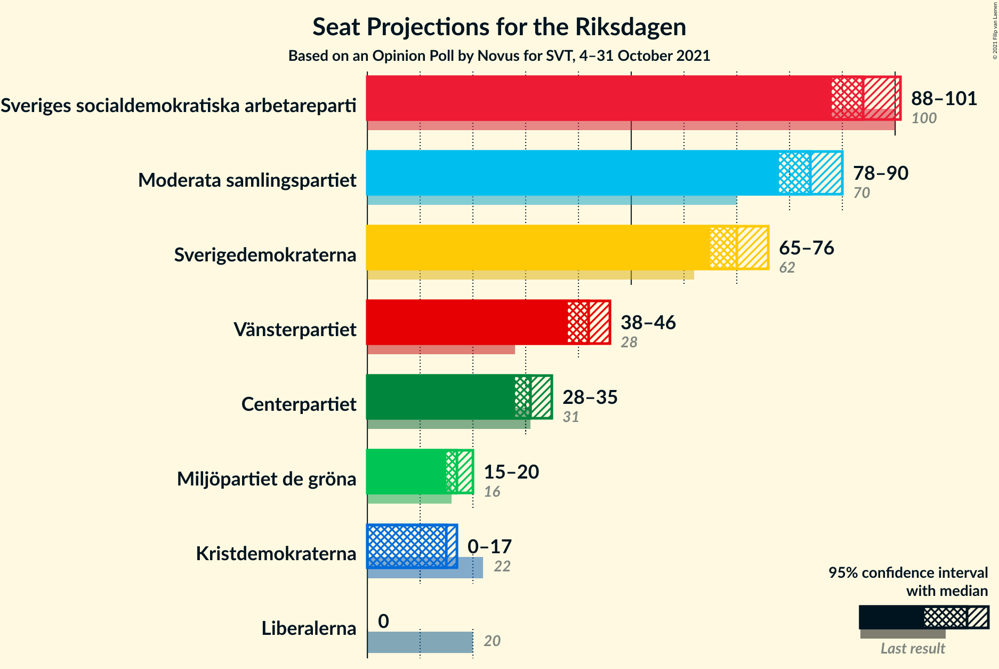
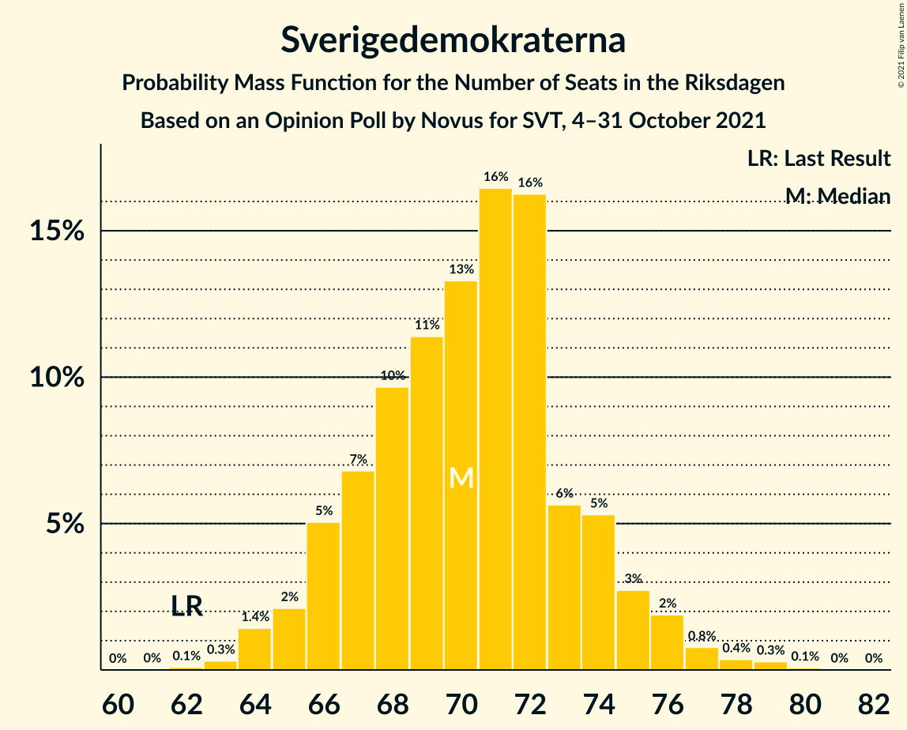
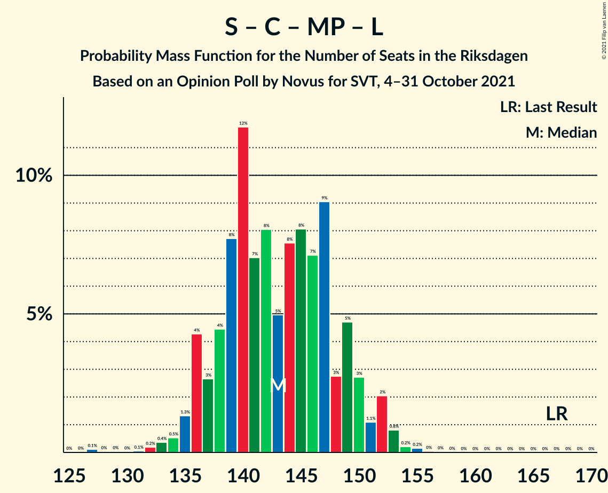

# Opinion Poll by Novus for SVT, 4–31 October 2021

<a href="#voting-intentions">Voting Intentions</a> | <a href="#seats">Seats</a> | <a href="#coalitions">Coalitions</a> | <a href="#technical-information">Technical Information</a>

## Voting Intentions

### Confidence Intervals

| Party | Last Result | Poll Result | 80% Confidence Interval | 90% Confidence Interval | 95% Confidence Interval | 99% Confidence Interval |
|:-----:|:-----------:|:-----------:|:-----------------------:|:-----------------------:|:-----------------------:|:-----------------------:|
| Sveriges socialdemokratiska arbetareparti | 28.3% | 25.6% | 24.7–26.6% |24.4–26.8% |24.2–27.1% |23.8–27.5% |
| Moderata samlingspartiet | 19.8% | 22.9% | 22.0–23.8% |21.8–24.1% |21.6–24.3% |21.1–24.7% |
| Sverigedemokraterna | 17.5% | 19.1% | 18.3–20.0% |18.0–20.2% |17.8–20.4% |17.5–20.8% |
| Vänsterpartiet | 8.0% | 11.3% | 10.7–12.0% |10.5–12.2% |10.3–12.4% |10.0–12.7% |
| Centerpartiet | 8.6% | 8.5% | 7.9–9.1% |7.8–9.3% |7.6–9.4% |7.4–9.8% |
| Miljöpartiet de gröna | 4.4% | 4.8% | 4.4–5.3% |4.3–5.4% |4.2–5.6% |4.0–5.8% |
| Kristdemokraterna | 6.3% | 4.1% | 3.7–4.6% |3.6–4.7% |3.5–4.8% |3.3–5.0% |
| Liberalerna | 5.5% | 2.8% | 2.5–3.2% |2.4–3.3% |2.3–3.4% |2.1–3.6% |

*Note:* The poll result column reflects the actual value used in the calculations. Published results may vary slightly, and in addition be rounded to fewer digits.

## Seats

### Confidence Intervals

| Party | Last Result | Median | 80% Confidence Interval | 90% Confidence Interval | 95% Confidence Interval | 99% Confidence Interval |
|:-----:|:-----------:|:------:|:-----------------------:|:-----------------------:|:-----------------------:|:-----------------------:|
| <a href="#sveriges-socialdemokratiska-arbetareparti">Sveriges socialdemokratiska arbetareparti</a> | 100 | 94 | 90–98 |89–100 |88–101 |86–104 |
| <a href="#moderata-samlingspartiet">Moderata samlingspartiet</a> | 70 | 84 | 80–88 |79–90 |78–90 |77–93 |
| <a href="#sverigedemokraterna">Sverigedemokraterna</a> | 62 | 70 | 67–74 |66–75 |65–76 |64–78 |
| <a href="#vänsterpartiet">Vänsterpartiet</a> | 28 | 42 | 39–44 |38–45 |38–46 |36–47 |
| <a href="#centerpartiet">Centerpartiet</a> | 31 | 31 | 29–34 |28–34 |28–35 |27–36 |
| <a href="#miljöpartiet-de-gröna">Miljöpartiet de gröna</a> | 16 | 17 | 16–19 |16–20 |15–20 |0–21 |
| <a href="#kristdemokraterna">Kristdemokraterna</a> | 22 | 15 | 0–17 |0–17 |0–17 |0–18 |
| <a href="#liberalerna">Liberalerna</a> | 20 | 0 | 0 |0 |0 |0 |

### Sveriges socialdemokratiska arbetareparti

*For a full overview of the results for this party, see the [Sveriges socialdemokratiska arbetareparti](party-sverigessocialdemokratiskaarbetareparti.html) page.*

| Number of Seats | Probability | Accumulated | Special Marks |
|:---------------:|:-----------:|:-----------:|:-------------:|
| 84 | 0% | 100% |  |
| 85 | 0.1% | 99.9% |  |
| 86 | 0.6% | 99.8% |  |
| 87 | 1.1% | 99.3% |  |
| 88 | 1.0% | 98% |  |
| 89 | 5% | 97% |  |
| 90 | 7% | 93% |  |
| 91 | 6% | 85% |  |
| 92 | 10% | 79% |  |
| 93 | 14% | 69% |  |
| 94 | 10% | 55% | Median |
| 95 | 12% | 45% |  |
| 96 | 6% | 33% |  |
| 97 | 6% | 27% |  |
| 98 | 11% | 20% |  |
| 99 | 2% | 9% |  |
| 100 | 3% | 7% | Last Result |
| 101 | 3% | 4% |  |
| 102 | 0.4% | 2% |  |
| 103 | 0.7% | 1.3% |  |
| 104 | 0.5% | 0.6% |  |
| 105 | 0.1% | 0.1% |  |
| 106 | 0% | 0.1% |  |
| 107 | 0% | 0% |  |

### Moderata samlingspartiet

*For a full overview of the results for this party, see the [Moderata samlingspartiet](party-moderatasamlingspartiet.html) page.*

| Number of Seats | Probability | Accumulated | Special Marks |
|:---------------:|:-----------:|:-----------:|:-------------:|
| 70 | 0% | 100% | Last Result |
| 71 | 0% | 100% |  |
| 72 | 0% | 100% |  |
| 73 | 0% | 100% |  |
| 74 | 0% | 100% |  |
| 75 | 0.1% | 100% |  |
| 76 | 0.4% | 99.9% |  |
| 77 | 0.9% | 99.5% |  |
| 78 | 1.4% | 98.6% |  |
| 79 | 4% | 97% |  |
| 80 | 4% | 93% |  |
| 81 | 11% | 90% |  |
| 82 | 6% | 79% |  |
| 83 | 19% | 73% |  |
| 84 | 12% | 54% | Median |
| 85 | 9% | 43% |  |
| 86 | 8% | 34% |  |
| 87 | 6% | 26% |  |
| 88 | 10% | 19% |  |
| 89 | 3% | 9% |  |
| 90 | 4% | 6% |  |
| 91 | 1.3% | 2% |  |
| 92 | 0.6% | 1.2% |  |
| 93 | 0.3% | 0.6% |  |
| 94 | 0.2% | 0.3% |  |
| 95 | 0.1% | 0.1% |  |
| 96 | 0% | 0% |  |

### Sverigedemokraterna

*For a full overview of the results for this party, see the [Sverigedemokraterna](party-sverigedemokraterna.html) page.*

| Number of Seats | Probability | Accumulated | Special Marks |
|:---------------:|:-----------:|:-----------:|:-------------:|
| 62 | 0.1% | 100% | Last Result |
| 63 | 0.3% | 99.9% |  |
| 64 | 1.4% | 99.6% |  |
| 65 | 2% | 98% |  |
| 66 | 5% | 96% |  |
| 67 | 7% | 91% |  |
| 68 | 10% | 84% |  |
| 69 | 11% | 75% |  |
| 70 | 13% | 63% | Median |
| 71 | 16% | 50% |  |
| 72 | 16% | 33% |  |
| 73 | 6% | 17% |  |
| 74 | 5% | 11% |  |
| 75 | 3% | 6% |  |
| 76 | 2% | 3% |  |
| 77 | 0.8% | 2% |  |
| 78 | 0.4% | 0.8% |  |
| 79 | 0.3% | 0.4% |  |
| 80 | 0.1% | 0.1% |  |
| 81 | 0% | 0% |  |

### Vänsterpartiet

*For a full overview of the results for this party, see the [Vänsterpartiet](party-vänsterpartiet.html) page.*

| Number of Seats | Probability | Accumulated | Special Marks |
|:---------------:|:-----------:|:-----------:|:-------------:|
| 28 | 0% | 100% | Last Result |
| 29 | 0% | 100% |  |
| 30 | 0% | 100% |  |
| 31 | 0% | 100% |  |
| 32 | 0% | 100% |  |
| 33 | 0% | 100% |  |
| 34 | 0% | 100% |  |
| 35 | 0.1% | 100% |  |
| 36 | 0.6% | 99.9% |  |
| 37 | 1.2% | 99.4% |  |
| 38 | 4% | 98% |  |
| 39 | 10% | 94% |  |
| 40 | 13% | 84% |  |
| 41 | 18% | 71% |  |
| 42 | 19% | 53% | Median |
| 43 | 15% | 34% |  |
| 44 | 10% | 19% |  |
| 45 | 4% | 9% |  |
| 46 | 3% | 5% |  |
| 47 | 1.2% | 2% |  |
| 48 | 0.2% | 0.4% |  |
| 49 | 0.1% | 0.1% |  |
| 50 | 0% | 0% |  |

### Centerpartiet

*For a full overview of the results for this party, see the [Centerpartiet](party-centerpartiet.html) page.*

| Number of Seats | Probability | Accumulated | Special Marks |
|:---------------:|:-----------:|:-----------:|:-------------:|
| 26 | 0.2% | 100% |  |
| 27 | 1.1% | 99.8% |  |
| 28 | 5% | 98.7% |  |
| 29 | 12% | 93% |  |
| 30 | 17% | 81% |  |
| 31 | 16% | 64% | Last Result, Median |
| 32 | 27% | 48% |  |
| 33 | 11% | 21% |  |
| 34 | 7% | 10% |  |
| 35 | 2% | 4% |  |
| 36 | 0.8% | 1.2% |  |
| 37 | 0.3% | 0.4% |  |
| 38 | 0.1% | 0.1% |  |
| 39 | 0% | 0% |  |

### Miljöpartiet de gröna

*For a full overview of the results for this party, see the [Miljöpartiet de gröna](party-miljöpartietdegröna.html) page.*

| Number of Seats | Probability | Accumulated | Special Marks |
|:---------------:|:-----------:|:-----------:|:-------------:|
| 0 | 0.7% | 100% |  |
| 1 | 0% | 99.3% |  |
| 2 | 0% | 99.3% |  |
| 3 | 0% | 99.3% |  |
| 4 | 0% | 99.3% |  |
| 5 | 0% | 99.3% |  |
| 6 | 0% | 99.3% |  |
| 7 | 0% | 99.3% |  |
| 8 | 0% | 99.3% |  |
| 9 | 0% | 99.3% |  |
| 10 | 0% | 99.3% |  |
| 11 | 0% | 99.3% |  |
| 12 | 0% | 99.3% |  |
| 13 | 0% | 99.3% |  |
| 14 | 0% | 99.3% |  |
| 15 | 4% | 99.2% |  |
| 16 | 17% | 95% | Last Result |
| 17 | 29% | 79% | Median |
| 18 | 18% | 50% |  |
| 19 | 25% | 32% |  |
| 20 | 5% | 7% |  |
| 21 | 2% | 2% |  |
| 22 | 0.3% | 0.3% |  |
| 23 | 0.1% | 0.1% |  |
| 24 | 0% | 0% |  |

### Kristdemokraterna

*For a full overview of the results for this party, see the [Kristdemokraterna](party-kristdemokraterna.html) page.*

| Number of Seats | Probability | Accumulated | Special Marks |
|:---------------:|:-----------:|:-----------:|:-------------:|
| 0 | 38% | 100% |  |
| 1 | 0% | 62% |  |
| 2 | 0% | 62% |  |
| 3 | 0% | 62% |  |
| 4 | 0% | 62% |  |
| 5 | 0% | 62% |  |
| 6 | 0% | 62% |  |
| 7 | 0% | 62% |  |
| 8 | 0% | 62% |  |
| 9 | 0% | 62% |  |
| 10 | 0% | 62% |  |
| 11 | 0% | 62% |  |
| 12 | 0% | 62% |  |
| 13 | 0% | 62% |  |
| 14 | 0.1% | 62% |  |
| 15 | 31% | 62% | Median |
| 16 | 20% | 30% |  |
| 17 | 8% | 10% |  |
| 18 | 2% | 2% |  |
| 19 | 0.3% | 0.3% |  |
| 20 | 0% | 0% |  |
| 21 | 0% | 0% |  |
| 22 | 0% | 0% | Last Result |

### Liberalerna

*For a full overview of the results for this party, see the [Liberalerna](party-liberalerna.html) page.*

| Number of Seats | Probability | Accumulated | Special Marks |
|:---------------:|:-----------:|:-----------:|:-------------:|
| 0 | 100% | 100% | Median |
| 1 | 0% | 0% |  |
| 2 | 0% | 0% |  |
| 3 | 0% | 0% |  |
| 4 | 0% | 0% |  |
| 5 | 0% | 0% |  |
| 6 | 0% | 0% |  |
| 7 | 0% | 0% |  |
| 8 | 0% | 0% |  |
| 9 | 0% | 0% |  |
| 10 | 0% | 0% |  |
| 11 | 0% | 0% |  |
| 12 | 0% | 0% |  |
| 13 | 0% | 0% |  |
| 14 | 0% | 0% |  |
| 15 | 0% | 0% |  |
| 16 | 0% | 0% |  |
| 17 | 0% | 0% |  |
| 18 | 0% | 0% |  |
| 19 | 0% | 0% |  |
| 20 | 0% | 0% | Last Result |

## Coalitions

### Confidence Intervals

| Coalition | Last Result | Median | Majority? | 80% Confidence Interval | 90% Confidence Interval | 95% Confidence Interval | 99% Confidence Interval |
|:---------:|:-----------:|:------:|:---------:|:-----------------------:|:-----------------------:|:-----------------------:|:-----------------------:|
| Sveriges socialdemokratiska arbetareparti – Moderata samlingspartiet – Centerpartiet | 201 | 208 | 100% | 203–218 | 202–218 | 201–220 | 199–223 |
| Sveriges socialdemokratiska arbetareparti – Vänsterpartiet – Centerpartiet – Miljöpartiet de gröna – Liberalerna | 195 | 184 | 99.2% | 178–192 | 177–193 | 176–195 | 174–196 |
| Sveriges socialdemokratiska arbetareparti – Moderata samlingspartiet | 170 | 177 | 79% | 172–186 | 171–187 | 170–188 | 168–191 |
| Moderata samlingspartiet – Sverigedemokraterna – Kristdemokraterna | 154 | 165 | 0.8% | 157–171 | 156–172 | 154–173 | 153–175 |
| Moderata samlingspartiet – Sverigedemokraterna | 132 | 154 | 0% | 149–161 | 148–162 | 147–163 | 145–166 |
| Sveriges socialdemokratiska arbetareparti – Vänsterpartiet – Miljöpartiet de gröna | 144 | 153 | 0% | 148–160 | 147–161 | 146–162 | 143–164 |
| Sveriges socialdemokratiska arbetareparti – Centerpartiet – Miljöpartiet de gröna – Liberalerna | 167 | 143 | 0% | 138–149 | 136–150 | 135–152 | 132–153 |
| Sveriges socialdemokratiska arbetareparti – Vänsterpartiet | 128 | 135 | 0% | 131–142 | 130–143 | 128–145 | 126–147 |
| Moderata samlingspartiet – Centerpartiet – Kristdemokraterna – Liberalerna | 143 | 127 | 0% | 117–132 | 116–133 | 115–134 | 113–137 |
| Moderata samlingspartiet – Centerpartiet – Kristdemokraterna | 123 | 127 | 0% | 117–132 | 116–133 | 115–134 | 113–137 |
| Moderata samlingspartiet – Centerpartiet – Liberalerna | 121 | 115 | 0% | 111–120 | 110–122 | 109–123 | 107–126 |
| Moderata samlingspartiet – Centerpartiet | 101 | 115 | 0% | 111–120 | 110–122 | 109–123 | 107–126 |
| Sveriges socialdemokratiska arbetareparti – Miljöpartiet de gröna | 116 | 112 | 0% | 107–117 | 106–118 | 105–119 | 101–121 |

### Sveriges socialdemokratiska arbetareparti – Moderata samlingspartiet – Centerpartiet

| Number of Seats | Probability | Accumulated | Special Marks |
|:---------------:|:-----------:|:-----------:|:-------------:|
| 197 | 0.1% | 100% |  |
| 198 | 0.2% | 99.9% |  |
| 199 | 0.4% | 99.7% |  |
| 200 | 0.8% | 99.3% |  |
| 201 | 2% | 98.5% | Last Result |
| 202 | 4% | 96% |  |
| 203 | 4% | 92% |  |
| 204 | 8% | 88% |  |
| 205 | 10% | 80% |  |
| 206 | 7% | 70% |  |
| 207 | 9% | 64% |  |
| 208 | 7% | 55% |  |
| 209 | 4% | 48% | Median |
| 210 | 4% | 44% |  |
| 211 | 2% | 39% |  |
| 212 | 3% | 37% |  |
| 213 | 2% | 34% |  |
| 214 | 5% | 33% |  |
| 215 | 4% | 28% |  |
| 216 | 5% | 24% |  |
| 217 | 7% | 19% |  |
| 218 | 8% | 12% |  |
| 219 | 2% | 5% |  |
| 220 | 1.0% | 3% |  |
| 221 | 0.9% | 2% |  |
| 222 | 0.3% | 0.9% |  |
| 223 | 0.2% | 0.6% |  |
| 224 | 0.1% | 0.4% |  |
| 225 | 0.1% | 0.3% |  |
| 226 | 0% | 0.2% |  |
| 227 | 0.1% | 0.2% |  |
| 228 | 0% | 0.1% |  |
| 229 | 0% | 0.1% |  |
| 230 | 0% | 0.1% |  |
| 231 | 0% | 0.1% |  |
| 232 | 0% | 0% |  |

### Sveriges socialdemokratiska arbetareparti – Vänsterpartiet – Centerpartiet – Miljöpartiet de gröna – Liberalerna

| Number of Seats | Probability | Accumulated | Special Marks |
|:---------------:|:-----------:|:-----------:|:-------------:|
| 169 | 0% | 100% |  |
| 170 | 0% | 99.9% |  |
| 171 | 0% | 99.9% |  |
| 172 | 0.1% | 99.9% |  |
| 173 | 0.2% | 99.7% |  |
| 174 | 0.3% | 99.6% |  |
| 175 | 0.9% | 99.2% | Majority |
| 176 | 1.3% | 98% |  |
| 177 | 3% | 97% |  |
| 178 | 5% | 94% |  |
| 179 | 5% | 89% |  |
| 180 | 8% | 84% |  |
| 181 | 7% | 76% |  |
| 182 | 8% | 69% |  |
| 183 | 7% | 61% |  |
| 184 | 6% | 53% | Median |
| 185 | 5% | 47% |  |
| 186 | 4% | 41% |  |
| 187 | 3% | 37% |  |
| 188 | 6% | 34% |  |
| 189 | 9% | 28% |  |
| 190 | 3% | 19% |  |
| 191 | 6% | 16% |  |
| 192 | 3% | 10% |  |
| 193 | 2% | 7% |  |
| 194 | 2% | 5% |  |
| 195 | 2% | 3% | Last Result |
| 196 | 0.7% | 1.1% |  |
| 197 | 0.2% | 0.4% |  |
| 198 | 0.1% | 0.2% |  |
| 199 | 0.1% | 0.1% |  |
| 200 | 0% | 0% |  |

### Sveriges socialdemokratiska arbetareparti – Moderata samlingspartiet

| Number of Seats | Probability | Accumulated | Special Marks |
|:---------------:|:-----------:|:-----------:|:-------------:|
| 166 | 0.1% | 100% |  |
| 167 | 0.1% | 99.9% |  |
| 168 | 0.6% | 99.8% |  |
| 169 | 1.0% | 99.2% |  |
| 170 | 1.4% | 98% | Last Result |
| 171 | 2% | 97% |  |
| 172 | 6% | 95% |  |
| 173 | 6% | 88% |  |
| 174 | 3% | 82% |  |
| 175 | 11% | 79% | Majority |
| 176 | 14% | 68% |  |
| 177 | 5% | 54% |  |
| 178 | 6% | 49% | Median |
| 179 | 5% | 43% |  |
| 180 | 4% | 39% |  |
| 181 | 2% | 35% |  |
| 182 | 6% | 32% |  |
| 183 | 3% | 26% |  |
| 184 | 5% | 23% |  |
| 185 | 5% | 18% |  |
| 186 | 7% | 13% |  |
| 187 | 3% | 6% |  |
| 188 | 0.8% | 3% |  |
| 189 | 0.6% | 2% |  |
| 190 | 1.1% | 2% |  |
| 191 | 0.1% | 0.5% |  |
| 192 | 0.1% | 0.4% |  |
| 193 | 0% | 0.3% |  |
| 194 | 0.1% | 0.2% |  |
| 195 | 0% | 0.1% |  |
| 196 | 0% | 0.1% |  |
| 197 | 0% | 0.1% |  |
| 198 | 0% | 0% |  |

### Moderata samlingspartiet – Sverigedemokraterna – Kristdemokraterna

| Number of Seats | Probability | Accumulated | Special Marks |
|:---------------:|:-----------:|:-----------:|:-------------:|
| 150 | 0.1% | 100% |  |
| 151 | 0.1% | 99.9% |  |
| 152 | 0.2% | 99.8% |  |
| 153 | 0.7% | 99.6% |  |
| 154 | 2% | 98.9% | Last Result |
| 155 | 2% | 97% |  |
| 156 | 2% | 95% |  |
| 157 | 3% | 93% |  |
| 158 | 6% | 90% |  |
| 159 | 3% | 84% |  |
| 160 | 9% | 81% |  |
| 161 | 6% | 72% |  |
| 162 | 3% | 66% |  |
| 163 | 4% | 63% |  |
| 164 | 5% | 59% |  |
| 165 | 6% | 53% |  |
| 166 | 7% | 47% |  |
| 167 | 8% | 39% |  |
| 168 | 7% | 31% |  |
| 169 | 8% | 24% | Median |
| 170 | 5% | 16% |  |
| 171 | 5% | 11% |  |
| 172 | 3% | 6% |  |
| 173 | 1.3% | 3% |  |
| 174 | 0.9% | 2% |  |
| 175 | 0.3% | 0.8% | Majority |
| 176 | 0.2% | 0.4% |  |
| 177 | 0.1% | 0.3% |  |
| 178 | 0% | 0.1% |  |
| 179 | 0% | 0.1% |  |
| 180 | 0% | 0.1% |  |
| 181 | 0% | 0% |  |

### Moderata samlingspartiet – Sverigedemokraterna

| Number of Seats | Probability | Accumulated | Special Marks |
|:---------------:|:-----------:|:-----------:|:-------------:|
| 132 | 0% | 100% | Last Result |
| 133 | 0% | 100% |  |
| 134 | 0% | 100% |  |
| 135 | 0% | 100% |  |
| 136 | 0% | 100% |  |
| 137 | 0% | 100% |  |
| 138 | 0% | 100% |  |
| 139 | 0% | 100% |  |
| 140 | 0% | 100% |  |
| 141 | 0% | 100% |  |
| 142 | 0% | 100% |  |
| 143 | 0.1% | 100% |  |
| 144 | 0.3% | 99.9% |  |
| 145 | 0.8% | 99.6% |  |
| 146 | 1.0% | 98.8% |  |
| 147 | 1.3% | 98% |  |
| 148 | 4% | 97% |  |
| 149 | 6% | 92% |  |
| 150 | 7% | 86% |  |
| 151 | 10% | 80% |  |
| 152 | 7% | 69% |  |
| 153 | 5% | 62% |  |
| 154 | 10% | 57% | Median |
| 155 | 7% | 47% |  |
| 156 | 5% | 40% |  |
| 157 | 6% | 35% |  |
| 158 | 6% | 30% |  |
| 159 | 4% | 23% |  |
| 160 | 9% | 19% |  |
| 161 | 5% | 11% |  |
| 162 | 2% | 5% |  |
| 163 | 1.1% | 3% |  |
| 164 | 0.9% | 2% |  |
| 165 | 0.4% | 1.1% |  |
| 166 | 0.3% | 0.8% |  |
| 167 | 0.2% | 0.5% |  |
| 168 | 0.2% | 0.3% |  |
| 169 | 0% | 0.1% |  |
| 170 | 0.1% | 0.1% |  |
| 171 | 0% | 0% |  |

### Sveriges socialdemokratiska arbetareparti – Vänsterpartiet – Miljöpartiet de gröna

| Number of Seats | Probability | Accumulated | Special Marks |
|:---------------:|:-----------:|:-----------:|:-------------:|
| 137 | 0% | 100% |  |
| 138 | 0% | 99.9% |  |
| 139 | 0.1% | 99.9% |  |
| 140 | 0% | 99.9% |  |
| 141 | 0.1% | 99.8% |  |
| 142 | 0.1% | 99.7% |  |
| 143 | 0.4% | 99.6% |  |
| 144 | 0.5% | 99.3% | Last Result |
| 145 | 1.0% | 98.8% |  |
| 146 | 3% | 98% |  |
| 147 | 3% | 95% |  |
| 148 | 6% | 92% |  |
| 149 | 10% | 86% |  |
| 150 | 7% | 77% |  |
| 151 | 6% | 70% |  |
| 152 | 9% | 64% |  |
| 153 | 8% | 55% | Median |
| 154 | 7% | 47% |  |
| 155 | 4% | 40% |  |
| 156 | 7% | 36% |  |
| 157 | 9% | 29% |  |
| 158 | 4% | 20% |  |
| 159 | 5% | 16% |  |
| 160 | 2% | 10% |  |
| 161 | 3% | 8% |  |
| 162 | 2% | 5% |  |
| 163 | 1.1% | 2% |  |
| 164 | 1.0% | 1.4% |  |
| 165 | 0.3% | 0.4% |  |
| 166 | 0.1% | 0.1% |  |
| 167 | 0% | 0.1% |  |
| 168 | 0% | 0% |  |

### Sveriges socialdemokratiska arbetareparti – Centerpartiet – Miljöpartiet de gröna – Liberalerna

| Number of Seats | Probability | Accumulated | Special Marks |
|:---------------:|:-----------:|:-----------:|:-------------:|
| 126 | 0% | 100% |  |
| 127 | 0.1% | 99.9% |  |
| 128 | 0% | 99.8% |  |
| 129 | 0% | 99.8% |  |
| 130 | 0% | 99.8% |  |
| 131 | 0.1% | 99.7% |  |
| 132 | 0.2% | 99.7% |  |
| 133 | 0.4% | 99.5% |  |
| 134 | 0.5% | 99.1% |  |
| 135 | 1.3% | 98.6% |  |
| 136 | 4% | 97% |  |
| 137 | 3% | 93% |  |
| 138 | 4% | 90% |  |
| 139 | 8% | 86% |  |
| 140 | 12% | 78% |  |
| 141 | 7% | 66% |  |
| 142 | 8% | 59% | Median |
| 143 | 5% | 51% |  |
| 144 | 8% | 46% |  |
| 145 | 8% | 39% |  |
| 146 | 7% | 31% |  |
| 147 | 9% | 24% |  |
| 148 | 3% | 15% |  |
| 149 | 5% | 12% |  |
| 150 | 3% | 7% |  |
| 151 | 1.1% | 4% |  |
| 152 | 2% | 3% |  |
| 153 | 0.8% | 1.3% |  |
| 154 | 0.2% | 0.5% |  |
| 155 | 0.2% | 0.2% |  |
| 156 | 0% | 0.1% |  |
| 157 | 0% | 0% |  |
| 158 | 0% | 0% |  |
| 159 | 0% | 0% |  |
| 160 | 0% | 0% |  |
| 161 | 0% | 0% |  |
| 162 | 0% | 0% |  |
| 163 | 0% | 0% |  |
| 164 | 0% | 0% |  |
| 165 | 0% | 0% |  |
| 166 | 0% | 0% |  |
| 167 | 0% | 0% | Last Result |

### Sveriges socialdemokratiska arbetareparti – Vänsterpartiet

| Number of Seats | Probability | Accumulated | Special Marks |
|:---------------:|:-----------:|:-----------:|:-------------:|
| 124 | 0% | 100% |  |
| 125 | 0.1% | 99.9% |  |
| 126 | 0.6% | 99.9% |  |
| 127 | 0.7% | 99.3% |  |
| 128 | 2% | 98.6% | Last Result |
| 129 | 1.4% | 97% |  |
| 130 | 3% | 95% |  |
| 131 | 7% | 92% |  |
| 132 | 8% | 85% |  |
| 133 | 11% | 77% |  |
| 134 | 7% | 66% |  |
| 135 | 10% | 59% |  |
| 136 | 5% | 49% | Median |
| 137 | 9% | 44% |  |
| 138 | 7% | 35% |  |
| 139 | 4% | 28% |  |
| 140 | 11% | 25% |  |
| 141 | 3% | 14% |  |
| 142 | 4% | 11% |  |
| 143 | 2% | 7% |  |
| 144 | 1.3% | 4% |  |
| 145 | 1.1% | 3% |  |
| 146 | 1.2% | 2% |  |
| 147 | 0.2% | 0.6% |  |
| 148 | 0.1% | 0.4% |  |
| 149 | 0.2% | 0.2% |  |
| 150 | 0% | 0% |  |

### Moderata samlingspartiet – Centerpartiet – Kristdemokraterna – Liberalerna

| Number of Seats | Probability | Accumulated | Special Marks |
|:---------------:|:-----------:|:-----------:|:-------------:|
| 111 | 0.1% | 100% |  |
| 112 | 0.2% | 99.8% |  |
| 113 | 0.9% | 99.6% |  |
| 114 | 1.2% | 98.7% |  |
| 115 | 2% | 98% |  |
| 116 | 4% | 96% |  |
| 117 | 2% | 92% |  |
| 118 | 4% | 90% |  |
| 119 | 4% | 85% |  |
| 120 | 10% | 81% |  |
| 121 | 2% | 71% |  |
| 122 | 5% | 69% |  |
| 123 | 2% | 65% |  |
| 124 | 3% | 62% |  |
| 125 | 3% | 60% |  |
| 126 | 5% | 57% |  |
| 127 | 9% | 52% |  |
| 128 | 6% | 43% |  |
| 129 | 11% | 37% |  |
| 130 | 10% | 26% | Median |
| 131 | 5% | 17% |  |
| 132 | 5% | 12% |  |
| 133 | 3% | 7% |  |
| 134 | 2% | 3% |  |
| 135 | 0.8% | 2% |  |
| 136 | 0.4% | 0.9% |  |
| 137 | 0.3% | 0.5% |  |
| 138 | 0.2% | 0.3% |  |
| 139 | 0% | 0.1% |  |
| 140 | 0% | 0.1% |  |
| 141 | 0% | 0% |  |
| 142 | 0% | 0% |  |
| 143 | 0% | 0% | Last Result |

### Moderata samlingspartiet – Centerpartiet – Kristdemokraterna

| Number of Seats | Probability | Accumulated | Special Marks |
|:---------------:|:-----------:|:-----------:|:-------------:|
| 111 | 0.1% | 100% |  |
| 112 | 0.2% | 99.8% |  |
| 113 | 0.9% | 99.6% |  |
| 114 | 1.2% | 98.7% |  |
| 115 | 2% | 98% |  |
| 116 | 4% | 96% |  |
| 117 | 2% | 92% |  |
| 118 | 4% | 90% |  |
| 119 | 4% | 85% |  |
| 120 | 10% | 81% |  |
| 121 | 2% | 71% |  |
| 122 | 5% | 69% |  |
| 123 | 2% | 64% | Last Result |
| 124 | 3% | 62% |  |
| 125 | 3% | 60% |  |
| 126 | 5% | 57% |  |
| 127 | 9% | 52% |  |
| 128 | 6% | 43% |  |
| 129 | 11% | 37% |  |
| 130 | 10% | 26% | Median |
| 131 | 5% | 17% |  |
| 132 | 5% | 12% |  |
| 133 | 3% | 7% |  |
| 134 | 2% | 3% |  |
| 135 | 0.8% | 2% |  |
| 136 | 0.4% | 0.9% |  |
| 137 | 0.3% | 0.5% |  |
| 138 | 0.2% | 0.3% |  |
| 139 | 0% | 0.1% |  |
| 140 | 0% | 0.1% |  |
| 141 | 0% | 0% |  |

### Moderata samlingspartiet – Centerpartiet – Liberalerna

| Number of Seats | Probability | Accumulated | Special Marks |
|:---------------:|:-----------:|:-----------:|:-------------:|
| 105 | 0.1% | 100% |  |
| 106 | 0.1% | 99.9% |  |
| 107 | 0.9% | 99.8% |  |
| 108 | 0.8% | 98.8% |  |
| 109 | 3% | 98% |  |
| 110 | 5% | 96% |  |
| 111 | 5% | 90% |  |
| 112 | 9% | 85% |  |
| 113 | 10% | 76% |  |
| 114 | 11% | 67% |  |
| 115 | 11% | 56% | Median |
| 116 | 8% | 45% |  |
| 117 | 5% | 37% |  |
| 118 | 7% | 32% |  |
| 119 | 5% | 25% |  |
| 120 | 10% | 20% |  |
| 121 | 2% | 10% | Last Result |
| 122 | 4% | 8% |  |
| 123 | 1.5% | 3% |  |
| 124 | 0.7% | 2% |  |
| 125 | 0.4% | 1.0% |  |
| 126 | 0.3% | 0.6% |  |
| 127 | 0.2% | 0.2% |  |
| 128 | 0% | 0.1% |  |
| 129 | 0% | 0% |  |

### Moderata samlingspartiet – Centerpartiet

| Number of Seats | Probability | Accumulated | Special Marks |
|:---------------:|:-----------:|:-----------:|:-------------:|
| 101 | 0% | 100% | Last Result |
| 102 | 0% | 100% |  |
| 103 | 0% | 100% |  |
| 104 | 0% | 100% |  |
| 105 | 0.1% | 100% |  |
| 106 | 0.1% | 99.9% |  |
| 107 | 0.9% | 99.8% |  |
| 108 | 0.8% | 98.8% |  |
| 109 | 3% | 98% |  |
| 110 | 5% | 96% |  |
| 111 | 5% | 90% |  |
| 112 | 9% | 85% |  |
| 113 | 10% | 76% |  |
| 114 | 11% | 67% |  |
| 115 | 11% | 56% | Median |
| 116 | 8% | 45% |  |
| 117 | 5% | 37% |  |
| 118 | 7% | 32% |  |
| 119 | 5% | 25% |  |
| 120 | 10% | 20% |  |
| 121 | 2% | 10% |  |
| 122 | 4% | 8% |  |
| 123 | 1.5% | 3% |  |
| 124 | 0.7% | 2% |  |
| 125 | 0.4% | 1.0% |  |
| 126 | 0.3% | 0.6% |  |
| 127 | 0.2% | 0.2% |  |
| 128 | 0% | 0.1% |  |
| 129 | 0% | 0% |  |

### Sveriges socialdemokratiska arbetareparti – Miljöpartiet de gröna

| Number of Seats | Probability | Accumulated | Special Marks |
|:---------------:|:-----------:|:-----------:|:-------------:|
| 95 | 0% | 100% |  |
| 96 | 0.1% | 99.9% |  |
| 97 | 0.1% | 99.9% |  |
| 98 | 0.1% | 99.8% |  |
| 99 | 0% | 99.7% |  |
| 100 | 0.1% | 99.7% |  |
| 101 | 0.1% | 99.6% |  |
| 102 | 0.1% | 99.4% |  |
| 103 | 0.3% | 99.3% |  |
| 104 | 0.9% | 99.0% |  |
| 105 | 2% | 98% |  |
| 106 | 4% | 96% |  |
| 107 | 4% | 92% |  |
| 108 | 7% | 88% |  |
| 109 | 11% | 81% |  |
| 110 | 8% | 70% |  |
| 111 | 10% | 62% | Median |
| 112 | 10% | 52% |  |
| 113 | 9% | 42% |  |
| 114 | 7% | 32% |  |
| 115 | 10% | 25% |  |
| 116 | 3% | 16% | Last Result |
| 117 | 7% | 13% |  |
| 118 | 2% | 7% |  |
| 119 | 2% | 4% |  |
| 120 | 0.9% | 2% |  |
| 121 | 0.6% | 1.1% |  |
| 122 | 0.3% | 0.5% |  |
| 123 | 0.1% | 0.2% |  |
| 124 | 0% | 0.1% |  |
| 125 | 0% | 0% |  |

## Technical Information

### Opinion Poll

+ **Polling firm:** Novus
+ **Commissioner(s):** SVT
+ **Fieldwork period:** 4–31 October 2021

### Calculations

+ **Sample size:** 3660
+ **Simulations done:** 1,048,576
+ **Error estimate:** 0.66%

