# Opinion Poll by Demoskop for Aftonbladet, 5–11 November 2021

<a href="#voting-intentions">Voting Intentions</a> | <a href="#seats">Seats</a> | <a href="#coalitions">Coalitions</a> | <a href="#technical-information">Technical Information</a>

## Voting Intentions

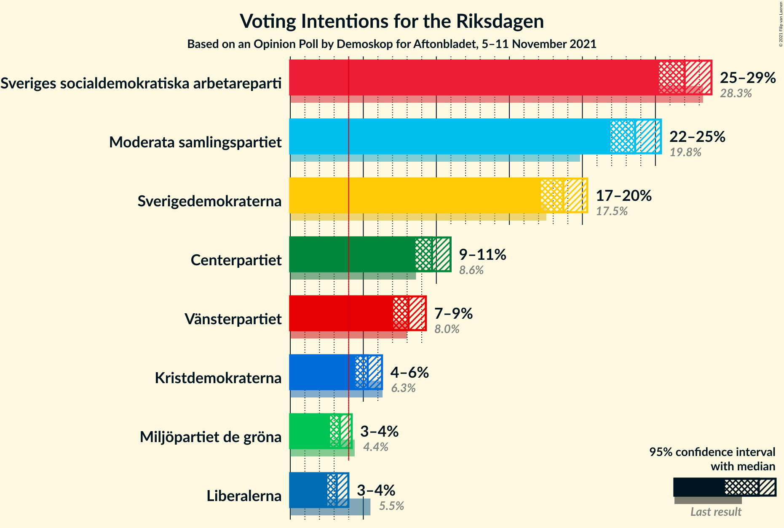

### Confidence Intervals

| Party | Last Result | Poll Result | 80% Confidence Interval | 90% Confidence Interval | 95% Confidence Interval | 99% Confidence Interval |
|:-----:|:-----------:|:-----------:|:-----------------------:|:-----------------------:|:-----------------------:|:-----------------------:|
| Sveriges socialdemokratiska arbetareparti | 28.3% | 27.0% | 25.8–28.2% |25.5–28.5% |25.2–28.8% |24.7–29.4% |
| Moderata samlingspartiet | 19.8% | 23.6% | 22.5–24.8% |22.2–25.1% |21.9–25.4% |21.4–25.9% |
| Sverigedemokraterna | 17.5% | 18.7% | 17.7–19.8% |17.4–20.1% |17.2–20.3% |16.7–20.9% |
| Centerpartiet | 8.6% | 9.7% | 9.0–10.5% |8.7–10.8% |8.6–11.0% |8.2–11.4% |
| Vänsterpartiet | 8.0% | 8.1% | 7.4–8.9% |7.2–9.1% |7.1–9.3% |6.7–9.6% |
| Kristdemokraterna | 6.3% | 5.3% | 4.7–5.9% |4.6–6.1% |4.5–6.3% |4.2–6.6% |
| Miljöpartiet de gröna | 4.4% | 3.4% | 3.0–3.9% |2.8–4.1% |2.7–4.2% |2.5–4.5% |
| Liberalerna | 5.5% | 3.2% | 2.8–3.7% |2.6–3.8% |2.5–4.0% |2.3–4.2% |

*Note:* The poll result column reflects the actual value used in the calculations. Published results may vary slightly, and in addition be rounded to fewer digits.

## Seats

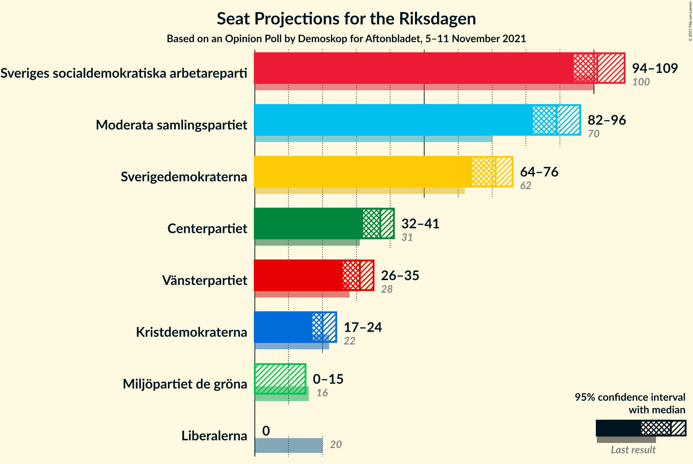

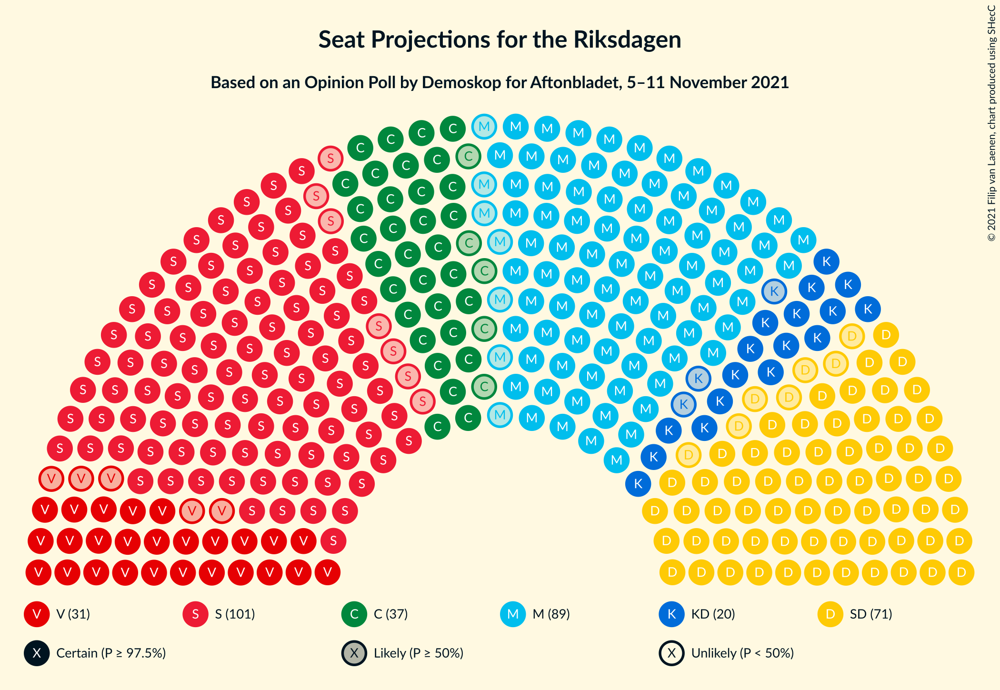

### Confidence Intervals

| Party | Last Result | Median | 80% Confidence Interval | 90% Confidence Interval | 95% Confidence Interval | 99% Confidence Interval |
|:-----:|:-----------:|:------:|:-----------------------:|:-----------------------:|:-----------------------:|:-----------------------:|
| <a href="#sveriges-socialdemokratiska-arbetareparti">Sveriges socialdemokratiska arbetareparti</a> | 100 | 101 | 96–106 |95–107 |94–109 |92–111 |
| <a href="#moderata-samlingspartiet">Moderata samlingspartiet</a> | 70 | 89 | 84–93 |83–94 |82–96 |80–97 |
| <a href="#sverigedemokraterna">Sverigedemokraterna</a> | 62 | 71 | 66–75 |65–75 |64–76 |62–78 |
| <a href="#centerpartiet">Centerpartiet</a> | 31 | 37 | 34–40 |33–41 |32–41 |31–43 |
| <a href="#vänsterpartiet">Vänsterpartiet</a> | 28 | 31 | 28–34 |27–34 |26–35 |25–36 |
| <a href="#kristdemokraterna">Kristdemokraterna</a> | 22 | 20 | 18–22 |17–23 |17–24 |16–25 |
| <a href="#miljöpartiet-de-gröna">Miljöpartiet de gröna</a> | 16 | 0 | 0 |0–15 |0–15 |0–16 |
| <a href="#liberalerna">Liberalerna</a> | 20 | 0 | 0 |0 |0 |0–15 |

### Sveriges socialdemokratiska arbetareparti

*For a full overview of the results for this party, see the [Sveriges socialdemokratiska arbetareparti](party-sverigessocialdemokratiskaarbetareparti.html) page.*

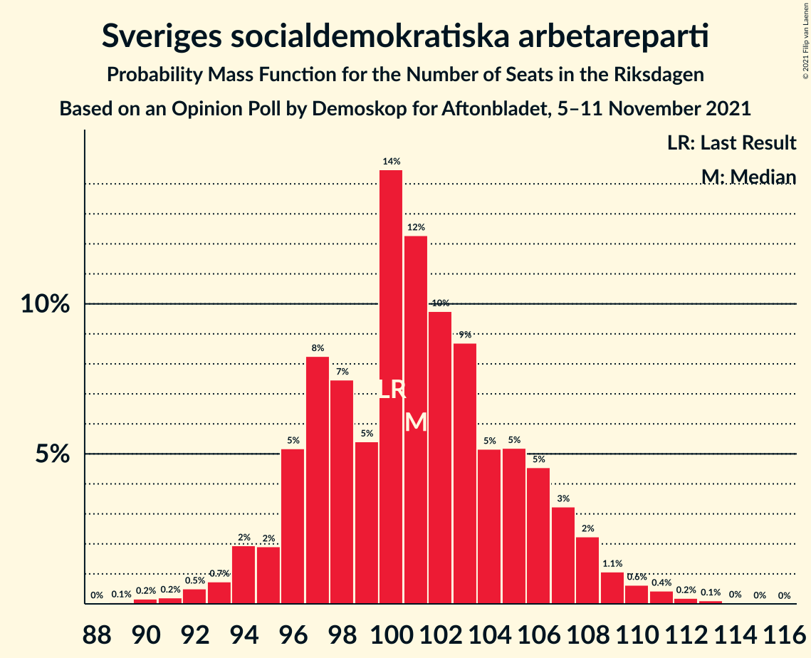

| Number of Seats | Probability | Accumulated | Special Marks |
|:---------------:|:-----------:|:-----------:|:-------------:|
| 89 | 0.1% | 100% |  |
| 90 | 0.2% | 99.9% |  |
| 91 | 0.2% | 99.7% |  |
| 92 | 0.5% | 99.5% |  |
| 93 | 0.7% | 99.0% |  |
| 94 | 2% | 98% |  |
| 95 | 2% | 96% |  |
| 96 | 5% | 94% |  |
| 97 | 8% | 89% |  |
| 98 | 7% | 81% |  |
| 99 | 5% | 74% |  |
| 100 | 14% | 68% | Last Result |
| 101 | 12% | 54% | Median |
| 102 | 10% | 41% |  |
| 103 | 9% | 32% |  |
| 104 | 5% | 23% |  |
| 105 | 5% | 18% |  |
| 106 | 5% | 13% |  |
| 107 | 3% | 8% |  |
| 108 | 2% | 5% |  |
| 109 | 1.1% | 3% |  |
| 110 | 0.6% | 1.4% |  |
| 111 | 0.4% | 0.8% |  |
| 112 | 0.2% | 0.4% |  |
| 113 | 0.1% | 0.2% |  |
| 114 | 0% | 0.1% |  |
| 115 | 0% | 0% |  |

### Moderata samlingspartiet

*For a full overview of the results for this party, see the [Moderata samlingspartiet](party-moderatasamlingspartiet.html) page.*

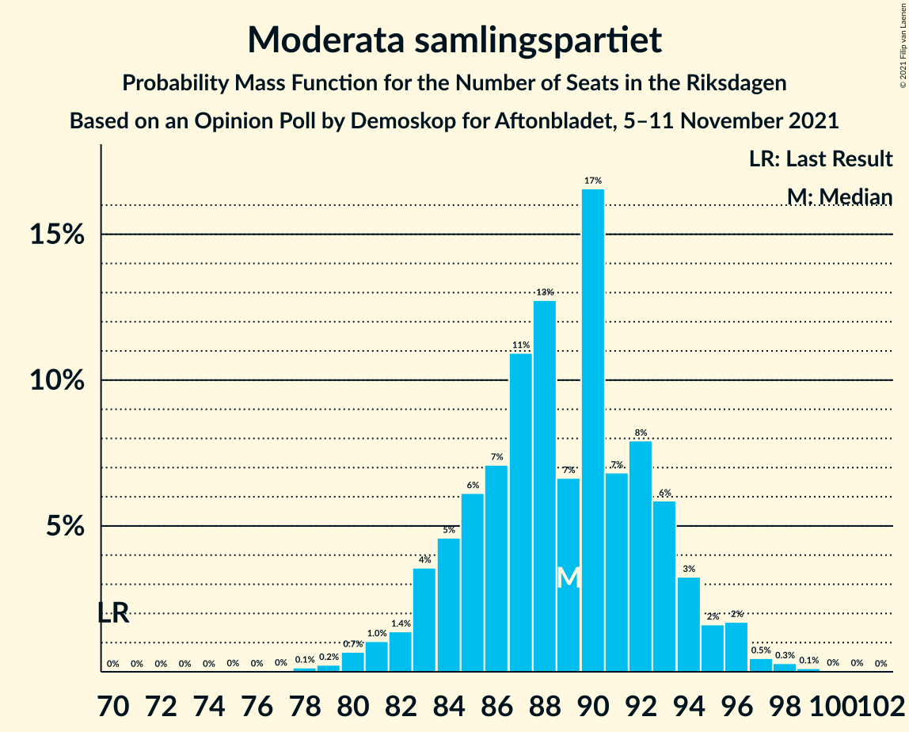

| Number of Seats | Probability | Accumulated | Special Marks |
|:---------------:|:-----------:|:-----------:|:-------------:|
| 70 | 0% | 100% | Last Result |
| 71 | 0% | 100% |  |
| 72 | 0% | 100% |  |
| 73 | 0% | 100% |  |
| 74 | 0% | 100% |  |
| 75 | 0% | 100% |  |
| 76 | 0% | 100% |  |
| 77 | 0% | 100% |  |
| 78 | 0.1% | 99.9% |  |
| 79 | 0.2% | 99.8% |  |
| 80 | 0.7% | 99.5% |  |
| 81 | 1.0% | 98.9% |  |
| 82 | 1.4% | 98% |  |
| 83 | 4% | 96% |  |
| 84 | 5% | 93% |  |
| 85 | 6% | 88% |  |
| 86 | 7% | 82% |  |
| 87 | 11% | 75% |  |
| 88 | 13% | 64% |  |
| 89 | 7% | 51% | Median |
| 90 | 17% | 45% |  |
| 91 | 7% | 28% |  |
| 92 | 8% | 21% |  |
| 93 | 6% | 13% |  |
| 94 | 3% | 8% |  |
| 95 | 2% | 4% |  |
| 96 | 2% | 3% |  |
| 97 | 0.5% | 1.0% |  |
| 98 | 0.3% | 0.5% |  |
| 99 | 0.1% | 0.2% |  |
| 100 | 0% | 0.1% |  |
| 101 | 0% | 0% |  |

### Sverigedemokraterna

*For a full overview of the results for this party, see the [Sverigedemokraterna](party-sverigedemokraterna.html) page.*

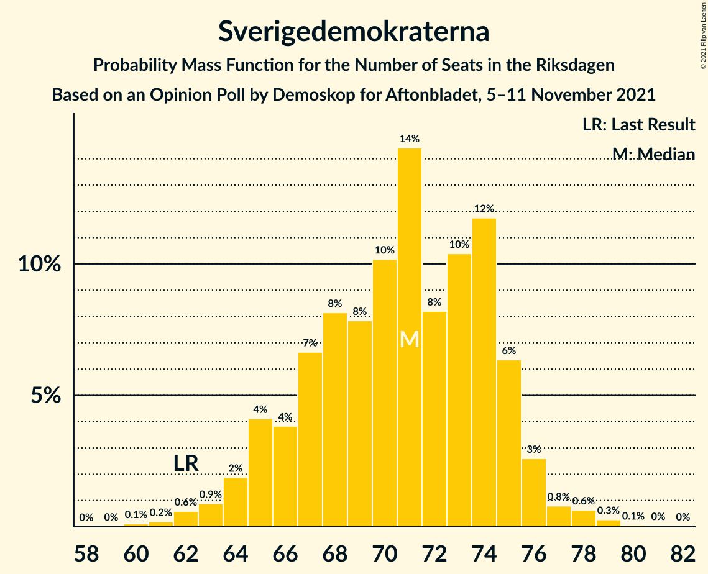

| Number of Seats | Probability | Accumulated | Special Marks |
|:---------------:|:-----------:|:-----------:|:-------------:|
| 60 | 0.1% | 100% |  |
| 61 | 0.2% | 99.9% |  |
| 62 | 0.6% | 99.7% | Last Result |
| 63 | 0.9% | 99.1% |  |
| 64 | 2% | 98% |  |
| 65 | 4% | 96% |  |
| 66 | 4% | 92% |  |
| 67 | 7% | 88% |  |
| 68 | 8% | 82% |  |
| 69 | 8% | 74% |  |
| 70 | 10% | 66% |  |
| 71 | 14% | 56% | Median |
| 72 | 8% | 41% |  |
| 73 | 10% | 33% |  |
| 74 | 12% | 23% |  |
| 75 | 6% | 11% |  |
| 76 | 3% | 4% |  |
| 77 | 0.8% | 2% |  |
| 78 | 0.6% | 1.0% |  |
| 79 | 0.3% | 0.4% |  |
| 80 | 0.1% | 0.1% |  |
| 81 | 0% | 0.1% |  |
| 82 | 0% | 0% |  |

### Centerpartiet

*For a full overview of the results for this party, see the [Centerpartiet](party-centerpartiet.html) page.*

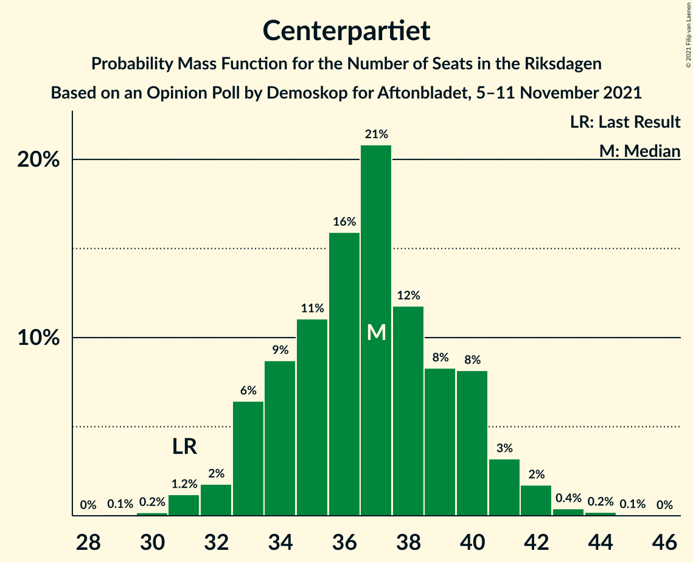

| Number of Seats | Probability | Accumulated | Special Marks |
|:---------------:|:-----------:|:-----------:|:-------------:|
| 29 | 0.1% | 100% |  |
| 30 | 0.2% | 99.9% |  |
| 31 | 1.2% | 99.7% | Last Result |
| 32 | 2% | 98.5% |  |
| 33 | 6% | 97% |  |
| 34 | 9% | 90% |  |
| 35 | 11% | 82% |  |
| 36 | 16% | 71% |  |
| 37 | 21% | 55% | Median |
| 38 | 12% | 34% |  |
| 39 | 8% | 22% |  |
| 40 | 8% | 14% |  |
| 41 | 3% | 6% |  |
| 42 | 2% | 2% |  |
| 43 | 0.4% | 0.7% |  |
| 44 | 0.2% | 0.3% |  |
| 45 | 0.1% | 0.1% |  |
| 46 | 0% | 0% |  |

### Vänsterpartiet

*For a full overview of the results for this party, see the [Vänsterpartiet](party-vänsterpartiet.html) page.*

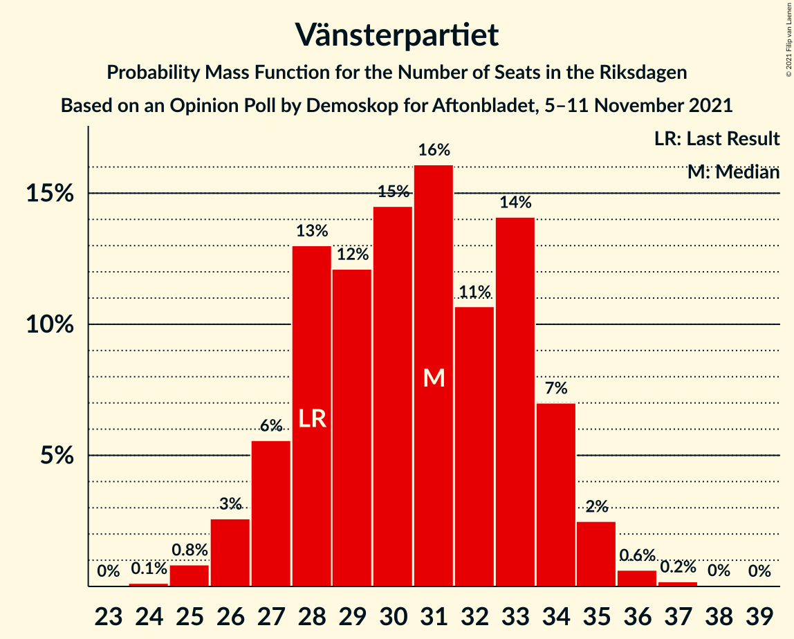

| Number of Seats | Probability | Accumulated | Special Marks |
|:---------------:|:-----------:|:-----------:|:-------------:|
| 24 | 0.1% | 100% |  |
| 25 | 0.8% | 99.8% |  |
| 26 | 3% | 99.0% |  |
| 27 | 6% | 96% |  |
| 28 | 13% | 91% | Last Result |
| 29 | 12% | 78% |  |
| 30 | 15% | 66% |  |
| 31 | 16% | 51% | Median |
| 32 | 11% | 35% |  |
| 33 | 14% | 24% |  |
| 34 | 7% | 10% |  |
| 35 | 2% | 3% |  |
| 36 | 0.6% | 0.9% |  |
| 37 | 0.2% | 0.3% |  |
| 38 | 0% | 0.1% |  |
| 39 | 0% | 0% |  |

### Kristdemokraterna

*For a full overview of the results for this party, see the [Kristdemokraterna](party-kristdemokraterna.html) page.*

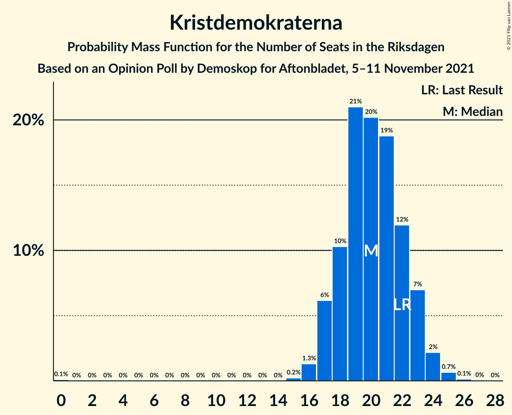

| Number of Seats | Probability | Accumulated | Special Marks |
|:---------------:|:-----------:|:-----------:|:-------------:|
| 0 | 0.1% | 100% |  |
| 1 | 0% | 99.9% |  |
| 2 | 0% | 99.9% |  |
| 3 | 0% | 99.9% |  |
| 4 | 0% | 99.9% |  |
| 5 | 0% | 99.9% |  |
| 6 | 0% | 99.9% |  |
| 7 | 0% | 99.9% |  |
| 8 | 0% | 99.9% |  |
| 9 | 0% | 99.9% |  |
| 10 | 0% | 99.9% |  |
| 11 | 0% | 99.9% |  |
| 12 | 0% | 99.9% |  |
| 13 | 0% | 99.9% |  |
| 14 | 0% | 99.9% |  |
| 15 | 0.2% | 99.9% |  |
| 16 | 1.3% | 99.7% |  |
| 17 | 6% | 98% |  |
| 18 | 10% | 92% |  |
| 19 | 21% | 82% |  |
| 20 | 20% | 61% | Median |
| 21 | 19% | 41% |  |
| 22 | 12% | 22% | Last Result |
| 23 | 7% | 10% |  |
| 24 | 2% | 3% |  |
| 25 | 0.7% | 0.8% |  |
| 26 | 0.1% | 0.2% |  |
| 27 | 0% | 0% |  |

### Miljöpartiet de gröna

*For a full overview of the results for this party, see the [Miljöpartiet de gröna](party-miljöpartietdegröna.html) page.*

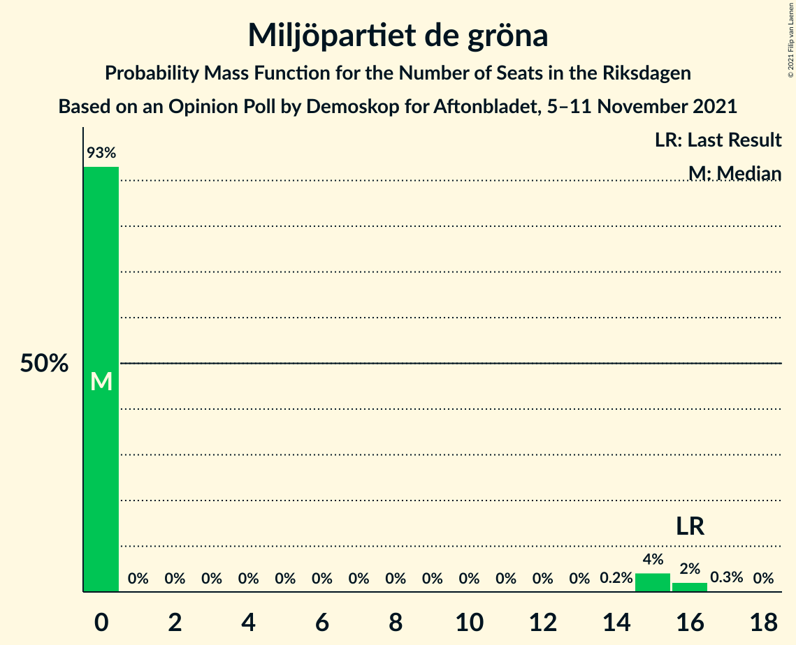

| Number of Seats | Probability | Accumulated | Special Marks |
|:---------------:|:-----------:|:-----------:|:-------------:|
| 0 | 93% | 100% | Median |
| 1 | 0% | 7% |  |
| 2 | 0% | 7% |  |
| 3 | 0% | 7% |  |
| 4 | 0% | 7% |  |
| 5 | 0% | 7% |  |
| 6 | 0% | 7% |  |
| 7 | 0% | 7% |  |
| 8 | 0% | 7% |  |
| 9 | 0% | 7% |  |
| 10 | 0% | 7% |  |
| 11 | 0% | 7% |  |
| 12 | 0% | 7% |  |
| 13 | 0% | 7% |  |
| 14 | 0.2% | 7% |  |
| 15 | 4% | 7% |  |
| 16 | 2% | 2% | Last Result |
| 17 | 0.3% | 0.3% |  |
| 18 | 0% | 0% |  |

### Liberalerna

*For a full overview of the results for this party, see the [Liberalerna](party-liberalerna.html) page.*

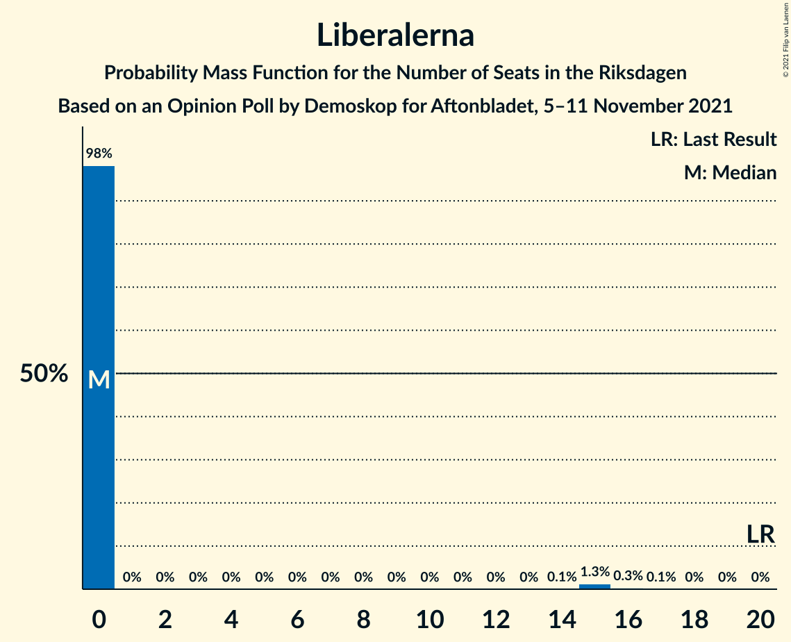

| Number of Seats | Probability | Accumulated | Special Marks |
|:---------------:|:-----------:|:-----------:|:-------------:|
| 0 | 98% | 100% | Median |
| 1 | 0% | 2% |  |
| 2 | 0% | 2% |  |
| 3 | 0% | 2% |  |
| 4 | 0% | 2% |  |
| 5 | 0% | 2% |  |
| 6 | 0% | 2% |  |
| 7 | 0% | 2% |  |
| 8 | 0% | 2% |  |
| 9 | 0% | 2% |  |
| 10 | 0% | 2% |  |
| 11 | 0% | 2% |  |
| 12 | 0% | 2% |  |
| 13 | 0% | 2% |  |
| 14 | 0.1% | 2% |  |
| 15 | 1.3% | 2% |  |
| 16 | 0.3% | 0.4% |  |
| 17 | 0.1% | 0.1% |  |
| 18 | 0% | 0% |  |
| 19 | 0% | 0% |  |
| 20 | 0% | 0% | Last Result |

## Coalitions

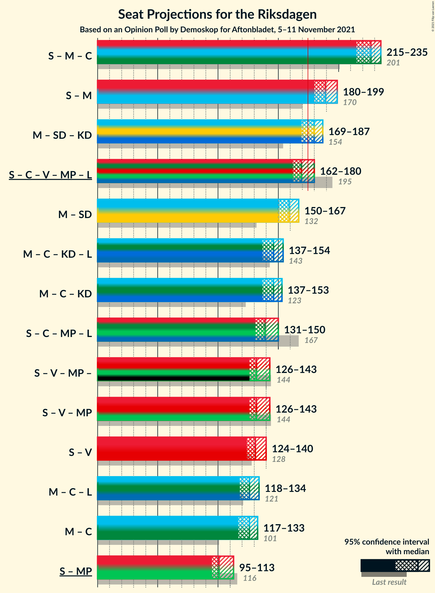

### Confidence Intervals

| Coalition | Last Result | Median | Majority? | 80% Confidence Interval | 90% Confidence Interval | 95% Confidence Interval | 99% Confidence Interval |
|:---------:|:-----------:|:------:|:---------:|:-----------------------:|:-----------------------:|:-----------------------:|:-----------------------:|
| Sveriges socialdemokratiska arbetareparti – Moderata samlingspartiet – Centerpartiet | 201 | 227 | 100% | 221–232 | 217–234 | 215–235 | 212–237 |
| Sveriges socialdemokratiska arbetareparti – Moderata samlingspartiet | 170 | 189 | 99.8% | 185–196 | 181–198 | 180–199 | 177–200 |
| Moderata samlingspartiet – Sverigedemokraterna – Kristdemokraterna | 154 | 180 | 86% | 173–185 | 171–186 | 169–187 | 165–189 |
| Sveriges socialdemokratiska arbetareparti – Centerpartiet – Vänsterpartiet – Miljöpartiet de gröna – Liberalerna | 195 | 169 | 14% | 164–176 | 163–178 | 162–180 | 160–184 |
| Moderata samlingspartiet – Sverigedemokraterna | 132 | 159 | 0% | 154–165 | 152–166 | 150–167 | 147–169 |
| Moderata samlingspartiet – Centerpartiet – Kristdemokraterna – Liberalerna | 143 | 146 | 0% | 140–151 | 138–153 | 137–154 | 133–158 |
| Moderata samlingspartiet – Centerpartiet – Kristdemokraterna | 123 | 146 | 0% | 140–150 | 138–152 | 137–153 | 133–156 |
| Sveriges socialdemokratiska arbetareparti – Centerpartiet – Miljöpartiet de gröna – Liberalerna | 167 | 139 | 0% | 134–145 | 133–148 | 131–150 | 129–154 |
| Sveriges socialdemokratiska arbetareparti – Vänsterpartiet – Miljöpartiet de gröna | 144 | 132 | 0% | 128–139 | 126–141 | 126–143 | 123–147 |
| Sveriges socialdemokratiska arbetareparti – Vänsterpartiet | 128 | 131 | 0% | 127–137 | 125–139 | 124–140 | 121–142 |
| Moderata samlingspartiet – Centerpartiet – Liberalerna | 121 | 126 | 0% | 120–130 | 119–132 | 118–134 | 115–139 |
| Moderata samlingspartiet – Centerpartiet | 101 | 126 | 0% | 120–130 | 119–131 | 117–133 | 114–135 |
| Sveriges socialdemokratiska arbetareparti – Miljöpartiet de gröna | 116 | 101 | 0% | 97–108 | 96–111 | 95–113 | 93–118 |

### Sveriges socialdemokratiska arbetareparti – Moderata samlingspartiet – Centerpartiet

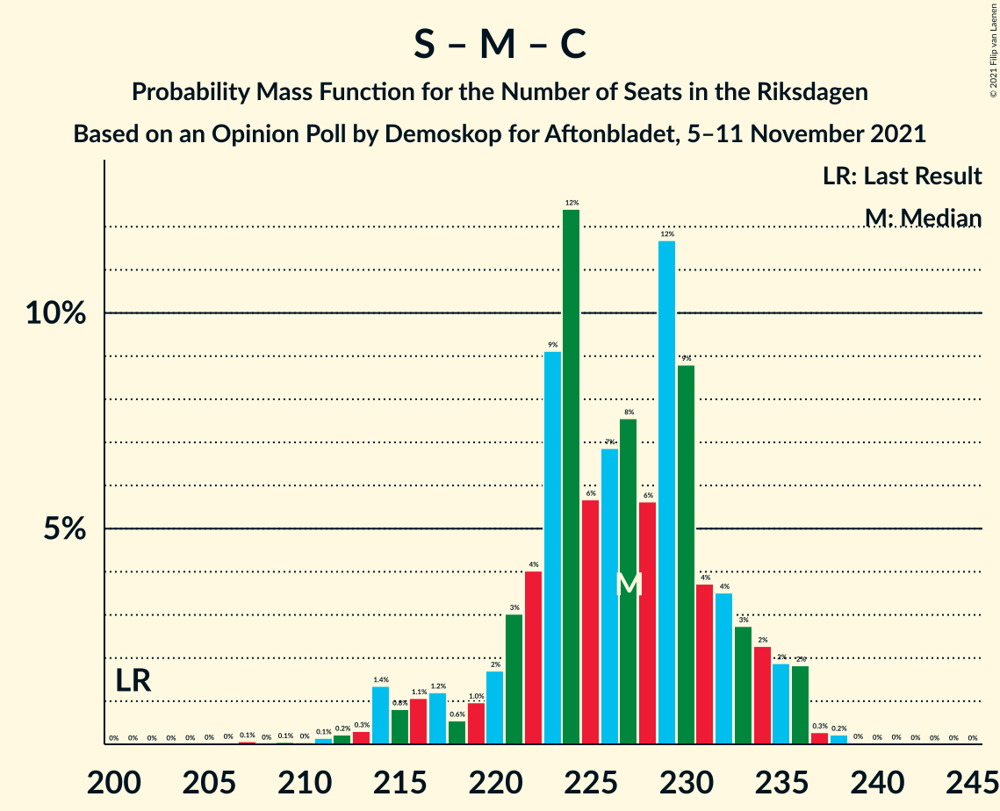

| Number of Seats | Probability | Accumulated | Special Marks |
|:---------------:|:-----------:|:-----------:|:-------------:|
| 201 | 0% | 100% | Last Result |
| 202 | 0% | 100% |  |
| 203 | 0% | 100% |  |
| 204 | 0% | 100% |  |
| 205 | 0% | 100% |  |
| 206 | 0% | 100% |  |
| 207 | 0.1% | 99.9% |  |
| 208 | 0% | 99.9% |  |
| 209 | 0.1% | 99.8% |  |
| 210 | 0% | 99.8% |  |
| 211 | 0.1% | 99.7% |  |
| 212 | 0.2% | 99.6% |  |
| 213 | 0.3% | 99.4% |  |
| 214 | 1.4% | 99.1% |  |
| 215 | 0.8% | 98% |  |
| 216 | 1.1% | 97% |  |
| 217 | 1.2% | 96% |  |
| 218 | 0.6% | 95% |  |
| 219 | 1.0% | 94% |  |
| 220 | 2% | 93% |  |
| 221 | 3% | 91% |  |
| 222 | 4% | 88% |  |
| 223 | 9% | 84% |  |
| 224 | 12% | 75% |  |
| 225 | 6% | 63% |  |
| 226 | 7% | 57% |  |
| 227 | 8% | 50% | Median |
| 228 | 6% | 43% |  |
| 229 | 12% | 37% |  |
| 230 | 9% | 25% |  |
| 231 | 4% | 17% |  |
| 232 | 4% | 13% |  |
| 233 | 3% | 9% |  |
| 234 | 2% | 7% |  |
| 235 | 2% | 4% |  |
| 236 | 2% | 2% |  |
| 237 | 0.3% | 0.6% |  |
| 238 | 0.2% | 0.3% |  |
| 239 | 0% | 0.1% |  |
| 240 | 0% | 0.1% |  |
| 241 | 0% | 0.1% |  |
| 242 | 0% | 0% |  |

### Sveriges socialdemokratiska arbetareparti – Moderata samlingspartiet

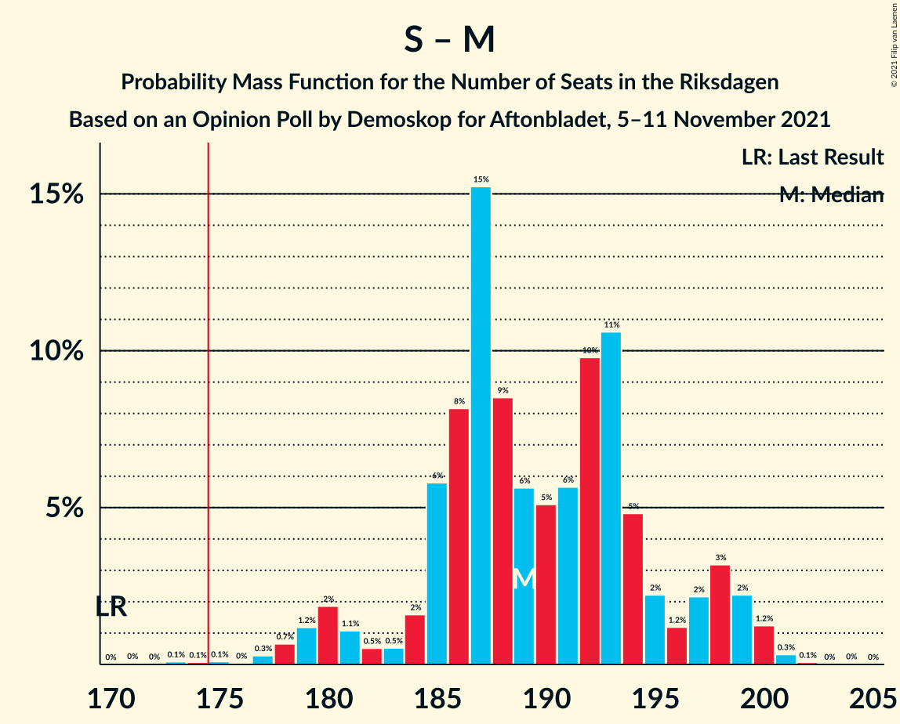

| Number of Seats | Probability | Accumulated | Special Marks |
|:---------------:|:-----------:|:-----------:|:-------------:|
| 170 | 0% | 100% | Last Result |
| 171 | 0% | 100% |  |
| 172 | 0% | 100% |  |
| 173 | 0.1% | 99.9% |  |
| 174 | 0.1% | 99.9% |  |
| 175 | 0.1% | 99.8% | Majority |
| 176 | 0% | 99.7% |  |
| 177 | 0.3% | 99.6% |  |
| 178 | 0.7% | 99.4% |  |
| 179 | 1.2% | 98.7% |  |
| 180 | 2% | 98% |  |
| 181 | 1.1% | 96% |  |
| 182 | 0.5% | 95% |  |
| 183 | 0.5% | 94% |  |
| 184 | 2% | 94% |  |
| 185 | 6% | 92% |  |
| 186 | 8% | 86% |  |
| 187 | 15% | 78% |  |
| 188 | 9% | 63% |  |
| 189 | 6% | 54% |  |
| 190 | 5% | 49% | Median |
| 191 | 6% | 44% |  |
| 192 | 10% | 38% |  |
| 193 | 11% | 28% |  |
| 194 | 5% | 17% |  |
| 195 | 2% | 13% |  |
| 196 | 1.2% | 10% |  |
| 197 | 2% | 9% |  |
| 198 | 3% | 7% |  |
| 199 | 2% | 4% |  |
| 200 | 1.2% | 2% |  |
| 201 | 0.3% | 0.5% |  |
| 202 | 0.1% | 0.1% |  |
| 203 | 0% | 0.1% |  |
| 204 | 0% | 0.1% |  |
| 205 | 0% | 0% |  |

### Moderata samlingspartiet – Sverigedemokraterna – Kristdemokraterna

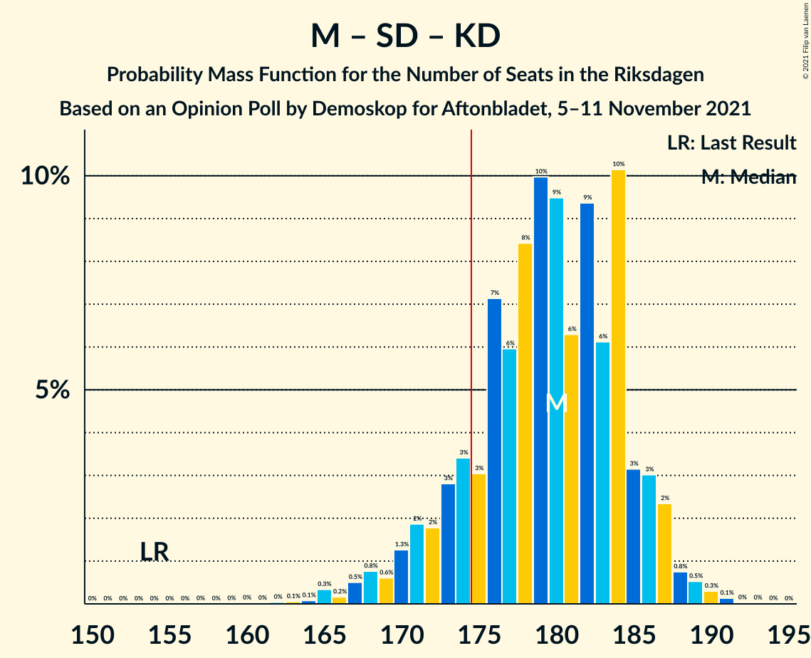

| Number of Seats | Probability | Accumulated | Special Marks |
|:---------------:|:-----------:|:-----------:|:-------------:|
| 154 | 0% | 100% | Last Result |
| 155 | 0% | 100% |  |
| 156 | 0% | 100% |  |
| 157 | 0% | 100% |  |
| 158 | 0% | 100% |  |
| 159 | 0% | 100% |  |
| 160 | 0% | 100% |  |
| 161 | 0% | 100% |  |
| 162 | 0% | 99.9% |  |
| 163 | 0.1% | 99.9% |  |
| 164 | 0.1% | 99.8% |  |
| 165 | 0.3% | 99.8% |  |
| 166 | 0.2% | 99.4% |  |
| 167 | 0.5% | 99.3% |  |
| 168 | 0.8% | 98.8% |  |
| 169 | 0.6% | 98% |  |
| 170 | 1.3% | 97% |  |
| 171 | 2% | 96% |  |
| 172 | 2% | 94% |  |
| 173 | 3% | 92% |  |
| 174 | 3% | 90% |  |
| 175 | 3% | 86% | Majority |
| 176 | 7% | 83% |  |
| 177 | 6% | 76% |  |
| 178 | 8% | 70% |  |
| 179 | 10% | 62% |  |
| 180 | 9% | 52% | Median |
| 181 | 6% | 42% |  |
| 182 | 9% | 36% |  |
| 183 | 6% | 27% |  |
| 184 | 10% | 20% |  |
| 185 | 3% | 10% |  |
| 186 | 3% | 7% |  |
| 187 | 2% | 4% |  |
| 188 | 0.8% | 2% |  |
| 189 | 0.5% | 1.0% |  |
| 190 | 0.3% | 0.5% |  |
| 191 | 0.1% | 0.2% |  |
| 192 | 0% | 0.1% |  |
| 193 | 0% | 0% |  |

### Sveriges socialdemokratiska arbetareparti – Centerpartiet – Vänsterpartiet – Miljöpartiet de gröna – Liberalerna

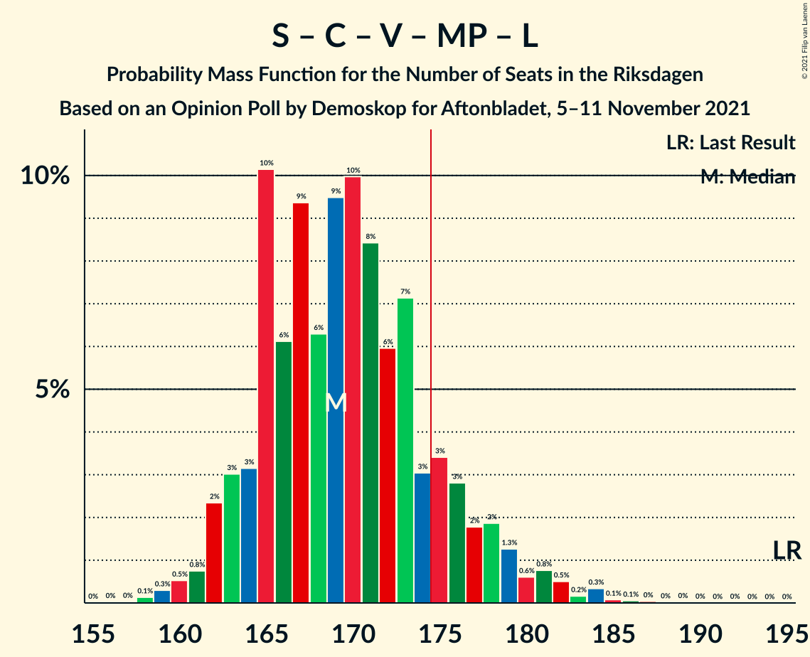

| Number of Seats | Probability | Accumulated | Special Marks |
|:---------------:|:-----------:|:-----------:|:-------------:|
| 157 | 0% | 100% |  |
| 158 | 0.1% | 99.9% |  |
| 159 | 0.3% | 99.8% |  |
| 160 | 0.5% | 99.5% |  |
| 161 | 0.8% | 99.0% |  |
| 162 | 2% | 98% |  |
| 163 | 3% | 96% |  |
| 164 | 3% | 93% |  |
| 165 | 10% | 90% |  |
| 166 | 6% | 80% |  |
| 167 | 9% | 73% |  |
| 168 | 6% | 64% |  |
| 169 | 9% | 58% | Median |
| 170 | 10% | 48% |  |
| 171 | 8% | 38% |  |
| 172 | 6% | 30% |  |
| 173 | 7% | 24% |  |
| 174 | 3% | 17% |  |
| 175 | 3% | 14% | Majority |
| 176 | 3% | 10% |  |
| 177 | 2% | 8% |  |
| 178 | 2% | 6% |  |
| 179 | 1.3% | 4% |  |
| 180 | 0.6% | 3% |  |
| 181 | 0.8% | 2% |  |
| 182 | 0.5% | 1.2% |  |
| 183 | 0.2% | 0.7% |  |
| 184 | 0.3% | 0.6% |  |
| 185 | 0.1% | 0.2% |  |
| 186 | 0.1% | 0.2% |  |
| 187 | 0% | 0.1% |  |
| 188 | 0% | 0.1% |  |
| 189 | 0% | 0% |  |
| 190 | 0% | 0% |  |
| 191 | 0% | 0% |  |
| 192 | 0% | 0% |  |
| 193 | 0% | 0% |  |
| 194 | 0% | 0% |  |
| 195 | 0% | 0% | Last Result |

### Moderata samlingspartiet – Sverigedemokraterna

| Number of Seats | Probability | Accumulated | Special Marks |
|:---------------:|:-----------:|:-----------:|:-------------:|
| 132 | 0% | 100% | Last Result |
| 133 | 0% | 100% |  |
| 134 | 0% | 100% |  |
| 135 | 0% | 100% |  |
| 136 | 0% | 100% |  |
| 137 | 0% | 100% |  |
| 138 | 0% | 100% |  |
| 139 | 0% | 100% |  |
| 140 | 0% | 100% |  |
| 141 | 0% | 100% |  |
| 142 | 0% | 100% |  |
| 143 | 0% | 99.9% |  |
| 144 | 0.1% | 99.9% |  |
| 145 | 0.1% | 99.9% |  |
| 146 | 0.1% | 99.8% |  |
| 147 | 0.6% | 99.6% |  |
| 148 | 0.6% | 99.1% |  |
| 149 | 0.6% | 98% |  |
| 150 | 0.8% | 98% |  |
| 151 | 1.3% | 97% |  |
| 152 | 2% | 96% |  |
| 153 | 2% | 94% |  |
| 154 | 4% | 91% |  |
| 155 | 5% | 88% |  |
| 156 | 8% | 82% |  |
| 157 | 8% | 74% |  |
| 158 | 9% | 67% |  |
| 159 | 9% | 58% |  |
| 160 | 5% | 49% | Median |
| 161 | 11% | 44% |  |
| 162 | 6% | 33% |  |
| 163 | 10% | 27% |  |
| 164 | 6% | 17% |  |
| 165 | 6% | 11% |  |
| 166 | 2% | 5% |  |
| 167 | 2% | 4% |  |
| 168 | 0.9% | 2% |  |
| 169 | 0.3% | 0.8% |  |
| 170 | 0.3% | 0.5% |  |
| 171 | 0.1% | 0.2% |  |
| 172 | 0% | 0.1% |  |
| 173 | 0% | 0% |  |

### Moderata samlingspartiet – Centerpartiet – Kristdemokraterna – Liberalerna

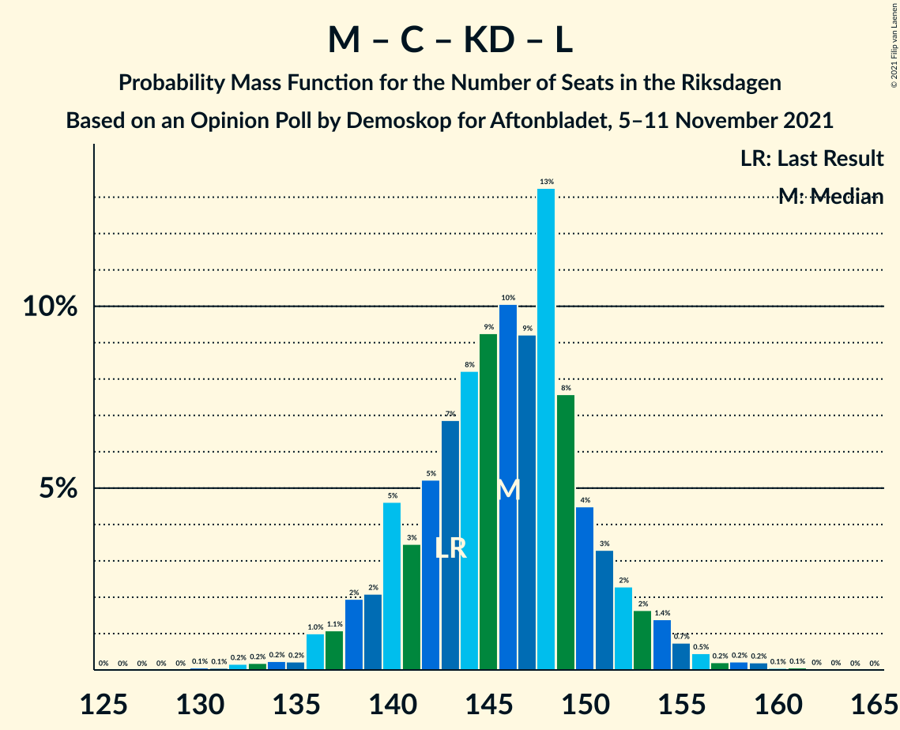

| Number of Seats | Probability | Accumulated | Special Marks |
|:---------------:|:-----------:|:-----------:|:-------------:|
| 130 | 0.1% | 100% |  |
| 131 | 0.1% | 99.9% |  |
| 132 | 0.2% | 99.9% |  |
| 133 | 0.2% | 99.7% |  |
| 134 | 0.2% | 99.5% |  |
| 135 | 0.2% | 99.3% |  |
| 136 | 1.0% | 99.0% |  |
| 137 | 1.1% | 98% |  |
| 138 | 2% | 97% |  |
| 139 | 2% | 95% |  |
| 140 | 5% | 93% |  |
| 141 | 3% | 88% |  |
| 142 | 5% | 85% |  |
| 143 | 7% | 80% | Last Result |
| 144 | 8% | 73% |  |
| 145 | 9% | 65% |  |
| 146 | 10% | 55% | Median |
| 147 | 9% | 45% |  |
| 148 | 13% | 36% |  |
| 149 | 8% | 23% |  |
| 150 | 4% | 15% |  |
| 151 | 3% | 11% |  |
| 152 | 2% | 7% |  |
| 153 | 2% | 5% |  |
| 154 | 1.4% | 3% |  |
| 155 | 0.7% | 2% |  |
| 156 | 0.5% | 1.3% |  |
| 157 | 0.2% | 0.8% |  |
| 158 | 0.2% | 0.6% |  |
| 159 | 0.2% | 0.4% |  |
| 160 | 0.1% | 0.2% |  |
| 161 | 0.1% | 0.1% |  |
| 162 | 0% | 0.1% |  |
| 163 | 0% | 0% |  |

### Moderata samlingspartiet – Centerpartiet – Kristdemokraterna

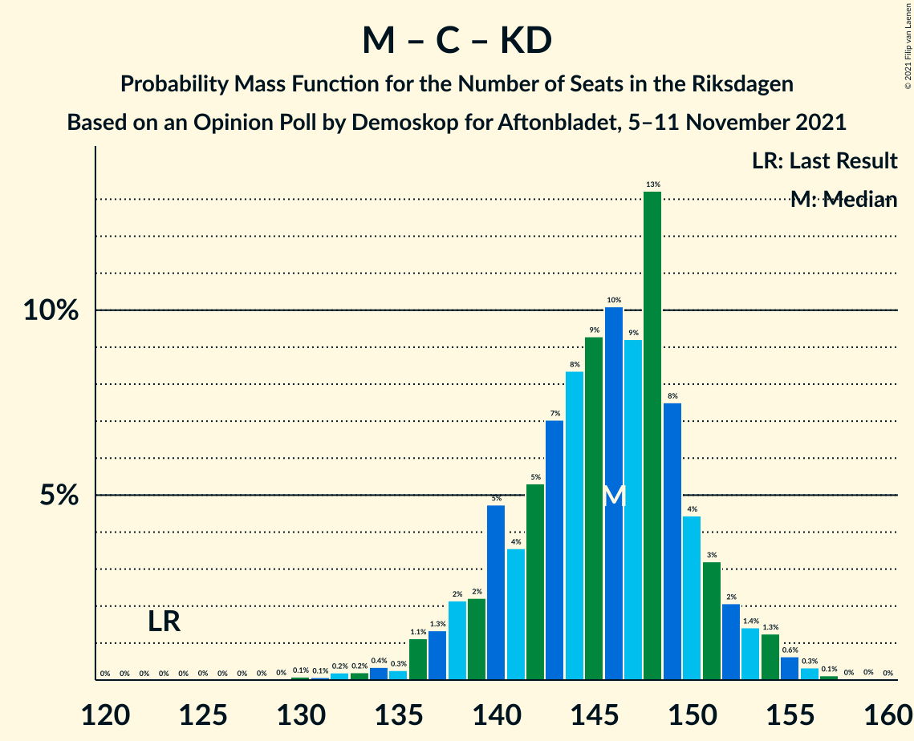

| Number of Seats | Probability | Accumulated | Special Marks |
|:---------------:|:-----------:|:-----------:|:-------------:|
| 123 | 0% | 100% | Last Result |
| 124 | 0% | 100% |  |
| 125 | 0% | 100% |  |
| 126 | 0% | 100% |  |
| 127 | 0% | 100% |  |
| 128 | 0% | 100% |  |
| 129 | 0% | 100% |  |
| 130 | 0.1% | 99.9% |  |
| 131 | 0.1% | 99.9% |  |
| 132 | 0.2% | 99.8% |  |
| 133 | 0.2% | 99.6% |  |
| 134 | 0.4% | 99.4% |  |
| 135 | 0.3% | 99.0% |  |
| 136 | 1.1% | 98.8% |  |
| 137 | 1.3% | 98% |  |
| 138 | 2% | 96% |  |
| 139 | 2% | 94% |  |
| 140 | 5% | 92% |  |
| 141 | 4% | 87% |  |
| 142 | 5% | 84% |  |
| 143 | 7% | 78% |  |
| 144 | 8% | 71% |  |
| 145 | 9% | 63% |  |
| 146 | 10% | 54% | Median |
| 147 | 9% | 44% |  |
| 148 | 13% | 34% |  |
| 149 | 8% | 21% |  |
| 150 | 4% | 14% |  |
| 151 | 3% | 9% |  |
| 152 | 2% | 6% |  |
| 153 | 1.4% | 4% |  |
| 154 | 1.3% | 2% |  |
| 155 | 0.6% | 1.2% |  |
| 156 | 0.3% | 0.5% |  |
| 157 | 0.1% | 0.2% |  |
| 158 | 0% | 0.1% |  |
| 159 | 0% | 0.1% |  |
| 160 | 0% | 0% |  |

### Sveriges socialdemokratiska arbetareparti – Centerpartiet – Miljöpartiet de gröna – Liberalerna

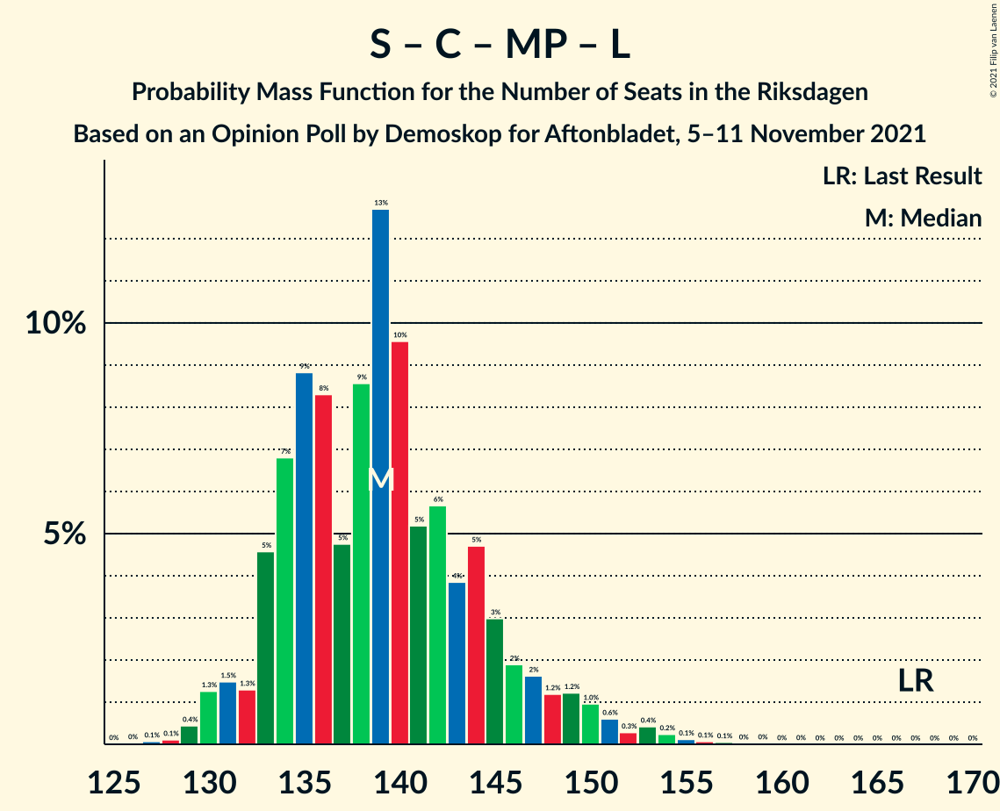

| Number of Seats | Probability | Accumulated | Special Marks |
|:---------------:|:-----------:|:-----------:|:-------------:|
| 127 | 0.1% | 100% |  |
| 128 | 0.1% | 99.9% |  |
| 129 | 0.4% | 99.8% |  |
| 130 | 1.3% | 99.3% |  |
| 131 | 1.5% | 98% |  |
| 132 | 1.3% | 97% |  |
| 133 | 5% | 95% |  |
| 134 | 7% | 91% |  |
| 135 | 9% | 84% |  |
| 136 | 8% | 75% |  |
| 137 | 5% | 67% |  |
| 138 | 9% | 62% | Median |
| 139 | 13% | 53% |  |
| 140 | 10% | 41% |  |
| 141 | 5% | 31% |  |
| 142 | 6% | 26% |  |
| 143 | 4% | 20% |  |
| 144 | 5% | 16% |  |
| 145 | 3% | 12% |  |
| 146 | 2% | 9% |  |
| 147 | 2% | 7% |  |
| 148 | 1.2% | 5% |  |
| 149 | 1.2% | 4% |  |
| 150 | 1.0% | 3% |  |
| 151 | 0.6% | 2% |  |
| 152 | 0.3% | 1.3% |  |
| 153 | 0.4% | 1.0% |  |
| 154 | 0.2% | 0.6% |  |
| 155 | 0.1% | 0.3% |  |
| 156 | 0.1% | 0.2% |  |
| 157 | 0.1% | 0.1% |  |
| 158 | 0% | 0.1% |  |
| 159 | 0% | 0% |  |
| 160 | 0% | 0% |  |
| 161 | 0% | 0% |  |
| 162 | 0% | 0% |  |
| 163 | 0% | 0% |  |
| 164 | 0% | 0% |  |
| 165 | 0% | 0% |  |
| 166 | 0% | 0% |  |
| 167 | 0% | 0% | Last Result |

### Sveriges socialdemokratiska arbetareparti – Vänsterpartiet – Miljöpartiet de gröna

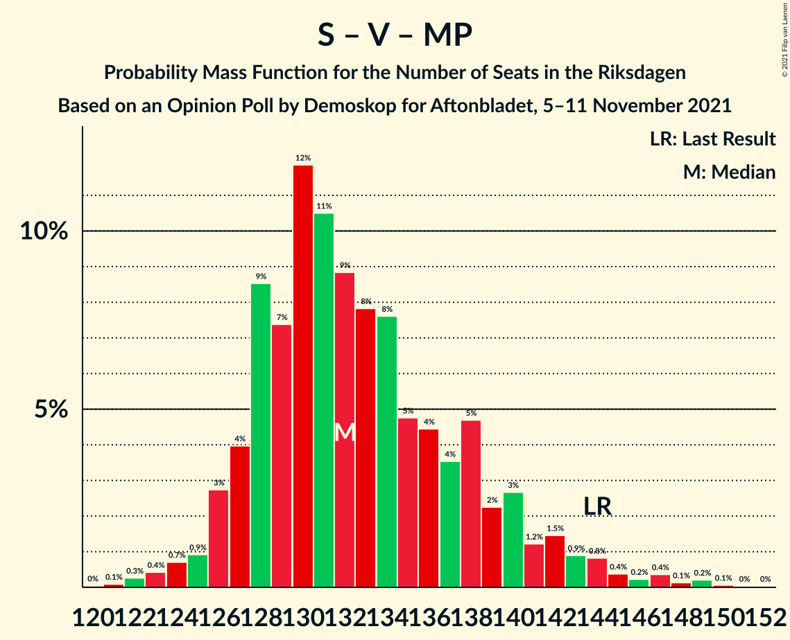

| Number of Seats | Probability | Accumulated | Special Marks |
|:---------------:|:-----------:|:-----------:|:-------------:|
| 120 | 0% | 100% |  |
| 121 | 0.1% | 99.9% |  |
| 122 | 0.3% | 99.8% |  |
| 123 | 0.4% | 99.6% |  |
| 124 | 0.7% | 99.1% |  |
| 125 | 0.9% | 98% |  |
| 126 | 3% | 98% |  |
| 127 | 4% | 95% |  |
| 128 | 9% | 91% |  |
| 129 | 7% | 82% |  |
| 130 | 12% | 75% |  |
| 131 | 11% | 63% |  |
| 132 | 9% | 53% | Median |
| 133 | 8% | 44% |  |
| 134 | 8% | 36% |  |
| 135 | 5% | 28% |  |
| 136 | 4% | 23% |  |
| 137 | 4% | 19% |  |
| 138 | 5% | 15% |  |
| 139 | 2% | 11% |  |
| 140 | 3% | 9% |  |
| 141 | 1.2% | 6% |  |
| 142 | 1.5% | 5% |  |
| 143 | 0.9% | 3% |  |
| 144 | 0.8% | 2% | Last Result |
| 145 | 0.4% | 1.5% |  |
| 146 | 0.2% | 1.1% |  |
| 147 | 0.4% | 0.9% |  |
| 148 | 0.1% | 0.5% |  |
| 149 | 0.2% | 0.4% |  |
| 150 | 0.1% | 0.2% |  |
| 151 | 0% | 0.1% |  |
| 152 | 0% | 0% |  |

### Sveriges socialdemokratiska arbetareparti – Vänsterpartiet

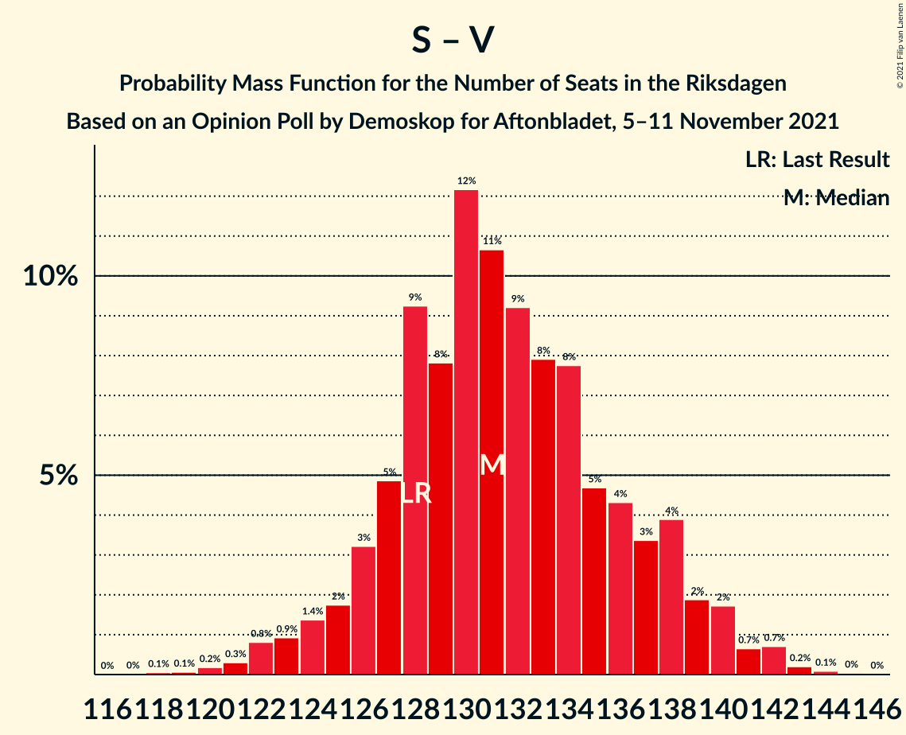

| Number of Seats | Probability | Accumulated | Special Marks |
|:---------------:|:-----------:|:-----------:|:-------------:|
| 118 | 0.1% | 100% |  |
| 119 | 0.1% | 99.9% |  |
| 120 | 0.2% | 99.8% |  |
| 121 | 0.3% | 99.7% |  |
| 122 | 0.8% | 99.4% |  |
| 123 | 0.9% | 98.5% |  |
| 124 | 1.4% | 98% |  |
| 125 | 2% | 96% |  |
| 126 | 3% | 94% |  |
| 127 | 5% | 91% |  |
| 128 | 9% | 86% | Last Result |
| 129 | 8% | 77% |  |
| 130 | 12% | 69% |  |
| 131 | 11% | 57% |  |
| 132 | 9% | 46% | Median |
| 133 | 8% | 37% |  |
| 134 | 8% | 29% |  |
| 135 | 5% | 22% |  |
| 136 | 4% | 17% |  |
| 137 | 3% | 13% |  |
| 138 | 4% | 9% |  |
| 139 | 2% | 5% |  |
| 140 | 2% | 3% |  |
| 141 | 0.7% | 2% |  |
| 142 | 0.7% | 1.1% |  |
| 143 | 0.2% | 0.4% |  |
| 144 | 0.1% | 0.2% |  |
| 145 | 0% | 0.1% |  |
| 146 | 0% | 0% |  |

### Moderata samlingspartiet – Centerpartiet – Liberalerna

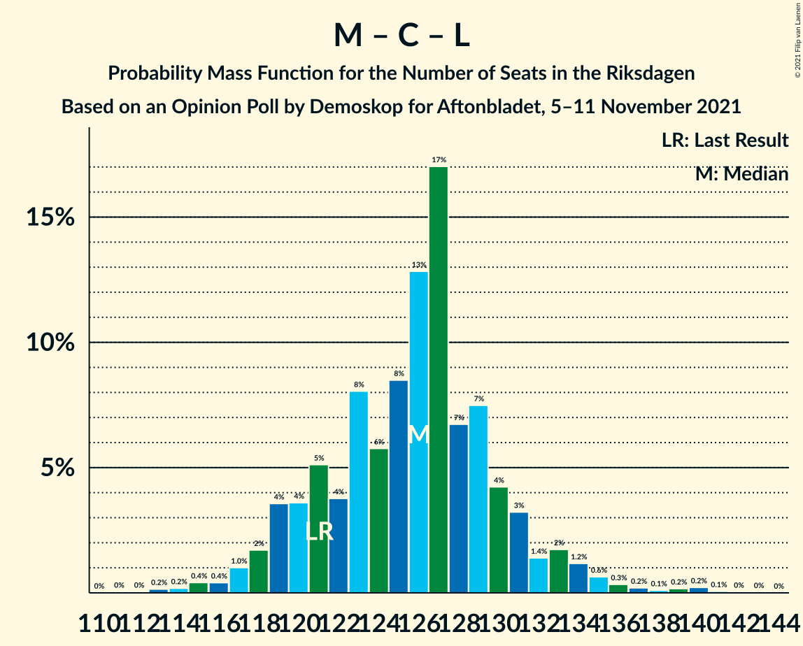

| Number of Seats | Probability | Accumulated | Special Marks |
|:---------------:|:-----------:|:-----------:|:-------------:|
| 111 | 0% | 100% |  |
| 112 | 0% | 99.9% |  |
| 113 | 0.2% | 99.9% |  |
| 114 | 0.2% | 99.8% |  |
| 115 | 0.4% | 99.6% |  |
| 116 | 0.4% | 99.2% |  |
| 117 | 1.0% | 98.7% |  |
| 118 | 2% | 98% |  |
| 119 | 4% | 96% |  |
| 120 | 4% | 92% |  |
| 121 | 5% | 89% | Last Result |
| 122 | 4% | 84% |  |
| 123 | 8% | 80% |  |
| 124 | 6% | 72% |  |
| 125 | 8% | 66% |  |
| 126 | 13% | 58% | Median |
| 127 | 17% | 45% |  |
| 128 | 7% | 28% |  |
| 129 | 7% | 21% |  |
| 130 | 4% | 14% |  |
| 131 | 3% | 9% |  |
| 132 | 1.4% | 6% |  |
| 133 | 2% | 5% |  |
| 134 | 1.2% | 3% |  |
| 135 | 0.6% | 2% |  |
| 136 | 0.3% | 1.2% |  |
| 137 | 0.2% | 0.8% |  |
| 138 | 0.1% | 0.6% |  |
| 139 | 0.2% | 0.5% |  |
| 140 | 0.2% | 0.4% |  |
| 141 | 0.1% | 0.2% |  |
| 142 | 0% | 0.1% |  |
| 143 | 0% | 0% |  |

### Moderata samlingspartiet – Centerpartiet

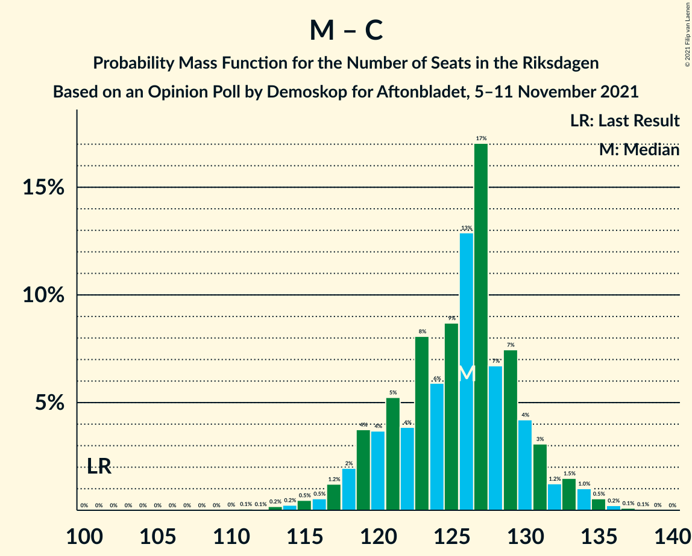

| Number of Seats | Probability | Accumulated | Special Marks |
|:---------------:|:-----------:|:-----------:|:-------------:|
| 101 | 0% | 100% | Last Result |
| 102 | 0% | 100% |  |
| 103 | 0% | 100% |  |
| 104 | 0% | 100% |  |
| 105 | 0% | 100% |  |
| 106 | 0% | 100% |  |
| 107 | 0% | 100% |  |
| 108 | 0% | 100% |  |
| 109 | 0% | 100% |  |
| 110 | 0% | 100% |  |
| 111 | 0.1% | 100% |  |
| 112 | 0.1% | 99.9% |  |
| 113 | 0.2% | 99.8% |  |
| 114 | 0.2% | 99.7% |  |
| 115 | 0.5% | 99.4% |  |
| 116 | 0.5% | 99.0% |  |
| 117 | 1.2% | 98% |  |
| 118 | 2% | 97% |  |
| 119 | 4% | 95% |  |
| 120 | 4% | 92% |  |
| 121 | 5% | 88% |  |
| 122 | 4% | 83% |  |
| 123 | 8% | 79% |  |
| 124 | 6% | 71% |  |
| 125 | 9% | 65% |  |
| 126 | 13% | 56% | Median |
| 127 | 17% | 43% |  |
| 128 | 7% | 26% |  |
| 129 | 7% | 19% |  |
| 130 | 4% | 12% |  |
| 131 | 3% | 8% |  |
| 132 | 1.2% | 5% |  |
| 133 | 1.5% | 3% |  |
| 134 | 1.0% | 2% |  |
| 135 | 0.5% | 0.9% |  |
| 136 | 0.2% | 0.4% |  |
| 137 | 0.1% | 0.2% |  |
| 138 | 0.1% | 0.1% |  |
| 139 | 0% | 0% |  |

### Sveriges socialdemokratiska arbetareparti – Miljöpartiet de gröna

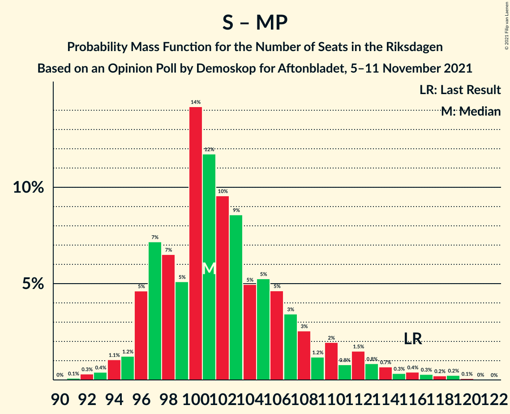

| Number of Seats | Probability | Accumulated | Special Marks |
|:---------------:|:-----------:|:-----------:|:-------------:|
| 90 | 0% | 100% |  |
| 91 | 0.1% | 99.9% |  |
| 92 | 0.3% | 99.9% |  |
| 93 | 0.4% | 99.5% |  |
| 94 | 1.1% | 99.1% |  |
| 95 | 1.2% | 98% |  |
| 96 | 5% | 97% |  |
| 97 | 7% | 92% |  |
| 98 | 7% | 85% |  |
| 99 | 5% | 79% |  |
| 100 | 14% | 73% |  |
| 101 | 12% | 59% | Median |
| 102 | 10% | 48% |  |
| 103 | 9% | 38% |  |
| 104 | 5% | 29% |  |
| 105 | 5% | 24% |  |
| 106 | 5% | 19% |  |
| 107 | 3% | 15% |  |
| 108 | 3% | 11% |  |
| 109 | 1.2% | 9% |  |
| 110 | 2% | 7% |  |
| 111 | 0.8% | 5% |  |
| 112 | 1.5% | 5% |  |
| 113 | 0.8% | 3% |  |
| 114 | 0.7% | 2% |  |
| 115 | 0.3% | 2% |  |
| 116 | 0.4% | 1.3% | Last Result |
| 117 | 0.3% | 0.9% |  |
| 118 | 0.2% | 0.6% |  |
| 119 | 0.2% | 0.4% |  |
| 120 | 0.1% | 0.1% |  |
| 121 | 0% | 0.1% |  |
| 122 | 0% | 0% |  |

## Technical Information

### Opinion Poll

+ **Polling firm:** Demoskop
+ **Commissioner(s):** Aftonbladet
+ **Fieldwork period:** 5–11 November 2021

### Calculations

+ **Sample size:** 2359
+ **Simulations done:** 1,048,576
+ **Error estimate:** 1.39%

