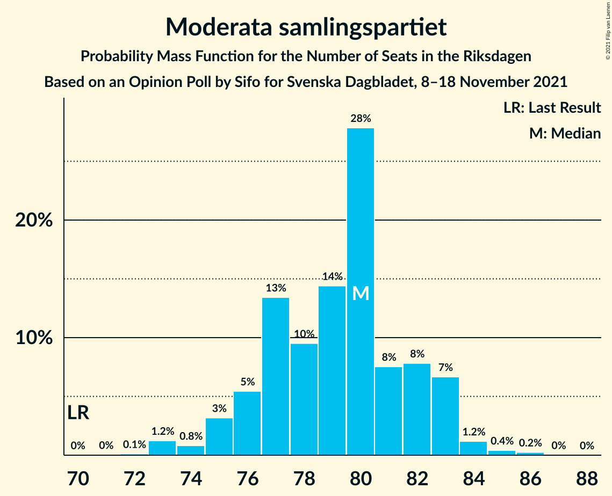

# Opinion Poll by Sifo for Svenska Dagbladet, 8–18 November 2021

<a href="#voting-intentions">Voting Intentions</a> | <a href="#seats">Seats</a> | <a href="#coalitions">Coalitions</a> | <a href="#technical-information">Technical Information</a>

## Voting Intentions

### Confidence Intervals

| Party | Last Result | Poll Result | 80% Confidence Interval | 90% Confidence Interval | 95% Confidence Interval | 99% Confidence Interval |
|:-----:|:-----------:|:-----------:|:-----------------------:|:-----------------------:|:-----------------------:|:-----------------------:|
| Sveriges socialdemokratiska arbetareparti | 28.3% | 28.9% | 28.2–29.7% |28.0–29.9% |27.8–30.1% |27.4–30.5% |
| Moderata samlingspartiet | 19.8% | 21.0% | 20.3–21.7% |20.1–21.9% |20.0–22.1% |19.6–22.4% |
| Sverigedemokraterna | 17.5% | 20.3% | 19.6–21.0% |19.4–21.2% |19.3–21.4% |19.0–21.7% |
| Vänsterpartiet | 8.0% | 9.3% | 8.8–9.8% |8.7–10.0% |8.6–10.1% |8.4–10.3% |
| Centerpartiet | 8.6% | 8.1% | 7.7–8.6% |7.5–8.7% |7.4–8.9% |7.2–9.1% |
| Kristdemokraterna | 6.3% | 4.6% | 4.3–5.0% |4.2–5.1% |4.1–5.2% |3.9–5.4% |
| Miljöpartiet de gröna | 4.4% | 3.6% | 3.3–3.9% |3.2–4.1% |3.2–4.1% |3.0–4.3% |
| Liberalerna | 5.5% | 2.3% | 2.1–2.6% |2.0–2.7% |1.9–2.7% |1.8–2.9% |

*Note:* The poll result column reflects the actual value used in the calculations. Published results may vary slightly, and in addition be rounded to fewer digits.

## Seats

### Confidence Intervals

| Party | Last Result | Median | 80% Confidence Interval | 90% Confidence Interval | 95% Confidence Interval | 99% Confidence Interval |
|:-----:|:-----------:|:------:|:-----------------------:|:-----------------------:|:-----------------------:|:-----------------------:|
| <a href="#sveriges-socialdemokratiska-arbetareparti">Sveriges socialdemokratiska arbetareparti</a> | 100 | 109 | 106–112 |105–113 |103–114 |101–116 |
| <a href="#moderata-samlingspartiet">Moderata samlingspartiet</a> | 70 | 80 | 76–82 |75–83 |75–83 |73–85 |
| <a href="#sverigedemokraterna">Sverigedemokraterna</a> | 62 | 76 | 74–79 |73–80 |72–81 |70–82 |
| <a href="#vänsterpartiet">Vänsterpartiet</a> | 28 | 35 | 33–37 |33–38 |32–38 |31–39 |
| <a href="#centerpartiet">Centerpartiet</a> | 31 | 30 | 29–32 |28–33 |28–34 |27–34 |
| <a href="#kristdemokraterna">Kristdemokraterna</a> | 22 | 17 | 16–19 |16–19 |15–20 |0–20 |
| <a href="#miljöpartiet-de-gröna">Miljöpartiet de gröna</a> | 16 | 0 | 0 |0–15 |0–15 |0–15 |
| <a href="#liberalerna">Liberalerna</a> | 20 | 0 | 0 |0 |0 |0 |

### Sveriges socialdemokratiska arbetareparti

*For a full overview of the results for this party, see the [Sveriges socialdemokratiska arbetareparti](party-sverigessocialdemokratiskaarbetareparti.html) page.*

| Number of Seats | Probability | Accumulated | Special Marks |
|:---------------:|:-----------:|:-----------:|:-------------:|
| 100 | 0.2% | 100% | Last Result |
| 101 | 0.7% | 99.8% |  |
| 102 | 0.8% | 99.1% |  |
| 103 | 1.3% | 98% |  |
| 104 | 2% | 97% |  |
| 105 | 5% | 96% |  |
| 106 | 7% | 91% |  |
| 107 | 9% | 84% |  |
| 108 | 17% | 75% |  |
| 109 | 13% | 58% | Median |
| 110 | 16% | 46% |  |
| 111 | 16% | 30% |  |
| 112 | 6% | 14% |  |
| 113 | 4% | 8% |  |
| 114 | 3% | 4% |  |
| 115 | 0.9% | 2% |  |
| 116 | 0.4% | 0.7% |  |
| 117 | 0.2% | 0.3% |  |
| 118 | 0.1% | 0.2% |  |
| 119 | 0% | 0.1% |  |
| 120 | 0% | 0% |  |

### Moderata samlingspartiet

*For a full overview of the results for this party, see the [Moderata samlingspartiet](party-moderatasamlingspartiet.html) page.*

| Number of Seats | Probability | Accumulated | Special Marks |
|:---------------:|:-----------:|:-----------:|:-------------:|
| 70 | 0% | 100% | Last Result |
| 71 | 0% | 100% |  |
| 72 | 0.1% | 99.9% |  |
| 73 | 1.2% | 99.8% |  |
| 74 | 0.8% | 98.6% |  |
| 75 | 3% | 98% |  |
| 76 | 5% | 95% |  |
| 77 | 13% | 89% |  |
| 78 | 10% | 76% |  |
| 79 | 14% | 66% |  |
| 80 | 28% | 52% | Median |
| 81 | 8% | 24% |  |
| 82 | 8% | 16% |  |
| 83 | 7% | 9% |  |
| 84 | 1.2% | 2% |  |
| 85 | 0.4% | 0.7% |  |
| 86 | 0.2% | 0.3% |  |
| 87 | 0% | 0% |  |

### Sverigedemokraterna

*For a full overview of the results for this party, see the [Sverigedemokraterna](party-sverigedemokraterna.html) page.*

| Number of Seats | Probability | Accumulated | Special Marks |
|:---------------:|:-----------:|:-----------:|:-------------:|
| 62 | 0% | 100% | Last Result |
| 63 | 0% | 100% |  |
| 64 | 0% | 100% |  |
| 65 | 0% | 100% |  |
| 66 | 0% | 100% |  |
| 67 | 0% | 100% |  |
| 68 | 0% | 100% |  |
| 69 | 0.2% | 100% |  |
| 70 | 0.5% | 99.7% |  |
| 71 | 0.8% | 99.2% |  |
| 72 | 2% | 98% |  |
| 73 | 4% | 96% |  |
| 74 | 8% | 92% |  |
| 75 | 16% | 83% |  |
| 76 | 20% | 68% | Median |
| 77 | 15% | 48% |  |
| 78 | 13% | 33% |  |
| 79 | 12% | 20% |  |
| 80 | 4% | 8% |  |
| 81 | 2% | 4% |  |
| 82 | 0.8% | 1.2% |  |
| 83 | 0.2% | 0.4% |  |
| 84 | 0.1% | 0.2% |  |
| 85 | 0.1% | 0.1% |  |
| 86 | 0% | 0% |  |

### Vänsterpartiet

*For a full overview of the results for this party, see the [Vänsterpartiet](party-vänsterpartiet.html) page.*

| Number of Seats | Probability | Accumulated | Special Marks |
|:---------------:|:-----------:|:-----------:|:-------------:|
| 28 | 0% | 100% | Last Result |
| 29 | 0% | 100% |  |
| 30 | 0.1% | 100% |  |
| 31 | 0.6% | 99.9% |  |
| 32 | 3% | 99.4% |  |
| 33 | 8% | 96% |  |
| 34 | 26% | 88% |  |
| 35 | 23% | 61% | Median |
| 36 | 20% | 38% |  |
| 37 | 13% | 19% |  |
| 38 | 4% | 6% |  |
| 39 | 1.2% | 2% |  |
| 40 | 0.4% | 0.4% |  |
| 41 | 0% | 0% |  |

### Centerpartiet

*For a full overview of the results for this party, see the [Centerpartiet](party-centerpartiet.html) page.*

| Number of Seats | Probability | Accumulated | Special Marks |
|:---------------:|:-----------:|:-----------:|:-------------:|
| 26 | 0.1% | 100% |  |
| 27 | 0.8% | 99.9% |  |
| 28 | 4% | 99.1% |  |
| 29 | 18% | 95% |  |
| 30 | 30% | 77% | Median |
| 31 | 21% | 47% | Last Result |
| 32 | 16% | 26% |  |
| 33 | 7% | 9% |  |
| 34 | 2% | 3% |  |
| 35 | 0.4% | 0.4% |  |
| 36 | 0.1% | 0.1% |  |
| 37 | 0% | 0% |  |

### Kristdemokraterna

*For a full overview of the results for this party, see the [Kristdemokraterna](party-kristdemokraterna.html) page.*

| Number of Seats | Probability | Accumulated | Special Marks |
|:---------------:|:-----------:|:-----------:|:-------------:|
| 0 | 0.9% | 100% |  |
| 1 | 0% | 99.1% |  |
| 2 | 0% | 99.1% |  |
| 3 | 0% | 99.1% |  |
| 4 | 0% | 99.1% |  |
| 5 | 0% | 99.1% |  |
| 6 | 0% | 99.1% |  |
| 7 | 0% | 99.1% |  |
| 8 | 0% | 99.1% |  |
| 9 | 0% | 99.1% |  |
| 10 | 0% | 99.1% |  |
| 11 | 0% | 99.1% |  |
| 12 | 0% | 99.1% |  |
| 13 | 0% | 99.1% |  |
| 14 | 0% | 99.1% |  |
| 15 | 2% | 99.1% |  |
| 16 | 15% | 97% |  |
| 17 | 35% | 82% | Median |
| 18 | 31% | 46% |  |
| 19 | 13% | 16% |  |
| 20 | 3% | 3% |  |
| 21 | 0.4% | 0.4% |  |
| 22 | 0% | 0% | Last Result |

### Miljöpartiet de gröna

*For a full overview of the results for this party, see the [Miljöpartiet de gröna](party-miljöpartietdegröna.html) page.*

| Number of Seats | Probability | Accumulated | Special Marks |
|:---------------:|:-----------:|:-----------:|:-------------:|
| 0 | 92% | 100% | Median |
| 1 | 0% | 8% |  |
| 2 | 0% | 8% |  |
| 3 | 0% | 8% |  |
| 4 | 0% | 8% |  |
| 5 | 0% | 8% |  |
| 6 | 0% | 8% |  |
| 7 | 0% | 8% |  |
| 8 | 0% | 8% |  |
| 9 | 0% | 8% |  |
| 10 | 0% | 8% |  |
| 11 | 0% | 8% |  |
| 12 | 0% | 8% |  |
| 13 | 0% | 8% |  |
| 14 | 0% | 8% |  |
| 15 | 8% | 8% |  |
| 16 | 0.4% | 0.4% | Last Result |
| 17 | 0% | 0% |  |

### Liberalerna

*For a full overview of the results for this party, see the [Liberalerna](party-liberalerna.html) page.*

| Number of Seats | Probability | Accumulated | Special Marks |
|:---------------:|:-----------:|:-----------:|:-------------:|
| 0 | 100% | 100% | Median |
| 1 | 0% | 0% |  |
| 2 | 0% | 0% |  |
| 3 | 0% | 0% |  |
| 4 | 0% | 0% |  |
| 5 | 0% | 0% |  |
| 6 | 0% | 0% |  |
| 7 | 0% | 0% |  |
| 8 | 0% | 0% |  |
| 9 | 0% | 0% |  |
| 10 | 0% | 0% |  |
| 11 | 0% | 0% |  |
| 12 | 0% | 0% |  |
| 13 | 0% | 0% |  |
| 14 | 0% | 0% |  |
| 15 | 0% | 0% |  |
| 16 | 0% | 0% |  |
| 17 | 0% | 0% |  |
| 18 | 0% | 0% |  |
| 19 | 0% | 0% |  |
| 20 | 0% | 0% | Last Result |

## Coalitions

### Confidence Intervals

| Coalition | Last Result | Median | Majority? | 80% Confidence Interval | 90% Confidence Interval | 95% Confidence Interval | 99% Confidence Interval |
|:---------:|:-----------:|:------:|:---------:|:-----------------------:|:-----------------------:|:-----------------------:|:-----------------------:|
| Sveriges socialdemokratiska arbetareparti – Moderata samlingspartiet – Centerpartiet | 201 | 219 | 100% | 214–222 | 211–223 | 209–224 | 207–231 |
| Sveriges socialdemokratiska arbetareparti – Moderata samlingspartiet | 170 | 189 | 100% | 184–192 | 181–193 | 179–194 | 177–198 |
| Sveriges socialdemokratiska arbetareparti – Vänsterpartiet – Centerpartiet – Miljöpartiet de gröna – Liberalerna | 195 | 176 | 63% | 172–180 | 171–183 | 171–185 | 169–187 |
| Moderata samlingspartiet – Sverigedemokraterna – Kristdemokraterna | 154 | 173 | 37% | 169–177 | 166–178 | 164–178 | 162–180 |
| Moderata samlingspartiet – Sverigedemokraterna | 132 | 156 | 0% | 152–159 | 150–160 | 148–161 | 146–164 |
| Sveriges socialdemokratiska arbetareparti – Vänsterpartiet – Miljöpartiet de gröna | 144 | 145 | 0% | 142–150 | 141–153 | 140–155 | 139–157 |
| Sveriges socialdemokratiska arbetareparti – Centerpartiet – Miljöpartiet de gröna – Liberalerna | 167 | 140 | 0% | 137–145 | 136–149 | 136–151 | 134–153 |
| Sveriges socialdemokratiska arbetareparti – Vänsterpartiet | 128 | 144 | 0% | 140–148 | 139–149 | 137–149 | 135–152 |
| Moderata samlingspartiet – Centerpartiet – Kristdemokraterna – Liberalerna | 143 | 127 | 0% | 123–131 | 122–131 | 120–132 | 116–133 |
| Moderata samlingspartiet – Centerpartiet – Kristdemokraterna | 123 | 127 | 0% | 123–131 | 122–131 | 120–132 | 116–133 |
| Sveriges socialdemokratiska arbetareparti – Miljöpartiet de gröna | 116 | 110 | 0% | 107–114 | 106–120 | 105–121 | 104–123 |
| Moderata samlingspartiet – Centerpartiet – Liberalerna | 121 | 110 | 0% | 106–113 | 105–114 | 104–115 | 103–117 |
| Moderata samlingspartiet – Centerpartiet | 101 | 110 | 0% | 106–113 | 105–114 | 104–115 | 103–117 |

### Sveriges socialdemokratiska arbetareparti – Moderata samlingspartiet – Centerpartiet

| Number of Seats | Probability | Accumulated | Special Marks |
|:---------------:|:-----------:|:-----------:|:-------------:|
| 201 | 0% | 100% | Last Result |
| 202 | 0% | 100% |  |
| 203 | 0% | 100% |  |
| 204 | 0% | 100% |  |
| 205 | 0.1% | 100% |  |
| 206 | 0.1% | 99.9% |  |
| 207 | 0.6% | 99.8% |  |
| 208 | 0.4% | 99.2% |  |
| 209 | 2% | 98.8% |  |
| 210 | 0.6% | 97% |  |
| 211 | 3% | 96% |  |
| 212 | 0.7% | 93% |  |
| 213 | 1.2% | 93% |  |
| 214 | 1.4% | 91% |  |
| 215 | 4% | 90% |  |
| 216 | 3% | 86% |  |
| 217 | 8% | 83% |  |
| 218 | 15% | 75% |  |
| 219 | 10% | 60% | Median |
| 220 | 16% | 50% |  |
| 221 | 18% | 33% |  |
| 222 | 7% | 16% |  |
| 223 | 4% | 9% |  |
| 224 | 3% | 5% |  |
| 225 | 0.6% | 2% |  |
| 226 | 0.4% | 1.4% |  |
| 227 | 0.1% | 1.0% |  |
| 228 | 0.1% | 0.8% |  |
| 229 | 0.2% | 0.7% |  |
| 230 | 0.1% | 0.6% |  |
| 231 | 0.1% | 0.5% |  |
| 232 | 0.1% | 0.4% |  |
| 233 | 0.1% | 0.3% |  |
| 234 | 0.2% | 0.2% |  |
| 235 | 0% | 0.1% |  |
| 236 | 0% | 0.1% |  |
| 237 | 0% | 0% |  |

### Sveriges socialdemokratiska arbetareparti – Moderata samlingspartiet

| Number of Seats | Probability | Accumulated | Special Marks |
|:---------------:|:-----------:|:-----------:|:-------------:|
| 170 | 0% | 100% | Last Result |
| 171 | 0% | 100% |  |
| 172 | 0% | 100% |  |
| 173 | 0% | 100% |  |
| 174 | 0% | 100% |  |
| 175 | 0.1% | 100% | Majority |
| 176 | 0.1% | 99.9% |  |
| 177 | 0.4% | 99.8% |  |
| 178 | 0.9% | 99.4% |  |
| 179 | 1.1% | 98% |  |
| 180 | 1.1% | 97% |  |
| 181 | 2% | 96% |  |
| 182 | 1.3% | 94% |  |
| 183 | 2% | 93% |  |
| 184 | 2% | 91% |  |
| 185 | 5% | 89% |  |
| 186 | 7% | 84% |  |
| 187 | 9% | 77% |  |
| 188 | 17% | 68% |  |
| 189 | 12% | 51% | Median |
| 190 | 14% | 39% |  |
| 191 | 13% | 25% |  |
| 192 | 5% | 12% |  |
| 193 | 4% | 7% |  |
| 194 | 1.1% | 3% |  |
| 195 | 0.7% | 2% |  |
| 196 | 0.2% | 1.0% |  |
| 197 | 0.2% | 0.8% |  |
| 198 | 0.1% | 0.5% |  |
| 199 | 0.1% | 0.5% |  |
| 200 | 0.1% | 0.4% |  |
| 201 | 0.2% | 0.3% |  |
| 202 | 0% | 0.1% |  |
| 203 | 0% | 0.1% |  |
| 204 | 0% | 0% |  |

### Sveriges socialdemokratiska arbetareparti – Vänsterpartiet – Centerpartiet – Miljöpartiet de gröna – Liberalerna

| Number of Seats | Probability | Accumulated | Special Marks |
|:---------------:|:-----------:|:-----------:|:-------------:|
| 167 | 0% | 100% |  |
| 168 | 0.1% | 99.9% |  |
| 169 | 0.8% | 99.8% |  |
| 170 | 1.5% | 99.0% |  |
| 171 | 3% | 98% |  |
| 172 | 7% | 95% |  |
| 173 | 11% | 87% |  |
| 174 | 14% | 77% | Median |
| 175 | 12% | 63% | Majority |
| 176 | 14% | 51% |  |
| 177 | 13% | 37% |  |
| 178 | 5% | 24% |  |
| 179 | 6% | 18% |  |
| 180 | 3% | 12% |  |
| 181 | 2% | 10% |  |
| 182 | 1.1% | 7% |  |
| 183 | 2% | 6% |  |
| 184 | 1.2% | 4% |  |
| 185 | 1.4% | 3% |  |
| 186 | 0.9% | 2% |  |
| 187 | 0.5% | 0.8% |  |
| 188 | 0.1% | 0.3% |  |
| 189 | 0.1% | 0.1% |  |
| 190 | 0% | 0.1% |  |
| 191 | 0% | 0% |  |
| 192 | 0% | 0% |  |
| 193 | 0% | 0% |  |
| 194 | 0% | 0% |  |
| 195 | 0% | 0% | Last Result |

### Moderata samlingspartiet – Sverigedemokraterna – Kristdemokraterna

| Number of Seats | Probability | Accumulated | Special Marks |
|:---------------:|:-----------:|:-----------:|:-------------:|
| 154 | 0% | 100% | Last Result |
| 155 | 0% | 100% |  |
| 156 | 0% | 100% |  |
| 157 | 0% | 100% |  |
| 158 | 0% | 100% |  |
| 159 | 0% | 100% |  |
| 160 | 0.1% | 99.9% |  |
| 161 | 0.1% | 99.9% |  |
| 162 | 0.5% | 99.7% |  |
| 163 | 0.9% | 99.2% |  |
| 164 | 1.4% | 98% |  |
| 165 | 1.2% | 97% |  |
| 166 | 2% | 96% |  |
| 167 | 1.1% | 94% |  |
| 168 | 2% | 93% |  |
| 169 | 3% | 90% |  |
| 170 | 6% | 88% |  |
| 171 | 5% | 82% |  |
| 172 | 13% | 76% |  |
| 173 | 14% | 63% | Median |
| 174 | 12% | 49% |  |
| 175 | 14% | 37% | Majority |
| 176 | 11% | 23% |  |
| 177 | 7% | 13% |  |
| 178 | 3% | 5% |  |
| 179 | 1.5% | 2% |  |
| 180 | 0.8% | 1.0% |  |
| 181 | 0.1% | 0.2% |  |
| 182 | 0% | 0.1% |  |
| 183 | 0% | 0% |  |

### Moderata samlingspartiet – Sverigedemokraterna

| Number of Seats | Probability | Accumulated | Special Marks |
|:---------------:|:-----------:|:-----------:|:-------------:|
| 132 | 0% | 100% | Last Result |
| 133 | 0% | 100% |  |
| 134 | 0% | 100% |  |
| 135 | 0% | 100% |  |
| 136 | 0% | 100% |  |
| 137 | 0% | 100% |  |
| 138 | 0% | 100% |  |
| 139 | 0% | 100% |  |
| 140 | 0% | 100% |  |
| 141 | 0% | 100% |  |
| 142 | 0% | 100% |  |
| 143 | 0% | 100% |  |
| 144 | 0.1% | 100% |  |
| 145 | 0.3% | 99.9% |  |
| 146 | 0.8% | 99.6% |  |
| 147 | 0.5% | 98.8% |  |
| 148 | 1.4% | 98% |  |
| 149 | 1.3% | 97% |  |
| 150 | 2% | 96% |  |
| 151 | 2% | 94% |  |
| 152 | 4% | 91% |  |
| 153 | 7% | 87% |  |
| 154 | 9% | 81% |  |
| 155 | 15% | 72% |  |
| 156 | 15% | 56% | Median |
| 157 | 12% | 41% |  |
| 158 | 12% | 29% |  |
| 159 | 8% | 17% |  |
| 160 | 5% | 9% |  |
| 161 | 2% | 4% |  |
| 162 | 0.9% | 2% |  |
| 163 | 0.4% | 1.1% |  |
| 164 | 0.2% | 0.6% |  |
| 165 | 0.1% | 0.5% |  |
| 166 | 0.1% | 0.3% |  |
| 167 | 0.1% | 0.2% |  |
| 168 | 0.1% | 0.1% |  |
| 169 | 0% | 0% |  |

### Sveriges socialdemokratiska arbetareparti – Vänsterpartiet – Miljöpartiet de gröna

| Number of Seats | Probability | Accumulated | Special Marks |
|:---------------:|:-----------:|:-----------:|:-------------:|
| 137 | 0.1% | 100% |  |
| 138 | 0.2% | 99.9% |  |
| 139 | 2% | 99.7% |  |
| 140 | 2% | 98% |  |
| 141 | 3% | 96% |  |
| 142 | 7% | 92% |  |
| 143 | 16% | 85% |  |
| 144 | 14% | 69% | Last Result, Median |
| 145 | 16% | 55% |  |
| 146 | 11% | 39% |  |
| 147 | 10% | 29% |  |
| 148 | 4% | 19% |  |
| 149 | 4% | 14% |  |
| 150 | 2% | 10% |  |
| 151 | 1.0% | 9% |  |
| 152 | 1.5% | 8% |  |
| 153 | 2% | 6% |  |
| 154 | 1.2% | 5% |  |
| 155 | 1.2% | 3% |  |
| 156 | 1.4% | 2% |  |
| 157 | 0.5% | 0.7% |  |
| 158 | 0.1% | 0.3% |  |
| 159 | 0.1% | 0.1% |  |
| 160 | 0% | 0.1% |  |
| 161 | 0% | 0% |  |

### Sveriges socialdemokratiska arbetareparti – Centerpartiet – Miljöpartiet de gröna – Liberalerna

| Number of Seats | Probability | Accumulated | Special Marks |
|:---------------:|:-----------:|:-----------:|:-------------:|
| 132 | 0.1% | 100% |  |
| 133 | 0.2% | 99.9% |  |
| 134 | 0.7% | 99.7% |  |
| 135 | 1.1% | 99.1% |  |
| 136 | 4% | 98% |  |
| 137 | 8% | 94% |  |
| 138 | 12% | 86% |  |
| 139 | 11% | 74% | Median |
| 140 | 16% | 63% |  |
| 141 | 13% | 48% |  |
| 142 | 13% | 34% |  |
| 143 | 5% | 22% |  |
| 144 | 4% | 16% |  |
| 145 | 2% | 12% |  |
| 146 | 1.2% | 10% |  |
| 147 | 2% | 9% |  |
| 148 | 1.2% | 7% |  |
| 149 | 1.1% | 6% |  |
| 150 | 1.5% | 5% |  |
| 151 | 2% | 3% |  |
| 152 | 0.7% | 1.2% |  |
| 153 | 0.3% | 0.5% |  |
| 154 | 0.1% | 0.2% |  |
| 155 | 0% | 0.1% |  |
| 156 | 0% | 0% |  |
| 157 | 0% | 0% |  |
| 158 | 0% | 0% |  |
| 159 | 0% | 0% |  |
| 160 | 0% | 0% |  |
| 161 | 0% | 0% |  |
| 162 | 0% | 0% |  |
| 163 | 0% | 0% |  |
| 164 | 0% | 0% |  |
| 165 | 0% | 0% |  |
| 166 | 0% | 0% |  |
| 167 | 0% | 0% | Last Result |

### Sveriges socialdemokratiska arbetareparti – Vänsterpartiet

| Number of Seats | Probability | Accumulated | Special Marks |
|:---------------:|:-----------:|:-----------:|:-------------:|
| 128 | 0% | 100% | Last Result |
| 129 | 0% | 100% |  |
| 130 | 0% | 100% |  |
| 131 | 0% | 100% |  |
| 132 | 0% | 100% |  |
| 133 | 0.1% | 100% |  |
| 134 | 0.2% | 99.9% |  |
| 135 | 0.7% | 99.6% |  |
| 136 | 0.6% | 98.9% |  |
| 137 | 1.2% | 98% |  |
| 138 | 2% | 97% |  |
| 139 | 3% | 95% |  |
| 140 | 3% | 92% |  |
| 141 | 5% | 89% |  |
| 142 | 8% | 84% |  |
| 143 | 16% | 77% |  |
| 144 | 14% | 61% | Median |
| 145 | 16% | 47% |  |
| 146 | 11% | 31% |  |
| 147 | 10% | 20% |  |
| 148 | 4% | 10% |  |
| 149 | 4% | 6% |  |
| 150 | 1.2% | 2% |  |
| 151 | 0.5% | 1.1% |  |
| 152 | 0.3% | 0.7% |  |
| 153 | 0.1% | 0.4% |  |
| 154 | 0.1% | 0.3% |  |
| 155 | 0.1% | 0.2% |  |
| 156 | 0% | 0.1% |  |
| 157 | 0% | 0% |  |

### Moderata samlingspartiet – Centerpartiet – Kristdemokraterna – Liberalerna

| Number of Seats | Probability | Accumulated | Special Marks |
|:---------------:|:-----------:|:-----------:|:-------------:|
| 112 | 0% | 100% |  |
| 113 | 0.1% | 99.9% |  |
| 114 | 0.1% | 99.8% |  |
| 115 | 0.1% | 99.7% |  |
| 116 | 0.1% | 99.5% |  |
| 117 | 0.2% | 99.4% |  |
| 118 | 0.3% | 99.2% |  |
| 119 | 0.7% | 98.9% |  |
| 120 | 1.4% | 98% |  |
| 121 | 2% | 97% |  |
| 122 | 2% | 95% |  |
| 123 | 4% | 93% |  |
| 124 | 7% | 90% |  |
| 125 | 6% | 82% |  |
| 126 | 10% | 76% |  |
| 127 | 18% | 66% | Median |
| 128 | 16% | 48% |  |
| 129 | 14% | 32% |  |
| 130 | 7% | 19% |  |
| 131 | 7% | 12% |  |
| 132 | 3% | 4% |  |
| 133 | 0.9% | 1.4% |  |
| 134 | 0.3% | 0.5% |  |
| 135 | 0.2% | 0.2% |  |
| 136 | 0% | 0% |  |
| 137 | 0% | 0% |  |
| 138 | 0% | 0% |  |
| 139 | 0% | 0% |  |
| 140 | 0% | 0% |  |
| 141 | 0% | 0% |  |
| 142 | 0% | 0% |  |
| 143 | 0% | 0% | Last Result |

### Moderata samlingspartiet – Centerpartiet – Kristdemokraterna

| Number of Seats | Probability | Accumulated | Special Marks |
|:---------------:|:-----------:|:-----------:|:-------------:|
| 112 | 0% | 100% |  |
| 113 | 0.1% | 99.9% |  |
| 114 | 0.1% | 99.8% |  |
| 115 | 0.1% | 99.7% |  |
| 116 | 0.1% | 99.5% |  |
| 117 | 0.2% | 99.4% |  |
| 118 | 0.3% | 99.2% |  |
| 119 | 0.7% | 98.9% |  |
| 120 | 1.4% | 98% |  |
| 121 | 2% | 97% |  |
| 122 | 2% | 95% |  |
| 123 | 4% | 93% | Last Result |
| 124 | 7% | 90% |  |
| 125 | 6% | 82% |  |
| 126 | 10% | 76% |  |
| 127 | 18% | 66% | Median |
| 128 | 16% | 48% |  |
| 129 | 14% | 32% |  |
| 130 | 7% | 19% |  |
| 131 | 7% | 12% |  |
| 132 | 3% | 4% |  |
| 133 | 0.9% | 1.4% |  |
| 134 | 0.3% | 0.5% |  |
| 135 | 0.2% | 0.2% |  |
| 136 | 0% | 0% |  |

### Sveriges socialdemokratiska arbetareparti – Miljöpartiet de gröna

| Number of Seats | Probability | Accumulated | Special Marks |
|:---------------:|:-----------:|:-----------:|:-------------:|
| 102 | 0.1% | 100% |  |
| 103 | 0.2% | 99.9% |  |
| 104 | 0.7% | 99.7% |  |
| 105 | 3% | 98.9% |  |
| 106 | 6% | 96% |  |
| 107 | 7% | 90% |  |
| 108 | 16% | 83% |  |
| 109 | 13% | 67% | Median |
| 110 | 16% | 54% |  |
| 111 | 16% | 38% |  |
| 112 | 6% | 23% |  |
| 113 | 4% | 16% |  |
| 114 | 3% | 13% |  |
| 115 | 1.0% | 10% |  |
| 116 | 1.0% | 9% | Last Result |
| 117 | 0.8% | 8% |  |
| 118 | 1.1% | 7% |  |
| 119 | 0.9% | 6% |  |
| 120 | 2% | 5% |  |
| 121 | 2% | 3% |  |
| 122 | 1.3% | 2% |  |
| 123 | 0.3% | 0.6% |  |
| 124 | 0.1% | 0.2% |  |
| 125 | 0.1% | 0.1% |  |
| 126 | 0% | 0% |  |

### Moderata samlingspartiet – Centerpartiet – Liberalerna

| Number of Seats | Probability | Accumulated | Special Marks |
|:---------------:|:-----------:|:-----------:|:-------------:|
| 100 | 0.1% | 100% |  |
| 101 | 0.1% | 99.9% |  |
| 102 | 0.3% | 99.8% |  |
| 103 | 1.1% | 99.5% |  |
| 104 | 2% | 98% |  |
| 105 | 3% | 97% |  |
| 106 | 5% | 94% |  |
| 107 | 7% | 89% |  |
| 108 | 8% | 82% |  |
| 109 | 18% | 75% |  |
| 110 | 18% | 57% | Median |
| 111 | 13% | 39% |  |
| 112 | 13% | 26% |  |
| 113 | 6% | 13% |  |
| 114 | 4% | 7% |  |
| 115 | 2% | 3% |  |
| 116 | 0.6% | 1.2% |  |
| 117 | 0.3% | 0.7% |  |
| 118 | 0.2% | 0.3% |  |
| 119 | 0% | 0.1% |  |
| 120 | 0% | 0.1% |  |
| 121 | 0% | 0% | Last Result |

### Moderata samlingspartiet – Centerpartiet

| Number of Seats | Probability | Accumulated | Special Marks |
|:---------------:|:-----------:|:-----------:|:-------------:|
| 100 | 0.1% | 100% |  |
| 101 | 0.1% | 99.9% | Last Result |
| 102 | 0.3% | 99.8% |  |
| 103 | 1.1% | 99.5% |  |
| 104 | 2% | 98% |  |
| 105 | 3% | 97% |  |
| 106 | 5% | 94% |  |
| 107 | 7% | 89% |  |
| 108 | 8% | 82% |  |
| 109 | 18% | 75% |  |
| 110 | 18% | 57% | Median |
| 111 | 13% | 39% |  |
| 112 | 13% | 26% |  |
| 113 | 6% | 13% |  |
| 114 | 4% | 7% |  |
| 115 | 2% | 3% |  |
| 116 | 0.6% | 1.2% |  |
| 117 | 0.3% | 0.7% |  |
| 118 | 0.2% | 0.3% |  |
| 119 | 0% | 0.1% |  |
| 120 | 0% | 0.1% |  |
| 121 | 0% | 0% |  |

## Technical Information

### Opinion Poll

+ **Polling firm:** Sifo
+ **Commissioner(s):** Svenska Dagbladet
+ **Fieldwork period:** 8–18 November 2021

### Calculations

+ **Sample size:** 5710
+ **Simulations done:** 1,048,576
+ **Error estimate:** 0.40%

